# 16

# 用于收益电话和 SEC 申报的词嵌入

在前两章中，我们使用了**词袋模型**将文本数据转换为数值格式。结果是稀疏的、固定长度的向量，表示高维度的词空间中的文档。这使得可以评估文档的相似性，并创建特征来训练模型，以便分类文档的内容或对其中表达的情感进行评分。然而，这些向量忽略了术语使用的上下文，因此，即使两个句子包含相同的单词但顺序不同，它们也将由相同的向量编码，即使它们的含义完全不同。

本章介绍了一类使用**神经网络**来学习词或段落的向量表示的替代算法。这些向量是密集的而不是稀疏的，具有几百个实值条目，并称为**嵌入**，因为它们在连续向量空间中为每个语义单元分配一个位置。它们是通过训练模型来**从上下文预测标记**而产生的，因此类似的用法暗示了类似的嵌入向量。此外，嵌入通过它们的相对位置传达了词之间的关系等语义方面的信息。因此，它们是解决需要语义信息的深度学习模型任务的强大特征，例如机器翻译、问答或维护对话。

要基于文本数据制定**交易策略**，我们通常对文档的含义感兴趣，而不是单个标记。例如，我们可能希望创建一个数据集，其中包含代表推文或新闻文章的特征，并带有情感信息（参见*第十四章*，*用于交易的文本数据 - 情感分析*），或者是发布后给定时段内资产的收益。尽管词袋模型在对文本数据进行编码时丢失了大量信息，但它的优点在于表示了整个文档。然而，词嵌入已经进一步发展，以表示不止单个标记。例如，**doc2vec**扩展采用了加权词嵌入。最近，**注意力**机制出现了，用于产生更具上下文敏感性的句子表示，从而导致了**变压器**架构，例如**BERT**模型系列，在许多自然语言任务上性能显著提高。

具体来说，在完成本章和伴随的笔记本后，您将了解以下内容：

+   什么是词嵌入，它们如何工作以及为什么它们捕获语义信息

+   如何获取和使用预训练的词向量

+   哪些网络架构最有效地训练 word2vec 模型

+   如何使用 Keras、Gensim 和 TensorFlow 训练 word2vec 模型

+   可视化和评估词向量的质量

+   如何训练一个 word2vec 模型来预测 SEC 申报对股价走势的影响

+   doc2vec 如何扩展 word2vec 并用于情感分析

+   为什么 transformer 的注意力机制对自然语言处理产生了如此大的影响

+   如何在金融数据上微调预训练的 BERT 模型并提取高质量的嵌入

您可以在本章的 GitHub 目录中找到代码示例和额外资源的链接。本章使用神经网络和深度学习；如果不熟悉，您可能需要先阅读*第十七章*，*交易的深度学习*，介绍了关键概念和库。

# 单词嵌入如何编码语义

词袋模型将文档表示为稀疏的、高维度的向量，反映了它们包含的标记。而词嵌入则将标记表示为稠密、低维度的向量，以便于单词的相对位置反映它们在上下文中的使用方式。它们体现了语言学中的**分布假设**，该假设认为单词最好是通过其周围的上下文来定义。

单词向量能够捕捉许多语义方面；不仅会为同义词分配附近的嵌入，而且单词可以具有多个相似度程度。例如，“driver”一词可能类似于“motorist”或“factor”。此外，嵌入还编码了词对之间的关系，如类比（*东京是日本*，*巴黎是法国*，或者*went 是 go 的过去式*，*saw 是 see 的过去式*），我们将在本节后面进行说明。

嵌入是通过训练神经网络来预测单词与其上下文的关系或反之得到的。在本节中，我们将介绍这些模型的工作原理，并介绍成功的方法，包括 word2vec、doc2vec 以及更近期的 transformer 系列模型。

## 神经语言模型如何学习上下文中的用法

单词嵌入来自于训练一个浅层神经网络来预测给定上下文的单词。而传统的语言模型将上下文定义为目标单词之前的单词，而单词嵌入模型使用包围目标的对称窗口中的单词。相比之下，词袋模型使用整个文档作为上下文，并依赖（加权的）计数来捕捉单词的共现关系。

早期的神经语言模型使用了增加了计算复杂度的非线性隐藏层。而由 Mikolov、Sutskever 等人（2013）介绍的 word2vec 及其扩展简化了架构，使其能够在大型数据集上进行训练。例如，维基百科语料库包含超过 20 亿个标记。（有关前馈网络的详细信息，请参阅*第十七章*，*交易的深度学习*。）

## word2vec – 可扩展的单词和短语嵌入

word2vec 模型是一个两层的神经网络，它以文本语料库作为输入，并为该语料库中的单词输出一组嵌入向量。有两种不同的架构，如下图所示，以有效地使用浅层神经网络学习单词向量（Mikolov、Chen 等，2013）：

+   **连续词袋**（**CBOW**）模型使用上下文词向量的平均值作为输入来预测目标词，因此它们的顺序并不重要。CBOW 训练速度更快，对于频繁出现的术语可能略微更准确，但对不常见的词注意力较少。

+   相反，**跳字**（**SG**）模型使用目标词来预测从上下文中采样的词。它在小型数据集上表现良好，并且即使对于罕见的词或短语也能找到良好的表示。

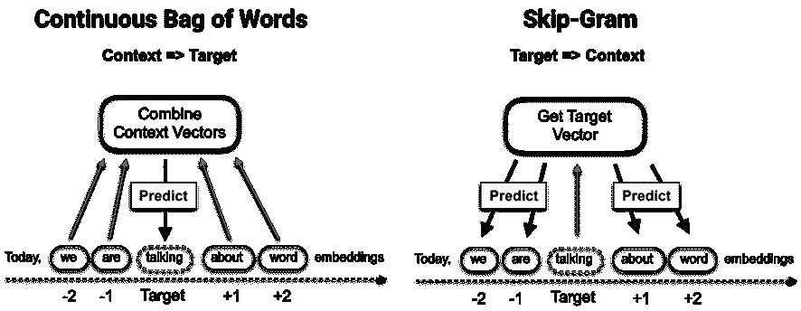

图 16.1：连续词袋与跳字处理逻辑

模型接收一个嵌入向量作为输入，并与另一个嵌入向量计算点积。请注意，假设向量已被规范化，则当向量相等时点积被最大化（绝对值），当它们正交时则被最小化。

在训练期间，**反向传播算法**根据基于分类错误的目标函数计算的损失调整嵌入权重。我们将在下一节中看到 word2vec 如何计算损失。

训练通过在文档上滑动**上下文窗口**进行，通常被分段为句子。对语料库的每次完整迭代称为一个**时代**。根据数据，可能需要几十个时代才能使向量质量收敛。

跳字模型隐式因式分解一个包含各个单词和上下文对的点间互信息的词-上下文矩阵（Levy 和 Goldberg，2014）。

### 模型目标 – 简化 softmax

Word2vec 模型旨在预测一个潜在非常庞大的词汇中的单个词。神经网络通常在最后一层使用 softmax 函数作为输出单元实现多类目标，因为它将任意数量的实值映射到相等数量的概率。softmax 函数定义如下，其中 *h* 指代嵌入，*v* 指代输入向量，*c* 是单词 *w* 的上下文：

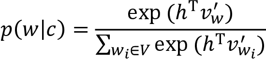

然而，由于 softmax 的复杂度与类别数量成比例，因为分母需要计算整个词汇表中所有单词的点积以标准化概率。Word2vec 通过使用 softmax 的修改版本或基于采样的逼近来提高效率：

+   **分层 softmax** 将词汇组织为具有单词作为叶节点的二叉树。到达每个节点的唯一路径可用于计算单词概率（Morin 和 Bengio，2005）。

+   **噪声对比估计**（**NCE**）对上下文之外的“噪声词”进行采样，并将多类任务近似为二元分类问题。随着样本数量的增加，NCE 导数逼近 softmax 梯度，但仅需 25 个样本即可获得与 softmax 相似的收敛速度增加 45 倍的收敛速度（Mnih 和 Kavukcuoglu，2013）。

+   **负采样**（**NEG**）省略了噪声词样本以近似 NCE，并直接最大化目标词的概率。因此，NEG 优化了嵌入向量的语义质量（相似用法的相似向量），而不是在测试集上的准确性。然而，与分层 softmax 目标（Mikolov 等人，2013 年）相比，它可能产生较少频繁词的较差表示。

### 自动化短语检测

预处理通常涉及短语检测，即识别通常一起使用并应该接收单个向量表示的标记（例如，纽约市；参见*第十三章*，*数据驱动的风险因素和无监督学习的资产配置*中的 n-gram 讨论）。

原始 word2vec 作者（Mikolov 等人，2013 年）使用一种简单的提升评分方法，如果两个词*w*[i]，*w*[j]的联合出现超过给定的阈值相对于每个词的个别出现，通过折扣因子*δ*进行校正，则将它们识别为一个二元组：

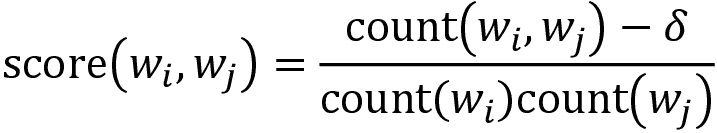

评分器可以反复应用以识别连续更长的短语。

另一种选择是标准化的逐点互信息分数，这更准确，但计算成本更高。它使用相对词频*P*(*w*)，在+1 和-1 之间变化：

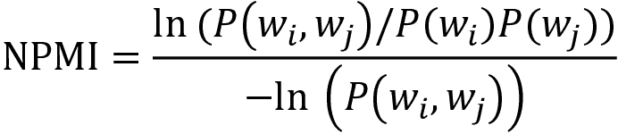

## 使用语义算术评估嵌入

词袋模型创建反映标记在文档中存在和相关性的文档向量。正如*第十五章*，*主题建模 - 总结财经新闻*中所讨论的那样，**潜在语义分析**减少了这些向量的维度，并在此过程中确定了可以解释为潜在概念的内容。**潜在狄利克雷分配**将文档和术语表示为包含潜在主题权重的向量。

word2vec 产生的单词和短语向量没有明确的含义。但是，**嵌入将类似的用法编码为模型创建的潜在空间中的接近**。嵌入还捕捉语义关系，以便通过添加和减去单词向量来表示类比。

*图 16.2*显示了从“巴黎”指向“法国”的向量（它测量它们嵌入向量之间的差异）如何反映“首都”的关系。伦敦与英国之间的类似关系对应于相同的向量：术语“英国”的嵌入非常接近通过将“首都”的向量添加到术语“伦敦”的嵌入中获得的位置：

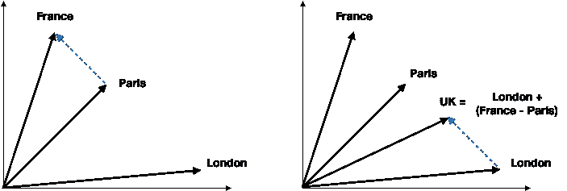

图 16.2：嵌入向量算术

正如单词可以在不同的上下文中使用一样，它们可以以不同的方式与其他单词相关联，而这些关系对应于潜在空间中的不同方向。因此，如果训练数据允许，嵌入应反映出几种类型的类比。

word2vec 的作者提供了一个包含 14 个类别的超过 25,000 个关系列表，涵盖地理、语法和句法以及家庭关系的方面，以评估嵌入向量的质量。正如前面的图表所示，该测试验证了目标词“UK”与添加代表类似关系“巴黎：法国”的向量到目标的补集“伦敦”之间的最近距离。

以下表格显示了示例数，并说明了一些类比类别。该测试检查* d *的嵌入距离* c +（b-a）*确定的位置有多接近。有关实现细节，请参阅`evaluating_embeddings`笔记本。

| 类别 | # 示例 | a | b | c | d |
| --- | --- | --- | --- | --- | --- |
| 首都-国家 | 506 | 雅典 | 希腊 | 巴格达 | 伊拉克 |
| 城市-州 | 4,242 | 芝加哥 | 伊利诺伊州 | 休斯顿 | 德克萨斯州 |
| 过去时 | 1,560 | 跳舞 | 跳舞 | 减少 | 减少 |
| 复数 | 1,332 | 香蕉 | 香蕉 | 鸟 | 鸟类 |
| 比较 | 1,332 | 坏 | 更坏 | 大 | 更大 |
| 相反 | 812 | 可接受 | 不可接受 | 察觉到 | 未察觉到 |
| 最高级 | 1,122 | 坏 | 最坏 | 大 | 最大 |
| 复数（动词） | 870 | 减少 | 减少 | 描述 | 描述 |
| 货币 | 866 | 阿尔及利亚 | 阿尔及利亚第纳尔 | 安哥拉 | 安哥拉宽扎 |
| 家庭 | 506 | 男孩 | 女孩 | 兄弟 | 姐妹 |

与其他无监督学习技术类似，学习嵌入向量的目标是为其他任务生成特征，例如文本分类或情感分析。有几种获得给定文档语料库的嵌入向量的选项：

+   使用从通用大语料库（如维基百科或 Google 新闻）学习的预训练嵌入

+   使用反映感兴趣领域的文档来训练您自己的模型

后续文本建模任务的内容越不通用和更专业化，第二种方法就越可取。然而，高质量的单词嵌入需要数据丰富的信息性文档，其中包含数亿字的单词。

首先，我们将看看如何使用预训练向量，然后演示如何使用金融新闻和 SEC 备案数据构建自己的 word2vec 模型的示例。

# 如何使用预训练单词向量

有几个预训练单词嵌入的来源。流行的选项包括斯坦福的 GloVE 和 spaCy 内置的向量（有关详细信息，请参阅`using_pretrained_vectors`笔记本）。在本节中，我们将重点放在 GloVe 上。

## GloVe – 用于单词表示的全局向量

GloVe（*全球单词表示向量*，Pennington、Socher 和 Manning，2014）是斯坦福 NLP 实验室开发的无监督算法，它从聚合的全局词-词共现统计中学习单词的向量表示（请参阅 GitHub 上链接的资源）。可用以下网络规模的预训练向量：

+   **Common Crawl**，包含 420 亿或 840 亿令牌和 190 万或 220 万令牌的词汇量

+   **维基百科** 2014 + Gigaword 5，拥有 60 亿个标记和 40 万个标记的词汇表

+   **Twitter** 使用了 20 亿条推文，27 亿个标记，以及一个包含 120 万个标记的词汇表。

我们可以使用 Gensim 将文本文件转换为向量，使用 `glove2word2vec` 然后将它们加载到 `KeyedVector` 对象中：

```py
from gensim.models import Word2Vec, KeyedVectors
from gensim.scripts.glove2word2vec import glove2word2vec
glove2word2vec(glove_input_file=glove_file, word2vec_output_file=w2v_file)
model = KeyedVectors.load_word2vec_format(w2v_file, binary=False) 
```

Gensim 使用了前面描述的 word2vec 类比测试，使用了作者提供的文本文件来评估词向量。为此，该库具有 `wv.accuracy` 函数，我们使用它传递类比文件的路径，指示词向量是否以二进制格式存储，以及是否要忽略大小写。我们还可以将词汇表限制为最常见的以加快测试速度。

```py
accuracy = model.wv.accuracy(analogies_path,
                             restrict_vocab=300000,
                             case_insensitive=True) 
```

在维基百科语料库上训练的词向量覆盖了所有类比，并在各类别之间存在一定的变化，总体准确率为 75.44%：

| 类别 | # 样本 | 准确度 |  | 类别 | # 样本 | 准确度 |
| --- | --- | --- | --- | --- | --- | --- |
| 国家首都 | 506 | 94.86% |  | 比较级 | 1,332 | 88.21% |
| 非洲和南美洲首都 | 8,372 | 96.46% |  | 对立词 | 756 | 28.57% |
| 城市-州份 | 4,242 | 60.00% |  | 最高级 | 1,056 | 74.62% |
| 货币 | 752 | 17.42% |  | 现在分词 | 1,056 | 69.98% |
| 家庭 | 506 | 88.14% |  | 过去时 | 1,560 | 61.15% |
| 国籍 | 1,640 | 92.50% |  | 复数 | 1,332 | 78.08% |
| 形容词-副词 | 992 | 22.58% |  | 复数动词 | 870 | 58.51% |

*图 16.3* 比较了三种 GloVe 源在 10 万个最常见标记上的性能。它显示了 Common Crawl 向量的准确度略高，达到了 78%，覆盖了约 80% 的类比。而 Twitter 向量的覆盖率仅为 25%，准确度为 56.4%。

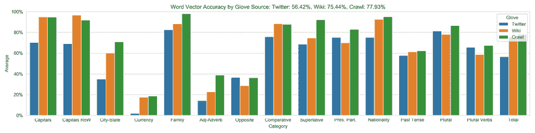

图 16.3: GloVe 在 word2vec 类比上的准确度

*图 16.4* 将在维基百科语料库上训练的 word2vec 模型的 300 维嵌入投影到两个维度上使用 PCA，测试了来自以下类别的 24,400 个以上的类比，准确率超过 73.5%：

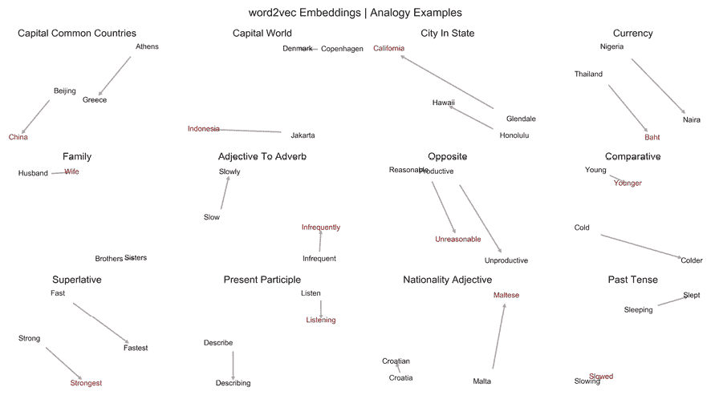

图 16.4: 选定类比嵌入的二维可视化

# 自定义金融新闻嵌入

许多任务需要领域特定词汇的嵌入，而预训练于通用语料库的模型可能无法捕捉到这些词汇。标准的 word2vec 模型无法为词汇表中不存在的词汇分配向量，而是使用一个默认向量，降低了它们的预测价值。

例如，在处理**行业特定文件**时，词汇表或其用法可能随着新技术或产品的出现而发生变化。因此，嵌入也需要相应地演变。此外，像公司收益发布这样的文件使用了细微的语言，预训练于维基百科文章的 GloVe 向量可能无法正确反映这些语言特点。

在本节中，我们将使用金融新闻训练和评估领域特定的嵌入。我们首先展示了如何为这项任务预处理数据，然后演示了第一节中概述的 skip-gram 架构的工作原理，并最终可视化结果。我们还将介绍替代的更快的训练方法。

## 预处理 - 句子检测和 n-gram

为了说明 word2vec 网络架构，我们将使用包含超过 12 万 5 千篇相关文章的金融新闻数据集，该数据集我们在第十五章 *主题建模 - 总结金融新闻* 中介绍了。我们将按照该章节中的 `lda_financial_news.ipynb` 笔记本中概述的方式加载数据。`financial_news_preprocessing.ipynb` 笔记本包含了本节的代码示例。

我们使用 spaCy 内置的**句子边界检测**来将每篇文章分割成句子，去除较少信息的项目，例如数字和标点符号，并保留结果（如果长度在 6 到 99 个标记之间）：

```py
def clean_doc(d):
    doc = []
    for sent in d.sents:
        s = [t.text.lower() for t in sent if not
        any([t.is_digit, not t.is_alpha, t.is_punct, t.is_space])]
        if len(s) > 5 or len(sent) < 100:
            doc.append(' '.join(s))
    return doc
nlp = English()
sentencizer = nlp.create_pipe("sentencizer")
nlp.add_pipe(sentencizer)
clean_articles = []
iter_articles = (article for article in articles)
for i, doc in enumerate(nlp.pipe(iter_articles, batch_size=100, n_process=8), 1):
    clean_articles.extend(clean_doc(doc)) 
```

我们最终得到了 243 万个句子，平均每个句子包含 15 个标记。

接下来，我们创建 n-gram 来捕捉复合术语。 Gensim 允许我们根据组件的联合与个别出现的相对频率来识别 n-gram。`Phrases` 模块对标记进行评分，并且 `Phraser` 类相应地转换文本数据。

它将我们的句子列表转换为一个新的数据集，我们可以按如下方式写入文件：

```py
sentences = LineSentence((data_path / f'articles_clean.txt').as_posix())
phrases = Phrases(sentences=sentences,
                          min_count=10,  # ignore terms with a lower count
                          threshold=0.5,  # only phrases with higher score
                          delimiter=b'_',  # how to join ngram tokens
                          scoring='npmi')  # alternative: default
grams = Phraser(phrases)
sentences = grams[sentences]
with (data_path / f'articles_ngrams.txt').open('w') as f:
        for sentence in sentences:
            f.write(' '.join(sentence) + '\n') 
```

该笔记本演示了如何使用 2-gram 文件作为输入来重复此过程以创建 3-gram。我们最终得到了大约 2 万 5 千个 2-gram 和 1 万 5 千个 3-或 4-gram。检查结果显示，得分最高的术语是公司或个人的名称，这表明我们可能需要加强我们的初始清洁标准。有关数据集的其他详细信息，请参阅笔记本。

## TensorFlow 2 中的 skip-gram 架构

在本节中，我们将演示如何使用 TensorFlow 2 的 Keras 接口构建一个 word2vec 模型，我们将在下一章中更详细地介绍。`financial_news_word2vec_tensorflow` 笔记本包含了代码示例和其他实现细节。

我们首先对文档进行标记化，并为词汇表中的每个项目分配唯一的 ID。首先，我们从上一节创建的句子中抽样一部分来限制训练时间：

```py
SAMPLE_SIZE=.5
sentences = file_path.read_text().split('\n')
words = ' '.join(np.random.choice(sentences, size=int(SAMLE_SIZE* l en(sentences)), replace=False)).split() 
```

我们需要至少 10 次出现在语料库中，保留包含 31,300 个标记的词汇表，并从以下步骤开始：

1.  提取前 *n* 个最常见的单词以学习嵌入。

1.  使用唯一整数索引这些 *n* 个单词。

1.  创建一个 `{index: word}` 字典。

1.  用它们的索引替换 *n* 个词，并在其他地方使用虚拟值 `'UNK'`：

    ```py
    # Get (token, count) tuples for tokens meeting MIN_FREQ
    MIN_FREQ = 10
    token_counts = [t for t in Counter(words).most_common() if t[1] >= MIN_FREQ]
    tokens, counts = list(zip(*token_counts))
    # create id-token dicts & reverse dicts
    id_to_token = pd.Series(tokens, index=range(1, len(tokens) + 1)).to_dict()
    id_to_token.update({0: 'UNK'})
    token_to_id = {t:i for i, t in id_to_token.items()}
    data = [token_to_id.get(word, 0) for word in words] 
    ```

我们最终得到了 1740 万个标记和接近 6 万个标记的词汇表，包括长达 3 个词的组合。词汇表涵盖了大约 72.5% 的类比。

### 噪声对比估计 - 创建验证样本

Keras 包括一个 `make_sampling_table` 方法，允许我们创建一个训练集，其中包含上下文和噪声词的一对对应标记，根据它们的语料库频率进行采样。较低的因子会增加选择不常见词汇的概率；笔记本中的图表显示，0.1 的值将采样限制在前 10,000 个标记：

```py
SAMPLING_FACTOR =  1e-4
sampling_table = make_sampling_table(vocab_size,
                                     sampling_factor=SAMPLING_FACTOR) 
```

### 生成目标-上下文词对

要训练我们的模型，我们需要一对一对的标记，其中一个代表目标，另一个从周围上下文窗口中选择，如之前在 *图 16.1* 的右侧面板中所示。我们可以使用 Keras 的 `skipgrams()` 函数如下所示：

```py
pairs, labels = skipgrams(sequence=data,
                          vocabulary_size=vocab_size,
                          window_size=WINDOW_SIZE,
                          sampling_table=sampling_table,
                          negative_samples=1.0,
                          shuffle=True) 
```

结果是 1.204 亿个上下文-目标对，正负样本均匀分布。负样本是根据我们在前一步中创建的 `sampling_table` 概率生成的。前五个目标和上下文词 ID 与它们匹配的标签如下所示：

```py
pd.DataFrame({'target': target_word[:5],
              'context': context_word[:5],
              'label': labels[:5]})
   target context label
0   30867    2117     1
1     196     359     1
2   17960   32467     0
3     314    1721     1
4   28387    7811     0 
```

### 创建 word2vec 模型层

word2vec 模型包括以下内容：

+   一个接收表示目标-上下文对的两个标量值的输入层

+   一个共享的嵌入层，计算目标和上下文词的向量的点积

+   一个 sigmoid 输出层

**输入层** 有两个组件，一个用于目标-上下文对的每个元素：

```py
input_target = Input((1,), name='target_input')
input_context = Input((1,), name='context_input') 
```

**共享的嵌入层** 包含一个向量，每个词汇元素根据目标和上下文标记的索引进行选择：

```py
embedding = Embedding(input_dim=vocab_size,
                      output_dim=EMBEDDING_SIZE,
                      input_length=1,
                      name='embedding_layer')
target = embedding(input_target)
target = Reshape((EMBEDDING_SIZE, 1), name='target_embedding')(target)
context = embedding(input_context)
context = Reshape((EMBEDDING_SIZE, 1), name='context_embedding')(context) 
```

**输出层** 通过它们的点积测量两个嵌入向量的相似性，并使用 `sigmoid` 函数转换结果，我们在 *第七章，线性模型——从风险因素到收益预测* 中讨论逻辑回归时遇到过这个函数：

```py
# similarity measure
dot_product = Dot(axes=1)([target, context])
dot_product = Reshape((1,), name='similarity')(dot_product)
output = Dense(units=1, activation='sigmoid', name='output')(dot_product) 
```

这个 skip-gram 模型包含一个 200 维的嵌入层，每个词汇项都将假设不同的值。结果是，我们得到了 59,617 x 200 个可训练参数，再加上两个用于 sigmoid 输出的参数。

在每次迭代中，模型计算上下文和目标嵌入向量的点积，将结果通过 sigmoid 传递以产生概率，并根据损失的梯度调整嵌入。

## 使用 TensorBoard 可视化嵌入

TensorBoard 是一个可视化工具，允许将嵌入向量投影到二维或三维空间中，以探索单词和短语的位置。在加载我们创建的嵌入元数据文件后（参考笔记本），您还可以搜索特定术语以查看并探索其邻居，使用 UMAP、t-SNE 或 PCA 将其投影到二维或三维空间中（参见 *第十三章，使用无监督学习进行数据驱动的风险因素和资产配置*）。有关以下截图的更高分辨率彩色版本，请参考笔记本：

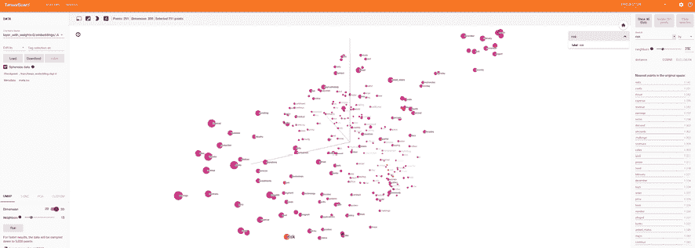

图 16.5：3D 嵌入和元数据可视化

## 如何使用 Gensim 更快地训练嵌入

TensorFlow 的实现在其体系结构方面非常透明，但速度不是特别快。自然语言处理（NLP）库 Gensim，我们在上一章中也用于主题建模，提供了更好的性能，并且更接近原始作者提供的基于 C 的 word2vec 实现。

使用非常简单。我们首先创建一个句子生成器，它只需将我们在预处理步骤中生成的文件名作为输入（我们将再次使用 3-grams）：

```py
sentence_path = data_path / FILE_NAME
sentences = LineSentence(str(sentence_path)) 
```

在第二步中，我们配置 word2vec 模型，使用熟悉的参数，涉及嵌入向量和上下文窗口的大小，最小标记频率以及负样本数量等：

```py
model = Word2Vec(sentences,
                 sg=1, # set to 1 for skip-gram; CBOW otherwise
                 size=300,
                 window=5,
                 min_count=20,
                 negative=15,
                 workers=8,
                 iter=EPOCHS,
                 alpha=0.05) 
```

在现代 4 核 i7 处理器上，一次训练大约需要 2 分钟。

我们可以持久化模型和词向量，或仅持久化词向量，如下所示：

```py
# persist model
model.save(str(gensim_path / 'word2vec.model'))
# persist word vectors
model.wv.save(str(gensim_path / 'word_vectors.bin')) 
```

我们可以验证模型性能，并继续训练，直到对结果满意为止：

```py
model.train(sentences, epochs=1, total_examples=model.corpus_count) 
```

在这种情况下，再训练六个额外的周期会产生最佳结果，所有涵盖词汇表的类比的准确率为 41.75％。*图 16.6*的左侧面板显示了正确/错误的预测和每个类别的准确度分布。

Gensim 还允许我们评估自定义语义代数。我们可以检查流行的`"woman"+"king"-"man" ~ "queen"`示例如下：

```py
most_sim = best_model.wv.most_similar(positive=['woman', 'king'], negative=['man'], topn=10) 
```

图中的右侧面板显示，“queen”是第三个标记，紧随“monarch”和不太明显的“lewis”之后，然后是几个王室成员：

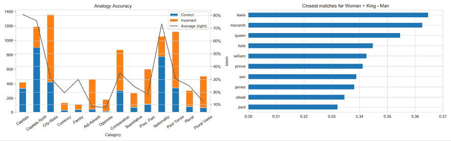

图 16.6：类别和特定示例的类比准确度

我们还可以评估与给定目标最相似的标记，以更好地理解嵌入特征。我们基于对数语料库频率进行随机选择：

```py
counter = Counter(sentence_path.read_text().split())
most_common = pd.DataFrame(counter.most_common(), columns=['token', 'count'])
most_common['p'] = np.log(most_common['count'])/np.log(most_common['count']).sum()similars = pd.DataFrame()
for token in np.random.choice(most_common.token, size=10, p=most_common.p):
    similars[token] = [s[0] for s in best_model.wv.most_similar(token)] 
```

下表举例说明了包含多个 n-gram 的结果：

| 目标 | 最接近的匹配 |
| --- | --- |
| 0 | 1 | 2 | 3 | 4 |
| 档案 | 概要 | 用户 | 政治顾问剑桥分析 | 复杂 | Facebook |
| 减持 | 转让 | 收购 | 接管 | 拜耳 | 合并 |
| 就绪性 | 训练 | 军事 | 指挥 | 空军 | 准备 |
| 军火库 | 核武器 | 俄罗斯 | 弹道导弹 | 武器 | 黎巴嫩真主党 |
| 供应中断 | 中断 | 原材料 | 中断 | 价格 | 下降 |

我们现在将继续开发一个与实际交易更密切相关的应用程序，使用 SEC 文件。

# 用于利用 SEC 文件进行交易的 word2vec

在本节中，我们将使用 Gensim 从年度 SEC 文件中学习单词和短语向量，以说明词嵌入对算法交易的潜在价值。在接下来的章节中，我们将将这些向量与价格回报结合为特征，训练神经网络从安全文件的内容中预测股票价格。

具体来说，我们将使用一个包含来自**2013-2016 年间的超过 22,000 份 10-K 年度报告**的数据集，这些报告由超过 6,500 家上市公司提交，并包含财务信息和管理评论（请参阅*第二章*，*市场和基本数据-来源和技术*）。

对应于 11,000 份备案的大约 3,000 家公司，我们有股价数据来标记用于预测建模的数据。（在`sec-filings`文件夹中的`sec_preprocessing`笔记本中查看数据源详细信息和下载说明以及预处理代码示例。）

## 预处理-句子检测和 n-grams

每个备案都是一个单独的文本文件，主索引包含备案元数据。我们提取了最具信息量的部分，即：

+   项目 1 和 1A：业务和风险因素

+   项目 7：管理层讨论

+   项目 7a：关于市场风险的披露

`sec_preprocessing`笔记本展示了如何使用 spaCy 解析和标记文本，类似于*第十四章*中的方法。我们不对标记进行词形还原，以保留单词用法的细微差别。

### 自动短语检测

与前一节一样，我们使用 Gensim 来检测由多个标记组成的短语，或 n-grams。笔记本显示，最常见的二元组包括`common_stock`，`united_states`，`cash_flows`，`real_estate`和`interest_rates`。

我们最终得到了一个词汇表，其中包含略多于 201,000 个标记，中位数频率为 7，表明我们可以通过增加训练 word2vec 模型时的最小频率来消除相当大的噪音。

### 使用回报标记备案以预测盈利惊喜

数据集附带了与这 10,000 个文件相关的股票代码和备案日期的列表。我们可以利用这些信息选择围绕备案发布期间的某一时期的股价。目标是训练一个使用给定备案的词向量作为输入来预测备案后回报的模型。

下面的代码示例显示了如何使用 1 个月的回报来标记单个备案：

```py
with pd.HDFStore(DATA_FOLDER / 'assets.h5') as store:
    prices = store['quandl/wiki/prices'].adj_close
sec = pd.read_csv('sec_path/filing_index.csv').rename(columns=str.lower)
sec.date_filed = pd.to_datetime(sec.date_filed)
sec = sec.loc[sec.ticker.isin(prices.columns), ['ticker', 'date_filed']]
price_data = []
for ticker, date in sec.values.tolist():
    target = date + relativedelta(months=1)
    s = prices.loc[date: target, ticker]
    price_data.append(s.iloc[-1] / s.iloc[0] - 1)
df = pd.DataFrame(price_data,
                  columns=['returns'],
                  index=sec.index) 
```

当我们在接下来的章节中使用深度学习架构时，我们将回到这一点。

## 模型训练

`gensim.models.word2vec`类实现了先前介绍的 skip-gram 和 CBOW 架构。笔记本`word2vec`包含了额外的实现细节。

为了促进内存高效的文本摄取，`LineSentence`类从提供的文本文件中创建一个包含在单个句子中的生成器：

```py
sentence_path = Path('data', 'ngrams', f'ngrams_2.txt')
sentences = LineSentence(sentence_path) 
```

`Word2Vec`类提供了本章中介绍的配置选项：

```py
model = Word2Vec(sentences,
                 sg=1,          # 1=skip-gram; otherwise CBOW
                 hs=0,          # hier. softmax if 1, neg. sampling if 0
                 size=300,      # Vector dimensionality
                 window=3,      # Max dist. btw target and context word
                 min_count=50,  # Ignore words with lower frequency
                 negative=10,   # noise word count for negative sampling
                 workers=8,     # no threads
                 iter=1,        # no epochs = iterations over corpus
                 alpha=0.025,   # initial learning rate
                 min_alpha=0.0001 # final learning rate
                ) 
```

笔记本显示了如何持久保存和重新加载模型以继续训练，或者如何单独存储嵌入向量，例如用于机器学习模型中。

### 模型评估

基本功能包括识别相似的单词：

```py
sims=model.wv.most_similar(positive=['iphone'], restrict_vocab=15000)
                  term   similarity
0                 ipad    0.795460
1              android    0.694014
2           smartphone    0.665732 
```

我们还可以根据正面和负面的贡献来验证单个类比：

```py
model.wv.most_similar(positive=['france', 'london'],
                      negative=['paris'],
                      restrict_vocab=15000)
             term  similarity
0  united_kingdom    0.606630
1         germany    0.585644
2     netherlands    0.578868 
```

### 参数设置的性能影响

我们可以使用类比来评估不同参数设置的影响。以下结果非常突出（请参阅`models`文件夹中的详细结果）：

+   负采样优于分层 softmax，同时训练速度更快。

+   skip-gram 架构优于 CBOW。

+   不同的`min_count`设置影响较小；中间值 50 的性能最佳。

使用负采样和`min_count`为 50 的性能最佳的 skip-gram 模型进行进一步实验，结果如下：

+   小于 5 的上下文窗口减少了性能。

+   更高的负采样率提高了性能，但训练速度较慢。

+   更大的向量提高了性能，大小为 600 的向量在 38.5%的准确率时表现最佳。

# 使用 doc2vec 嵌入进行情感分析

文本分类需要组合多个单词嵌入。常见方法是对文档中每个单词的嵌入向量进行平均。这使用了所有嵌入的信息，并有效地使用向量加法到达嵌入空间中的不同位置。然而，有关单词顺序的相关信息丢失了。

相反，由 word2vec 作者在发布其原始贡献后不久开发的文档嵌入模型 doc2vec 直接为文本片段（如段落或产品评论）生成嵌入。与 word2vec 类似，doc2vec 也有两种变体：

+   **分布式词袋**（**DBOW**）模型对应于 word2vec 的 CBOW 模型。文档向量是通过训练网络来预测目标词，该网络基于上下文单词向量和文档的文档向量的合成任务。

+   **分布式记忆**（**DM**）模型对应于 word2vec 的 skip-gram 架构。文档向量是通过训练神经网络使用整个文档的文档向量来预测目标词而产生的。

Gensim 的`Doc2Vec`类实现了这个算法。我们将通过将其应用于我们在*第十四章*中介绍的 Yelp 情感数据集来说明 doc2vec 的用法。为了加快训练速度，我们将数据限制为具有相关星级评分的 50 万 Yelp 评论的分层随机样本。`doc2vec_yelp_sentiment`笔记本包含了本节的代码示例。

## 从 Yelp 情感数据创建 doc2vec 输入

我们加载了包含 600 万条评论的合并 Yelp 数据集，如*第十四章*，*用于交易的文本数据-情感分析*中所创建的，并对每个星级评分的评论进行了 10 万次采样：

```py
df = pd.read_parquet('data_path / 'user_reviews.parquet').loc[:, ['stars', 
                                                                  'text']]
stars = range(1, 6)
sample = pd.concat([df[df.stars==s].sample(n=100000) for s in stars]) 
```

我们使用 nltk 的`RegexpTokenizer`进行简单快速的文本清洗：

```py
tokenizer = RegexpTokenizer(r'\w+')
stopword_set = set(stopwords.words('english'))
def clean(review):
    tokens = tokenizer.tokenize(review)
    return ' '.join([t for t in tokens if t not in stopword_set])
sample.text = sample.text.str.lower().apply(clean) 
```

在我们过滤掉长度小于 10 个标记的评论后，我们还剩下 485,825 个样本。*图 16.6*的左面板显示了每个评论的标记数量的分布。

`gensim.models.Doc2Vec`类以`TaggedDocument`格式处理文档，其中包含标记化的文档以及一个唯一的标记，允许在训练后访问文档向量：

```py
sample = pd.read_parquet('yelp_sample.parquet')
sentences = []
for i, (stars, text) in df.iterrows():
    sentences.append(TaggedDocument(words=text.split(), tags=[i])) 
```

## 训练 doc2vec 模型

训练界面的工作方式与 word2vec 类似，并且还允许持续训练和持久化：

```py
model = Doc2Vec(documents=sentences,
                dm=1,           # 1=distributed memory, 0=dist.BOW
                epochs=5,
                size=300,       # vector size
                window=5,       # max. distance betw. target and context
                min_count=50,   # ignore tokens w. lower frequency
                negative=5,     # negative training samples
                dm_concat=0,    # 1=concatenate vectors, 0=sum
                dbow_words=0,   # 1=train word vectors as well
                workers=4)
model.save((results_path / 'sample.model').as_posix()) 
```

我们可以查询 *n* 个与给定标记最相似的术语作为评估生成的单词向量的一种快速方法如下：

```py
model.most_similar('good') 
```

*图 16.7* 的右侧面板显示了返回的标记及其相似性：

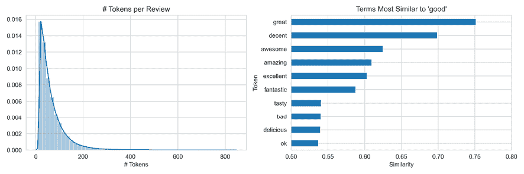

图 16.7：每个评论中标记数量的直方图（左）和与标记 'good' 最相似的术语

## 使用文档向量训练分类器

现在，我们可以访问文档向量以为情感分类器创建特征：

```py
y = sample.stars.sub(1)
X = np.zeros(shape=(len(y), size)) # size=300
for i in range(len(sample)):
    X[i] = model.docvecs[i]
X.shape
(485825, 300) 
```

我们像往常一样创建训练集和测试集：

```py
X_train, X_test, y_train, y_test = train_test_split(X, y,
                                                    test_size=0.2,
                                                    random_state=42,
                                                    stratify=y) 
```

现在，我们继续训练一个 `RandomForestClassifier`，一个 LightGBM 梯度提升模型和一个多项逻辑回归。我们对随机森林使用了 500 棵树：

```py
rf = RandomForestClassifier(n_jobs=-1, n_estimators=500)
rf.fit(X_train, y_train)
rf_pred = rf.predict(X_test) 
```

我们使用了 LightGBM 分类器的提前停止，但它运行了完整的 5000 轮因为它持续提高了验证性能：

```py
train_data = lgb.Dataset(data=X_train, label=y_train)
test_data = train_data.create_valid(X_test, label=y_test)
params = {'objective': 'multiclass',
          'num_classes': 5}
lgb_model = lgb.train(params=params,
                      train_set=train_data,
                      num_boost_round=5000,
                      valid_sets=[train_data, test_data],
                      early_stopping_rounds=25,
                      verbose_eval=50)
# generate multiclass predictions
lgb_pred = np.argmax(lgb_model.predict(X_test), axis=1) 
```

最后，我们建立了一个多项逻辑回归模型如下：

```py
lr = LogisticRegression(multi_class='multinomial', solver='lbfgs',
                        class_weight='balanced')
lr.fit(X_train, y_train)
lr_pred = lr.predict(X_test) 
```

当我们计算每个模型在验证集上的准确性时，梯度提升表现明显更好，达到 62.24%。*图 16.8* 显示了每个模型的混淆矩阵和准确性：

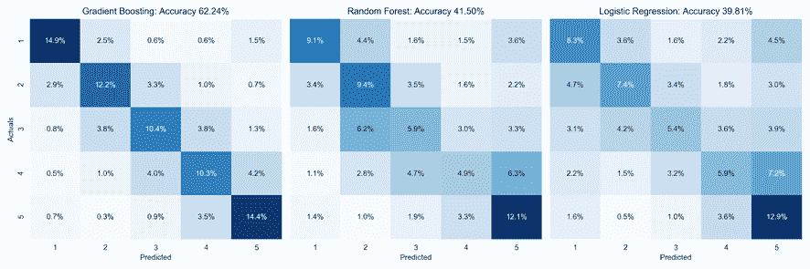

图 16.8：备选模型的混淆矩阵和测试准确性

在 *第十四章* *交易文本数据 - 情感分析* 中，情感分类的结果为 LightGBM 提供了更好的准确性（73.6%），但我们使用了完整的数据集并包含了额外的特征。您可能想要测试增加样本量或调整模型参数是否使 doc2vec 的性能同样良好。

## 学到的教训和下一步

此示例应用情感分析使用了 doc2vec 来处理**产品评论而不是财务文件**。我们选择产品评论是因为很难找到足够大的用于从头开始训练单词嵌入并且还具有有用的情感标签或足够信息让我们分配这些标签，例如资产回报等的财务文本数据。

虽然产品评论可以帮助我们展示工作流程，但我们需要记住**重要的结构差异**：产品评论通常较短、非正式，并且针对一个特定对象。相比之下，许多财务文件更长、更正式，目标对象可能明确标识也可能不明确。财务新闻文章可能涉及多个目标，而企业披露可能有明确的来源，也可能讨论竞争对手。例如，分析师报告也可能同时讨论同一对象或主题的积极和消极方面。

简而言之，财务文件中表达的情感的解释通常需要更复杂、更细致、更细粒度的方法，从不同方面建立对内容含义的理解。决策者通常也关心模型是如何得出结论的。

这些挑战尚未解决，仍然是非常活跃的研究领域，其中最大的困难之一是适合的数据源的稀缺性。然而，自 2018 年以来显著提高了各种 NLP 任务性能的最新突破表明，金融情感分析在未来几年也可能变得更加健壮。我们将在接下来转向这些创新。

# 新的前沿 – 预训练的变压器模型

Word2vec 和 GloVe 嵌入捕捉到比词袋方法更多的语义信息。但是，它们只允许每个令牌有一个固定长度的表示，不区分上下文特定的用法。为了解决诸如同一个词的多重含义（称为**多义性**）等未解决的问题，出现了几种新模型，这些模型建立在旨在学习更多上下文化单词嵌入的**注意力机制**上（Vaswani 等，2017）。这些模型的关键特征如下：

+   使用**双向语言模型**同时处理文本的左到右和右到左以获得更丰富的上下文表示

+   使用**半监督预训练**在大型通用语料库上学习通用语言方面的嵌入和网络权重，这些可以用于特定任务的微调（一种我们将在*第十八章*，*用于金融时间序列和卫星图像的 CNNs*中更详细讨论的**迁移学习**形式）

在本节中，我们简要描述了注意力机制，概述了最近的变压器模型——从**变压器中的双向编码器表示**（**BERT**）开始——如何利用它来提高关键 NLP 任务的性能，引用了几个预训练语言模型的来源，并解释了如何将它们用于金融情感分析。

## 注意力是你所需要的一切

**注意力机制**明确地建模了句子中单词之间的关系，以更好地整合上下文。它最初被应用于机器翻译（Bahdanau，Cho 和 Bengio，2016），但此后已成为各种任务的神经语言模型的核心组成部分。

直到 2017 年，**循环神经网络**（**RNNs**），它们按顺序从左到右或从右到左处理文本，代表了自然语言处理任务（如翻译）的最新技术。例如，谷歌自 2016 年末起在生产中就采用了这样的模型。顺序处理意味着需要多个步骤来语义连接远距离位置的单词，并且排除了并行处理，而这在现代专用硬件（如 GPU）上会大大加速计算。（关于 RNNs 的更多信息，请参阅*第十九章*，*多元时间序列和情感分析的 RNNs*。）

相比之下，**Transformer** 模型，由开创性论文 *Attention is all you need*（Vaswani 等人，2017）引入，只需一个恒定数量的步骤来识别语义相关的单词。它依赖于一种自注意力机制，可以捕捉句子中所有单词之间的联系，而不考虑它们的相对位置。该模型通过给每个句子中的其他单词分配一个注意力分数来学习单词的表示，该分数决定其他单词应该对表示的贡献程度。然后，这些分数将指导所有单词表示的加权平均值，输入到一个全连接网络中，以生成目标单词的新表示。

Transformer 模型采用了一种编码器-解码器的架构，其中包括多个层，每个层并行使用了多个注意力机制（称为**头部**）。它在各种翻译任务上取得了巨大的性能提升，并且更重要的是，激发了一波新的研究，致力于神经语言模型解决更广泛范围的任务。在 GitHub 上链接的资源中包含了关于注意力机制如何工作的各种优秀视觉解释，所以我们在这里不会详细介绍。

## BERT – 迈向更普适的语言模型

2018 年，Google 发布了 **BERT** 模型，全称为 **Bidirectional Encoder Representations from Transformers**（Devlin 等人，2019）。对于自然语言理解任务，它在十一项任务上取得了突破性的成果，从问答和命名实体识别到释义和情感分析，都得到了 **通用语言理解评估**（**GLUE**）基准的衡量（请参考 GitHub 获取任务描述和排行榜链接）。

BERT 引入的新思想引发了一系列新的研究，产生了数十项超越非专业人员的改进，很快超过了由 DeepMind 设计的更具挑战性的 **SuperGLUE** 基准（Wang 等人，2019）。因此，2018 年现在被认为是自然语言处理研究的一个转折点；现在，Google 搜索和微软的必应都在使用 BERT 的变体来解释用户查询并提供更准确的结果。

我们将简要概述 BERT 的关键创新，并提供如何开始使用它及其后续增强版的指示，其中包括几个提供预训练模型的开源库。

### 关键创新 – 更深的注意力和预训练

BERT 模型基于 **两个关键思想**，即前一节中描述的 **transformer 架构** 和 **无监督预训练**，这样它就不需要为每个新任务从头开始训练；相反，它的权重被微调：

+   BERT 通过使用 12 或 24 层（取决于架构），每层有 12 或 16 个注意头，将**注意机制**提升到一个新的（更深）水平。这导致最多 24 × 16 = 384 个注意机制来学习特定于上下文的嵌入。

+   BERT 使用**无监督的、双向的预训练**来提前在两个任务上学习其权重：**遮盖语言建模**（在左右上下文中给出缺失的单词）和**下一句预测**（预测一句话是否跟在另一句话后面）。

**无上下文**模型（如 word2vec 或 GloVe）为词汇表中的每个单词生成一个单一的嵌入：单词“bank”在“bank account”和“river bank”中具有相同的无上下文表示。相比之下，BERT 学习根据句子中的其他单词来表示每个单词。作为**双向模型**，BERT 能够表示句子“I accessed the bank account”中的单词“bank”，不仅基于“我访问了”作为单向上下文模型，还基于“account”。

BERT 及其后继版本可以**在通用语料库**（如维基百科）上进行预训练，然后调整其最终层以适应特定任务，并**微调其权重**。因此，您可以使用具有数十亿参数的大规模、最先进的模型，而只需支付几个小时而不是几天或几周的培训成本。几个库提供了这样的预训练模型，您可以构建一个定制的情感分类器，以适应您选择的数据集。

### 使用预训练的最先进模型

本节描述的最新 NLP 突破展示了如何利用足够大的网络从未标记的文本中获取语言知识，这些 Transformer 体系结构减少了对单词顺序和上下文的假设；相反，它们从大量数据中学习语言的更微妙的理解，使用数亿甚至数十亿的参数。

我们将重点介绍几个使预训练网络和优秀的 Python 教程可用的库。

#### Hugging Face Transformers 库

Hugging Face 是一家美国初创公司，开发旨在提供个性化 AI 驱动通信的聊天机器人应用。2019 年底，该公司筹集了 1500 万美元，以进一步开发其非常成功的开源 NLP 库 Transformers。

该库提供了用于自然语言理解和生成的通用架构，拥有超过 32 个预训练模型，涵盖 100 多种语言，并在 TensorFlow 2 和 PyTorch 之间具有深层的互操作性。它有很好的文档。

spacy-transformers 库包含了用于在 spaCy 管道中方便地包含预训练变换器模型的包装器。有关更多信息，请参阅 GitHub 上的参考链接。

#### AllenNLP

AllenNLP 由微软联合创始人保罗·艾伦创建并维护，与华盛顿大学的研究人员密切合作。它被设计为一个用于在各种语言任务上开发最先进深度学习模型的研究库，基于 PyTorch 构建。

它提供了从问答到句子标注等关键任务的解决方案，包括阅读理解、命名实体识别和情感分析。预训练的**RoBERTa**模型（BERT 的更强大版本；Liu 等，2019 年）在斯坦福情感树库上实现了超过 95%的准确率，并且只需几行代码即可使用（参见 GitHub 上的文档链接）。

## 交易文本数据——经验教训与下一步计划

正如在“使用 doc2vec 嵌入进行情感分析”一节末尾所强调的那样，金融文件存在重要的结构特征，这些特征通常会使其解释变得复杂，并削弱基于简单词典的方法。

在最近一项金融情感分析调查中，Man、Luo 和 Lin（2019 年）发现，大多数现有方法只能识别高级极性，如积极、消极或中性。然而，导致实际决策的实际应用通常需要更细致和透明的分析。此外，缺乏具有相关标签的大型金融文本数据集限制了使用传统机器学习方法或神经网络进行情感分析的潜力。

刚才描述的预训练方法，原则上能够更深入地理解文本信息，因此具有相当大的潜力。然而，使用变换器进行的大多数应用研究都集中在诸如翻译、问答、逻辑或对话系统等自然语言处理任务上。与金融数据相关的应用仍处于初级阶段（例如，参见 Araci 2019）。考虑到预训练模型的可用性以及它们从金融文本数据中提取更有价值信息的潜力，这种情况可能很快就会改变。

# 总结

在本章中，我们讨论了一种利用浅层神经网络进行无监督机器学习的新型生成文本特征的方法。我们看到了由此产生的词嵌入如何捕捉到一些有趣的语义方面，超越了单个标记的含义，捕捉到了它们被使用的一些上下文。我们还介绍了如何使用类比和线性代数评估单词向量的质量。

我们使用 Keras 构建了生成这些特征的网络架构，并将更高性能的 Gensim 实现应用于金融新闻和美国证券交易委员会的备案文件。尽管数据集相对较小，但 word2vec 嵌入确实捕捉到了有意义的关系。我们还展示了如何通过股价数据进行适当标记，从而形成监督学习的基础。

我们应用了 doc2vec 算法，该算法生成的是文档而不是令牌向量，以构建基于 Yelp 商业评论的情感分类器。虽然这不太可能产生可交易的信号，但它说明了如何从相关文本数据中提取特征并训练模型来预测可能对交易策略有信息意义的结果的过程。

最后，我们概述了最近的研究突破，承诺通过可预先训练的架构的可用性来产生更强大的自然语言模型，这些模型仅需要微调即可。然而，对金融数据的应用仍处于研究前沿。

在下一章中，我们将深入探讨本书的最后部分，该部分涵盖了各种深度学习架构如何对算法交易有用。
