# 第十七章：17

# 交易的深度学习

本章开启了第四部分，涵盖了几种**深度学习**（**DL**）建模技术如何对投资和交易有用。DL 已经在许多领域取得了许多**突破**，从图像和语音识别到机器人和智能代理，引起了广泛关注，并重振了对**人工智能**（**AI**）的大规模研究。人们对快速发展有着很高的期望，并且预计将会出现更多解决困难实际问题的解决方案。

在本章中，我们将介绍**前馈神经网络**，以介绍与后续章节中涵盖的各种 DL 架构相关的神经网络工作要素。具体来说，我们将演示如何使用**反向传播算法**高效训练大型模型，并管理过拟合的风险。我们还将展示如何使用流行的 TensorFlow 2 和 PyTorch 框架，这些框架将贯穿第四部分。

最后，我们将基于由深度前馈神经网络生成的信号开发、回测和评估交易策略。我们将设计和调整神经网络，并分析关键超参数选择如何影响其性能。

总之，在阅读本章并审阅随附的笔记本后，您将了解：

+   深度学习如何解决复杂领域的 AI 挑战

+   推动 DL 走向当前流行的关键创新

+   前馈网络如何从数据中学习表示

+   在 Python 中设计和训练深度**神经网络**（**NNs**）

+   使用 Keras、TensorFlow 和 PyTorch 实现深度神经网络

+   构建和调整深度神经网络以预测资产回报

+   设计和回测基于深度神经网络信号的交易策略

在接下来的章节中，我们将在此基础上设计各种适用于不同投资应用的架构，特别关注替代文本和图像数据。

这些包括针对序列数据（如时间序列或自然语言）量身定制的**循环神经网络**（**RNNs**），以及特别适用于图像数据但也可以与时间序列数据一起使用的**卷积神经网络**（**CNNs**）。我们还将涵盖深度无监督学习，包括自动编码器和**生成对抗网络**（**GANs**），以及强化学习来训练能够与环境进行交互式学习的代理程序。

您可以在 GitHub 存储库的相应目录中找到本章的代码示例和附加资源链接。笔记本中包括图片的彩色版本。

# 深度学习 - 新技术和重要性

*第二部分*中涵盖的**机器学习**（**ML**）算法在解决各种重要问题方面表现良好，包括文本数据，如*第三部分*所示。然而，它们在解决诸如识别语音或对图像中的对象进行分类等核心人工智能问题上成功较少。这些限制促使了深度学习的发展，最近的深度学习突破大大促进了对人工智能的兴趣再度增长。有关包含并扩展本节许多观点的全面介绍，请参见 Goodfellow、Bengio 和 Courville（2016），或者看看 LeCun、Bengio 和 Hinton（2015）的简短版本。

在本节中，我们概述了深度学习如何克服其他机器学习算法的许多限制。这些限制特别限制了在需要复杂努力提取信息特征的高维和非结构化数据上的性能。

我们在*第二*和*第三*部分中介绍的机器学习技术最适合处理具有明确定义特征的结构化数据。例如，我们看到如何使用*第十四章*中的文档-文本矩阵将文本数据转换为表格数据，*交易的文本数据-情感分析*。深度学习通过学习数据的表示来克服**设计信息特征**的挑战，可能需要手动进行，从而更好地捕捉其与结果相关的特征。

更具体地说，我们将看到深度学习如何学习数据的**分层表示**，以及为什么这种方法对于高维、非结构化数据效果很好。我们将描述神经网络如何使用多层、深度架构来组成一组嵌套函数并发现分层结构。这些函数根据前一层的学习计算数据的连续和越来越抽象的表示。我们还将看看反向传播算法如何调整网络参数，以便这些表示最好地满足模型的目标。

我们还将简要概述深度学习如何融入人工智能的演变以及旨在实现当前人工智能目标的各种方法。

## 分层特征驯服了高维数据

正如*第二部分*中所讨论的那样，监督学习的关键挑战是从训练数据推广到新样本。随着数据的维度增加，泛化变得指数级困难。我们在*第十三章*中遇到了这些困难的根本原因，即无监督学习的数据驱动风险因素和资产配置的**维度诅咒**。

这个诅咒的一个方面是，体积随着维度的增加而呈指数增长：对于边长为 10 的超立方体，随着维度从三增加到四，体积从 10³增加到 10⁴。相反，对于给定样本大小，**数据密度会呈指数级下降**。换句话说，为了保持一定的密度，所需的观察次数呈指数增长。

另一个方面是，当特征与输出之间的功能关系被允许跨越越来越多的维度变化时，它们变得更加复杂。正如*第六章*，*机器学习过程*中讨论的那样，ML 算法在高维空间中学习**任意函数**时会遇到困难，因为候选者数量呈指数级增长，而可用于推断关系的数据密度同时下降。为了缓解这个问题，算法假设目标函数属于某个特定的类，并对在解决当前问题时在该类中寻找最佳解的搜索施加约束。

此外，算法通常假设新点的输出应与附近训练点的输出相似。这种先验**平滑性假设**或局部恒定性假设，即学习的函数在小区域内不会发生太大变化，正如 k 最近邻算法所示（参见*第六章*，*机器学习过程*）。然而，随着维度数量的增加，数据密度指数级下降，训练样本之间的距离自然上升。因此，随着目标函数的潜在复杂性增加，附近训练示例的概念变得不太有意义。

对于传统的 ML 算法，所需参数和训练样本的数量通常与算法能够区分的输入空间中的区域数量成正比。DL 旨在通过假设特征的层次结构生成数据，从而克服从有限数量的训练点学习指数数量的区域的挑战。

## DL 作为表示学习

许多人工智能任务，如图像或语音识别，需要关于世界的知识。其中一个关键挑战是对这些知识进行编码，以便计算机可以利用它。几十年来，ML 系统的发展需要相当的领域专业知识，以将原始数据（如图像像素）转换为学习算法可以用来检测或分类模式的内部表示。

同样，ML 算法对交易策略增加了多少价值，很大程度上取决于我们能够工程化特征，以表示数据中的预测信息，以便算法可以处理它。理想情况下，特征应捕获结果的独立驱动因素，正如在*第四章*，*金融特征工程-如何研究 Alpha 因子*和*第二部分*和*第三部分*中讨论的，在设计和评估捕获交易信号的因子时。

与依赖手工设计的特征不同，表示学习使 ML 算法能够自动发现对于检测或分类模式最有用的数据表示。DL 将这种技术与关于特征性质的特定假设相结合。有关更多信息，请参见 Bengio、Courville 和 Vincent（2013）。

### DL 如何从数据中提取层次特征

DL 背后的核心思想是一个多层次的特征层次结构生成了数据。因此，DL 模型编码了目标函数由一组嵌套的简单函数组成的先验信念。这一假设允许在给定数量的训练样本的情况下，区分的区域数量呈指数增长。

换句话说，DL 是一种从数据中提取概念层次结构的表示学习方法。它通过**组合简单但非线性的函数**来学习这种层次结构表示，这些函数逐步地将一个级别（从输入数据开始）的表示转换为稍微更抽象的高级表示。通过组合足够多的这些转换，DL 能够学习非常复杂的函数。

应用于**分类任务**时，例如，更高层次的表示往往会放大对区分对象最有帮助的数据方面，同时抑制无关的变化源。正如我们将在*第十八章*更详细地看到的，*用于金融时间序列和卫星图像的 CNNs*，原始图像数据只是像素值的二维或三维数组。表示的第一层通常学习侧重于特定方向和位置的边缘的存在或缺失的特征。第二层通常学习依赖于特定边缘排列的主题，而不考虑它们位置的小变化。接下来的层可能会组装这些主题以表示相关对象的部分，随后的层将检测到对象作为这些部分的组合。

DL 的**关键突破**在于一个通用的学习算法可以提取适合于对高维、非结构化数据进行建模的层次特征，而这种方式的可扩展性比人类工程学无限得多。因此，DL 的崛起与非结构化图像或文本数据的大规模可用性并不奇怪。在这些数据源在替代数据中也占据重要地位的程度上，DL 对算法交易变得高度相关。

### 好消息和坏消息 - 通用逼近定理

**通用逼近定理**正式化了 NNs 捕捉输入和输出数据之间任意关系的能力。George Cybenko（1989）证明了使用 sigmoid 激活函数的单层 NNs 可以表示`Rn`的闭合和有界子集上的任何连续函数。Kurt Hornik（1991）进一步表明，能够进行分层特征表示的不是特定形状的激活函数，而是**多层次架构**，这进而使得 NNs 能够逼近通用函数。

然而，该定理并不能帮助我们确定表示特定目标函数所需的网络架构。我们将在本章的最后一节中看到，有许多参数需要优化，包括网络的宽度和深度、神经元之间的连接数量以及激活函数的类型。

此外，能够表示任意函数并不意味着网络实际上可以学习给定函数的参数。过去 20 多年来，反向传播，即用于神经网络的最流行的学习算法之一，才在规模上变得有效。不幸的是，考虑到优化问题的高度非线性性质，不能保证它会找到绝对最佳解而不仅仅是相对好的解决方案。

## 深度学习与机器学习和人工智能的关系

人工智能有着悠久的历史，至少可以追溯到 20 世纪 50 年代作为一个学术领域，而作为人类探究的主题则更久远，但自那时以来，经历了几次热情的高涨和低落（有关深入调查，请参见尼尔森，2009 年）。机器学习是一个重要的子领域，在统计学等相关学科中有着悠久的历史，并在 20 世纪 80 年代变得突出起来。正如我们刚刚讨论的那样，并且在*图 17.1*中所示，深度学习是一种表示学习，本身是机器学习的一个子领域。

人工智能的最初目标是实现**通用人工智能**，即被认为需要人类级智能来解决的问题，并对世界进行推理和逻辑推断，并自动改进自己的能力。不涉及机器学习的人工智能应用包括编码有关世界的信息的知识库，以及用于逻辑操作的语言。

在历史上，大量的人工智能工作都致力于开发**基于规则的系统**，旨在捕获专家知识和决策规则，但是由于过度复杂而硬编码这些规则的尝试经常失败。相比之下，机器学习意味着从数据中学习规则的**概率方法**，并旨在规避人为设计的基于规则系统的限制。它还涉及到更窄、任务特定目标的转变。

下图勾勒了各种人工智能子领域之间的关系，概述了它们的目标，并突出了它们在时间线上的相关性。

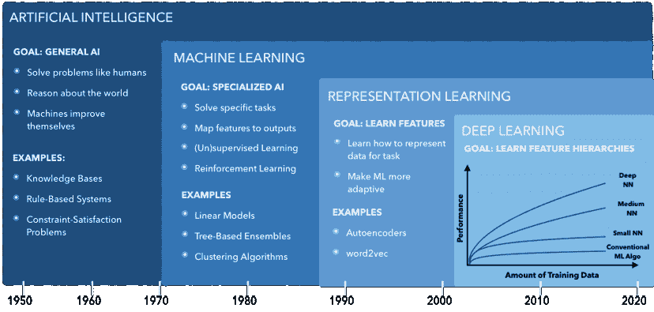

图 17.1：人工智能时间线和子领域

在接下来的部分中，我们将看到如何实际构建神经网络。

# 设计神经网络

深度学习依赖于**神经网络**，它由一些关键构建模块组成，而这些模块又可以以多种方式配置。在本节中，我们介绍了神经网络的工作原理，并阐述了用于设计不同架构的最重要组成部分。

（人工）神经网络最初受到了生物学习模型的启发，例如人脑，要么试图模仿其工作原理并取得类似的成功，要么通过模拟来更好地理解。当前的神经网络研究不太依赖于神经科学，至少因为我们对大脑的理解尚未达到足够的细致程度。另一个约束是总体规模：即使从 20 世纪 50 年代开始，神经网络中使用的神经元数量每年都以指数倍增长，它们也只会在 2050 年左右达到人脑的规模。

我们还将解释**反向传播**，通常简称为**反向传播**，如何使用梯度信息（损失函数对参数的偏导数值）根据训练误差调整所有神经网络参数。各种非线性模块的组合意味着目标函数的优化可能非常具有挑战性。我们还介绍了旨在加速学习过程的反向传播的改进。

## 一个简单的前馈神经网络架构

在本节中，我们介绍了基于**多层感知器**（**MLP**）的**前馈神经网络**（**feedforward NNs**），它由一个或多个连接输入与输出层的隐藏层组成。在前馈神经网络中，信息只从输入流向输出，因此它们可以被表示为有向无环图，如下图所示。相比之下，**循环神经网络**（**RNNs**；见*第十九章*，*用于多元时间序列和情感分析的 RNNs*）包括从输出回到输入的循环，以跟踪或记忆过去的模式和事件。

我们将首先描述前馈神经网络的架构以及如何使用 NumPy 实现它。然后我们将解释反向传播如何学习神经网络的权重，并在 Python 中实现它，以训练一个二分类网络，即使类别不是线性可分的也能产生完美的结果。有关实现细节，请参见笔记本`build_and_train_feedforward_nn`。

前馈神经网络由多个**层**组成，每个层接收一份输入数据样本并产生一个输出。**变换链**始于输入层，将源数据传递给几个内部或隐藏层之一，以输出层结束，该层计算与样本输出值进行比较的结果。

隐藏层和输出层由节点或神经元组成。**全连接**或密集层的节点连接到上一层的一些或所有节点。网络架构可以通过其深度（由隐藏层的数量衡量）、每个层的宽度和节点数量来总结。

每个连接都有一个用于计算输入值的线性组合的**权重**。一层也可以有一个**偏差**节点，它始终输出 1，并由后续层中的节点使用，类似于线性回归中的常数。训练阶段的目标是学习这些权重的值，以优化网络的预测性能。

每个隐藏层节点计算前一层的输出和权重的**点积**。**激活函数**转换结果，成为后续层的输入。此转换通常是非线性的（就像逻辑回归中使用的 Sigmoid 函数一样；参见 *第七章*，*线性模型 - 从风险因素到回报预测*，关于线性模型），以便网络可以学习非线性关系；我们将在下一节讨论常见的激活函数。输出层计算最后一个隐藏层的输出与其权重的线性组合，并使用与 ML 问题类型匹配的激活函数。

因此，网络输出的计算从输入中流经一系列嵌套函数，并称为**前向传播**。*图 17.2*说明了一个具有二维输入向量、宽度为三的隐藏层和两个输出层节点的单层前馈 NN。这种架构足够简单，因此我们仍然可以轻松地绘制它，并且说明关键概念。

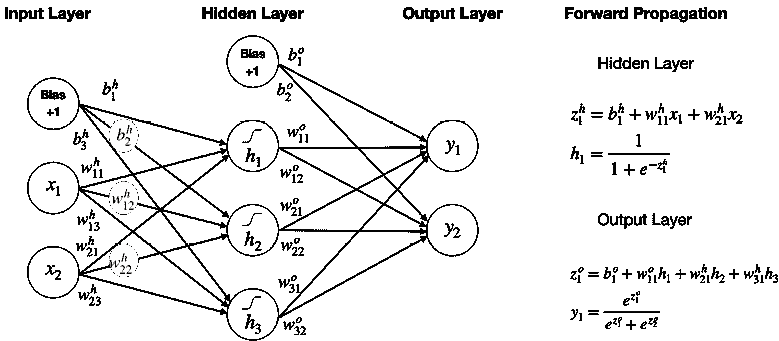

图 17.2：具有一个隐藏层的前馈架构

**网络图**显示，每个隐藏层节点（不包括偏差）都有三个权重，一个用于输入层偏差，两个用于每个两个输入变量。同样，每个输出层节点都有四个权重来计算隐藏层偏差和激活的乘积和。总共有 17 个要学习的参数。

右侧的**前向传播**面板列出了隐藏层和输出层中一个示例节点 *h* 和 *o* 的计算，分别表示隐藏层和输出层。隐藏层中的第一个节点对其权重和输入的线性组合 *z* 应用 Sigmoid 函数，类似于逻辑回归。因此，隐藏层同时运行三个逻辑回归，并且反向传播算法确保它们的参数很可能不同，以最好地通知后续层。

输出层使用**softmax**激活函数（参见 *第六章*，*机器学习过程*），该函数将逻辑 Sigmoid 函数推广到多个类别。它调整了隐藏层输出与其权重的点积，以表示类别的概率（在这种情况下仅为两个以简化演示）。

前向传播也可以表示为嵌套函数，其中 *h* 再次表示隐藏层，*o* 表示输出层以产生 NN 对输出的估计：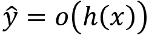。

## 关键设计选择

一些神经网络设计选择与其他监督学习模型相似。例如，输出取决于 ML 问题的类型，如回归、分类或排名。给定输出，我们需要选择一个成本函数来衡量预测成功和失败，并选择一个算法来优化网络参数以最小化成本。

NN 特定的选择包括层数和每层节点的数量，不同层节点之间的连接以及激活函数的类型。

一个关键问题是**训练效率**：激活的功能形式可以促进或阻碍可用于反向传播算法的梯度信息的流动，该算法根据训练错误调整权重。具有大输入值范围的平坦区域的函数具有非常低的梯度，当参数值停留在这种范围内时，可以阻碍训练进度。

一些架构添加了**跳跃连接**，建立了超出相邻层的直接链接，以促进梯度信息的流动。另一方面，有意省略连接可以减少参数数量，限制网络的容量，并可能降低泛化误差，同时也减少了计算成本。

### 隐藏单元和激活函数

除了 sigmoid 函数之外，还有几种非线性激活函数被成功使用。它们的设计仍然是一个研究领域，因为它们是允许 NN 学习非线性关系的关键元素。它们也对训练过程有关键影响，因为它们的导数决定了错误如何转化为权重调整。

一个非常流行的激活函数是**修正线性单元**（**ReLU**）。激活被计算为*g*(*z*) = max(0, *z*)，对于给定的激活*z*，结果形式类似于看涨期权的支付。当单元处于活跃状态时，导数是常数。ReLU 通常与需要存在偏置节点的仿射输入变换结合使用。它们的发现极大地改善了前馈网络的性能，与 S 型单元相比，它们经常被推荐为默认选项。有几个 ReLU 扩展旨在解决 ReLU 在不活动时学习梯度下降时的限制和它们的梯度为零的问题（Goodfellow、Bengio 和 Courville，2016）。

对于逻辑函数σ的另一种选择是**双曲正切函数 tanh**，它产生在范围[-1, 1]的输出值。它们是密切相关的，因为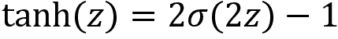。两个函数都受到饱和的影响，因为它们的梯度在非常低和高的输入值时变得非常小。然而，tanh 通常表现更好，因为它更接近恒等函数，所以对于小的激活值，网络的行为更像是一个线性模型，这反过来又促进了训练。

### 输出单元和成本函数

NN 输出格式和成本函数的选择取决于监督学习问题的类型：

+   **回归问题**使用线性输出单元，计算其权重与最终隐藏层激活的点积，通常与均方误差成本一起使用。

+   **二元分类**使用 sigmoid 输出单元来模拟伯努利分布，就像逻辑回归一样，其中隐藏激活作为输入

+   **多类问题**依赖于 softmax 单元，它们推广了逻辑 sigmoid 并模拟了超过两个类别的离散分布，正如之前展示的那样

二元和多类问题通常使用交叉熵损失，与均方误差相比，这显着提高了训练效果（有关损失函数的其他信息，请参见*第六章*，*机器学习过程*）。

## 如何正则化深度 NN

NN 近似任意函数的容量的缺点是过度拟合的风险大大增加。对**过度拟合的最佳保护**是在更大的数据集上训练模型。数据增强，例如创建图像的略微修改版本，是一个强大的替代方法。为此目的生成合成金融训练数据是一个活跃的研究领域，我们将在*第二十章*，*自编码器用于条件风险因素和资产定价*中讨论这一点（例如，Fu 等人 2019 年）。

作为获取更多数据的替代或补充，正则化可以帮助减轻过度拟合的风险。在本书中到目前为止讨论的所有模型中，都有一些形式的正则化，它修改学习算法以减少其泛化误差，而不会对其训练误差产生负面影响。示例包括添加到岭和套索回归目标中的惩罚以及用于决策树和基于树的集成模型的分割或深度约束。

经常，正则化采用对参数值的软约束形式，以权衡一些额外的偏差以获得较低的方差。一个常见的实际发现是，具有最低泛化误差的模型不是具有精确正确参数大小的模型，而是一个经过很好正则化的更大的模型。可以结合使用的流行的 NN 正则化技术包括参数范数惩罚，提前停止和丢弃。

### 参数范数惩罚

我们在*第七章*，*线性模型-从风险因素到收益预测*中遇到了**参数范数惩罚**，分别用作**L1 和 L2 正则化**的套索和岭回归。在 NN 上下文中，参数范数惩罚通过添加一个代表参数的 L1 或 L2 范数的项来类似地修改目标函数，权重由需要调整的超参数加权。对于 NN，偏置参数通常不受限制，只有权重。

L1 正则化可以通过将权重减少到零来产生稀疏的参数估计。相比之下，L2 正则化保留了参数显著减少成本函数的方向。惩罚或超参数的值可以在各个层之间变化，但添加的调整复杂性很快变得令人难以承受。

### 早停止

我们在*第十二章* *提升您的交易策略*中遇到了**早停止**作为一种正则化技术。它可能是最常见的神经网络正则化方法，因为它既有效又简单：它监视模型在验证集上的性能，并在一定数量的观察次数内停止训练，以防止过拟合。

早停止可以被看作是**有效的超参数选择**，它可以自动确定正确的正则化量，而参数惩罚则需要超参数调整来确定理想的权重衰减。只要注意避免**前瞻性偏见**：当早停止使用不可用于策略实施的样本外数据时，回测结果将过度正面。

### Dropout

**Dropout** 是指在前向或后向传播过程中以给定概率随机省略个别单元。因此，这些被省略的单元不会对训练误差做出贡献，也不会接收更新。

该技术计算成本低廉，不限制模型或训练过程的选择。虽然需要更多迭代才能达到相同的学习量，但由于计算成本较低，每次迭代速度更快。Dropout 通过防止单元在训练过程中弥补其他单元的错误来降低过拟合的风险。

## 更快地训练 - 深度学习的优化

反向传播是指计算目标函数相对于我们希望更新的内部参数的梯度，并利用这些信息来更新参数值。梯度是有用的，因为它指示导致成本函数最大增加的参数变化方向。因此，根据负梯度调整参数会产生最佳的成本减少，至少对于非常接近观察样本的区域来说是这样。有关关键梯度下降优化算法的出色概述，请参阅 Ruder（2017）。

训练深度神经网络可能会耗费大量时间，这是由于非凸目标函数和可能庞大的参数数量所导致的。几个挑战可能会显著延迟收敛，找到一个糟糕的最优解，或者导致振荡或偏离目标：

+   **局部极小值** 可能会阻止收敛到全局最优解并导致性能差。

+   具有低梯度的**平坦区域** 可能不是局部最小值，也可能阻止收敛，但很可能远离全局最优解。

+   由于乘以几个大权重而导致的具有高梯度的陡峭区域可能会导致过度调整

+   RNN 中的深层结构或长期依赖性需要在反向传播过程中乘以许多权重，导致**梯度消失**，使得至少部分 NN 接收到少量或没有更新

已经开发了几种算法来解决其中一些挑战，即随机梯度下降的变体和使用自适应学习率的方法。虽然自适应学习率并没有单一的最佳算法，但已经显示出一些希望。

### 随机梯度下降

梯度下降通过梯度信息迭代地调整这些参数。对于给定的参数 ，基本梯度下降规则通过损失函数相对于该参数的负梯度乘以学习速率 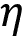 来调整该值：

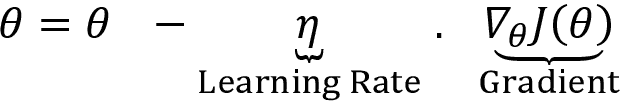

梯度可以对所有训练数据、随机批量数据或单个观测（称为在线学习）进行评估。随机样本产生**随机梯度下降**（**SGD**），如果随机样本在整个训练过程中对梯度方向是无偏估计，则通常导致更快的收敛。

然而，存在许多挑战：很难预先定义一个能够促进有效收敛的学习率或速率调度——太低的速率会延长过程，而太高的速率可能会导致反复超调和围绕最小值振荡甚至发散。此外，相同的学习率可能不适用于所有参数，即在所有变化方向上都不适用。

### 动量

基本梯度下降的一个流行改进是将动量添加到**加速收敛到局部最小值**。动量的图示经常使用一个位于细长峡谷中心的局部最优值的例子（实际上，维度要比三维高得多）。它意味着一个位于深而窄的峡谷内的最小值，该峡谷的壁非常陡峭，其中一侧的梯度很大，另一侧朝着该区域底部的局部最小值的斜坡要缓得多。梯度下降自然而然地沿着陡峭的梯度走，将反复调整上下峡谷的墙壁，向着最小值的方向移动得更慢。

动量旨在通过**跟踪最近的方向**并通过最近的梯度和当前计算值的加权平均来调整参数来解决这种情况。它使用动量项  来衡量最新调整对此迭代更新 *v*[t] 的贡献：

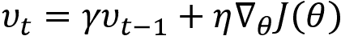

**Nesterov momentum** 是对普通动量的简单改进。在这里，梯度项不是在当前参数空间位置计算！[](img/Image74692.png)，而是从一个中间位置计算。其目标是纠正动量项过度偏离或指向错误方向（Sutskever 等人，2013）。

### 自适应学习率

选择适当的学习率非常具有挑战性，正如前一小节中所强调的随机梯度下降。与此同时，它是最重要的参数之一，它强烈影响训练时间和泛化性能。

虽然动量解决了一些学习率的问题，但是以引入另一个超参数，**动量率** 为代价。几种算法旨在根据梯度信息在整个训练过程中自适应地调整学习率。

#### AdaGrad

AdaGrad 累积所有历史的、参数特定的梯度信息，并继续根据给定参数的平方累积梯度来反比例地重新缩放学习率。其目标是减缓已经大量变化的参数的变化，鼓励还没有变化的参数进行调整。

AdaGrad 设计用于在凸函数上表现良好，在 DL 上表现不佳，因为它可能会根据早期梯度信息过快地降低学习率。

#### RMSProp

RMSProp 修改了 AdaGrad 以使用累积梯度信息的指数加权平均值。其目标是更加强调最近的梯度。它还引入了一个新的超参数，用于控制移动平均的长度。

RMSProp 是一种流行的算法，通常表现良好，由我们稍后将介绍的各种库提供，并在实践中经常使用。

#### Adam

Adam 代表 **自适应动量估计**，将 RMSProp 的一些方面与动量结合起来。它被认为是相当稳健的，并经常用作默认的优化算法（Kingma 和 Ba，2014）。

Adam 有几个带有建议的默认值的超参数，可能会从一些调整中受益：

+   **alpha**：学习率或步长确定更新权重的程度，较大（较小）的值在更新速度之前加快（减慢）学习；许多库使用默认值 0.001

+   **beta**[1]：第一矩估计的指数衰减率；通常设置为 0.9

+   **beta**[2]：第二矩估计的指数衰减率；通常设置为 0.999

+   **epsilon**：一个非常小的数字，用于防止除零；通常设置为 1e-8

## 总结 - 如何调整关键的超参数

超参数优化旨在**调整模型的容量**，使其匹配数据输入之间的关系的复杂性。过多的容量会增加过拟合的可能性，需要更多的数据，将额外的信息引入到学习过程中，减小模型的大小，或更积极地使用刚刚描述的各种正则化工具。

**主要的诊断工具**是描述在*第六章*，*机器学习过程*中的训练和验证错误的行为：如果验证错误恶化，而训练错误继续下降，那么模型就是过度拟合的，因为其容量太高。另一方面，如果性能不符合预期，可能需要增加模型的大小。

参数优化最重要的方面是架构本身，因为它很大程度上决定了参数的数量：其他条件相同，更多或更宽的隐藏层会增加容量。正如前面提到的，最佳性能通常与具有过量容量但使用像 dropout 或 L1/L2 惩罚这样的机制进行了良好正则化的模型相关联。

除了**平衡模型大小和正则化**之外，调整**学习率**也很重要，因为它可能会破坏优化过程并降低有效模型容量。自适应优化算法提供了一个很好的起点，就像 Adam 描述的那样，这是最流行的选项。

# Python 从头开始的神经网络

为了更好地理解 NNs 的工作原理，我们将使用矩阵代数来表述单层架构和*图 17.2*中显示的前向传播计算，并使用 NumPy 实现它。你可以在笔记本`build_and_train_feedforward_nn`中找到代码示例。

## 输入层

*图 17.2*中显示的架构设计用于表示两个不同类别*Y*的二维输入数据*X*。以矩阵形式，*X*和*Y*的形状都是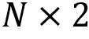：

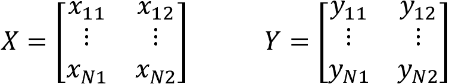

我们将使用 scikit-learn 的`make_circles`函数生成 50,000 个随机二进制样本，形成两个半径不同的同心圆，以便类别不是线性可分的：

```py
N = 50000
factor = 0.1
noise = 0.1
X, y = make_circles(n_samples=N, shuffle=True,
                   factor=factor, noise=noise) 
```

然后将一维输出转换为二维数组：

```py
Y = np.zeros((N, 2))
for c in [0, 1]:
   Y[y == c, c] = 1
'Shape of: X: (50000, 2) | Y: (50000, 2) | y: (50000,)' 
```

*图 17.3*显示了数据的散点图，很明显不是线性可分的：

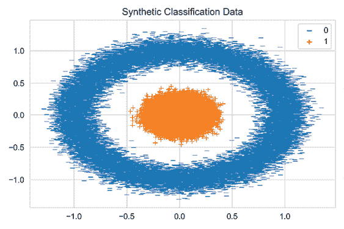

图 17.3：二元分类的合成数据

## 隐藏层

隐藏层*h*使用权重 W^h 将二维输入投影到三维空间，并通过偏置向量 b^h 将结果平移。为了执行这个仿射变换，隐藏层权重由一个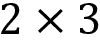矩阵 W^h 表示，而隐藏层偏置向量由一个三维向量表示：

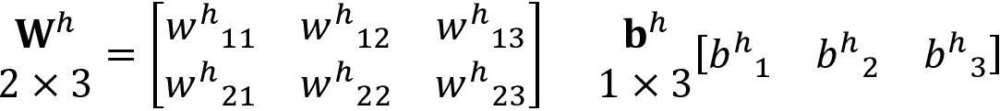

隐藏层激活 *H* 是通过将输入数据与加入偏置向量后的权重的点积应用于 sigmoid 函数而得到的：

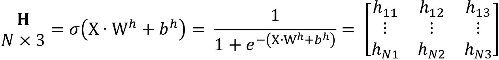

要使用 NumPy 实现隐藏层，我们首先定义 `logistic` sigmoid 函数：

```py
def logistic(z):
   """Logistic function."""
   return 1 / (1 + np.exp(-z)) 
```

然后我们定义一个函数，根据相关的输入、权重和偏置值计算隐藏层激活：

```py
def hidden_layer(input_data, weights, bias):
   """Compute hidden activations"""
   return logistic(input_data @ weights + bias) 
```

## 输出层

输出层使用一个 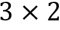 权重矩阵 W^o 和一个二维偏置向量 **b**^o 将三维隐藏层激活 *H* 压缩回两维：

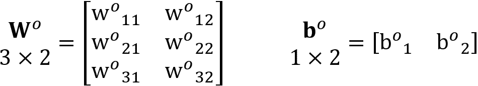

隐藏层输出的线性组合导致一个  矩阵 **Z**^o：

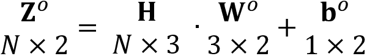

输出层激活由 softmax 函数 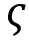 计算，该函数将 **Z**^o 规范化以符合离散概率分布的惯例：

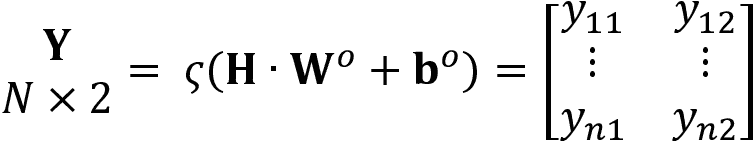

我们在 Python 中创建一个 softmax 函数如下所示：

```py
def softmax(z):
   """Softmax function"""
   return np.exp(z) / np.sum(np.exp(z), axis=1, keepdims=True) 
```

如此定义，输出层激活取决于隐藏层激活和输出层权重和偏置：

```py
def output_layer(hidden_activations, weights, bias):
   """Compute the output y_hat"""
   return softmax(hidden_activations @ weights + bias) 
```

现在我们拥有了集成层并直接从输入计算 NN 输出所需的所有组件。

## 正向传播

`forward_prop` 函数将前述操作组合起来，从输入数据中产生输出激活作为权重和偏置的函数：

```py
def forward_prop(data, hidden_weights, hidden_bias, output_weights, output_bias):
   """Neural network as function."""
   hidden_activations = hidden_layer(data, hidden_weights, hidden_bias)
   return output_layer(hidden_activations, output_weights, output_bias) 
```

`predict` 函数根据权重、偏置和输入数据产生二元类别预测：

```py
def predict(data, hidden_weights, hidden_bias, output_weights, output_bias):
   """Predicts class 0 or 1"""
   y_pred_proba = forward_prop(data,
                               hidden_weights,
                               hidden_bias,
                               output_weights,
                               output_bias)
   return np.around(y_pred_proba) 
```

## 交叉熵损失函数

最后一块是根据给定标签评估 NN 输出的损失函数。损失函数 *J* 使用交叉熵损失 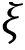，它对每个类别 *c* 的预测与实际结果的偏差进行求和：

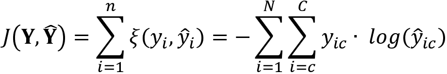

在 Python 中，它的形式如下：

```py
def loss(y_hat, y_true):
   """Cross-entropy"""
   return - (y_true * np.log(y_hat)).sum() 
```

## 如何使用 Python 实现反向传播

要使用反向传播更新神经网络的权重和偏置值，我们需要计算损失函数的梯度。梯度表示损失函数相对于目标参数的偏导数。

### 如何计算梯度

NN 组成一组嵌套函数，如前所述。因此，使用微积分的链式法则计算损失函数相对于内部隐藏参数的梯度。

对于标量值，给定函数 *z* = *h*(*x*) 和 *y* = *o*(*h*(*x*)) = *o* (*z*)，我们使用链式法则计算 *y* 相对于 *x* 的导数如下：

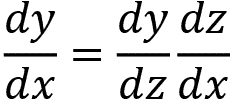

对于向量，有 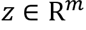 和 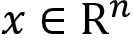，使得隐藏层 *h* 从 R^n 映射到 R^m，*z* = *h*(*x*)，*y* = *o* (*z*)，我们得到：

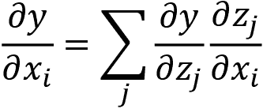

我们可以使用矩阵表示更简洁地表达这一点，使用 *h* 的雅可比矩阵 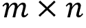：

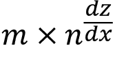

它包含了对于 *z* 的每个 *m* 组件相对于每个 *n* 输入 *x* 的偏导数。*y* 相对于 *x* 的梯度 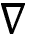 包含了所有的偏导数，因此可以写成：

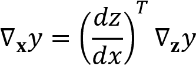

### 损失函数的梯度

交叉熵损失函数 *J* 对于每个输出层激活 *i* = 1, ..., *N* 的导数是一个非常简单的表达式（详见笔记本），如下左侧为标量值，右侧为矩阵表示：

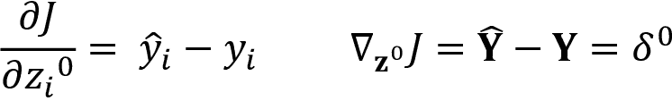

我们相应地定义`loss_gradient`函数：

```py
def loss_gradient(y_hat, y_true):
   """output layer gradient"""
   return y_hat - y_true 
```

### 输出层梯度

要将更新传播回输出层权重，我们使用损失函数 *J* 对于权重矩阵的梯度：

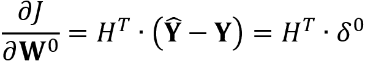

和偏置项的梯度：

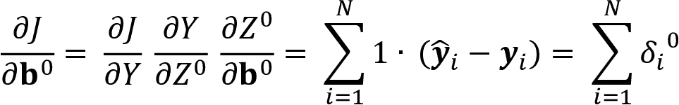

我们现在可以相应地定义`output_weight_gradient`和`output_bias_gradient`，两者都以损失梯度 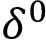 作为输入：

```py
def output_weight_gradient(H, loss_grad):
   """Gradients for the output layer weights"""
   return  H.T @ loss_grad
def output_bias_gradient(loss_grad):
   """Gradients for the output layer bias"""
   return np.sum(loss_grad, axis=0, keepdims=True) 
```

### 隐藏层梯度

损失函数对于隐藏层值的梯度计算如下，其中 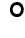 表示逐元素的矩阵乘积：

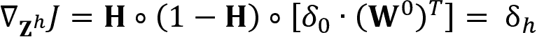

我们定义一个`hidden_layer_gradient`函数来编码这个结果：

```py
def hidden_layer_gradient(H, out_weights, loss_grad):
   """Error at the hidden layer.
   H * (1-H) * (E . Wo^T)"""
   return H * (1 - H) * (loss_grad @ out_weights.T) 
```

隐藏层权重和偏置的梯度为：

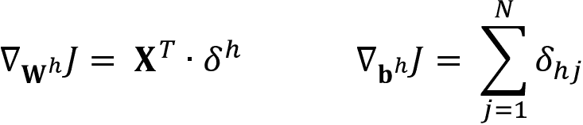

相应的函数是：

```py
def hidden_weight_gradient(X, hidden_layer_grad):
   """Gradient for the weight parameters at the hidden layer"""
   return X.T @ hidden_layer_grad

def hidden_bias_gradient(hidden_layer_grad):
   """Gradient for the bias parameters at the output layer"""
   return np.sum(hidden_layer_grad, axis=0, keepdims=True) 
```

### 将所有内容整合起来

为了准备训练我们的网络，我们创建一个函数，该函数结合了先前的梯度定义，并从训练数据和标签以及当前的权重和偏置值计算相关的权重和偏置更新：

```py
def compute_gradients(X, y_true, w_h, b_h, w_o, b_o):
   """Evaluate gradients for parameter updates"""
   # Compute hidden and output layer activations
   hidden_activations = hidden_layer(X, w_h, b_h)
   y_hat = output_layer(hidden_activations, w_o, b_o)
   # Compute the output layer gradients
   loss_grad = loss_gradient(y_hat, y_true)
   out_weight_grad = output_weight_gradient(hidden_activations, loss_grad)
   out_bias_grad = output_bias_gradient(loss_grad)
   # Compute the hidden layer gradients
   hidden_layer_grad = hidden_layer_gradient(hidden_activations,
                                             w_o, loss_grad)
   hidden_weight_grad = hidden_weight_gradient(X, hidden_layer_grad)
   hidden_bias_grad = hidden_bias_gradient(hidden_layer_grad)
   return [hidden_weight_grad, hidden_bias_grad, out_weight_grad, out_bias_grad] 
```

#### 测试梯度

笔记本包含一个测试函数，该函数将先前使用多元微积分解析导出的梯度与我们通过轻微扰动单个参数获得的数值估计进行比较。测试函数验证了输出值的变化与分析梯度估计的变化类似。

#### 使用 Python 实现动量更新

要将动量合并到参数更新中，定义一个`update_momentum`函数，该函数将我们刚刚使用的`compute_gradients`函数的结果与每个参数矩阵的最新动量更新组合起来：

```py
def update_momentum(X, y_true, param_list, Ms, momentum_term, learning_rate):
   """Compute updates with momentum."""
   gradients = compute_gradients(X, y_true, *param_list)
   return [momentum_term * momentum - learning_rate * grads
           for momentum, grads in zip(Ms, gradients)] 
```

`update_params`函数执行实际的更新：

```py
def update_params(param_list, Ms):
   """Update the parameters."""
   return [P + M for P, M in zip(param_list, Ms)] 
```

### 训练网络

要训练网络，我们首先使用标准正态分布随机初始化所有网络参数（参见笔记本）。对于给定的迭代次数或周期，我们运行动量更新并计算训练损失如下：

```py
def train_network(iterations=1000, lr=.01, mf=.1):
   # Initialize weights and biases
   param_list = list(initialize_weights())
   # Momentum Matrices = [MWh, Mbh, MWo, Mbo]
   Ms = [np.zeros_like(M) for M in param_list]
   train_loss = [loss(forward_prop(X, *param_list), Y)]
   for i in range(iterations):
       # Update the moments and the parameters
       Ms = update_momentum(X, Y, param_list, Ms, mf, lr)
       param_list = update_params(param_list, Ms)
       train_loss.append(loss(forward_prop(X, *param_list), Y))
   return param_list, train_loss 
```

*图 17.4* 绘制了使用动量项为 0.5 和学习率为 1e-4 的 50,000 个训练样本进行 50,000 次迭代的训练损失。它显示损失需要超过 5,000 次迭代才开始下降，但然后下降速度非常快。我们没有使用 SGD，这可能会显著加速收敛。

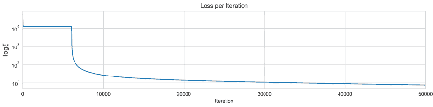

图 17.4：每次迭代的训练损失

*图 17.5* 中的图表展示了具有三维隐藏层的神经网络从二维数据中学习的函数，这些数据有两个不是线性可分的类。左侧面板显示了源数据和决策边界，它误分类了非常少的数据点，并且随着持续训练将进一步改善。

中央面板显示了隐藏层学习的输入数据的表示。网络学习权重，以便将输入从二维投影到三维，从而使得两个类能够线性分离。右侧图显示了输出层如何以 0.5 的输出维度值作为线性分离的截止值：

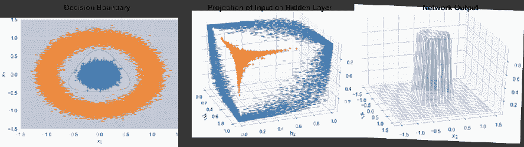

图 17.5：可视化神经网络学习的函数

**总结**：我们已经看到一个非常简单的网络，只有一个包含三个节点的隐藏层和总共 17 个参数，能够学习如何使用反向传播和带动量的梯度下降来解决非线性分类问题。

我们接下来将回顾如何使用流行的 DL 库，这些库有助于设计复杂的架构并进行快速训练，同时使用复杂技术来防止过拟合并评估结果。

# 流行的深度学习库

目前最流行的 DL 库是 TensorFlow（由 Google 支持）、Keras（由 Francois Chollet 领导，现在在 Google）和 PyTorch（由 Facebook 支持）。开发非常活跃，截至 2020 年 3 月，PyTorch 版本为 1.4，TensorFlow 版本为 2.2。TensorFlow 2.0 将 Keras 作为其主要接口，有效地将两个库合并为一个。

所有的库都提供了我们在本章中讨论过的设计选择、正则化方法和反向传播优化。它们还能够在一个或多个**图形处理单元**（**GPU**）上进行快速训练。这些库在重点上略有不同，TensorFlow 最初设计用于在生产中部署，在工业界很普遍，而 PyTorch 在学术研究者中很受欢迎；然而，接口正在逐渐趋同。

我们将使用与上一节相同的网络架构和数据集来说明 TensorFlow 和 PyTorch 的使用。

## 利用 GPU 加速

DL 非常计算密集，而且好的结果通常需要大型数据集。因此，模型训练和评估可能会变得非常耗时。GPU 高度优化了深度学习模型所需的矩阵运算，并且往往具有更多的处理能力，使得加速 10 倍或更多不罕见。

所有流行的深度学习库都支持使用 GPU，并且一些还允许在多个 GPU 上进行并行训练。最常见的 GPU 类型由 NVIDIA 生产，配置需要安装和设置 CUDA 环境。这个过程不断发展，取决于您的计算环境，可能会有一定挑战。

利用 GPU 的更简单方法是通过 Docker 虚拟化平台。有大量的镜像可供您在由 Docker 管理的本地容器中运行，避免了您可能遇到的许多驱动程序和版本冲突。TensorFlow 在其网站上提供了 Docker 镜像，也可以与 Keras 一起使用。

在 GitHub 上查看 DL 笔记本和安装目录中的参考和相关说明。

## 如何使用 TensorFlow 2

TensorFlow 在 2015 年 9 月发布后不久成为了领先的深度学习库，在 PyTorch 之前一年。TensorFlow 2 简化了随着时间推移变得越来越复杂的 API，通过将 Keras API 作为其主要接口。

Keras 被设计为高级 API，以加速使用 TensorFlow、Theano 或 CNTK 等计算后端设计和训练深度神经网络的迭代工作流程。它在 2017 年被整合到 TensorFlow 中。您还可以结合两个库的代码，以利用 Keras 的高级抽象以及定制的 TensorFlow 图操作。

此外，TensorFlow 采用了**即时执行**。以前，您需要为编译成优化操作的完整计算图进行定义。运行编译后的图形需要配置会话并提供所需的数据。在即时执行下，您可以像常规 Python 代码一样逐行运行 TensorFlow 操作。

Keras 支持稍微简单的 Sequential API 和更灵活的 Functional API。我们将在此介绍前者，并在后续章节中的更复杂示例中使用 Functional API。

要创建模型，我们只需要实例化一个`Sequential`对象，并提供一个包含标准层序列及其配置的列表，包括单元数、激活函数类型或名称。

第一个隐藏层需要关于它从输入层通过`input_shape`参数接收到的矩阵中特征数的信息。在我们的简单案例中，只有两个。Keras 通过我们稍后将传递给本节中的`fit`方法的`batch_size`参数在训练期间推断需要处理的行数。TensorFlow 通过前一层的`units`参数推断接收到的输入的大小：

```py
from tensorflow.keras.models import Sequential
from tensorflow.keras.layers import Dense, Activation
model = Sequential([
    Dense(units=3, input_shape=(2,), name='hidden'),
    Activation('sigmoid', name='logistic'),
    Dense(2, name='output'),
    Activation('softmax', name='softmax'),
]) 
```

Keras API 提供了许多标准构建模块，包括循环和卷积层，各种正则化选项，一系列损失函数和优化器，以及预处理，可视化和日志记录（请参阅 GitHub 上的 TensorFlow 文档链接以供参考）。它也是可扩展的。

模型的`summary`方法生成对网络架构的简明描述，包括层类型和形状的列表以及参数数量：

```py
model.summary()
Layer (type)                 Output Shape              Param #   
=================================================================
hidden (Dense)               (None, 3)                 9         
_________________________________________________________________
logistic (Activation)        (None, 3)                 0         
_________________________________________________________________
output (Dense)               (None, 2)                 8         
_________________________________________________________________
softmax (Activation)         (None, 2)                 0         
=================================================================
Total params: 17
Trainable params: 17
Non-trainable params: 0 
```

接下来，我们编译 Sequential 模型以配置学习过程。为此，我们定义优化器，损失函数以及一种或多种在训练期间监视的性能指标：

```py
model.compile(optimizer='rmsprop',
             loss='binary_crossentropy',
             metrics=['accuracy']) 
```

Keras 使用回调函数来在训练期间启用某些功能，例如在 TensorBoard 中记录信息以供交互式显示（见下一节）：

```py
tb_callback = TensorBoard(log_dir='./tensorboard',
                         histogram_freq=1,
                         write_graph=True,
                         write_images=True) 
```

要训练模型，我们调用它的`fit`方法，并在训练数据之外传递多个参数：

```py
model.fit(X, Y,
         epochs=25,
         validation_split=.2,
         batch_size=128,
         verbose=1,
         callbacks=[tb_callback]) 
```

请参阅笔记本以可视化决策边界，它类似于我们先前的手动网络实现的结果。不过，使用 TensorFlow 进行训练速度快了几个数量级。

## 如何使用 TensorBoard

TensorBoard 是 TensorFlow 附带的一套优秀的可视化工具，包括可视化工具以简化对 NNs 的理解，调试和优化。

您可以使用它来可视化计算图，绘制各种执行和性能指标，甚至可视化网络处理的图像数据。它还允许比较不同的训练运行。

运行`how_to_use_tensorflow`笔记本时，需要安装 TensorFlow，然后可以从命令行启动 TensorBoard：

```py
tensorboard --logdir=/full_path_to_your_logs ## e.g. ./tensorboard 
```

或者，您可以首先加载扩展程序，然后通过引用`log`目录类似地启动 TensorBoard，在您的笔记本中使用它：

```py
%load_ext tensorboard
%tensorboard --logdir tensorboard/ 
```

首先，可视化包括训练和验证指标（请参阅*图 17.6*的左面板）。

此外，您还可以查看各个时期的权重和偏差的直方图（图 17.6 的右面板；时期从后到前演变）。这很有用，因为它允许您监视反向传播是否成功地在学习过程中调整权重以及它们是否收敛。

权重的值应该在多个时期内从它们的初始化值改变并最终稳定：

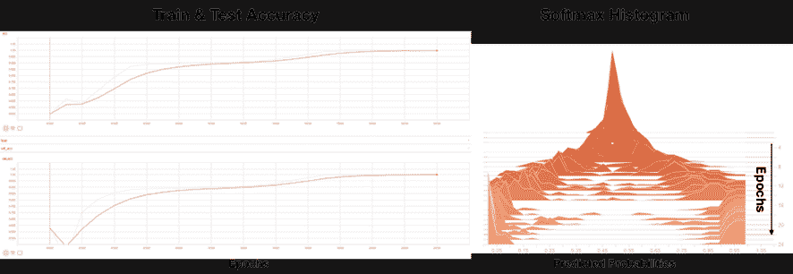

图 17.6：TensorBoard 学习过程可视化

TensorBoard 还允许您显示和交互式探索网络的计算图，通过单击各个节点从高级结构向下钻取到底层操作。我们简单示例架构的可视化（请参阅笔记本）已经包含了许多组件，但在调试时非常有用。有关更详细的参考，请参阅 GitHub 上更详细的教程链接。

## 如何使用 PyTorch 1.4

PyTorch 是在由 Yann LeCunn 领导的**Facebook AI 研究**（**FAIR**）团队开发的，并于 2016 年 9 月发布了第一个 alpha 版本。它与 NumPy 等 Python 库深度集成，可以用于扩展其功能，具有强大的 GPU 加速和使用其 autograd 系统进行自动微分。通过更低级别的 API，它提供比 Keras 更细粒度的控制，并且主要用作深度学习研究平台，但也可以在启用 GPU 计算的同时替代 NumPy。

它采用即时执行，与 Theano 或 TensorFlow 等使用静态计算图的方式形成对比。与最初为了快速但静态执行而定义和编译网络不同，它依赖于其 autograd 包来自动对张量操作进行微分；也就是说，它在“飞行中”计算梯度，以便更轻松地部分修改网络结构。这称为**按运行定义**，意味着反向传播是由代码运行方式定义的，这又意味着每次迭代都可能不同。PyTorch 文档提供了关于此的详细教程。

结合结果灵活性和直观的 Python 首选界面以及执行速度，这导致了它的迅速普及和众多支持库的开发，这些支持库扩展了其功能。

让我们通过实现我们的简单网络架构来看看 PyTorch 和 autograd 如何工作（详细信息请参见`how_to_use_pytorch`笔记本）。

### 如何创建 PyTorch 的 DataLoader

我们首先将 NumPy 或 pandas 输入数据转换为`torch`张量。从 NumPy 到 PyTorch 的转换非常简单：

```py
import torch
X_tensor = torch.from_numpy(X)
y_tensor = torch.from_numpy(y)
X_tensor.shape, y_tensor.shape
(torch.Size([50000, 2]), torch.Size([50000])) 
```

我们可以使用这些 PyTorch 张量首先实例化一个`TensorDataset`，然后在第二步实例化一个包含有关`batch_size`信息的`DataLoader`：

```py
import torch.utils.data as utils
dataset = utils.TensorDataset(X_tensor,y_tensor)
dataloader = utils.DataLoader(dataset,
                              batch_size=batch_size,
                              shuffle=True) 
```

### 如何定义神经网络架构

PyTorch 使用`Net()`类定义了一个 NN 架构。其核心元素是`forward`函数。autograd 自动定义了相应的`backward`函数来计算梯度。

任何合法的张量操作都可以用于`forward`函数，提供了设计灵活性的记录。在我们的简单情况下，我们只是在初始化其属性后通过功能输入输出关系链接张量：

```py
import torch.nn as nn
class Net(nn.Module):
    def __init__(self, input_size, hidden_size, num_classes):
        super(Net, self).__init__()  # Inherited from nn.Module
        self.fc1 = nn.Linear(input_size, hidden_size)  
        self.logistic = nn.LogSigmoid()                          
        self.fc2 = nn.Linear(hidden_size, num_classes)
        self.softmax = nn.Softmax(dim=1)

    def forward(self, x):
        """Forward pass: stacking each layer together"""
        out = self.fc1(x)
        out = self.logistic(out)
        out = self.fc2(out)
        out = self.softmax(out)
        return out 
```

然后我们实例化一个`Net()`对象，并且可以按照以下方式检查其架构：

```py
net = Net(input_size, hidden_size, num_classes)
net
Net(
  (fc1): Linear(in_features=2, out_features=3, bias=True)
  (logistic): LogSigmoid()
  (fc2): Linear(in_features=3, out_features=2, bias=True)
  (softmax): Softmax()
) 
```

为了说明即时执行，我们还可以检查第一个张量中初始化的参数：

```py
list(net.parameters())[0]
Parameter containing:
tensor([[ 0.3008, -0.2117],
        [-0.5846, -0.1690],
        [-0.6639,  0.1887]], requires_grad=True) 
```

要启用 GPU 处理，您可以使用`net.cuda()`。请参阅 PyTorch 文档以将张量放置在 CPU 和/或一个或多个 GPU 单元上。

我们还需要定义损失函数和优化器，使用一些内置选项：

```py
criterion = nn.CrossEntropyLoss()
optimizer = torch.optim.Adam(net.parameters(), lr=learning_rate) 
```

### 如何训练模型

模型训练包括对每个 epoch 的外循环，即对训练数据的每次传递，以及对 `DataLoader` 产生的批次的内循环。这执行学习算法的前向和后向传递。需要小心地调整数据类型以满足各种对象和函数的要求；例如，标签需要是整数，特征应该是 `float` 类型：

```py
for epoch in range(num_epochs):
    print(epoch)
    for i, (features, label) in enumerate(dataloader):

        features = Variable(features.float())         
        label = Variable(label.long())
        # Initialize the hidden weights
        optimizer.zero_grad()  

        # Forward pass: compute output given features
        outputs = net(features)

        # Compute the loss
        loss = criterion(outputs, label)
        # Backward pass: compute the gradients
        loss.backward()
        # Update the weights
        optimizer.step() 
```

笔记本还包含一个示例，使用 `livelossplot` 包绘制损失，这是由 Keras 提供的开箱即用的功能。

### 如何评估模型预测

要从我们训练的模型中获得预测，我们传递特征数据并将预测转换为 NumPy 数组。我们获得了每个类别的 softmax 概率：

```py
test_value = Variable(torch.from_numpy(X)).float()
prediction = net(test_value).data.numpy()
Prediction.shape
(50000, 2) 
```

从这里开始，我们可以像以前一样继续计算损失指标或可视化结果，再次生成我们之前找到的决策边界的一个版本。

## 可选方案

对深度学习的巨大兴趣导致了几个竞争性库的开发，这些库促进了神经网络的设计和训练。最突出的包括以下示例（还请参阅 GitHub 上的参考资料）。

### Apache MXNet

MXNet，由 Apache 基金会孵化，是一个用于训练和部署深度神经网络的开源深度学习软件框架。它专注于可扩展性和快速模型训练。他们包括了 Gluon 高级接口，使得原型设计、训练和部署深度学习模型变得容易。MXNet 已被亚马逊选为 AWS 上的深度学习工具。

### Microsoft Cognitive Toolkit（CNTK）

Cognitive Toolkit，以前称为 CNTK，是微软对深度学习库的贡献。它将神经网络描述为通过有向图的一系列计算步骤，类似于 TensorFlow。在这个有向图中，叶节点代表输入值或网络参数，而其他节点代表对它们的输入进行的矩阵操作。CNTK 允许用户构建和组合从深度前馈神经网络、卷积网络到循环网络（RNNs/LSTMs）的流行模型架构。

### fastai

fastai 库旨在使用现代最佳实践简化训练快速而准确的神经网络。这些实践是从该公司对深度学习的研究中产生的，该公司提供了免费的软件和相关课程。fastai 支持处理图像、文本、表格和协同过滤数据的模型。

# 为长短策略优化神经网络

在实践中，我们需要探索对神经网络架构的设计选项以及我们如何训练它的变化，因为我们从一开始就无法确定哪种配置最适合数据。在本节中，我们将探讨使用在 *第十二章* 中开发的数据集预测每日股票回报的简单前馈神经网络的各种架构（请参见该章节的 GitHub 目录中的笔记本 `preparing_the_model_data`）。

为此，我们将定义一个函数，根据几个架构输入参数返回一个 TensorFlow 模型，并使用我们在*第七章*，*线性模型 - 从风险因素到收益预测*中介绍的`MultipleTimeSeriesCV`交叉验证备选设计。为了评估模型预测的信号质量，我们构建了一个基于模型集成的简单基于排名的多头空头策略，在样本内交叉验证期间表现最佳的模型基础上。为了限制假发现的风险，我们然后评估该策略在样本外测试期间的表现。

有关详细信息，请参见`optimizing_a_NN_architecture_for_trading`笔记本。

## 工程特征以预测每日股票收益

为了开发我们的交易策略，我们使用了从 2010 年到 2017 年的八年期间的 995 只美国股票的日收益。我们将使用在*第十二章*，*提升您的交易策略*中开发的特征，其中包括波动率和动量因子，以及带有横截面和部门排名的滞后收益。我们按如下方式加载数据：

```py
data = pd.read_hdf('../12_gradient_boosting_machines/data/data.h5', 
                   'model_data').dropna()
outcomes = data.filter(like='fwd').columns.tolist()
lookahead = 1
outcome= f'r{lookahead:02}_fwd'
X = data.loc[idx[:, :'2017'], :].drop(outcomes, axis=1)
y = data.loc[idx[:, :'2017'], outcome] 
```

## 定义一个神经网络架构框架

为了自动化生成我们的 TensorFlow 模型，我们创建了一个函数，根据后续可以在交叉验证迭代期间传递的参数来构建和编译模型。

以下的`make_model`函数说明了如何灵活定义搜索过程的各种架构元素。`dense_layers`参数将网络的深度和宽度定义为整数列表。我们还使用`dropout`进行正则化，表示为在[0,1]范围内的浮点数，用于定义在训练迭代中排除给定单元的概率：

```py
def make_model(dense_layers, activation, dropout):
    '''Creates a multi-layer perceptron model

    dense_layers: List of layer sizes; one number per layer
    '''
    model = Sequential()
    for i, layer_size in enumerate(dense_layers, 1):
        if i == 1:
            model.add(Dense(layer_size, input_dim=X_cv.shape[1]))
            model.add(Activation(activation))
        else:
            model.add(Dense(layer_size))
            model.add(Activation(activation))
    model.add(Dropout(dropout))
    model.add(Dense(1))
    model.compile(loss='mean_squared_error',
                  optimizer='Adam')
    return model 
```

现在我们可以转向交叉验证过程，评估各种神经网络架构。

## 交叉验证设计选项以调整 NN

我们使用`MultipleTimeSeriesCV`将数据分割为滚动训练和验证集，包括 24 * 12 个月的数据，同时保留最后 12 * 21 天的数据（从 2016 年 11 月 30 日开始）作为保留测试。我们对每个模型进行 48 个 21 天期的训练，并在 3 个 21 天期内评估其结果，这意味着在交叉验证和测试期间共有 12 个拆分：

```py
n_splits = 12
train_period_length=21 * 12 * 4
test_period_length=21 * 3
cv = MultipleTimeSeriesCV(n_splits=n_splits,
                          train_period_length=train_period_length,
                          test_period_length=test_period_length,
                          lookahead=lookahead) 
```

接下来，我们为交叉验证定义一组配置。这些包括两个隐藏层和 dropout 概率的几个选项；我们只会使用 tanh 激活，因为一次试验没有显示出与 ReLU 相比的显著差异。（我们也可以尝试不同的优化器。但我建议您不要运行这个实验，以限制已经是计算密集型工作的内容）：

```py
dense_layer_opts = [(16, 8), (32, 16), (32, 32), (64, 32)]
dropout_opts = [0, .1, .2]
param_grid = list(product(dense_layer_opts, activation_opts, dropout_opts))
np.random.shuffle(param_grid)
len(param_grid)
12 
```

要运行交叉验证，我们定义一个函数，根据`MultipleTimeSeriesCV`生成的整数索引来生成训练和验证数据，如下所示：

```py
def get_train_valid_data(X, y, train_idx, test_idx):
    x_train, y_train = X.iloc[train_idx, :], y.iloc[train_idx]
    x_val, y_val = X.iloc[test_idx, :], y.iloc[test_idx]
    return x_train, y_train, x_val, y_val 
```

在交叉验证期间，我们使用之前定义的网格中的一组参数训练一个模型 20 个时期。每个时期结束后，我们存储一个包含学习权重的`checkpoint`，这样我们就可以重新加载它们，以快速生成最佳配置的预测，而无需重新训练。

每个时期结束后，我们计算并存储验证集的**信息系数**（**IC**）按天计算：

```py
ic = []
scaler = StandardScaler()
for params in param_grid:
    dense_layers, activation, dropout = params
    for batch_size in [64, 256]:
        checkpoint_path = checkpoint_dir / str(dense_layers) / activation /
                          str(dropout) / str(batch_size)
        for fold, (train_idx, test_idx) in enumerate(cv.split(X_cv)):
            x_train, y_train, x_val, y_val = get_train_valid_data(X_cv, y_cv,
                                             train_idx, test_idx)
            x_train = scaler.fit_transform(x_train)
            x_val = scaler.transform(x_val)
            preds = y_val.to_frame('actual')
            r = pd.DataFrame(index=y_val.groupby(level='date').size().index)
            model = make_model(dense_layers, activation, dropout)
            for epoch in range(20):            
                model.fit(x_train, y_train,
                          batch_size=batch_size,
                          epochs=1, validation_data=(x_val, y_val))
                model.save_weights(
                    (checkpoint_path / f'ckpt_{fold}_{epoch}').as_posix())
                preds[epoch] = model.predict(x_val).squeeze()
                r[epoch] = preds.groupby(level='date').apply(lambda x: spearmanr(x.actual, x[epoch])[0]).to_frame(epoch)
            ic.append(r.assign(dense_layers=str(dense_layers), 
                               activation=activation, 
                               dropout=dropout,
                               batch_size=batch_size,
                               fold=fold)) 
```

使用 NVIDIA GTX 1080 GPU，20 个时期的批处理大小为 64 个样本的计算时间超过 1 小时，而批处理大小为 256 个样本则约为 20 分钟。

## 评估预测性能

让我们首先看一下在交叉验证期间实现了最高中位数日 IC 的五个模型。以下代码计算这些值：

```py
dates = sorted(ic.index.unique())
cv_period = 24 * 21
cv_dates = dates[:cv_period]
ic_cv = ic.loc[cv_dates]
(ic_cv.drop('fold', axis=1).groupby(params).median().stack()
 .to_frame('ic').reset_index().rename(columns={'level_3': 'epoch'})
 .nlargest(n=5, columns='ic')) 
```

结果表显示，使用 32 个单位的 32 个架构在两层中以及在第一/第二层中分别使用 16/8 的架构表现最佳。这些模型还使用了`dropout`，并且使用给定数量的时期对所有折叠进行了 64 个样本的批处理训练。中位数 IC 值在 0.0236 和 0.0246 之间变化：

| 稠密层 | 丢失率 | 批次大小 | 时期 | IC |
| --- | --- | --- | --- | --- |
| (32, 32) | 0.1 | 64 | 7 | 0.0246 |
| (16, 8) | 0.2 | 64 | 14 | 0.0241 |
| (16, 8) | 0.1 | 64 | 3 | 0.0238 |
| (32, 32) | 0.1 | 64 | 10 | 0.0237 |
| (16, 8) | 0.2 | 256 | 3 | 0.0236 |

接下来，我们将看看参数选择如何影响预测性能。

首先，我们通过时期可视化不同配置的每折日信息系数（平均值），以了解训练持续时间如何影响预测准确性。然而，在*图 17.7*中的图表突出显示出一些明确的模式；IC 在模型之间变化很小，并且在时期之间并没有特别系统地变化：

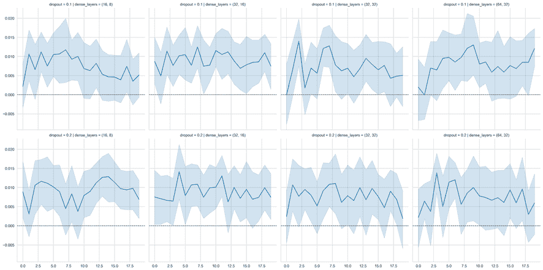

图 17.7：各种模型配置的信息系数

为了获得更具统计意义的见解，我们使用**普通最小二乘法**（**OLS**）进行线性回归（参见*第七章*，*线性模型 - 从风险因素到收益预测*），使用关于层、丢失率和批次大小选择以及每个时期的虚拟变量：

```py
data = pd.melt(ic, id_vars=params, var_name='epoch', value_name='ic')
data = pd.get_dummies(data, columns=['epoch'] + params, drop_first=True)
model = sm.OLS(endog=data.ic, exog=sm.add_constant(data.drop('ic', axis=1))) 
```

*图 17.8*中的图表绘制了每个回归系数的置信区间；如果不包含零，则系数在百分之五的水平上是显著的。y 轴上的 IC 值反映了与舍弃每个虚拟变量类别的配置的样本平均值相对差异（0.0027，p 值：0.017）。

在所有配置中，批处理大小为 256 和丢失率为 0.2 对性能产生了显著（但微小）的正面影响。类似地，训练七个时期产生了略微优越的结果。根据 F 统计量，回归总体上是显著的，但 R2 值非常低，接近零，强调了数据中噪音相对于参数选择传递的信号的高程度。

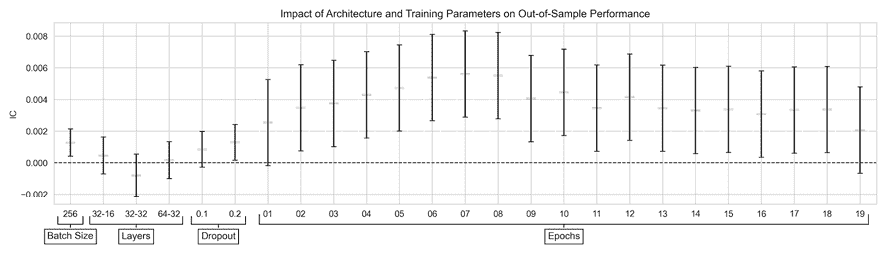

图 17.8：OLS 系数和置信区间

## 基于集成信号回测策略

要将我们的 NN 模型转换为交易策略，我们生成预测，评估其信号质量，创建定义如何根据这些预测进行交易的规则，并回测实施这些规则的策略的性能。请参阅笔记本`backtesting_with_zipline`以获取本节中的代码示例。

### 集成预测以产生可交易信号

为了减少预测的方差并对样本内过拟合进行套期保值，我们结合了在前一节表中列出的三个最佳模型的预测，并平均了结果。

为此，我们定义以下`generate_predictions()`函数，该函数接收模型参数作为输入，加载所需时期模型的权重，并为交叉验证和样本外期间创建预测（这里仅显示关键内容以节省空间）：

```py
def generate_predictions(dense_layers, activation, dropout,
                         batch_size, epoch):
    checkpoint_dir = Path('logs')
    checkpoint_path = checkpoint_dir / dense_layers / activation /
                      str(dropout) / str(batch_size)

    for fold, (train_idx, test_idx) in enumerate(cv.split(X_cv)):
        x_train, y_train, x_val, y_val = get_train_valid_data(X_cv, y_cv, 
                                                              train_idx, 
                                                              test_idx)
        x_val = scaler.fit(x_train).transform(x_val)
        model = make_model(dense_layers, activation, dropout, input_dim)
        status = model.load_weights(
            (checkpoint_path / f'ckpt_{fold}_{epoch}').as_posix())
        status.expect_partial()
        predictions.append(pd.Series(model.predict(x_val).squeeze(), 
                                     index=y_val.index))
    return pd.concat(predictions) 
```

我们使用 Alphalens 和 Zipline 回测来存储评估结果。

### 使用 Alphalens 评估信号质量

为了对集成模型预测的信号内容有所了解，我们使用 Alphalens 计算了根据预测分位数区分的五个等权重投资组合的回报差异（见*图 17.9*）。在一个交易日的持有期间，最高分位和最低分位之间的差距约为 8 个基点，这意味着 alpha 为 0.094，beta 为 0.107：

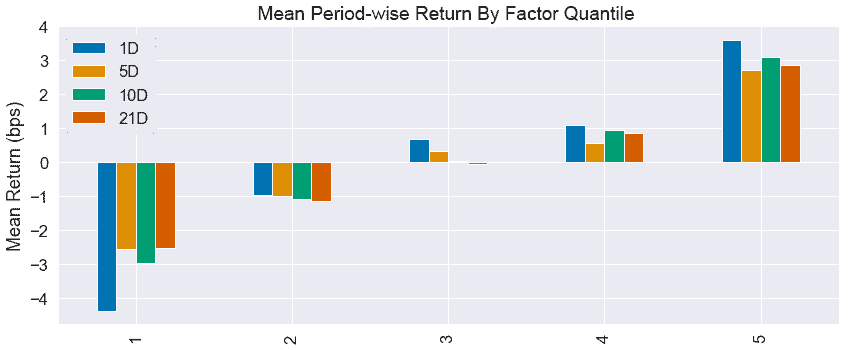

图 17.9：信号质量评估

### 使用 Zipline 回测策略

基于 Alphalens 分析，我们的策略将为具有最高正预测回报和最低负预测回报的 50 只股票输入长和短头寸，只要每边至少有 10 个选项。该策略每天进行交易。

*图 17.10*中的图表显示，该策略在样本内和样本外表现良好（在交易成本之前）：

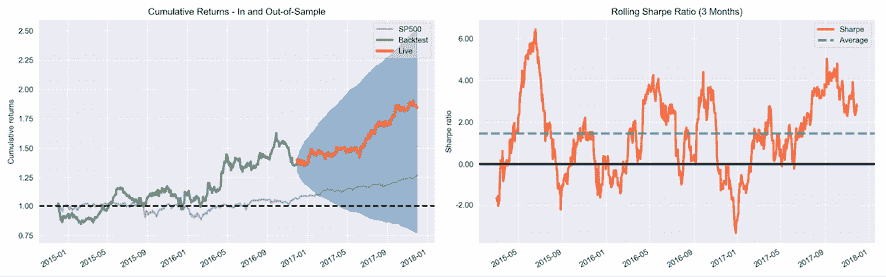

图 17.10：样本内和样本外回测表现

它在 36 个月的期间内产生了年化收益率为 22.8％，在样本内 24 个月为 16.5％，在样本外 12 个月为 35.7％。夏普比率在样本内为 0.72，在样本外为 2.15，提供了 0.18（0.29）的 alpha 和 0.24（0.16）的 beta 在/样本外。

## 如何进一步改进结果

相对简单的架构产生了一些有希望的结果。要进一步提高性能，首先可以添加新功能和更多数据到模型中。

或者，您可以使用更复杂的架构，包括适用于顺序数据的 RNN 和 CNN，而香草前馈 NN 并不设计捕获特征的有序性。

我们将在下一章中转向这些专用架构。

# 摘要

在本章中，我们将 DL（深度学习）介绍为一种从高维、非结构化数据中提取层次特征的表征学习形式。我们看到了如何使用 NumPy 设计、训练和正则化前馈神经网络。我们演示了如何使用流行的 DL 库 PyTorch 和 TensorFlow，这些库适用于从快速原型到生产部署的用例。

最重要的是，我们使用 TensorFlow 设计和调优了一个神经网络（NN），能够在样本内和样本外期间生成可交易的信号，从而获得了可观的回报。

在下一章中，我们将探讨 CNNs，它们特别适用于图像数据，但也适用于序列数据。
