# 18

# 用于金融时间序列和卫星图像的 CNNs

在本章中，我们介绍了一系列我们将在 *第四部分* 中涵盖的专业深度学习架构中的第一个。深度**卷积神经网络**（**CNNs**）已在各种计算机视觉任务中实现了超人类的表现，如分类图像和视频以及检测和识别图像中的对象。CNNs 也可以从具有与图像数据相似特征的时间序列数据中提取信号，并已成功应用于语音识别（Abdel-Hamid 等人，2014 年）。此外，它们已被证明在各个领域的时间序列分类中提供了最先进的性能（Ismail Fawaz 等人，2019 年）。

CNNs 是根据一种称为**卷积**的线性代数操作命名的，该操作在其至少一个层次中替代了前馈网络（在上一章中讨论过）中典型的矩阵乘法。我们将展示卷积的工作原理以及它们为什么特别适合具有某种规则结构的数据，通常在图像中发现，但也存在于时间序列中。

**CNN 架构**的研究进展非常迅速，不断涌现出可以提高基准性能的新架构。我们将描述一组成功应用中一直使用的构建块，并演示如何通过使用对于输入更接近的 CNN 层的预训练权重来加快学习，同时微调最终层以完成特定任务。我们还将说明如何将 CNNs 用于特定的计算机视觉任务，如**目标检测**。

CNNs 可以通过从图像或（多个）时间序列数据中生成信号来构建**交易策略**：

+   **卫星数据**可以通过农业区域、矿区或像油轮这样的交通网络的航拍图像来预示未来商品趋势，包括某些作物或原材料的供应。例如，来自购物中心的**监控摄像头**视频可以用来追踪和预测消费者活动。

+   **时间序列数据**涵盖了非常广泛的数据来源，CNNs 利用其与图像的结构相似性已被证明可以提供高质量的分类结果。

我们将创建一个基于 CNN 预测的交易策略，该策略使用经过特意格式化的像图像一样的时间序列数据，并演示如何构建一个用于分类卫星图像的 CNN。

更具体地，在本章中，您将学习以下内容：

+   如何使用几个构建块有效地模拟网格状数据的 CNNs

+   使用 TensorFlow 对图像和时间序列数据进行训练、调整和正则化的 CNNs

+   使用迁移学习来简化 CNNs，即使数据较少

+   使用格式化为图像的时间序列数据的 CNN 对收益预测设计交易策略

+   如何分类卫星图像

你可以在对应的 GitHub 仓库目录中找到本章的代码示例和其他资源链接。笔记本包括图像的彩色版本。

# 如何训练卷积神经网络来建模网格数据

卷积神经网络在概念上类似于前馈 **神经网络**（**NNs**）：它们由带有权重和偏置的单元组成，训练过程调整这些参数，以根据损失函数优化给定输入的网络输出。它们最常用于分类。每个单元使用其参数对输入数据或从其他单元接收到的激活应用线性操作，通常跟随非线性变换。

整体网络模型了一个 **可微分函数**，它将原始数据，如图像像素，映射到类概率，使用类似 softmax 的输出激活函数。卷积神经网络使用诸如交叉熵损失之类的目标函数来用单个指标衡量输出的质量。它们还依赖于相对于网络参数的损失的梯度，通过反向传播进行学习。

全连接层的前馈神经网络在具有大量像素值的高维图像数据上不易扩展。即使是我们将在下一节中使用的 CIFAR-10 数据集中包含的低分辨率图像也包含 32×32 像素，每个像素由 8 位表示多达 256 种不同的颜色值。例如，对于 RGB 色彩模型的红、绿和蓝三个通道，完全连接的输入层中的单个单元意味着 32 × 32 × 3 = 3,072 个权重。对于标准分辨率 640×480 像素来说，单个输入单元已经产生接近 100 万个权重。具有几层有意义宽度的深度结构很快导致参数数量激增，在训练期间过拟合几乎是肯定的。

全连接的前馈神经网络对输入数据的局部结构不做任何假设，因此对特征进行任意重排序对训练结果没有影响。相比之下，卷积神经网络做出了 **关键假设**，即 **数据具有网格状拓扑结构**，并且 **局部结构很重要**。换句话说，它们编码了这样一种假设：输入具有图像数据通常具有的结构：像素形成一个二维网格，可能有多个通道来表示颜色信号的组成部分。此外，附近像素的值可能比遥远的数据点更相关于检测边缘和角落等关键特征。自然地，最初的卷积神经网络应用，如手写识别，集中在图像数据上。

随着时间的推移，研究人员逐渐认识到**时间序列数据中的类似特征**，扩大了 CNN 的有效使用范围。时间序列数据包含在时间轴上创建的间隔的测量值，形成沿时间轴的一维网格，例如给定股票的滞后回报。 还可以具有第二个维度，该维度具有此股票和相同时间段的其他特征。 最后，我们可以使用第三维来表示其他股票。

超出图像的常见 CNN 用例还包括音频数据，无论是在时间域中的一维波形还是在傅里叶变换后的频率域中的二维频谱。CNN 也在 AlphaGo 中扮演了关键角色，这是第一个击败人类的围棋算法，在那里它们评估了网格状棋盘上的不同位置。

编码**网格状拓扑假设**的最重要元素是给 CNN 命名的**卷积**操作，与**池化**相结合。我们将看到，关于输入和输出数据之间的功能关系的具体假设意味着 CNN 需要更少的参数并更有效地计算。

在本节中，我们将解释卷积和池化层如何学习提取局部特征的过滤器，以及为什么这些操作特别适用于具有刚刚描述的结构的数据。最先进的 CNN 将许多这些基本构建块组合在一起，以实现上一章描述的分层表示学习。我们最后将描述过去十年中关键的架构创新，这些创新带来了巨大的性能改进。

## 从手工编码到从数据中学习过滤器

对于图像数据，这种局部结构传统上推动了开发手工编码过滤器的发展，这些过滤器提取这样的模式以供**机器学习**（**ML**）模型使用。

*图 18.1*展示了设计用于检测特定边缘的简单过滤器的效果。笔记本`filter_example.ipynb`演示了如何在卷积网络中使用手工编码的过滤器，并可视化图像的结果转换。 过滤器是一个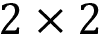矩阵中排列的简单的[-1, 1]模式，显示在图的右上方。 在每个过滤器下面，显示其效果； 它们有点微妙，将在随附笔记本中更容易看到。

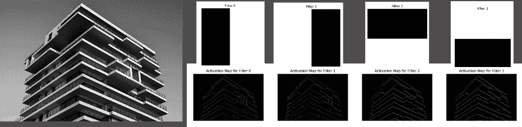

图 18.1：应用于图像的基本边缘过滤器的结果

相比之下，卷积层旨在从数据中学习这种局部特征表示。一个关键的见解是将它们的输入，称为**接受域**，限制在输入的一个小区域内，以便它捕获反映常见模式如边缘或角落的基本像素组合。这样的模式可能出现在图像的任何地方，因此 CNN 也需要识别不同位置和可能有小变化的类似模式。

随后的层次学习合成这些局部特征，以检测**高阶特征**。GitHub 上的链接资源包括一些我们在下一节关于参考架构中介绍的深度架构学习到的卷积神经网络卷积核的可视化示例。

## 卷积层中元素的操作方式

卷积层整合了**三种架构思想**，使得学习到的特征表示在某种程度上对移位、尺度变化和失真具有不变性：

+   稀疏连接而不是密集连接

+   权重共享

+   空间或时间下采样

此外，卷积层允许输入的大小可变。我们将逐步介绍一个典型的卷积层，并依次描述每个思想。

*图 18.2*概述了通常在三维卷积层中发生的一系列操作，假设图像数据输入具有高度、宽度和深度三个维度，或者通道数。像素值的范围取决于位表示，例如，8 位表示为[0, 255]。或者，宽度轴可以表示时间，高度可以表示不同的特征，通道可以捕捉到关于不同对象的观察，例如股票。

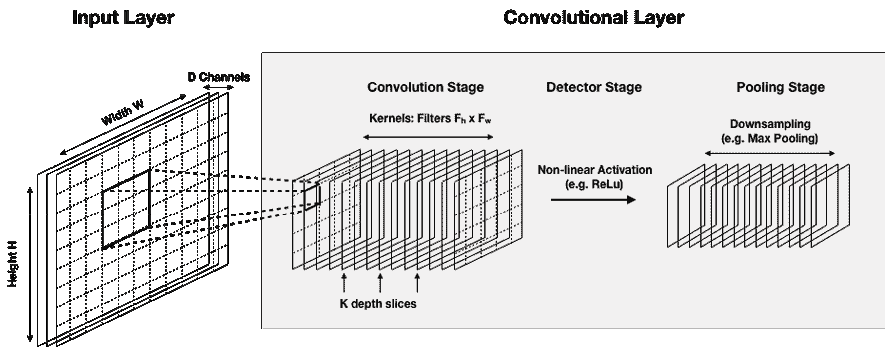

图 18.2：二维卷积层中的典型操作

连续的计算通过卷积、探测器和池化阶段处理输入，我们在接下来的三节中描述了这些阶段。在*图 18.2*中描绘的例子中，卷积层接收三维输入并产生相同维度的输出。

当代的卷积神经网络由多个这样大小不同的层次组成，这些层次要么堆叠在一起，要么在不同的分支上并行运行。随着每一层的增加，网络可以检测到更高级别、更抽象的特征。

### 卷积阶段 - 提取局部特征

第一阶段应用一个滤波器，也称为**核**，到输入图像的重叠块上。滤波器是比输入要小得多的矩阵，因此其感受野限制在几个连续值（如像素或时间序列值）上。因此，它专注于局部模式，并且相对于完全连接的层，大大减少了参数和计算的数量。

一个完整的卷积层具有多个按深度切片组织的**特征图**（如*图 18.2*所示），以便每一层可以提取多个特征。

#### 从滤波器到特征图

在扫描输入时，内核与其感受野覆盖的每个输入段进行卷积。卷积操作简单地是过滤器权重和匹配输入区域的值之间的点积，两者都已重塑为向量。每次卷积因此产生一个数字，整个扫描产生一个特征图。由于相同向量的点积最大化，特征图指示了每个输入区域的激活程度。

*图 18.3*说明了使用给定值扫描 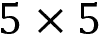 输入并使用  过滤器的结果，以及特征图右上角的激活是如何由扁平化的输入区域和内核的点积产生的：

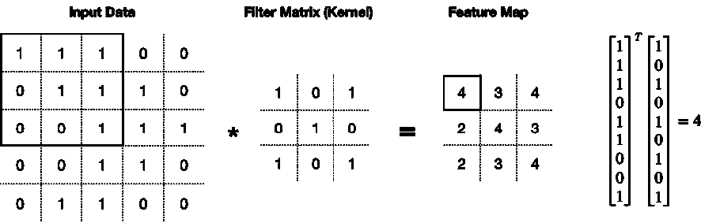

图 18.3：从卷积到特征图

最重要的是，**过滤器值是卷积层的参数**，在训练期间从数据中学习以最小化选择的损失函数。换句话说，CNN 通过找到激活对所需任务最有用的输入模式的内核值来学习有用的特征表示。

#### 如何扫描输入 – 步幅和填充

**步幅**定义了用于扫描输入的步长，即水平和垂直移动的像素数。较小的步幅可以扫描更多（重叠）区域，但计算成本更高。当过滤器与输入不完全匹配并且在扫描过程中部分跨越图像边界时，通常使用四种选项：

+   **有效卷积**：丢弃图像和过滤器不完全匹配的扫描

+   **相同卷积**：使用零填充输入以生成相同大小的特征图

+   **全卷积**：对输入进行零填充，以便每个像素被扫描相同次数，包括边界像素（以避免过度采样接近中心的像素）

+   **因果性**：仅在左侧对输入进行零填充，以使输出不依赖于以后的输入；为时间序列数据保持时间顺序

选择取决于数据的性质和有用特征可能位于的位置。它们与深度切片的数量结合使用，确定了卷积阶段的输出大小。Andrew Karpathy 的斯坦福讲义笔记（参见 GitHub）包含使用 NumPy 的有用示例。

#### 用于稳健特征和快速计算的参数共享

由于失真或位移，显着特征的位置可能会变化。此外，整个图像可能都可以使用基本特征检测器。CNN 通过在给定深度切片中共享或绑定过滤器的权重来编码这些假设。

因此，每个深度切片都专门针对某种模式，参数数量进一步减少。然而，当图像在空间上居中且关键模式不太可能在输入区域中均匀分布时，权重共享效果较差。

### 探测器阶段 - 添加非线性

特征图通常通过非线性变换。我们在上一章中遇到的**修正线性单元**（**ReLU**）是一个常用函数。ReLU 通过零逐元素地替换负激活，减轻了在其他激活函数中发现的梯度消失的风险，如 tanh（参见*第十七章*，*用于交易的深度学习*）。

一种流行的替代方法是**softplus 函数**：

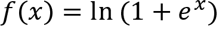

与 ReLU 相比，它在任何地方都具有导数，即我们用于逻辑回归的 sigmoid 函数（参见*第七章*，*线性模型 - 从风险因子到收益预测*）。

### 池化阶段 - 对特征图进行降采样

卷积层的最后阶段可能会对特征图的输入表示进行降采样以执行以下操作：

+   减少其维度并防止过拟合

+   降低计算成本

+   启用基本的平移不变性

这假设特征的精确位置不仅对于识别模式的重要性较小，而且甚至可能是有害的，因为对于目标的不同实例，它可能会有所不同。池化通过降低特征图的空间分辨率来简化位置信息，这是使位置信息不那么精确的一种简单方式。但是，此步骤是可选的，许多架构仅对一些层使用池化或根本不使用。

一种常见的池化操作是**最大池化**，它仅使用（通常）非重叠子区域中的最大激活值。例如，对于一个小的特征图，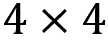 最大池化输出每个四个非重叠区域的最大值。较少见的池化运算符使用平均值或中位数。池化不会添加或学习新参数，但输入窗口的大小和可能的步幅是额外的超参数。

## CNN 架构的演变 - 关键创新

在过去的二十年中，几种 CNN 架构通过引入重要的创新推动了性能边界。随着大数据以 ImageNet（Fei-Fei 2015）的形式到来，预测性能的增长速度显著加快，其中包括通过亚马逊的 Mechanical Turk 由人类分配到 20,000 个类别的 1400 万张图像。**ImageNet 大规模视觉识别挑战赛**（**ILSVRC**）成为围绕稍小一些的来自 1000 个类别的 120 万张图像的 CNN 进展的焦点。

对于实际原因，熟悉主导这些比赛的**参考架构**是有用的。正如我们将在下一节关于处理图像数据的 CNNs 中看到的那样，它们为标准任务提供了一个很好的起点。此外，**迁移学习**使我们能够在成功的架构上构建预训练权重，从而解决许多计算机视觉任务。迁移学习不仅加快了架构选择和训练的速度，还使得在更小的数据集上成功应用成为可能。

另外，许多出版物提到了这些架构，并且它们经常作为量身定制的网络的基础，用于分割或定位任务。我们将在关于图像分类和迁移学习的章节进一步描述一些里程碑式的架构。

### 性能突破和网络规模

*图 18.4*的左侧绘制了各种网络架构的计算成本与 top-1 准确度之间的关系。它表明参数数量与性能之间存在正相关关系，但同时也显示出更多参数的边际效益下降，架构设计和创新也很重要。

右侧绘制了所有网络的每个参数的 top-1 准确度。几种新的架构针对了在诸如手机等性能较低的设备上的用例。虽然它们没有达到最先进的性能，但它们找到了更有效的实现方式。有关这些架构及其图表背后的分析的更多详细信息，请参阅 GitHub 上的资源。

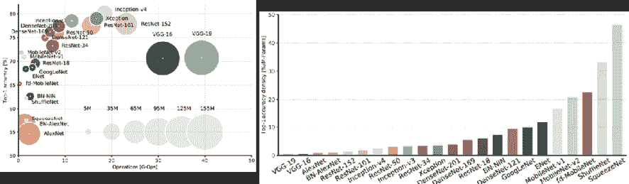

图 18.4：预测性能和计算复杂度

### 学到

从 20 年的 CNN 架构发展中学到的一些教训，特别是自 2012 年以来，包括以下内容：

+   **较小的卷积**滤波器表现更好（可能除了在第一层），因为几个小滤波器可以以较低的计算成本替代一个更大的滤波器。

+   **1 × 1 卷积**减少了特征图的维度，使得网络能够整体学习更多的数量。

+   **跳跃连接**能够通过网络创建多条路径，并使得能够训练容量更大的 CNNs。

# 用于卫星图像和对象检测的 CNNs

在本节中，我们演示了如何解决关键的计算机视觉任务，例如图像分类和对象检测。正如在介绍和*第三章*，*金融替代数据 - 类别和用例*中所述，图像数据可以通过提供关于未来趋势、变化的基本面或与目标资产类别或投资范围相关的特定事件的线索，来为交易策略提供信息。流行的示例包括利用卫星图像来获取关于农产品供应、消费者和经济活动，或制造业或原材料供应链状况的线索。具体任务可能包括以下内容，例如：

+   **图像分类**：识别某些作物的耕种土地是否正在扩大，或者预测收获的质量和数量

+   **对象检测**：计算某条运输路线上的油轮数量或停车场中汽车的数量，或者识别购物中心中购物者的位置

在本节中，我们将演示如何设计 CNN 来自动提取此类信息，既可以从流行的架构开始，也可以通过迁移学习微调预训练权重以适应给定任务。我们还将演示如何在给定场景中检测对象。

我们将介绍用于这些任务的关键 CNN 架构，解释它们为什么效果好，并展示如何使用 TensorFlow 2 对它们进行训练。我们还将演示如何获取预训练权重并进行微调。不幸的是，直接与交易策略相关信息的卫星图像非常昂贵且不容易获得。然而，我们将演示如何使用 EuroSat 数据集来构建一个识别不同土地用途的分类器。这篇简要介绍关于计算机视觉的 CNN 旨在演示如何处理常见任务，这些任务可能在设计基于图像的交易策略时需要解决。

所有我们在上一章介绍的库都支持卷积层；我们将专注于 TensorFlow 2 的 Keras 接口。我们首先将使用 MNIST 手写数字数据集来说明 LeNet5 架构。接下来，我们将演示如何在 CIFAR-10 上使用 AlexNet 进行数据增强，这是原始 ImageNet 的简化版本。然后，我们将继续使用最先进的架构进行迁移学习，然后将所学应用于实际卫星图像。最后，我们将以实际场景中的对象检测示例结束。

## LeNet5 – 第一个具有工业应用的 CNN

Yann LeCun，现任 Facebook AI 研究总监，是 CNN 发展的领先先驱之一。在经历了从 1980 年代开始的数次迭代后，1998 年，LeNet5 成为了第一个现代 CNN，在真实应用中引入了几个今天仍然相关的架构元素。

LeNet5 发表在一篇非常有启发性的论文中，《基于梯度的学习应用于文档识别》（LeCun 等人，1989 年），该论文阐述了许多核心概念。最重要的是，它提出了卷积与可学习滤波器相结合在多个位置提取相关特征的见解，而参数却很少。考虑到当时的计算资源有限，效率至关重要。

LeNet5 设计用于识别支票上的手写字，并被几家银行使用。它为分类准确率建立了一个新的基准，MNIST 手写数字数据集的结果为 99.2％。它由三个卷积层组成，每个卷积层都包含非线性 tanh 变换、池化操作和一个全连接的输出层。在卷积层中，特征图的数量增加，而它们的维度减小。它总共有 60,850 个可训练参数（Lecun 等人，1998 年）。

### 卷积神经网络的“Hello World”–手写数字分类

在本节中，我们将实现一个稍微简化的 LeNet5 版本，以演示如何使用 TensorFlow 实现 CNN。原始的 MNIST 数据集包含 60,000 个灰度图像，每个图像的分辨率为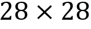像素，每个图像包含一个从 0 到 9 的单个手写数字。一个很好的替代品是更具挑战性但结构相似的 Fashion MNIST 数据集，我们在*第十三章*中遇到了它，*数据驱动的风险因子和无监督学习的资产配置*。有关实现细节，请参阅`digit_classification_with_lenet5`笔记本。

我们可以直接在 Keras 中加载它：

```py
from tensorflow.keras.datasets import mnist
(X_train, y_train), (X_test, y_test) = mnist.load_data()
X_train.shape, X_test.shape
((60000, 28, 28), (10000, 28, 28)) 
```

*图 18.5*显示了数据集中的前十个图像，并突出显示了相同数字实例之间的显着变化。右侧显示了单个图像的像素值范围从 0 到 255：

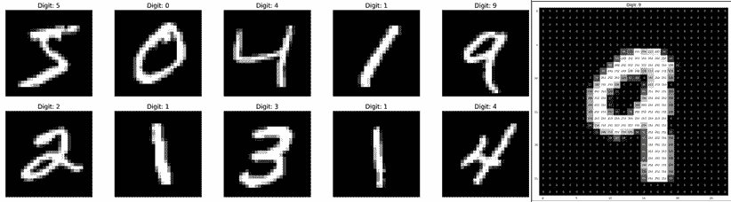

图 18.5：MNIST 样本图像

我们将像素值重新缩放到范围[0, 1]以规范化训练数据，并促进反向传播过程，并将数据转换为 32 位浮点数，这减少了内存需求和计算成本，同时为我们的用例提供了足够的精度：

```py
X_train = X_train.astype('float32')/255
X_test = X_test.astype('float32')/255 
```

### 定义 LeNet5 架构

我们可以定义一个简化版的 LeNet5，省略了包含径向基函数的原始最终层，使用默认的“valid”填充和单步跨度，除非另有定义：

```py
lenet5 = Sequential([
    Conv2D(filters=6, kernel_size=5, activation='relu', 
           input_shape=(28, 28, 1), name='CONV1'),
    AveragePooling2D(pool_size=(2, 2), strides=(1, 1), 
                     padding='valid', name='POOL1'),
    Conv2D(filters=16, kernel_size=(5, 5), activation='tanh', name='CONV2'),
    AveragePooling2D(pool_size=(2, 2), strides=(2, 2), name='POOL2'),
    Conv2D(filters=120, kernel_size=(5, 5), activation='tanh', name='CONV3'),
    Flatten(name='FLAT'),
    Dense(units=84, activation='tanh', name='FC6'),
    Dense(units=10, activation='softmax', name='FC7')
]) 
```

摘要表明，所定义的模型具有超过 300,000 个参数：

```py
Layer (type)                 Output Shape              Param #   
CONV1 (Conv2D)               (None, 24, 24, 6)         156       
POOL1 (AveragePooling2D)     (None, 23, 23, 6)         0         
CONV2 (Conv2D)               (None, 19, 19, 16)        2416      
_________________________________________________________________
POOL2 (AveragePooling2D)     (None, 9, 9, 16)          0         
_________________________________________________________________
CONV3 (Conv2D)               (None, 5, 5, 120)         48120     
_________________________________________________________________
FLAT (Flatten)               (None, 3000)              0         
_________________________________________________________________
FC6 (Dense)                  (None, 84)                252084    
________________________________________________________________
FC7 (Dense)                  (None, 10)                850       =================================================================
Total params: 303,626
Trainable params: 303,626 
```

我们使用`sparse_crossentropy_loss`进行编译，它接受整数而不是 one-hot 编码的标签和原始的随机梯度优化器：

```py
lenet5.compile(loss='sparse_categorical_crossentropy',
               optimizer='SGD',
               metrics=['accuracy']) 
```

### 训练和评估模型

现在我们准备训练模型。模型期望四维输入，因此我们相应地进行了 reshape。我们使用标准的批量大小 32 和 80:20 的训练-验证分割。此外，我们利用检查点来存储模型权重，如果验证错误改进，并确保数据集被随机洗牌。我们还定义了一个`early_stopping`回调，以在验证准确性不再改进 20 次迭代后中断训练：

```py
lenet_history = lenet5.fit(X_train.reshape(-1, 28, 28, 1),
                          y_train,
                          batch_size=32,
                          epochs=100,
                          validation_split=0.2, # use 0 to train on all data
                          callbacks=[checkpointer, early_stopping],
                          verbose=1,
                          shuffle=True) 
```

训练历史记录了在 81 个周期之后的最后一次改进，这需要在单个 GPU 上花费约 4 分钟。这个样本运行的测试准确率为 99.09％，几乎与原始 LeNet5 的结果完全相同：

```py
accuracy = lenet5.evaluate(X_test.reshape(-1, 28, 28, 1), y_test, verbose=0)[1]
print('Test accuracy: {:.2%}'.format(accuracy))
Test accuracy: 99.09% 
```

为了比较，一个简单的两层前馈网络只能达到 "仅" 97.04% 的测试准确度（见笔记本）。实际上，LeNet5 在 MNIST 上的改进是有限的。非神经方法也已经实现了大于或等于 99% 的分类精度，包括 K 最近邻和支持向量机。CNN 在处理更具挑战性的数据集时表现得非常出色，接下来我们将看到。

## AlexNet – 重新点燃了深度学习研究

AlexNet，由 Alex Krizhevsky、Ilya Sutskever 和 Geoff Hinton 在多伦多大学开发，显著降低了错误率，并在 2012 年 ILSVRC 中显著优于亚军，将前五错误率从 26% 降低到 16% (Krizhevsky, Sutskever 和 Hinton 2012)。这一突破引发了机器学习研究的复兴，并将计算机视觉的深度学习牢牢地放在了全球技术地图上。

AlexNet 的架构类似于 LeNet，但更深更宽。它通常被认为是发现了**深度的重要性**，约 6000 万参数，比 LeNet5 多了 1000 倍，这证明了计算能力的增加，尤其是 GPU 的使用，以及更大的数据集。

它采用了卷积堆叠而不是将每个卷积与池化阶段相结合，成功地使用了**dropout**进行正则化和**ReLU**进行高效的非线性变换。它还使用数据增强来增加训练样本的数量，添加了权重衰减，并使用了更高效的卷积实现。它还通过在两个 GPU 上分布网络来加速训练。

笔记本 `image_classification_with_alexnet.ipynb` 中有一个稍微简化了的 AlexNet 版本，专门针对 CIFAR-10 数据集，该数据集包含了原始的 1000 类中的 10 类共 60000 张图像。它已经从原始的 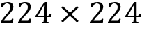 像素分辨率压缩到了 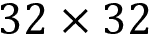 像素，但仍然具有三个色彩通道。

有关实现详细信息，请参阅笔记本 `image_classification_with_alexnet`；这里我们将跳过一些重复的步骤。

### 使用图像增强预处理 CIFAR-10 数据

CIFAR-10 也可以使用 TensorFlow 的 Keras 接口下载，并且我们将像在上一节中使用 MNIST 时那样重新调整像素值并对十个类标签进行 one-hot 编码。

我们首先对 50000 个训练样本进行了 45 个周期的两层前馈网络训练，以达到 45.78% 的测试准确度。我们还尝试了一个具有 528000 个参数的三层卷积网络，其测试准确度达到了 74.51% （见笔记本）。

提高性能的常见技巧是通过创建合成数据人为增加训练集的大小。这涉及随机移动或水平翻转图像，或向图像中引入噪声。TensorFlow 包含一个用于此目的的 `ImageDataGenerator` 类。我们可以按如下配置并拟合训练数据：

```py
from tensorflow.keras.preprocessing.image import ImageDataGenerator
datagen = ImageDataGenerator(
    width_shift_range=0.1,   # randomly horizontal shift
    height_shift_range=0.1,  # randomly vertical shift
    horizontal_flip=True)    # randomly horizontal flip
datagen.fit(X_train) 
```

结果显示，增强图像（低分辨率 32×32）如预期地已以各种方式被改变：

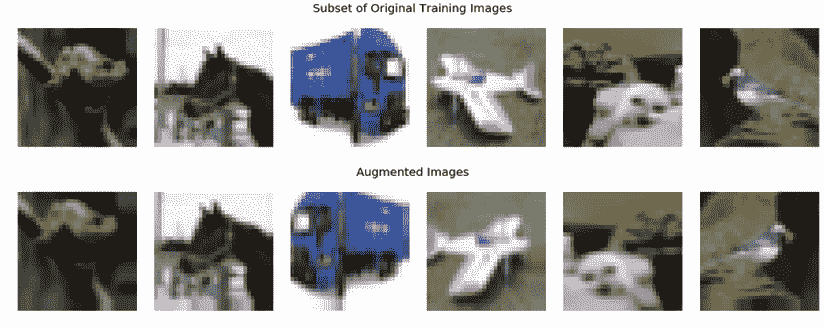

图 18.6：原始和增强样本

经过在更大的、增强的数据上训练后，三层 CNN 的测试准确率略有提高，达到了 76.71%。

### 定义模型架构

我们需要将 AlexNet 架构调整到与竞赛中使用的 ImageNet 样本相比，CIFAR-10 图像的较低维度上。为此，我们保持原始滤波器的数量，但将它们变小（有关实施细节，请参见笔记本）。

摘要（见笔记本）显示了五个卷积层，后跟两个频繁使用批量标准化的全连接层，共计 2150 万参数。

### 比较 AlexNet 性能

除了 AlexNet，我们还训练了一个两层前馈 NN 和一个三层 CNN，后者有和没有图像增强。经过 100 个时期（如果验证准确率在 20 个回合内没有改善，则提前停止），我们获得了四个模型的交叉验证轨迹和测试准确率，如*图 18.7*所示：

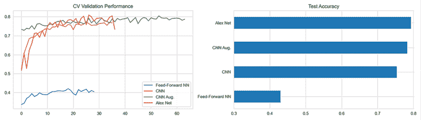

图 18.7：CIFAR-10 的验证性能和测试准确率

在经过大约 35 个时期后，AlexNet 在测试准确率方面达到了最高的 79.33%，紧随其后的是在更大的数据集上训练时间更长的增强图像的较浅的 CNN，其测试准确率为 78.29%。在这个更复杂的数据集上，前馈 NN 的表现远不如在 MNIST 上，测试准确率为 43.05%。

## 迁移学习-更少数据的更快训练

在实践中，有时我们没有足够的数据来随机初始化地从头训练 CNN。**迁移学习**是一种机器学习技术，它重新利用了在一个数据集上训练的模型来完成另一个任务。如果成功，它可以带来更好的性能和更快的训练，需要的标记数据比在目标任务上从头训练神经网络要少。

### 转移学习的替代方法

CNN 的迁移学习方法依赖于在一个非常大的数据集（如 ImageNet）上进行预训练。其目标是使卷积滤波器提取的特征表示泛化到新图像。在第二步中，它利用结果要么初始化和重新训练一个新的 CNN，要么将其用作处理感兴趣任务的新网络的输入。

如前所述，CNN 架构通常使用一系列卷积层来检测分层模式，然后添加一个或多个全连接层将卷积激活映射到结果类别或值。馈入完全连接部分的最后一个卷积层的输出称为瓶颈特征。我们通常在应用 ReLU 激活函数后，可以将预训练网络的**瓶颈特征**用作新的全连接网络的输入。

换句话说，我们冻结卷积层，并**替换网络的密集部分**。另一个好处是我们可以使用不同尺寸的输入，因为是密集层限制了输入大小。

或者，我们可以将瓶颈特征用作**输入到不同的机器学习算法**。例如，在 AlexNet 架构中，瓶颈层为每个输入图像计算一个包含 4,096 个条目的向量。然后，我们将此向量用作新模型的特征。

我们还可以进一步，不仅使用新数据替换和重新训练最终层，而且**微调预训练的 CNN 的权重**。为了实现这一点，我们继续训练，要么仅针对较后面的层，同时冻结一些较早的层的权重，要么对所有层进行训练。动机可能是保留更低层学到的更通用的模式，例如边缘或颜色斑块检测器，同时允许 CNN 的后续层适应新任务的细节。例如，ImageNet 包含各种各样的狗品种，这可能导致特征表示特定于区分这些类别。

### 建立在最先进的架构之上

转移学习使我们能够利用表现出色的架构，而无需进行可能相当耗费 GPU 和数据的训练。我们简要概述了一些其他流行架构的关键特性，这些架构是流行的起点。

#### VGGNet – 更深和更小的滤波器

ILSVRC 2014 的亚军是由牛津大学的视觉几何组（VGG，Simonyan 2015）开发的。它展示了**更小的**连续卷积滤波器的有效性，并强调了深度对于强大性能的重要性。VGG16 包含 16 个卷积和全连接层，仅执行卷积和池化操作（见*图 18.5*）。

VGG16 有**1.4 亿个参数**，这增加了训练和推断的计算成本以及内存需求。然而，大多数参数在后来被发现不是必需的全连接层中，因此删除它们大大减少了参数数量，而不会对性能产生负面影响。

#### GoogLeNet – 通过 Inception 减少参数

谷歌的 Christian Szegedy 使用更高效的 CNN 实现降低了计算成本，以促进规模化的实际应用。由于 **Inception 模块**，GoogLeNet（Szegedy 等人，2015）仅具有 400 万参数，而相比之下，AlexNet 具有 6000 万个参数，VGG16 具有 1.4 亿个参数。

Inception 模块建立在使用 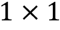 卷积来压缩深层卷积滤波器堆栈从而降低计算成本的 **网络内网络概念** 上。该模块使用并行的 、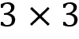 和  滤波器，将后两者与  卷积结合起来，以降低前一层传递的滤波器的维度。

此外，它使用平均池化代替完全连接的层来消除许多不太重要的参数。最近还有几个增强版本，最新的是 Inception-v4。

#### ResNet – 超越人类性能的快捷连接

**残差网络** **（ResNet）** 结构是在微软开发的，获得了 ILSVRC 2015 奖。它将 top-5 错误推到了 3.7%，低于人类在这项任务上的性能水平，约为 5%（He et al. 2015）。

它引入了跳过多个层的身份快捷连接，克服了训练深度网络的一些挑战，使得可以使用数百甚至超过一千个层。它还大量使用批量归一化，据显示可以允许更高的学习速率，并对权重初始化更宽容。该架构还省略了完全连接的最终层。

正如上一章所提到的，深度网络的训练面临着臭名昭著的梯度消失挑战：随着梯度传播到较早的层，小权重的重复乘法会使梯度朝零收缩。因此，增加深度可能会限制学习。

跳过两个或多个层的快捷连接已成为 CNN 架构中最流行的发展之一，并引发了大量研究工作来改进和解释其性能。有关更多信息，请参见 GitHub 上的参考资料。

### 在实践中使用 VGG16 进行迁移学习

现代 CNN 在多个 GPU 上对 ImageNet 进行训练可能需要数周，但幸运的是，许多研究人员分享他们的最终权重。例如，TensorFlow 2 包含了几种先前讨论过的参考架构的预训练模型，即 VGG16 及其更大的版本 VGG19、ResNet50、InceptionV3 和 InceptionResNetV2，以及 MobileNet、DenseNet、NASNet 和 MobileNetV2。

#### 如何提取瓶颈特征

笔记本`bottleneck_features.ipynb`说明了如何下载预训练的 VGG16 模型，无论是带有最终层以生成预测，还是不带最终层，如*图 18.8*所示，以提取由瓶颈特征产生的输出：

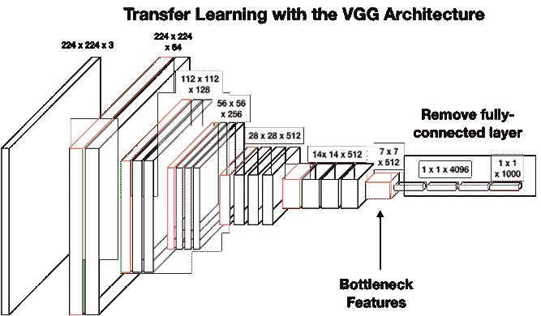

图 18.8：VGG16 架构

TensorFlow 2 使下载和使用预训练模型变得非常简单：

```py
from tensorflow.keras.applications.vgg16 import VGG16
vgg16 = VGG16()
vgg16.summary()
Layer (type)                 Output Shape              Param #   
input_1 (InputLayer)         (None, 224, 224, 3)       0            
… several layers omitted... 
block5_conv4 (Conv2D)        (None, 14, 14, 512)       2359808   
_________________________________________________________________
block5_pool (MaxPooling2D)   (None, 7, 7, 512)         0         
_________________________________________________________________
flatten (Flatten)            (None, 25088)             0         
fc1 (Dense)                  (None, 4096)              102764544 
fc2 (Dense)                  (None, 4096)              16781312  
predictions (Dense)          (None, 1000)              4097000   
Total params: 138,357,544
Trainable params: 138,357,544 
```

您可以像使用任何其他 Keras 模型一样使用此模型进行预测：我们传入七个样本图像，并获得每个 1,000 个 ImageNet 类别的类概率：

```py
y_pred = vgg16.predict(img_input)
Y_pred.shape
(7, 1000) 
```

要排除完全连接的层，只需添加关键字`include_top=False`。 现在，预测由最终卷积层`block5_pool`输出，并匹配该层的形状：

```py
vgg16 = VGG16(include_top=False)
vgg16.predict(img_input).shape
(7, 7, 7, 512) 
```

通过省略完全连接的层并仅保留卷积模块，我们不再被迫使用模型的固定输入大小，例如原始的 ImageNet 格式。 相反，我们可以将模型适应任意输入大小。

#### 如何微调预训练模型

我们将演示如何冻结预训练模型的一些或所有层，并使用具有不同格式的新完全连接的层和数据进行继续训练（请参阅笔记本`transfer_learning.ipynb`中的代码示例，改编自 TensorFlow 2 教程）。

我们使用在 TensorFlow 内置的猫与狗图像上使用 ImageNet 预训练的 VGG16 权重（请参阅有关如何获取数据集的笔记本）。

预处理将所有图像调整大小为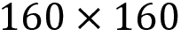像素。 我们在实例化预训练的 VGG16 实例时指示新的输入大小，然后冻结所有权重：

```py
vgg16 = VGG16(input_shape=IMG_SHAPE, include_top=False, weights='imagenet')
vgg16.trainable = False
vgg16.summary()
Layer (type)                 Output Shape              Param #   
... omitted layers...
block5_conv3 (Conv2D)        (None, 10, 10, 512)         2359808   
block5_pool (MaxPooling2D)   (None, 5, 5, 512)         0         
Total params: 14,714,688
Trainable params: 0
Non-trainable params: 14,714,688 
```

对于 32 个样本图像的模型输出形状现在与无头模型中的最后一个卷积层的形状相匹配：

```py
feature_batch = vgg16(image_batch)
Feature_batch.shape
TensorShape([32, 5, 5, 512]) 
```

我们可以使用顺序 API 或功能 API 将新层附加到无头模型。 对于 Sequential API，添加`GlobalAveragePooling2D`，`Dense`和`Dropout`层的操作如下：

```py
global_average_layer = GlobalAveragePooling2D()
dense_layer = Dense(64, activation='relu')
dropout = Dropout(0.5)
prediction_layer = Dense(1, activation='sigmoid')
seq_model = tf.keras.Sequential([vgg16, 
                                 global_average_layer, 
                                 dense_layer, 
                                 dropout, 
                                 prediction_layer])
seq_model.compile(loss = tf.keras.losses.BinaryCrossentropy(from logits=True),
                       optimizer = 'Adam', 
                       metrics=["accuracy"]) 
```

我们将`from_logits=True`设置为`BinaryCrossentropy`损失，因为模型提供了线性输出。 摘要显示了新模型如何结合预训练的 VGG16 卷积层和新的最终层：

```py
seq_model.summary()
Layer (type)                 Output Shape              Param #   
vgg16 (Model)                (None, 5, 5, 512)         14714688  
global_average_pooling2d (Gl (None, 512)               0         
dense_7 (Dense)              (None, 64)                32832     
dropout_3 (Dropout)          (None, 64)                0         
dense_8 (Dense)              (None, 1)                 65        
Total params: 14,747,585
Trainable params: 11,831,937
Non-trainable params: 2,915,648 
```

请参阅 Functional API 版本的笔记本。

在训练新的最终层之前，预训练的 VGG16 提供了 48.75％的验证准确性。 现在，我们将模型训练 10 个时期，仅调整最终层的权重：

```py
history = transfer_model.fit(train_batches,
                            epochs=initial_epochs,
                            validation_data=validation_batches) 
```

10 个时期将验证准确性提高到 94％以上。 为了微调模型，我们可以解冻 VGG16 模型并继续训练。 请注意，只有在训练新的最终层之后才应该这样做：随机初始化的分类层可能会产生大的梯度更新，从而可能消除预训练结果。

要解冻模型的部分，我们选择一个层，然后将权重设置为`trainable`； 在这种情况下，选择 VGG16 架构中总共 19 个层之一的第 12 层：

```py
vgg16.trainable = True
len(vgg16.layers)
19
# Fine-tune from this layer onward
start_fine_tuning_at = 12
# Freeze all the layers before the 'fine_tune_at' layer
for layer in vgg16.layers[:start_fine_tuning_at]:
    layer.trainable =  False 
```

现在只需重新编译模型，并使用早停继续进行最多 50 个时期的训练，从第 10 个时期开始，如下所示：

```py
fine_tune_epochs = 50
total_epochs = initial_epochs + fine_tune_epochs
history_fine_tune = transfer_model.fit(train_batches,
                                     epochs=total_epochs,
                                     initial_epoch=history.epoch[-1],
                                     validation_data=validation_batches,
                                     callbacks=[early_stopping]) 
```

*图 18.9* 显示了验证准确率如何显著增加，经过另外 22 个时期后达到 97.89％：

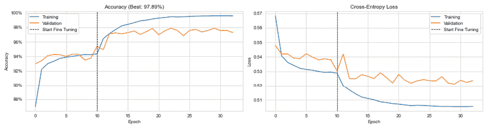

图 18.9：交叉验证性能：准确度和交叉熵损失

当训练数据有限时，迁移学习是一种重要技术，这在实践中经常发生。虽然猫和狗不太可能产生可交易的信号，但迁移学习肯定可以帮助提高对相关替代数据集（例如我们将要处理的卫星图像）的预测准确性。

### 使用迁移学习对卫星图像进行分类

用于替代数据的卫星图像在其中扮演着重要角色（见*第三章*，*金融领域的替代数据 - 类别和用例*）。例如，商品交易商可能依赖卫星图像来预测某些作物或资源的供应，方法是监控农场、矿场或油轮航行的活动。

#### EuroSat 数据集

为了说明如何处理这种类型的数据，我们加载了包含在 TensorFlow 2 数据集中的 EuroSat 数据集（Helber 等人，2019）。EuroSat 数据集包括约 27,000 张图像，格式为 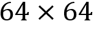，代表 10 种不同类型的土地利用。*图 18.10* 显示了每个标签的一个示例：

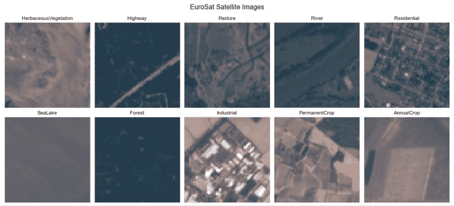

图 18.10：数据集中包含的十种土地利用类型

类似数据的时间序列可以用来跟踪耕种、工业和住宅区域的相对大小，或者特定作物的状态，以预测收获量或质量，例如葡萄酒。

#### 对非常深的 CNN 进行微调 - DenseNet201

黄等人（2018）根据这样一个洞见开发了一个新的架构，名为**密集连接**，即如果 CNN 包含接近输入和接近输出的层之间的较短连接，则可以更深，更准确，更容易训练。

一种被标记为**DenseNet201**的架构以前向传播的方式连接每一层到每一层。它使用所有前一层的特征映射作为输入，而每一层的特征映射成为所有后续层的输入。

我们从 `tensorflow.keras.applications` 下载 DenseNet201 架构，并用以下稠密层替换其最终层，其中包含批量归一化以减轻这个具有超过 700 层的非常深层网络中的梯度爆炸或消失：

```py
Layer (type)                 Output Shape              Param #   
densenet201 (Model)          (None, 1920)              18321984  
batch_normalization (BatchNo (None, 1920)              7680      
dense (Dense)                (None, 2048)              3934208   
batch_normalization_1 (Batch (None, 2048)              8192      
dense_1 (Dense)              (None, 2048)              4196352   
batch_normalization_2 (Batch (None, 2048)              8192      
dense_2 (Dense)              (None, 2048)              4196352   
batch_normalization_3 (Batch (None, 2048)              8192      
dense_3 (Dense)              (None, 2048)              4196352   
batch_normalization_4 (Batch (None, 2048)              8192      
dense_4 (Dense)              (None, 10)                20490     
Total params: 34,906,186
Trainable params: 34,656,906
Non-trainable params: 249,280 
```

#### 模型训练和结果评估

我们将训练图像的 10％用于验证目的，并在 10 个时期后获得 97.96％的最佳外样分类准确度。这超过了原始论文中引用的最佳 ResNet-50 架构的性能，其分割比为 90-10。

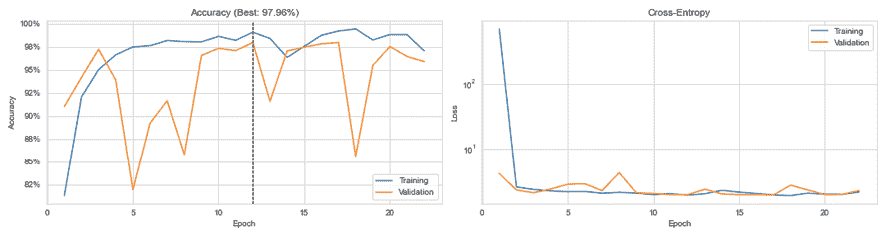

图 18.11：交叉验证性能

从相对较小的训练集中进行增强很可能会获得额外的性能提升。

## 目标检测和分割

图像分类是一项基本的计算机视觉任务，它要求根据图像中包含的某些对象对图像进行标记。许多实际应用，包括投资和交易策略，都需要额外的信息：

+   **目标检测**任务不仅需要识别所有感兴趣对象，还需要这些对象的空间位置，通常使用边界框。已开发了几种算法来克服暴力滑动窗口方法的低效率，包括区域提议方法（R-CNN；例如，参见 Ren 等人 2015）和**你只需要看一次**（**YOLO**）实时目标检测算法（Redmon 2016）。

+   **对象分割**任务更进一步，需要一个类别标签和输入图像中每个对象的轮廓。这对于计算图像中的物体数量，例如油船、个人或汽车，并评估活动水平可能会有所帮助。

+   **语义分割**，也称为场景解析，进行密集预测，为图像中的每个像素分配一个类别标签。因此，图像被分割成语义区域，每个像素被分配到其包围的对象或区域。

目标检测需要区分几类对象的能力，并决定图像中存在多少个以及哪些对象。

## 实践中的目标检测

一个著名的例子是 Ian Goodfellow 从 Google 的 **街景房屋号码**（**SVHN**）数据集（Goodfellow 2014）中识别房屋号码。它要求模型识别以下内容：

+   最多五位数字中有多少位构成门牌号

+   每个组件的正确数字

+   数字构成的正确顺序

我们将展示如何预处理不规则形状的源图像，调整 VGG16 架构以产生多个输出，并在微调预训练权重以解决任务之前，训练最终层。

### 对源图像进行预处理

笔记本 `svhn_preprocessing.ipynb` 包含用于生成简化的、裁剪的数据集的代码，该数据集使用边界框信息创建包含数字的规则形状的图像；原始图像具有任意形状（Netzer 2011）。

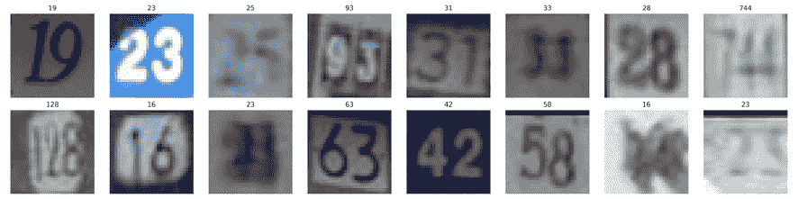

图 18.12：SVHN 数据集的裁剪样本图像

SVHN 数据集包含最多五位数的门牌号，并且如果数字不存在，则使用类别 10。然而，由于包含五位数字的示例非常少，我们将图像限制为仅包含最多四位数字的图像。

### 使用自定义最终层的迁移学习

笔记本 `svhn_object_detection.ipynb` 说明了如何应用迁移学习到基于 VGG16 架构的深度 CNN，如前一节所述。我们将描述如何创建产生多个输出的新最终层，以满足三个 SVHN 任务目标，包括一个预测有多少个数字，并且按照它们出现的顺序为每个数字的值进行预测。

在原始数据集上表现最佳的架构具有八个卷积层和两个最终全连接层。我们将使用**迁移学习**，离开 VGG16 架构。与之前一样，我们导入在 ImageNet 权重上预训练的 VGG16 网络，删除卷积块后的层，冻结权重，并使用功能 API 创建新的密集和预测层，如下所示：

```py
vgg16 = VGG16(input_shape=IMG_SHAPE, include_top=False, weights='imagenet')
vgg16.trainable = False
x = vgg16.output
x = Flatten()(x)
x = BatchNormalization()(x)
x = Dense(256)(x)
x = BatchNormalization()(x)
x = Activation('relu')(x)
x = Dense(128)(x)
x = BatchNormalization()(x)
x = Activation('relu')(x)
n_digits = Dense(SEQ_LENGTH, activation='softmax', name='n_digits')(x)
digit1 = Dense(N_CLASSES-1, activation='softmax', name='d1')(x)
digit2 = Dense(N_CLASSES, activation='softmax', name='d2')(x)
digit3 = Dense(N_CLASSES, activation='softmax', name='d3')(x)
digit4 = Dense(N_CLASSES, activation='softmax', name='d4')(x)
predictions = Concatenate()([n_digits, digit1, digit2, digit3, digit4]) 
```

预测层将数字数量 `n_digits` 的四类输出与预测该位置存在的数字的四个输出组合在一起。

### 创建自定义损失函数和评估指标

自定义输出要求我们定义一个损失函数，该函数捕捉到模型达到其目标的程度。我们还希望以一种反映出针对特定标签定制的预测准确性的方式来测量准确性。

对于自定义损失，我们计算五个分类输出上的交叉熵的平均值，即数字的数量及其相应的值：

```py
def weighted_entropy(y_true, y_pred):
    cce = tf.keras.losses.SparseCategoricalCrossentropy()
    n_digits = y_pred[:, :SEQ_LENGTH]
    digits = {}
    for digit, (start, end) in digit_pos.items():
        digits[digit] = y_pred[:, start:end]
    return (cce(y_true[:, 0], n_digits) +
            cce(y_true[:, 1], digits[1]) +
            cce(y_true[:, 2], digits[2]) +
            cce(y_true[:, 3], digits[3]) +
            cce(y_true[:, 4], digits[4])) / 5 
```

为了衡量预测准确性，我们将五个预测与相应的标签值进行比较，并计算样本批次中正确匹配的比例的平均值：

```py
def weighted_accuracy(y_true, y_pred):
    n_digits_pred = K.argmax(y_pred[:, :SEQ_LENGTH], axis=1)
    digit_preds = {}
    for digit, (start, end) in digit_pos.items():
        digit_preds[digit] = K.argmax(y_pred[:, start:end], axis=1)
    preds = tf.dtypes.cast(tf.stack((n_digits_pred,
                                     digit_preds[1],
                                     digit_preds[2],
                                     digit_preds[3],
                                     digit_preds[4]), axis=1), tf.float32)
    return K.mean(K.sum(tf.dtypes.cast(K.equal(y_true, preds), tf.int64), axis=1) / 5) 
```

最后，我们集成了基础层和最终层，并按以下方式使用自定义损失和准确度指标编译模型：

```py
model = Model(inputs=vgg16.input, outputs=predictions)
model.compile(optimizer='adam',
              loss=weighted_entropy,
              metrics=[weighted_accuracy]) 
```

### 微调 VGG16 权重和最终层

我们对新的最终层进行了 14 个周期的训练，并继续微调所有 VGG16 权重，如上一节所述，另外再进行了 23 个时期的微调（在这两种情况下都使用了提前停止）。

以下图表显示了整个训练周期的训练和验证准确性以及损失。当我们在初始训练期间解冻 VGG16 权重后，准确性会下降，然后再提高，达到 94.52% 的验证性能：

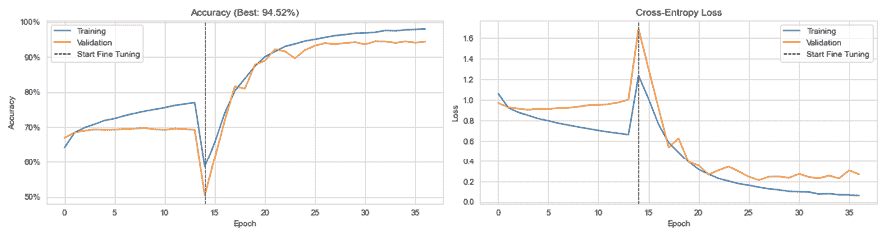

图 18.13：交叉验证性能

有关其他实现细节和结果评估，请参见笔记本。

### 吸取的教训

我们可以使用仅含有小型训练集的方法达到相当高的准确性水平。但是，最先进的性能只有 1.02% 的错误率（[`benchmarks.ai/svhn`](https://benchmarks.ai/svhn)）。为了更接近，最重要的步骤是增加训练数据的量。

有两种简单的方法可以实现这一点：我们可以包括**额外**数据集中包含的更多样本，并且我们可以使用图像增强（参见*AlexNet：重燃深度学习研究*一节）。目前表现最佳的方法在很大程度上依赖于从数据中学习到的增强（Cubuk 2019）。

# 用于时间序列数据的 CNN - 预测收益

CNN 最初是用于处理图像数据的，并在各种计算机视觉任务上取得了超人的表现。如第一节讨论的那样，时间序列数据具有类似图像的网格结构，CNN 已成功应用于一维、二维和三维时间数据的表示。

如果数据符合模型的关键假设，即本地模式或关系有助于预测结果，那么将 CNN 应用于时间序列很可能会取得成功。在时间序列的上下文中，本地模式可能是自相关或在相关间隔处的类似非线性关系。在第二和第三维度上，本地模式暗示着多变量序列的不同组件之间或不同股票的这些序列之间存在系统关系。由于本地性很重要，因此数据的组织方式非常重要，与前馈网络相反，在前馈网络中，对任何维度的元素进行洗牌不会对学习过程产生负面影响。

在这一部分，我们提供了一个相对简单的例子，使用一维卷积来模拟自回归过程（参见*第九章*，*波动率预测和统计套利的时间序列模型*），根据滞后的收益预测未来收益。然后，我们复制了一篇最近的研究论文，通过将多变量时间序列数据格式化为图像来预测收益，取得了良好的结果。我们还将开发和测试基于预测信号的交易策略。

## 具有一维卷积的自回归 CNN

我们将使用单变量自回归资产收益模型为 CNN 引入时间序列用例。更具体地说，模型接收最近的 12 个月的收益，并使用单层一维卷积来预测随后的一个月。

必需的步骤如下：

1.  创建滚动的 12 个月滞后收益及相应的结果

1.  定义模型架构

1.  训练模型和评估结果

在接下来的几节中，我们将依次描述每个步骤；笔记本`time_series_prediction`包含了本节的代码示例。

### 数据预处理

首先，我们将选择自 2000 年以来所有 Quandl Wiki 股票的调整收盘价如下：

```py
prices = (pd.read_hdf('../data/assets.h5', 'quandl/wiki/prices')
          .adj_close
          .unstack().loc['2000':])
prices.info()
DatetimeIndex: 2896 entries, 2007-01-01 to 2018-03-27
Columns: 3199 entries, A to ZUMZ 
```

接下来，我们将价格数据重新采样为月末频率，计算收益，并将超过 100％的月收益设置为缺失值，因为它们很可能表示数据错误。然后，我们放弃具有缺失观测值的股票，保留了每个 215 观测值的 1,511 只股票：

```py
returns = (prices
           .resample('M')
           .last()
           .pct_change()
           .dropna(how='all')
           .loc['2000': '2017']
           .dropna(axis=1)
           .sort_index(ascending=False))
# remove outliers likely representing data errors
returns = returns.where(returns<1).dropna(axis=1)
returns.info()
DatetimeIndex: 215 entries, 2017-12-31 to 2000-02-29
Columns: 1511 entries, A to ZQK 
```

要创建滚动的 12 个滞后月收益及其对应的结果，我们遍历滚动的 13 个月片段，并在将每个片段的转置分配给索引后，将其附加到列表中。完成循环后，我们按以下方式连接列表中的数据框：

```py
n = len(returns)
nlags = 12
lags = list(range(1, nlags + 1))
cnn_data = []
for i in range(n-nlags-1):
    df = returns.iloc[i:i+nlags+1]        # select outcome and lags
    date = df.index.max()                 # use outcome date
    cnn_data.append(df.reset_index(drop=True)  # append transposed series
                    .transpose()
                    .assign(date=date)
                    .set_index('date', append=True)
                    .sort_index(1, ascending=True))
cnn_data = (pd.concat(cnn_data)
            .rename(columns={0: 'label'})
            .sort_index()) 
```

我们最终得到了 2001-2017 年期间超过 305,000 对结果和滞后回报：

```py
cnn_data.info(null_counts=True)
MultiIndex: 305222 entries, ('A', Timestamp('2001-03-31 00:00:00')) to 
                            ('ZQK', Timestamp('2017-12-31 00:00:00'))
Data columns (total 13 columns):
... 
```

当我们计算每个滞后回报和结果的信息系数时，我们发现只有滞后 5 不具有统计显著性：

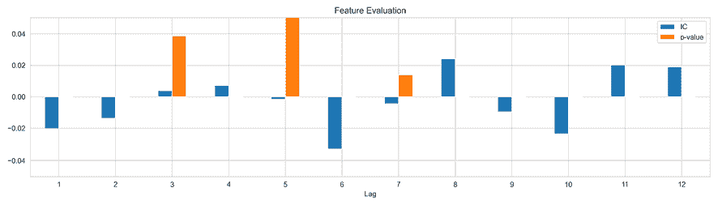

图 18.14：关于滞后回报的信息系数

### 定义模型架构

现在我们将使用 TensorFlow 的 Keras 接口来定义模型架构。我们将一维卷积层与最大池化和批归一化结合起来产生一个实值标量输出：

```py
model = Sequential([Conv1D(filters=32,
                           kernel_size=4,
                           activation='relu',
                           padding='causal',
                           input_shape=(12, 1),
                           use_bias=True,
                           kernel_regularizer=regularizers.l1_l2(l1=1e-5,
                                                                 l2=1e-5)),
                    MaxPooling1D(pool_size=4),
                    Flatten(),
                    BatchNormalization(),
                    Dense(1, activation='linear')]) 
```

一维卷积计算长度为 4 的（经过正则化的）向量与长度为 12 的每个输入序列的滑动点积，使用因果填充来保持时间顺序（参见*如何扫描输入：步幅和填充*部分）。结果得到的 32 个特征映射与输入具有相同的长度，即 12，而最大池化以 4 个一组的方式将其减少为长度为 3 的 32 个向量。

模型输出加权平均值加上长度为 96 的压平且归一化的单个向量的偏差，并且有 449 个可训练参数：

```py
Layer (type)                 Output Shape              Param #   
conv1d (Conv1D)              (None, 12, 32)            160       
max_pooling1d (MaxPooling1D) (None, 3, 32)             0         
flatten (Flatten)            (None, 96)                0         
batch_normalization (BatchNo (None, 96)                384       
dense (Dense)                (None, 1)                 97        
Total params: 641
Trainable params: 449
Non-trainable params: 192 
```

笔记本将模型生成和随后的编译封装到一个`get_model()`函数中，该函数对模型配置进行参数化以便进行实验。

### 模型训练和性能评估

我们对每个股票的五年数据进行模型训练，以预测此期后的第一个月，并使用我们在*第七章*中开发的`MultipleTimeSeriesCV`重复此过程 36 次。请查看笔记本，了解遵循前一章节中展示的模式的训练循环。

我们使用早停法来简化阐述，只进行五个时期的训练，从而产生积极的偏差，使结果仅具有说明性质。训练长度从 1 到 27 时期不等，中位数为 5 时期，这表明模型通常只能从过去回报中学习非常有限的系统信息。因此，精选结果会产生大约 4 的累积平均信息系数，如*图 18.15*所示：

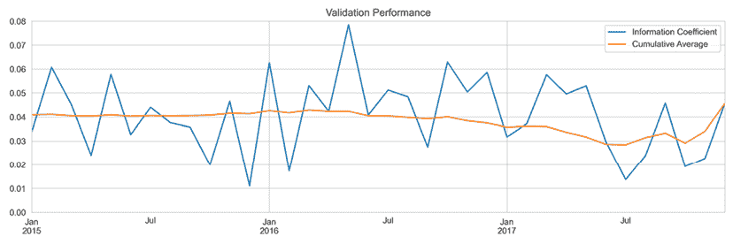

图 18.15：（有偏差的）最佳时期的样本外信息系数

我们现在将进入一个更复杂的示例，使用 CNN 处理多个时间序列数据。

## CNN-TA – 将时间序列聚类成 2D 格式

为了利用时间序列数据的网格结构，我们可以使用 CNN 架构处理单变量和多变量时间序列。在后一种情况下，我们将不同的时间序列视为通道，类似于不同的颜色信号。

另一种方法将一系列 alpha 因子转换为二维格式，以利用 CNN 检测局部模式的能力。Sezer 和 Ozbayoglu（2018）提出了**CNN-TA**，它计算不同间隔的 15 个技术指标，并使用分层聚类（参见 *第十三章*，*数据驱动的风险因素和基于无监督学习的资产配置*）在二维网格中定位行为相似的指标。

作者训练了一个类似于我们之前使用的 CIFAR-10 示例的 CNN，以预测在给定日期购买、持有或出售资产。他们将 CNN 的性能与“买入并持有”及其他模型进行比较，并发现它在使用道琼斯 30 只股票和 2007-2017 年间交易最多的九只 ETF 的每日价格序列时胜过了所有的替代方案。

在本节中，我们使用每日美国股票价格数据尝试这种方法，并演示如何计算并转换类似一组指标为图像格式。然后，我们训练一个 CNN 来预测每日回报，并根据结果信号评估一个简单的多空策略。

### 在不同间隔创建技术指标

我们首先从 Quandl Wiki 数据集中按美元交易额选取了 2007-2017 年滚动五年期的 500 只美国股票的宇宙。有关本节中的代码示例和一些额外的实现细节，请参阅笔记本`engineer_cnn_features.ipynb`。

我们的特征包括 15 个技术指标和风险因子，我们计算这些指标以获取 15 个不同的间隔，然后将它们排列在一个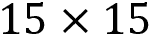 网格中。以下表列出了一些技术指标；此外，我们还使用以下度量标准（请参见 *附录*以获取更多信息）。

+   **加权和指数移动平均线**（**WMA** 和 **EMA**）的收盘价

+   **收盘价变化率**（**ROC**）

+   **Chande 动量振荡器**（**CMO**）

+   **Chaikin A/D 振荡器**（**ADOSC**）

+   **平均方向运动指数**（**ADX**）

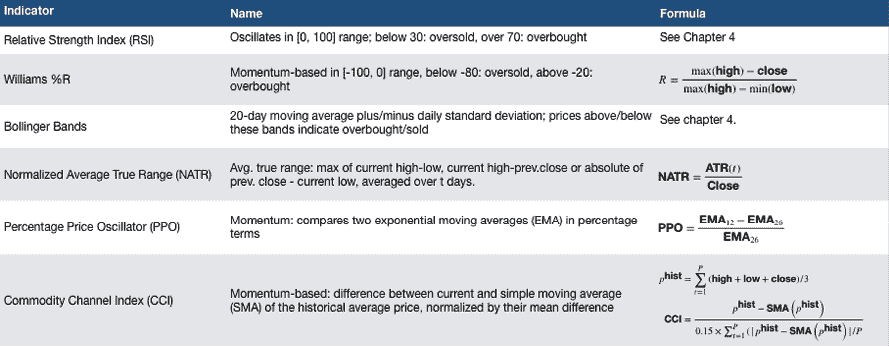

图 8.16：技术指标

对于每个指标，我们将时间段从 6 变化到 20 以获取 15 个不同的测量。例如，以下代码示例计算**相对强度指数**（**RSI**）：

```py
T = list(range(6, 21))
for t in T:
    universe[f'{t:02}_RSI'] = universe.groupby(level='symbol').close.apply(RSI, timeperiod=t) 
```

对于需要多个输入的**归一化平均真实波幅**（**NATR**），计算如下：

```py
for t in T:
    universe[f'{t:02}_NATR'] = universe.groupby(
                        level='symbol', group_keys=False).apply(
                        lambda x: NATR(x.high, x.low, x.close, timeperiod=t)) 
```

有关更多详细信息，请参阅 TA-Lib 文档。

### 计算不同时间范围的滚动因子贝塔

我们还使用**五个法玛-法 rench 风险因子**（Fama 和 French，2015；参见 *第四章*，*金融特征工程-如何研究 Alpha 因子*）。它们反映了股票回报对被证明对股票回报产生影响的因素的敏感性。我们通过计算股票每日回报与旨在反映底层驱动因素的投资组合回报之间的滚动 OLS 回归系数来捕获这些因素：

+   **股权风险溢价**：美国股票的市值加权回报减去 1 个月期美国国债利率

+   **规模**（**SMB**）：归类为**小型**（按市值）的股票的回报与**大型股票**之间的差异

+   **价值**（**HML**）：具有**高**账面市值比的股票的回报与具有**低**价值的股票之间的差异

+   **投资**（**CMA**）：具有**保守**投资支出的公司与具有**激进支出**的公司之间的回报差异

+   **盈利能力**（**RMW**）：类似地，对具有**强大**盈利能力的股票与具有**弱**指标的股票之间的回报差异进行比较。

我们使用 `pandas_datareader` 从 Kenneth French 的数据库中获取数据（见 *第四章*，*金融特征工程 - 如何研究阿尔法因子*）：

```py
import pandas_datareader.data as web
factor_data = (web.DataReader('F-F_Research_Data_5_Factors_2x3_daily', 
                              'famafrench', start=START)[0]) 
```

接下来，我们使用 statsmodels 的 `RollingOLS()` 在不同长度的窗口期内运行回归，范围从 15 天到 90 天不等。我们在 `.fit()` 方法上设置 `params_only` 参数以加快计算速度，并使用拟合的 `factor_model` 的 `.params` 属性捕获系数：

```py
factors = [Mkt-RF, 'SMB', 'HML', 'RMW', 'CMA']
windows = list(range(15, 90, 5))
for window in windows:
    betas = []
    for symbol, data in universe.groupby(level='symbol'):
        model_data = data[[ret]].merge(factor_data, on='date').dropna()
        model_data[ret] -= model_data.RF
        rolling_ols = RollingOLS(endog=model_data[ret], 
                                 exog=sm.add_constant(model_data[factors]), 
                                                      window=window)
        factor_model = rolling_ols.fit(params_only=True).params.drop('const',  
                                                                     axis=1)
        result = factor_model.assign(symbol=symbol).set_index('symbol', 
                                                              append=True)
        betas.append(result)
    betas = pd.concat(betas).rename(columns=lambda x: f'{window:02}_{x}')
    universe = universe.join(betas) 
```

### 基于互信息的特征选择

下一步是从 20 个候选项中选择最相关的 15 个特征来填充 15×15 的输入网格。以下步骤的代码示例在笔记本 `convert_cnn_features_to_image_format` 中。

为此，我们估计每个指标和 15 个间隔相对于我们的目标（一天后的回报）的互信息。如 *第四章*，*金融特征工程 - 如何研究阿尔法因子* 中所讨论的，scikit-learn 提供了 `mutual_info_regression()` 函数，使这一过程变得简单，尽管耗时和占用内存。为加速此过程，我们随机抽样了 100,000 个观察结果：

```py
df = features.join(targets[target]).dropna().sample(n=100000)
X = df.drop(target, axis=1)
y = df[target]
mi[t] = pd.Series(mutual_info_regression(X=X, y=y), index=X.columns) 
```

*图 18.16* 的左侧面板显示了每个指标在 15 个间隔上的平均互信息。从该指标的角度来看，NATR、PPO 和 Bollinger Bands 最重要：

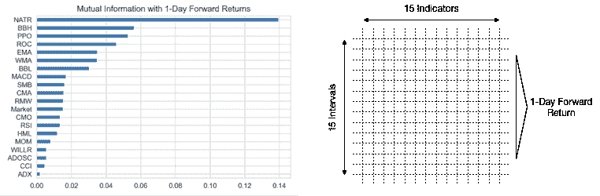

图 18.17：时间序列的互信息和二维网格布局

### 分层特征聚类

*图 18.16* 的右侧面板绘制了我们将输入到 CNN 中的 15×15 二维特征网格。如本章的第一节所讨论的，CNN 依赖于通常在图像中找到的相关模式的局部性，其中附近的像素密切相关，并且一个像素到下一个像素的变化通常是渐进的。

为了以类似的方式组织我们的指标，我们将遵循 Sezer 和 Ozbayoglu 的方法应用分层聚类。目标是识别行为类似的特征，并相应地对网格的列和行进行排序。

我们可以构建在*第十三章*中介绍的 SciPy 的`pairwise_distance()`、`linkage()`和`dendrogram()`函数之上，以及其他形式的聚类。我们创建一个辅助函数，对输入进行逐列标准化，以避免由于比例差异而扭曲特征之间的距离，并使用将聚类合并以最小化方差的 Ward 标准。该函数返回树状图中叶节点的顺序，进而显示了较大聚类的逐步形成：

```py
def cluster_features(data, labels, ax, title):
    data = StandardScaler().fit_transform(data)
    pairwise_distance = pdist(data)
    Z = linkage(data, 'ward')
    dend = dendrogram(Z,
                      labels=labels,
                      orientation='top',
                      leaf_rotation=0.,
                      leaf_font_size=8.,
                      ax=ax)
    return dend['ivl'] 
```

为了获得列中技术指标的优化顺序和行中不同间隔的不同顺序，我们使用 NumPy 的`.reshape()`方法确保我们想要聚类的维度出现在我们传递给`cluster_features()`的二维数组的列中：

```py
labels = sorted(best_features)
col_order = cluster_features(features.dropna().values.reshape(-1, 15).T, 
                             labels)
labels = list(range(1, 16))
row_order = cluster_features(
    features.dropna().values.reshape(-1, 15, 15).transpose((0, 2, 1)).reshape(-1, 15).T, labels) 
```

*图 18.18*显示了行和列特征的树状图：

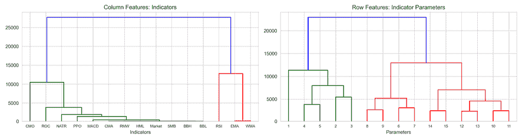

图 18.18：行和列特征的树状图

我们相应地重新排序特征，并将结果存储为 CNN 的输入，我们将在下一步中创建。

### 创建和训练一个卷积神经网络

现在我们准备按照前一节中概述的步骤设计、训练和评估一个 CNN。笔记本`cnn_for_trading.ipynb`包含相关的代码示例。

我们再次紧密跟随作者的步伐，创建了一个 CNN，其中包含 2 个卷积层，卷积核尺寸分别为 3 和 16、32 个过滤器，然后是一个大小为 2 的最大池化层。我们将最后一层过滤器的输出展平，并将结果的 1,568 个输出连接到大小为 32 的密集层，对输入和输出连接分别应用 25%和 50%的丢弃概率以减轻过拟合。以下表格总结了包含 55,041 个可训练参数的 CNN 结构：

```py
Layer (type)                 Output Shape              Param #   
CONV1 (Conv2D)               (None, 15, 15, 16)        160       
CONV2 (Conv2D)               (None, 15, 15, 32)        4640      
POOL1 (MaxPooling2D)         (None, 7, 7, 32)          0         
DROP1 (Dropout)              (None, 7, 7, 32)          0         
FLAT1 (Flatten)              (None, 1568)              0         
FC1 (Dense)                  (None, 32)                50208     
DROP2 (Dropout)              (None, 32)                0         
FC2 (Dense)                  (None, 1)                 33        
Total params: 55,041
Trainable params: 55,041
Non-trainable params: 0 
```

我们使用*第七章*中介绍的`MutipleTimeSeriesCV`训练和验证集索引生成器对模型进行交叉验证，该章节名为*线性模型 - 从风险因素到回报预测*。我们在训练期间提供了 5 年的交易日数据，每次以 64 个随机样本的批次进行，并使用随后的 3 个月进行验证，涵盖了 2014 年至 2017 年。

我们将特征缩放到[-1, 1]范围内，并再次使用 NumPy 的`.reshape()`方法创建所需的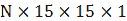格式：

```py
def get_train_valid_data(X, y, train_idx, test_idx):
    x_train, y_train = X.iloc[train_idx, :], y.iloc[train_idx]
    x_val, y_val = X.iloc[test_idx, :], y.iloc[test_idx]
    scaler = MinMaxScaler(feature_range=(-1, 1))
    x_train = scaler.fit_transform(x_train)
    x_val = scaler.transform(x_val)
    return (x_train.reshape(-1, size, size, 1), y_train,
            x_val.reshape(-1, size, size, 1), y_val) 
```

训练和验证遵循*第十七章*中介绍的流程，*用于交易的深度学习*，依靠检查点来在每个时期存储权重，并在不需要昂贵的重新训练的情况下生成表现最佳迭代的预测。

为了评估模型的预测准确性，我们计算验证集的每日**信息系数**（**IC**），如下所示：

```py
checkpoint_path = Path('models', 'cnn_ts')
for fold, (train_idx, test_idx) in enumerate(cv.split(features)):
    X_train, y_train, X_val, y_val = get_train_valid_data(features, target, train_idx, test_idx)
    preds = y_val.to_frame('actual')
    r = pd.DataFrame(index=y_val.index.unique(level='date')).sort_index()
    model = make_model(filter1=16, act1='relu', filter2=32, 
                       act2='relu', do1=.25, do2=.5, dense=32)
    for epoch in range(n_epochs):            
        model.fit(X_train, y_train,
                  batch_size=batch_size,
                  validation_data=(X_val, y_val),
                  epochs=1, verbose=0, shuffle=True)
        model.save_weights(
            (checkpoint_path / f'ckpt_{fold}_{epoch}').as_posix())
        preds[epoch] = model.predict(X_val).squeeze()
        r[epoch] = preds.groupby(level='date').apply(
            lambda x: spearmanr(x.actual, x[epoch])[0]).to_frame(epoch) 
```

我们使用**随机梯度下降**与**Nesterov**动量（见 *第十七章*，*交易的深度学习*）对模型进行最多 10 个时期的训练，并发现表现最佳的时期，即第 8 和第 9 个时期，达到每日平均 IC 约为 0.009（低）。

### 组装最佳模型以生成可交易信号

为了减少测试期预测的方差，我们生成并对在交叉验证期间表现最佳的 3 个模型的预测进行平均，这里对应于训练 4、8 和 9 个时期。与前面的时间序列示例一样，相对较短的训练期强调了金融时间序列中信号数量较少，与例如图像数据中包含的系统信息相比，数量较少。

`generate_predictions()` 函数重新加载模型权重并返回目标周期的预测结果：

```py
def generate_predictions(epoch):
    predictions = []
    for fold, (train_idx, test_idx) in enumerate(cv.split(features)):
        X_train, y_train, X_val, y_val = get_train_valid_data(
            features, target, train_idx, test_idx)
        preds = y_val.to_frame('actual')
        model = make_model(filter1=16, act1='relu', filter2=32, 
                       act2='relu', do1=.25, do2=.5, dense=32)
        status = model.load_weights(
            (checkpoint_path / f'ckpt_{fold}_{epoch}').as_posix())
        status.expect_partial()
        predictions.append(pd.Series(model.predict(X_val).squeeze(), 
                                     index=y_val.index))
    return pd.concat(predictions)   
preds = {}
for i, epoch in enumerate(ic.drop('fold', axis=1).mean().nlargest(3).index):
    preds[i] = generate_predictions(epoch) 
```

我们存储预测结果，并继续根据这些每日回报预测进行交易策略的回测。

### 回测长短交易策略

为了了解信号质量，我们计算根据信号五分位数选择的等权重投资组合之间的差距，使用 Alphalens（见 *第四章*，*金融特征工程 - 如何研究 Alpha 因子*）。

*图 18.19* 显示，对于一天的投资视角，这种天真的策略在 2013 年至 2017 年期间每天大约可以获得超过四个基点的收益：

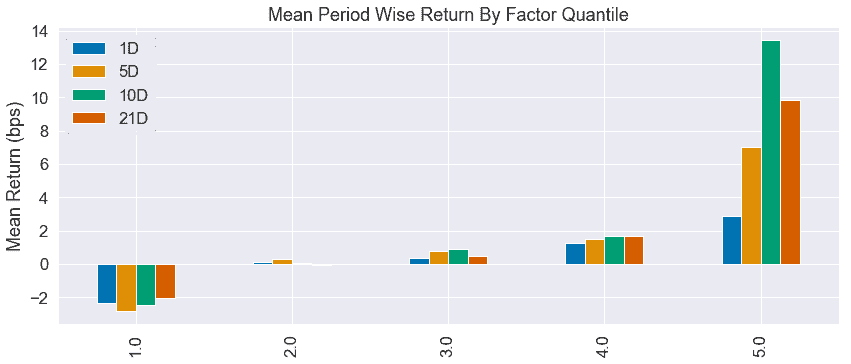

图 18.19: Alphalens 信号质量评估

我们将这个稍微令人鼓舞的结果转化为一个简单的策略，根据收益预测最高（最低）的 25 只股票进入多头（空头）头寸，每日进行交易。*图 18.20* 显示，这个策略在很大程度上与标准普尔 500 指数相竞争（左侧面板），在回测期间累积回报率为 35.6%，夏普比率为 0.53（未考虑交易成本；右侧面板）。

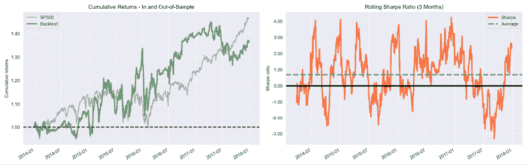

图 18.20: 样本内外回测表现

### 总结与经验教训

看起来 CNN 能够从转换为二维网格的 alpha 因子的时间序列中提取有意义的信息。对不同体系结构和训练参数的实验表明，结果并不十分稳健，稍微修改就可能显著降低性能。

调整尝试也凸显了成功训练深度 NN 的困难，特别是当信噪比较低时：太复杂的网络或错误的优化器可能导致 CNN 陷入一个始终预测常数值的局部最优解。

要改善结果并获得接近作者所取得的结果（使用不同的结果）的性能，最重要的步骤是重新审视特征。有许多替代方案来计算有限技术指标的不同间隔。任何适当数量的时间序列特征都可以按照*n*×*m*的矩形格式排列，并从 CNN 学习本地模式的能力中受益。选择*n*个指标和*m*个间隔只是为了更容易地组织二维网格的行和列。试试看吧！

此外，作者采取了一种分类方法来算法标记的买入、持有和卖出结果（请参阅文章了解计算的概要），而我们的实验则将回归应用于每日收益。*图 18.18*中的 Alphalens 图表表明，更长的持有期（特别是 10 天）可能效果更好，因此还有调整策略或切换到分类方法的空间。

# 总结

在本章中，我们介绍了 CNN，这是一种专门设计的神经网络架构，它借鉴了我们对人类视觉（有限）理解的线索，并且在类似网格的数据上表现特别好。我们涵盖了卷积或互相关的中心操作，推动了滤波器的发现，这些滤波器反过来检测出有助于解决手头任务的特征。

我们回顾了几种最先进的架构，它们是很好的起点，特别是因为迁移学习使我们能够重复使用预训练的权重，并减少否则相当计算和数据密集型的训练工作。我们还看到 Keras 使得实现和训练各种深度 CNN 架构相对简单。

在下一章中，我们将注意力转向专门设计用于序列数据的循环神经网络，例如时间序列数据，这对于投资和交易至关重要。
