# 第十九章：19

# 用于多变量时间序列和情感分析的 RNNs

上一章展示了**卷积神经网络**（**CNNs**）是如何设计来学习代表网格状数据的空间结构的特征，尤其是图像，但也包括时间序列。本章介绍了专门用于序列数据的**循环神经网络**（**RNNs**），其中模式随时间演变，学习通常需要记忆先前的数据点。

**前馈神经网络**（**FFNNs**）将每个样本的特征向量视为独立且同分布。因此，它们在评估当前观察时不考虑先前的数据点。换句话说，它们没有记忆。

CNNs 使用的一维和二维卷积滤波器可以提取特征，这些特征是通常是一小部分相邻数据点的函数。然而，它们只允许浅层参数共享：每个输出都是将相同的滤波器应用于相关时间步和特征的结果。

RNN 模型的主要创新在于每个输出都是先前输出和新信息的函数。因此，RNNs 可以将先前观察到的信息纳入到它们使用当前特征向量进行的计算中。这种循环形式使得参数共享在更深的计算图中变得可能（Goodfellow，Bengio 和 Courville，2016 年）。在本章中，您将遇到**长短期记忆**（**LSTM**）单元和**门控循环单元**（**GRUs**），旨在克服学习长程依赖性所关联的梯度消失的挑战，在这种情况下，错误需要在许多连接上传播。

成功的 RNN 使用案例包括各种需要将一个或多个输入序列映射到一个或多个输出序列并突出显示自然语言应用的任务。我们将探讨如何将 RNNs 应用于单变量和多变量时间序列，以使用市场或基本数据预测资产价格。我们还将介绍如何使用词嵌入来利用替代文本数据，这些数据在*第十六章*中介绍了*用于盈利电话和 SEC 文件的词嵌入*，以对文档中表达的情感进行分类。最后，我们将使用 SEC 文件的最具信息量的部分来学习词嵌入，并预测文件提交日期前后的回报。

更具体地说，在本章中，您将学习以下内容：

+   循环连接如何使 RNNs 记忆模式并建模隐藏状态

+   展开和分析 RNNs 的计算图

+   门控单元如何从数据中学习调节 RNN 内存以实现长程依赖性

+   在 Python 中设计和训练用于单变量和多变量时间序列的 RNNs

+   如何学习词嵌入或使用预训练的词向量进行情感分析与 RNNs

+   使用自定义词嵌入构建双向 RNN 以预测股票回报

你可以在本章的 GitHub 存储库目录中找到代码示例和其他资源。

# 递归神经网络的工作原理

RNN 假定输入数据已经生成为一个序列，以便以前的数据点影响当前观察结果，并且对预测后续值具有相关性。因此，它们可以对比 FFNN 和 CNN 更复杂的输入输出关系进行建模，后者设计为使用给定数量的计算步骤将一个输入向量映射到一个输出向量。相反，RNN 可以对最佳表示为向量序列的任务的数据进行建模，其中输入、输出或两者都是序列。有关概述，请参阅 Goodfellow、Bengio 和 Courville（2016）的*第十章*。

*图 19.1*中的图表灵感来自 Andrew Karpathy 的 2015 年博客文章*递归神经网络的不合理有效性*（请参阅 GitHub 获取链接），它说明了通过一个或多个神经网络层进行的非线性转换从输入到输出向量的映射：

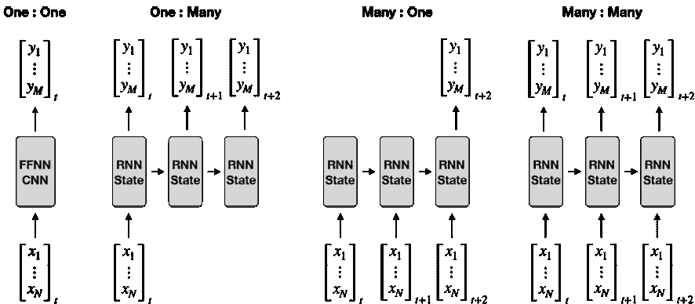

图 19.1：各种类型的序列到序列模型

左侧面板显示了固定大小向量之间的一对一映射，这在上述最后两章中涵盖的 FFN 和 CNN 中很典型。其他三个面板显示了通过对新输入和上一次迭代产生的状态应用循环转换将输入向量映射到输出向量的各种 RNN 应用。输入到 RNN 的*x*向量也称为**上下文**。

这些向量是按时间索引的，通常是交易相关应用所需，但它们也可以由不同的顺序值标记。通用的序列到序列映射任务和示例应用包括：

+   **一对多**：例如，图像字幕生成接受单个像素向量（与上一章节中相同）并将其映射到一系列单词。

+   **多对一**：情感分析接受一系列单词或标记（参见*第十四章*，*用于交易的文本数据 - 情感分析*）并将其映射到一个输出标量或向量。

+   **多对多**：机器翻译或视频帧标记将输入向量序列映射到输出向量序列，无论是同步（如所示）还是异步方式。多变量时间序列的多步预测也将几个输入向量映射到几个输出向量。

请注意，输入和输出序列可以是任意长度的，因为从数据中学习的固定但学习的循环转换可以应用任意次数。

正如 CNN 能轻松扩展到大尺寸图像，而且一些 CNN 可以处理可变大小的图像，RNN 能够扩展到比不适用于基于序列任务的网络更长的序列。大多数 RNN 也可以处理可变长度的序列。

## 展开具有循环的计算图

RNN 被称为循环的，因为它们以一种方式将相同的转换应用于序列的每个元素，RNN 的输出取决于先前迭代的结果。因此，RNN 保持一个**内部状态**，它捕获了序列中以前元素的信息，就像内存一样。

*图 19.2*显示了在训练期间学习两个权重矩阵的单个隐藏 RNN 单元暗示的**计算图**：

+   *W*[hh]：应用于前一个隐藏状态 *h*[t-1]

+   *W*[hx]：应用于当前输入 *x*[t]

RNN 的输出 *y*[t] 是使用诸如 tanh 或 ReLU 激活函数的两个矩阵乘法之和的非线性转换：

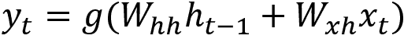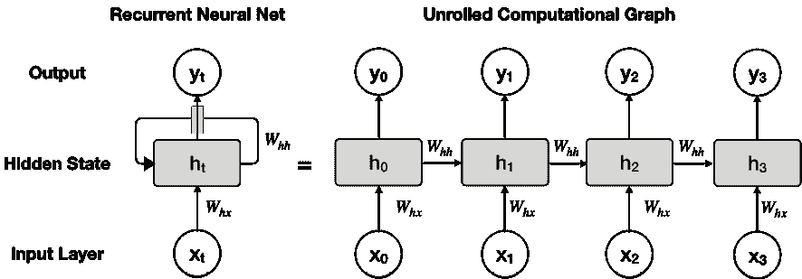

图 19.2：具有单个隐藏单元的 RNN 的计算图的循环和展开视图

方程的右侧显示了展开在图右侧面板中所示的循环关系的影响。它突出显示了重复的线性代数转换以及将来自过去序列元素的信息与当前输入或上下文相结合的隐藏状态。另一种表述将上下文向量连接到仅第一个隐藏状态；我们将概述修改此基线架构的其他选项。

## 时间反向传播

在前述图中展开的计算图突出显示了学习过程必然涵盖给定输入序列的所有时间步。在训练期间更新权重的反向传播算法涉及沿着展开的计算图进行从左到右的前向传递，然后沿相反方向进行后向传递。

正如在*第十七章*“交易的深度学习”中所讨论的那样，反向传播算法评估损失函数并计算其相对于参数的梯度，以相应地更新权重。在 RNN 上下文中，反向传播从计算图的右侧向左侧运行，从最终时间步更新参数一直到初始时间步。因此，该算法被称为**时间反向传播**（Werbos 1990）。

它突出了 RNN 通过在任意数量的序列元素之间共享参数来建模长程依赖关系的能力，同时保持相应的状态。另一方面，由于其固有的顺序性质，它的计算成本相当高，每个时间步的计算都无法并行化。

## 替代 RNN 架构

就像我们在前两章中介绍的 FFNN 和 CNN 架构一样，RNN 可以通过各种方式进行优化，以捕捉输入和输出数据之间的动态关系。

除了修改隐藏状态之间的重复连接之外，替代方法还包括重复输出关系、双向循环神经网络和编码器-解码器架构。请参阅 GitHub 获取背景参考，以补充本简要摘要。

### 输出重复和教师强迫

减少隐藏状态重复计算复杂性的一种方法是将单元的隐藏状态连接到前一个单元的输出而不是其隐藏状态。由此产生的 RNN 的容量低于前面讨论的架构，但是不同的时间步骤现在是解耦的，可以并行训练。

然而，要成功学习相关的过去信息，训练输出样本需要反映这些信息，以便通过反向传播调整网络参数。在资产回报与它们的滞后值无关的程度上，金融数据可能不符合此要求。沿着输入向量一起使用先前的结果值被称为**教师强迫**（Williams 和 Zipser，1989 年）。

输出到后续隐藏状态的连接也可以与隐藏循环结合使用。然而，训练需要通过时间反向传播，并且不能并行运行。

### 双向循环神经网络

对于一些任务来说，使输出不仅依赖于过去的序列元素，而且还依赖于未来元素可以是现实的和有益的（Schuster 和 Paliwal，1997 年）。机器翻译或语音和手写识别是其中一些例子，后续序列元素既具有信息量又实际可用于消除竞争性输出的歧义。

对于一维序列，**双向循环神经网络**结合了向前移动的 RNN 和向后扫描序列的另一个 RNN。因此，输出将取决于序列的过去和未来。在自然语言和音乐领域的应用（Sigtia 等，2014 年）非常成功（见*第十六章*，*Word Embeddings for Earnings Calls and SEC Filings*，以及本章最后一个使用 SEC 文件的示例）。

双向循环神经网络也可以与二维图像数据一起使用。在这种情况下，一对 RNN 在每个维度中执行序列的前向和后向处理。

### 编码器-解码器架构、注意力和变压器

到目前为止讨论的架构假设输入和输出序列具有相等的长度。编码器-解码器架构，也称为**序列到序列**（**seq2seq**）架构，放宽了这一假设，并且已经成为具有这种特征的机器翻译和其他应用非常流行的架构（Prabhavalkar 等，2017 年）。

**编码器**是将输入空间映射到不同空间，也称为**潜在空间**的 RNN，而**解码器**功能是将编码后的输入映射到目标空间（Cho 等人，2014 年）。在下一章中，我们将介绍使用各种深度学习架构在无监督设置中学习特征表示的自动编码器。

编码器和解码器 RNN 是联合训练的，以使最终编码器隐藏状态的输入成为解码器的输入，后者又学习匹配训练样本。

**注意力机制**解决了使用固定大小的编码器输入时的限制，当输入序列本身变化时。该机制将原始文本数据转换为分布式表示（见*第十六章*，*用于财报电话和 SEC 备案的词嵌入*），存储结果，并使用这些特征向量的加权平均值作为上下文。模型通过学习来学习权重，并且在不同的输入元素之间交替放置更多的权重或关注

最近的**transformer**架构放弃了重复和卷积，完全依赖于这种注意力机制来学习输入输出映射。它在机器翻译任务上取得了卓越的质量，同时需要更少的训练时间，部分原因是它可以并行化（Vaswani 等人，2017 年）。

## 如何设计深度 RNNs

*图 19.2*中的**展开的计算图**显示，每个转换都涉及线性矩阵操作，然后是一个非线性变换，可以共同由单个网络层表示。

在前两章中，我们看到增加深度允许 FFNNs，特别是 CNNs，学习更有用的分层表示。RNNs 也从将输入输出映射分解为多个层次中受益。对于 RNNs，此映射通常转换为：

+   将当前隐藏状态的输入和先前隐藏状态传入当前隐藏状态

+   将隐藏状态传入输出

一种常见的方法是在彼此之上**堆叠循环层**，以便它们学习输入数据的分层时间表示。这意味着较低层可能捕获较高频率的模式，由较高层合成为对于分类或回归任务有用的低频特征。我们将在下一节中演示这种方法。

不太流行的替代方案包括在输入到隐藏状态的连接上添加层，隐藏状态之间的连接，或从隐藏状态到输出的连接。这些设计使用跳过连接来避免时间步长之间最短路径增加并且训练变得更加困难的情况。

## 学习长程依赖的挑战

理论上，RNN 可以利用任意长的序列中的信息。然而，在实践中，它们仅限于查看几个步骤。更具体地说，RNN 难以从远离当前观察的时间步中获得有用的上下文信息（Hochreiter 等，2001）。

根本问题是在反向传播过程中在许多时间步骤上对梯度的重复乘法的影响。结果，**梯度往往会消失**并朝零减小（典型情况），**或者爆炸**并朝无穷大增长（较少发生，但使优化变得非常困难）。

即使参数允许稳定性并且网络能够存储记忆，由于许多雅各比矩阵的乘法，长期交互的权重将指数级地变小，这些矩阵包含梯度信息。实验表明，随机梯度下降在仅具有 10 或 20 个元素的序列上训练 RNN 面临严重挑战。

已经引入了几种 RNN 设计技术来解决这一挑战，包括**回声状态网络**（Jaeger，2001）和**渗漏单元**（Hihi 和 Bengio，1996）。后者在不同的时间尺度上运行，将模型的一部分集中在更高频率的表示上，另一部分集中在更低频率的表示上，以有意识地从数据中学习和组合不同的方面。其他策略包括跳过时间步的连接或集成来自不同频率的信号的单元。

最成功的方法使用被训练来调节单元在当前状态中保持多少过去信息以及何时重置或忘记这些信息的门控单元。因此，它们能够在数百个时间步长上学习依赖关系。最流行的例子包括**长短期记忆**（**LSTM**）单元和**门控循环单元**（**GRUs**）。Chung 等人（2014）的实证比较发现，这两种单元都优于简单的循环单元，如双曲正切单元，并且在各种语音和音乐建模任务上表现同样出色。

### 长短期记忆 - 学会忘记多少

具有 LSTM 结构的 RNN 拥有更复杂的单元，这些单元保持内部状态。它们包含门来跟踪输入序列元素之间的依赖关系，并相应调整单元的状态。这些门之间以循环方式连接，而不是我们之前遇到的隐藏单元。它们旨在通过让梯度无变化地通过以解决由于可能非常小或非常大的值的重复乘法而导致的梯度消失和梯度爆炸的问题（Hochreiter 和 Schmidhuber，1996）。

*图 19.3*中的图示显示了未展开的 LSTM 单元的信息流，并概述了其典型的门控机制：

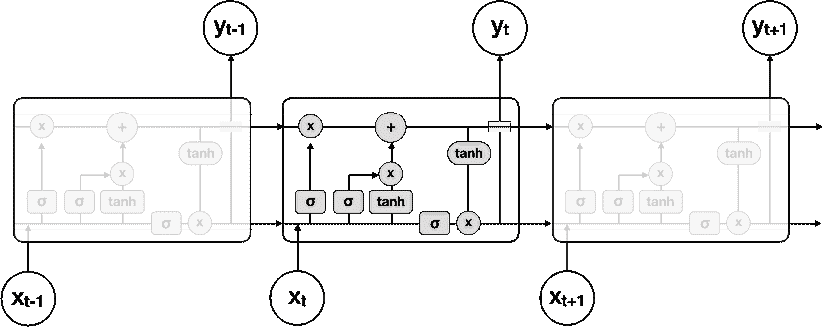

图 19.3：通过展开的 LSTM 单元的信息流

一个典型的 LSTM 单元结合了**四个参数化层**，这些层相互作用并通过转换和传递向量来与细胞状态交互。这些层通常涉及输入门、输出门和遗忘门，但也有可能有额外的门或缺少其中一些机制的变体。图 *19.4* 中的白色节点标识逐元素操作，灰色元素表示在训练期间学习的具有权重和偏差参数的层：

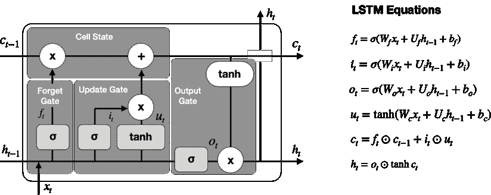

图 *19.4*：LSTM 单元的逻辑和数学原理

细胞状态 *c* 沿着细胞顶部的水平连接传递。细胞状态与各种门的交互导致一系列的循环决策：

1.  **遗忘门** 控制应该清空多少细胞状态以调节网络的记忆。它接收先前的隐藏状态，*h*[t-1]，和当前的输入，*x*[t]，作为输入，计算一个 sigmoid 激活，并将结果值 *f*[t]（已归一化为 [0, 1] 范围）与细胞状态相乘，相应地减少或保持它。

1.  **输入门** 也从 *h*[t-1] 和 *x*[t] 计算一个 sigmoid 激活，产生更新候选值。在 [-1, 1] 范围内的 *tan*[h] 激活会乘以更新候选值 *u*[t]，并根据结果的符号将其加或减到细胞状态中。

1.  **输出门** 使用 sigmoid 激活 *o*[t] 过滤更新的细胞状态，并使用 *tan*[h] 激活将其乘以归一化到 [-1, 1] 范围的细胞状态。

## 门控循环单元

GRUs 通过省略输出门简化了 LSTM 单元。已经证明它们在某些语言建模任务上能够达到类似的性能，但在较小的数据集上表现更好。

GRUs 旨在使每个循环单元自适应地捕获不同时间尺度的依赖关系。与 LSTM 单元类似，GRU 具有调节单元内信息流的门控单元，但丢弃了单独的记忆单元（有关更多细节，请参阅 GitHub 上的参考资料）。

# 使用 TensorFlow 2 进行时间序列的 RNN

在本节中，我们说明如何使用 TensorFlow 2 库构建各种场景的循环神经网络。第一组模型包括对单变量和多变量时间序列进行回归和分类。第二组任务侧重于文本数据，用于情感分析，使用转换为词嵌入的文本数据（参见 *第十六章*，*用于收益电话和 SEC 提交的词嵌入*）。

更具体地说，我们将首先演示如何准备时间序列数据，使用单个 LSTM 层预测**单变量时间序列**的下一个值来预测股票指数值。

接下来，我们将构建一个具有三个不同输入的**深度循环神经网络（RNN）**来分类资产价格的变动。为此，我们将结合一个具有两层的**堆叠 LSTM**，学习的**嵌入**和独热编码的分类数据。最后，我们将演示如何使用 RNN 建模**多变量时间序列**。

## 单变量回归–预测标准普尔 500

在本小节中，我们将预测标准普尔 500 指数的值（有关实现细节，请参阅`univariate_time_series_regression`笔记本）。

我们将从联邦储备银行的数据服务（FRED；请参阅*第二章*，*市场和基本数据–来源和技术*）获取 2010-2019 年的数据：

```py
sp500 = web.DataReader('SP500', 'fred', start='2010', end='2020').dropna()
sp500.info()
DatetimeIndex: 2463 entries, 2010-03-22 to 2019-12-31
Data columns (total 1 columns):
 #   Column  Non-Null Count  Dtype
---  ------  --------------  -----  
 0   SP500   2463 non-null   float64 
```

我们通过使用 scikit-learn 的`MinMaxScaler()`类将数据缩放到[0, 1]区间来预处理数据：

```py
from sklearn.preprocessing import MinMaxScaler
scaler = MinMaxScaler()
sp500_scaled = pd.Series(scaler.fit_transform(sp500).squeeze(), 
                         index=sp500.index) 
```

## 如何为 RNN 整理时间序列数据的形状

我们生成 63 个连续交易日的序列，大约三个月，并使用具有 20 个隐藏单元的单个 LSTM 层预测一步的缩放指数值。

每个 LSTM 层的输入必须具有三个维度，即：

+   **批量大小**：一个序列是一个样本。一个批次包含一个或多个样本。

+   **时间步长**：一个时间步是样本中的一个单独观察。

+   **特征**：一个特征是一个时间步的一个观察。

下图可视化了输入张量的形状：

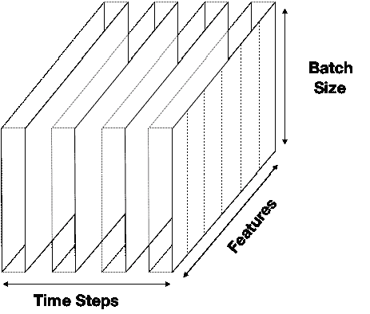

图 19.5：RNN 输入张量的三个维度

我们的 S&P 500 样本有 2,463 个观测值或时间步长。我们将使用每个窗口为 63 个观测值的重叠序列。使用大小为*T* = 5 的更简单的窗口来说明这种自回归序列模式，我们获得了每个输出与其前五个滞后相关联的输入输出对，如下表所示：

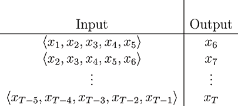

图 19.6：具有 T=5 大小窗口的输入输出对

我们可以使用`create_univariate_rnn_data()`函数堆叠我们使用滚动窗口选择的重叠序列：

```py
def create_univariate_rnn_data(data, window_size):
    y = data[window_size:]
    data = data.values.reshape(-1, 1) # make 2D
    n = data.shape[0]
    X = np.hstack(tuple([data[i: n-j, :] for i, j in enumerate(range(
                                                     window_size, 0, -1))]))
    return pd.DataFrame(X, index=y.index), y 
```

我们使用`window_size=63`对经过缩放的股票指数应用此函数以获得具有样本数量 x 时间步长数量的二维数据集的形状：

```py
X, y = create_univariate_rnn_data(sp500_scaled, window_size=63)
X.shape
(2356, 63) 
```

我们将使用 2019 年的数据作为我们的测试集，并重塑特征以添加必要的第三维：

```py
X_train = X[:'2018'].values.reshape(-1, window_size, 1)
y_train = y[:'2018']
# keep the last year for testing
X_test = X['2019'].values.reshape(-1, window_size, 1)
y_test = y['2019'] 
```

### 如何定义具有单个 LSTM 层的两层 RNN

现在我们已经从时间序列创建了自回归输入/输出对并将这些对分成训练集和测试集，我们可以定义我们的 RNN 架构了。TensorFlow 2 的 Keras 接口使得构建具有以下规格的两个隐藏层的 RNN 非常简单：

+   **层 1**：具有 10 个隐藏单元的 LSTM 模块（带有`input_shape = (window_size,1)`；在训练期间我们将在省略的第一维中定义`batch_size`）

+   **层 2**：具有单个单元和线性激活的完全连接模块

+   **损失**：`mean_squared_error`以匹配回归目标

只需几行代码就可以创建计算图：

```py
rnn = Sequential([
    LSTM(units=10,
         input_shape=(window_size, n_features), name='LSTM'),
    Dense(1, name='Output')
]) 
```

总结显示模型有 491 个参数：

```py
rnn.summary()
Layer (type)                 Output Shape              Param #   
LSTM (LSTM)                  (None, 10)                480       
Output (Dense)               (None, 1)                 11        
Total params: 491
Trainable params: 491 
```

### 训练和评估模型

我们使用默认设置为 RNN 推荐的 RMSProp 优化器进行训练，并为这个回归问题编译模型 `mean_squared_error`：

```py
optimizer = keras.optimizers.RMSprop(lr=0.001,
                                     rho=0.9,
                                     epsilon=1e-08,
                                     decay=0.0)
rnn.compile(loss='mean_squared_error', optimizer=optimizer) 
```

我们定义一个 `EarlyStopping` 回调函数，并训练模型 500 次：

```py
early_stopping = EarlyStopping(monitor='val_loss', 
                              patience=50,
                              restore_best_weights=True)
lstm_training = rnn.fit(X_train,
                       y_train,
                       epochs=500,
                       batch_size=20,
                       validation_data=(X_test, y_test),
                       callbacks=[checkpointer, early_stopping],
                       verbose=1) 
```

训练在 138 个周期后停止。*图 19.7* 中的损失历史显示了训练和验证 RMSE 的 5 个周期滚动平均值，突出显示了最佳周期，并显示损失为 0.998 百分比：

```py
loss_history = pd.DataFrame(lstm_training.history).pow(.5)
loss_history.index += 1
best_rmse = loss_history.val_loss.min()
best_epoch = loss_history.val_loss.idxmin()
loss_history.columns=['Training RMSE', 'Validation RMSE']
title = f'Best Validation RMSE: {best_rmse:.4%}'
loss_history.rolling(5).mean().plot(logy=True, lw=2, title=title, ax=ax) 
```

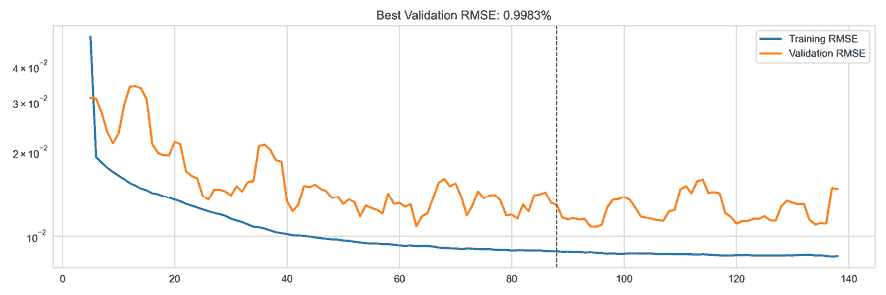

图 19.7：交叉验证性能

### 重新缩放预测

我们使用 `MinMaxScaler()` 的 `inverse_transform()` 方法将模型预测重新缩放到原始标普 500 范围内的值：

```py
test_predict_scaled = rnn.predict(X_test)
test_predict = (pd.Series(scaler.inverse_transform(test_predict_scaled)
                          .squeeze(), 
                          index=y_test.index)) 
```

*图 19.8* 中的四个图表说明了基于跟踪 2019 年标普 500 数据的重新缩放预测的预测性能，测试**信息系数**（**IC**）为 0.9889：

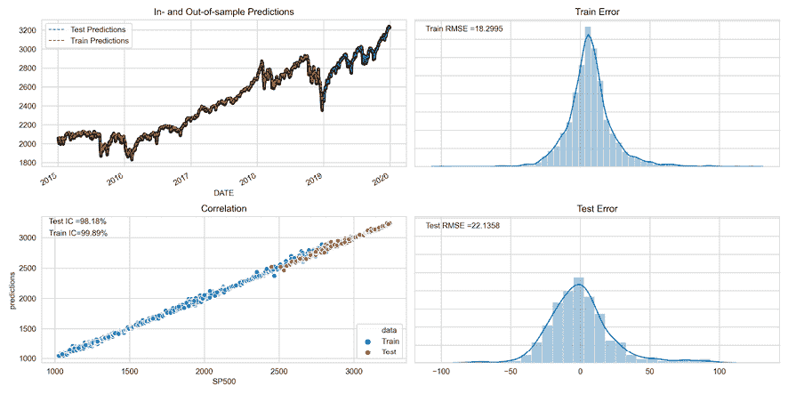

图 19.8：RNN 在标普 500 预测上的性能

## 堆叠 LSTM - 预测价格变动和回报

我们现在将通过堆叠两个 LSTM 层使用 `Quandl` 股价数据构建一个更深层的模型（有关实施详细信息，请参见 `stacked_lstm_with_feature_embeddings.ipynb` 笔记本）。此外，我们将包含不是顺序的特征，即标识股票和月份的指标变量。

*图 19.9* 概述了演示如何将不同数据源结合在一个深度神经网络中的架构。例如，您可以添加技术或基本特征，而不是或者另外添加一个独热编码的月份：

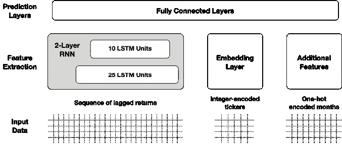

图 19.9：带有额外特征的堆叠 LSTM 架构

### 准备数据 - 如何创建每周股票回报

我们加载 Quandl 调整后的股票价格数据（请参阅 GitHub 上如何获取源数据的说明），如下所示（参见 `build_dataset.ipynb` 笔记本）：

```py
prices = (pd.read_hdf('../data/assets.h5', 'quandl/wiki/prices')
          .adj_close
          .unstack().loc['2007':])
prices.info()
DatetimeIndex: 2896 entries, 2007-01-01 to 2018-03-27
Columns: 3199 entries, A to ZUMZ 
```

我们首先为 2008-17 年期间具有完整数据的接近 2,500 只股票生成每周回报：

```py
returns = (prices
           .resample('W')
           .last()
           .pct_change()
           .loc['2008': '2017']
           .dropna(axis=1)
           .sort_index(ascending=False))
returns.info()
DatetimeIndex: 2576 entries, 2017-12-29 to 2008-01-01
Columns: 2489 entries, A to ZUMZ 
```

我们如下所示创建并堆叠了每只股票和每周 52 周回报的滚动序列：

```py
n = len(returns)
T = 52
tcols = list(range(T))
tickers = returns.columns
data = pd.DataFrame()
for i in range(n-T-1):
    df = returns.iloc[i:i+T+1]
    date = df.index.max()    
    data = pd.concat([data, (df.reset_index(drop=True).T
                             .assign(date=date, ticker=tickers)
                             .set_index(['ticker', 'date']))]) 
```

我们将在 1 和 99 百分位水平处截尾异常值，并创建一个二进制标签，指示周回报是否为正：

```py
data[tcols] = (data[tcols].apply(lambda x: x.clip(lower=x.quantile(.01),
                                                  upper=x.quantile(.99))))
data['label'] = (data['fwd_returns'] > 0).astype(int) 
```

因此，我们获得了超过 2,400 只股票的 1.16 百万观测值，每只股票都有 52 周的滞后回报（加上标签）：

```py
data.shape
(1167341, 53) 
```

现在我们准备好创建额外的特征，将数据分割成训练和测试集，并将其带入 LSTM 所需的三维格式。

### 如何在 RNN 格式中创建多个输入

此示例说明了如何组合几个输入数据源，即：

+   52 周滞后回报的滚动序列

+   为每个 12 个月份的独热编码指示变量

+   整数编码的股票代码数值

以下代码生成了两个额外的特征：

```py
data['month'] = data.index.get_level_values('date').month
data = pd.get_dummies(data, columns=['month'], prefix='month')
data['ticker'] = pd.factorize(data.index.get_level_values('ticker'))[0] 
```

接下来，我们创建了一个覆盖 2009 年至 2016 年期间的训练集和一个包含 2017 年数据的单独的测试集，这是最后一个完整的数据年份：

```py
train_data = data[:'2016']
test_data = data['2017'] 
```

对于训练和测试数据集，我们生成一个包含三个输入数组的列表，如 *图 19.9* 所示：

+   滞后收益序列（使用 *图 19.5* 中描述的格式）

+   将整数编码的股票代码作为一维数组

+   将月份虚拟变量作为每月一列的二维数组

```py
window_size=52
sequence = list(range(1, window_size+1))
X_train = [
    train_data.loc[:, sequence].values.reshape(-1, window_size , 1),
    train_data.ticker,
    train_data.filter(like='month')
]
y_train = train_data.label
[x.shape for x in X_train], y_train.shape
[(1035424, 52, 1), (1035424,), (1035424, 12)], (1035424,) 
```

### 如何使用 Keras 的函数式 API 定义架构

Keras 的函数式 API 使得设计像本节开头概述的具有多个输入的架构（或多个输出，如 *第十八章* 中的 SVHN 示例中所述，*用于金融时间序列和卫星图像的 CNNs*）变得容易。这个例子说明了一个具有三个输入的网络：

1.  两个分别具有 25 和 10 个单元的 **堆叠 LSTM 层**

1.  一个学习股票的 10 维实值表示的 **嵌入层**

1.  一个 **one-hot 编码**的月份表示

我们首先定义了三个输入及其各自的形状：

```py
n_features = 1
returns = Input(shape=(window_size, n_features), name='Returns')
tickers = Input(shape=(1,), name='Tickers')
months = Input(shape=(12,), name='Months') 
```

要定义 **堆叠 LSTM 层**，我们将第一层的`return_sequences`关键字设置为`True`。这确保第一层以预期的三维输入格式生成输出。请注意，我们还使用了辍学正则化以及函数式 API 如何将一个层的张量输出传递给后续层的输入：

```py
lstm1 = LSTM(units=lstm1_units,
             input_shape=(window_size, n_features),
             name='LSTM1',
             dropout=.2,
             return_sequences=True)(returns)
lstm_model = LSTM(units=lstm2_units,
             dropout=.2,
             name='LSTM2')(lstm1) 
```

TensorFlow 2 中有关 RNN 的指南强调了只有在使用大多数 LSTM 设置的默认值时才支持 GPU（[`www.tensorflow.org/guide/keras/rnn`](https://www.tensorflow.org/guide/keras/rnn)）。

**嵌入层**需要：

+   `input_dim`关键字，它定义了该层将学习多少个嵌入

+   `output_dim`关键字，它定义了嵌入的大小

+   `input_length`参数，它设置传递给该层的元素数量（在这里，每个样本只有一个股票代码）

嵌入层的目标是学习向量表示，以捕获特征值相对于彼此的相对位置与结果的关系。我们将选择一个五维嵌入来将嵌入层与 LSTM 层和我们需要重塑（或扁平化）的月份虚拟变量结合起来：

```py
ticker_embedding = Embedding(input_dim=n_tickers,
                             output_dim=5,
                             input_length=1)(tickers)
ticker_embedding = Reshape(target_shape=(5,))(ticker_embedding) 
```

现在我们可以连接三个张量，然后进行`BatchNormalization`：

```py
merged = concatenate([lstm_model, ticker_embedding, months], name='Merged')
bn = BatchNormalization()(merged) 
```

最终的全连接层学习将这些堆叠 LSTM 层、股票代码嵌入和月份指标映射到反映接下来一周的正面或负面收益的二元结果。我们通过定义其输入和输出来制定完整的 RNN，使用刚刚定义的隐式数据流：

```py
hidden_dense = Dense(10, name='FC1')(bn)
output = Dense(1, name='Output', activation='sigmoid')(hidden_dense)
rnn = Model(inputs=[returns, tickers, months], outputs=output) 
```

摘要使用 16,984 个参数对这个稍微复杂的架构进行了概述：

```py
Layer (type)                    Output Shape         Param #     Connected to
Returns (InputLayer)            [(None, 52, 1)]      0
Tickers (InputLayer)            [(None, 1)]          0
LSTM1 (LSTM)                    (None, 52, 25)       2700        Returns[0][0]
embedding (Embedding)           (None, 1, 5)         12445       Tickers[0][0]
LSTM2 (LSTM)                    (None, 10)           1440        LSTM1[0][0]
reshape (Reshape)               (None, 5)           0          embedding[0][0]
Months (InputLayer)             [(None, 12)]         0
Merged (Concatenate)            (None, 27)           0           LSTM2[0][0]
                                                                 reshape[0][0]
                                                                 Months[0][0]
batch_normalization (BatchNorma (None, 27)           108         Merged[0][0]
FC1 (Dense)                     (None, 10)           280         
atch_normalization[0][0]
Output (Dense)                  (None, 1)            11          FC1[0][0]
Total params: 16,984
Trainable params: 16,930
Non-trainable params: 54 
```

我们使用建议的 RMSProp 优化器和默认设置编译模型，并计算我们将用于提前停止的 AUC 指标：

```py
optimizer = tf.keras.optimizers.RMSprop(lr=0.001,
                                        rho=0.9,
                                        epsilon=1e-08,
                                        decay=0.0)
rnn.compile(loss='binary_crossentropy',
            optimizer=optimizer,
            metrics=['accuracy', 
                     tf.keras.metrics.AUC(name='AUC')]) 
```

我们使用提前停止来对模型进行 50 个周期的训练：

```py
result = rnn.fit(X_train,
                 y_train,
                 epochs=50,
                 batch_size=32,
                 validation_data=(X_test, y_test),
                 callbacks=[early_stopping]) 
```

下面的图表显示，训练在 8 个周期后停止，每个周期在单个 GPU 上大约需要三分钟。这导致最佳模型的测试 AUC 为 0.6816，测试准确度为 0.6193：

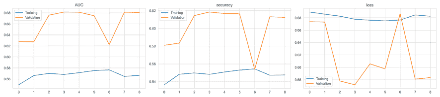

图 19.10：堆叠的 LSTM 分类 - 交叉验证性能

测试预测和实际每周回报的 IC 为 0.32。

### 预测回报率而不是价格方向性变化

`stacked_lstm_with_feature_embeddings_regression.ipynb`笔记本演示了如何将模型调整为回归任务，即预测回报率而不是二元价格变化。

所需的更改很小；只需执行以下操作：

1.  选择`fwd_returns`结果，而不是二元`label`。

1.  将模型输出转换为线性（默认值），而不是`sigmoid`。

1.  将损失更新为均方误差（并提及提前停止）。

1.  删除或更新可选指标以匹配回归任务。

在其他情况下使用相同的训练参数（除了 Adam 优化器使用默认设置在这种情况下产生更好的结果），验证损失在九个周期内改善。平均每周 IC 为 3.32，整个时期为 6.68，显著性水平为 1％。预测回报率最高和最低五分之一的股票之间的平均每周回报率差略高于 20 个基点：

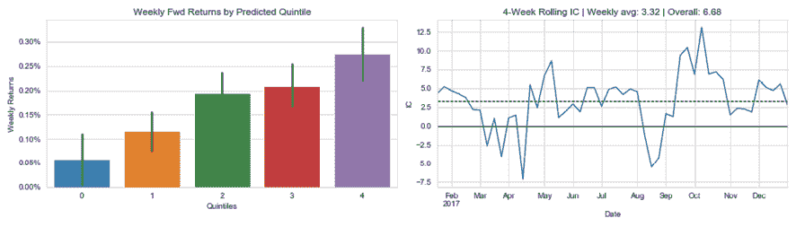

图 19.11：堆叠的 LSTM 回归模型 - 预测性能

## 用于宏观数据的多变量时间序列回归

到目前为止，我们的建模工作仅限于单个时间序列。RNN 非常适合多变量时间序列，并且是我们在*第九章*，*用于波动率预测和统计套利的时间序列模型*中介绍的**向量自回归**（**VAR**）模型的非线性替代品。有关实施详细信息，请参阅`multivariate_timeseries`笔记本。

### 加载情绪和工业生产数据

我们将展示如何使用相同的数据集对多个时间序列进行 RNN 建模和预测，该数据集是我们用于 VAR 示例的。它包括联邦储备局 FRED 服务提供的 40 年来每月的消费者情绪和工业生产数据观测：

```py
df = web.DataReader(['UMCSENT', 'IPGMFN'], 'fred', '1980', '2019-12').dropna()
df.columns = ['sentiment', 'ip']
df.info()
DatetimeIndex: 480 entries, 1980-01-01 to 2019-12-01
Data columns (total 2 columns):
sentiment    480 non-null float64
ip           480 non-null float64 
```

### 使数据平稳化并调整比例

我们应用相同的转换 - 年度差异对两个系列，工业生产的先前对数转换 - 来实现平稳性（有关详细信息，请参阅*第九章*，*用于波动率预测和统计套利的时间序列模型*）。我们还将其重新缩放为[0,1]范围，以确保网络在训练期间给予两个系列相等的权重：

```py
df_transformed = (pd.DataFrame({'ip': np.log(df.ip).diff(12),
                               'sentiment': df.sentiment.diff(12)}).dropna())
df_transformed = df_transformed.apply(minmax_scale) 
```

*图 19.12*显示了原始和转换后的宏观时间序列：

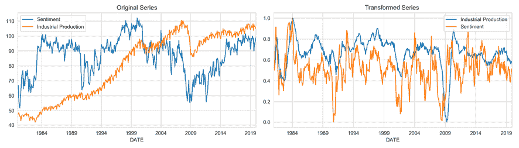

图 19.12：原始和转换后的时间序列

### 创建多变量 RNN 输入

`create_multivariate_rnn_data()`函数将包含多个时间序列的数据集转换为 TensorFlow 的 RNN 层所需的三维形状，形状为`n_samples × window_size × n_series`：

```py
def create_multivariate_rnn_data(data, window_size):
    y = data[window_size:]
    n = data.shape[0]
    X = np.stack([data[i: j] for i, j in enumerate(range(window_size, n))],
                 axis=0)
    return X, y 
```

`window_size`值为 18，确保第二维中的条目是相应输出变量的滞后 18 个月。因此，我们获得了每个特征的 RNN 模型输入如下：

```py
X, y = create_multivariate_rnn_data(df_transformed, window_size=window_size)
X.shape, y.shape
((450, 18, 2), (450, 2)) 
```

最后，我们将数据分为训练集和测试集，使用最后 24 个月来测试外样本性能：

```py
test_size = 24
train_size = X.shape[0]-test_size
X_train, y_train = X[:train_size], y[:train_size]
X_test, y_test = X[train_size:], y[train_size:]
X_train.shape, X_test.shape
((426, 18, 2), (24, 18, 2)) 
```

### 定义和训练模型

鉴于数据集相对较小，我们使用比前一个示例更简单的 RNN 架构。它具有一个具有 12 个单元的 LSTM 层，后跟具有 6 个单元的完全连接层。输出层有两个单元，分别用于每个时间序列。

我们使用均方绝对损失和推荐的 RMSProp 优化器进行编译：

```py
n_features = output_size = 2
lstm_units = 12
dense_units = 6
rnn = Sequential([
    LSTM(units=lstm_units,
         dropout=.1,
         recurrent_dropout=.1,
         input_shape=(window_size, n_features), name='LSTM',
         return_sequences=False),
    Dense(dense_units, name='FC'),
    Dense(output_size, name='Output')
])
rnn.compile(loss='mae', optimizer='RMSProp') 
```

该模型仍然具有 812 个参数，而*第九章*《时间序列模型用于波动率预测和统计套利》中的`VAR(1,1)`模型只有 10 个参数：

```py
Layer (type)                 Output Shape              Param #   
LSTM (LSTM)                  (None, 12)                720       
FC (Dense)                   (None, 6)                 78        
Output (Dense)               (None, 2)                 14        
Total params: 812
Trainable params: 812 
```

我们使用批处理大小为 20 进行 100 个周期的训练，使用提前停止：

```py
result = rnn.fit(X_train,
                y_train,
                epochs=100,
                batch_size=20,
                shuffle=False,
                validation_data=(X_test, y_test),
                callbacks=[checkpointer, early_stopping],
                verbose=1) 
```

在经过 62 个周期后，训练提前停止，测试 MAE 为 0.034，比相同任务的 VAR 模型的测试 MAE 提高了近 25％，为 0.043。

但是，这两个结果并不完全可比，因为 RNN 生成了 18 个 1 步预测，而 VAR 模型使用其自身的预测作为其外样本预测的输入。您可能需要调整 VAR 设置以获得可比较的预测并比较性能。

*图 19.13*突出显示了训练和验证误差，以及两个系列的外样本预测：

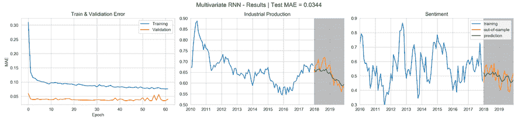

图 19.13：具有多个宏观系列的 RNN 的交叉验证和测试结果

# 用于文本数据的 RNN

RNN 通常应用于各种自然语言处理任务，从机器翻译到情感分析，我们在本书第三部分已经遇到过。在本节中，我们将说明如何将 RNN 应用于文本数据以检测正面或负面情感（可轻松扩展为更细粒度的情感评分），以及预测股票回报。

具体来说，我们将使用单词嵌入来表示文档中的标记。我们在*第十六章*《用于收入电话和 SEC 文件的单词嵌入》中介绍了单词嵌入。它们是将标记转换为密集的实值向量的绝佳技术，因为单词在嵌入空间中的相对位置编码了它们在训练文档中的有用语义方面。

我们在前面的堆叠 RNN 示例中看到，TensorFlow 具有内置的嵌入层，允许我们训练特定于手头任务的向量表示。或者，我们可以使用预训练的向量。我们将在以下三个部分中演示这两种方法。

## 具有情感分类嵌入的 LSTM

这个例子展示了如何在分类任务中训练 RNN 来学习自定义的嵌入向量。这与 word2vec 模型不同，后者在优化相邻标记的预测时学习向量，从而能够捕捉单词之间某些语义关系（参见 *第十六章*，*用于盈利电话和 SEC 文件的单词嵌入*）。学习预测情感的词向量意味着嵌入将反映出一个标记与其相关联的结果之间的关系。

### 加载 IMDB 电影评论数据

为了使数据易于处理，我们将使用 IMDB 评论数据集来说明这个用例，该数据集包含 50,000 条正面和负面电影评论，均匀分布在一个训练集和一个测试集中，并且每个数据集中的标签都是平衡的。词汇表包含 88,586 个标记。或者，您可以使用规模更大的 Yelp 评论数据（将文本转换为数值序列后；请参阅下一节关于使用预训练嵌入或 TensorFlow 2 文档）。

数据集已经捆绑到 TensorFlow 中，并可以加载，以便每个评论表示为整数编码的序列。我们可以通过使用 `skip_top` 过滤掉频繁和可能不太信息丰富的单词，以及长度超过 `maxlen` 的句子，来限制词汇量至 `num_words`。我们还可以选择 `oov_char` 值，它代表了我们基于频率排除词汇表的标记：

```py
from tensorflow.keras.datasets import imdb
vocab_size = 20000
(X_train, y_train), (X_test, y_test) = imdb.load_data(seed=42, 
                                                      skip_top=0,
                                                      maxlen=None, 
                                                      oov_char=2, 
                                                      index_from=3,
                                                      num_words=vocab_size) 
```

在第二步中，将整数列表转换为固定大小的数组，我们可以堆叠并提供作为输入到我们的 RNN。`pad_sequence` 函数生成相等长度的数组，截断并填充以符合 `maxlen`：

```py
maxlen = 100
X_train_padded = pad_sequences(X_train, 
                        truncating='pre', 
                        padding='pre', 
                        maxlen=maxlen) 
```

### 定义嵌入和 RNN 架构

现在我们可以设置我们的 RNN 架构了。第一层学习单词嵌入。我们使用以下内容定义嵌入维度，与以前一样：

+   `input_dim` 关键字设置了我们需要嵌入的标记数量

+   `output_dim` 关键字定义了每个嵌入的大小。

+   `input_len` 参数指定每个输入序列的长度

请注意，这次我们使用的是 GRU 单元，它们训练更快，对少量数据表现更好。我们还使用了循环丢失以进行正则化：

```py
embedding_size = 100
rnn = Sequential([
    Embedding(input_dim=vocab_size, 
              output_dim= embedding_size, 
              input_length=maxlen),
    GRU(units=32,
        dropout=0.2, # comment out to use optimized GPU implementation
        recurrent_dropout=0.2),
    Dense(1, activation='sigmoid')
]) 
```

结果模型具有超过 200 万个可训练参数：

```py
Layer (type)                 Output Shape              Param #   
embedding (Embedding)        (None, 100, 100)          2000000   
gru (GRU)                    (None, 32)                12864     
dense (Dense)                (None, 1)                 33        
Total params: 2,012,897
Trainable params: 2,012,897 
```

我们编译模型以使用 AUC 指标，并使用提前停止训练：

```py
rnn.fit(X_train_padded, 
       y_train, 
       batch_size=32, 
       epochs=25, 
       validation_data=(X_test_padded, y_test),
       callbacks=[early_stopping],
       verbose=1) 
```

在 12 个时期后停止训练，并恢复最佳模型的权重，找到高达 0.9393 的高测试 AUC：

```py
y_score = rnn.predict(X_test_padded)
roc_auc_score(y_score=y_score.squeeze(), y_true=y_test)
0.9393289376 
```

*图 19.14*显示了交叉验证性能，包括准确度和 AUC：

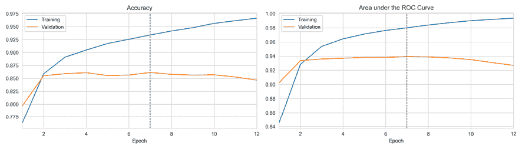

图 19.14：使用自定义嵌入对 IMDB 数据进行 RNN 的交叉验证

## 预训练的词向量进行情感分析

在*第十六章*，*用于收益电话和 SEC 备案的词嵌入*中，我们讨论了如何学习特定领域的词嵌入。Word2vec 和相关的学习算法产生高质量的词向量，但需要大量的数据集。因此，研究小组通常会共享在大型数据集上训练的词向量，类似于我们在上一章的迁移学习部分遇到的预训练深度学习模型的权重。

我们现在将说明如何使用斯坦福 NLP 小组提供的预训练**全局词向量表示**（**GloVe**）与 IMDB 评论数据集一起使用（请参阅 GitHub 获取参考资料和`sentiment_analysis_pretrained_embeddings`笔记本获取实现细节）。

### 文本数据的预处理

我们将从源代码加载 IMDB 数据集，手动预处理它（请参阅笔记本）。TensorFlow 提供了一个`Tokenizer`，我们将使用它将文本文档转换为整数编码的序列：

```py
num_words = 10000
t = Tokenizer(num_words=num_words,
              lower=True, 
              oov_token=2)
t.fit_on_texts(train_data.review)
vocab_size = len(t.word_index) + 1
train_data_encoded = t.texts_to_sequences(train_data.review)
test_data_encoded = t.texts_to_sequences(test_data.review) 
```

我们还使用`pad_sequences`函数将列表（长度不等的列表）转换为填充和截断数组的堆叠集，用于训练和测试数据：

```py
max_length = 100
X_train_padded = pad_sequences(train_data_encoded, 
                               maxlen=max_length, 
                               padding='post',
                               truncating='post')
y_train = train_data['label']
X_train_padded.shape
(25000, 100) 
```

### 加载预训练的 GloVe 嵌入

我们下载并解压了 GloVe 数据到代码中指示的位置，并将创建一个字典，将 GloVe 令牌映射到 100 维的实值向量：

```py
glove_path = Path('data/glove/glove.6B.100d.txt')
embeddings_index = dict()
for line in glove_path.open(encoding='latin1'):
    values = line.split()
    word = values[0]
    coefs = np.asarray(values[1:], dtype='float32')
    embeddings_index[word] = coefs 
```

我们使用大约 340,000 个词向量来创建一个与词汇表匹配的嵌入矩阵，以便 RNN 可以通过令牌索引访问嵌入：

```py
embedding_matrix = np.zeros((vocab_size, 100))
for word, i in t.word_index.items():
    embedding_vector = embeddings_index.get(word)
    if embedding_vector is not None:
        embedding_matrix[i] = embedding_vector 
```

### 使用冻结权重定义体系结构

与上一个示例中的 RNN 设置不同之处在于，我们将把嵌入矩阵传递给嵌入层，并将其设置为*不可训练*，以便权重在训练期间保持不变：

```py
rnn = Sequential([
    Embedding(input_dim=vocab_size,
              output_dim=embedding_size,
              input_length=max_length,
              weights=[embedding_matrix],
              trainable=False),
    GRU(units=32,  dropout=0.2, recurrent_dropout=0.2),
    Dense(1, activation='sigmoid')]) 
```

从这里开始，我们像以前一样进行。训练持续了 32 个时期，如*图 19.15*所示，我们获得了 0.9106 的测试 AUC 分数。这比我们在前几节中为这个领域学习的自定义嵌入的结果稍差，突显了训练自己的词嵌入的价值：

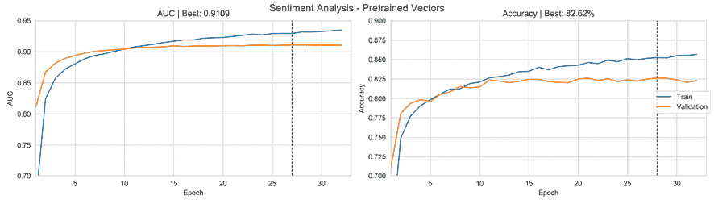

图 19.15：具有多个宏系列的 RNN 的交叉验证和测试结果

您可能希望将这些技术应用于我们在第三部分使用的更大的金融文本数据集。

## 从 SEC 备案嵌入预测收益

在*第十六章*，*用于收益电话和 SEC 备案的词嵌入*中，我们讨论了产品评论和金融文本数据之间的重要区别。虽然前者对于说明重要的工作流程很有用，在本节中，我们将处理更具挑战性但也更相关的金融文件。具体来说，我们将使用在*第十六章*，*用于收益电话和 SEC 备案的词嵌入*中介绍的 SEC 备案数据，学习用于预测相关股票披露的单词嵌入，从发布前到一周后。

`sec_filings_return_prediction` 笔记本包含本节的代码示例。请参阅 *第十六章*，*盈利电话和美国证券交易委员会申报文件的词嵌入* 中的 `sec_preprocessing` 笔记本，并查看 GitHub 上数据文件夹中的说明以获取数据。

### 使用 yfinance 获取源股票价格数据

2013-16 期间有 22,631 份文件。我们使用 yfinance 获取了相关 6,630 个股票的股票价格数据，因为它比 Quandl 的 WIKI 数据具有更高的覆盖率。我们使用文件索引（请参阅 *第十六章*，*盈利电话和美国证券交易委员会申报文件的词嵌入*）中的股票符号和申报日期下载申报日期前三个月和后一个月的每日调整股票价格，以获取价格数据和未成功的股票：

```py
yf_data, missing = [], []
for i, (symbol, dates) in enumerate(filing_index.groupby('ticker').date_filed, 
                                    1):
    ticker = yf.Ticker(symbol)
    for idx, date in dates.to_dict().items():
        start = date - timedelta(days=93)
        end = date + timedelta(days=31)
        df = ticker.history(start=start, end=end)
        if df.empty:
            missing.append(symbol)
        else:
            yf_data.append(df.assign(ticker=symbol, filing=idx)) 
```

我们获取了 3,954 个股票的数据，并使用 Quandl Wiki 数据获取了几百个缺失股票的价格（请参阅笔记本），最终得到了 4,762 个符号的 16,758 份文件。

### 预处理 SEC 申报数据

与产品评论相比，金融文本文档往往更长，结构更为正式。此外，在这种情况下，我们依赖于来自 EDGAR 的数据，该数据需要解析 XBRL 源（请参阅 *第二章*，*市场和基本数据-来源和技术*），可能存在包含除所需部分以外的其他材料的错误。我们在预处理过程中采取了几个步骤来处理异常值，并将文本数据格式化为模型所需的相等长度的整数序列：

1.  删除所有包含少于 5 个或多于 50 个令牌的句子；这影响约百分之 5 的句子。

1.  创建了 28,599 个二元组，10,032 个三元组和 2,372 个具有 4 个元素的 n 元组。

1.  将文件转换为表示令牌频率排名的整数序列，删除少于 100 个令牌的文件，并将序列截断为 20,000 个元素。

*图 19.16* 强调了剩余的 16,538 份文件的一些语料库统计信息，共有 179,214,369 个令牌，其中约有 204,206 个是唯一的。左面板显示了以对数-对数尺度表示的令牌频率分布；最常见的术语，“百万”，“业务”，“公司”和“产品”每个都出现了超过 100 万次。通常情况下，有一个非常长的尾巴，其中 60% 的令牌出现次数少于 25 次。

中央面板显示了约为 10 个令牌的句子长度的分布。最后，右侧面板显示了约为 20,000 的申报长度的分布，由于截断而呈现高峰：

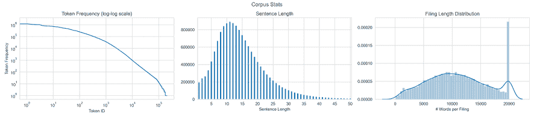

图 19.16: 具有多个宏观系列的 RNN 的交叉验证和测试结果

### 为 RNN 模型准备数据

现在我们需要一个模型预测的结果。我们将计算（在某种程度上是任意的）文件当天（如果没有该日期的价格，则为前一天）的五天后回报，假设申报发生在市场闭市后。显然，这种假设可能是错误的，强调了第二章*市场和基本数据-来源和技术*和第三章*金融替代数据-类别和用例*中强调的**即时数据**的必要性。我们将忽略使用免费数据的隐藏成本问题。

我们计算正向回报如下，删除周回报低于 50 或高于 100％的异常值：

```py
fwd_return = {}
for filing in filings:
    date_filed = filing_index.at[filing, 'date_filed']
    price_data = prices[prices.filing==filing].close.sort_index()

    try:
        r = (price_data
             .pct_change(periods=5)
             .shift(-5)
             .loc[:date_filed]
             .iloc[-1])
    except:
        continue
    if not np.isnan(r) and -.5 < r < 1:
        fwd_return[filing] = r 
```

这给我们留下了 16,355 个数据点。现在我们将这些结果与它们的匹配的申报序列组合起来，并将回报列表转换为 NumPy 数组：

```py
y, X = [], []
for filing_id, fwd_ret in fwd_return.items():
    X.append(np.load(vector_path / f'{filing_id}.npy') + 2)
    y.append(fwd_ret)
y = np.array(y) 
```

最后，我们创建一个 90:10 的训练/测试分割，并使用本节中第一个示例中引入的`pad_sequences`函数生成每个长度为 20,000 的固定长度序列：

```py
X_train, X_test, y_train, y_test = train_test_split(X, y, test_size=.1)
X_train = pad_sequences(X_train, 
                        truncating='pre', 
                        padding='pre', 
                        maxlen=maxlen)
X_test = pad_sequences(X_test, 
                       truncating='pre', 
                       padding='pre', 
                       maxlen=maxlen)
X_train.shape, X_test.shape
((14719, 20000), (1636, 20000)) 
```

### 构建、训练和评估 RNN 模型

现在我们可以定义我们的 RNN 架构。第一层学习单词嵌入。我们将嵌入维度如前所述设置如下：

+   `input_dim`关键字到词汇表的大小

+   `output_dim`关键词到每个嵌入的大小

+   `input_length`参数是每个输入序列将要多长

对于递归层，我们使用双向 GRU 单元扫描文本向前和向后，并连接生成的输出。我们还在线性输出之前添加了五个单位的稠密层的批归一化和 dropout 进行正则化：

```py
embedding_size = 100
input_dim = X_train.max() + 1
rnn = Sequential([
    Embedding(input_dim=input_dim, 
              output_dim=embedding_size, 
              input_length=maxlen,
             name='EMB'),
    BatchNormalization(name='BN1'),
    Bidirectional(GRU(32), name='BD1'),
    BatchNormalization(name='BN2'),
    Dropout(.1, name='DO1'),
    Dense(5, name='D'),
    Dense(1, activation='linear', name='OUT')]) 
```

结果模型有超过 250 万个可训练参数：

```py
rnn.summary()
Layer (type)                 Output Shape              Param #   
EMB (Embedding)              (None, 20000, 100)        2500000   
BN1 (BatchNormalization)     (None, 20000, 100)        400       
BD1 (Bidirectional)          (None, 64)                25728     
BN2 (BatchNormalization)     (None, 64)                256       
DO1 (Dropout)                (None, 64)                0         
D (Dense)                    (None, 5)                 325       
OUT (Dense)                  (None, 1)                 6         
Total params: 2,526,715
Trainable params: 2,526,387
Non-trainable params: 328 
```

我们使用 Adam 优化器进行编译，针对这个回归任务的均方损失，同时跟踪损失的平方根和绝对误差的均值作为可选指标：

```py
rnn.compile(loss='mse', 
            optimizer='Adam',
            metrics=[RootMeanSquaredError(name='RMSE'),
                     MeanAbsoluteError(name='MAE')]) 
```

使用提前停止，我们每次对 32 个观测值的批次进行最多 100 个时期的训练：

```py
early_stopping = EarlyStopping(monitor='val_MAE', 
                               patience=5,
                               restore_best_weights=True)
training = rnn.fit(X_train,
                   y_train,
                   batch_size=32,
                   epochs=100,
                   validation_data=(X_test, y_test),
                   callbacks=[early_stopping],
                   verbose=1) 
```

均方误差仅在 4 个时期内改善，如*图 19.17*左侧面板所示：

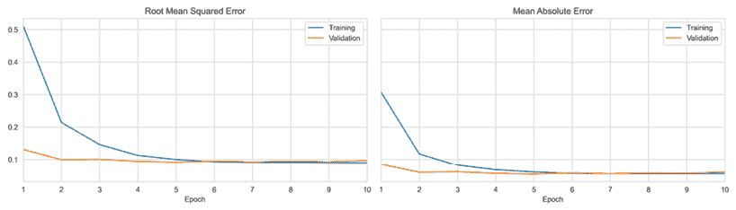

图 19.17：使用 SEC 申报预测每周回报的 RNN 的交叉验证测试结果

在测试集上，最佳模型达到了高度显著的 IC 值为 6.02：

```py
y_score = rnn.predict(X_test)
rho, p = spearmanr(y_score.squeeze(), y_test)
print(f'{rho*100:.2f} ({p:.2%})')
6.02 (1.48%) 
```

### 吸取的教训和下一步

该模型能够仅使用文本数据生成显著优于随机的回报预测。既有一些警告表明应谨慎对待结果，也有理由相信我们可以改进这个实验的结果。

一方面，股价数据和解析后的 SEC 申报的质量都远非完美。尚不清楚价格数据问题是否会积极或消极地偏向结果，但它们肯定会增加误差边际。更加仔细地解析和清理 SEC 申报很可能会通过消除噪音来改善结果。

另一方面，有许多优化可能会改善结果。从文本输入开始，我们并没有尝试解析提交内容，只是选择了某些部分；去除模板语言或尝试选择最有意义的陈述可能具有价值。我们还对提交的最大长度和词汇量大小进行了相当武断的选择，这些选择可能会重新审视。我们还可以缩短或延长每周的预测时段。此外，我们可以从嵌入的大小到层数和大小以及正则化程度等多个方面对模型架构进行细化。

最根本的是，我们可以将文本输入与更丰富的互补特征集合相结合，正如在前一节中展示的那样，使用具有多个输入的堆叠 LSTM。最后，我们肯定会需要更大的提交集。

# 总结

在本章中，我们介绍了专门针对序列数据定制的 RNN 架构。我们讨论了 RNN 的工作原理，分析了计算图，并了解了 RNN 如何通过多个步骤实现参数共享，以捕获长程依赖关系，而 FFNNs 和 CNNs 则不太适合。

我们还回顾了梯度消失和梯度爆炸的挑战，并了解了门控单元（如长短期记忆单元）如何使 RNN 能够学习数百个时间步长的依赖关系。最后，我们将 RNN 应用于算法交易中常见的挑战，例如使用 SEC 提交进行单变量和多变量时间序列预测以及情感分析。

下一章中，我们将介绍无监督的深度学习技术，如自动编码器和生成对抗网络，以及它们在投资和交易策略中的应用。
