# 第二十章：自编码器用于条件风险因子和资产定价

本章展示了无监督学习如何利用深度学习进行交易。更具体地说，我们将讨论数十年来存在但最近引起新关注的**自编码器**。

**无监督学习**解决了实际机器学习挑战，比如有标签数据的有限可用性和维度灾难，后者需要指数级更多的样本才能成功地从具有许多特征的复杂现实数据中学习。在概念层面上，无监督学习更类似于人类学习和常识的发展，而不是监督学习和强化学习，我们将在下一章中介绍。它也被称为**预测学习**，因为它旨在从数据中发现结构和规律，以便可以预测缺失的输入，也就是从观察到的部分填补空白。

**自编码器**是一个**神经网络**（**NN**）训练成为复制输入同时学习数据的新表示的神经网络，由隐藏层的参数编码。自编码器长期以来一直用于非线性降维和流形学习（见*第十三章*，*使用无监督学习进行数据驱动的风险因子和资产配置*）。各种设计利用了我们在最后三章中介绍的前馈、卷积和递归网络架构。我们将看到自编码器如何支撑一个**交易策略**：我们将构建一个深度神经网络，该网络使用自编码器来提取风险因子并预测股票回报，条件是一系列股票属性（Gu、Kelly 和 Xiu 2020）。

更具体地说，在本章中，您将学习以下内容：

+   哪些类型的自编码器具有实际用途以及它们的工作原理

+   使用 Python 构建和训练自编码器

+   使用自编码器提取考虑资产特征以预测回报的数据驱动风险因子

您可以在 GitHub 仓库的相应目录中找到本章的代码示例和其他资源的链接。笔记本包括图像的彩色版本。

# 用于非线性特征提取的自编码器

在 *第十七章*，*交易的深度学习* 中，我们看到神经网络如何通过提取对给定任务有用的分层特征表示而成功进行监督学习。例如，**卷积神经网络**（**CNNs**）从类似网格的数据中学习和合成越来越复杂的模式，例如，在图像中识别或检测对象，或者对时间序列进行分类。

与之相反，自编码器是专门设计用来学习一个**新表示**的神经网络，该表示以一种有助于解决另一个任务的方式对输入进行编码。为此，训练强制网络重现输入。由于自编码器通常使用相同的数据作为输入和输出，它们也被视为**自监督学习**的一种实例。在这个过程中，隐藏层的参数*h*成为表示输入的编码，类似于第十六章*《用于收益电话和 SEC 文件的词嵌入》*中介绍的 word2vec 模型。

更具体地说，网络可以被视为由一个编码器函数*h=f(x)*和一个解码器函数*g*组成，编码器函数从输入*x*中学习隐藏层的参数，解码器函数学习从编码*h*中重构输入。而不是学习身份函数：

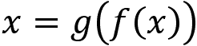

自编码器不是简单地复制输入，而是使用**约束**来强制隐藏层**优先编码数据的哪些方面**。目标是获得实用价值的表示。

自编码器也可以被视为**前馈神经网络的特例**（见*第十七章，用于交易的深度学习*），并且可以使用相同的技术进行训练。与其他模型一样，过量的容量会导致过拟合，阻止自编码器产生超出训练样本的通用编码。有关更多背景信息，请参阅 Goodfellow、Bengio 和 Courville (2016)的*第 14*和*15*章。

## 泛化线性降维

传统用例包括降维，通过限制隐藏层的大小从而创建一个“瓶颈”，使其执行有损压缩。这样的自编码器被称为**欠完备**，其目的是通过最小化形式为*L*的损失函数来学习数据的最显著属性：

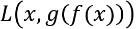

我们将在下一节中探讨的一个示例损失函数仅仅是在输入图像的像素值及其重构上计算的均方误差。当我们构建用于交易的条件自编码器时，我们还将使用这个损失函数来从金融特征的时间序列中提取风险因子。

与主成分分析（**PCA**；见*第十三章，用于无监督学习的数据驱动风险因子和资产配置*）等线性降维方法不同，欠完备自编码器使用**非线性激活函数**；否则，它们学习与 PCA 相同的子空间。因此，它们可以被视为 PCA 的非线性推广，能够学习更广泛的编码。

*图 20.1*说明了具有三个隐藏层的欠完备前馈自编码器的编码器-解码器逻辑：编码器和解码器各有一个隐藏层，再加上包含编码的共享编码器输出/解码器输入层。这三个隐藏层使用非线性激活函数，如**修正线性单元**（**ReLU**）、*sigmoid*或*tanh*（参见*第十七章*，*交易的深度学习*），并且比网络要重建的输入单元更少。

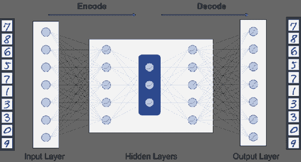

图 20.1：欠完备编码器-解码器架构

根据任务的不同，一个具有单个编码器和解码器层的简单自编码器可能是足够的。然而，具有额外层的**更深的自编码器**可以有几个优点，就像对其他神经网络一样。这些优点包括学习更复杂的编码、实现更好的压缩，并且在更少的计算和更少的训练样本的情况下完成，但会受到过拟合的固有风险的影响。

## 用于图像压缩的卷积自编码器

如*第十八章*所讨论的，*用于金融时间序列和卫星图像的 CNN*，全连接前馈架构不适合捕获具有网格结构的数据的局部相关性。相反，自编码器也可以使用卷积层来学习分层特征表示。卷积自编码器利用卷积和参数共享来学习层次化模式和特征，而不受其位置、平移或大小变化的影响。

我们将在下面为图像数据演示卷积自编码器的不同实现。或者，卷积自编码器也可以应用于网格形式排列的多变量时间序列数据，如*第十八章*所示，*用于金融时间序列和卫星图像的 CNN*。

## 通过正则化自编码器管理过拟合

神经网络表示复杂函数的强大能力要求对编码器和解码器的容量进行严格控制，以提取信号而不是噪声，从而使编码更适用于下游任务。换句话说，当网络太容易重新创建输入时，它无法仅学习数据的最有趣的方面，并提高使用编码作为输入的机器学习模型的性能。

与其他具有给定任务的过度容量的模型一样，**正则化**可以帮助解决**过拟合**挑战，通过约束自编码器的学习过程并强制其产生有用的表示（例如，参见*第七章*，*线性模型-从风险因素到回报预测*，关于线性模型的正则化，以及*第十七章*，*用于交易的深度学习*，关于神经网络）。 理想情况下，我们可以将模型的容量精确匹配到数据分布的复杂性。 在实践中，最佳模型通常结合（有限的）过剩容量和适当的正则化。 为此，我们将一个依赖于编码层*h*的权重的稀疏度惩罚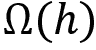添加到训练目标中：

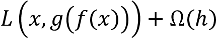

我们在本章稍后探讨的一种常见方法是使用**L1 正则化**，它在损失函数中添加了一种惩罚，即权重的绝对值之和。 L1 范数会导致稀疏编码，因为它会强制将参数的值设为零，如果它们不能捕获数据中的独立变化（参见*第七章*，*线性模型-从风险因素到回报预测*）。 因此，即使是隐藏层维度比输入高的超完备自编码器也可能学会学习信号内容。

## 使用去噪自编码器修复损坏的数据

到目前为止，我们讨论的自编码器设计用于尽管容量有限但重现输入。 另一种方法是训练带有损坏输入的自编码器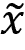以输出所需的原始数据点。 在这种情况下，自编码器最小化损失*L*：

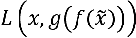

损坏的输入是防止网络学习身份函数而不是从数据中提取信号或显著特征的另一种方法。 已经证明去噪自编码器学会了原始数据的数据生成过程，并且在生成建模中变得流行，其中目标是**学习产生输入的概率分布**（Vincent 等，2008）。

## 用于时间序列特征的 Seq2seq 自编码器

**循环神经网络**（**RNNs**）已经发展用于具有数据点之间长期依赖关系的顺序数据，可能覆盖长距离（*第十九章*，*用于多元时间序列和情感分析的 RNNs*）。 类似地，序列到序列（seq2seq）自编码器旨在学习适应序列生成数据性质的表示（Srivastava，Mansimov 和 Salakhutdinov，2016）。

Seq2seq 自编码器基于 RNN 组件，如**长短期记忆**（**LSTM**）或门控循环单元。 它们学习顺序数据的表示，并已成功应用于视频，文本，音频和时间序列数据。

如上一章所述，编码器-解码器架构允许 RNN 处理具有可变长度的输入和输出序列。这些架构支撑了许多复杂序列预测任务的进展，如语音识别和文本翻译，并且越来越多地应用于（金融）时间序列。在高层次上，它们的工作原理如下：

1.  LSTM 编码器逐步处理输入序列以学习隐藏状态。

1.  此状态成为序列的学习表示，以固定长度的向量形式呈现。

1.  LSTM 解码器接收此状态作为输入，并使用它来生成输出序列。

请参见 GitHub 上链接的参考示例，了解构建序列到序列自动编码器以**压缩时间序列数据**和**检测时间序列中的异常**的示例，以便例如监管机构发现潜在的非法交易活动。

## 使用变分自动编码器进行生成建模

**变分自动编码器**（**VAE**）是最近发展起来的（Kingma 和 Welling，2014），专注于生成建模。与给定数据学习预测器的判别模型相反，生成模型旨在解决更一般的问题，即学习所有变量的联合概率分布。如果成功，它可以模拟数据首次生成的方式。学习数据生成过程非常有价值：它揭示了潜在的因果关系，并支持半监督学习，以有效地从小型标记数据集推广到大型未标记数据集。

更具体地说，VAEs 旨在学习模型负责输入数据的潜在（意思是*未观察到*）变量。请注意，在*第十五章*，*主题建模 - 总结财务新闻*和*第十六章*，*用于盈利电话和 SEC 备案的词嵌入*中，我们遇到了潜在变量。

就像迄今讨论的自动编码器一样，VAEs 不允许网络学习任意函数，只要它忠实地重现输入即可。相反，它们旨在学习生成输入数据的概率分布的参数。

换句话说，VAEs 是生成模型，因为如果成功，您可以通过从 VAE 学习的分布中抽样来生成新的数据点。

VAE 的操作比迄今讨论的自动编码器更复杂，因为它涉及随机反向传播，即对随机变量的导数，并且细节超出了本书的范围。它们能够学习没有正则化的高容量输入编码，这是有用的，因为模型旨在最大化训练数据的概率，而不是复制输入。有关详细介绍，请参见 Kingma 和 Welling（2019）。

`variational_autoencoder.ipynb` 笔记本包含了一个应用于时尚 MNIST 数据集的样本 VAE 实现，该实现改编自 François Chollet 的 Keras 教程，以适配 TensorFlow 2。GitHub 上链接的资源包含一个 VAE 教程，其中包含指向 PyTorch 和 TensorFlow 2 实现的参考资料以及许多其他参考文献。参见 Wang 等人（2019）的应用，该应用将 VAE 与使用 LSTM 的 RNN 结合起来，并在期货市场中表现出优于各种基准模型的效果。

# 使用 TensorFlow 2 实现自编码器

在本节中，我们将说明如何使用 TensorFlow 2 的 Keras 接口来实现上一节介绍的几种自编码器模型。我们首先加载和准备一个图像数据集，我们将在本节中始终使用该数据集。我们将使用图像而不是金融时间序列，因为这样更容易可视化编码过程的结果。下一节将说明如何将自编码器与金融数据结合起来，作为更复杂架构的一部分，该架构可以作为交易策略的基础。

准备好数据后，我们将继续构建使用深度前馈网络、稀疏约束和卷积的自编码器，并将后者应用于图像去噪。

## 如何准备数据

为了说明，我们将使用时尚 MNIST 数据集，这是由 Lecun 等人（1998）与 LeNet 结合使用的经典 MNIST 手写数字数据集的现代替代品。我们还在 *第十三章*，*使用无监督学习进行数据驱动风险因素和资产配置* 中依赖于该数据集。

Keras 使得很容易访问具有分辨率为 28 × 28 像素的 60,000 个训练和 10,000 个测试灰度样本：

```py
from tensorflow.keras.datasets import fashion_mnist
(X_train, y_train), (X_test, y_test) = fashion_mnist.load_data()
X_train.shape, X_test.shape
((60000, 28, 28), (10000, 28, 28)) 
```

数据包含来自 10 类的服装物品。*图 20.2* 绘制了每个类别的一个样本图像：

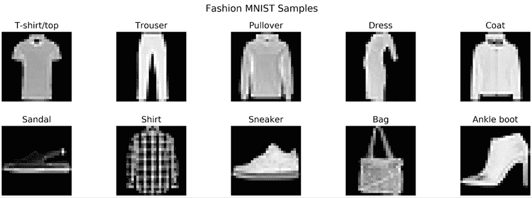

图 20.2：时尚 MNIST 样本图像

我们重新塑造数据，使每个图像由一个扁平的一维像素向量表示，其中有 28 × 28 = 784 个元素，规范化到 [0, 1] 范围内：

```py
image_size = 28              # pixels per side
input_size = image_size ** 2 # 784
def data_prep(x, size=input_size):
    return x.reshape(-1, size).astype('float32')/255
X_train_scaled = data_prep(X_train)
X_test_scaled = data_prep(X_test)
X_train_scaled.shape, X_test_scaled.shape
((60000, 784), (10000, 784)) 
```

## 单层前馈自编码器

我们从一个具有单个隐藏层的普通前馈自编码器开始，以说明使用 Functional Keras API 的一般设计方法，并建立性能基线。

第一步是使用 784 个元素的扁平图像向量的占位符：

```py
input_ = Input(shape=(input_size,), name='Input') 
```

模型的编码器部分由一个全连接层组成，用于学习输入的新压缩表示。我们使用 32 个单元，压缩比为 24.5：

```py
encoding_size = 32 # compression factor: 784 / 32 = 24.5
encoding = Dense(units=encoding_size,
                 activation='relu',
                 name='Encoder')(input_) 
```

解码部分将压缩的数据一次性重构为其原始大小：

```py
decoding = Dense(units=input_size,
                 activation='sigmoid',
                 name='Decoder')(encoding) 
```

我们使用链式输入和输出元素实例化 `Model` 类，这些元素隐含地定义了计算图，如下所示：

```py
autoencoder = Model(inputs=input_,
                    outputs=decoding,
                    name='Autoencoder') 
```

因此，所定义的编码器-解码器计算使用了近 51,000 个参数：

```py
Layer (type)                 Output Shape              Param #   
Input (InputLayer)           (None, 784)               0         
Encoder (Dense)              (None, 32)                25120     
Decoder (Dense)              (None, 784)               25872     
Total params: 50,992
Trainable params: 50,992
Non-trainable params: 0 
```

Functional API 允许我们使用模型链的部分作为单独的编码器和解码器模型，这些模型使用训练期间学到的自编码器的参数。

### 定义编码器

编码器仅使用输入和隐藏层，总参数约为一半：

```py
encoder = Model(inputs=input_, outputs=encoding, name='Encoder')
encoder.summary()
Layer (type)                 Output Shape              Param #   
Input (InputLayer)           (None, 784)               0         
Encoder (Dense)              (None, 32)                25120     
Total params: 25,120
Trainable params: 25,120
Non-trainable params: 0 
```

不久我们将看到，一旦训练了自动编码器，我们就可以使用编码器来压缩数据。

### 定义解码器

解码器由最后一个自动编码器层组成，由编码数据的占位符提供：

```py
encoded_input = Input(shape=(encoding_size,), name='Decoder_Input')
decoder_layer = autoencoder.layers-1
decoder = Model(inputs=encoded_input, outputs=decoder_layer)
decoder.summary()
Layer (type)                 Output Shape              Param #   
Decoder_Input (InputLayer)   (None, 32)                0         
Decoder (Dense)              (None, 784)               25872     
Total params: 25,872
Trainable params: 25,872
Non-trainable params: 0 
```

### 训练模型

我们编译模型以使用 Adam 优化器（参见*第十七章*，*交易的深度学习*）来最小化输入数据和自动编码器实现的复制之间的均方误差。为了确保自动编码器学会复制输入，我们使用相同的输入和输出数据来训练模型：

```py
autoencoder.compile(optimizer='adam', loss='mse')
autoencoder.fit(x=X_train_scaled, y=X_train_scaled,
                epochs=100, batch_size=32,
                shuffle=True, validation_split=.1,
                callbacks=[tb_callback, early_stopping, checkpointer]) 
```

### 评估结果

训练在一定的 20 个周期后停止，测试 RMSE 为 0.1121：

```py
mse = autoencoder.evaluate(x=X_test_scaled, y=X_test_scaled)
f'MSE: {mse:.4f} | RMSE {mse**.5:.4f}'
'MSE: 0.0126 | RMSE 0.1121' 
```

要对数据进行编码，我们使用刚刚定义的编码器如下：

```py
encoded_test_img = encoder.predict(X_test_scaled)
Encoded_test_img.shape
(10000, 32) 
```

解码器获取压缩数据，并根据自动编码器的训练结果重现输出：

```py
decoded_test_img = decoder.predict(encoded_test_img)
decoded_test_img.shape
(10000, 784) 
```

*图 20.3*显示了 10 张原始图像及其经自动编码器重建后的图像，并展示了压缩后的损失：

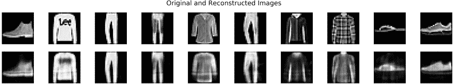

图 20.3：示例时尚 MNIST 图像，原始和重建

## 带稀疏约束的前馈自动编码器

添加正则化相当简单。我们可以使用 Keras 的`activity_regularizer`将其应用于密集编码器层，如下所示：

```py
encoding_l1 = Dense(units=encoding_size,
                    activation='relu',
                    activity_regularizer=regularizers.l1(10e-5),
                    name='Encoder_L1')(input_) 
```

输入和解码层保持不变。在这个例子中，压缩因子为 24.5，正则化对性能产生了负面影响，测试 RMSE 为 0.1229。

## 深度前馈自动编码器

为了说明向自动编码器添加深度的好处，我们将构建一个三层前馈模型，依次将输入从 784 压缩到 128、64 和 32 个单元：

```py
input_ = Input(shape=(input_size,))
x = Dense(128, activation='relu', name='Encoding1')(input_)
x = Dense(64, activation='relu', name='Encoding2')(x)
encoding_deep = Dense(32, activation='relu', name='Encoding3')(x)
x = Dense(64, activation='relu', name='Decoding1')(encoding_deep)
x = Dense(128, activation='relu', name='Decoding2')(x)
decoding_deep = Dense(input_size, activation='sigmoid', name='Decoding3')(x)
autoencoder_deep = Model(input_, decoding_deep) 
```

结果模型有超过 222,000 个参数，比之前的单层模型的容量多四倍多：

```py
Layer (type)                 Output Shape              Param #   
=================================================================
input_1 (InputLayer)         (None, 784)               0         
_________________________________________________________________
Encoding1 (Dense)            (None, 128)               100480    
_________________________________________________________________
Encoding2 (Dense)            (None, 64)                8256      
_________________________________________________________________
Encoding3 (Dense)            (None, 32)                2080      
_________________________________________________________________
Decoding1 (Dense)            (None, 64)                2112      
_________________________________________________________________
Decoding2 (Dense)            (None, 128)               8320      
_________________________________________________________________
Decoding3 (Dense)            (None, 784)               101136    
=================================================================
Total params: 222,384
Trainable params: 222,384
Non-trainable params: 0 
```

训练在 45 个周期后停止，并将测试 RMSE 减少了 14%，达到了 0.097。由于分辨率较低，难以明显注意到更好的重建。

### 可视化编码

我们可以使用流形学习技术**t-分布随机邻域嵌入**（**t-SNE**；参见*第十三章*，*使用无监督学习的数据驱动风险因子和资产配置*）来可视化和评估自动编码器隐藏层学习到的编码的质量。

如果编码成功捕捉到数据的显著特征，那么数据的压缩表示仍应显示与区分观察的 10 个类别对齐的结构。我们使用刚刚训练的深度编码器的输出来获取测试集的 32 维表示：

```py
tsne = TSNE(perplexity=25, n_iter=5000)
train_embed = tsne.fit_transform(encoder_deep.predict(X_train_scaled)) 
```

*图 20.4*显示出 10 个类别很好地分离，表明编码对于作为保存数据关键特征的较低维度表示是有用的（请参见`variational_autoencoder.ipynb`笔记本以获取彩色版本）：

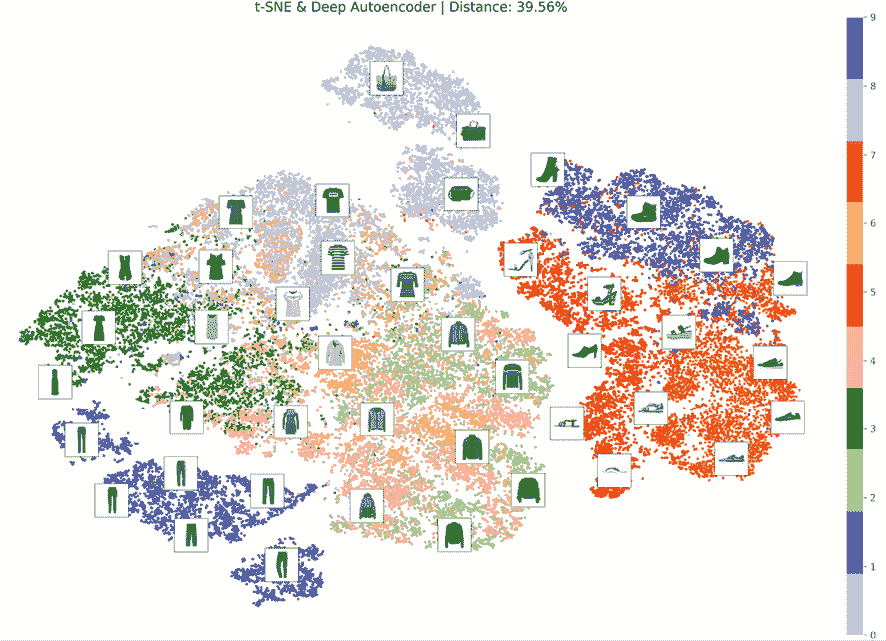

图 20.4：Fashion MNIST 自编码器嵌入的 t-SNE 可视化

## 卷积自编码器

从*第十八章*《金融时间序列和卫星图像的 CNN》，关于 CNN 的见解表明我们应该将卷积层合并到自编码器中，以提取具有图像数据网格结构特征的信息。

我们定义了一个三层编码器，它使用 32、16 和 8 个滤波器的 2D 卷积，分别使用 ReLU 激活和`'same'`填充以保持输入大小。第三层的结果编码大小为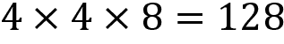，比之前的示例要高：

```py
x = Conv2D(filters=32,
           kernel_size=(3, 3),
           activation='relu',
           padding='same',
           name='Encoding_Conv_1')(input_)
x = MaxPooling2D(pool_size=(2, 2), padding='same', name='Encoding_Max_1')(x)
x = Conv2D(filters=16,
           kernel_size=(3, 3),
           activation='relu',
           padding='same',
           name='Encoding_Conv_2')(x)
x = MaxPooling2D(pool_size=(2, 2), padding='same', name='Encoding_Max_2')(x)
x = Conv2D(filters=8,
           kernel_size=(3, 3),
           activation='relu',
           padding='same',
           name='Encoding_Conv_3')(x)
encoded_conv = MaxPooling2D(pool_size=(2, 2),
                            padding='same',
                            name='Encoding_Max_3')(x) 
```

我们还定义了一个相匹配的解码器，它反转了滤波器数量，并使用 2D 上采样而不是最大池化来反转滤波器大小的减小。三层自编码器有 12,785 个参数，略多于深度自编码器容量的 5％。

训练在 67 个时代后停止，并导致测试 RMSE 进一步降低了 9％，这是由于卷积滤波器能够更有效地从图像数据中学习以及较大的编码大小的能力的结合。

## 去噪自编码器

自编码器应用于去噪任务只影响训练阶段。在本例中，我们向 Fashion MNIST 数据添加了来自标准正态分布的噪声，同时保持像素值在[0, 1]范围内，如下所示：

```py
def add_noise(x, noise_factor=.3):
    return np.clip(x  + noise_factor * np.random.normal(size=x.shape), 0, 1)
X_train_noisy = add_noise(X_train_scaled)
X_test_noisy = add_noise(X_test_scaled) 
```

然后，我们继续在嘈杂的输入上训练卷积自编码器，目标是学习如何生成未损坏的原始图像：

```py
autoencoder_denoise.fit(x=X_train_noisy,
                        y=X_train_scaled,
                        ...) 
```

60 个时代后的测试 RMSE 为 0.0931，毫不奇怪地比以前高。*图 20.5*显示，从上到下，原始图像以及嘈杂和去噪版本。它说明了自编码器成功地从嘈杂的图像中产生了与从原始图像中产生的相似的压缩编码：

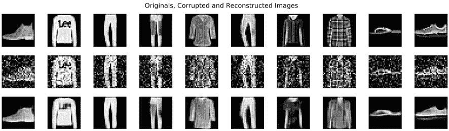

图 20.5：去噪输入和输出示例

# 用于交易的有条件自编码器

Gu、Kelly 和 Xiu（GKX，2019）最近的研究开发了一种基于证券对风险因素的暴露的资产定价模型。当我们在*第十三章*《数据驱动的风险因素和无监督学习的资产配置》中介绍 PCA 以及在*第四章*《金融特征工程-如何研究 Alpha 因子》中介绍的风险因素模型时，它建立在我们讨论的**数据驱动风险因素**概念上。他们的目标是表明因子模型用于捕捉“异常”系统驱动因素的资产特征只是无法直接测量的风险因素的时间变化暴露的代理。在这种情况下，“异常”是超过由暴露于总体市场风险的回报（请参阅*第五章*《投资组合优化和绩效评估》中对资本资产定价模型的讨论）所解释的回报。

在*第四章*和*第七章*讨论的**Fama-French 因子模型**通过指定风险因素如公司规模来解释回报，基于对超过聚合市场风险所致平均股票回报的经验观察。鉴于这些**特定的风险因素**，这些模型能够通过相应设计的组合度量投资者为承担因子风险而获得的回报：按规模分类股票，购买最小的五分位数，卖出最大的五分位数，并计算回报。观察到的风险因素回报然后允许线性回归估计资产对这些因子的敏感性（称为**因子加载**），从而有助于基于（较少的）因子回报的预测来预测（许多）资产的回报。

相比之下，GKX 将**风险因素视为潜在的或不可观察的**，在许多资产之间驱动协方差，从而阻止投资者通过分散化来避免暴露。因此，投资者需要一种调整的回报，就像任何价格一样来实现均衡，进而提供不再异常的回报差异的经济合理性。在这种观点中，风险因素纯粹是统计性质的，而潜在的经济力量可以是任意的和多变的来源。

在另一篇最近的论文中（Kelly, Pruitt, and Su, 2019），Kelly——在耶鲁大学教授金融学，与 AQR 合作，并是将机器学习应用于交易的先驱之一——及其合著者开发了一个线性模型称为**工具化主成分分析**（IPCA），以**从数据中估计潜在的风险因素和资产的因子加载**。 IPCA 将 PCA 扩展到包括资产特征作为协变量，并产生时变的因子加载。通过将资产暴露于可观察的资产特征的因素上，IPCA 的目标是回答是否有一组共同的潜在风险因素来解释观察到的异常，而不是是否有一个特定的可观察因素可以这样做。

GKX 创建了一个**条件自编码器架构**，以反映线性 Fama-French 模型和 IPCA 方法所忽略的回报动态的非线性性质。结果是一个深度神经网络，它同时使用自编码器学习给定数量的不可观测因素的溢价，并使用前馈网络基于广泛的时间变化资产特征学习大量股票的因子加载。该模型成功地解释和预测资产回报。它展示了一个在统计上和经济上都显著的关系，当转化为类似于我们在本书中使用的例子的长短十分位差异策略时，产生了具有吸引力的夏普比率。

在本节中，我们将创建这个模型的简化版本，以演示如何**利用自动编码器生成可交易的信号**。为此，我们将使用 yfinance 在 1990 年至 2019 年期间构建一个接近 4,000 只美国股票的新数据集，因为它提供了一些额外的信息，有助于计算资产特征。我们会采取一些捷径，比如使用较少的资产和仅最重要的特征。我们还会省略一些实现细节，以简化表达。我们将重点介绍最重要的差异，以便您相应地增强模型。

我们将首先展示如何准备数据，然后解释、构建和训练模型并评估其预测性能。请参阅上述参考资料以了解更多有关理论和实现的背景。

## 获取股票价格和元数据信息

GKX 参考实现使用了来自 1957 年至 2016 年的中心研究安全价格（CRSP）的超过 30,000 只美国股票的股价和公司特征数据，频率为每月一次。它计算了 94 个指标，其中包括了一系列在以往学术研究中被建议用于预测收益的资产属性，这些属性在 Green、Hand 和 Zhang（2017 年）中列出，他们旨在验证这些说法。

由于我们无法获得高质量但昂贵的 CRSP 数据，我们利用了 yfinance（见*第二章*，*市场和基本数据-来源和技术*）从 Yahoo Finance 下载价格和元数据。选择免费数据有一些缺点，包括：

+   缺乏关于调整的质量控制

+   存活偏差，因为我们无法获取不再上市的股票的数据

+   在股票数量和历史长度方面范围较小

`build_us_stock_dataset.ipynb` 笔记本包含了本节的相关代码示例。

要获取数据，我们使用 pandas-datareader（见*第二章*，*市场和基本数据-来源和技术*）从 NASDAQ 获取了 8,882 个当前交易符号的列表：

```py
from pandas_datareader.nasdaq_trader import get_nasdaq_symbols
traded_symbols = get_nasdaq_symbols() 
```

我们移除 ETF，并为其余部分创建 yfinance `Ticker()`对象。

```py
import yfinance as yf
tickers = yf.Tickers(traded_symbols[~traded_symbols.ETF].index.to_list()) 
```

每个股票的`.info`属性包含从 Yahoo Finance 抓取的数据点，从未偿还的股票数量和其他基本面到最新的市值；覆盖范围因证券而异：

```py
info = []
for ticker in tickers.tickers:
    info.append(pd.Series(ticker.info).to_frame(ticker.ticker))
info = pd.concat(info, axis=1).dropna(how='all').T
info = info.apply(pd.to_numeric, errors='ignore') 
```

对于具有元数据的股票，我们同时下载调整后和未调整的价格，后者包括像股票分割和股息支付之类的企业行动，我们可以使用这些信息创建一个 Zipline bundle 用于策略回测（见*第八章*，*ML4T 工作流程-从模型到策略回测*）。

我们获得了 4,314 支股票的调整后的 OHLCV 数据，具体如下：

```py
prices_adj = []
with pd.HDFStore('chunks.h5') as store:
    for i, chunk in enumerate(chunks(tickers, 100)):
        print(i, end=' ', flush=True)
        prices_adj.append(yf.download(chunk,
                                      period='max',
                                      auto_adjust=True).stack(-1))
prices_adj = (pd.concat(prices_adj)
              .dropna(how='all', axis=1)
              .rename(columns=str.lower)
              .swaplevel())
prices_adj.index.names = ['ticker', 'date'] 
```

在没有关于基础价格数据和股票分割调整的任何质量控制的情况下，我们删除了具有可疑值的股票，如日回报超过 100%或低于-100%的股票：

```py
df = prices_adj.close.unstack('ticker')
pmax = df.pct_change().max()
pmin = df.pct_change().min()
to_drop = pmax[pmax > 1].index.union(pmin[pmin<-1].index) 
```

这样做会移除大约 10%的股票，使我们在 1990-2019 年期间拥有接近 3900 个资产。

## 计算预测性资产特征

GKX 根据 Green 等人（2017 年）测试了 94 个资产属性，并确定了 20 个最具影响力的指标，同时断言特征重要性随后迅速下降。这 20 个最重要的股票特征分为三类，即：

+   **价格趋势**，包括（行业）动量、短期和长期逆转，或最近的最大收益

+   **流动性**，例如周转率、美元成交量或市值

+   **风险测量**，例如，总体和特异性回报波动率或市场贝塔

在这 20 个指标中，我们将分析限制在 16 个指标上，这些指标我们已经或者可以近似计算相关的输入。 `conditional_autoencoder_for_trading_data.ipynb` 笔记本演示了如何计算相关指标。我们在本节中突出了一些例子；另请参阅*附录*，*Alpha 因子库*。

一些指标需要诸如行业、市值和流通股数等信息，因此我们将我们的股价数据集限制在具有相关元数据的证券上：

```py
tickers_with_metadata = (metadata[metadata.sector.isin(sectors) & 
                                 metadata.marketcap.notnull() &
                                 metadata.sharesoutstanding.notnull() & 
                                (metadata.sharesoutstanding > 0)]
                                 .index.drop(tickers_with_errors)) 
```

我们以每周而不是每月的回报频率运行我们的分析，以弥补时间周期减少 50%和股票数量减少约 80%的情况。我们得到的每周回报如下所示：

```py
returns = (prices.close
           .unstack('ticker')
           .resample('W-FRI').last()
           .sort_index().pct_change().iloc[1:]) 
```

大多数指标都相当容易计算。**股票动量**，即截止到当前日期前 1 个月的 11 个月累积股票回报，可以如下推导：

```py
MONTH = 21
mom12m = (close
            .pct_change(periods=11 * MONTH)
            .shift(MONTH)
            .resample('W-FRI')
            .last()
            .stack()
            .to_frame('mom12m')) 
```

**Amihud 流动性**测量是股票绝对收益与其交易额的比率，以滚动的 21 天平均值表示：

```py
dv = close.mul(volume)
ill = (close.pct_change().abs()
       .div(dv)
       .rolling(21)
       .mean()
       .resample('W-FRI').last()
       .stack()
       .to_frame('ill')) 
```

**特异性波动性**被测量为最近三年等权重市场指数收益的回归残差的标准差。我们使用`statsmodels`进行这个计算密集型指标的计算：

```py
index = close.resample('W-FRI').last().pct_change().mean(1).to_frame('x')
def get_ols_residuals(y, x=index):
    df = x.join(y.to_frame('y')).dropna()
    model = sm.OLS(endog=df.y, exog=sm.add_constant(df[['x']]))
    result = model.fit()
    return result.resid.std()
idiovol = (returns.apply(lambda x: x.rolling(3 * 52)
                         .apply(get_ols_residuals))) 
```

对于**市场贝塔**，我们可以使用 statsmodels 的`RollingOLS`类，周资产收益作为结果，等权重指数作为输入：

```py
def get_market_beta(y, x=index):
    df = x.join(y.to_frame('y')).dropna()
    model = RollingOLS(endog=df.y, 
                       exog=sm.add_constant(df[['x']]),
                       window=3*52)
    return model.fit(params_only=True).params['x']
beta = (returns.dropna(thresh=3*52, axis=1)
        .apply(get_market_beta).stack().to_frame('beta')) 
```

我们最终在 1990-2019 年期间的大约 3800 个证券上得到了约 1600 万次观察结果。*图 20.6*显示了每周股票收益数量的直方图（左侧面板）和每种特征的观察数量分布的箱线图：

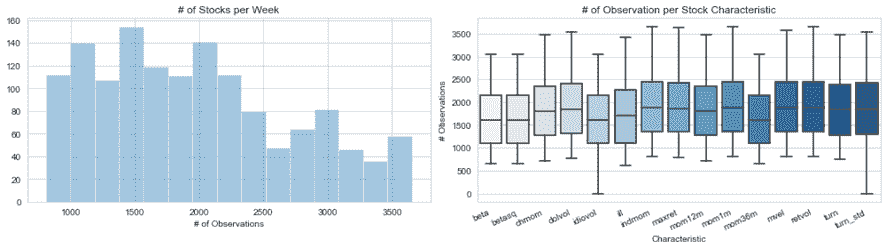

图 20.6：随时间和每种 - 股票特征的股票数目

为了限制离群值的影响，我们遵循 GKX 并对特征进行等级标准化，使其落在[-1, 1]的区间内：

```py
data.loc[:, characteristics] = (data.loc[:, characteristics]
                                .groupby(level='date')
                                .apply(lambda x:
                                      pd.DataFrame(quantile_transform(
                                      x, 
                                      copy=True, 
                                      n_quantiles=x.shape[0]),
                                      columns=characteristics,
                                        index=x.index.get_level_values('ticker'))
                                      )
                               .mul(2).sub(1)) 
```

由于神经网络无法处理缺失数据，我们将缺失值设置为-2，该值位于每周收益和特征的范围之外。

作者采用额外的方法来避免过度权重的小市值股票，例如市值加权最小二乘回归。他们还通过考虑特征的保守报告滞后来调整数据窥探偏差。

## 创建条件自编码器架构

GKX 提出的条件自编码器允许考虑到变化的资产特征的时变回报分布。为此，作者将我们在本章第一节中讨论的标准自编码器架构扩展，以允许特征来塑造编码。

*图 20.7*说明了该架构将结果（资产回报，顶部）建模为资产特征（左侧输入）和再次个体资产回报（右侧输入）的函数。作者允许资产回报是个体股票回报或根据资产特征从样本中的股票组成的组合，类似于我们在*第四章*中讨论的法玛-法 rench 因子组合投资组合，并在本节的介绍中总结（因此从股票到组合的虚线）。我们将使用个体股票回报；有关使用组合而不是个体股票的详细信息，请参阅 GKX。

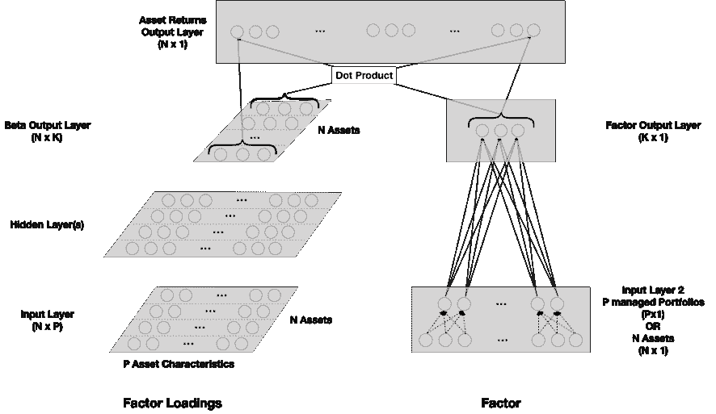

图 20.7：GKX 设计的条件自编码器架构

左侧的**前馈神经网络**模拟了作为其*P*特征（输入）的函数的*N*个个体股票的*K*因子载荷（beta 输出）。在我们的案例中，*N*约为 3,800，*P*等于 16。作者尝试了最多三个隐藏层，分别具有 32、16 和 8 个单元，并发现两个层表现最佳。由于特征数量较少，我们仅使用了一个类似的层，并发现 8 个单元最有效。

当以个体资产回报作为输入时，该架构的右侧是传统的自编码器，因为它将*N*个资产回报映射到它们自己。作者以这种方式使用它来衡量导出的因子如何解释同时发生的回报。此外，他们使用自编码器通过使用来自期间*t*-1 的输入回报和期间*t*的输出回报来预测未来回报。我们将重点关注该架构用于预测的用途，强调自编码器是本章第一节中提到的前馈神经网络的特殊情况。

模型输出是左侧的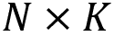因子载荷与右侧的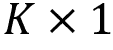因子溢价的点积。作者在范围为 2-6 的*K*值上进行了实验，与已建立的因子模型类似。

要使用 TensorFlow 2 创建此架构，我们使用 Functional Keras API 并定义一个`make_model()`函数，该函数自动化了模型编译过程如下：

```py
def make_model(hidden_units=8, n_factors=3):
    input_beta = Input((n_tickers, n_characteristics), name='input_beta')
    input_factor = Input((n_tickers,), name='input_factor')
    hidden_layer = Dense(units=hidden_units,
                         activation='relu',
                         name='hidden_layer')(input_beta)
    batch_norm = BatchNormalization(name='batch_norm')(hidden_layer)

    output_beta = Dense(units=n_factors, name='output_beta')(batch_norm)
    output_factor = Dense(units=n_factors,
                          name='output_factor')(input_factor)
    output = Dot(axes=(2,1),
                 name='output_layer')([output_beta, output_factor])
    model = Model(inputs=[input_beta, input_factor], outputs=output)
    model.compile(loss='mse', optimizer='adam')
    return model 
```

我们遵循作者的做法，使用批量归一化并编译模型以在此回归任务中使用均方误差和 Adam 优化器。该模型有 12,418 个参数（请参阅笔记本）。

作者使用了额外的正则化技术，例如对网络权重的 L1 惩罚，并结合了具有相同架构但使用不同随机种子的各种网络的结果。他们还使用了提前停止。

我们使用 20 年的数据进行交叉验证，用五个对应于 2015-2019 年的折叠来预测下一年的每周回报。我们通过计算验证集的信息系数（IC）来评估从 2 到 6 个因子 K 和 8、16 或 32 个隐藏层单元的组合：

```py
factor_opts = [2, 3, 4, 5, 6]
unit_opts = [8, 16, 32]
param_grid = list(product(unit_opts, factor_opts))
for units, n_factors in param_grid:
    scores = []
    model = make_model(hidden_units=units, n_factors=n_factors)
    for fold, (train_idx, val_idx) in enumerate(cv.split(data)):
        X1_train, X2_train, y_train, X1_val, X2_val, y_val = \
            get_train_valid_data(data, train_idx, val_idx)
        for epoch in range(250):         
            model.fit([X1_train, X2_train], y_train,
                      batch_size=batch_size,
                      validation_data=([X1_val, X2_val], y_val),
                      epochs=epoch + 1,
                      initial_epoch=epoch, 
                      verbose=0, shuffle=True)
            result = (pd.DataFrame({'y_pred': model.predict([X1_val,
                                                             X2_val])
                                   .reshape(-1),
                                    'y_true': y_val.stack().values},
                                  index=y_val.stack().index)
                      .replace(-2, np.nan).dropna())
            r0 = spearmanr(result.y_true, result.y_pred)[0]
            r1 = result.groupby(level='date').apply(lambda x: 
                                                    spearmanr(x.y_pred, 
                                                              x.y_true)[0])
            scores.append([units, n_factors, fold, epoch, r0, r1.mean(),
                           r1.std(), r1.median()]) 
```

*图 20.8* 绘制了五因子计数和三种隐藏层大小组合在五个年度交叉验证折叠中每个时期的验证 IC 的平均值。上面的面板显示了 52 周的 IC，下面的面板显示了平均每周的 IC（有关彩色版本，请参阅笔记本）：

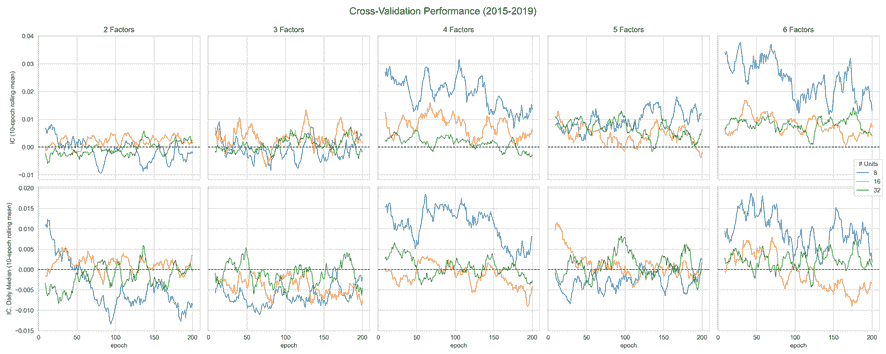

图 20.8：所有因子和隐藏层大小组合的交叉验证性能

结果表明，更多的因子和较少的隐藏层单元效果更好；特别是，具有八个单元的四和六个因子在 0.02-0.03 的整体 IC 值范围内表现最佳。

为了评估模型预测性能的经济意义，我们生成了一个具有八个单元的四因子模型的预测，训练了 15 个周期。然后，我们使用 Alphalens 来计算预测的五分位等权重投资组合之间的价差，同时忽略交易成本（请参阅 `alphalens_analysis.ipynb` 笔记本）。

*图 20.9* 显示了持有期从 5 天到 21 天的平均价差。对于较短的期限，这也反映了预测视野，底部和顶部十分位数之间的价差约为 10 个基点：

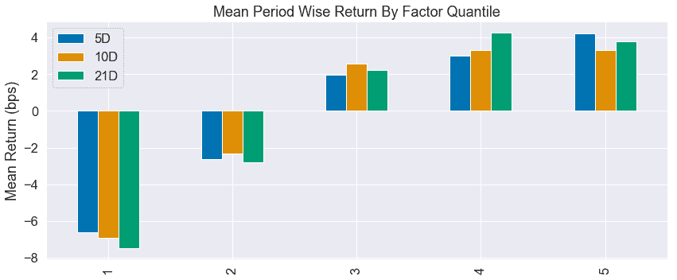

图 20.9：预测五分位的平均期间差异

为了评估预测性能如何随时间转化为回报，我们绘制了类似投资组合的累积回报图，以及分别投资于前半部分和后半部分的多空投资组合的累积回报：

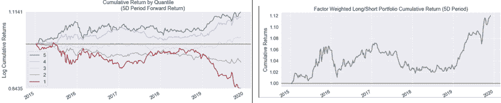

图 20.10：基于五分位和多空组合的累积回报

结果显示了五分位投资组合之间的显著差距，以及长期以来更广泛的多空投资组合的正累积回报。这支持了条件自编码器模型可能有助于盈利交易策略的假设。

## 学到的经验和下一步计划

条件自编码器结合了我们在*第十三章*《数据驱动的风险因素和使用无监督学习进行资产配置》中使用 PCA 探索的数据驱动风险因素的非线性版本，以及在*第四章*和*第七章*中讨论的建模回报的风险因素方法。它说明了深度神经网络架构如何能够灵活适应各种任务，以及自编码器和前馈神经网络之间的流动边界。

从数据源到架构的众多简化指向了几个改进途径。除了获取更多质量更好的数据，并且还可以计算出额外特征的数据外，以下修改是一个起点——当然还有许多其他途径：

+   尝试与周频以外的**数据频率**，以及年度以外的预测时段，其中较短的周期还将增加训练数据的数量。

+   修改**模型架构**，特别是在使用更多数据的情况下，可能会推翻这样一个发现：一个更小的隐藏层会更好地估计因子载荷。

# 摘要

在本章中，我们介绍了无监督学习如何利用深度学习。自动编码器学习复杂的、非线性的特征表示，能够显著压缩复杂数据而损失很少信息。因此，它们对于应对与具有许多特征的丰富数据相关的维度灾难特别有用，尤其是具有替代数据的常见数据集。我们还看到如何使用 TensorFlow 2 实现各种类型的自动编码器。

最重要的是，我们实现了最近的学术研究，从数据中提取数据驱动的风险因素来预测回报。与我们在*第十三章*中对这一挑战的线性方法不同，*基于数据驱动的风险因素和无监督学习的资产配置*，自动编码器捕捉非线性关系。此外，深度学习的灵活性使我们能够将许多关键资产特征纳入模型中，以建模更敏感的因素，有助于预测回报。

在下一章中，我们将重点研究生成对抗网络，它们常被称为人工智能最令人兴奋的最新发展之一，并看看它们如何能够创建合成的训练数据。
