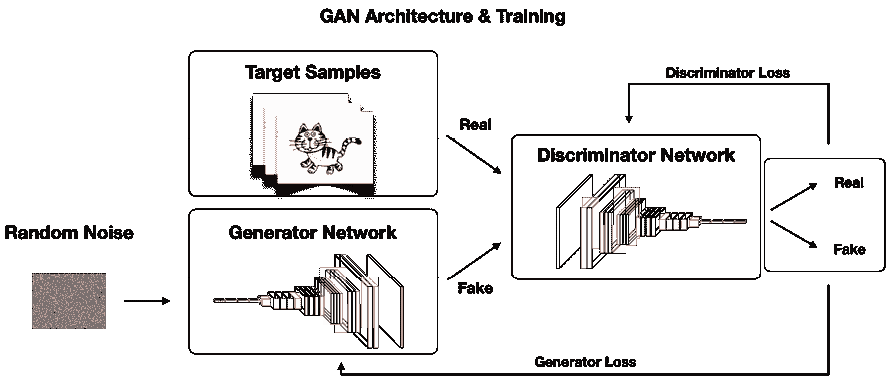
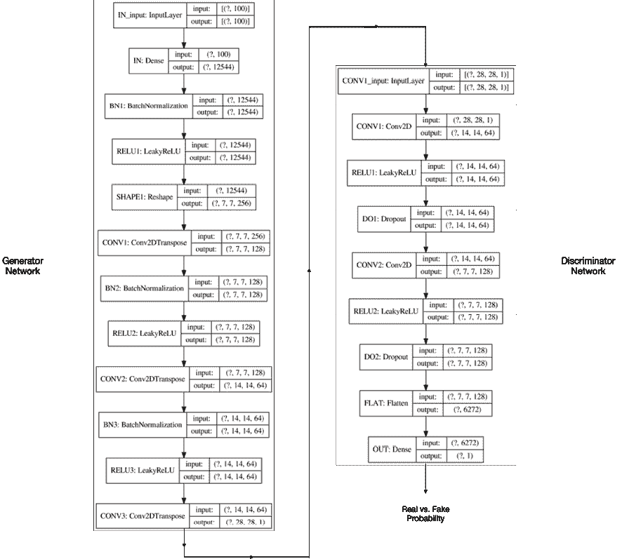
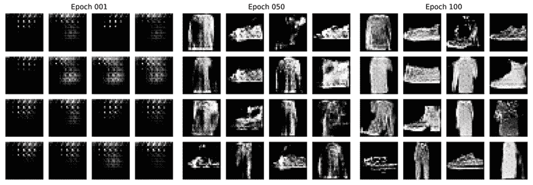
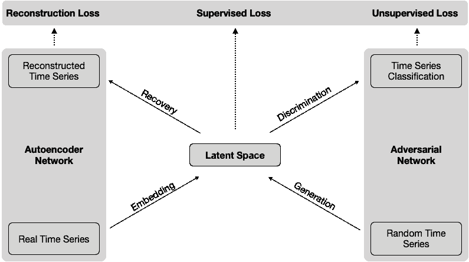
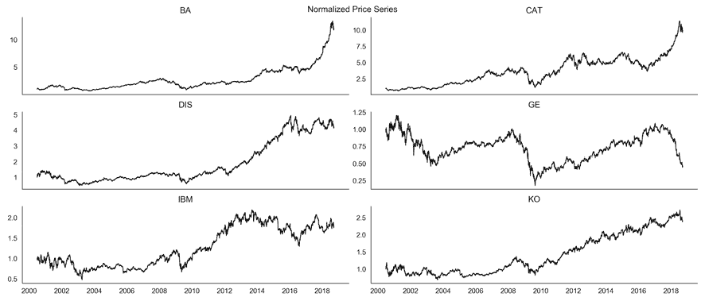
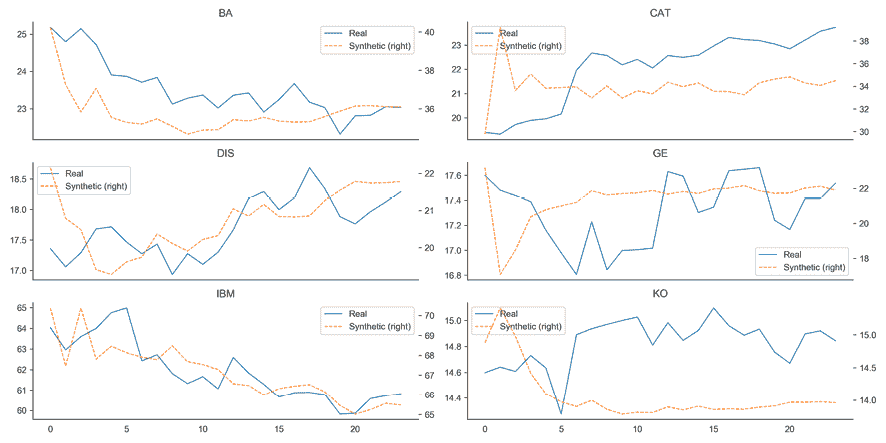
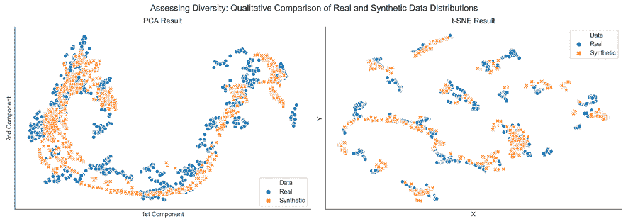
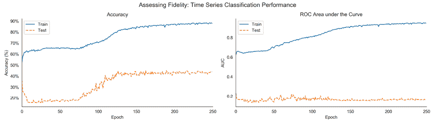
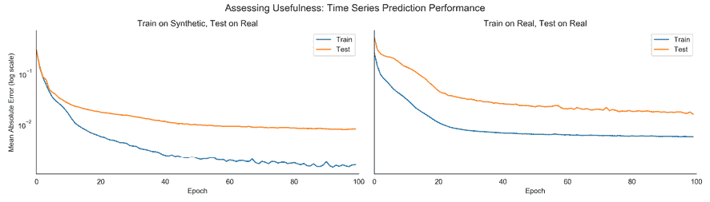

# 第二十一章：用于合成时间序列数据的生成对抗网络

在上一章关于自编码器的介绍之后，本章将介绍第二个无监督深度学习技术：**生成对抗网络**（**GANs**）。与自编码器一样，GANs 补充了第十三章介绍的降维和聚类方法，即*《基于数据的风险因素和无监督学习的资产配置》*。

**GANs** 是由 Goodfellow 等人于 2014 年发明的。Yann LeCun 称 GANs 是“过去十年中人工智能中最激动人心的想法。” 一个 **GAN** 在竞争环境中训练两个神经网络，称为**生成器**和**判别器**。生成器旨在生成使判别器无法与给定类别的训练数据区分的样本。其结果是一种生成模型，能够产生代表某个特定目标分布的合成样本，但是这些样本是人工生成的，因此成本较低。

GANs 在许多领域产生了大量的研究和成功的应用。虽然最初应用于图像，但 Esteban、Hyland 和 Rätsch（2017）将 GANs 应用于医学领域以生成**合成时间序列数据**。随后进行了与金融数据的实验（Koshiyama、Firoozye 和 Treleaven 2019；Wiese 等人 2019；Zhou 等人 2018；Fu 等人 2019），以探索 GANs 是否能够生成模拟替代资产价格轨迹的数据，以训练监督或强化算法，或进行交易策略的回测。我们将复制 2019 年 NeurIPS 由 Yoon、Jarrett 和 van der Schaar（2019）提出的时间序列 GAN，以说明该方法并展示结果。

具体来说，在本章中，您将学习以下内容：

+   GANs 的工作原理、其用处以及如何应用于交易

+   使用 TensorFlow 2 设计和训练 GANs

+   生成合成金融数据以扩展用于训练 ML 模型和回测的输入

您可以在 GitHub 仓库的相应目录中找到本章的代码示例和额外资源的链接。笔记本包括图像的彩色版本。

# 使用 GANs 创建合成数据

本书主要关注接收输入数据并预测结果的监督学习算法，我们可以将其与基本事实进行比较以评估其性能。这样的算法也称为**判别模型**，因为它们学会区分不同的输出值。

GANs 是像我们在上一章遇到的变分自编码器那样的**生成模型**的一个实例。如前所述，生成模型使用从某个分布 *p*[data] 中抽取的样本的训练集，并学习表示该数据生成分布的估计 *p*[model]。

正如介绍中提到的，GAN 被认为是最近最激动人心的机器学习创新之一，因为它们似乎能够生成高质量的样本，忠实地模仿一系列输入数据。这在需要监督学习所需的标记数据缺失或成本过高的情况下非常具有吸引力。

GAN（生成对抗网络）引发了一波研究热潮，最初集中于生成惊人逼真的图像。最近，出现了产生合成时间序列的 GAN 实例，这对于交易具有重要潜力，因为历史市场数据的有限可用性是回测过拟合风险的主要驱动因素。

在本节中，我们将更详细地解释生成模型和对抗训练的工作原理，并审查各种 GAN 架构。在下一节中，我们将演示如何使用 TensorFlow 2 设计和训练 GAN。在最后一节中，我们将描述如何调整 GAN，使其生成合成时间序列数据。

## 比较生成模型和判别模型

判别模型学习如何区分在给定输入数据*X*的情况下的不同结果*y*。换句话说，它们学习给定数据的结果的概率：*p*(*y* | *X*)。另一方面，生成模型学习输入和结果的联合分布*p*(*y*, *X*)。虽然生成模型可以使用贝叶斯定理作为判别模型来计算哪个类别最有可能（参见*第十章*，*贝叶斯机器学习 - 动态夏普比率和对冲交易*），但通常似乎更可取地直接解决预测问题，而不是先解决更一般的生成挑战（Ng 和 Jordan，2002）。

GAN 具有生成目标：它们生成复杂的输出，例如逼真的图像，给定甚至可以是随机数的简单输入。它们通过对可能输出的概率分布进行建模来实现这一点。这个概率分布可以有很多维度，例如图像中的每个像素，文档中的每个字符或标记，或者时间序列中的每个值。因此，模型可以生成很可能代表输出类别的输出。

理查德·费曼的引述“**我无法创建的，我就无法理解**”强调了对建模生成分布的重要性，这是迈向更一般人工智能的重要一步，类似于人类学习，后者使用更少的样本就能成功。

生成模型除了能够从给定分布生成额外样本之外，还有几个**用例**。例如，它们可以被纳入基于模型的**强化学习**（**RL**）算法中（请参见下一章）。生成模型也可以应用于时间序列数据，以模拟可供规划在 RL 或监督学习中使用的备选过去或可能的未来轨迹，包括用于设计交易算法。其他用例包括半监督学习，其中 GAN 可以通过特征匹配来为缺失标签分配比当前方法少得多的训练样本。

## 对抗训练 - 一个零和游戏的欺诈行为

GANs 的关键创新是学习数据生成概率分布的新方法。该算法建立了两个神经网络之间的竞争性或对抗性游戏，称为**生成器**和**鉴别器**。

生成器的目标是将随机噪声输入转换成特定类别对象的虚假实例，例如人脸图像或股票价格时间序列。鉴别器则旨在将生成器的欺骗性输出与包含目标对象真实样本的训练数据集区分开来。整个 GAN 的目标是使两个网络在各自的任务上变得更好，以便生成器产生的输出机器无法再与原始数据区分开来（在此时我们不再需要鉴别器，因为它不再必要，可以丢弃它）。

*图 21.1*说明了使用通用 GAN 架构进行对抗训练，该架构旨在生成图像。我们假设生成器使用深度 CNN 架构（例如我们在上一章讨论的卷积自动编码器中的 VGG16 示例），它像我们之前讨论的卷积自动编码器的解码器部分一样被反转。生成器接收具有随机像素值的输入图像，并产生传递给鉴别器网络的*假*输出图像，鉴别器网络使用镜像 CNN 架构。鉴别器网络还接收代表目标分布的*真实*样本，并预测输入是*真实*还是*伪造*的概率。学习通过将鉴别器和生成器损失的梯度反向传播到各自网络的参数来进行：



图 21.1：GAN 架构

最近的 GAN 实验室是一个很棒的交互式工具，灵感来自 TensorFlow Playground，它允许用户设计 GAN 并可视化学习过程和性能随时间的各个方面（请参见 GitHub 上的资源链接）。

## GAN 架构动物园的快速演变

自 2014 年 Goodfellow 等人发表论文以来，GANs 吸引了大量关注，并引发了相应的研究热潮。

大部分工作是将原始架构进行细化，以适应不同的领域和任务，并扩展以包含额外的信息并创建条件生成对抗网络。额外的研究集中在改进这个具有挑战性的训练过程的方法上，该过程需要在两个网络之间实现稳定的博弈均衡，而每个网络都可能很难单独训练。

生成对抗网络的应用领域已经变得更加多样化，超出了我们在这里可以覆盖的范围；请参阅 Creswell 等人（2018 年）和 Pan 等人（2019 年）的最新调查，以及 Odena（2019 年）的未解问题清单。

### 深度卷积生成对抗网络用于表示学习

**深度卷积生成对抗网络**（**DCGANs**）受到了卷积神经网络成功应用于网格数据的监督学习的启发（Radford，Metz 和 Chintala，2016）。该架构通过开发基于对抗训练的特征提取器将生成对抗网络应用于无监督学习，更易于训练并生成质量更高的图像。现在被认为是基线实现，有大量的开源示例可用（请参阅 GitHub 上的参考资料）。

一个 DCGAN 网络以均匀分布的随机数作为输入，并输出分辨率为 64×64 像素的彩色图像。随着输入的逐渐变化，生成的图像也会随之变化。该网络由标准的卷积神经网络组件组成，包括反卷积层，这些层与上一章节中的卷积自编码器示例中的卷积层相反，或者全连接层。

作者进行了详尽的实验，并提出了一些建议，例如在两个网络中都使用批标准化和 ReLU 激活。我们将在本章后面探讨 TensorFlow 的实现。

### 用于图像到图像转换的条件生成对抗网络

**条件生成对抗网络**（**cGANs**）将附加的标签信息引入训练过程中，从而提高了输出的质量，并且能对输出进行一定程度的控制。

cGANs 通过向鉴别器添加第三个输入改变了之前显示的基线架构，该输入包含类别标签。例如，这些标签在生成图像时可以传达性别或头发颜色信息。

扩展包括**生成对抗性的何处网络**（**GAWWN**；Reed 等，2016），它不仅使用边界框信息生成合成图像，还将物体放置在给定位置。

## 生成对抗网络应用于图像和时间序列数据

除了对原始架构进行大量的扩展和修改之外，还出现了许多应用于图像以及序列数据（如语音和音乐）的应用。图像应用特别多样，从图像混合和超分辨率到视频生成和人体姿势识别等。此外，生成对抗网络已被用于提高监督学习的性能。

我们将看一些显著的例子，然后更仔细地研究可能与算法交易和投资特别相关的时间序列数据应用。参见 Alqahtani，Kavakli-Thorne 和 Kumar（2019）进行最近调查，并参考 GitHub 引用获取额外资源。

### CycleGAN – 无配对图像到图像的翻译

监督图像到图像的翻译旨在学习对齐的输入和输出图像之间的映射关系。当无配对图像可用时，CycleGAN 解决了这个任务，并将图像从一个域转换为匹配另一个域。

流行的例子包括将马的“绘画”合成为斑马，反之亦然。它还包括通过从任意风景照片生成印象派印刷的逼真样本（Zhu 等，2018 年）来转换风格。

### StackGAN – 文本到照片图像合成

GAN 早期应用之一是根据文本生成图像。 **堆叠 GAN**，通常简称为**StackGAN**，使用句子作为输入，并生成与描述匹配的多个图像。

该架构分为两个阶段，第一阶段产生形状和颜色的低分辨率草图，第二阶段将结果增强为具有照片逼真细节的高分辨率图像（Zhang 等，2017 年）。

### SRGAN – 照片逼真的单图像超分辨率

超分辨率旨在从低分辨率输入产生更高分辨率的逼真图像。应用于此任务的 GAN 具有深度 CNN 架构，使用批归一化，ReLU 和跳跃连接，如 ResNet 中所遇到的，以产生令人印象深刻的结果，这些结果已经找到商业应用（Ledig 等，2017 年）。

### 使用递归条件 GANs 合成合成时间序列

**递归 GANs**（**RGANs**）和**递归条件 GANs**（**RCGANs**）是两种旨在合成逼真的实值多变量时间序列的模型架构（Esteban，Hyland 和 Rätsch，2017）。作者针对医疗领域的应用，但该方法可能非常有价值，可以克服历史市场数据的限制。

RGANs 依赖于**递归神经网络**（**RNNs**）作为生成器和鉴别器。 RCGANs 根据 cGANs 的精神添加辅助信息（参见前面的*图像到图像的有条件 GAN*部分）。

作者成功生成了视觉上和数量上令人信服的逼真样本。此外，他们通过使用合成数据来训练模型来评估合成数据的质量，包括合成标签，在真实测试集上预测性能只有轻微下降。作者还演示了成功应用 RCGANs 到一个早期预警系统，使用了一份来自重症监护病房的 17,000 名患者的医疗数据集。因此，作者阐明了 RCGANs 能够生成对监督训练有用的时间序列数据。我们将在本章的*TimeGAN – 对合成金融数据进行对抗训练*部分中应用这种方法到金融市场数据。

# 如何使用 TensorFlow 2 构建 GAN

为了说明使用 Python 实现 GAN，我们将使用本节早期讨论的 DCGAN 示例来合成来自 Fashion-MNIST 数据集的图像，我们在*第十三章*，*使用无监督学习进行数据驱动风险因子和资产配置*中首次遇到该数据集。

有关实现细节和参考，请参见笔记本 `deep_convolutional_generative_adversarial_network`。

## 构建生成器网络

生成器和判别器都使用类似*图 20.1*所示的深度 CNN 架构，但层数较少。生成器使用一个全连接输入层，然后是三个卷积层，如下所定义的 `build_generator()` 函数所示，该函数返回一个 Keras 模型实例：

```py
def build_generator():
    return Sequential([Dense(7 * 7 * 256, 
                             use_bias=False,
                             input_shape=(100,), 
                             name='IN'),
                       BatchNormalization(name='BN1'),
                       LeakyReLU(name='RELU1'),
                       Reshape((7, 7, 256), name='SHAPE1'),
                       Conv2DTranspose(128, (5, 5), 
                                       strides=(1, 1),
                                       padding='same', 
                                       use_bias=False,
                                       name='CONV1'),
                       BatchNormalization(name='BN2'),
                       LeakyReLU(name='RELU2'),
                       Conv2DTranspose(64, (5, 5), 
                                       strides=(2, 2),
                                       padding='same',
                                       use_bias=False,
                                       name='CONV2'),
                       BatchNormalization(name='BN3'),
                       LeakyReLU(name='RELU3'),
                       Conv2DTranspose(1, (5, 5), 
                                       strides=(2, 2),
                                       padding='same', 
                                       use_bias=False,
                                       activation='tanh', 
                                       name='CONV3')],
                      name='Generator') 
```

生成器接受 100 个一维随机值作为输入，并产生宽高为 28 像素的图像，因此包含 784 个数据点。

对此函数返回的模型调用 `.summary()` 方法显示，该网络有超过 2.3 百万个参数（有关详细信息，请参见笔记本，包括训练前生成器输出的可视化）。

## 创建判别器网络

判别器网络使用两个卷积层将来自生成器的输入转换为单个输出值。该模型有大约 212,000 个参数：

```py
def build_discriminator():
    return Sequential([Conv2D(64, (5, 5), 
                              strides=(2, 2), 
                              padding='same',
                              input_shape=[28, 28, 1], 
                              name='CONV1'),
                       LeakyReLU(name='RELU1'),
                       Dropout(0.3, name='DO1'),
                       Conv2D(128, (5, 5), 
                              strides=(2, 2),
                              padding='same', 
                              name='CONV2'),
                       LeakyReLU(name='RELU2'),
                       Dropout(0.3, name='DO2'),
                       Flatten(name='FLAT'),
                       Dense(1, name='OUT')],
                      name='Discriminator') 
```

*图 21.2* 描述了随机输入是如何从生成器流向判别器的，以及各个网络组件的输入和输出形状：



图 21.2: DCGAN TensorFlow 2 模型架构

## 设置对抗训练过程

现在我们已经构建了生成器和判别器模型，我们将设计并执行对抗训练过程。为此，我们将定义以下内容：

+   反映它们之间竞争性互动的两个模型的损失函数

+   运行反向传播算法的单个训练步骤

+   训练循环重复训练步骤，直到模型性能符合我们的期望

### 定义生成器和判别器损失函数

生成器损失反映了鉴别器对假输入的决定。如果鉴别器误将生成器生成的图像误认为是真实图像，则生成器损失会很低；反之，则会很高；在创建训练步骤时，我们将定义这两个模型之间的交互。

生成器损失由二元交叉熵损失函数度量，如下所示：

```py
cross_entropy = BinaryCrossentropy(from_logits=True)
def generator_loss(fake_output):
    return cross_entropy(tf.ones_like(fake_output), fake_output) 
```

鉴别器接收真实图像和假图像作为输入。它为每个图像计算损失，并试图通过最小化这两种类型输入的总和来准确识别它们：

```py
def discriminator_loss(true_output, fake_output):
    true_loss = cross_entropy(tf.ones_like(true_output), true_output)
    fake_loss = cross_entropy(tf.zeros_like(fake_output), fake_output)
    return true_loss + fake_loss 
```

为了训练这两个模型，我们为每个模型分配了一个 Adam 优化器，其学习率低于默认值：

```py
gen_optimizer = Adam(1e-4)
dis_optimizer = Adam(1e-4) 
```

### 核心 - 设计训练步骤

每个训练步骤实现一轮随机梯度下降，使用 Adam 优化器。它包括五个步骤：

1.  向每个模型提供小批量输入

1.  获取当前权重的模型输出

1.  根据模型的目标和输出计算损失

1.  根据每个模型权重的损失获取梯度

1.  根据优化器的算法应用梯度

函数`train_step()`执行这五个步骤。我们使用`@tf.function`装饰器通过将其编译为 TensorFlow 操作来加速执行，而不是依赖急切执行（有关详细信息，请参阅 TensorFlow 文档）：

```py
@tf.function
def train_step(images):
    # generate the random input for the generator
    noise = tf.random.normal([BATCH_SIZE, noise_dim])
    with tf.GradientTape() as gen_tape, tf.GradientTape() as disc_tape:     
        # get the generator output
        generated_img = generator(noise, training=True)
        # collect discriminator decisions regarding real and fake input
        true_output = discriminator(images, training=True)
        fake_output = discriminator(generated_img, training=True)
        # compute the loss for each model
        gen_loss = generator_loss(fake_output)
        disc_loss = discriminator_loss(true_output, fake_output)
    # compute the gradients for each loss with respect to the model variables
    grad_generator = gen_tape.gradient(gen_loss,
                                       generator.trainable_variables)
    grad_discriminator = disc_tape.gradient(disc_loss,
                                            discriminator.trainable_variables)
    # apply the gradient to complete the backpropagation step
    gen_optimizer.apply_gradients(zip(grad_generator,
                                      generator.trainable_variables))
    dis_optimizer.apply_gradients(zip(grad_discriminator,
                                      discriminator.trainable_variables)) 
```

### 组合在一起 - 训练循环

一旦我们正确定义了训练步骤，实现训练循环非常简单。它由一个简单的`for`循环组成，在每次迭代期间，我们将一批新的真实图像传递给训练步骤。我们还将抽样一些合成图像，并偶尔保存模型权重。

请注意，我们使用`tqdm`包跟踪进度，该包在训练期间显示完成的百分比：

```py
def train(dataset, epochs, save_every=10):
    for epoch in tqdm(range(epochs)):
        for img_batch in dataset:
            train_step(img_batch)
        # produce images for the GIF as we go
        display.clear_output(wait=True)
        generate_and_save_images(generator, epoch + 1, seed)
        # Save the model every 10 EPOCHS
        if (epoch + 1) % save_every == 0:
            checkpoint.save(file_prefix=checkpoint_prefix)
        # Generator after final epoch
    display.clear_output(wait=True)
    generate_and_save_images(generator, epochs, seed)
train(train_set, EPOCHS) 
```

## 评估结果

在仅需几分钟的 100 轮迭代之后，从随机噪声创建的合成图像明显开始类似于原始图像，您可以在*图 21.3*中看到（请参阅笔记本以获取最佳的视觉质量）：



图 21.3：合成 Fashion-MNIST 图像的样本

笔记本还创建了一个动态的 GIF 图像，可视化合成图像的质量在训练期间如何改善。

现在我们了解了如何使用 TensorFlow 2 构建和训练 GAN，我们将转向一个更复杂的示例，该示例从股价数据生成合成时间序列。

# 用于合成金融数据的 TimeGAN

生成合成时间序列数据面临着特定的挑战，这些挑战超出了设计用于图像的 GAN 时所遇到的挑战。除了在任何给定点上的变量分布外，例如像素值或大量股票的价格，用于时间序列数据的生成模型还应该学习塑造观测序列之间如何跟随的时间动态。（也参见*第九章*，*用于波动预测和统计套利的时间序列模型*中的讨论）。

Yoon、Jarrett 和 van der Schaar 在 2019 年 12 月的 NeurIPS 上提出的非常新颖且有前景的研究，引入了一种新型的**时间序列生成对抗网络**（**TimeGAN**）框架，旨在通过结合监督和无监督训练来解释时间相关性。该模型在优化监督和对抗目标的同时学习时间序列嵌入空间，这些目标鼓励模型在训练期间从历史数据中采样时遵循观察到的动态。作者对各种时间序列（包括历史股票价格）进行了模型测试，并发现合成数据的质量明显优于现有替代品。

在本节中，我们将概述这个复杂模型的工作原理，重点介绍建立在以前 DCGAN 示例基础上的关键实现步骤，并展示如何评估生成时间序列的质量。更多信息请参阅论文。

## 学习跨特征和时间生成数据

用于时间序列数据的成功生成模型需要捕捉每个时间点上特征的横截面分布以及这些特征随时间的纵向关系。用我们刚讨论的图像上下文来表达，模型不仅需要学习一个真实图像是什么样子，还需要学习一个图像如何从前一个图像演变而来，就像视频一样。

### 结合对抗和监督训练

正如第一节中提到的那样，以前生成时间序列数据的尝试，如 RGAN 和 RCGAN，依赖于 RNN（请参阅*第十九章*，*用于多变量时间序列和情感分析的 RNN*）充当生成器和判别器的角色。TimeGAN 通过将 DCGAN 示例中的**无监督对抗损失**应用于真实和合成序列，并与相对于原始数据的**逐步监督损失**结合，明确地结合了时间序列的自回归特性。其目标是奖励模型学习存在于历史数据中的从一个时间点到下一个时间点的**转换分布**。

此外，TimeGAN 包括一个嵌入网络，将时间序列特征映射到较低维度的潜在空间，以降低对抗空间的复杂性。其动机是捕捉通常具有较低维度的时间动态的驱动因素。（还请参阅*第十三章*中的流形学习讨论，*使用无监督学习的数据驱动风险因素和资产配置*，以及*第二十章*中的非线性降维讨论，*用于条件风险因素和资产定价的自编码器*）。

TimeGAN 架构的一个关键元素是，生成器和嵌入（或自动编码器）网络都负责最小化监督损失，这个损失度量模型学习动态关系的好坏。因此，模型学习了一个潜在空间，有助于生成器忠实地再现历史数据中观察到的时间关系。除了时间序列数据，模型还可以处理静态数据，即随时间不变或随时间变化较少的数据。

### TimeGAN 架构的四个组成部分

TimeGAN 架构将对抗网络与自动编码器结合在一起，因此有四个网络组件，如 *图 21.4* 所示：

1.  **自动编码器**：嵌入和恢复网络

1.  **对抗网络**：序列生成器和序列鉴别器组件

作者强调通过**三种不同的损失函数**来进行自动编码器和对抗网络的**联合训练**。**重建损失**优化自动编码器，**无监督损失**训练对抗网络，**监督损失**强制执行时间动态。由于这一关键见解，TimeGAN 同时学会了编码特征、生成表示和在时间上迭代。更具体地说，嵌入网络创建潜在空间，对抗网络在此空间内运作，监督损失同步了真实数据和合成数据的潜在动态。



图 21.4：TimeGAN 架构的组件

自动编码器的**嵌入和恢复**组件将特征空间映射到潜在空间，反之亦然。这有助于对抗网络学习低维空间中的时间动态。作者使用堆叠 RNN 和前馈网络实现了嵌入和恢复网络。然而，只要它们是自回归的，并且尊重数据的时间顺序，这些选择可以灵活地适应手头的任务。

对抗网络的**生成器和鉴别器**元素与 DCGAN 不同，不仅因为它们作用于序列数据，而且因为合成特征是在模型同时学习的潜在空间中生成的。作者选择了 RNN 作为生成器，选择了具有前向输出层的双向 RNN 作为鉴别器。

### 自动编码器和对抗网络的联合训练

*图 21.4* 中显示的三个损失函数驱动了刚刚描述的网络元素的联合优化，同时在真实和随机生成的时间序列上训练。更详细地说，它们旨在实现以下目标：

+   **重建损失**是我们在*第二十章*中对自动编码器的讨论中熟悉的；它比较重构的编码数据与原始数据的相似程度。

+   **无监督损失**反映了生成器和鉴别器之间的竞争交互，如 DCGAN 示例中所述；生成器旨在最小化鉴别器将其输出分类为伪造的概率，而鉴别器旨在优化对真实和伪造输入的正确分类。

+   **监督损失**捕捉生成器在接收编码的真实数据进行前序列时，在潜在空间中逼近实际的下一个时间步骤的程度。

训练分为**三个阶段**：

1.  在实际时间序列上训练自动编码器以优化重建。

1.  使用实时时间序列优化监督损失，以捕捉历史数据的时间动态。

1.  联合训练四个组件，同时最小化所有三个损失函数。

TimeGAN 包括用于加权复合损失函数组件的几个**超参数**；然而，作者发现网络对这些设置的敏感性要小于人们可能预期的，考虑到 GAN 训练的困难。事实上，他们在训练过程中**没有发现重大挑战**，并建议嵌入任务用于正则化对抗学习，因为它降低了其维度，而监督损失则约束了生成器的逐步动态。

现在我们转向使用 TensorFlow 2 实现 TimeGAN；请参阅论文以了解该方法的数学和方法的深入解释。

## 使用 TensorFlow 2 实现 TimeGAN

在本节中，我们将实现刚刚描述的 TimeGAN 架构。作者提供了使用 TensorFlow 1 的示例代码，我们将其移植到 TensorFlow 2。构建和训练 TimeGAN 需要几个步骤：

1.  选择和准备真实和随机时间序列输入

1.  创建关键的 TimeGAN 模型组件

1.  定义在三个训练阶段使用的各种损失函数和训练步骤。

1.  运行训练循环并记录结果。

1.  生成合成时间序列并评估结果。

我们将逐步介绍每个步骤的关键项目；请参阅笔记本`TimeGAN_TF2`以获取本节中的代码示例（除非另有说明），以及其他实现细节。

### 准备真实和随机输入系列

作者使用了从 Yahoo Finance 下载的 15 年每日谷歌股票价格作为金融数据的 TimeGAN 适用性示例，包括六个特征，即开盘价、最高价、最低价、收盘价和调整后的收盘价以及交易量。我们将使用近 20 年的六个不同股票的调整后的收盘价，因为它引入了较高的变异性。我们将按照原始论文的要求，针对 24 个时间步长生成合成序列。

在 Quandl Wiki 数据集中历史最悠久的股票中，有一些是以归一化格式显示的，即从 1.0 开始，在 *图 21.5* 中显示。我们从 2000 年至 2017 年检索调整后的收盘价，并获得 4,000 多个观察结果。系列之间的相关系数从 GE 和 CAT 的 0.01 到 DIS 和 KO 的 0.94 不等。



图 21.5：TimeGAN 输入-六个真实股票价格系列

我们使用 scikit-learn 的 `MinMaxScaler` 类将每个系列缩放到范围 [0, 1]，稍后我们将使用它来重新缩放合成数据：

```py
df = pd.read_hdf(hdf_store, 'data/real')
scaler = MinMaxScaler()
scaled_data = scaler.fit_transform(df).astype(np.float32) 
```

在下一步中，我们创建包含六个系列的 24 个连续数据点的重叠序列的滚动窗口：

```py
data = []
for i in range(len(df) - seq_len):
    data.append(scaled_data[i:i + seq_len])
n_series = len(data) 
```

然后，我们从 `NumPy` 数组列表创建一个 `tf.data.Dataset` 实例，确保数据在训练时被洗牌，并设置批量大小为 128：

```py
real_series = (tf.data.Dataset
               .from_tensor_slices(data)
               .shuffle(buffer_size=n_windows)
               .batch(batch_size))
real_series_iter = iter(real_series.repeat()) 
```

我们还需要一个随机时间序列生成器，它会生成模拟数据，每个时间序列有 24 个观测值，直到训练结束。

为此，我们将创建一个生成器，它随机均匀地抽取所需数据，并将结果输入到第二个 `tf.data.Datase`t 实例中。我们将设置此数据集以产生所需大小的批量，并为必要的时间重复该过程：

```py
def make_random_data():
    while True:
        yield np.random.uniform(low=0, high=1, size=(seq_len, n_seq))
random_series = iter(tf.data.Dataset
                     .from_generator(make_random_data,
                                     output_types=tf.float32)
                     .batch(batch_size)
                     .repeat()) 
```

现在我们将继续定义并实例化 TimeGAN 模型组件。

### 创建 TimeGAN 模型组件

我们现在将创建两个自编码器组件和两个对抗网络元素，以及鼓励生成器学习历史价格系列的监督员。

我们将按照作者的示例代码创建具有三个隐藏层的 RNN，每个隐藏层有 24 个 GRU 单元，除了监督员，它只使用两个隐藏层。以下的 `make_rnn` 函数自动创建网络：

```py
def make_rnn(n_layers, hidden_units, output_units, name):
    return Sequential([GRU(units=hidden_units,
                           return_sequences=True,
                           name=f'GRU_{i + 1}') for i in range(n_layers)] +
                      [Dense(units=output_units,
                             activation='sigmoid',
                             name='OUT')], name=name) 
```

`自编码器` 由 `嵌入器` 和我们在这里实例化的恢复网络组成：

```py
embedder = make_rnn(n_layers=3, 
                    hidden_units=hidden_dim, 
                    output_units=hidden_dim, 
                    name='Embedder')
recovery = make_rnn(n_layers=3, 
                    hidden_units=hidden_dim, 
                    output_units=n_seq, 
                    name='Recovery') 
```

然后我们像这样创建生成器、鉴别器和监督员：

```py
generator = make_rnn(n_layers=3, 
                     hidden_units=hidden_dim, 
                     output_units=hidden_dim, 
                     name='Generator')
discriminator = make_rnn(n_layers=3, 
                         hidden_units=hidden_dim, 
                         output_units=1, 
                         name='Discriminator')
supervisor = make_rnn(n_layers=2, 
                      hidden_units=hidden_dim, 
                      output_units=hidden_dim, 
                      name='Supervisor') 
```

我们还定义了两个通用损失函数，即 `MeanSquaredError` 和 `BinaryCrossEntropy`，稍后我们将使用它们来创建三个阶段中的各种特定损失函数：

```py
mse = MeanSquaredError()
bce = BinaryCrossentropy() 
```

现在是时候开始训练过程了。

### 第 1 阶段训练 - 使用真实数据的自编码器

自编码器整合了嵌入器和恢复函数，就像我们在上一章中看到的那样：

```py
H = embedder(X)
X_tilde = recovery(H)
autoencoder = Model(inputs=X,
                    outputs=X_tilde,
                    name='Autoencoder')
autoencoder.summary()
Model: "Autoencoder"
_________________________________________________________________
Layer (type)                 Output Shape              Param #   
=================================================================
RealData (InputLayer)        [(None, 24, 6)]           0         
_________________________________________________________________
Embedder (Sequential)        (None, 24, 24)            10104     
_________________________________________________________________
Recovery (Sequential)        (None, 24, 6)             10950     
=================================================================
Trainable params: 21,054 
```

它有 21,054 个参数。我们现在将为这个训练阶段实例化优化器并定义训练步骤。它遵循了与 DCGAN 示例引入的模式，使用 `tf.GradientTape` 来记录生成重构损失的操作。这允许我们依赖于自动微分引擎来获取相对于驱动 `反向传播` 的可训练嵌入器和恢复网络权重的梯度：

```py
autoencoder_optimizer = Adam()
@tf.function
def train_autoencoder_init(x):
    with tf.GradientTape() as tape:
        x_tilde = autoencoder(x)
        embedding_loss_t0 = mse(x, x_tilde)
        e_loss_0 = 10 * tf.sqrt(embedding_loss_t0)
    var_list = embedder.trainable_variables + recovery.trainable_variables
    gradients = tape.gradient(e_loss_0, var_list)
    autoencoder_optimizer.apply_gradients(zip(gradients, var_list))
    return tf.sqrt(embedding_loss_t0) 
```

重建损失简单地将自动编码器的输出与其输入进行比较。我们使用这个训练循环进行 10,000 步训练，只需一分钟多一点时间，并记录步骤损失以在 TensorBoard 上进行监控：

```py
for step in tqdm(range(train_steps)):
    X_ = next(real_series_iter)
    step_e_loss_t0 = train_autoencoder_init(X_)
    with writer.as_default():
        tf.summary.scalar('Loss Autoencoder Init', step_e_loss_t0, step=step) 
```

### 第二阶段训练 – 使用真实数据进行监督学习

我们已经创建了监督模型，所以我们只需要实例化优化器并定义训练步骤如下：

```py
supervisor_optimizer = Adam()
@tf.function
def train_supervisor(x):
    with tf.GradientTape() as tape:
        h = embedder(x)
        h_hat_supervised = supervisor(h)
        g_loss_s = mse(h[:, 1:, :], h_hat_supervised[:, 1:, :])
    var_list = supervisor.trainable_variables
    gradients = tape.gradient(g_loss_s, var_list)
    supervisor_optimizer.apply_gradients(zip(gradients, var_list))
    return g_loss_s 
```

在这种情况下，损失比较监督器的输出与嵌入序列的下一个时间步，以便它学习历史价格序列的时间动态；训练循环的工作方式与前一章中的自动编码器示例类似。

### 第三阶段训练 – 使用真实数据和随机数据进行联合训练

联合训练涉及所有四个网络组件以及监督器。它使用多个损失函数和基本组件的组合来实现潜在空间嵌入、过渡动态和合成数据生成的同时学习。

我们将突出几个显著的例子；请查看笔记本以获取包含我们将在此省略的一些重复步骤的完整实现。

为了确保生成器能够忠实地复制时间序列，TimeGAN 包含一个时刻损失，当合成数据的均值和方差偏离真实版本时会受到惩罚：

```py
def get_generator_moment_loss(y_true, y_pred):
    y_true_mean, y_true_var = tf.nn.moments(x=y_true, axes=[0])
    y_pred_mean, y_pred_var = tf.nn.moments(x=y_pred, axes=[0])
    g_loss_mean = tf.reduce_mean(tf.abs(y_true_mean - y_pred_mean))
    g_loss_var = tf.reduce_mean(tf.abs(tf.sqrt(y_true_var + 1e-6) - 
                                       tf.sqrt(y_pred_var + 1e-6)))
    return g_loss_mean + g_loss_var 
```

产生合成数据的端到端模型涉及生成器、监督器和恢复组件。它的定义如下，并且有接近 30,000 个可训练参数：

```py
E_hat = generator(Z)
H_hat = supervisor(E_hat)
X_hat = recovery(H_hat)
synthetic_data = Model(inputs=Z,
                       outputs=X_hat,
                       name='SyntheticData')
Model: "SyntheticData"
_________________________________________________________________
Layer (type)                 Output Shape              Param #   
=================================================================
RandomData (InputLayer)      [(None, 24, 6)]           0         
_________________________________________________________________
Generator (Sequential)       (None, 24, 24)            10104     
_________________________________________________________________
Supervisor (Sequential)      (None, 24, 24)            7800      
_________________________________________________________________
Recovery (Sequential)        (None, 24, 6)             10950     
=================================================================
Trainable params: 28,854 
```

联合训练涉及自动编码器、生成器和鉴别器的三个优化器：

```py
generator_optimizer = Adam()
discriminator_optimizer = Adam()
embedding_optimizer = Adam() 
```

生成器的训练步骤说明了使用四个损失函数和相应的网络组件组合来实现本节开头所概述的所需学习的用途：

```py
@tf.function
def train_generator(x, z):
    with tf.GradientTape() as tape:
        y_fake = adversarial_supervised(z)
        generator_loss_unsupervised = bce(y_true=tf.ones_like(y_fake),
                                          y_pred=y_fake)
        y_fake_e = adversarial_emb(z)
        generator_loss_unsupervised_e = bce(y_true=tf.ones_like(y_fake_e),
                                            y_pred=y_fake_e)
        h = embedder(x)
        h_hat_supervised = supervisor(h)
        generator_loss_supervised = mse(h[:, 1:, :], 
                                        h_hat_supervised[:, 1:, :])
        x_hat = synthetic_data(z)
        generator_moment_loss = get_generator_moment_loss(x, x_hat)
        generator_loss = (generator_loss_unsupervised +
                          generator_loss_unsupervised_e +
                          100 * tf.sqrt(generator_loss_supervised) +
                          100 * generator_moment_loss)
    var_list = generator.trainable_variables + supervisor.trainable_variables
    gradients = tape.gradient(generator_loss, var_list)
    generator_optimizer.apply_gradients(zip(gradients, var_list))
    return (generator_loss_unsupervised, generator_loss_supervised,
            generator_moment_loss) 
```

最后，联合训练循环将各种训练步骤汇集起来，并建立在阶段 1 和 2 的学习基础上，以在真实数据和随机数据上训练 TimeGAN 组件。我们在不到 40 分钟内运行这个循环 10,000 次迭代：

```py
for step in range(train_steps):
    # Train generator (twice as often as discriminator)
    for kk in range(2):
        X_ = next(real_series_iter)
        Z_ = next(random_series)
        # Train generator
        step_g_loss_u, step_g_loss_s, step_g_loss_v = train_generator(X_, Z_)
        # Train embedder
        step_e_loss_t0 = train_embedder(X_)
    X_ = next(real_series_iter)
    Z_ = next(random_series)
    step_d_loss = get_discriminator_loss(X_, Z_)
    if step_d_loss > 0.15:
        step_d_loss = train_discriminator(X_, Z_)
    if step % 1000 == 0:
        print(f'{step:6,.0f} | d_loss: {step_d_loss:6.4f} | '
              f'g_loss_u: {step_g_loss_u:6.4f} | '
              f'g_loss_s: {step_g_loss_s:6.4f} | '
              f'g_loss_v: {step_g_loss_v:6.4f} | '
              f'e_loss_t0: {step_e_loss_t0:6.4f}')
    with writer.as_default():
        tf.summary.scalar('G Loss S', step_g_loss_s, step=step)
        tf.summary.scalar('G Loss U', step_g_loss_u, step=step)
        tf.summary.scalar('G Loss V', step_g_loss_v, step=step)
        tf.summary.scalar('E Loss T0', step_e_loss_t0, step=step)
        tf.summary.scalar('D Loss', step_d_loss, step=step) 
```

现在我们终于可以生成合成的时间序列了！

### 生成合成的时间序列

为了评估 `TimeGAN` 的结果，我们将通过绘制随机输入并将其馈送到前面描述的 `synthetic_data` 网络来生成合成时间序列。更具体地说，我们将创建大致与真实数据集中重叠窗口数量相同的 24 个观察值的人工系列，涵盖六个股票：

```py
generated_data = []
for i in range(int(n_windows / batch_size)):
    Z_ = next(random_series)
    d = synthetic_data(Z_)
    generated_data.append(d)
len(generated_data)
35 
```

结果是包含 128 个样本的 35 批次，每个样本的维度为 24×6，我们按以下方式堆叠：

```py
generated_data = np.array(np.vstack(generated_data))
generated_data.shape
(4480, 24, 6) 
```

我们可以使用训练好的 `MinMaxScaler` 将合成输出恢复到输入序列的比例：

```py
generated_data = (scaler.inverse_transform(generated_data
                                           .reshape(-1, n_seq))
                  .reshape(-1, seq_len, n_seq)) 
```

*图 21.6* 显示了六个合成系列和相应的真实系列的样本。合成数据通常反映了与其真实对应物不太相似的行为变化，并且经过重新缩放后，大致（由于随机输入）匹配其范围：



图 21.6：TimeGAN 输出——六个合成价格序列及其真实对应物

现在是时候更深入地评估合成数据的质量了。

## 评估合成时间序列数据的质量

TimeGAN 的作者根据三个实用标准评估生成数据的质量：

+   **多样性**：合成样本的分布应大致与真实数据相匹配。

+   **忠实度**：样本序列应与真实数据无法区分。

+   **有用性**：合成数据应与其真实对应物一样有用于解决预测任务。

他们应用了三种方法来评估合成数据是否实际具有这些特征：

+   **可视化**：为了定性多样性评估多样性，我们使用降维技术——**主成分分析**（**PCA**）和 **t-SNE**（见*第十三章*，*使用无监督学习进行数据驱动的风险因子和资产配置*）——来直观地检查合成样本的分布与原始数据的相似程度。

+   **区分分数**：作为忠实度的定量评估，时间序列分类器的测试错误（例如两层 LSTM，见*第十八章*，*金融时间序列和卫星图像的 CNNs*）让我们评估真实和合成时间序列是否可以区分，或者实际上是无法区分的。

+   **预测分数**：作为有用性的定量衡量，我们可以比较在训练了基于实际数据或合成数据的序列预测模型后，预测下一个时间步骤的测试错误。

我们将在接下来的章节中应用并讨论每种方法的结果。有关代码示例和额外细节，请参阅笔记本 `evaluating_synthetic_data`。

### 评估多样性——使用 PCA 和 t-SNE 进行可视化。

为了可视化具有 24 个时间步长和六个特征的真实和合成序列，我们将降低它们的维度，以便可以将它们绘制在二维平面上。为此，我们将抽样 250 个归一化的具有六个特征的序列，然后将它们重塑为维度为 1,500×24 的数据（仅展示真实数据的步骤；有关合成数据，请参阅笔记本）：

```py
# same steps to create real sequences for training
real_data = get_real_data()
# reload synthetic data
synthetic_data = np.load('generated_data.npy')
synthetic_data.shape
(4480, 24, 6)
# ensure same number of sequences
real_data = real_data[:synthetic_data.shape[0]]
sample_size = 250
idx = np.random.permutation(len(real_data))[:sample_size]
real_sample = np.asarray(real_data)[idx]
real_sample_2d = real_sample.reshape(-1, seq_len)
real_sample_2d.shape
(1500, 24) 
```

PCA 是一种线性方法，它确定一个新的基底，其中相互正交的向量依次捕获数据中的最大方差方向。我们将使用真实数据计算前两个分量，然后将真实和合成样本都投影到新的坐标系上：

```py
pca = PCA(n_components=2)
pca.fit(real_sample_2d)
pca_real = (pd.DataFrame(pca.transform(real_sample_2d))
            .assign(Data='Real'))
pca_synthetic = (pd.DataFrame(pca.transform(synthetic_sample_2d))
                 .assign(Data='Synthetic')) 
```

t-SNE 是一种非线性流形学习方法，用于可视化高维数据。它将数据点之间的相似性转换为联合概率，并旨在最小化低维嵌入和高维数据之间的 Kullback-Leibler 散度（参见*第十三章*，*使用无监督学习进行数据驱动的风险因子和资产配置*）。我们计算组合的真实和合成数据的 t-SNE 如下所示：

```py
tsne_data = np.concatenate((real_sample_2d,  
                            synthetic_sample_2d), axis=0)
tsne = TSNE(n_components=2, perplexity=40)
tsne_result = tsne.fit_transform(tsne_data) 
```

*图 21.7* 显示了用于定性评估真实和合成数据分布相似性的 PCA 和 t-SNE 结果。两种方法都显示了明显相似的模式和显著重叠，表明合成数据捕获了真实数据特征的重要方面。



图 21.7: 两个维度中真实和合成数据的 250 个样本

### 评估保真度 – 时间序列分类性能

可视化仅提供了定性印象。为了定量评估合成数据的保真度，我们将训练一个时间序列分类器来区分真实数据和伪造数据，并评估其在保留的测试集上的性能。

更具体地说，我们将选择滚动序列的前 80% 进行训练，将最后 20% 作为测试集，如下所示：

```py
synthetic_data.shape
(4480, 24, 6)
n_series = synthetic_data.shape[0]
idx = np.arange(n_series)
n_train = int(.8*n_series)
train_idx, test_idx = idx[:n_train], idx[n_train:]
train_data = np.vstack((real_data[train_idx], 
                        synthetic_data[train_idx]))
test_data = np.vstack((real_data[test_idx], 
                       synthetic_data[test_idx]))
n_train, n_test = len(train_idx), len(test_idx)
train_labels = np.concatenate((np.ones(n_train),
                               np.zeros(n_train)))
test_labels = np.concatenate((np.ones(n_test),
                              np.zeros(n_test))) 
```

然后，我们将创建一个简单的 RNN，它有六个单元，接收形状为 24×6 的真实和合成系列的小批量，并使用 sigmoid 激活。我们将使用二元交叉熵损失和 Adam 优化器进行优化，同时跟踪 AUC 和准确度指标：

```py
ts_classifier = Sequential([GRU(6, input_shape=(24, 6), name='GRU'),
                            Dense(1, activation='sigmoid', name='OUT')])
ts_classifier.compile(loss='binary_crossentropy',
                      optimizer='adam',
                      metrics=[AUC(name='AUC'), 'accuracy'])
Model: "Time Series Classifier"
_________________________________________________________________
Layer (type)                 Output Shape              Param #   
=================================================================
GRU (GRU)                    (None, 6)                 252       
_________________________________________________________________
OUT (Dense)                  (None, 1)                 7         
=================================================================
Total params: 259
Trainable params: 259 
```

模型有 259 个可训练参数。我们将在 128 个随机选择的样本的批次上进行 250 个时期的训练，并跟踪验证性能：

```py
result = ts_classifier.fit(x=train_data,
                           y=train_labels,
                           validation_data=(test_data, test_labels),
                           epochs=250, batch_size=128) 
```

训练完成后，对测试集的评估结果表明，平衡测试集的分类错误率接近 56%，AUC 非常低，仅为 0.15：

```py
ts_classifier.evaluate(x=test_data, y=test_labels)
56/56 [==============================] - 0s 2ms/step - loss: 3.7510 - AUC: 0.1596 - accuracy: 0.4403 
```

*图 21.8* 绘制了训练和测试数据的准确度和 AUC 性能指标在 250 个训练时期上的情况：



图 21.8: 250 个时期的时间序列分类器的训练和测试性能

图表显示，该模型无法学习区分真实数据和合成数据的差异，并将其推广到测试集。这一结果表明，合成数据的质量符合保真标准。

### 评估实用性 – 在合成数据上训练，在真实数据上测试

最后，我们想知道在解决预测问题时合成数据的实用性如何。为此，我们将交替在合成数据和真实数据上训练一个时间序列预测模型，以预测下一个时间步，并比较在由真实数据创建的测试集上的性能。

具体来说，我们将选择每个序列的前 23 个时间步作为输入，最后一个时间步作为输出。与前面的分类示例相同，我们将使用相同的时间拆分将真实数据分为训练集和测试集：

```py
real_data.shape, synthetic_data.shape
((4480, 24, 6), (4480, 24, 6))
real_train_data = real_data[train_idx, :23, :]
real_train_label = real_data[train_idx, -1, :]
real_test_data = real_data[test_idx, :23, :]
real_test_label = real_data[test_idx, -1, :]
real_train_data.shape, real_train_label.shape
((3584, 23, 6), (3584, 6)) 
```

我们将选择完整的合成数据进行训练，因为丰富性是我们首次生成它的原因之一：

```py
synthetic_train = synthetic_data[:, :23, :]
synthetic_label = synthetic_data[:, -1, :]
synthetic_train.shape, synthetic_label.shape
((4480, 23, 6), (4480, 6)) 
```

我们将创建一个具有 12 个 GRU 单元的一层 RNN，用于预测六个股价系列的最后时间步，并因此具有六个线性输出单元。该模型使用 Adam 优化器来最小化平均绝对误差（MAE）：

```py
def get_model():
    model = Sequential([GRU(12, input_shape=(seq_len-1, n_seq)),
                        Dense(6)])
    model.compile(optimizer=Adam(), 
                  loss=MeanAbsoluteError(name='MAE'))
    return model 
```

我们将分别使用合成和真实数据对模型进行两次训练，使用真实的测试集来评估样本外表现。合成数据的训练工作如下；真实数据的训练工作类似（请参见笔记本）：

```py
ts_regression = get_model()
synthetic_result = ts_regression.fit(x=synthetic_train,
                                     y=synthetic_label,
                                     validation_data=(
                                         real_test_data, 
                                         real_test_label),
                                     epochs=100,
                                     batch_size=128) 
```

*图 21.9* 绘制了两种模型在训练集和测试集上的 MAE（以对数刻度绘制，以便我们可以发现差异）。结果表明，在合成数据集上训练后，MAE 稍微更低：



图 21.9：时间序列预测模型在 100 个时期内的训练和测试性能

结果表明，合成训练数据确实可能是有用的。在预测六个股票的下一个日收盘价的特定预测任务中，一个简单的模型在合成 TimeGAN 数据上的训练效果与在真实数据上的训练效果相同或更好。

## 得到的经验教训和下一步计划

我们在整本书中都遇到了过度拟合的永恒问题，这意味着生成有用的合成数据的能力可能会非常有价值。TimeGAN 的例子在这方面证明了谨慎的乐观态度。与此同时，还有一些**警告**：我们为少数资产以日频率生成了价格数据。实际上，我们可能对更多资产的回报感兴趣，可能是以更高的频率。**横截面和时间动态**肯定会变得更加复杂，并且可能需要对 TimeGAN 的架构和训练过程进行调整。

然而，实验的这些限制，虽然有希望，但意味着自然的下一步：我们需要将范围扩展到包含除价格以外的其他信息的更高维时间序列，并且还需要在更复杂的模型环境中测试它们的有用性，包括特征工程。合成训练数据的这些都是非常早期的阶段，但这个例子应该能让您追求自己的研究议程，朝着更加现实的解决方案前进。

# 摘要

在本章中，我们介绍了 GAN，它们学习输入数据上的概率分布，因此能够生成代表目标数据的合成样本。

虽然这个非常新的创新有许多实际应用，但如果在医学领域生成时间序列训练数据的成功能够转移到金融市场数据上，那么它们可能对算法交易特别有价值。我们学习了如何使用 TensorFlow 设置对抗性训练。我们还探讨了 TimeGAN，这是一个最近的例子，专门用于生成合成时间序列数据。

在下一章中，我们将重点关注强化学习，在这里我们将构建与它们（市场）环境交互学习的代理。
