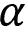
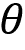

# 22

# 深度强化学习 - 构建交易代理

在本章中，我们将介绍**强化学习**（**RL**），它与我们迄今为止涵盖的监督和无监督算法的**机器学习**（**ML**）方法不同。RL 吸引了极大的关注，因为它是一些最令人兴奋的人工智能突破的主要推动力，比如 AlphaGo。AlphaGo 的创造者、Google 拥有的 DeepMind 的首席 RL 研究员 David Silver 最近荣获了 2019 年的重要 ACM 计算奖，以表彰其在计算机游戏中取得的突破性进展。我们将看到，RL 的交互式和在线特性使其特别适合于交易和投资领域。

RL 模型通过与通常具有不完全信息的随机环境交互的代理进行**目标导向学习**。RL 的目标是通过从奖励信号中学习状态和动作的价值来自动化代理如何做出决策以实现长期目标。最终目标是推导出一个策略，该策略编码了行为规则并将状态映射到动作。

RL 被认为是**最接近人类学习**的方法，它是通过在现实世界中采取行动并观察后果而产生的。它与监督学习不同，因为它根据一个标量奖励信号一次优化代理的行为体验，而不是通过从正确标记的、代表性的目标概念样本中泛化。此外，RL 不仅仅停留在做出预测。相反，它采用了端到端的目标导向决策视角，包括动作及其后果。

在本章中，您将学习如何制定 RL 问题并应用各种解决方法。我们将涵盖基于模型和无模型方法，介绍 OpenAI Gym 环境，并将深度学习与 RL 结合起来，训练一个在复杂环境中导航的代理。最后，我们将向您展示如何通过建模与金融市场互动的代理来调整 RL，以优化其利润目标。

更具体地说，在阅读本章后，您将能够：

+   定义**马尔可夫决策问题**（**MDP**）

+   使用值迭代和策略迭代来解决 MDP

+   在具有离散状态和动作的环境中应用 Q 学习

+   在连续环境中构建和训练一个深度 Q 学习代理

+   使用 OpenAI Gym 训练 RL 交易代理

您可以在 GitHub 仓库的相应目录中找到本章的代码示例和额外资源的链接。笔记本包括图像的彩色版本。

# 强化学习系统的要素

强化学习问题具有几个元素，使它们与我们迄今为止涵盖的机器学习设置有所不同。以下两个部分概述了定义和解决强化学习问题所需的关键特征，通过学习一个自动化决策的策略。我们将使用符号和通常遵循*强化学习：导论*（Sutton 和 Barto 2018）以及 David Silver 的 UCL 强化学习课程 ([`www.davidsilver.uk/teaching/`](https://www.davidsilver.uk/teaching/))，这些都是进一步研究的推荐材料，超出了本章范围的简要概述。

强化学习问题旨在解决**优化代理目标的行动**，考虑到对环境的一些观察。环境向代理提供其状态的信息，为动作分配奖励，并使代理转移到新状态，受到代理可能知道的概率分布的约束。它可能是完全或部分可观察的，还可能包含其他代理。环境的结构对代理学习给定任务的能力有着很大的影响，通常需要大量的前期设计工作来促进训练过程。

强化学习问题基于环境状态和代理动作空间的复杂性而有所不同，可以是离散的或连续的。连续的动作和状态，除非离散化，否则需要机器学习来近似状态、动作和其价值之间的函数关系。它们还需要泛化，因为代理在训练期间几乎肯定只经历了潜在无限数量的状态和动作的子集。

解决复杂的决策问题通常需要一个简化的模型，将关键方面隔离出来。*图 22.1*突显了**强化学习问题的显著特征**。这些特征通常包括：

+   代理对环境状态的观察

+   一组可供代理选择的动作

+   管理代理决策的策略


图 22.1：强化学习系统的组成部分

此外，环境会发出**奖励信号**（可能是负数），因为代理的动作导致了状态转换到一个新状态。在其核心，代理通常学习一个**价值函数**，它指导其对可用动作的判断。代理的目标函数处理奖励信号，并将价值判断转化为最优策略。

## 策略 - 将状态转换为动作

在任何时刻，**策略定义了代理的行为**。它将代理可能遇到的任何状态映射到一个或多个动作。在具有有限状态和动作数量的环境中，策略可以是一个简单的查找表，在训练期间填充。

借助连续状态和动作，策略采用机器学习可以帮助近似的函数形式。策略也可能涉及大量计算，例如 AlphaZero，它使用树搜索来决定给定游戏状态的最佳动作。策略也可能是随机的，并给定一个状态，为动作分配概率。

## 奖励——从动作中学习

奖励信号是环境在每个时间步发送给代理程序的单个值。代理的目标通常是**最大化随时间接收到的总奖励**。奖励也可以是状态和动作的随机函数。它们通常被折扣以促进收敛并反映价值的时间衰减。

奖励是代理程序了解其在给定状态下决策价值的**唯一途径**，并相应调整策略。由于奖励信号对代理程序学习的重要影响，因此奖励信号通常是设计强化学习系统中最具挑战性的部分。

奖励需要清楚地传达代理应该完成的任务（而不是如何完成），可能需要领域知识来正确编码这些信息。例如，交易代理的开发可能需要为买入、持有和卖出决策定义奖励。这些可能仅限于利润和损失，但也可能需要包括波动率和风险考虑，例如回撤。

## 价值函数——长期选择的最优解

奖励提供了对动作的即时反馈。然而，解决强化学习问题需要能够从长远角度创造价值的决策。这就是价值函数的作用所在：它总结了状态或给定状态下动作的效用，以长期奖励的形式。

换句话说，状态的价值是代理程序在未来在该状态下可以期望获得的总奖励。即时奖励可能是未来奖励的良好代理，但代理还需要考虑到低奖励后面很可能出现的更好结果（或者相反）。

因此，**值估计旨在预测未来的奖励**。奖励是关键输入，而进行值估计的目标是获得更多的奖励。然而，强化学习方法专注于学习准确的值，以便在有效利用（通常有限的）经验的同时做出良好的决策。

还有一些强化学习方法不依赖于值函数，例如基因算法或模拟退火等随机优化方法，这些方法旨在通过有效地探索策略空间来找到最佳行为。然而，目前对强化学习的兴趣主要受到直接或间接估计状态和动作价值的方法驱动。

**策略梯度方法**是一种依赖于参数化、可微分策略的新发展，可以直接使用梯度下降优化目标（Sutton 等人，2000）。请参阅 GitHub 上的资源，其中包括超出本章范围的关键论文和算法的摘要。

## 有模型还是无模型 - 三思而后行？

**基于模型的强化学习**方法学习环境的模型，以使代理能够通过预测其行动的后果来提前规划。例如，这样的模型可以用于根据当前状态和行动预测下一个状态和奖励。这是**规划的基础**，即通过考虑未来可能发生的情况来决定最佳行动方案。

相反，更简单的**无模型方法**是通过**试错**学习的。现代强化学习方法涵盖了从低级试错方法到高级、深思熟虑的规划的整个范围。正确的方法取决于环境的复杂性和可学习性。

# 如何解决强化学习问题

强化学习方法旨在通过经验学习如何采取能够实现长期目标的行动。为此，代理与环境通过一系列离散的时间步骤进行交互，通过先前部分中描述的行动、状态观测和奖励的接口进行交互。

## 解决强化学习问题的关键挑战

解决强化学习问题需要解决两个独特的挑战：信用分配问题和探索-利用权衡。

### 信用分配

在强化学习中，奖励信号可能比导致结果的行动晚得多，使得将行动与其后果联系起来变得复杂。例如，当代理人多次采取 100 个不同的持仓并进行交易时，如果它只了解到投资组合收益，它如何意识到某些持仓表现比其他持仓好得多呢？

**信用分配问题**是在考虑到这些延迟的情况下准确估计给定状态下行动的利益和成本的挑战。强化学习算法需要找到一种方法，将积极和消极结果的信用分配给可能参与产生这些结果的许多决策。

### 探索与利用

强化学习的动态和交互性意味着代理需要在经历所有相关轨迹之前估计状态和行动的价值。虽然它可以在任何阶段选择一个动作，但这些决定是基于不完全的学习，但会为代理生成其行为的最佳选择的第一手见解。

对行动价值的部分可见性会导致只利用过去（成功的）经验而不是探索未知领域的决策的风险。这些选择限制了代理的暴露，并阻止它学习最优策略。

RL 算法需要平衡这种探索-利用的权衡——太少的探索可能会产生偏见的值估计和次优策略，而太少的利用则会阻止学习的发生。

## 解决强化学习问题的基本方法

解决 RL 问题有许多方法，所有这些方法都涉及找到代理的最优行为规则：

+   DP 方法做出了完全了解环境的常常不切实际的假设，但它们是大多数其他方法的概念基础。

+   蒙特卡洛（MC）方法通过对整个状态-动作-奖励序列进行采样来学习环境以及不同决策的成本和收益。

+   TD 学习通过从更短的序列中学习显著提高了样本效率。为此，它依赖于引导，即根据其自身的先前估计来优化其估计。

当一个 RL 问题包括明确定义的转移概率以及有限数量的状态和动作时，它可以被构建为一个有限 MDP，对于这个 MDP，DP 可以计算出一个精确的解。当前 RL 理论的大部分关注点都集中在有限 MDP 上，但实际应用需要更一般的设置。未知的转移概率需要高效的采样来学习它们的分布。

对于连续状态和/或动作空间的方法通常利用机器学习来近似值函数或策略函数。它们集成了监督学习，特别是前四章讨论的深度学习方法。然而，在 RL 环境中，这些方法面临着明显的挑战：

+   奖励信号不直接反映目标概念，就像标记的训练样本一样。

+   观察的分布取决于代理的动作和策略，策略本身是学习过程的主题。

以下各节将介绍和演示各种解决方法。我们将从值迭代和策略迭代的 DP 方法开始，这些方法仅限于已知转移概率的有限 MDP。正如我们将在接下来的部分看到的那样，它们是 Q-learning 的基础，Q-learning 基于 TD 学习，并且不需要关于转移概率的信息。它的目标与 DP 类似，但计算量较少，而且不需要假设环境的完美模型。最后，我们将扩展范围到连续状态，并介绍深度 Q-learning。

# 解决动态规划问题

有限 MDP 是一个简单但基本的框架。我们将介绍代理人试图优化的奖励轨迹，定义用于制定优化问题的策略和值函数，以及构成解决方法基础的贝尔曼方程。

## 有限马尔可夫决策问题

MDPs 将代理-环境交互框架化为在构成情节的一系列时间步 *t* =1，…，*T* 上的顺序决策问题。时间步骤被假定为离散的，但该框架可以扩展到连续时间。

MDP 提供的抽象使其应用在许多背景下都能轻松适应。时间步骤可以在任意间隔，动作和状态可以采用可以数值化表示的任何形式。

马尔可夫性质意味着当前状态完全描述了过程，即过程没有记忆。当尝试预测过程的未来时，来自过去状态的信息不添加价值。由于这些属性，该框架已用于建模资产价格，这些资产受到在*第五章*中讨论的有效市场假设的影响，即*投资组合优化与绩效评估*。

### 状态、动作和奖励序列

MDPs 的运行方式如下：在每一步 *t*，代理观察环境的状态  并选择一个动作 ，其中 *S* 和 *A* 分别是状态和动作的集合。在下一个时间步 *t+1*，代理接收到一个奖励  并转移到状态 *S*[t][+1]。随着时间的推移，MDP 产生了一条轨迹 *S*[0]，*A*[0]，*R*[1]，*S*[1]，*A*[1]，*R*[1]，……，直到代理达到终止状态并结束该情节。

有限的 MDP 具有有限数量的动作 *A*，状态 *S* 和奖励 *R*，包括对这些元素的明确定义的离散概率分布。由于马尔可夫性质，这些分布仅依赖于先前的状态和动作。

轨迹的概率性意味着代理最大化未来奖励的期望总和。此外，奖励通常使用因子  进行折现，以反映其时间价值。对于不是周期性的任务，而是无限期进行的任务，需要使用严格小于 1 的折现因子，以避免无限奖励并确保收敛。因此，代理最大化折现的未来回报总和 *R*[t]，表示为 *G*[t]：


这种关系也可以递归地定义，因为从第二步开始的求和与*G*[t][+1]折现一次是相同的：


我们将在后面看到，这种递归关系经常用于制定强化学习算法。

### 值函数——如何估计长期回报

如前所述，一个策略  将所有状态映射到动作的概率分布，以便在状态 *S*[t] 中选择动作 *A*[t] 的概率可以表示为 。值函数估计每个状态或状态-动作对的长期回报。找到将状态映射到动作的最佳策略是至关重要的。

对于策略，状态值函数给出了特定状态*s*的长期价值*v*，作为代理从*s*开始然后始终遵循策略的预期回报*G*。它的定义如下，其中是指当代理遵循策略时的预期值：


同样，我们可以计算**状态动作值函数** *q*(*s*,*a*)，作为在状态*s*开始，采取行动，然后始终遵循策略的预期回报：


### 贝尔曼方程

贝尔曼方程定义了所有状态*s*在*S*中的值函数与任何其后继状态*s′*之间的递归关系，其遵循策略。它们通过将值函数分解为即时奖励和下一状态的折现值来实现这一点：


这个方程表示，对于给定策略，一个状态的值必须等于其在该策略下的后继状态的预期值，加上到达该后继状态时所获得的预期奖励。

这意味着，如果我们知道当前可用操作的后继状态的值，我们可以向前看一步，计算当前状态的预期值。由于它对所有状态*S*都成立，该表达式定义了一组方程。对于，也存在类似的关系。

*图 22.2*总结了这种递归关系：在当前状态下，代理根据策略选择一个动作*a*。环境通过分配一个取决于结果新状态*s′*的奖励来做出响应：


图 22.2：贝尔曼方程表达的递归关系

### 从值函数到最优策略

强化学习问题的解是一个优化累积奖励的策略。策略和值函数紧密相关：一个最优策略为每个状态或状态-动作对提供的值估计至少与任何其他策略的值相同，因为该值是给定策略下的累积奖励。因此，最优值函数和隐式定义了最优策略并解决了 MDP。

最优值函数  和  也满足前一节中的贝尔曼方程。这些贝尔曼最优方程可以省略对策略的显式引用，因为它被  和  隐含。对于 ，递归关系将当前值等同于选择当前状态中最佳动作的即时奖励之和，以及后继状态的期望折现值：


对于最佳状态-动作值函数 ，贝尔曼最优方程将当前状态-动作值分解为隐含当前动作的奖励与所有后继状态中最佳动作的期望值的折现期望值之和：


最优性条件暗示了最佳策略是始终选择最大化贪婪方式中的期望值的动作，即仅考虑单个时间步骤的结果。

由前两个表达式定义的最优性条件由于 max 操作符是非线性的，缺乏封闭形式的解。相反，MDP 解决方案依赖于迭代解法 - 如策略和值迭代或 Q-learning，我们将在下一节中介绍。

## 策略迭代

DP 是一种解决可以分解为具有递归结构并允许重复使用中间结果的较小、重叠子问题的一般方法。由于递归贝尔曼最优方程和值函数的累积特性，MDP 符合这一要求。更具体地说，**最优性原理**适用于最优策略，因为最优策略包括选择最优动作然后遵循最优策略。

DP 需要了解 MDP 的转移概率。通常情况下并非如此，但许多更一般情况下的方法都采用类似于 DP 的方法，并从数据中学习缺失的信息。

DP 对于估计值函数的**预测任务**和专注于最佳决策并输出策略的控制任务非常有用（在此过程中也估计值函数）。

找到最优策略的策略迭代算法重复以下两个步骤，直到策略收敛，即不再发生变化超过给定阈值：

1.  **策略评估**：根据当前策略更新值函数。

1.  **策略改进**：更新策略，使动作最大化期望的一步值。

策略评估依赖于贝尔曼方程来估计值函数。更具体地说，它选择由当前策略确定的动作，并将导致的奖励以及下一个状态的折现值相加，以更新当前状态的值。

策略改进又改变了策略，使得对于每个状态，策略产生下一状态中产生最高价值的动作。此改进称为贪婪，因为它仅考虑了单个时间步的回报。策略迭代总是收敛到最优策略，并且通常在相对较少的迭代中实现。

## 值迭代

策略迭代需要在每次迭代后评估所有状态的策略。对于基于搜索树的策略，例如，评估可能是昂贵的，正如前面讨论的那样。

**值迭代**通过简化此过程来实现，将策略评估和改进步骤折叠在一起。在每个时间步长，它遍历所有状态并基于下一个状态的当前值估计选择最佳的贪婪动作。然后，它使用贝尔曼最优方程所暗示的一步展望来更新当前状态的值函数。

价值函数的相应更新规则  几乎与策略评估更新相同；它只是在可用动作上增加了最大化：


当价值函数收敛并输出从其值函数估计得出的贪婪策略时，算法停止。它也保证收敛到最优策略。

## 泛化策略迭代

在实践中，有几种方法可以截断策略迭代；例如，在改进之前评估策略*k*次。这意味着*max*操作符将仅在每第*k*次迭代时应用。

大多数强化学习算法估计值和策略函数，并依赖于策略评估和改进的交互来收敛到解决方案，如*图 22.3*所示。通常方法是相对于值函数改进策略，同时调整值函数使其匹配策略：


图 22.3：策略评估和改进的收敛

收敛要求值函数与策略一致，而策略又需要在相对于值函数的贪婪行为中稳定。因此，只有当找到一个相对于其自身评估函数是贪婪的策略时，这两个过程才会稳定。这意味着贝尔曼最优方程成立，因此策略和值函数是最优的。

## Python 中的动态规划

在本节中，我们将把值迭代和策略迭代应用到一个玩具环境中，该环境由一个网格组成，如*图 22.4*所示，具有以下特征：

+   **状态**：11 个状态表示为二维坐标。一个字段不可访问，最右列的顶部两个状态是终止状态，即它们结束了该回合。

+   **动作**：向上、向下、向左或向右移动一步。环境是随机的，因此动作可能会产生意外的结果。对于每个动作，有 80%的概率移动到预期状态，并且有 10%的概率移动到相邻方向（例如，向右或向左而不是向上，或者向上/向下而不是向右）。

+   **奖励**：如左图所示，除了终止状态的+1/-1 奖励外，每个状态都会产生-.02 的奖励。


图 22.4：3×4 网格世界奖励，值函数和最优策略

### 设置网格世界

我们将开始定义环境参数：

```py
grid_size = (3, 4)
blocked_cell = (1, 1)
baseline_reward = -0.02
absorbing_cells = {(0, 3): 1, (1, 3): -1}
actions = ['L', 'U', 'R', 'D']
num_actions = len(actions)
probs = [.1, .8, .1, 0] 
```

我们经常需要在 1D 和 2D 表示之间进行转换，因此我们将为此定义两个辅助函数；状态是一维的，而单元格是相应的 2D 坐标：

```py
to_1d = lambda x: np.ravel_multi_index(x, grid_size)
to_2d = lambda x: np.unravel_index(x, grid_size) 
```

此外，我们将预先计算一些数据点以使代码更简洁：

```py
num_states = np.product(grid_size)
cells = list(np.ndindex(grid_size))
states = list(range(len(cells)))
cell_state = dict(zip(cells, states))
state_cell= dict(zip(states, cells))
absorbing_states = {to_1d(s):r for s, r in absorbing_cells.items()}
blocked_state = to_1d(blocked_cell) 
```

我们存储每个状态的奖励：

```py
state_rewards = np.full(num_states, baseline_reward)
state_rewards[blocked_state] = 0
for state, reward in absorbing_states.items():
    state_rewards[state] = reward
state_rewards
array([-0.02, -0.02, -0.02,  1\.  , -0.02,  0\.  , -0.02, -1\.  , -0.02,
       -0.02, -0.02, -0.02]) 
```

为了考虑到概率环境，我们还需要计算给定动作的实际移动的概率分布：

```py
action_outcomes = {}
for i, action in enumerate(actions):
    probs_ = dict(zip([actions[j % 4] for j in range(i, 
                                               num_actions + i)], probs))
    action_outcomes[actions[(i + 1) % 4]] = probs_
Action_outcomes
{'U': {'L': 0.1, 'U': 0.8, 'R': 0.1, 'D': 0},
 'R': {'U': 0.1, 'R': 0.8, 'D': 0.1, 'L': 0},
 'D': {'R': 0.1, 'D': 0.8, 'L': 0.1, 'U': 0},
 'L': {'D': 0.1, 'L': 0.8, 'U': 0.1, 'R': 0}} 
```

现在，我们准备计算转移矩阵，这是 MDP 的关键输入。

### 计算转移矩阵

**转移矩阵** 定义了对于每个先前状态和动作 *A*，以及每个状态 *S* 的结束概率！[](img/B15439_22_035.png)。我们将演示`pymdptoolbox`并使用其中一种可用于指定转移和奖励的格式。对于转移概率，我们将创建一个具有维度的 NumPy 数组。

我们首先计算每个起始单元格和移动的目标单元格：

```py
def get_new_cell(state, move):
    cell = to_2d(state)
    if actions[move] == 'U':
        return cell[0] - 1, cell[1]
    elif actions[move] == 'D':
        return cell[0] + 1, cell[1]
    elif actions[move] == 'R':
        return cell[0], cell[1] + 1
    elif actions[move] == 'L':
        return cell[0], cell[1] - 1 
```

以下函数使用开始`state`、`action`和`outcome`参数来填充转移概率和奖励：

```py
def update_transitions_and_rewards(state, action, outcome):
    if state in absorbing_states.keys() or state == blocked_state:
        transitions[action, state, state] = 1
    else:
        new_cell = get_new_cell(state, outcome)
        p = action_outcomes[actions[action]][actions[outcome]]
        if new_cell not in cells or new_cell == blocked_cell:
            transitions[action, state, state] += p
            rewards[action, state, state] = baseline_reward
        else:
            new_state= to_1d(new_cell)
            transitions[action, state, new_state] = p
            rewards[action, state, new_state] = state_rewards[new_state] 
```

我们通过创建占位数据结构并迭代的笛卡尔积来生成转移和奖励值，如下所示：

```py
rewards = np.zeros(shape=(num_actions, num_states, num_states))
transitions = np.zeros((num_actions, num_states, num_states))
actions_ = list(range(num_actions))
for action, outcome, state in product(actions_, actions_, states):
    update_transitions_and_rewards(state, action, outcome)
rewards.shape, transitions.shape
((4,12,12), (4,12,12)) 
```

### 实现值迭代算法

我们首先创建值迭代算法，稍微简单一些，因为它在单个步骤中实现策略评估和改进。我们捕获需要更新值函数的状态，排除了值为 0 的终止状态（由于缺乏奖励，+1/-1 分配给起始状态），并跳过阻塞的单元格：

```py
skip_states = list(absorbing_states.keys())+[blocked_state]
states_to_update = [s for s in states if s not in skip_states] 
```

然后，我们初始化值函数，并设置折扣因子 gamma 和收敛阈值`epsilon`：

```py
V = np.random.rand(num_states)
V[skip_states] = 0
gamma = .99
epsilon = 1e-5 
```

算法使用贝尔曼最优方程更新值函数，如前所述，并在*V*的 L1 范数绝对值小于 epsilon 时终止：

```py
while True:
    V_ = np.copy(V)
    for state in states_to_update:
        q_sa = np.sum(transitions[:, state] * (rewards[:, state] + gamma* V), 
                      axis=1)
        V[state] = np.max(q_sa)
    if np.sum(np.fabs(V - V_)) < epsilon:
        break 
```

该算法在 16 次迭代和 0.0117 秒内收敛。它产生以下最优值估计，连同隐含的最优策略，如本节之前的*图 22.4*右图所示：

```py
pd.DataFrame(V.reshape(grid_size))
         0         1         2         3
0.884143  0.925054  0.961986  0.000000
1  0.848181  0.000000  0.714643  0.000000
2  0.808344  0.773327  0.736099  0.516082 
```

### 定义并运行策略迭代

政策迭代包括单独的评估和改进步骤。我们通过选择最大化预期奖励和下一个状态值的和的动作来定义改进部分。请注意，我们临时填充终端状态的奖励以避免忽略会导致我们到达那里的动作：

```py
def policy_improvement(value, transitions):
    for state, reward in absorbing_states.items():
        value[state] = reward
    return np.argmax(np.sum(transitions * value, 2),0) 
```

我们像以前一样初始化值函数，并且还包括一个随机起始策略：

```py
pi = np.random.choice(list(range(num_actions)), size=num_states) 
```

该算法在贪婪选择的动作的政策评估和政策改进之间交替，直到策略稳定为止：

```py
iterations = 0
converged = False
while not converged:
    pi_ = np.copy(pi)
    for state in states_to_update:
        action = policy[state]
        V[state] = np.dot(transitions[action, state], 
                                      rewards[action, state] + gamma* V)
        pi = policy_improvement(V.copy(), transitions)
    if np.array_equal(pi_, pi):
        converged = True
    iterations += 1 
```

政策迭代在仅三次迭代后收敛。在算法找到最优值函数之前，策略会稳定下来，而最优策略略有不同，最明显的是建议在负终端状态旁边的场地上“向上”而不是更安全的“向左”。通过缩紧收敛标准（例如，要求几轮稳定的策略或为值函数添加阈值），可以避免这种情况。

### 使用 pymdptoolbox 解决 MDP 问题

我们也可以使用 Python 库`pymdptoolbox`来解决 MDP 问题，其中包括一些其他算法，包括 Q-learning。

要运行值迭代，只需在调用`.run()`方法之前，使用所需的配置选项、奖励和转移矩阵实例化相应的对象：

```py
vi = mdp.ValueIteration(transitions=transitions,
                        reward=rewards,
                        discount=gamma,
                        epsilon=epsilon)
vi.run() 
```

值函数估计与上一节的结果相匹配：

```py
np.allclose(V.reshape(grid_size), np.asarray(vi.V).reshape(grid_size)) 
```

政策迭代工作方式类似：

```py
pi = mdp.PolicyIteration(transitions=transitions,
                        reward=rewards,
                        discount=gamma,
                        max_iter=1000)
pi.run() 
```

它也产生相同的策略，但是值函数会根据运行而变化，并且在策略收敛之前不需要达到最优值。

### 吸取的教训

我们之前在*图 22.4*中看到的右侧面板显示了值迭代产生的最优值估计以及相应的贪婪策略。负奖励与环境的不确定性相结合，产生了一个最优策略，涉及远离负终端状态。

结果对奖励和折扣因子都很敏感。负状态的成本影响周围字段的策略，您应修改相应笔记本中的示例以识别改变最优动作选择的阈值水平。

# Q-learning - 边走边学习寻找最优策略

Q-learning 是早期的强化学习突破，由克里斯·沃特金斯（Chris Watkins）为他的博士论文开发（[`www.cs.rhul.ac.uk/~chrisw/new_thesis.pdf`](http://www.cs.rhul.ac.uk/~chrisw/new_thesis.pdf)）（1989）。它引入了增量动态规划来学习控制 MDP，而不知道或建模我们在前一节中用于值和策略迭代的转移和奖励矩阵。 3 年后进行了收敛证明（Christopher J.C.H. Watkins 和 Dayan 1992）。

Q 学习直接优化动作值函数*q*以逼近*q**。学习进行“离策略”，即，算法不需要仅根据值函数隐含的策略选择动作。然而，收敛需要所有状态-动作对在整个训练过程中持续更新。确保这一点的一种简单方法是通过**-贪婪策略**。

## 探索与利用 – **-贪婪策略**

一个**-贪婪策略**是一种简单的策略，它确保在给定状态下探索新的动作，同时也利用了学习经验。它通过随机选择动作来实现这一点。一个**-贪婪策略**以概率随机选择一个动作，否则选择值函数最优的动作。

## Q 学习算法

该算法在随机初始化后的给定数量的剧集中不断改进状态-动作值函数。在每个时间步长，它根据一个**-贪婪策略**选择一个动作，并使用学习率来更新值函数，如下所示：


请注意，该算法不会根据转移概率计算期望值。相反，它从**-贪婪策略**产生的奖励*R*[t]和下一个状态的折现值函数的当前估计中学习*Q*函数。

使用估计值函数来改进这个估计本身被称为**自举**。Q 学习算法是**时间差**（**TD**）**学习**算法的一部分。TD 学习不会等待收到剧集的最终奖励。相反，它使用更接近最终奖励的中间状态的值来更新其估计。在这种情况下，中间状态是一步。

## 如何使用 Python 训练一个 Q 学习智能体

在本节中，我们将演示如何使用上一节中的状态网格构建一个 Q 学习智能体。我们将训练智能体进行 2,500 个剧集，使用学习速率和进行**-贪婪策略**（有关详细信息，请参见笔记本`gridworld_q_learning.ipynb`）：

```py
max_episodes = 2500
alpha = .1
epsilon = .05 
```

然后，我们将随机初始化状态-动作值函数作为 NumPy 数组，维度为*状态数×动作数*：

```py
Q = np.random.rand(num_states, num_actions)
Q[skip_states] = 0 
```

该算法生成 2,500 个从随机位置开始并根据**-贪婪策略**进行的剧集，直到终止，根据 Q 学习规则更新值函数：

```py
for episode in range(max_episodes):
    state = np.random.choice([s for s in states if s not in skip_states])
    while not state in absorbing_states.keys():
        if np.random.rand() < epsilon:
            action = np.random.choice(num_actions)
        else:
            action = np.argmax(Q[state])
        next_state = np.random.choice(states, p=transitions[action, state])
        reward = rewards[action, state, next_state]
        Q[state, action] += alpha * (reward + 
                            gamma * np.max(Q[next_state])-Q[state, action])
        state = next_state 
```

每个情节需要 0.6 秒，并收敛到与前一节中值迭代示例结果相当接近的值函数。`pymdptoolbox`实现与以前的示例类似（详情请参见笔记本）。

# 使用 OpenAI Gym 进行交易的深度 RL

在前一节中，我们看到了 Q 学习如何让我们在具有离散状态和离散动作的环境中使用基于贝尔曼方程的迭代更新来学习最优状态-动作值函数*q**。

在本节中，我们将强化学习（RL）迈向真实世界，将算法升级为**连续状态**（同时保持动作离散）。这意味着我们不能再使用简单地填充数组状态-动作值的表格解决方案。相反，我们将看到如何使用神经网络来**近似 q**，从而得到深度 Q 网络。在介绍深度 Q 学习算法之前，我们将首先讨论深度学习与 RL 的整合，以及各种加速其收敛并使其更加健壮的改进。

连续状态还意味着**更复杂的环境**。我们将演示如何使用 OpenAI Gym，一个用于设计和比较 RL 算法的工具包。首先，我们将通过训练一个深度 Q 学习代理程序来演示工作流程，以在月球着陆器环境中导航一个玩具飞船。然后，我们将继续**自定义 OpenAI Gym**，设计一个模拟交易情境的环境，其中代理可以买卖股票，并与市场竞争。

## 使用神经网络进行值函数近似

连续状态和/或动作空间意味着**无限数量的转换**，使得不可能像前一节那样制表状态-动作值。相反，我们通过学习连续参数化映射来近似 Q 函数。

受到在其他领域中 NN 成功的启发，我们在*Part 4*中讨论过，深度 NN 也因近似值函数而变得流行起来。然而，在 RL 环境中，数据由模型与使用（可能是随机的）策略与环境进行交互生成，面临着**不同的挑战**：

+   对于连续状态，代理将无法访问大多数状态，因此需要进行泛化。

+   在监督学习中，旨在从独立同分布且具有代表性且正确标记的样本中概括出来，而在强化学习（RL）环境中，每个时间步只有一个样本，因此学习需要在线进行。

+   此外，当连续状态时，样本可能高度相关，当连续状态相似且行为分布在状态和动作上不是固定的，而是由于代理的学习而发生变化时，样本可能高度相关。

我们将介绍几种已开发的技术来解决这些额外的挑战。

## 深度 Q 学习算法及其扩展

深度 Q 学习通过深度神经网络估计给定状态的可用动作的价值。DeepMind 在 *使用深度强化学习玩 Atari 游戏*（Mnih 等人，2013）中介绍了这项技术，代理程序仅从像素输入中学习玩游戏。

深度 Q 学习算法通过学习一组权重  的多层**深度 Q 网络**（**DQN**）来近似动作价值函数 *q*，该函数将状态映射到动作，使得 。

该算法应用基于损失函数的梯度下降，计算目标 DQN 的估计之间的平方差：


并根据当前状态-动作对的动作价值估计  来学习网络参数：


**目标和当前估计都依赖于 DQN 权重**，突显了与监督学习的区别，在监督学习中，目标在训练之前是固定的。

该 Q 学习算法不计算完整梯度，而是使用**随机梯度下降**（**SGD**）并在每个时间步 *i* 后更新权重 。为了探索状态-动作空间，代理程序使用一个 -贪婪策略，以概率选择一个随机动作，否则按照最高预测 *q* 值选择动作。

基本的**DQN 架构已经得到改进**，以使学习过程更加高效，并改善最终结果；Hessel 等人（2017）将这些创新组合成**Rainbow 代理**，并展示了每个创新如何显著提高 Atari 基准测试的性能。以下各小节总结了其中一些创新。

### （优先）经验回放 – 关注过去的错误

经验回放存储代理程序经历的状态、动作、奖励和下一个状态转换的历史记录。它从这些经验中随机抽样小批量，在每个时间步更新网络权重，然后代理程序选择一个*ε*-贪婪动作。

经验回放提高了样本效率，减少了在线学习期间收集的样本的自相关性，并限制了由当前权重产生的反馈，这些反馈可能导致局部最小值或发散（Lin 和 Mitchell 1992）。

此技术后来被进一步改进，以优先考虑从学习角度更重要的经验。Schaul 等人（2015）通过 TD 误差的大小来近似转换的价值，该误差捕捉了该事件对代理程序的“惊讶程度”。实际上，它使用其关联的 TD 误差而不是均匀概率对历史状态转换进行抽样。

### 目标网络 – 解耦学习过程

为了进一步削弱当前网络参数对 NN 权重更新的反馈循环，DeepMind 在 *Human-level control through deep reinforcement learning*（Mnih et al. 2015）中将算法扩展为使用缓慢变化的目标网络。

目标网络具有与 Q 网络相同的架构，但其权重为 ，仅在每隔  步更新一次，当它们从 Q 网络复制并保持不变时。目标网络**生成 TD 目标预测**，即它取代 Q 网络来估计：


### 双深度 Q 学习 – 分离行动和预测

Q-learning 存在过高估计行动价值的问题，因为它有意地采样最大估计行动价值。

如果这种偏见不是均匀应用并且改变行动偏好，它可能会对学习过程和结果的政策产生负面影响，就像 *Deep Reinforcement Learning with Double Q-learning*（van Hasselt, Guez, and Silver 2015）中所示的那样。

为了将行动价值的估计与行动的选择分离，**双深度 Q 学习**（**DDQN**）算法使用一个网络的权重  来选择给定下一个状态的最佳行动，以及另一个网络的权重  来提供相应的行动价值估计：

。

一个选项是在每次迭代时随机选择两个相同网络中的一个进行训练，以使它们的权重不同。更有效的替代方法是依靠目标网络提供 。

## 介绍 OpenAI Gym

OpenAI Gym 是一个提供标准化环境以测试和基准 RL 算法的 RL 平台，使用 Python。也可以扩展该平台并注册自定义环境。

**Lunar Lander v2**（**LL**）环境要求代理根据离散行动空间和包括位置、方向和速度在内的低维状态观察来控制其在二维中的运动。在每个时间步长，环境提供新状态的观察和正面或负面的奖励。每个事件最多包含 1,000 个时间步。*图 22.5* 展示了我们稍后将训练的代理在经过 250 个事件后成功着陆时的选定帧：


图 22.5：月球着陆器（Lunar Lander）事件期间 RL 代理的行为

更具体地说，**代理观察到状态的八个方面**，包括六个连续和两个离散元素。根据观察到的元素，代理知道自己的位置、方向和移动速度，以及是否（部分）着陆。然而，它不知道应该朝哪个方向移动，也不能观察环境的内部状态以了解规则来控制其运动。

在每个时间步长，智能体使用**四种离散动作**来控制其运动。它可以什么都不做（继续当前路径），启动主引擎（减少向下运动），或使用相应的方向引擎向左或向右转向。没有燃料限制。

目标是在坐标（0,0）的着陆垫上的两个旗帜之间着陆智能体，但也可以在垫子外着陆。智能体朝着垫子移动，积累的奖励在 100-140 之间，具体取决于着陆点。然而，远离目标的移动会抵消智能体通过朝着垫子移动而获得的奖励。每条腿的接地都会增加 10 分，而使用主引擎会消耗-0.3 点。

如果智能体着陆或坠毁，则一集结束，分别添加或减去 100 分，或在 1000 个时间步之后结束。解决 LL 需要在 100 个连续集合上平均获得至少 200 的累积奖励。

## 如何使用 TensorFlow 2 实现 DDQN

笔记本`03_lunar_lander_deep_q_learning`使用 TensorFlow 2 实现了一个 DDQN 代理程序，该程序学习解决 OpenAI Gym 的**月球着陆器**2.0（**LL**）环境。笔记本`03_lunar_lander_deep_q_learning`包含了在第一版中讨论的 TensorFlow 1 实现，运行速度显著更快，因为它不依赖于急切执行，并且更快地收敛。本节重点介绍了实现的关键元素；更详细的细节请参阅笔记本。

### 创建 DDQN 代理

我们将`DDQNAgent`创建为一个 Python 类，以将学习和执行逻辑与关键配置参数和性能跟踪集成在一起。

代理的`__init__()`方法接受以下信息作为参数：

+   **环境特征**，比如状态观测的维度数量以及智能体可用的动作数量。

+   **ε-贪婪策略**的随机探索衰减。

+   **神经网络架构**和**训练**和目标网络更新的参数。

    ```py
    class DDQNAgent:
        def __init__(self, state_dim, num_actions, gamma,
                     epsilon_start, epsilon_end, epsilon_decay_steps,
                     epsilon_exp_decay,replay_capacity, learning_rate,
                     architecture, l2_reg, tau, batch_size,
                     log_dir='results'): 
    ```

### 将 DDQN 架构调整为月球着陆器

首次将 DDQN 架构应用于具有高维图像观察的雅达利领域，并依赖于卷积层。LL 的较低维状态表示使得全连接层成为更好的选择（见*第十七章*，*交易深度学习*）。

更具体地说，网络将八个输入映射到四个输出，表示每个动作的 Q 值，因此只需进行一次前向传递即可计算动作值。DQN 使用 Adam 优化器对先前的损失函数进行训练。代理的 DQN 使用每个具有 256 单元的三个密集连接层和 L2 活动正则化。通过 TensorFlow Docker 镜像使用 GPU 可以显著加快 NN 训练性能（见*第十七章*和*第十八章*，*金融时间序列和卫星图像的 CNN*）。

`DDQNAgent`类的`build_model()`方法根据`architecture`参数创建主要的在线和缓慢移动的目标网络，该参数指定了层的数量和它们的单元数量。

对于主要的在线网络，我们将`trainable`设置为`True`，对于目标网络，我们将其设置为`False`。这是因为我们只是周期性地将在线 NN 的权重复制以更新目标网络：

```py
 def build_model(self, trainable=True):
        layers = []
        for i, units in enumerate(self.architecture, 1):
            layers.append(Dense(units=units,
                                input_dim=self.state_dim if i == 1 else None,
                                activation='relu',
                                kernel_regularizer=l2(self.l2_reg),
                                trainable=trainable))
        layers.append(Dense(units=self.num_actions, 
                            trainable=trainable))
        model = Sequential(layers)
        model.compile(loss='mean_squared_error',
                      optimizer=Adam(lr=self.learning_rate))
        return model 
```

### 记忆转换和重播体验

为了启用经验重播，代理记忆每个状态转换，以便在训练期间随机抽样小批量。`memorize_transition()`方法接收环境提供的当前和下一个状态的观察、代理的动作、奖励以及指示情节是否完成的标志。

它跟踪奖励历史和每个情节的长度，在每个周期结束时对 epsilon 进行指数衰减，并将状态转换信息存储在缓冲区中：

```py
 def memorize_transition(self, s, a, r, s_prime, not_done):
        if not_done:
            self.episode_reward += r
            self.episode_length += 1
        else:
            self.episodes += 1
            self.rewards_history.append(self.episode_reward)
            self.steps_per_episode.append(self.episode_length)
            self.episode_reward, self.episode_length = 0, 0
        self.experience.append((s, a, r, s_prime, not_done)) 
```

一旦有足够的样本创建完整的批次，记忆的重播就开始了。`experience_replay()`方法使用在线网络预测下一个状态的 Q 值，并选择最佳动作。然后，它从目标网络中选择这些动作的预测*q*值，以得到 TD`targets`。

接下来，它使用单个批次的当前状态观察作为输入，TD 目标作为输出，并将均方误差作为损失函数训练主要网络。最后，它每隔步更新一次目标网络的权重：

```py
 def experience_replay(self):
        if self.batch_size > len(self.experience):
            return
        # sample minibatch from experience
        minibatch = map(np.array, zip(*sample(self.experience, 
                                              self.batch_size)))
        states, actions, rewards, next_states, not_done = minibatch
        # predict next Q values to select best action
        next_q_values = self.online_network.predict_on_batch(next_states)
        best_actions = tf.argmax(next_q_values, axis=1)
        # predict the TD target
        next_q_values_target = self.target_network.predict_on_batch(
            next_states)
        target_q_values = tf.gather_nd(next_q_values_target,
                                       tf.stack((self.idx, tf.cast(
                                          best_actions, tf.int32)), axis=1))
        targets = rewards + not_done * self.gamma * target_q_values
        # predict q values
        q_values = self.online_network.predict_on_batch(states)
        q_values[[self.idx, actions]] = targets
        # train model
        loss = self.online_network.train_on_batch(x=states, y=q_values)
        self.losses.append(loss)
        if self.total_steps % self.tau == 0:
            self.update_target()
    def update_target(self):
        self.target_network.set_weights(self.online_network.get_weights()) 
```

笔记本包含ε-贪心策略和目标网络权重更新的其他实现细节。

### 设置 OpenAI 环境

我们将首先实例化并从 LL 环境中提取关键参数：

```py
env = gym.make('LunarLander-v2')
state_dim = env.observation_space.shape[0]  # number of dimensions in state
num_actions = env.action_space.n  # number of actions
max_episode_steps = env.spec.max_episode_steps  # max number of steps per episode
env.seed(42) 
```

我们还将使用内置的包装器，允许周期性地存储显示代理性能的视频：

```py
from gym import wrappers
env = wrappers.Monitor(env,
                       directory=monitor_path.as_posix(),
                       video_callable=lambda count: count % video_freq == 0,
                      force=True) 
```

在没有显示器的服务器或 Docker 容器上运行时，您可以使用`pyvirtualdisplay`。

### 关键的超参数选择

代理的性能对几个超参数非常敏感。我们将从折扣率和学习率开始：

```py
gamma=.99,  # discount factor
learning_rate=1e-4  # learning rate 
```

我们将每隔 100 个时间步更新目标网络，在回放内存中存储最多 100 万个过去的情节，并从内存中对训练代理进行 1,024 个小批量的抽样：

```py
tau=100  # target network update frequency
replay_capacity=int(1e6)
batch_size = 1024 
```

ε-贪心策略从纯探索开始，线性衰减至，然后在 250 个情节后以指数衰减：

```py
epsilon_start=1.0
epsilon_end=0.01
epsilon_linear_steps=250
epsilon_exp_decay=0.99 
```

笔记本包含训练循环，包括经验重播、SGD 和缓慢的目标网络更新。

### 月球着陆器的学习表现

前述的超参数设置使得代理能够在约 300 个情节内使用 TensorFlow 1 实现解决环境。

*图 22.6*的左侧面板显示了剧集奖励及其 100 个周期移动平均值。右侧面板显示了探索的衰减和每个剧集的步数。通常有一段约 100 个剧集的拉伸，每个剧集通常需要 1,000 个时间步长，而代理减少探索并在开始相当一致地着陆之前“学会如何飞行”：


图 22.6：DDQN 代理在月球着陆环境中的表现

## 创建一个简单的交易代理

在本节和以下节中，我们将调整深度 RL 方法来设计一个学习如何交易单个资产的代理。为了训练代理，我们将建立一个简单的环境，其中包含一组有限的操作，具有连续观测的相对较低维度状态和其他参数。

更具体地说，**环境**使用随机开始日期对单个标的的股票价格时间序列进行抽样，以模拟一个交易期，默认情况下包含 252 天或 1 年。每个**状态观察**为代理人提供了不同滞后期的历史回报以及一些技术指标，如**相对强度指数**（**RSI**）。

代理可以选择三种**操作**：

+   **买入**：将所有资本投资于股票的多头头寸。

+   **平仓**：仅持有现金。

+   **卖空**：做出等于资本金额的空头头寸。

环境考虑**交易成本**，默认设置为 10 个基点，并在没有交易的情况下每周期扣除一个基点。代理的**奖励**包括每日回报减去交易成本。

环境跟踪代理人投资组合（由单只股票组成）的**净资产价值**（**NAV**），并将其与市场投资组合进行比较，后者无摩擦地交易以提高代理人的门槛。

一个剧集从起始 NAV 为 1 单位现金开始：

+   如果 NAV 降至 0，剧集以损失结束。

+   如果 NAV 达到 2.0，代理人就赢了。

此设置限制了复杂性，因为它专注于单只股票，并从头寸大小抽象出来，以避免需要连续操作或更多离散操作，以及更复杂的簿记。但是，它对于演示如何定制环境并允许扩展是有用的。

## 如何设计自定义 OpenAI 交易环境

要构建一个学习如何交易的代理，我们需要创建一个市场环境，提供价格和其他信息，提供相关的行动，并跟踪投资组合以相应地奖励代理人。有关构建大规模、现实世界模拟环境的努力的描述，请参见 Byrd、Hybinette 和 Balch（2019）。

OpenAI Gym 允许设计、注册和使用符合其体系结构的环境，如文档中所述。文件`trading_env.py`包含以下代码示例，除非另有说明。

交易环境由三个类组成，这些类相互作用以促进代理的活动。 `DataSource` 类加载时间序列，生成一些特征，并在每个时间步骤将最新观察结果提供给代理。 `TradingSimulator` 跟踪位置、交易和成本，以及性能。它还实现并记录了买入持有基准策略的结果。 `TradingEnvironment` 本身编排整个过程。我们将依次简要描述每个类；有关实现细节，请参阅脚本。

### 设计 `DataSource` 类

首先，我们编写一个 `DataSource` 类来加载和预处理历史股票数据，以创建用于状态观察和奖励的信息。在本例中，我们将保持非常简单，为代理提供一支股票的历史数据。或者，您可以将许多股票合并成一个时间序列，例如，以训练代理交易标准普尔 500 成分股。

我们将加载从早期到 2018 年的 Quandl 数据集中一个股票的调整价格和成交量信息，本例中为 AAPL：

```py
class DataSource:
    """Data source for TradingEnvironment
    Loads & preprocesses daily price & volume data
    Provides data for each new episode.
    """
    def __init__(self, trading_days=252, ticker='AAPL'):
        self.ticker = ticker
        self.trading_days = trading_days
    def load_data(self):
        idx = pd.IndexSlice
        with pd.HDFStore('../data/assets.h5') as store:
            df = (store['quandl/wiki/prices']
                  .loc[idx[:, self.ticker],
                       ['adj_close', 'adj_volume', 'adj_low', 'adj_high']])
        df.columns = ['close', 'volume', 'low', 'high']
        return df 
```

`preprocess_data()` 方法创建多个特征并对其进行归一化。最近的日回报起着两个作用：

+   当前状态的观察元素

+   上个周期的交易成本净额，以及根据仓位大小而定的奖励

方法采取了以下步骤，其中包括（有关技术指标的详细信息，请参见 *附录*）：

```py
def preprocess_data(self):
"""calculate returns and percentiles, then removes missing values"""
   self.data['returns'] = self.data.close.pct_change()
   self.data['ret_2'] = self.data.close.pct_change(2)
   self.data['ret_5'] = self.data.close.pct_change(5)
   self.data['rsi'] = talib.STOCHRSI(self.data.close)[1]
   self.data['atr'] = talib.ATR(self.data.high, 
                                self.data.low, self.data.close)
   self.data = (self.data.replace((np.inf, -np.inf), np.nan)
                .drop(['high', 'low', 'close'], axis=1)
                .dropna())
   if self.normalize:
       self.data = pd.DataFrame(scale(self.data),
                                columns=self.data.columns,
                                index=self.data.index) 
```

`DataSource` 类跟踪每一集的进度，在每个时间步骤为 `TradingEnvironment` 提供新鲜数据，并在每一集结束时发出信号：

```py
def take_step(self):
    """Returns data for current trading day and done signal"""
    obs = self.data.iloc[self.offset + self.step].values
    self.step += 1
    done = self.step > self.trading_days
    return obs, done 
```

### `TradingSimulator` 类

交易模拟器计算代理的奖励并跟踪代理和“市场”的净资产价值，后者执行具有再投资的买入持有策略。它还跟踪仓位和市场回报，计算交易成本并记录结果。

该类最重要的方法是 `take_step` 方法，根据当前位置、最新的股票回报和交易成本计算代理的奖励（略有简化；有关完整细节，请参阅脚本）：

```py
def take_step(self, action, market_return):
    """ Calculates NAVs, trading costs and reward
        based on an action and latest market return
        returns the reward and an activity summary"""
    start_position = self.positions[max(0, self.step - 1)]
    start_nav = self.navs[max(0, self.step - 1)]
    start_market_nav = self.market_navs[max(0, self.step - 1)]
    self.market_returns[self.step] = market_return
    self.actions[self.step] = action
    end_position = action - 1 # short, neutral, long
    n_trades = end_position – start_position
    self.positions[self.step] = end_position
    self.trades[self.step] = n_trades
    time_cost = 0 if n_trades else self.time_cost_bps
    self.costs[self.step] = abs(n_trades) * self.trading_cost_bps + time_cost
    if self.step > 0:
        reward = start_position * market_return - self.costs[self.step-1]
        self.strategy_returns[self.step] = reward
        self.navs[self.step] = start_nav * (1 + 
                                            self.strategy_returns[self.step])
        self.market_navs[self.step] = start_market_nav * (1 + 
                                            self.market_returns[self.step])
    self.step += 1
    return reward 
```

### `TradingEnvironment` 类

`TradingEnvironment` 类是 `gym.Env` 的子类，驱动环境动态。它实例化 `DataSource` 和 `TradingSimulator` 对象，并设置动作和状态空间的维度，后者取决于 `DataSource` 定义的特征范围：

```py
class TradingEnvironment(gym.Env):
    """A simple trading environment for reinforcement learning.
    Provides daily observations for a stock price series
    An episode is defined as a sequence of 252 trading days with random start
    Each day is a 'step' that allows the agent to choose one of three actions.
    """
    def __init__(self, trading_days=252, trading_cost_bps=1e-3,
                 time_cost_bps=1e-4, ticker='AAPL'):
        self.data_source = DataSource(trading_days=self.trading_days,
                                      ticker=ticker)
        self.simulator = TradingSimulator(
                steps=self.trading_days,
                trading_cost_bps=self.trading_cost_bps,
                time_cost_bps=self.time_cost_bps)
        self.action_space = spaces.Discrete(3)
        self.observation_space = spaces.Box(self.data_source.min_values,
                                            self.data_source.max_values) 
```

`TradingEnvironment` 的两个关键方法是 `.reset()` 和 `.step()`。前者初始化 `DataSource` 和 `TradingSimulator` 实例，如下所示：

```py
def reset(self):
    """Resets DataSource and TradingSimulator; returns first observation"""
    self.data_source.reset()
    self.simulator.reset()
    return self.data_source.take_step()[0] 
```

每个时间步骤依赖于 `DataSource` 和 `TradingSimulator` 提供状态观察并奖励最近的动作：

```py
def step(self, action):
    """Returns state observation, reward, done and info"""
    assert self.action_space.contains(action), 
      '{} {} invalid'.format(action, type(action))
    observation, done = self.data_source.take_step()
    reward, info = self.simulator.take_step(action=action,
                                            market_return=observation[0])
    return observation, reward, done, info 
```

### 注册和参数化自定义环境

在使用自定义环境之前，就像对待月球着陆器环境一样，我们需要将其注册到 `gym` 包中，提供关于 `entry_point` 的信息，即模块和类，并定义每个剧集的最大步数（以下步骤发生在 `q_learning_for_trading` 笔记本中）：

```py
from gym.envs.registration import register
register(
        id='trading-v0',
        entry_point='trading_env:TradingEnvironment',
        max_episode_steps=252) 
```

我们可以使用所需的交易成本和股票代码实例化环境：

```py
trading_environment = gym.make('trading-v0')
trading_environment.env.trading_cost_bps = 1e-3
trading_environment.env.time_cost_bps = 1e-4
trading_environment.env.ticker = 'AAPL'
trading_environment.seed(42) 
```

## 股票市场上的深度 Q 学习

笔记本 `q_learning_for_trading` 包含 DDQN 代理训练代码；我们只会突出显示与先前示例有显著不同的地方。

### 调整和训练 DDQN 代理

我们将使用相同的 DDQN 代理，但简化 NN 架构为每层 64 个单元的两层，并添加了用于正则化的 dropout。在线网络有 5059 个可训练参数：

```py
Layer (type)                 Output Shape              Param #   
Dense_1 (Dense)              (None, 64)                704       
Dense_2 (Dense)              (None, 64)                4160      
dropout (Dropout)            (None, 64)                0         
Output (Dense)               (None, 3)                 195       
Total params: 5,059
Trainable params: 5,059 
```

训练循环与自定义环境的交互方式与月球着陆器案例非常相似。当剧集处于活动状态时，代理根据其当前策略采取行动，并在记忆当前转换后使用经验回放来训练在线网络。以下代码突出显示了关键步骤：

```py
for episode in range(1, max_episodes + 1):
    this_state = trading_environment.reset()
    for episode_step in range(max_episode_steps):
        action = ddqn.epsilon_greedy_policy(this_state.reshape(-1, 
                                                               state_dim))
        next_state, reward, done, _ = trading_environment.step(action)

        ddqn.memorize_transition(this_state, action,
                                 reward, next_state,
                                 0.0 if done else 1.0)
        ddqn.experience_replay()
        if done:
            break
        this_state = next_state
trading_environment.close() 
```

我们让探索持续进行 2000 个 1 年的交易周期，相当于约 500,000 个时间步；我们在 500 个周期内使用 ε 的线性衰减从 1.0 到 0.1，之后以指数衰减因子 0.995 进行指数衰减。

### 基准 DDQN 代理的表现

为了比较 DDQN 代理的表现，我们不仅追踪买入持有策略，还生成一个随机代理的表现。

*图 22.7* 显示了 2000 个训练周期（左侧面板）中最近 100 个剧集的三个累积回报值的滚动平均值，以及代理超过买入持有期的最近 100 个剧集的份额（右侧面板）。它使用了 AAPL 股票数据，其中包含约 9000 个每日价格和交易量观测值：


图 22.7：交易代理的表现相对于市场

这显示了代理在 500 个剧集后的表现稳步提高，从随机代理的水平开始，并在实验结束时开始超过买入持有策略超过一半的时间。

## 学到的经验

这个相对简单的代理程序除了最新的市场数据和奖励信号外，没有使用其他信息，与我们在本书其他部分介绍的机器学习模型相比。尽管如此，它学会了盈利，并且在训练了 2000 年的数据之后，它的表现与市场相似（在 GPU 上只需花费一小部分时间）。

请记住，只使用一支股票也会增加过拟合数据的风险——相当多。您可以使用保存的模型在新数据上测试您训练过的代理（请参阅月球着陆器的笔记本）。

总之，我们演示了建立 RL 交易环境的机制，并尝试了一个使用少量技术指标的基本代理。你应该尝试扩展环境和代理，例如从多个资产中选择、确定头寸大小和管理风险。

强化学习通常被认为是算法交易中**最有前途的方法**，因为它最准确地模拟了投资者所面临的任务。然而，我们大大简化的示例说明了创建一个真实环境的巨大挑战。此外，已在其他领域取得了令人印象深刻突破的深度强化学习可能会面临更大的障碍，因为金融数据的噪声性质使得基于延迟奖励学习价值函数更加困难。

尽管如此，对这一主题的巨大兴趣使得机构投资者很可能正在进行规模更大的实验，这些实验可能会产生实质性的结果。这本书范围之外的一个有趣的补充方法是**逆强化学习**，它旨在确定一个代理的奖励函数（例如，一个人类交易者）给出其观察到的行为；参见 Arora 和 Doshi（2019）进行调查以及 Roa-Vicens 等人（2019）在限价订单簿环境中应用的应用。

# 摘要

在本章中，我们介绍了一类不同的机器学习问题，重点是通过与环境交互的代理自动化决策。我们介绍了定义 RL 问题和各种解决方法所需的关键特征。

我们看到了如何将 RL 问题框定为有限马尔可夫决策问题，并且如何使用价值和策略迭代来计算解决方案。然后我们转向更现实的情况，其中转移概率和奖励对代理来说是未知的，并且看到了 Q-learning 如何基于马尔可夫决策问题中由贝尔曼最优方程定义的关键递归关系。我们看到了如何使用 Python 来解决简单 MDP 和更复杂环境的 RL 问题，并使用 Q-learning。

然后我们扩大了范围到连续状态，并将深度 Q-learning 算法应用于更复杂的 Lunar Lander 环境。最后，我们使用 OpenAI Gym 平台设计了一个简单的交易环境，并演示了如何训练代理学习在交易单个股票时如何盈利。

在下一章中，我们将从本书的旅程中得出一些结论和关键收获，并提出一些步骤供您考虑，以便在继续发展您的机器学习用于交易的技能时使用。
