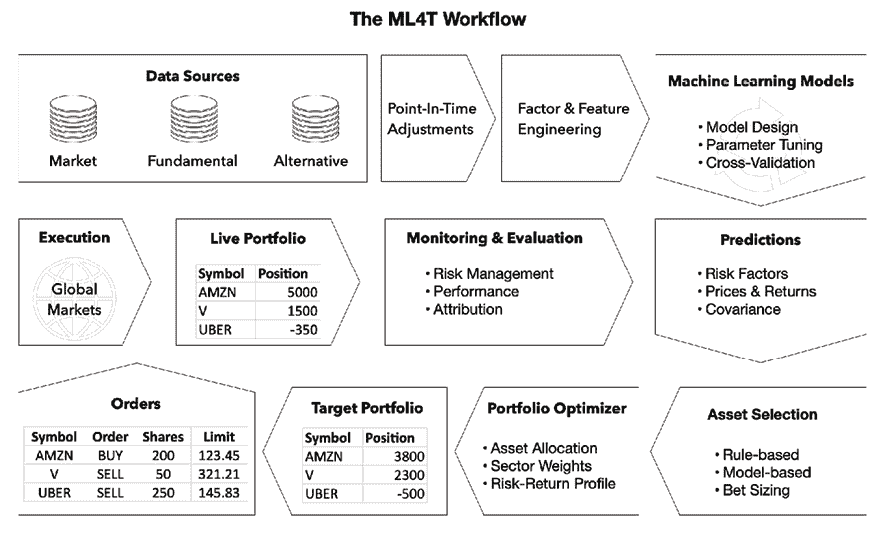
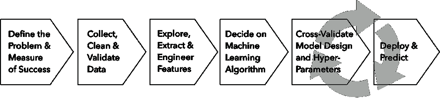

# 23

# 结论和下一步

我们这本书的目标是让你能够将**机器学习**（**ML**）应用于各种数据源，并提取信号，为交易策略增加价值。为此，我们对投资过程采取了更全面的视角，从构思到策略评估，并引入了机器学习作为该过程的一个重要元素，以**ML4T 工作流**的形式。

在展示了从基础到高级的广泛范围的机器学习算法的使用时，我们看到了机器学习如何在设计、测试和执行策略的过程中的多个步骤中添加价值。然而，在很大程度上，我们着重于**核心机器学习价值主张**，即从比人类专家能够系统地从更大量的数据中提取可操作信息的能力。

这个价值主张随着数字数据的爆炸而真正获得了流行，数字数据使得利用计算能力从越来越多样化的信息集中提取价值变得更有前景和必要。然而，机器学习的应用仍然需要大量的人为干预和领域专业知识来定义目标、选择和筛选数据、设计和优化模型，并适当地利用结果。

用于交易机器学习的领域特定方面包括金融数据的性质和金融市场的环境。当信噪比通常很低时，使用具有高学习能力的强大模型需要特别小心以避免过度拟合。此外，交易的竞争性意味着模式迅速演变，因为信号衰减，需要额外关注性能监控和模型维护。

在这个总结性章节中，我们将简要总结本书中学到的关键工具、应用和经验教训，以避免在如此多的细节之后失去大局观。然后，我们将确定一些我们没有涉及但对你扩展我们介绍的许多机器学习技术并在日常使用中变得高效是值得关注的领域。

总之，在本章中，我们将：

+   回顾关键收获和经验教训

+   指出建立在本书技术基础上的下一步

+   建议将机器学习纳入你的投资过程中的方法

# 关键收获和经验教训

本书的一个核心目标是演示使用机器学习从数据中提取信号以指导交易策略的工作流程。*图 23.1* 概述了这个用于交易的机器学习工作流程。本节总结的关键收获与我们在构建针对金融市场大型数据集的复杂预测模型时遇到的具体挑战相关：

图 23.1：利用机器学习进行交易的关键要素

在进行交易机器学习实践时需要牢记以下重要见解：

+   **数据**是唯一最重要的要素，需要仔细的采集和处理。

+   **领域专业知识**是实现数据价值和避免使用机器学习中一些陷阱的关键。

+   机器学习提供了您可以调整和组合以创建解决方案的**工具**。

+   **模型目标和性能诊断的选择**对于朝着最佳系统进行有效迭代至关重要。

+   **回测过度拟合**是一个需要引起重视的巨大挑战。

+   **黑盒模型的透明度**可以帮助建立信心并促进怀疑论者对机器学习的接受。

我们将对这些想法稍作详细阐述。

## 数据是唯一最重要的要素

机器学习在交易和其他领域的崛起在很大程度上补充了我们详细讨论的数据爆炸。我们在*第二章*，*市场和基本数据-来源和技术*中阐述了如何访问和处理这些数据来源，历来是量化投资的支柱。在*第三章*，*金融替代数据-类别和用例*中，我们提出了一个评估替代数据潜在价值的标准框架。

一个关键的洞察是，像深度神经网络这样的最先进的机器学习技术之所以成功，是因为它们的预测性能随着更多数据的使用而持续改进。另一方面，模型和数据复杂性需要匹配以平衡偏差-方差权衡，这在数据的噪声与信号比越高时变得更具挑战性。管理数据质量和整合数据集是实现潜在价值的关键步骤。

### 新的石油？原始和中间数据的质量控制

就像石油一样，这些天一个常见的比较，数据从其原始形式通过多个阶段的**管道**流向可以为交易策略提供动力的精炼产品。对最终产品质量的仔细关注对于获得所期望的效益至关重要。

有时，您会获得**原始形式的数据**并控制所需的众多转换。更常见的情况是，您处理一个**中间产品**，并应明确此时数据到底测量了什么。

与石油不同，随着数据来源的不断增加，通常没有**客观的质量标准**。相反，质量取决于其信号内容，而信号内容又取决于您的投资目标。对新数据集的成本效益评估需要一个高效的工作流程，包括我们稍后将讨论的适当基础设施。

### 数据整合-整体大于部分之和

投资策略的数据价值往往取决于结合市场、基本面和替代数据的互补来源。我们看到，机器学习算法（如基于树的集成或神经网络）的预测能力部分是由于它们能够检测到非线性关系，特别是**变量之间的相互作用效应**。

调节变量影响的能力作为其他模型特征的函数取决于捕获目标结果不同方面的数据输入。资产价格与宏观基本面、社会情绪、信用卡支付和卫星数据的结合可能会产生更可靠的预测，比单独使用每个来源要可靠得多（前提是数据量足够大以学习隐藏的关系）。

多来源数据的处理增加了**正确标记的挑战**。准确分配能够准确反映历史出版的时间戳至关重要。否则，通过在数据实际可用之前使用算法进行测试，我们引入了前瞻性偏差。例如，第三方数据可能具有需要调整以反映信息实际对于实时算法而言可用的时间戳。

## 领域专业知识 - 区分信号和噪音

我们强调，信息丰富的数据是成功的机器学习应用的必要条件。然而，领域专业知识同样至关重要，用于定义战略方向、选择相关数据、构建信息丰富的特征以及设计健壮的模型。

在任何领域，从业者都对关键结果的驱动因素和它们之间的关系有着自己的理论。金融领域以**大量的可用数量研究**为特点，包括理论和实证研究。然而，马科斯·洛佩斯·德·普拉多和其他人（科克兰 2011）批评了大多数实证结果：基于普遍的数据挖掘得出的数百个变量中发现预测信号的声明往往不具有抗干扰性，并且不适应实验设置的变化。换句话说，统计显著性往往是大规模的试错而不是真正的系统关系的结果，这与“如果你折磨数据足够长时间，它就会招供”的说法相一致。

一方面，人们对金融市场的运作方式有着深入的理解。这应该为数据的选择和使用以及依赖机器学习的策略的理论提供支持。一个重要的原因是优先考虑更有可能成功的想法，并避免导致不可靠结果的多重测试陷阱。我们在*第四章*，*金融特征工程 - 如何研究 Alpha 因子*，以及*第五章*，*投资组合优化和绩效评估*中概述了关键想法。

另一方面，新颖的机器学习技术可能会发现有关金融结果驱动因素的新假设，这将为理论提供信息，并应进行独立测试。

除了原始数据外，特征工程通常是使信号对算法有用的关键。利用几十年来对推动理论和实证收益的风险因素的研究是优先考虑更可能反映相关信息的数据转换的良好起点。

然而，只有创造性的特征工程才能产生能够随时间在市场上竞争的创新策略。即使对于新的 Alpha 因子，一个能够解释它们如何运作的引人注目的叙述，考虑到市场动态和投资者行为的已建立的观念，也将为资本配置提供更多的信心。

由于假发现和过度拟合的风险使得在测试之前优先考虑策略变得更加必要，而不是“听任数据说话”。我们在*第七章*，*线性模型 - 从风险因素到收益预测*中介绍了如何调整夏普比率，以考虑实验的数量。

## ML 是解决数据问题的工具包

ML 提供了可以应用于许多用例的算法解决方案和技术。本书的*第 2*、*3*和*4*部分介绍了 ML 作为一套多样化工具，可以为策略过程的各个步骤增加价值，包括：

+   想法生成和 Alpha 因子研究

+   信号聚合和投资组合优化

+   策略测试

+   交易执行

+   策略评估

此外，ML 算法被设计为进一步发展、适应和组合，以解决不同背景下的新问题。因此，除了能够将其应用于数据进行富有成效的实验和研究之外，了解这些算法背后的关键概念和思想也很重要，这在*第六章*，*机器学习流程*中有所阐述，并在*图 23.2*中进行了总结：

图 23.2：ML 工作流程

此外，最佳结果通常是通过**人在环路解决方案**实现的，这些解决方案将人类与 ML 工具结合起来。在*第一章*，*从想法到执行的交易机器学习*中，我们介绍了量化基本面投资风格，其中酌情性和算法交易相结合。这种方法可能会变得更加重要，并依赖于灵活和创造性地应用我们介绍的基本工具及其对各种数据集的扩展。

### 模型诊断有助于加快优化速度

在*第六章*，*机器学习流程*中，我们概述了最重要的 ML 特定概念。ML 算法通过对功能形式进行假设来学习输入数据和目标之间的关系。如果学习基于噪声而不是信号，预测性能将受到影响。

当然，我们今天并不知道如何从明天的结果的角度分离信号和噪音。谨慎的交叉验证可以避免前瞻偏差，而健壮的模型诊断，如学习曲线和优化验证测试，则可以帮助缓解这一基本挑战，并校准算法的选择或配置。通过定义专注的模型目标，以及对于复杂模型，区分由于优化算法问题和目标本身而导致的性能缺陷，可以使这项任务变得更加容易。

### 没有免费午餐

没有系统，无论是计算机程序还是人类，都无法可靠地预测超出其在训练过程中观察到的新示例的结果。唯一的出路是具有一些额外的先验知识或做出超出训练示例的假设。我们在本书的*第七章*中涵盖了从线性模型到非线性集成模型的广泛算法，*线性模型-从风险因素到回报预测*，以及在本书*第十一章*，*随机森林-一种日本股票的长短策略*，以及*第十二章*，*提升您的交易策略*，以及本书*第四部分*的各个章节中的神经网络。

我们看到线性模型做出了一个强烈的假设，即输入和输出之间的关系具有非常简单的形式，而非线性模型如梯度提升或神经网络旨在学习更复杂的函数。虽然很明显简单的模型在大多数情况下会失败，但复杂的模型并不总是更好。如果真实关系是线性的，但数据有噪音，那么复杂模型将学习将噪音作为其假定存在的复杂关系的一部分。这就是**"没有免费午餐"定理**的基本思想，它指出没有一种算法在所有任务中都是普遍优越的。在某些情况下良好的拟合会以其他地方性能不佳为代价。

用于调整算法选择的关键工具是数据探索和基于对模型做出的假设的理解进行的实验。

### 管理偏差-方差权衡

在调整算法以适应数据时的一个关键挑战是偏差和方差之间的权衡，它们都会使预测误差超出数据的自然噪声。一个简单的模型如果不能充分捕捉数据中的关系，将会出现欠拟合并表现出偏差，即会产生系统性错误的预测。一个过于复杂的模型会过拟合并学习噪音，除了信号之外，还会显示出不同样本的很大方差。

在模型选择和优化过程的任何给定迭代中，诊断这种权衡的关键工具是**学习曲线**。它显示训练和验证误差如何取决于样本大小。这使我们能够在不同选项之间做出决策以提高性能：调整模型的复杂度或获取更多数据点。

训练误差越接近人类表现或另一个基准，模型过度拟合的可能性就越大。低验证误差告诉我们我们很幸运找到了一个好模型。如果验证错误率高，我们没有。然而，如果随着训练规模的增加而持续下降，则可能需要更多数据。如果训练误差高，更多数据不太可能有所帮助，我们应该添加特征或使用更灵活的算法。

### 定义目标模型目标

机器学习过程中的第一步之一是定义算法要优化的目标。有时，选择很简单，比如在回归问题中。分类任务可能更困难，例如，当我们关心精确率和召回率时。将冲突的目标整合成一个单一指标，如 F1 分数，有助于集中优化工作。我们还可以包括需要满足的条件而不是优化的条件。我们还看到，强化学习完全取决于定义正确的奖励函数来指导代理的学习过程。

### 优化验证测试

安德鲁·吴强调了由学习算法或优化算法问题导致的性能不足之间的区别。像神经网络这样的复杂模型假设非线性关系，并且优化算法的搜索过程可能会导致局部最优而不是全局最优。

如果模型未能正确翻译一个短语，例如，测试会比较正确预测的分数和搜索算法发现的解决方案的分数。如果学习算法为正确解决方案打分更高，则需要改进搜索算法。否则，学习算法正在优化错误的目标。

## 谨防回测过度拟合

我们在整本书中反复讨论了由于过度拟合历史数据而产生的虚假发现的风险。*第五章*，*投资组合优化和绩效评估*，关于策略评估，概述了主要驱动因素和潜在的解决方案。与网络规模的图像或文本数据相比，低信噪比和相对较小的数据集（与网络规模的图像或文本数据相比）使得这一挑战在交易领域尤为严重。意识到这一点至关重要，因为数据的易获得性和应用机器学习的工具增加了风险。

没有简单的答案，因为风险是不可避免的。然而，我们提出了调整回测指标以考虑重复试验的方法，例如调整后的夏普比率。当努力实现实时交易策略时，分阶段的模拟交易和在市场执行过程中密切监控的绩效需要成为实施过程的一部分。

## 如何从黑盒模型中获得见解

深度神经网络和复杂集成模型可能会引起怀疑，因为它们被视为不可解释的黑盒模型，特别是在回测过拟合风险的背景下。我们在*第十二章*《提升您的交易策略》中介绍了几种方法，以了解这些模型是如何进行预测的。

除了传统的特征重要性度量之外，最近的博弈论创新**SHapley Additive exPlanations**（**SHAP**）是理解复杂模型机制的重要一步。SHAP 值允许精确地将特征及其值归因于预测，从而更容易在特定理论下验证模型的逻辑，以针对给定的投资目标理解市场行为。除了解释外，准确的特征重要性评分和预测归因还可以深入洞察投资结果的驱动因素。

另一方面，围绕模型预测透明度的重要性存在一些争议。深度学习的发明者之一 Geoffrey Hinton 认为，人类决策的原因经常是模糊的。也许机器应该根据其结果进行评估，就像我们对待投资经理一样。

# 实践中的交易 ML

随着您将众多工具和技术整合到投资和交易流程中，有许多方面可以成为您努力的焦点。如果您的目标是做出更好的决策，您应选择与您当前技能集相符合但又雄心勃勃的项目。这将帮助您开发一个以高效工具为支撑的工作流程，并获得实践经验。

我们将简要列出一些有助于扩展本书所涵盖的 Python 生态系统的工具。它们包括大数据技术，最终将成为规模实施基于 ML 的交易策略所必需的。我们还将列出一些允许您使用 Python 实施交易策略的平台，可能会提供对数据源、ML 算法和库的访问。最后，我们将指出采用 ML 作为组织的良好实践。

## 数据管理技术

数据在 ML4T 过程中的核心作用需要熟悉一系列技术，以便在规模化地存储、转换和分析数据，其中包括使用云服务，如亚马逊云服务、微软 Azure 和谷歌云。

### 数据库系统

数据存储意味着使用数据库。从历史上看，这些通常是使用 SQL 以良好定义的表格式存储和检索数据的**关系数据库管理系统**（**RDBMSes**）。这些数据库包括来自商业提供商如 Oracle 和 Microsoft 以及开源实现如 PostgreSQL 和 MySQL 的数据库。最近，出现了非关系型的替代方案，通常被统称为 NoSQL，但其种类千差万别，包括：

+   **键值存储**：快速读/写访问对象。我们在*第二章*，*市场和基本数据 - 来源和技术*中介绍了 HDF5 格式，它可以方便快速访问 pandas DataFrame。

+   **列存储**：利用列中数据的同质性以促进压缩和更快的基于列的操作，如聚合。这在流行的亚马逊 Redshift 数据仓库解决方案中使用，以及 Apache Parquet、Cassandra 和 Google 的 Big Table 中使用。

+   **文档存储**：旨在存储不符合关系数据库所需的严格模式定义的数据。这在使用 JSON 或 XML 格式的 Web 应用程序中很受欢迎，在*第四章*，*金融特征工程 - 如何研究 Alpha 因子*中我们遇到了它。例如，它在 MongoDB 中使用。

+   **图数据库**：设计用于存储具有节点和边缘的网络，并专门用于查询有关网络指标和关系的查询。它在 Neo4J 和 Apache Giraph 中使用。

已经有一些趋同于关系数据库系统建立的惯例。Python 生态系统便于与许多标准数据源进行交互，并提供快速的 HDF5 和 Parquet 格式，正如本书中所示。

### 从 Hadoop 到 Spark 的大数据技术

数百吉字节及以上规模的数据管理需要使用多台形成集群的机器并行进行读取、写入和计算操作。换句话说，您需要一个在多台机器上以集成方式运行的分布式系统。

**Hadoop 生态系统**已成为一个开源软件框架，用于使用 Google 开发的 MapReduce 编程模型对大数据进行分布式存储和处理。该生态系统已在 Apache 基金会的支持下多样化发展，今天包括许多涵盖大规模数据管理不同方面的项目。

Hadoop 中的关键工具包括：

+   **Apache Pig**：一种数据处理语言，由 Yahoo 开发，用于使用 MapReduce 实现大规模**提取-转换-加载**（**ETL**）管道。

+   **Apache Hive**：针对 PB 级数据的交互式 SQL 查询的事实标准。它是在 Facebook 开发的。

+   **Apache HBASE**：一种用于实时读/写访问的 NoSQL 数据库，可线性扩展到数十亿行和数百万列。它可以使用各种不同的模式组合数据源。

**Apache Spark** 已成为集群上交互式分析最流行的平台。MapReduce 框架允许并行计算，但需要重复从磁盘读取/写入操作以确保数据冗余。由于**弹性分布式数据**（**RDD**）结构，Spark 已经极大地加速了规模化的计算，这种结构允许高度优化的内存计算。这包括对优化所需的迭代计算，例如，对于许多机器学习算法的梯度下降。幸运的是，Spark DataFrame 接口是以 pandas 为目标设计的，因此你的技能相对顺利地转移。

## 机器学习工具

我们在本书中涵盖了 Python 生态系统的许多库。Python 已经发展成为数据科学和机器学习的首选语言。开源库的集合不断多样化和成熟，构建在强大的科学计算库 NumPy 和 SciPy 的稳健核心之上。

流行的 pandas 库在推广 Python 用于数据科学方面做出了重大贡献，并且随着 2020 年 1.0 版本的发布而逐渐成熟。scikit-learn 接口已成为现代专业机器学习库（如 XGBoost 或 LightGBM）的标准，这些库通常与工作流自动化工具（如 GridSearchCV 和 Pipeline）进行交互，而我们在整本书中已经多次使用过。

有几个提供简化机器学习工作流程的供应商：

+   **H2O.ai** 提供了与 ML 自动化集成的 H2O 平台。它允许用户将数千个潜在模型拟合到其数据中，以探索数据中的模式。它在 Python、R 和 Java 中都有接口。

+   **Datarobot** 旨在通过提供一个平台来快速构建和部署云端或本地的预测模型，自动化模型开发过程。

+   **Dataiku** 是一个协作数据科学平台，旨在帮助分析师和工程师探索、原型设计、构建和交付自己的数据产品。

还有几个由公司领导的开源倡议，这些公司基于并扩展了 Python 生态系统：

+   量化对冲基金 **TwoSigma** 通过 BeakerX 项目为 Jupyter Notebook 环境贡献了量化分析工具。

+   **Bloomberg** 已将 Jupyter Notebook 集成到其终端中，以便于对其金融数据进行交互式分析。

## 在线交易平台

开发使用机器学习的交易策略的主要选项是在线平台，这些平台通常寻找并分配资金给成功的交易策略。流行的解决方案包括 Quantopian、Quantconnect 和 QuantRocket。较新的 Alpha Trading Labs 则专注于高频交易。此外，**Interactive Brokers（IB）** 提供了一个 Python API，你可以使用它来开发自己的交易解决方案。

### Quantopian

我们介绍了 Quantopian 平台，并演示了如何使用其研究和交易环境来分析和测试交易策略与历史数据相比。Quantopian 使用 Python，并提供大量教育资料。

Quantopian 主办比赛，招募算法以构建其众包对冲基金投资组合。它为获胜算法提供资金支持。实时交易在 2017 年 9 月停止，但该平台仍提供大量历史数据，并吸引了活跃的开发者和交易者社区。这是一个讨论想法和从他人学习的良好起点。

### QuantConnect

QuantConnect 是另一个开源的、社区驱动的算法交易平台，与 Quantopian 竞争。它还提供一个 IDE，用于使用 Python 和其他语言对算法策略进行回测和实时交易。

QuantConnect 还拥有来自世界各地的充满活力的全球社区，并提供对包括股票、期货、外汇和加密货币在内的众多资产类别的访问。它提供与各种经纪商的实时交易集成，例如 IB、OANDA 和 GDAX。

### QuantRocket

QuantRocket 是一个基于 Python 的平台，用于研究、回测和运行自动量化交易策略。它提供数据收集工具、多个数据供应商、研究环境、多个回测引擎，以及通过 IB 进行实时和模拟交易。QuantRocket 以其支持国际股票交易而自豪，并以其灵活性脱颖而出（但 Quantopian 也在朝这个方向努力）。

QuantRocket 支持多种引擎——它自己的 Moonshot，以及用户选择的第三方引擎。虽然 QuantRocket 没有传统的集成开发环境（IDE），但与 Jupyter 的集成良好，可以产生类似的效果。QuantRocket 提供免费版本，可访问示例数据，但在 2020 年初写作时，访问更广泛的功能集的费用从每月 $29 起。

# 结论

我们首先强调了数字数据的爆炸增长和 ML 作为投资和交易策略的战略能力的出现。这种动态反映了金融之外的全球业务和技术趋势，并且更有可能持续而不是停滞或逆转。许多投资公司刚刚开始利用人工智能工具的范围，就像个人正在获得相关技能，业务流程正在适应这些新的创造价值机会一样，正如介绍章节所概述的那样。

未来还有许多令人兴奋的 ML 应用于交易的发展即将到来，可能会推动目前的动能。它们可能在未来几年变得相关，并包括 ML 过程的自动化、生成合成训练数据以及量子计算的出现。该领域的非凡活力意味着这本身就足以填满一本书，而旅程将继续保持令人兴奋的状态。
