# 第二十四章：Alpha 因子库

在本书中，我们已经描述了如何从市场、基本和替代数据中提取特征，以构建 **机器学习** (**ML**) 模型，为交易策略提供信号。特征的智能设计，包括适当的预处理和去噪，通常是实现有效策略的关键。本附录综合了关于特征工程的一些经验教训，并提供了有关这一重要主题的额外信息。

*第四章*，*金融特征工程 - 如何研究 Alpha 因子*，总结了学者和从业者长期以来努力识别有助于可靠预测资产回报的信息或变量。这项研究从单因素资本资产定价模型发展到了一个“新因子动物园”（Cochrane，2011）。*因子动物园*包含了自 1970 年以来 anomalies 文献中呈现的数百种公司特征和证券价格指标，被认为是股票回报的统计显著预测因子（参见 Green，Hand 和 Zhang，2017）的摘要。

*第四章*，*金融特征工程 - 如何研究 Alpha 因子*，按照它们所代表的基础风险将因子分类，以及投资者将在市场回报之上获得的奖励。这些类别包括价值与增长、质量和情绪，以及波动性、动量和流动性。在本书中，我们使用了众多指标来捕捉这些风险因素。本附录扩展了这些例子，并收集了流行指标，以便您将其用作策略开发的参考或灵感。它还向您展示如何计算这些指标，并包括一些评估这些指标的步骤。

为此，我们将重点放在 TA-Lib 实施的广泛指标范围上（参见 *第四章*，*金融特征工程 - 如何研究 Alpha 因子*）以及 *101 Formulaic Alphas* 论文（Kakushadze，2016）上，该论文呈现了实际量化交易因子的使用情况，平均持有期为 0.6-6.4 天。为了方便复制，我们将限制此次审查的指标，使其依赖于易于获取的市场数据。尽管存在这一限制，但潜在有用数据源和特征的广泛且迅速发展的范围意味着此概述远非全面。

在本章中，我们将使用 *P*[t] 表示资产在时间 *t* 的收盘价，*V*[t] 表示交易量。必要时，上标，如 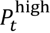 或 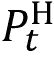，用于区分开盘、最高、最低或收盘价。*r*[t] 表示时间 *t* 的简单回报率。

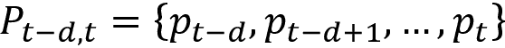 和 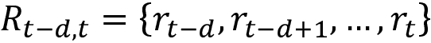 分别指的是从 *t-d* 到 *t* 的价格和回报的时间序列。

# TA-Lib 中实施的常见 alpha 因子

TA-Lib 库被广泛用于由交易软件开发人员执行金融市场数据的技术分析。它包括来自多个类别的 150 多种常用指标，范围从重叠研究，包括移动平均线和布林带，到统计函数，如线性回归。以下表格总结了主要类别： 

| 函数组 | # 指标 |
| --- | --- |
| 重叠研究 | 17 |
| 动量指标 | 30 |
| 成交量指标 | 3 |
| 波动性指标 | 3 |
| 价格变换 | 4 |
| 周期指标 | 5 |
| 数学运算符 | 11 |
| 数学变换 | 15 |
| 统计函数 | 9 |

还有 60 多种旨在识别交易者常用的蜡烛图形式的函数，这些函数依赖于对图表的视觉检查。鉴于关于它们预测能力的混合证据（霍顿 2009 年；马歇尔、扬和罗斯 2006 年），以及使用本书中涵盖的 ML 算法从数据中学习此类模式的目标，我们将重点放在前面表中列出的类别上。具体来说，在本节中，我们将重点放在移动平均线、重叠研究、动量、成交量和流动性、波动性以及基本风险因素上。

查看笔记本`common_alpha_factors`以获取本节中的代码示例和有关 TA-Lib 指标的其他实现细节。我们将演示如何计算个别股票以及 2007 年至 2016 年期间交易量最大的 500 支美国股票样本的选定指标（请参阅笔记本`sample_selection`以准备这个较大数据集）。

## 一个关键的基本模块 - 移动平均线

许多指标允许使用不同类型的**移动平均**（**MAs**）进行计算。它们在平滑系列和对新发展的反应之间进行不同的权衡。您可以将它们用作自己指标的构建块，或者通过修改其构建中使用的 MA 类型来修改现有指标的行为，正如我们将在下一节中演示的那样。以下表格列出了可用的 MA 类型，用于计算它们的 TA-Lib 函数以及您可以传递给其他指标以选择给定类型的代码：

| 移动平均 | 函数 | 代码 |
| --- | --- | --- |
| 简单 | SMA | 0 |
| 指数 | EMA | 1 |
| 加权 | WMA | 2 |
| 双指数 | DEMA | 3 |
| 三重指数 | TEMA | 4 |
| 三角形 | TRIMA | 5 |
| 考夫曼自适应 | KAMA | 6 |
| MESA 自适应 | MAMA | 7 |

在本节的其余部分，我们将简要概述它们的定义并可视化它们的不同行为。

### 简单移动平均

对于长度为*N*的窗口的价格系列*P*[t]，在时间*t*的**简单移动平均**（**SMA**）对窗口内的每个数据点进行平均：

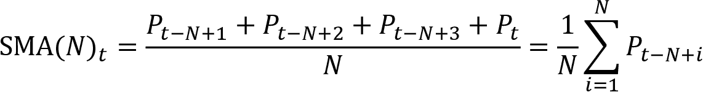

### 指数移动平均

对于长度为 *N* 的价格序列 *P*[t]，在时间 *t* 的**指数移动平均**（**EMA**），记为 EMA[t]，被递归地定义为当前价格和最近的前一个 EMA[t][-1] 的加权平均，其中权重为  和 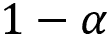，定义如下：

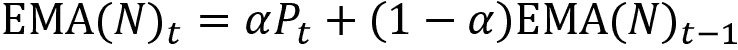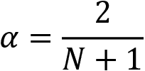

### 加权移动平均

对于长度为 *N* 的价格序列 *P*[t]，在时间 *t* 的**加权移动平均**（**WMA**）被计算为使每个数据点的权重对应于其在窗口内的索引：

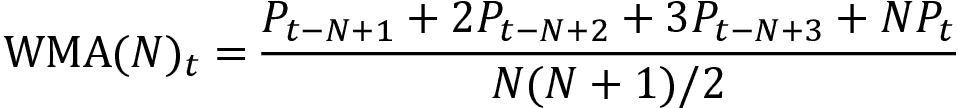

### 双重指数移动平均

对于时间 *t* 的价格序列 *P*[t] 的**双重指数移动平均**（**DEMA**），记为 DEMA[t]，基于 EMA 设计得更快地对价格变化做出反应。它计算为当前 EMA 的两倍差异与应用于当前 EMA 的 EMA 之间的差异，标记为 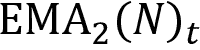：

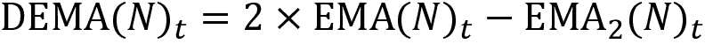

由于计算使用了 EMA[2]，DEMA 需要 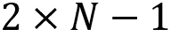 个样本才能开始生成值。

### 三重指数移动平均

对于时间 *t* 的价格序列 *P*[t] 的**三重指数移动平均**（**TEMA**），记为 TEMA[t]，也基于 EMA，但设计得更快地对价格变化做出反应，并指示短期价格走势。它计算为当前 EMA 与应用于当前 EMA 的三倍差异之间的三倍差异，标记为 EMA[2] 的差异，加上应用于 EMA[2] 的 EMA，标记为 EMA[3]：

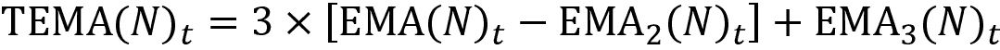

由于计算使用了 EMA[3]，DEMA 需要 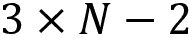 个样本才能开始生成值。

### 三角形移动平均

对于时间 *t* 的价格序列 *P*[t] 的窗口长度为 *N* 的**三角形移动平均**（**TRIMA**），记为 TRIMA(*N*)[t]，是最后 *N* 个 SMA(*N*)[t] 值的加权平均。换句话说，它将 SMA 应用于 SMA 值的时间序列：

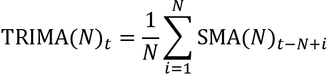

### 考夫曼自适应移动平均

**考夫曼自适应移动平均**（**KAMA**）的计算旨在考虑市场波动性的变化。有关这种稍微复杂的计算的详细说明，请参见笔记本中的资源链接。

### MESA 自适应移动平均

**MESA 自适应移动平均**（**MAMA**）是一种根据相位变化速率（由**希尔伯特变换鉴别器**测量，参见 TA-Lib 文档）调整到价格变动的指数移动平均。除了价格序列外，MAMA 还接受两个额外参数，*fastlimit* 和 *slowlimit*，用于控制在计算 MAMA 时应用于 EMA 的最大和最小 alpha 值。

### 移动平均的可视比较

*图 A.1* 说明了不同移动平均线在平滑时间序列和适应最近变化方面的行为差异。所有时间序列均计算为 21 天的移动窗口（有关详细信息和彩色图片，请参阅笔记本）：

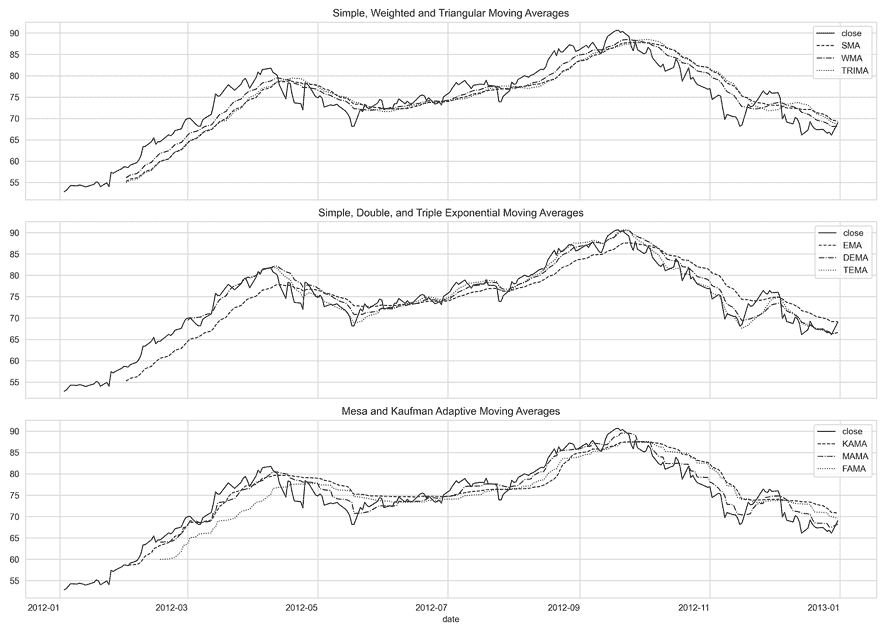

图 A.1：AAPL 收盘价的移动平均线比较

## 重叠研究 – 价格和波动趋势

TA-Lib 包括几个旨在捕捉近期趋势的指标，如下表所示：

| 函数 | 名称 |
| --- | --- |
| BBANDS | 布林带 |
| HT_TRENDLINE | 希尔伯特变换 – 瞬时趋势线 |
| MAVP | 可变周期移动平均线 |
| MA | 移动平均线 |
| SAR | 抛物线 SAR |
| SAREXT | 扩展抛物线 SAR |

`MA` 和 `MAVP` 函数是前文描述的各种移动平均线的包装器。我们将在本节中重点介绍一些示例；更多信息和可视化内容请参阅笔记本。

### 布林带

布林带将一个移动平均线与代表移动标准差的上下带相结合。我们可以通过提供输入价格系列、移动窗口的长度、上下带的乘数和移动平均线的类型来获得三个时间序列，如下所示：

```py
s = talib.BBANDS(df.close,     # No. of periods (2 to 100000)
                 timeperiod=20,
                 nbdevup=2,    # Deviation multiplier for lower band
                 nbdevdn=2,    # Deviation multiplier for upper band
                 matype=1)     # default: SMA 
```

对于 2012 年的 AAPL 收盘价格样本，我们可以如下绘制结果：

```py
bb_bands = ['upper', 'middle', 'lower']
df = price_sample.loc['2012', ['close']]
df = df.assign(**dict(zip(bb_bands, s)))
ax = df.loc[:, ['close'] + bb_bands].plot(figsize=(16, 5), lw=1); 
```

上述代码的结果如下图所示：

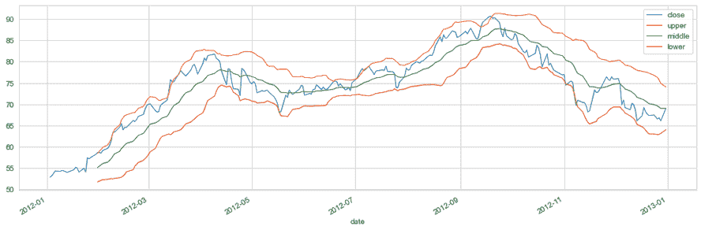

图 A.2：AAPL 2012 年收盘价的布林带

发明该概念的约翰·波林格还根据三条线与当前价格之间的关系定义了 20 多个交易规则（参见*第四章*，*金融特征工程 – 如何研究阿尔法因子*）。例如，外部带之间的距离较小意味着近期价格波动减少，这反过来被解释为未来更大的波动和价格变动。

我们可以通过形成上下带之间以及它们与收盘价之间的比率来标准化布林带的特定于安全性的值，如下所示：

```py
fig, ax = plt.subplots(figsize=(16,5))
df.upper.div(df.close).plot(ax=ax, label='bb_up')
df.lower.div(df.close).plot(ax=ax, label='bb_low')
df.upper.div(df.lower).plot(ax=ax, label='bb_squeeze')
plt.legend()
fig.tight_layout(); 
```

下图显示了结果归一化的时间序列：

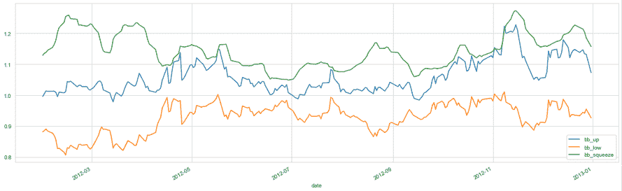

图 A.3：归一化的布林带指标

下面的函数可与 pandas 的 `.groupby()` 和 `.apply()` 方法一起使用，以计算 500 只股票的指标，如下所示：

```py
def compute_bb_indicators(close, timeperiod=20, matype=0):
    high, mid, low = talib.BBANDS(close, 
                                  timeperiod=20,
                                  matype=matype)
    bb_up = high / close -1
    bb_low = low / close -1
    squeeze = (high - low) / close
    return pd.DataFrame({'BB_UP': bb_up, 
                         'BB_LOW': bb_low, 
                         'BB_SQUEEZE': squeeze}, 
                        index=close.index)
data = (data.join(data
                  .groupby(level='ticker')
                  .close
                  .apply(compute_bb_indicators))) 
```

*图 A.4* 绘制了跨越 500 只股票的每个指标值的分布（在第 1 和第 99 百分位处截断，因此图中出现了尖峰）：

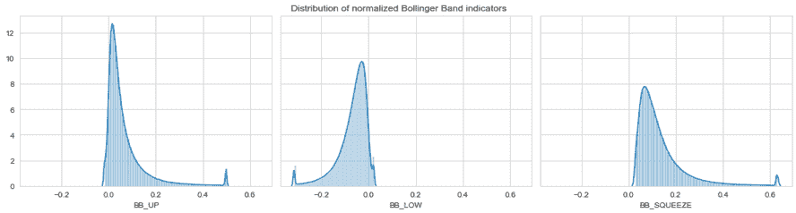

图 A.4：归一化的布林带指标分布

### 抛物线 SAR

**抛物线 SAR**旨在识别趋势反转。它是一种趋势跟踪（滞后）指标，可用于设置跟踪止损或确定入场或退出点。通常，在价格图表中表示为靠近价格条的一组点。一般来说，当这些点位于价格上方时，表示向下趋势；当点位于价格下方时，表示向上趋势。点的方向变化可解释为交易信号。但是，在平盘或区间市场中，该指标的可靠性较低。其计算如下：

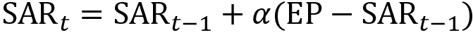

**极值点**（**EP**）是在每个趋势期间保留的记录，代表当前上涨趋势中达到的最高值或下跌趋势中的最低值。在每个周期内，如果观察到新的最大值（或最小值），则 EP 将使用该值进行更新。

α值代表加速因子，通常最初设置为 0.02。每当记录新的 EP 时，此因子增加α。然后，速率将加快，直至 SAR 收敛于价格。为了防止它变得太大，通常将加速因子的最大值设置为 0.20。

我们可以按以下方式计算和绘制样本收盘价序列：

```py
df = price_sample.loc['2012', ['close', 'high', 'low']]
df['SAR'] = talib.SAR(df.high, df.low, 
                      acceleration=0.02, # common value
                      maximum=0.2)       
df[['close', 'SAR']].plot(figsize=(16, 4), style=['-', '--']); 
```

上述代码生成以下图表：

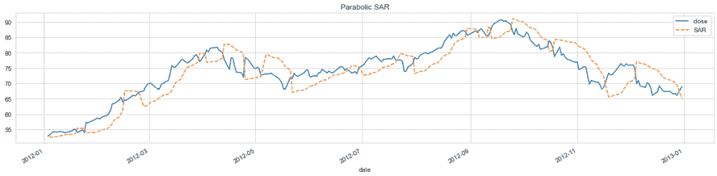

图 A.5：AAPL 股价的抛物线 SAR

## 动量指标

*第四章*，*金融特征工程 - 如何研究阿尔法因子*，介绍了**动量**作为历史上表现最佳的风险因子之一，并列举了几个旨在识别相应价格趋势的指标。这些指标包括**相对强弱指数**（**RSI**），以及**价格动量**和**价格加速度**：

| 因子 | 描述 | 计算 |
| --- | --- | --- |
| 相对强弱指数（RSI） | RSI 比较了股票近期价格变动的幅度，以识别股票是否处于超买或超卖状态。较高的 RSI（通常超过 70）表示超买，较低的 RSI（通常低于 30）表示超卖。首先，它分别计算过去给定数量（通常为 14）的交易日内上涨（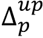）和下跌价格（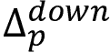）的平均价格变动。 | 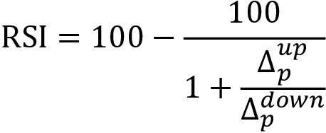 |
| 价格动量 | 该因子计算给定数量的前期交易日 d 的总回报。在学术文献中，通常使用最近 12 个月，除了最近一个月之外，因为经常观察到短期逆转效应。但是，也广泛使用较短的期间。 | 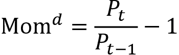 |
| 价格加速度 | 价格加速度使用线性回归系数  计算价格趋势的梯度，时间跨度包括较长和较短的期间，例如，1 年和 3 个月的交易日，比较斜率变化作为价格加速度的一种度量。 | 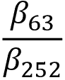 |

TA-Lib 实现了 30 个动量指标；其中最重要的指标列在下表中。我们将介绍一些选定的示例；更多信息请参见笔记本 `common_alpha_factors`：

| 函数 | 名称 |
| --- | --- |
| PLUS_DM/MINUS_DM | 正/负方向运动 |
| PLUS_DI/MINUS_DI | 正/负方向指标 |
| DX | 方向运动指数 |
| ADX | 平均趋向指数 |
| ADXR | 平均趋向指数评级 |
| APO/PPO | 绝对/百分比价格振荡器 |
| AROON/AROONOSC | 阿隆/阿隆振荡器 |
| BOP | 力量平衡指数 |
| CCI | 商品通道指数 |
| CMO | Chande 动量振荡器 |
| MACD | 移动平均线收敛/发散 |
| MFI | 资金流指标 |
| MOM | 动量 |
| RSI | 相对强弱指数 |
| STOCH | 随机指标 |
| ULTOSC | 终极振荡器 |
| WILLR | 威廉指数 |

其中一些指标密切相关且相互构建，如下例所示。

### 平均趋向运动指标

**平均趋向指数**（**ADX**）结合了另外两个指标，即正向和负向方向指标（`PLUS_DI` 和 `MINUS_DI`），它们依次基于正向和负向方向运动（`PLUS_DM` 和 `MINUS_DM`）。有关更多细节，请参阅笔记本。

#### 正/负方向运动

对于价格序列 *P*[t]，其中每日最高价为 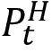，每日最低价为 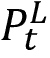，方向性运动跟踪时间段 *T* 内价格变动的绝对大小，计算方法如下：

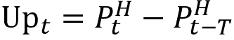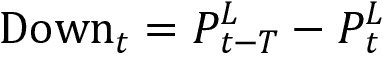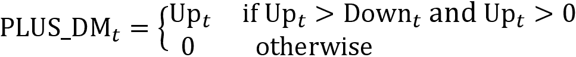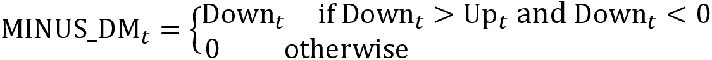

我们可以计算并绘制 AAPL 股票 2012-13 年的 2 年价格序列的此指标：

```py
df = price_sample.loc['2012': '2013', ['high', 'low', 'close']]
df['PLUS_DM'] = talib.PLUS_DM(df.high, df.low, timeperiod=10)
df['MINUS_DM'] = talib.MINUS_DM(df.high, df.low, timeperiod=10) 
```

以下图形可视化了结果时间序列：

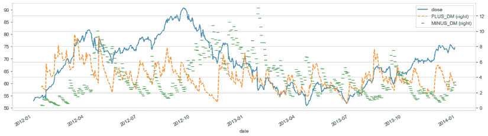

图 A.6：AAPL 股票价格的 PLUS_DM/MINUS_DM

#### 正/负方向指数

`PLUS_DI` 和 `MINUS_DI` 分别是 `PLUS_DM` 和 `MINUS_DM` 的简单 MA，每个 MA 都除以**平均真实范围**（**ATR**）。有关更多细节，请参阅本章后面的*波动性指标*部分。

简单 MA 是在给定的周期内计算的。ATR 是真实范围的平滑平均。

#### 平均趋向指数

最后，**平均趋向指数**（**ADX**）是绝对值的简单 MA，该值等于 `PLUS_DI` 和 `MINUS_DI` 之间的差异除以它们的和：

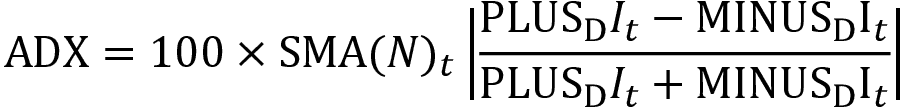

它的值在 0-100 范围内振荡，通常如下解释：

| ADX 值 | 趋势强度 |
| --- | --- |
| 0-25 | 不存在或弱趋势 |
| 25-50 | 强趋势 |
| 50-75 | 非常强趋势 |
| 75-100 | 极强趋势 |

我们按照之前的示例，为我们的 AAPL 样本系列计算 ADX 时间序列，如下所示：

```py
df['ADX'] = talib.ADX(df.high, 
                      df.low, 
                      df.close, 
                      timeperiod=14) 
```

下图可视化了 2007-2016 年间的结果：

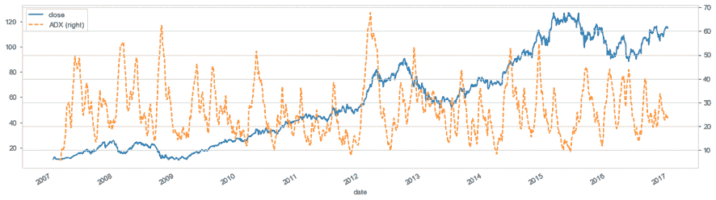

图 A.7：AAPL 股价系列的 ADX

### 阿隆振荡器

阿隆指标测量了一段时间内的高点之间的时间和低点之间的时间。它计算了 `AROON_UP` 和 `AROON_DWN` 指标，如下所示：

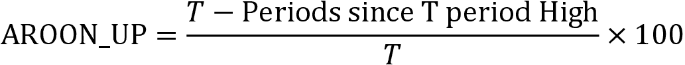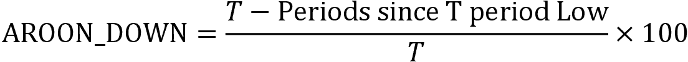

阿隆振荡器只是 `AROON_UP` 和 `AROON_DOWN` 指标之间的差异，它在 -100 到 100 的范围内移动，如下图所示为 AAPL 价格系列：

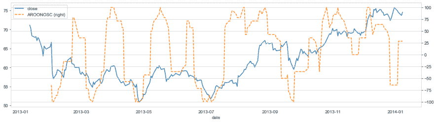

图 A.8：AAPL 股价系列的阿隆振荡器

### 买卖力道

**买卖力道**（**BOP**）旨在通过评估每一方对价格的影响来衡量市场上买方相对卖方的力量。它的计算方法是收盘价与开盘价之差除以最高价与最低价之差：

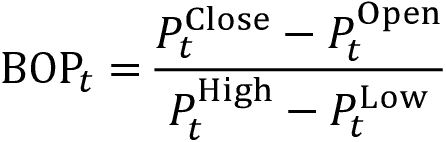

### 商品通道指数

**商品通道指数**（**CCI**）测量当前 *典型* 价格与历史平均价格之间的差异。典型价格由当前的最低、最高和收盘价的平均值计算而得。正（负）CCI 表示价格高于（低于）历史平均值。计算方法如下：

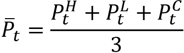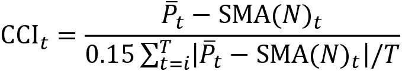

### 移动平均收敛差离

**移动平均收敛差离**（**MACD**）是一种非常流行的趋势跟踪（滞后）动量指标，显示了证券价格的两个 MAs 之间的关系。它的计算方法是从 26 日 EMA 中减去 12 日 EMA。

TA-Lib 实现返回 MACD 值及其信号线，即 MACD 的 9 日 EMA。此外，MACD-Histogram 衡量了指标与其信号线之间的距离。以下图表显示了结果：

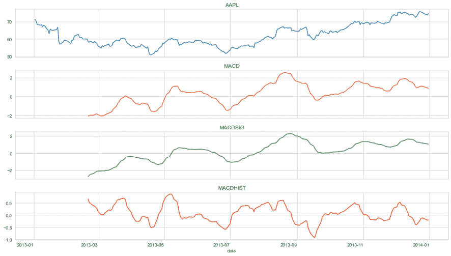

图 A.9：AAPL 股价系列的三个 MACD 系列

### 随机相对强度指数

**随机相对强度指数**（**StochRSI**）基于本节开头描述的 RSI，并意图识别交叉点以及超买和超卖条件。它比较当前 RSI 到给定时间段 *T* 内最低 RSI 的距离，与 RSI 在此期间所假设的最大值范围。计算方法如下：

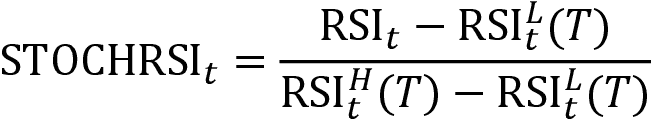

TA-Lib 实现比 Chande 和 Kroll（1993）的原始未平滑随机 RSI 版本提供了更多的灵活性。要计算原始指标，请保持 `timeperiod` 和 `fastk_period` 相等。

返回值`fastk`是未平滑的 RSI。 `fastd_period`用于计算平滑的 StochRSI，返回为`fastd`。如果您不关心 StochRSI 的平滑，请将`fastd_period`设置为 1，并忽略`fasytd`输出：

```py
fastk, fastd = talib.STOCHRSI(df.close,
                              timeperiod=14, 
                              fastk_period=14, 
                              fastd_period=3, 
                              fastd_matype=0)
df['fastk'] = fastk
df['fastd'] = fastd 
```

*图 A.10* 绘制了收盘价以及平滑和未平滑的随机 RSI：

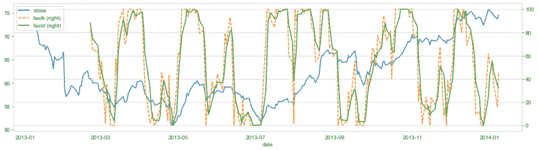

图 A.10：AAPL 股价的平滑和未平滑的 StochRSI 序列

### 随机振荡器

随机振荡器是一种动量指标，它将某一安全性的特定收盘价与一段时间内的价格范围进行比较。随机振荡器基于收盘价应该确认趋势的想法。对于随机（STOCH），有四条不同的线：*K*^(Fast)、*D*^(Fast)、*K*^(Slow)和*D*^(Slow)。 *D*是信号线，通常画在其对应的*K*函数上：

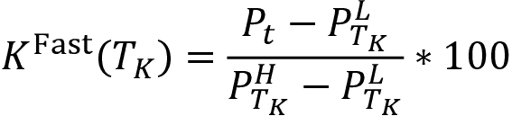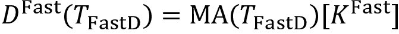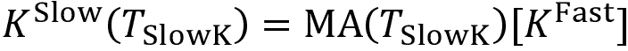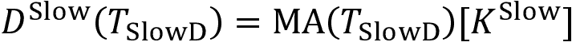

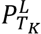，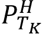 和  是过去  期的极端值。当使用相同周期时， 和  是等价的。我们得到以下图表中显示的序列，如下所示：

```py
slowk, slowd = talib.STOCH(df.high,
                           df.low,
                           df.close,
                           fastk_period=14,
                           slowk_period=3,
                           slowk_matype=0,
                           slowd_period=3,
                           slowd_matype=0)
df['STOCH'] = slowd / slowk 
```


图 A.11：AAPL 股价的 STOCH 序列

### 终极振荡器

**终极振荡器**（ULTOSC）衡量了当前收盘价与前三个时间框架的最低价之间的平均差异——默认值为 7、14 和 28——以避免对短期价格变动做出过度反应，并结合短期、中期和长期市场趋势。

首先计算买入压力 BP[t]，然后将其在三个周期 T[1]、T[2]和 T[3]上归一化到真实范围(TR[t])上求和：


ULTOSC 然后按照以下方式计算为三个周期的加权平均值：


以下图表显示了此结果：


图 A.12：AAPL 股价的 ULTOSC 序列

#### 威廉姆斯百分比 R

**威廉姆斯百分比 R**，也称为**威廉姆斯百分比范围**，是一个动量指标，其数值在 0 到-100 之间变动，用于衡量超买和超卖水平，以识别进入和退出点。它类似于随机振荡器，并将当前收盘价与过去*T*周期（通常为 14 个周期）内的最高价()和最低价()范围进行比较。指标计算如下，并且结果显示在以下图表中：


图 A.13：AAPL 股价的 WILLR 序列

## 交易量和流动性指标

专注于成交量和流动性的风险因素包括换手率、美元交易量或市值等指标。TA-Lib 实现了三个指标，其中前两个密切相关：

| 功能 | 名称 |
| --- | --- |
| AD | 蔡金 A/D 线 |
| ADOSC | 蔡金 A/D 振荡器 |
| OBV | 能量潮指标 |

还请参阅*第二十章*，*用于条件风险因素和资产定价的自动编码器*，在那里我们使用阿米胡德流动性指标来衡量绝对收益和美元交易量之间的滚动平均比率。

### 蔡金累积/分布线和振荡器

**蔡金涨跌线**（**AD**）或**累积/分布**（**AD**）线是一种基于成交量的指标，旨在衡量资产流入和流出的累积资金流量。该指标假设通过收盘价相对于周期内的最高价和最低价的位置来确定买入或卖出压力的程度。当股票收盘在周期范围的上半部分（下半部分）时，存在买入（卖出）压力。其目的是在指标与证券价格背离时发出方向变化的信号。

A/D 线是每个周期**资金流量量**（**MFV**）的累积总和。计算方法如下：

1.  将**资金流指数**（**MFI**）计算为收盘价与高低范围的关系

1.  将 MFI 乘以周期的交易量 *V*[t] 来得到 MFV

1.  获取 A/D 线作为 MFV 的累积总和：


**蔡金 A/D 振荡器**（**ADOSC**）是应用于蔡金 AD 线的 MACD 指标。蔡金振荡器旨在预测 AD 线的变化。

它被计算为 AD 线的 3 天 EMA 与 10 天 EMA 之间的差值。下图显示了 ADOSC 系列：


图 A.14：AAPL 股价的 ADOSC 系列

### 能量潮指标

**能量潮指标**（**OBV**）是一个累积动量指标，它将成交量与价格变化联系起来。它假设 OBV 的变化先于价格变化，因为智慧资金可以通过上升的 OBV 流入证券而被看到。当公众跟随时，证券和 OBV 都会上升。

当证券收盘价高于前一次收盘价时，将当前交易量加到上次 OBV[t][-1] 上（当证券收盘价低于前一次收盘价时，从上次 OBV[t][-1] 中减去当前交易量）来计算当前的 OBV[t]：


## 波动性指标

波动性指标包括股票特定的度量，如资产价格和收益的滚动（归一化）标准偏差。它还包括更广泛的市场指标，如芝加哥期权交易所的**波动率指数**（**VIX**），该指数基于标普 500 期权的隐含波动率。

TA-Lib 实现了真实波动幅度指标的归一化和平均版本。

### 真实波动幅度

**平均真实波幅**（**ATR**）指标显示了市场的波动性。它由 Wilder（1978 年）引入，并被用作许多其他指标的组成部分。它旨在预测趋势变化，其数值越高，趋势变化的可能性越大；指标值越低，当前趋势越弱。

ATR 被计算为真实范围（**TRANGE**）的周期*T*的简单移动平均，其将波动性定义为最近交易范围的绝对值：


结果系列如下图所示：


图 A.15：AAPL 股票价格的 ATR 系列

### 标准化平均真实波幅

TA-Lib 还提供了一种标准化的 ATR，允许跨资产进行比较。**标准化平均真实波幅**（**NATR**）的计算方法如下：


标准化使 ATR 对于长期分析更为相关，在价格大幅变动和跨市场或跨证券比较时尤为重要。

## 基本风险因素

风险的常用度量包括资产回报对旨在代表基本因素的投资组合回报的敞口。我们介绍了法玛和弗伦奇（2015 年）的五因子模型，并展示了如何使用两状态法玛-麦克贝斯回归估计因子负载和风险因子溢价，详情见*第七章*，*线性模型-从风险因素到回报预测*。

为了估计证券价格与五因子模型中包括公司规模、价值与成长动态、投资政策和盈利能力等因素之间的关系，除了广义市场外，我们可以使用 Kenneth French 的数据库提供的投资组合回报作为滚动线性回归中的外生变量。

以下示例使用`pandas_datareader`模块访问数据（详见*第二章*，*市场和基本数据-来源和技术*）。然后，它计算了 21、63 和 252 个交易日的窗口的回归系数：

```py
factor_data = (web.DataReader('F-F_Research_Data_5_Factors_2x3_daily', 'famafrench', 
                              start=2005)[0].rename(columns={'Mkt-RF': 'MARKET'}))
factor_data.index.names = ['date']
factors = factor_data.columns[:-1]
t = 1
ret = f'ret_{t:02}'
windows = [21, 63, 252]
for window in windows:
    print(window)
    betas = []
    for ticker, df in data.groupby('ticker', group_keys=False):
        model_data = df[[ret]].merge(factor_data, on='date').dropna()
        model_data[ret] -= model_data.RF
        rolling_ols = RollingOLS(endog=model_data[ret], 
                                 exog=sm.add_constant(model_data[factors]),
                                 window=window)
        factor_model = rolling_ols.fit(params_only=True).params.rename(
            columns={'const':'ALPHA'})
        result = factor_model.assign(ticker=ticker).set_index(
            'ticker', append=True).swaplevel()
        betas.append(result)
    betas = pd.concat(betas).rename(columns=lambda x: f'{x}_{window:02}')
    data = data.join(betas) 
```

刚刚描述的风险因素通常被称为**智能贝塔因子**（见*第一章*，*用于交易的机器学习-从想法到执行*）。此外，对冲基金已经开始使用从大规模数据挖掘练习中派生出的 alpha 因子，我们现在将转向这些因子。

# WorldQuant 寻找公式阿尔法

我们在*第一章*，*用于交易的机器学习-从想法到执行*中介绍了 WorldQuant，作为一种众包投资策略的趋势的一部分。WorldQuant 维护着一个虚拟研究中心，全球量化分析师在此竞争，以确定**阿尔法**。这些阿尔法是以计算表达式形式的交易信号，帮助预测价格变动，就像前一节描述的通用因子一样。

这些**公式 alpha**将从数据中提取信号的机制转换为代码，并且它们可以单独开发和测试，目标是将它们的信息整合到更广泛的自动化策略中（Tulchinsky 2019）。正如本书中反复强调的那样，在大型数据集中挖掘信号容易出现多重测试偏差和假发现。尽管存在这些重要的警告，这种方法代表了对前一节中介绍的更传统特征的现代替代方案。

Kakushadze（2016）提供了 101 个这种 alpha 的示例，其中 80％ 当时被用于真实的交易系统中。它定义了一系列操作横截面或时间序列数据的函数，并且可以组合使用，例如以嵌套形式。

笔记本 `101_formulaic_alphas` 展示了如何使用 pandas 和 NumPy 实现这些函数，并且还说明了如何计算大约 80 个这些公式 alpha 的示例，其中我们有输入数据（例如，我们缺乏准确的历史部门信息）。

## 横截面和时间序列函数

Kakushadze（2016）提出的公式 alpha 的构建块是相对简单的表达式，它们计算纵向或横截面数据，并且可以很容易地使用 pandas 和 NumPy 实现。

横截面函数包括排名和缩放，以及对收益进行分组归一化，其中分组意味着在不同粒度级别上表示部门信息：

我们可以将排名函数直接转换为 pandas 表达式，使用 DataFrame 作为参数，格式为 *周期数* × *标的证券数*，如下所示：

```py
def rank(df):
    """Return the cross-sectional percentile rank
     Args:
         :param df: tickers in columns, sorted dates in rows.
     Returns:
         pd.DataFrame: the ranked values
     """
    return df.rank(axis=1, pct=True) 
```

还有一些可能会很熟悉的时间序列函数：

| 函数 | 定义 |
| --- | --- |
| `ts_{O}(x, d)` | 对过去 *d* 天的时间序列应用运算符 *O*；非整数天数 *d* 被转换为向下取整的天数 *d*。 |
| `ts_lag(x, d)` | *x* 在 *d* 天前的值。 |
| `ts_delta(x, d)` | 今天的 *x* 的值与 *d* 天前的值之间的差异。 |
| `ts_rank(x, d)` | 过去 *d* 天的排名。 |
| `ts_mean(x, d)` | 过去 *d* 天的简单移动平均值。 |
| `ts_weighted_mean(x, d)` | 过去 *d* 天的加权移动平均值，线性衰减权重 *d*，*d* – 1，…，1（重新缩放为总和为 1）。 |
| `ts_sum(x, d)` | 过去 *d* 天的滚动求和。 |
| `ts_product(x, d)` | 过去 *d* 天的滚动乘积。 |
| `ts_stddev(x, d)` | 过去 *d* 天的移动标准差。 |
| `ts_max(x, d), ts_min(x, d)` | 过去 *d* 天的滚动最大值/最小值。 |
| `ts_argmax(x, d), ts_argmin(x, d)` | ts_*max(x, d), ts_min*(*x*, *c*) 的日期。 |
| `ts_correlation(x, y, d)` | 过去 *d* 天 *x* 和 *y* 的相关性。 |

这些时间序列函数也很容易使用 pandas 的滚动窗口功能来实现。例如，对于滚动加权平均值，我们可以结合 pandas 和 TA-Lib，就像在前一节中演示的那样：

```py
def ts_weighted_mean(df, period=10):
    """
    Linear weighted moving average implementation.
    :param df: a pandas DataFrame.
    :param period: the LWMA period
    :return: a pandas DataFrame with the LWMA.
    """
    return (df.apply(lambda x: WMA(x, timeperiod=period))) 
```

为了创建滚动相关函数，我们提供了两个包含不同股票的时间序列的 DataFrame 列：

```py
def ts_corr(x, y, window=10):
    """
    Wrapper function to estimate rolling correlations.
    :param x, y: pandas DataFrames.
    :param window: the rolling window.
    :return: DataFrame with time-series min for past 'window' days.
    """
    return x.rolling(window).corr(y) 
```

此外，这些表达式使用了常见的运算符，正如我们将在转向每个结合了前述几个函数的公式α时看到的那样。

## 公式化的α表达式

为了说明α表达式的计算，我们需要使用前一节中从 2007 年到 2016 年的 500 支交易最多的股票的样本创建以下输入表格（有关数据准备的详细信息，请参见笔记本`sample_selection`）。每个表格包含了个股的时间序列列：

| 变量 | 描述 |
| --- | --- |
| `returns` | 每日收盘至收盘收益 |
| `open`、`close`、`high`、`low`、`volume` | 每日价格和交易量数据的标准定义 |
| `vwap` | 每日成交量加权平均价格 |
| adv(d) | 过去*d*天的平均每日美元交易额 |

我们的数据不包括许多α表达式所需的每日成交量加权平均价格。为了能够演示它们的计算，我们使用每日开盘、最高、最低和收盘价格的简单平均值来非常粗略地近似这个值。

与前一节中介绍的常见α相反，公式α没有对其所代表的风险敞口进行经济解释。我们将展示几个简单编号的实例。

### Alpha 001

第一个α表达式的公式如下所示：

```py
rank(ts_argmax(power(((returns < 0) ? ts_std(returns, 20) : close), 2.), 5)) 
```

三元运算符`a ? b : c`在*a*评估为`true`时执行*b*，否则执行*c*。因此，如果每日收益为正，它会计算 20 天滚动标准差的平方；否则，它会计算当前收盘价的平方。然后，它会按照显示此值最大的日期的指数对资产进行排名。

使用*c*和*r*分别表示收盘价和收益输入，α可以使用前述函数和 pandas 方法在 Python 中进行转换，如下所示：

```py
def alpha001(c, r):
    """(rank(ts_argmax(power(((returns < 0)
        ? ts_std(returns, 20)
        : close), 2.), 5)) -0.5)"""
    c[r < 0] = ts_std(r, 20)
    return (rank(ts_argmax(power(c, 2), 5)).mul(-.5)
            .stack().swaplevel()) 
```

对于 500 支股票的 10 年样本，Alpha 001 值的分布及其与一日前向收益的关系如下所示：


图 A.16：Alpha 001 直方图和散点图

**信息系数**（**IC**）相当低，但在-0.0099 处具有统计显著性，**互信息**（**MI**）估计值为 0.0129（有关实现细节，请参见*第四章*，*金融特征工程 - 如何研究α因子*，和笔记本`101_formulaic_alphas`）。

### Alpha 054

我们的第二个表达式是收盘价和最低价之间的差异与收盘价和最高价之间的差异的比率，分别乘以开盘价和收盘价，然后再乘以五次方：

```py
-(low - close) * power(open, 5) / ((low - high) * power(close, 5)) 
```

同样，转换为 pandas 很简单。我们使用`o`，`h`，`l`和 c 来表示包含 500 列中每个股票的相应价格系列的数据帧：

```py
def alpha054(o, h, l, c):
    """-(low - close) * power(open, 5) / ((low - high) * power(close, 5))"""
    return (l.sub(c).mul(o.pow(5)).mul(-1)
            .div(l.sub(h).replace(0, -0.0001).mul(c ** 5))
            .stack('ticker')
            .swaplevel()) 
```

在这种情况下，IC 为 0.025，而 MI 得分为 0.005。

现在我们将看看这些不同类型的 alpha 因子在单变量和多变量视角下的比较情况。

# 双变量和多变量因素评估

为了评估众多因素，我们依赖于本书介绍的各种性能指标，包括以下内容：

+   有关某一因素与一日前收益率的信号内容的双变量测量

+   使用所有因素来预测一日前收益率的梯度提升模型的多变量特征重要性度量

+   根据 Alphalens 使用因子分位数投资的投资组合的财务表现

我们将首先讨论双变量度量，然后转向多变量度量；我们将通过比较结果来结束。有关相关代码示例和其他探索性分析，请参阅笔记本`factor_evaluation`，我们将在此处省略因素之间的相关性。

## 信息系数和互信息

我们将使用以下双变量度量标准，这些度量标准在*第四章*，*金融特征工程 - 如何研究 Alpha 因子*中进行了介绍：

+   IC 以斯皮尔曼等级相关性衡量

+   使用由 scikit-learn 提供的`mutual_info_regression`计算的 MI 分数

MI 分数使用了 100,000 个观察样本来限制最近邻计算的计算成本。除此之外，这两个度量标准都很容易计算，并且已经被反复使用；有关实施细节，请参阅笔记本。然而，我们将看到它们可以产生非常不同的结果。

## 特征重要性和 SHAP 值

为了衡量给定所有其他可用因素的特征的预测相关性，我们可以使用默认设置的 LightGBM 梯度提升模型来训练，以使用所有（大约）130 个因素来预测前瞻性收益。该模型使用 8.5 年的数据训练 104 棵树，使用提前停止。我们将获得最后一年数据的测试预测，这将产生 3.40 的全局 IC 和 2.01 的日均值。

接下来，我们将计算特征重要性和**SHapley 加法解释**（**SHAP**）值，如*第十二章*，*提升您的交易策略*中所述；有关详细信息，请参阅笔记本。 *图 A.17*中的影响图突出显示了 20 个最重要特征的值如何相对于模型的默认输出正面或负面地影响模型的预测。以 SHAP 值衡量，alphas 054 和 001 位于前五因素之列：


图 A.17：常见和公式化 alpha 的 SHAP 值

现在，让我们比较不同指标如何评价我们的因素。

## 比较 - 每个指标的前 25 个特征

在 SHAP 值和传统特征重要性之间的排名相关性，后者是特征对模型损失函数减少的加权贡献，为 0.89。SHAP 值与两个单变量指标之间的相关性也很大，约为 0.5。

有趣的是，MI 和 IC 在特征排名上存在显著差异，相关性仅为 0.16，如下图所示：


图 A.18：性能指标的排名相关性

*图 A.19*显示了根据每个指标的前 25 个特征。除了 MI 分数喜欢 "常见" alpha 因子之外，两个来源的特征都排名很高：


图 A.19：每种性能指标的前 25 个特征

目前尚不清楚为什么 MI 与其他指标不一致，以及为什么它分配高分的特征在梯度提升模型中发挥了重要作用。一个可能的解释是计算仅使用了 10% 的样本，分数似乎对样本大小敏感。

## 金融业绩-Alphalens

最后，我们主要关心 alpha 因子发出的交易信号的价值。如*第四章*介绍的，*金融特征工程-如何研究 alpha 因子*，并反复演示，Alphalens 对因子性能进行单独评估。

笔记本 `alphalens_analysis` 让您选择一个单独的因子，并计算根据因子分位值投资的投资组合在给定时间段内的表现如何。

*图 A.20*中的示例显示了 Alpha 54 的结果；尽管头部和底部五分位组合在每日基础上取得了 1.5 bps 的平均收益，但长短组合的累积收益为负值：


图 A.20：Alpha 54 的 Alphalens 性能指标

随意使用笔记本作为模板，更系统地评估样本因子或您自己选择的其他因子。
