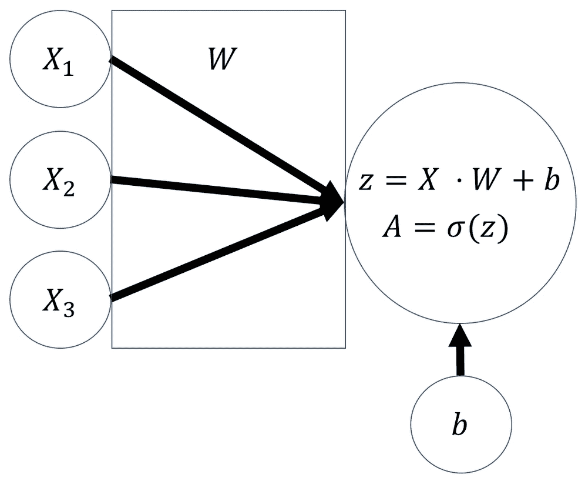
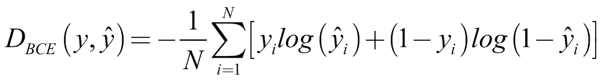
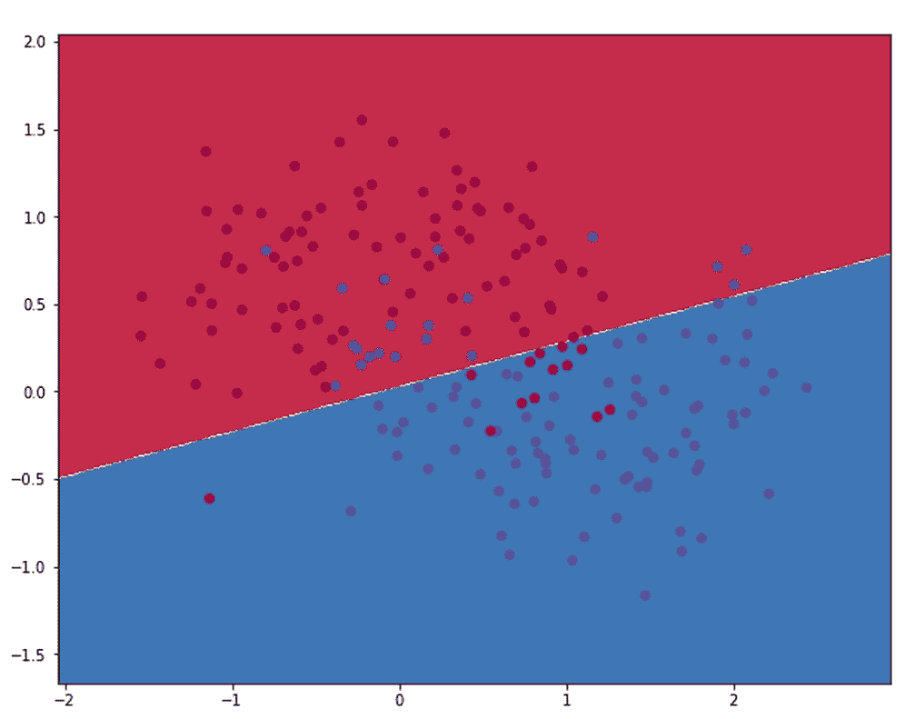

# 第一章 神经网络与基于梯度的优化

金融服务行业本质上是一个信息处理行业。投资基金处理信息以评估投资，保险公司处理信息以定价保险，而零售银行则处理信息以决定向哪些客户提供哪些产品。因此，金融行业早期采用计算机并非偶然。

第一个股票行情机是印刷电报，发明于 1867 年。第一台专门面向金融行业的机械加法机于 1885 年获得专利。然后，在 1971 年，自动柜员机（ATM）获得专利，允许客户使用塑料卡提取现金。同年，首个电子证券交易所——纳斯达克（NASDAQ）开盘，11 年后，即 1982 年，第一台彭博终端（Bloomberg Terminal）安装使用。金融行业与计算机之间的成功结合，原因在于该行业的成功，尤其是在投资领域，通常与是否拥有信息优势密切相关。

在华尔街的早期，镀金时代的传说肆意利用私人信息。例如，杰伊·古尔德（Jay Gould），当时最富有的人之一，在美国政府内部安插了一个间谍。这个间谍负责提前通报政府的黄金销售信息，并借此试图影响总统尤利西斯·S·格兰特及其秘书。到了 20 世纪 30 年代末，证券交易委员会（SEC）和商品期货交易委员会（CFTC）成为了投资者和这些信息优势之间的屏障。

随着信息优势不再成为超越市场表现的可靠来源，聪明的金融建模取而代之。*对冲基金*这一术语最早出现在 1949 年，哈里·马科维茨（Harry Markowitz）模型于 1953 年发布，1973 年，布莱克-斯科尔斯（Black-Scholes）公式首次发表。自那时以来，该领域取得了巨大的进展，并开发出了多种金融产品。然而，随着这些模型知识的普及，使用这些模型的回报逐渐减少。

当我们看到金融行业与现代计算技术结合时，显然信息优势重新回归。这一次，它不是以内幕信息和不正当交易的形式出现，而是通过自动化分析大量公开信息的方式展现。

今天的基金经理拥有比前辈们曾经梦寐以求的更多信息。然而，光有这些信息本身并不有用。例如，来看新闻报道。你可以通过互联网获取它们，而且容易访问，但要利用它们，计算机必须能够阅读、理解并将其置于上下文中。计算机必须知道一篇文章讲的是哪家公司，是好消息还是坏消息，并且是否可以从中了解这家公司与文章中提到的另一家公司之间的关系。这只是几个关于如何将故事放入上下文中的例子。那些擅长获取这种**替代数据**的公司，往往会拥有优势。

但事情并不止于此。金融专业人士是昂贵的人员，他们经常拥有六到七位数的薪水，并占据全球一些最昂贵的房地产。这是合理的，因为许多金融专业人士是聪明、受过良好教育且勤奋工作的人，他们稀缺并且需求量大。因此，任何公司都希望最大化这些个人的生产力。通过让最优秀的员工创造更多价值，公司将能够以更低的成本或更多样化的产品来提供服务。

例如，通过交易所交易基金进行的被动投资，对大笔资金的管理几乎无需干预。被动投资工具的费用，例如那些仅仅跟踪标普 500 指数的基金，通常低于 1%。但是随着现代计算技术的崛起，企业现在能够提高其资金经理的生产力，从而降低费用以保持竞争力。

# 本书的旅程

这本书不仅仅是关于金融领域的投资或交易；它更是计算机与金融之间爱情故事的直接结果。投资公司有客户，通常是保险公司或养老金基金，而这些公司本身就是金融服务公司，反过来，它们也有客户，那些拥有养老金或投保的普通人。

大多数银行客户也是普通人，而且越来越多的人通过手机应用与银行、保险公司或养老金机构互动。

在今天之前的几十年里，零售银行依赖于人们必须亲自到分行才能提取现金或进行交易这一事实。当人们在分行时，银行顾问还可以向他们推销其他产品，例如抵押贷款或保险。今天的客户仍然想要购买抵押贷款和保险，但他们不再需要亲自到分行办理。在今天的世界里，银行倾向于通过应用程序或网站在线为客户提供建议。

这种在线模式只有在银行能够通过数据理解客户需求并提供量身定制的在线体验时才能奏效。同样，从客户的角度来看，他们现在期望能够通过手机提交保险理赔并立即得到回应。在今天的世界中，保险公司需要能够自动评估理赔并做出决策，以满足客户的需求。

本书并非讲解如何编写交易算法以快速获利。它是关于如何利用机器学习驱动的系统艺术和技巧，在金融行业中构建有用的系统。

构建任何有价值的东西都需要大量的时间和精力。目前，构建有价值事物的市场，与经济学类比，是高度低效的。机器学习的应用将在未来几十年内变革这个行业，而本书将为你提供一个工具箱，帮助你成为这一变革的一部分。

本书中的许多例子使用了超出“财务数据”范畴的数据。本书中没有使用股市数据，做出这一决定有三个具体原因。

首先，所展示的例子演示了通常可以轻松应用于其他数据集的技术。因此，选择了能够展示一些专业人士（如你们）在实践中可能面临的常见挑战的数据集，同时这些数据集也保持了计算上的可处理性。

其次，金融数据本质上是时间相关的。为了使本书在更长时间跨度内仍然有用，并确保随着机器学习的普及，本书能继续成为你工具箱中的重要组成部分，我们使用了一些非财务数据，这样本书讨论的数据将保持相关性。

最后，使用替代性和非传统数据旨在激发你思考在你的流程中还可以使用哪些其他数据。你是否可以利用植物的无人机影像来增强你的粮食价格模型？你是否可以利用网页浏览行为来提供不同的金融产品？如果你想利用身边的数据，跳出框框思考是一个必要的技能。

# 什么是机器学习？

> “机器学习是计算机科学的一个子领域，它赋予计算机在没有明确编程的情况下学习的能力。”
> 
> - 亚瑟·塞缪尔，1959 年

我们所说的机器学习是什么意思？今天的大多数计算机程序是由人类手工编写的。软件工程师精心设计每一个规则来规范软件的行为，然后将其转化为计算机代码。

如果你正在阅读这本电子书，现在可以看看你的屏幕。你所看到的一切都是因为某个软件工程师设计了一些规则。这种方法已经带我们走得很远，但这并不意味着它没有限制。有时，可能会有太多规则让人类去编写。我们可能无法想到规则，因为它们太复杂，即使是最聪明的开发人员也难以想出。

做一个简短的练习，花一分钟时间列出描述所有狗的规则，并且明确区分狗和所有其他动物。毛发？好吧，猫也有毛发。那如果一只狗穿着夹克呢？那还是狗，只不过穿了夹克。研究人员花了多年时间试图制定这些规则，但收效甚微。

人类似乎无法完美地解释为什么某样东西是狗，但我们一眼就能认出狗。作为一个物种，我们似乎能检测出一些难以描述的特定模式，这些模式合起来让我们能够将动物分类为狗。机器学习试图做的就是一样的事情。我们不是手工编写规则，而是让计算机通过模式检测来发展自己的规则。

这个方法有多种实现方式，接下来我们将介绍三种不同的学习类型：监督学习、无监督学习和强化学习。

# 监督学习

让我们回到狗分类器的话题。实际上，目前有很多这样的分类器正在被使用。例如，如果你使用谷歌图片搜索“狗”，它会使用图像分类器来展示狗的图片。这些分类器是在监督学习的范式下进行训练的。


监督学习

在监督学习中，我们有大量的训练样本，比如动物的图像，以及描述这些训练样本期望结果的标签。例如，上面的图像会附有标签“狗”，而猫的图像则会附有标签“不是狗”。

如果我们有大量带标签的训练示例，我们可以训练一个分类器，检测出区分狗和其他动物的微妙统计模式。

### 提示

**注意**：分类器并不知道狗的本质是什么。它只知道训练过程中将图像与狗联系起来的统计模式。

如果一个监督学习分类器遇到与训练数据非常不同的内容，它往往会感到困惑，并输出无意义的结果。

# 无监督学习

尽管监督学习在过去几年取得了很大的进展，但本书的大部分内容将重点讨论使用带标签的示例。然而，有时我们可能没有标签。在这种情况下，我们仍然可以使用机器学习来发现数据中的隐藏模式。


聚类是无监督学习的一种常见形式

想象一下，一个公司拥有若干客户群体。这些客户大致可以分为不同的市场细分，但我们不知道这些市场细分具体是什么。我们也不能直接询问客户他们属于哪个市场细分，因为他们可能并不知道。你是洗发水市场的哪一类消费者？你甚至知道洗发水公司是如何细分客户的吗？

在这个例子中，我们希望有一个算法能够查看大量来自客户的数据，并将他们分为不同的群体。这是一个无监督学习的例子。

这一领域的机器学习远不如监督学习发展成熟，但它依然蕴藏着巨大的潜力。

# 强化学习

在强化学习中，我们训练能够在环境中采取行动的智能体，例如在道路上行驶的自动驾驶汽车。尽管我们没有标签，也就是说，我们无法判断在任何情况下什么是*正确*的行动，但我们可以给予奖励或惩罚。例如，我们可以奖励保持与前车的适当距离。


强化学习

驾驶教练不会告诉学员“在转动方向盘两度右转的同时将刹车踩下去一半”，而是告诉学员他们做得好不好，学员则自己找出该使用多少刹车。

在过去的几年里，强化学习也取得了显著进展，许多人认为它是通向通用人工智能的一个有前途的方向，也就是计算机具备与人类相当的智能。

## 数据的非凡有效性

2009 年，三位谷歌工程师发表了一篇具有里程碑意义的论文，题为*数据的非凡有效性*。在论文中，他们描述了长期以来一直存在的相对简单的机器学习系统，在接入谷歌服务器上巨量的数据后，表现出了远超预期的性能。实际上，他们发现，当这些简单的系统获得更多数据时，它们能够掌握以前被认为不可能完成的任务。

从那时起，研究人员迅速开始重新审视旧有的机器学习技术，并发现人工神经网络在大数据集上训练时表现尤其出色。大约在那个时候，计算能力变得更加便宜和丰富，足以训练比以往更大的网络。

这些更大的人工神经网络如此有效，以至于它们被赋予了一个名字：深度神经网络，或深度学习。深度神经网络在模式识别方面特别擅长。它们可以找到复杂的模式，例如描述面部的光暗统计模式，且在拥有足够数据的情况下能够自动完成这一过程。

因此，机器学习最好被理解为一种程序设计范式的变革。我们不再精心手工编写规则，而是向计算机提供大量信息，训练它自行制定规则。

如果规则的数量非常庞大，或者这些规则难以描述，那么这种方法是更优的。因此，现代机器学习是理想的工具，用于处理金融行业所面临的大量数据。

## 所有模型都是错误的

统计学中有句名言：*所有模型都是错误的，但有些是有用的*。机器学习创造了极为复杂的统计模型，这些模型往往在深度学习中，难以被人类理解。它们确实很有用，并且具有很大的价值，但它们仍然是错误的。这是因为它们是复杂的“黑箱”，而人们往往不去质疑机器学习模型，尽管正因为它们是黑箱，我们更应该质疑它们。

总有一天，即使是最先进的深度神经网络，也会做出根本错误的预测，正如 2008 年金融危机中的**担保债务凭证**（**CDO**）模型所做的那样。更糟糕的是，黑箱式的机器学习模型将在贷款审批或保险等方面做出数百万个决定，影响普通人的生活，最终可能做出错误的决策。

有时候它们会有偏见。机器学习的效果永远取决于我们提供给它的数据，而这些数据常常在展示时存在偏见，这是我们将在本章稍后讨论的内容。我们必须花大量时间去解决这个问题，因为如果我们不加思考地部署这些算法，我们也会自动化歧视，进而可能引发另一场金融危机。

这一点在金融行业尤为真实，在这里，算法往往会对人们的生活产生严重影响，同时这些算法又是保密的。那些通过大量数学运算获得认可的、不容质疑的秘密黑箱，带来的社会威胁远远大于你在电影中看到的、自觉的人工智能接管世界的情节。

虽然这不是一本伦理学书籍，但对于任何该领域的从业者来说，了解自己工作的伦理影响是有意义的。除了推荐你阅读 Cathy O'Neil 的*《数学毁灭武器》*，我还建议你宣誓*《建模者的希波克拉底誓言》*。这项誓言由量化金融研究人员 Emanuel Derman 和 Paul Wilmott 于 2008 年在金融危机后提出：

> “我会记得，我不是创造了这个世界，世界也不符合我的方程式。尽管我会大胆地使用模型来估计价值，但我不会过分看重数学。我绝不会为了优雅而牺牲现实，除非我能解释为什么这样做。我也不会让使用我的模型的人对其准确性产生虚假的安慰。相反，我会明确指出其假设和疏漏。我明白，我的工作可能对社会和经济产生巨大影响，其中许多影响超出了我的理解。”

近年来，机器学习取得了许多重大进展，研究人员已经掌握了曾经被认为无法解决的任务。从图像中的物体识别到语音转录，再到像围棋这样复杂的棋盘游戏，现代机器学习已经在众多任务上与人类表现相匹敌，并且持续超越人类表现。

有趣的是，**深度学习**正是所有这些进展背后的方法。事实上，绝大多数的进展来自于深度学习的一个子领域——**深度神经网络**。虽然许多从业者熟悉标准的计量经济学模型，比如回归分析，但很少有人熟悉这种新型的建模方法。

本书的大部分内容都集中在深度学习上。这是因为深度学习是机器学习中最有前景的技术之一，掌握它的人将具备解决曾经被认为不可能完成的任务的能力。

在本章中，我们将探索神经网络如何以及为什么能够工作，以便让你对这一主题有一个基本的理解。

# 设置工作环境

在我们开始之前，你需要设置工作环境。本书中的所有示例都旨在 Jupyter 笔记本中运行。Jupyter 笔记本是一种互动式开发环境，主要用于数据科学应用，是构建数据驱动应用程序的首选环境。

你可以在本地计算机上、云服务器上，或者像 Kaggle 这样的网站上运行 Jupyter 笔记本。

### 注意

**注意**：本书的所有代码示例可以在这里找到：[`github.com/PacktPublishing/Machine-Learning-for-Finance`](https://github.com/PacktPublishing/Machine-Learning-for-Finance)，第一章的代码请参考以下链接：[`www.kaggle.com/jannesklaas/machine-learning-for-finance-chapter-1-code`](https://www.kaggle.com/jannesklaas/machine-learning-for-finance-chapter-1-code)。

深度学习对计算机的要求很高，本书中使用的示例数据常常超过一千兆字节。通过使用**图形处理单元**（**GPU**），这类任务可以加速处理，而 GPU 最初是为渲染视频和游戏而发明的。如果你拥有启用了 GPU 的计算机，你可以在本地运行这些示例。如果没有这样的机器，建议使用像 Kaggle Kernels 这样的服务。

学习深度学习过去是一项昂贵的任务，因为 GPU 是一块昂贵的硬件。虽然现在有更便宜的选择，但如果你购买一块强大的 GPU，它的价格可以高达 $10,000，而在云端租用它的费用约为每小时 $0.80。

如果你有许多长期运行的训练任务，可能值得考虑建立一个“深度学习”工作站，即一台配备 GPU 的台式电脑。网上有无数的教程可以帮助你构建，而一台普通的工作站可以花费几百美元，最高可达 $5,000。

这本书中的示例都可以在 Kaggle 上免费运行。实际上，它们是使用该网站开发的。

# 使用 Kaggle 内核

Kaggle 是一个由 Google 拥有的流行数据科学网站。它最初通过竞赛形式运作，参赛者需要构建机器学习模型以进行预测。然而，随着时间的推移，它还拥有了一个受欢迎的论坛、一个在线学习系统，最重要的是，为我们提供了一个托管的 Jupyter 服务。

要使用 Kaggle，你可以访问他们的网站 [`www.kaggle.com/`](https://www.kaggle.com/)。为了使用该网站，你需要创建一个账户。

创建账户后，你可以通过点击主菜单中的 **Kernels** 来访问 **Kernels** 页面，如下图所示：


公共 Kaggle 内核

在前面的截图中，你可以看到其他人编写并发布的一些内核。内核可以是私有的，但发布内核是展示技能和分享知识的好方式。

要启动一个新的内核，请点击 **New Kernel**。在接下来的对话框中，你需要选择 **Notebook**：


内核编辑器

你将进入内核编辑器，它看起来像前面的截图。

请注意，Kaggle 正在积极迭代其内核设计，因此某些元素可能会处于不同的位置，但基本功能是相同的。笔记本中最重要的部分是代码单元。在这里，你可以输入代码，并通过点击左下角的运行按钮来运行它，或者使用 *Shift* + *Enter* 的快捷键。

你在一个单元中定义的变量会变成环境变量，因此可以在另一个单元中访问它们。Markdown 单元允许你使用 markdown 格式编写文本，为你的代码添加说明。你可以通过位于右上角的小云按钮上传和下载笔记本。

要从内核编辑器发布笔记本，首先必须点击 **Commit & Run** 按钮，然后在设置中将笔记本设置为 **Public**。要启用笔记本中的 GPU，请确保选中右下角的 **Enable GPU** 按钮。需要记住的是，这将重启你的笔记本，因此你的环境变量将丢失。

一旦你运行了代码，运行按钮将变为停止按钮。如果你的代码卡住了，可以通过点击停止按钮来中断它。如果你想清除所有环境变量并重新开始，只需点击右下角的重启按钮。

使用这个系统，你可以将内核连接到 Kaggle 上托管的任何数据集，或者你也可以随时上传新的数据集。本书中的笔记本已经配置好了数据连接。

Kaggle 内核预装了最常用的包，因此大部分时间你无需担心安装包。

本书有时会使用 Kaggle 默认没有安装的自定义包。在这种情况下，你可以在设置菜单的底部添加自定义包。每当本书中使用自定义包时，会提供相关的安装说明。

Kaggle 内核是免费的，能为你节省大量时间和金钱，因此建议在 Kaggle 上运行代码示例。要复制一个笔记本，请访问每章代码部分开头提供的链接，然后点击**Fork Notebook**。请注意，Kaggle 内核最多可以运行六个小时。

## 本地运行笔记本

如果你的机器足够强大，可以运行深度学习操作，那么你可以在本地运行代码示例。在这种情况下，强烈建议通过 Anaconda 安装 Jupyter。

要安装 Anaconda，只需访问[`www.anaconda.com/download`](https://www.anaconda.com/download)下载发行版。图形化安装程序将引导你完成安装 Anaconda 到系统的步骤。在安装 Anaconda 时，你还将安装一系列有用的 Python 库，如 NumPy 和 matplotlib，这些库将在本书中使用。

安装 Anaconda 后，你可以通过打开机器的终端并输入以下代码，来本地启动 Jupyter 服务器：

```py
$ jupyter notebook

```

然后，你可以访问终端中显示的 URL。这将带你到本地的笔记本服务器。

要启动一个新的笔记本，点击右上角的**New**。

本书中的所有代码示例都使用 Python 3，因此请确保在本地笔记本中使用 Python 3。如果你在本地运行笔记本，还需要安装 TensorFlow 和 Keras，这两个人工智能深度学习库将在本书中使用。

### 安装 TensorFlow

在安装 Keras 之前，我们需要先安装 TensorFlow。你可以通过打开终端窗口并输入以下命令来安装 TensorFlow：

```py
$ sudo pip install TensorFlow

```

若要了解如何安装支持 GPU 的 TensorFlow，只需点击此链接，你将在这里找到安装说明：[`www.tensorflow.org/`](https://www.tensorflow.org/)。

值得注意的是，你需要一块支持 CUDA 的 GPU 才能运行带有 CUDA 的 TensorFlow。有关如何安装 CUDA 的说明，请访问[`docs.nvidia.com/cuda/index.html`](https://docs.nvidia.com/cuda/index.html)。

### 安装 Keras

安装 TensorFlow 后，你可以通过运行以下命令来安装 Keras：

```py
$ sudo pip install Keras

```

现在 Keras 将自动使用 TensorFlow 作为后端。请注意，TensorFlow 1.7 将内置 Keras，我们将在本章稍后介绍这一点。

### 本地使用数据

要在本地使用书中的代码示例数据，请访问 Kaggle 上的笔记本并从那里下载相关数据集。请注意，数据的文件路径会根据你保存数据的位置而有所变化，因此在本地运行笔记本时，你需要替换文件路径。

Kaggle 还提供了一个命令行接口，使你能够更轻松地下载数据。访问[`github.com/Kaggle/kaggle-api`](https://github.com/Kaggle/kaggle-api)了解如何实现。

# 使用 AWS 深度学习 AMI

**亚马逊云服务**（**AWS**）提供了一种易于使用、预配置的方式来在云端运行深度学习。

访问[`aws.amazon.com/machine-learning/amis/`](https://aws.amazon.com/machine-learning/amis/)了解如何设置**亚马逊机器镜像**（**AMI**）。虽然 AMI 是付费的，但它们的运行时间比 Kaggle 内核长。所以，对于大项目，使用 AMI 而不是内核可能更值得。

要在 AMI 上运行本书的笔记本，首先设置好 AMI，然后从 GitHub 下载笔记本，之后将它们上传到你的 AMI。你还需要从 Kaggle 下载数据。有关说明，请参见*本地使用数据*部分。

# 逼近函数

关于神经网络的最佳理解方式有很多种看法，但也许最有用的方式是将它们看作是函数逼近器。数学中的函数将某个输入，*x*，与某个输出，*y*，相关联。我们可以将其写成如下公式：


一个简单的函数可能是这样的：


在这种情况下，我们可以给函数一个输入，*x*，然后它将其四倍化：


你可能在学校见过这样的函数，但函数能做的不止这些；举个例子，它们可以将一个集合中的元素（函数接受的值的集合）映射到另一个集合中的元素。这些集合可以是除了简单数字以外的其他内容。

例如，一个函数还可以将图像映射到图像中的识别内容：


这个函数将把一张猫的图片映射到标签“猫”，如下图所示：


将图像映射到标签

我们需要注意的是，对于计算机来说，图像是充满数字的矩阵，任何图像内容的描述也将以数字矩阵的形式存储。

如果神经网络足够大，它可以逼近任何函数。数学上已经证明，任何无限大的网络都可以逼近每一个函数。虽然我们不需要使用无限大的网络，但我们确实在使用非常大的网络。

现代深度学习架构可以有几十层甚至几百层，并且有数百万个参数，所以仅仅存储模型就需要几 GB 的空间。这意味着如果神经网络足够大，它也可以逼近我们的函数 *f*，用于将图像映射到其内容。

神经网络必须“足够大”的这个条件解释了为什么深度（大）神经网络得到了广泛应用。因为“足够大”的神经网络可以逼近任何函数，这意味着它们对于许多任务都非常有用。

# 一次前向传递

在本书的过程中，我们将构建强大的神经网络，能够逼近极其复杂的函数。我们将把文本映射到命名实体，将图像映射到其内容，甚至将新闻文章映射到其摘要。但现在，我们将处理一个可以用逻辑回归解决的简单问题，逻辑回归是一种在经济学和金融学中广泛使用的技术。

我们将处理一个简单的问题。给定一个输入矩阵 *X*，我们想要输出矩阵的第一列 *X[1]*。在这个例子中，我们将从数学的角度来解决这个问题，以便对发生的事情获得一些直观理解。

在本章的后面，我们将用 Python 实现我们描述的内容。我们已经知道需要数据来训练神经网络，所以这里的数据显示了我们的练习数据集：

| X[1] | X[2] | X[3] | y |
| --- | --- | --- | --- |
| 0 | 1 | 0 | 0 |
| 1 | 0 | 0 | 1 |
| 1 | 1 | 1 | 1 |
| 0 | 1 | 1 | 0 |

在数据集中，每一行包含一个输入向量 *X* 和一个输出 *y*。

数据遵循以下公式：


我们想要逼近的函数如下：


在这种情况下，写下这个函数相对简单。然而，请记住，在大多数情况下，无法写出函数，因为深度神经网络表达的函数可能非常复杂。

对于这个简单的函数，只有一层的浅层神经网络就足够了。这样的浅层网络也被称为逻辑回归器。

# 一个逻辑回归器

正如我们刚才解释的，最简单的神经网络是逻辑回归器。逻辑回归接受任何范围的值，但只输出零和一之间的值。

逻辑回归器适用于各种应用。其中一个例子是预测房主违约的可能性，特别是抵押贷款的违约。

在尝试预测某人违约的可能性时，我们可能会考虑各种因素，比如债务人的工资、是否拥有汽车、工作是否稳定等等，但违约的可能性始终是一个介于 0 和 1 之间的值。即使是最差的债务人，也不可能有超过 100% 的违约可能性，最好的债务人也不可能低于 0%。

以下图示展示了一个逻辑回归模型。*X* 是我们的输入向量；这里它显示为三个分量，*X[1]*，*X[2]*，和 *X[3]*。

*W* 是一个包含三个权重的向量。你可以把它想象成每一条线的粗细。*W* 决定了每个 *X* 值对下一层的影响。*b* 是偏差，它可以将层的输出上下移动：



逻辑回归模型

为了计算回归模型的输出，我们必须首先进行 **线性步骤**。我们计算输入 *X* 和权重 *W* 的点积。这相当于将每个 *X* 的值与它的权重相乘，然后求和。接着，我们在这个数值上加上偏差 *b*。之后，我们再进行 **非线性步骤**。

在非线性步骤中，我们将线性中间结果 *z* 通过一个 **激活函数**，在这种情况下是 Sigmoid 函数。Sigmoid 函数将输入值压缩到 0 和 1 之间的输出：


Sigmoid 函数

## 我们的 Python 版本的逻辑回归模型

如果之前的数学有点过于理论化，别担心！现在我们将实现相同的内容，不过这次使用 Python。在我们的示例中，我们将使用一个名为 NumPy 的库，它可以让我们在 Python 中轻松快速地进行矩阵运算。

NumPy 已经预安装在 Anaconda 和 Kaggle 内核中。为了确保我们在所有实验中得到相同的结果，我们需要设置一个随机种子。我们可以通过运行以下代码来实现：

```py
import numpy as np
np.random.seed(1)
```

由于我们的数据集相当小，我们将手动定义它为 NumPy 矩阵，如下所示：

```py
X = np.array([[0,1,0],
              [1,0,0],
              [1,1,1],
              [0,1,1]])

y = np.array([[0,1,1,0]]).T
```

我们可以通过一个 Python 函数定义 sigmoid 函数，它将所有值压缩到 0 和 1 之间，作为激活函数：

```py
def sigmoid(x):
    return 1/(1+np.exp(-x))
```

到目前为止，进展顺利。接下来我们需要初始化 *W*。在这种情况下，我们实际上已经知道 *W* 应该是什么值。但在其他问题中，我们还不知道函数时，不能直接知道。所以，我们需要随机分配权重。

权重通常是随机分配的，平均值为零，偏差通常默认为零。NumPy 的 `random` 函数期望接收一个元组作为参数，表示随机矩阵的形状，因此 `random((3,1))` 创建一个 3x1 的矩阵。默认情况下，生成的随机值介于 0 和 1 之间，均值为 0.5，标准差为 0.5。

我们希望随机值的均值为 0，标准差为 1，因此我们首先将生成的值乘以 2，再减去 1。我们可以通过运行以下代码来实现：

```py
W = 2*np.random.random((3,1)) - 1
b = 0
```

完成这些步骤后，所有变量都已设置好。现在我们可以进行线性步骤，方法如下：

```py
z = X.dot(W) + b
```

现在我们可以进行非线性步骤，方法如下：

```py
A = sigmoid(z)
```

现在，如果我们打印出`A`，我们将得到以下输出：

```py
print(A)
```

```py
out:
[[ 0.60841366]
 [ 0.45860596]
 [ 0.3262757 ]
 [ 0.36375058]]

```

等等！这个输出与我们期望的输出*y*一点也不像！显然，我们的回归模型表示的是*某个*函数，但它离我们想要的函数还很远。

为了更好地近似我们期望的函数，我们必须调整权重*W*和偏置*b*。为此，在接下来的部分中，我们将优化模型参数。

# 优化模型参数

我们已经看到，为了更接近我们期望的函数，我们需要调整模型的权重和偏置，统称为模型参数。

换句话说，我们需要在可能由我们的模型表示的函数空间中寻找一个函数，，使得它与我们期望的函数*f*尽可能接近。

但我们怎么知道自己有多接近呢？事实上，由于我们不知道*f*，我们无法直接知道我们的假设，，与*f*有多接近。但我们可以做的是衡量的输出与*f*的输出之间的匹配程度。给定*X*，*f*的期望输出是标签*y*。所以，我们可以通过找到一个函数，，来近似*f*，使得它给定*X*的输出也为*y*。

我们知道以下结论是正确的：


我们还知道：


我们可以通过使用以下公式进行优化来尝试找到*f*：


在这个公式中，是可以由我们的模型表示的函数空间，也称为假设空间，而*D*是距离函数，我们用它来评估和*y*之间的距离。

### 注意

**注意**：这种方法做出了一个关键假设，即我们的数据*X*和标签*y*代表了我们期望的函数*f*。但这并不总是成立。当我们的数据包含系统性的偏差时，我们可能会得到一个很好地拟合数据的函数，但它与我们想要的函数不同。

优化模型参数的一个例子来自人力资源管理。假设你正在尝试构建一个预测债务人违约风险的模型，目的是决定谁应该获得贷款。

作为训练数据，你可以使用多年来人类银行经理做出的贷款决策。然而，这也带来了一个问题，因为这些经理可能存在偏见。例如，少数族裔（如黑人）在历史上更难获得贷款。

话虽如此，如果我们使用这些训练数据，我们的函数也会呈现出相同的偏差。最终，你将得到一个反映甚至放大人类偏见的函数，而不是创建一个擅长预测谁是好债务人的函数。

一个常见的错误是认为神经网络会找到我们所寻找的直观函数。实际上，它会找到最适合数据的函数，而不管该函数是否为我们期望的函数。

# 衡量模型损失

我们之前已经看到如何通过最小化某个距离函数*D*来优化参数。这个距离函数，也叫做损失函数，是我们评估可能函数的性能标准。在机器学习中，损失函数衡量模型的表现如何。损失函数高意味着准确率低，而如果损失函数低，则表示模型表现良好。

在这种情况下，我们的问题是一个二分类问题。由于这一点，我们将使用二进制交叉熵损失，正如以下公式所示：



让我们一步一步地分析这个公式：

+   *D[BCE]*：这是二进制交叉熵损失的距离函数。

+   ：一批*N*个样本的损失是所有样本平均损失。

+   ：只有当真实值*y[i]*为 1 时，这部分损失才会起作用。如果*y[i]*为 1，我们希望尽可能接近 1，以便我们能够实现较低的损失。

+   ：当*y[i]*为 0 时，这部分损失才会起作用。如果是这样，我们希望也尽量接近 0。

在 Python 中，这个损失函数的实现如下：

```py
def bce_loss(y,y_hat):
  N = y.shape[0]
  loss = -1/N * (y*np.log(y_hat) + (1 - y)*np.log(1-y_hat))
  return loss
```

我们的逻辑回归器的输出`A`等于，所以我们可以按照以下方式计算二进制交叉熵损失：

```py
loss = bce_loss(y,A)
print(loss)
```

```py
out: 
0.82232258208779863

```

如我们所见，这是一个相当高的损失，因此我们现在应该看看如何改进我们的模型。这里的目标是将损失降到零，或者至少接近零。

你可以将与不同函数假设相关的损失看作一个表面，这个表面有时也被称为“损失面”。损失面就像一座山脉，山顶上是高点，山谷中是低点。

我们的目标是找到山脉中最低的点：最深的谷底，或者称为“全局最小值”。全局最小值是函数假设空间中的一个点，在该点损失达到最低。

相比之下，“局部最小值”是损失比周围空间中的值更低的点。局部最小值是问题所在，因为它们看起来可能是一个不错的函数，但实际上还有更好的函数。请记住这一点，现在我们将一起走过梯度下降，它是一种在函数空间中找到最小值的方法。

## 梯度下降

现在我们知道了如何评判我们的候选模型，梯度下降方法，那么我们如何调整参数以获得更好的模型呢？神经网络中最流行的优化算法叫做梯度下降。在这种方法中，我们慢慢沿着损失函数的坡度，也就是导数，移动。

想象一下你正在山林中徒步旅行，来到了一个迷失方向的地方，现在你正试图穿越树林找到山谷的底部。这里的问题是，由于树木太多，你无法看到山谷的底部，只能看到脚下的地面。

现在问问自己：你如何找到下山的路呢？一种合理的做法是沿着坡度前进，坡度向下的地方，你就走向哪里。这就是梯度下降算法所采用的相同方法。

回到我们之前的比喻，在这个森林的情境中，损失函数就像是山，而为了降低损失，算法沿着损失函数的坡度，也就是导数，前进。当我们走下山时，我们正在更新我们的坐标位置。

该算法更新神经网络的参数，正如我们在下面的图示中看到的那样：


梯度下降

梯度下降要求损失函数相对于我们想要优化的参数有导数。这在大多数监督学习问题中效果很好，但当我们想解决没有明显导数的问题时，情况就变得更加复杂。

梯度下降只能优化模型的参数、权重和偏差。它做不到的是优化我们的模型有多少层，或者它应该使用哪些激活函数，因为无法计算关于模型拓扑的梯度。

这些设置是无法通过梯度下降优化的，它们被称为**超参数**，通常由人类来设置。你刚刚看到我们如何逐渐缩小损失函数的值，但我们如何更新参数呢？为此，我们需要另一种方法，叫做反向传播。

## 反向传播

反向传播使我们能够对模型的参数应用梯度下降更新。为了更新这些参数，我们需要计算损失函数相对于权重和偏差的导数。

如果你把我们模型中的参数想象成我们在山林类比中的地理坐标，那么计算损失函数相对于某个参数的导数就像是在检查朝北的山坡，看看是否应该朝北还是朝南走。

下图展示了逻辑回归模型的前向传播和反向传播过程：


逻辑回归模型的前向传播和反向传播

为了简化，我们将损失函数对任何变量的导数称为*d*变量。例如，我们将损失函数相对于权重的导数写作*dW*。

为了计算模型中不同参数的梯度，我们可以利用链式法则。你可能还记得链式法则是这样的：


这有时也可以写作如下：


链式法则基本上说的是，如果你想通过多个嵌套函数来求导，你需要将内层函数的导数与外层函数的导数相乘。

这很有用，因为神经网络以及我们的逻辑回归模型都是嵌套函数。输入通过线性步骤，这是输入、权重和偏置的一个函数；然后线性步骤的输出*z*再经过激活函数。

因此，当我们计算损失函数相对于权重和偏置的导数时，我们首先计算损失函数相对于线性步骤的输出*z*的导数，并使用这个结果来计算*dW*。在代码中，它看起来是这样的：

```py
dz = (A - y)

dW = 1/N * np.dot(X.T,dz)

db = 1/N * np.sum(dz,axis=0,keepdims=True)
```

## 参数更新

现在我们得到了梯度，如何改进我们的模型？回到我们的山脉类比，既然我们知道山脉在北方和东方上升，我们该往哪里走呢？当然是朝南和朝西了！

从数学角度来说，我们是沿着梯度的反方向走。如果梯度相对于某个参数是正的，也就是说，坡度是向上的，那么我们就减少该参数。如果梯度是负的，也就是说，坡度是向下的，我们就增加它。当坡度变陡时，我们的梯度也会变大。

参数*p*的更新规则如下：


这里*p*是一个模型参数（可以是权重或偏置），*dp*是损失函数相对于*p*的导数，而是学习率。

学习率有点像汽车中的油门。它决定了我们希望应用梯度更新的幅度。它是一个需要手动设置的超参数，我们将在下一章讨论它。

在代码中，我们的参数更新看起来是这样的：

```py
alpha = 1
W -= alpha * dW
b -= alpha * db
```

## 将所有内容汇总起来

干得好！我们现在已经查看了训练神经网络所需的所有部分。在本节的接下来的几步中，我们将训练一个单层神经网络，这也叫做逻辑回归器。

首先，我们将在定义数据之前导入 numpy。我们可以通过运行以下代码来完成这一步：

```py
import numpy as np
np.random.seed(1)

X = np.array([[0,1,0],
              [1,0,0],
              [1,1,1],
              [0,1,1]])

y = np.array([[0,1,1,0]]).T
```

下一步是定义 sigmoid 激活函数和损失函数，我们可以通过以下代码来实现：

```py
def sigmoid(x):
    return 1/(1+np.exp(-x))

def bce_loss(y,y_hat):
    N = y.shape[0]
    loss = -1/N * np.sum((y*np.log(y_hat) + (1 - y)*np.log(1-y_hat)))
    return loss
```

然后，我们将随机初始化我们的模型，可以通过以下代码实现：

```py
W = 2*np.random.random((3,1)) - 1
b = 0
```

在这个过程中，我们还需要设置一些超参数。第一个是 alpha，这里我们将其设置为 `1`。Alpha 最好理解为步长。较大的 alpha 意味着虽然我们的模型训练得更快，但也可能会超过目标。相反，较小的 alpha 允许梯度下降更小心地前进，找到它本来会跳过的小谷。

第二个参数是我们希望训练过程运行的次数，也叫做我们想要运行的周期数。我们可以通过以下代码来设置这些参数：

```py
alpha = 1
epochs = 20
```

由于它在训练循环中使用，因此定义我们数据中的样本数量也很重要。我们还将定义一个空数组，以便跟踪模型的损失情况。为了实现这一点，我们只需要运行以下代码：

```py
N = y.shape[0]
losses = []
```

现在我们进入主要的训练循环：

```py
for i in range(epochs):
    # Forward pass
    z = X.dot(W) + b 
    A = sigmoid(z)

    # Calculate loss
    loss = bce_loss(y,A)
    print('Epoch:',i,'Loss:',loss)
    losses.append(loss)

    # Calculate derivatives
    dz = (A - y)
    dW = 1/N * np.dot(X.T,dz)
    db = 1/N * np.sum(dz,axis=0,keepdims=True)    

    # Parameter updates
    W -= alpha * dW
    b -= alpha * db
```

运行之前的代码后，我们将得到以下输出：

```py
out: 
Epoch: 0 Loss: 0.822322582088
Epoch: 1 Loss: 0.722897448125
Epoch: 2 Loss: 0.646837651208
Epoch: 3 Loss: 0.584116122241
Epoch: 4 Loss: 0.530908161024
Epoch: 5 Loss: 0.48523717872
Epoch: 6 Loss: 0.445747750118
Epoch: 7 Loss: 0.411391164148
Epoch: 8 Loss: 0.381326093762
Epoch: 9 Loss: 0.354869998127
Epoch: 10 Loss: 0.331466036109
Epoch: 11 Loss: 0.310657702141
Epoch: 12 Loss: 0.292068863232
Epoch: 13 Loss: 0.275387990352
Epoch: 14 Loss: 0.260355695915
Epoch: 15 Loss: 0.246754868981
Epoch: 16 Loss: 0.234402844624
Epoch: 17 Loss: 0.22314516463
Epoch: 18 Loss: 0.21285058467
Epoch: 19 Loss: 0.203407060401

```

你可以看到，在输出过程中，损失逐步减少，从 `0.822322582088` 开始，最终减少到 `0.203407060401`。

我们可以将损失绘制成图表，以便更好地查看它。为此，我们可以简单地运行以下代码：

```py
import matplotlib.pyplot as plt
plt.plot(losses)
plt.xlabel('epoch')
plt.ylabel('loss')
plt.show()
```

然后，这将输出以下图表：


之前代码的输出，显示损失率随时间改善

# 更深的网络

我们在本章前面已经确定，为了近似更复杂的函数，我们需要更大更深的网络。创建一个更深的网络是通过将层堆叠在一起实现的。

在这一节中，我们将构建一个两层神经网络，就像以下图所示的那样：


两层神经网络的示意图

输入与第一组权重 *W[1]* 相乘，产生一个中间结果 *z[1]*。然后通过一个激活函数，生成第一层的激活值 *A[1]*。

这些激活值随后会与第二层权重 *W[2]* 相乘，产生一个中间结果 *z[2]*。这个结果会通过第二个激活函数，生成我们神经网络的输出 *A[2]*：

```py
z1 = X.dot(W1) + b1

a1 = np.tanh(z1)

z2 = a1.dot(W2) + b2

a2 = sigmoid(z2)
```

### 注意

**注意**：此示例的完整代码可以在本书的 GitHub 仓库中找到。

如你所见，第一个激活函数不是 sigmoid 函数，而实际上是 tanh 函数。Tanh 是一个常用于隐藏层的激活函数，工作原理与 sigmoid 类似，唯一的区别是它将值压缩到-1 到 1 的范围内，而不是 0 到 1：


tanh 函数

通过我们的更深的网络进行反向传播同样使用链式法则。我们回到网络中并乘以导数：


通过两层神经网络的前向和反向传播

上述方程可以通过以下 Python 代码表示：

```py
# Calculate loss derivative with respect to the output
dz2 = bce_derivative(y=y,y_hat=a2)

# Calculate loss derivative with respect to second layer weights
dW2 = (a1.T).dot(dz2)

# Calculate loss derivative with respect to second layer bias
db2 = np.sum(dz2, axis=0, keepdims=True)

# Calculate loss derivative with respect to first layer
dz1 = dz2.dot(W2.T) * tanh_derivative(a1)

# Calculate loss derivative with respect to first layer weights
dW1 = np.dot(X.T, dz1)

# Calculate loss derivative with respect to first layer bias
db1 = np.sum(dz1, axis=0)
```

请注意，虽然输入和输出的大小由你的问题决定，但你可以自由选择隐藏层的大小。隐藏层是另一个你可以调整的超参数。隐藏层单元数越大，你可以逼近的函数就越复杂。然而，这也有一个反面，即模型可能会过拟合。也就是说，模型可能会形成一个复杂的函数，拟合噪音而不是数据中的真实关系。

看一下以下图表。我们看到的是两个半月数据集，原本可以明显分开，但现在有很多噪音，这使得即便是人类也很难看到分隔。你可以在第一章的 GitHub 仓库中找到两层神经网络的完整代码以及这些样本的生成代码：


两个半月数据集

以下图示展示了决策边界的可视化，即模型分隔两个类别的那条线，使用的是 1 个隐藏层单元：



隐藏层单元数为 1 的决策边界

如你所见，网络并没有捕捉到数据的真实关系。这是因为它过于简化。在以下的图示中，你将看到一个具有 500 个隐藏层单元的网络的决策边界：


隐藏层单元数为 500 的决策边界

该模型显然拟合了噪音，但并没有拟合两个半月的数据。在这种情况下，合适的隐藏层单元数大约是 3。

找到合适的隐藏层单元数和隐藏层的数量是设计有效学习模型的关键部分。使用 NumPy 构建模型有点笨重，而且很容易出错。幸运的是，现在有一个更快速、更简单的工具来构建神经网络——Keras。

# Keras 简介

Keras 是一个高层次的神经网络 API，可以在 TensorFlow 之上运行，TensorFlow 是一个用于数据流编程的库。这意味着它可以以高度优化的方式运行神经网络所需的操作。因此，Keras 比 TensorFlow 更快且更易于使用。因为 Keras 作为 TensorFlow 的接口，它使得构建更复杂的神经网络变得更加简单。在本书的其余部分，我们将使用 Keras 库来构建我们的神经网络。

## 导入 Keras

导入 Keras 时，我们通常只导入我们会使用的模块。在这个例子中，我们需要两种类型的层：

+   `Dense` 层是我们在本章中了解的基础层

+   `Activation` 层允许我们添加激活函数

我们可以通过运行以下代码轻松导入它们：

```py
from keras.layers import Dense, Activation
```

Keras 提供了两种构建模型的方式，通过顺序和功能性 API。由于顺序 API 更易于使用并且能更快速地构建模型，我们将在本书的大部分内容中使用它。不过，在后面的章节中，我们也会看一下功能性 API。

我们可以通过以下代码访问顺序 API：

```py
from keras.models import Sequential
```

## Keras 中的两层模型

在顺序 API 中构建神经网络的过程如下：

### 堆叠层

首先，我们创建一个没有层的空顺序模型：

```py
model = Sequential()
```

然后，我们可以像堆叠蛋糕一样向这个模型添加层，使用 `model.add()`。

对于第一层，我们需要指定层的输入维度。在我们的例子中，数据有两个特征，即点的坐标。我们可以使用以下代码添加一个大小为 3 的隐藏层：

```py
model.add(Dense(3,input_dim=2))
```

注意我们如何将函数嵌套在 `model.add()` 中。我们指定了 `Dense` 层，而位置参数是该层的大小。这个 `Dense` 层现在只执行线性步骤。

若要添加 `tanh` 激活函数，我们调用以下代码：

```py
model.add(Activation('tanh'))
```

接着，我们通过调用以下代码，按相同方式添加输出层的线性步骤和激活函数：

```py
model.add(Dense(1))
model.add(Activation('sigmoid'))
```

然后，为了获得当前模型中所有层的概览，我们可以使用以下命令：

```py
model.summary()
```

这将生成以下模型概览：

```py
out: 
Layer (type)                 Output Shape              Param # 
=================================================================
dense_3 (Dense)              (None, 3)                 9 
_________________________________________________________________
activation_3 (Activation)    (None, 3)                 0 
_________________________________________________________________
dense_4 (Dense)              (None, 1)                 4 
_________________________________________________________________
activation_4 (Activation)    (None, 1)                 0 
=================================================================
Total params: 13
Trainable params: 13
Non-trainable params: 0

```

你可以看到层按顺序列出，包括它们的输出形状和层的参数数量。输出形状中的 `None` 表示该层在这一维度上没有固定的输入大小，将接受我们输入的任何数据。在我们的案例中，这意味着该层将接受任意数量的样本。

在几乎所有的网络中，你会看到第一维的输入维度是可变的，像这样可以容纳不同数量的样本。

### 编译模型

在开始训练模型之前，我们必须明确指定如何训练模型；更重要的是，我们需要指定要使用的优化器和损失函数。

我们迄今为止使用的简单优化器叫做**随机梯度下降**，或称**SGD**。要查看更多优化器，请参见第二章，*将机器学习应用于结构化数据*。

我们用于这个二分类问题的损失函数叫做二元交叉熵。我们还可以指定在训练过程中要跟踪哪些指标。在我们的案例中，准确度，简称 `acc`，将是我们感兴趣的跟踪指标：

```py
model.compile(optimizer='sgd',
              loss='binary_crossentropy',
              metrics=['acc'])
```

### 训练模型

现在我们准备好运行训练过程，可以通过以下命令来完成：

```py
history = model.fit(X,y,epochs=900)
```

这将训练模型 900 次迭代，也称为训练轮次。输出应类似于以下内容：

```py
Epoch 1/900
200/200 [==============================] - 0s 543us/step - 
loss: 0.6840 - acc: 0.5900
Epoch 2/900
200/200 [==============================] - 0s 60us/step - 
loss: 0.6757 - acc: 0.5950
...

Epoch 899/900
200/200 [==============================] - 0s 90us/step - 
loss: 0.2900 - acc: 0.8800
Epoch 900/900
200/200 [==============================] - 0s 87us/step - 
loss: 0.2901 - acc: 0.8800

```

训练过程的完整输出已被截断中间，目的是节省书中的空间，但你可以看到损失值持续下降，而准确度持续上升。换句话说，成功了！

在本书的过程中，我们将不断为这些方法添加更多功能。但此时，我们已经对深度学习的理论有了相当扎实的理解。我们只缺少一个构建模块：Keras 到底是如何在后台工作的？什么是 TensorFlow？为什么深度学习在 GPU 上运算更快？

我们将在本章的下一节也是最后一节中回答这些问题。

## Keras 和 TensorFlow

Keras 是一个高级库，可以作为与 TensorFlow 的简化接口。这意味着 Keras 本身不进行任何计算；它只是与后台运行的 TensorFlow 交互的一种简单方式。

TensorFlow 是由 Google 开发的软件库，在深度学习领域非常流行。在本书中，我们通常尝试通过 Keras 来使用 TensorFlow，因为这样比直接使用 TensorFlow 更加简便。然而，有时我们可能需要编写一些 TensorFlow 代码，以构建更高级的模型。

TensorFlow 的目标是尽可能快速地运行深度学习所需的计算。正如其名称所示，它通过在数据流图中处理张量来实现这一目标。从 1.7 版本开始，Keras 现在也成为了 TensorFlow 的核心部分。

所以，我们可以通过运行以下代码导入 Keras 层：

```py
from tensorflow.keras.layers import Dense, Activation
```

本书将 Keras 视为一个独立的库。然而，未来你可能想为 Keras 使用不同的后端，因为如果我们缩短 `import` 语句，代码会更加简洁。

# 张量与计算图

张量是基于特定规则变换的数字数组。最简单的张量类型是一个单一的数字，这也叫做标量。标量有时被称为零阶张量。

下一个张量是向量，也叫做秩一张量。接下来的张量是矩阵，称为秩二张量；立方矩阵，称为秩三张量；以此类推。你可以在下表中看到这些秩次：

| 秩 | 名称 | 表示 |
| --- | --- | --- |
| 0 | 标量 | 数值大小 |
| 1 | 向量 | 数值大小和方向 |
| 2 | 矩阵 | 数字表 |
| 3 | 立方矩阵 | 数字的立方 |
| n | n 维矩阵 | 你明白了 |

本书主要使用“张量”一词来指代三阶或更高阶的张量。

TensorFlow 和其他深度学习库通过计算图执行计算。在计算图中，操作（如矩阵乘法或激活函数）是网络中的节点。张量在图的边缘之间传递，连接不同的操作。

我们简单神经网络的前向传播图如下：


一个简单的计算图

将计算结构化为图的优势在于，节点可以更容易地并行运行。通过并行计算，我们不需要一台非常快的机器；我们也可以通过许多慢速计算机来实现快速计算，它们将任务分摊开来。

这就是为什么 GPU 在深度学习中如此有用的原因。GPU 有许多小核心，而 CPU 只有少数几个快速核心。现代 CPU 可能只有四个核心，而现代 GPU 可以有数百甚至数千个核心。

整个图表可能看起来相当复杂，即便它只是一个非常简单的模型，但你可以看到密集层的组成部分。这里有一个**矩阵乘法**（**matmul**）、加上偏置和一个 ReLU 激活函数：


TensorFlow 中单层计算图的示意图。截图来自 TensorBoard。

使用像这样的计算图的另一个优势是，TensorFlow 和其他库可以快速且自动地沿着这个图计算导数。正如我们在本章中所探讨的，计算导数是训练神经网络的关键。

# 练习

现在，我们已经完成了这段激动人心的旅程中的第一章，我给你一个挑战！你会找到一些与本章内容相关的练习，来进一步巩固你的知识！

那么，为什么不尝试以下操作呢：

1.  将 Python 中的两层神经网络扩展为三层。

1.  在 GitHub 的代码库中，你会找到一个名为`1 Excel Exercise`的 Excel 文件。目标是通过葡萄品种数据对三种类型的葡萄酒进行分类。为此，在 Excel 中构建一个逻辑回归模型。

1.  在 Excel 中构建一个两层神经网络。

1.  在 2 层神经网络中，调整隐藏层大小和学习率。哪些选项能够提供最低的损失？最低的损失是否也能捕捉到真实的关系？

# 总结

就这样！我们已经学会了神经网络是如何工作的。在接下来的章节中，我们将讨论如何构建更复杂的神经网络，这些网络能够近似更复杂的函数。

事实证明，为了使基本结构在特定任务（如图像识别）中表现良好，需要做一些调整。然而，本章中介绍的基本思想保持不变：

+   神经网络作为近似器发挥作用

+   我们通过损失函数来评估我们近似的函数， ，的表现。

+   模型的参数通过沿损失函数相对于参数的导数的反方向进行更新，从而得到优化。

+   通过链式法则反向计算导数，这个过程叫做反向传播。

本章的关键 takeaway 是，虽然我们在寻找函数 *f*，但我们可以通过优化一个函数，使其在数据集上表现得像 *f* 来尝试找到它。有一个微妙但重要的区别是，我们并不知道是否真的像 *f* 一样有效。一个经常被引用的例子是一个军事项目，尝试使用深度学习在图像中识别坦克。模型在数据集上训练得很好，但当五角大楼想要测试他们的新坦克识别设备时，却惨遭失败。

在坦克示例中，五角大楼花了一段时间才发现，他们用来开发模型的数据集中的所有坦克图片都是在阴天拍摄的，而没有坦克的图片则是在晴天拍摄的。模型没有学会识别坦克，而是学会了识别灰色的天空。

这只是一个示例，说明你的模型可能与你想象的或甚至计划中的工作方式大不相同。存在缺陷的数据可能会严重影响模型的表现，有时你甚至没有察觉到。然而，尽管有失败，深度学习领域却有许多成功的案例。它是将重塑金融面貌的高影响力技术之一。

在下一章，我们将亲自动手，处理金融领域中一种常见的数据类型——结构化表格数据。更具体地说，我们将解决欺诈问题，这是许多金融机构不得不面对的问题，而现代机器学习是一个非常有用的工具。我们将学习如何准备数据，并使用 Keras、scikit-learn 和 XGBoost 进行预测。
