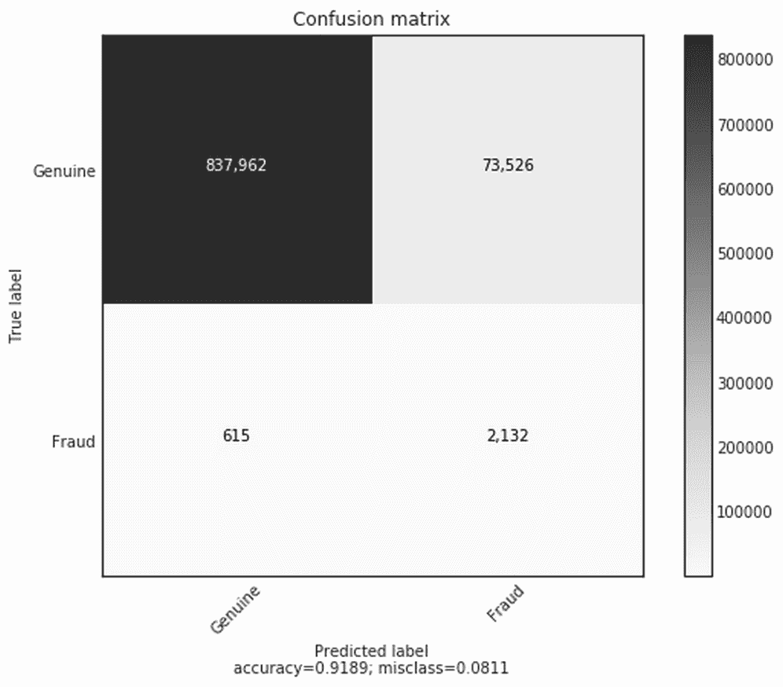

# 第二章：将机器学习应用于结构化数据

结构化数据是指任何存在于记录或文件中固定字段内的数据，其中两个典型的例子是关系型数据库和电子表格。通常，结构化数据以表格的形式呈现，其中每一列表示一种数据类型，每一行代表一个新条目。其结构化格式意味着这种类型的数据适合进行经典的统计分析，这也是为什么大多数数据科学和分析工作都集中在结构化数据上的原因。

在日常生活中，结构化数据也是企业最常见的数据类型，而且大多数需要解决的金融领域机器学习问题都涉及以某种方式处理结构化数据。任何现代企业的日常运营都建立在结构化数据的基础上，包括交易、订单簿、期权价格和供应商，这些通常是以电子表格或数据库的形式收集的信息。

本章将带你解决一个涉及信用卡欺诈的结构化数据问题，我们将通过特征工程成功地从数据集中识别出欺诈交易。同时，我们还将介绍**端到端**（**E2E**）方法的基础知识，以便我们可以解决常见的金融问题。

欺诈是所有金融机构不得不应对的一个不幸现实。这是企业保护其系统与欺诈者试图突破现有保护措施之间的持续博弈。长期以来，欺诈检测依赖于简单的启发式方法。例如，在你通常不居住的国家发生的大额交易，很可能会导致该交易被标记为可疑。

然而，随着欺诈者不断理解并规避规则，信用卡提供商正在部署越来越复杂的机器学习系统来应对这一挑战。

本章中，我们将探讨一家真实银行如何处理欺诈问题。这是一个现实世界的案例，展示了一个数据科学团队如何从启发式基线开始，逐步理解其特征，并从中构建越来越复杂的机器学习模型来检测欺诈行为。尽管我们使用的数据是合成的，但我们将采用的开发过程和工具与国际零售银行每天使用的工具和流程类似。

那么你从哪里开始呢？用我曾经与一位匿名欺诈检测专家交谈时的话来说，*“我不断思考如果我要从雇主那里偷钱，我会怎么做，然后我创造一些特征来捕捉我的抢劫行为。要抓住一个欺诈者，就要像欺诈者一样思考。”* 然而，即使是最有创造力的特征工程师，也未必能发现所有细微且有时是反直觉的欺诈迹象，这就是为什么业界正逐渐转向完全端到端（E2E）训练的系统。这些系统除了机器学习外，还将是本章的重点，我们将在本章中探讨几种常用的欺诈标记方法。

本章将作为第六章的一个重要基础，*使用生成模型*，在该章中我们将再次回顾信用卡欺诈问题，构建一个完整的端到端（E2E）模型，使用自编码器。

# 数据

我们将使用的数据集是一个由支付模拟器生成的合成交易数据集。本案例研究的目标以及本章的重点是从数据集中找出欺诈交易，这是许多金融机构面临的经典机器学习问题。

### 注意

**注意**：在继续之前，本章的数字版代码以及交互式笔记本可以通过以下两个链接在线访问：

本章的代码可以在以下网址找到交互式笔记本：[`www.kaggle.com/jannesklaas/structured-data-code`](https://www.kaggle.com/jannesklaas/structured-data-code)

代码也可以在 GitHub 上找到，在本书的代码库中：[`github.com/PacktPublishing/Machine-Learning-for-Finance`](https://github.com/PacktPublishing/Machine-Learning-for-Finance)

我们使用的数据集来源于论文*PaySim: A financial mobile money simulator for fraud detection*，作者为 E. A. Lopez-Rojas、A. Elmir 和 S. Axelsson。该数据集可以在 Kaggle 上找到，网址为：[`www.kaggle.com/ntnu-testimon/paysim1`](https://www.kaggle.com/ntnu-testimon/paysim1)。

在我们下一页进行详细讲解之前，先花点时间看看我们将在本章中使用的数据集。请记住，你可以通过前面的链接下载数据。

| 步骤 | 类型 | 金额 | nameOrig | 原始旧余额 | 原始新余额 | nameDest | 目的地旧余额 | 目的地新余额 | 是否欺诈 | 是否标记为欺诈 |
| --- | --- | --- | --- | --- | --- | --- | --- | --- | --- | --- |
| 1 | PAYMENT | 9839.64 | C1231006815 | 170136.0 | 160296.36 | M1979787155 | 0.0 | 0.0 | 0 | 0 |
| 1 | PAYMENT | 1864.28 | C1666544295 | 21249.0 | 19384.72 | M2044282225 | 0.0 | 0.0 | 0 | 0 |
| 1 | TRANSFER | 181.0 | C1305486145 | 181.0 | 0.0 | C553264065 | 0.0 | 0.0 | 1 | 0 |
| 1 | CASH_OUT | 181.0 | C840083671 | 181.0 | 0.0 | C38997010 | 21182.0 | 0.0 | 1 | 0 |
| 1 | PAYMENT | 11668.14 | C2048537720 | 41554.0 | 29885.86 | M1230701703 | 0.0 | 0.0 | 0 | 0 |
| 1 | PAYMENT | 7817.71 | C90045638 | 53860.0 | 46042.29 | M573487274 | 0.0 | 0.0 | 0 | 0 |
| 1 | 支付 | 7107.77 | C154988899 | 183195.0 | 176087.23 | M408069119 | 0.0 | 0.0 | 0 | 0 |
| 1 | 支付 | 7861.64 | C1912850431 | 176087.23 | 168225.59 | M633326333 | 0.0 | 0.0 | 0 | 0 |
| 1 | 支付 | 4024.36 | C1265012928 | 2671.0 | 0.0 | M1176932104 | 0.0 | 0.0 | 0 | 0 |
| 1 | 借记 | 5337.77 | C712410124 | 41720.0 | 36382.23 | C195600860 | 41898.0 | 40348.79 | 0 | 0 |

如第一行所示，数据集有 11 列。在继续之前，让我们先解释一下每一列代表什么：

+   **step**: 映射时间，每一步对应一个小时。

+   **type**: 交易类型，可以是 CASH_IN、CASH_OUT、DEBIT、PAYMENT 或 TRANSFER。

+   **amount**: 交易金额。

+   **nameOrig**: 发起交易的来源账户。C 表示客户账户，而 M 表示商户账户。

+   **oldbalanceOrig**: 来源账户的旧余额。

+   **newbalanceOrig**: 交易后来源账户的最新余额。

+   **nameDest**: 目标账户。

+   **oldbalanceDest**: 目标账户的旧余额。对于商户账户（账户名以 M 开头），此信息不可用。

+   **newbalanceDest**: 目标账户的最新余额。商户账户没有此信息。

+   **isFraud**: 交易是否为欺诈交易。

+   **isFlaggedFraud**: 系统是否已将交易标记为欺诈。

在上面的表格中，我们可以看到 10 行数据。值得注意的是，我们的总数据集中约有 630 万个交易记录，所以我们所看到的只是总数的一小部分。由于我们关注的欺诈仅发生在标记为 TRANSFER 或 CASH_OUT 的交易中，因此其他所有交易都可以去除，这样我们剩下的约有 280 万个样本可供处理。

# 启发式、特征基础和 E2E 模型

在我们开始开发用于检测欺诈的模型之前，先花一点时间暂停一下，思考一下我们可以构建的不同类型的模型。

+   基于启发式的模型是一种简单的“经验法则”，完全由人类开发。通常，启发式模型源于对问题的专家知识。

+   基于特征的模型在很大程度上依赖于人类修改数据，以创建新的、有意义的特征，然后将这些特征输入到（简单的）机器学习算法中。这种方法将专家知识与数据学习相结合。

+   E2E 模型完全通过原始数据进行学习。没有使用人类的专业知识，模型直接从观察中学习一切。

在我们的例子中，可以创建一个基于启发式的模型，将所有类型为 TRANSFER 且金额超过 20 万美元的交易标记为欺诈。基于启发式的模型具有开发速度快、实施简便的优势；然而，这也有代价，它们的性能通常较差，欺诈者可以轻松地利用系统漏洞。假设我们采用了前述的启发式模型，欺诈者将金额设置为 199,999 美元，低于欺诈限制，就可以避免检测。

在交易领域，一个重要的启发式方法是动量策略。动量策略是指押注某只正在上涨的股票将继续上涨，人们会购买该股票。虽然这一策略看起来过于简单，似乎并不怎么样，但事实上，它是一种相当成功的策略，许多高频交易和量化交易公司如今都在使用。

为了创建特征，专家们设计出能够区分欺诈交易和真实交易的指标。这通常通过统计数据分析来完成，与我们之前提出的基于启发式的模型相比，虽然时间较长，但能够带来更好的结果。

基于特征工程的模型处于数据与人工规则之间的中间地带，人类的知识和创造力被用来设计好的特征，而数据和机器学习则用于从这些特征中创建模型。

E2E 模型完全依赖收集到的数据进行学习，而不使用专家知识。如前所述，这种方法通常能产生更好的结果，但代价是完成时间较长。该方法还包含一些值得考虑的额外因素。例如，收集所需的大量数据是一项昂贵的任务，因为需要人工标注数百万条记录。

尽管对于许多业内人士来说，他们认为发布一个差的模型通常比什么都不发布要好。毕竟，有一些防欺诈保护总比没有要强。

使用一种启发式方法，哪怕它能漏过一半的欺诈交易，也总比完全没有欺诈检测要好。图表展示了我们之前介绍的三种模型的表现，以及它们实现所需的时间。


在开发过程中使用的方法和系统的性能

最好的方法是将三者结合使用。如果我们部署一个符合任务基本要求的启发式模型，它就可以投入使用。通过这种方法，启发式模型成为任何其他方法必须超越的基准。一旦启发式模型部署完成，所有的努力应当转向构建基于特征的模型，当它超越最初部署的启发式模型后，就可以投入使用，同时继续优化模型。

正如我们之前讨论过的，基于特征的模型通常在结构化数据任务中表现得相当不错；这使得公司有时间进行耗时且昂贵的构建端到端（E2E）模型的工作，一旦新模型在性能上超越基于特征的模型，就可以投入使用。现在我们理解了要构建的模型类型，让我们来看一下构建这些模型所需的软件。

# 机器学习软件栈

在本章中，我们将使用一系列常见的机器学习库。我们先花点时间看一下我们的软件栈，它包括以下软件：

+   **Keras**：一个神经网络库，可以作为 TensorFlow 的简化接口。

+   **NumPy**：为大型、多维数组提供支持，并包含广泛的数学函数库。

+   **Pandas**：一个用于数据处理和分析的库。它类似于微软的 Excel，但在 Python 中，提供了用于处理表格的结构和操作这些表格的工具。

+   **Scikit-learn**：一个机器学习库，提供了广泛的算法和工具。

+   **TensorFlow**：一个数据流编程库，有助于处理神经网络。

+   **Matplotlib**：一个绘图库。

+   **Jupyter**：一个开发环境。本书中的所有代码示例都可以在 Jupyter Notebooks 中找到。

本书的大部分内容都专注于使用 Keras 库，而本章则广泛使用了其他提到的库。这里的目标并不是教你所有不同库的技巧和窍门，而是展示它们如何集成到创建预测模型的过程中。

### 注意

**注意**：本章所需的所有库在 Kaggle 内核中默认安装。如果你在本地运行此代码，请参考 第一章，*神经网络与基于梯度的优化*，并安装所需的所有库。

# 启发式方法

在本章前面，我们介绍了将用于检测欺诈的三个模型，现在是时候更详细地探索它们了。我们将从启发式方法开始。

让我们从定义一个简单的启发式模型开始，并衡量它在衡量欺诈率方面的效果。

## 使用启发式模型进行预测

我们将使用启发式方法对整个训练数据集进行预测，以了解这个启发式模型在预测欺诈交易方面的效果。

以下代码将创建一个新列 `Fraud_Heuristic`，并在类型为 `TRANSFER` 且金额超过 $200,000 的行中分配值 `1`：

```py
df['Fraud_Heuristic '] = np.where(((df['type'] == 'TRANSFER') &(df['amount'] > 200000)),1,0)
```

只需两行代码，你就可以轻松看出这样一个简单的度量指标如何轻松编写，并且迅速部署。

## F1 分数

我们必须考虑的一件重要事情是需要一个通用的度量标准，以便对我们的所有模型进行评估。在第一章中，*神经网络与基于梯度的优化*，我们使用准确率作为我们的模拟工具。然而，正如我们所见，欺诈交易远少于真实交易。因此，一个将所有交易分类为真实交易的模型，可能会有一个非常高的准确率。

解决这种偏斜分布问题的一种度量是 F1 分数，它考虑了真正阳性和假阳性以及假阴性，如下图所示：

|   | 预测为负 | 预测为正 |
| --- | --- | --- |
| 实际负例 | **真正阴性** (**TN**) | **假阳性** (**FP**) |
| 实际正例 | **假阴性** (**FN**) | **真正阳性** (**TP**) |

我们可以首先计算模型的精准度，精准度指定了预测为正的样本中，实际为正的比例，公式如下：


召回率衡量的是预测为正例的样本占实际正例的比例，公式如下：


F1 分数是通过计算两种度量的调和平均值来得出的，具体公式如下：


在 Python 中计算此度量时，我们可以使用 scikit-learn 的 `metrics` 模块，简称 sklearn：

```py
from sklearn.metrics import f1_score
```

给定我们所做的预测，现在我们可以使用以下命令轻松计算 F1 分数：

```py
f1_score(y_pred=df['Fraud_Heuristic '],y_true=df['isFraud'])
```

```py
out: 0.013131315551742895

```

你会看到前面的命令输出了一个数字——从 0.013131315 开始——这个数字的意思是我们的启发式模型表现不太好，因为最好的 F1 分数是 1，最差的是 0。在我们的例子中，这个数字代表了被标记为欺诈的所有样本中，正确识别出欺诈行为的比例的调和平均值。

## 使用混淆矩阵进行评估

一种更具定性且易于解释的评估模型的方式是使用混淆矩阵。顾名思义，混淆矩阵展示了我们的分类器如何混淆各类。

首先，让我们研究一下 `plot_confusion_matrix` 函数的代码附录：

```py
from sklearn.metrics import confusion_matrix cm = confusion_matrix(
    y_pred=df['Fraud_Heuristic '],y_true=df['isFraud']) 
plot_confusion_matrix(cm,['Genuine','Fraud'])
```

当我们运行时，产生以下图形：


启发式模型的混淆矩阵

那么，这个模型的准确度如何呢？从我们的混淆矩阵中可以看到，在我们有 2,770,409 个样本的数据集中，2,355,826 个被正确分类为真实交易，而 406,370 个被错误分类为欺诈。实际上，只有 2,740 个样本被正确分类为欺诈。

当我们的启发式模型将某笔交易分类为欺诈时，99.3%的情况下是准确的。总共只有 34.2%的欺诈被捕获。所有这些信息都被纳入了我们制定的 F1 分数中。然而，正如我们所见，从生成的混淆矩阵图形中更容易看出这一点。我们同时使用启发式模型和 F1 分数的原因是，良好的实践是拥有一个可以告诉我们哪个模型更好的单一数字，同时也提供一个更具图形化的视角来展示该模型的优势。

直白地说，我们的启发式模型表现得相当糟糕，仅检测到 34.2%的欺诈，这是远远不够的。因此，在接下来的部分中，我们将使用其他两种方法，看看是否能够做得更好。

# 特征工程方法

特征工程的目标是利用人类的定性洞察力来创建更好的机器学习模型。人类工程师通常使用三种类型的洞察力：*直觉*、*专家领域知识*和*统计分析*。很多时候，仅凭直觉就能为某个问题提出特征。

例如，在我们的欺诈案件中，直觉上认为欺诈者会为他们的欺诈计划创建新账户，而不会使用他们支付日常开销的同一银行账户。

领域专家能够利用他们对问题的深入了解，提出其他类似的直觉例子。他们会更了解欺诈者的行为，并能够设计出能够指示这种行为的特征。所有这些直觉通常都会通过统计分析得到验证，统计分析甚至可以用来开启发现新特征的可能性。

统计分析有时能发现一些奇特的模式，这些模式可以转化为预测特征。然而，在使用这种方法时，工程师必须警惕**数据陷阱**。数据中找到的预测特征可能仅仅存在于该数据中，因为任何数据集只要经过足够长时间的处理，都会产生一个预测特征。

数据陷阱指的是工程师在数据中无限挖掘特征，却从不质疑他们所寻找的特征是否相关。

陷入数据陷阱的数据科学家们不停地发现特征，然而过后才意识到，带有这些特征的模型实际上效果并不好。在训练集找到强预测特征对数据科学团队来说就像是毒品。是的，它有一个即时的回报，一个让人感觉自己技能被验证的快速胜利。然而，像许多毒品一样，数据陷阱可能导致后遗症，团队发现几周或几个月的工作寻找这些特征，实际上是无用的。

花一分钟问问自己，你是否处于这种状态？如果你发现自己一直在做分析、转换数据、追逐相关性值，那么你很可能已经陷入了数据陷阱。

为了避免数据陷阱，建立一个**定性理由**来解释为何这个统计预测特征存在，以及它为什么也应该存在于数据集之外是非常重要的。通过建立这个理由，你将保持自己和团队的警觉，避免创造代表噪声的特征。数据陷阱是人类形式的过拟合和在噪声中寻找模式的问题，这对模型也是一个问题。

人类可以利用他们的定性推理能力来避免拟合噪声，这是人类相较于机器的一个巨大优势。如果你是数据科学家，你应该运用这一技能来创建更具普适性的模型。

本节的目标不是展示特征工程可以在此数据集上执行的所有特征，而只是突出这三种方法以及它们如何转化为特征。

## 来自直觉的一个特点——欺诈者不睡觉

即使对欺诈行为了解不多，我们也能凭直觉描述欺诈者为在黑暗中活动的可疑人物。在大多数情况下，真实的交易发生在白天，因为人们在夜晚休息。

我们数据集中的时间步骤代表一个小时。因此，我们只需通过 24 取余，就能生成一天中的时间，正如这段代码所示：

```py
df['hour'] = df['step'] % 24
```

从那里，我们可以计算不同时间的欺诈和真实交易数量。为了计算这个，我们必须运行以下代码：

```py
frauds = []
genuine = []
for i in range(24):
    f = len(df[(df['hour'] == i) & (df['isFraud'] == 1)])
    g = len(df[(df['hour'] == i) & (df['isFraud'] == 0)])
    frauds.append(f)
    genuine.append(g)
```

然后，最后我们可以将一天中每个小时内的真实和欺诈交易的比例绘制成图表。为此，我们必须运行以下代码：

```py
fig, ax = plt.subplots(figsize=(10,6)) 
ax.plot(genuine/np.sum(genuine), label='Genuine') 
ax.plot(frauds/np.sum(frauds),dashes=[5, 2], label='Fraud') 
plt.xticks(np.arange(24))
legend = ax.legend(loc='upper center', shadow=True)
```


一天中每小时进行的欺诈和真实交易的比例

如我们在前面的图表中所见，夜间的真实交易显著减少，而欺诈行为则持续发生。为了确认夜间是我们有可能抓到欺诈的时段，我们还可以将欺诈交易数量作为所有交易的比例进行绘制。为此，我们必须运行以下命令：

```py
fig, ax = plt.subplots(figsize=(10,6))
ax.plot(np.divide(frauds,np.add(genuine,frauds)), label='Share of fraud')
plt.xticks(np.arange(24))
legend = ax.legend(loc='upper center', shadow=True)
```


每小时欺诈交易的比例

一旦我们运行那段代码，就能看到大约在早上 5 点时，超过 60% 的所有交易似乎是欺诈性的，这表明这是一天中抓住欺诈行为的最佳时机。

## 专家见解——先转账，再提现

数据集的描述伴随着另一个解释，解释了欺诈者的预期行为。首先，他们将钱转到他们控制的银行账户。然后，他们从 ATM 提现。

我们可以通过运行以下代码，检查是否有欺诈转账目标账户是欺诈提现的来源：

```py
dfFraudTransfer = df[(df.isFraud == 1) & (df.type == 'TRANSFER')]
dfFraudCashOut = df[(df.isFraud == 1) & (df.type == 'CASH_OUT')]
dfFraudTransfer.nameDest.isin(dfFraudCashOut.nameOrig).any()
```

```py
out: False

```

根据输出，似乎没有欺诈转账是欺诈性现金提取的源头。专家预期的行为在我们的数据中没有显示出来。这可能意味着两件事：首先，可能是欺诈者现在的行为方式不同；或者是我们的数据没有捕捉到他们的行为。无论哪种情况，我们无法在这里利用这一发现进行预测建模。

## 统计学上的怪异现象 —— 余额错误

对数据的进一步检查显示，有些交易中，目标账户的旧余额和新余额都是零，尽管交易金额不为零。这很奇怪，或者说是一种怪异现象，因此我们需要调查这种异常是否具有预测能力。

首先，我们可以通过运行以下代码来计算具有此属性的欺诈交易的比例：

```py
dfOdd = df[(df.oldBalanceDest == 0) &
           (df.newBalanceDest == 0) & 
           (df.amount)]
len(dfOdd[(df.isFraud == 1)]) / len(dfOdd)
```

```py
out: 0.7046398891966759

```

如你所见，欺诈交易的比例为 70%，因此这种怪异现象似乎是检测交易欺诈的一个好特征。然而，我们需要问自己，这种怪异现象最初是如何进入我们数据的。一种可能性是这些交易根本没有通过。

这种情况可能由多种原因引起，包括可能存在另一个欺诈防范系统拦截了这些交易，或者交易的原始账户资金不足。

虽然我们无法验证是否有其他欺诈防范系统在运行，但我们可以检查原始账户是否资金不足。为此，我们需要运行以下代码：

```py
len(dfOdd[(dfOdd.oldBalanceOrig <= dfOdd.amount)]) / len(dfOdd)
```

```py
out: 0.8966412742382271

```

正如我们在输出中看到的，接近 90% 的异常交易在其原始账户中资金不足。由此，我们可以构建一个推理，即欺诈者比普通人更频繁地试图将银行账户中的所有资金取光。

我们需要这个推理来避免数据陷阱。一旦建立，推理必须不断地被审视。在我们的案例中，它未能解释 10% 的异常交易，如果这个比例上升，可能会影响我们模型在生产中的表现。

# 准备 Keras 库的数据

在第一章，*神经网络与基于梯度的优化*中，我们看到神经网络只接受数字作为输入。我们数据集中的问题是，表格中的并非所有信息都是数字，有些是以字符的形式呈现的。

因此，在这一部分，我们将专注于为 Keras 准备数据，以便我们能够有意义地处理它。

在我们开始之前，先来看一下三种数据类型：*名义型*、*有序型*和*数值型*：

+   **名义数据**：这种数据是离散的类别，不能进行排序。在我们的例子中，转账类型是一个名义变量。有四种离散类型，但没有意义对它们进行排序。例如，TRANSFER 不能比 CASH_OUT 大，因此，它们只是独立的类别。

+   **顺序数据**：这种数据也有离散的类别，但与名义数据不同，它是可以排序的。例如，如果咖啡有大、中、小三种尺寸，这些是不同的类别，因为它们是可以比较的。大杯比小杯装的咖啡更多。

+   **数值数据**：这种数据是可以排序的，而且我们还可以对其进行数学运算。例如，在我们的数据中，资金数量是一个数值数据，我们不仅可以比较数量，还可以进行加减操作。

名义数据和顺序数据都是**类别数据**，因为它们描述的是离散类别。虽然数值数据与神经网络的兼容性很好，但类别数据需要特别处理。

## 独热编码

编码类别数据最常用的方法叫做**独热编码**。在独热编码中，我们为每个类别创建一个新的变量，即所谓的**虚拟变量**。然后，如果交易属于某个特定类别，我们就将虚拟变量设置为 1，否则设置为 0。

我们可以将此方法应用到我们的数据集中的一个示例如下：

所以，在进行独热编码之前，类别数据看起来是这样的：

| Transaction | Type |
| --- | --- |
| 1 | TRANSFER |
| 2 | CASH_OUT |
| 3 | TRANSFER |

这是独热编码后数据的样子：

| Transaction | Type_TRANSFER | Type_CASH_OUT |
| --- | --- | --- |
| 1 | 1 | 0 |
| 2 | 0 | 1 |
| 3 | 1 | 0 |

Pandas 软件库提供了一个函数，允许我们直接创建虚拟变量。然而，在这样做之前，为所有实际的交易类型添加`Type_`前缀是有意义的。虚拟变量将以该类别命名。通过在前面添加`Type_`，我们知道这些虚拟变量表示的是类型。

以下代码行做了三件事。首先，`df['type'].astype(str)`将**Type**列中的所有条目转换为字符串。其次，`Type_`前缀被添加到字符串中。第三，新的组合字符串列将替代原有的**Type**列：

```py
df['type'] = 'Type_' + df['type'].astype(str)
```

我们现在可以通过运行以下代码获取虚拟变量：

```py
dummies = pd.get_dummies(df['type'])
```

我们应该注意到，`get_dummies()`函数会创建一个新的数据框。接下来，我们将这个数据框附加到主数据框中，这可以通过运行以下代码来实现：

```py
df = pd.concat([df,dummies],axis=1)
```

`concat()`方法，如前面的代码所示，将两个数据框连接起来。我们沿着轴 1 进行连接，将数据框作为新列添加。现在虚拟变量已经添加到主数据框中，我们可以通过运行以下代码删除原有列：

```py
del df['type']
```

就这样！我们已经将类别变量转换为神经网络可以使用的形式。

## 实体嵌入

在本节中，我们将展示如何同时使用嵌入和 Keras 函数式 API，向您展示一般的工作流程。关于这两个主题，我们在第五章，*使用自然语言处理解析文本数据*中会做详细介绍，在那里我们将超越这里呈现的基本概念，并开始讨论像实现这样的话题。

如果你现在还不完全理解所有的内容也没关系；毕竟这是一个高级章节。如果你希望使用这两种技术，在阅读完本书后，你将为使用它们做好充分的准备，因为我们在书中详细解释了这两种方法的不同要素。

在本节中，我们将为类别数据创建嵌入向量。在开始之前，我们需要理解嵌入向量是表示类别值的向量。我们将嵌入向量作为神经网络的输入。我们与神经网络一起训练嵌入向量，这样随着时间的推移，我们可以获得更有用的嵌入。嵌入是我们手头非常有用的工具。

为什么嵌入如此有用？嵌入不仅减少了与独热编码相比所需的编码维度数量，从而减少了内存使用，而且它们还减少了输入激活的稀疏性，这有助于减少过拟合，并且它们能够将语义含义编码为向量。正是这些优势使得嵌入对于文本非常有用，第五章，*使用自然语言处理解析文本数据*中同样让它们对于类别数据非常有用。

### 类别的分词

与文本一样，我们必须在将输入数据传递到嵌入层之前进行分词处理。为此，我们需要创建一个映射字典，将类别映射到令牌。我们可以通过运行以下代码来实现：

```py
map_dict = {}
for token, value in enumerate(df['type'].unique()):
    map_dict[value] = token
```

这段代码会遍历所有独特的类别类型，并按顺序递增计数。第一个类别得到令牌 0，第二个得到令牌 1，依此类推。我们的`map_dict`看起来是这样的：

```py
{'CASH_IN': 4, 'CASH_OUT': 2, 'DEBIT': 3, 'PAYMENT': 0, 'TRANSFER': 1}

```

我们现在可以将此映射应用于我们的数据框：

```py
df["type"].replace(map_dict, inplace=True)
```

结果是，所有类型现在将被它们的令牌替代。

我们需要单独处理数据框中的非类别值。我们可以像这样创建一个不属于类型且不是目标的列列表：

```py
other_cols = [c for c in df.columns if ((c != 'type') and (c != 'isFraud'))]
```

### 创建输入模型

我们正在创建的模型将有两个输入：一个是带有嵌入层的类型输入，另一个是所有其他非类别变量输入。为了便于以后将它们组合，我们将使用两个数组跟踪它们的输入和输出：

```py
inputs = []
outputs = []
```

作为类型输入的模型接收一维输入，并通过嵌入层进行解析。嵌入层的输出随后会被重塑为平坦数组，正如我们在以下代码中看到的那样：

```py
num_types = len(df['type'].unique()) 
type_embedding_dim = 3

type_in = Input(shape=(1,))
type_embedding = Embedding(num_types,type_embedding_dim,input_ length=1)(type_in)
type_out = Reshape(target_shape=(type_embedding_dim,))(type_embedding)

type_model = Model(type_in,type_out)

inputs.append(type_in)
outputs.append(type_out)
```

`type`嵌入层有三层。这是一个任意的选择，尝试不同维度的数量可能会提高结果。

对于所有其他输入，我们创建一个新的输入，该输入的维度与非类别变量的数量相同，并由一个没有激活函数的单一全连接层组成。全连接层是可选的；输入也可以直接传递到头模型中。也可以添加更多的层，包括以下几种：

```py
num_rest = len(other_cols)

rest_in = Input(shape = (num_rest,)) 
rest_out = Dense(16)(rest_in)

rest_model = Model(rest_in,rest_out)

inputs.append(rest_in)
outputs.append(rest_out)
```

既然我们已经创建了两个输入模型，我们可以将它们连接起来。在这两个连接的输入上，我们还将构建我们的头模型。为了开始这个过程，我们首先必须运行以下代码：

```py
concatenated = Concatenate()(outputs)
```

然后，通过运行以下代码，我们可以构建并编译整个模型：

```py
x = Dense(16)(concatenated)
x = Activation('sigmoid')(x)
x = Dense(1)(concatenated)
model_out = Activation('sigmoid')(x)

merged_model = Model(inputs, model_out)
merged_model.compile(loss='binary_crossentropy',optimizer='adam', metrics=['accuracy'])
```

### 训练模型

在这一部分，我们将训练一个具有多个输入的模型。为此，我们需要为每个输入提供一个*X*值的列表。因此，首先我们必须拆分我们的数据框。我们可以通过运行以下代码来实现：

```py
types = df['type']
rest = df[other_cols]
target = df['isFraud']
```

然后，我们可以通过提供两个输入和目标的列表来训练模型，正如我们在以下代码中所看到的：

```py
history = merged_model.fit([types.values,rest.values],target.values, epochs = 1, batch_size = 128)
```

```py
out:
Epoch 1/1
6362620/6362620 [==============================] - 78s 12us/step - loss: 0.0208 - acc: 0.9987

```

# 使用 Keras 创建预测模型

我们的数据现在包含以下列：

```py
amount, 
oldBalanceOrig, 
newBalanceOrig, 
oldBalanceDest, 
newBalanceDest, 
isFraud, 
isFlaggedFraud, 
type_CASH_OUT, 
type_TRANSFER, isNight
```

现在我们已经得到了列，我们的数据已经准备好了，可以用它来创建一个模型。

## 提取目标

为了训练模型，神经网络需要一个目标。在我们的案例中，`isFraud`就是目标，因此我们必须将其从其他数据中分离出来。我们可以通过运行以下代码来实现：

```py
y_df = df['isFraud']
x_df = df.drop('isFraud',axis=1)
```

第一步只返回`isFraud`列，并将其赋值给`y_df`。

第二步返回除了`isFraud`之外的所有列，并将其赋值给`x_df`。

我们还需要将数据从 pandas `DataFrame` 转换为 NumPy 数组。pandas `DataFrame` 是建立在 NumPy 数组之上的，但它包含许多额外的功能，使得我们之前的所有预处理工作得以实现。然而，要训练神经网络，我们只需要底层数据，我们可以通过简单地运行以下代码来获取：

```py
y = y_df.values
X = x_df.values
```

## 创建测试集

当我们训练模型时，我们面临**过拟合**的风险。过拟合意味着我们的模型记住了训练数据集中*x*和*y*之间的映射关系，但没有找到描述*x*和*y*之间真实关系的函数。这是有问题的，因为一旦我们将模型应用到**样本外**的数据上，即在训练集之外的数据，它可能会表现得非常差。为了防止这种情况发生，我们将创建一个所谓的**测试集**。

测试集是一个保留数据集，我们只在认为模型已经表现得相当不错时，用它来评估模型的表现，以查看模型在尚未见过的数据上的表现如何。测试集通常是从完整数据中随机抽样得到的。Scikit-learn 提供了一个方便的函数来执行这一操作，正如我们在以下代码中所看到的：

```py
from sklearn.model_selection import train_test_split
X_train, X_test, y_train, y_test = train_test_split(X, y, test_size=0.33, random_state=42)
```

元素`train_test_split`会随机地将行分配到训练集或测试集中。你可以指定`test_size`，即进入测试集的数据比例（在我们的例子中是 33%），以及随机状态。指定`random_state`可以确保尽管过程是伪随机的，但它总是返回相同的拆分，这使得我们的工作更具可重现性。请注意，数字的实际选择（例如`42`）并不重要。重要的是在所有实验中使用相同的数字。

## 创建验证集

现在你可能会忍不住尝试不同的模型，直到在测试集上获得非常高的表现。然而，问问自己：你怎么知道你没有选择一个偶然在测试集上表现良好，但在实际生活中无法应用的模型呢？

答案是，每次你在测试集上进行评估时，你都会产生一点“信息泄露”，也就是说，测试集的信息通过影响你选择的模型泄漏到模型中。逐渐地，测试集的价值会降低。验证集是一种“脏测试集”，你可以用它频繁地测试模型的外部样本表现，而不必担心。尽管需要注意的是，我们不希望过于频繁地使用测试集，但它仍然会被用来衡量外部样本表现。

为此，我们将创建一个“验证集”，也叫做开发集。

我们可以像创建测试集一样通过再次拆分训练数据来完成此操作，如下代码所示：

```py
X_train, X_test, y_train, y_test = train_test_split(X_train, y_train, test_size=0.1, random_state=42)
```

## 过采样训练数据

记住，在我们的数据集中，只有极小一部分交易是欺诈性的，而一个总是将交易分类为真实交易的模型将会有非常高的准确率。为了确保我们在真实关系上训练我们的模型，我们可以**过采样**训练数据。

这意味着我们会将一些欺诈性数据添加到我们的数据集中，直到我们拥有与真实交易相等数量的欺诈交易。

### 注意

**注意**：一个用于这种任务的有用库是`imblearn`，它包含了 SMOTE 函数。请参见，[`contrib.scikitlearn.org/imbalanced-learn/`](http://contrib.scikitlearn.org/imbalanced-learn/)。

**合成少数类过采样技术**（**SMOTE**）是一种巧妙的过采样方法。这种方法试图在保持类别决策边界不变的情况下创建新样本。我们可以通过运行以下代码轻松地使用 SMOTE 进行过采样：

```py
From imblearn.over_sampling import SMOTE
sm = SMOTE(random_state=42)
X_train_res, y_train_res = sm.fit_sample(X_train, y_train)
```

## 构建模型

我们已经成功解决了几个关键的学习点，所以现在终于是时候构建神经网络了！正如在第一章中所述，*神经网络与基于梯度的优化*，我们需要使用以下代码导入所需的 Keras 模块：

```py
from keras.models import Sequential
from keras.layers import Dense, Activation
```

在实际应用中，许多结构化数据问题需要非常低的学习率。为了设置梯度下降优化器的学习率，我们还需要导入优化器。我们可以通过运行以下代码实现：

```py
from keras.optimizers import SGD
```

### 创建一个简单的基准模型

在深入研究更复杂的模型之前，最好从一个简单的逻辑回归基准开始。这是为了确保我们的模型能够成功训练。

要创建一个简单的基准模型，我们需要运行以下代码：

```py
model = Sequential()
model.add(Dense(1, input_dim=9))
model.add(Activation('sigmoid'))
```

你可以看到这里的逻辑回归模型，它与单层神经网络是相同的：

```py
model.compile(loss='binary_crossentropy', optimizer=SGD(lr=1e-5), metrics=['acc'])
```

在这里，我们将编译模型。我们不仅仅是传递`SGD`来指定随机梯度下降（Stochastic Gradient Descent）的优化器，而是创建一个自定义的 SGD 实例，在其中将学习率设置为 0.00001。在这个例子中，由于我们使用 F1 分数来评估模型，所以不需要跟踪准确率。尽管如此，它仍然揭示了一些有趣的行为，正如你在以下代码中看到的：

```py
model.fit(X_train_res,y_train_res, epochs=5, batch_size=256, validation_data=(X_val,y_val))
```

注意，我们通过创建一个元组将验证数据传递给 Keras，在其中存储数据和标签。我们将训练这个模型 5 个周期：

```py
Train on 3331258 samples, validate on 185618 samples Epoch 1/5
3331258/3331258 [==============================] - 20s 6us/step - loss: 
3.3568 - acc: 0.7900 - val_loss: 3.4959 - val_acc: 0.7807 Epoch 2/5
3331258/3331258 [==============================] - 20s 6us/step - loss: 
3.0356 - acc: 0.8103 - val_loss: 2.9473 - val_acc: 0.8151 Epoch 3/5
3331258/3331258 [==============================] - 20s 6us/step - loss: 
2.4450 - acc: 0.8475 - val_loss: 0.9431 - val_acc: 0.9408 Epoch 4/5
3331258/3331258 [==============================] - 20s 6us/step - loss: 
2.3416 - acc: 0.8541 - val_loss: 1.0552 - val_acc: 0.9338 Epoch 5/5
3331258/3331258 [==============================] - 20s 6us/step - loss: 
2.3336 - acc: 0.8546 - val_loss: 0.8829 - val_acc: 0.9446

```

在这里注意几点：首先，我们训练了大约 330 万样本，这比我们最初拥有的数据还要多。这个突然的增加来自于我们在本章早些时候进行的过采样。其次，训练集的准确率明显低于验证集的准确率。这是因为训练集是平衡的，而验证集则不是。

我们通过向训练集添加更多的欺诈案例来对数据进行过采样，欺诈案例的数量比实际生活中更多，正如我们之前讨论的，这有助于我们的模型更好地检测欺诈。如果我们没有进行过采样，我们的模型可能会倾向于将所有交易分类为真实的，因为训练集中的大多数样本都是正常的。

通过添加欺诈案例，我们迫使模型学习欺诈案例的区别。然而，我们希望在真实数据上验证我们的模型。因此，我们的验证集不会人为地包含许多欺诈案例。

一个将所有样本分类为真实的模型在验证集上的准确率将超过 99%，但在训练集上的准确率只有 50%。准确率对于这样不平衡的数据集来说是一个有缺陷的指标。它是一个相对不错的代理，并且比仅仅使用损失函数更具可解释性，这就是为什么我们在 Keras 中仍然追踪准确率的原因。

为了评估我们的模型，我们应该使用本章开头讨论的 F1 分数。然而，由于计算 F1 分数的过程相对较慢，并且会导致训练速度变慢，Keras 无法在训练过程中直接跟踪 F1 分数。

### 注意

**注意**：请记住，在不平衡数据集上的准确率可能非常高，即使模型表现不佳。

如果模型在不平衡验证集上的准确度高于在平衡训练集上的准确度，那么这并不能说明模型表现良好。

比较训练集的表现与之前训练集的表现，验证集的表现与之前验证集的表现。同样，比较训练集和验证集的表现时要小心，尤其是在数据极度不平衡的情况下。然而，如果数据是平衡的，那么比较训练集和验证集的表现是判断过拟合的好方法。

现在我们可以对测试集进行预测，以评估基准模型。我们首先使用 `model.predict` 对测试集进行预测：

```py
y_pred = model.predict(X_test)
```

在评估我们的基准模型之前，我们需要将模型给出的概率转换为绝对预测。在我们的示例中，我们将所有欺诈概率超过 50% 的内容分类为欺诈。为此，我们需要运行以下代码：

```py
y_pred[y_pred > 0.5] = 1
y_pred[y_pred < 0.5] = 0
```

我们的 F1 分数已经比启发式模型好得多，如果你回头看，会发现它仅获得了 0.013131315551742895 的分数：

```py
f1_score(y_pred=y_pred,y_true=y_test)
```

```py
out: 0.054384286716408395

```

通过绘制混淆矩阵，我们可以看到基于特征的模型确实比启发式模型有所改进：

```py
cm = confusion_matrix(y_pred=y_pred,y_true=y_test)
plot_confusion_matrix(cm,['Genuine','Fraud'], normalize=False)
```

这段代码应该会生成以下混淆矩阵：



一个简单 Keras 模型的混淆矩阵

但如果我们想构建能够表达更微妙关系的复杂模型，而不是刚才构建的那个呢？现在我们来做这个吧！

### 构建更复杂的模型

在创建了简单的基准模型之后，我们可以继续构建更复杂的模型。以下代码是一个二层网络的示例：

```py
model = Sequential() 
model.add(Dense(16,input_dim=9)) 
model.add(Activation('tanh')) 
model.add(Dense(1)) 
model.add(Activation('sigmoid'))

model.compile(loss='binary_crossentropy',optimizer=SGD(lr=1e-5), metrics=['acc'])

model.fit(X_train_res,y_train_res, epochs=5, batch_size=256, validation_data=(X_val,y_val))

y_pred = model.predict(X_test)
y_pred[y_pred > 0.5] = 1
y_pred[y_pred < 0.5] = 0
```

运行完那段代码后，我们将再次使用 F1 分数进行基准测试：

```py
f1_score(y_pred=y_pred,y_true=y_test)
```

```py
out: 0.087220701988752675

```

在这种情况下，复杂模型的表现优于之前创建的简单基准模型。看起来将交易数据映射到欺诈的函数是复杂的，且可以通过更深的网络来更好地逼近。

在这一部分中，我们构建并评估了简单和复杂的神经网络模型用于欺诈检测。我们小心地使用验证集来衡量初始的样本外表现。

有了这些，我们可以构建更复杂的神经网络（我们会这样做）。但首先，我们将看看现代企业级机器学习的核心：基于树的方法。

# 基于树的方法简要介绍

任何关于结构化数据的章节，如果没有提到基于树的方法，比如随机森林或 XGBoost，都不算完整。

了解这些方法是很有价值的，因为在结构化数据的预测建模领域，基于树的方法非常成功。然而，它们在更高级的任务中表现不佳，比如图像识别或序列到序列的建模。这也是为什么本书其余部分没有涉及基于树的方法的原因。

### 注意

**注意**：如果你想深入了解 XGBoost，可以查看 XGBoost 文档页面上的教程：[`xgboost.readthedocs.io`](http://xgboost.readthedocs.io)。在网站的**教程**部分，有关于树形方法和梯度提升如何在理论和实践中工作的详细解释。

## 一个简单的决策树

基于树的算法的基本理念就是决策树。决策树通过将数据分割开来，最大化结果之间的差异。

假设一下，我们的`isNight`特征是预测欺诈的最佳特征。决策树会根据交易是否发生在夜间来分割我们的数据集。它会查看所有夜间的交易，寻找下一个最好的欺诈预测特征，然后对所有白天的交易做同样的处理。

Scikit-learn 提供了一个方便的决策树模块。我们可以通过运行以下代码来为我们的数据创建一个决策树：

```py
from sklearn.tree import DecisionTreeClassifier
dtree=DecisionTreeClassifier()
dtree.fit(X_train,y_train)
```

结果树将是这样的：


用于欺诈检测的决策树

像我们创建的简单决策树，可以为数据提供大量的洞察。例如，在我们的决策树中，最重要的特征似乎是原始账户的旧余额，因为它是树中的第一个节点。

## 一个随机森林

简单决策树的一个更高级版本是随机森林，随机森林是决策树的集合。通过从训练数据中取子集并在这些子集上训练决策树来训练森林。

通常，这些子集并不包括训练数据的每个特征。通过这种方式，不同的决策树可以拟合数据的不同方面，从而整体上捕获更多的信息。创建了足够多的树之后，它们的预测结果会被平均化，最终得出预测结果。

这个理念是，树形结构所呈现的错误是无关的，因此通过使用多棵树，你可以抵消这些错误。你可以像这样创建和训练一个随机森林分类器：

```py
from sklearn.ensemble import RandomForestClassifier
rf = RandomForestClassifier(n_estimators=10,n_jobs=-1)
rf.fit(X_train_res,y_train_res)
```

你会注意到，在我们刚刚生成的代码中，随机森林比神经网络需要调节的参数要少得多。在这种情况下，我们只需要指定估计器的数量，也就是我们希望森林中包含的树的数量。

`n_jobs`参数告诉随机森林我们希望并行训练多少棵树。请注意，`-1`表示“使用所有 CPU 核心”：

```py
y_pred = rf.predict(X_test)
f1_score(y_pred=y_pred,y_true=y_test)
```

```py
out: 0.8749502190362406

```

随着 F1 分数接近 1（这是最高分），随机森林的表现比神经网络好一个数量级。其混淆图如下所示，显示随机森林显著减少了假阳性的数量：


随机森林的混淆矩阵

浅层学习方法，如随机森林，通常在相对简单的问题上表现得比深度学习更好。原因在于，简单的低维数据关系对于深度学习模型来说可能很难学习，因为深度学习模型需要精确拟合多个参数，才能匹配简单的函数。

正如我们将在本书后续章节中看到的那样，一旦关系变得更加复杂，深度学习就能展现出它的优势。

## XGBoost

**XGBoost**代表**极限梯度提升**。梯度提升的核心思想是先训练一个决策树，然后基于第一个决策树的错误训练第二个决策树。

通过这种方法，可以添加多个层次的决策树，这样可以逐渐减少模型的总错误数。XGBoost 是一个流行的库，它非常高效地实现了梯度提升。

### 注意

**注意**：XGBoost 默认已安装在 Kaggle 的内核环境中。如果你在本地运行这些示例，请参阅 XGBoost 手册以获取安装说明和更多信息：[`xgboost.readthedocs.io/`](http://xgboost.readthedocs.io/)。

梯度提升分类器可以像`sklearn`中的随机森林一样创建和训练，以下代码可以看到这一点：

```py
import xgboost as xgb
booster = xgb.XGBClassifier(n_jobs=-1)
booster = booster.fit(X_train,y_train)
y_pred = booster.predict(X_test)
f1_score(y_pred=y_pred,y_true=y_test)
```

```py
out: 0.85572959604286891

```

在这项任务中，梯度提升器的表现几乎与随机森林相同。一种常用的方法是同时使用随机森林和梯度提升器，然后对预测结果进行平均，以获得更好的模型。

当今大多数商业中的机器学习工作都基于相对简单的结构化数据。我们今天学到的方法，随机森林和梯度提升，因此是大多数从业者在现实世界中使用的标准工具。

在大多数企业机器学习应用中，价值的创造并不来自精心调整模型或设计出酷炫的架构，而是来自于调整数据和创建良好的特征。然而，随着任务变得更加复杂并且对非结构化数据的语义理解需求增加时，这些工具开始失效。

# E2E 建模

我们当前的方法依赖于工程化特征。正如我们在本章开始时讨论的，另一种方法是 E2E 建模。在 E2E 建模中，使用的是关于事务的原始和非结构化数据。这可能包括转账的描述文本、监控现金机的摄像头视频流或其他数据来源。只要有足够的数据，E2E 通常比特征工程更成功。

要获得有效的结果，并成功地用 E2E 模型训练数据，可能需要数百万个示例。然而，这通常是获得可接受结果的唯一方法，特别是当某些内容很难用规则编码时。人类可以很好地识别图像中的事物，但很难提出明确的规则来区分这些事物，这正是 E2E 的优势所在。

在本章使用的数据集里，我们无法访问更多的数据，但本书的其他章节展示了各种端到端（E2E）模型。

# 练习

如果你访问[`kaggle.com`](https://kaggle.com)，搜索一个包含结构化数据的竞赛。例如，泰坦尼克号竞赛就是一个例子。在这里，你可以创建一个新的内核，进行特征工程，并尝试构建一个预测模型。

通过在特征工程和模型调优上投资时间，你能提高多少性能？是否有一种端到端（E2E）的方法来解决这个问题？

# 总结

在本章中，我们将一个结构化数据问题从原始数据处理到强大且可靠的预测模型。我们学习了启发式方法、特征工程和端到端（E2E）建模。我们还了解了清晰的评估指标和基准的重要性。

在下一章，我们将探讨深度学习真正发挥作用的领域——计算机视觉。在这里，我们将发现计算机视觉的工作流程，从使用简单模型到深度神经网络，并辅以强大的预处理软件。计算机“看见”的能力使得它们能够进入全新的领域。
