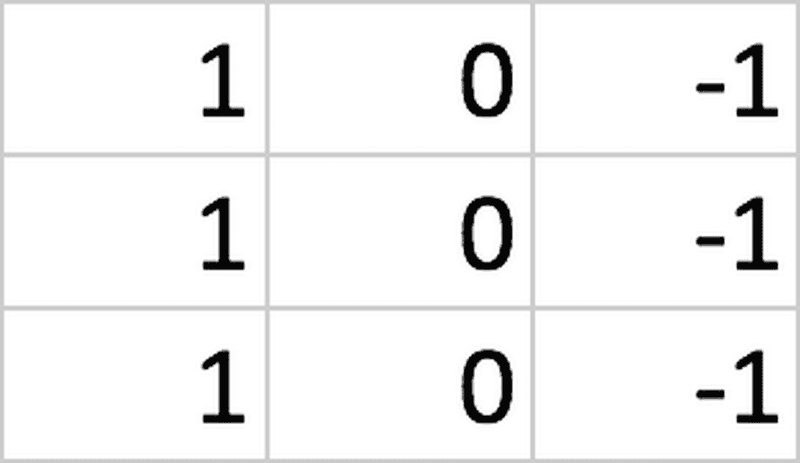
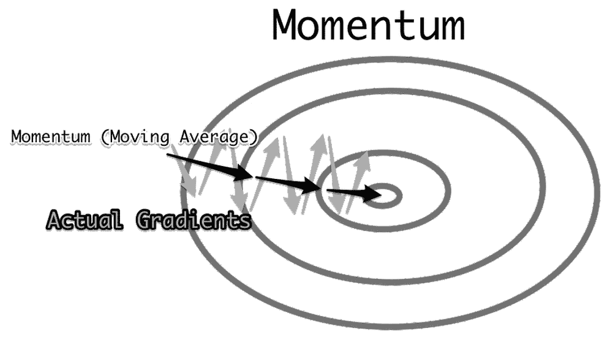
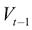
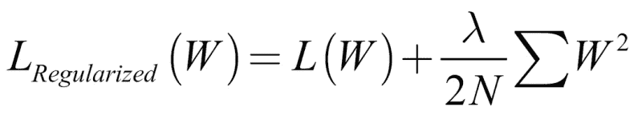

# 第三章：利用计算机视觉

当 Snapchat 首次推出带有霹雳舞热狗的滤镜时，该公司股价飙升。然而，投资者对热狗的倒立并不感兴趣；真正让他们着迷的是 Snapchat 成功构建了一种强大的计算机视觉技术。

Snapchat 应用程序现在不仅能够拍照，而且能够在这些照片中找到热狗可以跳霹雳舞的表面。然后，他们的应用程序会将热狗放置在那里，即使用户移动手机，热狗仍能保持在原地跳舞。

虽然跳舞的热狗可能是计算机视觉应用中最傻的一个，但它成功地向世界展示了这项技术的潜力。在一个充满摄像头的世界里，从数十亿的智能手机、安防摄像头和卫星，每天都在使用，到**物联网**（**IoT**）设备，能够解读图像为消费者和生产者带来了巨大的好处。

计算机视觉使我们能够在大规模上感知和解释现实世界。你可以这样理解：没有分析师能查看数百万张卫星图像，标记矿区并跟踪其活动；这是不可能的。然而，对于计算机来说，这不仅是可能的，而且已经成为现实。

实际上，现在一些公司正在现实世界中使用的一种技术是零售商通过计算停车场中的汽车数量来估算某一时期内的商品销售量。

计算机视觉的另一个重要应用可以在金融领域中看到，特别是在保险行业。例如，保险公司可能会使用无人机飞过屋顶，发现问题并在它们变成昂贵的麻烦之前解决。这也可以扩展到他们使用计算机视觉来检查他们承保的工厂和设备。

看看金融领域的另一个案例，银行需要遵守**了解你的客户**（**KYC**）规则，正在自动化后台流程和身份验证。在金融交易中，计算机视觉可以应用于蜡烛图，以便发现新的技术分析模式。我们甚至可以为计算机视觉的实际应用写一本书。

在本章中，我们将讨论计算机视觉模型的构建模块。内容将重点涵盖以下主题：

+   卷积层。

+   填充。

+   池化。

+   正则化，以防止过拟合。

+   基于动量的优化。

+   批量归一化。

+   超越分类的计算机视觉高级架构。

+   关于库的说明。

在我们开始之前，让我们看一下本章中将使用的所有不同库：

+   **Keras**：一个高层次的神经网络库，是 TensorFlow 的接口。

+   **TensorFlow**：一个数据流编程和机器学习库，我们用它进行 GPU 加速计算。

+   **Scikit-learn**：一个流行的机器学习库，包含许多经典算法的实现以及评估工具。

+   **OpenCV**：一个用于基于规则的增强的图像处理库。

+   **NumPy**：一个用于处理 Python 中矩阵的库。

+   **Seaborn**：一个绘图库。

+   **tqdm**：一个用于监控 Python 程序进度的工具。

值得花点时间注意，除了 OpenCV，所有这些库都可以通过`pip`安装；例如，`pip install keras`。

然而，OpenCV 的安装过程稍微复杂一些。虽然这超出了本书的范围，但你可以通过 OpenCV 的官方文档在线查看详细信息，网址如下：[`docs.opencv.org/trunk/df/d65/tutorial_table_of_content_introduction.html`](https://docs.opencv.org/trunk/df/d65/tutorial_table_of_content_introduction.html)。

另外，值得注意的是，Kaggle 和 Google Colab 都预装了 OpenCV。要运行本章中的示例，请确保已安装 OpenCV 并能够使用`import cv2`进行导入。

# 卷积神经网络。

**卷积神经网络**、**ConvNets**，或简写为**CNNs**，是计算机视觉的驱动引擎。ConvNets 使我们能够处理更大的图像，同时保持网络的合理大小。

卷积神经网络的名称来源于将其与常规神经网络区分开来的数学运算。卷积是数学上正确的术语，指的是将一个矩阵滑过另一个矩阵。在接下来的章节中，我们将在*MNIST 上的滤波器*部分探讨这对于 ConvNets 的重要性，但也会讨论为什么这不是最适合它们的名称，以及为什么 ConvNets 实际上应该被称为**滤波器网络**。

你可能会问，“那为什么是滤波器网络呢？”答案很简单，因为它们之所以有效，是因为它们使用了滤波器。

在接下来的章节中，我们将使用 MNIST 数据集，它是一个手写数字的集合，已成为计算机视觉中的标准“Hello, World!”应用。

## MNIST 上的滤波器。

计算机在看到一张图片时，究竟看到的是什么？实际上，图像的像素值以数字形式存储在计算机中。所以，当计算机*看到*一张数字 7 的黑白图像时，它实际上看到的是类似于以下内容的东西：


MNIST 数据集中的数字 7。

上述是来自 MNIST 数据集的一个例子。图像中的手写数字已经被突出显示，使得数字七对人类可见，但对计算机而言，图像实际上只是数字的集合。这意味着我们可以对图像进行各种数学运算。

在检测数字时，有一些低级特征构成了一个数字。例如，在这张手写的数字 7 中，包含了一条垂直直线、顶部的一条水平线和一条穿过中间的水平线。相比之下，数字 9 由四条圆形的线条组成，顶部形成一个圆圈，下面是一个直立的垂直线。

现在我们能够呈现卷积神经网络（ConvNets）的核心思想。我们可以使用小的滤波器，检测某种低级特征，比如垂直线，然后将其滑过整张图像，检测图像中的所有垂直线。

以下截图显示了一个垂直线滤波器。为了检测图像中的垂直线，我们需要将这个 3x3 的矩阵滤波器滑过图像。



一个垂直线滤波器

使用接下来的 MNIST 数据集，我们从左上角开始，切出左上角的 3x3 像素网格，在这个例子中，网格里全是零。

然后我们对滤波器中的所有元素与图像切片中的所有元素进行逐元素相乘。接着，将这九个乘积相加，并加入偏置。这个值将形成滤波器的输出，并作为新像素传递到下一层：


因此，我们的垂直线滤波器的输出将如下所示：


垂直线滤波器的输出

请花点时间注意，垂直线清晰可见，而水平线则消失了，只有一些伪影残留。同时，注意滤波器如何从一侧捕捉到垂直线。

由于它对左侧的高像素值和右侧的低像素值作出反应，输出的右侧显示了强烈的正值。同时，左侧的线实际上显示了负值。在实践中，这并不是大问题，因为通常不同的滤波器用于检测不同种类的线条和方向。

## 添加第二个滤波器

我们的垂直滤波器正在起作用，但我们已经注意到，我们还需要对图像进行水平线的滤波，以便检测数字 7。

我们的水平线滤波器可能如下所示：


一个水平线滤波器

使用这个例子后，我们现在可以像使用垂直滤波器时那样，滑动这个滤波器在图像上，得到以下的输出：


垂直线滤波器的输出

看看这个滤波器如何去除垂直线，并几乎只留下水平线？现在的问题是，我们该将什么传递到下一层？嗯，我们将两个滤波器的输出堆叠在一起，形成一个三维的立方体：


MNIST 卷积

通过添加多个卷积层，我们的卷积神经网络能够提取越来越复杂和语义化的特征。

# 彩色图像上的滤波器

当然，我们的滤波器技术不仅限于黑白图像。在本节中，我们将看看彩色图像。

大多数彩色图像由三个层或通道组成，通常称为 RGB，代表这三个层的首字母。它们由一个红色通道、一个蓝色通道和一个绿色通道组成。当这三个通道叠加在一起时，它们相加形成我们所知的传统彩色图像。

基于这个概念，图像因此不是平的，而实际上是一个立方体，一个三维矩阵。结合这个想法和我们的目标，我们希望将滤波器应用到图像上，并一次性应用到所有三个通道。因此，我们将对两个三维立方体进行逐元素相乘。

我们的 3x3 滤波器现在有三个深度，因此有九个参数，再加上偏置：


一个滤波器立方体或卷积核的示例

这个立方体被称为卷积核，它像之前的二维矩阵一样在图像上滑动。然后，逐元素的乘积会再次求和，添加偏置，结果表示下一层中的一个像素。

滤波器始终捕捉前一层的整个深度。滤波器在图像的宽度和高度上滑动。同样，滤波器不会在图像的深度（即不同的通道）上滑动。用技术术语来说，权重，即构成滤波器的数字，在宽度和高度上是共享的，但在不同的通道上则不是。

# Keras 中的卷积神经网络构建块

在本节中，我们将构建一个简单的卷积神经网络，用于分类 MNIST 字符，同时学习现代卷积神经网络的不同组成部分。

我们可以通过运行以下代码直接从 Keras 导入 MNIST 数据集：

```py
from keras.datasets import mnist
(x_train, y_train), (x_test, y_test) = mnist.load_data()
```

我们的数据集包含 60,000 张 28x28 像素的图像。MNIST 字符是黑白的，因此数据形状通常不包括通道：

```py
x_train.shape
```

```py
out: (60000, 28, 28)

```

我们稍后会更详细地研究颜色通道，但现在，让我们扩展数据维度，显示我们只有一个颜色通道。我们可以通过运行以下代码来实现：

```py
import numpy as np
x_train = np.expand_dims(x_train,-1)
x_test = np.expand_dims(x_test,-1)
x_train.shape
```

```py
out: (60000, 28, 28, 1)

```

运行代码后，你可以看到我们现在添加了一个单一的颜色通道。

## Conv2D

现在我们来到了卷积神经网络的核心内容：在 Keras 中使用卷积层。Conv2D 就是实际的卷积层，一个 Conv2D 层包含多个滤波器，如以下代码所示：

```py
from keras.layers import Conv2D
from keras.models import Sequential

model = Sequential()

img_shape = (28,28,1)

model.add(Conv2D(filters=6,
                 kernel_size=3,
                 strides=1,
                 padding='valid',
                 input_shape=img_shape))
```

创建新的 Conv2D 层时，我们必须指定要使用的滤波器数量以及每个滤波器的大小。

### 卷积核大小

滤波器的大小也叫做`kernel_size`，因为单个滤波器有时被称为核。如果我们只指定一个数字作为卷积核大小，Keras 会假设我们的滤波器是方形的。在这种情况下，例如，我们的滤波器将是 3x3 像素。

然而，我们确实可以通过将元组传递给`kernel_size`参数来指定非正方形的卷积核大小。例如，我们可以选择使用一个 3x4 像素的过滤器，通过`kernel_size = (3,4)`来指定。然而，这种情况非常罕见，在大多数情况下，过滤器的大小要么是 3x3，要么是 5x5。经验表明，这种大小的过滤器能产生良好的效果。

### 步幅大小

`strides`参数指定了步幅大小，也就是卷积过滤器滑过图像时的步长，通常称为步幅大小。在绝大多数情况下，过滤器逐像素滑动，因此它们的步幅大小被设置为 1。然而，也有一些研究者使用较大的步幅大小来减少特征图的空间大小。

就像`kernel_size`一样，如果我们只指定一个值，Keras 会假设我们在水平方向和垂直方向使用相同的步幅大小，并且在绝大多数情况下，这种假设是正确的。然而，如果我们希望水平方向使用步幅为 1，而垂直方向使用步幅为 2，我们可以通过以下方式将元组传递给参数：`strides=(1,2)`。就像在过滤器大小的情况一样，这种情况比较少见。

### 填充

最后，我们必须在卷积层中添加`padding`。填充会在图像的四周添加零。如果我们不想让特征图缩小，可以使用这种方式。

让我们考虑一个 5x5 像素的特征图和一个 3x3 的过滤器。由于过滤器只能在特征图上滑动九次，因此我们最终会得到一个 3x3 的输出。这不仅减少了我们在下一个特征图中能够捕获的信息量，还减少了输入特征图的外部像素在任务中可能的贡献。过滤器从未以它们为中心；它只经过它们一次。

填充有三种选择：不使用填充，称为"无"填充，"同"填充和"有效"填充。

让我们看看三种填充方式中的每一种。首先是：不使用填充：


选项 1：不使用填充

然后是同样的填充方式：


选项 2：同样填充

为了确保输出与输入的大小相同，我们可以使用`same`填充。Keras 将会在输入特征图的四周添加足够的零，以保持输入大小不变。然而，默认的填充设置是`valid`。这种填充方式并不会保持特征图的大小，仅仅是确保过滤器和步幅大小能够在输入特征图上有效应用：


选项 3：有效填充

### 输入形状

Keras 要求我们指定输入的形状。不过，这仅仅是第一次使用层时需要的要求。对于后续的每一层，Keras 将会根据上一层的输出形状推断出输入形状。

### 简化的 Conv2D 表示法

前一层使用 28x28x1 的输入，并滑动六个 2x2 的过滤器逐像素处理输入。指定同一层的更常见方式是使用以下代码：

```py
model.add(Conv2D(6,3,input_shape=img_shape))
```

过滤器的数量（这里是 `6`）和过滤器的大小（这里是 `3`）作为位置参数设置，而 `strides` 和 `padding` 默认分别为 `1` 和 `valid`。如果这是网络中的更深层，我们甚至不需要指定输入形状。

### ReLU 激活

卷积层只执行线性步骤。构成图像的数字与过滤器相乘，这是一个线性操作。

因此，为了逼近复杂的函数，我们需要通过激活函数引入非线性。计算机视觉中最常见的激活函数是修正线性单元（ReLU），我们可以在这里看到它：


ReLU 激活函数

用于生成上述图表的 ReLU 公式如下：

*ReLU(x) = max(x, 0)*

换句话说，ReLU 函数返回输入值，如果输入值为正。如果不是，它将返回零。这个非常简单的函数已被证明非常有用，使得梯度下降收敛更快。

通常有人认为，ReLU 更快，因为其在零以上的所有值的导数都为 1，并且不像某些极值的导数那样变得非常小，例如在 sigmoid 或 tanh 中。

ReLU 也比 sigmoid 和 tanh 的计算开销更小。它不需要任何计算开销大的计算，输入值小于零的部分直接设为零，其他部分则输出。不幸的是，ReLU 激活函数有点脆弱，可能会“死亡”。

当梯度非常大并将多个权重朝负方向移动时，ReLU 的导数将始终为零，因此权重永远不会再更新。这可能意味着一个神经元永远不会再次激活。然而，这可以通过较小的学习率来缓解。

由于 ReLU 快且计算代价低，它已成为许多从业者的默认激活函数。要在 Keras 中使用 ReLU 函数，我们只需在激活层中将其命名为所需的激活函数，运行以下代码：

```py
from keras.layers import Activation
model.add(Activation('relu'))
```

## MaxPooling2D

在多个卷积层后使用池化层是常见做法。池化减少了特征图的空间大小，从而减少了神经网络中所需的参数数量，进而减少了过拟合。

下面，我们可以看到一个最大池化的示例：


最大池化

最大池化返回池中的最大元素。这与 `AveragePooling2D` 的平均池化相反，后者返回池的平均值。最大池化通常比平均池化提供更优的结果，因此它是大多数从业者使用的标准。

最大池化可以通过运行以下代码来实现：

```py
from keras.layers import MaxPool2D

model.add(MaxPool2D(pool_size=2, 
                    strides=None, 
                    padding='valid'))
```

在 Keras 中使用最大池化层时，我们必须指定所需的池大小。最常见的值是 2x2 的池。与 `Conv2D` 层一样，我们也可以指定步幅大小。

对于池化层，默认的步幅大小是`None`，在这种情况下，Keras 会将步幅大小设置为与池化大小相同。换句话说，池化层是彼此相邻的，不会重叠。

我们还可以指定填充，其中`valid`是默认选择。然而，指定`same`填充用于池化层是极为罕见的，因为池化层的目的是减少特征图的空间大小。

我们的`MaxPooling2D`层在这里取 2x2 像素的池化区域，彼此相邻且没有重叠，并返回最大元素。指定相同层的更常见方法是执行以下操作：

```py
model.add(MaxPool2D(2))
```

在这种情况下，`strides`和`padding`都设置为其默认值，分别是`None`和`valid`。通常，池化层后没有激活函数，因为池化层不执行线性步骤。

## Flatten

你可能已经注意到我们的特征图是三维的，而我们期望的输出是一个一维的向量，包含 10 个类别的概率。那么，我们如何从三维到一维呢？好吧，我们`Flatten`了我们的特征图。

`Flatten`操作类似于 NumPy 的`flatten`操作。它接收一批特征图，维度为`(batch_size, height, width, channels)`，并返回一个维度为`(batch_size, height * width * channels)`的向量集合。

它不执行任何计算，仅对矩阵进行重塑。此操作没有超参数需要设置，如你在以下代码中所见：

```py
from keras.layers import Flatten

model.add(Flatten())
```

## Dense

卷积神经网络（ConvNets）通常由特征提取部分（卷积层）和分类部分组成。分类部分由我们在第一章，*神经网络与基于梯度的优化*，以及第二章，*将机器学习应用于结构化数据* 中已经探讨过的简单全连接层组成。

为了将普通层与其他类型的层区分开，我们称它们为`Dense`层。在一个密集层中，每个输入神经元都与一个输出神经元连接。我们只需要指定所需的输出神经元数量，在这个例子中是 10 个。

这可以通过运行以下代码来完成：

```py
from keras.layers import Dense
model.add(Dense(10))
```

在密集层的线性步骤之后，我们可以添加`softmax`激活函数来进行多类回归，就像我们在前两章中所做的那样，通过运行以下代码：

```py
model.add(Activation('softmax'))
```

## 训练 MNIST

现在让我们将所有这些元素组合起来，这样我们就可以在 MNIST 数据集上训练卷积神经网络了。

### 模型

首先，我们必须指定模型，可以使用以下代码来完成：

```py
from keras.layers import Conv2D, Activation, MaxPool2D, Flatten, Dense
from keras.models import Sequential

img_shape = (28,28,1)

model = Sequential()

model.add(Conv2D(6,3,input_shape=img_shape))

model.add(Activation('relu'))

model.add(MaxPool2D(2))

model.add(Conv2D(12,3))

model.add(Activation('relu'))

model.add(MaxPool2D(2))

model.add(Flatten())

model.add(Dense(10))

model.add(Activation('softmax'))
```

在以下代码中，你可以看到典型卷积神经网络的一般结构：

```py
Conv2D
Pool 

Conv2D
Pool

Flatten

Dense
```

卷积层和池化层通常在这些模块中一起使用；你可以找到一些神经网络，重复使用`Conv2D`和`MaxPool2D`的组合多次。

我们可以通过以下命令获得模型的概览：

```py
model.summary()
```

这将给我们以下输出：

```py
Layer (type)                 Output Shape              Param # 
=================================================================
conv2d_2 (Conv2D)            (None, 26, 26, 6)         60 
_________________________________________________________________
activation_3 (Activation)    (None, 26, 26, 6)         0 
_________________________________________________________________
max_pooling2d_2 (MaxPooling2 (None, 13, 13, 6)         0 
_________________________________________________________________
conv2d_3 (Conv2D)            (None, 11, 11, 12)        660 
_________________________________________________________________
activation_4 (Activation)    (None, 11, 11, 12)        0 
_________________________________________________________________
max_pooling2d_3 (MaxPooling2 (None, 5, 5, 12)          0 
_________________________________________________________________
flatten_2 (Flatten)          (None, 300)               0 
_________________________________________________________________
dense_2 (Dense)              (None, 10)                3010 
_________________________________________________________________
activation_5 (Activation)    (None, 10)                0 
=================================================================
Total params: 3,730
Trainable params: 3,730
Non-trainable params: 0
_________________________________________________________________

```

在这个总结中，你可以清楚地看到池化层是如何减少特征图的大小的。仅从总结中看这点不太明显，但你可以看到第一个`Conv2D`层的输出是 26x26 像素，而输入图像是 28x28 像素。

通过使用`valid`填充，`Conv2D`也减少了特征图的大小，尽管只是减少了少量。第二个`Conv2D`层也发生了同样的事情，它将特征图从 13x13 像素缩小到 11x11 像素。

你还可以看到，第一个卷积层只有 60 个参数，而`Dense`层有 3,010 个参数，超过了卷积层的 50 倍。卷积层通常用非常少的参数就能实现惊人的效果，这也是它们如此受欢迎的原因。通过卷积层和池化层，网络中的总参数数目通常能显著减少。

### 加载数据

我们使用的 MNIST 数据集已预装在 Keras 中。加载数据时，如果你想直接通过 Keras 使用数据集，请确保你的设备已连接互联网，因为 Keras 需要先下载该数据集。

你可以使用以下代码导入数据集：

```py
from keras.datasets import mnist
(x_train, y_train), (x_test, y_test) = mnist.load_data()
```

如本章开始时所解释的，我们希望将数据集重塑，使其也能具有通道维度。原始数据集本身还没有通道维度，但这是我们可以做的：

```py
x_train.shape
```

```py
out:
(60000, 28, 28)

```

所以，我们使用 NumPy 添加一个通道维度，代码如下：

```py
import numpy as np

x_train = np.expand_dims(x_train,-1)

x_test = np.expand_dims(x_test,-1)
```

现在有了一个通道维度，正如我们在这里看到的：

```py
x_train.shape
```

```py
out:
(60000, 28, 28,1)

```

### 编译和训练

在之前的章节中，我们使用了独热编码的目标进行多类回归。虽然我们已经重新塑形了数据，但目标仍然保持原始形式。它们是一个扁平的向量，包含每个手写数字的数值数据表示。记住，MNIST 数据集中有 60,000 个这样的数据：

```py
y_train.shape
```

```py
out:
(60000,)

```

通过独热编码转换目标是一个常见且令人烦恼的任务，因此 Keras 允许我们直接指定一个损失函数，在运行时将目标转换为独热编码。这个损失函数叫做`sparse_categorical_crossentropy`。

它与前面章节中使用的分类交叉熵损失函数相同，唯一的区别是它使用的是稀疏目标，即不是独热编码的目标。

和之前一样，你仍然需要确保你的网络输出的维度与类别数相匹配。

我们现在已经到达了可以编译模型的阶段，我们可以使用以下代码来进行编译：

```py
model.compile(loss='sparse_categorical_crossentropy',optimizer='adam',metrics=['acc'])
```

如你所见，我们正在使用 Adam 优化器。Adam 的具体工作原理将在下一节中解释，*为我们的神经网络增添更多功能*，但现在，你可以将它理解为一种比随机梯度下降更复杂的版本。

在训练时，我们可以通过运行以下代码直接指定验证集：

```py
history = model.fit(x_train,y_train,batch_size=32,epochs=5,validation_data=(x_test,y_test))
```

一旦我们成功运行了这段代码，我们将得到以下输出：

```py
Train on 60000 samples, validate on 10000 samples
Epoch 1/10
60000/60000 [==============================] - 19s 309us/step - loss: 5.3931 - acc: 0.6464 - val_loss: 1.9519 - val_acc: 0.8542
Epoch 2/10
60000/60000 [==============================] - 18s 297us/step - loss: 0.8855 - acc: 0.9136 - val_loss: 0.1279 - val_acc: 0.9635
....
Epoch 10/10
60000/60000 [==============================] - 18s 296us/step - loss: 0.0473 - acc: 0.9854 - val_loss: 0.0663 - val_acc: 0.9814

```

为了更好地了解正在发生的情况，我们可以使用以下代码绘制训练进度：

```py
import matplotlib.pyplot as plt

fig, ax = plt.subplots(figsize=(10,6))
gen = ax.plot(history.history['val_acc'], label='Validation Accuracy')
fr = ax.plot(history.history['acc'],dashes=[5, 2], label='Training Accuracy')

legend = ax.legend(loc='lower center', shadow=True)

plt.show()
```

这将为我们提供以下图表：


可视化的验证和训练准确度输出

正如你在前面的图表中看到的，模型达到了大约 98%的验证准确率，这非常不错！

# 为我们的神经网络添加更多功能

让我们花一点时间来看看我们神经网络的其他一些元素。

## 动量

在前几章中，我们通过某人试图仅通过跟随地面坡度找到山下的路径来解释梯度下降。动量可以通过与物理学的类比来解释，其中一个小球沿着同样的山坡滚下。山坡上的小颠簸不会使小球滚向完全不同的方向。小球已经有了一些动量，这意味着它的运动会受到之前运动的影响。

我们不是直接用梯度更新模型参数，而是使用指数加权的移动平均来更新它们。我们用一个离群点梯度更新参数，然后取移动平均，这将平滑掉离群点，并捕捉梯度的整体方向，正如我们在下面的图示中看到的那样：



动量如何平滑梯度更新

指数加权移动平均是一个巧妙的数学技巧，用于计算移动平均，而无需记住一组之前的值。某个值的指数加权平均*V*，，将如下所示：


beta 值为 0.9 意味着 90%的均值将来自先前的移动平均，，10%将来自新的值，。

使用动量使得学习对梯度下降中的陷阱（如离群梯度、局部最小值和鞍点）更具鲁棒性。

我们可以通过在 Keras 中为 beta 设置一个值来增加标准的随机梯度下降优化器的动量，这就是我们在下面的代码中所做的：

```py
from keras.optimizers import SGD
momentum_optimizer = SGD(lr=0.01, momentum=0.9)
```

这段小代码片段创建了一个具有学习率 0.01 和 beta 值为 0.9 的随机梯度下降优化器。当我们编译模型时，可以使用它，就像我们现在要做的这样：

```py
model.compile(optimizer=momentum_optimizer,loss='sparse_categorical_crossentropy',metrics=['acc'])
```

## Adam 优化器

在 2015 年，Diederik P. Kingma 和 Jimmy Ba 创建了**Adam**（**自适应动量估计**）优化器。这是另一种使梯度下降更加高效的方法。在过去的几年里，这种方法显示出了非常好的效果，因此，已成为许多实践者的标准选择。例如，我们已经在 MNIST 数据集上使用过它。

首先，Adam 优化器像动量优化器一样计算梯度的指数加权平均。它通过以下公式来实现这一点：


然后它还会计算平方梯度的指数加权平均值：


然后它会像这样更新模型参数：


这里的是一个非常小的数字，用于避免除以零的情况。

对平方梯度的根进行除法操作，会在梯度非常大的时候减慢更新速度。它还通过防止学习算法受到异常值的干扰，稳定了学习过程。

使用 Adam 时，我们有一个新的超参数。除了只有一个动量因子外，我们现在有两个，和。对于这些超参数的推荐值是


和分别是 0.9 和 0.999。

我们可以像这样在 Keras 中使用 Adam：

```py
from keras.optimizers import adam

adam_optimizer=adam(lr=0.1,beta_1=0.9, beta_2=0.999, epsilon=1e-08)

model.compile(optimizer=adam_optimizer,loss='sparse_categorical_crossentropy',metrics=['acc'])
```

正如你在本章前面看到的那样，我们也可以通过仅传递`adam`字符串作为优化器来编译模型。在这种情况下，Keras 会为我们创建一个 Adam 优化器，并选择推荐的值。

## 正则化

正则化是一种用于防止过拟合的技术。过拟合是指模型对训练数据拟合得过于完美，导致它不能很好地泛化到开发数据或测试数据上。你可能会看到，过拟合有时也被称为“高方差”，而欠拟合，即在训练、开发和测试数据上都得到较差的结果，则被称为“高偏差”。

在经典的统计学习中，很多重点都放在了偏差-方差权衡上。观点是，一个非常符合训练集的模型很可能会过拟合，因此必须接受一定程度的欠拟合（偏差），以便获得良好的结果。在经典统计学习中，防止过拟合的超参数往往也会防止训练集拟合得很好。

神经网络中的正则化，如这里所介绍的，主要借鉴了经典学习算法。然而，现代机器学习研究开始接受“正交性”这一概念，认为不同的超参数会影响偏差和方差。

通过分离这些超参数，可以打破偏差-方差权衡，从而找到能够很好地泛化并提供准确预测的模型。然而，到目前为止，这些努力仅仅取得了小小的成果，因为低偏差和低方差的模型需要大量的训练数据。

### L2 正则化

一种常用的防止过拟合的技术是 L2 正则化。L2 正则化将权重平方的和添加到损失函数中。我们可以在下面的公式中看到这个例子：



这里的*N*是训练示例的数量，而是正则化超参数，它决定了我们希望进行多大程度的正则化，常见值大约为 0.01。

将此正则化添加到损失函数中意味着较高的权重会增加损失，从而促使算法减少权重。较小的权重，接近零的权重，意味着神经网络会减少对它们的依赖。

因此，一个正则化的算法会减少对每个特征和每个节点激活的依赖，而是更全面地看待问题，考虑多个特征和激活。这将防止算法发生过拟合。

### L1 正则化

L1 正则化与 L2 正则化非常相似，但它不是加和平方，而是加和绝对值，如我们在这个公式中看到的：


实际操作中，通常不确定哪种方法效果最佳，但两者之间的差异并不大。

### Keras 中的正则化

在 Keras 中，应用于权重的正则化器称为**kernel_regularizer**，应用于偏置的正则化器称为**bias_regularizer**。你还可以直接将正则化应用于节点的激活，以防止它们被过度激活，使用**activity_regularizer**。

现在，我们在网络中添加一些 L2 正则化。为此，我们需要运行以下代码：

```py
from keras.regularizers import l2

model = Sequential()

model.add(Conv2D(6,3,input_shape=img_shape, kernel_regularizer=l2(0.01)))

model.add(Activation('relu'))

model.add(MaxPool2D(2))

model.add(Conv2D(12,3,activity_regularizer=l2(0.01)))

model.add(Activation('relu'))

model.add(MaxPool2D(2))

model.add(Flatten())

model.add(Dense(10,bias_regularizer=l2(0.01)))

model.add(Activation('softmax'))
```

在 Keras 的第一个卷积层中将`kernel_regularizer`设置为正则化权重。将`bias_regularizer`设置为正则化偏置，设置`activity_regularizer`则是正则化一个层的输出激活。

在以下示例中，正则化器被设置为启用，但在这里它们实际上会损害我们网络的性能。从前面的训练结果可以看出，我们的网络并没有发生过拟合，因此启用正则化器会损害性能，导致模型出现欠拟合。

正如我们在以下输出中看到的，在这种情况下，模型达到了大约 87%的验证准确度：

```py
model.compile(loss='sparse_categorical_crossentropy',optimizer = 'adam',metrics=['acc'])

history = model.fit(x_train,y_train,batch_size=32,epochs=10,validation_data=(x_test,y_test))

Train on 60000 samples, validate on 10000 samples
Epoch 1/10
60000/60000 [==============================] - 22s 374us/step - loss: 7707.2773 - acc: 0.6556 - val_loss: 55.7280 - val_acc: 0.7322
Epoch 2/10
60000/60000 [==============================] - 21s 344us/step - loss: 20.5613 - acc: 0.7088 - val_loss: 6.1601 - val_acc: 0.6771
....
Epoch 10/10
60000/60000 [==============================] - 20s 329us/step - loss: 0.9231 - acc: 0.8650 - val_loss: 0.8309 - val_acc: 0.8749

```

你会注意到，模型在验证集上的准确度高于训练集；这是过拟合的明显迹象。

## Dropout

正如 Srivastava 等人 2014 年论文标题所揭示的，*Dropout 是一种简单的方法来防止神经网络过拟合*。它通过随机去除神经网络中的节点来实现这一点：


Dropout 方法的示意图。来自 Srivastava 等人，"Dropout: A Simple Way to Prevent Neural Networks from Overfitting"，2014 年

使用 dropout 时，每个节点都有小概率将其激活值设置为零。这意味着学习算法不再可以过度依赖单一节点，就像 L2 和 L1 正则化一样。因此，dropout 也具有正则化作用。

在 Keras 中，dropout 是一种新的层。它被放置在你希望应用 dropout 的激活函数后面。它会传递激活值，但有时会将其设置为零，从而实现与直接在单元中使用 dropout 相同的效果。我们可以通过以下代码看到这一点：

```py
from keras.layers import Dropout
model = Sequential()

model.add(Conv2D(6,3,input_shape=img_shape))
model.add(Activation('relu'))
model.add(MaxPool2D(2))

model.add(Dropout(0.2))

model.add(Conv2D(12,3))
model.add(Activation('relu'))
model.add(MaxPool2D(2))

model.add(Dropout(0.2))

model.add(Flatten())

model.add(Dense(10,bias_regularizer=l2(0.01)))

model.add(Activation('softmax'))
```

如果过拟合是一个严重问题，dropout 值为 0.5 被认为是一个不错的选择，而大于 0.5 的值则不太有用，因为网络会处理太少的值。在这种情况下，我们选择了 0.2 的 dropout 值，这意味着每个单元有 20% 的概率被设置为零。

请注意，dropout 是在池化之后使用的：

```py
model.compile(loss='sparse_categorical_crossentropy',optimizer = 'adam',metrics=['acc'])

history = model.fit(x_train,y_train,batch_size=32,epochs=10,validation_data=(x_test,y_test))
```

```py
Train on 60000 samples, validate on 10000 samples
Epoch 1/10
60000/60000 [==============================] - 22s 371us/step - loss: 5.6472 - acc: 0.6039 - val_loss: 0.2495 - val_acc: 0.9265
Epoch 2/10
60000/60000 [==============================] - 21s 356us/step - loss: 0.2920 - acc: 0.9104 - val_loss: 0.1253 - val_acc: 0.9627
....
Epoch 10/10
60000/60000 [==============================] - 21s 344us/step - loss: 0.1064 - acc: 0.9662 - val_loss: 0.0545 - val_acc: 0.9835

```

较低的 dropout 值为我们创造了良好的结果，但同样，网络在验证集上的表现优于训练集，这是出现欠拟合的明显标志。请注意，dropout 只在训练时应用。当模型用于预测时，dropout 不会起作用。

## Batchnorm

**Batchnorm**，即**批量归一化**，是一种对输入数据进行“归一化”的技术，按批次进行处理。每个 batchnorm 计算数据的均值和标准差，并应用变换，使得均值为零，标准差为一。

这使得训练变得更加容易，因为损失曲面变得更加“圆滑”。不同输入维度的均值和标准差意味着网络必须学习一个更复杂的函数。

在 Keras 中，batchnorm 也是一个新的层，如以下代码所示：

```py
from keras.layers import BatchNormalization

model = Sequential()

model.add(Conv2D(6,3,input_shape=img_shape))
model.add(Activation('relu'))
model.add(MaxPool2D(2))

model.add(BatchNormalization())

model.add(Conv2D(12,3))
model.add(Activation('relu'))
model.add(MaxPool2D(2))

model.add(BatchNormalization())

model.add(Flatten())

model.add(Dense(10,bias_regularizer=l2(0.01)))

model.add(Activation('softmax'))
model.compile(loss='sparse_categorical_crossentropy',optimizer = 'adam',metrics=['acc'])

history = model.fit(x_train,y_train,batch_size=32,epochs=10,validation_data=(x_test,y_test))
```

```py
Train on 60000 samples, validate on 10000 samples
Epoch 1/10
60000/60000 [==============================] - 25s 420us/step - loss: 0.2229 - acc: 0.9328 - val_loss: 0.0775 - val_acc: 0.9768
Epoch 2/10
60000/60000 [==============================] - 26s 429us/step - loss: 0.0744 - acc: 0.9766 - val_loss: 0.0668 - val_acc: 0.9795
....
Epoch 10/10
60000/60000 [==============================] - 26s 432us/step - loss: 0.0314 - acc: 0.9897 - val_loss: 0.0518 - val_acc: 0.9843

```

Batchnorm 通常通过简化训练过程来加速训练。你可以看到在第一轮训练中准确率的跃升：


使用 batchnorm 的 MNIST 分类器的训练和验证准确率

Batchnorm 也有轻微的正则化效果。极端值通常会被过拟合，而 batchnorm 减少了这些极端值，类似于激活正则化。这一切使得 batchnorm 在计算机视觉中成为一个非常流行的工具。

# 处理大规模图像数据集

图像通常是大文件。事实上，可能无法将整个图像数据集加载到机器的内存中。

因此，我们需要“及时”从磁盘加载图像，而不是提前加载所有图像。在这一部分，我们将设置一个图像数据生成器，按需加载图像。

在这个例子中，我们将使用植物幼苗的数据集。该数据集由 Thomas Giselsson 等人于 2017 年通过他们的出版物《A Public Image Database for Benchmark of Plant Seedling Classification Algorithms》提供。

该数据集可以通过以下链接访问：[`arxiv.org/abs/1711.05458`](https://arxiv.org/abs/1711.05458)。

你可能会想，为什么我们要研究植物呢？毕竟，植物分类在金融领域并不是一个常见的问题。简单的回答是，这个数据集适合展示许多常见的计算机视觉技术，并且它是开放域许可的，因此是一个非常适合我们使用的训练数据集。

想要在更相关的数据集上测试自己知识的读者，可以查看*State Farm Distracted Driver*数据集和*Planet: Understanding the Amazon from Space*数据集。

### 注意

本节以及关于堆叠预训练模型的章节中的代码和数据可以在此处找到并运行：[`www.kaggle.com/jannesklaas/stacking-vgg`](https://www.kaggle.com/jannesklaas/stacking-vgg)。

Keras 自带了一个图像数据生成器，可以直接从磁盘加载文件。为此，您只需运行：

```py
from keras.preprocessing.image import ImageDataGenerator
```

为了从文件中获取生成器，我们首先需要指定生成器。在 Keras 中，`ImageDataGenerator`提供了一系列图像增强工具，但在我们的示例中，我们只会使用重新缩放功能。

重新缩放是将图像中的所有值与常数相乘。对于大多数常见的图像格式，颜色值的范围是从 0 到 255，所以我们希望将其缩放为 1/255。我们可以通过运行以下代码来实现：

```py
imgen = ImageDataGenerator(rescale=1/255)
```

然而，这还不是一个加载图像的生成器。`ImageDataGenerator`类提供了一系列可以通过调用其函数来创建的生成器。

为了获取一个加载文件的生成器，我们需要调用`flow_from_directory`。

然后，我们需要指定 Keras 应使用的目录、我们希望的批次大小，在本例中为`32`，以及图像应调整为的目标大小，在本例中为 150x150 像素。为此，我们可以简单地运行以下代码：

```py
train_generator = imgen.flow_from_directory('train',batch_size=32, target_size=(150,150))
validation_generator = imgen.flow_from_directory('validation',batch_size=32, tar get_size=(150,150))
```

Keras 是如何找到图像的，如何知道这些图像属于哪个类别的呢？Keras 的生成器需要以下文件夹结构：

+   根目录：

    +   类别 0

        +   img

        +   img

        +   …

    +   类别 1

        +   img

        +   img

        +   …

    +   类别 1

        +   img

我们的数据集已经按这种方式设置好了，通常将图像分类以匹配生成器的预期并不困难。

# 使用预训练模型

训练大型计算机视觉模型不仅困难，而且计算开销巨大。因此，通常使用最初为其他目的训练的模型，并对其进行微调以适应新任务。这就是迁移学习的一个例子。

迁移学习的目标是将一个任务的学习迁移到另一个任务中。作为人类，我们非常擅长转移我们学到的知识。当你看到一只以前没见过的狗时，你不需要为这只特定的狗重新学习关于狗的所有知识；相反，你只是将新学到的知识转移到你已经知道的关于狗的知识上。每次重新训练一个大网络并不经济，因为你会发现模型中有一些部分是可以重用的。

在本节中，我们将对 VGG-16 进行微调，该模型最初是在 ImageNet 数据集上训练的。ImageNet 竞赛是一个年度计算机视觉竞赛，ImageNet 数据集包含了数百万张现实世界物体的图像，从狗到飞机。

在 ImageNet 竞赛中，研究人员竞争构建最精确的模型。事实上，ImageNet 推动了计算机视觉领域近年来的许多进展，而为 ImageNet 竞赛构建的模型也是微调其他模型的常见基础。

VGG-16 是由牛津大学视觉几何组开发的模型架构。该模型由卷积部分和分类部分组成。我们只会使用卷积部分。此外，我们将添加我们自己的分类部分，用于植物分类。

可以通过以下代码在 Keras 中下载 VGG-16：

```py
from keras.applications.vgg16 import VGG16
vgg_model = VGG16(include_top=False,input_shape=(150,150,3))
```

```py
out: 
Downloading data from https://github.com/fchollet/deep-learning-models/releases/download/v0.1/vgg16_weights_tf_dim_ordering_tf_kernels_notop.h5
58892288/58889256 [==============================] - 5s 0us/step

```

下载数据时，我们希望让 Keras 知道我们不希望包含顶部部分（分类部分）；我们还希望告诉 Keras 期望的输入形状。如果不指定输入形状，模型将接受任何图像大小，并且无法在其上添加`Dense`层：

```py
vgg_model.summary()
```

```py
out: 
_________________________________________________________________
Layer (type)                 Output Shape              Param # 
=================================================================
input_1 (InputLayer)         (None, 150, 150, 3)       0 
_________________________________________________________________
block1_conv1 (Conv2D)        (None, 150, 150, 64)      1792 
_________________________________________________________________
block1_conv2 (Conv2D)        (None, 150, 150, 64)      36928 
_________________________________________________________________
block1_pool (MaxPooling2D)   (None, 75, 75, 64)        0 
_________________________________________________________________
block2_conv1 (Conv2D)        (None, 75, 75, 128)       73856 
_________________________________________________________________
block2_conv2 (Conv2D)        (None, 75, 75, 128)       147584 
_________________________________________________________________
block2_pool (MaxPooling2D)   (None, 37, 37, 128)       0 
_________________________________________________________________
block3_conv1 (Conv2D)        (None, 37, 37, 256)       295168 
_________________________________________________________________
block3_conv2 (Conv2D)        (None, 37, 37, 256)       590080 
_________________________________________________________________
block3_conv3 (Conv2D)        (None, 37, 37, 256)       590080 
_________________________________________________________________
block3_pool (MaxPooling2D)   (None, 18, 18, 256)       0 
_________________________________________________________________
block4_conv1 (Conv2D)        (None, 18, 18, 512)       1180160 
_________________________________________________________________
block4_conv2 (Conv2D)        (None, 18, 18, 512)       2359808 
_________________________________________________________________
block4_conv3 (Conv2D)        (None, 18, 18, 512)       2359808 
_________________________________________________________________
block4_pool (MaxPooling2D)   (None, 9, 9, 512)         0 
_________________________________________________________________
block5_conv1 (Conv2D)        (None, 9, 9, 512)         2359808 
_________________________________________________________________
block5_conv2 (Conv2D)        (None, 9, 9, 512)         2359808 
_________________________________________________________________
block5_conv3 (Conv2D)        (None, 9, 9, 512)         2359808 
_________________________________________________________________
block5_pool (MaxPooling2D)   (None, 4, 4, 512)         0 
=================================================================
Total params: 14,714,688
Trainable params: 14,714,688
Non-trainable params: 0
_________________________________________________________________

```

如你所见，VGG 模型非常庞大，具有超过 1470 万个可训练参数。它还由`Conv2D`和`MaxPooling2D`层组成，这两种层我们在处理 MNIST 数据集时已经学习过。

从此点开始，我们有两种不同的方式可以继续：

+   添加层并构建一个新模型。

+   通过预训练模型预处理所有图像，然后训练一个新的模型。

## 修改 VGG-16

在本节中，我们将在 VGG-16 模型的基础上添加层，然后从那里开始训练新的大模型。

然而，我们并不想重新训练那些已经训练好的卷积层。因此，我们必须首先“冻结”VGG-16 中的所有层，我们可以通过运行以下代码来实现：

```py
for the layer in vgg_model.layers:
  layer.trainable = False
```

Keras 将 VGG 下载为一个函数式 API 模型。我们将在第六章《使用生成模型》中详细学习函数式 API，但目前我们只想使用顺序 API，它允许我们通过`model.add()`堆叠层。我们可以使用以下代码将一个函数式 API 模型转换为顺序 API 模型：

```py
finetune = Sequential(layers = vgg_model.layers)
```

运行代码的结果是，我们现在已经创建了一个新的模型，名为`finetune`，它的功能与普通的顺序模型相同。我们需要记住，使用顺序 API 转换模型仅在模型能够实际表达为顺序 API 时才有效。一些更复杂的模型无法转换。

由于我们刚才所做的一切，向我们的模型中添加层现在变得很简单：

```py
finetune.add(Flatten())
finetune.add(Dense(12))
finetune.add(Activation('softmax'))
```

新添加的层默认是可训练的，而重用的模型插槽则不是。我们可以像训练任何其他模型一样，在我们之前定义的数据生成器上训练这个堆叠模型。可以通过运行以下代码来执行：

```py
finetune.compile(loss='categorical_crossentropy',optimizer='adam',metrics = ['acc'])

finetune.fit_generator(train_generator,epochs=8,steps_per_epoch= 4606 // 32, validation_data=validation_generator, validation_steps= 144//32)
```

运行后，模型的验证准确率大约能达到 75%。

## 随机图像增强

机器学习中的一个普遍问题是，不管我们有多少数据，更多的数据总是更好的，因为它可以提高输出质量，同时防止过拟合，并让我们的模型处理更广泛的输入。因此，通常会对图像应用随机增强，例如旋转或随机裁剪。

这个思路是通过从一张图像中生成大量不同的图像，从而减少模型过拟合的机会。对于大多数图像增强目的，我们可以直接使用 Keras 的`ImageDataGenerator`。

更高级的增强可以通过 OpenCV 库来实现。然而，专注于这一点超出了本章的范围。

### 使用 ImageDataGenerator 进行增强

当使用增强数据生成器时，我们通常只在训练中使用它。验证生成器不应使用增强特性，因为当我们验证模型时，我们希望评估它在未见过的真实数据上的表现，而不是增强数据。

这与基于规则的增强不同，在基于规则的增强中，我们试图创建更容易分类的图像。因此，我们需要创建两个`ImageDataGenerator`实例，一个用于训练，另一个用于验证。这可以通过运行以下代码实现：

```py
train_datagen = ImageDataGenerator(
  rescale = 1/255,
  rotation_range=90,
  width_shift_range=0.2,
  height_shift_range=0.2,
  shear_range=0.2,
  zoom_range=0.1,
  horizontal_flip=True,
  fill_mode='nearest')
```

这个训练数据生成器利用了一些内建的增强技术。

### 注意

**注意**：Keras 中还有更多命令可用。完整的命令列表请参考 Keras 文档：[`keras.io/`](https://keras.io/)。

在下面的列表中，我们已突出显示几个常用的命令：

+   `rescale`对图像中的值进行缩放。我们之前使用过它，也将在验证中使用它。

+   `rotation_range`是一个范围（0 到 180 度），用于随机旋转图像。

+   `width_shift_range`和`height_shift_range`是范围（相对于图像大小，这里为 20%），用于随机地水平或垂直拉伸图像。

+   `shear_range`是一个范围（同样，相对于图像）用于随机应用剪切。

+   `zoom_range`是随机缩放图像的范围。

+   `horizontal_flip`指定是否随机翻转图像。

+   `fill_mode`指定如何填充由旋转等操作创建的空白区域。

我们可以通过将一张图片多次通过生成器来查看它的作用。

首先，我们需要导入 Keras 图像工具并指定图像路径（这个是随机选择的）。这可以通过运行以下代码实现：

```py
from keras.preprocessing import image
fname = 'train/Charlock/270209308.png'
```

然后我们需要加载图像并将其转换为 NumPy 数组，这可以通过以下代码实现：

```py
img = image.load_img(fname, target_size=(150, 150))
img = image.img_to_array(img)
```

如前所述，我们需要向图像添加一个批处理大小维度：

```py
img = np.expand_dims(img,axis=0)
```

然后，我们使用刚才创建的`ImageDataGenerator`实例，但不是使用`flow_from_directory`，而是使用`flow`，它允许我们直接将数据传递给生成器。然后我们传递我们想要使用的那一张图像，可以通过运行以下代码来实现：

```py
gen = train_datagen.flow(img, batch_size=1)
```

在一个循环中，我们接着对生成器调用`next`四次：

```py
for i in range(4):
    plt.figure(i)
    batch = next(gen)
    imgplot = plt.imshow(image.array_to_img(batch[0]))

plt.show()
```

这将产生以下输出：


一些随机修改过的图像样本

# 模块化的权衡

本章展示了通过一些基于规则的系统来辅助机器学习模型是可能的，且往往是有用的。你可能还注意到数据集中图像都被裁剪，只显示了一种植物。

虽然我们本可以构建一个模型来定位并分类植物，但除了分类之外，我们也可以构建一个系统，直接输出植物应接受的治疗。这就引出了一个问题：我们应该让系统的模块化程度达到什么水平？

端到端深度学习在几年前非常流行。如果有大量数据，深度学习模型可以学习到原本需要多个组件的系统才能学会的内容。然而，端到端深度学习也有几个缺点：

+   端到端深度学习需要大量的数据。因为模型有很多参数，所以需要大量数据来避免过拟合。

+   端到端深度学习很难调试。如果你用一个黑盒模型替换整个系统，你几乎没有希望找出为什么某些事情发生了。

+   一些东西很难学习，但很容易写成代码，特别是理智检查规则。

最近，研究人员开始让他们的模型更加模块化。一个很好的例子是 Ha 和 Schmidthuber 的*世界模型*，你可以在这里阅读：[`worldmodels.github.io/`](https://worldmodels.github.io/)。在这个模型中，他们编码了视觉信息，做出了关于未来的预测，并通过三个不同的模型选择行动。

从实际角度来看，我们可以看看 Airbnb，他们将结构化建模与机器学习结合，用于其定价引擎。你可以在这里阅读更多内容：[`medium.com/airbnb-engineering/learning-market-dynamics-for-optimal-pricing-97cffbcc53e3`](https://medium.com/airbnb-engineering/learning-market-dynamics-for-optimal-pricing-97cffbcc53e3)。建模人员知道预订大致遵循泊松分布，并且也有季节性效应。因此，Airbnb 构建了一个模型，直接预测分布的参数和季节性，而不是让模型直接预测预订量。

如果你只有少量数据，那么你的算法性能需要依赖于人类的洞察力。如果某些子任务可以轻松地用代码表达，那么通常最好通过代码来表达它们。如果你需要可解释性，并且希望理解为何做出某些选择，模块化设置与清晰可解释的中间输出是一个不错的选择。然而，如果任务很难，且你不清楚它包含哪些子任务，并且有大量数据，那么通常最好使用端到端方法。

使用*纯*端到端方法是非常罕见的。例如，图像总是经过相机芯片的预处理，你从不直接处理原始数据。

聪明地划分任务可以提高性能并降低风险。

# 计算机视觉超越分类

如我们所见，有许多技术可以帮助我们的图像分类器提高性能。这些技术贯穿本书的多个章节，不仅限于计算机视觉应用。

在本章的最后一节中，我们将讨论一些超越图像分类的方法。这些任务通常需要比本章所讨论的内容更具创意的神经网络使用方法。

为了充分理解本节内容，你不需要过多担心所呈现技术的细节，而是要关注研究人员在使用神经网络时的创意方法。我们采取这种方法是因为你会经常发现，解决的问题往往也需要类似的创造性。

## 面部识别

面部识别在零售行业有许多应用。例如，如果你在前台，可能希望在 ATM 上自动识别客户，或者你可能想提供基于面部的安全功能，如 iPhone 提供的那样。然而，在后台，你需要遵守 KYC（了解你的客户）法规，要求你识别正在合作的客户。

表面上，面部识别看起来像是一个分类任务。你将一张面部图像输入机器，它会预测这张脸属于哪个人。问题是，你可能有数百万个客户，但每个客户只有一两张照片。

此外，你可能会不断获得新客户。每次获得新客户时，你无法改变模型，如果它必须在数百万个类别中选择，而每个类别只有一个样本，那么简单的分类方法将失败。

这里的创意思路是，与其对客户的面部进行分类，不如判断两张图像是否展示的是同一张面孔。你可以在以下示意图中看到这一思路的可视化表示：


一种孪生网络示意图

为此，您需要首先将两张图像通过网络。Siamese 网络是一类包含两个或更多相同子网络的神经网络架构，这些子网络完全相同并且包含相同的权重。在 Keras 中，您可以通过先定义层，然后在两个网络中使用它们来实现这种设置。然后，这两个网络的输出会输入到一个单一的分类层，来判断这两张图像是否显示相同的面孔。

为了避免每次想要识别人脸时，都将我们数据库中的所有客户图像通过整个 Siamese 网络，一般会保存 Siamese 网络的最终输出。Siamese 网络对图像的最终输出被称为人脸嵌入。当我们想要识别一个客户时，我们将客户面部图像的嵌入与我们数据库中存储的嵌入进行比较。我们可以通过单一分类层来实现这一点。

存储人脸嵌入非常有益，因为它能节省大量计算成本，并且允许进行人脸聚类。人脸会根据性别、年龄、种族等特征聚集在一起。通过仅将图像与同一聚类中的图像进行比较，我们可以进一步节省计算资源，从而实现更快的识别。

训练 Siamese 网络有两种方法。我们可以通过创建匹配和不匹配图像的对，并使用二元交叉熵分类损失来训练整个模型，从而将它们与分类器一起训练。然而，另一种方法，通常被认为更好的方法，是直接训练模型生成面部嵌入。这种方法在 Schroff、Kalenichenko 和 Philbin 的 2015 年论文《FaceNet: A Unified Embedding for Face Recognition and Clustering》中有详细描述，您可以在这里阅读：[`arxiv.org/abs/1503.03832`](https://arxiv.org/abs/1503.03832)。

这个想法是创建图像三元组：一个锚定图像，一个显示与锚定图像相同面孔的正样本图像，以及一个显示与锚定图像不同面孔的负样本图像。使用三元组损失来使锚定图像的嵌入与正样本嵌入之间的距离更小，而锚定图像与负样本之间的距离更大。

损失函数看起来是这样的：


这里是一个锚定图像，是 Siamese 网络的输出，锚定图像的嵌入。三元组损失是锚定图像与正样本之间的欧几里得距离减去锚定图像与负样本之间的欧几里得距离。一个小常数，，是在正负样本对之间施加的边距。为了达到零损失，距离之间的差异需要是。

你应该能够理解，你可以使用神经网络来预测两个项目是否在语义上相同，从而解决大规模分类问题。你可以通过一些二分类任务来训练 Siamese 模型，也可以通过将输出视为嵌入并使用三元组损失来训练。这一见解不仅适用于人脸。如果你想比较时间序列以进行事件分类，那么你可以使用完全相同的方法。

## 边界框预测

可能有某个时刻，你会对在图像中定位物体感兴趣。例如，假设你是一家保险公司，需要检查所承保的房屋屋顶。让人爬上屋顶进行检查非常昂贵，因此一种替代方案是使用卫星图像。在获得这些图像后，你现在需要找到其中的屋顶，就像我们在以下屏幕截图中看到的那样。然后，你可以裁剪出屋顶图像并将其发送给专家，让他们进行检查：


标出屋顶边界框的加州住宅

你需要的是边界框预测。边界框预测器输出多个边界框的坐标，并预测每个框中显示的物体。

获取这种边界框有两种方法。

**基于区域的卷积神经网络**（**R-CNN**）重用分类模型。它获取一张图像，并将分类模型滑动到图像上。结果是对图像的不同部分进行多次分类。利用这个特征图，区域提议网络执行回归任务，生成边界框，分类网络则为每个边界框创建分类。

这种方法已经得到了改进，并在 Ren 等人 2016 年的论文《*Faster R-CNN: Towards Real-Time Object Detection with Region Proposal Networks*》中达到了顶峰，论文可以在[`arxiv.org/abs/1506.01497`](https://arxiv.org/abs/1506.01497)找到，但滑动分类器在图像上这一基本概念依然保持不变。

**一回归看全**（**YOLO**）则使用一个仅包含卷积层的单一模型。它将图像划分为网格，并为每个网格单元预测一个物体类别。然后，它为每个网格单元预测几个可能包含物体的边界框。

对于每个边界框，它回归坐标以及宽度和高度值，并给出一个置信度评分，表示该边界框确实包含一个物体。然后，它会去除那些置信度太低或与其他置信度较高的边界框重叠过多的边界框。

### 注意

想要更详细的描述，请阅读 Redmon 和 Farhadi 在 2016 年的论文，*YOLO9000: Better, Faster, Stronger*，可在 [`arxiv.org/abs/1612.08242`](https://arxiv.org/abs/1612.08242) 阅读。进一步阅读可以参考 2018 年的论文，*YOLOv3: An Incremental Improvement*，该论文可以在 [`arxiv.org/abs/1804.027`](https://arxiv.org/abs/1804.027) 阅读。

这两篇论文都写得很好，带有些许讽刺幽默，能够更详细地解释 YOLO 的概念。

YOLO 相较于 R-CNN 的主要优势是速度更快。无需滑动一个庞大的分类模型，效率要高得多。然而，R-CNN 的主要优势是它在准确性上比 YOLO 模型略强。如果你的任务需要实时分析，应该使用 YOLO；但是如果你不需要实时速度，而只是追求最佳的准确性，那么使用 R-CNN 更合适。

边界框检测通常作为多个处理步骤之一来使用。在保险案例中，边界框检测器会裁剪出所有的屋顶部分。然后，这些屋顶图像可以由人类专家进行判断，或者由一个单独的深度学习模型来分类损坏的屋顶。当然，你也可以训练一个物体定位器来直接区分损坏和完好的屋顶，但实际上，这通常不是一个好的主意。

如果你有兴趣进一步阅读相关内容，*时间序列理解*（第四章") 中有一篇关于模块化的精彩讨论。

# 练习

Fashion MNIST 是 MNIST 的替代版本，但它分类的是衣物而非手写数字。尝试在 Fashion MNIST 上应用我们在本章中使用的技术。它们是如何协同工作的？哪些方法能得到良好的结果？你可以在 Kaggle 上找到该数据集，网址为 [`www.kaggle.com/zalando-research/fashionmnist`](https://www.kaggle.com/zalando-research/fashionmnist)。

参与鲸鱼识别挑战，阅读顶尖的 kernel 和讨论帖子。链接在这里：[`www.kaggle.com/c/whale-categorization-playground`](https://www.kaggle.com/c/whale-categorization-playground)。通过尾鳍识别鲸鱼的任务与通过面部识别人类的任务相似。有一些不错的 kernel 展示了边界框和孪生网络。我们还没有涵盖解决该任务所需的所有技术工具，因此不必过于担心代码的细节，应该专注于展示的概念。

# 总结

在本章中，你已经了解了计算机视觉模型的基本构建模块。我们学习了卷积层，以及 ReLU 激活函数和正则化方法。你还看到了几种创造性地使用神经网络的方法，如孪生网络和边界框预测器。

你还成功地在一个简单的基准任务——MNIST 数据集上实现并测试了所有这些方法。我们扩大了训练规模，使用了预训练的 VGG 模型来对数千张植物图像进行分类，然后使用 Keras 生成器从磁盘动态加载图像，并定制 VGG 模型以适应我们的新任务。

我们还学习了图像增强和构建计算机视觉模型时模块化权衡的重要性。许多这些构建模块，如卷积、批归一化和丢弃法，除了在计算机视觉中使用外，也广泛应用于其他领域。它们是基本工具，你将会在计算机视觉应用之外的其他地方看到它们。通过在这里学习它们，你为自己发现其他领域的广泛可能性奠定了基础，例如时间序列或生成模型。

计算机视觉在金融行业有许多应用，特别是在后台职能和替代阿尔法生成方面。它是现代机器学习的一种应用，能够为许多公司带来实际价值。越来越多的公司在决策中纳入基于图像的数据来源；现在，你已经准备好迎接这些问题的挑战。

在本章的过程中，我们看到成功的计算机视觉项目涉及到一个完整的管道，并且在管道上工作的收益往往与在模型上工作的收益相似或更大。

在下一章中，我们将探讨最具代表性和常见的金融数据形式：时间序列。我们将使用更传统的统计方法，如**ARIMA**（即**自回归积分滑动平均**），以及基于现代神经网络的方法来解决预测网页流量的任务。你还将学习如何通过自相关和傅里叶变换进行特征工程。最后，你将学习如何比较和对比不同的预测方法，并构建一个高质量的预测系统。
