# 第四章 理解时间序列

时间序列是一种具有时间维度的数据形式，也是金融数据中最具代表性的形式。虽然单一的股票报价不是时间序列，但如果将每天收到的报价排成一行，你就会得到一个更有趣的时间序列。几乎所有与金融相关的媒体资料，迟早都会展示股票价格的变化；不是在某一时刻的价格列表，而是价格随时间发展的过程。

你会经常听到财经评论员讨论价格的波动：“苹果公司上涨了 5%。”但这是什么意思呢？你会很少听到绝对值，比如“苹果公司每股价格是 137.74 美元。”同样，这又是什么意思呢？这种情况发生是因为市场参与者关注的是未来的走势，他们试图根据过去的发展来推断这些预测。

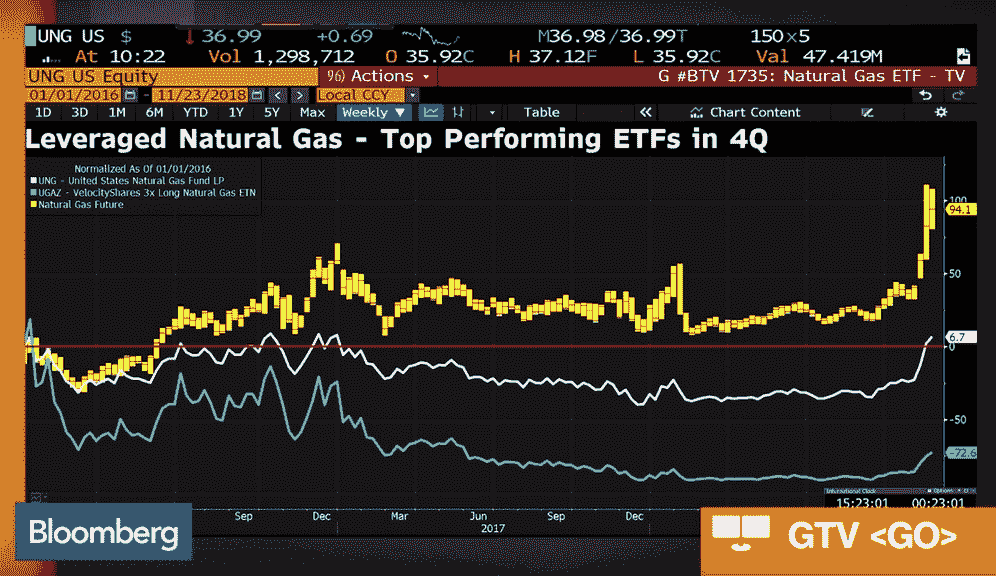

如在 Bloomberg TV 上看到的多个时间序列图

大多数预测工作都涉及回顾一段时间内的过去发展。时间序列数据集的概念是与预测相关的重要元素；例如，农民在预测作物产量时会查看时间序列数据集。正因为如此，统计学、计量经济学和工程学领域已经发展出了大量的知识和工具来处理时间序列。

本章中，我们将介绍一些至今仍然非常相关的经典工具。接着，我们将学习神经网络如何处理时间序列，以及深度学习模型如何表达不确定性。

在我们开始探讨时间序列之前，我需要为本章设定期望值。你们中的许多人可能是抱着学习股市预测的目的来到本章的，但我必须警告你们，本章并不是关于股市预测的，书中的任何章节也都不是。

经济理论表明，市场在一定程度上是有效的。有效市场假说指出，所有公开可用的信息都已反映在股票价格中。这也包括了如何处理信息的方式，例如预测算法。

如果这本书展示了一种能够预测股市价格并带来超额回报的算法，许多投资者会立即实施该算法。由于这些算法会在预期价格变化的情况下买入或卖出股票，它们会改变当前的价格，从而消除使用该算法可能带来的优势。因此，本书展示的算法对于未来读者是行不通的。

但本章将使用来自 Wikipedia 的流量数据。我们的目标是预测特定 Wikipedia 页面上的流量。我们可以通过 `wikipediatrend` CRAN 包获取 Wikipedia 流量数据。

我们将在这里使用的数据集是约 145,000 个维基百科页面的流量数据，这些数据由 Google 提供。数据可以从[Kaggle](https://www.kaggle.com/c/web-traffic-time-series-forecasting)获取。

### 注意

数据可以通过以下链接找到：[`www.kaggle.com/c/web-traffic-time-series-forecasting`](https://www.kaggle.com/c/web-traffic-time-series-forecasting)

[`www.kaggle.com/muonneutrino/wikipedia-traffic-data-exploratio`](https://www.kaggle.com/muonneutrino/wikipedia-traffic-data-exploratio)

# pandas 中的可视化和准备

正如我们在第二章，*将机器学习应用于结构化数据*中看到的，通常在开始训练之前先对数据进行概览是个好主意。你可以通过运行以下代码来实现对 Kaggle 上获得的数据的概览：

```py
train = pd.read_csv('../input/train_1.csv').fillna(0)
train.head()
```

运行这段代码将给我们以下表格：

|   | 页面 | 2015-07-01 | 2015-07-02 | … | 2016-12-31 |
| --- | --- | --- | --- | --- | --- |
| 0 | 2NE1_zh.wikipedia.org_all-access_spider | 18.0 | 11.0 | … | 20.0 |
| 1 | 2PM_zh.wikipedia.org_all-access_spider | 11.0 | 14.0 | … | 20.0 |

**页面**列中的数据包含页面的名称、维基百科页面的语言、访问设备的类型以及访问代理。其他列包含该页面在该日期的流量。

因此，在前面的表格中，第一行包含了 2NE1（一个韩国流行乐队）在中文维基百科页面上的数据，所有访问方法的数据，但只针对被分类为蜘蛛流量的代理；也就是说，来自非人工访问的流量。虽然大多数时间序列工作集中于局部、时间相关的特征，但我们可以通过提供对**全球特征**的访问来丰富我们的所有模型。

因此，我们希望将页面字符串拆分成更小、更有用的特征。我们可以通过运行以下代码来实现：

```py
def parse_page(page):
    x = page.split('_')
    return ' '.join(x[:-3]), x[-3], x[-2], x[-1]
```

我们通过下划线分割字符串。页面名称中可能也包含下划线，因此我们分离出最后三个字段，然后将其余部分连接起来，得到文章的主题。

正如我们在以下代码中看到的，倒数第三个元素是子 URL，例如，[en.wikipedia.org](http://en.wikipedia.org)。倒数第二个元素是访问类型，最后一个元素是代理：

```py
parse_page(train.Page[0])
```

```py
Out:
('2NE1', 'zh.wikipedia.org', 'all-access', 'spider')

```

当我们将这个函数应用于训练集中的每个页面条目时，我们会得到一个元组列表，然后我们可以将它们连接到一个新的 DataFrame 中，正如我们在以下代码中看到的：

```py
l = list(train.Page.apply(parse_page))
df = pd.DataFrame(l)
df.columns = ['Subject','Sub_Page','Access','Agent']
```

最后，我们必须将这个新的 DataFrame 添加回原始的 DataFrame 中，然后再删除原始的页面列，我们可以通过运行以下代码来实现：

```py
train = pd.concat([train,df],axis=1)
del train['Page']
```

运行这段代码后，我们已经成功加载了数据集。这意味着我们现在可以开始探索数据了。

## 汇总全球特征统计数据

在完成所有这些工作后，我们现在可以创建一些关于全球**特征**的汇总统计数据。

pandas 的 `value_counts()` 函数允许我们轻松绘制全局特征的分布图。通过运行以下代码，我们将获得我们维基百科数据集的条形图输出：

```py
train.Sub_Page.value_counts().plot(kind='bar')
```

运行前面的代码后，我们将输出一个条形图，该图对数据集中的记录分布进行排名：

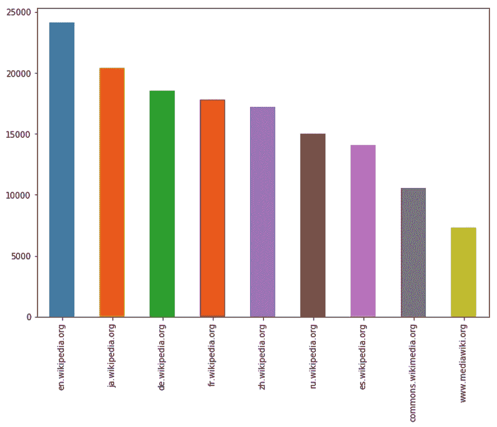

按维基百科国家页面划分的记录分布

上面的图显示了每个子页面的可用时间序列的数量。维基百科有不同语言的子页面，我们可以看到我们的数据集中包含来自英文（en）、日文（ja）、德文（de）、法文（fr）、中文（zh）、俄文（ru）和西班牙文（es）维基百科站点的页面。

在我们生成的条形图中，你可能还注意到有两个非国家级的维基百科站点。 [commons.wikimedia.org](http://commons.wikimedia.org) 和 [www.mediawiki.org](http://www.mediawiki.org) 都用于托管媒体文件，如图片。

让我们再运行一次该命令，这次关注访问类型：

```py
train.Access.value_counts().plot(kind='bar')
```

运行该代码后，我们将看到如下的条形图作为输出：

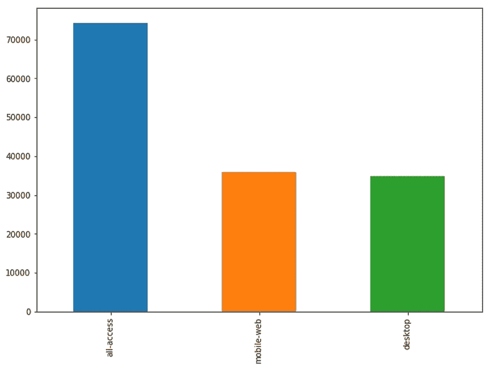

按访问类型划分的记录分布

有两种可能的访问方式：**移动端**和**桌面端**。还有第三种选择**全访问**，它结合了移动端和桌面端的统计数据。

然后，我们可以通过运行以下代码绘制按代理划分的记录分布：

```py
train.Agent.value_counts().plot(kind='bar')
```

运行该代码后，我们将输出以下图表：

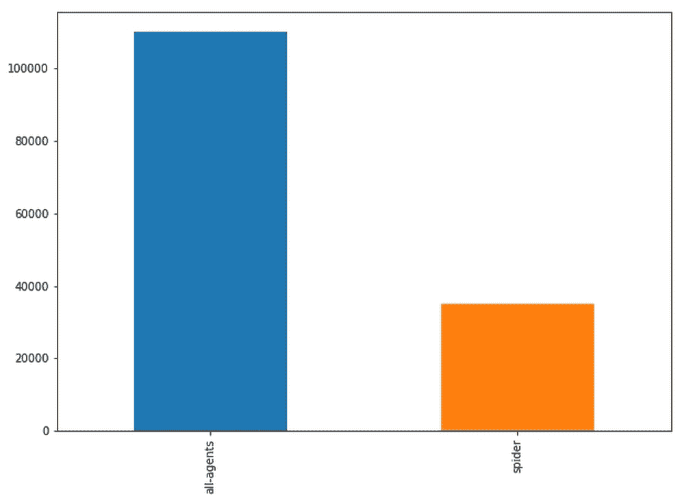

按代理划分的记录分布

不仅蜘蛛代理有时间序列数据，所有其他类型的访问也有时间序列数据。在经典的统计建模中，下一步是分析这些全局特征的影响，并基于这些特征构建模型。然而，如果有足够的数据和计算能力，这一步不是必须的。

如果是这种情况，那么神经网络能够自行发现全局特征的影响，并基于它们的交互作用创建新特征。关于全局特征，只有两个真正需要考虑的问题：

+   **特征的分布是否非常偏斜？** 如果是这样，可能只有少数实例具备某个全局特征，我们的模型可能会在这个全局特征上发生过拟合。想象一下，如果数据集中只有少量来自中文维基百科的文章，算法可能会过度依赖这个特征，从而过拟合这少数的中文条目。我们的分布相对均匀，因此无需担心这一点。

+   **特征是否能轻松编码？** 一些全局特征无法进行独热编码（one-hot encoding）。假设我们得到了带有时间序列的维基百科文章全文，直接使用该特征是不可能的，因为需要进行一些复杂的预处理才能使用它。在我们的例子中，有一些相对直接的类别可以进行独热编码。然而，学科名称则无法进行独热编码，因为它们的数量实在太多了。

## 检查样本时间序列

为了检查我们数据集的全局特征，我们需要查看一些样本时间序列，以便了解我们可能面临的挑战。在这一部分，我们将绘制来自美国的音乐二人组*Twenty One Pilots*的英语语言页面的观看次数。

为了绘制实际的页面观看次数，并同时计算 10 天滚动平均值，我们可以通过运行以下代码来实现：

```py
idx = 39457

window = 10

data = train.iloc[idx,0:-4]
name = train.iloc[idx,-4]
days = [r for r in range(data.shape[0] )]

fig, ax = plt.subplots(figsize=(10, 7))

plt.ylabel('Views per Page')
plt.xlabel('Day')
plt.title(name)

ax.plot(days,data.values,color='grey')
ax.plot(np.convolve(data, 
                    np.ones((window,))/window, 
                    mode='valid'),color='black')

ax.set_yscale('log')
```

这段代码有很多内容，值得逐步分析。首先，我们定义我们想要绘制的行。二十一飞行员的文章位于训练数据集中的第 39,457 行。从这里开始，我们再定义滚动平均值的窗口大小。

我们使用 pandas 的`iloc`工具从整体数据集中分离出页面观看数据和名称。这使得我们可以通过行列坐标来索引数据。通过计算天数而不是显示所有测量日期，使得图表更加易于阅读，因此我们将为*X*轴创建一个天数计数器。

接下来，我们设置图表并确保它具有所需的大小，通过设置`figsize`。我们还定义了坐标轴标签和标题。接下来，我们绘制实际的页面观看次数。我们的*X*坐标是天数，*Y*坐标是页面观看次数。

为了计算均值，我们将使用**卷积（convolve）**操作，你可能会对它有所了解，因为我们在第三章 *利用计算机视觉* 中探讨过卷积。这个卷积操作会生成一个由窗口大小（在此为 10）除以的 1 的向量。卷积操作将该向量滑动到页面观看次数上，将 10 个页面观看次数与 1/10 相乘，然后将得到的向量相加。这就创建了一个窗口大小为 10 的滚动平均值。我们用黑色绘制这个平均值。最后，我们指定希望*Y*轴使用对数坐标刻度。

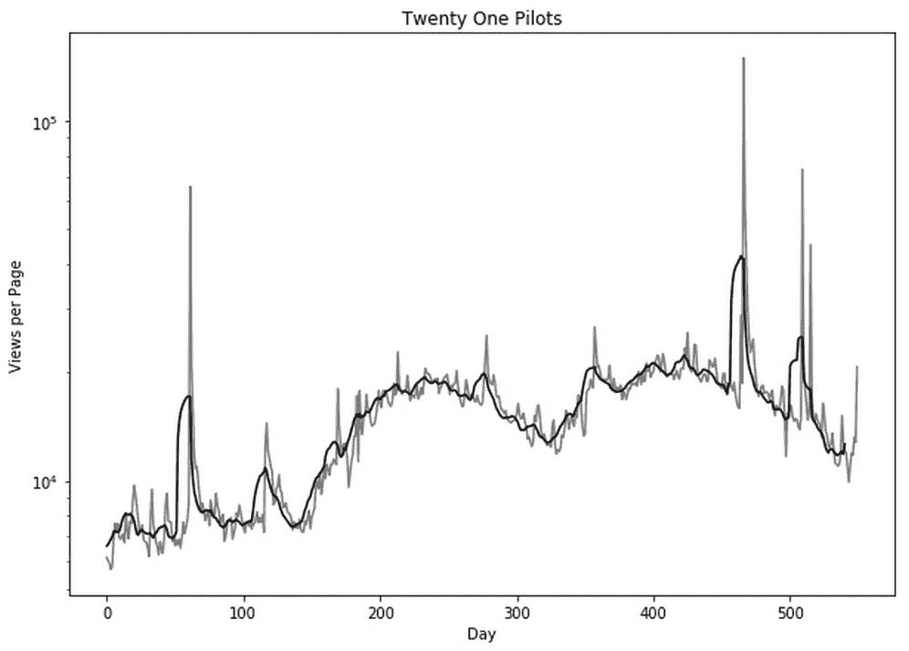

获取二十一飞行员维基百科页面的访问统计数据，并计算滚动平均值

你可以看到我们刚刚生成的二十一飞行员（Twenty One Pilots）图表中有一些非常大的波动，尽管我们使用了对数坐标轴。在某些日子里，观看次数激增到仅仅几天前的 10 倍。因此，很快就可以看出，一个好的模型必须能够应对这种极端的波动。

在继续之前，值得指出的是，页面观看次数随时间的推移总体上呈现上升趋势，这一全球趋势也是显而易见的。

为了更好地说明，我们绘制了所有语言版本中《Twenty One Pilots》的关注度图。我们可以通过运行以下代码来实现：

```py
fig, ax = plt.subplots(figsize=(10, 7))
plt.ylabel('Views per Page')
plt.xlabel('Day')
plt.title('Twenty One Pilots Popularity')
ax.set_yscale('log')

for country in ['de','en','es','fr','ru']:
    idx= np.where((train['Subject'] == 'Twenty One Pilots') 
                  & (train['Sub_Page'] == '{}.wikipedia.org'.format(country)) & (train['Access'] == 'all-access') & (train['Agent'] == 'all-agents'))

    idx=idx[0][0]

    data = train.iloc[idx,0:-4]
    handle = ax.plot(days,data.values,label=country)

ax.legend()
```

在这个代码片段中，我们首先像之前一样设置图表。然后，我们遍历语言代码并找到《Twenty One Pilots》的索引。索引是一个包含元组的数组，所以我们需要提取出指定实际索引的整数。接着，我们从训练数据集中提取页面浏览数据并绘制页面浏览量图。

在以下图表中，我们可以查看刚刚生成的代码输出：

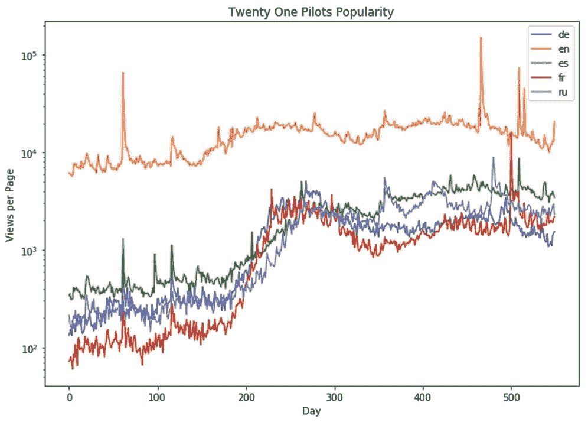

按国家访问《Twenty One Pilots》的统计数据

显然，时间序列之间存在一定的关联性。英语版的维基百科（最上面一条）毫无意外地是最受欢迎的。我们还可以看到，我们数据集中的时间序列显然并不平稳；它们随时间变化，均值和标准差都有所波动。

平稳过程是指其无条件联合概率分布随时间保持不变的过程。换句话说，诸如序列的均值或标准差应该保持不变。

然而，正如你所看到的，在前面图表中的第 200 到 250 天之间，页面的平均浏览量发生了剧烈变化。这个结果动摇了许多经典建模方法所做的一些假设。然而，金融时间序列几乎从不具有平稳性，因此处理这些问题是值得的。通过解决这些问题，我们能熟悉一些有用的工具，帮助我们应对非平稳性问题。

## 不同类型的平稳性

平稳性可以有不同的含义，理解在当前任务中需要哪种类型的平稳性至关重要。为简单起见，我们将在这里仅关注两种类型的平稳性：均值平稳性和方差平稳性。下图展示了四个具有不同程度（非）平稳性的时间序列：

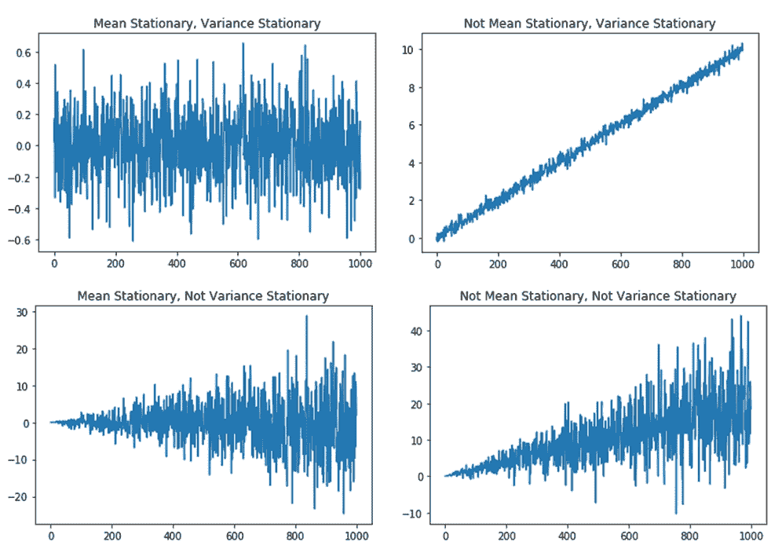

均值平稳性指的是时间序列的水平是常数。这里，个别数据点当然可能有所偏离，但长期均值应该是稳定的。方差平稳性指的是均值的方差是常数。同样，可能会有一些异常值和短期序列，其方差似乎较高，但总体方差应保持在同一水平。第三种平稳性，即协方差平稳性，难以可视化，且在此未展示。它指的是不同滞后期之间的协方差保持恒定。当人们提到协方差平稳性时，通常是指均值、方差和协方差都平稳的特殊条件。许多计量经济学模型，特别是在风险管理中，都是在这一协方差平稳性的假设下运行的。

## 为什么平稳性很重要

许多经典的计量经济学方法假设某种形式的平稳性。其关键原因是，当时间序列平稳时，推断和假设检验效果更好。然而，即便从纯粹的预测角度来看，平稳性也有帮助，因为它减轻了模型的工作量。看看前面图表中的**非均值平稳**系列。你可以看到，预测该系列的一个主要部分是认识到该系列正在向上移动。如果我们能够在模型之外捕捉到这一事实，模型需要学习的内容就会少一些，并且可以将其能力用于其他目的。另一个原因是，它保持了我们输入模型的数值在相同的范围内。记住，在使用神经网络之前，我们需要对数据进行标准化。如果股价从 1 美元涨到 1000 美元，我们最终会得到非标准化的数据，这将使得训练变得困难。

## 使时间序列平稳

实现金融数据（特别是价格）均值平稳性的标准方法是差分。这指的是从价格中计算回报。在下面的图像中，你可以看到 S&P 500 的原始版本和差分版本。原始版本不是均值平稳的，因为其值在增长，而差分版本则大致平稳。

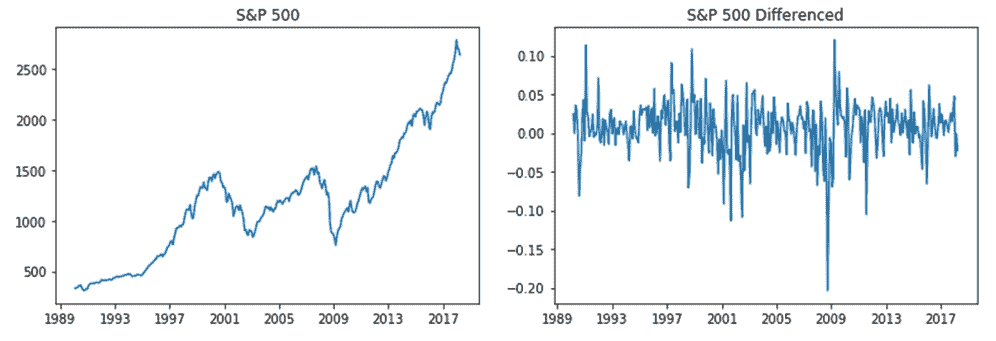

另一种基于线性回归的均值平稳性方法是将线性模型拟合到数据中。一个常用的经典建模库是`statsmodels`，它有一个内置的线性回归模型。以下示例展示了如何使用`statsmodels`从数据中去除线性趋势：

```py
time = np.linspace(0,10,1000)
series = time
series = series + np.random.randn(1000) *0.2

mdl = sm.OLS(time, series).fit()
trend = mdl.predict(time)
```

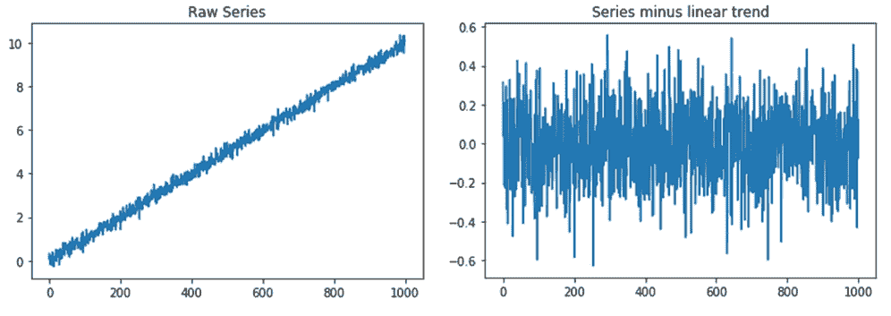

值得强调的是，**平稳性是建模的一部分，应该只在训练集上进行拟合**。对于差分来说，这不是大问题，但对于线性去趋势化可能会导致问题。

去除方差非平稳性更为困难。一个典型的方法是计算滚动方差，并将新值除以该方差。在训练集上，你还可以**进行学生化**数据。为此，你需要计算每日方差，然后将所有值除以其平方根。同样，你只能在训练集上进行此操作，因为方差计算要求你已经知道这些值。

## 何时忽略平稳性问题

有时候你不必担心平稳性。例如，在预测突变时，所谓的结构性断裂。在维基百科的例子中，我们感兴趣的是知道何时网站的访问频率比之前高得多。在这种情况下，去除水平差异会阻止我们的模型学习预测这种变化。同样，我们可能能够轻松地将非平稳性纳入我们的模型中，或者在管道的后续阶段确保其平稳性。我们通常只在整个数据集的一个小子序列上训练神经网络。如果我们对每个子序列进行标准化，那么子序列内的均值变化可能可以忽略不计，我们就不必为此担心。预测比推理和假设检验更宽容一些，因此如果我们的模型能够识别出非平稳性，我们可能会容忍一些非平稳性。

# 快速傅里叶变换

另一个我们常常需要计算的有趣统计量是傅里叶变换（FT）。不深入数学细节，傅里叶变换将展示函数中某一特定频率下的振荡程度。

你可以将其想象为老式调频收音机上的调谐器。当你转动调谐器时，你在不同的频率之间搜索。偶尔，你会找到一个频率，能清楚地接收到某个电台的信号。傅里叶变换基本上就是扫描整个频率谱，并记录在哪些频率下有强信号。在时间序列的背景下，当我们尝试找到数据中的周期性模式时，这非常有用。

假设我们发现每周一次的频率给出了一个强烈的模式。这意味着，关于一周前同一天的交通情况的知识会有助于我们的模型。

当函数和傅里叶变换都是离散的，这通常发生在一系列日常测量中，这种情况称为**离散傅里叶变换**（**DFT**）。一种用于计算离散傅里叶变换的非常快速的算法被称为**快速傅里叶变换**（**FFT**），它如今已经成为科学计算中的一个重要算法。这个理论早在 1805 年就为数学家卡尔·高斯所知，但直到 1965 年才被美国数学家詹姆斯·W·库利（James W. Cooley）和约翰·图基（John Tukey）重新揭示。

本章的内容不涉及傅里叶变换如何以及为何有效，因此在本节中我们只会简要介绍。假设我们的函数是一根电线。我们将这根电线绕到一个点上，如果你绕电线时绕的圈数与信号的频率相匹配，那么信号的所有波峰都会集中在一点一侧。这意味着电线的质心将从我们绕线的点上移动开。

在数学中，将一个函数包裹在某个点周围可以通过将函数 *g*(*n*) 与 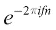 相乘来实现，其中 *f* 是包裹的频率，*n* 是序列中项的编号，*i* 是虚数单位的平方根 -1。对于不熟悉虚数的读者，可以将其视为坐标系，其中每个数字都有一个由实数和虚数组成的二维坐标。

为了计算质心，我们对离散函数中点的坐标取平均值。因此，DFT 公式如下所示：

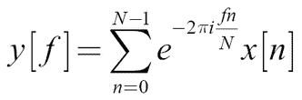

这里，*y*[*f*] 是变换后序列中的第 *f* 个元素，*x*[*n*] 是输入序列 *x* 中的第 *n* 个元素，*N* 是输入序列中的总点数。注意，*y*[*f*] 将是一个包含实数和离散元素的数字。

为了检测频率，我们真正关心的只是 *y*[*f*] 的整体幅值。为了获得这个幅值，我们需要计算虚部和实部平方和的平方根。在 Python 中，我们不需要担心所有的数学计算，因为我们可以使用 `scikit-learn` 的 fftpack，它内置了 FFT 函数。

下一步是运行以下代码：

```py
data = train.iloc[:,0:-4]
fft_complex = fft(data)
fft_mag = [np.sqrt(np.real(x)*np.real(x)+np.imag(x)*np.imag(x)) for x in fft_complex]
```

在这里，我们首先从训练集提取没有全局特征的时间序列测量值。然后，我们运行 FFT 算法，最后计算变换的幅值。

运行完该代码后，我们现在得到了所有时间序列数据集的傅里叶变换。为了更好地了解傅里叶变换的一般行为，我们可以通过简单地运行以下代码来对它们进行平均处理：

```py
arr = np.array(fft_mag)
fft_mean = np.mean(arr,axis=0)
```

这首先将幅值转换为 NumPy 数组，然后计算均值。我们想要计算每个频率的均值，而不仅仅是所有幅值的均值，因此我们需要指定计算均值的 `axis` 轴。

在这种情况下，序列按行堆叠，因此按列计算均值（axis 0）将得到按频率计算的均值。为了更好地绘制变换，我们需要创建一个测试频率的列表。频率的形式是：每一天的频率与数据集中所有天数的比值，例如 1/550，2/550，3/550，依此类推。要创建该列表，我们需要运行以下代码：

```py
fft_xvals = [day / fft_mean.shape[0] for day in range(fft_mean.shape[0])]
```

在这个可视化中，我们只关心每周范围内的频率，因此我们将去掉变换的后半部分，这可以通过运行以下代码来完成：

```py
npts = len(fft_xvals) // 2 + 1
fft_mean = fft_mean[:npts]
fft_xvals = fft_xvals[:npts]
```

最后，我们可以绘制我们的变换：

```py
fig, ax = plt.subplots(figsize=(10, 7))
ax.plot(fft_xvals[1:],fft_mean[1:])
plt.axvline(x=1./7,color='red',alpha=0.3)
plt.axvline(x=2./7,color='red',alpha=0.3)
plt.axvline(x=3./7,color='red',alpha=0.3)
```

绘制变换后，我们将成功地生成一个类似于这里所见的图表：

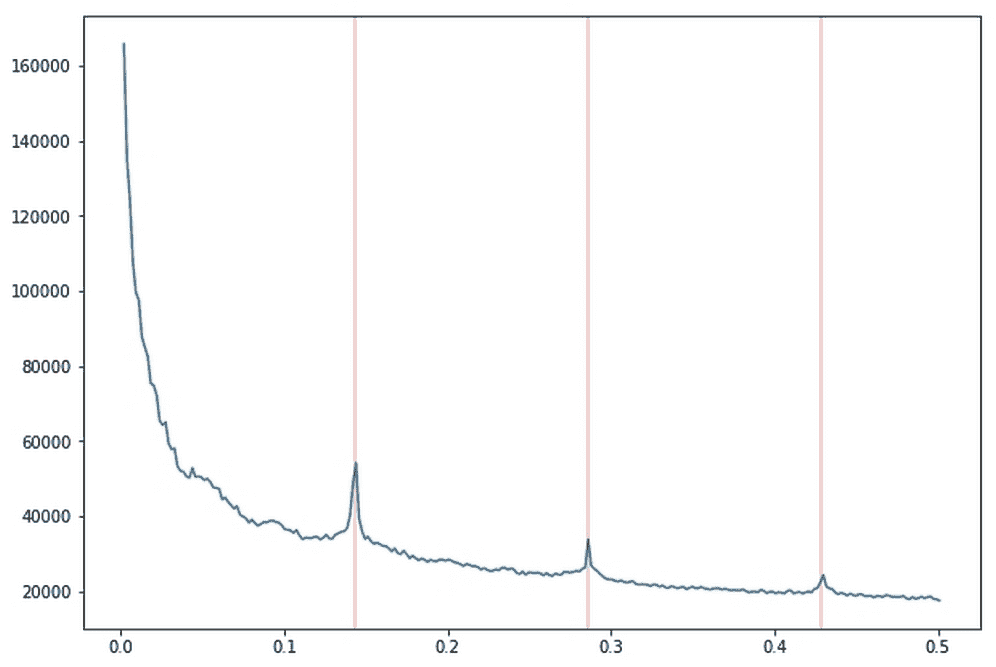

维基百科访问统计的傅里叶变换。由垂直线标记的尖峰。

正如我们在生成的图表中看到的，大约在 1/7（0.14）、2/7（0.28）和 3/7（0.42）处存在峰值。由于一周有七天，这意味着每周一次、每周两次和每周三次的频率。换句话说，页面统计数据大约每周会重复一次，因此，例如，某个星期六的访问量与上一个星期六的访问量相关。

# 自相关

自相关是指两个在给定间隔下分离的系列元素之间的相关性。直观地说，我们可能假设，了解上一个时间步的信息有助于我们预测下一个时间步。但是，来自两次时间步前的信息或来自 100 次时间步前的信息又如何呢？

运行`autocorrelation_plot`将绘制不同滞后时间下元素之间的相关性，并且可以帮助我们回答这些问题。事实上，pandas 自带了一个方便的自相关绘图工具。要使用它，我们需要传入一系列数据。在我们的例子中，我们传入一个页面的页面浏览量数据，随机选择。

我们可以通过运行以下代码来实现这一点：

```py
from pandas.plotting import autocorrelation_plot

autocorrelation_plot(data.iloc[110])
plt.title(' '.join(train.loc[110,['Subject', 'Sub_Page']]))
```

这将为我们呈现以下图表：

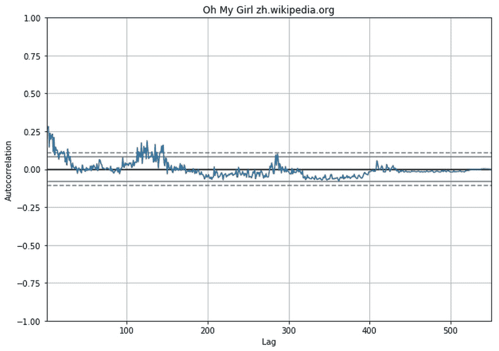

《哦我的女孩》中文维基页面的自相关

前面的图表显示了*哦我的女孩*，一支韩国女子组合，在中文维基百科页面的页面浏览量的相关性。

你可以看到，1 到 20 天之间的较短时间间隔显示出比较长时间间隔更高的自相关。同样，也可以看到一些奇特的峰值，例如大约在 120 天和 280 天时。可能是年、季度或月度事件导致了访问*哦我的女孩*维基页面的频率增加。

我们可以通过绘制 1,000 个这样的自相关图来检查这些频率的一般模式。为此，我们运行以下代码：

```py
a = np.random.choice(data.shape[0],1000)

for i in a:
    autocorrelation_plot(data.iloc[i])

plt.title('1K Autocorrelations')
```

这段代码首先从 0 到数据集中的系列数量（在我们的例子中大约是 145,000）之间随机抽取 1,000 个随机数。我们使用这些随机数作为索引，随机抽取数据集中的行，然后绘制自相关图，我们可以在下面的图形中看到：

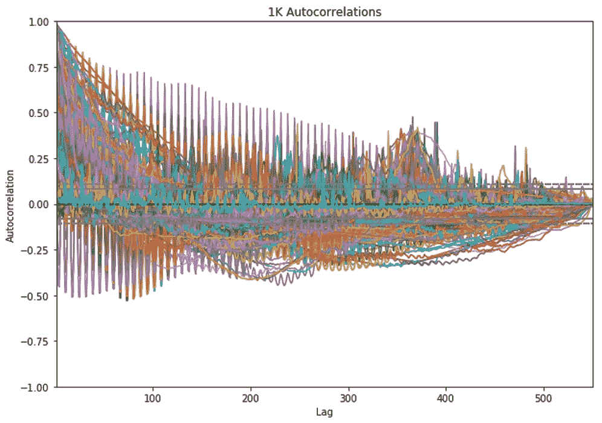

1,000 个维基页面的自相关

正如你所看到的，不同的系列可能具有非常不同的自相关性，而且图表中存在大量噪声。似乎在大约 350 天的节点上，相关性普遍较高。

因此，将年度滞后页面浏览量作为时间依赖特征以及一年的时间间隔自相关作为全局特征是有意义的。季度和半年滞后也是如此，因为它们似乎有较高的自相关性，或者有时会表现出相当负的自相关性，这使得它们也具有很高的价值。

时间序列分析，正如前面示例所示，可以帮助我们为模型工程化特征。复杂的神经网络理论上可以自行发现所有这些特征。然而，通常帮助它们一些，特别是关于长时间段的信息，会更加容易。

# 建立训练和测试方案

即使有大量数据可用，我们仍然需要问自己：我们如何在*训练*、*验证*和*测试*之间划分数据？这个数据集已经包含了未来数据的测试集，因此我们不需要担心测试集。但对于验证集，有两种分割方式：前向滚动分割和并行分割：

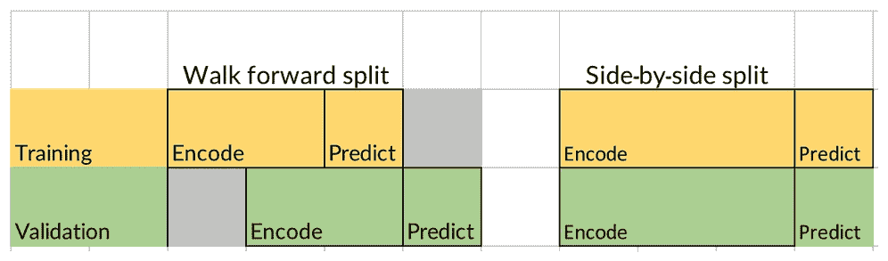

可能的测试方案

在前向滚动分割中，我们在所有 145,000 个序列上进行训练。为了验证，我们将使用所有序列中更近期的数据。在并行分割中，我们从多个序列中抽样用于训练，其余的用于验证。

两者都有优缺点。前向滚动分割的缺点是我们不能使用序列中的所有观测值来进行预测。并行分割的缺点是我们不能将所有序列都用于训练。

如果我们只有少量的序列，但每个序列有多个数据观测点，建议使用前向滚动分割。然而，如果我们有大量的序列，但每个序列的观测点较少，那么并行分割更为合适。

建立训练和测试方案也更好地契合了当前的预测问题。在并行分割中，模型可能会过拟合预测期间的全球事件。想象一下，如果在预测期内，Wikipedia 停机了一周，那么这一事件将减少所有页面的访问量，结果模型会过拟合这种全球事件。

我们在验证集中无法发现过拟合问题，因为预测期也会受到全球事件的影响。然而，在我们的案例中，我们有多个时间序列，但每个序列只有大约 550 个观测值。因此，似乎没有全球性事件能显著影响该时间段内的所有 Wikipedia 页面。

然而，确实有一些全球事件影响了某些页面的访问量，比如冬季奥运会。不过，在这种情况下，这是一种合理的风险，因为受到这种全球事件影响的页面数量仍然较少。由于我们拥有大量的序列，并且每个序列的观测值较少，因此在我们的情况下，并行分割更为可行。

在本章中，我们将重点讨论如何预测未来 50 天的流量。因此，我们必须首先将每个序列的最后 50 天与其他部分分开，如下面的代码所示，然后再分割训练集和验证集：

```py
from sklearn.model_selection import train_test_split

X = data.iloc[:,:500]
y = data.iloc[:,500:]

X_train, X_val, y_train, y_val = train_test_split(X.values, y.values, test_size=0.1, random_state=42)
```

在分割时，我们使用`X.values`来仅获取数据，而不是包含数据的 DataFrame。分割后，我们得到 130,556 个训练系列和 14,507 个验证系列。

在这个例子中，我们将使用**平均绝对百分比误差**（**MAPE**）作为损失和评估指标。如果`y`的真实值为零，MAPE 可能会导致除零错误。因此，为了防止除零错误的发生，我们将使用一个小值ε：

```py
def mape(y_true,y_pred):
    eps = 1
    err = np.mean(np.abs((y_true - y_pred) / (y_true + eps))) * 100
    return err
```

# 关于回测的说明

选择训练集和测试集的特殊性在系统化投资和算法交易中尤为重要。测试交易算法的主要方法是一个叫做**回测**的过程。

回测是指我们使用某一时间段的数据来训练算法，然后再用*更早*的数据测试其表现。例如，我们可以用 2015 年至 2018 年的数据进行训练，再用 1990 年至 2015 年的数据进行测试。通过这样做，不仅可以测试模型的准确性，还可以通过回测算法执行虚拟交易，从而评估其盈利能力。回测之所以重要，是因为有大量过去的数据可以利用。

尽管如此，回测确实存在一些偏差。我们来看看需要特别注意的四种最重要的偏差：

+   **前瞻偏差**：如果在模拟中不小心包含了未来的数据，而这些数据在当时是不可能已经获得的，就会引入前瞻偏差。这可能是模拟器中的技术错误造成的，也可能源自于参数计算。例如，如果某个策略利用了两只证券之间的相关性，而相关性是一次性计算得出的，那么就会引入前瞻偏差。最大值或最小值的计算也是如此。

+   **幸存者偏差**：如果在测试时只包含那些在模拟时仍然存在的股票，就会引入这种偏差。例如，考虑 2008 年金融危机，许多公司破产。如果在 2018 年构建模拟器时排除了这些公司股票，就会引入幸存者偏差。毕竟，在 2008 年，算法本可以投资这些股票。

+   **心理容忍偏差**：在回测中看起来不错的策略，未必在现实中有效。考虑一个算法，它连续四个月亏损，然后在回测中将亏损全部弥补。如果是回测，我们可能会对这个算法感到满意。然而，如果算法在现实中连续四个月亏损，我们却不知道它是否能弥补这些损失，那么我们会选择坚持下去，还是立即停止？在回测中，我们知道最终的结果，但在现实中，我们并不知情。

+   **过拟合**：这是所有机器学习算法面临的问题，但在回测中，过拟合是一个持久且隐蔽的问题。算法不仅可能会发生过拟合，算法的设计者也可能利用过去的知识，构建一个过拟合的算法。事后选股是很容易的，知识可以被纳入模型中，从而使得回测结果看起来非常好。虽然这种偏差可能比较微妙，比如依赖于过去表现良好的某些相关性，但在回测中评估的模型中很容易构建偏差。

建立良好的测试机制是任何量化投资公司或任何与预测密切合作的人的核心活动。除回测外，测试算法的一个流行策略是使用与股票数据在统计上相似，但因是生成的而有所不同的数据来测试模型。我们可能会构建一个生成器，生成看起来像真实股票数据但并不真实的数据，从而避免真实市场事件的知识渗透到我们的模型中。

另一种选择是静默地部署模型并在未来进行测试。算法运行，但仅执行虚拟交易，因此如果出现问题，资金不会丢失。这种方法利用未来的数据，而不是过去的数据。然而，这种方法的缺点是我们必须等待相当长的时间，才能使用该算法。

在实践中，通常使用组合机制。统计学家精心设计机制，以观察算法如何对不同的模拟做出响应。在我们的网络流量预测模型中，我们将简单地在不同的页面上进行验证，最后再对未来的数据进行测试。

# 中位数预测

一个好的合理性检查工具和常常被低估的预测工具是中位数。中位数是将分布的上半部分与下半部分分开的值；它恰好位于分布的中间。中位数的优点在于它能够去除噪音，并且比均值更不容易受到异常值的影响，而它捕捉分布中点的方式也使得计算变得更加简单。

为了进行预测，我们计算训练数据中回看窗口的中位数。在这个例子中，我们使用窗口大小为 50，但你可以尝试其他值。下一步是从我们的*X*值中选择最后 50 个值并计算中位数。

请花一点时间注意，在 NumPy 的中位数函数中，我们必须设置`keepdims=True`。这确保了我们保持一个二维矩阵，而不是一个一维数组，这在计算误差时非常重要。因此，为了进行预测，我们需要运行以下代码：

```py
lookback = 50

lb_data = X_train[:,-lookback:]

med = np.median(lb_data,axis=1,keepdims=True)

err = mape(y_train,med)
```

返回的输出显示我们得到了约 68.1% 的误差；考虑到我们方法的简单性，这个结果还不错。为了看看中位数是如何工作的，我们来绘制一下*X*值、真实的*y*值和一个随机页面的预测结果：

```py
idx = 15000

fig, ax = plt.subplots(figsize=(10, 7))

ax.plot(np.arange(500),X_train[idx], label='X')
ax.plot(np.arange(500,550),y_train[idx],label='True')

ax.plot(np.arange(500,550),np.repeat(med[idx],50),label='Forecast')

plt.title(' '.join(train.loc[idx,['Subject', 'Sub_Page']]))
ax.legend()
ax.set_yscale('log')
```

如你所见，我们的绘图包括绘制三个图。对于每个图，我们必须指定*X*和*Y*值。对于`X_train`，*X*值的范围是从 0 到 500，而对于`y_train`和预测值，它们的范围是从 500 到 550。然后，我们从训练数据中选择要绘制的序列。由于我们只有一个中位数值，所以我们重复所需序列的中位数预测 50 次，以便绘制我们的预测。

输出结果可以在这里看到：

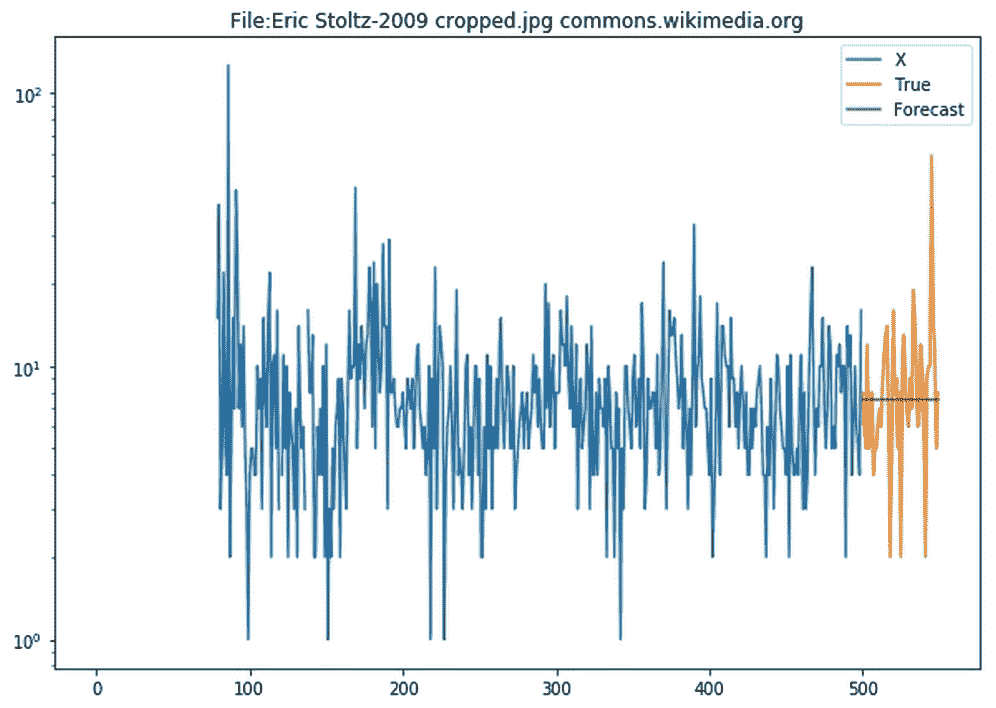

对于访问图像文件的中位数预测和实际值，真实值位于图形的右侧，中位数预测是它们之间的水平线。

如你在前面的输出中看到的中位数预测结果，这一页的数据（在这种情况下是美国演员埃里克·斯托尔茨的图片）非常嘈杂，而中位数能够穿透所有噪声。中位数在这里特别有用，尤其是对于那些访问不频繁且没有明显趋势或模式的页面。

这并不是你能做的所有事情。除了我们刚才讲解的内容外，你还可以，比如，针对周末使用不同的中位数，或者使用多个回溯周期的中位数中位数。像中位数预测这样一个简单的工具，通过聪明的特征工程就能获得良好的结果。因此，在使用更高级的方法之前，花一点时间实现中位数预测作为基准并进行合理性检查是非常有意义的。

# ARIMA

在前面关于探索性数据分析的部分中，我们谈到了季节性和平稳性在时间序列预测中的重要性。事实上，中位数预测在这两方面都有困难。如果时间序列的均值持续变化，那么中位数预测将无法继续该趋势；如果时间序列呈现周期性行为，那么中位数将无法继续该周期。

**ARIMA**，即**自回归积分滑动平均**，由三个核心组成部分构成：

+   **自回归**：该模型使用一个值与多个滞后观测值之间的关系。

+   **积分**：该模型使用原始观测值之间的差异，使时间序列变得平稳。一个持续上升的时间序列将有一个平坦的积分，因为点与点之间的差异始终相同。

+   **移动平均**：该模型使用来自移动平均的残差误差。

我们必须手动指定要包含多少个滞后观测值，*p*，我们希望多频繁地对序列进行差分，*d*，以及滑动平均窗口的大小，*q*。然后，ARIMA 对差分序列上的所有包含的滞后观测值和滑动平均残差进行线性回归。

我们可以在 Python 中使用 `statsmodels` 库来应用 ARIMA，这是一个包含许多有用统计工具的库。为此，我们只需要运行以下代码：

```py
from statsmodels.tsa.arima_model import ARIMA
```

然后，要创建一个新的 ARIMA 模型，我们传递要拟合的数据，在这个例子中是来自中文维基百科的 2NE1 页面访问量数据，以及所需的*p*、*d*和*q*值，按顺序排列。在这个例子中，我们希望包括五个滞后观测值，对数据进行一次差分，并取一个五天的移动平均窗口。代码如下：

```py
model = ARIMA(X_train[0], order=(5,1,5))
```

我们可以使用`model.fit()`来拟合模型：

```py
model = model.fit()
```

此时运行`model.summary()`将输出所有系数以及用于统计分析的显著性值。然而，我们更关心的是模型在预测方面的表现。因此，为了完成这一操作并查看输出，我们只需要运行：

```py
residuals = pd.DataFrame(model.resid)
ax.plot(residuals)

plt.title('ARIMA residuals for 2NE1 pageviews')
```

运行前面的代码后，我们可以输出 2NE1 页面访问量的预测结果，正如这个图表所示：

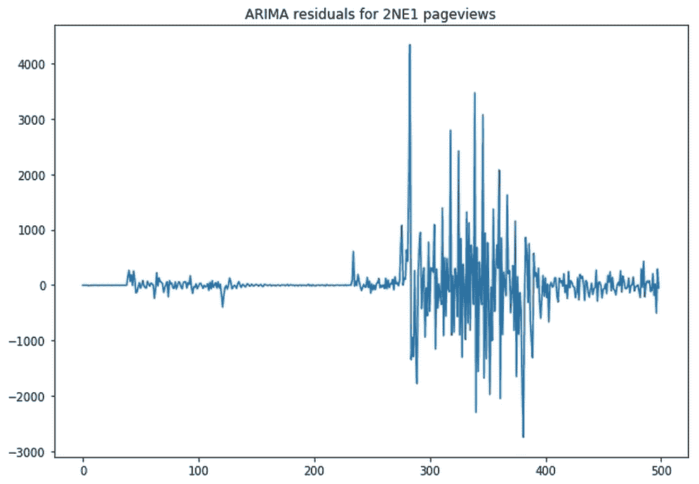

ARIMA 预测的残差误差

在前面的图表中，我们可以看到模型在开始时表现得非常好，但在大约 300 天时开始出现较大偏差。这可能是因为页面访问量更难预测，或者该时期波动性较大。

为了确保我们的模型不受偏差影响，我们需要检查残差的分布。我们可以通过绘制*核密度估计器*来实现，这是一个用于估计分布的数学方法，无需对其进行建模。

我们可以通过运行以下代码来完成：

```py
residuals.plot(kind='kde',figsize=(10,7),title='ARIMA residual distribution 2NE1 ARIMA',legend = False)
```

这段代码将输出以下图表：

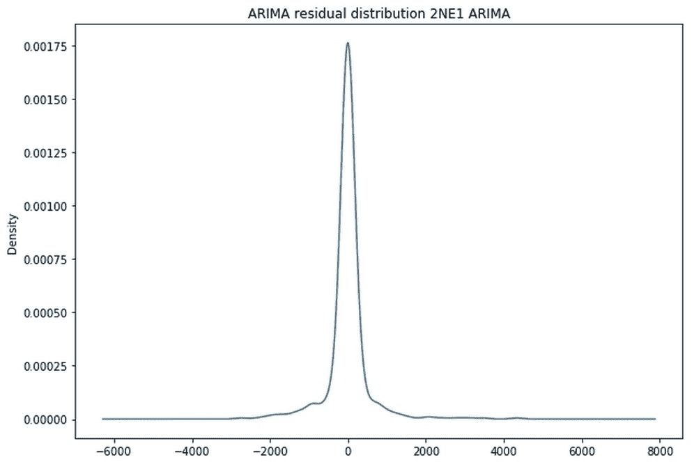

来自 ARIMA 预测的近似正态分布残差

如你所见，我们的模型大致呈现一个均值为零的高斯分布。因此，在这方面一切正常，但接下来出现了一个问题：“我们如何进行预测？”

要使用这个模型进行预测，我们只需要指定我们想要预测的天数，可以使用以下代码来完成：

```py
predictions, stderr, conf_int = model.forecast(50)
```

这个预测不仅给出了我们的预测值，还提供了标准误差和置信区间，默认情况下是 95%。

让我们将预测视图与实际视图进行对比，看看我们的表现如何。这个图表显示了过去 20 天的预测基础和预测结果，以便保持图表可读性。要生成这个图表，我们需要执行以下代码：

```py
fig, ax = plt.subplots(figsize=(10, 7))

ax.plot(np.arange(480,500),basis[480:], label='X')
ax.plot(np.arange(500,550),y_train[0], label='True')
ax.plot(np.arange(500,550),predictions, label='Forecast')

plt.title('2NE1 ARIMA forecasts')
ax.legend()
ax.set_yscale('log')
```

这段代码将输出以下图表：

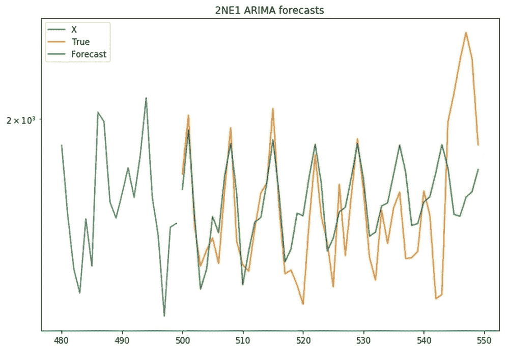

ARIMA 预测与实际访问量

你可以看到，ARIMA 很好地捕捉了序列的周期性。尽管其预测在最后有所偏离，但在开始时做得相当出色。

# 卡尔曼滤波器

卡尔曼滤波器是一种从噪声或不完全的测量中提取信号的方法。它们由匈牙利裔美国工程师鲁道夫·埃米尔·卡尔曼发明，最初用于电气工程，并在 1960 年代的阿波罗太空计划中首次使用。

卡尔曼滤波器背后的基本思想是，系统中有一个我们无法直接观察到的隐藏状态，但我们可以通过噪声测量来获取这个状态。想象一下你想测量火箭发动机内部的温度。你不能将测量设备直接放入发动机中，因为太热了，但你可以在发动机外部放置一个设备。

自然，这个测量值不会完美，因为发动机外部发生了许多外部因素，这些因素使得测量值存在噪声。因此，为了估计火箭内部的温度，我们需要一种能够处理噪声的方法。我们可以将页面预测中的内部状态视为某个页面的实际兴趣，而页面浏览量仅代表一个噪声测量值。

这里的思想是，时间 *k* 时的内部状态，，是由状态转移矩阵 *A* 乘以前一个内部状态，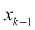，加上一些过程噪声，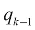。2NE1 维基页面的兴趣发展在某种程度上是随机的。这种随机性假定遵循一个均值为零、方差为 *Q* 的高斯正态分布：

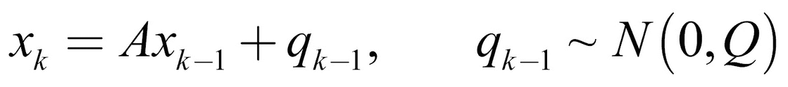

在时间 *k* 时获得的测量值，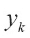，是一个观察模型，*H*，描述了状态如何转换为测量值，乘以状态，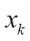，再加上一些观察噪声，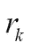。观察噪声假定遵循一个均值为零、方差为 *R* 的高斯正态分布：

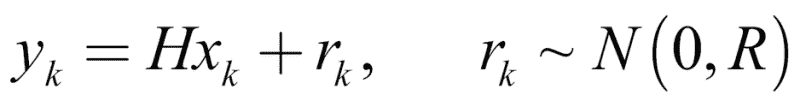

简而言之，卡尔曼滤波器通过估计 *A*、*H*、*Q* 和 *R* 来拟合一个函数。遍历时间序列并更新参数的过程称为平滑。估计过程的精确数学非常复杂，如果我们只是想进行预测，它并不是特别相关。然而，相关的是我们需要为这些值提供先验。

我们应该注意到，我们的状态不必只有一个数值。在这种情况下，我们的状态是一个八维向量，包含一个隐藏层以及七个层次来捕捉每周的季节性，正如我们在这段代码中看到的那样：

```py
n_seasons = 7

state_transition = np.zeros((n_seasons+1, n_seasons+1))

state_transition[0,0] = 1

state_transition[1,1:-1] = [-1.0] * (n_seasons-1)
state_transition[2:,1:-1] = np.eye(n_seasons-1)
```

转移矩阵，*A*，如下表所示，描述了一个隐藏层，我们可以将其解释为实际利率以及季节性模型：

```py
array([[ 1.,  0.,  0.,  0.,  0.,  0.,  0.,  0.],
       [ 0., -1., -1., -1., -1., -1., -1.,  0.],
       [ 0.,  1.,  0.,  0.,  0.,  0.,  0.,  0.],
       [ 0.,  0.,  1.,  0.,  0.,  0.,  0.,  0.],
       [ 0.,  0.,  0.,  1.,  0.,  0.,  0.,  0.],
       [ 0.,  0.,  0.,  0.,  1.,  0.,  0.,  0.],
       [ 0.,  0.,  0.,  0.,  0.,  1.,  0.,  0.],
       [ 0.,  0.,  0.,  0.,  0.,  0.,  1.,  0.]])
```

观察模型，*H*，将总兴趣加上季节性映射到一个单一的测量值：

```py
observation_model = [[1,1] + [0]*(n_seasons-1)]
```

观察模型如下所示：

```py
[[1, 1, 0, 0, 0, 0, 0, 0]]

```

噪声先验只是通过“平滑因子”缩放的估计值，这使我们能够控制更新过程：

```py
smoothing_factor = 5.0

level_noise = 0.2 / smoothing_factor
observation_noise = 0.2
season_noise = 1e-3

process_noise_cov = np.diag([level_noise, season_noise] + [0]*(n_seasons-1))**2
observation_noise_cov = observation_noise**2
```

`process_noise_cov` 是一个八维向量，与八维状态向量相匹配。与此同时，`observation_noise_cov` 是一个单一的数字，因为我们只有一个测量值。这些先验的唯一要求是它们的形状必须允许前两个公式中描述的矩阵乘法。除此之外，我们可以自由地根据需要指定转移模型。

奥托·塞伊斯卡里（Otto Seiskari），一位数学家以及最初维基百科交通预测竞赛中的第 8 名获得者，编写了一个非常快速的卡尔曼滤波库，我们将在这里使用。 他的库允许对多个独立的时间序列进行矢量化处理，如果你需要处理 145,000 个时间序列，这非常方便。

### 注意

**注意**：该库的代码库可以在这里找到：[`github.com/oseiskar/simdkalman`](https://github.com/oseiskar/simdkalman)。

你可以使用以下命令安装他的库：

```py
pip install simdkalman

```

要导入它，运行以下代码：

```py
import simdkalman
```

尽管 `simdkalman` 非常复杂，但使用起来相当简单。首先，我们将使用我们刚刚定义的先验来指定一个卡尔曼滤波器：

```py
kf = simdkalman.KalmanFilter(state_transition = state_transition,process_noise = process_noise_cov,observation_model = observation_model,observation_noise = observation_noise_cov)
```

从那里我们可以估计参数并一步到位地计算预测：

```py
result = kf.compute(X_train[0], 50)
```

再次，我们为 2NE1 的中文页面进行预测，并创建 50 天的预测。请花一点时间注意，我们也可以传递多个系列，例如使用 `X_train[:10]` 来传递前 10 个系列，并一次性为它们计算独立的滤波器。

`compute` 函数的结果包含了平滑过程中的状态和观测估计值，以及预测的内部状态和观测值。状态和观测是高斯分布，因此为了获得可绘制的值，我们需要访问它们的均值。

我们的状态是八维的，但我们只关心非季节性状态值，因此我们需要索引均值，我们可以通过运行以下代码来实现：

```py
fig, ax = plt.subplots(figsize=(10, 7))
ax.plot(np.arange(480,500),X_train[0,480:], label='X')
ax.plot(np.arange(500,550),y_train[0],label='True')

ax.plot(np.arange(500,550),
        result.predicted.observations.mean,
        label='Predicted observations')

ax.plot(np.arange(500,550),
        result.predicted.states.mean[:,0],
        label='predicted states')

ax.plot(np.arange(480,500),
        result.smoothed.observations.mean[480:],
        label='Expected Observations')

ax.plot(np.arange(480,500),
        result.smoothed.states.mean[480:,0],
        label='States')

ax.legend()
ax.set_yscale('log')
```

上述代码将输出以下图表：

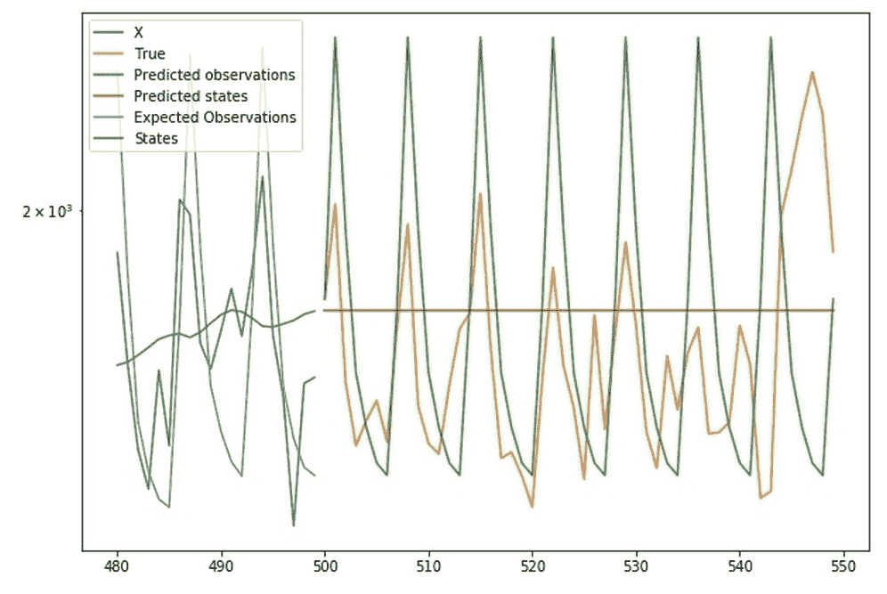

卡尔曼滤波器的预测和内部状态

我们可以在上面的图表中清楚地看到先验建模对预测的影响。我们可以看到模型预测了强烈的周波动，比实际观察到的波动要强。同样，我们也可以看到模型没有预见到任何趋势，因为在我们的先验模型中没有看到趋势。

卡尔曼滤波器是一种有用的工具，广泛应用于许多领域，从电气工程到金融。事实上，直到最近，它们都是时间序列建模的首选工具。聪明的建模者能够创建智能系统，非常好地描述时间序列。然而，卡尔曼滤波器的一个弱点是它们无法自主发现模式，必须依赖精心设计的先验才能有效工作。

在本章的后半部分，我们将探讨基于神经网络的方法，这些方法能够自动建模时间序列，并且通常具有更高的准确性。

# 神经网络预测

本章的后半部分将集中讲解神经网络。在第一部分，我们将构建一个简单的神经网络，只预测下一时刻的值。由于序列中的波动很大，我们将使用对数变换后的页面访问量作为输入和输出。我们还可以通过将短期预测神经网络的预测结果反馈到网络中，来进行长期预测。

在我们开始构建预测模型之前，需要进行一些预处理和特征工程。神经网络的优势在于它们不仅能够处理大量特征，还能处理非常高维的数据。劣势是我们必须小心输入哪些特征。记得我们在本章早些时候讨论过前瞻性偏差，包括将未来的数据作为输入，这些数据在预测时并不可得，这在回测中是一个问题。

## 数据准备

对于每个系列，我们将组装以下特征：

+   `log_view`: 页面访问量的自然对数。由于零的对数是未定义的，我们将使用`log1p`，它是页面访问量加一后的自然对数。

+   `days`: 一热编码的工作日。

+   `year_lag`: 365 天前的`log_view`值。如果没有可用值，则为`-1`。

+   `halfyear_lag`: 182 天前的`log_view`值。如果没有可用值，则为`-1`。

+   `quarter_lag`: 91 天前的`log_view`值。如果没有可用值，则为`-1`。

+   `page_enc`: 一热编码的子页面。

+   `agent_enc`: 一热编码的代理。

+   `acc_enc`: 一热编码的访问方式。

+   `year_autocorr`: 365 天系列的自相关。

+   `halfyr_autocorr`: 182 天系列的自相关。

+   `quarter_autocorr`: 91 天系列的自相关。

+   `medians`: 回溯期间页面访问量的中位数。

这些特征是为每个时间序列组装的，赋予我们的输入数据形状为（批次大小，回溯窗口大小，29）。

### 工作日

星期几是很重要的。星期天的访问行为可能与星期一不同，因为星期天人们可能坐在沙发上浏览，而星期一则是人们可能在查找工作相关的事情。因此，我们需要对工作日进行编码。简单的一热编码就能完成这项工作：

```py
import datetime
from sklearn.preprocessing import LabelEncoder
from sklearn.preprocessing import OneHotEncoder

weekdays = [datetime.datetime.strptime(date, '%Y-%m-%d').strftime('%a')
            for date in train.columns.values[:-4]]
```

首先，我们将日期字符串（如 2017-03-02）转换为工作日（星期四）。这非常简单，可以通过以下代码实现：

```py
day_one_hot = LabelEncoder().fit_transform(weekdays)
day_one_hot = day_one_hot.reshape(-1, 1)
```

接下来，我们将工作日编码为整数，"Monday"（星期一）变为`1`，"Tuesday"（星期二）变为`2`，依此类推。然后，我们将结果数组重塑为形状为（数组长度，1）的二维张量，这样一热编码器就知道我们有多个观察值，但只有一个特征，而不是反过来：

```py
day_one_hot = OneHotEncoder(sparse=False).fit_transform(day_one_hot)
day_one_hot = np.expand_dims(day_one_hot,0)
```

最后，我们对天数进行一热编码。然后，我们向张量中添加一个新的维度，表示我们只有一行日期。稍后我们将在该轴上重复这个数组：

```py
agent_int = LabelEncoder().fit(train['Agent'])
agent_enc = agent_int.transform(train['Agent'])
agent_enc = agent_enc.reshape(-1, 1)
agent_one_hot = OneHotEncoder(sparse=False).fit(agent_enc)

del agent_enc
```

在编码每个系列的代理时，我们稍后会需要这些代理的编码器。

在这里，我们首先创建一个`LabelEncoder`实例，它可以将代理名称字符串转换为整数。然后，我们将所有代理转换为这样的整数字符串，以便设置一个`OneHotEncoder`实例，它可以对代理进行独热编码。为了节省内存，我们接着会删除已经编码过的代理。

我们对子页面和访问方法也做同样的操作，运行以下代码：

```py
page_int = LabelEncoder().fit(train['Sub_Page'])
page_enc = page_int.transform(train['Sub_Page'])
page_enc = page_enc.reshape(-1, 1)
page_one_hot = OneHotEncoder(sparse=False).fit(page_enc)

del page_enc

acc_int = LabelEncoder().fit(train['Access'])
acc_enc = acc_int.transform(train['Access'])
acc_enc = acc_enc.reshape(-1, 1)
acc_one_hot = OneHotEncoder(sparse=False).fit(acc_enc)

del acc_enc
```

现在我们来讲讲滞后特征。技术上来说，神经网络可以自己发现哪些过去的事件对预测是相关的。然而，由于梯度消失问题，这非常困难，梯度消失问题在本章的*LSTM*部分会详细讲解。现在，先让我们设置一个小函数，用于创建一个滞后指定天数的数组：

```py
def lag_arr(arr, lag, fill):
    filler = np.full((arr.shape[0],lag,1),-1)
    comb = np.concatenate((filler,arr),axis=1)
    result = comb[:,:arr.shape[1]]
    return result
```

这个函数首先创建一个新的数组，用来填补由于偏移而产生的“空白”。新数组的行数和原始数组一样，但其序列长度或宽度是我们想要滞后的天数。然后，我们将这个数组附加到原始数组的前面。最后，我们从数组的末尾删除元素，以恢复到原始数组的序列长度或宽度。我们想要告诉我们的模型，不同时间间隔的自相关程度。为了计算单个序列的自相关，我们将序列按我们想要衡量的滞后量进行偏移。然后，我们计算自相关：

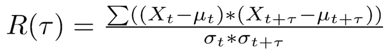

在这个公式中，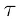 是滞后指标。我们并不直接使用 NumPy 函数，因为有可能分母为零。在这种情况下，我们的函数将返回 0：

```py
def single_autocorr(series, lag):
    s1 = series[lag:]
    s2 = series[:-lag]
    ms1 = np.mean(s1)
    ms2 = np.mean(s2)
    ds1 = s1 - ms1
    ds2 = s2 - ms2
    divider = np.sqrt(np.sum(ds1 * ds1)) * np.sqrt(np.sum(ds2 * ds2))
    return np.sum(ds1 * ds2) / divider if divider != 0 else 0
```

我们可以使用这个函数，它是我们为单个序列编写的，来创建一个自相关特征批次，如下所示：

```py
def batc_autocorr(data,lag,series_length):
    corrs = []
    for i in range(data.shape[0]):
        c = single_autocorr(data, lag)
        corrs.append(c)
    corr = np.array(corrs)
    corr = np.expand_dims(corr,-1)
    corr = np.expand_dims(corr,-1)
    corr = np.repeat(corr,series_length,axis=1)
    return corr
```

首先，我们计算批次中每个序列的自相关。然后，我们将这些相关性融合到一个 NumPy 数组中。由于自相关是一个全局特征，我们需要为序列的长度创建一个新维度，并且需要再创建一个新维度来表示这只是一个特征。接着，我们将自相关在整个序列的长度上重复。

`get_batch`函数利用所有这些工具来为我们提供一个数据批次，如下代码所示：

```py
def get_batch(train,start=0,lookback = 100):                  #1
    assert((start + lookback) <= (train.shape[1] - 5))        #2
    data = train.iloc[:,start:start + lookback].values        #3
    target = train.iloc[:,start + lookback].values
    target = np.log1p(target)                                 #4
    log_view = np.log1p(data)
    log_view = np.expand_dims(log_view,axis=-1)               #5
    days = day_one_hot[:,start:start + lookback]
    days = np.repeat(days,repeats=train.shape[0],axis=0)      #6
    year_lag = lag_arr(log_view,365,-1)
    halfyear_lag = lag_arr(log_view,182,-1)
    quarter_lag = lag_arr(log_view,91,-1)                     #7
    agent_enc = agent_int.transform(train['Agent'])
    agent_enc = agent_enc.reshape(-1, 1)
    agent_enc = agent_one_hot.transform(agent_enc)
    agent_enc = np.expand_dims(agent_enc,1)
    agent_enc = np.repeat(agent_enc,lookback,axis=1)          #8
    page_enc = page_int.transform(train['Sub_Page'])
    page_enc = page_enc.reshape(-1, 1)
    page_enc = page_one_hot.transform(page_enc)
    page_enc = np.expand_dims(page_enc, 1)
    page_enc = np.repeat(page_enc,lookback,axis=1)            #9
    acc_enc = acc_int.transform(train['Access'])
    acc_enc = acc_enc.reshape(-1, 1)
    acc_enc = acc_one_hot.transform(acc_enc)
    acc_enc = np.expand_dims(acc_enc,1)
    acc_enc = np.repeat(acc_enc,lookback,axis=1)              #10
    year_autocorr = batc_autocorr(data,lag=365,series_length=lookback)
    halfyr_autocorr = batc_autocorr(data,lag=182,series_length=lookback)
    quarter_autocorr = batc_autocorr(data,lag=91,series_length=lookback)                                       #11
    medians = np.median(data,axis=1)
    medians = np.expand_dims(medians,-1)
    medians = np.expand_dims(medians,-1)
    medians = np.repeat(medians,lookback,axis=1)              #12
    batch = np.concatenate((log_view,
                            days, 
                            year_lag, 
                            halfyear_lag, 
                            quarter_lag,
                            page_enc,
                            agent_enc,
                            acc_enc, 
                            year_autocorr, 
                            halfyr_autocorr,
                            quarter_autocorr, 
                            medians),axis=2)

    return batch, target
```

代码量有点多，所以让我们花点时间逐步走过之前的代码，以便充分理解它：

1.  确保有足够的数据可以从给定的起点创建一个回溯窗口和一个目标。

1.  将回溯窗口与训练数据分开。

1.  分离目标数据，并对其取回溯窗口的一加对数。

1.  取回溯窗口的一加对数并增加一个特征维度。

1.  获取从预计算的天数独热编码中得到的天数，并为批次中的每个时间序列重复这一过程。

1.  计算年滞后、半年滞后和季度滞后的滞后特征。

1.  这一步将使用之前定义的编码器对全局特征进行编码。接下来的两步，8 和 9，将执行相同的操作。

1.  这一步重复第 7 步。

1.  这一步重复第 7 步和第 8 步。

1.  计算年、半年和季度的自相关。

1.  计算回溯数据的中位数。

1.  将所有这些特征融合成一个批次。

最后，我们可以使用我们的`get_batch`函数编写生成器，就像我们在第三章*利用计算机视觉*中做的那样。这个生成器会遍历原始训练集，并将一个子集传递到`get_batch`函数中。然后，它会返回获得的批次。

请注意，我们选择随机起点，以充分利用我们的数据：

```py
def generate_batches(train,batch_size = 32, lookback = 100):
    num_samples = train.shape[0]
    num_steps = train.shape[1] - 5
    while True:
        for i in range(num_samples // batch_size):
            batch_start = i * batch_size
            batch_end = batch_start + batch_size

            seq_start = np.random.randint(num_steps - lookback)
            X,y = get_batch(train.iloc[batch_start:batch_end],start=seq_start)
            yield X,y
```

这个函数就是我们将训练和验证的内容。

# Conv1D

你可能还记得在第三章*利用计算机视觉*中提到的卷积神经网络（ConvNets，或 CNNs），我们简要地讨论了屋顶和保险。在计算机视觉中，卷积滤波器是二维滑动在图像上。此外，还有一种可以在序列上进行一维滑动的卷积滤波器。其输出是另一个序列，就像二维卷积的输出是另一幅图像一样。一维卷积的其他一切与二维卷积完全相同。

在这一部分，我们将从构建一个期望固定输入长度的 ConvNet 开始：

```py
n_features = 29
max_len = 100

model = Sequential()

model.add(Conv1D(16,5, input_shape=(100,29)))
model.add(Activation('relu'))
model.add(MaxPool1D(5))

model.add(Conv1D(16,5))
model.add(Activation('relu'))
model.add(MaxPool1D(5))
model.add(Flatten())
model.add(Dense(1))
```

请注意，在`Conv1D`和`Activation`旁边，还有两个层。在这个网络中，`MaxPool1D`的工作方式与我们之前在书中使用的`MaxPooling2D`完全相同。它会获取指定长度的序列片段，并返回该序列中的最大元素。这类似于它在二维卷积网络中如何返回一个小窗口中的最大元素。

请注意，最大池化总是返回每个通道的最大元素。`Flatten`将二维序列张量转换为一维的扁平张量。为了将`Flatten`与`Dense`结合使用，我们需要在输入形状中指定序列长度。在这里，我们通过`max_len`变量来设置它。我们这样做是因为`Dense`期望一个固定的输入形状，而`Flatten`会根据输入的大小返回一个张量。

使用`Flatten`的替代方法是`GlobalMaxPool1D`，它返回整个序列的最大元素。由于序列大小是固定的，因此你可以在之后使用`Dense`层，而无需固定输入长度。

我们的模型就像你预期的那样进行了编译：

```py
model.compile(optimizer='adam',loss='mean_absolute_percentage_error')
```

然后，我们在之前写的生成器上训练它。为了获得单独的训练集和验证集，我们必须首先拆分整个数据集，然后基于这两个数据集创建两个生成器。为此，请运行以下代码：

```py
from sklearn.model_selection import train_test_split

batch_size = 128
train_df, val_df = train_test_split(train, test_size=0.1)
train_gen = generate_batches(train_df,batch_size=batch_size)
val_gen = generate_batches(val_df, batch_size=batch_size)

n_train_samples = train_df.shape[0]
n_val_samples = val_df.shape[0]
```

最后，我们可以像在计算机视觉中一样，在生成器上训练我们的模型：

```py
model.fit_generator(train_gen, epochs=20,steps_per_epoch=n_train_samples // batch_size, validation_data= val_gen, validation_steps=n_val_samples // batch_size)
```

你的验证损失仍然会很高，大约为 12,798,928。绝对损失值从来不是衡量模型好坏的好指标。你会发现使用其他评估指标会更好，这样你就能判断你的预测是否有用。不过，请注意，我们将在本章稍后显著降低损失。

# 扩张卷积和因果卷积

如回测部分所述，我们必须确保模型不会受到未来数据泄漏偏差的影响：

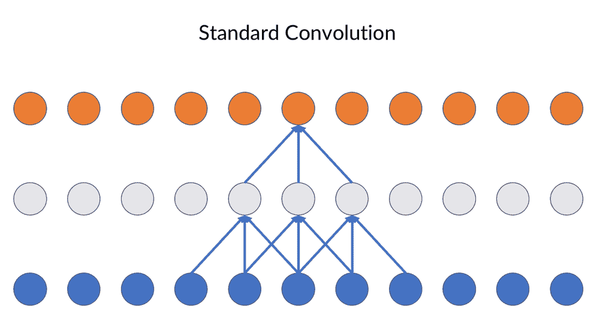

标准卷积不考虑卷积的方向

当卷积滤波器在数据上滑动时，它不仅查看过去的输入，还查看未来的输入。因果卷积确保时间*t*的输出仅来自时间*t - 1*的输入：

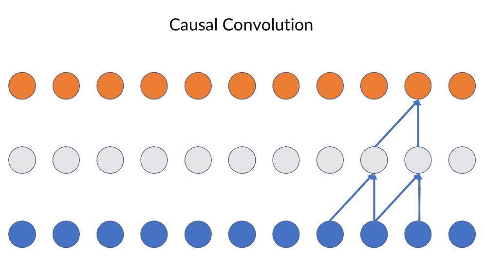

因果卷积将滤波器向正确的方向移动

在 Keras 中，我们只需将`padding`参数设置为`causal`。我们可以通过执行以下代码来实现：

```py
model.add(Conv1D(16,5, padding='causal'))
```

另一个有用的技巧是扩张卷积网络。扩张意味着滤波器仅访问每个*第 n*个元素，正如我们在下图中看到的那样。

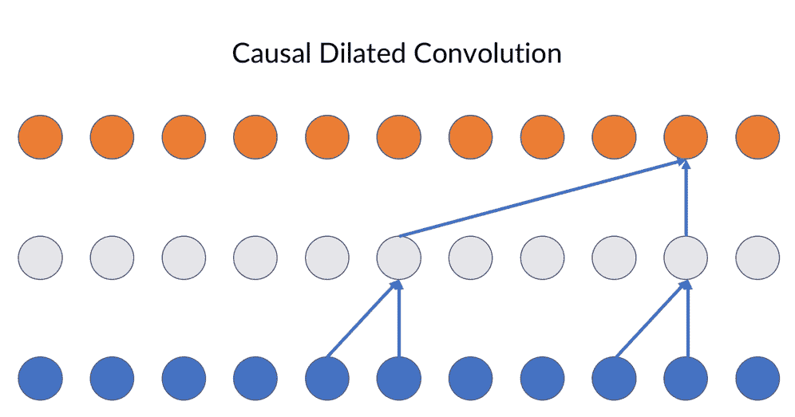

扩张卷积在卷积时跳过输入

在上面的图中，顶部的卷积层具有 4 的扩张率，而底部的卷积层具有 1 的扩张率。我们可以通过运行以下代码在 Keras 中设置扩张率：

```py
model.add(Conv1D(16,5, padding='causal', dilation_rate=4))
```

# 简单 RNN

另一种让顺序在神经网络中起作用的方法是给网络某种形式的记忆。到目前为止，我们的所有网络都是前向传播，而没有任何关于之前或之后发生的事情的记忆。现在是时候通过**循环神经网络**（**RNN**）来改变这一点了：

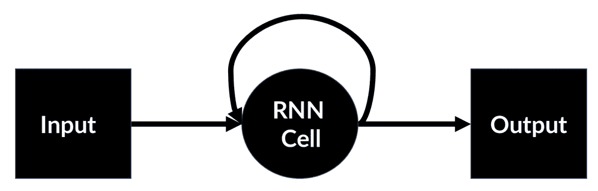

RNN 的结构

RNN 包含循环层。循环层可以记住它们的最后一个激活，并将其作为输入：

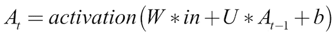

循环层接收一个序列作为输入。对于每个元素，它会计算一个矩阵乘法（*W * in*），就像`Dense`层一样，并将结果通过激活函数（例如`relu`）。然后，它保留自己的激活。当序列的下一个元素到来时，它会像之前一样执行矩阵乘法，但这一次它还将先前的激活与第二个矩阵相乘 (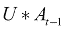)。循环层将两者的结果相加，并再次通过激活函数。

在 Keras 中，我们可以如下使用简单 RNN：

```py
from keras.layers import SimpleRNN

model = Sequential()
model.add(SimpleRNN(16,input_shape=(max_len,n_features)))
model.add(Dense(1))

model.compile(optimizer='adam',loss='mean_absolute_percentage_error')
```

我们需要指定的唯一参数是循环层的大小。这基本上与设置`Dense`层的大小相同，因为`SimpleRNN`层与`Dense`层非常相似，区别在于它们将输出反馈作为输入。默认情况下，RNN 只返回序列的最后一个输出。

为了堆叠多个 RNN，我们需要将`return_sequences`设置为`True`，我们可以通过运行以下代码来实现：

```py
from keras.layers import SimpleRNN

model = Sequential()
model.add(SimpleRNN(16,return_sequences=True,input_shape=(max_len,n_features)))
model.add(SimpleRNN(32, return_sequences = True))
model.add(SimpleRNN(64))
model.add(Dense(1))

model.compile(optimizer='adam',loss='mean_absolute_percentage_error')

You can then fit the model on the generator as before:

model.fit_generator(train_gen,epochs=20,steps_per_epoch=n_train_samples // batch_size, validation_data= val_gen, validation_steps=n_val_samples // batch_size)
```

运行这段代码后，我们会看到简单 RNN 比卷积模型表现得要好得多，损失大约为 1,548,653。你还记得之前我们的损失为 12,793,928。不过，我们可以使用更复杂的 RNN 版本做到更好。

# LSTM

在上一节中，我们了解了基本的 RNN。理论上，简单的 RNN 应该能够保持长期记忆。然而，实际上，由于梯度消失问题，这种方法常常不尽如人意。

在多个时间步的过程中，网络很难保持有意义的梯度。虽然这不是本章的重点，但可以在 1994 年的论文《*使用梯度下降学习长期依赖关系是困难的*》中更详细地了解为什么会发生这种情况，论文可以在-[`ieeexplore.ieee.org/document/279181`](https://ieeexplore.ieee.org/document/279181)上找到，作者是 Yoshua Bengio、Patrice Simard 和 Paolo Frasconi。

为了直接应对简单 RNN 的梯度消失问题，发明了**长短期记忆**（**LSTM**）层。这个层在长时间序列上表现得更好。然而，如果相关的观察数据落后几百步，即便是 LSTM 也会遇到困难。这就是我们为什么手动包括了一些滞后的观察数据。

在我们深入细节之前，先来看一个已在时间上展开的简单 RNN：

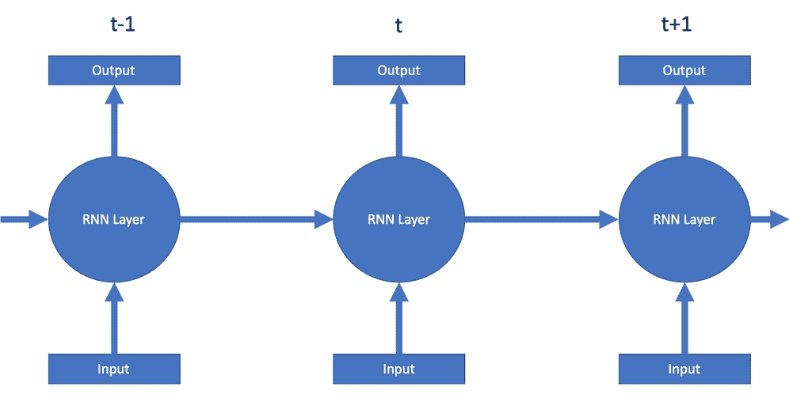

展开的 RNN

正如你所见，这与我们在第二章中看到的 RNN 相同，*将机器学习应用于结构化数据*，唯一的不同是它在时间上已经展开。

## 载体

LSTM 相对于 RNN 的核心增加就是*载体*。载体就像是一个沿着 RNN 层运行的传送带。在每个时间步，载体被输入到 RNN 层。新的载体是通过从输入、RNN 输出和旧载体中计算出来的，这一操作与 RNN 层本身是分开的：

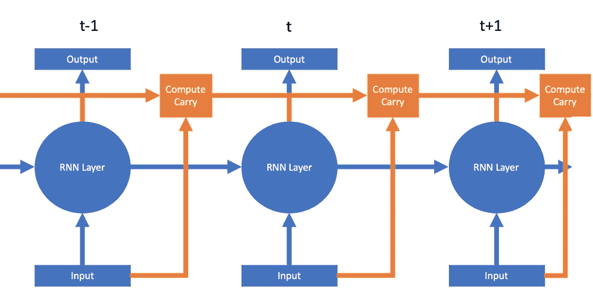

LSTM 示意图

要理解什么是计算载体，我们需要确定从输入和状态中应该添加什么：

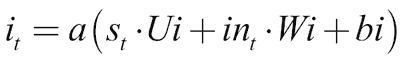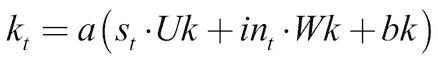

在这些公式中，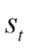是时间*t*的状态（简单 RNN 层的输出），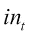是时间*t*的输入，而*Ui*、*Wi*、*Uk*和*Wk*是模型的参数（矩阵），这些参数将会被学习。*a()*是激活函数。

要确定从状态和输入中应该忘记什么，我们需要使用以下公式：

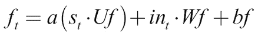

新的载体则按如下方式计算：

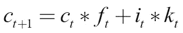

尽管标准理论声称 LSTM 层会学习该添加什么和该忘记什么，但实际上没有人知道 LSTM 内部到底发生了什么。然而，LSTM 模型已经证明在学习长期记忆方面非常有效。

请注意，LSTM 层不需要额外的激活函数，因为它们自带`tanh`激活函数。

LSTM 可以像`SimpleRNN`一样使用：

```py
from keras.layers import LSTM

model = Sequential()
model.add(LSTM(16,input_shape=(max_len,n_features)))
model.add(Dense(1))
```

要堆叠层，你还需要将`return_sequences`设置为`True`。请注意，你可以通过以下代码轻松地将`LSTM`和`SimpleRNN`结合使用：

```py
model = Sequential()
model.add(LSTM(32,return_sequences=True,input_shape=(max_len,n_features)))
model.add(SimpleRNN(16, return_sequences = True))
model.add(LSTM(16))
model.add(Dense(1))
```

### 注意

**注意**：如果你使用的是 GPU 并且在 Keras 中使用 TensorFlow 作为后端，请使用`CuDNNLSTM`代替`LSTM`。它在工作方式完全相同的情况下要快得多。

现在我们将像之前一样编译并运行模型：

```py
model.compile(optimizer='adam',loss='mean_absolute_percentage_error')

model.fit_generator(train_gen, epochs=20,steps_per_epoch=n_train_samples // batch_size, validation_data= val_gen, validation_steps=n_val_samples // batch_size)
```

这一次，损失下降到了 88,735，远远好于我们最初的模型，提升了几个数量级。

# 循环丢弃

读到这里，你已经遇到了*丢弃*的概念。丢弃会随机移除一个层次的某些输入元素。RNN 中的一个常见且重要的工具是*循环丢弃*，它不会在层与层之间移除输入，而是移除时间步之间的输入：

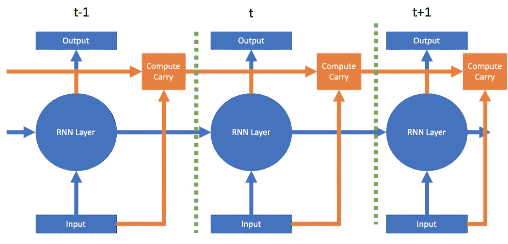

循环丢弃方案

与常规的丢弃一样，循环丢弃也具有正则化效果，并且可以防止过拟合。在 Keras 中，只需向 LSTM 或 RNN 层传递一个参数即可使用它。

如我们在下面的代码中所见，循环丢弃与常规丢弃不同，它没有自己的层：

```py
model = Sequential()
model.add(LSTM(16, recurrent_dropout=0.1,return_sequences=True,input_shape=(max_len,n_features)))

model.add(LSTM(16,recurrent_dropout=0.1))

model.add(Dense(1))
```

# 贝叶斯深度学习

现在我们有了一整套可以对时间序列进行预测的模型。但这些模型给出的点估计是合理的估计，还是仅仅是随机猜测？模型的确定性如何？大多数经典的概率建模技术，如卡尔曼滤波器，能够为预测提供置信区间，而常规的深度学习无法做到这一点。贝叶斯深度学习领域结合了贝叶斯方法与深度学习，使模型能够表达不确定性。

贝叶斯深度学习的核心思想是模型中存在固有的不确定性。有时通过学习权重的均值和标准差，而不是单一的权重值来实现这一点。然而，这种方法增加了所需参数的数量，因此并没有广泛采用。一种更简单的技巧是，在预测时启用丢弃，然后进行多次预测，从而将常规深度网络转化为贝叶斯深度网络。

在这一节中，我们将使用一个比之前更简单的数据集。我们的`X`值是 20 个介于-5 和 5 之间的随机值，而`y`值只是这些值应用正弦函数后的结果。

我们首先运行以下代码：

```py
X = np.random.rand(20,1) * 10-5
y = np.sin(X)
```

我们的神经网络也相对简单。请注意，Keras 不允许我们将 dropout 层作为第一层，因此我们需要添加一个 `Dense` 层，它仅仅通过输入值。我们可以通过以下代码来实现：

```py
from keras.models import Sequential
from keras.layers import Dense, Dropout, Activation

model = Sequential()

model.add(Dense(1,input_dim = 1))
model.add(Dropout(0.05))

model.add(Dense(20))
model.add(Activation('relu'))
model.add(Dropout(0.05))

model.add(Dense(20))
model.add(Activation('relu'))
model.add(Dropout(0.05))

model.add(Dense(20))
model.add(Activation('sigmoid'))

model.add(Dense(1))
```

为了拟合这个函数，我们需要一个相对较低的学习率，因此我们导入了 Keras 的普通随机梯度下降优化器，以便在其中设置学习率。然后我们训练模型 10,000 个 epochs。由于我们对训练日志不感兴趣，我们将 `verbose` 设置为 `0`，这样模型就会“安静”地训练。

我们通过运行以下代码来实现这一点：

```py
from keras.optimizers import SGD
model.compile(loss='mse',optimizer=SGD(lr=0.01))
model.fit(X,y,epochs=10000,batch_size=10,verbose=0)
```

我们希望在更大的数值范围内测试我们的模型，因此我们创建了一个包含 200 个值的测试数据集，范围从 -10 到 10，间隔为 0.1。我们可以通过运行以下代码来模拟测试：

```py
X_test = np.arange(-10,10,0.1)
X_test = np.expand_dims(X_test,-1)
```

现在到了魔术环节！使用 `keras.backend`，我们可以将设置传递给 TensorFlow，后者在后台运行操作。我们使用后端将学习阶段参数设置为 `1`。这使得 TensorFlow 认为我们正在训练，因此它会应用 dropout。接着，我们为测试数据做 100 次预测。这 100 次预测的结果是每个 `X` 实例对应的 `y` 值的概率分布。

### 注意

**注意**：为了让此示例正常工作，必须在定义和训练模型之前加载后端、清除会话并设置学习阶段，因为训练过程会将该设置保留在 TensorFlow 图中。你也可以保存已训练的模型，清除会话，然后重新加载模型。请参阅本节的代码，查看如何实现。

要开始这个过程，我们首先运行：

```py
import keras.backend as K
K.clear_session()
K.set_learning_phase(1)
```

现在我们可以通过以下代码获取我们的分布：

```py
probs = []
for i in range(100):
    out = model.predict(X_test)
    probs.append(out)
```

接下来，我们可以计算我们的分布的均值和标准差：

```py
p = np.array(probs)

mean = p.mean(axis=0)
std = p.std(axis=0)
```

最后，我们绘制了模型的预测结果，分别为一、二、四个标准差（对应不同的蓝色阴影）：

```py
plt.figure(figsize=(10,7))
plt.plot(X_test,mean,c='blue')

lower_bound = mean - std * 0.5
upper_bound =  mean + std * 0.5
plt.fill_between(X_test.flatten(),upper_bound.flatten(),lower_bound.flatten(),alpha=0.25, facecolor='blue')

lower_bound = mean - std
upper_bound =  mean + std
plt.fill_between(X_test.flatten(),upper_bound.flatten(),lower_bound.flatten(),alpha=0.25, facecolor='blue')

lower_bound = mean - std * 2
upper_bound =  mean + std * 2
plt.fill_between(X_test.flatten(),upper_bound.flatten(),lower_bound.flatten(),alpha=0.25, facecolor='blue')

plt.scatter(X,y,c='black')
```

运行这段代码的结果，我们将看到以下图表：

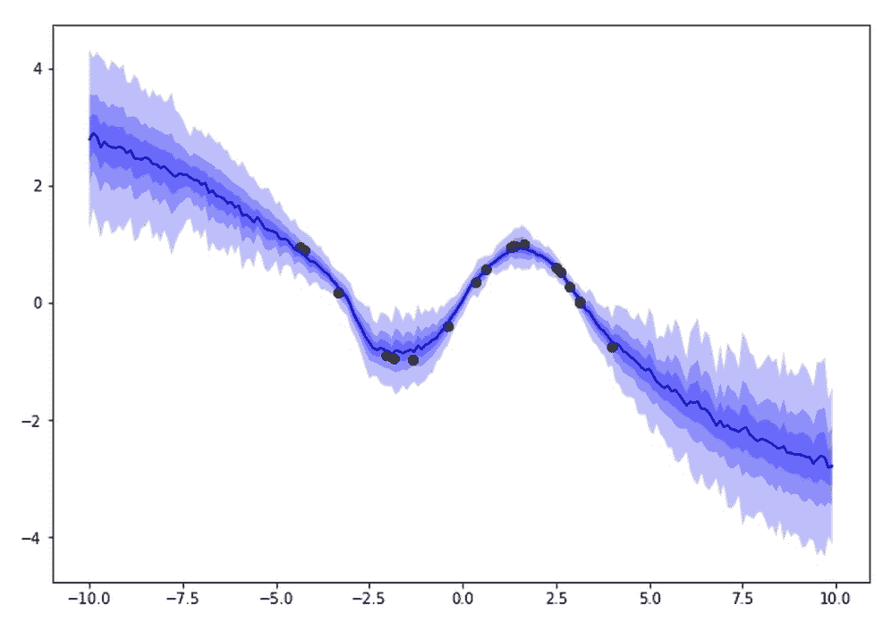

带有不确定性带宽的预测

正如你所看到的，模型在有数据的区域相对自信，而在远离数据点的地方，它的信心变得越来越低。

从我们的模型中获取不确定性估计可以提高我们从中获得的价值。如果我们能检测到模型在哪些地方过于自信或不自信，也有助于改善模型。目前，贝叶斯深度学习仍处于初期阶段，未来几年我们肯定会看到许多进展。

# 练习

现在我们已经到了本章的结尾，为什么不尝试一下以下的练习呢？在本章中，你会找到如何完成它们的指南：

+   一个好的技巧是将 LSTM 放在一维卷积之上，因为一维卷积可以处理较长的序列，同时使用更少的参数。尝试实现一个架构，首先使用一些卷积和池化层，然后使用一些 LSTM 层。在网页流量数据集上试验。然后尝试添加（递归）dropout。你能超过 LSTM 模型吗？

+   将不确定性添加到你的网页流量预测中。为此，记得在推理时启用 dropout。你将为一个时间步获取多个预测。想想这在交易和股票价格背景下意味着什么。

+   访问 Kaggle 数据集页面并搜索时间序列数据。构建一个预测模型。这涉及使用自相关和傅里叶变换进行特征工程，从已介绍的模型中选择合适的模型（例如，ARIMA 与神经网络），然后训练模型。虽然这是一项艰难的任务，但你将学到很多东西！任何数据集都可以使用，但我建议你尝试这里的股市数据集：[`www.kaggle.com/szrlee/stock-time-series-20050101-to-20171231`](https://www.kaggle.com/szrlee/stock-time-series-20050101-to-20171231)，或者这里的电力消耗数据集：[`www.kaggle.com/uciml/electric-power-consumption-data-set`](https://www.kaggle.com/uciml/electric-power-consumption-data-set)。

# 总结

在本章中，你学习了处理时间序列数据的广泛传统工具。你还了解了一维卷积和递归架构，最后，你学到了一个简单的方法，使得模型能够表达不确定性。

时间序列是金融数据中最具代表性的形式。本章为你提供了处理时间序列的丰富工具箱。让我们通过预测维基百科的网页流量来回顾一下我们已经涵盖的内容：

+   基本数据探索，以理解我们所处理的数据

+   傅里叶变换和自相关作为特征工程和数据理解的工具

+   使用简单的中位数预测作为基准和理性检查

+   理解并使用 ARIMA 和卡尔曼滤波器作为经典的预测模型

+   设计特征，包括为所有时间序列构建数据加载机制

+   使用一维卷积及其变体，如因果卷积和膨胀卷积

+   理解 RNN 的目的和使用，以及其更强大的变体 LSTM

+   掌握如何通过 dropout 技巧为预测添加不确定性，迈出了进入贝叶斯学习的第一步

这一套丰富的时间序列技术工具在下一章中尤为有用，那里我们将介绍自然语言处理。语言基本上是一个单词的序列，或者说是一个时间序列。这意味着我们可以将许多时间序列建模工具复用于自然语言处理。

在下一章中，你将学习如何在文本中找到公司名称，如何按主题对文本进行分组，甚至如何使用神经网络翻译文本。
