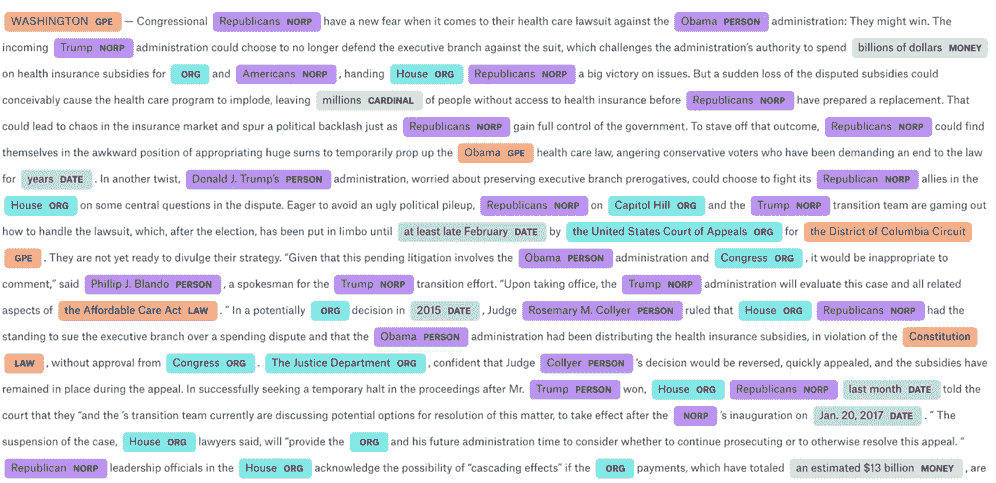
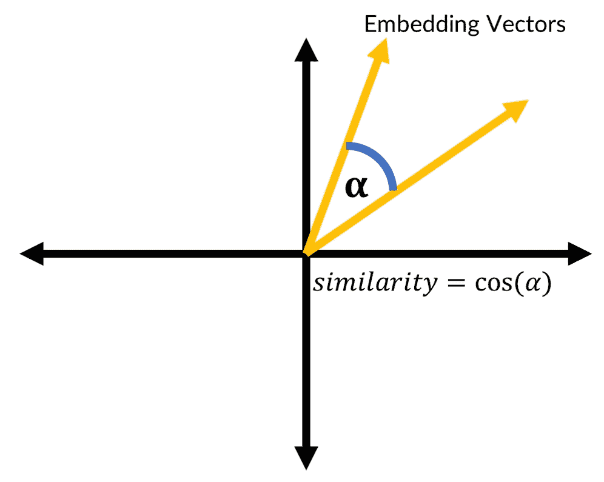
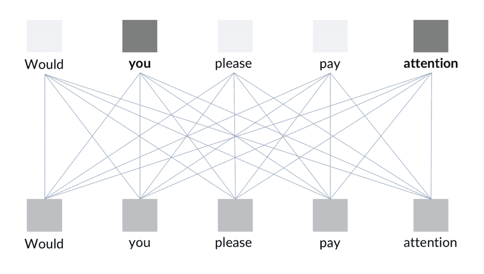

# 第五章：使用自然语言处理解析文本数据

彼得·布朗（Peter Brown）是文艺复兴科技公司（Renaissance Technologies）的联合首席执行官，该公司是有史以来最成功的量化对冲基金之一。他曾在 IBM 工作，并在该公司应用机器学习解决自然语言问题，这一切都不是巧合。

正如我们在之前的章节中探讨过的那样，在今天的世界中，信息驱动金融，而信息最重要的来源就是书面和口语语言。问问任何金融专业人士他们到底在花时间做什么，你会发现他们大部分时间都在阅读。这包括从阅读股票行情头条，到阅读 10-K 表格、金融新闻或各种分析师报告，列表几乎无穷无尽。自动处理这些信息可以加快交易速度，扩大交易时考虑的信息范围，同时降低总体成本。

**自然语言处理**（**NLP**）正在逐步进入金融领域。例如，保险公司越来越倾向于自动处理索赔，而零售银行则试图简化客户服务并为客户提供更好的产品。文本理解正越来越成为金融领域中机器学习的首选应用。

历史上，NLP 依赖于语言学家手工创建的规则。如今，语言学家正被神经网络取代，这些神经网络能够学习复杂的、往往难以编码的语言规则。

本章中，您将学习如何使用 Keras 构建强大的自然语言模型，并了解如何使用 spaCy NLP 库。

本章的重点将放在以下内容：

+   微调 spaCy 的模型以适应您自己的自定义应用

+   查找词性并映射句子的语法结构

+   使用如词袋模型和 TF-IDF 等技术进行分类

+   理解如何使用 Keras 函数式 API 构建高级模型

+   训练模型聚焦注意力，以及使用序列到序列（seq2seq）模型翻译句子

那么，让我们开始吧！

# spaCy 入门指南

spaCy 是一个用于高级 NLP 的库。这个库运行速度非常快，同时还配备了一系列有用的工具和预训练模型，使得 NLP 变得更加简便和可靠。如果您已经安装了 Kaggle，则无需单独下载 spaCy，因为它已随所有模型一起预安装。

若要在本地使用 spaCy，您需要分别安装该库并下载其预训练模型。

要安装该库，只需运行以下命令：

```py
$ pip install -U spacy
$ python -m spacy download en

```

### 注意

**注意**：本章使用的是英文语言模型，但还有更多可用的模型。大多数功能在英语、德语、西班牙语、葡萄牙语、法语、意大利语和荷兰语中均可用。通过多语言模型，实体识别功能支持更多语言。

spaCy 的核心由`Doc`和`Vocab`类组成。`Doc`实例包含一篇文档，包括其文本、分词版本和已识别的实体。而`Vocab`类则负责追踪文档中出现的所有共享信息。

spaCy 因其管道特性而非常有用，这些特性包含了自然语言处理所需的许多部分。如果这些内容现在看起来有些抽象，别担心，本节将向你展示如何使用 spaCy 完成各种实用任务。

### 提示

你可以在 Kaggle 上找到本节的相关数据和代码，地址是[`www.kaggle.com/jannesklaas/analyzing-the-news`](https://www.kaggle.com/jannesklaas/analyzing-the-news)。

我们将用于本节的数据来自 15 家美国出版物的 143,000 篇文章。数据分布在三个文件中。我们将分别加载这些文件，将它们合并成一个大型数据框，然后删除单独的数据框以节省内存。

为了实现这一点，我们必须运行以下代码：

```py
a1 = pd.read_csv('../input/articles1.csv',index_col=0)
a2 = pd.read_csv('../input/articles2.csv',index_col=0)
a3 = pd.read_csv('../input/articles3.csv',index_col=0)

df = pd.concat([a1,a2,a3])

del a1, a2, a3
```

运行前面的代码后，数据将最终呈现如下所示：

| id | 标题 | 出版物 | 作者 | 日期 | 年 | 月 | URL | 内容 |
| --- | --- | --- | --- | --- | --- | --- | --- | --- |
| 17283 | 众议院共和党人担忧... | 《纽约时报》 | 卡尔·赫尔斯 | 2016-12-31 | 2016.0 | 12.0 | NaN | 华盛顿 — 国会共和党人... |

在将数据处理到此状态后，我们可以绘制出版商的分布图，从而了解我们处理的是哪种类型的新闻。

为了实现这一点，我们必须运行以下代码：

```py
import matplotlib.pyplot as plt
plt.figure(figsize=(10,7))
df.publication.value_counts().plot(kind='bar')
```

成功运行此代码后，我们将看到一个展示数据集中新闻来源分布的图表：


新闻页面分布

如上图所示，我们提取的数据集没有来自传统金融新闻媒体的文章，而是大多来自主流和政治导向的出版物。

# 命名实体识别

自然语言处理中的常见任务是**命名实体识别**（**NER**）。NER 的核心是找到文本中明确提到的实体。在深入讨论发生了什么之前，我们先直接开始对数据集中的第一篇文章进行命名实体识别（NER）。

我们需要做的第一件事是加载 spaCy，并加载英语语言处理的模型：

```py
import spacy
nlp = spacy.load('en')
```

接下来，我们需要从数据中选择文章的文本：

```py
text = df.loc[0,'content']
```

最后，我们将把这段文本输入到英语语言模型管道中。这将创建一个`Doc`实例，这是我们在本章前面解释过的。该文件将包含大量信息，包括命名实体：

```py
doc = nlp(text)
```

spaCy 最棒的功能之一是它带有一个叫做`displacy`的可视化工具，我们可以用它来展示文本中的命名实体。为了让可视化工具基于我们文章中的文本生成展示，我们必须运行以下代码：

```py
from spacy import displacy
displacy.render(doc,              #1style='ent',      #2jupyter=True)     #3
```

执行完该命令后，我们完成了三项重要的工作，分别是：

1.  我们已经传递了文档。

1.  我们已经指定希望渲染实体。

1.  我们让`displacy`知道我们正在 Jupyter 笔记本中运行，这样渲染才能正确工作。



之前使用 spaCy 标签进行 NER 的输出

看！如你所见，存在一些小问题，例如空白被分类为组织，“奥巴马”被分类为地点。

那么，为什么会发生这种情况呢？这是因为标注是通过神经网络完成的，而神经网络强烈依赖于它们训练时的数据。因此，由于这些不完美，我们可能会发现需要为我们的目的微调标注模型，稍后我们将看到它是如何工作的。

从我们的输出中，你还可以看到 NER 提供了多种标签，其中一些标签带有奇怪的缩写。现在不必担心，因为我们将在本章后面检查一份完整的标签列表。

现在，让我们回答另一个问题：我们数据集中报道了哪些组织？为了让这个练习运行得更快，我们将创建一个新的管道，其中只启用 NER，禁用其他所有功能。

要找出这个问题的答案，我们必须首先运行以下代码：

```py
nlp = spacy.load('en',disable=['parser','tagger','textcat'])
```

在下一步中，我们将遍历数据集中的前 1,000 篇文章，可以通过以下代码完成：

```py
from tqdm import tqdm_notebook

frames = []
for i in tqdm_notebook(range(1000)):
    doc = df.loc[i,'content']                              #1
    text_id = df.loc[i,'id']                               #2
    doc = nlp(doc)                                         #3
    ents = [(e.text, e.start_char, e.end_char, e.label_)   #4
            for e in doc.ents 
            if len(e.text.strip(' -—')) > 0]
    frame = pd.DataFrame(ents)                             #5
    frame['id'] = text_id                                  #6
    frames.append(frame)                                   #7

npf = pd.concat(frames)                                    #8

npf.columns = ['Text','Start','Stop','Type','id']          #9
```

我们刚刚创建的代码有九个关键点。让我们花点时间来分解它，这样我们可以确认自己理解了我们刚刚写的内容。请注意，在前面的代码中，井号`#`指的是它在下列清单中的对应编号：

1.  我们获取第`i`行的文章内容。

1.  我们获取文章的 id。

1.  我们通过管道处理这篇文章。

1.  对于找到的所有实体，我们保存文本、首尾字符的索引以及标签。只有当标签不只是空格和破折号时，才会执行此操作。这消除了我们之前遇到的一些问题，当时分类错误地标注了空段落或分隔符。

1.  我们从创建的元组数组中创建一个 pandas DataFrame。

1.  我们将文章的 id 添加到我们所有的命名实体记录中。

1.  我们将包含一个文档所有标注实体的 DataFrame 添加到一个列表中。通过这种方式，我们可以在更多的文章中构建标注实体的集合。

1.  我们将列表中的所有 DataFrame 连接起来，意味着我们创建了一个包含所有标签的大表。

1.  为了方便使用，我们给列赋予了有意义的名称。

做完这一切后，下一步是绘制我们发现的实体类型的分布图。以下代码将生成一个可以通过以下代码创建的图表：

```py
npf.Type.value_counts().plot(kind='bar')
```

代码的输出是这个图表：


spaCy 标签分布

在看到前面的图表后，提出一个合理的问题就是：spaCy 能够识别哪些类别，它们的来源是什么。spaCy 自带的英文 NER 是一个基于*OntoNotes 5.0 语料库*训练的神经网络，这意味着它能够识别以下类别：

+   **人物**：人名，包括虚构人物

+   **组织**：公司、机构、组织

+   **GPE**：包括国家、城市和州等地点

+   **日期**：绝对日期（例如，2017 年 1 月）或相对日期（例如，两周）

+   **基数**：不属于其他类型的数字

+   **NORP**：国籍、宗教或政治团体

+   **序数**：“第一”、“第二”等

+   **时间**：短于一天的时间（例如，两小时）

+   **艺术作品**：书籍、歌曲等的标题

+   **地点**：不属于`GPE`（国家/地区）的地点，例如山脉或小溪

+   **货币**：货币值

+   **设施**：机场、高速公路或桥梁等设施

+   **百分比**：百分比

+   **事件**：命名的飓风、战役、体育赛事等

+   **数量**：如重量或距离等测量值

+   **法律**：命名的法律文件

+   **产品**：物品、车辆、食品等

+   **语言**：任何命名的语言

使用此列表，我们现在将查看 15 个最常被命名的组织，并将它们分类为 ORG。作为此部分的一部分，我们将生成一个类似的图表来展示这些信息。

要获得图表，我们必须运行以下代码：

```py
orgs = npf[npf.Type == 'ORG']
orgs.Text.value_counts()[:15].plot(kind='bar')
```

生成的代码将为我们提供以下图表：


spaCy 组织距离

正如你所见，像*参议院*这样的政治机构在我们的新闻数据集中被提及得最频繁。同样，一些公司，如*大众汽车*，也曾是媒体关注的中心，这些公司也出现在图表中。请花点时间注意到，尽管我们知道它们是同一个实体，但**白宫**和**White House**被列为两个不同的组织。

根据你的需求，你可能需要进行一些后处理，例如从组织名称中移除“the”。Python 自带了一个字符串替换方法，你可以在 pandas 中使用它。这将允许你进行后处理。然而，这部分内容我们不会在这里深入探讨。

如果你希望更详细地了解，可以通过以下链接获取文档和示例：[`pandas.pydata.org/pandas-docs/stable/generated/pandas.Series.str.replace.html`](https://pandas.pydata.org/pandas-docs/stable/generated/pandas.Series.str.replace.html)

另外，请注意这里**特朗普**被视为一个组织。然而，如果你查看标记过的文本，你会看到“特朗普”多次被标记为 NORP（国家、民族、宗教或政治团体），即政治组织。这是因为 NER（命名实体识别）会根据上下文推断标签类型。由于特朗普是美国总统，他的名字常常出现在与（政治）组织相关的上下文中。

这个预训练的 NER 为你提供了一个强大的工具，可以解决许多常见的 NLP 任务。所以，实际上，从这里你可以进行各种其他的调查。例如，我们可以分叉这个笔记本，看看《纽约时报》是否比《华盛顿邮报》或布赖特巴特（Breitbart）更多地被提及为不同的实体。

## 微调命名实体识别（NER）

你可能会发现的一个常见问题是，预训练的 NER 在特定类型的文本上表现不够好。为了解决这个问题，你需要通过用自定义数据训练它来微调 NER 模型。实现这一目标将是本节的重点。

你使用的训练数据应该是以下格式：

```py
TRAIN_DATA = [
    ('Who is Shaka Khan?', {
        'entities': [(7, 17, 'PERSON')]
    }),
    ('I like London and Berlin.', {
        'entities': [(7, 13, 'LOC'), (18, 24, 'LOC')]
    })
]
```

如你所见，你提供了一个包含字符串、起始和结束点以及你想要标注的实体类型的元组列表。此类数据通常通过人工标注收集，常见的平台包括亚马逊的**Mechanical Turk**（**MTurk**）。

spaCy 背后的公司 Explosion AI 还提供了一个（付费的）数据标注系统，叫做*Prodigy*，它可以实现高效的数据收集。一旦你收集了足够的数据，你可以微调一个预训练模型，或者初始化一个完全新的模型。

要加载并微调模型，我们需要使用`load()`函数：

```py
nlp = spacy.load('en')
```

或者，要从头开始创建一个新的空白模型并准备好用于英语语言，可以使用`blank`函数：

```py
nlp = spacy.blank('en')
```

无论哪种方式，我们都需要访问 NER 组件。如果你创建了一个空白模型，你需要创建一个 NER 管道组件并将其添加到模型中。

如果你加载了一个现有的模型，可以通过运行以下代码直接访问其现有的 NER：

```py
if 'ner' not in nlp.pipe_names:
    ner = nlp.create_pipe('ner')
    nlp.add_pipe(ner, last=True)
else:
    ner = nlp.get_pipe('ner')
```

下一步是确保我们的 NER 能够识别我们所拥有的标签。假设我们的数据包含了一种新的命名实体类型，比如`ANIMAL`。通过`add_label`函数，我们可以向 NER 添加一个标签类型。

实现这一点的代码如下所示，但如果现在不太明白也没关系，我们会在下一页详细解释：

```py
for _, annotations in TRAIN_DATA:
    for ent in annotations.get('entities'):
        ner.add_label(ent[2])
import random

                                                   #1
other_pipes = [pipe for pipe in nlp.pipe_names if pipe != 'ner']

with nlp.disable_pipes(*other_pipes):
    optimizer = nlp._optimizer                     #2
    if not nlp._optimizer:
        optimizer = nlp.begin_training()
    for itn in range(5):                           #3
        random.shuffle(TRAIN_DATA)                 #4
        losses = {} #5
        for text, annotations in TRAIN_DATA:       #6
            nlp.update(                            #7
                [text],  
                [annotations],  
                drop=0.5,                          #8
                sgd=optimizer,                     #9
                losses=losses)                     #10
        print(losses)
```

我们刚刚写的内容由 10 个关键元素组成：

1.  我们禁用所有不是 NER 的管道组件，首先获取所有不是 NER 的组件列表，然后在训练中禁用它们。

1.  预训练模型自带优化器。如果你有一个空白模型，你需要创建一个新的优化器。请注意，这也会重置模型的权重。

1.  我们现在进行多次训练周期，在这种情况下是 5 个。

1.  在每个训练周期的开始，我们使用 Python 内置的`random`模块对训练数据进行洗牌。

1.  我们创建一个空字典来跟踪损失值。

1.  然后，我们遍历训练数据中的文本和注释。

1.  `nlp.update`执行一次前向和反向传播，并更新神经网络的权重。我们需要提供文本和注释，以便该函数可以根据这些信息来训练网络。

1.  我们可以手动指定训练时要使用的 dropout 率。

1.  我们传递一个随机梯度下降优化器来执行模型更新。请注意，您不能直接传递 Keras 或 TensorFlow 的优化器，因为 spaCy 有自己的优化器。

1.  我们还可以传递一个字典，用来记录损失值，稍后可以打印出来以监控进展。

一旦您运行了代码，输出应该类似于以下内容：

```py
{'ner': 5.0091189558407585}
{'ner': 3.9693684224622108}
{'ner': 3.984836024903589}
{'ner': 3.457960373417813}
{'ner': 2.570318400714134}

```

您看到的是 spaCy 流水线某部分的损失值，在本例中是**命名实体识别**（**NER**）引擎。与前面章节讨论的交叉熵损失类似，实际的损失值很难解释，并没有提供太多有用的信息。关键是损失值随着时间的推移在减少，并且最终达到了远低于初始值的水平。

# 词性标注（POS）

2017 年 10 月 10 日星期二，上午 9:34 至 9:36 之间，美国道琼斯通讯社遇到技术故障，导致其发布了一些奇怪的头条新闻。其中一条是：“Google 收购 Apple。”这四个字成功地使苹果股价上涨超过 2%。

算法交易系统显然未能理解，像这样的收购是不可能的，因为当时苹果的市值为 8000 亿美元，再加上该收购很可能无法获得监管审批。

那么，问题来了，为什么交易算法会根据这四个字选择购买股票呢？答案就在于**词性标注**（**POS**）。词性标注能够理解句子中每个词的功能，并且揭示词与词之间的关系。

spaCy 配备了一个方便的、预训练的词性标注器。在这一部分，我们将其应用于 Google/Apple 的新闻故事。要启动词性标注器，我们需要运行以下代码：

```py
import spacy
from spacy import displacy
nlp = spacy.load('en')

doc = 'Google to buy Apple'
doc = nlp(doc)
displacy.render(doc,style='dep',jupyter=True, options={'distance':120})
```

再次，我们将加载预训练的英语模型，并通过它运行我们的句子。然后，我们将像处理 NER 一样使用`displacy`。

为了让图形更好地适应本书，我们将把`distance`选项设置为比默认值更小的数值，在本例中为 1,120，这样可以使单词之间的间距更小，正如我们在以下图表中看到的那样：


spaCy 词性标注器

正如您所看到的，词性标注器识别**buy**为动词，**Google**和**Apple**为句子中的名词。它还识别出**Apple**是动词作用的对象，而**Google**则是施动者。

我们可以通过以下代码访问名词的相关信息：

```py
nlp = spacy.load('en')
doc = 'Google to buy Apple'
doc = nlp(doc)

for chunk in doc.noun_chunks:
    print(chunk.text, chunk.root.text, chunk.root.dep_,chunk.root.head.text)
```

运行上述代码后，我们得到如下表格作为结果：

| 文本 | 根文本 | 根依赖 | 根头文本 |
| --- | --- | --- | --- |
| Google | Google | ROOT | Google |
| Apple | Apple | 宾语 | buy |

在我们的例子中，Google 是句子的根词，而 Apple 是句子的宾语。应用于 Apple 的动词是“buy”。

从那时起，它只不过是一个硬编码的模型，用于描述收购过程中的价格变化（目标股票的需求上升，价格随之上升），以及一个股票查询表，最终成为一个简单的事件驱动的交易算法。然而，让这些算法理解上下文和合理性是另一回事。

# 基于规则的匹配

在深度学习和统计建模占主导地位之前，自然语言处理（NLP）完全是基于规则的。并不是说基于规则的系统已经死掉了！它们通常易于设置，并且在执行简单任务时表现非常好。

想象一下，你想在文本中找到所有提到 Google 的地方。你真的会训练一个基于神经网络的命名实体识别器吗？如果是这样，你必须将所有文本通过神经网络处理，然后在实体文本中查找 Google。或者，你宁愿使用经典的搜索算法直接搜索与 Google 完全匹配的文本吗？幸运的是，spaCy 提供了一个易于使用的基于规则的匹配器，让我们能够做到这一点。

在开始本节之前，我们首先必须确保重新加载英语语言模型并导入匹配器。这是一个非常简单的任务，可以通过运行以下代码来完成：

```py
import spacy
from spacy.matcher import Matcher

nlp = spacy.load('en')
```

匹配器搜索模式，我们将其编码为字典列表。它按标记逐个操作，也就是说，逐字匹配，标点符号和数字除外，其中一个符号也可以是一个标记。

作为一个入门示例，让我们搜索短语"hello, world"。为了做到这一点，我们可以定义一个模式，如下所示：

```py
pattern = [{'LOWER': 'hello'}, {'IS_PUNCT': True}, {'LOWER': 'world'}]
```

如果第一个小写字母的标记是`hello`，则满足此模式。`LOWER`属性检查如果两个单词都转换为小写，是否会匹配。这意味着如果实际的标记文本是"Hello"或"HELLO"，那么它也会满足要求。第二个标记必须是标点符号来匹配逗号，因此像"hello. world"或"hello! world"这样的短语都有效，但"hello world"则不行。

第三个标记的小写字母必须是"world"，因此"WoRlD"也是可以的。

标记的可能属性包括以下几种：

+   `ORTH`：标记文本必须完全匹配

+   `LOWER`：标记的小写字母必须匹配

+   `LENGTH`：标记文本的长度必须匹配

+   `IS_ALPHA`、`IS_ASCII`、`IS_DIGIT`：标记文本必须由字母数字字符、ASCII 符号或数字组成

+   `IS_LOWER`、`IS_UPPER`、`IS_TITLE`：标记文本必须是小写、大写或标题大小写

+   `IS_PUNCT`、`IS_SPACE`、`IS_STOP`：标记文本必须是标点符号、空白或停用词

+   `LIKE_NUM`、`LIKE_URL`、`LIKE_EMAIL`：标记必须像数字、URL 或电子邮件

+   `POS`、`TAG`、`DEP`、`LEMMA`、`SHAPE`：标记的位置、标签、依赖关系、词元或形态必须匹配

+   `ENT_TYPE`：标记的实体类型必须与命名实体识别（NER）中的类型匹配

spaCy 的词形还原功能非常有用。词根是一个词的基本形式。例如，“was”是“be”的一种形式，所以“be”是“was”的词根，也适用于“is”。spaCy 可以根据上下文进行词形还原，这意味着它使用周围的词语来确定一个词的实际基本形式。

要创建一个匹配器，我们必须传递匹配器操作的词汇表。在这个例子中，我们可以通过运行以下命令传递我们英语语言模型的词汇表：

```py
matcher = Matcher(nlp.vocab)
```

为了向我们的匹配器添加所需的属性，我们必须调用以下命令：

```py
matcher.add('HelloWorld', None, pattern)
```

`add`函数需要三个参数。第一个是模式的名称，在这里是`HelloWorld`，以便我们跟踪已添加的模式。第二个是一个可以处理找到的匹配项的函数。在这里我们传递`None`，这意味着不会应用任何函数，尽管我们稍后会使用这个工具。最后，我们需要传递要搜索的词元属性列表。

要使用我们的匹配器，我们可以简单地调用`matcher(doc)`。这将返回匹配器找到的所有匹配项。我们可以通过运行以下命令来调用它：

```py
doc = nlp(u'Hello, world! Hello world!')
matches = matcher(doc)
```

如果我们打印出匹配项，我们可以看到其结构：

```py
matches
[(15578876784678163569, 0, 3)]

```

匹配的第一件事是找到的字符串的哈希值。这只是为了在内部标识找到的内容；在这里我们不会使用它。接下来的两个数字表示匹配器找到内容的范围，这里是从 0 到 3 的词元。

我们可以通过索引原始文档来获取文本：

```py
doc[0:3]
```

```py
Hello, wor
ld

```

在下一节中，我们将看看如何将自定义函数添加到匹配器中。

## 向匹配器添加自定义函数

让我们转向一个更复杂的例子。我们知道 iPhone 是一个产品。然而，基于神经网络的匹配器经常将其分类为一个组织。这是因为“iPhone”一词在类似的上下文中经常用作组织名称，如“iPhone 提供……”或“iPhone 出售……”。

让我们构建一个基于规则的匹配器，始终将“iPhone”分类为产品实体。

首先，我们必须获取“PRODUCT”一词的哈希值。spaCy 中的单词可以通过它们的哈希值唯一标识。实体类型也通过它们的哈希值来标识。为了设置一个产品类型的实体，我们必须能够提供该实体名称的哈希值。

我们可以通过运行以下命令从语言模型的词汇表中获取名称：

```py
PRODUCT = nlp.vocab.strings['PRODUCT']
```

接下来，我们需要定义一个`on_match`规则。每次匹配器找到匹配项时，都会调用此函数。`on_match`规则有四个参数：

+   `matcher`: 进行匹配的匹配器。

+   `doc`: 进行匹配的文档。

+   `i`: 匹配项的索引。文档中的第一个匹配项的索引为零，第二个匹配项的索引为一，以此类推。

+   `matches`: 所有匹配项的列表。

在我们的`on_match`规则中有两件事在发生：

```py
def add_product_ent(matcher, doc, i, matches):
    match_id, start, end = matches[i]            #1
    doc.ents += ((PRODUCT, start, end),)         #2
```

让我们分解它们是什么：

1.  我们索引所有匹配项，以便找到索引为`i`的匹配项。一个匹配项是一个包含`match_id`、匹配开始位置和匹配结束位置的元组。

1.  我们将一个新实体添加到文档的命名实体中。实体是一个元组，包含实体类型的哈希值（这里是`PRODUCT`一词的哈希值）、实体的起始位置和结束位置。为了附加一个实体，我们必须将其嵌套在另一个元组中。仅包含一个值的元组需要在结尾加上逗号。重要的是不要覆盖`doc.ents`，否则我们会删除已经找到的所有实体。

既然我们已经有了`on_match`规则，我们就可以定义我们的匹配器了。

我们应该注意到，匹配器允许我们添加多个模式，因此我们可以添加一个仅针对“iPhone”一词的匹配器，另一个模式则针对带有版本号的“iPhone”一词，例如“iPhone 5”：

```py
pattern1 = [{'LOWER': 'iPhone'}]                           #1
pattern2 = [{'ORTH': 'iPhone'}, {'IS_DIGIT': True}]        #2

matcher = Matcher(nlp.vocab)                               #3
matcher.add('iPhone', add_product_ent,pattern1, pattern2)  #4
```

那么，是什么让这些命令能工作呢？

1.  我们定义第一个模式。

1.  我们定义第二个模式。

1.  我们创建一个新的空匹配器。

1.  我们将模式添加到匹配器中。两个模式都会归属于一个名为`iPhone`的规则，并且都会调用我们的`on_match`规则，名为`add_product_ent`。

我们现在将通过匹配器处理其中一篇新闻文章：

```py
doc = nlp(df.content.iloc[14])         #1
matches = matcher(doc)                 #2
```

这段代码相对简单，只有两个步骤：

1.  我们将文本通过管道运行，创建一个注释过的文档。

1.  我们将文档通过匹配器运行。这会修改前一步创建的文档。我们更关注的是`on_match`方法如何将匹配项作为实体添加到我们的文档中，而非匹配项本身。

现在匹配器已经设置好了，我们需要将其添加到管道中，以便 spaCy 可以自动使用它。这将在下一节中重点讲解。

## 将匹配器添加到管道中

单独调用匹配器有些繁琐。为了将其添加到管道中，我们必须将其封装成一个函数，这可以通过运行以下代码来实现：

```py
def matcher_component(doc):
    matches = matcher(doc)
    return doc
```

spaCy 管道会将管道组件作为函数调用，并始终期待返回注释过的文档。返回其他内容可能会导致管道中断。

然后，我们可以将匹配器添加到主管道中，具体代码如下：

```py
nlp.add_pipe(matcher_component,last=True)
```

匹配器现在是管道中的最后一部分。从现在起，iPhone 将根据匹配器的规则进行标记。

哇！所有提到“iPhone”（不区分大小写）一词的地方现在都被标记为产品类型的命名实体。你可以通过用`displacy`显示这些实体来验证这一点，就像我们在以下代码中所做的那样：

```py
displacy.render(doc,style='ent',jupyter=True)
```

那段代码的结果可以在以下截图中看到：


spaCy 现在把 iPhone 识别为一个产品

## 结合基于规则和基于学习的系统

spaCy 的管道系统有一个特别有趣的方面，那就是它相对容易将不同的部分结合起来。例如，我们可以将基于神经网络的命名实体识别与基于规则的匹配器结合起来，以便查找类似高管薪酬信息的内容。

高管薪酬常常在新闻中报道，但在整体上很难找到。一个可能的基于规则的匹配模式可能是这样的：

```py
pattern = [{'ENT_TYPE':'PERSON'},{'LEMMA':'receive'},{'ENT_TYPE':'MONEY'}]
```

一个匹配器如果查找这个模式，会捕捉到任何一个人的名字，例如 John Appleseed 或 Daniel；任何形式的"receive"（接收）这个词，例如 received, receives 等等；后面跟着一个表示金钱的表达式，例如$4 million。

这个匹配器可以在大型文本语料库上运行，`on_match`规则会方便地将找到的片段保存到数据库中。用于命名实体的机器学习方法和基于规则的方法可以无缝地协同工作。

由于有更多的训练数据可用于带有命名实体和金钱注释的文本，而不是关于高管教育的声明，因此结合命名实体识别（NER）和基于规则的方法要比训练一个新的 NER 更容易。

# 正则表达式

正则表达式（regex）是一种强大的基于规则的匹配形式。它们在 1950 年代发明，并且在很长一段时间内是查找文本中内容的最有用方式，支持者认为它们至今依然如此。

任何关于自然语言处理（NLP）的章节都不可能不提到正则表达式。话虽如此，本节绝不是一个完整的正则表达式教程。它旨在介绍一般思路，并展示如何在 Python、pandas 和 spaCy 中使用正则表达式。

一个非常简单的正则表达式模式可能是"a。"它只会找到小写字母 a 后跟一个点的实例。然而，正则表达式还允许你添加一系列模式；例如，"[a-z]." 会找到任何小写字母后跟一个点，"xy." 则只会找到字母"x"或"y"后跟一个点。

正则表达式模式是区分大小写的，因此"A-Z"只会捕获大写字母。如果我们在搜索某些拼写经常不同的表达式时，这一点非常有用；例如，模式"seriali[sz]e"会捕获英式和美式英语中的这个词的拼写。

数字也一样。 "0-9" 会匹配所有从 0 到 9 的数字。要查找重复项，你可以使用"*"，它匹配零个或多个出现，或者"+"，它匹配一个或多个出现。例如，"[0-9]+" 会捕捉任何一系列数字，这在查找年份时非常有用。而"[A-Z][a-z]+[0-9]+"，例如， 会找到所有以大写字母开头，后跟一个或多个数字的单词，比如"March 2018"，也可以是"Jaws 2"。

大括号可以用来定义重复的次数。例如，"[0-9]{4}" 会找到恰好由四位数字组成的数字序列。正如你所看到的，正则表达式并不试图理解文本中的内容，而是提供了一种巧妙的方法来查找与模式匹配的文本。

在金融行业中的一个实际用例是查找发票中公司的增值税号码。这些号码在大多数国家遵循一个非常严格的模式，且容易编码。例如，荷兰的增值税号码遵循以下正则表达式模式：“NL[0-9]{9}B[0-9]{2}”。

## 使用 Python 的正则表达式模块

Python 有一个内置的正则表达式工具，叫做 `re`。因为它是 Python 的一部分，所以不需要单独安装，我们可以通过以下代码导入它：

```py
import re
```

假设我们正在处理一个自动化发票处理程序，我们想找出给我们发送发票的公司增值税号码。为了简单起见，我们只处理荷兰的增值税号码（荷兰语中的“增值税”是“BTW”）。如前所述，我们知道荷兰增值税号码的模式如下：

```py
pattern = 'NL[0-9]{9}B[0-9]{2}'
```

查找 BTW 号码的字符串可能是这样的：

```py
my_string = 'ING Bank N.V. BTW:NL003028112B01'
```

因此，为了查找字符串中 BTW 号码的所有出现，我们可以调用 `re.findall`，它将返回所有匹配模式的字符串列表。要调用它，我们只需运行：

```py
re.findall(pattern,my_string)
```

```py
['NL003028112B01']

```

`re` 还允许传递标志，以便让正则表达式模式的开发变得更加容易。例如，为了在匹配正则表达式时忽略字母的大小写，我们可以添加 `re.IGNORECASE` 标志，就像我们在这里做的那样：

```py
re.findall(pattern,my_string, flags=re.IGNORECASE)
```

通常，我们对匹配结果的更多信息感兴趣。为此，存在一个 `match` 对象。`re.search` 会返回一个 `match` 对象，表示找到的第一个匹配项：

```py
match = re.search(pattern,my_string)
```

我们可以通过运行以下代码来获取更多关于匹配的信息，例如匹配的位置：

```py
match.span()
(18, 32)

```

匹配的范围，也就是我们匹配的起始位置和结束位置，是字符 18 到 32。

## pandas 中的正则表达式

NLP 问题的数据通常以 pandas DataFrame 的形式出现。幸运的是，pandas 原生支持正则表达式。例如，如果我们想找出我们的新闻数据集中是否包含荷兰 BTW 号码，我们可以传递以下代码：

```py
df[df.content.str.contains(pattern)]
```

这将返回所有包含荷兰 BTW 号码的文章，但不出所料，我们的数据集中没有任何文章符合这一条件。

## 什么时候使用正则表达式，什么时候不使用

正则表达式是一个强大的工具，而这篇简短的介绍并没有充分展示它的威力。事实上，有几本书的篇幅比这本书还要长，专门讲解正则表达式。然而，出于本书的目的，我们只会简要介绍一下这个话题。

作为一种工具，正则表达式在简单且易于定义的模式上表现良好。增值税/BTW 号码就是一个完美的例子，电子邮件地址和电话号码也是，正则表达式在这些用例中非常常见。然而，当模式难以定义或只能从上下文中推断时，正则表达式就会失效。创建一个基于规则的命名实体识别器来识别某个词是否指代一个人的名字是不可行的，因为名字没有明确的区分模式。

所以下次当你寻找一些人类容易识别但难以用规则描述的内容时，使用基于机器学习的解决方案。同样，下次当你寻找一些明确编码的信息，如增值税（VAT）号码时，使用正则表达式（regexes）。

# 文本分类任务

一个常见的 NLP 任务是文本分类。最常见的文本分类是情感分析，其中文本被分类为正面或负面。在本节中，我们将考虑一个稍微复杂一些的问题，即分类一条推文是否关于实际发生的灾难。

如今，投资者已经开发出多种方法从推文中获取信息。Twitter 用户往往比新闻媒体更快地报告灾难事件，如火灾或洪水。在金融领域，这种速度优势可以转化为基于事件驱动的交易策略。

然而，并非所有包含与灾难相关词汇的推文都真正是关于灾难的。例如，“加利福尼亚森林火灾，靠近旧金山”是应该考虑的推文，而“加利福尼亚这个周末火灾，旧金山好时光”则可以安全忽略。

这项任务的目标是构建一个分类器，将与真实灾难相关的推文与无关推文区分开来。我们使用的数据集包含手动标记的推文，这些推文是通过在 Twitter 上搜索常见灾难推文词汇（如“燃烧”或“火灾”）获得的。

### 注意

**注意**：为准备本节内容，相关代码和数据可以在 Kaggle 上找到，网址是[`www.kaggle.com/jannesklaas/nl`](https://www.kaggle.com/jannesklaas/nl)。

# 准备数据

准备文本本身就是一项任务。这是因为在现实世界中，文本往往杂乱无章，无法通过一些简单的缩放操作来修复。例如，人们经常在添加不必要的字符时出现拼写错误，因为他们添加了我们无法读取的文本编码。自然语言处理（NLP）涉及一套独特的数据清洗挑战和技术。

## 清理字符

为了存储文本，计算机需要将字符编码为比特。有多种方法可以做到这一点，并且并非所有方法都能处理所有字符。

最好的做法是将所有文本文件保持在同一个编码方案中，通常是 UTF-8，但当然，这并不总是能做到。文件也可能损坏，导致一些比特位出现问题，从而使得某些字符无法读取。因此，在进行其他操作之前，我们需要清理输入数据。

Python 提供了一个有用的 `codecs` 库，允许我们处理不同的编码方式。我们的数据是 UTF-8 编码的，但其中包含一些特殊字符，这些字符不能轻易读取。因此，我们需要清理这些特殊字符，可以通过运行以下代码来完成：

```py
import codecs
input_file = codecs.open('../input/socialmedia-disaster-tweets-DFE.csv','r',',encoding='utf-8', errors='replace')
```

在前面的代码中，`codecs.open` 作为 Python 标准文件打开函数的替代品。它返回一个文件对象，我们可以稍后逐行读取。我们指定要读取文件的输入路径（使用 `r`），期望的编码格式以及错误处理方式。在这种情况下，我们将用一个特殊的不可读字符标记来替换错误。

要写入输出文件，我们可以直接使用 Python 的标准 `open()` 函数。此函数将在指定的文件路径下创建一个文件，供我们写入：

```py
output_file = open('clean_socialmedia-disaster.csv', 'w')
```

完成了这一切后，我们只需要遍历通过 `codecs` 读取的输入文件中的行，并再次将其保存为常规的 CSV 文件。我们可以通过运行以下代码来实现：

```py
for line in input_file:
    out = line
    output_file.write(line)
```

同样，良好的实践是之后关闭文件对象，我们可以通过运行以下代码来实现：

```py
input_file.close()
output_file.close()
```

现在我们可以使用 pandas 读取已清理的 CSV 文件：

```py
df = pd.read_csv('clean_socialmedia-disaster.csv')
```

## 词形还原

词根在本章中已经多次出现。词根在语言学领域，也称为词条，是词典中相关词语或词形出现的词。例如，“was”和“is”出现在“be”下，“mice”出现在“mouse”下，依此类推。通常，单词的具体形式并不是特别重要，因此将所有文本转换为其词根形式可能是一个好主意。

spaCy 提供了一个方便的词形还原方法，因此我们再次加载一个 spaCy 流水线。只不过在这种情况下，我们不需要任何流水线模块，除了分词器。分词器将文本按空格分割成单独的单词。然后，这些单独的单词或标记可以用于查找其词根。在我们的案例中，它看起来是这样的：

```py
import spacy
nlp = spacy.load('en',disable=['tagger','parser','ner'])
```

词形还原可能会很慢，特别是对于大文件，因此跟踪我们的进度是有意义的。`tqdm` 允许我们在 pandas 的 `apply` 函数上显示进度条。我们需要做的就是导入 `tqdm` 以及在工作环境中进行漂亮渲染的笔记本组件。然后，我们需要告诉 `tqdm` 我们希望与 pandas 一起使用它。我们可以通过运行以下代码来实现：

```py
from tqdm import tqdm, tqdm_notebook
tqdm.pandas(tqdm_notebook)
```

现在我们可以像使用标准的 `apply` 方法一样，在 DataFrame 上运行 `progress_apply`，但是这里它有一个进度条。

对于每一行，我们遍历 `text` 列中的单词，并将单词的词根保存到新的 `lemmas` 列中：

```py
df['lemmas'] = df["text"].progress_apply(lambda row: [w.lemma_ for w in nlp(row)])
```

现在我们的 `lemmas` 列充满了列表，因此为了将这些列表转换回文本，我们将使用空格作为分隔符，将列表中的所有元素连接起来，就像下面的代码所示：

```py
df['joint_lemmas'] = df['lemmas'].progress_apply(lambda row: ' '.join(row))
```

## 准备目标

这个数据集有几个可能的预测目标。在我们的案例中，要求人类对一条推文进行评分，并给出三个选项：`Relevant`、`Not Relevant` 和 `Can't Decide`，如词形还原后的文本所示：

```py
df.choose_one.unique()
array(['Relevant', 'Not Relevant', "Can't Decide"], dtype=object)
```

我们不关心那些无法决定是否与真实灾难相关的推文。因此，我们将删除类别 *Can't Decide*，这可以通过下面的代码来实现：

```py
df = df[df.choose_one != "Can't Decide"]
```

我们也只关心将文本映射到相关性，因此我们可以丢弃所有其他元数据，仅保留这两列，这里我们就这样做了：

```py
df = df[['text','choose_one']]
```

最后，我们将把目标转换为数字。这是一个二分类任务，因为只有两个类别。因此，我们将`Relevant`映射为`1`，`Not Relevant`映射为`0`：

```py
f['relevant'] = df.choose_one.map({'Relevant':1,'Not Relevant':0})
```

## 准备训练集和测试集

在开始构建模型之前，我们需要将数据集分为两个子集，一个是训练数据集，另一个是测试数据集。为此，我们只需运行以下代码：

```py
from sklearn.model_selection import train_test_split
X_train, X_test, y_train, y_test = train_test_split(df['joint_lemmas'], 
                                                    df['relevant'], 
                                                    test_size=0.2,
                                                    random_state=42)
```

# 词袋模型

一种简单而有效的文本分类方法是将文本视为词袋模型。这意味着我们不关心单词在文本中出现的顺序，我们只关心文本中出现了哪些单词。

进行词袋分类的一种方法是通过简单地统计文本中不同单词的出现次数来实现。这是通过所谓的**计数向量**完成的。每个单词都有一个索引，对于每个文本，计数向量在该索引位置的值就是该单词在文本中出现的次数。

想象一下这个例子：文本“I see cats and dogs and elephants”的计数向量可能看起来像这样：

| i | see | cats | and | dogs | elephants |
| --- | --- | --- | --- | --- | --- |
| 1 | 1 | 1 | 2 | 1 | 1 |

实际上，计数向量是相当稀疏的。我们的文本语料库中大约有 23,000 个不同的单词，因此限制我们要包含的单词数量是有意义的。这可能意味着排除那些通常只是无意义的胡言乱语或拼写错误的单词。顺便提一句，如果我们保留所有稀有单词，这可能会导致过拟合。

我们正在使用`sklearn`的内置计数向量化器。通过设置`max_features`，我们可以控制要在计数向量中考虑的单词数量。在这个例子中，我们只会考虑 10,000 个最频繁出现的单词：

```py
from sklearn.feature_extraction.text import CountVectorizer
count_vectorizer = CountVectorizer(max_features=10000)
```

我们的计数向量化器现在可以将文本转换为计数向量。每个计数向量将有 10,000 个维度：

```py
X_train_counts = count_vectorizer.fit_transform(X_train)
X_test_counts = count_vectorizer.transform(X_test)
```

一旦我们获得了计数向量，就可以对其执行简单的逻辑回归。虽然我们可以像在本书第一章中那样使用 Keras 进行逻辑回归，但通常使用 scikit-learn 中的逻辑回归类会更简单：

```py
from sklearn.linear_model import LogisticRegression
clf = LogisticRegression()

clf.fit(X_train_counts, y_train)

y_predicted = clf.predict(X_test_counts)
```

现在我们从逻辑回归器中获得了预测结果，我们可以使用`sklearn`来衡量其准确性：

```py
from sklearn.metrics import accuracy_score
accuracy_score(y_test, y_predicted)
```

```py
0.8011049723756906

```

如你所见，我们的准确率达到了 80%，对于这么简单的方法来说，这已经相当不错了。基于简单计数向量的分类可以作为更高级方法的基准，我们将在后面讨论这些方法。

## TF-IDF

**TF-IDF**代表**词频-逆文档频率**。它旨在解决简单词汇计数的一个问题，即频繁出现在文本中的词语很重要，而出现在*所有*文本中的词语则不重要。

TF 成分就像一个计数向量，只是 TF 将计数除以文本中的总单词数。与此同时，IDF 成分是整个语料库中文本总数与包含特定单词的文本数的比值的对数。

TF-IDF 是这两个度量值的乘积。TF-IDF 向量类似于计数向量，唯一的不同是它们包含的是 TF-IDF 分数，而不是计数。稀有单词会在 TF-IDF 向量中获得较高的分数。

我们创建 TF-IDF 向量，方式与使用`sklearn`创建计数向量时相同：

```py
from sklearn.feature_extraction.text import TfidfVectorizer
tfidf_vectorizer = TfidfVectorizer()

X_train_tfidf = tfidf_vectorizer.fit_transform(X_train)
X_test_tfidf = tfidf_vectorizer.transform(X_test)
```

一旦我们得到 TF-IDF 向量，就可以像处理计数向量一样训练一个逻辑回归器：

```py
clf_tfidf = LogisticRegression()
clf_tfidf.fit(X_train_tfidf, y_train)

y_predicted = clf_tfidf.predict(X_test_tfidf)
```

在这种情况下，TF-IDF 的表现略逊于计数向量。然而，由于性能差异非常小，这种较差的表现可能仅仅是偶然造成的：

```py
accuracy_score(y_pred=y_predicted, y_true=y_test)
```

```py
0.79788213627992
63

```

# 主题建模

词频统计的一个最终、非常有用的应用是主题建模。给定一组文本，我们能否找到主题的聚类？执行此操作的方法被称为**潜在 Dirichlet 分配**（**LDA**）。

### 注意

**注意**：本节的代码和数据可以在 Kaggle 上找到，链接为[`www.kaggle.com/jannesklaas/topic-modeling-with-lda`](https://www.kaggle.com/jannesklaas/topic-modeling-with-lda)。

虽然这个名字比较拗口，但这个算法非常有用，所以我们将一步步分析它。LDA 对文本的写作方式做出以下假设：

1.  首先，选择一个主题分布，比如 70%为机器学习，30%为金融。

1.  第二步，选择每个主题的单词分布。例如，"机器学习"这个主题可能由 20%的"张量"一词、10%的"梯度"一词等组成。这意味着我们的主题分布是一个*分布的分布*，也称为 Dirichlet 分布。

1.  一旦文本被写入，每个单词都会做出两个概率性决策：首先，从文档中主题的分布中选择一个主题。然后，从该文档中单词的分布中选择一个单词。

请注意，语料库中的所有文档并不具有相同的主题分布。我们需要指定一个固定数量的主题。在学习过程中，我们首先将语料库中的每个单词随机分配给一个主题。然后，对于每个文档，我们计算以下内容：


上述公式是每个主题*t*在文档*d*中出现的概率。对于每个单词，我们随后计算：


这是一个单词*w*属于某个主题*t*的概率。我们随后以以下概率将该单词分配给一个新主题*t*：


换句话说，我们假设除了当前正在考虑的词之外，所有的词都已经正确地分配到某个主题。然后，我们尝试将词语分配到主题，以使文档在主题分布上更加同质化。通过这种方式，实际上属于同一个主题的词语会聚集在一起。

Scikit-learn 提供了一个易于使用的 LDA 工具，可以帮助我们实现这一目标。要使用它，我们首先需要创建一个新的 LDA 分析器，并指定我们期望的主题数，称为组件。

这可以通过简单地运行以下代码来完成：

```py
from sklearn.decomposition import LatentDirichletAllocation
lda = LatentDirichletAllocation(n_components=2)
```

然后我们创建计数向量，就像我们在词袋分析中所做的那样。对于 LDA，重要的是去除一些没有实际意义的常见词，比如“an”或“the”，即所谓的停用词。`CountVectorizer`自带一个内建的停用词字典，可以自动去除这些词。为了使用这个功能，我们需要运行以下代码：

```py
from sklearn.feature_extraction.text import TfidfVectorizer, CountVectorizer
vectorizer = CountVectorizer(stop_words='english')
tf = vectorizer.fit_transform(df['joint_lemmas'])
```

接下来，我们将 LDA 拟合到计数向量：

```py
lda.fit(tf)
```

为了检查我们的结果，我们可以打印出每个主题中最常出现的词。为此，我们首先需要指定每个主题要打印的词数，在这个例子中是 5。我们还需要提取词计数向量索引到词的映射：

```py
n_top_words = 5
tf_feature_names = vectorizer.get_feature_names()
```

现在我们可以遍历 LDA 的主题，以打印出最常出现的词：

```py
for topic_idx, topic in enumerate(lda.components_):
        message = "Topic #%d: " % topic_idx
        message += " ".join([tf_feature_names[i]
                             for i in topic.argsort()[:-n_top_words - 1:-1]])
        print(message)
Topic #0: http news bomb kill disaster
Topic #1: pron http like just https

```

正如你所看到的，LDA 似乎已经自己发现了严肃推文和非严肃推文的分组，而无需给定目标。

这个方法对于新闻文章的分类也非常有用。在金融领域，投资者可能希望知道是否有新闻文章提到他们所面临的风险因素。对于面向消费者的组织的支持请求，使用这种方式也可以进行聚类。

# 词嵌入

文本中单词的顺序是有意义的。因此，如果我们不仅仅将文本看作整体，而是将其视为一个序列，我们可以期望更高的性能。本节将使用上一章中讨论的许多技术；然而，在这里我们将添加一个关键要素——词向量。

词和词标记是分类特征。因此，我们不能直接将它们输入到神经网络中。之前，我们通过将其转换为独热编码向量来处理分类数据。然而，对于词语来说，这样做并不现实。因为我们的词汇量是 10,000 个单词，每个向量将包含 10,000 个数字，只有一个数字为 1，其余都是 0。这种方式效率极低，因此，我们将使用词嵌入。

在实践中，嵌入的工作方式类似于查找表。对于每个标记，它们存储一个向量。当标记被传递到嵌入层时，它会返回该标记的向量，并将其传递到神经网络中。随着网络的训练，嵌入也会得到优化。

请记住，神经网络通过计算损失函数相对于模型参数（权重）的导数来工作。通过反向传播，我们还可以计算损失函数相对于模型输入的导数。这样，我们就可以优化嵌入，从而提供理想的输入来帮助我们的模型。

## 用于训练词向量的预处理

在开始训练词嵌入之前，我们需要做一些预处理步骤。也就是说，我们需要为每个单词标记分配一个数字，并创建一个充满序列的 NumPy 数组。

为标记分配数字使得训练过程更加顺畅，并将标记化过程与词向量解耦。Keras 提供了一个 `Tokenizer` 类，可以为单词创建数字标记。默认情况下，这个分词器通过空格来拆分文本。虽然这在英语中通常能很好地工作，但在其他语言中可能会出现问题，并导致错误。一个关键的学习点是，最好首先使用 spaCy 对文本进行标记化，正如我们之前两种方法所做的那样，然后再使用 Keras 分配数字标记。

`Tokenizer` 类还允许我们指定想要考虑的单词数量，因此我们将再次只使用 10,000 个最常用的单词，方法是运行以下命令：

```py
from keras.preprocessing.text import Tokenizer
import numpy as np

max_words = 10000
```

这个分词器的工作方式与 `sklearn` 中的 `CountVectorizer` 类似。首先，我们创建一个新的 `tokenizer` 对象。然后，我们对分词器进行拟合，最后可以将文本转换为标记化的序列：

```py
tokenizer = Tokenizer(num_words=max_words)
tokenizer.fit_on_texts(df['joint_lemmas'])
sequences = tokenizer.texts_to_sequences(df['joint_lemmas'])
```

`sequences` 变量现在保存了我们所有文本的数字标记。我们可以通过以下代码，从分词器的单词索引中查找单词到数字的映射：

```py
word_index = tokenizer.word_index
print('Token for "the"',word_index['the'])
print('Token for "Movie"',word_index['movie'])
Token for "the" 4
Token for "Movie" 333

```

如您所见，像 "the" 这样的常用词的标记编号比不常用词（如 "movie"）的标记编号要低。您还可以看到，`word_index` 是一个字典。如果您在生产环境中使用模型，可以将这个字典保存到磁盘，以便以后将单词转换成标记。

最后，我们需要将序列转换为相同长度的序列。这并不总是必要的，因为某些模型类型可以处理不同长度的序列，但通常来说，这样做更有意义，且通常是必须的。我们将在下一节构建自定义 NLP 模型时，讨论哪些模型需要相同长度的序列。

Keras 的 `pad_sequences` 函数使我们能够轻松地将所有序列调整为相同的长度，方法是裁剪序列或在末尾添加零。我们将把所有推文的长度统一为 140 个字符，这在很长一段时间内是推文的最大长度：

```py
from keras.preprocessing.sequence import pad_sequences

maxlen = 140

data = pad_sequences(sequences, maxlen=maxlen)
```

最后，我们将数据分成训练集和验证集：

```py
from sklearn.model_selection import train_test_split
X_train, X_test, y_train, y_test = train_test_split(data, df['relevant'],test_size = 0.2, shuffle=True, random_state = 42)
```

现在我们准备好训练我们自己的词向量了。

嵌入是 Keras 中的一种层类型。为了使用它们，我们需要指定希望词向量的维度。我们选择使用的 50 维向量能够为相当大的词汇量捕捉到良好的嵌入。此外，我们还需要指定我们希望为多少个单词生成嵌入，并且要指定我们的序列长度。我们的模型现在是一个简单的逻辑回归器，它训练自己的嵌入：

```py
from keras.models import Sequential
from keras.layers import Embedding, Flatten, Dense

embedding_dim = 50

model = Sequential()
model.add(Embedding(max_words, embedding_dim, input_length=maxlen))
model.add(Flatten())
model.add(Dense(1, activation='sigmoid'))
```

请注意，我们不需要指定输入形状。即使指定输入长度也仅在后续层需要知道输入长度时才是必要的。`Dense`层需要知道输入大小，但由于我们直接使用了密集层，因此需要在此处指定输入长度。

词嵌入有*许多*参数。如果你打印出模型的总结信息，你会看到这一点：

```py
model.summary()
```

```py
_________________________________________________________________Layer (type)                 Output Shape              Param #   =================================================================embedding_2 (Embedding)      (None, 140, 50)           500000    _________________________________________________________________flatten_2 (Flatten)          (None, 7000)              0         _________________________________________________________________dense_3 (Dense)              (None, 1)                 7001      =================================================================Total params: 507,001Trainable params: 507,001Non-trainable params: 0
_________________________________________________________________

```

如你所见，嵌入层为 10,000 个单词提供了 50 个参数，总共有 500,000 个参数。这使得训练变慢，并且可能增加过拟合的风险。

下一步，我们按照惯例编译并训练我们的模型：

```py
model.compile(optimizer='adam',loss='binary_crossentropy',metrics=['acc'])

history = model.fit(X_train, y_train,epochs=10,batch_size=32,validation_data=(X_test, y_test))
```

该模型在测试集上达到了约 76%的准确率，但在训练集上超过了 90%的准确率。然而，定制词嵌入中的大量参数导致了过拟合。为了避免过拟合并减少训练时间，通常最好使用预训练的词嵌入。

## 加载预训练的词向量

像计算机视觉一样，NLP 模型也能从使用其他模型的预训练部分中受益。在本案例中，我们将使用预训练的 GloVe 向量。**GloVe**代表**全局词向量**（Global Vectors for Word 8），是斯坦福 NLP 小组的一个项目。GloVe 提供了在不同文本中训练的多种向量集。

在本节中，我们将使用在维基百科文本以及 Gigaword 数据集上训练的词嵌入。总共，这些向量是在 60 亿个标记的文本上训练的。

话虽如此，GloVe 也有替代品，比如 Word2Vec。GloVe 和 Word2Vec 相对类似，尽管它们的训练方法不同。它们各有优缺点，在实践中，通常值得尝试两者。

GloVe 向量的一个好特点是，它们在向量空间中编码了单词的意义，使得“单词代数”成为可能。例如，“king”向量减去“man”向量，再加上“woman”向量，最终得到的向量非常接近“queen”。这意味着，“man”和“woman”向量之间的差异与“king”和“queen”向量之间的差异是相同的，因为它们的区分特征几乎是一样的。

同样，描述相似事物的单词，如“frog”（青蛙）和“toad”（蟾蜍），在 GloVe 向量空间中也非常接近。将语义信息编码为向量为文档相似度和主题建模等任务提供了许多激动人心的机会，正如我们将在本章后面看到的那样。语义向量对于许多 NLP 任务也非常有用，比如我们的文本分类问题。

实际的 GloVe 向量存储在一个文本文件中。我们将使用在 60 亿个标记上训练的 50 维嵌入。为此，我们需要打开文件：

```py
import os
glove_dir = '../input/glove6b50d'
f = open(os.path.join(glove_dir, 'glove.6B.50d.txt'))
```

然后我们创建一个空字典，稍后将单词映射到嵌入向量：

```py
embeddings_index = {}
```

在数据集中，每一行表示一个新的单词嵌入。该行从单词开始，后面跟着嵌入值。我们可以这样读取嵌入：

```py
for line in f:                                            #1
    values = line.split()                                 #2
    word = values[0]                                      #3
    embedding = np.asarray(values[1:], dtype='float32')   #4
    embeddings_index[word] = embedding dictionary         #5
f.close()                                                 #6
```

但这意味着什么呢？让我们花点时间分解一下代码背后的含义，它有六个关键元素：

1.  我们遍历文件中的所有行。每一行包含一个单词和一个嵌入。

1.  我们通过空白字符分割这一行。

1.  行中的第一个元素始终是单词。

1.  接下来是嵌入值。我们立即将它们转换为一个 NumPy 数组，并确保它们都是浮动点数，也就是小数。

1.  然后我们将嵌入向量保存在嵌入字典中。

1.  一旦完成，我们就关闭文件。

运行这段代码后，我们现在有了一个字典，将单词映射到它们的嵌入向量：

```py
print('Found %s word vectors.' % len(embeddings_index))
```

```py
Found 400000-word vectors.

```

这个版本的 GloVe 有 40 万个单词的向量，应该足够覆盖我们遇到的大多数单词。然而，也可能有一些单词没有向量。对于这些单词，我们将创建随机向量。为了确保这些向量不会偏离太远，最好使用与训练向量相同的均值和标准差来生成随机向量。

为此，我们需要计算 GloVe 向量的均值和标准差：

```py
all_embs = np.stack(embeddings_index.values())
emb_mean = all_embs.mean()
emb_std = all_embs.std()
```

我们的嵌入层将是一个矩阵，每行代表一个单词，每列代表嵌入的一个元素。因此，我们需要指定每个嵌入的维度。我们之前加载的 GloVe 版本有 50 维的向量：

```py
embedding_dim = 50
```

接下来，我们需要找出我们实际有多少个单词。虽然我们已将最大值设置为 10,000，但我们语料库中的单词可能会更少。此时，我们还从分词器中获取单词索引，稍后会用到：

```py
word_index = tokenizer.word_index
nb_words = min(max_words, len(word_index))
```

为了创建嵌入矩阵，我们首先创建一个与嵌入具有相同`均值`和`标准差`的随机矩阵：

```py
embedding_matrix = np.random.normal(emb_mean, emb_std, (nb_words, embedding_dim))
```

嵌入向量需要与其令牌编号处于相同的位置。令牌为 1 的单词需要位于第 1 行（行从零开始），依此类推。现在，我们可以用我们有的训练嵌入替换那些随机嵌入：

```py
for word, i in word_index.items():                    #1
    if i >= max_words:                                #2
        continue  
    embedding_vector = embeddings_index.get(word)     #3
    if embedding_vector is None:                      #4
        embedding_matrix[i] = embedding_vector
```

这个命令有四个关键元素，我们在继续之前应该详细探讨一下：

1.  我们遍历单词索引中的所有单词。

1.  如果我们已经超出了我们想要使用的单词数量，就什么也不做。

1.  我们获取该词的嵌入向量。如果该词没有嵌入，该操作可能返回 None。

1.  如果有一个嵌入向量，我们将其放入嵌入矩阵中。

要使用预训练的词嵌入，我们只需要将嵌入层的权重设置为我们刚刚创建的嵌入矩阵。为了确保精心创建的权重不会被破坏，我们将把该层设置为不可训练，具体操作如下：

```py
model = Sequential()
model.add(Embedding(max_words, embedding_dim, input_length=maxlen, weights = [embedding_matrix], trainable = False))

model.add(Flatten())
model.add(Dense(1, activation='sigmoid'))
```

这个模型可以像任何其他 Keras 模型一样进行编译和训练。你会注意到，它比我们训练自己词嵌入的模型训练得更快，且更不容易过拟合。然而，测试集上的总体表现大致相同。

词嵌入在减少训练时间和帮助构建准确模型方面非常有效。然而，语义嵌入则更进一步。例如，它们可以用来衡量两篇文本在语义层面上的相似性，即使它们使用的是不同的词汇。

## 带有词向量的时间序列模型

文本是一个时间序列。不同的词语按顺序相继出现，且它们的顺序非常重要。因此，上一章中所有基于神经网络的技术也可以用于 NLP。此外，还有一些在第四章《理解时间序列》中没有介绍的构建模块，对于 NLP 非常有用。

让我们从一个 LSTM（长短期记忆网络）开始。你只需要修改上一章实现中的一点，那就是网络的第一层应该是一个嵌入层。下面的例子使用了一个`CuDNNLSTM`层，它比常规的`LSTM`层训练速度要快得多。

除此之外，其他部分保持不变。如果你没有 GPU，可以将`CuDNNLSTM`替换为`LSTM`：

```py
from keras.layers import CuDNNLSTM
model = Sequential()
model.add(Embedding(max_words, embedding_dim, input_length=maxlen, weights = [embedding_matrix], trainable = False))
model.add(CuDNNLSTM(32))
model.add(Dense(1, activation='sigmoid'))
```

在 NLP 中常用的一种技术，但在时间序列预测中较少使用的技术是双向**递归神经网络**（**RNN**）。双向 RNN 实际上是两个 RNN，其中一个接收正向的序列，另一个接收反向的序列：


一个双向 RNN

在 Keras 中，有一个`Bidirectional`层，我们可以将其包裹在任何 RNN 层周围，例如 `LSTM`。我们可以通过以下代码实现：

```py
from keras.layers import Bidirectional
model = Sequential()
model.add(Embedding(max_words, embedding_dim, input_length=maxlen, weights = [embedding_matrix], trainable = False))
model.add(Bidirectional(CuDNNLSTM(32)))
model.add(Dense(1, activation='sigmoid'))
```

词嵌入很棒，因为它们能够丰富神经网络。它们是一种空间高效且强大的方法，允许我们将词语转换为神经网络可以处理的数字。话虽如此，将语义编码为向量还有更多的优势，例如我们可以对它们执行向量运算！如果我们想要衡量两篇文本之间的相似性，这非常有用。

# 使用词嵌入的文档相似性

词向量的实际应用案例是比较文档之间的语义相似度。如果你是零售银行、保险公司或任何其他面向终端用户销售的公司，你将不得不处理客户支持请求。你会发现很多客户有相似的请求，因此通过了解文本在语义上的相似性，可以重复使用之前对相似请求的答案，从而提升整个组织的服务水平。

spaCy 内置了一个函数来衡量两个句子之间的相似性。它还提供了来自 Word2Vec 模型的预训练向量，类似于 GloVe。该方法通过对文本中所有单词的嵌入向量进行平均，然后测量平均向量之间的余弦角度来工作。两个指向大致相同方向的向量会有较高的相似度得分，而指向不同方向的向量则会有较低的相似度得分。这一点在以下图表中得到了可视化：



相似度向量

我们可以通过运行以下命令来查看两个短语之间的相似度：

```py
sup1 = nlp('I would like to open a new checking account')
sup2 = nlp('How do I open a checking account?')
```

正如你所看到的，这些请求非常相似，达到了 70%的相似度：

```py
sup1.similarity(sup2)
```

```py
0.7079433112862716

```

正如你所看到的，它们的相似度得分相当高。这种简单的平均方法工作得相当不错。然而，它并不能捕捉到诸如否定句或单一偏离向量等情况，后者可能不会对平均值产生太大影响。

例如，“我想关闭一个支票账户”和“我想开一个支票账户”在语义上是不同的。然而，模型却将它们视为非常相似。尽管如此，这种方法仍然是有用的，并且很好地展示了将语义表示为向量的优势。

# Keras 函数式 API 的快速概览

到目前为止，我们使用了顺序模型。在顺序模型中，当我们调用`model.add()`时，层会一个接一个地叠加在一起。函数式 API 的优势在于它简单且能防止错误。其缺点是它只允许我们线性地堆叠层：


来自 Szegedy 等人《通过卷积深入研究》中的 GoogLeNet 架构

看看之前的 GoogLeNet 架构。虽然图表非常详细，但我们需要记住的是，模型不仅仅是层的堆叠。相反，它包含了多个并行层；在这个例子中，模型有三个输出。然而，问题依然存在，那就是作者是如何构建这个复杂的模型的？顺序 API 无法做到这一点，而函数式 API 则使得像珍珠链一样串联层变得容易，从而创建出类似前面的架构。

对于许多 NLP 应用程序，我们需要更复杂的模型，例如，两个单独的层并行运行。在 Keras 功能性 API 中，我们可以更灵活地控制，并且可以指定各层之间的连接方式。我们可以利用这一点来创建更加高级和复杂的模型。

从现在开始，我们将更多地使用功能性 API。本章这一部分旨在提供 Keras 功能性 API 的简要概述，之后我们将在后面的章节中更深入地探讨。首先，让我们看一个简单的两层网络，分别用顺序方式和功能性方式来实现：

```py
from keras.models import Sequential
from keras.layers import Dense, Activation

model = Sequential()
model.add(Dense(64, input_dim=64))
model.add(Activation('relu'))
model.add(Dense(4))
model.add(Activation('softmax'))
model.summary()
```

```py
Layer (type)                 Output Shape              Param #   =================================================================dense_1 (Dense)              (None, 64)                4160      _________________________________________________________________activation_1 (Activation)    (None, 64)                0         _________________________________________________________________dense_2 (Dense)              (None, 4)                 260       _________________________________________________________________activation_2 (Activation)    (None, 4)                 0         =================================================================Total params: 4,420Trainable params: 4,420Non-trainable params: 0
_________________________________________________________________

```

前面的模型是一个简单的顺序 API 实现的模型。请注意，这是我们在本书中到目前为止采用的方法。接下来，我们将使用功能性 API 实现相同的模型：

```py
from keras.models import Model                        #1
from keras.layers import Dense, Activation, Input

model_input = Input(shape=(64,))                      #2
x = Dense(64)(model_input)                            #3
x = Activation('relu')(x)                             #4
x = Dense(4)(x)
model_output = Activation('softmax')(x)

model = Model(model_input, model_output)              #5
model.summary()
```

注意与顺序 API 的区别：

1.  不再像之前那样首先定义模型`model = Sequential()`，而是先定义计算图，然后使用`Model`类将其转换为模型。

1.  输入现在是它们自己的层。

1.  与使用`model.add()`不同，你需要先定义层，然后传入输入层或前一层的输出张量。

1.  你通过将层串联在一起创建模型。例如，`Dense(64)(model_input)`会返回一个张量。你将该张量传递给下一层，像这样`Activation('relu')(x)`。这个函数将返回一个新的输出张量，你可以将它传递给下一层，依此类推。通过这种方式，你就创建了一个像链条一样的计算图。

1.  要创建一个模型，你需要将模型的输入层和计算图的最终输出张量传入`Model`类。

功能性 API 模型可以像顺序 API 模型一样使用。事实上，从这个模型的输出摘要中，你可以看到它与我们刚刚用顺序 API 创建的模型几乎是相同的：

```py
Layer (type)                 Output Shape              Param #   =================================================================input_2 (InputLayer)         (None, 64)                0         _________________________________________________________________dense_3 (Dense)              (None, 64)                4160      _________________________________________________________________activation_3 (Activation)    (None, 64)                0         _________________________________________________________________dense_4 (Dense)              (None, 4)                 260       _________________________________________________________________activation_4 (Activation)    (None, 4)                 0         =================================================================Total params: 4,420Trainable params: 4,420Non-trainable params: 0
_________________________________________________________________

```

你可以看到，功能性 API 可以比顺序 API 更灵活地连接各层。我们还可以将层的创建和连接步骤分开。这样做使代码更加简洁，并且允许我们将同一层用于不同的目的。

以下代码片段将创建与前面片段完全相同的模型，但使用了单独的层创建和连接步骤：

```py
model_input = Input(shape=(64,))

dense = Dense(64)

x = dense(model_input)

activation = Activation('relu')

x = activation(x)

dense_2 = Dense(4)

x = dense_2(x)

model_output = Activation('softmax')(x)

model = Model(model_input, model_output)
```

层是可以重用的。例如，我们可以在一个计算图中训练一些层，然后将它们用于另一个计算图，就像我们将在本章后面的 seq2seq 模型部分中所做的那样。

在我们使用功能性 API 构建高级模型之前，还有一个需要注意的事项。我们应该注意到，任何层的激活函数也可以直接在该层中指定。到目前为止，我们使用了单独的激活层，这样做增加了代码的清晰度，但并不是必须的。一个带有`relu`激活函数的`Dense`层也可以像这样指定：

```py
Dense(24, activation='relu')
```

使用功能性 API 时，这比添加激活函数更简单。

# 注意事项

你在集中注意力吗？如果是的话，肯定不是对每个人都一样。在任何文本中，某些*单词比其他的更重要*。注意力机制是神经网络*聚焦*于序列中某个元素的一种方式。对于神经网络来说，聚焦意味着放大重要的部分：



一个注意力机制的示例

注意力层是全连接层，它们接收一个序列并输出该序列的权重。然后，序列与权重相乘：

```py
def attention_3d_block(inputs,time_steps,single_attention_vector = False):
    input_dim = int(inputs.shape[2])                             #1
    a = Permute((2, 1),name='Attent_Permute')(inputs)            #2
    a = Reshape((input_dim, time_steps),name='Reshape')(a)       #3
    a = Dense(time_steps, activation='softmax', name='Attent_Dense')(a) # Create attention vector            #4
    if single_attention_vector:                                  #5
        a = Lambda(lambda x: K.mean(x, axis=1), name='Dim_reduction')(a)                             #6
        a = RepeatVector(input_dim, name='Repeat')(a)            #7
        a_probs = Permute((2, 1), name='Attention_vec')(a)       #8
    output_attention_mul = Multiply(name='Attention_mul')([inputs, a_probs])                                          #9
    return output_attention_mul
```

让我们来分解我们刚才创建的序列。正如你所看到的，它由九个关键元素组成：

1.  我们的输入形状是`(batch_size, time_steps, input_dim)`，其中`time_steps`是序列的长度，`input_dim`是输入的维度。如果我们将其直接应用于使用词嵌入的文本序列，`input_dim`将是 50，和词嵌入的维度相同。

1.  然后我们交换（排列）`time_steps`和`input_dim`的轴，以使得张量的形状为`(batch_size, input_dim, time_steps)`。

1.  如果一切正常，我们的张量已经是我们希望的形状。这里我们添加了一个重塑操作，以确保没有问题。

1.  现在是诀窍时刻。我们将输入通过一个`dense`层，并使用`softmax`激活函数。这将为序列中的每个元素生成一个权重，如前所示。这个`dense`层就是在`attention`模块中训练的部分。

1.  默认情况下，`dense`层为每个输入维度单独计算注意力。也就是说，对于我们的词向量，它将计算 50 个不同的权重。如果我们正在处理时间序列模型，其中输入维度实际上代表不同的内容，这种方式会很有用。在这种情况下，我们希望将单词作为一个整体进行加权。

1.  为了为每个单词创建一个注意力值，我们在输入维度上对注意力层进行平均。我们的新张量的形状是`(batch_size, 1, time_steps)`。

1.  为了将注意力向量与输入相乘，我们需要在输入维度上重复权重。在重复之后，张量的形状再次变为`(batch_size, input_dim, time_steps)`，但在`input_dim`维度上具有相同的权重。

1.  为了匹配输入的形状，我们将`time_steps`和`input_dim`的轴重新排列，以使得注意力向量再次具有形状`(batch_size, time_steps, input_dim)`。

1.  最后，我们通过元素级别的乘法将注意力应用到输入上，将注意力向量与输入相乘。我们返回得到的张量。

以下流程图概述了这个过程：


注意力模块

注意到前面的函数是如何定义的，它以一个张量作为输入，定义了一个图，并返回一个张量。我们现在可以在模型构建过程中调用这个函数：

```py
input_tokens = Input(shape=(maxlen,),name='input')

embedding = Embedding(max_words, embedding_dim, input_length=maxlen, weights = [embedding_matrix], trainable = False, name='embedding')(input_tokens)

attention_mul = attention_3d_block(inputs = embedding,time_steps = maxlen,single_attention_vector = True)

lstm_out = CuDNNLSTM(32, return_sequences=True, name='lstm')(attention_mul)

attention_mul = Flatten(name='flatten')(attention_mul)
output = Dense(1, activation='sigmoid',name='output')(attention_mul)
model = Model(input_tokens, output)
```

在这种情况下，我们在嵌入层后使用了注意力模块。这意味着我们可以放大或抑制某些词嵌入。同样，我们也可以在 LSTM 后使用注意力模块。在许多情况下，当你构建处理任何类型序列的模型时，尤其是在自然语言处理（NLP）中，你会发现注意力模块是非常有力的工具。

为了更好地理解函数式 API 如何将层连接起来，以及注意力模块如何重塑张量，可以查看这个模型摘要：

```py
model.summary()
```

```py
__________________________________________________________________________________________________Layer (type)                    Output Shape         Param #     Connected to                     ==================================================================================================input (InputLayer)              (None, 140)          0                                            __________________________________________________________________________________________________embedding (Embedding)           (None, 140, 50)      500000      input[0][0]                      __________________________________________________________________________________________________Attent_Permute (Permute)        (None, 50, 140)      0           embedding[0][0]                  __________________________________________________________________________________________________Reshape (Reshape)               (None, 50, 140)      0           Attent_Permute[0][0]             __________________________________________________________________________________________________Attent_Dense (Dense)            (None, 50, 140)      19740       Reshape[0][0]                    __________________________________________________________________________________________________Dim_reduction (Lambda)          (None, 140)          0           Attent_Dense[0][0]               __________________________________________________________________________________________________Repeat (RepeatVector)           (None, 50, 140)      0           Dim_reduction[0][0]              __________________________________________________________________________________________________Attention_vec (Permute)         (None, 140, 50)      0           Repeat[0][0]                     __________________________________________________________________________________________________Attention_mul (Multiply)        (None, 140, 50)      0           embedding[0][0]                  Attention_vec[0][0]              __________________________________________________________________________________________________flatten (Flatten)               (None, 7000)         0           Attention_mul[0][0]              __________________________________________________________________________________________________output (Dense)                  (None, 1)            7001        flatten[0][0]                    ==================================================================================================Total params: 526,741Trainable params: 26,741Non-trainable params: 500,000
__________________________________________________________________________________________________

```

这个模型可以像任何 Keras 模型一样进行训练，并在验证集上达到大约 80%的准确率。

# Seq2seq 模型

2016 年，谷歌宣布已经用一个单一的神经网络取代了整个谷歌翻译算法。谷歌神经机器翻译系统的特别之处在于，它通过一个**单一模型**“端到端”翻译多种语言。其工作原理是先对一个句子的语义进行编码，然后将这些语义解码为目标输出语言。

这样一个系统的实现让许多语言学家和其他研究人员感到困惑，因为它表明，机器学习可以创建能够准确捕捉高层次意义和语义的系统，而无需提供任何明确的规则。

这些语义含义被表示为编码向量，尽管我们还不完全知道如何解释这些向量，但它们有许多有用的应用。语言之间的翻译就是其中一种常见的方法，但我们也可以采用类似的方法将报告“翻译”为摘要。文本摘要已经取得了巨大的进展，但缺点是它需要大量的计算能力才能提供有意义的结果，因此我们将重点关注语言翻译。

## Seq2seq 架构概述

如果所有短语的长度完全相同，我们可以简单地使用 LSTM（或多个 LSTM）。请记住，LSTM 也可以返回与输入序列长度相同的完整序列。然而，在许多情况下，序列的长度不会相同。

为了处理不同长度的短语，我们需要创建一个编码器，旨在捕获句子的语义含义。然后我们创建一个解码器，具有两个输入：*编码后的语义*和*已经生成的序列*。解码器接着预测序列中的下一个项目。对于我们的字符级翻译器，过程如下所示：


Seq2seq 架构概述

注意解码器的输出是如何再次作为解码器的输入使用的。这个过程会一直持续，直到解码器生成一个`<STOP>`标签，表示序列结束。

### 注意

**注意**：此部分的数据和代码可以在 Kaggle 上找到，链接为[`www.kaggle.com/jannesklaas/a-simple-seq2seq-translat`](https://www.kaggle.com/jannesklaas/a-simple-seq2seq-translat)。

## 数据

我们使用一个包含英文短语及其翻译的数据集。该数据集来自**Tabotea**项目，这是一个翻译数据库，您可以在 Kaggle 上的代码附带文件中找到该文件。我们在字符级别上实现这个模型，这意味着与之前的模型不同，我们不会对单词进行分词，而是对字符进行分词。这使得任务对我们的网络来说更加困难，因为现在它还需要学习如何拼写单词！然而，另一方面，字符的数量远少于单词，因此我们可以直接对字符进行一热编码，而不必使用词向量。这使得我们的模型变得更简单一些。

首先，我们需要设置一些参数：

```py
batch_size = 64                #1
epochs = 100                   #2
latent_dim = 256               #3 
num_samples = 10000            #4
data_path = 'fra-eng/fra.txt'  #5
```

那么我们已经设置了哪些参数呢？

1.  训练的批量大小。

1.  训练的轮次（epochs）数量。

1.  编码向量的维度。我们用多少个数字来编码句子的含义。

1.  用于训练的样本数量。整个数据集大约有 140,000 个样本。然而，由于内存和时间的限制，我们将使用较少的样本进行训练。

1.  数据 `.txt` 文件在磁盘上的路径。

输入（英文）和目标（法语）在数据文件中由制表符分隔。每行代表一个新的短语。翻译通过制表符（转义字符：`\t`）分隔。因此，我们遍历每一行，并通过在制表符符号处分割行来读取输入和目标。

为了构建我们的分词器，我们还需要知道数据集中有哪些字符。因此，对于所有字符，我们需要检查它们是否已经在我们已见字符的集合中，如果没有，就将它们添加到集合中。

为此，我们必须首先设置文本和字符的存储变量：

```py
input_texts = []
target_texts = []
input_characters = set()
target_characters = set()
```

然后我们可以遍历所需样本的行数，提取文本和字符：

```py
lines = open(data_path).read().split('\n')
for line in lines[: min(num_samples, len(lines) - 1)]:

    input_text, target_text = line.split('\t')          #1

    target_text = '\t' + target_text + '\n'             #2
    input_texts.append(input_text)
    target_texts.append(target_text)

    for char in input_text:                             #3
        if char not in input_characters:
            input_characters.add(char)

    for char in target_text:                            #4
        if char not in target_characters:
            target_characters.add(char)
```

让我们分解这段代码，以便更详细地理解：

1.  输入和目标通过制表符（TAB）分隔，英文 TAB 法语，因此我们通过制表符分割行以获取输入和目标文本。

1.  我们使用`\t`作为目标的“开始序列”字符，使用`\n`作为“结束序列”字符。这样，我们就知道何时停止解码。

1.  我们遍历输入文本中的字符，将所有尚未见过的字符添加到我们的输入字符集合中。

1.  我们遍历输出文本中的字符，将所有尚未见过的字符添加到我们的输出字符集合中。

## 编码字符

我们现在需要创建按字母顺序排列的输入和输出字符列表，我们可以通过运行以下代码来实现：

```py
input_characters = sorted(list(input_characters))
target_characters = sorted(list(target_characters))
```

我们还将计算输入和输出字符的数量。这一点很重要，因为我们需要知道一热编码的维度应该有多少。我们可以通过编写以下代码来找到这个数字：

```py
num_encoder_tokens = len(input_characters)
num_decoder_tokens = len(target_characters)
```

我们将不使用 Keras 的分词器，而是构建我们自己的字典，将字符映射到标记编号。我们可以通过运行以下代码来实现：

```py
input_token_index = {char: i for i, char in enumerate(input_characters)}
target_token_index = {char: i for i, char in enumerate(target_characters)}
```

我们可以通过打印短句中所有字符的标记数量来查看这个过程是如何工作的：

```py
for c in 'the cat sits on the mat':
    print(input_token_index[c], end = ' ')
```

```py
63 51 48 0 46 44 63 0 62 52 63 62 0 58 57 0 63 51 48 0 56 44 63

```

接下来，我们构建模型训练数据。请记住，我们的模型有两个输入，但只有一个输出。虽然我们的模型可以处理任意长度的序列，但将数据准备为 NumPy 格式并了解最长序列的长度是很方便的：

```py
max_encoder_seq_length = max([len(txt) for txt in input_texts])
max_decoder_seq_length = max([len(txt) for txt in target_texts])

print('Max sequence length for inputs:', max_encoder_seq_length)
print('Max sequence length for outputs:', max_decoder_seq_length)
```

```py
Max sequence length for inputs: 16
Max sequence length for outputs: 59

```

现在我们为模型准备输入和输出数据。`encoder_input_data`是一个形状为`(num_pairs, max_english_sentence_length, num_english_characters)`的三维数组，包含英语句子的独热向量表示：

```py
encoder_input_data = np.zeros((len(input_texts), max_encoder_seq_length, num_encoder_tokens),dtype='float32')
```

`decoder_input_data`是一个形状为`(num_pairs, max_french_sentence_length, num_french_characters)`的三维数组，包含法语句子的独热向量表示：

```py
decoder_input_data = np.zeros((len(input_texts), max_decoder_seq_length, num_decoder_tokens),dtype='float32')
```

`decoder_target_data`与`decoder_input_data`相同，但相差一个时间步长。`decoder_target_data[:, t, :]`将与`decoder_input_data[:, t + 1, :]`相同。

```py
decoder_target_data = np.zeros((len(input_texts), max_decoder_seq_length, num_decoder_tokens),dtype='float32')
```

你可以看到，解码器的输入和输出是相同的，唯一的区别是输出比输入多一个时间步长。这是合理的，因为我们将一个未完成的序列输入解码器，并希望它预测下一个字符。我们将使用函数式 API 创建一个具有两个输入的模型。

你可以看到解码器也有两个输入：*解码器输入*和*编码语义*。然而，编码语义并不是编码器 LSTM 的直接输出，而是其*状态*。在 LSTM 中，状态是单元的隐藏记忆。实际情况是，我们的解码器的第一个“记忆”就是编码语义。为了给解码器提供这个初始记忆，我们可以使用解码器 LSTM 的状态来初始化其状态。

为了返回状态，我们必须设置`return_state`参数，配置一个 RNN 层返回一个列表，其中第一个条目是输出，接下来的条目是内部 RNN 状态。我们再次使用`CuDNNLSTM`。如果你没有 GPU，请将其替换为`LSTM`，但请注意，训练此模型没有 GPU 的情况下可能会非常耗时：

```py
encoder_inputs = Input(shape=(None, num_encoder_tokens), name = 'encoder_inputs')               #1
encoder = CuDNNLSTM(latent_dim, return_state=True, name = 'encoder')                         #2
encoder_outputs, state_h, state_c = encoder(encoder_inputs)   #3

encoder_states = [state_h, state_c]                           #4
```

让我们来看看代码中的四个关键元素：

1.  我们为编码器创建了一个输入层

1.  我们创建了 LSTM 编码器

1.  我们将 LSTM 编码器连接到输入层，并返回输出和状态

1.  我们丢弃了`encoder_outputs`，只保留了状态

现在我们定义解码器。解码器使用编码器的状态作为解码 LSTM 的初始状态。

你可以这样理解：想象你是一名翻译员，将英语翻译成法语。当你接到翻译任务时，你首先会听英语发言者讲述并在脑海中形成关于发言者想表达内容的想法。然后，你会利用这些想法构建一个表达相同意思的法语句子。

重要的是要理解，我们不仅仅是在传递一个变量，而是在传递计算图的一部分。这意味着我们可以稍后从解码器反向传播到编码器。在之前的类比中，你可能会认为你的法语翻译因为对英语句子的理解不好而存在问题，因此你可能会根据法语翻译的结果开始调整你的英语理解，例如：

```py
decoder_inputs = Input(shape=(None, num_decoder_tokens), name = 'decoder_inputs')                    #1
decoder_lstm = CuDNNLSTM(latent_dim, return_sequences=True, return_state=True, name = 'decoder_lstm')                     #2

decoder_outputs, _, _ = decoder_lstm(decoder_inputs,initial_state=encoder_states) #3

decoder_dense = Dense(num_decoder_tokens, activation='softmax', name = 'decoder_dense')
decoder_outputs = decoder_dense(decoder_outputs)                   #4
```

上述代码由四个关键元素组成：

1.  设置解码器输入。

1.  我们设置解码器返回完整的输出序列，并且返回内部状态。我们在训练模型中不使用返回的状态，但在推理时会使用它们。

1.  将解码器连接到解码器输入并指定内部状态。如前所述，我们在训练中不使用解码器的内部状态，因此在此将其丢弃。

1.  最后，我们需要决定我们想要使用哪个字符作为下一个字符。这是一个分类任务，因此我们将使用一个简单的 `Dense` 层，并配合 `softmax` 激活函数。

我们现在有了定义模型所需的各个部分，包括两个输入和一个输出：

```py
model = Model([encoder_inputs, decoder_inputs], decoder_outputs)
```

如果你安装了 `graphviz` 库，你可以使用以下代码行非常方便地可视化模型。然而，遗憾的是，这段代码在 Kaggle 上无法运行：

```py
from IPython.display import SVG
from keras.utils.vis_utils import model_to_dot

SVG(model_to_dot(model).create(prog='dot', format='svg'))
```

如你所见，这一可视化表示如下图所示：


Seq2seq 可视化

现在你可以编译并训练模型。由于我们需要从多个可能的字符中选择下一个输出的字符，因此这基本上是一个多类分类任务。因此，我们将使用分类交叉熵损失：

```py
model.compile(optimizer='rmsprop', loss='categorical_crossentropy')
history = model.fit([encoder_input_data, decoder_input_data], decoder_target_data,batch_size=batch_size,epochs=epochs,validation_split=0.2)
```

训练过程大约需要 7 分钟，使用 GPU 进行训练。然而，如果我们绘制模型的进展，你会看到它存在过拟合：


Seq2seq 过拟合

过拟合的原因主要是因为我们只使用了 10,000 对相对较短的句子。要获得更大的模型，真实的翻译或摘要系统需要在更多的样本上进行训练。为了让你能够在没有大型数据中心的情况下跟随示例，我们使用了一个较小的模型来展示 seq2seq 架构的功能。

## 创建推理模型

不管是否过拟合，我们现在都希望使用我们的模型。使用 seq2seq 模型进行推理，在本例中是做翻译，要求我们构建一个独立的推理模型，该模型使用在训练模型中训练得到的权重，但路由方式有所不同。更具体地，我们将分离编码器和解码器。这样，我们可以先创建一次编码，然后用于解码，而不是一遍又一遍地创建它。

编码器模型将编码器输入映射到编码器状态：

```py
encoder_model = Model(encoder_inputs, encoder_states)
```

解码器模型接收来自编码器记忆和来自上一个字符的自身记忆作为输入。然后它输出一个预测结果以及它自己的记忆，以供下一个字符使用：

```py
#Inputs from the encoder
decoder_state_input_h = Input(shape=(latent_dim,))     #1
decoder_state_input_c = Input(shape=(latent_dim,))

#Create a combined memory to input into the decoder
decoder_states_inputs = [decoder_state_input_h, decoder_state_input_c]                                 #2

#Decoder
decoder_outputs, state_h, state_c = decoder_lstm(decoder_inputs, initial_state=decoder_states_inputs)                   #3

decoder_states = [state_h, state_c]                    #4

#Predict next char
decoder_outputs = decoder_dense(decoder_outputs)       #5

decoder_model = Model([decoder_inputs] + decoder_states_inputs,[decoder_outputs] + decoder_states)                #6
```

让我们来看看这段代码的六个元素：

1.  编码器记忆由两个状态组成。我们需要为它们各自创建两个输入。

1.  然后我们将两个状态合并为一个记忆表示。

1.  然后我们将之前训练过的解码器 LSTM 连接到解码器输入和编码器记忆中。

1.  我们将解码器 LSTM 的两个状态合并为一个记忆表示。

1.  我们重用解码器的密集层来预测下一个字符。

1.  最后，我们设置解码器模型，将字符输入以及状态输入映射到字符输出以及状态输出。

## 进行翻译

现在我们可以开始使用我们的模型。为此，我们必须首先创建一个索引，将标记映射回字符：

```py
reverse_input_char_index = {i: char for char, i in input_token_index.items()}
reverse_target_char_index = {i: char for char, i in target_token_index.items()}
```

当我们翻译一个短语时，首先必须对输入进行编码。然后我们将循环，反复将解码器状态反馈给解码器，直到我们收到 STOP；在我们的例子中，我们使用制表符字符来表示 STOP。

`target_seq` 是一个 NumPy 数组，表示解码器预测的最后一个字符：

```py
def decode_sequence(input_seq):

    states_value = encoder_model.predict(input_seq)      #1

    target_seq = np.zeros((1, 1, num_decoder_tokens))    #2

    target_seq[0, 0, target_token_index['\t']] = 1\.      #3

    stop_condition = False                               #4
    decoded_sentence = ''

    while not stop_condition:                            #5

        output_tokens, h, c = decoder_model.predict(
            [target_seq] + states_value)                           #6

        sampled_token_index = np.argmax(output_tokens[0, -1, :])   #7

        sampled_char = reverse_target_char_index[sampled_token_index]                                               #8

        decoded_sentence += sampled_char                           #9

        if (sampled_char == '\n' or                               #10
           len(decoded_sentence) > max_decoder_seq_length):
            stop_condition = True

        target_seq = np.zeros((1, 1, num_decoder_tokens))         #11
        target_seq[0, 0, sampled_token_index] = 1.

        states_value = [h, c]                                     #12

    return decoded_sentence
```

本章最后一次，让我们来分解这段代码：

1.  将输入编码为状态向量

1.  生成一个长度为一的空目标序列

1.  将目标序列的第一个字符填充为起始字符

1.  目前没有停止信号，且解码后的序列仍为空

1.  循环直到收到停止信号

1.  获取解码器的输出和内部状态

1.  获取预测的标记（具有最高概率的标记）

1.  获取属于该标记编号的字符

1.  将一个字符添加到输出中

1.  退出条件：达到最大长度或找到停止字符

1.  更新目标序列（长度为一）

1.  更新状态

现在我们可以将英语翻译成法语了！至少对于某些短语，它的效果相当好。鉴于我们没有为模型提供任何关于法语单词或语法的规则，这非常令人印象深刻。当然，像 Google 翻译这样的翻译系统使用的是更大的数据集和模型，但基本原理是相同的。

要翻译一段文本，我们首先创建一个充满零的占位符数组：

```py
my_text = 'Thanks!'
placeholder = np.zeros((1,len(my_text)+10,num_encoder_tokens))
```

然后我们通过将字符的标记编号位置的元素设置为 `1` 来进行一热编码：

```py
for i, char in enumerate(my_text):
    print(i,char, input_token_index[char])
    placeholder[0,i,input_token_index[char]] = 1
```

这将打印出字符的标记编号，以及字符本身和它在文本中的位置：

```py
0 T 38
1 h 51
2 a 44
3 n 57
4 k 54
5 s 62
6 ! 1

```

现在我们可以将这个占位符传递给我们的解码器：

```py
decode_sequence(placeholder)
```

我们得到翻译结果：

```py
'Merci !\n'

```

Seq2seq 模型不仅对语言翻译有用。它们可以在任何需要序列作为输入并输出序列的任务中进行训练。

记得我们上一章的预测任务吗？解决预测问题的最佳方案是 seq2seq 模型。文本摘要是另一个有用的应用。Seq2seq 模型也可以训练输出一系列动作，例如一系列交易，用来最小化大宗订单的影响。

# 练习

现在我们已经到达本章的结尾，来回顾一下我们学到了什么。为了结束这一章，我包括了三个练习，它们将基于我们本章所学的内容来挑战你：

1.  在翻译模型的编码器中添加一个额外的层。如果翻译模型能增加一些学习法语句子结构的能力，可能会表现得更好。再添加一个 LSTM 层将是一个很好的练习，帮助你了解函数式 API。

1.  在翻译模型的编码器中添加注意力机制。注意力机制将使模型能够集中注意力在对翻译至关重要的（英语）单词上。最好将注意力机制作为最后一层。这项任务比上一项更具挑战性，但你将能更好地理解注意力机制的内部工作原理。

1.  访问 *每日新闻与股市预测* [`www.kaggle.com/aaron7sun/stocknews`](https://www.kaggle.com/aaron7sun/stocknews)。任务是使用每日新闻作为输入来预测股票价格。已经有一些内核可以帮助你进行这个任务。利用你在本章学到的内容来预测一些股票价格吧！

# 小结

在本章中，你学到了最重要的 NLP 技术。我们学到了很多内容，下面是我们在本章中涉及的内容列表，以及你现在应该有信心理解的所有知识：

+   查找命名实体

+   对 spaCy 的模型进行微调，应用于你自己的自定义任务

+   找出词性并映射句子的语法结构

+   使用正则表达式

+   为分类任务准备文本数据

+   使用诸如词袋模型和 TF-IDF 等技术进行分类

+   使用 LDA 对文本中的主题进行建模

+   使用预训练的词嵌入

+   使用 Keras 函数式 API 构建高级模型

+   训练你的模型集中关注注意力

+   使用 seq2seq 模型进行句子翻译

现在你已经拥有了一套强大的工具，可以帮助你解决 NLP 问题。在本书的接下来的章节中，你将看到这些技术在不同的背景下被再次使用，以解决一些棘手的问题。这些技术在整个行业中都非常有用，从零售银行到对冲基金投资。虽然你的机构要解决的问题可能需要一些调整，但这些方法在各个领域都是相当具有可转移性的。

在下一章，我们将探讨一种自从 DeepMind 击败人类围棋冠军后受到了广泛关注的技术：强化学习。这项技术在金融市场中尤其有用，并且在许多方面是许多量化投资公司已经在做的事情的自然延伸。所以，请继续关注，我们在下一章见。
