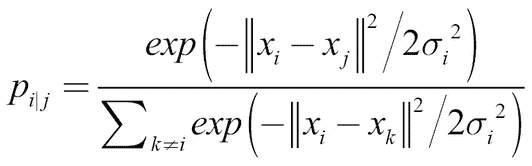
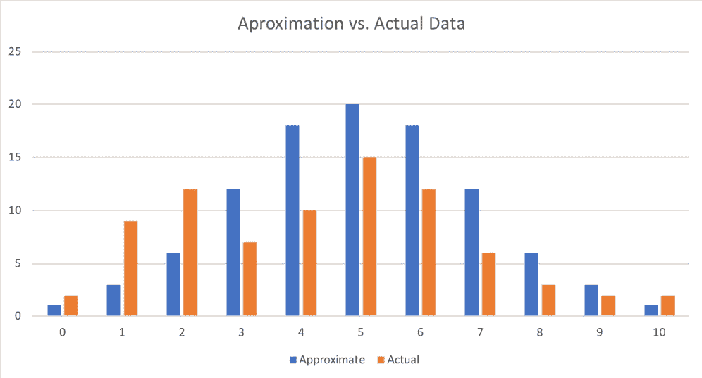
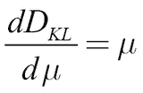
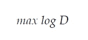
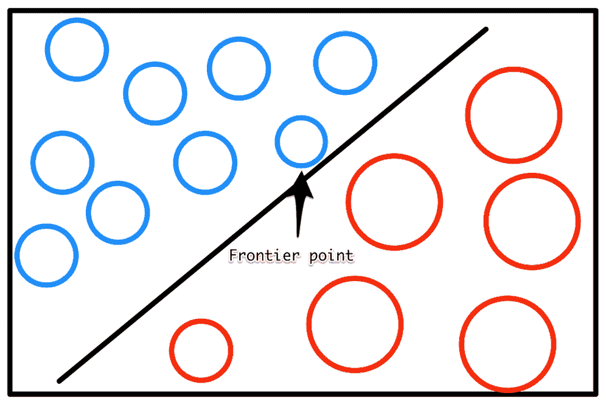

# 第六章：使用生成模型

生成模型生成新的数据。从某种意义上说，它们与我们在前几章中处理的模型完全相反。图像分类器接受高维度的输入——图像，并输出低维度的输出，例如图像的内容，而生成模型的处理方式正好相反。它可能会根据图像的描述来绘制图像。

生成模型仍处于开发的实验阶段，目前主要用于图像应用。然而，它们是一个重要的模型，正如已经有多个应用使用生成模型并在行业内引起轩然大波这一事实所显示的那样。

2017 年，所谓的*DeepFakes*开始在互联网上出现。**生成对抗网络**（**GANs**），我们将在本章稍后讨论的技术，被用来生成包含著名名人的色情视频。前一年，2016 年，研究人员展示了一个系统，通过该系统，他们可以生成政治家说任何研究人员希望他们说的话，并且配有逼真的口型和面部表情。一个例子是 2018 年新闻网站 BuzzFeed 制作的前美国总统巴拉克·奥巴马的假演讲：[`youtu.be/cQ54GDm1eL0`](https://youtu.be/cQ54GDm1eL0)。

这项技术并非完全负面，它也有积极的应用，尤其是在生成模型的数据稀缺的情况下。如果是这种情况，生成模型可以生成逼真的数据，其他模型可以在这些数据上进行训练。生成模型能够“翻译”图像，一个典型的例子是将卫星图像转换为街道地图。另一个例子是生成模型可以根据网站截图生成代码。它们甚至可以用来应对机器学习模型中的不公平和歧视问题，正如我们将在第九章，*对抗偏见*中看到的那样。

在金融领域，数据通常是稀缺的。回想一下在第二章中提到的欺诈案件，*应用机器学习于结构化数据*，我们当时正在从交易元数据中分类识别欺诈交易。我们发现数据集中发生的欺诈交易并不多，因此模型很难检测到欺诈行为。通常，当这种情况发生时，工程师会做出假设并生成合成数据。然而，机器学习模型本身可以做到这一点，在此过程中，它们甚至可能发现一些有助于欺诈检测的有用特征。

在算法交易中，数据通常是在模拟器中生成的。想知道你的算法在全球股市暴跌时会表现如何吗？幸运的是，全球暴跌的情况并不多见，因此定量分析公司的工程师大部分时间都在创建股市暴跌的模拟。这些模拟通常会受到工程师的经验和他们对股市暴跌应有模样的主观看法的影响。但是，假如模型能够学习股市暴跌的基本特征，并生成描述无限数量暴跌的数据呢？

在这一章中，我们将重点关注两类生成模型：自编码器和生成对抗网络（GAN）。首先是**自编码器**这一类，它们旨在将数据压缩成低维表示，并随后忠实地重构数据。第二类是**生成对抗网络（GANs）**，它们的目标是训练一个生成器，使得一个独立的判别器无法分辨伪造图像和真实图像。

# 理解自编码器

从技术上讲，自编码器并不是生成模型，因为它们无法创造完全新的数据类型。然而，变分自编码器（VAE），即对传统自编码器的小幅调整，能够做到这一点。因此，首先理解自编码器本身，再添加生成元素是有意义的。

自编码器本身具有一些有趣的属性，可以被用于如检测信用卡欺诈等应用，这在我们关注的金融领域中非常有用。

给定一个输入 *x*，自编码器学习如何输出 *x*。它的目标是找到一个函数 *f*，使得以下条件成立：


起初这可能听起来很简单，但这里的关键是自编码器有一个瓶颈。中间的隐藏层的大小比输入 *x* 的大小要小。因此，模型必须学习一个压缩的表示，能够在一个更小的向量中捕捉 *x* 的所有重要元素。

这一点可以通过下面的图示来最好地展示，在图中我们可以看到 Autoencoder 结构的压缩表示：


自编码器结构

这个压缩表示旨在捕捉输入的本质，而这对我们是有用的。比如，我们可能希望捕捉到本质上区分欺诈交易和真实交易的特征。传统自编码器通过类似于标准**主成分分析（PCA）**的方式来实现这一点。它们可以让我们减少数据的维度，并专注于重要的部分。但与 PCA 不同，自编码器可以扩展，以生成某种类型的更多数据。例如，自编码器能够更好地处理图像或视频数据，因为它们可以利用卷积层来利用数据的空间特性。

在这一部分，我们将构建两个自编码器。第一个将用于 MNIST 数据集中的手写数字。生成模型对于可视数据来说更容易调试和理解，因为人类天生擅长判断两张图片是否相似，但不太擅长判断抽象数据。第二个自编码器用于欺诈检测任务，使用与 MNIST 数据集相似的方法。

## MNIST 的自编码器

我们从一个简单的自编码器开始，处理 MNIST 手写数字数据集。MNIST 图像是 28x28 像素，可以被展平为一个 784 元素的向量，即 28x28。我们将通过使用自编码器将此数据压缩为仅包含 32 个元素的向量。

在深入了解此处描述的代码之前，请确保已将 MNIST 数据集保存在正确的路径中，成功导入了 NumPy 和 Matplotlib 库，并设置了随机种子以确保实验可重复性。

### 注意

**注意**：你可以在以下网址找到 MNIST 自编码器和变分自编码器的代码 [`www.kaggle.com/jannesklaas/mnist-autoencoder-vae.`](https://www.kaggle.com/jannesklaas/mnist-autoencoder-vae.)

我们现在设置编码维度的超参数，以便稍后使用：

```py
encoding_dim = 32
```

然后，我们使用 Keras 功能性 API 构建自编码器。虽然使用顺序 API 也可以构建一个简单的自编码器，但这对我们复习功能性 API 的工作原理是一个很好的机会。

首先，我们导入`Model`类，它允许我们创建功能性 API 模型。我们还需要导入`Input`和`Dense`层。你会记得在前面的章节中，功能性 API 需要一个单独的输入层，而顺序 API 则不需要。为了导入这两个层，我们需要运行以下代码：

```py
from keras.models import Model
from keras.layers import Input, Dense
```

现在我们正在连接自编码器的各个层：一个`Input`层，后接一个`Dense`层，将图像编码为更小的表示。

接下来是一个`Dense`解码层，旨在重建原始图像：

```py
input_img = Input(shape=(784,))

encoded = Dense(encoding_dim, activation='relu')(input_img)

decoded = Dense(784, activation='sigmoid')(encoded)
```

在我们创建并连接好各个层后，就可以创建一个模型，将输入映射到解码后的图像：

```py
autoencoder = Model(input_img, decoded)
```

为了更好地了解发生了什么，我们可以使用以下代码绘制出结果自编码器模型的可视化图：

```py
from keras.utils import plot_model
plot_model(autoencoder, to_file='model.png', show_shapes=True) plt.figure(figsize=(10,10))
plt.imshow(plt.imread('model.png'))
```

你可以看到我们的自编码器如下所示：


自编码器模型

我们可以使用以下代码进行编译：

```py
autoencoder.compile(optimizer='adadelta', loss='binary_crossentropy')
```

为了训练这个自编码器，我们使用*X*值作为输入和输出：

```py
autoencoder.fit(X_train_flat, X_train_flat,epochs=50,batch_size=256,shuffle=True,validation_data=(X_test_flat, X_test_flat))
```

在我们训练这个自编码器之后，训练过程将持续一到两分钟，我们可以通过可视化检查它的表现。为此，我们首先从测试集提取一张图像，然后为图像添加一个批次维度，以便将其输入到模型中，这就是我们使用`np.expand_dims`的目的：

```py
original = np.expand_dims(X_test_flat[0],0)
```

现在，我们将把原始图像输入到自编码器中。你应该记得原始的 MNIST 图像展示了数字七，因此我们希望自编码器的输出也能显示数字七：

```py
seven = autoencoder.predict(original)
```

接下来，我们将把自编码器的输出和原始图像都重新调整为 28x28 像素的图像：

```py
seven = seven.reshape(1,28,28)
original = original.reshape(1,28,28)
```

然后我们将原始图像和重建图像并排显示。`matplotlib`不允许图像具有批处理维度，因此我们需要传递一个不包含批处理维度的数组。通过使用索引`[0,:,:]`，我们将仅传递批次中的第一项，并包含所有像素。

现在，这个第一项已经没有批处理维度了：

```py
fig = plt.figure(figsize=(7, 10))
a=fig.add_subplot(1,2,1)
a.set_title('Original')
imgplot = plt.imshow(original[0,:,:])

b=fig.add_subplot(1,2,2)
b.set_title('Autoencoder')
imgplot = plt.imshow(seven[0,:,:])
```

运行完这段代码后，你会看到我们的期望已经实现！与原始图像（左）相比，我们的自编码器图像（右）同样显示了数字七！：


自编码器结果

正如你在前面的截图中看到的，重建的七仍然是一个七，因此自编码器能够捕捉到数字七的基本概念。然而，它并不完美，你可以看到它的边缘有些模糊，特别是在左上角。看起来虽然自编码器不确定线条的长度，但它知道七是由两条线组成的，并且能够识别它们的大致方向。

像这样的自编码器执行的是非线性 PCA。它学习哪些组件对数字七的识别最为重要。能够学习这种表示的有用性超越了图像。在信用卡欺诈检测中，这样的主成分将作为良好的特征，供其他分类器使用。

在接下来的章节中，我们将应用自编码器解决信用卡欺诈问题。

## 信用卡自编码器

在这一节中，我们将再次处理信用卡欺诈问题。这次，我们将使用一个与第二章中稍有不同的数据集，*应用机器学习于结构化数据*。

这个新数据集包含了实际信用卡交易的记录，特征已被匿名化；然而，它并不适合进行太多的特征工程。因此，我们将不得不依赖端到端的学习方法来构建一个良好的欺诈检测器。

### 注意

**注意**：你可以在以下网址找到数据集：[`www.kaggle.com/mlg-ulb/creditcardfraud`](https://www.kaggle.com/mlg-ulb/creditcardfraud)，并且可以在以下网址找到一个包含自编码器和变分自编码器实现的笔记本：[`www.kaggle.com/jannesklaas/credit-vae`](https://www.kaggle.com/jannesklaas/credit-vae)。

和往常一样，我们首先加载数据。`Time`特征显示的是交易的绝对时间，这使得数据在这里处理起来有些困难。因此，我们将直接丢弃它，可以通过运行以下代码来实现：

```py
df = pd.read_csv('../input/creditcard.csv')
df = df.drop('Time',axis=1)
```

然后，我们将交易的 `X` 数据与交易的分类分开，并提取出支撑 pandas DataFrame 的 NumPy 数组：

```py
X = df.drop('Class',axis=1).values
y = df['Class'].values
```

现在我们需要对特征进行缩放。特征缩放使得我们的模型更容易学习数据的良好表示。这一次，我们将采用与之前不同的特征缩放方法。我们将所有特征缩放到零和一之间，而不是使其均值为零，标准差为一。通过这样做，我们确保数据集中没有过高或过低的值。

我们必须注意，这种方法容易受到异常值的影响。对于每一列，我们首先减去最小值，使得新的最小值为零。接着，我们除以最大值，使得新的最大值为一。

通过指定 `axis=0`，我们按列进行缩放：

```py
X -= X.min(axis=0)
X /= X.max(axis=0)
```

然后，最后，我们将数据进行拆分：

```py
from sklearn.model_selection import train_test_split
X_train, X_test, y_train,y_test = train_test_split(X,y,test_size=0.1)
```

我们随后创建与之前完全相同的自动编码器；不过这一次，我们使用不同的维度。我们的输入现在有 29 个维度，我们将其压缩到 12 个维度，然后尝试恢复原始的 29 维输出。

虽然 12 个维度在这里是一个相对随意的选择，但它提供了足够的容量来捕捉所有相关信息，同时仍然显著压缩数据：

```py
from keras.models import Model
from keras.layers import Input, Dense
```

我们将使用 sigmoid 激活函数处理解码后的数据。这只有在我们将数据缩放到零和一之间的值时才可能实现。我们还在编码层中使用了 tanh 激活函数。这只是一个在实验中效果良好的风格选择，并确保编码后的值都在-1 到 1 之间。话虽如此，您可以根据个人需求使用不同的激活函数。

如果您处理的是图像或更深的网络，ReLU 激活函数通常是一个不错的选择。然而，如果您处理的是较浅的网络，如我们在这里做的那样，那么 tanh 激活函数通常效果很好：

```py
data_in = Input(shape=(29,))
encoded = Dense(12,activation='tanh')(data_in)
decoded = Dense(29,activation='sigmoid')(encoded)
autoencoder = Model(data_in,decoded)
```

在这个例子中，我们使用了均方误差损失。最开始看起来，这似乎是一个不太常见的选择，因为使用了 sigmoid 激活函数和均方误差损失，但它是有道理的。大多数人认为 sigmoid 激活函数必须与交叉熵损失一起使用，但交叉熵损失鼓励值接近零或一，这在分类任务中非常有效。

在我们的信用卡示例中，大多数值会接近 0.5。我们可以在下面的代码中看到，均方误差更适合处理目标不是二元的，而是处于某种范围内的值。二元交叉熵损失将值强制接近零或一，而这并不是我们总是需要的：

```py
autoencoder.compile(optimizer='adam',loss='mean_squared_error')
```

训练后，自动编码器会在大约两分钟内收敛到一个较低的损失值：

```py
autoencoder.fit(X_train,X_train,epochs = 20,batch_size=128,validation_data=(X_test,X_test))
```

重建损失较低，但我们怎么知道我们的自编码器是否工作得好呢？再次，视觉检查将为我们提供帮助。正如我们之前解释过的，人类在视觉判断方面非常擅长，但在判断抽象数字时却不太擅长。

为了进行视觉检查，首先我们需要做一些预测，我们将在自编码器中运行一部分测试集：

```py
pred = autoencoder.predict(X_test[0:10])
```

然后我们可以绘制单个样本。以下代码生成一个重叠的条形图，比较原始交易数据和重建的交易数据：

```py
import matplotlib.pyplot as plt
import numpy as np

width = 0.8

prediction   = pred[9]
true_value    = X_test[9]

indices = np.arange(len(prediction))

fig = plt.figure(figsize=(10,7))

plt.bar(indices, prediction, width=width, color='b', label='Predicted Value')

plt.bar([i+0.25*width for i in indices], true_value, width=0.5*width, color='r', alpha=0.5, label='True Value')

plt.xticks(indices+width/2., ['V{}'.format(i) for i in range(len(prediction))] )

plt.legend()

plt.show()
```

这段代码将为我们生成以下图表：


自编码器重建与原始数据

如您所见，我们的模型在重建原始值方面表现不错。重建值通常与真实值相匹配，如果不匹配，也只是略有偏差。正如您所见，视觉检查比查看抽象数字能提供更多的洞察。

# 使用 t-SNE 可视化潜在空间

我们现在有一个自编码器，它输入一个信用卡交易并输出一个看起来大致相同的信用卡交易。然而，这并不是我们构建自编码器的目的。自编码器的主要优势在于，我们现在可以将交易编码为一个低维表示，从而捕捉交易的主要元素。

为了创建编码器模型，我们只需定义一个新的 Keras 模型，将输入映射到编码后的状态：

```py
encoder = Model(data_in,encoded)
```

请注意，您无需再次训练此模型。该层会保留之前训练的自编码器的权重。

为了编码我们的数据，我们现在使用编码器模型：

```py
enc = encoder.predict(X_test)
```

但是我们如何知道这些编码是否包含有关欺诈的有意义信息呢？再次，视觉表示是关键。虽然我们的编码比输入数据的维度更少，但它们仍然有 12 维。人类不可能思考一个 12 维的空间，因此我们需要在低维空间中绘制我们的编码，同时仍然保留我们关心的特征。

对我们来说，关心的特征是*邻近性*。我们希望在 12 维空间中相互接近的点，在二维图中也能彼此接近。更准确地说，我们关心的是邻域。我们希望在高维空间中最接近的点，在低维空间中也能最接近。

保持邻域关系很重要，因为我们希望找到欺诈的聚类。如果我们发现欺诈交易在高维编码中形成了一个聚类，那么我们可以简单地检查新交易是否落入该欺诈聚类，从而将其标记为欺诈交易。将高维数据投影到低维图中，同时保持邻域关系的一个流行方法叫做 **t-分布随机邻居嵌入（t-SNE）**。

简而言之，t-SNE 旨在忠实地表示在所有点的随机样本中，两个点是邻居的概率。也就是说，它试图找到数据的低维表示，使得在随机样本中，点之间成为最近邻的概率与高维数据中的相同：


t-SNE 如何衡量相似度

t-SNE 算法的步骤如下：

1.  计算所有点之间的高斯相似度。这个过程通过计算点之间的欧几里得（空间）距离，然后计算该距离下高斯曲线的值，如前图所示。点 *i* 和点 *j* 之间的高斯相似度可以通过以下公式计算：

    在前面的公式中，² 是高斯分布的方差。我们将在本章后面讨论如何确定这个方差。请注意，由于点 *i* 和点 *j* 之间的相似度是通过 *i* 和所有其他点之间的距离总和（表示为 *k*）进行缩放的，因此 *i* 和 *j* 之间的相似度，，可能与 *j* 和 *i* 之间的相似度，，不同。因此，我们将两者的相似度平均，以得到我们后续工作中使用的最终相似度：

    

    在前面的公式中，*n* 是数据点的数量。

1.  在低维空间中随机定位数据点。

1.  计算低维空间中所有点之间的*t-相似度*：

1.  就像训练神经网络一样，我们将通过遵循损失函数的梯度来优化数据点在低维空间中的位置。此处的损失函数是高维空间和低维空间中相似度之间的**Kullback-Leibler**（**KL**）散度。我们将在变分自编码器的部分更详细地介绍 KL 散度。现在，先将其理解为衡量两个分布之间差异的一种方式。损失函数关于低维空间中数据点 *i* 位置 *y[i]* 的导数如下所示：

1.  使用梯度下降调整低维空间中的数据点，令那些在高维数据中接近的点互相靠近，而将那些相距较远的点进一步分开：

1.  你将会识别到这是一种具有动量的梯度下降形式，因为先前的梯度被纳入更新后的位置。

使用的 t 分布总是具有一个自由度。这个自由度导致了一个更简单的公式，并且具有一些很好的数值特性，从而加速了计算并生成了更有用的图表。

高斯分布的标准差可以通过*困惑度*超参数由用户控制。困惑度可以理解为我们期望每个点的邻居数量。低困惑度值强调局部接近性，而高困惑度值则强调全局困惑度值。从数学上讲，困惑度可以按如下方式计算：


这里*P[i]*是数据集所有数据点位置的概率分布，是该分布的香农熵，计算公式如下：


虽然这个公式的细节对于使用 t-SNE 来说并不非常重要，但需要知道 t-SNE 会在标准差的值上进行搜索，，以便找到一个全局分布，*P[i]*，使得我们的数据的熵具有我们期望的困惑度。换句话说，你需要手动指定困惑度，但这个困惑度对你的数据集的含义也取决于数据集本身。

t-SNE 的发明者 Laurens Van Maarten 和 Geoffrey Hinton 报告称，该算法在困惑度值为 5 到 50 之间时相对稳定。大多数库中的默认值是 30，这是大多数数据集的理想选择。然而，如果你发现你的可视化效果不理想，调整困惑度值可能是你最先需要做的事情。

尽管涉及到一定的数学，使用 t-SNE 却出奇的简单。Scikit-learn 提供了一个方便的 t-SNE 实现，我们可以像使用 scikit-learn 中的其他算法一样使用它。

我们首先导入`TSNE`类，然后可以创建一个新的`TSNE`实例。我们定义训练 5000 个周期，使用默认的困惑度值 30 和默认的学习率 200。我们还指定希望在训练过程中输出信息。然后，我们调用`fit_transform`，将 12 个编码转换为二维投影：

```py
from sklearn.manifold import TSNE
tsne = TSNE(verbose=1,n_iter=5000)
res = tsne.fit_transform(enc)
```

作为警告，t-SNE 运算非常慢，因为它需要计算所有点之间的距离。默认情况下，scikit-learn 使用一种更快的 t-SNE 版本，称为 Barnes Hut 近似法。虽然它的精度较低，但速度要快得多。

还有一个更快的 Python 实现版本的 t-SNE，可以作为 scikit-learn 实现的替代品。不过，这个实现文档不完善，功能也较少，因此我们在本书中不会介绍它。

### 注意

**注意**：您可以在以下网址找到更快的实现和安装说明：[`github.com/DmitryUlyanov/Multicore-TSNE`](https://github.com/DmitryUlyanov/Multicore-TSNE)。

然后我们可以将 t-SNE 结果绘制为散点图。为了说明，我们将通过颜色区分欺诈和非欺诈，欺诈用红色表示，非欺诈用蓝色表示。由于 t-SNE 的实际数值并不那么重要，我们将隐藏坐标轴：

```py
fig = plt.figure(figsize=(10,7))
scatter =plt.scatter(res[:,0],res[:,1],c=y_test, cmap='coolwarm', s=0.6)
scatter.axes.get_xaxis().set_visible(False)
scatter.axes.get_yaxis().set_visible(False)
```

现在让我们看看，输出图表会是什么样子：


t-SNE 结果以散点图形式呈现

为了更容易观察，并且方便打印版本的读者，包含最多欺诈交易的聚类（用红色标记）已被圈出。你可以看到，欺诈交易与其余真实交易（用蓝色标记）清晰分开。显然，我们的自动编码器已经找到了区分欺诈和真实交易的方法，而无需标签。这是一种无监督学习。

事实上，普通的自动编码器执行的是 PCA 的近似，这对于无监督学习非常有用。在输出图表中，你可以看到有几个聚类明显与其他交易分开，然而这些并不是欺诈交易。通过使用自动编码器和无监督学习，我们可以以我们之前没有想到的方式对数据进行分离和分组。例如，我们可能能够按照购买类型对交易进行聚类。

使用我们的自动编码器，我们现在可以将编码后的信息作为分类器的特征。然而，更好的做法是，通过对自动编码器做轻微修改，我们可以生成更多具有欺诈案件潜在特征但具有不同特征的数据。这是通过变分自动编码器（VAE）实现的，接下来的章节将重点介绍这一内容。

# 变分自动编码器

自动编码器基本上是 PCA 的近似。 然而，它们可以扩展为生成模型。给定输入，**变分自动编码器**（**VAE**）可以生成编码的*分布*。这意味着，对于一个欺诈案件，编码器将生成一个可能的编码分布，这些编码都代表了交易的最重要特征。解码器随后将所有编码转回原始交易。

这非常有用，因为它可以帮助我们生成关于交易的数据。我们之前发现的一个欺诈检测问题是，欺诈交易并不多。因此，通过使用变分自动编码器（VAE），我们可以对任何数量的交易编码进行采样，并用更多的欺诈交易数据来训练我们的分类器。

那么，VAE 是怎么做到的呢？VAE 不仅仅有一个压缩的表示向量，而是有两个：一个是均值编码，，另一个是这个编码的标准差，：


VAE 方案

均值和标准差都是向量，就像我们在传统自编码器中使用的编码向量一样。然而，为了创建实际的编码，我们只需将带有标准差的随机噪声，，添加到我们的编码向量中。

为了实现值的广泛分布，我们的网络结合了两种损失进行训练：重构损失，这在传统自编码器中你应该已经知道；以及编码分布与标准高斯分布（标准差为 1）之间的 KL 散度损失。

## MNIST 示例

现在开始我们的第一个 VAE。这个 VAE 将与 MNIST 数据集一起使用，并帮助你更好地理解 VAE 是如何工作的。在下一节中，我们将为信用卡欺诈检测构建相同的 VAE。

首先，我们需要导入几个元素，可以通过运行以下代码轻松完成：

```py
from keras.models import Model
from keras.layers import Input, Dense, Lambda
from keras import backend as K
from keras import metrics
```

注意两个新导入的元素，`Lambda` 层和 `metrics` 模块。`metrics` 模块提供了各种度量，例如交叉熵损失，我们将使用它来构建我们的自定义损失函数。与此同时，`Lambda` 层允许我们将 Python 函数作为层使用，稍后我们将使用它从编码分布中进行采样。我们稍后将看到 `Lambda` 层是如何工作的，但首先，我们需要设置神经网络的其余部分。

首先，我们需要定义一些超参数。我们的数据的原始维度是 784，我们将其压缩成一个具有 32 维的潜在向量。我们的网络在输入和潜在向量之间有一个中间层，维度为 256。我们将训练 50 个 epoch，批大小为 100：

```py
batch_size = 100
original_dim = 784
latent_dim = 32
intermediate_dim = 256
epochs = 50
```

出于计算原因，学习标准差的对数比直接学习标准差本身要容易。为此，我们创建了网络的前半部分，其中输入 `x` 映射到中间层 `h`。从该层开始，我们的网络分为 `z_mean`，表示  和 `z_log_var`，表示 ：

```py
x = Input(shape=(original_dim,))
h = Dense(intermediate_dim, activation='relu')(x)
z_mean = Dense(latent_dim)(h)
z_log_var = Dense(latent_dim)(h)
```

## 使用 Lambda 层

`Lambda` 层将任意表达式（即 Python 函数）封装为 Keras 层。但是，要使其正常工作，有一些要求。为了使反向传播有效，函数需要是可微的。毕竟，我们希望通过损失的梯度更新网络权重。幸运的是，Keras 在其 `backend` 模块中提供了许多可微的函数，简单的 Python 数学运算，例如 *y = x + 4*，也是可以的。

此外，`Lambda` 函数只能接受一个输入参数。在我们要创建的层中，输入就是前一层的输出张量。在这种情况下，我们想要创建一个具有两个输入的层， 和 。因此，我们将把这两个输入打包成一个元组，然后我们可以将其拆解开。

你可以看到下面的采样函数：

```py
def sampling(args):
    z_mean, z_log_var = args                                  #1
    epsilon = K.random_normal(shape=(K.shape(z_mean)[0], latent_dim), mean=0.,stddev=1.0)                     #2
    return z_mean + K.exp(z_log_var / 2) * epsilon            #3
```

让我们花一点时间来解析这个函数：

1.  我们拆解输入元组，并得到我们的两个输入张量。

1.  我们创建一个包含随机、正态分布噪声的张量，均值为零，标准差为一。这个张量的形状与我们的输入张量相同（`batch_size`，`latent_dim`）。

1.  最后，我们将随机噪声与标准差相乘，赋予它学习到的标准差，并加上学习到的均值。由于我们在学习对数标准差，我们需要对学习到的张量应用指数函数。

所有这些操作都是可微分的，因为我们使用的是 Keras 后端函数。现在我们可以将这个函数转化为一个层，并用一行代码将它与前两个层连接起来：

```py
z = Lambda(sampling)([z_mean, z_log_var])
```

哇！我们现在有了一个自定义层，可以从由两个张量描述的正态分布中进行采样。Keras 可以自动通过该层反向传播，并训练其前面层的权重。

现在我们已经编码了我们的数据，我们还需要解码它。我们可以通过两个 `Dense` 层来实现：

```py
decoder_h = Dense(intermediate_dim, activation='relu')(z)
x_decoded = Dense(original_dim, activation='sigmoid')decoder_mean(h_decoded)
```

我们的网络现在已经完成。这个网络会将任何 MNIST 图像编码成一个均值和标准差张量，然后解码部分再重建图像。唯一缺少的就是自定义损失函数，促使网络既能重建图像，又能在编码中产生一个正态高斯分布。我们现在来解决这个问题。

## Kullback–Leibler 散度

为了为我们的 VAE 创建自定义损失函数，我们需要一个自定义损失函数。这个损失函数将基于**Kullback-Leibler**（**KL**）散度。

KL 散度是度量之一，就像交叉熵一样，是机器学习从信息论继承来的。虽然它经常被使用，但在尝试理解它时，你可能会遇到许多困难。

从本质上讲，KL 散度衡量的是当分布 *p* 被分布 *q* 近似时，丢失了多少信息。

想象一下你正在做一个金融模型，并收集了一个证券投资的回报数据。你的金融建模工具都假设回报是正态分布的。下图展示了回报的实际分布与使用正态分布模型的近似分布。为了简化这个例子，我们假设只有离散的回报。在我们继续之前，请放心，我们稍后会涵盖连续分布：



近似值与实际值

当然，你的数据中的回报并不是完全符合正态分布。那么，如果你失去了这种近似，关于回报你会丢失多少信息呢？这正是 KL 散度在衡量的内容：


这里和是*x*的概率，在这种情况下，回报有某个值*i*，比如说 5%。前面的公式有效地表达了分布*p*和*q*的概率对数差异的期望：


这种对数概率差异的期望值与如果你用分布*q*近似分布*p*时丢失的平均信息是相同的。见下文：


鉴于 KL 散度通常被写成如下形式：


它也可以以连续形式写成：


对于 VAE，我们希望编码的分布是均值为零、标准差为一的正态高斯分布。

当*p*被正态高斯分布替代时，，而近似*q*是均值为，标准差为的正态分布，，KL 散度简化为以下公式：


因此，我们对均值和标准差向量的偏导数如下：



另一个为：


你可以看到，如果为零，那么对的导数为零；如果为一，那么对的导数为零。这个损失项被加到重构损失中。

## 创建自定义损失

VAE 损失是两种损失的组合：一种重构损失，激励模型很好地重构其输入；另一种是 KL 散度损失，激励模型用其编码近似正态高斯分布。为了创建这种组合损失，我们必须首先分别计算这两部分损失，然后再将它们结合起来。

重建损失与我们应用于普通自动编码器的损失相同。二元交叉熵是用于 MNIST 重建的合适损失。由于 Keras 的二元交叉熵实现已经对批次中的均值进行了处理，而我们希望在稍后进行此操作，因此我们需要将损失缩放回来，以便能够根据输出维度进行划分：

```py
reconstruction_loss = original_dim * metrics.binary_crossentropy(x, x_decoded)
```

KL 散度损失是 KL 散度的简化版本，我们在 KL 散度章节中曾讨论过：


用 Python 表达时，KL 散度损失如下所示的代码：

```py
kl_loss = - 0.5 * K.sum(1 + z_log_var - K.square(z_mean) - K.exp(z_log_var), axis=-1)
```

最终的损失是重建损失和 KL 散度损失之和的均值：

```py
vae_loss = K.mean(reconstruction_loss + kl_loss)
```

由于我们使用了 Keras 后端进行所有计算，最终的损失是一个可以自动求导的张量。现在我们可以像往常一样创建我们的模型：

```py
vae = Model(x, x_decoded)
```

由于我们使用了自定义损失，我们将损失分开处理，不能仅仅在 `compile` 语句中直接相加：

```py
vae.add_loss(vae_loss)
```

现在我们将编译模型。由于我们的模型已经有了损失，我们只需要指定优化器：

```py
vae.compile(optimizer='rmsprop')
```

自定义损失的另一个副作用是它将 VAE 的 *输出* 与 VAE 的 *输入* 进行比较，这很有意义，因为我们想要重建输入。因此，我们不需要指定 *y* 值，仅指定输入即可：

```py
		vae.fit(X_train_flat,
			shuffle=True,
			epochs=epochs,
			batch_size=batch_size,
			validation_data=(X_test_flat, None))

```

在接下来的章节中，我们将学习如何使用 VAE 来生成数据。

## 使用 VAE 生成数据

所以，我们已经得到了自动编码器，但我们如何生成更多的数据呢？我们通过输入，比如一张七的图片，并将其多次通过自动编码器。由于自动编码器是从一个分布中随机采样，每次运行时输出会略有不同。

为了展示这一点，我们将从测试数据中取出一个七：

```py
one_seven = X_test_flat[0]
```

然后我们添加一个批次维度，并将七重复四次，构成一个四个相同七的批次：

```py
one_seven = np.expand_dims(one_seven,0)
one_seven = one_seven.repeat(4,axis=0)
```

然后我们可以对该批次进行预测，在这种情况下，我们会得到重建的七：

```py
s = vae.predict(one_seven)
```

下一步分为两部分。首先，我们将把所有的七重塑回图像形式：

```py
s= s.reshape(4,28,28)
```

然后我们将绘制它们：

```py
fig=plt.figure(figsize=(8, 8))
columns = 2
rows = 2
for i in range(1, columns*rows +1):
    img = s[i-1]
    fig.add_subplot(rows, columns, i)
    plt.imshow(img)
plt.show()
```

运行我们刚刚讲解的代码后，我们将看到以下截图，显示我们四个七作为输出：


一组七

如你所见，所有图像都显示的是七。虽然它们看起来相似，但如果仔细观察，你会发现几个明显的区别。左上角的七笔画比左下角的七要轻一些。与此同时，右下角的七在末端有一个轻微的弯曲。

我们刚刚看到的是 VAE 成功生成新数据。虽然使用这些数据进行更多的训练不如使用全新的真实世界数据效果好，但它仍然非常有用。尽管像这样的生成模型在视觉上很吸引人，我们现在将讨论如何将这种技术应用于信用卡欺诈检测。

## 用于端到端欺诈检测系统的 VAE

为了将 VAE 从 MNIST 示例转移到实际的欺诈检测问题，我们只需要更改三个超参数：输入、隐层和潜在维度的大小，这些都比 MNIST VAE 的要小。其他的一切将保持不变：

```py
original_dim = 29
latent_dim = 6
intermediate_dim = 16
```

以下可视化展示了生成的 VAE，包括输入和输出的形状：


信用卡 VAE 概览

凭借能够编码和生成信用卡数据的变分自编码器（VAE），我们现在可以着手处理端到端的欺诈检测系统任务。这可以减少预测中的偏差，因为我们可以直接从数据中学习复杂的规则。

我们正在使用自编码器的编码部分作为特征提取器，同时也作为一种在需要时为我们提供更多数据的方法。具体如何操作将在主动学习章节中详细讨论，但现在让我们稍作绕道，了解 VAE 如何在时间序列中工作。

# 时间序列的 VAE

本节将介绍时间序列 VAE 的原理和应用，并给出一些使用实例。时间序列在金融领域是一个庞大的话题，因此第四章，《理解时间序列》一章将大量聚焦于此。

自编码器在时间序列领域得到了应用，因为它们能够将长时间序列编码成一个单一的描述性向量。这个向量可以用于例如高效地将一个时间序列与另一个时间序列进行比较，基于特定的复杂模式，这些模式是简单相关性无法捕捉的。

考虑 2010 年的“闪电崩盘”。2010 年 5 月 6 日，从 02:32 开始，美国市场经历了大幅度的价值损失。道琼斯工业平均指数下跌了约 9%，相当于在几分钟内消失了约一万亿美元的市场价值。36 分钟后，崩盘结束，大部分失去的价值得以恢复，人们开始想知道刚刚发生了什么。

五年后，一名叫 Navinder Singh Sarao 的男子因部分导致闪电崩盘并因此赚取 4000 万美元而被逮捕。Sarao 从事一种叫做“虚假订单”的做法，利用自动化机器人下达大量无法成交的卖单，这些卖单会压低市场价格。

这个机器人会将订单留在股票交易所的订单簿上短时间，然后取消它们。与此同时，Sarao 会以新的更低价格购买股票，并在被取消的销售订单之后，当股票开始反弹时获利。虽然 Sarao 无疑不是闪崩事件的唯一责任人，但像虚假交易这样的做法现在已被禁止，像纳斯达克（美国）、东京（日本）和孟买（印度）证券交易所等交易所现在必须监控并标记此类情况。

如果你翻阅一下关于高频交易的旧博客文章，比如 Bloomberg 的 *Spoofers Keep Markets Honest*，你可以在 [`www.bloomberg.com/opinion/articles/2015-01-23/high-frequency-trading-spoofers-and-front-running`](https://www.bloomberg.com/opinion/articles/2015-01-23/high-frequency-trading-spoofers-and-front-running) 阅读到，它提到一些在大公司工作的交易员公开推荐进行虚假交易或前置交易大单，但那是另一个话题。

我们如何检测某人在进行虚假交易？一种方法是使用自编码器。通过使用大量的订单簿信息，我们可以训练一个自编码器来重构“正常”的交易行为。对于那些交易模式偏离正常交易较多的交易者来说，经过训练的自编码器对于这些交易的重构误差会非常高。

另一个选择是训练自编码器，使用不同类型的模式，不论这些模式是否合法，然后将这些模式在潜在空间中进行聚类，就像我们处理欺诈信用卡交易时所做的那样。

循环神经网络（RNNs）默认处理时间序列并输出单一向量。如果将 Keras 的 `return_sequences` 参数设置为 `True`，它们也可以输出序列。使用循环神经网络如 LSTMs，可以通过以下代码构建时间序列的自编码器：

```py
from keras.models import Sequential
from keras.layers import LSTM, RepeatVector

model = Sequential()                                            #1
model.add(LSTM(latent_dim, input_shape=(maxlen, nb_features)))  #2
model.add(RepeatVector(maxlen))                                 #3
model.add(LSTM(nb_features, return_sequences=True))             #4
```

让我们稍作停顿，分解一下我们刚刚编写的代码。如你所见，这段代码包含四个关键元素：

1.  一个简单的自编码器是使用顺序 API 构建的。

1.  我们首先将序列长度 `maxlen` 和等于 `nb_features` 的特征数量输入到 LSTM 中。LSTM 只会返回最后的输出，即一个维度为 `latent_dim` 的单一向量。这个向量就是我们序列的编码。

1.  要解码向量，我们需要在时间序列的长度上重复它。这是通过 `RepeatVector` 层来完成的。

1.  现在，我们将重复的编码序列输入到解码 LSTM 中，这次它会返回整个序列。

VAEs 也可以进入交易领域。它们可以通过生成新的、未见过的数据来增强回测功能，从而进行测试。同样，我们可以使用 VAEs 生成缺失数据的合同数据。

合理的假设是，仅仅因为两个市场日看起来有些不同，可能是相同的力量在起作用。从数学上讲，我们可以假设市场数据  是从概率分布*p(x)*中抽样的，其中包含少量潜在变量*h*。通过使用自编码器，我们可以近似*p(h|x)*，即给定*x*时*h*的分布。这将使我们能够分析市场中的驱动因素*h*。

这解决了一个问题，即对于这种问题，标准的最大似然模型在计算上是不可处理的。另有两种方法可以实现相同的目标，它们分别是*马尔科夫链蒙特卡洛*和*汉密尔顿蒙特卡洛*方法。尽管本文不会深入讨论这两种方法，它们将在后续章节中出现，但值得理解的是，变分自编码器（VAE）以计算上可处理的方式解决了数学金融中长期存在的问题。

生成模型还可以用来解决超出传统方法范围的问题。金融市场本质上是对抗性环境，投资者试图达成在整体上不可能实现的目标：高于平均水平的回报。知道一家公司经营得很好是不够的：如果每个人都知道这家公司做得很好，那么股票价格就会很高，回报率就会很低。关键在于，在其他人认为公司做得很差的时候，能够知道公司做得很好。市场是一个零和博弈的环境。GANs 利用这些动态生成逼真的数据。

# GANs

GAN 的工作方式很像一个艺术伪造者和一个博物馆馆长。每天，艺术伪造者试图将一些假艺术品卖给博物馆，而每天馆长则试图辨别某件艺术品是真的还是假的。伪造者从失败中学习。通过试图欺骗馆长，并观察什么导致成功和失败，他们变得越来越擅长伪造。但馆长也在学习。通过试图超越伪造者，他们变得更为精明。随着时间的推移，伪造品越来越好，辨别过程也越来越精确。经过多年的对抗，艺术伪造者成为了一个能与毕加索相媲美的高手，而馆长则成为了一个能通过微小细节辨别真伪的专家。

从技术上讲，GAN 由两个神经网络组成：一个*生成器*，它从随机潜在向量生成数据，和一个*判别器*，它将数据分类为“真实”的，即来自训练集，或“假”的，即来自生成器。

我们可以通过以下图示来直观地了解 GAN 的结构：


GAN 结构

再次强调，生成模型在生成图像时更容易理解，因此在本节中，我们将查看图像数据，尽管各种数据都可以使用。

GAN 的训练过程如下所示：

1.  创建一个包含随机数的潜在向量。

1.  将潜在向量输入到生成器中，生成器生成一张图像。

1.  来自生成器的一组假图像与来自训练集的一组真实图像混合在一起。判别器在真实和假数据的二分类任务中进行训练。

1.  在判别器训练一段时间后，我们再次输入假图像。这一次，我们将假图像的标签设为“真实”。我们通过判别器进行反向传播，并获得相对于判别器*输入*的损失梯度。我们*不*基于此信息更新判别器的权重。

1.  我们现在有了梯度，描述了我们需要如何改变假的图像，以便判别器将其分类为真实图像。我们使用这些梯度进行反向传播，并训练生成器。

1.  使用我们新改进的生成器，我们再次创建假的图像，这些图像与真实图像混合在一起，用来训练判别器，其梯度将用于再次训练生成器。

### 注意

**注意**：GAN 训练与我们在第三章，*利用计算机视觉*，中讨论的网络层可视化有很多相似之处，只不过这次我们不仅创建一个最大化激活函数的图像，而是创建一个生成网络，专门用于最大化另一个网络的激活函数。

在数学上，生成器 *G* 和判别器 *D* 通过值函数 *V(G,D)* 玩一个最小-最大（mini-max）双人游戏：


在这个公式中，*x* 是从真实数据分布中抽取的一个项，，*z* 是从潜在向量空间 *p[z]* 中抽取的一个潜在向量。

生成器的输出分布记作 *p[g]*。可以证明，这个博弈的全局最优解是


也就是说，如果生成数据的分布等于实际数据的分布。

GAN 的优化遵循博弈论的值函数。使用深度学习解决这种类型的优化问题是一个活跃的研究领域，而我们将在第八章，*隐私、调试和发布你的产品*，再次讨论强化学习。深度学习能够解决最小-最大博弈问题，对于金融和经济领域来说，这是一个令人兴奋的消息，因为这个领域有许多类似的问题。

## 一个 MNIST GAN

现在我们来实现一个 GAN，以生成 MNIST 字符。在开始之前，我们需要做一些导入。GAN 是大型模型，在这一节中，你将看到如何结合顺序模型和函数式 API 模型，便于构建模型：

```py
from keras.models import Model, Sequential
```

在这个例子中，我们将使用一些新的层类型：

```py
from keras.layers import Input, Dense, Dropout, Flatten
from keras.layers import LeakyReLU, Reshape
from keras.layers import Conv2D, UpSampling2D
```

让我们来看一些关键要素：

+   `LeakyReLU`与 ReLU 相似，唯一不同的是该激活函数允许小的负值。这防止了梯度永远变为零。这个激活函数在 GAN 中效果很好，这是我们将在下一节讨论的内容：


Leaky ReLU

+   `Reshape`与`np.reshape`功能相同：它将张量转换为新形式。

+   `UpSampling2D`可以将 2D 特征图按倍数缩放，例如，通过重复特征图中的所有数字来将其放大两倍。

我们将像往常一样使用`Adam`优化器：

```py
from keras.optimizers import Adam
```

神经网络层会随机初始化。通常，这些随机数是从支持良好学习的分布中抽取的。对于 GANs，事实证明，正态高斯分布是一个更好的选择：

```py
from keras.initializers import RandomNormal
```

现在我们将构建生成器模型：

```py
generator = Sequential()                                       #1 

generator.add(Dense(128*7*7, input_dim=latent_dim, kernel_initializer=RandomNormal(stddev=0.02)))   #2

generator.add(LeakyReLU(0.2))                                  #3
generator.add(Reshape((128, 7, 7)))                            #4
generator.add(UpSampling2D(size=(2, 2)))                       #5

generator.add(Conv2D(64,kernel_size=(5, 5),padding='same'))    #6

generator.add(LeakyReLU(0.2))                                  #7
generator.add(UpSampling2D(size=(2, 2)))                       #8

generator.add(Conv2D(1, kernel_size=(5, 5),padding='same', activation='tanh'))                    #9

adam = Adam(lr=0.0002, beta_1=0.5)
generator.compile(loss='binary_crossentropy', optimizer=adam) #10
```

再次让我们看看生成器模型的代码，它由 10 个关键步骤组成：

1.  我们将生成器构建为一个顺序模型。

1.  第一层接收随机潜在向量，并将其映射到一个维度为*128 * 7 * 7 = 6,272*的向量。这已经显著扩展了我们生成数据的维度。对于这个全连接层，重要的是从一个标准差较小的正态高斯分布中初始化权重。与均匀分布不同，高斯分布的极端值较少，这将使训练变得更加容易。

1.  第一层的激活函数是`LeakyReLU`。我们需要指定负输入的斜率陡度；在这种情况下，负输入乘以 0.2。

1.  现在我们将扁平化的向量重新塑形为一个 3D 张量。这是与使用`Flatten`层相反的操作，后者我们在第三章中使用过，*利用计算机视觉*。现在我们得到一个 7x7 像素图像或特征图中的 128 个通道的张量。

1.  使用`UpSampling2D`，我们将图像放大到 14x14 像素。`size`参数指定了宽度和高度的放大倍数。

1.  现在我们可以应用一个标准的`Conv2D`层。与大多数图像分类器的情况不同，我们使用相对较大的 5x5 像素卷积核大小。

1.  紧随`Conv2D`层之后的激活函数是另一个`LeakyReLU`。

1.  我们再次进行上采样，将图像放大到 28x28 像素，与 MNIST 图像的尺寸相同。

1.  我们生成器的最终卷积层输出只有一个单通道图像，因为 MNIST 图像是黑白的。注意到这一层的激活函数是`tanh`激活。`Tanh`将所有值压缩到-1 到 1 之间。这可能出乎意料，因为图像数据通常不会包含负值。然而，经过经验验证，`tanh`激活对于 GAN 效果要优于`sigmoid`激活。

1.  最后，我们编译生成器，使用`Adam`优化器进行训练，并设置一个非常小的学习率和比通常更小的动量。

判别器是一个相对标准的图像分类器，用于将图像分类为真实或虚假。只有少数几个 GAN 特有的修改：

```py
#Discriminator
discriminator = Sequential()
discriminator.add(Conv2D(64, kernel_size=(5, 5), strides=(2, 2), padding='same', input_shape=(1, 28, 28),kernel_initializer=RandomNormal(stddev=0.02)))                                               #1

discriminator.add(LeakyReLU(0.2))
discriminator.add(Dropout(0.3))
discriminator.add(Conv2D(128, kernel_size=(5, 5), strides=(2, 2), padding='same'))
discriminator.add(LeakyReLU(0.2))
discriminator.add(Dropout(0.3))                          #2
discriminator.add(Flatten())
discriminator.add(Dense(1, activation='sigmoid'))
discriminator.compile(loss='binary_crossentropy', optimizer=adam)
```

这里有两个关键要素：

1.  与生成器一样，判别器的第一层应从高斯分布中随机初始化。

1.  Dropout 在图像分类器中是常用的。对于 GAN，也应该在最后一层之前使用。

现在我们有了生成器和判别器。为了训练生成器，我们需要从判别器获取梯度并通过反向传播来训练生成器。这正是 Keras 模块化设计的强大之处。

### 注意

**注意**：Keras 模型可以像 Keras 层一样处理。

以下代码创建了一个可以用来从判别器梯度训练生成器的 GAN 模型：

```py
discriminator.trainable = False                         #1
ganInput = Input(shape=(latent_dim,))                   #2
x = generator(ganInput)                                 #3
ganOutput = discriminator(x)                            #4
gan = Model(inputs=ganInput, outputs=ganOutput)         #5
gan.compile(loss='binary_crossentropy', optimizer=adam) #6
```

在这段代码中，有六个关键阶段：

1.  在训练生成器时，我们不希望训练`discriminator`。当将`discriminator`设置为不可训练时，权重只会在与不可训练权重一起编译的模型中被冻结。也就是说，我们仍然可以单独训练`discriminator`模型，但一旦它成为再次编译的 GAN 模型的一部分，它的权重就会被冻结。

1.  我们为我们的 GAN 创建一个新的输入，它接收随机潜在向量。

1.  我们将生成器模型连接到`ganInput`层。该模型可以像函数式 API 下的层一样使用。

1.  我们现在将带有冻结权重的判别器连接到生成器。再次地，我们像在函数式 API 中使用层一样调用模型。

1.  我们创建一个将输入映射到判别器输出的模型。

1.  我们编译我们的 GAN 模型。由于我们在此调用了`compile`，判别器模型的权重会在它们作为 GAN 模型的一部分时被冻结。Keras 在训练时会发出警告，表明实际的判别器模型的权重未被冻结。

训练我们的 GAN 需要对训练过程进行一些定制，并且还需要一些 GAN 特有的技巧。更具体地说，我们必须编写自己的训练循环，下面的代码将实现这一目标：

```py
epochs=50
batchSize=128
batchCount = X_train.shape[0] // batchSize                     #1

for e in range(1, epochs+1):                                   #2
    print('-'*15, 'Epoch %d' % e, '-'*15)
    for _ in tqdm(range(batchCount)):                          #3

        noise = np.random.normal(0, 1, size=[batchSize, latent_dim]) #4
        imageBatch = X_train[np.random.randint(0, X_train.shape[0],size=batchSize)] #5

        generatedImages = generator.predict(noise)             #6
        X = np.concatenate([imageBatch, generatedImages])      #7

        yDis = np.zeros(2*batchSize)                           #8
        yDis[:batchSize] = 0.9 

        labelNoise = np.random.random(yDis.shape)              #9
        yDis += 0.05 * labelNoise + 0.05

        discriminator.trainable = True                         #10
        dloss = discriminator.train_on_batch(X, yDis)          #11

        noise = np.random.normal(0, 1, size=[batchSize, latent_dim]) #12
        yGen = np.ones(batchSize)                              #13
        discriminator.trainable = False                        #14
        gloss = gan.train_on_batch(noise, yGen)                #15

    dLosses.append(dloss)                                      #16
    gLosses.append(gloss)
```

这段代码刚才介绍了很多内容。让我们暂停一下，思考一下这 16 个关键步骤：

1.  我们必须编写一个自定义循环来遍历批次。要知道有多少个批次，我们需要将数据集大小除以批次大小并进行整数除法。

1.  在外部循环中，我们遍历要训练的 epoch 数量。

1.  在内部循环中，我们遍历每个 epoch 中要训练的批次数量。`tqdm`工具帮助我们跟踪批次的进度。

1.  我们创建一批随机潜在向量。

1.  我们随机抽取一批真实的 MNIST 图像。

1.  我们使用生成器生成一批虚假的 MNIST 图像。

1.  我们将真实和虚假的 MNIST 图像堆叠在一起。

1.  我们为判别器创建目标。假图像编码为 0，真实图像编码为 0.9。这种技术称为软标签。与硬标签（0 和 1）不同，我们使用更柔和的标签，以免过于激进地训练 GAN。研究表明，这种技术可以使 GAN 训练更加稳定。

1.  除了使用软标签外，我们还向标签中添加了一些噪声。这将再次使训练更加稳定。

1.  我们确保判别器是可训练的。

1.  我们在一批真实和假数据上训练判别器。

1.  我们为训练生成器创建更多的随机潜在向量。

1.  生成器训练的目标始终是 1。我们希望判别器给出那些能让假图像看起来像真实图像的梯度。

1.  为了确保万无一失，我们将判别器设置为不可训练，以避免不小心破坏任何东西。

1.  我们训练 GAN 模型。我们输入一批随机的潜在向量，训练 GAN 的生成器部分，以使判别器部分能够将生成的图像分类为真实的。

1.  我们保存训练中的损失值。

在下图中，你可以看到一些生成的 MNIST 字符：


GAN 生成的 MNIST 字符

大多数字符看起来像可识别的数字，尽管一些字符（例如左下角和右下角的字符）看起来有些不太对劲。

我们编写并探索的代码现在在以下图表中输出，展示了随着 Epoch 次数增加，判别器和生成器的损失。


GAN 训练进展

请注意，GAN 训练中的损失无法像监督学习中那样解释。即使 GAN 有所进展，其损失也不会下降。

生成器和判别器的损失取决于另一个模型的表现。如果生成器在欺骗判别器方面变得更强，判别器的损失就会保持较高。如果其中一个损失降到零，意味着另一个模型在比赛中失败，无法再欺骗或正确区分另一个模型。

这也是让 GAN 训练如此困难的原因之一：**GAN 并不会收敛到低损失的解**；它们收敛到一种*平衡*状态，其中生成器并不是每次都能欺骗判别器，而是很多时候能做到。这个平衡状态并不总是稳定的。往标签和网络本身添加大量噪声的部分原因是，它增加了平衡状态的稳定性。

由于 GAN 不稳定且难以训练，但又非常有用，因此随着时间的推移，已经开发出了许多技巧，使得 GAN 训练更加稳定。了解这些技巧可以帮助你在构建 GAN 时节省无数小时，即使这些技巧背后往往没有理论依据。

## 理解 GAN 的潜在向量

对于自编码器，潜在空间是 PCA 的相对简单的近似。VAE 创建了一个分布的潜在空间，这虽然有用，但仍然可以视为 PCA 的一种形式。那么，如果我们在训练过程中仅从中随机采样，GAN 的潜在空间是什么样的呢？事实证明，GANs 会自我构建潜在空间。使用 GAN 的潜在空间，你仍然可以根据显示的字符将 MNIST 图像聚类。

研究表明，GANs 的潜在空间通常具有一些令人惊讶的特征，例如“笑容向量”，它们根据人们笑容的宽度排列面部图像。研究人员还表明，GANs 可以用于潜在空间代数，其中不同物体的潜在表示相加，可以创建现实的、新的物体。然而，关于 GANs 潜在空间的研究仍处于起步阶段，从其潜在空间表示中推断世界的规律仍然是一个活跃的研究领域。

## GAN 训练技巧

GANs 的训练非常棘手。它们可能会崩溃、发散，或者以多种不同的方式失败。研究人员和实践者提出了许多技巧，使 GANs 更好地工作。虽然这可能看起来很奇怪，但我们并不清楚为什么这些方法有效，不过对我们来说，重要的是它们在实践中确实有帮助：

+   **规范化输入**：GANs 对极端值处理不好，所以确保你始终将输入规范化到 -1 和 1 之间。这也是为什么你应该使用 tanh 函数作为生成器输出的原因。

+   **不要使用理论上的正确损失函数**：如果你读过关于 GANs 的论文，你会发现它们给出的生成器优化目标是以下公式：

    在这个公式中，*D* 是判别器的输出。实际上，如果生成器的目标是这样的，它会更有效：

    

    换句话说，与其最小化负的判别器输出，不如最大化判别器输出。原因是，第一个目标通常在 GAN 训练的初期会出现梯度消失的情况。

+   **从正态高斯分布中采样**：从正态分布中采样而不是均匀分布有两个原因。首先，GANs 对极端值处理不好，而正态分布相比均匀分布包含较少的极端值。此外，事实证明，如果潜在向量是从正态分布中采样的，那么潜在空间会变成一个球体。这个球体中潜在向量之间的关系比立方体空间中的潜在向量关系更容易描述。

+   **使用批量归一化**：我们已经看到，由于 GANs 非常脆弱，它们对极端值的处理不好。减少极端值的另一种方法是使用批量归一化，正如我们在第三章中讨论的，*利用计算机视觉*。

+   **为真实数据和假数据使用不同的批次**：在这个过程的初期，真实数据和假数据的分布可能差异很大。由于批量归一化是基于批次的均值和标准差进行标准化，因此最好将真实数据和假数据分开使用。虽然这样做会导致梯度估计稍微不准确，但由于极端值减少，这样的做法会带来较大的收益。

+   **使用软标签和噪声标签**：GANs 非常脆弱，使用软标签可以减少梯度并避免梯度过大。向标签中添加一些随机噪声也有助于稳定系统。

+   **使用基本的 GAN**：现在有很多不同的 GAN 模型。许多模型声称性能有显著提升，但实际上它们的效果并不比简单的**深度卷积生成对抗网络（DCGAN）**好，甚至往往更差。这并不意味着这些模型没有存在的理由，但对于大多数任务来说，基础的 GAN 模型表现会更好。另一个表现良好的 GAN 是对抗自编码器，它通过在判别器的梯度上训练自编码器，将 VAE 与 GAN 结合起来。

+   **避免使用 ReLU 和 MaxPool**：ReLU 激活函数和 MaxPool 层在深度学习中常被使用，但它们的缺点是产生“稀疏梯度”。ReLU 激活函数对于负输入没有梯度，MaxPool 层对于非最大输入也没有梯度。由于梯度是训练生成器的关键，稀疏梯度会影响生成器的训练效果。

+   **使用 Adam 优化器**：研究表明，这种优化器在 GANs 中表现非常好，而许多其他优化器则不适用于它们。

+   **尽早跟踪失败**：有时，GANs 可能由于随机原因失败。仅仅选择一个“错误”的随机种子就可能导致训练失败。通常，通过观察输出，可以判断 GAN 是否完全偏离了正确的轨道。输出应该逐渐变得越来越像真实数据。

    如果生成器完全偏离轨道并且只输出零，比如说，你可以在浪费几天 GPU 时间进行无效训练之前就察觉到这一点。

+   **不要通过统计来平衡损失**：保持生成器和判别器之间的平衡是一项微妙的任务。因此，许多从业者试图通过根据统计信息多训练生成器或判别器来帮助平衡。通常，这样做并不起作用。GANs 是非常反直觉的，试图用直觉的方法来帮助它们，通常会让事情变得更糟。这并不是说没有办法帮助 GAN 的平衡，但是帮助应该来自于一种有原则的方法，例如“在生成器损失高于*X*时训练生成器”。

+   **如果你有标签，使用它们**：一个稍微复杂一点的 GAN 判别器版本，不仅能将数据分类为真实或假，还能分类数据的类别。在 MNIST 的案例中，判别器会有 11 个输出：10 个真实数字的输出以及一个假的输出。这使得我们可以创建一个能够展示更具体图像的 GAN。这在半监督学习领域非常有用，我们将在下一节讨论这个话题。

+   **向输入添加噪声，随着时间减少噪声**：噪声能够增加 GAN 训练的稳定性，因此噪声输入有助于训练，尤其是在 GAN 训练的早期不稳定阶段。然而，随着训练的进行，噪声可能会干扰过多，从而阻止 GAN 生成逼真的图像。所以，我们应该随着时间的推移减少输入中的噪声。

+   **在训练和测试阶段都在生成器中使用 dropout**：一些研究者发现，在推理时使用 dropout 会得到更好的生成数据结果。为什么会这样，仍然是一个悬而未决的问题。

+   **历史平均**：GAN 在训练过程中往往会“振荡”，其权重在均值周围快速变化。历史平均会惩罚那些偏离历史平均值过远的权重，并减少振荡。因此，它能够提高 GAN 训练的稳定性。

+   **回放缓冲区**：回放缓冲区保存一些较早生成的图像，以便它们可以被重新用于训练判别器。这和历史平均有类似的效果，可以减少振荡并提高稳定性。它还减少了与测试数据的相关性。

+   **目标网络**：另一种“反振荡”技巧是使用目标网络。即创建生成器和判别器的副本，然后使用冻结的判别器副本训练生成器，使用冻结的生成器副本训练判别器。

+   **熵正则化**：熵正则化意味着奖励网络输出更多不同的值。这可以防止生成器网络固守在某些特定的输出上，例如只生成数字 7。它是一种正则化方法，因为它可以防止过拟合。

+   **使用 dropout 或噪声层**：噪声对 GAN 是有益的。Keras 不仅具有 dropout 层，还提供了多种噪声层，可以向网络的激活添加不同种类的噪声。你可以阅读这些层的文档，查看它们是否对你的 GAN 应用有帮助：[`keras.io/layers/noise/`](https://keras.io/layers/noise/)。

# 使用更少的数据 – 主动学习

生成模型的部分动机，无论是 GAN 还是 VAE，始终是它们可以帮助我们生成数据，从而减少对数据的需求。由于数据本质上是稀疏的，尤其是在金融领域，而且我们永远都不会拥有足够的数据，生成模型看起来像是经济学家警告我们不要相信的“免费午餐”。然而，即便是最好的 GAN 也能在*没有*数据的情况下工作。在本节中，我们将看看使用尽可能少的数据来启动模型的不同方法。该方法也被称为主动学习或半监督学习。

**无监督学习**使用未标记的数据以不同方式对数据进行聚类。一个例子是自编码器，其中图像可以转化为学习到的潜在向量，这些向量随后可以进行聚类，而无需描述图像的标签。

**监督学习**使用带标签的数据。一个例子是我们在第三章中构建的图像分类器，*利用计算机视觉*，或者我们在本书中构建的大多数其他模型。

**半监督学习**旨在执行通常由监督模型完成的任务，但手头的数据较少，并且使用无监督或生成方法。有三种方式可以实现这一点：首先，通过更聪明地利用人类；其次，通过更好地利用未标记数据；第三，通过使用生成模型。

## 高效使用标签预算

尽管关于人工智能取代人类的讨论很多，但实际上训练 AI 系统仍然需要大量人类。虽然具体数字不清楚，但可以合理推测，亚马逊 MTurk 服务上注册的“机械土耳工”人数在 500,000 到 750,000 之间。

MTurk 是亚马逊提供的一个网站，根据其自己的网站，提供“通过 API 实现的人类智能。”实际上，这意味着公司和研究人员发布简单的任务，如填写调查问卷或分类图像，全球各地的人们为这些任务支付少量费用。为了让 AI 学习，人类需要提供标注数据。如果任务规模较大，许多公司会雇佣 MTurk 用户来进行标注。如果任务较小，通常会是公司的员工来标注数据。

令人惊讶的是，关于这些人类标注的内容，考虑得并不多。并非所有标签都是同等有用的。下图展示了一个线性分类器。正如你所看到的，靠近两个类之间的边界点决定了决策边界的位置，而那些距离较远的点则不那么相关：



边界点更有价值

因此，边界点比远离决策边界的点更有价值。你可以通过以下方式在更少的数据上进行训练：

1.  只标注少量图像

1.  训练一个弱模型

1.  让这个弱模型对一些未标记的图像进行预测

1.  标记模型最不确定的图像，并将其添加到训练集中

1.  重复这个过程

这种标注数据的过程比随机标注数据要高效得多，能够显著加速你的工作进程。

## 利用机器进行人工标注

在标注过程中，许多公司依赖于 Microsoft Excel。他们让人工标注员查看需要标注的内容，如图像或文本，然后该人员将标签输入到 Excel 表格中。虽然这种方法极为低效且容易出错，但仍然是一种常见做法。一些稍微高级的标注操作包括构建简单的 Web 应用程序，让用户查看需要标注的项目，并直接点击标签或按快捷键。这可以显著加速标注过程。然而，如果标签类别非常多，这种方法仍然不是最优的。

另一种方法是再次标注一些图像并预训练一个弱模型。在标注过程中，计算机会向标注员展示数据和标签。标注员只需要决定这个标签是否正确。这可以通过快捷键轻松完成，标注一个项目所需的时间大幅缩短。如果标签错误，标注界面可以弹出一个可能的标签选项列表，并按模型赋予的概率排序，或者直接将该项目放回堆栈，下次显示下一个最可能的标签。

这种技术的一个很好的实现是“Prodigy”，这是由制作 spaCy 的公司开发的一个标注工具，我们在第五章，《*使用自然语言处理解析文本数据*》中学到了这个工具，我们可以在以下屏幕截图中看到 Prodigy 工具的示例：


Prodigy 标注工具的屏幕截图

Prodigy 是一个利用机器的标注工具，你可以通过阅读其官方文档了解更多信息：[`prodi.gy/`](https://prodi.gy/)。

### 注意

**注意**：更好的用户界面设计和智能的弱模型实现可以大大加速标注的速度和质量。

## 对未标记数据进行伪标签处理

通常，未标注的数据非常充足，但标注过的数据量却很少。那些未标注的数据仍然可以使用。首先，你需要在已有的标注数据上训练一个模型。然后，你让该模型对你的未标注数据进行预测。你将这些预测当作真实标签，并在完整的伪标注数据集上训练你的模型。然而，实际的真实标签应该比伪标签使用得更频繁。

伪标签的具体采样率可以根据不同的情况有所变化。此方法适用于错误是随机的情况。如果错误存在偏差，那么你的模型也会有偏差。这种简单的方法出奇地有效，能够大大减少标注工作量。

## 使用生成模型

事实证明，GAN 在半监督训练中扩展得非常自然。通过给判别器两个输出，我们可以训练它同时成为一个分类器。

判别器的第一次输出仅将数据分类为真实或伪造，就像之前 GAN 的输出一样。第二次输出根据数据的类别进行分类，例如图像所表示的数字，或者一个额外的“是伪造”的类别。在 MNIST 示例中，分类输出将有 11 个类别，10 个数字加上“是伪造”类别。关键在于生成器是一个模型，只有输出，即最后一层不同。这迫使“真实或伪造”分类与“哪一位数字”分类器共享权重。

这个方法的核心思想是，要判断一张图像是真实的还是伪造的，分类器需要判断它是否能将该图像归类到一个类别中。如果能，这张图像可能就是真的。这个方法叫做**半监督生成对抗网络**（**SGAN**），已被证明在有限数据上能比标准的监督学习生成更真实的数据，并提供更好的结果。当然，GAN 不仅可以应用于图像。

在下一节中，我们将把它们应用到我们的欺诈检测任务中。

# 用于欺诈检测的 SGAN

作为本章的最终应用项目，我们再次考虑信用卡问题。在本节中，我们将创建一个 SGAN，步骤如下：


SGAN 方案

我们将在少于 1,000 个交易上训练该模型，并仍然能够得到一个合理的欺诈检测器。

### 注意

**注意**：你可以在 Kaggle 上找到 SGAN 的代码，链接如下：[`www.kaggle.com/jannesklaas/semi-supervised-gan-for-fraud-detection/code`](https://www.kaggle.com/jannesklaas/semi-supervised-gan-for-fraud-detection/code)。

在这种情况下，我们的数据有 29 个维度。我们将潜在向量的维度设置为 10：

```py
latent_dim=10
data_dim=29
```

生成器模型构建为一个全连接网络，使用`LeakyReLU`激活函数和批量归一化。输出激活函数使用`tanh`：

```py
model = Sequential()
model.add(Dense(16, input_dim=latent_dim))
model.add(LeakyReLU(alpha=0.2))
model.add(BatchNormalization(momentum=0.8))
model.add(Dense(32, input_dim=latent_dim))
model.add(LeakyReLU(alpha=0.2))
model.add(BatchNormalization(momentum=0.8))
model.add(Dense(data_dim,activation='tanh'))
```

为了更好地使用生成器模型，我们将创建的模型包装成一个函数式 API 模型，将噪声向量映射到生成的交易记录。由于大多数 GAN 文献都是关于图像的，而“交易记录”有些拗口，因此我们将交易记录称为“图像”：

```py
noise = Input(shape=(latent_dim,))
img = model(noise)

generator = Model(noise, img)
```

就像我们为生成器所做的那样，我们在顺序 API 中构建判别器。判别器有两个输出：一个用于类别，另一个用于真假分类。我们首先只构建模型的基础部分：

```py
model = Sequential()
model.add(Dense(31,input_dim=data_dim))
model.add(LeakyReLU(alpha=0.2))
model.add(BatchNormalization(momentum=0.8))
model.add(Dropout(0.25))
model.add(Dense(16,input_dim=data_dim))
model.add(LeakyReLU(alpha=0.2))
```

现在，我们将通过函数式 API 将判别器的输入映射到它的两个输出：

```py
img = Input(shape=(data_dim,))                               #1
features = model(img)                                        #2
valid = Dense(1, activation="sigmoid")(features)             #3
label = Dense(num_classes+1, activation="softmax")(features) #4

discriminator = Model(img, [valid, label])                   #5
```

让我们花点时间看看前面代码的五个关键点：

1.  我们为噪声向量创建一个输入占位符。

1.  我们从判别器基础模型中获取特征张量。

1.  我们创建一个`Dense`层，用于将交易分类为真实或假的，并将其映射到特征向量。

1.  我们为交易的真假分类创建第二个`Dense`层。

1.  我们创建一个模型，将输入映射到两个头部。

为了编译具有两个头部的判别器，我们需要使用一些高级模型编译技巧：

```py
		optimizer = Adam(0.0002, 0.5) #1
		discriminator.compile(loss=['binary_crossentropy',
									'categorical_crossentropy'], #2
									loss_weights=[0.5, 0.5], #3
									optimizer=optimizer, #4
									metrics=['accuracy']) #5

```

将代码拆解开来，我们看到五个关键元素：

1.  我们定义了一个`Adam`优化器，学习率为`0.0002`，动量为`0.5`。

1.  由于我们有两个模型头部，我们可以指定两个损失函数。我们的真假分类头部是一个二分类器，因此我们为其使用`binary_crossentropy`。我们的分类头部是一个多分类器，因此我们为第二个头部使用`categorical_crossentropy`。

1.  我们可以指定如何加权两个不同的损失函数。在这种情况下，我们为所有损失函数分配 50%的权重。

1.  我们优化了我们预定义的`Adam`优化器。

1.  只要我们没有使用软标签，就可以使用准确率指标来跟踪进度。

最后，我们创建我们的组合 GAN 模型：

```py
noise = Input(shape=(latent_dim,))               #1
img = generator(noise)                           #2
discriminator.trainable = False                  #3
valid,_ = discriminator(img)                     #4
combined = Model(noise , valid)                  #5
combined.compile(loss=['binary_crossentropy'],optimizer=optimizer)
```

再次查看代码，我们可以看到以下关键点：

1.  我们为噪声向量输入创建一个占位符。

1.  我们通过将生成器映射到噪声占位符来获得表示生成图像的张量。

1.  我们确保通过将判别器设置为不可训练，避免破坏它。

1.  我们只希望判别器相信生成的交易是真的，因此我们可以丢弃分类输出张量。

1.  我们将噪声输入映射到判别器的“真假分类”输出。

对于训练，我们定义了一个`train`函数，它为我们处理所有的训练工作：

```py
	def train(X_train,y_train,
				X_test,y_test,
				generator,discriminator,
				combined,
				num_classes,
				epochs,
				batch_size=128):

    f1_progress = []                                             #1
    half_batch = int(batch_size / 2)                             #2

    cw1 = {0: 1, 1: 1}                                           #3
    cw2 = {i: num_classes / half_batch for i in range(num_classes)}
    cw2[num_classes] = 1 / half_batch

    for epoch in range(epochs):

        idx = np.random.randint(0, X_train.shape[0], half_batch) #4
        imgs = X_train[idx]

        noise = np.random.normal(0, 1, (half_batch, 10))         #5
        gen_imgs = generator.predict(noise)

        valid = np.ones((half_batch, 1))                           #6
        fake = np.zeros((half_batch, 1))

        labels = to_categorical(y_train[idx], num_classes=num_classes+1)                                         #7

        fake_labels = np.full((half_batch, 1),num_classes)         #8
        fake_labels = to_categorical(fake_labels,num_classes=num_classes+1)
        d_loss_real = discriminator.train_on_batch(imgs, [valid, labels],class_weight=[cw1, cw2])  #9
        d_loss_fake = discriminator.train_on_batch(gen_imgs, [fake, fake_labels],class_weight=[cw1, cw2])  #10
        d_loss = 0.5 * np.add(d_loss_real, d_loss_fake)            #11

        noise = np.random.normal(0, 1, (batch_size, 10))           #12
        validity = np.ones((batch_size, 1))
        g_loss = combined.train_on_batch(noise, validity, class_weight=[cw1, cw2]) #13

        print ("%d [D loss: %f] [G loss: %f]" % (epoch, g_loss))  #14

        if epoch % 10 == 0:                                       #15
            _,y_pred = discriminator.predict(X_test,batch_size=batch_size)
            y_pred = np.argmax(y_pred[:,:-1],axis=1)

            f1 = f1_score(y_test,y_pred)
            print('Epoch: {}, F1: {:.5f}'.format(epoch,f1))
            f1_progress.append(f1)

    return f1_progress
```

稍作停顿：那是一个非常长且复杂的函数。在总结这一章之前，让我们看看那段代码的 15 个关键元素：

1.  我们创建一个空数组来监控判别器在测试集上的 F1 得分。

1.  由于我们对真实数据和假数据使用独立的批量训练步骤，因此我们实际上为每个训练步骤使用了半批数据。

1.  判别器的分类头部有一个“这是假的”类标签。由于一半的图像是假的，我们希望为这个类赋予更高的权重。

1.  我们现在随机抽取一组真实数据。

1.  我们生成一些随机噪声向量，并使用生成器创建一些假数据。

1.  对于“真假分类”头部，我们创建标签。所有真实图像的标签为`1`（真实），而所有假图像的标签为`0`（假）。

1.  我们对真实数据的标签进行独热编码。通过指定我们的数据比实际数据多一个类，我们为“是假的”类留出了空间。

1.  我们的假数据都被标记为“是假的”标签。我们创建一个标签向量，并对其进行独热编码。

1.  首先，我们在真实数据上训练判别器。

1.  然后我们在假数据上训练判别器。

1.  该轮判别器的总损失是来自真实数据和虚假数据损失的平均值。

1.  现在我们开始训练生成器。我们生成一批噪声向量以及一批标签，标记为“这是实际数据”。

1.  在拥有这些数据之后，我们开始训练生成器。

1.  为了跟踪进展，我们会打印输出进度。记住，我们不希望损失值下降；我们希望它们保持大致恒定。如果生成器或判别器的表现远好于另一个，那么平衡就会打破。

1.  最后，我们计算并输出使用判别器作为欺诈检测分类器对数据进行处理时的 F1 得分。这次，我们只关心分类数据，并丢弃“真实或虚假”这一部分。我们通过分类器中不是“真实”的类别来分类交易。

现在我们已完成所有设置，将训练 SGAN 5,000 轮。这在 GPU 上大约需要 5 分钟，如果没有 GPU，可能需要更长时间：

```py
f1_p = train(X_res,y_res,X_test,y_test,generator,discriminator,combined,num_classes=2,epochs=5000, batch_size=128)
```

最后，我们绘制了半监督欺诈分类器的 F1 得分随时间变化的图表：

```py
fig = plt.figure(figsize=(10,7))
plt.plot(f1_p)
plt.xlabel('10 Epochs')
plt.ylabel('F1 Score Validation')
```

这将输出如下图表：


SGAN 进展

正如你所看到的，模型一开始学习得非常快，但随后崩溃，F1 得分降为零。这是一个典型的 GAN 崩溃例子。如前所述，GAN 是非常不稳定的。如果生成器和判别器之间的微妙平衡打破，性能会迅速恶化。

使 GAN 更加稳定是一个活跃的研究领域。到目前为止，许多从业者通常会尝试使用不同的超参数和随机种子进行多次运行，希望能走运。另一种流行的方法是每隔几轮就保存一次模型。尽管训练样本少于 1,000 个交易数据，但该模型似乎在第 150 轮左右成为一个相当不错的欺诈检测器。

# 练习

为了更好地理解生成模型，尝试完成以下练习：

1.  创建一个 SGAN 来训练 MNIST 图像分类器。你能用多少的图像达到 90%以上的分类准确率？

1.  使用 LSTM，你可以为股票价格波动构建一个自编码器。使用像 DJIA 股票价格这样的数据集，构建一个能够编码股票波动的自编码器。然后，观察在通过潜在空间时输出的变化。你可以在这里找到数据集：[`www.kaggle.com/szrlee/stock-time-series-20050101-to-20171231`](https://www.kaggle.com/szrlee/stock-time-series-20050101-to-20171231)。

# 总结

在本章中，你学习了两种最重要的生成模型：自编码器和 GAN。我们首先为 MNIST 图像开发了一个自编码器。然后，我们使用类似的架构来编码信用卡数据并检测欺诈。随后，我们将自编码器扩展为 VAE。这使我们能够学习编码的分布并生成新的数据，用于训练。

此后，我们学习了生成对抗网络（GAN），首先是在 MNIST 图像的背景下，然后是信用卡欺诈的背景下。我们使用 SGAN 减少了训练欺诈检测器所需的数据量。我们通过主动学习和更智能的标注接口，利用模型输出减少了所需标注的数量。

我们还讨论并学习了潜在空间及其在金融分析中的应用。我们了解了 t-SNE 算法，以及它如何用于可视化更高维度（潜在）数据。你们还初步了解了机器学习如何解决博弈论中的优化问题。GAN 解决的是一种最小最大问题，这在经济学和金融学中非常常见。

在下一章，我们将深入探讨这种类型的优化问题，重点讲解强化学习。
