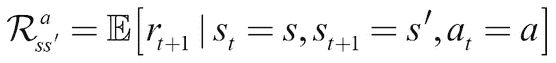
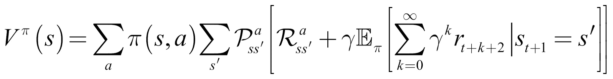

# 第七章：强化学习在金融市场中的应用

人类并不是通过成千上万的标注样本来学习的。相反，我们通常通过与行动相关的正面或负面经验来学习。孩子们如果第一次触摸热炉子，就再也不会触摸它。通过经验和随之而来的奖励或惩罚学习是**强化学习**（**RL**）背后的核心思想。强化学习使我们能够在完全没有数据的情况下学习复杂的决策规则。通过这种方法，AI 领域取得了多个重要突破，例如 AlphaGo，在 2016 年战胜了世界围棋冠军。

在金融领域，强化学习（Reinforcement Learning，简称 RL）也在逐渐取得进展。在 2017 年的报告中，*《投资管理中的机器学习》* ([`www.ahl.com/machine-learning`](https://www.ahl.com/machine-learning))，Man AHL 概述了一种用于外汇和期货市场订单路由的强化学习系统。订单路由是量化金融中的经典问题。在下单时，资金通常可以选择不同的经纪商，并在不同的时间提交订单。目标是以尽可能低的成本完成订单。这也意味着要最小化市场影响，因为大额订单可能会推高股票价格。

传统的算法，如*Sniper*或*Guerilla*，依赖于历史数据的统计信息和智能工程。而基于强化学习的路由系统则能自主学习出最优的路由策略。其优势在于该系统可以适应变化的市场，因此在数据丰富的市场（如外汇市场）中，它比传统方法更具优势。

然而，强化学习的应用不止如此。OpenAI 的研究人员利用强化学习预测代理何时会合作或对抗。同时，DeepMind 的研究人员也利用强化学习获得了关于大脑前额皮质运作及多巴胺激素作用的新见解。

本章将通过一个简单的“接水果”游戏，直观地介绍强化学习。然后我们将深入探讨其背后的理论，再进一步讲解更高级的强化学习应用。本章中的示例依赖于需要可视化的内容，而这些内容在 Kaggle 内核中无法轻松渲染。为了简化这些示例，代码并没有针对 GPU 进行优化。因此，最好在本地机器上运行这些示例。

本章中的算法运行速度相对较快，因此你不必等待太长时间才能运行完毕。本章的代码是在 2012 年中期的 MacBook Pro 上编写的，没有任何示例在该机器上运行超过 20 分钟。当然，你也可以在 Kaggle 上运行这些代码，但可视化效果无法在 Kaggle 上显示。

# Catch——强化学习快速指南

Catch 是一个简单的街机游戏，你可能在小时候玩过。水果从屏幕上方掉下来，玩家需要用篮子接住它们。每接住一颗水果，玩家得一分；每丢失一颗水果，玩家扣一分。

这里的目标是让计算机独立地玩接水果游戏。为了简化任务，我们将在这个示例中使用一个简化版本：


我们将要创建的“接水果”游戏

在玩接水果游戏时，玩家需要在三种可能的动作之间做出选择。他们可以将篮子移动到左边、右边，或让篮子保持原位。

做出决策的基础是游戏的当前状态；换句话说，就是掉落的水果和篮子的位置。我们的目标是创建一个模型，给定游戏画面的内容，选择出能够获得最高分数的动作。这个任务可以看作是一个简单的分类问题。我们可以让专家级的玩家多次玩游戏并记录他们的动作。然后，我们可以训练一个模型，选择出与专家玩家相匹配的“正确”动作。

然而，这并不是人类学习的方式。人类可以在没有指导的情况下自己学习像接水果这样的游戏。这非常有用，因为想象一下，如果每次你想学像接水果这样简单的游戏时，你都必须雇佣一群专家进行成千上万次的操作：那会非常昂贵且缓慢。

在强化学习中，模型是通过经验进行训练的，而不是标记数据。我们不是给模型提供正确的动作，而是给它提供奖励和惩罚。模型接收环境当前状态的信息，例如，计算机游戏屏幕。然后，它输出一个动作，比如摇杆的移动。环境对这个动作作出反应，并提供下一个状态以及任何奖励：


强化学习框架

然后，模型学习找到能够带来最大奖励的动作。实际上，这有许多种方法可以实现。目前，我们将关注**Q 学习**。Q 学习在用来训练计算机玩 Atari 电子游戏时引起了广泛关注。今天，它仍然是一个相关的概念。大多数现代强化学习算法都是基于 Q 学习的某些改编。

理解 Q 学习的一个好方法是将玩接水果游戏与下棋进行比较。在这两种游戏中，你都给定了一个状态，*s*。在国际象棋中，这是棋盘上棋子的摆放位置；在接水果中，这是水果和篮子的位置。然后，玩家必须采取一个动作，*a*。在国际象棋中，这是移动棋子；在接水果中，这是将篮子向左或向右移动，或保持当前的位置。

结果将会有一定的奖励，*r*，以及一个新的状态，。接水果和国际象棋的问题在于，奖励并不会在动作后立即出现。

在“Catch”游戏中，只有当水果击中篮子或掉落在地上时，才能获得奖励；在象棋中，只有当你赢得或输掉比赛时，才会获得奖励。这意味着奖励是稀疏分布的。大多数时候，*r*将为零。即使有奖励，这也不一定是由于紧接着前一步的行动造成的。某个较早时采取的行动可能导致了胜利。确定是哪一步行动导致了奖励，通常被称为“信用分配问题”。由于奖励是延迟的，优秀的棋手不会仅凭即时奖励来选择自己的下一步棋。相反，他们会选择期望的未来奖励。

例如，他们不仅仅考虑是否能在下一步消除对方的棋子，还会考虑当前采取特定行动将如何在长远来看帮助自己。在 Q 学习中，我们根据最高的期望未来奖励来选择行动。我们使用**Q 函数**来计算这一点。这是一个数学函数，包含两个参数：游戏的当前状态和一个给定的行动。我们可以将其写作*Q(state, action)*。

在状态*s*下，我们会为每个可能的行动*a*估算未来奖励。我们假设在采取行动*a*并移动到下一个状态之后，，一切都会顺利进行。给定状态和行动的期望未来奖励，*q(s,a)*，是通过即时奖励加上之后的期望未来奖励来计算的，。我们假设下一步行动，，是最优的。由于未来具有不确定性，我们通过因子 gamma 对进行折扣，。因此，我们得出以下期望奖励：


### 注意

**注意**：我们在强化学习中折扣未来奖励，原因与我们在金融中折扣未来收益相同。它们是不确定的。我们在这里的选择反映了我们对未来收益的重视程度。

优秀的棋手非常擅长在脑海中估算未来奖励。换句话说，他们的 Q 函数，*Q(s,a)*，非常精确。

大多数象棋练习都围绕着开发更好的 Q 函数展开。玩家浏览许多旧的棋局，学习过去具体的棋步是如何进行的，以及某个特定行动有多大可能导致胜利。然而，这引出了一个问题：机器如何评估一个好的 Q 函数？这就是神经网络派上用场的地方。

## Q 学习将强化学习转化为监督学习

在进行游戏时，我们会生成大量的“经验”。这些经验包括以下内容：

+   初始状态，*s*

+   所采取的行动，*a*

+   获得的奖励，*r*

+   接下来的状态，

这些经验就是我们的训练数据。我们可以将估计*Q(s,a)*的问题看作一个回归问题。为了解决这个问题，我们可以使用神经网络。给定一个由*s*和*a*组成的输入向量，神经网络应该预测*Q(s,a)*的值，等于目标值：。如果我们能够准确预测不同状态*s*和动作*a*的*Q(s,a)*值，那么我们就能很好地逼近 Q 函数。

### 注意

**注意**：我们通过与*Q(s,a)*相同的神经网络来估计。这会导致一些不稳定性，因为随着网络的学习，我们的目标值也会变化，就像**生成对抗网络（GANs）**一样。

给定一批经验，，训练过程如下所示：

1.  对于每个可能的动作，，（左、右、停留），使用神经网络预测期望的未来奖励，。

1.  选择三个预测值中的最大值作为最大值，。

1.  计算。这是神经网络的目标值。

1.  使用损失函数训练神经网络。这个函数计算预测值与目标值之间的距离或差距。在这里，我们将使用作为损失函数。实际上，我们希望最小化预测值与目标值之间的平方误差。0.5 的系数仅仅是为了让梯度更加平滑。

在游戏过程中，所有经验都存储在回放记忆中。它就像一个简单的缓冲区，我们在其中存储对。`ExperienceReplay`类还负责为训练准备数据。

查看以下代码：

```py
class ExperienceReplay(object):                                   #1
    def __init__(self, max_memory=100, discount=.9):
        self.max_memory = max_memory                              #2
        self.memory = []
        self.discount = discount

    def remember(self, states, game_over):                        #3
        self.memory.append([states, game_over])
        if len(self.memory) > self.max_memory:
            del self.memory[0]                                    #4

    def get_batch(self, model, batch_size=10):                    #5
        len_memory = len(self.memory)                             #6
        num_actions = model.output_shape[-1]
        env_dim = self.memory[0][0][0].shape[1]

        inputs = np.zeros((min(len_memory, batch_size), env_dim)) #7
        targets = np.zeros((inputs.shape[0], num_actions))

        for i, idx in enumerate(np.random.randint(0, len_memory, size=inputs.shape[0])):           #8
            state_t, action_t, reward_t, state_tp1 = self.memory[idx][0]                               #9
            game_over = self.memory[idx][1]

            inputs[i:i+1] = state_t                               #10

            targets[i] = model.predict(state_t)[0]                #11

            Q_sa = np.max(model.predict(state_tp1)[0])            #12

            if game_over:                                         #13
                targets[i, action_t] = reward_t
            else:
                targets[i, action_t] = reward_t + self.discount * Q_sa
        return inputs, targets
```

让我们暂停一下，分析一下我们刚刚创建的代码：

1.  首先，我们将经验回放缓冲区实现为一个 Python 类。回放缓冲区对象负责存储经验并生成训练数据。因此，它必须实现 Q-learning 算法中的一些关键部分。

1.  要初始化回放对象，我们需要告知它缓冲区的大小以及折扣率。回放记忆本身是一个列表的列表，遵循以下结构：

    ```py
    [...[experience, game_over][experience, game_over]...]
    ```

1.  在此过程中，`experience`是一个元组，包含了经验信息，而`game_over`是一个二进制布尔值，表示游戏在此步骤后是否结束。

1.  当我们想要记住一个新的经验时，我们将其添加到我们的经验列表中。由于我们不能存储无限的经验，如果缓冲区超过了最大长度，我们将删除最旧的经验。

1.  使用`get_batch`函数，我们可以获得一个单独的训练数据批次。为了计算，我们也需要一个神经网络，因此我们需要传递一个 Keras 模型来使用该函数。

1.  在我们开始生成一个批次之前，我们需要知道我们在回放缓冲区中存储了多少经验，可能的动作有多少，以及游戏状态有多少维度。

1.  然后，我们需要为输入和目标设置占位符数组，这些是我们希望神经网络训练的数据。

1.  我们随机遍历经验回放，直到我们已经抽取了所有存储的经验或填充了批次。

1.  我们从回放缓冲区加载经验数据以及`game_over`指示器。

1.  我们将状态*s*添加到输入矩阵中。之后，模型将训练以从这个状态映射到预期奖励。

1.  然后，我们用当前模型计算的预期奖励填充所有动作的预期奖励。这确保了我们的模型只在实际采取的动作上进行训练，因为所有其他动作的损失为零。

1.  接下来，我们计算。我们假设对于下一个状态，，或者在代码中为`state_tp1`，神经网络将完美地估计预期奖励。随着网络训练的进行，这一假设会逐渐变为真实。

1.  最后，如果游戏在状态*S*后结束，则从动作*a*获得的预期奖励应该是实际获得的奖励*r*。如果没有结束，则预期奖励应为实际获得的奖励加上折扣后的预期未来奖励。

## 定义 Q-learning 模型

现在是时候定义将为接球游戏学习 Q 函数的模型了。事实证明，一个相对简单的模型就能够很好地学习这个函数。我们需要定义可能的动作数量以及网格大小。共有三种可能的动作，分别是*向左移动*、*保持原地*和*向右移动*。此外，游戏是在一个 10x10 像素的网格上进行的：

```py
num_actions = 3
grid_size = 10
```

由于这是一个回归问题，最后一层没有激活函数，损失函数是均方误差损失。我们使用随机梯度下降优化网络，不使用动量或其他任何花里胡哨的东西：

```py
model = Sequential()
model.add(Dense(100, input_shape=(grid_size**2,), activation='relu'))
model.add(Dense(100, activation='relu'))
model.add(Dense(num_actions))
model.compile(optimizer='sgd', loss='mse')
```

## 训练玩接球游戏

Q-learning 的最后一个要素是探索。日常生活表明，有时你必须做一些奇怪的和/或随机的事情，以发现是否有比你每天的常规更好的选择。

Q 学习也是如此。通过始终选择最佳选项，你可能会错过一些未曾探索的路径。为了避免这种情况，学习者有时会选择一个随机选项，而不一定是最佳的选项。

现在我们可以定义训练方法：

```py
def train(model,epochs):
    win_cnt = 0                                                 #1

    win_hist = []

    for e in range(epochs):                                     #2
        loss = 0.
        env.reset()
        game_over = False
        input_t = env.observe()

        while not game_over:                                    #3
            input_tm1 = input_t                                 #4

            if np.random.rand() <= epsilon:                     #5
                action = np.random.randint(0, num_actions, size=1)
            else:
                q = model.predict(input_tm1)                    #6
                action = np.argmax(q[0])

            input_t, reward, game_over = env.act(action)        #7
            if reward == 1:
                win_cnt += 1

            exp_replay.remember([input_tm1, action, reward, input_t],game_over)            #8

            inputs, targets = exp_replay.get_batch(model, batch_size=batch_size)          #9

            batch_loss = model.train_on_batch(inputs, targets)

            loss += batch_loss

        win_hist.append(win_cnt)
    return win_hist
```

在继续之前，让我们再次分解代码，看看我们在做什么：

1.  我们希望跟踪 Q-learner 的进展，因此我们会统计模型随时间变化的胜利次数。

1.  我们现在将进行若干游戏，由`epoch`参数指定。游戏开始时，我们首先重置游戏，将`game_over`指示器设置为`False`，并观察游戏的初始状态。

1.  然后我们将逐帧播放，直到游戏结束。

1.  在每个帧周期开始时，我们将之前观察到的输入保存为`input_tm1`，即时间 *t* 减去一的输入。

1.  现在进入探索部分。我们生成一个介于 0 和 1 之间的随机数。如果这个数小于`epsilon`，我们选择一个随机动作。这个技术也被称为“epsilon 贪婪”，因为我们以 epsilon 的概率选择随机动作，否则就贪婪地选择预期奖励最高的动作。

1.  如果我们选择一个非随机动作，我们让神经网络预测所有动作的预期奖励。然后我们选择预期奖励最高的动作。

1.  我们现在根据选择的动作或随机动作进行操作，并观察一个新的状态、奖励以及游戏是否结束的信息。如果我们赢了，游戏会给我们一个奖励值 1，因此我们最终需要增加我们的胜利计数器。

1.  我们将新的经验存储在我们的经验重放缓冲区中。

1.  然后我们从经验重放中抽取一个新的训练批次，并对该批次进行训练。

下图显示了成功游戏的滚动均值。经过大约 2,000 次训练周期后，神经网络应该能相当擅长玩 Catch 游戏：


Q-learning 神经网络玩 Catch 游戏的进展

看看前面的图表，可以放心地说，你现在已经成功创建了你的第一个强化学习系统，因为经过 5000 次训练周期后，每场游戏的平均胜率在 90% 和 100% 之间。在下一节中，我们将探索强化学习的理论基础，了解同一个学习玩 Catch 的系统是如何学习在期货市场中进行订单路由的。

# 马尔可夫过程与贝尔曼方程 – 强化学习的更正式介绍

根据现代深度学习作为量化金融的延续，并且配合更多的 GPU，强化学习的理论基础在于马尔可夫模型。

### 注意

**注意**：本节需要一定的数学背景知识。如果你感到困难，Victor Powell 在这里提供了一个非常好的视觉介绍：[`setosa.io/ev/markov-chains/`](http://setosa.io/ev/markov-chains/)。

一个更正式但仍然简单的介绍可以在网站 Analytics Vidhya 上找到：[`www.analyticsvidhya.com/blog/2014/07/markov-chain-simplified/`](https://www.analyticsvidhya.com/blog/2014/07/markov-chain-simplified/)。

马尔可夫模型描述了一个随机过程，其中不同的状态，进入特定状态的概率完全依赖于当前所在的状态。在下面的图示中，你可以看到一个简单的马尔可夫模型，描述了针对一只股票的推荐：


马尔可夫模型

如你所见，这个模型中有三个状态，**买入**、**持有**和**卖出**。每两个状态之间都有一个转移概率。例如，某一状态如果在前一轮有**持有**推荐，那么它得到**买入**推荐的概率是由表示的，等于 0.5。也就是说，当前处于**持有**状态的股票，在下一轮有 50%的概率转到**买入**状态。

状态与奖励相关。如果你持有股票，并且该股票有**买入**推荐，该股票会上涨，你将获得**1**的奖励。如果股票有卖出推荐，你将获得负奖励或惩罚，**-1**。

### 注意

**注意**：在一些教材中，奖励与状态转移相关，而不是与状态本身相关。事实上，这在数学上是等价的，为了简化符号，我们在这里将奖励与状态相关联。

在马尔可夫模型中，代理可以遵循一个策略，通常表示为。一个策略描述了在状态*s*时采取动作*a*的概率。假设你是一个交易者：你持有股票，并且该股票收到**卖出**推荐。在这种情况下，你可能在 50%的情况下选择卖出股票，在 30%的情况下选择持有股票，在 20%的情况下选择买入更多股票。换句话说，你在**卖出**状态下的策略可以描述如下：


一些交易者有更好的策略，能够从某个状态中赚取比其他人更多的钱。因此，状态*s*的价值取决于策略，。价值函数*V*描述了在遵循策略时，状态*s*的价值。它是遵循策略时，从状态*s*获得的期望回报：


期望回报是即时获得的奖励加上折扣后的未来奖励：


强化学习中常用的另一个值函数是*Q(s,a)*，我们在前一节中已经见过。*Q*描述了在状态*s*下，采取动作*a*并遵循策略时的期望回报：


### 注意

**注意**：我们使用期望值，因为我们的环境和行为是随机的。我们无法确定一定会到达某个特定状态；我们只能给出概率。

*Q*和*V*描述的是相同的内容。如果我们处于某个状态，我们应该怎么做？*V*给出我们应该寻求的状态的建议，*Q*则给出我们应该采取的行动的建议。当然，*V*隐含着我们必须采取某些行动，而*Q*则假设我们的行动结果是进入某个状态。事实上，*Q*和*V*都源自所谓的贝尔曼方程，这将我们引回到本节开始时的马尔可夫模型。

如果你假设你所操作的环境可以用马尔可夫模型来描述，那么你会真正想要了解两件事。首先，你会想要找出*状态转移概率*。如果你处于状态*s*，在采取动作*a*之后，*s*状态转移到状态的概率是多少？从数学角度来看，公式如下：


同样地，你也会对在状态*s*下，采取动作*a*并最终到达状态的期望奖励感兴趣：



牢记这一点，我们现在可以推导出*Q*和*V*的两个贝尔曼方程。首先，我们重写描述*V*的方程，包含实际的公式，见下图：


我们可以将第一个奖励从总和中提取出来：


我们期望的第一部分是我们从处于状态*s*并遵循后续策略直接获得的期望回报，：


上述方程展示了一个嵌套求和。首先，我们对所有行动*a*进行求和，按它们在策略下发生的概率加权。对于每个行动，我们再对从状态*s*到下一个状态的回报分布进行求和，，该回报由行动*a*后从状态*s*到下一个状态的转移产生，按该转移发生的概率加权，。

我们期望的第二部分可以重新写成如下形式：


状态*s*之后的未来回报的期望折扣值是所有状态的期望未来值的折扣，，按它们的发生概率加权，，以及在后续策略下采取行动*a*的概率，。

这个公式确实有些复杂，但它为我们揭示了值函数的递归特性。如果我们现在将值函数中的期望替换，公式变得更加清晰：



内部的期望表示下一步的值函数，！这意味着我们可以用值函数替换期望。


按照相同的逻辑，我们可以推导出*Q*函数，如下所示：


恭喜，你刚刚推导出了贝尔曼方程！现在，暂停一下，思考并确保你真正理解这些方程背后的原理。核心思想是一个状态的价值可以表示为其他状态的价值。长期以来，优化贝尔曼方程的首选方法是构建一个基本的马尔可夫模型，并模拟其状态转换和奖励概率。

然而，递归结构需要一种叫做动态规划的技术。动态规划的思想是解决更容易的子问题。你已经在 Catch 示例中看到了这一点。在那个例子中，我们使用神经网络来估计，除了游戏结束的状态。对于这些游戏，找到与状态相关的奖励是很容易的：那就是游戏结束时获得的最终奖励。正是这些状态，神经网络首次开发了准确的*Q*函数估计值。从这些状态开始，它就可以向后推导，学习距离游戏结束较远的状态的价值。动态规划和无模型强化学习方法的应用还有更多可能。

在我们深入探讨如何利用这一理论基础构建不同类型的系统之前，我们将简要回顾贝尔曼方程在经济学中的应用。对这些工作已经熟悉的读者将会找到参考点，帮助他们更深入理解贝尔曼方程。对这些工作不熟悉的读者则可以从中获得进一步阅读的灵感，并找到本章所讨论技术的应用场景。

## 贝尔曼方程在经济学中的应用

虽然贝尔曼方程首次应用于经济学是在 1954 年，但罗伯特·C·梅尔顿（Robert C. Merton）1973 年的文章，*《跨期资本资产定价模型》*（[`www.people.hbs.edu/rmerton/Intertemporal%20Capital%20Asset%20Pricing%20Model.pdf`](http://www.people.hbs.edu/rmerton/Intertemporal%20Capital%20Asset%20Pricing%20Model.pdf)），*也许是最著名的应用。*梅尔顿使用贝尔曼方程，发展了一个资本资产定价模型，不同于经典的 CAPM 模型，该模型在连续时间内运作，并能解释投资机会的变化。

贝尔曼方程的递归性启发了递归经济学的子领域。南希·斯托基（Nancy Stokey）、罗伯特·卢卡斯（Robert Lucas）和爱德华·普雷斯科特（Edward Prescott）于 1989 年写了本具有影响力的书籍《*经济动态中的递归方法*》（[`www.hup.harvard.edu/catalog.php?isbn=9780674750968`](http://www.hup.harvard.edu/catalog.php?isbn=9780674750968)），他们在书中应用递归方法解决经济理论中的问题。这本书激励了其他人利用递归经济学来解决各种经济问题，从委托代理问题到最优经济增长。

Avinash Dixit 和 Robert Pindyck 在 1994 年出版的《*不确定性下的投资*》一书中，成功地将这一方法应用于资本预算([`press.princeton.edu/titles/5474.html`](https://press.princeton.edu/titles/5474.html))。Patrick Anderson 在 2009 年的文章《*美国私人企业的价值*》中将其应用于私人企业估值([`www.andersoneconomicgroup.com/the-value-of-private-businesses-in-the-united-states/`](https://www.andersoneconomicgroup.com/the-value-of-private-businesses-in-the-united-states/))。

虽然递归经济学仍然面临许多问题，包括所需的巨大的计算能力，但它是该科学领域一个充满前景的子领域。

# 优势演员-评论家模型

如我们在前面的章节中所看到的，Q 学习非常有用，但也有其缺点。例如，由于我们必须为每个动作估计一个 Q 值，因此必须有一个离散的、有限的动作集。那么，如果动作空间是连续的或极其庞大的呢？假设你正在使用一个 RL 算法来构建一个股票投资组合。

在这种情况下，即使你的股票池仅包含两只股票，比如 AMZN 和 AAPL，仍然有大量方式来平衡它们：10%的 AMZN 和 90%的 AAPL，11%的 AMZN 和 89%的 AAPL，依此类推。如果你的股票池更大，你可以组合股票的方式将成倍增加。

避免从如此大的动作空间中选择的一个解决办法是直接学习策略，。一旦你学会了一个策略，你只需要给它一个状态，它就会返回一个动作分布。这意味着你的动作也将是随机的。随机策略有其优势，特别是在博弈论的背景下。

想象一下你正在玩剪刀石头布，并且你遵循一个确定性策略。如果你的策略是出石头，你将总是出石头，一旦你的对手发现你总是出石头，你将永远输掉比赛。剪刀石头布的纳什均衡，作为一个非合作博弈的解法，是随机选择动作。只有随机策略才能做到这一点。

要学习一个策略，我们必须能够计算关于策略的梯度。与大多数人的预期相反，策略是可微的。在本节中，我们将一步步构建一个策略梯度，并利用它创建一个**优势演员-评论家**（**A2C**）模型，用于连续控制。

区分策略的过程中的第一步是看看通过选择一个特定动作*a*，而不是仅仅遵循策略，，我们能获得的优势。


动作*a*在状态*s*中的优势是执行*a*在*s*中的价值减去策略下状态*s*的价值，。我们通过来衡量我们的策略，，它是表示起始状态期望值的函数，：


现在，要计算策略的梯度，我们必须进行两个步骤，这两个步骤在策略梯度公式中的期望部分显示：


首先，我们必须计算给定动作*a*的优势*A(s,a)*。然后，我们必须计算神经网络权重的导数，，以增加动作*a*在策略下被选择的概率，。

对于具有正优势的动作*A(s,a)*，我们遵循使*a*更可能的梯度。对于具有负优势的动作，我们则朝着完全相反的方向前进。期望表示我们正在为所有状态和所有动作执行此操作。实际上，我们手动将动作的优势与它们增加的可能性梯度相乘。

我们接下来要看的是如何计算优势。采取一个动作的价值是由于执行该动作而直接获得的奖励，以及执行该动作后我们所处状态的价值：


因此，我们可以在优势计算中代入*Q(s,a)*：


由于计算*V*对于计算策略梯度很有用，研究人员提出了 A2C 架构。该架构是一个具有两个输出头的单一神经网络，学习*V*和。事实证明，共享学习这两个函数的权重是有益的，因为如果两个输出头都需要从环境中提取特征，共享权重可以加速训练：


A2C 方案

例如，如果你在训练一个处理高维图像数据的智能体，那么值函数和策略头都需要学习如何解读图像。共享权重将有助于掌握这一共同任务。如果你正在处理低维数据，可能更合理的是不共享权重。

如果动作空间是连续的，由两个输出表示，即均值，，以及标准差，。这允许我们像在自动编码器中一样从学习到的分布中进行采样。

A2C 方法的一个常见变体是**异步优势演员-评论家**（**A3C**）。A3C 的工作原理与 A2C 完全相同，只是在训练时，多个智能体会并行模拟。这意味着可以收集更多独立的数据。独立数据非常重要，因为过于相关的示例会使模型过拟合特定情境，而忽略其他情境。

由于 A3C 和 A2C 都遵循相同的原理，而并行游戏的实现引入了一些复杂性，可能会使实际算法变得模糊，因此我们将在接下来的示例中仅使用 A2C。

## 学习平衡

在这一部分，我们将训练一个 A2C 模型来摆动并平衡一个摆锤：


摆锤环境

摆锤是通过可以在任意方向施加的旋转力来控制的。在前面的图中，你可以看到施加力的箭头。控制是连续的；智能体可以施加更多或更少的力。同时，力可以在两个方向上施加，作为正向力或负向力。

这个相对简单的控制任务是一个有用的连续控制示例，可以很容易地扩展到股票交易任务，稍后我们将讨论这一点。此外，这个任务可以通过可视化的方式帮助我们直观地理解算法是如何学习的，包括其中的任何陷阱。

### 注意

**注意**：在实现新算法时，尽量选择一个可以可视化的任务进行测试。失败往往是微妙的，通过数据很难发现，但视觉上更容易察觉。

摆锤环境是 OpenAI Gym 的一部分，它是一个用于训练强化学习算法的游戏套件。你可以通过以下命令行进行安装：

```py
pip install

```

在我们开始之前，我们需要做一些导入：

```py
import gym                                           #1

import numpy as np                                   #2

from scipy.stats import norm                         #3
from keras.layers import Dense, Input, Lambda
from keras.models import Model
from keras.optimizers import Adam
from keras import backend as K

from collections import deque                        #4
import random
```

有很多新的导入，我们将一一讲解：

1.  OpenAI 的 `gym` 是一个用于开发强化学习算法的工具包。它提供了许多游戏环境，从经典的控制任务（如摆锤）到 Atari 游戏和机器人仿真。

1.  `gym` 通过 `numpy` 数组进行接口。状态、动作和环境都以 `numpy` 兼容的格式呈现。

1.  我们的神经网络会相对较小，并基于函数式 API。由于我们再次学习一个分布，因此我们需要使用 SciPy 的 `norm` 函数，它帮助我们对向量进行归一化处理。

1.  `deque` Python 数据结构是一种高效的数据结构，可以方便地管理最大长度。再也不用手动移除经验了！我们可以使用 Python 的 `random` 模块从 `deque` 中随机采样。

现在是时候构建代理了。以下方法都构成了 `A2CAgent` 类：

```py
def __init__(self, state_size, action_size):

    self.state_size = state_size                       #1
    self.action_size = action_size
    self.value_size = 1

    self.exp_replay = deque(maxlen=2000)               #2

    self.actor_lr = 0.0001                             #3
    self.critic_lr = 0.001
    self.discount_factor = .9

    self.actor, self.critic = self.build_model()       #4

    self.optimize_actor = self.actor_optimizer()       #5
    self.optimize_critic = self.critic_optimizer()
```

让我们一步步分析代码：

1.  首先，我们需要定义一些与游戏相关的变量。状态空间的大小和动作空间的大小由游戏决定。摆的状态由三个与摆角相关的变量组成。一个状态由 θ 的正弦值、θ 的余弦值和角速度组成。状态的值只是一个单一的标量。

1.  接下来，我们设置了经验回放缓冲区，它最多可以保存 2,000 个状态。更大规模的强化学习实验通常会有更大的回放缓冲区（通常约为 500 万个经验），但对于这个任务来说，2,000 个就足够了。

1.  由于我们正在训练一个神经网络，我们需要设置一些超参数。即使 actor 和 critic 共享权重，事实证明，actor 的学习率通常应低于 critic 的学习率。这是因为我们训练 actor 的策略梯度通常更加波动。我们还需要设置折扣率，。请记住，强化学习中的折扣率与金融中的应用方式不同。在金融中，折扣是通过将未来值除以 1 加上折扣因子来实现的。而在强化学习中，我们是用折扣率进行乘法运算。因此，较高的折扣因子  意味着未来的值受到的折扣较少。

1.  为了实际构建模型，我们定义了一个单独的方法，接下来我们将讨论这个方法。

1.  actor 和 critic 的优化器是自定义优化器。为了定义这些优化器，我们还创建了一个单独的函数。优化器本身是可以在训练时调用的函数：

```py
def build_model(self):

    state = Input(batch_shape=(None, self.state_size))          #1

    actor_input = Dense(30,                                     #2 
                        activation='relu',
                        kernel_initializer='he_uniform')(state)

    mu_0 = Dense(self.action_size,                              #3
                 activation='tanh',
                 kernel_initializer='he_uniform')(actor_input)

    mu = Lambda(lambda x: x * 2)(mu_0)                          #4

    sigma_0 = Dense(self.action_size,                           #5
                    activation='softplus',
                    kernel_initializer='he_uniform')(actor_input)

    sigma = Lambda(lambda x: x + 0.0001)(sigma_0)               #6

    critic_input = Dense(30,                                    #7
                         activation='relu',
                         kernel_initializer='he_uniform')(state)

    state_value = Dense(1, kernel_initializer='he_uniform')(critic_input)                                                          #8

    actor = Model(inputs=state, outputs=(mu, sigma))            #9
    critic = Model(inputs=state, outputs=state_value)          #10

    actor._make_predict_function()                             #11
    critic._make_predict_function() 

    actor.summary()                                            #12
    critic.summary()

    return actor, critic                                       #13
```

上述函数设置了 Keras 模型。它相当复杂，所以让我们逐步分析：

1.  由于我们使用的是函数式 API，我们必须定义一个输入层，用来将状态传递给 actor 和 critic。

1.  actor 具有一个隐藏的第一层，作为输入到 actor 值函数。它有 30 个隐藏单元，并使用 `relu` 激活函数。它是通过 `he_uniform` 初始化器初始化的。这个初始化器与默认的 `glorot_uniform` 初始化器仅有些微的不同。`he_uniform` 初始化器从一个均匀分布中抽取，范围为 ，其中  是输入维度。默认的 glorot_uniform 从一个均匀分布中抽取，范围为 ，其中 *o* 是输出维度。两者之间的差异相当小，但事实证明，`he_uniform` 初始化器在学习值函数和策略时效果更好。

1.  摆的动作空间范围是从 -2 到 2。我们首先使用常规的`tanh`激活函数，它的输出范围是从 -1 到 1，然后再进行缩放修正。

1.  为了修正动作空间的缩放，我们现在将`tanh`函数的输出乘以二。使用`Lambda`层，我们可以在计算图中手动定义这样的函数。

1.  标准差不应该是负数。`softplus`激活函数的原理与`relu`相同，但具有平滑的边界：

    ReLU 与 softplus

1.  为了确保标准差不为零，我们向其添加一个微小的常数。我们再次使用`Lambda`层来完成这个任务。这还确保了梯度能正确计算，因为模型知道已添加常数。

1.  评论者还具有一个隐藏层来计算其价值函数。

1.  状态的价值只是一个单一的标量，可以具有任何值。因此，价值头只有一个输出，并且是线性的，也就是默认的激活函数。

1.  我们定义演员将状态映射到由均值表示的策略，，以及标准差，。

1.  我们定义评论者将状态映射到该状态的价值。

1.  虽然 A2C 并不严格要求这样做，但如果我们想将代理用于异步的 A3C 方法，那么我们需要确保预测函数是线程安全的。Keras 在第一次调用`predict()`时将模型加载到 GPU 上。如果从多个线程调用，可能会导致问题。`_make_predict_function()`确保模型已经加载到 GPU 或 CPU，并且准备好进行预测，即使来自多个线程。

1.  为了调试，我们打印出模型的摘要。

1.  最后，我们返回模型。

现在我们需要为演员创建优化器。演员使用自定义优化器，通过策略梯度来优化它。但是在定义优化器之前，我们需要查看策略梯度的最后一部分。记得策略梯度是如何依赖于权重的梯度，，从而使动作*a*更有可能吗？Keras 可以为我们计算这个导数，但我们需要提供 Keras 政策的值！学习平衡。

为此，我们需要定义一个概率密度函数。是一个均值为，标准差为的正态分布，因此概率密度函数*f*如下所示：


在这个项中，表示常数 3.14…，而不是政策。稍后，我们只需要取这个概率密度函数的对数。为什么要取对数？因为取对数会导致梯度更加平滑。最大化概率的对数意味着最大化概率，因此我们可以使用所谓的“对数技巧”来改善学习。

策略的值是每个动作*a*的优势，乘以该动作发生的对数概率，该概率由概率密度函数*f*表示。

以下函数优化了我们的演员模型。让我们通过优化过程来了解：

```py
def actor_optimizer(self):
    action = K.placeholder(shape=(None, 1))                     #1
    advantages = K.placeholder(shape=(None, 1))

    mu, sigma_sq = self.actor.output                            #2

    pdf = 1\. / K.sqrt(2\. * np.pi * sigma_sq) * \
                      K.exp(-K.square(action - mu) / (2\. * sigma_sq))                          #3

    log_pdf = K.log(pdf + K.epsilon())                          #4

    exp_v = log_pdf * advantages                                #5

    entropy = K.sum(0.5 * (K.log(2\. * np.pi * sigma_sq) + 1.))  #6
    exp_v = K.sum(exp_v + 0.01 * entropy)                       #7
    actor_loss = -exp_v                                         #8

    optimizer = Adam(lr=self.actor_lr)                          #9

    updates = optimizer.get_updates(self.actor.trainable_weights, [], actor_loss)            #10

    train = K.function([self.actor.input, action, advantages], [], updates=updates)                       #11

    return train                                               #12
```

1.  首先，我们需要为采取的动作和该动作的优势设置一些占位符。当我们调用优化器时，我们将填充这些占位符。

1.  我们获取演员模型的输出。这些是张量，我们可以将其插入到优化器中。这些张量的优化将通过反向传播，并优化整个模型。

1.  现在我们设置概率密度函数。这个步骤可能看起来有些令人畏惧，但如果你仔细看，它其实就是我们之前定义的相同概率密度函数。

1.  现在我们应用对数技巧。为了确保我们不会不小心取零的对数，我们添加了一个微小的常数`epsilon`。

1.  我们策略的值现在是动作*a*的概率与该动作发生的概率的乘积。

1.  为了奖励模型的概率策略，我们添加了一个熵项。熵通过以下公式计算：这里，依然是常数 3.14…，而是标准差。虽然证明这一项表示正态分布的熵超出了本章的范围，但你可以看到，当标准差增大时，熵也会增加。

1.  我们将熵项加到策略值中。通过使用`K.sum()`，我们对整个批次的值进行求和。

1.  我们想最大化策略的值，但默认情况下，Keras 执行的是最小化损失的梯度下降。一个简单的技巧是将值转为负数，然后最小化负值。

1.  为了执行梯度下降，我们使用`Adam`优化器。

1.  我们可以从优化器中获取更新张量。`get_updates()`接受三个参数：`parameters`（参数），`constraints`（约束），和`loss`（损失）。我们提供模型的参数，即它的权重。由于没有任何约束，我们只是传递一个空列表作为约束。对于损失，我们传递演员的损失。

1.  在更新张量的支持下，我们现在可以创建一个函数，它以演员模型输入，即状态，作为输入，还包括两个占位符，动作和优势。这个函数不返回任何内容，只返回一个空列表，应用更新张量到涉及的模型。这个函数是可调用的，正如我们稍后将看到的。

1.  我们返回这个函数。由于我们在类的`init`函数中调用`actor_optimizer()`，所以我们刚刚创建的优化器函数变成了`self.optimize_actor`。

对于评论者，我们也需要创建一个自定义优化器。评论者的损失是预测值与奖励加上下一个状态的预测值之间的均方误差：

```py
def critic_optimizer(self):
    discounted_reward = K.placeholder(shape=(None, 1))          #1

    value = self.critic.output

    loss = K.mean(K.square(discounted_reward - value))          #2

    optimizer = Adam(lr=self.critic_lr)                         #3

    updates = optimizer.get_updates(self.critic.trainable_weights, [], loss)

    train = K.function([self.critic.input, discounted_reward], 
                       [], 
                       updates=updates)                         #4

    return train
```

上述函数优化了我们的评论者模型：

1.  我们再次设置一个占位符来存储我们需要的变量。`discounted_reward`包含了状态的折扣未来值 以及立即获得的奖励。

1.  评论损失是评论员输出和折扣奖励之间的均方误差。我们首先获取输出张量，然后计算输出与折扣奖励之间的均方误差。

1.  再次使用`Adam`优化器，从中获取更新张量，就像我们之前所做的那样。

1.  再次，最终，正如我们之前所做的，我们将更新卷入一个单一的函数中。这个函数将成为`self.optimize_critic`。

为了让我们的代理采取行动，我们需要定义一个从状态生成行动的方法：

```py
def get_action(self, state):
    state = np.reshape(state, [1, self.state_size])            #1
    mu, sigma_sq = self.actor.predict(state)                   #2
    epsilon = np.random.randn(self.action_size)                #3
    action = mu + np.sqrt(sigma_sq) * epsilon                  #4
    action = np.clip(action, -2, 2)                            #5
    return action
```

有了这个功能，我们的演员现在可以开始表演了。让我们逐步讲解：

1.  首先，我们调整状态形状，确保它符合模型的预期形状。

1.  我们从模型中预测这个动作的均值和方差，。

1.  然后，正如我们为自编码器所做的那样，我们首先从标准正态分布中采样，均值为零，标准差为 1。

1.  我们将均值相加并乘以标准差。现在我们得到了我们的动作，这是从策略中采样得到的。

1.  为了确保我们的动作在动作空间的范围内，我们将动作限制在-2 到 2 之间，这样它就不会超出这个范围。

最后，我们需要训练模型。`train_model`函数将在接收到一个新经验后训练模型：

```py
def train_model(self, state, action, reward, next_state, done):
    self.exp_replay.append((state, action, reward, next_state, done))              #1

     (state, action, reward, next_state, done) = random.sample(self.exp_replay,1)[0]             #2
    target = np.zeros((1, self.value_size))                 #3
    advantages = np.zeros((1, self.action_size))

    value = self.critic.predict(state)[0]                   #4
    next_value = self.critic.predict(next_state)[0]

    if done:                                                #5
        advantages[0] = reward - value
        target[0][0] = reward
    else:
        advantages[0] = reward + self.discount_factor * (next_value) - value
        target[0][0] = reward + self.discount_factor * next_value

    self.optimize_actor([state, action, advantages])        #6
    self.optimize_critic([state, target])
```

这就是我们如何优化演员和评论员：

1.  首先，将新的经验添加到经验回放中。

1.  然后，我们立即从经验回放中采样一个经验。通过这种方式，我们打破了模型训练样本之间的相关性。

1.  我们为优势和目标设置占位符。我们将在*第 5 步*填充它们。

1.  我们预测状态 *s* 的值和 。

1.  如果游戏在当前状态 *s* 后结束，那么优势就是我们获得的奖励减去我们为状态分配的值，价值函数的目标就是我们获得的奖励。如果游戏在此状态后没有结束，那么优势就是获得的奖励加上下一个状态的折扣值减去当前状态的值。在这种情况下，目标是获得的奖励加上下一个状态的折扣值。

1.  知道了优势、采取的行动和价值目标后，我们可以使用之前创建的优化器来优化演员和评论员。

就这样；我们的`A2CAgent`类完成了。现在是时候使用它了。我们定义了一个`run_experiment`函数。这个函数在若干个回合中进行游戏。首先训练一个没有渲染的新人代理是很有用的，因为训练需要大约 600 到 700 场游戏，直到代理表现得很好。使用你训练好的代理，你就可以观看游戏过程：

```py
def run_experiment(render=False, agent=None, epochs = 3000):
    env = gym.make('Pendulum-v0')                                   #1

    state_size = env.observation_space.shape[0]                     #2
    action_size = env.action_space.shape[0]

    if agent = None:                                                #3
        agent = A2CAgent(state_size, action_size)

    scores = []                                                     #4

    for e in range(epochs):                                         #5
        done = False                                                #6
        score = 0
        state = env.reset()
        state = np.reshape(state, [1, state_size])

        while not done:                                             #7
            if render:                                              #8
                env.render()

            action = agent.get_action(state)                        #9
            next_state, reward, done, info = env.step(action)      #10
            reward /= 10                                           #11
            next_state = np.reshape(next_state, [1, state_size])               #12
            agent.train_model(state, action, reward, next_state, done)                    #13

            score += reward                                        #14
            state = next_state                                     #15

            if done:                                               #16
                scores.append(score) 
                print("episode:", e, "  score:", score)

                if np.mean(scores[-min(10, len(scores)):]) > -20:  #17
                    print('Solved Pendulum-v0 after {} iterations'.format(len(scores)))
                    return agent, scores
```

我们的实验归结为这些函数：

1.  首先，我们设置一个新的 `gym` 环境。该环境包含了摆锤游戏。我们可以向其中传递动作，并观察状态和奖励。

1.  我们从游戏中获取动作和状态空间。

1.  如果没有代理被传递给函数，我们会创建一个新的代理。

1.  我们设置一个空数组，用来跟踪随时间变化的得分。

1.  现在我们按 `epochs` 指定的轮数进行游戏。

1.  在游戏开始时，我们将“游戏结束指示器”设置为 `false`，`score` 设置为 `0`，并重置游戏。通过重置游戏，我们获得初始的起始状态。

1.  现在我们继续进行游戏，直到游戏结束。

1.  如果你将 `render = True` 传递给函数，游戏将在屏幕上渲染。请注意，这在 Kaggle 或 Jupyter 等远程笔记本上无法正常工作。

1.  我们从代理获取一个动作，并在环境中执行。

1.  在环境中执行时，我们观察到新的状态、奖励，以及游戏是否结束。`gym` 还会传递一个 info 字典，我们可以忽略它。

1.  游戏中的奖励都是负值，奖励越接近零越好。虽然奖励可能非常大，但我们会对其进行缩减。过于极端的奖励会导致训练时梯度过大，从而阻碍训练过程。

1.  在使用模型进行训练之前，我们先调整状态的形状，以确保正确。

1.  现在我们在新的经验上训练代理。正如你所看到的，代理会将经验存储在其回放缓冲区中，并从中随机抽取旧经验进行训练。

1.  我们增加总体奖励，以跟踪游戏过程中获得的奖励。

1.  我们将新的状态设置为当前状态，为游戏的下一帧做好准备。

1.  如果游戏结束，我们会跟踪并打印出游戏得分。

1.  代理在经过 700 次迭代后通常表现得相当不错。如果最后 20 局游戏的平均奖励超过 -20，我们就认为游戏已解决。如果是这种情况，我们将退出函数并返回训练好的代理及其得分。

## 学习交易

强化学习算法大多是在游戏和仿真中开发的，在这些环境中，算法失败不会造成任何损害。然而，一旦开发完成，算法可以适应其他更严肃的任务。为了展示这种能力，我们现在将创建一个 A2C 代理，学习如何在一个庞大的股票 universe 中平衡股票组合。

### 注意

**注意**：请不要基于此算法进行交易。这只是一个简化且略显天真的实现，用来展示概念，不能用于实际应用中。

要训练一个新的强化学习算法，我们首先需要创建一个训练环境。在这个环境中，代理使用真实的股票数据进行交易。这个环境可以像 OpenAI Gym 环境一样进行交互。遵循 Gym 的交互规范可以减少开发的复杂性。在给定 100 天的股票百分位回报数据后，代理需要以 100 维向量的形式返回一个分配结果。

配置向量描述了代理希望在单一股票上分配的资产比例。负的配置表示代理正在进行股票空头交易。为了简化，环境中没有加入交易成本和滑点。然而，加入这些并不难。

### 提示

**提示**：环境和代理的完整实现可以在[`www.kaggle.com/jannesklaas/a2c-stock-trading`](https://www.kaggle.com/jannesklaas/a2c-stock-trading)找到。

环境大致如下：

```py
class TradeEnv():
    def reset(self):
        self.data = self.gen_universe()                        #1
        self.pos = 0                                           #2
        self.game_length = self.data.shape[0]                  #3
        self.returns = []                                      #4

        return self.data[0,:-1,:]                              #5

    def step(self,allocation):                                 #6
        ret = np.sum(allocation * self.data[self.pos,-1,:])    #7
        self.returns.append(ret)                               #8
        mean = 0                                               #9
        std = 1
        if len(self.returns) >= 20:                            #10
            mean = np.mean(self.returns[-20:])
            std = np.std(self.returns[-20:]) + 0.0001

        sharpe = mean / std                                    #11

        if (self.pos +1) >= self.game_length:                  #12
            return None, sharpe, True, {}
        else:                                                  #13
            self.pos +=1
            return self.data[self.pos,:-1,:], sharpe, False, {}

    def gen_universe(self):                                   #14
        stocks = os.listdir(DATA_PATH) 
        stocks = np.random.permutation(stocks)
        frames = [] 
        idx = 0
        while len(frames) < 100:                              #15
            try: 
                stock = stocks[idx]
                frame = pd.read_csv(os.path.join(DATA_PATH,stock),index_col='Date')
                frame = frame.loc['2005-01-01':].Close
                frames.append(frame)
            except:
                e = sys.exc_info()[0]
            idx += 1 

        df = pd.concat(frames,axis=1,ignore_index=False)      #16
        df = df.pct_change()
        df = df.fillna(0)
        batch = df.values
        episodes = []                                         #17
        for i in range(batch.shape[0] - 101):
            eps = batch[i:i+101]
            episodes.append(eps)
        data = np.stack(episodes)
        assert len(data.shape) == 3 
        assert data.shape[-1] == 100
        return data
```

我们的交易环境有点类似于摆锤环境。让我们看看是如何设置的：

1.  我们加载我们宇宙的数据。

1.  由于我们在数据中逐步前进，每一天代表一个步骤，因此我们需要跟踪在时间中的位置。

1.  我们需要知道游戏何时结束，因此我们需要知道我们有多少数据。

1.  为了跟踪回报的变化，我们设置了一个空数组。

1.  初始状态是第一集的数据，直到最后一个元素，即宇宙中 100 只股票的第二天回报。

1.  在每一步，代理需要向环境提供一个配置。代理收到的奖励是夏普比率，即过去 20 天回报的均值与标准差之比。你可以修改奖励函数，例如加入交易成本或滑点。如果你确实想这么做，可以参考本章后面关于奖励塑形的部分。

1.  第二天的回报是本集数据的最后一个元素。

1.  为了计算夏普比率，我们需要跟踪过去的回报。

1.  如果我们还没有 20 个回报，回报的均值和标准差将分别为零和一。

1.  如果我们有足够的数据，我们会计算回报跟踪器中最后 20 个元素的均值和标准差。我们会给标准差添加一个微小的常数，以避免除以零的错误。

1.  现在我们可以计算夏普比率，它将为代理提供奖励。

1.  如果游戏结束，环境将返回没有下一个状态、奖励，以及游戏结束的指示符，并返回一个空的信息字典，以遵循 OpenAI Gym 的惯例。

1.  如果游戏没有结束，环境将返回下一个状态、奖励，并指示游戏尚未结束，同时返回一个空的信息字典。

1.  这个函数加载 100 只随机股票的每日回报。

1.  选择器以随机顺序遍历包含股票价格的文件。其中一些文件已损坏，加载它们会导致错误。加载器会不断尝试，直到收集到包含股票价格的 100 个 pandas DataFrame。只有 2005 年开始的收盘价会被考虑。

1.  在下一步中，所有 DataFrame 将被连接。计算股票价格的百分位变化。所有缺失值将用零填充，表示没有变化。最后，我们将从数据中提取出 NumPy 数组形式的值。

1.  最后一步是将数据转换为时间序列。前 100 步是代理决策的基础，第 101 个元素是第二天的回报，代理将根据此进行评估。

我们只需要在`A2CAgent`代理类中进行小幅修改。具体来说，我们只需要修改模型，使其能够接受回报的时间序列。为此，我们添加了两个`LSTM`层，演员和评论家共享这两个层：

```py
def build_model(self):
	state = Input(batch_shape=(None, #1
			self.state_seq_length,
			self.state_size))
x = LSTM(120,return_sequences=True)(state) #2
x = LSTM(100)(x)
actor_input = Dense(100, activation='relu', #3
		kernel_initializer='he_uniform')(x)
mu = Dense(self.action_size, activation='tanh', #4
		kernel_initializer='he_uniform')(actor_input)
sigma_0 = Dense(self.action_size, activation='softplus',
			kernel_initializer='he_uniform')
			(actor_input)
sigma = Lambda(lambda x: x + 0.0001)(sigma_0)
critic_input = Dense(30, activation='relu',
						kernel_initializer='he_uniform')(x)
state_value = Dense(1, activation='linear',
		kernel_initializer='he_uniform')
		(critic_input)
actor = Model(inputs=state, outputs=(mu, sigma))
critic = Model(inputs=state, outputs=state_value)

actor._make_predict_function()
critic._make_predict_function()

actor.summary()
critic.summary()

return actor, critic

```

再次，我们在一个函数中构建了一个 Keras 模型。它与之前的模型略有不同。让我们来看看：

1.  现在状态包含了时间维度。

1.  这两个`LSTM`层在演员和评论家之间共享。

1.  由于动作空间更大，我们还需要增加演员隐藏层的大小。

1.  输出应介于-1 和 1 之间，且 100%为空头和 100%为多头，这样我们就能省去将均值乘以 2 的步骤。

就是这样！这个算法现在可以像以前一样学习平衡投资组合。

# 进化策略和遗传算法

最近，一种用于强化学习算法的十多年历史的优化算法重新流行了起来。**进化策略**（**ES**）比 Q 学习或 A2C 简单得多。

在进化策略（ES）中，我们不是通过反向传播训练一个模型，而是通过将随机噪声加到原始模型的权重上来创建一个模型种群。然后让每个模型在环境中运行并评估其表现。新的模型是所有模型表现加权平均后的结果。

在下面的图示中，您可以看到进化策略如何工作的可视化：


进化策略

为了更好地理解其工作原理，考虑以下例子。我们希望找到一个向量，使其最小化与解向量之间的均方误差。学习者没有被给出解，只能通过总误差作为奖励信号：

```py
solution = np.array([0.5, 0.1, -0.3])
def f(w):
  reward = -np.sum(np.square(solution - w))
  return reward
```

进化策略的一个主要优点是它们拥有更少的超参数。在这种情况下，我们只需要三个：

```py
npop =   50 #1
sigma = 0.1 #2
alpha = 0.1 #3
```

1.  **种群大小**：我们将在每次迭代中创建 50 个模型版本

1.  **噪声标准差**：我们添加的噪声将具有均值为零，标准差为 0.1

1.  **学习率**：权重不会直接设置为新平均值，而是缓慢向避免过冲的方向移动。

优化算法的代码将如下所示：

```py
w = np.random.randn(3)                          #1
for i in range(300):                            #2
  N = np.random.randn(npop, 3) * sigma          #3 
  R = np.zeros(npop)
  for j in range(npop):                         #4
    w_try = w + N[j]
    R[j] = f(w_try)

  A = (R - np.mean(R)) / np.std(R)              #5
  w = w + alpha * np.dot(N.T, A)/npop           #6
```

遗传优化的代码相对简短，我们来详细了解一下：

1.  我们从一个随机解开始。

1.  就像其他强化学习算法一样，我们会训练若干个 epoch，这里是 300 个。

1.  我们创建了一个包含 50 个噪声向量的噪声矩阵，均值为零，标准差为`sigma`。

1.  我们现在通过将噪声添加到原始权重并将结果向量传递到评估函数中，来创建并立即评估我们的种群。

1.  我们通过减去均值并除以标准差来标准化奖励。结果可以解释为优势，在这种情况下，指的是某个个体相较于其他个体的优势。

1.  最后，我们将加权平均噪声向量添加到权重解中。我们使用学习率来减缓过程，避免超调。

类似于神经网络本身，进化策略的灵感来自大自然。在自然界中，物种通过自然选择优化自身以求生存。研究人员提出了许多算法来模仿这一过程。前述的神经进化策略算法不仅适用于单一向量，也适用于大型神经网络。进化策略仍然是一个活跃的研究领域，在写作时，尚未确定最佳实践。

强化学习和进化策略是当无法进行监督学习，但存在奖励信号时的首选技术。金融行业中有许多应用场景符合这一条件，从简单的“多臂老虎机”问题（如 DHL 订单路由系统），到复杂的交易系统。

# 强化学习工程的实用技巧

在本节中，我们将介绍一些构建强化学习（RL）系统的实用技巧。我们还将突出一些与金融从业者高度相关的当前研究前沿。

## 设计良好的奖励函数

强化学习是设计最大化奖励函数的算法领域。然而，创建良好的奖励函数出乎意料地困难。任何曾经管理过人的人都知道，人和机器都会“游戏化”系统。

强化学习文献中充满了研究人员发现并利用了多年未曾被察觉的 Atari 游戏漏洞的例子。例如，在“Fishing Derby”游戏中，OpenAI 报告称一个强化学习代理在没有抓到任何鱼的情况下，获得了超过游戏开发者认为可能的最高分！

尽管这种行为在游戏中很有趣，但在金融市场中发生时却可能非常危险。例如，一个通过最大化交易回报进行训练的代理，可能会进行非法交易活动（如虚假交易），而其所有者对此一无所知。有三种方法可以创建更好的奖励函数，我们将在接下来的三个小节中详细探讨。

### 小心，手动奖励塑形

通过手动创建奖励，实践者可以帮助系统学习。如果环境的自然奖励较为稀缺，这种方法尤其有效。如果某个奖励通常仅在交易成功时才给予，而这种情况比较罕见，那么手动添加一个函数，在交易接近成功时也能给予奖励，将大有帮助。

同样地，如果一个代理正在进行非法交易，可以设置一个硬编码的“机器人策略”，如果它违反法律，就会给代理一个巨大的负奖励。奖励塑造在奖励和环境相对简单的情况下有效。在复杂的环境中，它可能会违背使用机器学习的初衷。在一个非常复杂的环境中创建一个复杂的奖励函数，可能和编写一个基于规则的系统在该环境中运作一样困难。

然而，尤其在金融领域，特别是在交易中，手工设计奖励塑造是非常有用的。风险规避型交易就是创建巧妙目标函数的一个例子。风险规避强化学习不是最大化期望奖励，而是最大化评估函数，


，这是一个将基于效用的短缺扩展到多阶段设置的函数：


这里的  是一个凹形、连续且严格递增的函数，可以根据交易者愿意承担的风险自由选择。强化学习算法现在按如下方式最大化：


### 逆向强化学习

在**逆向强化学习**（**IRL**）中，模型被训练来预测人类专家的奖励函数。人类专家执行任务，模型观察状态和动作。然后，它尝试找到一个价值函数来解释人类专家的行为。更具体地说，通过观察专家，会创建一个状态和动作的策略轨迹。一个例子是最大似然逆向强化学习（IRL）算法，其工作原理如下：

1.  猜测一个奖励函数 *R*

1.  通过训练一个强化学习代理，计算从 *R* 导出的策略 

1.  计算观察到的动作 *D* 是由  和  产生的概率

1.  计算相对于 *R* 的梯度并更新它

1.  重复此过程，直到  非常高

### 从人类偏好中学习

类似于 IRL，通过人类示例生成奖励函数的算法，还有一些算法可以从人类偏好中学习。奖励预测器生成一个奖励函数，在该函数下训练策略。

奖励预测器的目标是生成一个奖励函数，使得由此产生的策略能最大化人类偏好。人类偏好通过向人类展示两种策略的结果，并让人类指出哪种更可取来衡量：


从偏好中学习

## 稳健的强化学习（Robust RL）

与 GAN 类似，强化学习也可能是脆弱的，并且很难训练出良好的结果。强化学习算法对超参数选择非常敏感。但是有几种方法可以让强化学习更加稳健：

+   **使用更大的经验回放缓冲区**：使用经验回放缓冲区的目的是收集不相关的经验。这可以通过创建一个更大的缓冲区或一个可以存储数百万个样本的整个缓冲区数据库来实现，可能这些样本来自不同的智能体。

+   **目标网络**：强化学习的不稳定性部分来源于神经网络依赖自身的输出进行训练。通过使用冻结的目标网络来生成训练数据，我们可以缓解这一问题。冻结的目标网络应该仅通过例如每几轮迭代将目标网络的权重更新几个百分点，朝着训练网络的方向慢慢更新。

+   **噪声输入**：向状态表示中添加噪声有助于模型在其他情境下泛化并避免过拟合。如果智能体是在模拟中训练的，但需要推广到更复杂的现实世界，这种方法尤其有效。

+   **对抗样本**：在类似 GAN 的设置中，可以训练一个对抗网络，通过改变状态表示来欺骗模型。模型可以反过来学习忽略这些对抗攻击，这使得学习更加稳健。

+   **将策略学习与特征提取分开**：强化学习中最著名的结果是从原始输入中学习游戏。然而，这要求神经网络解释，例如，通过学习图像如何导致奖励，来理解一张图像。通过例如首先训练一个压缩状态表示的自编码器，再训练一个能够预测下一个压缩状态的动态模型，最后从这两个输入中训练一个相对较小的策略网络，来分开这些步骤会更容易。

类似于 GAN 技巧，虽然没有太多理论依据解释这些技巧为何有效，但它们在实践中能让你的强化学习表现得更好。

# 强化学习的前沿

你现在已经了解了最有用的强化学习技术的理论基础和应用。然而，强化学习是一个不断发展的领域。本书无法涵盖所有目前可能对实践者感兴趣的趋势，但可以重点介绍一些对金融行业实践者特别有用的趋势。

## 多智能体强化学习

市场本身就包含许多智能体。Lowe 等人（2017 年），*多智能体演员-评论家算法在混合合作-竞争环境中的应用*（见 [`arxiv.org/abs/1706.02275`](https://arxiv.org/abs/1706.02275)），展示了强化学习如何用于训练那些根据情况进行合作、竞争和沟通的智能体。


多个智能体（红色）共同合作追逐绿色点。来自 OpenAI 博客。

在一项实验中，Lowe 等人让代理通过将一个通信向量纳入动作空间来进行通信。一个代理输出的通信向量随后可以供其他代理使用。他们展示了代理们学会了通过通信来解决任务。类似的研究表明，代理会根据环境采用合作或竞争策略。

在一个任务中，代理需要收集奖励代币，代理们在代币充足时进行合作，而在代币稀缺时表现出竞争行为。Zheng 等人（2017 年），*MAgent: A Many-Agent Reinforcement Learning Platform for Artificial Collective Intelligence*（参见 [`arxiv.org/abs/1712.00600`](https://arxiv.org/abs/1712.00600)），将环境扩展到包括数百个代理。他们展示了代理如何通过结合强化学习算法和巧妙的奖励塑造，发展出更复杂的策略，例如对其他代理的包围攻击。

Foerster 等人（2017 年），*Learning with Opponent-Learning Awareness*（参见 [`arxiv.org/abs/1709.04326`](https://arxiv.org/abs/1709.04326)），开发了一种新的强化学习算法，使代理能够学习另一个代理的行为，并发展出影响该代理的行动。

## 学习如何学习

深度学习的一个缺点是需要熟练的人类来开发神经网络。因此，目前不得不支付博士生工资的研究人员和公司一直以来的梦想是自动化设计神经网络的过程。

这种所谓的 AutoML 的一个例子是 **神经进化拓扑增强**，即 NEAT 算法。NEAT 使用进化策略来设计神经网络，然后通过标准的反向传播进行训练：


NEAT 算法开发的网络

如前图所示，NEAT 开发的网络通常比传统的基于层的神经网络小。它们难以设计出来。这就是 AutoML 的优势；它可以找到人类未曾发现的有效策略。

使用进化算法进行网络设计的替代方案是使用强化学习，这也能得到类似的结果。有几个现成的 AutoML 解决方案：

+   **tpot** ([`github.com/EpistasisLab/tpot`](https://github.com/EpistasisLab/tpot)): 这是一个数据科学助手，使用遗传算法优化机器学习管道。它建立在 scikit-learn 之上，因此并不创建深度学习模型，而是创建适用于结构化数据的模型，如随机森林。

+   **auto-sklearn** ([`github.com/automl/auto-sklearn`](https://github.com/automl/auto-sklearn)): 这也是基于 scikit-learn，但更侧重于创建模型，而不是特征提取。

+   **AutoW****EKA** ([`github.com/automl/autoweka`](https://github.com/automl/autoweka)): 这个工具类似于`auto-sklearn`，但它是基于 WEKA 软件包构建的，WEKA 运行在 Java 上。

+   **H2O A****utoML** ([`docs.h2o.ai/h2o/latest-stable/h2o-docs/automl.html`](http://docs.h2o.ai/h2o/latest-stable/h2o-docs/automl.html)): 这是 H2O 软件包中的一个 AutoML 工具，提供模型选择和集成方法。

+   **Google Cloud AutoML** ([`cloud.google.com/automl/`](https://cloud.google.com/automl/)): 目前该工具专注于计算机视觉领域的管道。

对于超参数搜索这个子领域，也有一些可用的软件包：

+   **Hyperopt** ([`github.com/hyperopt/hyperopt`](https://github.com/hyperopt/hyperopt)): 这个软件包允许在 Python 中进行分布式的异步超参数搜索。

+   **Spearmint** ([`github.com/HIPS/Spearmint`](https://github.com/HIPS/Spearmint)): 这个软件包与 Hyperopt 类似，优化超参数，但采用了更先进的贝叶斯优化过程。

AutoML 仍然是一个活跃的研究领域，但它充满了潜力。许多公司因缺乏熟练的员工而难以使用机器学习。如果机器学习能够自我优化，更多公司将能够开始使用机器学习。

## 通过强化学习理解大脑

另一个在金融和经济学中崭露头角的领域是行为经济学。最近，强化学习被用于理解人类大脑如何运作。Wang 等人在 2018 年发布了一篇题为 *前额叶皮层作为元强化学习系统* 的论文（参见 [`dx.doi.org/10.1038/s41593-018-0147-8`](http://dx.doi.org/10.1038/s41593-018-0147-8)），为前额叶皮层和多巴胺的功能提供了新的见解。

类似地，Banino 等人在 2018 年发布了一篇题为 *使用网格状表示法的人工智能体的基于向量的导航* 的报告（参见 [`doi.org/10.1038/s41586-018-0102-6`](https://doi.org/10.1038/s41586-018-0102-6)），他们复制了所谓的“网格细胞”，这些细胞使哺乳动物能够使用强化学习进行导航。

这个方法之所以相似，是因为这两篇论文都在与研究领域相关的任务上训练强化学习算法，例如导航。然后，他们检查模型学习到的权重以寻找突现属性。这些见解可以用于创造更强大的强化学习代理，同时也推动神经科学领域的发展。

随着经济学界逐渐意识到人类并非理性，而是在可预测的方式下表现出非理性，理解大脑变得在理解经济学时尤为重要。神经经济学的结果对于金融尤为相关，因为它们涉及人类在不确定性下如何行动以及如何处理风险，例如人类为何具有损失厌恶。使用强化学习是进一步了解人类行为的有希望的途径。

# 练习

既然我们已经完成了这个任务，接下来让我们尝试基于我们所学内容的两个合适练习。

1.  **简单的** **强化学习任务**：访问[`github.com/openai/gym`](https://github.com/openai/gym)。到达该页面后，安装 Gym 环境并训练一个智能体来解决“Cartpole”问题。

1.  **多智能体** **强化学习任务**：访问[`github.com/crazymuse/snakegame-numpy`](https://github.com/crazymuse/snakegame-numpy)。这是一个 Gym 环境，让你在“蛇”游戏中操控多个智能体。尝试不同的策略。你能创建一个能欺骗其他智能体的代理吗？这些蛇的涌现行为是什么？

# 总结

在这一章中，你了解了强化学习中的主要算法，Q 学习、策略梯度和进化策略。你看到了这些算法如何应用于交易，并了解了一些应用强化学习时的陷阱。你还了解了当前研究的方向，以及如何从这些研究中受益。在本书的这一部分，你现在已经掌握了一些先进的机器学习算法，希望这些对你开发机器学习模型时有所帮助。

在下一章中，我们将讨论开发、调试和部署机器学习系统的实际操作。我们将突破数据科学的沙盒，带领我们的模型进入现实世界。
