# 第八章：隐私、调试与产品发布

在过去的七章中，我们已经开发了一整套可以用于金融领域的机器学习算法工具箱。为了完善这个工具箱，我们现在将讨论当你的算法无法正常工作时，你该怎么办。

机器学习模型最糟糕的失败方式是：无声无息。在传统软件中，错误通常会导致程序崩溃，虽然对用户来说这些错误很烦人，但对程序员来说却是有帮助的。至少可以明确知道代码失败了，开发者通常还能找到一份错误报告，说明问题出在哪里。然而，当你走出本书，开始开发自己的模型时，你有时也会遇到机器学习代码崩溃的情况，例如，如果你输入算法的数据格式或形状不正确，就可能发生崩溃。

这些问题通常可以通过仔细追踪数据在各个阶段的形状来调试。然而，更常见的是，失败的模型只是输出差的预测。它们不会发出任何失败的信号，以至于你甚至可能没有意识到它们已经失败，但有时模型可能训练得不好，无法收敛，或者无法达到较低的损失率。

在本章中，我们将重点讨论如何调试这些无声的失败，以免它们影响你所创建的机器学习算法。这将包括以下主题：

+   发现数据中的缺陷，这些缺陷导致你训练出的模型出现问题

+   使用创意技巧让你的模型从更少的数据中学到更多

+   对生产或训练中的数据进行单元测试，以确保符合标准

+   留意隐私和法规，例如 GDPR

+   准备训练数据并避免常见的陷阱

+   检查模型并深入了解“黑箱”

+   寻找最佳的超参数

+   调整学习率以减少过拟合

+   使用 TensorBoard 监控训练进度

+   部署机器学习产品并对其进行迭代

+   加速训练和推理

你必须采取的第一步，在尝试调试程序之前，是要承认即使是优秀的机器学习工程师也经常会失败。机器学习项目失败的原因有很多，大多数与工程师的技能无关，所以不要因为它没有按预期工作就认为是你出错了。

如果这些错误能够尽早发现，那么既可以节省时间，又能节省金钱。此外，在高风险环境中，包括以金融为基础的情境，如交易，当工程师意识到模型失败时，可以及时停止。这个过程不应该被视为失败，而应视为避免问题的成功。

# 调试数据

你还记得在本书的第一章中，我们讨论了机器学习模型是其训练数据的函数，这意味着，例如，糟糕的数据会导致糟糕的模型，或者用我们的话来说，垃圾进，垃圾出。如果你的项目失败了，数据很可能是罪魁祸首。因此，在本章中，我们将首先从数据开始，之后再看可能导致模型崩溃的其他问题。

然而，即使你有一个有效的模型，现实世界中的数据也可能无法满足任务要求。在本节中，我们将学习如何判断你是否拥有良好的数据，如何应对数据不足的情况，以及如何测试你的数据。

## 如何判断你的数据是否足以完成任务

在判断你的数据是否足以训练一个良好模型时，有两个方面需要考虑：

+   数据能预测你希望它预测的内容吗？

+   你有足够的数据吗？

要判断你的模型是否包含预测信息，也就是信号，你可以问自己这个问题：给定这些数据，人类能做出预测吗？重要的是，AI 需要提供人类可以理解的数据，毕竟，我们之所以知道智能是可能的，正是因为我们在观察人类的智能。人类擅长理解书面文本，但如果一个人类无法理解一段文本，那么你的模型很可能也无法理解它。

这个测试的常见陷阱是，人类拥有模型没有的背景信息。一个人类交易员不仅会使用金融数据，还可能曾经使用过某个公司的产品，或者在电视上看到过该公司的 CEO。这些外部背景信息会影响交易员的决策，但在构建模型时往往会被忽视。同样，人类也擅长关注重要数据。人类交易员不会使用所有的金融数据，因为大部分数据是无关的。

向模型添加更多输入并不会让它变得更好；相反，它通常会让模型变得更差，因为模型会过度拟合并被噪声干扰。另一方面，人类是非理性的；他们会受同龄人压力的影响，并且在抽象和陌生的环境中难以做出决策。例如，人类在寻找最优的交通信号灯策略时会感到困难，因为交通信号灯的操作数据对我们来说并不直观。

这引出了第二个合理性检查：人类可能无法做出预测，但可能存在一种因果（经济）推理。公司的利润与股价、道路上的车流与交通堵塞、客户投诉与客户离开公司之间存在因果关系，等等。尽管人类可能无法直观地理解这些关系，我们可以通过推理发现它们。

有一些任务要求数据之间有因果关系。例如，长期以来，许多量化交易公司坚持认为它们的数据必须与模型预测的结果之间存在因果关系。然而，如今，随着行业在测试其算法方面越来越自信，似乎这种观点略有改变。如果人类无法做出预测，并且没有因果理由说明你的数据具有预测性，那么你可能需要重新考虑你的项目是否可行。

一旦你确定数据中包含足够的信号，你需要问自己是否有足够的数据来训练一个模型提取这些信号。对于“足够”这个问题并没有明确的答案，但大致而言，所需的量取决于你希望创建的模型的复杂性。不过，仍然有一些经验法则可以遵循：

+   对于分类任务，每个类别应该大约有 30 个独立样本。

+   特别是对于结构化数据问题，你的样本数应该是特征数的 10 倍。

+   随着模型中参数数量的增多，你的数据集也应该变得更大。

请记住，这些规则只是经验法则，可能与您的具体应用大不相同。如果你能够利用迁移学习，那么你可以大幅减少所需的样本数。这也是为什么大多数计算机视觉应用都使用迁移学习的原因。

如果你有一定数量的数据，比如几百个样本，那么你可以开始构建你的模型。在这种情况下，一个合理的建议是从一个简单的模型入手，并在收集更多数据的同时开始部署它。

## 如果你没有足够的数据该怎么办

有时候，你可能会发现自己处于一种情况，尽管已经开始了项目，但你根本没有足够的数据。例如，法律团队可能改变了主意，决定由于 GDPR 的原因，你不能使用数据，尽管他们之前已经批准了。在这种情况下，你有多个选择。

大多数情况下，最佳的选择之一是“增强你的数据”。我们已经在第三章 *利用计算机视觉*中看到了一些数据增强。当然，你可以以各种方式增强各种数据，包括稍微修改一些数据库条目。更进一步的增强，你甚至可以*生成数据*，例如，在仿真中生成数据。这实际上是大多数强化学习研究人员收集数据的方式，但在其他情况下也可以适用。

我们在第二章中用于欺诈检测的数据，*将机器学习应用于结构化数据*，是通过模拟获得的。该模拟要求你能够在程序中写出环境的规则。强大的学习算法往往能够弄懂这些过于简单的规则，因此它们可能无法很好地泛化到真实世界中。然而，模拟数据仍然可以成为现实数据的有力补充。

同样，你通常可以*找到外部数据*。仅仅因为你没有跟踪某个数据点，并不意味着其他人没有。互联网上有惊人的数据量可供使用。即使这些数据最初并非为你的目的而收集，你也许可以通过重新标记数据或使用**迁移学习**来重新利用这些数据。你或许可以在一个大数据集上训练一个模型，用于不同的任务，然后将该模型作为你任务的基础。同样，你也可以找到别人为其他任务训练的模型，并将其重新用于你的任务。

最后，你可能能够创建一个**简单的模型**，它虽然不能完全捕捉数据中的关系，但足以用于发布产品。随机森林和其他基于树的方法通常比神经网络需要的数据量要少得多。

记住，对于数据来说，在大多数情况下，质量胜过数量。获取一个小而高质量的数据集并训练一个简单的模型，通常是及早发现数据问题的最佳方法。你可以在后续再扩大数据收集的规模。许多从业人员犯的一个错误是，花费大量时间和金钱去获取一个庞大的数据集，结果发现这些数据并不适合他们的项目。

## 数据单元测试

如果你构建了一个模型，那你就是在对你的数据做出假设。例如，你假设输入到时间序列模型中的数据确实是一个按顺序排列的时间序列数据。你需要测试数据，以确保这一假设成立。这对于那些已经投入生产的实时数据尤为重要。错误的数据可能导致模型性能不佳，这在高风险环境中可能是非常危险的。

此外，你需要测试你的数据是否存在个人信息等问题。正如我们在接下来的隐私部分中所看到的，个人信息是一种负担，你需要去除它，除非你有充分的理由并且获得了用户的同意才能使用它。

由于在基于多个数据源进行交易时，监控数据质量非常重要，位于纽约市的国际对冲基金 Two Sigma Investments LP 创建了一个用于数据监控的开源库。它叫做 *marbles*，你可以在这里了解更多：[`github.com/twosigma/marbles`](https://github.com/twosigma/marbles)。marbles 基于 Python 的 `unittest` 库。

你可以使用以下命令安装它：

```py
pip install marbles

```

### 注意

**注意**：你可以在这里找到一个展示 marbles 的 Kaggle 内核：[`www.kaggle.com/jannesklaas/marbles-test`](https://www.kaggle.com/jannesklaas/marbles-test)。

以下代码示例展示了一个简单的 marbles 单元测试。假设你正在收集关于爱尔兰失业率的数据。为了确保模型的有效性，你需要确保获取到的是连续几个月的数据，并且避免重复计算某个月的数据。

我们可以通过运行以下代码来确保这一点：

```py
import marbles.core                                 #1
from marbles.mixins import mixins

import pandas as pd                                 #2
import numpy as np
from datetime import datetime, timedelta

class TimeSeriesTestCase(marbles.core.TestCase,mixins.MonotonicMixins):                            #3
    def setUp(self):                                            #4

        self.df = pd.DataFrame({'dates':[datetime(2018,1,1),datetime(2018,2,1),datetime(2018,2,1)],'ireland_unemployment':[6.2,6.1,6.0]})   #5

    def tearDown(self):
        self.df = None                                          #6

    def test_date_order(self):                                  #7

        self.assertMonotonicIncreasing(sequence=self.df.dates,note = 'Dates need to increase monotonically')                                                 #8
```

如果你没有完全理解代码，也不用担心。接下来我们将逐步解析代码的每个阶段：

1.  Marbles 有两个主要组成部分。`core` 模块执行实际的测试，而 `mixins` 模块则为不同类型的数据提供了许多有用的测试。这简化了你的测试编写，并使得测试更加易读且具有语义可解释性。

1.  你可以使用所有平时用来处理和测试数据的库，例如 pandas。

1.  现在是定义测试类的时候了。一个新的测试类必须继承 marbles 的 `TestCase` 类。通过这种方式，我们的测试类会自动被设置为 marbles 测试。如果你想使用 mixin，你还需要继承相应的 mixin 类。

1.  在这个例子中，我们处理的是一个应当单调递增的日期序列。`MonotonicMixins` 类提供了一系列工具，可以帮助你自动测试一个单调递增的序列。

1.  如果你来自 Java 编程语言，多个继承的概念可能会让你觉得很奇怪，但在 Python 中，类可以轻松地继承多个其他类。这在你希望你的类继承两个不同的功能时非常有用，比如执行一个测试和测试与时间相关的概念。

1.  `setUp` 函数是一个标准的测试函数，在其中我们可以加载数据并为测试做准备。在这个例子中，我们只需要手动定义一个 pandas DataFrame。你也可以选择加载 CSV 文件、加载网络资源，或者采用任何其他方式来获取数据。

1.  在我们的 DataFrame 中，我们有两个月的爱尔兰失业率数据。正如你所看到的，最后一个月的数据被重复计算了两次。由于这种情况不应该发生，它会导致错误。

1.  `tearDown` 方法是一个标准的测试方法，用于在测试完成后进行清理。在这个例子中，我们只是释放内存，但你也可以选择删除刚为测试创建的文件或数据库。

1.  描述实际测试的方法应以 `test_` 开头。marbles 会在设置完毕后自动运行所有测试方法。

1.  我们断言数据的时间指示符严格递增。如果我们的断言需要中间变量，比如最大值，marbles 会在错误报告中显示出来。为了让错误信息更易读，我们可以附加一个便捷的说明。

要在 Jupyter Notebook 中运行单元测试，我们需要告诉 marbles 忽略第一个参数；我们可以通过运行以下命令来实现：

```py
if __name__ == '__main__':
    marbles.core.main(argv=['first-arg-is-ignored'], exit=False)
```

更常见的是直接从命令行运行单元测试。因此，如果你将前面的代码保存到命令行中，你可以使用以下命令来运行它：

```py
python -m marbles marbles_test.py

```

当然，我们的数据存在一些问题。幸运的是，我们的测试确保了这个错误不会传递到我们的模型中，否则它会导致一种静默失败，以错误的预测形式出现。相反，测试会以以下错误输出失败：

### 注意

**注意**：这段代码无法运行，会导致失败。

```py
F                                                     #1
==================================================================
FAIL: test_date_order (__main__.TimeSeriesTestCase)   #2
------------------------------------------------------------------
marbles.core.marbles.ContextualAssertionError: Elements in 0   2018-01-01
1   2018-02-01
2   2018-02-01                                        #3
Name: dates, dtype: datetime64[ns] are not strictly monotonically increasing

Source (<ipython-input-1-ebdbd8f0d69f>):              #4
     19 
 >   20 self.assertMonotonicIncreasing(sequence=self.df.dates,
     21                           note = 'Dates need to increase monotonically')
     22 
Locals:                                               #5

Note:                                                 #6
    Dates need to increase monotonically

----------------------------------------------------------------------
```

```py
Ran 1 test in 0.007s

FAILED (failures=1)

```

那么，究竟是什么导致了数据失败呢？我们来看看：

1.  顶部一行显示了整个测试的状态。在这个例子中，只有一个测试方法，并且它失败了。你的测试可能有多个不同的测试方法，marbles 会通过显示测试是失败还是通过来展示进度。接下来的几行描述了失败的测试方法。这一行描述了 `TimeSeriesTestCase` 类中的 `test_date_order` 方法失败的情况。

1.  marbles 精确地显示了测试失败的原因。测试的日期值被显示出来，并且给出了失败的原因。

1.  除了实际的失败之外，marbles 还会显示一个回溯信息，指明我们测试失败的实际代码位置。

1.  marbles 的一个特别功能是能够显示局部变量。这样，我们可以确保测试的设置没有问题。它还帮助我们了解测试失败的上下文。

1.  最后，marbles 会显示我们的说明，帮助测试使用者理解出了什么问题。

1.  总结来说，marbles 显示测试失败，并且有一个失败的测试。有时，即使数据失败了一些测试，你也许可以接受这些数据，但更常见的是你会想要深入分析，看看到底发生了什么。

单元测试数据的目的在于让失败显而易见，以防数据问题导致错误预测。带有错误信息的失败比没有错误信息的失败要好得多。通常，失败是由于数据供应商的原因，通过测试所有来自不同供应商的数据，你可以在供应商犯错时及时发现问题。

单元测试数据还有助于确保你没有不应有的数据，比如个人数据。供应商需要清理数据集中的所有个人身份信息，例如社会保障号码，但他们有时会忽视这一点。遵守日益严格的数据隐私法规是许多从事机器学习的金融机构的重大关切。

因此，下一部分将讨论如何在保护隐私和遵守法规的同时，仍能从机器学习中获得收益。

## 保持数据私密并遵守法规

近年来，消费者意识到他们的数据被以他们无法控制的方式收集和分析，并且有时这些做法会损害他们的利益。自然，他们对此并不满意，监管机构必须提出一些新的数据法规。

截至目前，欧盟已推出**通用数据保护条例**（**GDPR**），但其他地区也很可能会制定更严格的隐私保护措施。

本文不会深入探讨如何具体遵守这项法律。然而，如果您希望进一步了解此话题，英国政府关于 GDPR 的指南是一个很好的起点，可以帮助您了解法规的具体内容及如何遵守：[`www.gov.uk/government/publications/guide-to-the-general-data-protection-regulation`](https://www.gov.uk/government/publications/guide-to-the-general-data-protection-regulation)。

本节将概述最近隐私立法的关键原则以及一些技术解决方案，您可以利用这些方案来遵守这些原则。

这里的总体规则是：“删除不需要的东西。”长期以来，很多公司只是存储所有能够收集到的数据，但这是一个不好的主意。存储个人数据对您的业务来说是一种负担。它是别人拥有的，而您则有责任照看它。下次当您听到诸如“我们的数据库中有 50 万个记录”时，不妨把它理解为“我们的账本上有 50 万项负债”。承担负债有时是一个好主意，但只有在这些负债有经济价值的情况下才值得这样做。令人惊讶的是，您可能会不小心收集到个人数据。例如，您在追踪设备使用情况时，可能不小心将客户 ID 包括在记录中。您需要实施一些预防和监控此类意外的做法，以下是四个关键措施：

+   **保持透明并获得同意**：顾客希望获得优质的产品，他们理解自己的数据如何能使您的产品更好地服务于他们。与其采用对立的方式，在其中将所有实践封装在一份很长的协议中，然后要求用户同意，不如明白地告诉用户您在做什么、他们的数据如何被使用以及这如何改善产品。如果您需要个人数据，您需要获得同意。保持透明将帮助您在以后赢得更多用户信任，进而通过客户反馈改进您的产品。

+   **记住，漏洞发生在最优秀的人身上**：无论你的安全措施多么完善，总有被黑客攻击的可能。所以，你应该假设整个数据库有一天可能会被泄露到互联网，并在此基础上设计个人数据存储。这个假设将帮助你创建更强的隐私保护，并帮助你在真正被黑客攻击时避免灾难。

+   **留意数据能推断出的信息**：你可能在数据库中没有跟踪个人身份信息，但当这些数据与另一个数据库结合时，你的客户仍然可以被单独识别。

    假设你和朋友去喝咖啡，用信用卡付款，并且在 Instagram 上发布了咖啡的照片。银行可能会收集匿名的信用卡记录，但如果有人去交叉检查信用卡记录和 Instagram 上的照片，就会发现只有一个顾客在同一地点、同一时间购买了咖啡并发布了咖啡的照片。这样，你的所有信用卡交易就不再是匿名的。消费者期望公司能注意到这些影响。

+   **加密和模糊化数据**：例如，Apple 收集电话数据，但会向收集到的数据添加随机噪声。这些噪声使得每一条单独的记录都不准确，但总体而言，这些记录仍然能够呈现出用户行为的全貌。这个方法有一些注意事项；例如，你只能从一个用户那里收集一定数量的数据点，否则噪声会抵消，最终揭示个体行为。

    噪声是通过模糊化引入的，它是随机的。当对单个用户的大量数据进行平均时，噪声的均值将为零，因为它本身没有呈现出任何模式。用户的真实画像将会被揭示出来。类似的，最近的研究表明，深度学习模型可以在同态加密的数据上进行训练。同态加密是一种加密方法，它保持数据的基本代数属性。从数学上讲，这可以表达为以下形式：

    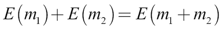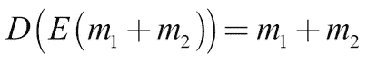

    这里，*E*是加密函数，*m*是某些明文数据，*D*是解密函数。正如你所看到的，添加加密后的数据与先添加数据然后加密是相同的。添加数据、加密然后解密与直接添加数据是一样的。

    这意味着你可以加密数据，并仍然在其上训练模型。同态加密仍处于起步阶段，但通过这种方法，你可以确保在发生数据泄露时，没有敏感的个人信息被泄露。

+   **在本地训练，只上传少量梯度**：避免上传用户数据的一种方法是将模型训练在用户设备上。用户在设备上积累数据。然后，你可以将模型下载到设备上，并在设备上执行一次前向和反向传播。

    为了避免从梯度中推断出用户数据的可能性，你只上传少量随机的梯度。然后，你可以将这些梯度应用到你的主模型中。

    为了进一步增强系统的整体隐私性，你不需要将所有更新后的权重从主模型下载到用户设备，而只需要下载一小部分。通过这种方式，你可以异步训练模型，而无需访问任何数据。如果你的数据库遭到泄露，用户数据不会丢失。然而，我们需要注意的是，只有在用户基数足够大的情况下，这种方法才有效。

## 准备训练数据

在前面的章节中，我们已经看到了标准化和缩放特征的好处，并讨论了如何缩放所有数值特征。特征缩放有四种方式；它们包括**标准化、Min-Max、均值归一化**和**单位长度缩放**。在本节中，我们将逐一解析每种方式：

+   **标准化**确保所有数据的均值为零，标准差为一。它是通过减去均值并除以数据的标准差来计算的：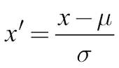

    这可能是最常见的特征缩放方式。如果你怀疑数据中包含异常值，这种方法尤其有用，因为它对异常值比较稳健。另一方面，标准化不能保证你的特征值在零到一之间，而神经网络通常在这个范围内表现最好。

+   **Min-Max**缩放正是做到了这一点。它首先减去最小值，然后除以值的范围，将所有数据缩放到零和一之间。我们可以通过下面的公式看到这一点：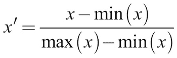

    如果你确信数据中没有异常值，例如在图像处理中，Min-Max 缩放将把数据的值很好地缩放到零和一之间。

+   类似于 Min-Max，**均值归一化**确保你的数据值在-1 和 1 之间，且均值为零。这是通过减去均值并除以数据的范围来完成的，公式如下所示：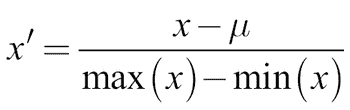

    均值归一化使用得较少，但根据你的应用场景，这可能是一个不错的方法。

+   对于某些应用，最好不要对单独的特征进行缩放，而是对特征向量进行缩放。在这种情况下，你可以通过将向量中的每个元素除以向量的总长度来应用**单位长度缩放**，如下所示：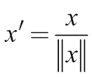

    向量的长度通常意味着向量的 L2 范数 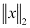，即平方和的平方根。对于某些应用，向量的长度意味着 L1 范数 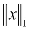，即向量元素的和。

无论您如何缩放，都很重要的一点是仅在测试集上衡量缩放因子、均值和标准差。这些因素只包含关于数据的一部分信息。如果您在整个数据集上衡量它们，那么由于信息优势，算法可能在测试集上的表现会比在生产环境中的表现要好。

同样重要的是，您应该检查您的生产代码是否具有正确的特征缩放。随着时间的推移，您应该重新计算特征分布并调整缩放。

## 理解哪些输入导致了哪些预测

为什么您的模型做出了那个预测？对于复杂的模型来说，这个问题很难回答。对于一个非常复杂的模型，全球解释本身可能就非常复杂。**局部可解释模型无关解释**（**LIME**）是一个受欢迎的模型解释算法，专注于局部解释。LIME 不是试图回答：“这个模型是如何做出预测的？”而是试图回答：“为什么模型在*这*个数据上做出了*这个*预测？”

### 注意

**注意**：LIME 的作者 Ribeiro、Singh 和 Guestrin 针对他们的算法整理了一个很棒的 GitHub 仓库，里面有许多解释和教程，您可以在这里找到：[`github.com/marcotcr/lime`](https://github.com/marcotcr/lime)。

在 Kaggle Kernels 上，LIME 默认已安装。不过，您也可以通过以下命令在本地安装 LIME：

```py
pip install lime

```

LIME 算法适用于任何分类器，这也是它与模型无关的原因。为了进行解释，LIME 会将数据划分为多个部分，例如图像的区域或文本中的语句。然后，它通过删除一些特征来创建一个新的数据集。它将这个新数据集通过黑盒分类器，并获得分类器对不同类别的预测概率。接着，LIME 将数据编码为向量，描述哪些特征是存在的。最后，它训练一个线性模型，通过去除不同的特征来预测黑盒模型的结果。由于线性模型容易解释，LIME 将使用线性模型来确定最重要的特征。

假设您正在使用文本分类器，例如 TF-IDF，来分类像 20 个新闻组数据集中的电子邮件。要从这个分类器获得解释，您可以使用以下代码片段：

```py
from lime.lime_text import LimeTextExplainer               #1
explainer = LimeTextExplainer(class_names=class_names)     #2
exp = explainer.explain_instance(test_example,             #3classifier.predict_proba, #4num_features=6)           #5

exp.show_in_notebook()                                     #6
```

现在，让我们理解一下该代码片段中的内容：

1.  LIME 包含多个类，用于处理不同类型的数据。

1.  要创建一个新的空白解释器，我们需要传入分类器的类名。

1.  我们将提供一个文本示例，您希望为其提供解释。

1.  我们提供了分类器的预测函数。我们需要提供一个返回概率的函数。对于 Keras，这个函数就是`model.predict`；对于 scikit 模型，我们需要使用`predict_proba`方法。

1.  LIME 展示了最大数量的特征。在这种情况下，我们只想展示最重要的六个特征的重要性。

1.  最后，我们可以呈现我们预测结果的可视化，效果如下：

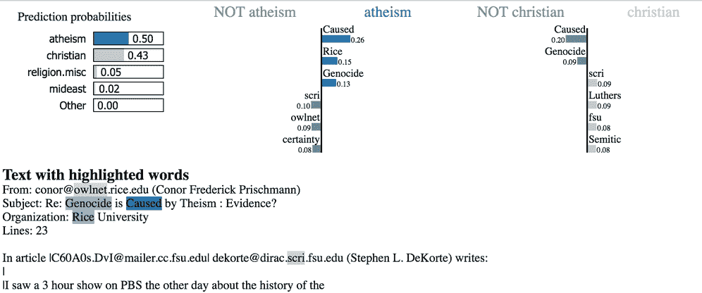

LIME 文本输出

解释展示了文本最常被分类为的不同特征的类别。它显示了对分类贡献最大的词语，以及在两个最常见类别中的分类贡献。下方，你可以看到在文本中被突出显示的贡献于分类的词语。

正如你所看到的，我们的模型捕捉到了发件人电子邮件地址的一部分作为区分特征，以及大学名称“Rice”。它还认为“Caused”是文本与无神论相关的强烈指示。将这些因素结合起来，这些都是我们在调试数据集时想要了解的内容。

LIME 并不能完美解决解释模型的问题。例如，当多个特征的交互作用导致某个特定结果时，它可能会遇到困难。然而，它足够好，能够成为一个有用的数据调试工具。通常，模型会捕捉到一些它们不应该捕捉的特征。为了调试数据集，我们需要去除所有这些统计模型容易过拟合的“提示”特征。

回顾本节内容，你现在已经看到了可以用来调试数据集的一系列工具。然而，即使数据集完美无缺，训练时仍然可能遇到问题。下一节将介绍如何调试你的模型。

# 调试你的模型

复杂的深度学习模型容易出错。由于有数百万个参数，可能会出现很多问题。幸运的是，随着这个领域的发展，已经有了许多有用的工具来提升模型性能。在本节中，我们将介绍一些你可以用来调试和改进模型的最有用工具。

## 使用 Hyperas 进行超参数搜索

手动调节神经网络的超参数可能是一个繁琐的任务。尽管你可能对哪些有效、哪些无效有一定的直觉，但在调节超参数时并没有硬性规则。因此，许多拥有强大计算能力的从业者采用自动超参数搜索。毕竟，超参数构成了一个搜索空间，就像模型的参数一样。不同之处在于，我们无法对它们应用反向传播，也无法对其求导。但我们仍然可以对它们应用所有非梯度优化算法。

有许多不同的超参数优化工具，但我们将重点介绍 Hyperas，因为它易于使用。Hyperas 是`hyperopt`的一个封装，`hyperopt`是一个流行的优化库，专为与 Keras 配合使用而设计。

### 注意

**注意**：你可以在 GitHub 上找到 Hyperas：[`github.com/maxpumperla/hyperas`](https://github.com/maxpumperla/hyperas)。

我们可以使用 `pip` 安装 Hyperas：

```py
pip install hyperas

```

根据你的环境设置，你可能需要对安装过程做一些调整。如果是这种情况，前面提到的 Hyperas GitHub 页面提供了更多信息。

Hyperas 提供了两种优化方法：**随机搜索** 和 **Parzen 估计树**。在我们认为合理的超参数范围内，随机搜索会随机抽样并用随机超参数训练一个模型。然后它会选择性能最好的模型作为最终解。

**随机搜索** 简单且稳健，并且可以轻松扩展。它基本上不对超参数、它们之间的关系和损失面做出任何假设。另一方面，它相对较慢。

**Parzen 估计树**（**TPE**）算法建模了 *P(x|y)* 的关系，其中 *x* 代表超参数，*y* 代表相关的性能。这与高斯过程的建模方式正好相反，高斯过程建模的是 *P(y|x)*，并且广受许多研究人员的青睐。

实践证明，TPE 的表现更好。有关详细信息，请参见 2011 年的论文《*超参数优化算法*》，可在以下链接查阅：[`papers.nips.cc/paper/4443-algorithms-for-hyper-parameter-optimization`](https://papers.nips.cc/paper/4443-algorithms-for-hyper-parameter-optimization) —— 该论文由 James S. Bergstra 等人撰写。TPE 比随机搜索更快，但可能会陷入局部最小值，并且在某些困难的损失面上表现不佳。根据经验，通常建议从 TPE 开始，如果 TPE 遇到困难，再切换到随机搜索。

### 注意

**注意**：本示例的代码可以在以下链接找到：[`www.kaggle.com/jannesklaas/Hyperas`](https://www.kaggle.com/jannesklaas/Hyperas)。

以下示例将展示如何使用 Hyperas 和 Hyperopt 来构建一个 MNIST 数据集分类器：

```py
from hyperopt import Trials, STATUS_OK, tpe        #1
from hyperas import optim                          #2
from hyperas.distributions import choice, uniform 
```

虽然代码很简短，但我们还是来解释一下它的含义：

1.  由于 Hyperas 构建于 Hyperopt 之上，我们需要直接从 `hyperopt` 导入一些组件。`Trials` 类执行实际的实验，`STATUS_OK` 帮助表示测试顺利，`tpe` 是 TPE 算法的实现。

1.  Hyperas 提供了一些方便的函数，使得与 Hyperopt 一起工作更加容易。`optim` 函数找到最佳的超参数，可以像 Keras 的 `fit` 函数一样使用。`choice` 和 `uniform` 分别可以用于选择离散和连续的超参数。

为了在我们之前探索的基础上进行扩展，接下来我们将添加以下内容，代码编写完后我们将详细解释：

```py
def data():                                      #1
    import numpy as np                           #2
    from keras.utils import np_utils

    from keras.models import Sequential 
    from keras.layers import Dense, Activation, Dropout
    from keras.optimizers import RMSprop

    path = '../input/mnist.npz'                  #3
    with np.load(path) as f:
        X_train, y_train = f['x_train'], f['y_train']
        X_test, y_test = f['x_test'], f['y_test']

    X_train = X_train.reshape(60000, 784)        #4
    X_test = X_test.reshape(10000, 784)
    X_train = X_train.astype('float32')
    X_test = X_test.astype('float32')
    X_train /= 255
    X_test /= 255
    nb_classes = 10
    y_train = np_utils.to_categorical(y_train, nb_classes)
    y_test = np_utils.to_categorical(y_test, nb_classes)

    return X_train, y_train, X_test, y_test      #5
```

让我们花点时间看看我们刚刚编写的代码：

1.  Hyperas 期望一个加载数据的函数；我们不能直接传递一个内存中的数据集。

1.  为了扩展搜索，Hyperas 创建了一个新的运行时，在其中进行模型创建和评估。这也意味着我们在笔记本中做的导入并不总是会传递到运行时中。为了确保所有模块都可用，我们需要在`data`函数中进行所有导入。这对于只在模型中使用的模块也同样适用。

1.  我们现在加载数据。由于 Kaggle 内核无法访问互联网，我们需要从磁盘加载 MNIST 数据。如果你有互联网，但没有本地版本的文件，你可以使用以下代码获取数据：

    ```py
    from keras.datasets import mnist
    (Y_train, y_train), (X_test, y_test) = mnist.load_data() 
    ```

    我仍然会保留没有互联网版本，因为它是默认设置。

1.  `data`函数还需要对数据进行预处理。我们做了与之前处理 MNIST 时相同的标准重塑和缩放。

1.  最后，我们返回数据。这些数据将传递给构建和评估模型的函数：

    ```py
    def model(X_train, y_train, X_test, y_test):                   #1
        model = Sequential()                                       #2
        model.add(Dense(512, input_shape=(784,)))

        model.add(Activation('relu'))

        model.add(Dropout({{uniform(0, 0.5)}}))                    #3

        model.add(Dense({{choice([256, 512, 1024])}}))             #4

        model.add(Activation({{choice(['relu','tanh'])}}))         #5

        model.add(Dropout({{uniform(0, 0.5)}}))

        model.add(Dense(10))
        model.add(Activation('softmax'))

        rms = RMSprop()
        model.compile(loss='categorical_crossentropy', optimizer=rms, metrics=['accuracy'])

        model.fit(X_train, y_train,                                #6batch_size={{choice([64, 128])}},epochs=1,verbose=2,validation_data=(X_test, y_test))
        score, acc = model.evaluate(X_test, y_test, verbose=0)     #7
        print('Test accuracy:', acc)
        return {'loss': -acc, 'status': STATUS_OK, 'model': model} #8
    ```

如你所见，前面的代码片段由八个定义性部分组成。接下来我们将探索这些部分，以便能够完全理解我们刚刚写出的代码：

1.  `model`函数既定义了模型，也对其进行了评估。给定来自`data`函数的训练数据集，它会返回一组质量指标。

1.  在使用 Hyperas 进行微调时，我们可以像通常一样定义一个 Keras 模型。在这里，我们只需用 Hyperas 函数替换我们希望调整的超参数。

1.  例如，为了调整 dropout，我们将`Dropout`超参数替换为`{{uniform(0, 0.5)}}`。Hyperas 将自动从`0`到`0.5`之间的均匀分布中采样并评估 dropout 率。

1.  要从离散分布中采样，例如隐藏层的大小，我们用`{{choice([256, 512, 1024])}}`替换超参数。Hyperas 现在将从 256、512 和 1024 三个隐藏层大小中进行选择。

1.  我们也可以做同样的事情来选择激活函数。

1.  要评估模型，我们需要编译并拟合它。在此过程中，我们还可以选择不同的批次大小。在这种情况下，我们只训练一个 epoch，以保持本示例所需的时间较短。你也可以使用 Hyperas 运行整个训练过程。

1.  为了了解模型的表现如何，我们在测试数据上对其进行评估。

1.  最后，我们返回模型的得分、模型本身以及一个指示一切正常的标志。Hyperas 尝试最小化损失函数。为了最大化准确性，我们将损失设置为负准确性。你也可以根据你的问题传递模型损失，这取决于最佳的优化方法是什么。

    最后，我们运行优化：

    ```py
    best_run, best_model = optim.minimize(model=model,
    									data=data,
    									algo=tpe.suggest,
    									max_evals=5,
    									trials=Trials(),
    				notebook_name='__notebook_source__')

    ```

我们传递`model`方法和`data`方法，并指定要运行多少次试验，以及哪个类应负责管理这些试验。Hyperopt 还提供了一个分布式试验类，工作节点通过 MongoDB 进行通信。

在使用 Jupyter Notebook 时，我们需要提供我们正在使用的笔记本名称。Kaggle Notebooks 的文件名都是`__notebook_source__`，无论你给它们取了什么名字。

运行后，Hyperas 会返回表现最佳的模型以及最佳模型的超参数。如果你打印出`best_run`，你应该会看到类似这样的输出：

```py
{'Activation': 1,
 'Dense': 1,
 'Dropout': 0.3462695171578595,
 'Dropout_1': 0.10640021656377913,
 'batch_size': 0}

```

对于`choice`选择，Hyperas 显示的是索引。在这个例子中，选择了激活函数`tanh`。

在这种情况下，我们只进行了几次超参数搜索。通常情况下，你会运行几百次或几千次实验。为了做到这一点，我们可以使用自动化超参数搜索，这是提升模型性能的一个很好的工具，前提是你有足够的计算能力。

然而，它并不能使一个完全不起作用的模型开始工作。选择这种方法时，你需要确保在投资超参数搜索之前，首先有一个“勉强可用”的方法。

## 有效的学习率搜索

其中一个最重要的超参数是学习率。找到一个合适的学习率非常困难。学习率太小，模型可能训练得太慢，以至于你认为它根本没有训练，但如果学习率过大，模型会超调，无法有效地减少损失。

当涉及到寻找学习率时，标准的超参数搜索技术并不是最好的选择。对于学习率，更好的方法是进行线性搜索，并可视化不同学习率下的损失情况，因为这将帮助你理解损失函数的行为。

在进行线性搜索时，最好是指数方式增加学习率。你可能更关心较小学习率的区域，而不是非常大的学习率。

在下面的示例中，我们进行 20 次评估，并在每次评估中将学习率加倍。我们可以通过执行以下代码来运行此过程：

```py
init_lr = 1e-6                                            #1
losses = [] 
lrs = []
for i in range(20):                                       #2
    model = Sequential()
    model.add(Dense(512, input_shape=(784,)))
    model.add(Activation('relu')) 
    model.add(Dropout(0.2))
    model.add(Dense(512))
    model.add(Activation('relu'))
    model.add(Dropout(0.2))
    model.add(Dense(10))
    model.add(Activation('softmax'))

    opt = Adam(lr=init_lr*2**i)                           #3
    model.compile(loss='categorical_crossentropy',optimizer=opt,metrics=['acc'])

    hist = model.fit(X_train, Y_train, batch_size = 128, epochs=1)                                                 #4

    loss = hist.history['loss'][0]                        #5
    losses.append(loss)
    lrs.append(init_lr*2**i)
```

现在让我们更详细地看看前面的特色代码：

1.  我们指定一个较低但仍然合理的初始学习率，从这个学习率开始我们的搜索。

1.  然后，我们使用不同的学习率进行 20 次训练。每次都需要从头开始设置模型。

1.  我们计算出新的学习率。在我们的例子中，我们在每次评估步骤中将学习率加倍。如果你希望得到更细粒度的结果，也可以使用较小的增量。

1.  然后，我们用新的学习率来拟合模型。

1.  最后，我们跟踪损失。

如果你的数据集非常大，你可以在数据的一个子集上执行此学习率搜索。这里的有趣部分来自于对学习率的可视化：

```py
fig, ax = plt.subplots(figsize = (10,7))
plt.plot(lrs,losses)
ax.set_xscale('log')
```

当你运行这段代码时，它将输出以下图表：

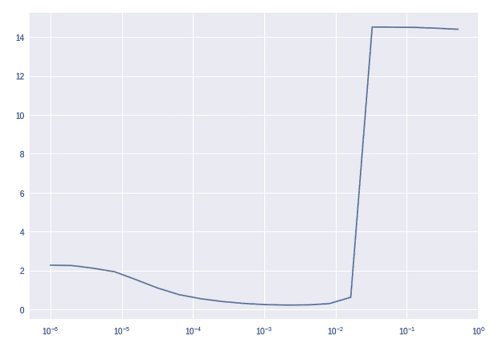

学习率查找器

如您所见，损失在 1e-3 和 1e-2 之间是最优的。我们还可以看到，在这一区域内，损失曲面相对平坦。这给了我们一个提示，应该使用接近 1e-3 的学习率。为了避免超调，我们选择一个略低于通过线搜索找到的最优学习率。

## 学习率调度

为什么只使用一个学习率呢？一开始，您的模型可能离最优解很远，因此您希望尽可能快速地移动。然而，随着损失接近最小值，您希望移动得更慢，以避免超调。一种流行的方法是退火学习率，使其表现为余弦函数。为此，我们需要找到一个学习率调度函数，该函数在给定时间步 *t* 的情况下，返回一个学习率。学习率成为 *t* 的函数：

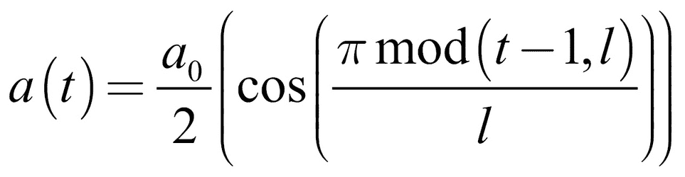

这里 *l* 是周期长度，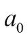 是初始学习率。我们修改此函数以确保 *t* 不会超过周期长度：

```py
def cosine_anneal_schedule(t):
    lr_init = 1e-2                               #1
    anneal_len = 5
    if t >= anneal_len: t = anneal_len -1        #2
    cos_inner = np.pi * (t % (anneal_len))       #3
    cos_inner /= anneal_len
    cos_out = np.cos(cos_inner) + 1
    return float(lr_init / 2 * cos_out)
```

前面的代码包含了三个关键特点：

1.  在我们的函数中，我们需要设置一个起始点，从这个点开始退火。这可以是一个相对较大的学习率。我们还需要指定退火的 epoch 数。

1.  余弦函数并不是单调递减的；它在一个周期后会回升。我们稍后会利用这个特性；现在，我们只需要确保学习率不会回升。

1.  最后，我们使用前面的公式计算新的学习率。这就是新的学习率。

为了更好地理解学习率调度函数的作用，我们可以绘制它在 10 个 epoch 中设定的学习率：

```py
srs = [cosine_anneal_schedule(t) for t in range(10)]
plt.plot(srs)
```

代码的输出将在下图中显示：

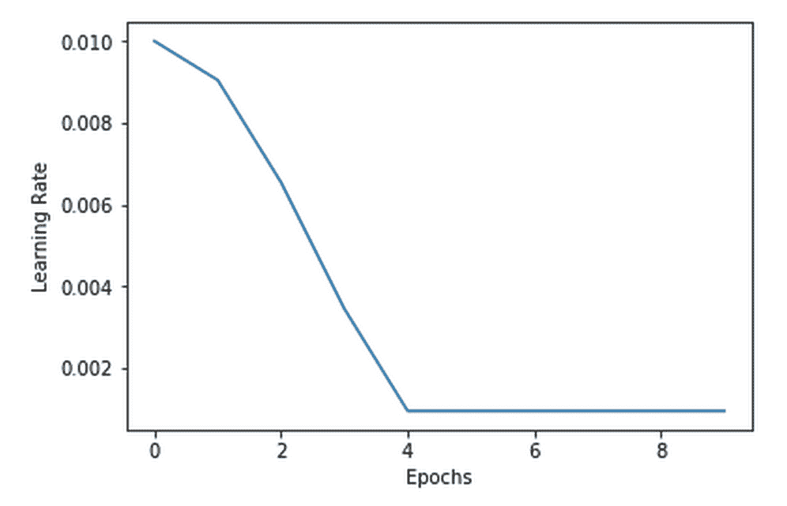

余弦退火

我们可以使用这个函数通过 Keras 的 `LearningRateScheduler` 回调来调度学习率：

```py
from keras.callbacks import LearningRateScheduler
cb = LearningRateScheduler(cosine_anneal_schedule)
```

现在我们有了一个回调，Keras 会在每个 epoch 结束时调用它以获取新的学习率。我们将此回调传递给 `fit` 方法，瞧，我们的模型开始以递减的学习率进行训练：

```py
model.fit(x_train,y_train,batch_size=128,epochs=5,callbacks=[cb])
```

一种学习率退火的版本是加入重启。在每个退火周期结束时，我们将学习率重新提高。这是一种用于避免过拟合的方法。使用较小的学习率时，模型可能会找到一个非常狭窄的最小值。如果我们想要在稍微不同的测试数据上使用模型，那么损失曲面可能会发生一些变化，模型可能会偏离这个狭窄的最小值。如果我们将学习率重新提高，模型将摆脱狭窄的最小值。然而，广阔的最小值足够稳定，模型可以停留在这些地方：

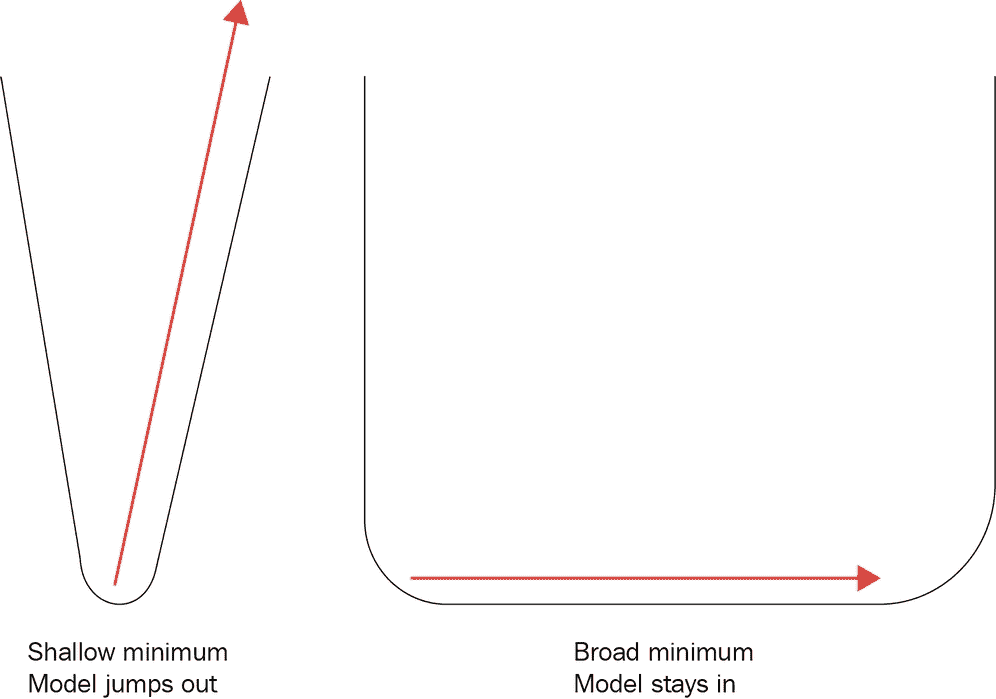

浅的广阔最小值

由于余弦函数本身会向上回升，我们只需要移除这条线，防止它回升：

```py
def cosine_anneal_schedule(t):
    lr_init = 1e-2 
    anneal_len = 10 
    cos_inner = np.pi * (t % (anneal_len))  
    cos_inner /= anneal_len
    cos_out = np.cos(cos_inner) + 1
    return float(lr_init / 2 * cos_out)
```

新的学习率调度现在看起来像这样：

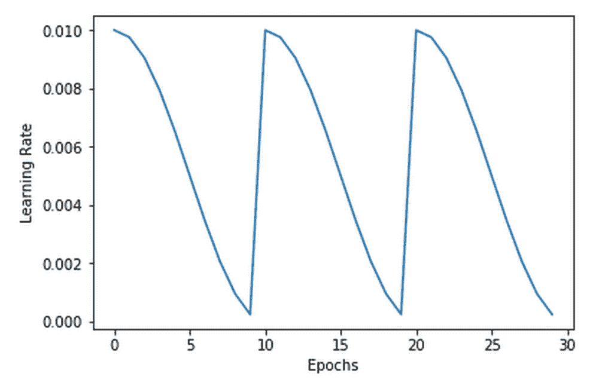

学习率重启

## 使用 TensorBoard 监控训练过程

调试模型时，一个重要的部分就是在没有投入大量训练时间之前，知道何时出现问题。TensorBoard 是一个 TensorFlow 扩展，可以让你轻松地在浏览器中监控模型。

为了提供一个可以观看模型进展的界面，TensorBoard 还提供了一些调试时非常有用的选项。例如，你可以观察训练过程中模型权重和梯度的分布。

### 注意

**注意**：TensorBoard 不支持在 Kaggle 上运行。如果想尝试 TensorBoard，请在你的电脑上安装 Keras 和 TensorFlow。

要在 Keras 中使用 TensorBoard，我们需要设置一个新的回调函数。TensorBoard 有很多选项，让我们一步步了解它们：

```py
from keras.callbacks import TensorBoard
tb = TensorBoard(log_dir='./logs/test2',           #1
                 histogram_freq=1,                 #2
                 batch_size=32,                    #3
                 write_graph=True,                 #4
                 write_grads=True, 
                 write_images=True, 
                 embeddings_freq=0,                #5
                 embeddings_layer_names=None, 
                 embeddings_metadata=None)
```

我们需要考虑前面代码中的五个关键部分：

1.  首先，我们需要指定 Keras 应该将数据保存到哪里，TensorBoard 会在后续可视化这些数据。通常情况下，最好将不同运行的所有日志保存在一个 `logs` 文件夹中，并为每次运行创建一个子文件夹，比如这里的 `test2`。这样，你可以轻松地在 TensorBoard 中比较不同的运行结果，同时保持各个运行结果的独立性。

1.  默认情况下，TensorBoard 只会显示模型的损失和准确度。在这种情况下，我们关心的是显示权重和分布的直方图。我们会在每个周期保存直方图的数据。

1.  为了生成数据，TensorBoard 会将批次通过模型运行。我们需要为此过程指定一个批次大小。

1.  我们需要告诉 TensorBoard 要保存什么内容。TensorBoard 可以可视化模型的计算图、梯度以及显示权重的图像。然而，我们保存的内容越多，训练速度就会越慢。

1.  TensorBoard 还可以很好地可视化训练好的嵌入层。我们的模型没有嵌入层，所以我们不需要保存它们。

一旦回调函数设置完成，我们可以将其传递给训练过程。我们将再次训练 MNIST 模型。我们将输入数据乘以 255，这使得训练变得更加困难。为了实现这一点，我们需要运行以下代码：

```py
hist = model.fit(x_train*255,y_train,batch_size=128,epochs=5,callbacks=[tb],validation_data=(x_test*255,y_test))
```

要启动 TensorBoard，请打开终端并输入以下命令：

```py
tensorboard --logdir=/full_path_to_your_logs

```

这里的 `full_path_to_your_logs` 是你保存日志的路径，例如，在我们的案例中是 `logs`。TensorBoard 默认在 `6006` 端口运行，因此你可以在浏览器中访问 `http://localhost:6006` 来查看 TensorBoard。

页面加载完成后，导航到 **HISTOGRAMS** 部分；该部分应该类似于下面这样：

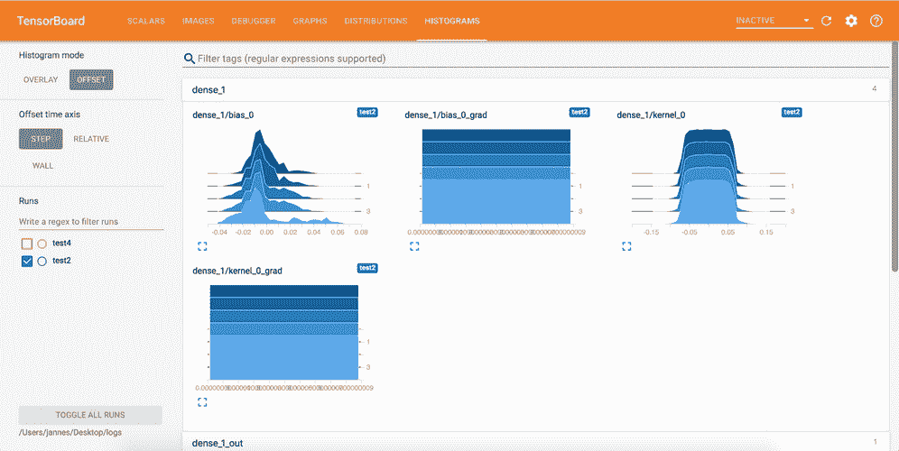

TensorBoard 直方图

你可以查看第一层的梯度和权重分布。如你所见，梯度均匀分布，并且非常接近零。权重在不同周期之间几乎没有变化。我们正在处理**梯度消失问题**；我们将在后续详细讨论这个问题。

通过实时了解问题的发生，我们可以更快地做出反应。如果你真的想深入了解你的模型，TensorBoard 还提供了一个可视化调试器。在这个调试器中，你可以逐步执行你的 TensorFlow 模型，并检查其中的每一个值。如果你正在处理复杂的模型，比如生成对抗网络，并试图理解为何某些复杂情况出现问题，这个功能尤为有用。

### 注意

**注意**：TensorFlow 调试器在 Jupyter Notebooks 中训练的模型上表现不佳。请将你的模型训练代码保存为 Python `.py` 脚本并运行该脚本。

要使用 TensorFlow 调试器，你必须将模型的运行时设置为特殊的调试器运行时。在指定调试器运行时时，你还需要指定调试器运行的端口，在本例中为端口`2018`：

```py
import tensorflow as tf
from tensorflow.python import debug as tf_debug
import keras

keras.backend.set_session(tf_debug.TensorBoardDebugWrapperSession(tf.Session(), "localhost:2018"))
```

一旦 Keras 开始与调试器运行时协同工作，你就可以调试你的模型。为了使调试器正常工作，你需要将 Keras 模型命名为 `model`。不过，你不需要通过 TensorBoard 回调来训练该模型。

现在，启动 TensorBoard 并通过指定调试器端口来激活调试器，如下所示：

```py
tensorboard --logdir=/full_path_to_your_logs --debugger_port 2018

```

现在，你可以像往常一样在浏览器中打开 TensorBoard，端口号为`6006`。TensorBoard 现在新增了一个名为**DEBUGGER**的部分：

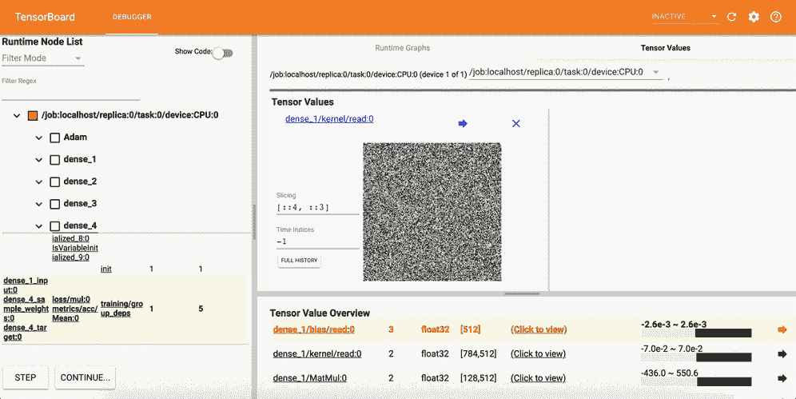

TensorBoard 调试器

点击**STEP**，你将执行训练过程中的下一步。使用**CONTINUE…**，你可以训练模型一个或多个周期。通过在左侧导航树中浏览，你可以查看模型的各个组件。你可以可视化模型的单个元素，以观察不同操作如何影响它们。有效使用调试器需要一些练习，但如果你正在处理复杂的模型，它是一个很好的工具。

## 梯度爆炸和梯度消失

梯度消失问题描述了在深度神经网络中，梯度有时会变得非常小，导致训练速度非常慢。梯度爆炸是相反的问题；它们是变得极大，以至于网络无法收敛的梯度。

在这两者中，梯度消失问题是更为持久的问题。梯度消失是由于在深层网络中，早期层的梯度依赖于更靠近输出层的梯度。如果输出梯度很小，那么后续梯度就会更小。因此，网络越深，梯度消失问题就越严重。

小梯度的主要原因包括 sigmoid 和`tanh`激活函数。如果你观察以下 sigmoid 函数，你会发现它在较大值时非常平坦：

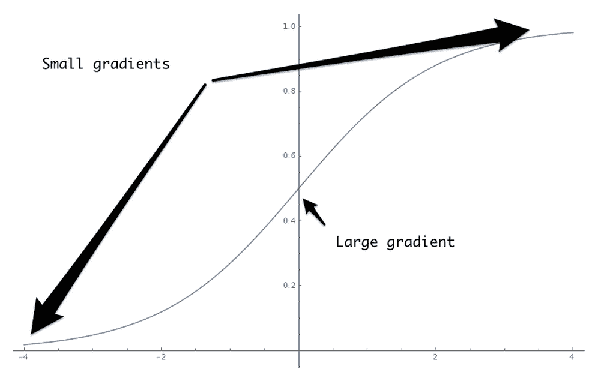

Sigmoid 梯度消失

Sigmoid 函数的小梯度是 ReLU 激活函数在训练深度神经网络时变得流行的原因。对于所有正输入值，ReLU 的梯度为 1。然而，对于所有负输入值，它的梯度为 0。

梯度消失的另一个原因是损失函数中的鞍点。虽然没有达到最小值，但损失函数在某些区域非常平坦，导致梯度非常小。

为了对抗梯度消失问题，你应该使用 ReLU 激活函数。如果你发现模型训练得很慢，可以考虑提高学习率，以便更快地脱离鞍点。最后，如果模型遭遇小梯度问题，你也可以让它训练得更长时间。

梯度爆炸问题通常由较大的权重值引起。当反向传播将后续层的梯度与该层的权重相乘时，较大的权重会放大梯度。为了应对梯度爆炸问题，你可以使用权重正则化来鼓励较小的权重。通过使用一种叫做**梯度裁剪**的方法，你可以确保梯度不会变得大于某个特定的值。在 Keras 中，你可以裁剪梯度的范数和绝对值：

```py
from keras.optimizers import SGD

clip_val_sgd = SGD(lr=0.01, clipvalue=0.5)
clip_norm_sgd = SGD(lr=0.01, clipnorm=1.)
```

卷积层和**长短期记忆（LSTM）网络**对梯度消失和梯度爆炸的敏感度较低。ReLU 和批量归一化通常能够稳定网络。这两个问题可能由未正则化的输入引起，所以你也应该检查你的数据。批量归一化也能抵消梯度爆炸。

如果梯度爆炸是个问题，你可以通过添加批量归一化层到模型中来解决，方法如下：

```py
from keras.layers import BatchNormalization
model.add(BatchNormalization())
```

批量归一化还减少了梯度消失的风险，并且最近使得构建更深层的网络成为可能。

你现在已经了解了多种可以用来调试模型的工具。作为最后一步，我们将学习一些在生产环境中运行模型并加速机器学习过程的方法。

# 部署

将模型部署到生产环境通常被视为与模型创建分开的一步。在许多公司中，数据科学家在孤立的开发环境中创建模型，使用的是收集来的训练、验证和测试数据。

一旦模型在测试集上表现良好，它就会交给部署工程师，而这些工程师对模型是如何以及为何按这种方式工作的知之甚少。这是一个错误。毕竟，你开发模型是为了使用它们，而不是为了开发它们本身的乐趣。

模型随着时间的推移往往表现得越来越差，原因有很多。世界在变化，因此你训练时使用的数据可能不再代表现实世界。你的模型可能依赖于其他系统的输出，而这些系统本身也可能发生变化。可能会出现一些意想不到的副作用和模型的弱点，只有在长期使用时才能显现出来。你的模型可能会影响它试图模拟的世界。**模型衰退**描述了模型在经历一段生命周期后，性能会逐渐下降的现象。

数据科学家应该全盘考虑他们模型的生命周期。他们需要了解模型在生产环境中长期运行的表现。

事实上，生产环境是优化模型的理想场所。你的数据集仅仅是现实世界的近似。实时数据提供了一个更新且更准确的世界视图。通过使用在线学习或主动学习方法，你可以大幅减少对训练数据的依赖。

本节介绍了一些最佳实践，帮助你将模型应用到实际环境中。具体的模型服务方式可能会根据应用场景有所不同。有关选择部署方法的更多细节，请参见接下来的*性能提示*部分。

## 快速上线

开发模型的过程依赖于真实世界的数据以及对模型性能如何影响业务结果的洞察。你越早收集数据并观察模型行为如何影响结果，就越好。不要犹豫，尽早使用简单的启发式方法发布产品。

以欺诈检测为例。你不仅需要收集交易数据以及发生欺诈的信息，还需要了解欺诈者绕过你检测方法的速度有多快。你还想知道那些被错误标记为欺诈的客户会做出什么反应。所有这些信息都会影响你的模型设计和模型评估指标。如果你能提出一个简单的启发式方法，先部署这个启发式方法，再着手处理机器学习模型，那会是一个不错的选择。

在开发机器学习模型时，先尝试简单的模型。令人惊讶的是，许多任务都可以用简单的线性模型来建模。这样不仅能更快地获得结果，还能迅速识别出你的模型可能会过拟合的特征。在处理复杂模型之前先调试你的数据集，可以避免很多麻烦。

快速推出简单方法的另一个优势是，你可以提前准备好基础设施。你的基础设施团队很可能由不同于建模团队的人组成。如果基础设施团队不需要等建模团队，而是能立即开始优化基础设施，那么你就能获得时间上的优势。

## 理解和监控指标

为了确保优化指标（如均方误差或交叉熵损失）确实能带来更好的结果，你需要注意你的模型指标与更高阶指标之间的关系，这一点可以通过下图可视化。假设你有一个面向消费者的应用，在该应用中，你向零售投资者推荐不同的投资产品。

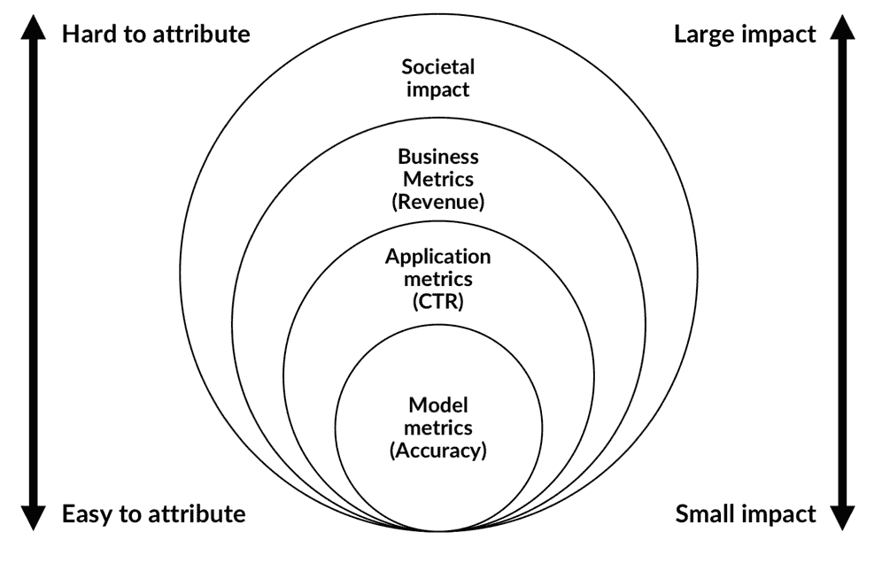

更高阶效果

你可能会预测用户是否对某个产品感兴趣，这可以通过用户阅读产品描述来衡量。然而，在你的应用中，你要优化的指标不是模型的准确性，而是用户进入描述页面的点击率。在更高的层面上，你的业务并不是为了最大化点击率，而是为了最大化收入。如果用户只点击低收入的产品，那么你的点击率并不能为你带来帮助。

最后，你的业务收入可能会在牺牲社会福祉的情况下得到优化。在这种情况下，监管机构会介入。更高阶的效果会受到模型的影响。效果的阶数越高，越难归因于单一模型。更高阶的效果有较大影响，因此，从本质上讲，更高阶的效果充当了低阶效果的元指标。为了评估你的应用表现如何，你需要将其指标（例如点击率）与更高阶效果相关的指标（例如收入）对齐。同样，你的模型指标也需要与应用指标对齐。

这种对齐通常是一个自发的特性。产品经理为了最大化自己的指标，会选择最大化其指标的模型，而不管模型优化的是什么指标。那些带来大量收入的产品经理会得到晋升。而那些对社会有益的企业则会获得补贴和有利政策。通过使这种对齐明确化，你可以设计出更好的监控过程。例如，如果你有两个模型，可以通过 A/B 测试来查看哪个模型能够提升应用指标。

通常，你会发现，为了与更高阶指标对齐，你需要结合多个指标，比如预测的准确性和速度。在这种情况下，你应当设计一个公式，将这些指标合并成一个单一的数值。单一数值可以让你毫不犹豫地选择两个模型之间的优劣，并帮助你的工程师打造更好的模型。

比如，你可以设置最大延迟为 200 毫秒，指标就是“当延迟小于 200 毫秒时的准确率，否则为零。”如果你不想设定一个最大延迟值，你可以选择“准确率除以延迟毫秒数。”这个公式的具体设计取决于你的应用。当你观察到模型如何影响其更高阶指标时，你可以调整你的模型指标。这个指标应当简洁且易于量化。

接下来，为了定期测试模型对高阶指标的影响，你应该定期测试模型自身的指标，比如准确率。为此，你需要不断地获取与数据一起的真实标签。在某些情况下，比如欺诈检测，真实数据比较容易收集，尽管可能会有些延迟。在这种情况下，客户可能需要几周才能发现自己被多收费。

在其他情况下，你可能没有真实标签。通常，你可以为没有真实标签的数据进行手动标注。通过良好的用户界面设计，检查模型预测的过程可以非常迅速。测试者只需要决定模型的预测是否正确，这可以通过网页或移动应用中的按钮操作来完成。如果你有一个良好的审查系统，参与模型开发的数据科学家应该定期检查模型的输出。这样，失败模式（比如模型在暗图像上表现不佳）就能迅速被发现，进而改进模型。

## 了解你的数据来源

更多时候，你的数据是由其他系统收集的，而你作为模型开发者对此并没有控制权。你的数据可能是由数据供应商收集的，或者由公司内的其他部门收集的，甚至可能是为了与模型无关的目的而收集的。数据的收集者可能甚至不知道你正在使用这些数据来构建模型。

比如说，如果数据的收集方式发生变化，你的数据分布可能也会随之变化。这可能会破坏你的模型。同样，现实世界的变化也会导致数据分布发生变化。为了避免数据的变化破坏你的模型，你首先需要了解你正在使用的数据，并为每个特征指定负责人。特征负责人的工作是调查数据的来源，并在数据发生变化时通知团队。特征负责人还应记录数据背后的假设。在最佳情况下，你应该对所有新流入的数据进行假设测试。如果数据未通过测试，就要调查并最终修改模型。

同样，你的模型输出可能会被用作其他模型的输入。通过清楚地标明自己是模型的所有者，帮助数据的使用者联系到你。

在部署模型之前，提醒用户注意模型的变化。将新模型的预测与旧模型的预测进行比较。将模型视为软件，尝试识别那些会显著改变模型行为的“破坏性变化”。通常，你可能不知道是谁在访问模型的预测结果。尽量通过明确的沟通和必要时设置访问控制来避免这种情况。

就像软件有依赖关系一样，机器学习模型也有数据依赖关系，这些依赖关系是模型能够正常工作的前提。数据依赖关系不像软件依赖关系那样被充分理解。通过研究模型的依赖关系，可以减少数据发生变化时模型崩溃的风险。

# 性能优化建议

在许多金融应用中，速度至关重要。机器学习，特别是深度学习，常常被认为是比较慢的。然而，最近在硬件和软件方面有许多进展，使得机器学习应用能够更快。

## 使用正确的硬件来解决问题

深度学习的许多进展得益于**图形处理单元**（**GPU**）的使用。GPU 能够以牺牲操作频率为代价进行高度并行计算。最近，多个制造商开始研发专用的深度学习硬件。大多数情况下，GPU 是深度学习模型或其他可以并行化的算法（如 XGboost 梯度提升树）的良好选择。然而，并不是所有应用都能同样受益。

在**自然语言处理（NLP）**中，例如，批次大小通常需要较小，因此并行化操作的效果不如预期，因为一次处理的样本数量不多。此外，某些词语出现的频率远高于其他词语，这使得缓存频繁出现的词语大大提升了效率。因此，许多 NLP 任务在 CPU 上运行得比 GPU 更快。然而，如果你能够处理大批量数据，那么 GPU 甚至是专用硬件更为理想。

## 利用 TF 估算器进行分布式训练

Keras 不仅是一个可以使用 TensorFlow 的独立库，还是 TensorFlow 的集成部分。TensorFlow 具有多个高级 API，可以用于创建和训练模型。

从 1.8 版本开始，估算器 API 的功能可以在多台机器上分配训练，而 Keras API 尚未支持这些功能。估算器还具有其他一些加速技巧，因此通常比 Keras 模型更快。

### 注意

你可以在这里找到如何为分布式 TensorFlow 设置集群的信息：[`www.tensorflow.org/deploy/distributed`](https://www.tensorflow.org/deploy/distributed)。

通过更改`import`语句，你可以轻松地将 Keras 作为 TensorFlow 的一部分使用，而无需更改主要代码：

```py
import tensorflow as tf
from tensorflow.python import keras

from tensorflow.python.keras.models import Sequential
from tensorflow.python.keras.layers import Dense,Activation
```

在本节中，我们将创建一个模型来解决 MNIST 问题，并使用估算器 API 进行训练。首先，我们像往常一样加载并准备数据集。有关更高效的数据集加载，请参见下一节：

```py
(x_train, y_train), (x_test, y_test) = keras.datasets.mnist.load_data()
x_train.shape = (60000, 28 * 28)
x_train = x_train / 255
y_train = keras.utils.to_categorical(y_train)
```

我们可以像往常一样创建 Keras 模型：

```py
model = Sequential()
model.add(Dense(786, input_dim = 28*28))
model.add(Activation('relu'))
model.add(Dense(256))
model.add(Activation('relu'))
model.add(Dense(160))
model.add(Activation('relu'))
model.add(Dense(10))
model.add(Activation('softmax'))

model.compile(optimizer=keras.optimizers.SGD(lr=0.0001, momentum=0.9),loss='categorical_crossentropy',metric='accuracy')
```

TensorFlow 版的 Keras 提供了一行代码将其转换为 TF 估算器：

```py
estimator = keras.estimator.model_to_estimator(keras_model=model)
```

要设置训练，我们需要知道分配给模型输入的名称。我们可以使用以下代码快速检查这一点：

```py
model.input_names
['dense_1_input']
```

估计器是通过输入函数进行训练的。输入函数允许我们指定一个完整的管道，这个管道会高效执行。在这种情况下，我们只需要一个生成训练集的输入函数：

```py
train_input_fn = tf.estimator.inputs.numpy_input_fn(x={'dense_1_input': x_train},y=y_train,num_epochs=1,shuffle=False)
```

最后，我们在输入数据上训练估计器。就是这样；你现在可以利用分布式 TensorFlow 与估计器：

```py
estimator.train(input_fn=train_input_fn, steps=2000)
```

## 使用优化的层，如 CuDNNLSTM

你经常会发现有人创建了一个特殊的层，优化了在特定硬件上执行某些任务。例如，Keras 的 `CuDNNLSTM` 层仅在支持 CUDA 的 GPU 上运行，CUDA 是一种专为 GPU 设计的编程语言。

当你将模型固定到专用硬件上时，你通常可以显著提升性能。如果你有资源，甚至可以考虑用 CUDA 编写自己的专用层。如果以后需要更换硬件，通常可以导出权重并将其导入到不同的层中。

## 优化你的管道

在有了正确的硬件和优化的软件的情况下，你的模型通常不再是瓶颈。你应该通过在终端中输入以下命令来检查 GPU 的使用情况：

```py
nvidia-smi -l 2

```

如果你的 GPU 使用率没有达到大约 80% 到 100%，通过优化管道，你可以获得显著的性能提升。你可以采取以下几步来优化你的管道：

+   **创建一个与模型并行运行的管道**：否则，在数据加载时，GPU 将处于空闲状态。Keras 默认会这样做。如果你有一个生成器并希望有一个更大的数据队列以便准备好进行预处理，可以更改 `fit_generator` 方法的 `max_queue_size` 参数。如果你将 `fit_generator` 方法的 `workers` 参数设置为零，生成器将在主线程上运行，这会使得速度变慢。

+   **并行预处理数据**：即使你有一个独立于模型训练工作的生成器，它可能也无法跟上模型的速度。因此，最好同时运行多个生成器。在 Keras 中，你可以通过将 `use_multiprocessing` 设置为 `true` 并将 `workers` 的数量设置为大于 1 的值，最好是可用 CPU 的数量。我们来看一个示例：

    ```py
    model.fit_generator(generator, steps_per_epoch = 40, workers=4, use_multiprocessing=False)
    ```

    你需要确保你的生成器是线程安全的。你可以使用以下代码片段使任何生成器变得线程安全：

    ```py
    import threading

    class thread_safe_iter:                   #1
        def __init__(self, it):
            self.it = it
            self.lock = threading.Lock()

        def __iter__(self):
            return self

        def next(self):                       #2
            with self.lock:
                return self.it.next()

    def thread_safe_generator(f):             #3
        def g(*a, **kw):
            return thread_safe_iter(f(*a, **kw))
        return g

    @thread_safe_generator
    def gen():
    ```

    让我们来看一下前面代码中的三个关键组件：

    1.  `thread_safe_iter` 类通过在迭代器必须生成下一个值时锁定线程，使得任何迭代器都变得线程安全。

    1.  当在迭代器上调用 `next()` 时，迭代器的线程会被锁定。锁定意味着在线程被锁定期间，其他函数（比如另一个变量）无法访问线程中的变量。一旦线程被锁定，它会生成下一个元素。

    1.  `thread_safe_generator` 是一个 Python 装饰器，它将任何它装饰的迭代器变成线程安全的迭代器。它接收函数，将其传递给线程安全的迭代器，然后返回线程安全版本的函数。

    你还可以将 `tf.data` API 与估算器结合使用，这会为你完成大部分工作。

+   **将文件合并为大文件**：读取文件需要时间。如果你需要读取成千上万的小文件，这可能会显著拖慢速度。TensorFlow 提供了自己的数据格式——TFRecord。你也可以将整个批次合并成一个 NumPy 数组，并保存该数组，而不是每个示例。

+   **使用** `tf.data.Dataset` **API 进行训练**：如果你使用的是 TensorFlow 版本的 Keras，你可以使用 `Dataset` API，它为你优化了数据加载和处理。`Dataset` API 是将数据加载到 TensorFlow 中的推荐方式。它提供了多种数据加载方法，例如，使用 `tf.data.TextLineDataset` 从 CSV 文件加载数据，或使用 `tf.data.TFRecordDataset` 从 TFRecord 文件加载数据。

    ### 注意

    **注意**：有关 `Dataset` API 的更全面指南，请参见 [`www.tensorflow.org/get_started/datasets_quickstart`](https://www.tensorflow.org/get_started/datasets_quickstart)。

    在这个例子中，我们将使用数据集 API 与已经加载到 RAM 中的 NumPy 数组，比如 MNIST 数据库。

    首先，我们创建两个普通的数据集，分别用于数据和目标：

    ```py
    dxtrain = tf.data.Dataset.from_tensor_slices(x_test)
    dytrain = tf.data.Dataset.from_tensor_slices(y_train)
    ```

    `map` 函数允许我们在将数据传递给模型之前对数据执行操作。在此案例中，我们对目标进行独热编码。然而，这可以是任何函数。通过设置 `num_parallel_calls` 参数，我们可以指定希望并行运行的进程数量：

    ```py
    def apply_one_hot(z):
        return tf.one_hot(z,10)

    dytrain = dytrain.map(apply_one_hot,num_parallel_calls=4)
    ```

    我们将数据和目标合并成一个数据集。我们指示 TensorFlow 在加载数据时进行洗牌，保持 200 个实例在内存中供采样使用。最后，我们让数据集生成批次，批次大小为 `32`：

    ```py
    train_data = tf.data.Dataset.zip((dxtrain,dytrain)).shuffle(200).batch(32)
    ```

    现在我们可以像将 Keras 模型拟合到生成器一样，将模型拟合到这个数据集上：

    ```py
    model.fit(dataset, epochs=10, steps_per_epoch=60000 // 32)
    ```

如果你有非常大的数据集，越多的并行化越好。然而，并行化会带来额外的开销，并不是每个问题都涉及到庞大的数据集。在这种情况下，避免过度并行化，集中精力精简网络，使用 CPU，并尽可能将所有数据保留在 RAM 中。

## 使用 Cython 加速你的代码

Python 是一种流行的语言，因为用 Python 开发代码既简单又快速。然而，Python 可能会较慢，这也是为什么许多生产应用程序使用 C 或 C++ 编写的原因。Cython 是带有 C 数据类型的 Python，它显著加速了执行。使用这种语言，你可以编写几乎正常的 Python 代码，Cython 会将其转换为快速运行的 C 代码。

### 注意

**注意**：你可以在这里阅读完整的 Cython 文档：[`cython.readthedocs.io`](http://cython.readthedocs.io)。本节是 Cython 的简短介绍。如果性能对你的应用至关重要，你应该考虑深入研究。

假设你有一个 Python 函数，它会打印出到指定点的 Fibonacci 数列。这个代码片段直接来自 Python 文档：

```py
from __future__ import print_function
def fib(n):
    a, b = 0, 1
    while b < n:
        print(b, end=' ')
        a, b = b, a + b
    print()
```

注意，我们必须导入 `print_function` 以确保 `print()` 能以 Python 3 风格工作。要在 Cython 中使用此代码片段，请将其保存为 `cython_fib_8_7.pyx`。

现在创建一个名为 `8_7_cython_setup.py` 的新文件：

```py
from distutils.core import setup                   #1
from Cython.Build import cythonize                 #2

setup(                                             #3ext_modules=cythonize("cython_fib_8_7.pyx"),)
```

代码的三个主要特征如下：

1.  `setup` 函数是一个 Python 函数，用于创建模块，类似于你通过 `pip` 安装的模块。

1.  `cythonize` 是一个将 `pyx` Python 文件转化为 Cython C 代码的函数。

1.  我们通过调用 `setup` 并传递我们的 Cython 化代码来创建一个新模型。

为了运行这个，我们现在在终端中运行以下命令：

```py
python 8_7_cython_setup.py build_ext --inplace

```

这将创建一个 C 文件、一个构建文件和一个编译后的模块。现在我们可以通过运行以下命令导入这个模块：

```py
import cython_fib_8_7
cython_fib_8_7.fib(1000)
```

这将打印出 Fibonacci 数列直到 1,000。Cython 还自带一个方便的调试器，显示 Cython 需要回退到 Python 代码的位置，这会导致速度变慢。请在终端中输入以下命令：

```py
cython -a cython_fib_8_7.pyx

```

这将创建一个 HTML 文件，打开时在浏览器中看起来类似于此：

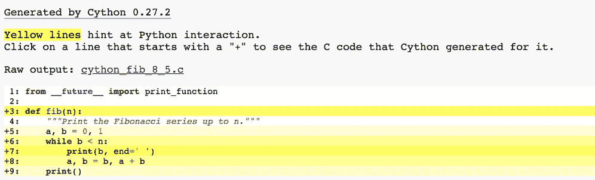

Cython 性能分析

正如你所看到的，因为我们没有指定变量的类型，Cython 在我们的脚本中总是需要回退到 Python。通过告诉 Cython 变量的类型，我们可以显著加速代码。要定义一个具有类型的变量，我们使用 `cdef`：

```py
from __future__ import print_function
def fib(int n):
    cdef int a = 0
    cdef int b = 1
    while b < n:
        print(b, end=' ')
        a, b = b, a + b
    print()
```

这个代码片段已经更好了。进一步优化当然是可能的，通过在打印之前先计算这些数字，我们可以减少对 Python `print` 语句的依赖。总体来说，Cython 是一个保持 Python 开发速度和易用性，同时提高执行速度的绝佳方式。

## 缓存频繁请求

一种被低估的加速模型运行的方法是将频繁的请求缓存到数据库中。你可以将数百万个预测缓存到数据库中，然后查找它们。这样做的好处是，你可以将模型做得足够大，并投入大量计算资源进行预测。

通过使用 MapReduce 数据库，在一个非常大的请求和预测池中查找请求是完全可能的。当然，这要求请求必须是某种离散的。如果你有连续的特征，如果精度不重要，可以将其四舍五入。

# 练习

既然我们已经到了本章的结尾，现在是时候将我们学到的内容付诸实践了。运用你在本章中获得的知识，为什么不尝试以下练习呢？

+   尝试构建任何在训练中会出现梯度爆炸的模型。提示：不要对输入进行标准化，并尝试调整层的初始化方式。

+   去书中的任何例子，尝试通过改善数据管道来优化性能。

# 总结

在本章中，你学到了许多调试和改进模型的实用技巧。让我们回顾一下我们所学到的所有内容：

+   找出数据中的缺陷，导致你的学习模型出现缺陷

+   使用创造性技巧让你的模型从更少的数据中学到更多

+   在生产环境或训练中进行单元测试，以确保满足标准

+   注意隐私问题

+   准备训练数据并避免常见陷阱

+   检查模型并窥探“黑箱”

+   寻找最佳超参数

+   调整学习率，以减少过拟合

+   使用 TensorBoard 监控训练进度

+   部署机器学习产品并对其进行迭代

+   加速训练和推理

现在，你已经拥有了一些重要的工具，可以帮助你运行实际的、具有实际应用的机器学习项目，并将它们部署到现实生活中的应用中（例如，交易）。

在部署模型之前，确保你的模型正常工作至关重要，如果没有仔细审查模型，可能会导致你、你的雇主或客户损失数百万美元。出于这些原因，一些公司对将机器学习模型部署到交易中持谨慎态度。他们担心自己永远无法理解这些模型，因此无法在生产环境中管理它们。希望本章通过展示一些实用工具，能够消除这种恐惧，使模型变得可理解、可泛化，并且能够安全部署。

在下一章，我们将讨论与机器学习模型相关的一个特殊、持续且危险的问题：偏差。统计模型往往会适应并放大人类的偏见。金融机构必须遵守严格的规定，以防止种族或性别偏见。我们的重点是探讨如何检测并消除模型中的偏见，使其既公平又合规。
