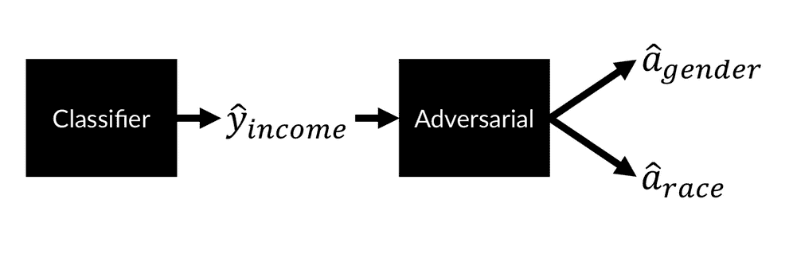
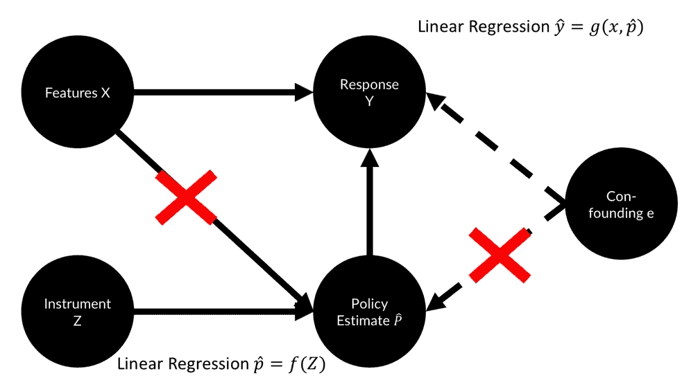
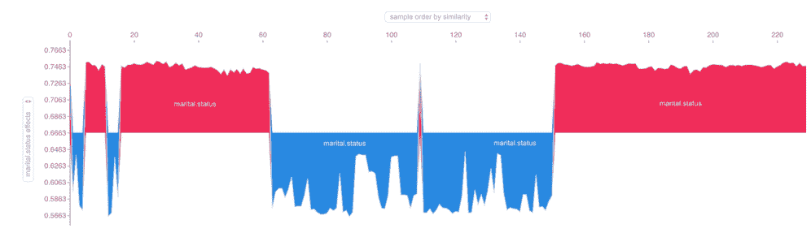

# 第九章：反对偏见

我们喜欢认为机器比我们更理性：冷酷的硅芯片应用冷逻辑。因此，当计算机科学将自动决策引入经济时，许多人希望计算机会减少偏见和歧视。然而，正如我们在查看抵押贷款申请和种族时提到的，计算机是由人类制造和训练的，而这些机器使用的数据来自一个不公正的世界。简单来说，如果我们不小心，我们的程序将放大人类的偏见。

在金融行业，反歧视不仅是道德问题。例如，1974 年在美国生效的**平等信贷机会法**（**ECOA**）明确禁止贷方根据种族、性别、婚姻状况和其他几个属性歧视申请人。它还要求贷方告知申请人拒绝的理由。

本书讨论的算法是歧视机器。给定一个目标，这些机器会找到最适合进行歧视的特征。然而，正如我们所讨论的，歧视并不总是可以接受的。

虽然将某个国家的书籍广告定向投放给同样来自该国的人是可以的，但通常情况下，根据 ECOA，这样做往往不合法，拒绝来自某个国家的人贷款通常是不允许的。在金融领域，比在图书销售中看到的歧视规则要严格得多。这是因为金融领域的决策对人们生活的影响远比图书销售更为严峻。

同样，在这种情况下，歧视是**特征特定的**。例如，虽然可以根据贷款申请人还款历史进行歧视，但如果仅根据其原籍国进行歧视，则不应该这样做，除非该国受到制裁或有类似的总体法律规定。

本章我们将讨论以下内容：

+   偏见在机器中的来源

+   偏见的法律影响：**机器学习**（**ML**）模型

+   如何减少观察到的不公平

+   如何检查模型中的偏见和不公平

+   因果建模如何减少偏见

+   如何理解不公平是一个复杂的系统性失败，且需要通过非技术手段来解决

本书讨论的算法是特征提取算法。即使忽略了受管制的特征，算法也可能通过代理特征推断这些特征，并基于它们进行歧视。以美国许多城市为例，邮政编码可以合理地预测种族。因此，单单省略受管制的特征在应对偏见时是不够的。

# 机器学习中的不公平来源

正如我们在本书中多次讨论过的那样，模型是它们所训练数据的函数。一般来说，更多的数据会导致更小的误差。因此，按定义，少数群体的数据较少，因为这些群体的人数较少。

这种**不均衡的样本量**可能会导致少数群体的模型表现更差。因此，这种增加的误差通常被称为**系统性误差**。模型可能不得不对多数群体数据进行过度拟合，以至于它找到的关系不适用于少数群体的数据。由于少数群体的数据很少，这种情况的惩罚并不严重。

假设你正在训练一个信用评分模型，并且你大部分数据来自居住在下曼哈顿的人，而只有少部分数据来自生活在农村地区的人。曼哈顿的住房价格要贵得多，因此模型可能会学习到购买公寓需要非常高的收入。然而，相比之下，农村地区的住房价格要便宜得多。即便如此，由于模型大部分是基于曼哈顿的数据进行训练的，它可能会拒绝农村申请者的贷款申请，因为他们的收入通常低于曼哈顿的同龄人。

除了样本量问题外，我们的数据本身也可能存在偏见。例如，“原始数据”并不存在。数据并不是自然产生的，而是由人类使用人工测量协议进行测量的，这些测量协议本身可能以多种方式存在偏见。

偏见可能包括**抽样偏见**，就像曼哈顿住房例子中的情况，或**测量偏见**，即你的样本可能无法准确测量它所要测量的内容，甚至可能对某一群体产生歧视。

另一种可能的偏见是**既存的社会偏见**。这些偏见可以在词向量中显现出来，例如在 Word2Vec 中，从父亲到医生的映射与从母亲到护士的映射相似。同样，从男性到计算机程序员的向量，也映射到女性到家庭主妇。这是因为性别歧视已经深深烙印在我们性别歧视的社会中。直到今天，通常情况下，医生多为男性，护士多为女性。同样，科技公司的人才多样性统计显示，计算机程序员中男性远多于女性，这些偏见也被编码进了模型中。

# 法律视角

反歧视法中有两个原则：*不均等对待*和*不均等影响*。我们花一点时间来看看这两个概念：

+   **不均等对待**：这是一种非法歧视。故意歧视特定邮政编码区域，以期歧视某一族群，这是不合法的。不均等对待问题更多的是与运行算法的组织有关，而非算法本身。

+   **不平等影响**：如果部署的算法对不同群体产生不同的影响，即使组织并不知情，这也可能成为一个问题。让我们以一个借贷场景为例，看看不平等影响如何成为问题。首先，原告必须证明存在不平等影响。通常，评估是否存在不平等影响是通过**四分之五规则**来进行的，该规则指出，如果一个群体的选择率低于其他群体的 80%，则被视为不利影响的证据。如果某贷款人有 150 名来自 A 群体的贷款申请者，其中 100 人被接受，比例为 67%，以及 50 名来自 B 群体的申请者，其中 25 人被接受，则选择差异为 0.5/0.67 = 0.746，这构成了对 B 群体歧视的证据。被告可以通过证明该决策程序是必要的，从而对此作出反驳。

    完成此步骤后，原告有机会证明，通过采用另一种可以展示更小差距的程序，也能够实现该程序的目标。

### 注意

**注意**：欲了解更深入的相关内容，请参见 Moritz Hardt 2017 年在[`mrtz.org/nips17/#/11`](http://mrtz.org/nips17/#/11)的 NeurIPS 演讲。

不平等待遇原则旨在实现程序公平和机会平等。不同影响原则则旨在追求分配公正并最小化结果的不平等。

这两种原则之间存在内在的张力，正如 2009 年 Ricci V. DeStefano 案件所展示的那样。在这个案件中，19 名白人消防员和 1 名西班牙裔消防员起诉了他们的雇主——新哈文消防局。这些消防员都通过了晋升测试，但他们的黑人同事未达到晋升所需的分数。担心会被起诉为存在不平等影响，城市当局宣布无效这些测试结果，并未晋升这些消防员。由于不平等影响的证据不足，美国最高法院最终裁定，这些消防员应该被晋升。

鉴于机器学习中的公平性面临着复杂的法律和技术情况，我们将深入探讨如何定义和量化公平性，并利用这一见解来构建更公平的模型。

# 观察公平性

平等常被视为一个纯粹的定性问题，因此通常会被定量思维的建模者忽视。正如本节所展示的，平等也可以从定量角度来看待。考虑一个分类器，*c*，其输入为*X*，某些敏感输入为*A*，目标为*Y*，输出为*C*。通常情况下，我们会将分类器输出表示为，但为了可读性，我们遵循 CS 294，并将其命名为*C*。

假设我们的分类器用于决定谁能获得贷款。我们何时可以认为这个分类器是公平的且没有偏见的呢？为了回答这个问题，我们可以想象两个人群，A 组和 B 组，都是贷款申请人。根据信用评分，我们的分类器必须找到一个截止点。我们来看一下申请人的分布情况：

### 注意

**注意**：本示例的数据是合成的；你可以在本书的 GitHub 仓库中找到用于这些计算的 Excel 文件，[`github.com/PacktPublishing/Machine-Learning-for-Finance/blob/master/9.1_parity.xlsx`](https://github.com/PacktPublishing/Machine-Learning-for-Finance/blob/master/9.1_parity.xlsx)。


最大化利润

在这个练习中，我们假设一个成功的申请人可以带来 300 美元的利润，而一个违约的成功申请人则会造成 700 美元的损失。这里的截止点被选定为最大化利润：

那么，我们可以看到什么呢？我们可以看到以下几点：

+   橙色部分是那些本不打算偿还贷款且未获得批准的申请人：**真负例**（**TNs**）。

+   蓝色部分是那些本应偿还贷款但未被批准的申请人：**假负例**（**FNs**）。

+   黄色部分是那些获得了贷款但未偿还的申请人：**假正例**（**FPs**）。

+   灰色部分是那些成功获得贷款并且按时偿还的申请人：**真正例**（**TPs**）。

如你所见，选择这个截止点存在若干问题。**B 组**申请人需要比**A 组**申请人有更高的评分才能获得贷款，这表明存在不同的对待。同时，只有大约 51%的**A 组**申请人获得贷款，而只有 37%的**B 组**申请人获得贷款，这表明存在影响差异。

*不考虑群体的阈值*，如下面所示，会给两个群体相同的最低评分：


相同的截止点

在前面的图表中，虽然两个组的截止率相同，但**A 组**获得的贷款较少。同时，**A 组**的预测准确性低于**B 组**的预测准确性。似乎虽然两个组面临相同的评分门槛，但**A 组**处于不利位置。

人口平等旨在通过确保两个群体有相同的贷款机会来实现公平。这种方法旨在使两个群体的选择率相同，这也是衡量影响差异的标准。从数学上来说，这一过程可以表示为：


如果我们将这个规则应用到之前的同一情境中，我们将得到以下的截止点：


相同的选择率

尽管这种方法不能被归咎于统计歧视和不同影响，但它可以被归咎于不同待遇。在平等选择率的图示中，我们可以看到**A 组**被赋予了一个更低的阈值分数；与此同时，更多的成功的**A 组**申请人未能偿还贷款。实际上，**A 组**并不盈利，而是由**B 组**进行补贴。接受更糟糕的经济结果以偏袒某个群体，这也被称为基于偏好的歧视。可以说，**B 组**的较高阈值是不公平的，因为它们的假阳性率较低。

TP 平等，也叫做平等机会，意味着两个群体有相同的 TP（真阳性）率。对于能够偿还贷款的人来说，应该有相同的获得贷款的机会。从数学上讲，这可以表示为：


应用到我们的数据中，这一政策看起来类似于人口平等，只是群体的分界点更低：


平等机会

平等机会可以解决人口平等的许多问题，因为大多数人认为每个人都应该有相同的机会。然而，我们的分类器对于**A 组**的准确性较低，且存在某种形式的不平等待遇。

准确性平等告诉我们，两个群体的预测准确性应该相同。从数学上讲，这可以表示为：


分类器正确的概率对于敏感变量*A*的两个可能值应该是相同的。当我们将这一标准应用于我们的数据时，得到了以下结果：


平等准确性

从前面的图示可以看出其缺点。为了满足准确性约束，**B 组**的成员能够更容易地获得贷款。

因此，要解决这一问题，需要进行权衡，因为没有任何分类器能够同时实现精确度平等、TP 平等和 FP 平等，除非分类器是完美的。*C = Y*，即两个群体具有相同的基准率：


表达公平性的方式有很多种。然而，关键的结论是，它们都无法完美地满足所有公平标准。对于任何具有不同基准率和不同贷款偿还机会的两个群体，建立统计平等就需要引入待遇差异。

这一事实引发了许多辩论，目前尚未就表达和消除歧视的最佳实践达成共识。也就是说，即使找到了完美的数学表达式来表示公平，它也不会立即导致完全公平的系统。

任何机器学习算法都是更大系统的一部分。输入 *X* 通常不像同一系统中可能使用不同输入的其他算法那样明确。人口群体 *A* 往往不明确或无法推断。即使分类器的输出 *C* 也常常无法明确区分，因为多个算法可能共同执行分类任务，而每个算法预测的输出不同，例如信用评分或盈利估算。

良好的技术不能替代良好的政策。盲目地遵循一个算法而没有个别考虑或申诉的机会，始终会导致不公平。话虽如此，尽管数学公平性标准不能解决我们面临的所有公平性问题，但尝试让机器学习算法更公平无疑是值得的，这也是下一节的内容。

# 公平训练

有多种方法可以训练模型以实现更公平的结果。一种简单的方法是使用我们在前一节中列出的不同公平性度量作为附加损失。然而，在实践中，这种方法已被证明存在一些问题，例如在实际分类任务中的表现较差。

另一种方法是使用对抗网络。早在 2016 年，Louppe、Kagan 和 Cranmer 发表了论文 *使用对抗网络学习转向*，可以在[`arxiv.org/abs/1611.01046`](https://arxiv.org/abs/1611.01046)找到。这篇论文展示了如何使用对抗网络训练分类器忽略干扰参数，例如敏感特征。

在这个例子中，我们将训练一个分类器来预测一个成年人是否年收入超过 5 万美元。这里的挑战是让我们的分类器不受种族和性别的影响，只关注我们可以区分的特征，包括他们的职业和资本收益。

为此，我们必须训练一个分类器和一个对抗网络。对抗网络旨在从分类器的预测中分类敏感属性，如 *a*、性别和种族：



创建一个无偏的分类器来检测成年人的收入

分类器的目标是按收入分类，同时也要欺骗对抗网络。分类器的最小化目标公式如下：


在该公式中，是分类的二元交叉熵损失，而是对抗损失。表示一个超参数，我们可以使用它来放大或减少对抗损失的影响。

### 注意

**注意**：这种对抗性公平性方法的实现参考了 Stijn Tonk 和 Henk Griffioen 的实现。你可以在 Kaggle 上找到本章的代码：[`www.kaggle.com/jannesklaas/learning-how-to-be-fair`](https://www.kaggle.com/jannesklaas/learning-how-to-be-fair)。

Stijn 和 Henk 原始的博客文章可以在这里找到：[`blog.godatadriven.com/fairness-in-ml`](https://blog.godatadriven.com/fairness-in-ml)。

为了公平地训练这个模型，我们不仅需要数据 *X* 和目标 *y*，还需要关于敏感属性的数据，*A*。在我们将要处理的示例中，我们将使用 UCI 仓库提供的 1994 年美国人口普查数据：[`archive.ics.uci.edu/ml/datasets/Adult`](https://archive.ics.uci.edu/ml/datasets/Adult)。

为了便于加载数据，它已经被转换为带有列标题的 CSV 文件。顺便提一下，请参考在线版本查看数据，因为在书籍格式中查看数据会很困难。

首先，我们加载数据集。该数据集包含来自不同种族的人的数据，但为了简化任务，我们只关注 `种族` 属性中的白人和黑人。为此，我们需要运行以下代码：

```py
path = '../input/adult.csv'
input_data = pd.read_csv(path, na_values="?")
input_data = input_data[input_data['race'].isin(['White', 'Black'])]
```

接下来，我们选择敏感属性，在这种情况下我们专注于种族和性别，将它们放入我们的敏感数据集 `A` 中。我们对数据进行独热编码，使得 `性别` 属性中的 "Male" 等于 1，`种族` 属性中的 "White" 等于 1。我们可以通过运行以下代码来实现这一点：

```py
sensitive_attribs = ['race', 'gender']
A = input_data[sensitive_attribs]
A = pd.get_dummies(A,drop_first=True)
A.columns = sensitive_attribs
```

我们的目标是 `收入` 属性。因此，我们需要将 `>50K` 编码为 1，将其他所有值编码为 0，可以通过编写以下代码实现：

```py
y = (input_data['income'] == '>50K').astype(int)
```

为了获取我们的训练数据，首先去除敏感属性和目标属性。然后填补所有缺失值，并对所有数据进行独热编码，正如你在下面的代码中看到的那样：

```py
X = input_data.drop(labels=['income', 'race', 'gender'],axis=1)

X = X.fillna('Unknown')

X = pd.get_dummies(X, drop_first=True)
```

最后，我们将数据拆分为训练集和测试集。如以下代码所示，我们然后进行分层处理，确保在测试数据和训练数据中都有相同数量的高收入者：

```py
X_train, X_test, y_train, y_test, A_train, A_test = \
train_test_split(X, y, A, test_size=0.5, stratify=y, random_state=7)
```

为了确保数据能够良好地与神经网络配合使用，我们现在将使用 scikit-learn 的 `StandardScaler` 对数据进行缩放：

```py
scaler = StandardScaler().fit(X_train)

X_train = pd.DataFrame(scaler.transform(X_train), columns=X_train.columns, index=X_train.index)

X_test = pd.DataFrame(scaler.transform(X_test), columns=X_test.columns, index=X_test.index)
```

我们需要一个衡量模型公平性的指标。我们使用不平等影响选择规则。`p_rule` 方法计算两个群体中被分类为年收入超过 50,000 美元的人的比例，然后返回弱势群体的选择比例与优势群体的选择比例之比。

目标是让 `p_rule` 方法返回至少 80%，以满足种族和性别的四分之一规则。以下代码展示了这个函数仅用于监控，而不是作为损失函数：

```py
def p_rule(y_pred, a_values, threshold=0.5):
    y_a_1 = y_pred[a_values == 1] > threshold if threshold else y_pred[a_values == 1]                                           #1
    y_a_0 = y_pred[a_values == 0] > threshold if threshold else y_pred[a_values == 0] 
    odds = y_a_1.mean() / y_a_0.mean()                          #2
    return np.min([odds, 1/odds]) * 100
```

让我们更详细地探讨一下这段代码。正如你从前面的代码块中看到的，它是通过两个关键特征创建的，具体如下：

1.  首先，我们选择哪些人被赋予一个选定的阈值。在这里，我们将模型为那些被分配有超过 50%机会赚取$50,000 或更多的人分类为高收入者。

1.  其次，我们计算两个人群的选择比例。我们将一组的比例除以另一组的比例。通过返回两者中的最小值，无论是赔率本身还是赔率的倒数，我们确保返回一个小于 1 的值。

为了让模型设置更简单，我们需要定义输入特征的数量和敏感特征的数量。这可以通过运行以下两行轻松完成：

```py
n_features=X_train.shape[1]
n_sensitive=A_train.shape[1]
```

现在我们设置我们的分类器。注意，这个分类器是一个标准的分类神经网络。它包含三个隐藏层、一些丢弃层（dropout），以及一个带有 sigmoid 激活的最终输出层，因为这是一个二分类任务。这个分类器是用 Keras 功能性 API 编写的。

为了确保你理解 API 的工作原理，请通过以下代码示例，确保你理解为什么要采取这些步骤：

```py
clf_inputs = Input(shape=(n_features,))
x = Dense(32, activation='relu')(clf_inputs)
x = Dropout(0.2)(x)
x = Dense(32, activation='relu')(x)
x = Dropout(0.2)(x)
x = Dense(32, activation='relu')(x)
x = Dropout(0.2)(x)
outputs = Dense(1, activation='sigmoid', name='y')(x)
clf_net = Model(inputs=[clf_inputs], outputs=[outputs])
```

对抗网络是一个具有两个头的分类器：一个用来从模型输出预测申请人的种族，另一个用来预测申请人的性别：

```py
adv_inputs = Input(shape=(1,))
x = Dense(32, activation='relu')(adv_inputs)
x = Dense(32, activation='relu')(x)
x = Dense(32, activation='relu')(x)
out_race = Dense(1, activation='sigmoid')(x)
out_gender = Dense(1, activation='sigmoid')(x)
adv_net = Model(inputs=[adv_inputs], outputs=[out_race,out_gender])
```

与生成对抗网络一样，我们需要多次将网络设置为可训练或不可训练。为了简化这一过程，以下函数将创建一个函数，使网络及其所有层变得可训练或不可训练：

```py
def make_trainable_fn(net):              #1
    def make_trainable(flag):            #2
        net.trainable = flag             #3
        for layer in net.layers:
            layer.trainable = flag
    return make_trainable                #4
```

从前面的代码中，有四个关键特性我们应该花点时间探讨：

1.  该函数接受一个 Keras 神经网络，接着会创建一个训练开关函数。

1.  在函数内部，创建了第二个函数。这个第二个函数接受一个布尔标志（`True`/`False`）。

1.  当调用时，第二个函数将网络的可训练性设置为标志。如果传入`False`，则网络不可训练。由于网络的层也可以在其他网络中使用，我们确保每个独立的层也不可训练。

1.  最后，我们返回该函数。

使用一个函数来创建另一个函数，刚开始可能看起来有些复杂，但这使我们能够轻松地为神经网络创建“开关”。以下代码片段展示了如何为分类器和对抗网络创建开关函数：

```py
trainable_clf_net = make_trainable_fn(clf_net)
trainable_adv_net = make_trainable_fn(adv_net)
```

要使分类器可训练，我们可以使用带有`True`标志的函数：

```py
trainable_clf_net(True)
```

现在我们可以编译我们的分类器。如你在本章后面将看到的，保持分类器网络作为一个独立的变量，与我们用来进行预测的已编译分类器分开是非常有用的：

```py
clf = clf_net
clf.compile(loss='binary_crossentropy', optimizer='adam')
```

记住，要训练我们的分类器，我们需要将其预测结果传递给对抗者，并获得对抗者的损失值，并将负的对抗者损失应用到分类器。这最好通过将分类器和对抗者打包成一个网络来完成。

为此，我们必须首先创建一个新模型，将分类器输入映射到分类器和对抗者输出。我们定义对抗者的输出为对抗网络和分类器网络的嵌套函数。这样，分类器的预测会立即传递给对抗者：

```py
adv_out = adv_net(clf_net(clf_inputs))
```

然后我们定义分类器的输出为分类器网络的输出，就像我们在分类任务中一样：

```py
clf_out = clf_net(clf_inputs)
```

然后，我们定义组合模型，从分类器输入（即关于申请人的数据）映射到分类器输出和对抗者输出：

```py
clf_w_adv = Model(inputs=[clf_inputs], outputs=[clf_out]+adv_out)
```

在训练组合模型时，我们只想更新分类器的权重，因为我们将单独训练对抗网络。我们可以使用切换函数使分类器网络可训练，而对抗网络不可训练：

```py
trainable_clf_net(True)
trainable_adv_net(False)
```

记住前面最小化目标中的超参数，。我们需要手动为这两个敏感属性设置该参数。事实证明，网络在种族的 lambda 值远高于性别的 lambda 值时表现最佳。

拥有 lambda 值后，我们可以创建加权损失：

```py
loss_weights = [1.]+[-lambda_param for lambda_param in lambdas]
```

上述表达式导致了损失权重为[1., -130, -30]。这意味着分类错误的权重为 1，对抗者的种族预测错误权重为-130，对抗者的性别预测错误权重为-30。由于对抗预测的损失权重为负，梯度下降将优化分类器的参数以*增加*这些损失。

最后，我们可以编译组合网络：

```py
clf_w_adv.compile(loss='binary_crossentropy'), loss_weights=loss_weights,optimizer='adam')
```

有了分类器和组合的分类器-对抗模型后，唯一缺少的是一个编译好的对抗模型。为此，我们首先定义对抗模型，从分类器输入映射到嵌套的对抗-分类器模型输出：

```py
adv = Model(inputs=[clf_inputs], outputs=adv_net(clf_net(clf_inputs)))
```

然后，在训练对抗模型时，我们希望优化对抗网络的权重，而不是分类器网络的权重，因此我们使用切换函数使对抗者可训练，而分类器不可训练：

```py
trainable_clf_net(False)
trainable_adv_net(True)
```

最后，我们像编译常规的 Keras 模型一样编译对抗模型：

```py
adv.compile(loss='binary_crossentropy', optimizer='adam')
```

拥有所有组件后，我们现在可以对分类器进行预训练。这意味着我们在没有任何特殊公平性考虑的情况下训练分类器：

```py
trainable_clf_net(True)
clf.fit(X_train.values, y_train.values, epochs=10)
```

在我们训练完模型后，可以对验证集进行预测，以评估模型的公平性和准确性：

```py
y_pred = clf.predict(X_test)
```

现在我们将计算模型的准确性和`p_rule`，分别针对性别和种族。在所有计算中，我们将使用 0.5 作为临界点：

```py
acc = accuracy_score(y_test,(y_pred>0.5))* 100
print('Clf acc: {:.2f}'.format(acc))

for sens in A_test.columns:
    pr = p_rule(y_pred,A_test[sens])
    print('{}: {:.2f}%'.format(sens,pr))
```

```py
out:
Clf acc: 85.44
race: 41.71%
gender: 29.41%

```

如你所见，分类器在预测收入方面取得了相当不错的准确率 85.44%。然而，它是不公平的。它给女性超过 50,000 美元的机会只有男性的 29.4%。

同样，它在种族上有强烈的歧视。如果我们使用这个分类器来评判贷款申请，比如说，我们将面临歧视诉讼的风险。

### 注意

**注意**：分类器的特征中没有包含性别或种族。然而，分类器在这些特征上有强烈的歧视。如果这些特征能够被推断出来，那么仅仅去除敏感列是不够的。

为了摆脱这个困境，我们将在训练这两个网络之前预训练对抗网络，以便做出公平的预测。再次使用我们的开关函数，使分类器无法训练而对抗网络可以训练：

```py
trainable_clf_net(False)
trainable_adv_net(True)
```

由于数据中的种族和性别分布可能存在偏斜，我们将使用加权类来调整这一点：

```py
class_weight_adv = compute_class_weights(A_train)
```

然后，我们训练对抗网络，通过分类器的预测从训练数据中预测种族和性别：

```py
adv.fit(X_train.values, np.hsplit(A_train.values, A_train.shape[1]), class_weight=class_weight_adv, epochs=10)
```

NumPy 的`hsplit`函数将 2D 的`A_train`矩阵拆分为两个向量，随后用于训练两个模型头部。

在分类器和对抗网络预训练后，我们将训练分类器以欺骗对抗网络，从而更好地识别分类器的歧视性。在开始之前，我们需要做一些设置。我们希望训练 250 个周期，批次大小为 128，包含两个敏感属性：

```py
n_iter=250
batch_size=128
n_sensitive = A_train.shape[1]
```

结合网络中的分类器和对抗网络同样需要一些类别权重。对于收入预测（高于/低于$50,000），这两个类别的权重均为 1。对于结合模型中的对抗网络头部，我们使用前面计算的对抗类权重：

```py
class_weight_clf_w_adv = [{0:1., 1:1.}]+class_weight_adv
```

为了跟踪指标，我们设置了一个包含验证指标、准确率和曲线下面积的 DataFrame，以及公平性指标。公平性指标是种族和性别的`p_rule`值：

```py
val_metrics = pd.DataFrame()
fairness_metrics = pd.DataFrame()
```

在主训练循环中，执行三个步骤：训练对抗网络，训练分类器使其公平，并打印出验证指标。为了更好的解释，下面会单独打印这三个步骤。

在代码中，您会看到它们在同一个循环中，其中`idx`是当前的迭代：

```py
for idx in range(n_iter):
```

第一步是训练对抗网络。为此，我们将使分类器不可训练，对抗网络可训练，然后像之前一样训练对抗网络。为了实现这一点，我们需要运行以下代码块：

```py
trainable_clf_net(False)
trainable_adv_net(True)
adv.fit(X_train.values, np.hsplit(A_train.values, A_train.shape[1]), batch_size=batch_size, class_weight=class_weight_adv, epochs=1, verbose=0)
```

训练分类器使其成为一个好的分类器，同时也能欺骗对抗网络并保持公平，涉及三个步骤。首先，我们使对抗网络不可训练，而分类器可以训练：

```py
trainable_clf_net(True)
trainable_adv_net(False)
```

然后，我们从`X`、`y`和`A`中采样一个批次：

```py
indices = np.random.permutation(len(X_train))[:batch_size]
X_batch = X_train.values[indices]
y_batch = y_train.values[indices]
A_batch = A_train.values[indices]
```

最后，我们训练结合的对抗网络和分类器。由于对抗网络被设置为不可训练，只有分类器网络会被训练。然而，从对抗网络对种族和性别的预测所得损失会通过整个网络进行反向传播，因此分类器会学会欺骗对抗网络：

```py
clf_w_adv.train_on_batch(X_batch, [y_batch]+\np.hsplit(A_batch, n_sensitive),class_weight=class_weight_clf_w_adv)
```

最后，我们希望通过首先对测试集进行预测来跟踪进展：

```py
y_pred = pd.Series(clf.predict(X_test).ravel(), index=y_test.index)
```

然后，我们计算曲线下面积（`ROC AUC`）和预测的准确性，并将它们保存在`val_metrics`数据框中：

```py
roc_auc = roc_auc_score(y_test, y_pred)
acc = accuracy_score(y_test, (y_pred>0.5))*100

val_metrics.loc[idx, 'ROC AUC'] = roc_auc
val_metrics.loc[idx, 'Accuracy'] = acc
```

接下来，我们将计算种族和性别的`p_rule`，并将这些值保存在公平性指标中：

```py
for sensitive_attr :n A_test.columns:
    fairness_metrics.loc[idx, sensitive_attr] =\
    p_rule(y_pred,A_test[sensitive_attr])
```

如果我们绘制公平性和验证指标的图表，我们将得到以下图示：


透视训练进展

如你所见，分类器的公平性得分随着训练的进行稳定提高。大约经过 150 个训练周期后，分类器满足了四分之三规则。同时，p 值也远超过 90%。这种公平性的提升仅伴随着准确性和曲线下面积的轻微下降。以这种方式训练的分类器显然是一个更加公平的分类器，且性能相似，因此比没有公平性标准的分类器更受青睐。

公平机器学习的透视方法有很多优点。然而，它并不能完全排除不公平的情况。例如，如果存在一个被分类器歧视的群体，而我们尚未想到这个群体会如何？如果它是在处理而不是影响上进行歧视呢？为了确保我们的模型不偏倚，我们需要更多的技术和社会工具，即*可解释性*、*因果性*和*多元化的开发团队*。

在下一节中，我们将讨论如何训练能够学习因果关系的机器学习模型，而不仅仅是统计关联。

# 因果学习

本书主要是一本关于统计学习的书。给定数据*X*和目标*Y*，我们的目标是估计，即在给定某些数据点的情况下目标值的分布。统计学习使我们能够创建许多有用的应用程序的优秀模型，但它不能让我们声称*X*的取值为*x*导致了*Y*的取值为*y*。

如果我们打算操控*X*，这一声明至关重要。例如，如果我们想知道给某人提供保险是否会导致他们行为鲁莽，我们不会仅仅满足于统计关系——有保险的人比没有保险的人行为更鲁莽。例如，可能存在自我选择偏差，表现在鲁莽的人更容易获得保险，而没有被标记为鲁莽的人则没有。

朱迪亚·珀尔（Judea Pearl），一位著名的计算机科学家，发明了一种用于因果模型的符号系统，称为 do-calculus；我们关注的是，它表示在我们将*P*操控为*p*之后，一个人行为鲁莽的概率。在因果符号系统中，*X*通常代表观察到的特征，而*P*则代表我们可以操控的政策特征。这个符号系统可能有些令人困惑，因为此时*p*既表示概率，也表示政策。然而，区分观察到的特征和受影响的特征非常重要。因此，如果你看到，*p*是一个受影响的特征；而如果你看到，*p*是一个概率函数。

所以，公式表示了保险持有者平均更鲁莽的统计关系。这是监督模型所学习的内容。表示了因果关系，说明获得保险的人变得更鲁莽，因为他们已经投保。

因果模型是公平学习的一个重要工具。如果我们仅以因果方式构建模型，那么我们将避免大多数统计模型中出现的统计歧视。女性的收入统计上是否低于男性？是的。女性收入低是因为她们是女性，并且女性在某种程度上不配获得高薪吗？不是。相反，收入差异是由其他因素造成的，比如男性和女性获得的工作不同，职场中的歧视，文化偏见等等。

这并不意味着我们必须抛弃统计模型。它们在很多情况下是很有用的，尤其是当因果关系不是那么重要，且我们不打算设置*X*的值时。例如，如果我们正在创建一个自然语言模型，那么我们并不关心一个词的出现是否导致句子涉及某个特定话题。了解话题和单词之间的关系，就足以预测文本的内容。

## 获取因果模型

获取信息的黄金路线，是通过随机对照试验（RCT）实际去操控政策*P*。许多网站，例如，通过向不同客户展示不同的广告来衡量不同广告的影响，这个过程被称为 A/B 测试。同样，交易员可能会选择不同的市场路线，以找出最佳的那一条。然而，并非总是能够或甚至合乎道德地进行 A/B 测试。例如，在我们关注的金融领域，银行不能以“抱歉，你是控制组”作为拒绝贷款的理由。

然而，通常情况下，我们可以在不需要 A/B 测试的情况下进行因果推断。通过使用 do-计算法，我们可以推断政策对结果的影响。以我们是否认为给人们提供保险会让他们变得鲁莽为例；如果你愿意，可以称之为申请人的道德风险。给定特征*X*和政策*P*，我们希望预测结果分布，。

在这种情况下，考虑到申请人提供的信息，例如他们的年龄或冒险行为历史，我们希望预测在我们调整授予保险的政策（*P*）下，申请人可能表现出鲁莽行为的概率，。观察到的特征通常最终会影响政策和反应。例如，一个具有较高风险偏好的申请人，可能不会获得保险，但也更有可能表现出鲁莽行为。

此外，我们还需要处理未观察到的混杂变量（*e*），这些变量通常会同时影响政策和反应。例如，一篇名为*自由式滑雪很安全，你不需要购买保险*的媒体文章，可能会减少购买保险的人数以及鲁莽滑雪者的数量。

## 工具变量

为了区分政策和反应的影响，我们需要一个**工具变量，Z**。工具变量是一个只影响政策而不影响其他任何因素的变量。例如，再保险成本可能促使保险公司发放更少的保险单。这一关系可以通过下方的流程图看到，其中已经映射了这种关系：


因果流程图

计量经济学领域已经建立了一种方法来处理这类情况，称为**工具变量两阶段最小二乘法**（**IV2SLS**，简称**2SLS**）。简而言之，2SLS 首先拟合工具变量（*z*）与政策（*p*）之间的线性回归模型，在计量经济学中称为内生变量或处理变量。

从这个线性回归模型中，它随后估计出一个“调整后的处理变量”，即可以通过工具变量来解释的处理变量。这个调整的目的是消除所有其他因素对处理的影响。然后，第二个线性回归模型通过映射特征（*x*）和调整后的处理变量，，到结果（*y*）来创建一个线性模型。

在下图中，您可以看到 2SLS 如何工作的概览：



IV2SLS

2SLS 很可能是我们案例中的保险公司使用的方法，因为它是一种成熟的方法。我们在这里不会深入讨论，除了简要介绍如何在 Python 中使用 2SLS。Python 中的`linear model`包提供了一种简便的方法来运行 2SLS。

### 注意

**注意**：你可以在 GitHub 上找到该包：[`github.com/bashtage/linearmodels`](https://github.com/bashtage/linearmodels)。

你可以通过运行以下命令安装该包：

```py
pip install linearmodels

```

如果你有数据 `X`、`y`、`P` 和 `Z`，可以按如下方式运行 2SLS 回归：

```py
from linearmodels.iv import IV2SLS
iv = IV2SLS(dependent=y,exog=X,endog=P],instruments=Z).fit(cov_type='unadjusted')
```

## 非线性因果模型

如果特征、处理和结果之间的关系是复杂的非线性的，怎么办？在这种情况下，我们需要执行一个类似于 2SLS 的过程，但使用非线性模型（如神经网络）来代替线性回归。

暂时忽略混杂变量，函数 *g* 根据保险政策  和一组申请者的特征 *x* 来确定行为 *y* 的鲁莽程度：


函数 *f* 根据申请者的特征 *x* 以及工具 *z* 确定政策 ：


给定这两个函数，如果混杂变量在所有特征上的均值为零，以下恒等式成立：


这意味着，如果我们能够可靠地估计函数 *g* 和分布 *F*，我们就能够对政策的影响做出因果声明 。如果我们有关于实际结果 *y*、特征 *x*、政策  和工具 *z* 的数据，我们可以优化以下内容：


上述函数是使用预测函数 *g* 预测的结果与实际结果 *y* 之间的平方误差。

注意与 2SLS 的相似性。在 2SLS 中，我们通过两个独立的线性回归来估计 *F* 和 *g*。对于更复杂的函数，我们也可以通过两个独立的神经网络来估计它们。早在 2017 年，Jason Hartford 等人就在他们的论文《*Deep IV: A Flexible Approach for Counterfactual Prediction*》中提出了这种方法，- 该论文可在以下网址找到：[`proceedings.mlr.press/v70/hartford17a/hartford17a.pdf`](http://proceedings.mlr.press/v70/hartford17a/hartford17a.pdf) - 你可以在下面的图示中看到该方法的概述：


Deep IV

Deep IV 的思路是首先训练一个神经网络来表达分布 *F(z,x)*，它描述了在给定特征 *x* 和工具值 *z* 的情况下，政策的分布。第二个神经网络则根据估计的政策分布和特征来预测响应 *y*。Deep IV 的优势在于，它能够从复杂数据（例如文本）中学习复杂的非线性关系。

*Deep IV* 论文的作者们还发布了一个自定义的 Keras 模型，用于处理采样和从分布部分学习，你可以在 GitHub 上找到： [`github.com/jhartford/DeepIV`](https://github.com/jhartford/DeepIV)。

虽然他们的代码太长，无法在这里深入讨论，但思考我们因果主张的来源是很有趣的，既在 Deep IV 中，也在 IV2SLS 中。在我们的保险案例中，我们假设拥有或没有保险会影响行为，而不是反过来。我们从未展示或验证过因果关系方向背后的真相。

在我们的案例中，假设保险会影响行为是合理的，因为保险合同是在行为被观察之前签署的。然而，因果关系的方向并不总是如此直接。除了逻辑推理或实验之外，没有其他方法能够确定因果关系的方向。在没有实验的情况下，我们只能假设并通过逻辑推理，例如通过事件的顺序。我们做出的另一个重要假设是工具实际上是一个独立的工具。如果它不是独立的，我们的政策估计将会失败。

考虑到这两种限制，因果推断成为了一个极好的工具，并且是一个活跃的研究领域，我们有理由期待未来能看到显著的成果。在最佳情况下，你的敏感性模型只会包含因果变量。实际上，这通常是不可行的。然而，牢记标准统计模型所表达的统计相关性和因果关系之间的差异，可以帮助你避免统计偏差和错误的关联。

最后，一种更具技术性的减少不公平性的方法是窥视模型内部，以确保它是公平的。我们已经在上一章中看到了可解释性，主要是为了调试数据并发现过拟合，但现在，我们将再次审视它，这次是为了验证模型的预测。

# 解释模型以确保公平性

在 第八章，*隐私、调试与产品发布* 中，我们将模型可解释性作为调试方法进行了讨论。我们使用 LIME 来发现模型过拟合的特征。

在本节中，我们将使用一种稍微复杂一点的方法，叫做 **SHAP**（**Shapley 加性解释**）。SHAP 将几种不同的解释方法结合成一个简洁的方式。这种方法让我们能够为单个预测以及整个数据集生成解释，从而更好地理解模型。

你可以在 GitHub 上找到 SHAP：[`github.com/slundberg/shap`](https://github.com/slundberg/shap)，并通过 `pip install shap` 安装到本地。Kaggle 核心已经预装了 SHAP。

### 提示

这里给出的示例代码来自 SHAP 示例笔记本。你可以在 Kaggle 上找到一个稍微扩展的版本：

[`www.kaggle.com/jannesklaas/explaining-income-classification-with-keras`](https://www.kaggle.com/jannesklaas/explaining-income-classification-with-keras)

SHAP 结合了七种模型解释方法，分别是 LIME、Shapley 采样值、DeepLIFT、**定量输入影响**（**QII**）、逐层相关传播、Shapley 回归值，以及一个树模型解释器，其中包含两个模块：一个是模型无关的`KernelExplainer`，另一个是专门针对树基方法如`XGBoost`的`TreeExplainer`模块。

关于何时以及如何使用解释器的数学原理，对于使用 SHAP 并不是特别相关。简而言之，给定一个函数*f*，例如通过神经网络表示，并且给定一个数据点*x*，SHAP 将对比与，其中是为更大样本生成的“预期正常输出”。然后，SHAP 会创建类似于 LIME 的更小模型，来查看哪些特征解释了与之间的差异。

在我们的贷款示例中，这意味着有一个申请人，*x*，以及许多申请人，*z*，的分布，并试图解释为什么申请人*x*获得贷款的机会与其他申请人*z*的预期机会不同。

SHAP 不仅比较了与，还比较了与。

这意味着它比较了某些特征保持不变时的重要性，从而更好地估计特征之间的相互作用。

解释单一预测可能非常重要，尤其是在金融领域。您的客户可能会问你：“为什么拒绝了我的贷款？”您会记得之前提到的，ECOA 法案规定您必须给客户一个有效的理由，如果没有合理解释，您可能会陷入困境。在这个示例中，我们再次使用收入预测数据集，目的是解释为什么我们的模型做出了这个单一决策。这个过程分为三个步骤。

首先，我们需要定义解释器，并为其提供一个预测方法和数值*z*，以估计“正常结果”。在这里，我们使用了 Keras 预测函数的包装器`f`，这使得与 SHAP 的工作变得更加简单。我们提供了数据集的 100 行作为`z`的值：

```py
explainer = shap.KernelExplainer(f, X.iloc[:100,:])
```

接下来，我们需要计算 SHAP 值，指示单个示例中不同特征的重要性。我们让 SHAP 对每个样本进行 500 次排列组合，以便 SHAP 总共有 50,000 个示例来与该单个示例进行比较：

```py
shap_values = explainer.shap_values(X.iloc[350,:], nsamples=500)
```

最后，我们可以使用 SHAP 自带的绘图工具来展示特征的影响。这次，我们提供的是来自`X_display`的一行数据，而不是`X`。`X_display`包含了未经缩放的值，仅用于绘图的注释，使其更易于阅读：

```py
shap.force_plot(explainer.expected_value, shap_values)
```

我们可以在以下图表中看到代码的输出：


使用 SHAP 绘图工具展示特征的影响

如果你查看前面的图表，模型的预测似乎大致合理。模型根据申请人拥有硕士学位，并且作为一名每周工作 65 小时的执行经理，给出了较高的收入预期。若没有资本损失，申请人可能会有更高的收入预期分数。同样，模型似乎将申请人已婚的事实视为高收入的重要因素。事实上，在我们的示例中，似乎婚姻比长工时或职位头衔更为重要。

我们的模型也存在一些问题，这些问题在我们计算并绘制另一个申请人的 SHAP 值时变得更加明显：

```py
shap_values = explainer.shap_values(X.iloc[167,:], nsamples=500)
shap.force_plot(explainer.expected_value, shap_values)
```

接下来显示的是输出的图表。这也显示了我们遇到的一些问题：


显示我们可能遇到的一些问题的 SHAP 值

在这个例子中，申请人也有良好的教育背景，每周工作 48 小时，并从事技术行业的工作，但模型却因为她是女性，且是亚太岛裔、未婚且没有其他家庭关系而给了她较低的高收入概率。基于这些理由拒绝贷款，根据《公平信贷法案》（ECOA），这将是一起即将发生的诉讼案件。

我们刚才看到的两个个案可能只是模型的意外故障。它可能过拟合了一些奇怪的组合，给了婚姻不应有的重要性。为了调查我们的模型是否存在偏差，我们应该检查多个不同的预测。幸运的是，SHAP 库提供了一些工具，可以帮助我们完成这个任务。

我们可以使用 SHAP 值计算多个数据行：

```py
shap_values = explainer.shap_values(X.iloc[100:330,:], nsamples=500)
```

然后，我们也可以为这些所有值绘制强制图：

```py
shap.force_plot(explainer.expected_value, shap_values)
```

同样，这段代码会生成一个 SHAP 数据集图表，我们可以在以下图形中看到它：


SHAP 数据集

前面的图表显示了数据集的 230 行数据，按特征的相似性分组，显示了各个特征对它们的重要性。如果你在实际版本中将鼠标移到图表上，你将能够看到特征及其值。

通过探索这个图表，你可以大致了解模型如何将人群分类为高收入或低收入。例如，在最左边，你会看到大多数低学历的人从事清洁工工作。在 40 到 60 之间的那个大红块大多是受过高等教育并且工作时长很长的人。

为了进一步检查婚姻状况的影响，你可以更改 SHAP 在*y*轴上显示的内容。我们来看看婚姻的影响：



SHAP 婚姻结果

正如你在这个图表中看到的，婚姻状况对不同群体的人有着强烈的正向或负向影响。如果你把鼠标悬停在图表上，你会看到正向影响都来源于民事婚姻。

使用总结图，我们可以看到哪些特征对我们的模型最为重要：

```py
shap.summary_plot(shap_values, X.iloc[100:330,:])
```

这段代码会输出最终的总结图，我们可以在下面看到：


SHAP 总结图

正如你所见，教育是我们模型中最重要的影响因素。它的影响范围也最广。低学历水平会大大降低预测值，而高学历水平则能显著提升预测值。婚姻状况是第二重要的预测因素。有趣的是，资本损失对模型有重要影响，但资本收益则没有。

为了深入探讨婚姻的影响，我们还可以使用另一个工具——依赖图，它可以展示某个特征的 SHAP 值以及 SHAP 怀疑具有高互动的其他特征。使用以下代码片段，我们可以检查婚姻对我们模型预测的影响：

```py
shap.dependence_plot("marital-status", shap_values, X.iloc[100:330,:], display_features=X_display.iloc[100:330,:])
```

运行这段代码的结果是，我们现在可以在以下图表中看到婚姻的影响可视化表示：


SHAP 婚姻依赖性

如你所见，**Married-civ-spouse**（即没有军人配偶的民事婚姻的普查代码）在模型结果中有着显著的正向影响。与此同时，其他所有类型的婚姻状况得分略显负面，尤其是从未结过婚的情况。

从统计学上讲，富人往往会维持更长时间的婚姻，而年轻人则更可能从未结过婚。我们的模型正确地关联了婚姻与高收入，但这并不是因为婚姻导致了高收入。模型在建立关联时是正确的，但如果基于这个模型做出决策则是不正确的。通过选择，我们实际上是在操控我们选择的特征。我们不再仅仅对感兴趣，而是对感兴趣。

# 不公平作为复杂系统的失败

在这一章中，你已经获得了一套技术工具，来使机器学习模型更具公平性。然而，模型并不是在真空中运行的。模型嵌入在复杂的社会技术系统中。开发和监控模型的有人的参与，数据来源及处理规则也都影响着模型的输出。同时，也有其他机器在运行，生产数据或使用模型输出。不同的参与者可能会以不同的方式试图操纵系统。

不公平同样是复杂的。我们已经讨论了两种不公平的一般定义——*不平等影响*和*不平等待遇*。不平等待遇可能发生在任何特征组合上（如年龄、性别、种族、国籍、收入等），并且通常以复杂和非线性的方式发生。本节将讨论理查德·库克（Richard Cook）1998 年的论文，*复杂系统如何失败* —— 该文可在[`web.mit.edu/2.75/resources/random/How%20Complex%20Systems%20Fail.pdf`](https://web.mit.edu/2.75/resources/random/How%20Complex%20Systems%20Fail.pdf)查阅——库克在文中探讨了复杂的机器学习驱动系统如何未能实现公平。库克列出了 18 个要点，其中一些将在以下章节中讨论。

## 复杂系统本质上是具有风险的系统

系统通常是复杂的，因为它们具有危险性，很多保障措施正是基于这一事实而设立的。金融系统就是一个具有风险的系统；如果它脱轨，可能会摧毁经济或毁掉人们的生活。因此，许多规定已被制定，市场中的许多参与者也在努力使系统更安全。

由于金融系统本身存在很大的风险，因此确保其公平性同样重要。幸运的是，系统中有多项保障措施来保持其公平性。自然，这些保障措施也可能会失效，而且它们在很多小的方面不断出现故障。

## 灾难通常由多个故障引起

在一个复杂系统中，单一的故障点无法导致灾难，因为系统中有许多保障措施。故障通常是由多个故障点共同导致的。在金融危机中，银行创造了有风险的产品，但监管机构并没有阻止它们。

要让广泛的歧视发生，不仅模型必须做出不公平的预测，员工还必须盲目地服从模型，而批评意见则必须被压制。另一方面，单单修正模型并不能神奇地消除所有的不公平。公司内外的程序和文化也可能导致歧视，即便模型本身是公平的。

## 复杂系统通常会以降级模式运行

在大多数事故报告中，会有一个部分列出“原始事故”，即过去差点发生但最终未发生的相似事故。例如，模型可能曾做出过不稳定的预测，但有人工操作员介入进行了修正。

需要知道的是，在复杂系统中，几乎导致灾难的失败总是会发生。系统的复杂性使得它容易出错，但严密的灾难防护措施能防止灾难的发生。然而，一旦这些防护措施失效，灾难便迫在眉睫。即使你的系统看似运行顺利，也要在为时已晚之前检查潜在的事故和异常行为。

## 人类操作员既是事故的制造者，也是预防者

一旦出现问题，通常会将责任归咎于操作人员，认为他们“肯定知道”自己的行为会“不可避免”地导致事故。另一方面，通常是人类在最后一刻介入，防止事故发生。违反直觉的是，事故通常不是由单一的个体或单一行为引起的，而是许多人在多个行动中的行为共同导致的。为了保证模型的公平性，整个团队必须共同努力保持其公平。

## 无事故运行需要失败经验

在公平性方面，最大的一个问题往往是系统设计者没有亲身经历系统对他们的歧视。因此，将多元化的人员视角融入开发过程至关重要。由于你的系统不断失败，你应当在大规模事故发生之前，从这些小规模的失败中吸取教训。

# 公平模型开发清单

基于以上信息，我们可以创建一个简短的清单，用于在创建公平模型时参考。每个问题都有几个子问题。

## 模型开发者的目标是什么？

+   公平是否是一个明确的目标？

+   模型评估指标是否选择反映模型的公平性？

+   模型开发者如何获得晋升和奖励？

+   模型如何影响业务结果？

+   模型会不会对开发者的群体产生歧视？

+   开发团队的多样性如何？

+   当事情出错时，谁负责？

## 数据是否存在偏见？

+   数据是如何收集的？

+   样本中是否存在统计误差？

+   少数群体的样本量是否充足？

+   是否包括敏感变量？

+   敏感变量是否能从数据中推断出来？

+   特征之间是否存在只影响子群体的交互作用？

## 错误是否存在偏差？

+   不同子群体的错误率是多少？

+   简单的基于规则的替代方法的错误率是多少？

+   模型中的错误是如何导致不同结果的？

## 如何纳入反馈？

+   是否有申诉/报告流程？

+   错误是否可以追溯到模型？

+   模型开发者是否能够了解其模型预测结果的实际情况？

+   模型是否可以审计？

+   模型是否开源？

+   人们是否知道哪些特征被用来预测他们的情况？

## 模型是否可解释？

+   是否有模型解释，例如个体结果？

+   解释是否能被相关方理解？

+   解释结果是否可以导致对模型的修改？

## 模型部署后会发生什么？

+   是否有一个中央存储库来跟踪所有已部署的模型？

+   输入假设是否在持续检查中？

+   准确性和公平性指标是否在持续监控中？

# 练习

在这一章中，你已经了解了机器学习中公平性问题的技术性和非技术性考量。这些练习将帮助你更深入地思考这一话题：

+   想想你所在的组织。公平性是如何在你的组织中被融入的？哪些做得好，哪些可以改进？

+   重新审视本书中开发的任何模型。它们公平吗？你将如何测试它们的公平性？

+   公平性只是大模型可能面临的众多复杂问题之一。你能想到在你的工作领域中，能够利用本章讨论的工具解决的某个问题吗？

# 总结

在本章中，你已经从不同的角度学习了机器学习中的公平性。首先，我们讨论了公平性的法律定义和量化这些定义的方式。接着，我们探讨了训练模型以满足公平标准的技术方法。我们还讨论了因果模型，学习了如何通过 SHAP 这一强大的工具来解释模型并发现模型中的不公平。最后，我们了解到公平性是一个复杂的系统问题，且如何将复杂系统管理的经验应用于使模型公平。

不能保证按照此处列出的所有步骤会让你的模型变得公平，但这些工具大大提高了你创建公平模型的机会。请记住，金融领域的模型操作在高风险环境中，需要满足许多监管要求。如果未能做到这一点，可能会造成严重损害。

在本书的下一章，也是最后一章，我们将讨论概率编程和贝叶斯推理。
