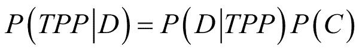
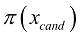
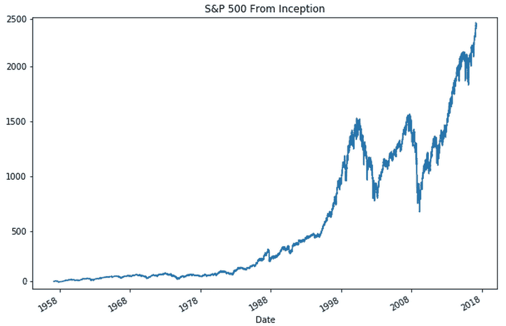

# 第十章：贝叶斯推断与概率编程

数学是一个广阔的领域，人类迄今为止只绘制了其中的一小部分。我们知道数学中有无数个领域我们希望访问，但这些领域在计算上是不可处理的。

牛顿物理学以及大量量化金融学建立在优雅但过于简化的模型上的一个主要原因是这些模型易于计算。几个世纪以来，数学家们在数学宇宙中绘制出一条条小路，他们可以用笔和纸沿着这些小路走。然而，这一切随着现代高性能计算的出现发生了变化。它解锁了我们探索更广阔数学空间的能力，从而获得了更精确的模型。

本书的最后一章，你将学习以下内容：

+   贝叶斯公式的经验推导

+   马尔可夫链蒙特卡洛方法的原理与作用

+   如何使用 PyMC3 进行贝叶斯推断和概率编程

+   各种方法如何应用于随机波动性模型

本书大致涵盖了深度学习及其在金融行业的应用。正如我们所见，深度学习已经通过现代计算能力变得实用，但它并不是唯一从这一巨大计算能力提升中受益的技术。

贝叶斯推断和概率编程是两种新兴的技术，它们最近的进展得益于计算能力的提升。尽管该领域的进展获得的媒体关注远远低于深度学习，但它们可能对金融从业者来说更为有用。

贝叶斯模型是可解释的，并且能够自然地表达不确定性。它们不再是“黑箱”，而是使模型构建者的假设更加明确。

# 贝叶斯推断的直观指南

在开始之前，我们需要导入`numpy`和`matplotlib`，可以通过运行以下代码来实现：

```py
import numpy as np
import matplotlib.pyplot as plt% matplotlib inline
```

这个例子类似于 2015 年由卡梅隆·戴维森-皮隆（Cameron Davidson-Pilon）撰写的《*Bayesian Methods for Hackers: Probabilistic Programming and Bayesian Inference*》一书中的例子。然而，在我们的例子中，它被适应到金融背景中，并且重新编写，使得数学概念通过代码自然而然地呈现出来。

### 注意

**注意**：你可以通过以下链接查看该示例：[`camdavidsonpilon.github.io/Probabilistic-Programming-and-Bayesian-Methods-for-Hackers/`](http://camdavidsonpilon.github.io/Probabilistic-Programming-and-Bayesian-Methods-for-Hackers/)。

假设你有一个证券，其支付金额可能是$1 或，另外，什么也不支付。支付取决于一个两步过程。在 50%的概率下，支付是随机的，50%的机会获得$1，另外 50%的机会什么也得不到。获得$1 的 50%概率就是**真实支付概率**（**TPP**），*x*。

这个支付方案在下图中进行了可视化：


支付方案

你有兴趣了解真实的回报比例，因为它将影响你的交易策略。在我们的案例中，你的老板允许你购买 100 单位的证券。你这样做了，100 个证券中有 54 个给你支付了 1 美元。

但实际的 TPP 是什么呢？在这种情况下，有一个解析解来计算最可能的 TPP，但我们将使用一种计算方法，它也适用于更复杂的情况。

在下一部分中，我们将模拟证券的回报过程。

## 平坦先验

变量*x*代表 TPP。我们随机抽取 100 个真实值，如果你在真实回报下获得了美元，则为 1，否则为 0。我们还会在前述方案中对**开始**和**随机回报**进行随机抽样。尽管并非所有结果都需要，但一次性抽样所有试验的随机结果在计算上更加高效。

最后，我们总结所有的回报，并将其除以模拟中的证券数量，从而获得模拟中的回报份额。

以下代码片段运行一次模拟。然而，重要的是确保你理解这些计算是如何从我们的证券结构推导出来的：

```py
def run_sim(x):
    truth = np.random.uniform(size=100) < x
    first_random = np.random.randint(2,size=100)
    second_random = np.random.randint(2,size=100)
    res = np.sum(first_random*truth + (1-first_random)*second_random)/100
    return res
```

接下来，我们希望尝试一些可能的 TPP。因此，在我们的案例中，我们会抽取一个候选 TPP，并用候选概率运行模拟。如果模拟输出与我们在现实中观察到的回报相同，那么我们的候选就是一个真实的可能性。

以下的采样方法返回真实的可能性，或者如果它尝试的候选不合适，则返回`None`：

```py
def sample(data = 0.54):
    x = np.random.uniform()
    if run_sim(x) == data:
        return x
```

由于我们需要抽样许多可能的 TPP，因此加速这一过程是很自然的。为此，我们可以使用一个名为`JobLib`的库，它将帮助进行并行执行。

### 注意

**注意**：`JobLib`已预安装在 Kaggle 内核中。欲了解更多信息，可以访问[`joblib.readthedocs.io/en/latest/`](https://joblib.readthedocs.io/en/latest/)。

为此，我们需要导入`Parallel`类，它将帮助我们并行运行循环，以及`delayed`方法，它有助于在并行循环内按顺序执行函数。我们可以通过运行以下代码导入它们：

```py
from JobLib import Parallel, delayed
```

细节对这个例子来说并不重要，但`Parallel(n_jobs=-1)`方法会让任务运行时并行执行的次数与机器上的 CPU 数量相同。例如，`delayed(sample)() for i in range(100000)`会执行`sample`方法 100,000 次。

我们得到一个 Python 列表` t`，然后将其转换为 NumPy 数组。正如下面的代码片段所示，数组中大约 98%的值是`None`。这意味着采样器尝试的 98%的*x*值没有得到与我们数据相符的结果：

```py
t = Parallel(n_jobs=-1)(delayed(sample)() for i in range(100000))
t = np.array(t,dtype=float)
share = np.sum(np.isnan(t))/len(t)*100
print(f'{share:.2f}% are throwaways')
```

```py
98.01% are throwaways

```

因此，我们现在会丢弃所有的`None`值，留下可能的*x*值：

```py
t_flat = t[~np.isnan(t)]
plt.hist(t_flat, bins=30,density=True)
plt.title('Distribution of possible TPPs')
plt.xlim(0,1);
```

执行此代码后，我们将得到如下输出：


我们的天真采样器找到的可能真实回报概率的分布

如你所见，这里有一个 *分布*，表示可能的 TPP。这张图展示给我们的是，最可能的 TPP 大约在 50% 到 60% 之间；尽管其他值也有可能，但它们相对不太可能。

你刚刚看到的是贝叶斯方法的一个重大优势。所有的估计都以分布的形式呈现，我们可以基于这些分布计算置信区间，或者在贝叶斯术语中称为可信区间。

这使我们能够更精确地知道我们对事物的确定程度，以及我们模型中其他参数可能的值。回到我们在金融领域的兴趣，金融应用中，数百万资金押注于模型的输出，因此量化这种不确定性变得非常有利。

## <50% 先验

到此时，你已经能够将你的结果交给你的老板，他是你所交易证券的领域专家。他查看了你的分析后摇了摇头，说，*“TPP 不可能超过 0.5。”* 他解释道，*“从底层业务来看，超过这个值是物理上不可能的。”*

那么，如何将这个事实融入到你的模拟分析中呢？直接的解决方案是只尝试从 0 到 0.5 的候选 TPP。你需要做的就是限制你采样 *x* 值的空间，这可以通过运行以下代码实现：

```py
def sample(data = 0.54):
    x = np.random.uniform(low=0,high=0.5)
    if run_sim(x) == data:
        return x
```

现在你可以像以前一样运行模拟：

```py
t = Parallel(n_jobs=-1)(delayed(sample)() for i in range(100000))
t = np.array(t,dtype=float)
# Optional
share = np.sum(np.isnan(t))/len(t)*100
print(f'{share:.2f}% are throwaways')
```

```py
99.10% are throwaways

```

```py
t_cut = t[~np.isnan(t)]
plt.hist(t_cut, bins=15,density=True)
plt.title('Distribution of possible TPPs')
plt.xlim(0,1);
```

就像之前一样，这将给我们以下输出：


从 0 到 0.5 的可能 TPP 分布

## 先验和后验

很明显，你选择的尝试值影响了你的模拟分析结果；它也反映了你对 *x* 可能值的信念。

第一次，你相信在看到任何数据之前，所有介于 0 和 100% 之间的 TPP 都是同样可能的。这叫做平坦先验，因为所有值的分布是相同的，因此是平的。第二次，你相信 TPP 必须低于 50%。

在看到数据之前，你对 *x* 的信念所表示的分布叫做先验分布，*P*(*TPP*)，简称先验。而通过模拟得到的 *x* 的可能值分布，即在看到数据 *D* 之后，叫做后验分布，，简称后验。

接下来的图展示了在第一次和第二次轮次中先验和后验的样本。第一张图展示了使用 `平坦` 后验的结果：

```py
flat_prior = np.random.uniform(size=1000000)
plt.hist(flat_prior,bins=10,density=True, label='Prior')
plt.hist(t_flat, bins=30,density=True, label='Posterior')
plt.title('Distribution of $x$ with no assumptions')
plt.legend()
plt.xlim(0,1);
```

这产生了以下图表：


我们的采样器在平坦先验下的结果

下一个图显示了我们使用 <50% 先验的采样器输出：

```py
cut_prior = np.random.uniform(low=0,high=0.5,size=1000000)
plt.hist(cut_prior,bins=10,density=True, label='Prior')
plt.hist(t_cut, bins=15,density=True, label='Posterior')
plt.title('Distribution of $x$ assuming TPP <50%')
plt.legend()
plt.xlim(0,1);
```

虽然仍然是相同的采样器，但你可以看到结果有很大不同：


我们的采样器在 <50% 先验下的结果

你注意到什么奇怪的吗？第二轮的后验值大致等于第一轮的后验值，但这里它们在 0.5 处被截断。这是因为第二轮的先验值在 0.5 以上为 0，其他地方为 1。

由于我们只保留与数据匹配的模拟结果，直方图中显示的保留模拟结果的数量反映了对于给定的 TPP，*C*，产生观察数据*D*的模拟的概率，。

我们从模拟中获得的后验概率，，等于我们尝试给定 TPP 时观察到数据的概率，，乘以概率，*P*(*TPP*)。

从数学上讲，这可以表示为以下公式：


当数据是自然获得的，例如通过面对面会议时，我们可能需要考虑数据收集方法中的偏差。大多数时候，我们不需要担心这个问题，可以直接忽略，但有时测量可能会放大某些结果。

为了缓解这个问题，我们将通过数据分布进行除法运算，，作为我们后验公式的最终附加项，得到以下公式：


如你所见，这是贝叶斯公式！在运行我们的模拟时，我们是从后验分布中进行抽样。那么，为什么我们不能直接使用贝叶斯公式来计算后验分布呢？简单的答案是因为评估


需要对*TPP*进行积分，这在计算上是不可行的。作为替代方案，我们的模拟方法提供了一种简单且方便的解决方法。

### 注意

**注意**：第一轮的先验（所有 TPP 的可能性相等）称为“平坦先验”，因为我们没有对值的分布做出任何假设。在这种情况下，贝叶斯后验等于最大似然估计。

## 马尔可夫链蒙特卡洛

在前一部分中，我们通过从先验中随机抽样并尝试所抽样的值来近似后验分布。如果我们的模型只有一个参数，例如 TPP，那么这种随机尝试方法工作得很好。然而，随着模型的复杂度增加，加入更多参数时，随机搜索方法将变得更加缓慢。

最终，会有太多可能的参数组合无法生成我们的数据。因此，我们需要引导我们的搜索，并更频繁地抽样具有更高后验概率的参数。

引导但仍然随机的抽样方法称为“马尔可夫链蒙特卡洛算法”。“蒙特卡洛”部分意味着涉及了随机性和模拟，而“马尔可夫链”意味着我们在一定的概率下遍历参数空间。

在这里介绍的具体算法中，我们将以某个参数值的后验概率的比例移动到另一个参数值。在这里，我们将考虑移动到该参数值的后验概率。由于概率不能大于 1，我们将比例限制为 1，但这只是一个数学上的有限值，对于算法本身并没有太大影响。

以下图表展示了马尔可夫链蒙特卡洛算法的基本工作原理：


马尔可夫链蒙特卡洛算法

图像所示的是我们正在进行一场“随机漫步”，在这过程中，我们或多或少地随机地遍历不同的参数值。然而，我们并不是*完全*随机地移动，而是更倾向于那些具有高后验概率的参数值。

为了执行此算法，我们需要做四件事：

1.  从当前的参数值*x*提出一个新的参数值。

1.  估计和的后验概率。我们可以使用贝叶斯定理来计算这个。

1.  计算移动到该新参数值的概率（记住，概率必须小于 1）：

1.  以概率移动到新的参数值。

下一步是一步步构建这些组件：

```py
# REPETITION FROM FIRST SECTION
def run_sim(x):
    truth = np.random.uniform(size=100) < x
    first_random = np.random.randint(2,size=100)
    second_random = np.random.randint(2,size=100)
    res = np.sum(first_random*truth + (1-first_random)*second_random)/100
    return res
# REPETITION FROM FIRST SECTION
def sample(x,data = 0.54):
    if run_sim(x) == data:
        return x
```

首先，我们需要提出一个新的*X[c]*。这个值必须依赖于*x*的先前值，因为我们不希望进行盲目的随机搜索，而是希望进行更精细的随机漫步。在这种情况下，我们将从一个均值为*x*、标准差为 0.1 的正态分布中采样*x[cand]*。

也可以从其他分布或使用其他标准差进行采样，只要*x[cand]*与*x*相关：

```py
def propose(x):
    return np.random.randn() * 0.1 + x
```

在第一部分，通过从先验中采样并运行模拟，我们直接从后验中采样。由于我们现在通过我们提出的方法进行采样，因此不再直接从后验中采样。因此，为了计算后验概率，我们将使用贝叶斯定理。

记住，我们通常不需要除以*P*(*D*)，因为我们不假设有偏的测量。贝叶斯定理简化为，其中是后验，*P*(*TPP*)是先验，是似然性。因此，为了估计某个参数值*x*的似然性，我们需要进行若干次使用该参数的模拟。

似然性是与我们数据匹配的模拟比例：

```py
def likelihood(x):
    t = Parallel(n_jobs=-1)(delayed(sample)(x) for i in range(10000))
    t = np.array(t,dtype=float)
    return (1 - np.sum(np.isnan(t))/len(t))
```

首先，我们将再次使用一个平坦的先验；每个 TPP 的可能性是相等的：

```py
def prior(x):
    return 1 #Flat prior
```

参数值*x*的后验概率是似然与先验的乘积：

```py
def posterior(x):    
    return likelihood(x) * prior(x)
```

现在我们准备将所有内容整合到 Metropolis-Hastings MCMC 算法中！

首先，我们需要为*x*设置一些初始值。为了使算法能够快速找到可能的值，合理的做法是将其初始化为最大似然值或我们认为可能的某个估计值。我们还需要计算这个初始值的后验概率，这可以通过运行以下代码来完成：

```py
x = 0.5
pi_x = posterior(x)
```

同样，我们需要跟踪所有在轨迹中采样的值。为了展示，我们还将跟踪后验概率。为此，我们将运行以下代码：

```py
trace = [x]
pi_trace = [pi_x]
```

现在我们进入主循环。不过，在我们进行之前，重要的是要记住算法包括四个步骤：

1.  提议一个新的候选值*x[cand]*

1.  计算后验概率：

1.  计算接受概率：

1.  将*x*设置为*X[C]*，并具有概率，：

    ```py
    for i in range(1000): #Main Loop

        x_cand = propose(x)

        pi_x_cand = posterior(x_cand)

        alpha = np.min([1,pi_x_cand/(pi_x + 0.00001)]) # Save division

        u = np.random.uniform() 

        (x, pi_x) = (x_cand,pi_x_cand) if u<alpha else (x,pi_x)
        trace.append(x)
        pi_trace.append(pi_x)

        if i % 10 == 0:
            print(f'Epoch {i}, X = {x:.2f}, pi = {pi_x:.2f}')
    ```

```py
Epoch 0, X = 0.50, pi = 0.00Epoch 10, X = 0.46, pi = 0.04...Epoch 990, X = 0.50, pi = 0.06g

```

在运行这个算法若干个周期后，我们最终会得到一个可能的作弊份额及其回报的分布。像之前做的那样，我们可以简单地运行以下代码来可视化这个结果：

```py
plt.hist(trace,bins=30)
plt.title('Metropolis Hastings Outcome')
plt.xlim(0,1);
```

一旦我们运行了之前的代码，我们将得到以下图形作为输出：


Metropolis Hastings 采样器的结果

通过查看随时间变化的轨迹，显示了算法如何随机移动，但围绕高可能值集中：

```py
plt.plot(trace)
plt.title('MH Trace');
```

然后，我们将得到一个输出，形式为图表，展示**Metropolis Hasings**（**MH**）采样器的轨迹：


Metropolis Hastings 采样器的轨迹

为了更好地理解，我们可以绘制试验值的后验概率：

```py
plt.scatter(x=trace,y=pi_trace)
plt.xlabel('Proposed X')
plt.ylabel('Posterior Probability')
plt.title('X vs Pi');
```

在成功执行代码后，我们将得到以下图表作为输出：


提议的值与后验概率

## Metropolis-Hastings MCMC

为了展示 PyMC3 的强大功能和灵活性，我们将用它来完成一个经典的计量经济学任务，但我们将为其加上贝叶斯的视角。

### 注意

**注意**：这个例子是直接改编自 PyMC3 文档中的一个示例：[`docs.pymc.io/notebooks/stochastic_volatility.html`](https://docs.pymc.io/notebooks/stochastic_volatility.html)。而这个示例又是改编自 Hoffman 2011 年论文中的一个示例，*No-U-Turn Sampler*，可以在此获取：[`arxiv.org/abs/1111.4246`](https://arxiv.org/abs/1111.4246)。

股票价格和其他金融资产价格会波动，日收益率的方差称为波动性。波动性是常用的风险度量，因此准确衡量它非常重要。

这里的简单解决方案是计算一个回溯的回报方差。然而，表达对实际波动率的不确定性是有益的。类似于我们之前看到的收益示例，存在一个“实际”值的分布，真实值是从中抽取的。这也称为“随机波动率”，因为有一个可能的波动率值分布，而观察到的波动率是从中获得的一个实现样本。

在这种情况下，我们有兴趣建立 S&P 500 的随机波动率模型，即美国股市指数。为此，我们必须首先加载数据。你可以直接从雅虎财经下载，或者在 Kaggle 上找到，网址为[`www.kaggle.com/crescenzo/sp500`](https://www.kaggle.com/crescenzo/sp500)。

要加载数据，请运行以下代码：

```py
df = pd.read_csv('../input/S&P.csv')
df['Date'] = pd.to_datetime(df['Date'])
```

在我们正在查看的示例中，我们对收盘价感兴趣，因此需要从数据集中提取收盘价。数据集显示的是最新数据，所以我们需要将其反转，使用以下代码可以实现：

```py
close = pd.Series(df.Close.values,index=pd.DatetimeIndex(df.Date))
close = close[::-1]
```

当我们绘制收盘价时（在接下来的代码中），通过输出的图形，我们会看到一个熟悉的图表：

```py
close.plot(title='S&P 500 From Inception');
```

```py
SP500

```

结果，我们将获得以下图表作为输出：



从创立到 2018 年底的 S&P 500

数据集包含自 S&P 500 创立以来的所有数据，对我们来说有些过多，因此我们将在我们的情况下将数据截取至 1990 年。我们可以通过运行以下命令来指定这一日期：

```py
close = close['1990-01-01':]
```

由于我们对回报感兴趣，我们需要计算价格差异。我们可以使用`np.diff`来获取每日价格差异。我们将把整个过程打包成一个 pandas 序列，方便绘图：

```py
returns = pd.Series(np.diff(close.values),index=close.index[1:])
returns.plot();
```

这将给我们以下图表：


S&P 500 从 1990 年到 2018 年底的回报率

现在，PyMC3 的乐趣开始了。PyMC3 包括一些专门处理时间序列的分布，例如随机游走。这正是我们在建模股票价格时需要使用的。

首先，我们需要导入 PyMC3 及其时间序列工具——随机游走类：

```py
import pymc3 as pm
from pymc3.distributions.timeseries import GaussianRandomWalk
```

然后最后，我们需要设置模型。我们可以通过运行以下代码来实现这一点：

```py
with pm.Model() as model:
    step_size = pm.Exponential('sigma', 50.)      #1
    s = GaussianRandomWalk('s', sd=step_size,     #2
                           shape=len(returns))

    nu = pm.Exponential('nu', .1)                 #3

    r = pm.StudentT('r', nu=nu,                   #4
                    lam=pm.math.exp(-2*s),
                    observed=returns.values)
```

现在，让我们看看我们刚刚执行的命令，以便设置模型。如你所见，它由四个关键元素组成：

1.  波动率` s `被建模为一个随机游走，其中包含一个基本的步长` step_size`。我们对步长的先验是一个指数分布，使用了（再次强调，理解每个分布的细节并非本演示的必要内容）。

1.  然后，我们对随机波动率本身进行建模。请注意，我们将步长插入模型中，而步长本身是一个随机变量。随机游走应与观察到的回报值的长度相同。

1.  我们将实际的股票回报建模为来自`StudentT`分布，且具有`nu`个自由度。我们的`nu`的先验也是一个指数分布。

1.  最后，我们可以开始建模实际的回报。我们将其建模为来自`StudentT`分布，具有缩放因子

    （或在代码中为`lam`）由我们的随机波动模型生成。为了将模型与观察到的数据相结合，我们传递观察到的回报值。

PyMC3 的标准采样器不是 Metropolis Hastings，而是**无转弯采样器**（**NUTS**）。如果我们没有指定采样器，PyMC3 会默认使用 NUTS，只需调用`sample`。

为了使采样顺利进行，我们需要指定一个相对较高的`tune`样本数。这些是采样器用来找到一个良好起点的样本，这些样本不会成为后验的一部分，类似于之前的“烧毁样本”。

我们还需要告诉 NUTS 在接受值时要宽松一些，通过设置较高的`target_accept`值来实现这一点。我们可以通过运行以下代码来做到这一点：

```py
with model:
    trace = pm.sample(tune=2000, nuts_kwargs=dict(target_accept=.9))
```

PyMC3 有一个很好的工具，可以用来可视化采样结果。我们对波动随机游走的标准差感兴趣，，以及`StudentT`分布的自由度，从中抽取实际的回报。

由于我们并行运行了两个链，因此可以看到我们得到了两个不同的输出分布。如果我们运行采样器更长时间，这两个结果将会收敛。通过对它们取平均值，我们可以获得更好的估计，这正是 PyMC3 在进行预测时的做法。例如，现在我们可以通过以下代码来尝试：

```py
pm.traceplot(trace, varnames=['sigma', 'nu']);
TracePlot
```

该代码的结果将通过以下图表展示：


PyMC3 采样器的结果概述。左侧可以看到由两个采样器链生成的分布，右侧可以看到它们的轨迹。

在最后一步，我们可以展示随机波动随时间的变化情况。你可以看到它如何与波动较大的时期（例如 2008 年金融危机）很好地对齐。你还可以看到模型在某些时期对于波动的确定性较强或较弱：

```py
plt.plot(returns.values)
plt.plot(np.exp(trace[s].T), 'r', alpha=.03);
plt.xlabel('time')
plt.ylabel('returns')
plt.legend(['S&P500', 'Stochastic Vol.']);
```

如我们所见，代码的输出将返回我们下面看到的图表：


从 1990 年到 2018 年底的随机波动推断

有大量应用可以通过这种相对较小的贝叶斯模型很好地建模。主要的优点是这些模型易于解释，并且能够很好地表达不确定性。概率编程与数据科学中的“讲故事”方法非常契合，因为故事在模型中得到了清晰的表达。

在下一节中，我们将从浅层概率编程过渡到深度概率编程。

## 从概率编程到深度概率编程

到目前为止，我们所开发的贝叶斯模型都相当浅显。那么，是否可以将深度网络的预测能力与贝叶斯模型的优势结合起来呢？这是一个活跃的研究领域，也是本书的一个合适结尾。

深度网络有大量的参数，这使得在参数空间中进行搜索成为一个困难的问题。在传统的监督深度学习中，我们会使用反向传播来解决这个问题。反向传播也可以用于贝叶斯模型。然而，这并不是唯一的方法，甚至不一定是做贝叶斯深度学习的最佳方式。

总的来说，进行贝叶斯深度学习有四种方式：

+   使用**自动微分变分推断**（**AVI**）。这意味着通过引导模型来近似后验分布，然后使用梯度下降法优化模型参数。PyMC3 可以使用 AVI 优化器来实现这一点。请参阅由 Alp Kucukelbir 等人于 2016 年发布的论文，*自动微分变分推断*，网址：[`arxiv.org/abs/1603.00788`](https://arxiv.org/abs/1603.00788)。

+   或者，你可以使用 Pyro，它实现了快速的、GPU 优化的 AVI，你可以在这里查看：[`pyro.ai/`](http://pyro.ai/)。

+   虽然在这里提供一个详尽的教程会过于冗长，但 PyMC3 文档中有一个很好的教程：[`docs.pymc.io/ notebooks/bayesian_neural_network_advi.html`](https://docs.pymc.io/%20notebooks/bayesian_neural_network_advi.html)。

+   假设后验值服从正态分布，然后使用标准神经网络库（如 Keras）学习每个参数的均值和标准差。记得我们在处理变分自编码器时如何从参数化的正态分布中抽取*z*值吗？我们可以对每一层进行类似的操作。这种方法训练速度较快，所需计算能力和内存少于 AVI，但灵活性较差，并且拥有比非贝叶斯神经网络多两倍的参数。

+   使用 dropout 技巧。在处理时间序列时，我们在测试时启用了 dropout，并多次运行推断以获取置信区间。这是一种非常容易实现的贝叶斯学习方式，它的参数数量与普通神经网络相同，但推断时速度较慢，并且没有 AVI 那么灵活。

+   混合选择。为了训练神经网络，我们需要一个梯度信号，这可以通过 AVI 获得。我们可以常规地训练神经网络的部分（有时称为特征提取器），而网络的头部则以贝叶斯方式进行训练。这样，我们在不需要支付贝叶斯方法全部成本的情况下，仍然能够获得不确定性估计。

# 总结

在本章中，你简要了解了现代贝叶斯机器学习及其在金融中的应用。我们仅仅触及了这一领域，因为它是一个非常活跃的研究领域，预计在不久的将来会有许多突破。观察其发展并将其应用带入生产将是非常激动人心的。

回顾这一章，我们应该对以下内容有信心：

+   贝叶斯公式的经验推导

+   马尔可夫链蒙特卡洛如何以及为何有效

+   如何使用 PyMC3 进行贝叶斯推断和概率编程

+   这些方法如何应用于随机波动率模型

请注意，你在这里学到的一切也可以转移到更大的模型中，比如我们在整本书中讨论的深度神经网络。对于非常大的模型，采样过程仍然有些慢，但研究人员正在积极工作以加快速度，而你所学到的内容为未来奠定了坚实的基础。

# 告别

因此，我们结束了这段旅程的最后一章，向你告别，亲爱的读者。让我们回顾一下我们在旅程开始时遇到的目录。

在过去的 10 章中，我们涵盖了很多内容，包括以下内容：

+   基于梯度下降的优化

+   特征工程

+   基于树的方法

+   计算机视觉

+   时间序列模型

+   自然语言处理

+   生成模型

+   调试机器学习系统

+   机器学习中的伦理

+   贝叶斯推断

在每一章中，我们创建了一个包含大量实用技巧和窍门的大袋子，你可以使用它们。这将使你能够构建最先进的系统，从而改变金融行业。

然而，在许多方面，我们仅仅触及了表面。每个章节的话题都值得单独成书，即便如此，也无法充分涵盖关于金融领域中机器学习的所有内容。

我留给你这个思考：金融领域中的机器学习是一个令人兴奋的领域，还有很多未解之谜，因此，亲爱的读者，继续前进吧；有模型需要训练，数据需要分析，还有推断需要做！

# 进一步阅读

你已经读完了这本书！接下来你打算做什么？阅读更多的书！机器学习，特别是深度学习，是一个快速发展的领域，因此任何阅读清单在你阅读时都可能已经过时。然而，以下清单旨在向你展示一些最相关的书籍，这些书籍具有在未来几年内仍然保持相关性的安全网。

## 一般数据分析

Wes McKinney, *《Python 数据分析》*, [`wesmckinney.com/pages/book.html`](http://wesmckinney.com/pages/book.html)。

Wes 是 pandas 的原创者，pandas 是一个流行的 Python 数据处理工具，我们在第二章中看到过。*将机器学习应用于结构化数据*。pandas 是 Python 中任何数据科学工作流的核心组成部分，并将在可预见的未来继续如此。投资于他所介绍工具的扎实知识绝对值得你花时间。

## 机器学习中的可靠科学

Marcos Lopez de Prado，*金融机器学习进展*，[`www.wiley.com/en-us/Advances+in+Financial+Machine+Learning-p-9781119482086`](https://www.wiley.com/en-us/Advances+in+Financial+Machine+Learning-p-9781119482086)。

Marcos 是将机器学习应用于金融领域的专家。他的书主要集中在过拟合的危险性以及研究人员在做出正确科学时需要非常小心。虽然更多地关注高频交易，Marcos 写得非常清晰，并使潜在问题和解决方案非常易于理解。

## 通用机器学习

Trevor Hastie，Robert Tibshirani 和 Jerome Friedman，*统计学习的元素*，[`web.stanford.edu/~hastie/ElemStatLearn/`](https://web.stanford.edu/~hastie/ElemStatLearn/)。

统计机器学习的“圣经”，包含了所有重要概念的良好解释。这本书最好作为查阅书籍，随时需要深入了解某个概念时参考。

Gareth James，Daniela Witten，Trevor Hastie 和 Robert Tibshirani，*统计学习入门*，[`www-bcf.usc.edu/~gareth/ISL/`](https://www-bcf.usc.edu/~gareth/ISL/)。

*统计学习入门*有点像*统计学习的元素*的配套书。由一些相同的作者编写，它以严谨的方式介绍了统计学习中的最重要概念。如果你是统计学习的新手，这是理想之选。

## 通用深度学习

Ian Goodfellow，Yoshua Bengio 和 Aaron Courville，*深度学习*，[`www.deeplearningbook.org/`](https://www.deeplearningbook.org/)。

尽管这本书非常注重实践，但*深度学习*更多地聚焦于深度学习背后的理论。它涵盖了广泛的主题，并从理论概念中推导出实际应用。

## 强化学习

Richard S. Sutton 和 Andrew G. Barto，*强化学习：导论*，[`incompleteideas.net/book/the-book-2nd.html`](http://incompleteideas.net/book/the-book-2nd.html)。

强化学习的标准著作深入讨论了所有主要算法。重点不在于炫目的结果，而在于强化学习算法背后的推理和推导。

## 贝叶斯机器学习

Kevin P. Murphy，*机器学习：一种概率视角*，[`www.cs.ubc.ca/~murphyk/MLbook/`](https://www.cs.ubc.ca/~murphyk/MLbook/)。

本书从概率论和更加贝叶斯的角度讲解机器学习技术。如果你想用不同的方式思考机器学习，这本书是一个非常好的指南。

Cameron Davidson-Pilon，*《黑客的概率编程与贝叶斯方法》*，[`camdavidsonpilon.github.io/Probabilistic-Programming-and-Bayesian-Methods-for-Hackers/`](http://camdavidsonpilon.github.io/Probabilistic-Programming-and-Bayesian-Methods-for-Hackers/)。

这可能是唯一一本专注于实际应用的概率编程书籍。它不仅是免费且开源的，而且经常更新新库和工具，确保始终保持相关性。
