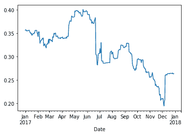
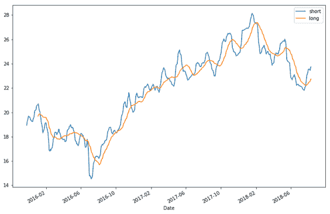
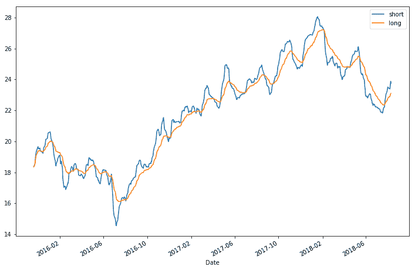

# 第一章：使用 Python 进行金融分析概述

自从我之前的书《精通 Python 金融》出版以来，Python 本身和许多第三方库都有了重大升级。许多工具和功能已被弃用，取而代之的是新的工具和功能。本章将指导您如何获取最新的可用工具，并准备本书其余部分将使用的环境。

本书中涵盖的大部分数据集将使用 Quandl。Quandl 是一个提供金融、经济和替代数据的平台。这些数据来源于各种数据发布者，包括联合国、世界银行、中央银行、交易所、投资研究公司，甚至 Quandl 社区的成员。通过 Python Quandl 模块，您可以轻松下载数据集并进行金融分析，以得出有用的见解。

我们将使用`pandas`模块探索时间序列数据操作。`pandas`中的两个主要数据结构是 Series 对象和 DataFrame 对象。它们可以一起用于绘制图表和可视化复杂信息。本章将涵盖金融时间序列计算和分析的常见方法。

本章的目的是为您设置工作环境，使用本书中将使用的库。多年来，像任何软件包一样，`pandas`模块已经发生了巨大的演变，许多重大变化。多年前编写的代码与旧版本的`pandas`接口将不再起作用，因为许多方法已被弃用。本书中使用的`pandas`版本是 0.23。本书中编写的代码符合这个版本的`pandas`。

在本章中，我们将涵盖以下内容：

+   为您的环境设置 Python、Jupyter、Quandl 和其他库

+   从 Quandl 下载数据集并绘制您的第一个图表

+   绘制最后价格、成交量和蜡烛图

+   计算和绘制每日百分比和累积收益

+   绘制波动率、直方图和 Q-Q 图

+   可视化相关性并生成相关矩阵

+   可视化简单移动平均线和指数移动平均线

# 获取 Python

在撰写本文时，最新的 Python 版本是 3.7.0。您可以从官方 Python 网站[`www.python.org/downloads/`](https://www.python.org/downloads/)下载 Windows、macOS X、Linux/UNIX 和其他操作系统的最新版本。按照安装说明在您的操作系统上安装基本的 Python 解释器。

安装过程应该将 Python 添加到您的环境路径中。要检查已安装的 Python 版本，请在 macOS X/Linux 上的终端中输入以下命令，或者在 Windows 上的命令提示符中输入以下命令：

```py
$ python --version
Python 3.7.0
```

为了方便安装 Python 库，考虑使用 Anaconda（[`www.anaconda.com/download/`](https://www.anaconda.com/download/)）、Miniconda（[`conda.io/miniconda.html`](https://conda.io/miniconda.html)）或 Enthought Canopy（[`www.enthought.com/product/enthought-python-distribution/`](https://www.enthought.com/product/enthought-python-distribution/)）等一体化 Python 发行版。然而，高级用户可能更喜欢控制哪些库与他们的基本 Python 解释器一起安装。

# 准备虚拟环境

此时，建议设置 Python 虚拟环境。虚拟环境允许您管理特定项目所需的单独包安装，隔离其他环境中安装的包。

要在终端窗口中安装虚拟环境包，请输入以下命令：

```py
$ pip install virtualenv
```

在某些系统上，Python 3 可能使用不同的`pip`可执行文件，并且可能需要通过替代的`pip`命令进行安装；例如：`$ pip3 install virtualenv`。

要创建虚拟环境，请转到项目目录并运行`virtualenv`。例如，如果您的项目文件夹的名称是`my_project_folder`，请输入以下内容：

```py
$ cd my_project_folder
$ virtualenv my_venv
```

`virtualenv my_venv`将在当前工作目录中创建一个文件夹，其中包含您之前安装的基本 Python 解释器的 Python 可执行文件，以及`pip`库的副本，您可以使用它来安装其他软件包。

在使用新的虚拟环境之前，需要激活它。在 macOS X 或 Linux 终端中，输入以下命令：

```py
$ source my_venv/bin/activate
```

在 Windows 上，激活命令如下：

```py
$ my_project_folder\my_venv\Scripts\activate
```

当前虚拟环境的名称现在将显示在提示的左侧（例如，`(my_venv) current_folder$`），以让您知道所选的 Python 环境已激活。从同一终端窗口进行的软件包安装将放在`my_venv`文件夹中，与全局 Python 解释器隔离开来。

虚拟环境可以帮助防止冲突，如果您有多个应用程序使用相同模块但来自不同版本。这一步（创建虚拟环境）完全是可选的，因为您仍然可以使用默认的基本解释器来安装软件包。

# 运行 Jupyter Notebook

Jupyter Notebook 是一个基于浏览器的交互式计算环境，用于创建、执行和可视化各种编程语言的交互式数据。它以前被称为**IPython** Notebook。IPython 仍然存在作为 Python shell 和 Jupyter 的内核。Jupyter 是一个开源软件，所有人都可以免费使用和学习各种主题，从基本编程到高级统计学或量子力学。

要安装 Jupyter，在终端窗口中输入以下命令：

```py
$ pip install jupyter
```

安装后，使用以下命令启动 Jupyter：

```py
$ jupyter notebook 
... 
Copy/paste this URL into your browser when you connect for the first time, to login with a token: 
 http://127.0.0.1:8888/?token=27a16ee4d6042a53f6e31161449efcf7e71418f23e17549d
```

观察您的终端窗口。当 Jupyter 启动时，控制台将提供有关其运行状态的信息。您还应该看到一个 URL。将该 URL 复制到 Web 浏览器中，即可进入 Jupyter 计算界面。

由于 Jupyter 在您发出前面的命令的目录中启动，Jupyter 将列出工作目录中所有保存的笔记本。如果这是您在该目录中工作的第一次，列表将为空。

要启动您的第一个笔记本，请选择 New，然后选择 Python 3。一个新的 Jupyter Notebook 将在新窗口中打开。今后，本书中的大多数计算将在 Jupyter 中进行。

# Python Enhancement Proposal

Python 编程语言中的任何设计考虑都被记录为**Python Enhancement Proposal**（**PEP**）。已经编写了数百个 PEP，但您可能应该熟悉的是**PEP** **8**，这是 Python 开发人员编写更好、更可读代码的风格指南。PEP 的官方存储库是[`github.com/python/peps`](https://github.com/python/peps)。

# 什么是 PEP？

PEP 是一系列编号的设计文档，描述与 Python 相关的特性、过程或环境。每个 PEP 都在一个文本文件中进行精心维护，包含特定特性的技术规范及其存在的原因。例如，PEP 0 用作所有 PEP 的索引，而 PEP 1 提供了 PEP 的目的和指南。作为软件开发人员，我们经常阅读代码而不是编写代码。为了创建清晰、简洁和可读的代码，我们应该始终使用编码约定作为风格指南。PEP 8 是一组编写 Python 代码的风格指南。您可以在[`www.python.org/dev/peps/pep-0008/`](https://www.python.org/dev/peps/pep-0008/)上了解更多关于 PEP 8 的信息。

# Python 之禅

PEP 20 体现了 Python 之禅，这是一组指导 Python 编程语言设计的 20 个软件原则。要显示这个彩蛋，在 Python shell 中输入以下命令：

```py
>> import this
The Zen of Python, by Tim Peters Beautiful is better than ugly. Explicit is better than implicit. 
Simple is better than complex. 
Complex is better than complicated. 
Flat is better than nested. 
Sparse is better than dense. 
Readability counts. 
Special cases aren't special enough to break the rules. 
Although practicality beats purity. 
Errors should never pass silently. 
Unless explicitly silenced. 
In the face of ambiguity, refuse the temptation to guess. 
There should be one-- and preferably only one --obvious way to do it. 
Although that way may not be obvious at first unless you're Dutch. 
Now is better than never. 
Although never is often better than *right* now. 
If the implementation is hard to explain, it's a bad idea. 
If the implementation is easy to explain, it may be a good idea. 
Namespaces are one honking great idea -- let's do more of those!
```

只显示了 20 条格言中的 19 条。你能猜出最后一条是什么吗？我留给你的想象！

# Quandl 简介

Quandl 是一个提供金融、经济和替代数据的平台。这些数据来源于各种数据发布者，包括联合国、世界银行、中央银行、交易所和投资研究公司。

使用 Python Quandl 模块，您可以轻松地将金融数据集导入 Python。Quandl 提供免费数据集，其中一些是样本。访问高级数据产品需要付费。

# 为您的环境设置 Quandl

`Quandl`包需要最新版本的 NumPy 和`pandas`。此外，我们将在本章的其余部分需要`matplotlib`。

要安装这些包，请在终端窗口中输入以下代码：

```py
$ pip install quandl numpy pandas matplotlib
```

多年来，`pandas`库发生了许多变化。为旧版本的`pandas`编写的代码可能无法与最新版本一起使用，因为有许多已弃用的内容。我们将使用的`pandas`版本是 0.23。要检查您正在使用的`pandas`版本，请在 Python shell 中键入以下命令：

```py
>>> import pandas
>>> pandas.__version__'0.23.3'
```

使用 Quandl 请求数据时需要一个 API（应用程序编程接口）密钥。

如果您没有 Quandl 账户，请按以下步骤操作：

1.  打开浏览器，在地址栏中输入[`www.quandl.com`](https://www.quandl.com/)。这将显示以下页面：


1.  选择注册并按照说明创建一个免费账户。成功注册后，您将会看到您的 API 密钥。

1.  复制此密钥并将其安全地保存在其他地方，因为您以后会需要它。否则，您可以在您的账户设置中再次检索此密钥。

1.  请记住检查您的电子邮件收件箱，查看欢迎消息并验证您的 Quandl 账户，因为继续使用 API 密钥需要验证和有效的 Quandl 账户。

匿名用户每 10 分钟最多可以调用 20 次，每天最多可以调用 50 次。经过身份验证的免费用户每 10 秒最多可以调用 300 次，每 10 分钟最多可以调用 2,000 次，每天最多可以调用 50,000 次。

# 绘制时间序列图表

在图表上可视化时间序列数据是一种简单而有效的分析技术，通过它我们可以推断出某些假设。本节将指导您完成从 Quandl 下载股价数据集并在价格和成交量图上绘制的过程。我们还将介绍绘制蜡烛图表，这将为我们提供比线图更多的信息。

# 从 Quandl 检索数据

从 Quandl 中获取数据到 Python 是相当简单的。假设我们对来自 Euronext 股票交易所的 ABN Amro Group 感兴趣。在 Quandl 中的股票代码是`EURONEXT/ABN`。在 Jupyter 笔记本单元格中，运行以下命令：

```py
In [ ]:
    import quandl

    # Replace with your own Quandl API key
    QUANDL_API_KEY = 'BCzkk3NDWt7H9yjzx-DY' 
    quandl.ApiConfig.api_key = QUANDL_API_KEY
    df = quandl.get('EURONEXT/ABN')
```

将 Quandl API 密钥存储在常量变量中是一个好习惯。这样，如果您的 API 密钥发生变化，您只需要在一个地方更新它！

导入`quandl`包后，我们将 Quandl API 密钥存储在常量变量`QUANDL_API_KEY`中，这将在本章的其余部分中重复使用。这个常量值用于设置 Quandl 模块的 API 密钥，每次导入`quandl`包时只需要执行一次。接下来的一行调用`quandl.get()`方法，将 ABN 数据集从 Quandl 直接下载到我们的`df`变量中。请注意，`EURONEXT`是数据提供者 Euronext 股票交易所的缩写。

默认情况下，Quandl 将数据集检索到`pandas` DataFrame 中。我们可以按以下方式检查 DataFrame 的头和尾：

```py
In [ ]: 
    df.head()
Out[ ]: 
                 Open   High     Low   Last      Volume      Turnover
    Date                                                             
    2015-11-20  18.18  18.43  18.000  18.35  38392898.0  7.003281e+08
    2015-11-23  18.45  18.70  18.215  18.61   3352514.0  6.186446e+07
    2015-11-24  18.70  18.80  18.370  18.80   4871901.0  8.994087e+07
    2015-11-25  18.85  19.50  18.770  19.45   4802607.0  9.153862e+07
    2015-11-26  19.48  19.67  19.410  19.43   1648481.0  3.220713e+07

In [ ]:
    df.tail()
Out[ ]:
                 Open   High    Low   Last     Volume      Turnover
    Date                                                           
    2018-08-06  23.50  23.59  23.29  23.34  1126371.0  2.634333e+07
    2018-08-07  23.59  23.60  23.31  23.33  1785613.0  4.177652e+07
    2018-08-08  24.00  24.39  23.83  24.14  4165320.0  1.007085e+08
    2018-08-09  24.40  24.46  24.16  24.37  2422470.0  5.895752e+07
    2018-08-10  23.70  23.94  23.28  23.51  3951850.0  9.336493e+07
```

默认情况下，`head()`和`tail()`命令将分别显示 DataFrame 的前五行和后五行。您可以通过在参数中传递一个数字来定义要显示的行数。例如，`head(100)`将显示 DataFrame 的前 100 行。

对于`get()`方法没有设置任何额外参数，将检索整个时间序列数据集，从上一个工作日一直回溯到 2015 年 11 月，每天一次。

要可视化这个 DataFrame，我们可以使用`plot()`命令绘制图表：

```py
In [ ]:
    %matplotlib inline
    import matplotlib.pyplot as plt

    df.plot();
```

最后一个命令输出一个简单的图表：


`pandas`的`plot()`方法返回一个 Axes 对象。这个对象的字符串表示形式与`plot()`命令一起打印在控制台上。要抑制这些信息，可以在最后一个语句的末尾添加一个分号(;)。或者，可以在单元格的底部添加一个`pass`语句。另外，将绘图函数分配给一个变量也会抑制输出。

默认情况下，`pandas`中的`plot()`命令使用`matplotlib`库来显示图表。如果出现错误，请检查是否安装了该库，并且至少调用了`%matplotlib inline`。您可以自定义图表的外观和感觉。有关`pandas` DataFrame 中`plot`命令的更多信息，请参阅`pandas`文档[`pandas.pydata.org/pandas-docs/stable/generated/pandas.DataFrame.plot.html`](https://pandas.pydata.org/pandas-docs/stable/generated/pandas.DataFrame.plot.html)。

# 绘制价格和成交量图表

当没有参数提供给`plot()`命令时，将使用目标 DataFrame 的所有列绘制一条线图，放在同一张图上。这会产生一个混乱的视图，无法提供太多信息。为了有效地从这些数据中提取见解，我们可以绘制一个股票的财务图表，显示每日收盘价与交易量的关系。为了实现这一点，输入以下命令：

```py
In [ ]:
    prices = df['Last']
    volumes = df['Volume']
```

上述命令将我们感兴趣的数据分别存储到`closing_prices`和`volumes`变量中。我们可以使用`head()`和`tail()`命令查看生成的`pandas` Series 数据类型的前几行和最后几行：

```py
In [ ]:
    prices.head()
Out[ ]:
    Date
    2015-11-20    18.35
    2015-11-23    18.61
    2015-11-24    18.80
    2015-11-25    19.45
    2015-11-26    19.43
    Name: Last, dtype: float64

In [ ]:
    volumes.tail()
Out[ ]:   
    Date
    2018-08-03    1252024.0
    2018-08-06    1126371.0
    2018-08-07    1785613.0
    2018-08-08    4165320.0
    2018-08-09    2422470.0
    Name: Volume, dtype: float64
```

要找出特定变量的类型，使用`type()`命令。例如，`type(volumes)`会产生`pandas.core.series.Series`，告诉我们`volumes`变量实际上是一个`pandas` Series 数据类型对象。

注意，数据可从 2018 年一直回溯到 2015 年。现在我们可以绘制价格和成交量图表：

```py
In [ ]:
    # The top plot consisting of daily closing prices
    top = plt.subplot2grid((4, 4), (0, 0), rowspan=3, colspan=4)
    top.plot(prices.index, prices, label='Last')
    plt.title('ABN Last Price from 2015 - 2018')
    plt.legend(loc=2)

    # The bottom plot consisting of daily trading volume
    bottom = plt.subplot2grid((4, 4), (3,0), rowspan=1, colspan=4)
    bottom.bar(volumes.index, volumes)
    plt.title('ABN Daily Trading Volume')

    plt.gcf().set_size_inches(12, 8)
    plt.subplots_adjust(hspace=0.75)
```

这将产生以下图表：


在第一行中，`subplot2grid`命令的第一个参数`(4,4)`将整个图表分成 4x4 的网格。第二个参数`(0,0)`指定给定的图表将锚定在图表的左上角。关键字参数`rowspan=3`表示图表将占据网格中可用的 4 行中的 3 行，实际上占据了图表的 75%高度。关键字参数`colspan=4`表示图表将占据网格的所有 4 列，使用了所有可用的宽度。该命令返回一个`matplotlib`轴对象，我们将使用它来绘制图表的上部分。

在第二行，`plot()`命令呈现了上部图表，*x*轴上是日期和时间值，*y*轴上是价格。在接下来的两行中，我们指定了当前图表的标题，以及放在左上角的时间序列数据的图例。

接下来，我们执行相同的操作，在底部图表上呈现每日交易量，指定一个 1 行 4 列的网格空间，锚定在图表的左下角。

在`legend()`命令中，`loc`关键字接受一个整数值作为图例的位置代码。值为`2`表示左上角位置。有关位置代码的表格，请参阅`matplotlib`的图例文档[`matplotlib.org/api/legend_api.html?highlight=legend#module-matplotlib.legend`](https://matplotlib.org/api/legend_api.html?highlight=legend#module-matplotlib.legend)。

为了使我们的图形看起来更大，我们调用`set_size_inches()`命令将图形设置为宽 9 英寸、高 6 英寸，从而产生一个长方形的图形。前面的`gcf()`命令简单地表示**获取当前图形**。最后，我们调用带有`hspace`参数的`subplots_adjust()`命令，以在顶部和底部子图之间添加一小段高度。

`subplots_adjust()`命令调整了子图布局。可接受的参数有`left`、`right`、`bottom`、`top`、`wspace`和`hspace`。有关这些参数的更多信息，请参阅[`matplotlib.org/api/_as_gen/matplotlib.pyplot.subplots_adjust.html`](https://matplotlib.org/api/_as-gen/matplotlib.pyplot.subplots_adjust.html)中的`matplotlib`文档。

# 绘制蜡烛图

蜡烛图是另一种流行的金融图表类型，它显示了比单一价格更多的信息。蜡烛图代表了特定时间点的每个标记，其中包含四个重要的信息：开盘价、最高价、最低价和收盘价。

`matplotlib.finance`模块已被弃用。相反，我们可以使用另一个包`mpl_finance`，其中包含了提取的代码。要安装此包，在您的终端窗口中，输入以下命令：

```py
$ pip install mpl-finance
```

为了更仔细地可视化蜡烛图，我们将使用 ABN 数据集的子集。在下面的示例中，我们从 Quandl 查询 2018 年 7 月的每日价格作为我们的数据集，并绘制一个蜡烛图，如下所示：

```py
In [ ]:
    %matplotlib inline
    import quandl
    from mpl_finance import candlestick_ohlc
    import matplotlib.dates as mdates
    import matplotlib.pyplot as plt

    quandl.ApiConfig.api_key = QUANDL_API_KEY
    df_subset = quandl.get('EURONEXT/ABN', 
                           start_date='2018-07-01', 
                           end_date='2018-07-31')

    df_subset['Date'] = df_subset.index.map(mdates.date2num)
    df_ohlc = df_subset[['Date','Open', 'High', 'Low', 'Last']]

    figure, ax = plt.subplots(figsize = (8,4))
    formatter = mdates.DateFormatter('%Y-%m-%d')
    ax.xaxis.set_major_formatter(formatter)
    candlestick_ohlc(ax, 
                     df_ohlc.values, 
                     width=0.8, 
                     colorup='green', 
                     colordown='red')
    plt.show()
```

这将产生一个蜡烛图，如下截图所示：

您可以在`quandl.get()`命令中指定`start_date`和`end_date`参数，以检索所选日期范围的数据集。

从 Quandl 检索的价格被放置在一个名为`df_dataset`的变量中。由于`matplotlib`的`plot`函数需要自己的格式，`mdates.date2num`命令将包含日期和时间的索引值转换，并将它们放在一个名为`Date`的新列中。

蜡烛图的日期、开盘价、最高价、最低价和收盘价数据列被明确提取为`df_ohlc`变量中的 DataFrame。`plt.subplots()`创建了一个宽 8 英寸、高 4 英寸的图形。*x*轴上的标签被格式化为人类可读的格式。

我们的数据现在已准备好通过调用`candlestick_ohlc()`命令作为蜡烛图来绘制，蜡烛图的宽度为 0.8（或全天宽度的 80%）。收盘价高于开盘价的上涨标记以绿色表示，而收盘价低于开盘价的下跌标记以红色表示。最后，我们添加了`plt.show()`命令来显示蜡烛图。

# 在时间序列数据上执行金融分析

在本节中，我们将可视化金融分析中使用的时间序列数据的一些统计属性。

# 绘制收益

安全性表现的经典指标之一是其在先前时期的收益。在`pandas`中计算收益的一种简单方法是`pct_change`，它计算了每行在 DataFrame 中的前一行的百分比变化。

在下面的示例中，我们使用 ABN 股票数据绘制了每日百分比收益的简单图表：

```py
In [ ]:
     %matplotlib inline
     import quandl

     quandl.ApiConfig.api_key = QUANDL_API_KEY
     df = quandl.get('EURONEXT/ABN.4')
     daily_changes = df.pct_change(periods=1)
     daily_changes.plot();
```

每日百分比收益的折线图如下所示：


在`quandl.get()`方法中，我们使用后缀符号`.4`来指定仅检索数据集的第四列，其中包含最后的价格。在调用`pct_change`时，`period`参数指定了要移动以形成百分比变化的周期数，默认为`1`。

我们可以使用`column_index`参数和列的索引来代替使用后缀符号来指定要下载的数据集的列。例如，`quandl.get('EURONEXT/ABN.4')`与调用`quandl.get('EURONEXT/ABN', column_index=4)`是相同的。

# 绘制累积收益

为了了解我们的投资组合的表现，我们可以在一段时间内对其收益进行求和。`pandas`的`cumsum`方法返回 DataFrame 的累积和。

在下面的例子中，我们绘制了之前计算的 ABN 的`daily_changes`的累积和：

```py
In [ ]:
    df_cumsum = daily_changes.cumsum()
    df_cumsum.plot();
```

这给我们以下输出图表：

！[](Images/47ef0d23-ab56-47d7-874c-66ab7a373a2e.png)

# 绘制直方图

直方图告诉我们数据的分布情况。在这个例子中，我们对 ABN 的每日收益的分布情况感兴趣。我们在一个具有 50 个箱子大小的 DataFrame 上使用`hist()`方法：

```py
In [ ]:
    daily_changes.hist(bins=50, figsize=(8, 4));
```

直方图输出如下：

！[](Images/3bdacdc8-fd9c-4e2c-a5cb-9e454d0b61d4.png)

当`pandas` DataFrame 中有多个数据列时，`hist()`方法将自动在单独的图表上绘制每个直方图。

我们可以使用`describe()`方法来总结数据集分布的中心趋势、离散度和形状：

```py
In [ ]:
    daily_changes.describe()
Out[ ]:
                 Last
    count  692.000000
    mean     0.000499
    std      0.016701
    min     -0.125527
    25%     -0.007992
    50%      0.000584
    75%      0.008777
    max      0.059123
```

从直方图中可以看出，收益倾向于围绕着 0.0 的均值分布，或者确切地说是`0.000499`。除了这个微小的右偏移，数据看起来相当对称和正态分布。标准偏差为`0.016701`。百分位数告诉我们，25%的点在`-0.007992`以下，50%在`0.000584`以下，75%在`0.008777`以下。

# 绘制波动率

分析收益分布的一种方法是测量其标准偏差。**标准偏差**是均值周围离散度的度量。过去收益的高标准偏差值表示股价波动的历史波动性较高。

`pandas`的`rolling()`方法帮助我们在一段时间内可视化特定的时间序列操作。为了计算我们计算的 ABN 数据集的收益百分比的标准偏差，我们使用`std()`方法，它返回一个 DataFrame 或 Series 对象，可以用来绘制图表。下面的例子说明了这一点：

```py
In [ ]:
    df_filled = df.asfreq('D', method='ffill')
    df_returns = df_filled.pct_change()
    df_std = df_returns.rolling(window=30, min_periods=30).std()
    df_std.plot();
```

这给我们以下波动率图：

！[](Images/37a74a44-4e2f-4d7a-9817-4d5a4d3d2ea9.png)

我们原始的时间序列数据集不包括周末和公共假期，在使用`rolling()`方法时必须考虑这一点。`df.asfreq()`命令将时间序列数据重新索引为每日频率，在缺失的索引位置创建新的索引。`method`参数的值为`ffill`，指定我们在重新索引时将最后一个有效观察结果向前传播，以替代缺失值。

在`rolling()`命令中，我们指定了`window`参数的值为 30，这是用于计算统计量的观察次数。换句话说，每个期间的标准偏差是用样本量 30 来计算的。由于前 30 行没有足够的样本量来计算标准偏差，我们可以通过将`min_periods`指定为`30`来排除这些行。

选择的值 30 接近月度收益的标准偏差。请注意，选择更宽的窗口期代表着被测量的数据量较少。

# 一个分位数-分位数图

Q-Q（分位数-分位数）图是一个概率分布图，其中两个分布的分位数相互绘制。如果分布是线性相关的，Q-Q 图中的点将位于一条直线上。与直方图相比，Q-Q 图帮助我们可视化偏离正态分布线的点，以及过度峰度的正负偏差。

`scipy.stats`的`probplot()`帮助我们计算并显示概率图的分位数。数据的最佳拟合线也被绘制出来。在下面的例子中，我们使用 ABN 股票数据集的最后价格，并计算每日百分比变化以绘制 Q-Q 图：

```py
In [ ]:
    %matplotlib inline
    import quandl
    from scipy import stats
    from scipy.stats import probplot

    quandl.ApiConfig.api_key = QUANDL_API_KEY
    df = quandl.get('EURONEXT/ABN.4')
    daily_changes = df.pct_change(periods=1).dropna()

    figure = plt.figure(figsize=(8,4))
    ax = figure.add_subplot(111)
    stats.probplot(daily_changes['Last'], dist='norm', plot=ax)
    plt.show();
```

这给我们以下的 Q-Q 图：

！[](Images/0ae505e9-adb9-487b-b0e0-09e8bcf4bcb9.png)

当所有点恰好落在红线上时，数据的分布意味着与正态分布完全对应。我们的大部分数据在分位数-2 和+2 之间几乎完全相关。在这个范围之外，分布的相关性开始有所不同，在尾部有更多的负偏斜。

# 下载多个时间序列数据

我们将单个 Quandl 代码作为字符串对象传递给`quandl.get()`命令的第一个参数，以下载单个数据集。要下载多个数据集，我们可以传递一个 Quandl 代码的列表。

在下面的例子中，我们对三家银行股票的价格感兴趣——ABN Amro、Banco Santander 和 Kas Bank。2016 年至 2017 年的两年价格存储在`df`变量中，只下载了最后价格：

```py
In [ ]:
    %matplotlib inline
    import quandl

    quandl.ApiConfig.api_key = QUANDL_API_KEY
    df = quandl.get(['EURONEXT/ABN.4', 
                     'EURONEXT/SANTA.4', 
                     'EURONEXT/KA.4'], 
                    collapse='monthly', 
                    start_date='2016-01-01', 
                    end_date='2017-12-31')
    df.plot();
```

生成了以下图表：

默认情况下，`quandl.get()`返回每日价格。我们还可以指定数据集下载的其他类型频率。在这个例子中，我们指定`collapse='monthly'`来下载月度价格。

# 显示相关矩阵

相关性是两个变量之间线性关系有多密切的统计关联。我们可以对两个时间序列数据集的收益进行相关性计算，得到一个介于-1 和 1 之间的值。相关值为 0 表示两个时间序列的收益之间没有关系。接近 1 的高相关值表示两个时间序列数据的收益倾向于一起变动。接近-1 的低值表示收益倾向于相互反向变动。

在`pandas`中，`corr()`方法计算其提供的 DataFrame 中列之间的相关性，并将这些值输出为矩阵。在前面的例子中，我们在 DataFrame `df`中有三个可用的数据集。要输出收益的相关矩阵，运行以下命令：

```py
In [ ]:
    df.pct_change().corr()
Out[ ]:
                           EURONEXT/ABN - Last ... EURONEXT/KA - Last
    EURONEXT/ABN - Last               1.000000 ...           0.096238
    EURONEXT/SANTA - Last             0.809824 ...           0.058095
    EURONEXT/KA - Last                0.096238 ...           1.000000
```

从相关矩阵输出中，我们可以推断出 ABN Amro 和 Banco Santander 股票在 2016 年至 2017 年的两年时间内高度相关，相关值为`0.809824`。

默认情况下，`corr()`命令使用 Pearson 相关系数来计算成对相关性。这相当于调用`corr(method='pearson')`。其他有效值是`kendall`和`spearman`，分别用于 Kendall Tau 和 Spearman 秩相关系数。

# 绘制相关性

也可以使用`rolling()`命令来可视化相关性。我们将使用 2016 年至 2017 年从 Quandl 获取的 ABN 和 SANTA 的每日最后价格。这两个数据集被下载到 DataFrame `df`中，并且其滚动相关性如下所示：

```py
In [ ]:
    %matplotlib inline
    import quandl

    quandl.ApiConfig.api_key = QUANDL_API_KEY
    df = quandl.get(['EURONEXT/ABN.4', 'EURONEXT/SANTA.4'], 
                    start_date='2016-01-01', 
                    end_date='2017-12-31')

    df_filled = df.asfreq('D', method='ffill')
    daily_changes= df_filled.pct_change()
    abn_returns = daily_changes['EURONEXT/ABN - Last']
    santa_returns = daily_changes['EURONEXT/SANTA - Last']
    window = int(len(df_filled.index)/2)
    df_corrs = abn_returns\
        .rolling(window=window, min_periods=window)\
        .corr(other=santa_returns)
        .dropna()
    df_corrs.plot(figsize=(12,8));
```

以下是相关性图的截图：



`df_filled`变量包含一个 DataFrame，其索引以每日频率重新索引，并且准备好进行`rolling()`命令的缺失值前向填充。DataFrame `daily_changes`存储每日百分比收益，并且其列被提取为一个单独的 Series 对象，分别为`abn_returns`和`santa_returns`。`window`变量存储了两年数据集中每年的平均天数。这个变量被提供给`rolling()`命令的参数。参数`window`表示我们将执行一年的滚动相关性。参数`min_periods`表示当只有完整样本大小用于计算时才会计算相关性。在这种情况下，在`df_corrs`数据集中的第一年没有相关性值。最后，`plot()`命令显示了 2017 年全年每日收益的一年滚动相关性图表。

# 简单移动平均线

用于时间序列数据分析的常见技术指标是移动平均线。`mean()`方法可用于计算`rolling()`命令中给定窗口的值的平均值。例如，5 天的**简单移动平均线**（**SMA**）是最近五个交易日的价格的平均值，每天在一段时间内计算一次。同样，我们也可以计算一个更长期的 30 天简单移动平均线。这两个移动平均线可以一起使用以生成交叉信号。

在下面的示例中，我们下载 ABN 的每日收盘价，计算短期和长期 SMA，并在单个图表上可视化它们：

```py
In [ ]:
    %matplotlib inline
    import quandl
    import pandas as pd

    quandl.ApiConfig.api_key = QUANDL_API_KEY
    df = quandl.get('EURONEXT/ABN.4')

    df_filled = df.asfreq('D', method='ffill')
    df_last = df['Last']

    series_short = df_last.rolling(window=5, min_periods=5).mean()
    series_long = df_last.rolling(window=30, min_periods=30).mean()

    df_sma = pd.DataFrame(columns=['short', 'long'])
    df_sma['short'] = series_short
    df_sma['long'] = series_long
    df_sma.plot(figsize=(12, 8));
```

这产生了以下的图表：



我们使用 5 天的平均值作为短期 SMA，30 天作为长期 SMA。`min_periods`参数用于排除前几行，这些行没有足够的样本大小来计算 SMA。`df_sma`变量是一个新创建的`pandas` DataFrame，用于存储 SMA 计算。然后我们绘制一个 12 英寸乘 8 英寸的图表。从图表中，我们可以看到许多点，短期 SMA 与长期 SMA 相交。图表分析师使用交叉点来识别趋势并生成信号。5 和 10 的窗口期纯粹是建议值；您可以调整这些值以找到适合自己的解释。

# 指数移动平均线

在计算移动平均线时的另一种方法是**指数移动平均线**（**EMA**）。请记住，简单移动平均线在窗口期内为价格分配相等的权重。然而，在 EMA 中，最近的价格被分配比旧价格更高的权重。这种权重是以指数方式分配的。

`pandas` DataFrame 的`ewm()`方法提供了指数加权函数。`span`参数指定了衰减行为的窗口期。使用相同的 ABN 数据集绘制 EMA 如下：

```py
In [ ]:
    %matplotlib inline
    import quandl
    import pandas as pd

    quandl.ApiConfig.api_key = QUANDL_API_KEY
    df = quandl.get('EURONEXT/ABN.4')

    df_filled = df.asfreq('D', method='ffill')
    df_last = df['Last']

    series_short = df_last.ewm(span=5).mean()
    series_long = df_last.ewm(span=30).mean()

    df_sma = pd.DataFrame(columns=['short', 'long'])
    df_sma['short'] = series_short
    df_sma['long'] = series_long
    df_sma.plot(figsize=(12, 8));
```

这产生了以下的图表：



SMA 和 EMA 的图表模式基本相同。由于 EMA 对最近的数据赋予的权重比旧数据更高，因此它们对价格变动的反应比 SMA 更快。

除了不同的窗口期，您还可以尝试使用 SMA 和 EMA 价格的组合来得出更多见解！

# 摘要

在本章中，我们使用 Python 3.7 建立了我们的工作环境，并使用虚拟环境包来管理单独的包安装。`pip`命令是一个方便的 Python 包管理器，可以轻松下载和安装 Python 模块，包括 Jupyter、Quandl 和`pandas`。Jupyter 是一个基于浏览器的交互式计算环境，用于执行 Python 代码和可视化数据。有了 Quandl 账户，我们可以轻松获取高质量的时间序列数据集。这些数据来源于各种数据发布者。数据集直接下载到一个`pandas` DataFrame 对象中，使我们能够执行金融分析，如绘制每日百分比收益、直方图、Q-Q 图、相关性、简单移动平均线和指数移动平均线。
