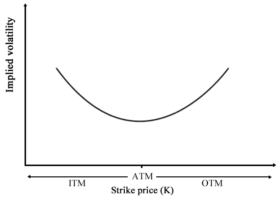
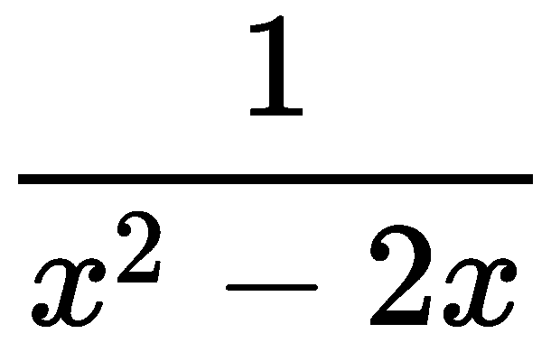
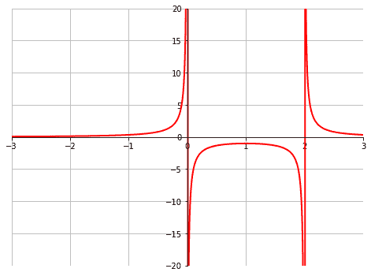
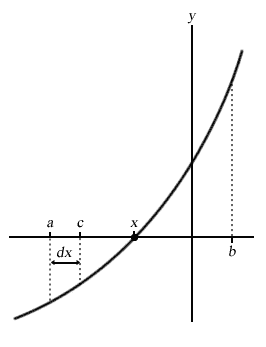
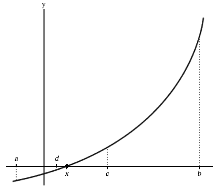
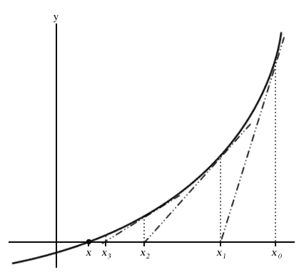
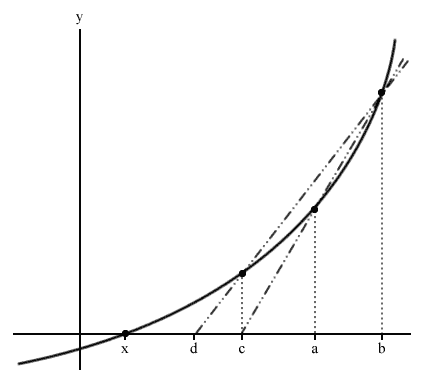

# 第三章：金融中的非线性

近年来，对经济和金融理论中的非线性现象的研究越来越受到关注。由于非线性串行依赖在许多金融时间序列的回报中起着重要作用，这使得证券估值和定价非常重要，从而导致对金融产品的非线性建模研究增加。

金融业的从业者使用非线性模型来预测波动性、价格衍生品，并计算风险价值（VAR）。与线性模型不同，线性代数用于寻找解决方案，非线性模型不一定推断出全局最优解。通常采用数值根查找方法来收敛到最近的局部最优解，即根。

在本章中，我们将讨论以下主题：

+   非线性建模

+   非线性模型的例子

+   根查找算法

+   根查找中的 SciPy 实现

# 非线性建模

尽管线性关系旨在以最简单的方式解释观察到的现象，但许多复杂的物理现象无法用这样的模型来解释。非线性关系定义如下：


尽管非线性关系可能很复杂，但为了充分理解和建模它们，我们将看一下在金融和时间序列模型的背景下应用的例子。

# 非线性模型的例子

许多非线性模型已被提出用于学术和应用研究，以解释线性模型无法解释的经济和金融数据的某些方面。金融领域的非线性文献实在太广泛和深刻，无法在本书中得到充分解释。在本节中，我们将简要讨论一些非线性模型的例子，这些模型可能在实际应用中遇到：隐含波动率模型、马尔可夫转换模型、阈值模型和平滑转换模型。

# 隐含波动率模型

也许最广泛研究的期权定价模型之一是 Black-Scholes-Merton 模型，或简称 Black-Scholes 模型。看涨期权是在特定价格和时间购买基础证券的权利，而不是义务。看跌期权是在特定价格和时间出售基础证券的权利，而不是义务。Black-Scholes 模型有助于确定期权的公平价格，假设基础证券的回报服从正态分布（N(.)）或资产价格呈对数正态分布。

该公式假定以下变量：行权价（*K*）、到期时间（*T*）、无风险利率（*r*）、基础收益的波动率（σ）、基础资产的当前价格（*S*）和其收益（*q*）。看涨期权的数学公式，*C*(*S,t*)，表示如下：


在这里：


通过市场力量，期权的价格可能偏离从 Black-Scholes 公式推导出的价格。特别是，实现波动性（即从历史市场价格观察到的基础收益的波动性）可能与由 Black-Scholes 模型隐含的波动性值不同，这由σ表示。

回想一下在第二章中讨论的**资本资产定价模型**（**CAPM**），即金融中的线性重要性。一般来说，具有更高回报的证券表现出更高的风险，这表明回报的波动性或标准差。

由于波动性在证券定价中非常重要，因此已经提出了许多波动性模型进行研究。其中一种模型是期权价格的隐含波动率建模。

假设我们绘制了给定特定到期日的 Black-Scholes 公式给出的股票期权的隐含波动率值。一般来说，我们得到一个常被称为**波动率微笑**的曲线，因为它的形状：



**隐含波动率**通常在深度实值和虚值期权上最高，受到大量投机驱动，而在平值期权上最低。

期权的特征解释如下：

+   **实值期权**（**ITM**）：当认购期权的行权价低于标的资产的市场价格时，被视为实值期权。当认沽期权的行权价高于标的资产的市场价格时，被视为实值期权。实值期权在行使时具有内在价值。

+   **虚值期权**（**OTM**）：当认购期权的行权价高于标的资产的市场价格时，被视为虚值期权。当认沽期权的行权价低于标的资产的市场价格时，被视为虚值期权。虚值期权在行使时没有内在价值，但可能仍具有时间价值。

+   **平值期权**（**ATM**）：当期权的行权价与标的资产的市场价格相同时，被视为平值期权。平值期权在行使时没有内在价值，但可能仍具有时间价值。

从前述波动率曲线中，隐含波动率建模的一个目标是寻找可能的最低隐含波动率值，或者换句话说，*找到根*。一旦找到，就可以推断出特定到期日的平值期权的理论价格，并与市场价格进行比较，以寻找潜在的机会，比如研究接近平值期权或远虚值期权。然而，由于曲线是非线性的，线性代数无法充分解决根的问题。我们将在下一节*根查找算法*中看一些根查找方法。

# 马尔可夫转换模型

为了对经济和金融时间序列中的非线性行为进行建模，可以使用马尔可夫转换模型来描述不同世界或状态下的时间序列。这些状态的例子可能是一个*波动*状态，就像在 2008 年全球经济衰退中看到的，或者是稳步复苏经济的*增长*状态。能够在这些结构之间转换的能力让模型能够捕捉复杂的动态模式。

股票价格的马尔可夫性质意味着只有当前价值对于预测未来是相关的。过去的股价波动对于当前的出现方式是无关紧要的。

让我们以*m=2*个状态的马尔可夫转换模型为例：


ϵ[t]是一个**独立同分布**（**i**.**i**.**d**）白噪声。白噪声是一个均值为零的正态分布随机过程。同样的模型可以用虚拟变量表示：


马尔可夫转换模型的应用包括代表实际 GDP 增长率和通货膨胀率动态。这些模型反过来推动利率衍生品的估值模型。从前一状态*i*转换到当前状态*j*的概率可以写成如下形式：


# 阈自回归模型

一个流行的非线性时间序列模型类别是**阈自回归**（**TAR**）模型，它看起来与马尔可夫转换模型非常相似。使用回归方法，简单的 AR 模型可以说是最流行的模型来解释非线性行为。阈值模型中的状态是由其自身时间序列的过去值*d*相对于阈值*c*确定的。

以下是一个**自激励 TAR**（SETAR）模型的例子。SETAR 模型是自激励的，因为在不同制度之间的切换取决于其自身时间序列的过去值：


使用虚拟变量，SETAR 模型也可以表示如下：


TAR 模型的使用可能会导致状态之间出现急剧的转变，这由阈值变量*c*控制。

# 平滑转换模型

阈值模型中的突然制度变化似乎与现实世界的动态不符。通过引入一个平滑变化的连续函数，可以克服这个问题，从一个制度平滑地过渡到另一个制度。SETAR 模型成为一个**逻辑平滑转换阈值自回归**（**LSTAR**）模型，其中使用逻辑函数*G(y[t−1];γ,c)*：


SETAR 模型现在变成了 LSTAR 模型，如下方程所示：


参数γ控制从一个制度到另一个制度的平滑过渡。对于γ的大值，过渡是最快的，因为*y[t−d]*接近阈值变量*c*。当γ=0 时，LSTAR 模型等同于简单的*AR(1)*单制度模型。

# 根查找算法

在前面的部分，我们讨论了一些用于研究经济和金融时间序列的非线性模型。从连续时间给定的模型数据，因此意图是搜索可能推断有价值信息的极值点。使用数值方法，如根查找算法，可以帮助我们找到连续函数*f*的根，使得*f(x)=0*，这可能是函数的极大值或极小值。一般来说，一个方程可能包含多个根，也可能根本没有根。

在非线性模型上使用根查找方法的一个例子是前面讨论的 Black-Scholes 隐含波动率建模，在*隐含波动率模型*部分。期权交易员有兴趣根据 Black-Scholes 模型推导隐含价格，并将其与市场价格进行比较。在下一章，期权定价的数值方法，我们将看到如何将根查找方法与数值期权定价程序结合起来，以根据特定期权的市场价格创建一个隐含波动率模型。

根查找方法使用迭代程序，需要一个起始点或根的估计。根的估计可能会收敛于一个解，收敛于一个不需要的根，或者根本找不到解决方案。因此，找到根的良好近似是至关重要的。

并非每个非线性函数都可以使用根查找方法解决。下图显示了一个连续函数的例子，，在这种情况下，根查找方法可能无法找到解。在*x=0*和*x=2*处，*y*值在-20 到 20 的范围内存在不连续性：



并没有固定的规则来定义良好的近似。建议在开始根查找迭代程序之前，先确定下界和上界的搜索范围。我们当然不希望在错误的方向上无休止地搜索我们的根。

# 增量搜索

解决非线性函数的一种粗糙方法是进行增量搜索。使用任意起始点*a*，我们可以获得每个*dx*增量的*f(a)*值。我们假设*f*(*a+dx*)，*f*(*a+2dx*)，*f*(*a+3dx*)…的值与它们的符号指示的方向相同。一旦符号改变，解决方案被认为已找到。否则，当迭代搜索越过边界点*b*时，迭代搜索终止。

迭代的根查找方法的图示示例如下图所示：



可以从以下 Python 代码中看到一个例子：

```py
In [ ]:
    """ 
    An incremental search algorithm 
    """
    import numpy as np

    def incremental_search(func, a, b, dx):
        """
        :param func: The function to solve
        :param a: The left boundary x-axis value
        :param b: The right boundary x-axis value
        :param dx: The incremental value in searching
        :return: 
            The x-axis value of the root,
            number of iterations used
        """
        fa = func(a)
        c = a + dx
        fc = func(c)
        n = 1
        while np.sign(fa) == np.sign(fc):
            if a >= b:
                return a - dx, n

            a = c
            fa = fc
            c = a + dx
            fc = func(c)
            n += 1

        if fa == 0:
            return a, n
        elif fc == 0:
            return c, n
        else:
            return (a + c)/2., n
```

在每次迭代过程中，`a`将被`c`替换，并且在下一次比较之前，`c`将被`dx`递增。如果找到了根，那么它可能位于`a`和`c`之间，两者都包括在内。如果解决方案不在任何一个点上，我们将简单地返回这两个点的平均值作为最佳估计。变量*n*跟踪经历了寻找根的过程的迭代次数。

我们将使用具有解析解的方程来演示和测量我们的根查找器，其中*x*被限制在-5 和 5 之间。给出了一个小的*dx*值 0.001，它也充当精度工具。较小的*dx*值产生更好的精度，但也需要更多的搜索迭代：

```py
In [ ]:
    # The keyword 'lambda' creates an anonymous function
    # with input argument x
    y = lambda x: x**3 + 2.*x**2 - 5.
    root, iterations = incremental_search (y, -5., 5., 0.001)
    print("Root is:", root)
    print("Iterations:", iterations)
Out[ ]:
    Root is: 1.2414999999999783
    Iterations: 6242
```

增量搜索根查找方法是根查找算法基本行为的基本演示。当由*dx*定义时，精度最佳，并且在最坏的情况下需要极长的计算时间。要求的精度越高，解决方案收敛所需的时间就越长。出于实际原因，这种方法是所有根查找算法中最不受欢迎的，我们将研究替代方法来找到我们方程的根，以获得更好的性能。

# 二分法

二分法被认为是最简单的一维根查找算法。一般的兴趣是找到连续函数*f*的值*x*，使得*f(x)=0*。

假设我们知道区间*a*和*b*的两个点，其中*a*<*b*，并且连续函数上有*f(a)<0*和*f(b)>0*，则取该区间的中点作为*c*，其中；然后二分法计算该值*f(c)*。

让我们用以下图示来说明沿着非线性函数设置点的情况：



由于*f(a)*的值为负，*f(b)*的值为正，二分法假设根*x*位于*a*和*b*之间，并给出*f(x)=0*。

如果*f(c)=0*或者非常接近零，通过预定的误差容限值，就宣布找到了一个根。如果*f(c)<0*，我们可以得出结论，根存在于*c*和*b*的区间，或者*a*和*c*的区间。

在下一次评估中，*c*将相应地替换为*a*或*b*。随着新区间缩短，二分法重复相同的评估，以确定*c*的下一个值。这个过程继续，缩小*ab*的宽度，直到根被认为找到。

使用二分法的最大优势是保证在给定预定的误差容限水平和允许的最大迭代次数下收敛到根的近似值。应该注意的是，二分法不需要未知函数的导数知识。在某些连续函数中，导数可能是复杂的，甚至不可能计算。这使得二分法对于处理不平滑函数非常有价值。

由于二分法不需要来自连续函数的导数信息，其主要缺点是在迭代评估中花费更多的计算时间。此外，由于二分法的搜索边界位于*a*和*b*区间内，因此需要一个良好的近似值来确保根落在此范围内。否则，可能会得到不正确的解，甚至根本没有解。使用较大的*a*和*b*值可能会消耗更多的计算时间。

二分法被认为是稳定的，无需使用初始猜测值即可收敛。通常，它与其他方法结合使用，例如更快的牛顿法，以便快速收敛并获得精度。

二分法的 Python 代码如下。将其保存为`bisection.py`：

```py
In [ ]:
    """ 
    The bisection method 
    """
    def bisection(func, a, b, tol=0.1, maxiter=10):
        """
        :param func: The function to solve
        :param a: The x-axis value where f(a)<0
        :param b: The x-axis value where f(b)>0
        :param tol: The precision of the solution
        :param maxiter: Maximum number of iterations
        :return: 
            The x-axis value of the root,
            number of iterations used
        """
        c = (a+b)*0.5  # Declare c as the midpoint ab
        n = 1  # Start with 1 iteration
        while n <= maxiter:
            c = (a+b)*0.5
            if func(c) == 0 or abs(a-b)*0.5 < tol:
                # Root is found or is very close
                return c, n

            n += 1
            if func(c) < 0:
                a = c
            else:
                b = c

        return c, n
In [ ]:
    y = lambda x: x**3 + 2.*x**2 - 5
    root, iterations = bisection(y, -5, 5, 0.00001, 100)
    print("Root is:", root)
    print("Iterations:", iterations)
Out[ ]:
    Root is: 1.241903305053711
    Iterations: 20
```

再次，我们将匿名的`lambda`函数绑定到`y`变量，带有输入参数`x`，并尝试解决方程，与之前一样，在-5 到 5 之间的区间内，精度为 0.00001，最大迭代次数为 100。

正如我们所看到的，与增量搜索方法相比，二分法给出了更好的精度，迭代次数更少。

# 牛顿法

牛顿法，也称为牛顿-拉弗森法，使用迭代过程来求解根，利用函数的导数信息。导数被视为一个要解决的线性问题。函数的一阶导数*f′*代表切线。给定*x*的下一个值的近似值，记为*x[1]*，如下所示：


在这里，切线与*x*轴相交于*x[1]*，产生*y=0*。这也表示关于*x[1]*的一阶泰勒展开，使得新点**解决以下方程：


重复这个过程，*x*取值为*x[1]*，直到达到最大迭代次数，或者*x[1]*和*x*之间的绝对差在可接受的精度水平内。

需要一个初始猜测值来计算*f(x)*和*f'(x)*的值。收敛速度是二次的，被认为是以极高的精度获得解决方案的非常快速的速度。

牛顿法的缺点是它不能保证全局收敛到解决方案。当函数包含多个根或算法到达局部极值且无法计算下一步时，就会出现这种情况。由于该方法需要知道其输入函数的导数，因此需要输入函数可微。然而，在某些情况下，函数的导数是无法知道的，或者在数学上很容易计算。

牛顿法的图形表示如下截图所示。*x[0]*是初始*x*值。评估*f(x[0])*的导数，这是一个切线，穿过*x*轴在*x[1]*处。迭代重复，评估点*x[1]*，*x[2]*，*x[3]*等处的导数：



Python 中牛顿法的实现如下：

```py
In  [ ]:
    """ 
    The Newton-Raphson method 
    """
    def newton(func, df, x, tol=0.001, maxiter=100):
        """
        :param func: The function to solve
        :param df: The derivative function of f
        :param x: Initial guess value of x
        :param tol: The precision of the solution
        :param maxiter: Maximum number of iterations
        :return: 
            The x-axis value of the root,
            number of iterations used
        """
        n = 1
        while n <= maxiter:
            x1 = x - func(x)/df(x)
            if abs(x1 - x) < tol: # Root is very close
                return x1, n

            x = x1
            n += 1

        return None, n
```

我们将使用二分法示例中使用的相同函数，并查看牛顿法的结果：

```py
In  [ ]:
    y = lambda x: x**3 + 2*x**2 - 5
    dy = lambda x: 3*x**2 + 4*x
    root, iterations = newton(y, dy, 5.0, 0.00001, 100)
    print("Root is:", root)
    print("Iterations:", iterations)
Out [ ]:
    Root is: 1.241896563034502
    Iterations: 7
```

注意除零异常！在 Python 2 中，使用值如 5.0，而不是 5，让 Python 将变量识别为浮点数，避免了将变量视为整数进行计算的问题，并给出了更好的精度。

使用牛顿法，我们获得了一个非常接近的解，迭代次数比二分法少。

# 割线法

使用割线法来寻找根。割线是一条直线，它与曲线的两个点相交。在割线法中，画一条直线连接连续函数上的两个点，使其延伸并与*x*轴相交。这种方法可以被视为拟牛顿法。通过连续画出这样的割线，可以逼近函数的根。

割线法在以下截图中以图形方式表示。需要找到两个*x*轴值的初始猜测，*a*和*b*，以找到*f(a)*和*f(b)*。从*f(b)*到*f(a)*画一条割线*y*，并在*x*轴上的点*c*处相交，使得：


因此，*c*的解如下：


在下一次迭代中，*a*和*b*将分别取*b*和*c*的值。该方法重复自身，为*x*轴值*a*和*b*、*b*和*c*、*c*和*d*等画出割线。当达到最大迭代次数或*b*和*c*之间的差异达到预先指定的容限水平时，解决方案终止，如下图所示：



割线法的收敛速度被认为是超线性的。其割线法比二分法收敛速度快得多，但比牛顿法慢。在牛顿法中，浮点运算的数量在每次迭代中占用的时间是割线法的两倍，因为需要计算函数和导数。由于割线法只需要在每一步计算其函数，因此在绝对时间上可以认为更快。

割线法的初始猜测值必须接近根，否则无法保证收敛到解。

割线法的 Python 代码如下所示：

```py
In [ ]:
    """ 
    The secant root-finding method 
    """
    def secant(func, a, b, tol=0.001, maxiter=100):
        """
        :param func: The function to solve
        :param a: Initial x-axis guess value
        :param b: Initial x-axis guess value, where b>a
        :param tol: The precision of the solution
        :param maxiter: Maximum number of iterations
        :return: 
            The x-axis value of the root,
            number of iterations used
        """
        n = 1
        while n <= maxiter:
            c = b - func(b)*((b-a)/(func(b)-func(a)))
            if abs(c-b) < tol:
                return c, n

            a = b
            b = c
            n += 1

        return None, n
```

再次重用相同的非线性函数，并返回割线法的结果：

```py
In [ ]:
    y = lambda x: x**3 + 2.*x**2 - 5.
    root, iterations = secant(y, -5.0, 5.0, 0.00001, 100)
    print("Root is:", root)
    print("Iterations:", iterations)
Out[ ]:   
    Root is: 1.2418965622558549
    Iterations: 14
```

尽管所有先前的根查找方法都给出了非常接近的解，割线法与二分法相比，迭代次数更少，但比牛顿法多。

# 组合根查找方法

完全可以使用前面提到的根查找方法的组合来编写自己的根查找算法。例如，可以使用以下实现：

1.  使用更快的割线法将问题收敛到预先指定的误差容限值或最大迭代次数

1.  一旦达到预先指定的容限水平，就切换到使用二分法，通过每次迭代将搜索区间减半，直到找到根

**布伦特法**或**Wijngaarden-Dekker-Brent**方法结合了二分根查找方法、割线法和反向二次插值。该算法尝试在可能的情况下使用割线法或反向二次插值，并在必要时使用二分法。布伦特法也可以在 SciPy 的`scipy.optimize.brentq`函数中找到。

# 根查找中的 SciPy 实现

在开始编写根查找算法来解决非线性甚至线性问题之前，先看看`scipy.optimize`方法的文档。SciPy 包含一系列科学计算函数，作为 Python 的扩展。这些开源算法很可能适合您的应用程序。

# 查找标量函数的根

`scipy.optimize`模块中可以找到一些根查找函数，包括`bisect`、`newton`、`brentq`和`ridder`。让我们使用 SciPy 的实现来设置我们在*增量搜索*部分中讨论过的示例：

```py
In [ ]:
    """
    Documentation at
    http://docs.scipy.org/doc/scipy/reference/optimize.html
    """
    import scipy.optimize as optimize

    y = lambda x: x**3 + 2.*x**2 - 5.
    dy = lambda x: 3.*x**2 + 4.*x

    # Call method: bisect(f, a, b[, args, xtol, rtol, maxiter, ...])
    print("Bisection method:", optimize.bisect(y, -5., 5., xtol=0.00001))

    # Call method: newton(func, x0[, fprime, args, tol, ...])
    print("Newton's method:", optimize.newton(y, 5., fprime=dy))
    # When fprime=None, then the secant method is used.
    print("Secant method:", optimize.newton(y, 5.))

    # Call method: brentq(f, a, b[, args, xtol, rtol, maxiter, ...])
    print("Brent's method:", optimize.brentq(y, -5., 5.))
```

当运行上述代码时，将生成以下输出：

```py
Out[ ]:
    Bisection method: 1.241903305053711
    Newton's method: 1.2418965630344798
    Secant method: 1.2418965630344803
    Brent's method: 1.241896563034559
```

我们可以看到，SciPy 的实现给出了与我们推导的答案非常相似的答案。

值得注意的是，SciPy 对每个实现都有一组明确定义的条件。例如，在文档中二分法例程的函数调用如下所示：

```py
scipy.optimize.bisect(f, a, b, args=(), xtol=1e-12, rtol=4.4408920985006262e-16, maxiter=100, full_output=False, disp=True)
```

该函数将严格评估函数*f*以返回函数的零点。*f(a)*和*f(b)*不能具有相同的符号。在某些情况下，很难满足这些约束条件。例如，在解决非线性隐含波动率模型时，波动率值不能为负。在活跃市场中，如果不修改基础实现，几乎不可能找到波动率函数的根或零点。在这种情况下，实现我们自己的根查找方法也许可以让我们更加掌控我们的应用程序应该如何执行。

# 一般非线性求解器

`scipy.optimize`模块还包含了我们可以利用的多维通用求解器。`root`和`fsolve`函数是一些具有以下函数属性的例子：

+   `root(fun, x0[, args, method, jac, tol, ...])`：这找到向量函数的根。

+   `fsolve(func, x0[, args, fprime, ...])`：这找到函数的根。

输出以字典对象的形式返回。使用我们的示例作为这些函数的输入，我们将得到以下输出：

```py
In [ ]:
    import scipy.optimize as optimize

    y = lambda x: x**3 + 2.*x**2 - 5.
    dy = lambda x: 3.*x**2 + 4.*x

    print(optimize.fsolve(y, 5., fprime=dy))
Out[ ]:    
    [1.24189656]
In [ ]:
    print(optimize.root(y, 5.))
Out[ ]:
    fjac: array([[-1.]])
     fun: array([3.55271368e-15])
 message: 'The solution converged.'
    nfev: 12
     qtf: array([-3.73605502e-09])
       r: array([-9.59451815])
  status: 1
 success: True
       x: array([1.24189656])
```

使用初始猜测值`5`，我们的解收敛到了根`1.24189656`，这与我们迄今为止得到的答案非常接近。当我们选择图表另一侧的值时会发生什么？让我们使用初始猜测值`-5`：

```py
In [ ]:
    print(optimize.fsolve(y, -5., fprime=dy))
Out[ ]:
   [-1.33306553]
   c:\python37\lib\site-packages\scipy\optimize\minpack.py:163:         RuntimeWarning: The iteration is not making good progress, as measured by the 
  improvement from the last ten iterations.
  warnings.warn(msg, RuntimeWarning)
In [ ]:
    print(optimize.root(y, -5.))
Out[ ]:
    fjac: array([[-1.]])
     fun: array([-3.81481496])
 message: 'The iteration is not making good progress, as measured by the \n  improvement from the last ten iterations.'
    nfev: 28
     qtf: array([3.81481521])
       r: array([-0.00461503])
  status: 5
 success: False
       x: array([-1.33306551])
```

从显示输出中可以看出，算法没有收敛，并返回了一个与我们先前答案略有不同的根。如果我们在图表上看方程，会发现曲线上有许多点非常接近根。需要一个根查找器来获得所需的精度水平，而求解器则试图以最快的时间解决最近的答案。

# 总结

在本章中，我们简要讨论了经济和金融中非线性的持久性。我们看了一些在金融中常用的非线性模型，用来解释线性模型无法解释的数据的某些方面：Black-Scholes 隐含波动率模型、Markov 转换模型、阈值模型和平滑转换模型。

在 Black-Scholes 隐含波动率建模中，我们讨论了波动率微笑，它由通过 Black-Scholes 模型从特定到期日的看涨或看跌期权的市场价格推导出的隐含波动率组成。您可能会对寻找可能的最低隐含波动率值感兴趣，这对于推断理论价格并与潜在机会的市场价格进行比较可能是有用的。然而，由于曲线是非线性的，线性代数无法充分解决最优点的问题。为此，我们将需要使用根查找方法。

根查找方法试图找到函数的根或零点。我们讨论了常见的根查找方法，如二分法、牛顿法和割线法。使用根查找算法的组合可能有助于更快地找到复杂函数的根。Brent 方法就是一个例子。

我们探讨了`scipy.optimize`模块中包含的这些根查找方法的功能，尽管有约束条件。其中一个约束条件要求两个边界输入值被评估为一个负值和一个正值的对，以便解收敛成功。在隐含波动率建模中，这种评估几乎是不可能的，因为波动率没有负值。实现我们自己的根查找方法也许可以让我们更加掌控我们的应用程序应该如何执行。

使用通用求解器是另一种寻找根的方法。它们可能会更快地收敛到我们的解，但这种收敛并不由初始给定的值保证。

非线性建模和优化本质上是一项复杂的任务，没有通用的解决方案或确定的方法来得出结论。本章旨在介绍金融领域的非线性研究。

在下一章中，我们将介绍常用于期权定价的数值方法。通过将数值程序与寻根算法配对，我们将学习如何利用股票期权的市场价格构建隐含波动率模型。
