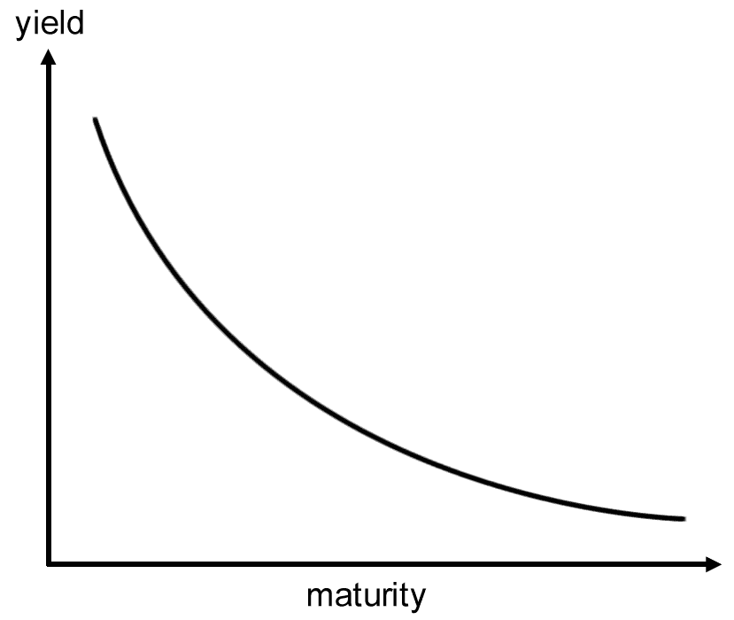
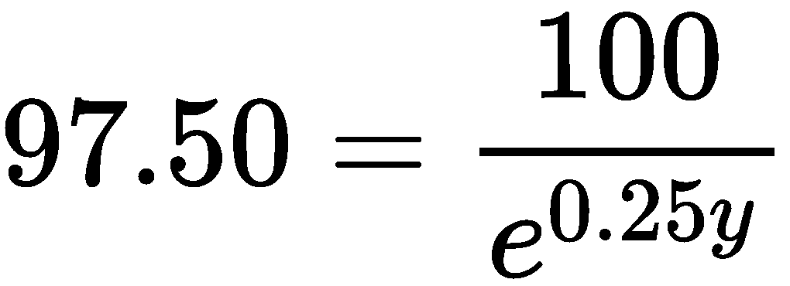
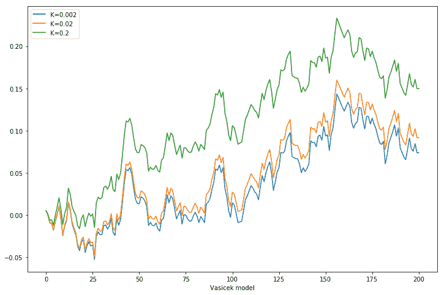
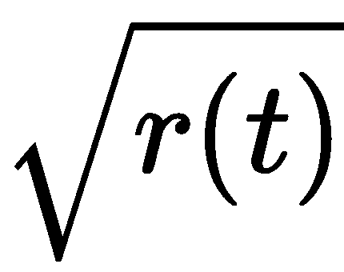
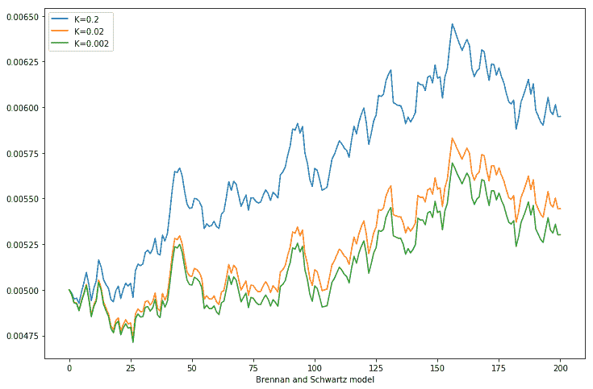
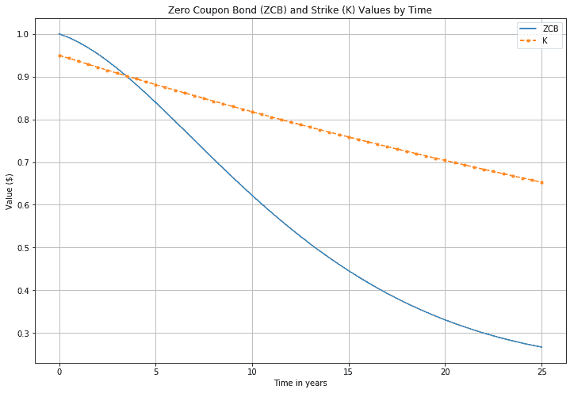

# 第五章：建模利率和衍生品

利率影响各个层面的经济活动。包括美联储（俗称为联邦储备系统）在内的中央银行将利率作为一种政策工具来影响经济活动。利率衍生品受到投资者的欢迎，他们需要定制的现金流需求或对利率变动的特定观点。

利率衍生品交易员面临的一个关键挑战是为这些产品制定一个良好而稳健的定价程序。这涉及理解单个利率变动的复杂行为。已经提出了几种利率模型用于金融研究。金融学中研究的一些常见模型是 Vasicek、CIR 和 Hull-White 模型。这些利率模型涉及对短期利率的建模，并依赖于因素（或不确定性来源），其中大多数只使用一个因素。已经提出了双因素和多因素利率模型。

在本章中，我们将涵盖以下主题：

+   理解收益曲线

+   估值零息债券

+   引导收益曲线

+   计算远期利率

+   计算债券的到期收益率和价格

+   使用 Python 计算债券久期和凸性

+   短期利率建模

+   Vasicek 短期利率模型

+   债券期权的类型

+   定价可赎回债券期权

# 固定收益证券

公司和政府发行固定收益证券是为了筹集资金。这些债务的所有者借钱，并期望在债务到期时收回本金。希望借钱的发行人可能在债务寿命期间的预定时间发行固定金额的利息支付。

债务证券持有人，如美国国债、票据和债券，面临发行人违约的风险。联邦政府和市政府被认为面临最低的违约风险，因为他们可以轻松提高税收并创造更多货币来偿还未偿还的债务。

大多数债券每半年支付固定金额的利息，而有些债券每季度或每年支付。这些利息支付也被称为票息。它们以债券的面值或票面金额的百分比来报价，以年为单位。

例如，一张面值为 10,000 美元的 5 年期国库券，票面利率为 5%，每年支付 500 美元的票息，或者每 6 个月支付 250 美元的票息，直到到期日。如果利率下降，新的国库券只支付 3%的票息，那么新债券的购买者每年只会收到 300 美元的票息，而 5%债券的现有持有人将继续每年收到 500 美元的票息。由于债券的特性影响其价格，它们与当前利率水平呈反向关系：随着利率的上升，债券的价值下降。随着利率的下降，债券价格上升。

# 收益曲线

在正常的收益曲线环境中，长期利率高于短期利率。投资者希望在较长时间内借出资金时获得更高的回报，因为他们面临更高的违约风险。正常或正收益曲线被认为是向上倾斜的，如下图所示：


在某些经济条件下，收益曲线可能会倒挂。长期利率低于短期利率。当货币供应紧缩时会出现这种情况。投资者愿意放弃长期收益，以保护他们的短期财富。在通货膨胀高涨的时期，通货膨胀率超过票息利率时，可能会出现负利率。投资者愿意在短期内支付费用，只是为了保护他们的长期财富。倒挂的收益曲线被认为是向下倾斜的，如下图所示：



# 估值零息债券

**零息债券**是一种除到期日外不支付任何定期利息的债券，到期时偿还本金或面值。零息债券也被称为**纯贴现债券**。

零息债券的价值可以如下计算：


在这里，*y*是债券的年复利收益率或利率，*t*是债券到期的剩余时间。

让我们来看一个面值 100 美元的五年期零息债券的例子。年收益率为 5%，年复利。价格可以如下计算：


一个简单的 Python 零息债券计算器可以用来说明这个例子：

```py
In [ ]:
    def zero_coupon_bond(par, y, t):
        """
        Price a zero coupon bond.

        :param par: face value of the bond.
        :param y: annual yield or rate of the bond.
        :param t: time to maturity, in years.
        """
        return par/(1+y)**t
```

使用上述例子，我们得到以下结果：

```py
In [ ]:
    print(zero_coupon_bond(100, 0.05, 5))
Out[ ]:
    78.35261664684589

```

在上述例子中，我们假设投资者能够以 5%的年利率在 5 年内年复利投资 78.35 美元。

现在我们有了一个零息债券计算器，我们可以用它通过抽靴法收益率曲线来确定零息率，如下一节所述。

# 即期和零息率

随着复利频率的增加（比如，从年复利到日复利），货币的未来价值达到了一个指数极限。也就是说，今天的 100 美元在以连续复利率*R*投资*T*时间后将达到未来价值 100*e*^(*RT*)。如果我们对一个在未来时间*T*支付 100 美元的证券进行贴现，使用连续复利贴现率*R*，其在时间零的价值为。这个利率被称为**即期利率**。

即期利率代表了当前的利率，用于几种到期日，如果我们现在想要借款或出借资金。零息率代表了零息债券的内部收益率。

通过推导具有不同到期日的债券的即期利率，我们可以使用零息债券通过抽靴过程构建当前收益率曲线。

# 抽靴法收益率曲线

短期即期利率可以直接从各种短期证券（如零息债券、国库券、票据和欧元存款）中推导出来。然而，长期即期利率通常是通过一个抽靴过程从长期债券的价格中推导出来的，考虑到与票息支付日期相对应的到期日的即期利率。在获得短期和长期即期利率之后，就可以构建收益率曲线。

# 抽靴法收益率曲线的一个例子

让我们通过一个例子来说明抽靴法收益率曲线。以下表格显示了具有不同到期日和价格的债券列表：

| **债券面值（美元）** | **到期年限（年）** | **年息（美元）** | **债券现金价格（美元）** |
| --- | --- | --- | --- |
| 100 | 0.25 | 0 | 97.50 |
| 100 | 0.50 | 0 | 94.90 |
| 100 | 1.00 | 0 | 90.00 |
| 100 | 1.50 | 8 | 96.00 |
| 100 | 2.00 | 12 | 101.60 |

今天以 97.50 美元购买三个月的零息债券的投资者将获得 2.50 美元的利息。三个月的即期利率可以如下计算：




因此，3 个月的零息率是 10.127%，采用连续复利。零息债券的即期利率如下表所示：

| **到期年限（年）** | **即期利率（百分比）** |
| --- | --- |
| 0.25 | 10.127 |
| 0.50 | 10.469 |
| 1.00 | 10.536 |

使用这些即期利率，我们现在可以如下定价 1.5 年期债券：


*y*的值可以通过重新排列方程轻松求解，如下所示：


有了 1.5 年期债券的即期利率为 10.681%，我们可以使用它来定价 2 年期债券，年息为 6 美元，半年付息，如下所示：


重新排列方程并解出*y*，我们得到 2 年期债券的即期利率为 10.808。

通过这种迭代过程，按照到期日递增的顺序计算每个债券的即期利率，并在下一次迭代中使用它，我们得到了一个可以用来构建收益率曲线的不同到期日的即期利率列表。

# 编写收益率曲线引导类

编写 Python 代码引导收益率曲线并生成图表输出的步骤如下：

1.  创建一个名为`BootstrapYieldCurve`的类，它将在 Python 代码中实现收益率曲线的引导：

```py
import math

class BootstrapYieldCurve(object):    

    def __init__(self):
        self.zero_rates = dict()
        self.instruments = dict()
```

1.  在构造函数中，声明了两个`zero_rates`和`instruments`字典变量，并将被几种方法使用，如下所示：

+   添加一个名为`add_instrument()`的方法，该方法将债券信息的元组附加到以到期时间为索引的`instruments`字典中。此方法的编写如下：

```py
def add_instrument(self, par, T, coup, price, compounding_freq=2):
    self.instruments[T] = (par, coup, price, compounding_freq)
```

+   添加一个名为`get_maturities()`的方法，它简单地按升序返回一个可用到期日列表。此方法的编写如下：

```py
def get_maturities(self):
    """ 
    :return: a list of maturities of added instruments 
    """
    return sorted(self.instruments.keys())
```

+   添加一个名为`get_zero_rates()`的方法，该方法对收益率曲线进行引导，计算沿该收益率曲线的即期利率，并按到期日升序返回零息率的列表。该方法的编写如下：

```py
def get_zero_rates(self):
    """ 
    Returns a list of spot rates on the yield curve.
    """
    self.bootstrap_zero_coupons()    
    self.get_bond_spot_rates()
    return [self.zero_rates[T] for T in self.get_maturities()]
```

+   添加一个名为`bootstrap_zero_coupons()`的方法，该方法计算给定零息债券的即期利率，并将其添加到以到期日为索引的`zero_rates`字典中。此方法的编写如下：

```py
def bootstrap_zero_coupons(self):
    """ 
    Bootstrap the yield curve with zero coupon instruments first.
    """
    for (T, instrument) in self.instruments.items():
        (par, coup, price, freq) = instrument
        if coup == 0:
            spot_rate = self.zero_coupon_spot_rate(par, price, T)
            self.zero_rates[T] = spot_rate  
```

+   添加一个名为`zero_coupon_spot_rate()`的方法，该方法计算零息债券的即期利率。此方法由`bootstrap_zero_coupons()`调用，并编写如下：

```py
def zero_coupon_spot_rate(self, par, price, T):
    """ 
    :return: the zero coupon spot rate with continuous compounding.
    """
    spot_rate = math.log(par/price)/T
    return spot_rate
```

+   添加一个名为`get_bond_spot_rates()`的方法，它计算非零息债券的即期利率，并将其添加到以到期日为索引的`zero_rates`字典中。此方法的编写如下：

```py
def get_bond_spot_rates(self):
    """ 
    Get spot rates implied by bonds, using short-term instruments.
    """
    for T in self.get_maturities():
        instrument = self.instruments[T]
        (par, coup, price, freq) = instrument
        if coup != 0:
            spot_rate = self.calculate_bond_spot_rate(T, instrument)
            self.zero_rates[T] = spot_rate
```

+   添加一个名为`calculate_bond_spot_rate()`的方法，该方法由`get_bond_spot_rates()`调用，用于计算特定到期期间的即期利率。此方法的编写如下：

```py
def calculate_bond_spot_rate(self, T, instrument):
    try:
        (par, coup, price, freq) = instrument
        periods = T*freq
        value = price
        per_coupon = coup/freq
        for i in range(int(periods)-1):
            t = (i+1)/float(freq)
            spot_rate = self.zero_rates[t]
            discounted_coupon = per_coupon*math.exp(-spot_rate*t)
            value -= discounted_coupon

        last_period = int(periods)/float(freq)        
        spot_rate = -math.log(value/(par+per_coupon))/last_period
        return spot_rate
    except:
        print("Error: spot rate not found for T=", t)
```

1.  实例化`BootstrapYieldCurve`类，并从前表中添加每个债券的信息：

```py
In [ ]:
    yield_curve = BootstrapYieldCurve()
    yield_curve.add_instrument(100, 0.25, 0., 97.5)
    yield_curve.add_instrument(100, 0.5, 0., 94.9)
    yield_curve.add_instrument(100, 1.0, 0., 90.)
    yield_curve.add_instrument(100, 1.5, 8, 96., 2)
    yield_curve.add_instrument(100, 2., 12, 101.6, 2)
In [ ]:
    y = yield_curve.get_zero_rates()
    x = yield_curve.get_maturities()
```

1.  在类实例中调用`get_zero_rates()`方法会返回一个即期利率列表，顺序与分别存储在`x`和`y`变量中的到期日相同。发出以下 Python 代码以在图表上绘制`x`和`y`：

```py
In [ ]:
    %pylab inline

    fig = plt.figure(figsize=(12, 8))
    plot(x, y)
    title("Zero Curve") 
    ylabel("Zero Rate (%)")
    xlabel("Maturity in Years");
```

1.  我们得到以下的收益率曲线：


在正常的收益率曲线环境中，随着到期日的增加，利率也会增加，我们得到一个上升的收益率曲线。

# 远期利率

计划在以后投资的投资者可能会好奇知道未来的利率会是什么样子，这是由当今的利率期限结构所暗示的。例如，您可能会问，“一年后的一年期即期利率是多少？”为了回答这个问题，您可以使用以下公式计算*T[1]*和*T[2]*之间的期间的远期利率：


在这里，*r[1]*和*r[2]*分别是*T[1]*和*T[2]*时期的连续复利年利率。

以下的`ForwardRates`类帮助我们从即期利率列表生成远期利率列表：

```py
class ForwardRates(object):

    def __init__(self):
        self.forward_rates = []
        self.spot_rates = dict()

    def add_spot_rate(self, T, spot_rate):
        self.spot_rates[T] = spot_rate

    def get_forward_rates(self):
        """
        Returns a list of forward rates
        starting from the second time period.
        """
        periods = sorted(self.spot_rates.keys())
        for T2, T1 in zip(periods, periods[1:]):
            forward_rate = self.calculate_forward_rate(T1, T2)
            self.forward_rates.append(forward_rate)

        return self.forward_rates

    def calculate_forward_rate(self, T1, T2):
        R1 = self.spot_rates[T1]
        R2 = self.spot_rates[T2]
        forward_rate = (R2*T2-R1*T1)/(T2-T1)
        return forward_rate        
```

使用从前述收益率曲线派生的即期利率，我们得到以下结果：

```py
In [ ]:
    fr = ForwardRates()
    fr.add_spot_rate(0.25, 10.127)
    fr.add_spot_rate(0.50, 10.469)
    fr.add_spot_rate(1.00, 10.536)
    fr.add_spot_rate(1.50, 10.681)
    fr.add_spot_rate(2.00, 10.808)
In [ ]:
    print(fr.get_forward_rates())
Out[ ]:
    [10.810999999999998, 10.603, 10.971, 11.189]
```

调用`ForwardRates`类的`get_forward_rates()`方法返回一个从下一个时间段开始的远期利率列表。

# 计算到期收益率

**到期收益**（**YTM**）衡量了债券隐含的利率，考虑了所有未来票息支付和本金的现值。假设债券持有人可以以 YTM 利率投资收到的票息，直到债券到期；根据风险中性预期，收到的支付应与债券支付的价格相同。

让我们来看一个例子，一个 5.75％的债券，将在 1.5 年内到期，面值为 100。债券价格为 95.0428 美元，票息每半年支付一次。定价方程可以陈述如下：

！[](Images/82dc5d3a-883b-42f7-b6fc-18737b6845b5.png)

这里：

+   *c*是每个时间段支付的票面金额

+   *T*是以年为单位的支付时间段

+   *n*是票息支付频率

+   *y*是我们感兴趣的 YTM 解决方案

解决 YTM 通常是一个复杂的过程，大多数债券 YTM 计算器使用牛顿法作为迭代过程。

债券 YTM 计算器由以下`bond_ytm()`函数说明：

```py
import scipy.optimize as optimize

def bond_ytm(price, par, T, coup, freq=2, guess=0.05):
    freq = float(freq)
    periods = T*2
    coupon = coup/100.*par
    dt = [(i+1)/freq for i in range(int(periods))]
    ytm_func = lambda y: \
        sum([coupon/freq/(1+y/freq)**(freq*t) for t in dt]) +\
        par/(1+y/freq)**(freq*T) - price

    return optimize.newton(ytm_func, guess)
```

请记住，我们在第三章中介绍了牛顿法和其他非线性函数根求解器的使用，*金融中的非线性*。对于这个 YTM 计算器函数，我们使用了`scipy.optimize`包来解决 YTM。

使用债券示例的参数，我们得到以下结果：

```py
In [ ] :
    ytm = bond_ytm(95.0428, 100, 1.5, 5.75, 2)
In [ ]:
    print(ytm)
Out[ ]:
    0.09369155345239522
```

债券的 YTM 为 9.369％。现在我们有一个债券 YTM 计算器，可以帮助我们比较债券的预期回报与其他证券的回报。

# 计算债券价格

当 YTM 已知时，我们可以以与使用定价方程相同的方式获得债券价格。这是由`bond_price()`函数实现的：

```py
In [ ]:
    def bond_price(par, T, ytm, coup, freq=2):
        freq = float(freq)
        periods = T*2
        coupon = coup/100.*par
        dt = [(i+1)/freq for i in range(int(periods))]
        price = sum([coupon/freq/(1+ytm/freq)**(freq*t) for t in dt]) + \
            par/(1+ytm/freq)**(freq*T)
        return price
```

插入先前示例中的相同值，我们得到以下结果：

```py
In [ ]:
    price = bond_price(100, 1.5, ytm, 5.75, 2)
    print(price)
Out[ ]:   
    95.04279999999997
```

这给我们了先前示例中讨论的相同原始债券价格，*计算到期收益*。使用`bond_ytm()`和`bond_price()`函数，我们可以将这些应用于债券定价的进一步用途，例如查找债券的修改后持续时间和凸性。债券的这两个特征对于债券交易员来说非常重要，可以帮助他们制定各种交易策略并对冲风险。

# 债券持续时间

持续时间是债券价格对收益变化的敏感度度量。一些持续时间度量是有效持续时间，麦考利持续时间和修改后的持续时间。我们将讨论的持续时间类型是修改后的持续时间，它衡量了债券价格相对于收益变化的百分比变化（通常为 1％或 100 个**基点**（**bps**））。

债券的持续时间越长，对收益变化的敏感度就越高。相反，债券的持续时间越短，对收益变化的敏感度就越低。

债券的修改后持续时间可以被认为是价格和收益之间关系的第一导数：

！[](Images/b607a62b-2530-40eb-8429-60b806867973.png)

这里：

+   * dY *是给定的收益变化

+   *P^−*是债券因* dY *减少而导致的价格

+   *P^+*是债券因* dY *增加而导致的价格

+   *P[0]*是债券的初始价格

应该注意，持续时间描述了*Y*的小变化对价格-收益关系的线性关系。由于收益曲线不是线性的，使用较大的*dY*不能很好地近似持续时间度量。

修改后的持续时间计算器的实现在以下`bond_mod_duration()`函数中给出。它使用了本章前面讨论的`bond_ytm()`函数，*计算到期收益*，来确定具有给定初始值的债券的收益。此外，它使用`bond_price()`函数来确定具有给定收益变化的债券的价格：

```py
In [ ]:
    def bond_mod_duration(price, par, T, coup, freq, dy=0.01):
        ytm = bond_ytm(price, par, T, coup, freq)

        ytm_minus = ytm - dy    
        price_minus = bond_price(par, T, ytm_minus, coup, freq)

        ytm_plus = ytm + dy
        price_plus = bond_price(par, T, ytm_plus, coup, freq)

        mduration = (price_minus-price_plus)/(2*price*dy)
        return mduration
```

我们可以找出之前讨论的 5.75％债券的修改后持续时间，*计算到期收益*，它将在 1.5 年内到期，面值为 100，债券价格为 95.0428：

```py
In [ ]:
    mod_duration = bond_mod_duration(95.0428, 100, 1.5, 5.75, 2)
In [ ]:
    print(mod_duration)
Out[ ]:
    1.3921935426561034
```

债券的修正久期为 1.392 年。

# 债券凸性

**凸性**是债券久期对收益率变化的敏感度度量。将凸性视为价格和收益率之间关系的二阶导数：


债券交易员使用凸性作为风险管理工具，以衡量其投资组合中的市场风险。相对于债券久期和收益率相同的低凸性投资组合，高凸性投资组合受利率波动的影响较小。因此，其他条件相同的情况下，高凸性债券比低凸性债券更昂贵。

债券凸性的实现如下：

```py
In [ ]:
    def bond_convexity(price, par, T, coup, freq, dy=0.01):
        ytm = bond_ytm(price, par, T, coup, freq)

        ytm_minus = ytm - dy    
        price_minus = bond_price(par, T, ytm_minus, coup, freq)

        ytm_plus = ytm + dy
        price_plus = bond_price(par, T, ytm_plus, coup, freq)

        convexity = (price_minus + price_plus - 2*price)/(price*dy**2)
        return convexity
```

现在我们可以找到之前讨论的 5.75%债券的凸性，它将在 1.5 年后到期，票面价值为 100，债券价格为 95.0428：

```py
In [ ]:
    convexity = bond_convexity(95.0428, 100, 1.5, 5.75, 2)
In [ ]:
    print(convexity)
Out[ ] :    
    2.633959390331875
```

债券的凸性为 2.63。对于两个具有相同票面价值、票息和到期日的债券，它们的凸性可能不同，这取决于它们在收益率曲线上的位置。相对于收益率的变化，高凸性债券的价格变化更大。

# 短期利率建模

在短期利率建模中，短期利率*r(t)*是特定时间的即期利率。它被描述为收益率曲线上无限短的时间内的连续复利化年化利率。短期利率在利率模型中采用随机变量的形式，其中利率可能在每个时间点上以微小的变化。短期利率模型试图模拟利率随时间的演变，并希望描述特定时期的经济状况。

短期利率模型经常用于评估利率衍生品。债券、信用工具、抵押贷款和贷款产品对利率变化敏感。短期利率模型被用作利率组成部分，结合定价实现，如数值方法，以帮助定价这些衍生品。

利率建模被认为是一个相当复杂的话题，因为利率受到多种因素的影响，如经济状态、政治决策、政府干预以及供求法则。已经提出了许多利率模型，以解释利率的各种特征。

在本节中，我们将研究金融研究中使用的一些最流行的一因素短期利率模型，即瓦西切克、考克斯-英格索尔-罗斯、伦德尔曼和巴特尔、布伦南和施瓦茨模型。使用 Python，我们将执行一条路径模拟，以获得对利率路径过程的一般概述。金融学中常讨论的其他模型包括何厉、赫尔-怀特和布莱克-卡拉辛基。

# 瓦西切克模型

在一因素瓦西切克模型中，短期利率被建模为单一随机因素：


在这里，*K*、*θ*和*σ*是常数，*σ*是瞬时标准差。*W(t)*是随机维纳过程。瓦西切克遵循奥恩斯坦-乌伦贝克过程，模型围绕均值*θ*回归，*K*是均值回归速度。因此，利率可能变为负值，这在大多数正常经济条件下是不希望的特性。

为了帮助我们理解这个模型，以下代码生成了一组利率：

```py
In [ ]:
    import math
    import numpy as np

    def vasicek(r0, K, theta, sigma, T=1., N=10, seed=777):    
        np.random.seed(seed)
        dt = T/float(N)    
        rates = [r0]
        for i in range(N):
            dr = K*(theta-rates[-1])*dt + \
                sigma*math.sqrt(dt)*np.random.normal()
            rates.append(rates[-1]+dr)

        return range(N+1), rates
```

`vasicek()`函数返回瓦西切克模型的一组时间段和利率。它接受一些输入参数：`r0`是*t=0*时的初始利率；`K`、`theta`和`sigma`是常数；`T`是以年为单位的期间；`N`是建模过程的间隔数；`seed`是 NumPy 标准正态随机数生成器的初始化值。

假设当前利率接近零，为 0.5%，长期均值水平`theta`为`0.15`，瞬时波动率`sigma`为 5%。我们将使用`T`值为`10`和`N`值为`200`来模拟不同均值回归速度`K`的利率，使用值为`0.002`，`0.02`和`0.2`：

```py
In [ ]:
    %pylab inline

    fig = plt.figure(figsize=(12, 8))

    for K in [0.002, 0.02, 0.2]:
        x, y = vasicek(0.005, K, 0.15, 0.05, T=10, N=200)
        plot(x,y, label='K=%s'%K)
        pylab.legend(loc='upper left');

    pylab.legend(loc='upper left')
    pylab.xlabel('Vasicek model');
```

运行前述命令后，我们得到以下图表：



在这个例子中，我们只运行了一个模拟，以查看 Vasicek 模型的利率是什么样子。请注意，利率在某个时候变为负值。当均值回归速度`K`较高时，该过程更快地达到其长期水平 0.15。

# Cox-Ingersoll-Ross 模型

**Cox-Ingersoll-Ross**（**CIR**）模型是一个一因素模型，旨在解决 Vasicek 模型中发现的负利率。该过程如下：


术语随着短期利率的增加而增加标准差。现在`vasicek()`函数可以重写为 Python 中的 CIR 模型：

```py
In [ ]:
    import math
    import numpy as np

    def CIR(r0, K, theta, sigma, T=1.,N=10,seed=777):        
        np.random.seed(seed)
        dt = T/float(N)    
        rates = [r0]
        for i in range(N):
            dr = K*(theta-rates[-1])*dt + \
                sigma*math.sqrt(rates[-1])*\
                math.sqrt(dt)*np.random.normal()
            rates.append(rates[-1] + dr)

        return range(N+1), rates

```

使用*Vasicek 模型*部分中给出的相同示例，假设当前利率为 0.5%，`theta`为`0.15`，`sigma`为`0.05`。我们将使用`T`值为`10`和`N`值为`200`来模拟不同均值回归速度`K`的利率，使用值为`0.002`，`0.02`和`0.2`：

```py
In [ ] :
    %pylab inline

    fig = plt.figure(figsize=(12, 8))

    for K in [0.002, 0.02, 0.2]:
        x, y = CIR(0.005, K, 0.15, 0.05, T=10, N=200)
        plot(x,y, label='K=%s'%K)

    pylab.legend(loc='upper left')
    pylab.xlabel('CRR model');
```

以下是前述命令的输出：


请注意，CIR 利率模型没有负利率值。

# Rendleman 和 Bartter 模型

在 Rendleman 和 Bartter 模型中，短期利率过程如下：


这里，瞬时漂移是*θr(t)*，瞬时标准差为*σr(t)*。Rendleman 和 Bartter 模型可以被视为几何布朗运动，类似于对数正态分布的股价随机过程。该模型缺乏均值回归属性。均值回归是利率似乎被拉回到长期平均水平的现象。

以下 Python 代码模拟了 Rendleman 和 Bartter 的利率过程：

```py
In [ ]:
    import math
    import numpy as np

    def rendleman_bartter(r0, theta, sigma, T=1.,N=10,seed=777):        
        np.random.seed(seed)
        dt = T/float(N)    
        rates = [r0]
        for i in range(N):
            dr = theta*rates[-1]*dt + \
                sigma*rates[-1]*math.sqrt(dt)*np.random.normal()
            rates.append(rates[-1] + dr)

        return range(N+1), rates
```

我们将继续使用前几节中的示例并比较模型。

假设当前利率为 0.5%，`sigma`为`0.05`。我们将使用`T`值为`10`和`N`值为`200`来模拟不同瞬时漂移`theta`的利率，使用值为`0.01`，`0.05`和`0.1`：

```py
In [ ]:
    %pylab inline

    fig = plt.figure(figsize=(12, 8))

    for theta in [0.01, 0.05, 0.1]:
        x, y = rendleman_bartter(0.005, theta, 0.05, T=10, N=200)
        plot(x,y, label='theta=%s'%theta)

    pylab.legend(loc='upper left')
    pylab.xlabel('Rendleman and Bartter model');
```

以下图表是前述命令的输出：


总的来说，该模型缺乏均值回归属性，并向长期平均水平增长。

# Brennan 和 Schwartz 模型

Brennan 和 Schwartz 模型是一个双因素模型，其中短期利率向长期利率作为均值回归，也遵循随机过程。短期利率过程如下：


可以看出，Brennan 和 Schwartz 模型是几何布朗运动的另一种形式。

我们的 Python 代码现在可以这样实现：

```py
In [ ]:
    import math
    import numpy as np

    def brennan_schwartz(r0, K, theta, sigma, T=1., N=10, seed=777):    
        np.random.seed(seed)
        dt = T/float(N)    
        rates = [r0]
        for i in range(N):
            dr = K*(theta-rates[-1])*dt + \
                sigma*rates[-1]*math.sqrt(dt)*np.random.normal()
            rates.append(rates[-1] + dr)

        return range(N+1), rates
```

假设当前利率保持在 0.5%，长期均值水平`theta`为 0.006。`sigma`为`0.05`。我们将使用`T`值为`10`和`N`值为`200`来模拟不同均值回归速度`K`的利率，使用值为`0.2`，`0.02`和`0.002`：

```py
In [ ]:
    %pylab inline

    fig = plt.figure(figsize=(12, 8))

    for K in [0.2, 0.02, 0.002]:
        x, y = brennan_schwartz(0.005, K, 0.006, 0.05, T=10, N=200)
        plot(x,y, label='K=%s'%K)

    pylab.legend(loc='upper left')
    pylab.xlabel('Brennan and Schwartz model');
```

运行前述命令后，我们将得到以下输出：



当 k 为 0.2 时，均值回归速度最快，达到长期均值 0.006。

# 债券期权

当债券发行人，如公司，发行债券时，他们面临的风险之一是利率风险。利率下降时，债券价格上升。现有债券持有人会发现他们的债券更有价值，而债券发行人则处于不利地位，因为他们将发行高于市场利率的利息支付。相反，当利率上升时，债券发行人处于有利地位，因为他们能够继续按债券合同规定的低利息支付。

为了利用利率变化，债券发行人可以在债券中嵌入期权。这使得发行人有权利，但没有义务，在特定时间段内以预定价格买入或卖出发行的债券。美式债券期权允许发行人在债券的任何时间内行使期权的权利。欧式债券期权允许发行人在特定日期行使期权的权利。行使日期的确切方式因债券期权而异。一些发行人可能选择在债券在市场上流通超过一年后行使债券期权的权利。一些发行人可能选择在几个特定日期中的一个上行使债券期权的权利。无论债券的行使日期如何，您可以按以下方式定价嵌入式期权的债券：

债券价格=没有期权的债券价格-嵌入式期权的价格

没有期权的债券定价相当简单：未来日期收到的债券的现值，包括所有票息支付。必须对未来的理论利率进行一些假设，以便将票息支付再投资。这样的假设可能是短期利率模型所暗示的利率变动，我们在前一节中介绍了*短期利率建模*。另一个假设可能是在二项或三项树中的利率变动。为简单起见，在债券定价研究中，我们将定价零息债券，这些债券在债券的寿命期间不发行票息。

要定价期权，必须确定可行的行使日期。从债券的未来价值开始，将债券价格与期权的行使价格进行比较，并使用数值程序（如二项树）回溯到现在的时间。这种价格比较是在债券期权可能行使的时间点进行的。根据无套利理论，考虑到行使时债券的现值超额值，我们得到了期权的价格。为简单起见，在本章后面的债券定价研究中，*定价可赎回债券期权*，我们将把零息债券的嵌入式期权视为美式期权。

# 可赎回债券

在利率较高的经济条件下，债券发行人可能面临利率下降的风险，并不得不继续发行高于市场利率的利息支付。因此，他们可能选择发行可赎回债券。可赎回债券包含一项嵌入式协议，约定在约定日期赎回债券。现有债券持有人被认为已经向债券发行人出售了一项认购期权。

如果利率下降，公司有权在特定价格回购债券的期间行使该选择权，他们可能会选择这样做。公司随后可以以较低的利率发行新债券。这也意味着公司能够以更高的债券价格形式筹集更多资本。

# 可回售债券

与可赎回债券不同，可赎回债券的持有人有权利，但没有义务，在一定期限内以约定价格将债券卖回给发行人。可赎回债券的持有人被认为是从债券发行人购买了一个认沽期权。当利率上升时，现有债券的价值变得更不值钱，可赎回债券持有人更有动力行使以更高行使价格出售债券的权利。由于可赎回债券对买方更有利而对发行人不利，它们通常比可赎回债券更少见。可赎回债券的变体可以在贷款和存款工具的形式中找到。向金融机构存入固定利率存款的客户在指定日期收到利息支付。他们有权随时提取存款。因此，固定利率存款工具可以被视为带有内嵌美式认沽期权的债券。

希望从银行借款的投资者签订贷款协议，在协议的有效期内进行利息支付，直到债务连同本金和约定利息全部偿还。银行可以被视为在债券上购买了一个看跌期权。在某些情况下，银行可能行使赎回贷款协议全部价值的权利。

因此，可赎回债券的价格可以如下所示：

可赎回债券的价格=无期权债券价格+认沽期权价格

# 可转换债券

公司发行的可转换债券包含一个内嵌期权，允许持有人将债券转换为一定数量的普通股。债券转换为股票的数量由转换比率定义，该比率被确定为使股票的美元金额与债券价值相同。

可转换债券与可赎回债券有相似之处。它们允许债券持有人在约定时间以约定的转换比率行使债券，换取相等数量的股票。可转换债券通常发行的票面利率低于不可转换债券，以补偿行使权利的附加价值。

当可转换债券持有人行使其股票权利时，公司的债务减少。另一方面，随着流通股数量的增加，公司的股票变得更加稀释，公司的股价预计会下跌。

随着公司股价的上涨，可转换债券价格往往会上涨。相反，随着公司股价的下跌，可转换债券价格往往会下跌。

# 优先股

优先股是具有债券特性的股票。优先股股东在普通股股东之前对股利支付具有优先权，通常作为其面值的固定百分比进行协商。虽然不能保证股利支付，但所有股利都优先支付给优先股股东而不是普通股股东。在某些优先股协议中，未按约支付的股利可能会累积直到以后支付。这些优先股被称为**累积**。

优先股的价格通常与其普通股同步变动。它们可能具有与普通股股东相关的表决权。在破产情况下，优先股在清算时对其票面价值具有第一顺位权。

# 定价可赎回债券期权

在本节中，我们将研究定价可赎回债券。我们假设要定价的债券是一种带有内嵌欧式认购期权的零息支付债券。可赎回债券的价格可以如下所示：

可赎回债券的价格=无期权债券价格-认购期权价格

# 通过 Vasicek 模型定价零息债券

在时间*t*和当前利率*r*下，面值为 1 的零息债券的价值定义如下：


由于利率*r*总是在变化，我们将零息债券重写如下：


现在，利率*r*是一个随机过程，考虑从时间*t*到*T*的债券价格，其中*T*是零息债券的到期时间。

为了对利率*r*进行建模，我们可以使用短期利率模型作为随机过程之一。为此，我们将使用 Vasicek 模型来对短期利率过程进行建模。

对于对数正态分布变量*X*的期望值如下：


对对数正态分布变量*X*的矩：


我们得到了对数正态分布变量的期望值，我们将在零息债券的利率过程中使用。

记住 Vasicek 短期利率过程模型：


然后，*r(t)*可以如下导出：


利用特征方程和 Vasicek 模型的利率变动，我们可以重写零息债券价格的期望值：


这里：


零息债券价格的 Python 实现在`exact_zcb`函数中给出：

```py
In [ ]:
    import numpy as np
    import math

    def exact_zcb(theta, kappa, sigma, tau, r0=0.):
        B = (1 - np.exp(-kappa*tau)) / kappa
        A = np.exp((theta-(sigma**2)/(2*(kappa**2)))*(B-tau) - \
                   (sigma**2)/(4*kappa)*(B**2))
        return A * np.exp(-r0*B)
```

例如，我们有兴趣找出多种到期日的零息债券价格。我们使用 Vasicek 短期利率过程，`theta`值为`0.5`，`kappa`值为`0.02`，`sigma`值为`0.03`，初始利率`r0`为`0.015`进行建模。

将这些值代入`exact_zcb`函数，我们得到了从 0 到 25 年的时间段内以 0.5 年为间隔的零息债券价格，并绘制出图表：

```py
In [ ]:    
    Ts = np.r_[0.0:25.5:0.5]
    zcbs = [exact_zcb(0.5, 0.02, 0.03, t, 0.015) for t in Ts]
In [ ]:
    %pylab inline

    fig = plt.figure(figsize=(12, 8))
    plt.title("Zero Coupon Bond (ZCB) Values by Time")
    plt.plot(Ts, zcbs, label='ZCB')
    plt.ylabel("Value ($)")
    plt.xlabel("Time in years")
    plt.legend()
    plt.grid(True)
    plt.show()
```

以下图表是上述命令的输出：


# 提前行使权的价值

可赎回债券的发行人可以按合同规定的约定价格赎回债券。为了定价这种债券，可以将折现的提前行使价值定义如下：


这里，*k*是行权价格与票面价值的价格比率，*r*是行权价格的利率。

然后，提前行使期权的 Python 实现可以写成如下形式：

```py
In [ ]:
    import math

    def exercise_value(K, R, t):
        return K*math.exp(-R*t)
```

在上述示例中，我们有兴趣对行权比率为 0.95 且初始利率为 1.5%的认购期权进行定价。然后，我们可以将这些值作为时间函数绘制，并将它们叠加到零息债券价格的图表上，以更好地呈现零息债券价格与可赎回债券价格之间的关系：

```py
In [ ]:
    Ts = np.r_[0.0:25.5:0.5]
    Ks = [exercise_value(0.95, 0.015, t) for t in Ts]
    zcbs = [exact_zcb(0.5, 0.02, 0.03, t, 0.015) for t in Ts]
In [ ]:
    import matplotlib.pyplot as plt

    fig = plt.figure(figsize=(12, 8))
    plt.title("Zero Coupon Bond (ZCB) and Strike (K) Values by Time")
    plt.plot(Ts, zcbs, label='ZCB')
    plt.plot(Ts, Ks, label='K', linestyle="--", marker=".")
    plt.ylabel("Value ($)")
    plt.xlabel("Time in years")
    plt.legend()
    plt.grid(True)
    plt.show()
```

以下是上述命令的输出：



从上述图表中，我们可以近似计算可赎回零息债券的价格。由于债券发行人拥有行权，可赎回零息债券的价格可以如下所述：


这种可赎回债券价格是一种近似值，考虑到当前的利率水平。下一步将是通过进行一种政策迭代来处理提前行使，这是一种用于确定最佳提前行使价值及其对其他节点的影响的循环，并检查它们是否到期提前行使。在实践中，这样的迭代只会发生一次。

# 通过有限差分的政策迭代

到目前为止，我们已经在我们的短期利率过程中使用了 Vasicek 模型来模拟零息债券。我们可以通过有限差分进行政策迭代，以检查提前行使条件及其对其他节点的影响。我们将使用有限差分的隐式方法进行数值定价程序，如第四章*，期权定价的数值程序*中所讨论的那样。

让我们创建一个名为`VasicekCZCB`的类，该类将包含用于实现 Vasicek 模型定价可赎回零息债券的所有方法。该类及其构造函数定义如下：

```py
import math
import numpy as np
import scipy.stats as st

class VasicekCZCB:

    def __init__(self):
        self.norminv = st.distributions.norm.ppf
        self.norm = st.distributions.norm.cdf    
```

在构造函数中，`norminv`和`normv`变量对于所有需要计算 SciPy 的逆正态累积分布函数和正态累积分布函数的方法都是可用的。

有了这个基类，让我们讨论所需的方法并将它们添加到我们的类中：

+   添加`vasicek_czcb_values()`方法作为开始定价过程的入口点。`r0`变量是时间*t=0*的短期利率；`R`是债券价格的零利率；`ratio`是债券的面值每单位的行权价格；`T`是到期时间；`sigma`是短期利率`r`的波动率；`kappa`是均值回归率；`theta`是短期利率过程的均值；`M`是有限差分方案中的步数；`prob`是`vasicek_limits`方法后用于确定短期利率的正态分布曲线上的概率；`max_policy_iter`是用于找到提前行使节点的最大政策迭代次数；`grid_struct_const`是确定`calculate_N()`方法中的`N`的`dt`移动的最大阈值；`rs`是短期利率过程遵循的利率列表。

该方法返回一列均匀间隔的短期利率和一列期权价格，写法如下：

```py
def vasicek_czcb_values(self, r0, R, ratio, T, sigma, kappa, theta,
                        M, prob=1e-6, max_policy_iter=10, 
                        grid_struct_const=0.25, rs=None):
    (r_min, dr, N, dtau) = \
        self.vasicek_params(r0, M, sigma, kappa, theta,
                            T, prob, grid_struct_const, rs)
    r = np.r_[0:N]*dr + r_min
    v_mplus1 = np.ones(N)

    for i in range(1, M+1):
        K = self.exercise_call_price(R, ratio, i*dtau)
        eex = np.ones(N)*K
        (subdiagonal, diagonal, superdiagonal) = \
            self.vasicek_diagonals(
                sigma, kappa, theta, r_min, dr, N, dtau)
        (v_mplus1, iterations) = \
            self.iterate(subdiagonal, diagonal, superdiagonal,
                         v_mplus1, eex, max_policy_iter)
    return r, v_mplus1
```

+   添加`vasicek_params()`方法来计算 Vasicek 模型的隐式方案参数。它返回一个元组`r_min`，`dr`，`N`和`dt`。如果未向`rs`提供值，则`r_min`到`r_max`的值将由`vasicek_limits()`方法自动生成，作为`prob`的正态分布函数的函数。该方法的写法如下：

```py
def vasicek_params(self, r0, M, sigma, kappa, theta, T,
                  prob, grid_struct_const=0.25, rs=None):
    if rs is not None:
        (r_min, r_max) = (rs[0], rs[-1])
    else:
        (r_min, r_max) = self.vasicek_limits(
            r0, sigma, kappa, theta, T, prob)      

    dt = T/float(M)
    N = self.calculate_N(grid_struct_const, dt, sigma, r_max, r_min)
    dr = (r_max-r_min)/(N-1)

    return (r_min, dr, N, dt)

```

+   添加`calculate_N()`方法，该方法由`vasicek_params()`方法使用，用于计算网格大小参数`N`。该方法的写法如下：

```py
def calculate_N(self, max_structure_const, dt, sigma, r_max, r_min):
    N = 0
    while True:
        N += 1
        grid_structure_interval = \
            dt*(sigma**2)/(((r_max-r_min)/float(N))**2)
        if grid_structure_interval > max_structure_const:
            break
    return N

```

+   添加`vasicek_limits()`方法来计算 Vasicek 利率过程的最小值和最大值，通过正态分布过程。Vasicek 模型下短期利率过程`r(t)`的期望值如下：


方差定义如下：


该方法返回一个元组，其中包括由正态分布过程的概率定义的最小和最大利率水平，写法如下：

```py
def vasicek_limits(self, r0, sigma, kappa, theta, T, prob=1e-6):
    er = theta+(r0-theta)*math.exp(-kappa*T)
    variance = (sigma**2)*T if kappa==0 else \
                (sigma**2)/(2*kappa)*(1-math.exp(-2*kappa*T))
    stdev = math.sqrt(variance)
    r_min = self.norminv(prob, er, stdev)
    r_max = self.norminv(1-prob, er, stdev)
    return (r_min, r_max)
```

+   添加`vasicek_diagonals()`方法，该方法返回有限差分隐式方案的对角线，其中：


边界条件是使用诺伊曼边界条件实现的。该方法的写法如下：

```py
def vasicek_diagonals(self, sigma, kappa, theta, r_min,
                      dr, N, dtau):
    rn = np.r_[0:N]*dr + r_min
    subdiagonals = kappa*(theta-rn)*dtau/(2*dr) - \
                    0.5*(sigma**2)*dtau/(dr**2)
    diagonals = 1 + rn*dtau + sigma**2*dtau/(dr**2)
    superdiagonals = -kappa*(theta-rn)*dtau/(2*dr) - \
                    0.5*(sigma**2)*dtau/(dr**2)

    # Implement boundary conditions.
    if N > 0:
        v_subd0 = subdiagonals[0]
        superdiagonals[0] = superdiagonals[0]-subdiagonals[0]
        diagonals[0] += 2*v_subd0
        subdiagonals[0] = 0

    if N > 1:
        v_superd_last = superdiagonals[-1]
        superdiagonals[-1] = superdiagonals[-1] - subdiagonals[-1]
        diagonals[-1] += 2*v_superd_last
        superdiagonals[-1] = 0

    return (subdiagonals, diagonals, superdiagonals)

```

诺伊曼边界条件指定了给定常规或偏微分方程的边界。更多信息可以在[`mathworld.wolfram.com/NeumannBoundaryConditions.html`](http://mathworld.wolfram.com/NeumannBoundaryConditions.html)找到。

+   添加`check_exercise()`方法，返回一个布尔值列表，指示建议从提前行使中获得最佳回报的索引。该方法的写法如下：

```py
def check_exercise(self, V, eex):
    return V > eex
```

+   添加`exercise_call_price()`方法，该方法返回折现值的行权价比率，写法如下：

```py
def exercise_call_price(self, R, ratio, tau):
    K = ratio*np.exp(-R*tau)
    return K
```

+   添加`vasicek_policy_diagonals()`方法，该方法被政策迭代过程调用，用于更新一个迭代的子对角线、对角线和超对角线。在进行早期行权的索引中，子对角线和超对角线的值将被设置为 0，对角线上的剩余值。该方法返回新的子对角线、对角线和超对角线值的逗号分隔值。该方法的写法如下：

```py
 def vasicek_policy_diagonals(self, subdiagonal, diagonal, \
                             superdiagonal, v_old, v_new, eex):
    has_early_exercise = self.check_exercise(v_new, eex)
    subdiagonal[has_early_exercise] = 0
    superdiagonal[has_early_exercise] = 0
    policy = v_old/eex
    policy_values = policy[has_early_exercise]
    diagonal[has_early_exercise] = policy_values
    return (subdiagonal, diagonal, superdiagonal)
```

+   添加`iterate()`方法，该方法通过执行政策迭代来实现有限差分的隐式方案，其中每个周期都涉及解决三对角方程组，调用`vasicek_policy_diagonals()`方法来更新三个对角线，并在没有更多早期行权机会时返回可赎回零息债券价格。它还返回执行的政策迭代次数。该方法的写法如下：

```py
def iterate(self, subdiagonal, diagonal, superdiagonal,
            v_old, eex, max_policy_iter=10):
    v_mplus1 = v_old
    v_m = v_old
    change = np.zeros(len(v_old))
    prev_changes = np.zeros(len(v_old))

    iterations = 0
    while iterations <= max_policy_iter:
        iterations += 1

        v_mplus1 = self.tridiagonal_solve(
                subdiagonal, diagonal, superdiagonal, v_old)
        subdiagonal, diagonal, superdiagonal = \
            self.vasicek_policy_diagonals(
                subdiagonal, diagonal, superdiagonal, 
                v_old, v_mplus1, eex)

        is_eex = self.check_exercise(v_mplus1, eex)
        change[is_eex] = 1

        if iterations > 1:
            change[v_mplus1 != v_m] = 1

        is_no_more_eex = False if True in is_eex else True
        if is_no_more_eex:
            break

        v_mplus1[is_eex] = eex[is_eex]
        changes = (change == prev_changes)

        is_no_further_changes = all((x == 1) for x in changes)
        if is_no_further_changes:
            break

        prev_changes = change
        v_m = v_mplus1

    return v_mplus1, iterations-1
```

+   添加`tridiagonal_solve()`方法，该方法实现了 Thomas 算法来解决三对角方程组。方程组可以写成如下形式：


这个方程可以用矩阵形式表示：


这里，*a*是子对角线的列表，*b*是对角线的列表，*c*是矩阵的超对角线。

Thomas 算法是一个矩阵算法，用于使用简化的高斯消元法解决三对角方程组。更多信息可以在[`faculty.washington.edu/finlayso/ebook/algebraic/advanced/LUtri.htm`](http://faculty.washington.edu/finlayso/ebook/algebraic/advanced/LUtri.htm)找到。

`tridiagonal_solve()`方法的写法如下：

```py
def tridiagonal_solve(self, a, b, c, d):
    nf = len(a)  # Number of equations
    ac, bc, cc, dc = map(np.array, (a, b, c, d))  # Copy the array
    for it in range(1, nf):
        mc = ac[it]/bc[it-1]
        bc[it] = bc[it] - mc*cc[it-1] 
        dc[it] = dc[it] - mc*dc[it-1]

    xc = ac
    xc[-1] = dc[-1]/bc[-1]

    for il in range(nf-2, -1, -1):
        xc[il] = (dc[il]-cc[il]*xc[il+1])/bc[il]

    del bc, cc, dc  # Delete variables from memory

    return xc
```

有了这些定义的方法，我们现在可以运行我们的代码，并使用 Vasicek 模型定价可赎回零息债券。

假设我们使用以下参数运行此模型：`r0`为`0.05`，`R`为`0.05`，`ratio`为`0.95`，`sigma`为`0.03`，`kappa`为`0.15`，`theta`为`0.05`，`prob`为`1e-6`，`M`为`250`，`max_policy_iter`为`10`，`grid_struc_interval`为`0.25`，我们对 0%到 2%之间的利率感兴趣。

以下 Python 代码演示了这个模型的 1 年、5 年、7 年、10 年和 20 年到期的情况：

```py
In [ ]:
    r0 = 0.05
    R = 0.05
    ratio = 0.95
    sigma = 0.03
    kappa = 0.15
    theta = 0.05
    prob = 1e-6
    M = 250
    max_policy_iter=10
    grid_struct_interval = 0.25
    rs = np.r_[0.0:2.0:0.1]
In [ ]:
    vasicek = VasicekCZCB()
    r, vals = vasicek.vasicek_czcb_values(
        r0, R, ratio, 1., sigma, kappa, theta, 
        M, prob, max_policy_iter, grid_struct_interval, rs)
In [ ]:
    %pylab inline

    fig = plt.figure(figsize=(12, 8))
    plt.title("Callable Zero Coupon Bond Values by r")
    plt.plot(r, vals, label='1 yr')

    for T in [5., 7., 10., 20.]:
        r, vals = vasicek.vasicek_czcb_values(
            r0, R, ratio, T, sigma, kappa, theta, 
            M, prob, max_policy_iter, grid_struct_interval, rs)
        plt.plot(r, vals, label=str(T)+' yr', linestyle="--", marker=".")

    plt.ylabel("Value ($)")
    plt.xlabel("r")
    plt.legend()
    plt.grid(True)
    plt.show()
```

运行上述命令后，您应该得到以下输出：


我们得到了各种到期日和各种利率下可赎回零息债券的理论价值。

# 可赎回债券定价的其他考虑

在定价可赎回零息债券时，我们使用 Vasicek 利率过程来模拟利率的变动，借助正态分布过程。在*Vasicek 模型*部分，我们演示了 Vasicek 模型可以产生负利率，这在大多数经济周期中可能不太实际。定量分析师通常在衍生品定价中使用多个模型以获得现实的结果。CIR 和 Hull-White 模型是金融研究中常讨论的模型之一。这些模型的限制在于它们只涉及一个因素，或者说只有一个不确定性来源。

我们还研究了有限差分的隐式方案，用于早期行权的政策迭代。另一种考虑方法是有限差分的 Crank-Nicolson 方法。其他方法包括蒙特卡洛模拟来校准这个模型。

最后，我们得到了一份短期利率和可赎回债券价格的最终清单。为了推断特定短期利率的可赎回债券的公平价值，需要对债券价格清单进行插值。通常使用线性插值方法。其他考虑的插值方法包括三次和样条插值方法。

# 总结

在本章中，我们专注于使用 Python 进行利率和相关衍生品定价。大多数债券，如美国国债，每半年支付固定利息，而其他债券可能每季度或每年支付。债券的一个特点是它们的价格与当前利率水平密切相关，但是呈现出相反的关系。正常或正斜率的收益曲线，即长期利率高于短期利率，被称为向上倾斜。在某些经济条件下，收益曲线可能会倒挂，被称为向下倾斜。

零息债券是一种在其存续期内不支付利息的债券，只有在到期时偿还本金或面值时才支付。我们用 Python 实现了一个简单的零息债券计算器。

收益曲线可以通过零息债券、国债、票据和欧元存款的短期零点利率推导出来，使用引导过程。我们使用 Python 使用大量债券信息来绘制收益曲线，并从收益曲线中推导出远期利率、到期收益率和债券价格。

对债券交易员来说，两个重要的指标是久期和凸性。久期是债券价格对收益率变化的敏感度度量。凸性是债券久期对收益率变化的敏感度度量。我们在 Python 中实现了使用修正久期模型和凸性计算器进行计算。

短期利率模型经常用于评估利率衍生品。利率建模是一个相当复杂的话题，因为它们受到诸多因素的影响，如经济状态、政治决策、政府干预以及供求法则。已经提出了许多利率模型来解释利率的各种特征。我们讨论的一些利率模型包括 Vasicek、CIR 和 Rendleman 和 Bartter 模型。

债券发行人可能在债券中嵌入期权，以使他们有权利（但非义务）在规定的时间内以预定价格购买或出售发行的债券。可赎回债券的价格可以被视为不带期权的债券价格与嵌入式认购期权价格之间的价格差异。我们使用 Python 来通过有限差分的隐式方法来定价可赎回的零息债券，应用了 Vasicek 模型。然而，这种方法只是量化分析师在债券期权建模中使用的众多方法之一。

在下一章中，我们将讨论时间序列数据的统计分析。
