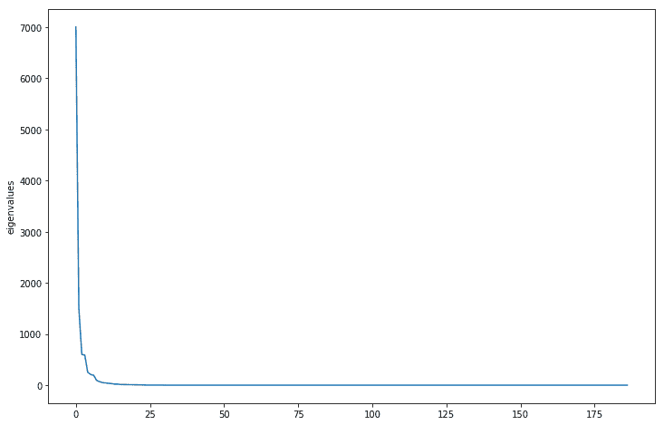
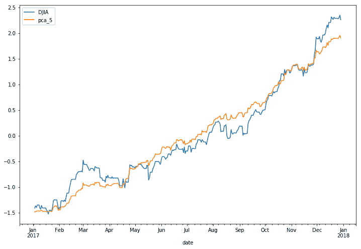
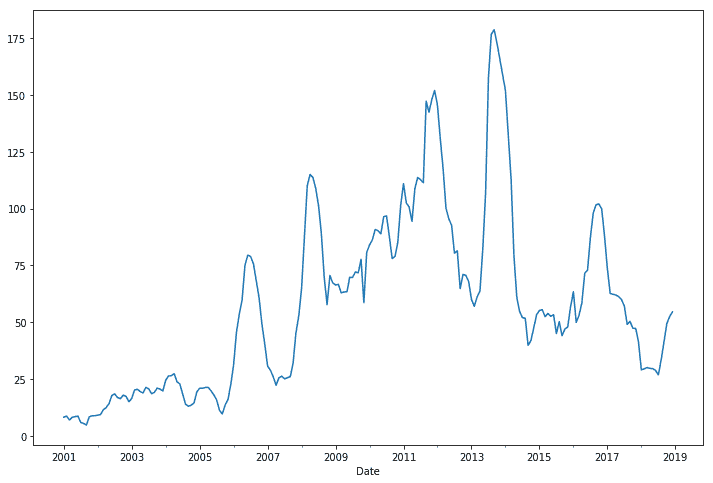
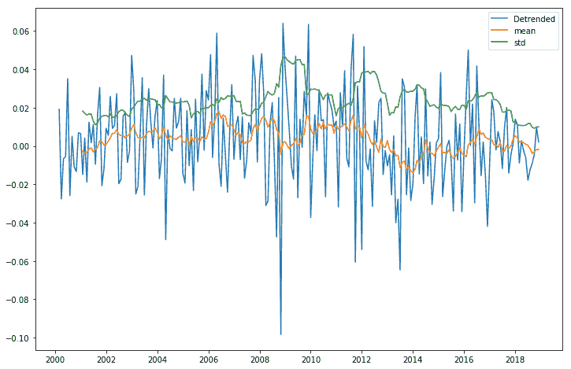
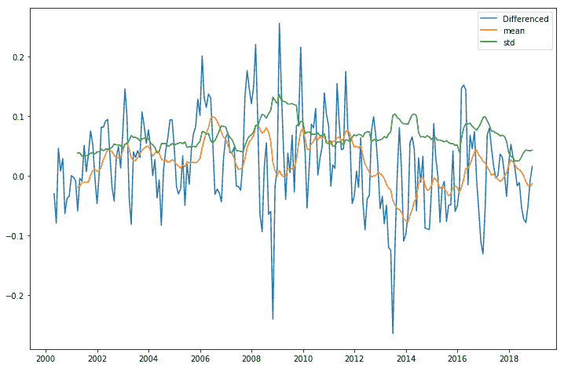
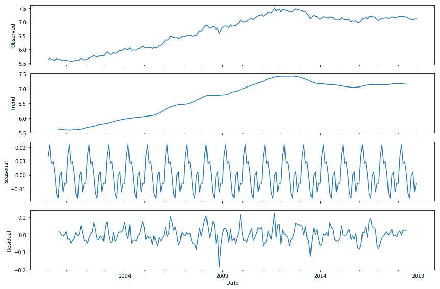
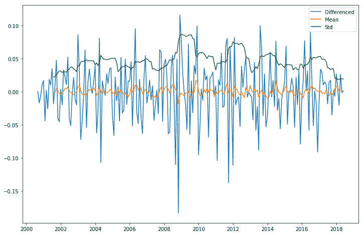
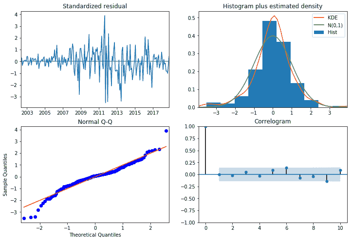
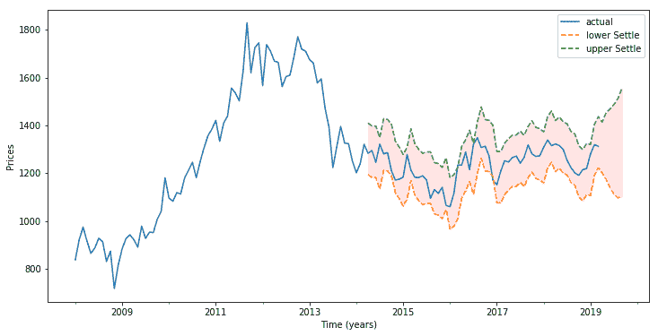

# 第六章：时间序列数据的统计分析

在金融投资组合中，其组成资产的回报取决于许多因素，如宏观和微观经济条件以及各种金融变量。随着因素数量的增加，建模投资组合行为所涉及的复杂性也在增加。鉴于计算资源是有限的，再加上时间限制，为新因素进行额外计算只会增加投资组合建模计算的瓶颈。一种用于降维的线性技术是主成分分析（PCA）。正如其名称所示，PCA 将投资组合资产价格的变动分解为其主要成分或共同因素，以进行进一步的统计分析。不能解释投资组合资产变动很多的共同因素在其因素中获得较少的权重，并且通常被忽略。通过保留最有用的因素，可以大大简化投资组合分析，而不会影响计算时间和空间成本。

在时间序列数据的统计分析中，数据保持平稳对于避免虚假回归是很重要的。非平稳数据可能由受趋势影响的基础过程、季节效应、单位根的存在或三者的组合产生。非平稳数据的统计特性，如均值和方差，会随时间变化。非平稳数据需要转换为平稳数据，以便进行统计分析以产生一致和可靠的结果。这可以通过去除趋势和季节性成分来实现。然后可以使用平稳数据进行预测或预测。

在本章中，我们将涵盖以下主题：

+   对道琼斯及其 30 个成分进行主成分分析

+   重建道琼斯指数

+   理解平稳和非平稳数据之间的区别

+   检查数据的平稳性

+   平稳和非平稳过程的类型

+   使用增广迪基-富勒检验来检验单位根的存在

+   通过去趋势化、差分和季节性分解制作平稳数据

+   使用自回归积分移动平均法进行时间序列预测和预测

# 道琼斯工业平均指数及其 30 个成分

道琼斯工业平均指数（DJIA）是由 30 家最大的美国公司组成的股票市场指数。通常被称为道琼斯，它由 S＆P 道琼斯指数有限责任公司拥有，并以价格加权的方式计算（有关道琼斯的更多信息，请参见[`us.spindices.com/index-family/us-equity/dow-jones-averages`](https://us.spindices.com/index-family/us-equity/dow-jones-averages)）。

本节涉及将道琼斯及其成分的数据集下载到`pandas` DataFrame 对象中，以供本章后续部分使用。

# 从 Quandl 下载道琼斯成分数据集

以下代码从 Quandl 检索道琼斯成分数据集。我们将使用的数据提供者是 WIKI Prices，这是一个由公众成员组成的社区，向公众免费提供数据集。这些数据并非没有错误，因此请谨慎使用。在撰写本文时，该数据源不再受到 Quandl 社区的积极支持，尽管过去的数据集仍可供使用。我们将下载 2017 年的历史每日收盘价：

```py
In [ ]:
    import quandl

    QUANDL_API_KEY = 'BCzkk3NDWt7H9yjzx-DY'  # Your own Quandl key here
    quandl.ApiConfig.api_key = QUANDL_API_KEY

    SYMBOLS = [
        'AAPL','MMM', 'AXP', 'BA', 'CAT',
        'CVX', 'CSCO', 'KO', 'DD', 'XOM',
        'GS', 'HD', 'IBM', 'INTC', 'JNJ',
        'JPM', 'MCD', 'MRK', 'MSFT', 'NKE',
        'PFE', 'PG', 'UNH', 'UTX', 'TRV', 
        'VZ', 'V', 'WMT', 'WBA', 'DIS',
    ]

    wiki_symbols = ['WIKI/%s'%symbol for symbol in SYMBOLS]
    df_components = quandl.get(
        wiki_symbols, 
        start_date='2017-01-01', 
        end_date='2017-12-31', 
        column_index=11)
    df_components.columns = SYMBOLS  # Renaming the columns
```

`wiki_symbols`变量包含我们用于下载的 Quandl 代码列表。请注意，在`quandl.get()`的参数中，我们指定了`column_index=11`。这告诉 Quandl 仅下载每个数据集的第 11 列，这与调整后的每日收盘价相符。数据集以单个`pandas` DataFrame 对象的形式下载到我们的`df_components`变量中。

让我们在分析之前对数据集进行归一化处理：

```py
In [ ]:
    filled_df_components = df_components.fillna(method='ffill')
    daily_df_components = filled_df_components.resample('24h').ffill()
    daily_df_components = daily_df_components.fillna(method='bfill')
```

如果您检查这个数据源中的每个值，您会注意到`NaN`值或缺失数据。由于我们使用的是容易出错的数据，并且为了快速研究 PCA，我们可以通过传播先前观察到的值临时填充这些未知变量。`fillna(method='ffill')`方法有助于执行此操作，并将结果存储在`filled_df_components`变量中。

标准化的另一个步骤是以固定间隔重新取样时间序列，并将其与我们稍后将要下载的道琼斯时间序列数据集完全匹配。`daily_df_components`变量存储了按日重新取样时间序列的结果，重新取样期间的任何缺失值都使用向前填充方法传播。最后，为了解决起始数据不完整的问题，我们将简单地使用`fillna(method='bfill')`对值进行回填。

为了展示 PCA 的目的，我们必须使用免费的低质量数据集。如果您需要高质量的数据集，请考虑订阅数据发布商。

Quandl 不提供道琼斯工业平均指数的免费数据集。在下一节中，我们将探索另一个名为 Alpha Vantage 的数据提供商，作为下载数据集的替代方法。

# 关于 Alpha Vantage

Alpha Vantage ([`www.alphavantage.co`](https://www.alphavantage.co))是一个数据提供商，提供股票、外汇和加密货币的实时和历史数据。与 Quandl 类似，您可以获得 Alpha Vantage REST API 接口的 Python 包装器，并直接将免费数据集下载到`pandas` DataFrame 中。

# 获取 Alpha Vantage API 密钥

从您的网络浏览器访问[`www.alphavantage.co`](https://www.alphavantage.co)，并从主页点击**立即获取您的免费 API 密钥**。您将被带到注册页面。填写关于您自己的基本信息并提交表单。您的 API 密钥将显示在同一页。复制此 API 密钥以在下一节中使用：


# 安装 Alpha Vantage Python 包装器

从您的终端窗口，输入以下命令以安装 Alpha Vantage 的 Python 模块：

```py
$ pip install alpha_vantage
```

# 从 Alpha Vantage 下载道琼斯数据集

以下代码连接到 Alpha Vantage 并下载道琼斯数据集，股票代码为`^DJI`。用您自己的 API 密钥替换常量变量`ALPHA_VANTAGE_API_KEY`的值：

```py
In [ ]:
    """
    Download the all-time DJIA dataset
    """
    from alpha_vantage.timeseries import TimeSeries

    # Update your Alpha Vantage API key here...
    ALPHA_VANTAGE_API_KEY = 'PZ2ISG9CYY379KLI'

    ts = TimeSeries(key=ALPHA_VANTAGE_API_KEY, output_format='pandas')
    df, meta_data = ts.get_daily_adjusted(symbol='^DJI', outputsize='full')
```

`alpha_vantage.timeseries`模块的`TimeSeries`类是用 API 密钥实例化的，并指定数据集自动下载为`pandas` DataFrame 对象。`get_daily_adjusted()`方法使用`outputsize='full'`参数下载给定股票符号的整个可用每日调整价格，并将其存储在`df`变量中作为`DataFrame`对象。

让我们使用`info()`命令检查一下这个 DataFrame：

```py
In [ ]:
    df.info()
Out[ ]:
    <class 'pandas.core.frame.DataFrame'>
    Index: 4760 entries, 2000-01-03 to 2018-11-30
    Data columns (total 8 columns):
    1\. open                 4760 non-null float64
    2\. high                 4760 non-null float64
    3\. low                  4760 non-null float64
    4\. close                4760 non-null float64
    5\. adjusted close       4760 non-null float64
    6\. volume               4760 non-null float64
    7\. dividend amount      4760 non-null float64
    8\. split coefficient    4760 non-null float64
    dtypes: float64(8)
    memory usage: 316.1+ KB
```

我们从 Alpha Vantage 下载的道琼斯数据集提供了从最近可用交易日期一直回到 2000 年的完整时间序列数据。它包含几列给我们额外的信息。

让我们也检查一下这个 DataFrame 的索引：

```py
In [ ]:
    df.index
Out[ ]:
    Index(['2000-01-03', '2000-01-04', '2000-01-05', '2000-01-06', '2000-01-07',
           '2000-01-10', '2000-01-11', '2000-01-12', '2000-01-13', '2000-01-14',
           ...
           '2018-08-17', '2018-08-20', '2018-08-21', '2018-08-22', '2018-08-23',
           '2018-08-24', '2018-08-27', '2018-08-28', '2018-08-29', '2018-08-30'],
          dtype='object', name='date', length=4696)
```

输出表明索引值由字符串类型的对象组成。让我们将这个 DataFrame 转换为适合我们分析的形式：

```py
In [ ]:
    import pandas as pd

    # Prepare the dataframe
    df_dji = pd.DataFrame(df['5\. adjusted close'])
    df_dji.columns = ['DJIA']
    df_dji.index = pd.to_datetime(df_dji.index)

    # Trim the new dataframe and resample
    djia_2017 = pd.DataFrame(df_dji.loc['2017-01-01':'2017-12-31'])
    djia_2017 = djia_2017.resample('24h').ffill()
```

在这里，我们正在获取 2017 年道琼斯的调整收盘价，按日重新取样。结果的 DataFrame 对象存储在`djia_2017`中，我们可以用它来应用 PCA。

# 应用核 PCA

在本节中，我们将执行核 PCA 以找到特征向量和特征值，以便我们可以重建道琼斯指数。

# 寻找特征向量和特征值

我们可以使用 Python 的`sklearn.decomposition`模块的`KernelPCA`类执行核 PCA。默认的核方法是线性的。在 PCA 中使用的数据集需要被标准化，我们可以使用 z-scoring 来实现。以下代码执行此操作：

```py
In [ ]:
    from sklearn.decomposition import KernelPCA

    fn_z_score = lambda x: (x - x.mean()) / x.std()

    df_z_components = daily_df_components.apply(fn_z_score)
    fitted_pca = KernelPCA().fit(df_z_components)
```

`fn_z_score`变量是一个内联函数，用于对`pandas` DataFrame 执行 z 得分，该函数使用`apply()`方法应用。这些归一化的数据集可以使用`fit()`方法拟合到核 PCA 中。每日道琼斯成分价格的拟合结果存储在`fitted_pca`变量中，该变量是相同的`KernelPCA`对象。

PCA 的两个主要输出是特征向量和特征值。**特征向量**是包含主成分线方向的向量，当应用线性变换时不会改变。**特征值**是标量值，指示数据在特定特征向量方向上的方差量。实际上，具有最高特征值的特征向量形成主成分。

`KernelPCA`对象的`alphas_`和`lambdas_`属性返回中心化核矩阵数据集的特征向量和特征值。当我们绘制特征值时，我们得到以下结果：

```py
In [ ]:
    %matplotlib inline
    import matplotlib.pyplot as plt

    plt.rcParams['figure.figsize'] = (12,8)
    plt.plot(fitted_pca.lambdas_)
    plt.ylabel('Eigenvalues')
    plt.show();
```

然后我们应该得到以下输出：



我们可以看到，前几个特征值解释了数据中的大部分方差，并且在后面的成分中变得更加忽略。获取前五个特征值，让我们看看每个特征值给我们提供了多少解释：

```py
In [ ]:
    fn_weighted_avg = lambda x: x / x.sum()
    weighted_values = fn_weighted_avg(fitted_pca.lambdas_)[:5]
In [ ]:
    print(weighted_values)
Out[ ]:
    array([0.64863002, 0.13966718, 0.05558246, 0.05461861, 0.02313883])
```

我们可以看到，第一个成分解释了数据方差的 65%，第二个成分解释了 14%，依此类推。将这些值相加，我们得到以下结果：

```py
In [ ]:
    weighted_values.sum()
Out[ ]:
    0.9216371041932268
```

前五个特征值将解释数据集方差的 92%。

# 使用 PCA 重建道琼斯指数

默认情况下，`KernelPCA`实例化时使用`n_components=None`参数，这将构建一个具有非零成分的核 PCA。我们还可以创建一个具有五个成分的 PCA 指数：

```py
In [ ]:
    import numpy as np

    kernel_pca = KernelPCA(n_components=5).fit(df_z_components)
    pca_5 = kernel_pca.transform(-daily_df_components)

    weights = fn_weighted_avg(kernel_pca.lambdas_)
    reconstructed_values = np.dot(pca_5, weights)

    # Combine DJIA and PCA index for comparison
    df_combined = djia_2017.copy()
    df_combined['pca_5'] = reconstructed_values
    df_combined = df_combined.apply(fn_z_score)
    df_combined.plot(figsize=(12, 8));
```

使用`fit()`方法，我们使用具有五个成分的线性核 PCA 函数拟合了归一化数据集。`transform()`方法使用核 PCA 转换原始数据集。这些值使用由特征向量指示的权重进行归一化，通过点矩阵乘法计算。然后，我们使用`copy()`方法创建了道琼斯时间序列`pandas` DataFrame 的副本，并将其与`df_combined` DataFrame 中的重建值组合在一起。

新的 DataFrame 通过 z 得分进行归一化，并绘制出来，以查看重建的 PCA 指数跟踪原始道琼斯运动的情况。这给我们以下输出：



上面的图显示了 2017 年原始道琼斯指数与重建的道琼斯指数相比，使用了五个主成分。

# 平稳和非平稳时间序列

对于进行统计分析的时间序列数据，重要的是数据是平稳的，以便正确进行统计建模，因为这样的用途可能是用于预测和预测。本节介绍了时间序列数据中的平稳性和非平稳性的概念。

# 平稳性和非平稳性

在经验时间序列研究中，观察到价格变动向某些长期均值漂移，要么向上，要么向下。平稳时间序列是其统计特性（如均值、方差和自相关）随时间保持恒定的时间序列。相反，非平稳时间序列数据的观察结果其统计特性随时间变化，很可能是由于趋势、季节性、存在单位根或三者的组合。

在时间序列分析中，假设基础过程的数据是平稳的。否则，对非平稳数据进行建模可能会产生不可预测的结果。这将导致一种称为伪回归的情况。**伪回归**是指产生误导性的统计证据，表明独立的非平稳变量之间存在关系的回归。为了获得一致和可靠的结果，非平稳数据需要转换为平稳数据。

# 检查平稳性

有多种方法可以检查时间序列数据是平稳还是非平稳：

+   **通过可视化**：您可以查看时间序列图，以明显指示趋势或季节性。

+   **通过统计摘要**：您可以查看数据的统计摘要，寻找显著差异。例如，您可以对时间序列数据进行分组，并比较每组的均值和方差。

+   **通过统计检验**：您可以使用统计检验，如增广迪基-富勒检验，来检查是否满足或违反了平稳性期望。

# 非平稳过程的类型

以下几点有助于识别时间序列数据中的非平稳行为，以便考虑转换为平稳数据：

+   **纯随机游走**：具有单位根或随机趋势的过程。这是一个非均值回归的过程，其方差随时间演变并趋于无穷大。

+   **带漂移的随机游走**：具有随机游走和恒定漂移的过程。

+   **确定性趋势**：均值围绕着固定的趋势增长的过程，该趋势是恒定的且与时间无关。

+   **带漂移和确定性趋势的随机游走**：将随机游走与漂移分量和确定性趋势结合的过程。

# 平稳过程的类型

以下是时间序列研究中可能遇到的平稳性定义：

+   **平稳过程**：生成平稳观测序列的过程。

+   **趋势平稳**：不呈现趋势的过程。

+   **季节性平稳**：不呈现季节性的过程。

+   **严格平稳**：也称为**强平稳**。当随机变量的无条件联合概率分布在时间（或*x*轴上）移动时不发生变化的过程。

+   **弱平稳**：也称为**协方差平稳**或**二阶平稳**。当随机变量的均值、方差和相关性在时间移动时不发生变化的过程。

# 增广迪基-富勒检验

**增广迪基-富勒检验**（**ADF**）是一种统计检验，用于确定时间序列数据中是否存在单位根。单位根可能会导致时间序列分析中的不可预测结果。对单位根检验形成零假设，以确定时间序列数据受趋势影响的程度。通过接受零假设，我们接受时间序列数据是非平稳的证据。通过拒绝零假设，或接受备择假设，我们接受时间序列数据是由平稳过程生成的证据。这个过程也被称为**趋势平稳**。增广迪基-富勒检验统计量的值为负数。较低的 ADF 值表示更强烈地拒绝零假设。

以下是用于 ADF 测试的一些基本自回归模型：

+   没有常数和趋势：


+   没有常数和趋势：


+   带有常数和趋势：


这里，*α*是漂移常数，*β*是时间趋势的系数，*γ*是我们的假设系数，*p*是一阶差分自回归过程的滞后阶数，*ϵ[t]*是独立同分布的残差项。当*α=0*和*β=0*时，模型是一个随机游走过程。当*β=0*时，模型是一个带漂移的随机游走过程。滞后阶数*p*的选择应使得残差不具有序列相关性。一些选择滞后阶数的信息准则的方法包括最小化**阿卡信息准则**（**AIC**）、**贝叶斯信息准则**（**BIC**）和**汉南-奎恩信息准则**。

然后可以将假设表述如下：

+   零假设，*H[0]*：如果未能被拒绝，表明时间序列包含单位根并且是非平稳的

+   备择假设，*H[1]*：如果拒绝*H[0]*，则表明时间序列不包含单位根并且是平稳的

为了接受或拒绝零假设，我们使用 p 值。如果 p 值低于 5%甚至 1%的阈值，我们拒绝零假设。如果 p 值高于此阈值，我们可能未能拒绝零假设，并将时间序列视为非平稳的。换句话说，如果我们的阈值为 5%或 0.05，请注意以下内容：

+   p 值> 0.05：我们未能拒绝零假设*H[0]*，并得出结论，数据具有单位根并且是非平稳的

+   p 值≤0.05：我们拒绝零假设*H[0]*，并得出结论，数据具有单位根并且是非平稳的

`statsmodels`库提供了实现此测试的`adfuller()`函数。

# 分析具有趋势的时间序列

让我们检查一个时间序列数据集。例如，考虑在芝加哥商品交易所交易的黄金期货价格。在 Quandl 上，可以通过以下代码下载黄金期货连续合约：`CHRIS/CME_GC1`。这些数据由维基连续期货社区小组策划，仅考虑了最近的合约。数据集的第六列包含了结算价格。以下代码从 2000 年开始下载数据集：

```py
In [ ]:
    import quandl

    QUANDL_API_KEY = 'BCzkk3NDWt7H9yjzx-DY'  # Your Quandl key here
    quandl.ApiConfig.api_key = QUANDL_API_KEY

    df = quandl.get(
        'CHRIS/CME_GC1', 
        column_index=6,
        collapse='monthly',
        start_date='2000-01-01')
```

使用以下命令检查数据集的头部：

```py
In [ ]:
    df.head()
```

我们得到以下表格：

| **Settle** | **Date** |
| --- | --- |
| **2000-01-31** | 283.2 |
| **2000-02-29** | 294.2 |
| **2000-03-31** | 278.4 |
| **2000-04-30** | 274.7 |
| **2000-05-31** | 271.7 |

将滚动均值和标准差计算到`df_mean`和`df_std`变量中，窗口期为一年：

```py
In [ ] :
    df_settle = df['Settle'].resample('MS').ffill().dropna()

    df_rolling = df_settle.rolling(12)
    df_mean = df_rolling.mean()
    df_std = df_rolling.std()
```

`resample()`方法有助于确保数据在月度基础上平滑，并且`ffill()`方法向前填充任何缺失值。

可以在[`pandas.pydata.org/pandas-docs/stable/user_guide/timeseries.html`](http://pandas.pydata.org/pandas-docs/stable/user_guide/timeseries.html)找到用于指定`resample()`方法的常见有用时间序列频率列表[.](http://pandas.pydata.org/pandas-docs/stable/timeseries.offset-aliases)

让我们可视化滚动均值与原始时间序列的图表：

```py
In [ ] :
    plt.figure(figsize=(12, 8))
    plt.plot(df_settle, label='Original')
    plt.plot(df_mean, label='Mean')
    plt.legend();
```

我们获得以下输出：


将滚动标准差可视化分开，我们得到以下结果：

```py
In [ ] :
    df_std.plot(figsize=(12, 8));
```

我们获得以下输出：



使用`statsmodels`模块，用`adfuller()`方法对我们的数据集进行 ADF 单位根检验：

```py
In [ ]:
    from statsmodels.tsa.stattools import adfuller

    result = adfuller(df_settle)
    print('ADF statistic: ',  result[0])
    print('p-value:', result[1])

    critical_values = result[4]
    for key, value in critical_values.items():
        print('Critical value (%s): %.3f' % (key, value))
Out[ ]:
    ADF statistic:  -1.4017828015895548
    p-value: 0.5814211232134314
    Critical value (1%): -3.461
    Critical value (5%): -2.875
    Critical value (10%): -2.574
```

`adfuller()`方法返回一个包含七个值的元组。特别地，我们对第一个、第二个和第五个值感兴趣，它们分别给出了检验统计量、`p 值`和临界值字典。

从图表中可以观察到，均值和标准差随时间波动，均值呈现总体上升趋势。ADF 检验统计值大于临界值（特别是在 5%时），`p-value`大于 0.05。基于这些结果，我们无法拒绝存在单位根的原假设，并认为我们的数据是非平稳的。

# 使时间序列平稳

非平稳时间序列数据可能受到趋势或季节性的影响。趋势性时间序列数据的均值随时间不断变化。受季节性影响的数据在特定时间间隔内有变化。在使时间序列数据平稳时，必须去除趋势和季节性影响。去趋势、差分和分解就是这样的方法。然后得到的平稳数据适合进行统计预测。

让我们详细看看所有三种方法。

# 去趋势

从非平稳数据中去除趋势线的过程称为**去趋势**。这涉及一个将大值归一化为小值的转换步骤。例如可以是对数函数、平方根函数，甚至是立方根。进一步的步骤是从移动平均值中减去转换值。

让我们对相同的数据集`df_settle`执行去趋势，使用对数变换并从两个周期的移动平均值中减去，如下 Python 代码所示：

```py
In [ ]:
    import numpy as np

    df_log = np.log(df_settle)
In [ ]:
    df_log_ma= df_log.rolling(2).mean()
    df_detrend = df_log - df_log_ma
    df_detrend.dropna(inplace=True)

    # Mean and standard deviation of detrended data
    df_detrend_rolling = df_detrend.rolling(12)
    df_detrend_ma = df_detrend_rolling.mean()
    df_detrend_std = df_detrend_rolling.std()

    # Plot
    plt.figure(figsize=(12, 8))
    plt.plot(df_detrend, label='Detrended')
    plt.plot(df_detrend_ma, label='Mean')
    plt.plot(df_detrend_std, label='Std')
    plt.legend(loc='upper right');

```

`df_log`变量是我们使用`numpy`模块的对数函数转换的`pandas` DataFrame，`df_detrend`变量包含去趋势数据。我们绘制这些去趋势数据，以可视化其在滚动一年期间的均值和标准差。

我们得到以下输出：



观察到均值和标准差没有表现出长期趋势。

观察去趋势数据的 ADF 检验统计量，我们得到以下结果：

```py
In [ ]:
    from statsmodels.tsa.stattools import adfuller

    result = adfuller(df_detrend)
    print('ADF statistic: ', result[0])
    print('p-value: %.5f' % result[1])

    critical_values = result[4]
    for key, value in critical_values.items():
        print('Critical value (%s): %.3f' % (key, value))
Out[ ]:
    ADF statistic:  -17.04239232215001
    p-value: 0.00000
    Critical value (1%): -3.460
    Critical value (5%): -2.874
    Critical value (10%): -2.574
```

这个去趋势数据的`p-value`小于 0.05。我们的 ADF 检验统计量低于所有临界值。我们可以拒绝原假设，并说这个数据是平稳的。

# 通过差分去除趋势

差分涉及将时间序列值与时间滞后进行差分。时间序列的一阶差分由以下公式给出：


我们可以重复使用前一节中的`df_log`变量作为我们的对数转换时间序列，并利用 NumPy 模块的`diff()`和`shift()`方法进行差分，代码如下：

```py
In [ ]:
    df_log_diff = df_log.diff(periods=3).dropna()

    # Mean and standard deviation of differenced data
    df_diff_rolling = df_log_diff.rolling(12)
    df_diff_ma = df_diff_rolling.mean()
    df_diff_std = df_diff_rolling.std()

    # Plot the stationary data
    plt.figure(figsize=(12, 8))
    plt.plot(df_log_diff, label='Differenced')
    plt.plot(df_diff_ma, label='Mean')
    plt.plot(df_diff_std, label='Std')
    plt.legend(loc='upper right');
```

`diff()`的参数`periods=3`表示在计算差异时数据集向后移动三个周期。

这提供了以下输出：



从图表中可以观察到，滚动均值和标准差随时间变化很少。

观察我们的 ADF 检验统计量，我们得到以下结果：

```py
In [ ]:
    from statsmodels.tsa.stattools import adfuller

    result = adfuller(df_log_diff)

    print('ADF statistic:', result[0])
    print('p-value: %.5f' % result[1])

    critical_values = result[4]
    for key, value in critical_values.items():
        print('Critical value (%s): %.3f' % (key, value))
Out[ ]:
    ADF statistic: -2.931684356800213
    p-value: 0.04179
    Critical value (1%): -3.462
    Critical value (5%): -2.875
    Critical value (10%): -2.574
```

从 ADF 检验中，此数据的`p-value`小于 0.05。我们的 ADF 检验统计量低于 5%的临界值，表明此数据在 95%的置信水平下是平稳的。我们可以拒绝原假设，并说这个数据是平稳的。

# 季节性分解

分解涉及对趋势和季节性进行建模，然后将它们移除。我们可以使用`statsmodel.tsa.seasonal`模块来使用移动平均模型非平稳时间序列数据，并移除其趋势和季节性成分。

通过重复使用包含先前部分数据集对数的`df_log`变量，我们得到以下结果：

```py
In [ ]:
    from statsmodels.tsa.seasonal import seasonal_decompose

    decompose_result = seasonal_decompose(df_log.dropna(), freq=12)

    df_trend = decompose_result.trend
    df_season = decompose_result.seasonal
    df_residual = decompose_result.resid
```

`statsmodels.tsa.seasonal`的`seasonal_decompose()`方法需要一个参数`freq`，它是一个整数值，指定每个季节周期的周期数。由于我们使用的是月度数据，我们期望每个季节年有 12 个周期。该方法返回一个对象，主要包括趋势和季节分量，以及最终的`pandas`系列数据，其趋势和季节分量已被移除。

有关`statsmodels.tsa.seasonal`模块的`seasonal_decompose()`方法的更多信息可以在[`www.statsmodels.org/dev/generated/statsmodels.tsa.seasonal.seasonal_decompose.html`](https://www.statsmodels.org/dev/generated/statsmodels.tsa.seasonal.seasonal_decompose.html)找到。

通过运行以下 Python 代码来可视化不同的图表：

```py
In [ ]:
    plt.rcParams['figure.figsize'] = (12, 8)
    fig = decompose_result.plot()
```

我们得到以下图表：



在这里，我们可以看到单独的趋势和季节分量从数据集中被移除并绘制，残差在底部绘制。让我们可视化一下我们的残差的统计特性：

```py
In [ ]:
    df_log_diff = df_residual.diff().dropna()

    # Mean and standard deviation of differenced data
    df_diff_rolling = df_log_diff.rolling(12)
    df_diff_ma = df_diff_rolling.mean()
    df_diff_std = df_diff_rolling.std()

    # Plot the stationary data
    plt.figure(figsize=(12, 8))
    plt.plot(df_log_diff, label='Differenced')
    plt.plot(df_diff_ma, label='Mean')
    plt.plot(df_diff_std, label='Std')
    plt.legend();
```

我们得到以下图表：



从图表中观察到，滚动均值和标准差随时间变化很少。

通过检查我们的残差数据的平稳性，我们得到以下结果：

```py
In [ ]:
    from statsmodels.tsa.stattools import adfuller    

    result = adfuller(df_residual.dropna())

    print('ADF statistic:',  result[0])
    print('p-value: %.5f' % result[1])

    critical_values = result[4]
    for key, value in critical_values.items():
        print('Critical value (%s): %.3f' % (key, value))
Out[ ]:
    ADF statistic: -6.468683205304995
    p-value: 0.00000
    Critical value (1%): -3.463
    Critical value (5%): -2.876
    Critical value (10%): -2.574
```

从 ADF 测试中，这些数据的`p-value`小于 0.05。我们的 ADF 测试统计量低于所有临界值。我们可以拒绝零假设，并说这些数据是平稳的。

# ADF 测试的缺点

在使用 ADF 测试可靠检查非平稳数据时，有一些考虑事项：

+   ADF 测试不能真正区分纯单元根生成过程和非单元根生成过程。在长期移动平均过程中，ADF 测试在拒绝零假设方面存在偏差。其他检验平稳性的方法，如**Kwiatkowski–Phillips–Schmidt–Shin**（**KPSS**）检验和**Phillips-Perron**检验，采用了不同的方法来处理单位根的存在。

+   在确定滞后长度*p*时没有固定的方法。如果*p*太小，剩余误差中的序列相关性可能会影响检验的大小。如果*p*太大，检验的能力将会下降。对于这个滞后阶数，还需要进行额外的考虑。

+   随着确定性项被添加到测试回归中，单位根测试的能力减弱。

# 时间序列的预测和预测

在上一节中，我们确定了时间序列数据中的非平稳性，并讨论了使时间序列数据平稳的技术。有了平稳的数据，我们可以进行统计建模，如预测和预测。预测涉及生成样本内数据的最佳估计。预测涉及生成样本外数据的最佳估计。预测未来值是基于先前观察到的值。其中一个常用的方法是自回归积分移动平均法。

# 关于自回归积分移动平均

**自回归积分移动平均**（**ARIMA**）是基于线性回归的平稳时间序列的预测模型。顾名思义，它基于三个组件：

+   **自回归**（**AR**）：使用观察和滞后值之间的依赖关系的模型

+   **积分**（**I**）：使用差分观察和以前时间戳的观察来使时间序列平稳

+   **移动平均**（**MA**）：使用观察误差项和先前误差项的组合之间的依赖关系的模型，*e*[*t*]

ARIMA 模型的标记是*ARIMA(p, d, q)*，对应于三个组件的参数。可以通过改变*p*、*d*和*q*的值来指定非季节性 ARIMA 模型，如下所示：

+   **ARIMA**(***p*,0,0**): 一阶自回归模型，用*AR(p)*表示。*p*是滞后阶数，表示模型中滞后观察值的数量。例如，*ARIMA(2,0,0)*是*AR(2)*，表示如下：


在这里，*ϕ[1]*和*ϕ[2]*是模型的参数。

+   **ARIMA**(**0,*d*,0**): 整合分量中的一阶差分，也称为随机游走，用*I(d)*表示。*d*是差分的程度，表示数据被减去过去值的次数。例如，*ARIMA(0,1,0)*是*I(1)*，表示如下：


在这里，*μ*是季节差分的均值。

+   **ARIMA(0,0,*q*)**：移动平均分量，用*MA(q)*表示。阶数*q*决定了模型中要包括的项数：


# 通过网格搜索找到模型参数

网格搜索，也称为超参数优化方法，可用于迭代地探索不同的参数组合，以拟合我们的 ARIMA 模型。我们可以在每次迭代中使用`statsmodels`模块的`SARIMAX()`函数拟合季节性 ARIMA 模型，返回一个`MLEResults`类的对象。`MLEResults`对象具有一个`aic`属性，用于返回 AIC 值。具有最低 AIC 值的模型为我们提供了最佳拟合模型，确定了我们的*p*、*d*和*q*参数。有关 SARIMAX 的更多信息，请访问[`www.statsmodels.org/dev/generated/statsmodels.tsa.statespace.sarimax.SARIMAX.html`](https://www.statsmodels.org/dev/generated/statsmodels.tsa.statespace.sarimax.SARIMAX.html)。

我们将网格搜索过程定义为`arima_grid_search()`函数，如下所示：

```py
In [ ]:
    import itertools    
    import warnings
    from statsmodels.tsa.statespace.sarimax import SARIMAX

    warnings.filterwarnings("ignore")

    def arima_grid_search(dataframe, s):
        p = d = q = range(2)
        param_combinations = list(itertools.product(p, d, q))
        lowest_aic, pdq, pdqs = None, None, None
        total_iterations = 0
        for order in param_combinations:    
            for (p, q, d) in param_combinations:
                seasonal_order = (p, q, d, s)
                total_iterations += 1
                try:
                    model = SARIMAX(df_settle, order=order, 
                        seasonal_order=seasonal_order, 
                        enforce_stationarity=False,
                        enforce_invertibility=False,
                        disp=False
                    )
                    model_result = model.fit(maxiter=200, disp=False)

                    if not lowest_aic or model_result.aic < lowest_aic:
                        lowest_aic = model_result.aic
                        pdq, pdqs = order, seasonal_order

                except Exception as ex:
                    continue

        return lowest_aic, pdq, pdqs 
```

我们的变量`df_settle`保存了我们在上一节中下载的期货数据的月度价格。在**SARIMAX（具有外生回归器的季节性自回归整合移动平均模型）**函数中，我们提供了`seasonal_order`参数，这是*ARIMA(p,d,q,s)*季节性分量，其中*s*是数据集中一个季节的周期数。由于我们使用的是月度数据，我们使用 12 个周期来定义季节模式。`enforce_stationarity=False`参数不会将 AR 参数转换为强制模型的 AR 分量。`enforce_invertibility=False`参数不会将 MA 参数转换为强制模型的 MA 分量。`disp=False`参数在拟合模型时抑制输出信息。

定义了网格函数后，我们现在可以使用我们的月度数据调用它，并打印出具有最低 AIC 值的模型参数：

```py
In [ ]:
    lowest_aic, order, seasonal_order = arima_grid_search(df_settle, 12)
In [ ]:
    print('ARIMA{}x{}'.format(order, seasonal_order))
    print('Lowest AIC: %.3f'%lowest_aic)
Out[ ]:
    ARIMA(0, 1, 1)x(0, 1, 1, 12)
    Lowest AIC: 2149.636
```

`ARIMA(0,1,1,12)`季节性分量模型将在 2149.636 的 AIC 值处得到最低值。我们将使用这些参数在下一节中拟合我们的 SARIMAX 模型。

# 拟合 SARIMAX 模型

获得最佳模型参数后，使用`summary()`方法检查拟合结果的模型属性，以查看详细的统计信息：

```py
In [ ]:
    model = SARIMAX(
        df_settle,
        order=order,
        seasonal_order=seasonal_order,
        enforce_stationarity=False,
        enforce_invertibility=False,
        disp=False
    )

    model_results = model.fit(maxiter=200, disp=False)
    print(model_results.summary())
```

这给出了以下输出：

```py
                                 Statespace Model Results                                 
==========================================================================================
Dep. Variable:                             Settle   No. Observations:                  226
Model:             SARIMAX(0, 1, 1)x(0, 1, 1, 12)   Log Likelihood               -1087.247
Date:                            Sun, 02 Dec 2018   AIC                           2180.495
Time:                                    17:38:32   BIC                           2190.375
Sample:                                02-01-2000   HQIC                          2184.494
                                     - 11-01-2018                                         
Covariance Type:                              opg                                         
==============================================================================
                 coef    std err          z      P>|z|      [0.025      0.975]
------------------------------------------------------------------------------
ma.L1         -0.1716      0.044     -3.872      0.000      -0.258      -0.085
ma.S.L12      -1.0000    447.710     -0.002      0.998    -878.496     876.496
sigma2      2854.6342   1.28e+06      0.002      0.998    -2.5e+06    2.51e+06
===================================================================================
Ljung-Box (Q):                       67.93   Jarque-Bera (JB):                52.74
Prob(Q):                              0.00   Prob(JB):                         0.00
Heteroskedasticity (H):               6.98   Skew:                            -0.34
Prob(H) (two-sided):                  0.00   Kurtosis:                         5.43
===================================================================================

Warnings:
[1] Covariance matrix calculated using the outer product of gradients (complex-step).
```

重要的是要运行模型诊断，以调查模型假设是否被违反：

```py
In [ ]:
    model_results.plot_diagnostics(figsize=(12, 8));
```

我们得到以下输出：



右上角的图显示了标准化残差的**核密度估计**（**KDE**），这表明误差服从均值接近于零的高斯分布。让我们看一下残差的更准确的统计信息：

```py
In [ ] :
    model_results.resid.describe()
Out[ ]:
   count    223.000000
    mean       0.353088
    std       57.734027
    min     -196.799109
    25%      -22.036234
    50%        3.500942
    75%       22.872743
    max      283.200000
    dtype: float64
```

从残差的描述中，非零均值表明预测可能存在正向偏差。

# 预测和预测 SARIMAX 模型

`model_results`变量是`statsmodel`模块的`SARIMAXResults`对象，代表 SARIMAX 模型的输出。它包含一个`get_prediction()`方法，用于执行样本内预测和样本外预测。它还包含一个`conf_int()`方法，返回预测的置信区间，包括拟合参数的下限和上限，默认情况下为 95%置信区间。让我们应用这些方法：

```py
In [ ]:
    n = len(df_settle.index)
    prediction = model_results.get_prediction(
        start=n-12*5, 
        end=n+5
    )
    prediction_ci = prediction.conf_int()
```

`get_prediction()`方法中的`start`参数表示我们正在对最近五年的价格进行样本内预测。同时，使用`end`参数，我们正在对接下来的五个月进行样本外预测。

通过检查前三个预测的置信区间值，我们得到以下结果：

```py
In [ ]:
    print(prediction_ci.head(3))
Out[ ]:
                lower Settle  upper Settle
    2017-09-01   1180.143917   1396.583325
    2017-10-01   1204.307842   1420.747250
    2017-11-01   1176.828881   1393.268289
```

让我们将预测和预测的价格与我们的原始数据集从 2008 年开始进行对比：

```py
In  [ ]:
    plt.figure(figsize=(12, 6))

    ax = df_settle['2008':].plot(label='actual')
    prediction_ci.plot(
        ax=ax, style=['--', '--'],
        label='predicted/forecasted')

    ci_index = prediction_ci.index
    lower_ci = prediction_ci.iloc[:, 0]
    upper_ci = prediction_ci.iloc[:, 1]

    ax.fill_between(ci_index, lower_ci, upper_ci,
        color='r', alpha=.1)

    ax.set_xlabel('Time (years)')
    ax.set_ylabel('Prices')

    plt.legend()
    plt.show()
```

这给我们以下输出：



实线图显示了观察值，而虚线图显示了五年滚动预测，紧密跟随并受到阴影区域内的置信区间的限制。请注意，随着接下来五个月的预测进入未来，置信区间扩大以反映对前景的不确定性。

# 摘要

在本章中，我们介绍了 PCA 作为投资组合建模中的降维技术。通过将投资组合资产价格的波动分解为其主要成分或共同因素，可以保留最有用的因素，并且可以大大简化投资组合分析，而不会影响计算时间和空间复杂性。通过使用`sklearn.decomposition`模块的`KernelPCA`函数将 PCA 应用于道琼指数及其 30 个成分，我们获得了特征向量和特征值，用于用五个成分重构道琼指数。

在时间序列数据的统计分析中，数据被视为平稳或非平稳。平稳的时间序列数据是其统计特性随时间保持不变的数据。非平稳的时间序列数据其统计特性随时间变化，很可能是由于趋势、季节性、存在单位根或三者的组合。从非平稳数据建模可能产生虚假回归。为了获得一致和可靠的结果，非平稳数据需要转换为平稳数据。

我们使用统计检验，如 ADF，来检查是否满足或违反了平稳性期望。`statsmodels.tsa.stattools`模块的`adfuller`方法提供了检验统计量、p 值和临界值，从中我们可以拒绝零假设，即数据具有单位根且是非平稳的。

我们通过去趋势化、差分和季节性分解将非平稳数据转换为平稳数据。通过使用 ARIMA，我们使用`statsmodels.tsa.statespace.sarimax`模块的`SARIMAX`函数拟合模型，以找到通过迭代网格搜索过程给出最低 AIC 值的合适模型参数。拟合结果用于预测和预测。

在下一章中，我们将使用 VIX 进行交互式金融分析。
