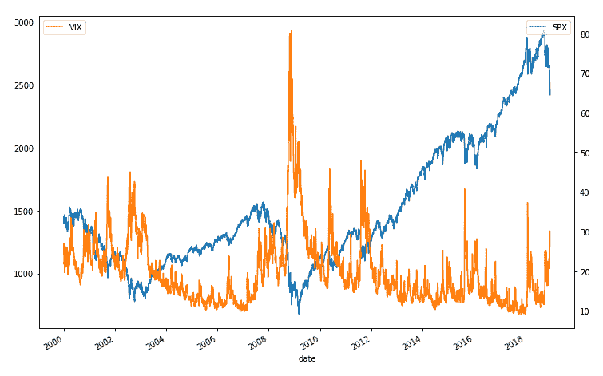
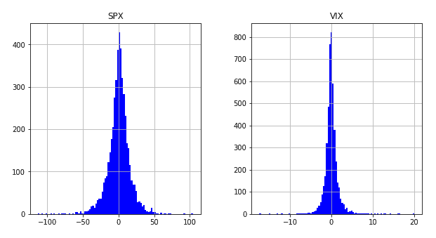
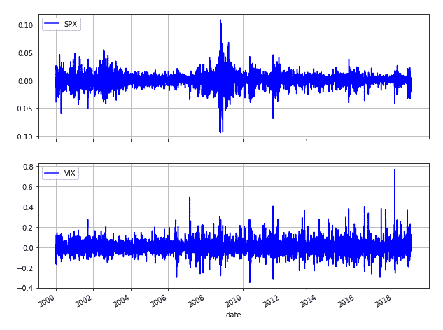
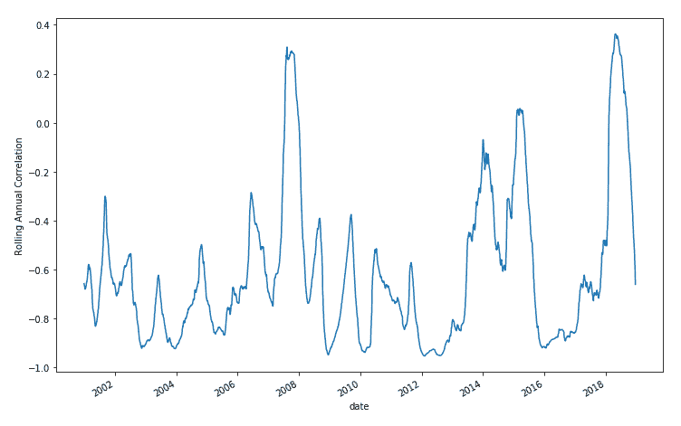
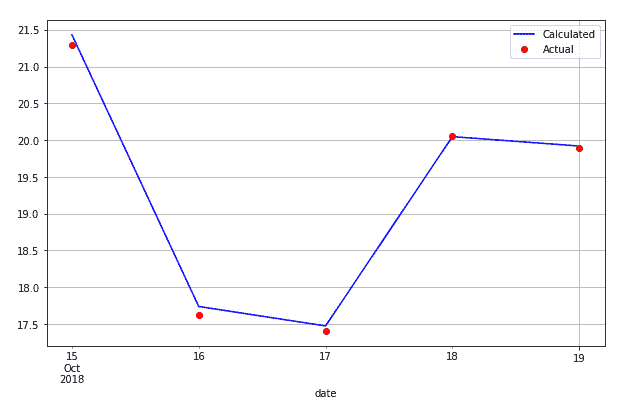

# 第七章：与 VIX 一起进行交互式金融分析

投资者使用波动率衍生品来分散和对冲他们在股票和信用组合中的风险。由于股票基金的长期投资者面临下行风险，波动率可以用作尾部风险的对冲和看涨期权的替代品。在美国，芝加哥期权交易所（CBOE）的波动率指数（VIX），或简称 VIX，衡量了具有平均到期日为 30 天的标准普尔 500 股票指数期权隐含的短期波动率。世界各地许多人使用 VIX 来衡量未来 30 天的股票市场波动性。在欧洲，等效的波动率对应指标是 EURO STOXX 50 波动率（VSTOXX）市场指数。对于利用 S&P 500 指数的基准策略，其与 VIX 的负相关性的性质提供了一种可行的方式来避免基准再平衡成本。波动性的统计性质允许交易员执行均值回归策略、离散交易和波动性价差交易等策略。

在本章中，我们将看看如何对 VIX 和 S&P 500 指数进行数据分析。使用 S&P 500 指数期权，我们可以重建 VIX 并将其与观察值进行比较。这里呈现的代码在 Jupyter Notebook 上运行，这是 Python 的交互式组件，可以帮助我们可视化数据并研究它们之间的关系。

在本章中，我们将讨论以下主题：

+   介绍 EURO STOXX 50 指数、VSTOXX 和 VIX

+   对 S&P 500 指数和 VIX 进行金融分析

+   根据 CBOE VIX 白皮书逐步重建 VIX 指数

+   寻找 VIX 指数的近期和次期期权

+   确定期权数据集的行权价边界

+   通过行权价对 VIX 的贡献进行制表

+   计算近期和次期期权的远期水平

+   计算近期和次期期权的波动率值

+   同时计算多个 VIX 指数

+   将计算出的指数结果与实际的标准普尔 500 指数进行比较

# 波动率衍生品

全球最受欢迎的两个波动率指数是 VIX 和 VSTOXX，分别在美国和欧洲可用。VIX 基于标准普尔 500 指数，在 CBOE 上发布。虽然 VIX 本身不进行交易，但 VIX 的衍生产品，如期权、期货、交易所交易基金和一系列基于波动性的证券可供投资者选择。CBOE 网站提供了许多期权和市场指数的全面信息，如标准普尔 500 标准和周期期权，以及我们可以分析的 VIX。在本章的后面部分，我们将首先了解这些产品的背景，然后进行金融分析。

# STOXX 和 Eurex

在美国，标准普尔 500 指数是最广泛关注的股票市场指数之一，由标准普尔道琼斯指数创建。在欧洲，STOXX 有限公司是这样一家公司。

成立于 1997 年，STOXX 有限公司总部位于瑞士苏黎世，在全球计算大约 7000 个指数。作为一个指数提供商，它开发、维护、分发和推广一系列严格基于规则和透明的指数。

STOXX 在这些类别提供了许多股票指数：基准指数、蓝筹股指数、股息指数、规模指数、行业指数、风格指数、优化指数、策略指数、主题指数、可持续性指数、信仰指数、智能贝塔指数和计算产品。

Eurex 交易所是德国法兰克福的衍生品交易所，提供超过 1900 种产品，包括股票指数、期货、期权、交易所交易基金、股息、债券和回购。STOXX 的许多产品和衍生品在 Eurex 上交易。

# EURO STOXX 50 指数

由 STOXX 有限公司设计，EURO STOXX 50 指数是全球最流动的股票指数之一，服务于 Eurex 上列出的许多指数产品。它于 1998 年 2 月 26 日推出，由来自奥地利、比利时、芬兰、法国、德国、希腊、爱尔兰、意大利、卢森堡、荷兰、葡萄牙和西班牙的 50 只蓝筹股组成。EURO STOXX 50 指数期货和期权合约可在 Eurex 交易所上交易。指数每 15 秒基于实时价格重新计算一次。

EURO STOXX 50 指数的股票代码是 SX5E。EURO STOXX 50 指数期权的股票代码是 OESX。

# VSTOXX

VSTOXX 或 EURO STOXX 50 波动率是由 Eurex 交易所提供服务的一类波动率衍生品。VSTOXX 市场指数基于一篮子 OESX 报价的平价或虚价。它衡量了未来 30 天在 EURO STOXX 50 指数上的隐含市场波动率。

投资者利用波动率衍生品进行基准策略，利用 EURO STOXX 50 指数的负相关性，可以避免基准再平衡成本。波动率的统计性质使交易员能够执行均值回归策略、离散交易和波动率价差交易等。指数每 5 秒重新计算一次。

VSTOXX 的股票代码是 V2TX。基于 VSTOXX 指数的 VSTOXX 期权和 VSTOXX 迷你期货在 Eurex 交易所交易。

# 标普 500 指数

标普 500 指数（SPX）的历史可以追溯到 1923 年，当时它被称为综合指数。最初，它跟踪了少量股票。1957 年，跟踪的股票数量扩大到 500 只，并成为了 SPX。

构成 SPX 的股票在纽约证券交易所（NYSE）或全国证券经纪人自动报价系统（NASDAQ）上公开上市。该指数被认为是美国经济的主要代表，通过大市值普通股。指数每 15 秒重新计算一次，并由路透美国控股公司分发。

交易所使用的常见股票代码是 SPX 和 INX，一些网站上是^GSPC。

# SPX 期权

芝加哥期权交易所提供各种期权合约进行交易，包括标普 500 指数等股票指数期权。SPX 指数期权产品具有不同的到期日。标准或传统的 SPX 期权每月第三个星期五到期，并在交易日开始结算。SPX 周期（SPXW）期权产品可能每周到期，分别在星期一、星期三和星期五，或每月在月末最后一个交易日到期。如果到期日落在交易所假日，到期日将提前至前一个交易日。其他 SPX 期权是迷你期权，交易量为名义规模的十分之一，以及标普 500 指数存托凭证交易基金（SPDR ETF）。大多数 SPX 指数期权是欧式风格，除了 SPDR ETF 是美式风格。

# VIX

与 STOXX 一样，芝加哥期权交易所 VIX 衡量了标普 500 股票指数期权价格隐含的短期波动率。芝加哥期权交易所 VIX 始于 1993 年，基于标普 100 指数，于 2003 年更新为基于 SPX，并于 2014 年再次更新以包括 SPXW 期权。全球许多人认为 VIX 是未来 30 天股市波动的流行测量工具。VIX 每 15 秒重新计算一次，并由芝加哥期权交易所分发。

VIX 期权和 VIX 期货基于 VIX，在芝加哥期权交易所交易。

# 标普 500 和 VIX 的金融分析

在本节中，我们将研究 VIX 与标普 500 市场指数之间的关系。

# 收集数据

我们将使用 Alpha Vantage 作为我们的数据提供商。让我们按以下步骤下载 SPX 和 VIX 数据集：

1.  查询具有股票代码`^GSPC`的全时 S&P 500 历史数据：

```py
In [ ]:
    from alpha_vantage.timeseries import TimeSeries

     # Update your Alpha Vantage API key here...
     ALPHA_VANTAGE_API_KEY = 'PZ2ISG9CYY379KLI'

     ts = TimeSeries(key=ALPHA_VANTAGE_API_KEY, output_format='pandas')
     df_spx_data, meta_data = ts.get_daily_adjusted(
         symbol='^GSPC', outputsize='full')
```

1.  对于具有股票代码`^VIX`的 VIX 指数也做同样的操作：

```py
In [ ]:
    df_vix_data, meta_data = ts.get_daily_adjusted(
         symbol='^VIX', outputsize='full')
```

1.  检查 DataFrame 对象`df_spx_data`的内容：

```py
In [ ]:
    df_spx_data.info()
Out[ ]:   
    <class 'pandas.core.frame.DataFrame'>
    Index: 4774 entries, 2000-01-03 to 2018-12-21
    Data columns (total 8 columns):
    1\. open                 4774 non-null float64
    2\. high                 4774 non-null float64
    3\. low                  4774 non-null float64
    4\. close                4774 non-null float64
    5\. adjusted close       4774 non-null float64
    6\. volume               4774 non-null float64
    7\. dividend amount      4774 non-null float64
    8\. split coefficient    4774 non-null float64
    dtypes: float64(8)
    memory usage: 317.0+ KB
```

1.  检查 DataFrame 对象`df_vix_data`的内容：

```py
In [ ]:
    df_vix_data.info()
Out[ ]: 
    <class 'pandas.core.frame.DataFrame'>
    Index: 4774 entries, 2000-01-03 to 2018-12-21
    Data columns (total 8 columns):
    1\. open                 4774 non-null float64
    2\. high                 4774 non-null float64
    3\. low                  4774 non-null float64
    4\. close                4774 non-null float64
    5\. adjusted close       4774 non-null float64
    6\. volume               4774 non-null float64
    7\. dividend amount      4774 non-null float64
    8\. split coefficient    4774 non-null float64
    dtypes: float64(8)
    memory usage: 317.0+ KB
```

1.  注意，两个数据集的开始日期都是从 2000 年 1 月 3 日开始的，第五列标记为`5\. adjusted close`包含我们感兴趣的值。提取这两列并将它们合并成一个`pandas` DataFrame：

```py
In [ ]:
    import pandas as pd

    df = pd.DataFrame({
        'SPX': df_spx_data['5\. adjusted close'],
        'VIX': df_vix_data['5\. adjusted close']
    })
    df.index = pd.to_datetime(df.index)
```

1.  `pandas`的`to_datetime()`方法将作为字符串对象给出的交易日期转换为 pandas 的`DatetimeIndex`对象。检查我们最终的 DataFrame 对象`df`的头部，得到以下结果：

```py
In [ ]:
    df.head(3)
```

这给我们以下表格：

| **日期** | **SPX** | **VIX** |
| --- | --- | --- |
| 2000-01-03 | 1455.22 | 24.21 |
| 2000-01-04 | 1399.42 | 27.01 |
| 2000-01-05 | 1402.11 | 26.41 |

查看我们格式化的指数，得到以下结果：

```py
In [ ]:
    df.index
Out[ ]:
    DatetimeIndex(['2000-01-03', '2000-01-04', '2000-01-05', '2000-01-06',
                   '2000-01-07', '2000-01-10', '2000-01-11', '2000-01-12',
                   '2000-01-13', '2000-01-14',
                   ...
                   '2018-10-11', '2018-10-12', '2018-10-15', '2018-10-16',
                   '2018-10-17', '2018-10-18', '2018-10-19', '2018-10-22',
                   '2018-10-23', '2018-10-24'],
                  dtype='datetime64[ns]', name='date', length=4734, freq=None)
```

有了正确格式的`pandas` DataFrame，让我们继续处理这个数据集。

# 执行分析

`pandas`的`describe()`方法给出了 DataFrame 对象中每列的摘要统计和值的分布：

```py
In [ ]:
    df.describe()
```

这给我们以下表格：

|  | **SPX** |
| --- | --- |
| **count** | 4734.000000 |
| **mean** | 1493.538998 |
| **std** | 500.541938 |
| **min** | 676.530000 |
| **25%** | 1140.650000 |
| **50%** | 1332.730000 |
| **75%** | 1840.515000 |
| **max** | 2930.750000 |

另一个相关的方法`info()`，之前使用过，给我们 DataFrame 的技术摘要，如指数范围和内存使用情况：

```py
In [ ]:
    df.info()
Out[ ]:    
    <class 'pandas.core.frame.DataFrame'>
    DatetimeIndex: 4734 entries, 2000-01-03 to 2018-10-24
    Data columns (total 2 columns):
    SPX    4734 non-null float64
    VIX    4734 non-null float64
    dtypes: float64(2)
    memory usage: 111.0 KB
```

让我们绘制 S&P 500 和 VIX，看看它们从 2010 年开始是什么样子：

```py
In [ ]:
    %matplotlib inline
    import matplotlib.pyplot as plt

    plt.figure(figsize = (12, 8))

    ax_spx = df['SPX'].plot()
    ax_vix = df['VIX'].plot(secondary_y=True)

    ax_spx.legend(loc=1)
    ax_vix.legend(loc=2)

    plt.show();
```

这给我们以下图表：



注意，当 S&P 500 上涨时，VIX 似乎下降，表现出负相关关系。我们需要进行更多的统计分析来确保。

也许我们对两个指数的日回报感兴趣。`diff()`方法返回前一期值之间的差异集。直方图可用于在 100 个 bin 间隔上给出数据密度估计的大致感觉：

```py
In [ ]:
    df.diff().hist(
        figsize=(10, 5),
        color='blue',
        bins=100);
```

`hist()`方法给出了以下直方图：



使用`pct_change()`命令也可以实现相同的效果，它给出了前一期值的百分比变化：

```py
In [ ]:
    df.pct_change().hist(
         figsize=(10, 5),
          color='blue',
          bins=100);
```

我们得到了相同的直方图，以百分比变化为单位：


对于收益的定量分析，我们对每日收益的对数感兴趣。为什么使用对数收益而不是简单收益？有几个原因，但最重要的是归一化，这避免了负价格的问题。

我们可以使用`pandas`的`shift()`函数将值向前移动一定数量的期间。`dropna()`方法删除对数计算转换末尾未使用的值。NumPy 的`log()`方法帮助计算 DataFrame 对象中所有值的对数，并将其存储在`log_returns`变量中作为 DataFrame 对象。然后可以绘制对数值，得到每日对数收益的图表。以下是绘制对数值的代码：

```py
In [ ]:
    import numpy as np

    log_returns = np.log(df / df.shift(1)).dropna()
    log_returns.plot(
        subplots=True,
        figsize=(10, 8),
        color='blue',
        grid=True
    );
    for ax in plt.gcf().axes:
        ax.legend(loc='upper left')
```

我们得到以下输出：



顶部和底部图表分别显示了 SPX 和 VIX 的对数收益，从 2000 年到现在的期间。

# SPX 和 VIX 之间的相关性

我们可以使用`corr()`方法来推导`pandas` DataFrame 对象中每列值之间的相关值，如以下 Python 示例所示：

```py
In [ ]:
    log_returns.corr()
```

这给我们以下相关性表：

|  | **SPX** | **VIX** |
| --- | --- | --- |
| **SPX** | 1.000000 | -0.733161 |
| **VIX** | -0.733161 | 1.000000 |

在-0.731433 处，SPX 与 VIX 呈负相关。为了更好地可视化这种关系，我们可以将每组日对数收益值绘制成散点图。使用`statsmodels.api`模块来获得散点数据之间的普通最小二乘回归线：

```py
In [ ]:
    import statsmodels.api as sm

    log_returns.plot(
        figsize=(10,8),
         x="SPX",
         y="VIX",
         kind='scatter')

    ols_fit = sm.OLS(log_returns['VIX'].values,
    log_returns['SPX'].values).fit()

    plt.plot(log_returns['SPX'], ols_fit.fittedvalues, 'r');
```

我们得到以下输出：


如前图所示的向下倾斜回归线证实了标普 500 和 VIX 指数之间的负相关关系。

`pandas`的`rolling().corr()`方法计算两个时间序列之间的滚动窗口相关性。我们使用`252`的值来表示移动窗口中的交易日数，以计算年度滚动相关性，使用以下命令：

```py
In [ ]:
    plt.ylabel('Rolling Annual Correlation')

    df_corr = df['SPX'].rolling(252).corr(other=df['VIX'])
    df_corr.plot(figsize=(12,8));
```

我们得到以下输出：



从前面的图表可以看出，SPX 和 VIX 呈负相关，在大部分时间内在 0.0 和-0.9 之间波动，每年使用 252 个交易日。

# 计算 VIX 指数

在本节中，我们将逐步复制 VIX 指数。VIX 指数的计算在芝加哥期权交易所网站上有记录。您可以在[`www.cboe.com/micro/vix/vixwhite.pdf`](http://www.cboe.com/micro/vix/vixwhite.pdf)获取芝加哥期权交易所 VIX 白皮书的副本。

# 导入 SPX 期权数据

假设您从经纪人那里收集了 SPX 期权数据，或者从 CBOE 网站等外部来源购买了历史数据。为了本章的目的，我们观察了 2018 年 10 月 15 日（星期一）到 2018 年 10 月 19 日（星期五）的期末 SPX 期权链价格，并将其保存为**逗号分隔值**（**CSV**）文件。这些文件的示例副本提供在源代码存储库的文件夹下。

在下面的示例中，编写一个名为`read_file()`的函数，它接受文件路径作为第一个参数，指示 CSV 文件的位置，并返回元数据列表和期权链数据列表的元组：

```py
In [ ]:
    import csv 

    META_DATA_ROWS = 3  # Header data starts at line 4
    COLS = 7  # Each option data occupy 7 columns

    def read_file(filepath):
        meta_rows = []
        calls_and_puts = []

        with open(filepath, 'r') as file:
            reader = csv.reader(file)
            for row, cells in enumerate(reader):
                if row < META_DATA_ROWS:
                    meta_rows.append(cells)
                else:
                    call = cells[:COLS]
                    put = cells[COLS:-1]

                    calls_and_puts.append((call, put))                        

        return (meta_rows, calls_and_puts)
```

请注意，您自己的期权数据结构可能与此示例不同。请谨慎检查并相应修改此函数。导入数据集后，我们可以继续解析和提取有用信息。

# 解析 SPX 期权数据

在这个例子中，我们假设 CSV 文件的前三行包含元信息，后面的期权链价格从第四行开始。对于每一行期权定价数据，前七列包含看涨合同的买入和卖出报价，接下来的七列是看跌合同的。每七列的第一列包含描述到期日、行权价和合同代码的字符串。按照以下步骤从我们的 CSV 文件中解析信息：

1.  每行元信息都被添加到名为`meta_data`的列表变量中，而每行期权数据都被添加到名为`calls_and_puts`的列表变量中。使用此函数读取单个文件会得到以下结果：

```py
In [ ]:
    (meta_rows, calls_and_puts) = \
        read_file('files/chapter07/SPX_EOD_2018_10_15.csv')
```

1.  打印每行元数据提供以下内容：

```py
In [ ]:
    for line in meta_rows:
        print(line)
Out[ ]:
    ['SPX (S&P 500 INDEX)', '2750.79', '-16.34']
    ['Oct 15 2018 @ 20:00 ET']
    ['Calls', 'Last Sale', 'Net', 'Bid', 'Ask', 'Vol', 'Open Int', 'Puts', 'Last Sale', 'Net', 'Bid', 'Ask', 'Vol', 'Open Int']
```

1.  期权报价的当前时间可以在我们的元数据的第二行找到。由于东部时间比**格林威治标准时间**（**GMT**）晚 5 小时，我们将替换`ET`字符串并将整个字符串解析为`datetime`对象。以下函数`get_dt_current()`演示了这一点：

```py
In [ ]:
    from dateutil import parser

    def get_dt_current(meta_rows):
        """
        Extracts time information.

        :param meta_rows: 2D array
        :return: parsed datetime object
        """
        # First cell of second row contains time info
        date_time_row = meta_rows[1][0]

        # Format text as ET time string
        current_time = date_time_row.strip()\
            .replace('@ ', '')\
            .replace('ET', '-05:00')\
            .replace(',', '')

        dt_current =  parser.parse(current_time)
        return dt_current
```

1.  从我们的期权数据的元信息中提取日期和时间信息作为芝加哥当地时间：

```py
In [ ]:
    dt_current =  get_dt_current(meta_rows)
    print(dt_current)
Out[ ]:    
    2018-10-15 20:00:00-05:00
```

1.  现在，让我们看一下我们的期权报价数据的前两行：

```py
In [ ]:
    for line in calls_and_puts[:2]:
        print(line)
Out[ ]:
    (['2018 Oct 15 1700.00 (SPXW1815J1700)', '0.0', '0.0', '1039.30', '1063.00', '0',     '0'], ['2018 Oct     15 1700.00 (SPXW1815V1700)', '0.15', '0.0', ' ', '0.05', '0'])
    (['2018 Oct 15 1800.00 (SPXW1815J1800)', '0.0', '0.0', '939.40', '963.00', '0',     '0'], ['2018 Oct     15 1800.00 (SPXW1815V1800)', '0.10', '0.0', ' ', '0.05', '0'])
```

列表中的每个项目都包含两个对象的元组，每个对象都包含一个看涨期权和一个看跌期权定价数据的列表，这些数据具有相同的行权价。参考我们打印的标题，每个期权价格列表数据的七个项目包含合同代码和到期日、最后成交价、价格净变动、买价、卖价、成交量和未平仓量。

让我们编写一个函数来解析每个 SPX 期权数据集的描述：

```py
In [ ]:
    from decimal import Decimal

    def parse_expiry_and_strike(text):
        """
        Extracts information about the contract data.

        :param text: the string to parse.
        :return: a tuple of expiry date and strike price
        """
        # SPXW should expire at 3PM Chicago time.
        [year, month, day, strike, option_code] = text.split(' ')
        expiry = '%s %s %s 3:00PM -05:00' % (year, month, day)
        dt_object = parser.parse(expiry)    

        """
        Third friday SPX standard options expire at start of trading
        8.30 A.M. Chicago time.
        """
        if is_third_friday(dt_object):
            dt_object = dt_object.replace(hour=8, minute=30)

        strike = Decimal(strike)    
        return (dt_object, strike)
```

实用函数`parse_expiry_and_strike()`返回一个到期日期对象的元组，以及一个`Decimal`对象作为行权价。

每个合同数据都是一个字符串，包含到期年、月、日和行权价，后跟合同代码，所有用空格分隔。我们取日期组件并重构一个日期和时间字符串，可以轻松地由之前导入的`dateutil`解析函数解析。周期期权在纽约时间下午 4 点到期，或芝加哥时间下午 3 点到期。标准的第三个星期五期权是上午结算的，将在交易日开始时上午 8 点 30 分到期。我们根据执行`is_third_friday()`检查的需要替换到期时间，实现如下：

```py
In [ ]:
    def is_third_friday(dt_object):
        return dt_object.weekday() == 4 and 15 <= dt_object.day <= 21
```

使用一个简单的合同代码数据测试我们的函数并打印结果。

```py
In [ ]:
    test_contract_code = '2018 Sep 26 1800.00 (*)'
    (expiry, strike) = parse_expiry_and_strike(test_contract_code)
In [ ]:
    print('Expiry:', expiry)
    print('Strike price:', strike)
Out[ ]:
    Expiry: 2018-09-26 15:00:00-05:00
    Strike price: 1800.00
```

自 2018 年 9 月 26 日起，星期三，SPXW 期权将在芝加哥当地时间下午 3 点到期。

这一次，让我们使用一个落在第三个星期五的合同代码数据来测试我们的函数：

```py
In [ ]:
    test_contract_code = '2018 Oct 19 2555.00 (*)'
    (expiry, strike) = parse_expiry_and_strike(test_contract_code)
In [ ]:    
    print('Expiry:', expiry)
    print('Strike price:', strike)
Out[ ]:
    Expiry: 2018-10-19 08:30:00-05:00
    Strike price: 2555.00
```

我们使用的测试合同代码数据是 2018 年 10 月 19 日，这是 10 月的第三个星期五。这是一个标准的 SPX 期权，将在交易日开始时，在芝加哥时间上午 8 点 30 分结算。

有了我们的实用函数，我们现在可以继续解析单个看涨或看跌期权价格条目，并返回我们可以使用的有用信息：

```py
In [ ]:
    def format_option_data(option_data):
        [desc, _, _, bid_str, ask_str] = option_data[:5]
        bid = Decimal(bid_str.strip() or '0')
        ask = Decimal(ask_str.strip() or '0')
        mid = (bid+ask) / Decimal(2)
        (expiry, strike) = parse_expiry_and_strike(desc)
        return (expiry, strike, bid, ask, mid)
```

实用函数`format_option_data()`以`option_data`作为其参数，其中包含我们之前看到的数据列表。索引零处的描述性数据包含合同代码数据，我们可以使用`parse_expiry_and_strike()`函数进行解析。索引三和四包含买价和卖价，用于计算中间价。中间价是买价和卖价的平均值。该函数返回期权到期日的元组，以及买价、卖价和中间价作为`Decimal`对象。

# 寻找近期和次近期期权

VIX 指数使用 24 天到 36 天到期的看涨和看跌期权的市场报价来衡量 SPX 的 30 天预期波动率。在这些日期之间，将有两个 SPX 期权合同到期日。最接近到期的期权被称为近期期权，而稍后到期的期权被称为次近期期权。每周发生一次，当期权到期日超出 24 到 36 天的范围时，新的合同到期日将被选择为新的近期和次近期期权。

为了帮助我们找到近期和次近期期权，让我们按到期日对看涨和看跌期权数据进行组织，每个期权数据都有一个以行权价为索引的`pandas` DataFrame。我们需要以下 DataFrame 列定义：

```py
In [ ]:
    CALL_COLS = ['call_bid', 'call_ask', 'call_mid']
    PUT_COLS = ['put_bid', 'put_ask', 'put_mid']
    COLUMNS = CALL_COLS + PUT_COLS + ['diff']
```

以下函数`generate_options_chain()`将我们的列表数据集`calls_and_puts`组织成一个单一的字典变量`chain`：

```py
In [ ]:
    import pandas as pd

    def generate_options_chain(calls_and_puts):
        chain = {}

        for row in calls_and_puts:
            (call, put) = row

            (call_expiry, call_strike, call_bid, call_ask, call_mid) = \
                format_option_data(call)
            (put_expiry, put_strike, put_bid, put_ask, put_mid) = \
                format_option_data(put)

            # Ensure each line contains the same put and call maturity
            assert(call_expiry == put_expiry)

            # Get or create the DataFrame at the expiry
            df = chain.get(call_expiry, pd.DataFrame(columns=COLUMNS))

            df.loc[call_strike, CALL_COLS] = \
                [call_bid, call_ask, call_mid]
            df.loc[call_strike, PUT_COLS] = \
                [put_bid, put_ask, put_mid]
            df.loc[call_strike, 'diff'] = abs(put_mid-call_mid)

            chain[call_expiry] = df

        return chain
In [ ]:
    chain = generate_options_chain(calls_and_puts)
```

`chain`变量的键是期权到期日，每个键都引用一个`pandas` DataFrame 对象。对`format_option_data()`函数进行两次调用，以获取感兴趣的看涨和看跌数据。`assert`关键字确保了我们的看涨和看跌到期日的完整性，基于我们数据集中的每行都指向相同的到期日的假设。否则，将抛出异常并要求我们检查数据集是否存在任何损坏的迹象。

`loc`关键字为特定行权价分配列值，对于看涨期权和看跌期权数据。此外，`diff`列包含看涨和看跌报价的中间价格的绝对差异，我们稍后将使用。

让我们查看我们的`chain`字典中的前两个和最后两个键：

```py
In [ ]:
    chain_keys = list(chain.keys())
    for row in chain_keys[:2]:
        print(row)
    print('...')
    for row in chain_keys[-2:]:
        print(row)
Out[ ]:
    2018-10-15 15:00:00-05:00
    2018-10-17 15:00:00-05:00
    ...
    2020-06-19 08:30:00-05:00
    2020-12-18 08:30:00-05:00
```

我们的数据集包含未来两年内到期的期权价格。从中，我们使用以下函数选择我们的近期和下期到期日：

```py
In [ ]:
    def find_option_terms(chain, dt_current):
        """
        Find the near-term and next-term dates from
        the given indexes of the dictionary.

        :param chain: dictionary object
        :param dt_current: DateTime object of option quotes
        :return: tuple of 2 datetime objects
        """
        dt_near = None
        dt_next = None

        for dt_object in chain.keys():
            delta = dt_object - dt_current
            if delta.days > 23:
                # Skip non-fridays
                if dt_object.weekday() != 4:
                    continue

                # Save the near term date
                if dt_near is None:
                    dt_near = dt_object            
                    continue

                # Save the next term date
                if dt_next is None:
                    dt_next = dt_object            
                    break

        return (dt_near, dt_next)
Out[ ]:
    (dt_near, dt_next) = find_option_terms(chain, dt_current)
```

在这里，我们只是选择了到数据集时间后 23 天内到期的前两个期权。这两个期权到期日如下：

```py
In [ ]:
    print('Found near-term maturity', dt_near, 
          'with', dt_near-dt_current, 'to expiry')
    print('Found next-term maturity', dt_next, 
          'with', dt_next-dt_current, 'to expiry')
Out[ ]:
    Found near-term maturity 2018-11-09 15:00:00-05:00 with 24 days, 19:00:00 to expiry
    Found next-term maturity 2018-11-16 08:30:00-05:00 with 31 days, 12:30:00 to expiry
```

近期到期日为 2018 年 11 月 9 日，下期到期日为 2018 年 11 月 16 日。

# 计算所需的分钟数

计算 VIX 的公式如下：


在这里，适用以下规定：

+   T[1]是到近期期权结算的年数

+   T[2]是到下期期权结算的年数

+   N[T1]是到近期期权结算的分钟数

+   N[T2]是到下期期权结算的分钟数

+   N[30]是 30 天内的分钟数

+   N[365]是一年 365 天的分钟数

让我们在 Python 中找出这些值：

```py
In [ ]:
    dt_start_year = dt_current.replace(
        month=1, day=1, hour=0, minute=0, second=0)
    dt_end_year = dt_start_year.replace(year=dt_current.year+1)

    N_t1 = Decimal((dt_near-dt_current).total_seconds() // 60)
    N_t2 = Decimal((dt_next-dt_current).total_seconds() // 60)
    N_30 = Decimal(30 * 24 * 60)
    N_365 = Decimal((dt_end_year-dt_start_year).total_seconds() // 60)
```

两个`datetime`对象的差异返回一个`timedelta`对象，其“total_seconds（）”方法以秒为单位给出差异。将秒数除以六十即可得到分钟数。一年的分钟数是通过取下一年的开始和当前年的开始之间的差异来找到的，而一个月的分钟数简单地是三十天内的秒数之和。

获得的值如下：

```py
In [ ]:
    print('N_365:', N_365)
    print('N_30:', N_30)
    print('N_t1:', N_t1)
    print('N_t2:', N_t2)
Out[ ]:
    N_365: 525600
    N_30: 43200
    N_t1: 35700
    N_t2: 45390
```

计算 T 的一般公式如下：


在这里，适用以下规定：

+   M[当前日]是直到当天午夜剩余的分钟数

+   M[其他日]是当前日和到期日之间的分钟总和

+   M[结算日]是从到期日的午夜到到期时间的分钟数

有了这些，我们可以找到 T[1]和 T[2]，即近期和下期期权每年剩余的时间：

```py
In [ ]:
    t1 = N_t1 / N_365
    t2 = N_t2 / N_365
In [ ]:
    print('t1:%.5f'%t1)
    print('t2:%.5f'%t2)
Out[ ]:
    t1:0.06792
    t2:0.08636
```

近期期权到期日为 0.6792 年，下期期权到期日为 0.08636 年。

# 计算前向 SPX 指数水平

对于每个合同月，前向 SPX 水平*F*如下所示：


在这里，选择绝对差异最小的行权价。请注意，对于 VIX 指数的计算，不考虑出价为零的期权。这表明随着 SPX 和期权的波动性变化，出价可能变为零，并且用于计算 VIX 指数的期权数量可能在任何时刻发生变化！

我们可以用“determine_forward_level（）”函数表示前向指数水平的计算，如下面的代码所示：

```py
In [ ]:
    import math

    def determine_forward_level(df, r, t):
        """
        Calculate the forward SPX Index level.

        :param df: pandas DataFrame for a single option chain
        :param r: risk-free interest rate for t
        :param t: time to settlement in years
        :return: Decimal object
        """
        min_diff = min(df['diff'])
        pd_k = df[df['diff'] == min_diff]
        k = pd_k.index.values[0]

        call_price = pd_k.loc[k, 'call_mid']
        put_price = pd_k.loc[k, 'put_mid']
        return k + Decimal(math.exp(r*t))*(call_price-put_price
```

`df`参数是包含近期或下期期权价格的数据框。 `min_diff`变量包含在先前的差异列中计算的所有绝对价格差异的最小值。 `pd_k`变量包含我们将选择的 DataFrame，其中我们将选择具有最小绝对价格差异的行权价。

请注意，出于简单起见，我们假设两个期权链的利率均为 2.17%。在实践中，近期和次期期权的利率基于美国国债收益率曲线利率的三次样条计算，或者**恒定到期国债收益率**（**CMTs**）。美国国债收益率曲线利率可从美国财政部网站[`www.treasury.gov/resource-center/data-chart-center/interest-rates/Pages/TextView.aspx?data=yieldYear&year=2018`](https://www.treasury.gov/resource-center/data-chart-center/interest-rates/Pages/TextView.aspx?data=yieldYear&year=2018)获取。

让我们计算近期期权的前向 SPX 水平为`f1`：

```py
In [ ]:
    r = Decimal(2.17/100)
In [ ]:
    df_near = chain.get(dt_near)
    f1 = determine_forward_level(df_near, r, t1)
In [ ]:
    print('f1:', f1)
Out[ ]:
    f1: 2747.596459994546094129930225
```

我们将使用前向 SPX 水平*F*作为 2747.596。

# 寻找所需的前向行权价格

前向行权价格是紧挨着前向 SPX 水平的行权价格，用`k0`表示，并由以下`find_k0()`函数确定：

```py
In [ ]:
    def find_k0(df, f):
        return df[df.index<f].tail(1).index.values[0]
```

近期期权的`k0`值可以通过以下函数调用简单找到：

```py
In [ ]:
    k0_near = find_k0(df_near, f1)
In [ ]:
    print('k0_near:', k0_near)
Out[ ]:
    k0_near: 2745.00
```

近期前向行权价格被确定为 2745。

# 确定行权价格边界

在选择用于 VIX 指数计算的期权时，忽略买价为零的认购和认沽期权。对于远**虚值**（**OTM**）认沽期权，其行权价格低于`k0`，下限价格边界在遇到两个连续的零买价时终止。同样，对于行权价格高于`k0`的远虚值认购期权，上限价格边界在遇到两个连续的零买价时终止。

以下函数`find_lower_and_upper_bounds()`说明了在 Python 代码中找到下限和上限的过程：

```py
In [ ]:
    def find_lower_and_upper_bounds(df, k0):
        """
        Find the lower and upper boundary strike prices.

        :param df: the pandas DataFrame of option chain
        :param k0: the forward strike price
        :return: a tuple of two Decimal objects
        """
        # Find lower bound
        otm_puts = df[df.index<k0].filter(['put_bid', 'put_ask'])
        k_lower = 0
        for i, k in enumerate(otm_puts.index[::-1][:-2]):
            k_lower = k
            put_bid_t1 = otm_puts.iloc[-i-1-1]['put_bid']
            put_bid_t2 = otm_puts.iloc[-i-1-2]['put_bid']
            if put_bid_t1 == 0 and put_bid_t2 == 0:
                break
            if put_bid_t2 == 0:
                k_lower = otm_puts.index[-i-1-1]

        # Find upper bound
        otm_calls = df[df.index>k0].filter(['call_bid', 'call_ask'])    
        k_upper = 0
        for i, k in enumerate(otm_calls.index[:-2]):
            call_bid_t1 = otm_calls.iloc[i+1]['call_bid']
            call_bid_t2 = otm_calls.iloc[i+2]['call_bid']
            if call_bid_t1 == 0 and call_bid_t2 == 0:
                k_upper = k
                break

        return (k_lower, k_upper)
```

`df`参数是期权价格的`pandas` DataFrame。`otm_puts`变量包含虚值认沽期权数据，并通过`for`循环按降序迭代。在每次迭代时，`k_lower`变量存储当前行权价格，同时我们在循环中向前查看两个报价。当`for`循环由于遇到两个零报价而终止，或者到达列表末尾时，`k_lower`将包含下限行权价格。

在寻找上限行权价格时采用相同的方法。由于虚值认购期权的行权价格已经按降序排列，我们只需使用`iloc`命令上的前向索引引用来读取价格。

当我们将近期期权链数据提供给这个函数时，下限和上限行权价格可以从`k_lower`和`k_upper`变量中获得，如下面的代码所示：

```py
In [ ]:
    (k_lower_near, k_upper_near) = \
        find_lower_and_upper_bounds(df_near, k0_near)
In [ ]:
    print(k_lower_near, k_upper_near
Out[ ]:
    1250.00 3040.00
```

将使用行权价格从 1,500 到 3,200 的近期期权来计算 VIX 指数。

# 按行权价格制表

由于 VIX 指数由平均到期日为 30 天的认购和认沽期权的价格组成，所以所选到期日的每个期权都会对 VIX 指数的计算产生一定的影响。这个影响量可以用以下一般公式表示：


在这里，*T*是期权到期时间，*R*是期权到期时的无风险利率，*K[i]*是第*i*个虚值期权的行权价格，△K[i]是*K[i]*两侧的半差，使得△K[i]=0.5(K[i+1]-K[i-1])。

我们可以用以下`calculate_contrib_by_strike()`函数来表示这个公式：

```py
In [ ]:
    def calculate_contrib_by_strike(delta_k, k, r, t, q):
        return (delta_k / k**2)*Decimal(math.exp(r*t))*q
```

在计算△K[i]=0.5(K[i+1]-K[i-1])时，我们使用实用函数`find_prev_k()`来寻找*K[i-1]*，如下所示：

```py
In [ ]:
    def find_prev_k(k, i, k_lower, df, bid_column):
        """
        Finds the strike price immediately below k 
        with non-zero bid.

        :param k: current strike price at i
        :param i: current index of df
        :param k_lower: lower strike price boundary of df
        :param bid_column: The column name that reads the bid price.
            Can be 'put_bid' or 'call_bid'.
        :return: strike price as Decimal object.
        """    
        if k <= k_lower:
            k_prev = df.index[i-1]
            return k_prev

        # Iterate backwards to find put bids           
        k_prev = 0
        prev_bid = 0
        steps = 1
        while prev_bid == 0:                                
            k_prev = df.index[i-steps]
            prev_bid = df.loc[k_prev][bid_column]
            steps += 1

        return k_prev
```

类似地，我们使用相同的程序来寻找*K[i+1]*，使用实用函数`find_next_k()`，如下所示：

```py
In [ ]:
    def find_next_k(k, i, k_upper, df, bid_column):
        """
        Finds the strike price immediately above k 
        with non-zero bid.

        :param k: current strike price at i
        :param i: current index of df
        :param k_upper: upper strike price boundary of df
        :param bid_column: The column name that reads the bid price.
            Can be 'put_bid' or 'call_bid'.
        :return: strike price as Decimal object.
        """    
        if k >= k_upper:
            k_next = df.index[i+1]
            return k_next

        k_next = 0
        next_bid = 0
        steps = 1
        while next_bid == 0:
            k_next = df.index[i+steps]
            next_bid = df.loc[k_next][bid_column]
            steps += 1

        return k_next
```

有了前面的实用函数，我们现在可以创建一个名为`tabulate_contrib_by_strike()`的函数，使用迭代过程来计算`pandas` DataFrame `df`中可用的每个行权价的期权的贡献，返回一个包含用于计算 VIX 指数的最终数据集的新 DataFrame：

```py
In [ ]:
    import pandas as pd

    def tabulate_contrib_by_strike(df, k0, k_lower, k_upper, r, t):
        """
        Computes the contribution to the VIX index
        for every strike price in df.

        :param df: pandas DataFrame containing the option dataset
        :param k0: forward strike price index level
        :param k_lower: lower boundary strike price
        :param k_upper: upper boundary strike price
        :param r: the risk-free interest rate
        :param t: the time to expiry, in years
        :return: new pandas DataFrame with contributions by strike price
        """
        COLUMNS = ['Option Type', 'mid', 'contrib']
        pd_contrib = pd.DataFrame(columns=COLUMNS)

        for i, k in enumerate(df.index):
            mid, bid, bid_column = 0, 0, ''
            if k_lower <= k < k0:
                option_type = 'Put'
                bid_column = 'put_bid'
                mid = df.loc[k]['put_mid']
                bid = df.loc[k][bid_column]
            elif k == k0:
                option_type = 'atm'
            elif k0 < k <= k_upper:
                option_type = 'Call'
                bid_column = 'call_bid'
                mid = df.loc[k]['call_mid']
                bid = df.loc[k][bid_column]
            else:
                continue  # skip out-of-range strike prices

            if bid == 0:
                continue  # skip zero bids

            k_prev = find_prev_k(k, i, k_lower, df, bid_column)
            k_next = find_next_k(k, i, k_upper, df, bid_column)
            delta_k = Decimal((k_next-k_prev)/2)

            contrib = calculate_contrib_by_strike(delta_k, k, r, t, mid)
            pd_contrib.loc[k, COLUMNS] = [option_type, mid, contrib]

        return pd_contrib
```

生成的 DataFrame 以行权价为索引，包含三列——期权类型为*看涨*或*看跌*，买卖价差的平均值，以及对 VIX 指数的贡献。

列出我们近期期权的贡献给出以下结果：

```py
In [ ]:
    pd_contrib_near = tabulate_contrib_by_strike(
        df_near, k0_near, k_lower_near, k_upper_near, r, t1)
```

查看结果的头部提供以下信息：

```py
In [ ]:
    pd_contrib_near.head()
```

这给出以下表格：

|  | **期权类型** | **中间值** | **贡献** |
| --- | --- | --- | --- |
| **1250.00** | 看跌期权 | 0.10 | 0.000003204720007271874493426366826 |
| **1300.00** | 看跌期权 | 0.125 | 0.000003703679742131881579865901010 |
| **1350.00** | 看跌期权 | 0.15 | 0.000004121296305647986745661479970 |
| **1400.00** | 看跌期权 | 0.20 | 0.000005109566338124799893855814454 |
| **1450.00** | 看跌期权 | 0.20 | 0.000004763258036967708819004706934 |

查看结果的尾部提供以下信息：

```py
In [ ]:
    pd_contrib_near.tail()
```

这也给我们提供了以下表格：

|  | **期权类型** | **中间值** | **贡献** |
| --- | --- | --- | --- |
| **3020.00** | 看涨期权 | 0.175 | 9.608028452572290489411343569E-8 |
| **3025.00** | 看涨期权 | 0.225 | 1.231237623174939828257858985E-7 |
| **3030.00** | 看涨期权 | 0.175 | 9.544713775211615220689389699E-8 |
| **3035.00** | 看涨期权 | 0.20 | 1.087233242345573774601901086E-7 |
| **3040.00** | 看涨期权 | 0.15 | 8.127448187590304540304760266E-8 |

`pd_contrib_near`变量包含了单个 DataFrame 中包含的近期看涨和看跌虚值期权。

# 计算波动性

所选期权的波动性计算如下：


由于我们已经计算了求和项的贡献，这个公式可以简单地在 Python 中写成`calculate_volatility()`函数：

```py
In [ ]:
    def calculate_volatility(pd_contrib, t, f, k0):
        """
        Calculate the volatility for a single-term option

        :param pd_contrib: pandas DataFrame 
            containing contributions by strike
        :param t: time to settlement of the option
        :param f: forward index level
        :param k0: immediate strike price below the forward level
        :return: volatility as Decimal object
        """
        term_1 = Decimal(2/t)*pd_contrib['contrib'].sum()
        term_2 = Decimal(1/t)*(f/k0 - 1)**2
        return term_1 - term_2
```

计算近期期权的波动性给出以下结果：

```py
In [ ]:
    volatility_near = calculate_volatility(
        pd_contrib_near, t1, f1, k0_near)
In [ ]:
    print('volatility_near:', volatility_near)
Out[ ]:
    volatility_near: 0.04891704334249740486501736967
```

近期期权的波动性为 0.04891。

# 计算下一个期权

就像我们对近期期权所做的那样，使用已经定义好的函数进行下一个期权的计算是非常简单的：

```py
In [ ] :
    df_next = chain.get(dt_next)

    f2 = determine_forward_level(df_next, r, t2)
    k0_next = find_k0(df_next, f2)
    (k_lower_next, k_upper_next) = \
        find_lower_and_upper_bounds(df_next, k0_next)
    pd_contrib_next = tabulate_contrib_by_strike(
        df_next, k0_next, k_lower_next, k_upper_next, r, t2)
    volatility_next = calculate_volatility(
        pd_contrib_next, t2, f2, k0_next)
In [ ]:
    print('volatility_next:', volatility_next)
Out[ ]:
    volatility_next: 0.04524308316212813982254693873
```

由于`dt_next`是我们的下一个到期日，调用`chain.get()`从期权链存储中检索下一个到期期权的价格。有了这些数据，我们确定了下一个到期期权的前向 SPX 水平`f2`，找到了它的前向行权价`k0_next`，并找到了它的下限和上限行权价边界。接下来，我们列出了在行权价边界内计算 VIX 指数的每个期权的贡献，从中我们使用`calculate_volatility()`函数计算了下一个期权的波动性。

下一个期权的波动性为 0.0452。

# 计算 VIX 指数

最后，30 天加权平均的 VIX 指数写成如下形式：


在 Python 代码中表示这个公式给出以下结果：

```py
In [ ]:
    def calculate_vix_index(t1, volatility_1, t2, 
                            volatility_2, N_t1, N_t2, N_30, N_365):
        inner_term_1 = t1*Decimal(volatility_1)*(N_t2-N_30)/(N_t2-N_t1)
        inner_term_2 = t2*Decimal(volatility_2)*(N_30-N_t1)/(N_t2-N_t1)
        sqrt_terms = math.sqrt((inner_term_1+inner_term_2)*N_365/N_30)
        return 100 * sqrt_terms
```

用近期和下一个期权的值进行替换得到以下结果：

```py
In [ ]:
    vix = calculate_vix_index(
        t1, volatility_near, t2, 
        volatility_next, N_t1, N_t2, 
        N_30, N_365)
In [ ]:
    print('At', dt_current, 'the VIX is', vix)
Out[ ]:
    At 2018-10-15 20:00:00-05:00 the VIX is 21.431114075693934
```

我们得到了 2018 年 10 月 15 日收盘时的 VIX 指数为 21.43。

# 计算多个 VIX 指数

对于特定交易日计算出的单个 VIX 值，我们可以重复使用定义的函数来计算一段时间内的 VIX 值。

让我们编写一个名为`process_file()`的函数，来处理单个文件路径，并返回计算出的 VIX 指数：

```py
In [ ]:
    def process_file(filepath):
        """
        Reads the filepath and calculates the VIX index.

        :param filepath: path the options chain file
        :return: VIX index value
        """
        headers, calls_and_puts = read_file(filepath)    
        dt_current = get_dt_current(headers)

        chain = generate_options_chain(calls_and_puts)
        (dt_near, dt_next) = find_option_terms(chain, dt_current)

        N_t1 = Decimal((dt_near-dt_current).total_seconds() // 60)
        N_t2 = Decimal((dt_next-dt_current).total_seconds() // 60)
        t1 = N_t1 / N_365
        t2 = N_t2 / N_365

        # Process near-term options
        df_near = chain.get(dt_near)
        f1 = determine_forward_level(df_near, r, t1)
        k0_near = find_k0(df_near, f1)
        (k_lower_near, k_upper_near) = find_lower_and_upper_bounds(
            df_near, k0_near)
        pd_contrib_near = tabulate_contrib_by_strike(
            df_near, k0_near, k_lower_near, k_upper_near, r, t1)
        volatility_near = calculate_volatility(
            pd_contrib_near, t1, f1, k0_near)

        # Process next-term options
        df_next = chain.get(dt_next)
        f2 = determine_forward_level(df_next, r, t2)
        k0_next = find_k0(df_next, f2)
        (k_lower_next, k_upper_next) = find_lower_and_upper_bounds(
            df_next, k0_next)
        pd_contrib_next = tabulate_contrib_by_strike(
            df_next, k0_next, k_lower_next, k_upper_next, r, t2)
        volatility_next = calculate_volatility(
            pd_contrib_next, t2, f2, k0_next)

        vix = calculate_vix_index(
            t1, volatility_near, t2, 
            volatility_next, N_t1, N_t2, 
            N_30, N_365)

        return vix
```

假设我们观察了期权链数据，并将其收集到 2018 年 10 月 15 日至 19 日的 CSV 文件中。我们可以将文件名和文件路径模式定义为常量变量：

```py
In [ ]:
    FILE_DATES = [
        '2018_10_15',
        '2018_10_16',
        '2018_10_17',
        '2018_10_18',
        '2018_10_19',
    ]
    FILE_PATH_PATTERN = 'files/chapter07/SPX_EOD_%s.csv'
```

通过日期进行迭代，并将计算出的 VIX 值设置到一个名为'VIX'的`pandas` DataFrame 列中，得到以下结果：

```py
In [ ] :
    pd_calcs = pd.DataFrame(columns=['VIX'])

    for file_date in FILE_DATES:
        filepath = FILE_PATH_PATTERN % file_date

        vix = process_file(filepath)    
        date_obj = parser.parse(file_date.replace('_', '-'))

        pd_calcs.loc[date_obj, 'VIX'] = vix
```

使用`head()`命令观察我们的数据提供了以下结果：

```py
In [ ]:
    pd_calcs.head(5)
```

这给我们提供了以下表格，其中包含了 VIX 在 5 天内的数值：

| | VIX |
| --- | --- |
| 2018-10-15 | 21.4311 |
| 2018-10-16 | 17.7384 |
| 2018-10-17 | 17.4741 |
| 2018-10-18 | 20.0477 |
| 2018-10-19 | 19.9196 |

# 比较结果

让我们通过重用在之前的部分中下载的 DataFrame `df_vix_data` VIX 指数，提取出 2018 年 10 月 15 日至 19 日对应周的相关数值，比较计算出的 VIX 值与实际 VIX 值：

```py
In [ ]:
    df_vix = df_vix_data['2018-10-14':'2018-10-21']['5\. adjusted close']
```

该时期的实际 VIX 收盘价如下：

```py
In [ ]:
    df_vix.head(5)
Out [ ]:
    date
    2018-10-15    21.30
    2018-10-16    17.62
    2018-10-17    17.40
    2018-10-18    20.06
    2018-10-19    19.89
    Name: 5\. adjusted close, dtype: float64
```

让我们将实际的 VIX 值和计算出的值合并到一个 DataFrame 中，并绘制它们：

```py
In [ ]:
    df_merged = pd.DataFrame({
         'Calculated': pd_calcs['VIX'],
         'Actual': df_vix,
    })
    df_merged.plot(figsize=(10, 6), grid=True, style=['b', 'ro']);

```

这给我们提供了以下输出：



红点中的计算值似乎非常接近实际的 VIX 值。

# 总结

在本章中，我们研究了波动率衍生品及其在投资者中的用途，以实现在股票和信用组合中的多样化和对冲风险。由于股票基金的长期投资者面临下行风险，波动率可以用作尾部风险的对冲工具，并替代认购期权。在美国，芝加哥期权交易所 VIX 衡量了由 SPX 期权价格隐含的短期波动率。在欧洲，VSTOXX 市场指数基于 OESX 一篮子的市场价格，并衡量了下一个 30 天内欧洲 STOXX 50 指数的隐含市场波动率。世界各地的许多人使用 VIX 作为下一个 30 天股票市场波动率的流行测量工具。为了帮助我们更好地理解 VIX 指数是如何计算的，我们研究了它的组成部分和确定其价值的公式。

为了帮助我们确定 SPX 和 VIX 之间的关系，我们下载了这些数据并进行了各种金融分析，得出它们之间存在负相关的结论。这种关系提供了一种可行的方式，通过基于基准的交易策略来避免频繁的再平衡成本。波动性的统计性质使波动率衍生品交易者能够通过利用均值回归策略、离散交易和波动率价差交易等方式获得回报。

在研究基于 VIX 的交易策略时，我们复制了单个时间段的 VIX 指数。由于 VIX 指数是对未来 30 天波动性展望的一种情绪，它由两个 SPX 期权链组成，到期日在 24 至 36 天之间。随着 SPX 的涨跌，SPX 期权的波动性也会发生变化，期权买价可能会变为零。用于计算 VIX 指数的期权数量可能会因此而改变。为了简化本章中对 VIX 计算的分解，我们假设包括的期权数量是静态的。我们还假设了在 5 天内 CMT 是恒定的。实际上，期权价格和无风险利率是不断变化的，VIX 指数大约每 15 秒重新计算一次。

在下一节中，我们将建立一个算法交易平台。
