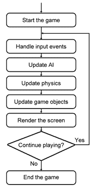
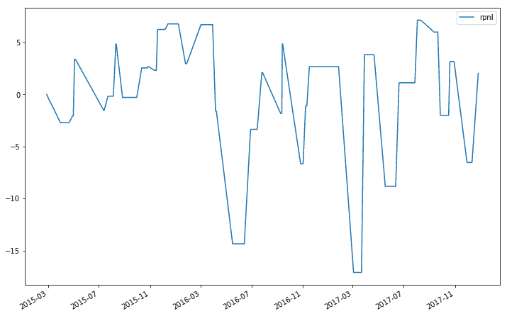
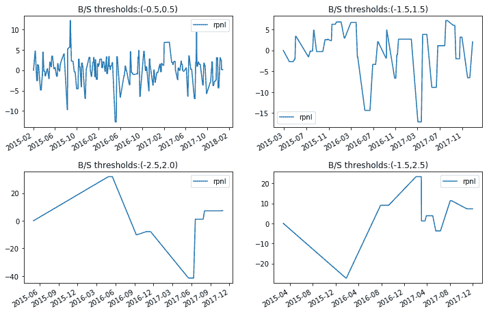

# 第九章：实施回测系统

**回测**是对模型驱动的投资策略对历史数据的响应进行模拟。在设计和开发回测时，以创建视频游戏的概念思考会很有帮助。

在这一章中，我们将使用面向对象的方法设计和实现一个事件驱动的回测系统。我们交易模型的结果利润和损失可以绘制成图表，以帮助可视化我们交易策略的表现。然而，这足以确定它是否是一个好模型吗？

在回测中有许多问题需要解决，例如交易成本的影响、订单执行的延迟、获取详细交易信息的途径以及历史数据的质量。尽管存在这些因素，创建回测系统的主要目标是尽可能准确地测试模型。

回测涉及大量值得研究的内容，这些内容值得有专门的文献。我们将简要讨论一些在实施回测时可能要考虑的想法。通常，回测中会使用多种算法。我们将简要讨论其中一些：k 均值聚类、k 最近邻、分类和回归树、2k 因子设计和遗传算法。

在这一章中，我们将涵盖以下主题：

+   介绍回测

+   回测中的关注点

+   事件驱动回测系统的概念

+   设计和实施回测系统

+   编写类来存储 tick 数据和市场数据

+   编写订单和持仓类

+   编写一个均值回归策略

+   运行回测引擎单次和多次

+   回测模型的十个考虑因素

+   回测中的算法讨论

# 介绍回测

回测是对模型驱动的投资策略对历史数据的响应进行模拟。进行回测实验的目的是发现有关过程或系统的发现。通过使用历史数据，您可以节省测试投资策略的时间。它帮助您测试基于被测试期间的运动的投资理论。它也用于评估和校准投资模型。创建模型只是第一步。投资策略通常会使用该模型来帮助您进行模拟交易决策并计算与风险或回报相关的各种因素。这些因素通常一起使用，以找到一个能够预测回报的组合。

# 回测中的关注点

然而，在回测中有许多问题需要解决：

+   回测永远无法完全复制投资策略在实际交易环境中的表现。

+   历史数据的质量是有问题的，因为它受第三方数据供应商的异常值影响。

+   前瞻性偏差有很多形式。例如，上市公司可能会分拆、合并或退市，导致其股价发生重大变化。

+   对于基于订单簿信息的策略，市场微观结构极其难以真实模拟，因为它代表了连续时间内的集体可见供需。这种供需反过来受到世界各地新闻事件的影响。

+   冰山和挂单是市场的一些隐藏元素，一旦激活就可能影响结构

+   其他需要考虑的因素包括交易成本、订单执行的延迟以及从回测中获取详细交易信息的途径。

尽管存在这些因素，创建回测系统的主要目标是尽可能准确地测试模型。

前瞻性偏差是在分析期间使用可用的未来数据，导致模拟或研究结果不准确。在金融领域，冰山订单是将大订单分成几个小订单。订单的一小部分对公众可见，就像*冰山的一角*一样，而实际订单的大部分是隐藏的。**挂单**是一个价格远离市场并等待执行的订单。

# 事件驱动回测系统的概念

在设计和开发回测时，以创建视频游戏的概念来思考会很有帮助。毕竟，我们正在尝试创建一个模拟的市场定价和订单环境，非常类似于创建一个虚拟的游戏世界。交易也可以被视为一个买低卖高的刺激游戏。

在虚拟交易环境中，需要组件来模拟价格数据源、订单匹配引擎、订单簿管理，以及账户和持仓更新功能。为了实现这些功能，我们可以探索事件驱动回测系统的概念。

让我们首先了解贯穿游戏开发过程的事件驱动编程范式的概念。系统通常将事件作为其输入接收。它可能是用户输入的按键或鼠标移动。其他事件可能是由另一个系统、进程或传感器生成的消息，用于通知主机系统有一个传入事件。

以下图表说明了游戏引擎系统涉及的阶段：



让我们看一下主游戏引擎循环的伪代码实现：

```py
while is_main_loop:  # Main game engine loop
     handle_input_events()
     update_AI()
     update_physics()
     update_game_objects()
     render_screen()
     sleep(1/60)  # Assuming a 60 frames-per-second video game rate
```

主游戏引擎循环中的核心功能可能会处理生成的系统事件，就像`handle_input_events()`函数处理键盘事件一样：

```py
def handle_input_events()
    event = get_latest_event()
    if event.type == 'UP_KEY_PRESS':
        move_player_up()
    elif event.type == 'DOWN_KEY_PRESS':
        move_player_down()
```

使用事件驱动系统，例如前面的例子，可以通过能够交换和使用来自不同系统组件的类似事件来实现代码模块化和可重用性。面向对象编程的使用进一步得到加强，其中类定义了游戏中的对象。这些特性在设计交易平台时特别有用，可以与不同的市场数据源、多个交易算法和运行时环境进行接口。模拟交易环境接近真实环境，有助于防止前瞻性偏差。

# 设计和实施回测系统

现在我们已经有了一个设计视频游戏来创建回测交易系统的想法，我们可以通过首先定义交易系统中各个组件所需的类来开始我们的面向对象方法。

我们有兴趣实施一个简单的回测系统来测试一个均值回归策略。使用数据源提供商的每日历史价格，我们将取每天的收盘价来计算特定工具价格回报的波动率，以 AAPL 股价为例。我们想要测试一个理论，即如果过去一定数量的日子的回报标准差远离零的均值达到特定阈值，就会生成买入或卖出信号。当确实生成这样的信号时，市场订单将被发送到交易所，以在下一个交易日的开盘价执行。

一旦我们开仓，我们希望追踪到目前为止的未实现利润和已实现利润。我们的持仓可以在生成相反信号时关闭。在完成回测后，我们将绘制利润和损失，以查看我们的策略表现如何。

我们的理论听起来像是一个可行的交易策略吗？让我们来看看！以下部分解释了实施回测系统所需的类。

# 编写一个类来存储 tick 数据

编写一个名为`TickData`的类，表示从市场数据源接收的单个数据单元的 Python 代码：

```py
class TickData(object):
    """ Stores a single unit of data """

    def __init__(self, timestamp='', symbol='', 
                 open_price=0, close_price=0, total_volume=0):
        self.symbol = symbol
        self.timestamp = timestamp
        self.open_price = open_price
        self.close_price = close_price
        self.total_volume = total_volume
```

在这个例子中，我们对存储时间戳、工具的符号、开盘价和收盘价以及总成交量感兴趣。随着系统的发展，可以添加单个 tick 数据的详细描述，比如最高价或最后成交量。

# 编写一个类来存储市场数据

`MarketData`类的一个实例在整个系统中用于存储和检索由各个组件引用的价格。它本质上是一个用于存储最后可用 tick 数据的容器。还包括额外的`get`辅助函数，以提供对所需信息的便捷引用：

```py
class MarketData(object):
    """ Stores the most recent tick data for all symbols """

    def __init__(self):
        self.recent_ticks = dict()  # indexed by symbol

    def add_tick_data(self, tick_data):
        self.recent_ticks[tick_data.symbol] = tick_data

    def get_open_price(self, symbol):
        return self.get_tick_data(symbol).open_price

    def get_close_price(self, symbol):
        return self.get_tick_data(symbol).close_price

    def get_tick_data(self, symbol):
        return self.recent_ticks.get(symbol, TickData())

    def get_timestamp(self, symbol):
        return self.recent_ticks[symbol].timestamp
```

# 编写一个类来生成市场数据的来源

编写一个名为`MarketDataSource`的类，以帮助我们从外部数据提供商获取历史数据。在本例中，我们将使用**Quandl**作为我们的数据提供商。该类的构造函数定义如下：

```py
class MarketDataSource(object):
    def __init__(self, symbol, tick_event_handler=None, start='', end=''):
        self.market_data = MarketData()

        self.symbol = symbol
        self.tick_event_handler = tick_event_handler
        self.start, self.end = start, end
        self.df = None
```

在构造函数中，`symbol`参数包含了我们的数据提供商识别的值，用于下载我们需要的数据集。实例化了一个`MarketData`对象来存储最新的市场数据。`tick_event_handler`参数存储了方法处理程序，当我们迭代数据源时使用。`start`和`end`参数指的是我们希望保留在`pandas` DataFrame 变量`df`中的数据集的开始和结束日期。

在`MarketDataSource`方法中添加`fetch_historical_prices()`方法，其中包含从数据提供商下载并返回所需的`pandas` DataFrame 对象的具体指令，该对象保存我们的每日市场价格，如下所示：

```py
def fetch_historical_prices(self):
   import quandl

   # Update your Quandl API key here...
  QUANDL_API_KEY = 'BCzkk3NDWt7H9yjzx-DY'
  quandl.ApiConfig.api_key = QUANDL_API_KEY
   df = quandl.get(self.symbol, start_date=self.start, end_date=self.end)
   return df
```

由于此方法特定于 Quandl 的 API，您可以根据自己的数据提供商重新编写此方法。

此外，在`MarketDataSource`类中添加`run()`方法来模拟在回测期间从数据提供商获取流式价格：

```py
def run(self):
    if self.df is None:
        self.df = self.fetch_historical_prices()

    total_ticks = len(self.df)
    print('Processing total_ticks:', total_ticks)

    for timestamp, row in self.df.iterrows():
        open_price = row['Open']
        close_price = row['Close']
        volume = row['Volume']

        print(timestamp.date(), 'TICK', self.symbol,
              'open:', open_price,
              'close:', close_price)
        tick_data = TickData(timestamp, self.symbol, open_price,
                            close_price, volume)
        self.market_data.add_tick_data(tick_data)

        if self.tick_event_handler:
            self.tick_event_handler(self.market_data)
```

请注意，第一个`if`语句在执行从数据提供商下载之前对现有市场数据的存在进行检查。这使我们能够在回测中运行多个模拟，使用缓存数据，避免不必要的下载开销，并使我们的回测运行更快。

`for`循环在我们的`df`市场数据变量上用于模拟流式价格。每个 tick 数据被转换和格式化为`TickData`的一个实例，并添加到`market_data`对象中作为特定符号的最新可用 tick 数据。然后将此对象传递给任何监听 tick 事件的 tick 数据事件处理程序。

# 编写订单类

以下代码中的`Order`类表示策略发送到服务器的单个订单。每个订单包含时间戳、符号、数量和指示买入或卖出订单的标志。在以下示例中，我们将仅使用市价订单，并且预计`is_market_order`为`True`。如果需要，可以实现其他订单类型，如限价和止损订单。一旦订单被执行，订单将进一步更新为填充价格、时间和数量。按照以下代码给出的方式编写此类：

```py
class Order(object):
    def __init__(self, timestamp, symbol, 
        qty, is_buy, is_market_order, 
        price=0
    ):
        self.timestamp = timestamp
        self.symbol = symbol
        self.qty = qty
        self.price = price
        self.is_buy = is_buy
        self.is_market_order = is_market_order
        self.is_filled = False
        self.filled_price = 0
        self.filled_time = None
        self.filled_qty = 0
```

# 编写一个类来跟踪持仓。

`Position`类帮助我们跟踪我们对交易工具的当前市场位置和账户余额，并且定义如下：

```py
class Position(object):
    def __init__(self, symbol=''):
        self.symbol = symbol
        self.buys = self.sells = self.net = 0
        self.rpnl = 0
        self.position_value = 0
```

已声明买入、卖出和净值的单位数量分别为`buys`、`sells`和`net`变量。`rpnl`变量存储了该符号的最近实现利润和损失。请注意，`position_value`变量的初始值为零。当购买证券时，证券的价值从此账户中借记。当出售证券时，证券的价值记入此账户。

当订单被填充时，账户的持仓会发生变化。在`Position`类中编写一个名为`on_position_event()`的方法来处理这些持仓事件：

```py
def on_position_event(self, is_buy, qty, price):
    if is_buy:
        self.buys += qty
    else:
        self.sells += qty

    self.net = self.buys - self.sells
    changed_value = qty * price * (-1 if is_buy else 1)
    self.position_value += changed_value

    if self.net == 0:
        self.rpnl = self.position_value
        self.position_value = 0
```

在我们的持仓发生变化时，我们更新并跟踪买入和卖出的证券数量，以及证券的当前价值。当净头寸为零时，持仓被平仓，我们获得当前的实现利润和损失。

每当持仓开启时，我们的证券价值会受到市场波动的影响。有一个未实现的利润和损失的度量有助于跟踪每次 tick 移动中市场价值的变化。在`Position`类中添加以下`calculate_unrealized_pnl()`方法：

```py
def calculate_unrealized_pnl(self, price):
    if self.net == 0:
        return 0

    market_value = self.net * price
    upnl = self.position_value + market_value
    return upnl
```

使用当前市场价格调用`calculate_unrealized_pnl()`方法可以得到特定证券当前市场价值。

# 编写一个抽象策略类

以下代码中给出的`Strategy`类是所有其他策略实现的基类，并且被写成：

```py
from abc import abstractmethod

class Strategy:
    def __init__(self, send_order_event_handler):
        self.send_order_event_handler = send_order_event_handler

    @abstractmethod
    def on_tick_event(self, market_data):
        raise NotImplementedError('Method is required!')

    @abstractmethod
    def on_position_event(self, positions):
        raise NotImplementedError('Method is required!')

    def send_market_order(self, symbol, qty, is_buy, timestamp):
        if self.send_order_event_handler:
            order = Order(
                timestamp,
                symbol,
                qty,
                is_buy,
                is_market_order=True,
                price=0,
            )
            self.send_order_event_handler(order)
```

当新的市场 tick 数据到达时，将调用`on_tick_event()`抽象方法。子类必须实现这个抽象方法来对传入的市场价格进行操作。每当我们的持仓有更新时，将调用`on_position_event()`抽象方法。子类必须实现这个抽象方法来对传入的持仓更新进行操作。

`send_market_order()`方法由子策略类调用，将市价订单路由到经纪人。这样的事件处理程序存储在构造函数中，实际的实现由本类的所有者在下一节中完成，并直接与经纪人 API 进行接口。

# 编写一个均值回归策略类

在这个例子中，我们正在实现一个关于 AAPL 股票价格的均值回归交易策略。编写一个继承上一节中`Strategy`类的`MeanRevertingStrategy`子类：

```py
import pandas as pd

class MeanRevertingStrategy(Strategy):
    def __init__(self, symbol, trade_qty,
        send_order_event_handler=None, lookback_intervals=20,
        buy_threshold=-1.5, sell_threshold=1.5
    ):
        super(MeanRevertingStrategy, self).__init__(
            send_order_event_handler)

        self.symbol = symbol
        self.trade_qty = trade_qty
        self.lookback_intervals = lookback_intervals
        self.buy_threshold = buy_threshold
        self.sell_threshold = sell_threshold

        self.prices = pd.DataFrame()
        self.is_long = self.is_short = False
```

在构造函数中，我们接受参数值，告诉我们的策略要交易的证券符号和每笔交易的单位数。`send_order_event_handler`函数变量被传递给父类进行存储。`lookback_intervals`、`buy_threshold`和`sell_threshold`变量是与使用均值回归计算生成交易信号相关的参数。

`pandas` DataFrame `prices`变量将用于存储传入的价格，`is_long`和`is_short`布尔变量存储此策略的当前持仓，任何时候只有一个可以为`True`。这些变量在`MeanRevertingStrategy`类中的`on_position_event()`方法中分配：

```py
def on_position_event(self, positions):
    position = positions.get(self.symbol)

    self.is_long = position and position.net > 0
    self.is_short = position and position.net < 0
```

`on_position_event()`方法实现了父抽象方法，并在我们的持仓更新时被调用。

此外，在`MeanRevertingStrategy`类中实现`on_tick_event()`抽象方法：

```py
def on_tick_event(self, market_data):
    self.store_prices(market_data)

    if len(self.prices) < self.lookback_intervals:
        return

    self.generate_signals_and_send_order(market_data)
```

在每个 tick-data 事件中，市场价格存储在当前策略类中，用于计算交易信号，前提是有足够的数据。在这个例子中，我们使用 20 天的日历史价格回溯期。换句话说，我们将使用过去 20 天价格的平均值来确定均值回归。在没有足够数据的情况下，我们只是跳过这一步。

在`MeanRevertingStrategy`类中添加`store_prices()`方法：

```py
def store_prices(self, market_data):
    timestamp = market_data.get_timestamp(self.symbol)
    close_price = market_data.get_close_price(self.symbol)
    self.prices.loc[timestamp, 'close'] = close_price
```

在每个 tick 事件上，`prices` DataFrame 存储每日收盘价，由时间戳索引。

生成交易信号的逻辑在`MeanRevertingStrategy`类中的`generate_signals_and_send_order()`方法中给出：

```py
def generate_signals_and_send_order(self, market_data):
    signal_value = self.calculate_z_score()
    timestamp = market_data.get_timestamp(self.symbol)

    if self.buy_threshold > signal_value and not self.is_long:
        print(timestamp.date(), 'BUY signal')
        self.send_market_order(
            self.symbol, self.trade_qty, True, timestamp)
    elif self.sell_threshold < signal_value and not self.is_short:
        print(timestamp.date(), 'SELL signal')
        self.send_market_order(
            self.symbol, self.trade_qty, False, timestamp)
```

在每个 tick 事件上，计算当前时期的**z-score**，我们将很快介绍。一旦 z-score 超过我们的买入阈值值，就会生成买入信号。我们可以通过向经纪人发送买入市价订单来关闭空头头寸或进入多头头寸。相反，当 z-score 超过我们的卖出阈值值时，就会生成卖出信号。我们可以通过向经纪人发送卖出市价订单来关闭多头头寸或进入空头头寸。在我们的回测系统中，订单将在第二天开盘时执行。

在`MeanRevertingStrategy`类中添加`calculate_z_score()`方法，用于在每个 tick 事件上计算 z-score：

```py
def calculate_z_score(self):
    self.prices = self.prices[-self.lookback_intervals:]
    returns = self.prices['close'].pct_change().dropna()
    z_score = ((returns - returns.mean()) / returns.std())[-1]
    return z_score
```

使用以下公式对收盘价的每日百分比收益进行 z-score 标准化：


在这里，*x*是最近的收益，*μ*是收益的平均值，*σ*是收益的标准差。 z-score 值为 0 表示该分数与平均值相同。例如，买入阈值值为-1.5。当 z-score 低于-1.5 时，这表示强烈的买入信号，因为预计随后的时期的 z-score 将恢复到零的平均值。同样，卖出阈值值为 1.5 可能表示强烈的卖出信号，预计 z-score 将恢复到平均值。

因此，这个回测系统的目标是找到最优的阈值，以最大化我们的利润。

# 将我们的模块与回测引擎绑定

在定义了所有核心模块化组件之后，我们现在准备实现回测引擎，作为`BacktestEngine`类，使用以下代码：

```py
class BacktestEngine:
    def __init__(self, symbol, trade_qty, start='', end=''):
        self.symbol = symbol
        self.trade_qty = trade_qty
        self.market_data_source = MarketDataSource(
            symbol,
            tick_event_handler=self.on_tick_event,
            start=start, end=end
        )

        self.strategy = None
        self.unfilled_orders = []
        self.positions = dict()
        self.df_rpnl = None
```

在回测引擎中，我们存储标的物和交易单位数量。使用标的物创建一个`MarketDataSource`实例，同时定义数据集的开始和结束日期。发出的 tick 事件将由我们的本地`on_tick_event()`方法处理，我们将很快实现。`strategy`变量用于存储我们均值回归策略类的一个实例。`unfilled_orders`变量充当我们的订单簿，将存储下一个交易日执行的市场订单。`positions`变量用于存储`Position`对象的实例，由标的物索引。`df_rpnl`变量用于存储我们在回测期间的实现利润和损失，我们可以在回测结束时使用它来绘图。

运行回测引擎的入口点是`Backtester`类中给出的`start()`方法。

```py
def start(self, **kwargs):
    print('Backtest started...')

    self.unfilled_orders = []
    self.positions = dict()
    self.df_rpnl = pd.DataFrame()

    self.strategy = MeanRevertingStrategy(
        self.symbol,
        self.trade_qty,
        send_order_event_handler=self.on_order_received,
        **kwargs
    )
    self.market_data_source.run()

    print('Backtest completed.')
```

通过调用`start()`方法可以多次运行单个`Backtester`实例。在每次运行开始时，我们初始化`unfilled_orders`、`positions`和`df_rpl`变量。使用策略类的一个新实例化，传入标的物和交易单位数量，以及一个名为`on_order_received()`的方法，用于接收来自策略的订单触发，以及策略需要的任何关键字`kwargs`参数。

在`BacktestEngine`类中实现`on_order_received()`方法：

```py
def on_order_received(self, order):
    """ Adds an order to the order book """
    print(
        order.timestamp.date(),
        'ORDER',
        'BUY' if order.is_buy else 'SELL',
        order.symbol,
        order.qty
    )
    self.unfilled_orders.append(order)
```

当订单生成并添加到订单簿时，我们会在控制台上收到通知。

在`BacktestEngine`类中实现`on_tick_event()`方法，用于处理市场数据源发出的 tick 事件：

```py
def on_tick_event(self, market_data):
    self.match_order_book(market_data)
    self.strategy.on_tick_event(market_data)
    self.print_position_status(market_data)
```

在这个例子中，市场数据源预计是每日的历史价格。接收到的 tick 事件代表一个新的交易日。在交易日开始时，我们通过调用`match_order_book()`方法来检查我们的订单簿，并匹配开盘时的任何未成交订单。之后，我们将最新的市场数据`market_data`变量传递给策略的 tick 事件处理程序，执行交易功能。在交易日结束时，我们将我们的持仓信息打印到控制台上。

在`BacktestEngine`类中实现`match_order_book()`和`match_unfilled_orders()`方法：

```py
def match_order_book(self, market_data):
    if len(self.unfilled_orders) > 0:
        self.unfilled_orders = [
            order for order in self.unfilled_orders
            if self.match_unfilled_orders(order, market_data)
        ]

def match_unfilled_orders(self, order, market_data):
    symbol = order.symbol
    timestamp = market_data.get_timestamp(symbol)

    """ Order is matched and filled """
    if order.is_market_order and timestamp > order.timestamp:
        open_price = market_data.get_open_price(symbol)

        order.is_filled = True
        order.filled_timestamp = timestamp
        order.filled_price = open_price

        self.on_order_filled(
            symbol, order.qty, order.is_buy,
            open_price, timestamp
        )
        return False

    return True
```

在每次调用`match_order_book()`命令时，都会检查存储在`unfilled_orders`变量中的待处理订单列表，以便在市场中执行，并在此操作成功时从列表中移除。`match_unfilled_orders()`方法中的`if`语句验证订单是否处于正确状态，并立即以当前市场开盘价标记订单为已填充。这将触发`on_order_filled()`方法上的一系列事件。在`BacktestEngine`类中实现这个方法：

```py
def on_order_filled(self, symbol, qty, is_buy, filled_price, timestamp):
    position = self.get_position(symbol)
    position.on_position_event(is_buy, qty, filled_price)
    self.df_rpnl.loc[timestamp, "rpnl"] = position.rpnl

    self.strategy.on_position_event(self.positions)

    print(
        timestamp.date(),
        'FILLED', "BUY" if is_buy else "SELL",
        qty, symbol, 'at', filled_price
    )
```

一旦订单被执行，就需要更新交易符号的相应头寸。`position`变量包含检索到的`Position`实例，并且调用其`on_position_event()`命令会更新其状态。实现的利润和损失会被计算并保存到`pandas` DataFrame `df_rpnl`中，并附上时间戳。通过调用`on_position_event()`命令，策略也会被通知头寸的变化。当这样的事件发生时，我们会在控制台上收到通知。

在`BacktestEngine`类中添加以下`get_position()`方法：

```py
 def get_position(self, symbol):
    if symbol not in self.positions:
        self.positions[symbol] = Position(symbol)

    return self.positions[symbol]
```

`get_position()`方法是一个辅助方法，简单地获取一个交易符号的当前`Position`对象。如果找不到实例，则创建一个。

`on_tick_event()`最后一次调用的命令是`print_position_status()`。在`BacktestEngine`类中实现这个方法：

```py
def print_position_status(self, market_data):
    for symbol, position in self.positions.items():
        close_price = market_data.get_close_price(symbol)
        timestamp = market_data.get_timestamp(symbol)

        upnl = position.calculate_unrealized_pnl(close_price)

        print(
            timestamp.date(),
            'POSITION',
            'value:%.3f' % position.position_value,
            'upnl:%.3f' % upnl,
            'rpnl:%.3f' % position.rpnl
        )
```

在每次 tick 事件中，我们打印当前市场价值、实现和未实现利润和损失的任何可用头寸信息到控制台。

# 运行我们的回测引擎

在`BacktestEngine`类中定义了所有必需的方法后，我们现在可以使用以下代码创建这个类的一个实例：

```py
engine = BacktestEngine(
    'WIKI/AAPL', 1,
    start='2015-01-01',
    end='2017-12-31'
)
```

在这个例子中，我们对每次交易感兴趣，使用 2015 年到 2017 年三年的每日历史数据进行回测。

发出`start()`命令来运行回测引擎：

```py
engine.start(
    lookback_intervals=20,
    buy_threshold=-1.5,
    sell_threshold=1.5
)
```

`lookback_interval`参数参数值为 20 告诉我们的策略在计算 z 分数时使用最近 20 天的历史每日价格。`buy_threshold`和`sell_threshold`参数参数定义了生成买入或卖出信号的边界限制。在这个例子中，-1.5 的买入阈值值表示当 z 分数低于-1.5 时希望持有多头头寸。同样，1.5 的卖出阈值值表示当 z 分数上升到 1.5 以上时希望持有空头头寸。

当引擎运行时，您将看到以下输出：

```py
Backtest started...
Processing total_ticks: 753
2015-01-02 TICK WIKI/AAPL open: 111.39 close: 109.33
...
2015-02-25 TICK WIKI/AAPL open: 131.56 close: 128.79
2015-02-25 BUY signal
2015-02-25 ORDER BUY WIKI/AAPL 1
2015-02-26 TICK WIKI/AAPL open: 128.785 close: 130.415
2015-02-26 FILLED BUY 1 WIKI/AAPL at 128.785
2015-02-26 POSITION value:-128.785 upnl:1.630 rpnl:0.000
2015-02-27 TICK WIKI/AAPL open: 130.0 close: 128.46
```

从输出日志中，我们可以看到在 2015 年 2 月 25 日生成了一个买入信号，并且在下一个交易日 2 月 26 日开盘时以 128.785 美元的价格向订单簿中添加了一个市价订单以执行。到交易日结束时，我们的多头头寸将有 1.63 美元的未实现利润：

```py
...
2015-03-30 TICK WIKI/AAPL open: 124.05 close: 126.37
2015-03-30 SELL signal
2015-03-30 ORDER SELL WIKI/AAPL 1
2015-03-30 POSITION value:-128.785 upnl:-2.415 rpnl:0.000
2015-03-31 TICK WIKI/AAPL open: 126.09 close: 124.43
2015-03-31 FILLED SELL 1 WIKI/AAPL at 126.09
2015-03-31 POSITION value:0.000 upnl:0.000 rpnl:-2.695
...
```

继续向下滚动日志，您会看到在 2015 年 3 月 30 日生成了一个卖出信号，并且在下一天 3 月 31 日以 126.09 美元的价格执行了一个卖出市价订单。这关闭了我们的多头头寸，并使我们遭受了 2.695 美元的实现损失。

当回测引擎完成时，我们可以使用以下 Python 代码将我们的策略实现的利润和损失绘制到图表上，以可视化这个交易策略：

```py
%matplotlib inline
import matplotlib.pyplot as plt

engine.df_rpnl.plot(figsize=(12, 8));
```

这给我们以下输出：



请注意，回测结束时，实现的利润和损失并不完整。我们可能仍然持有未实现的利润或损失的多头或空头头寸。在评估策略时，请确保考虑到这个剩余价值。

# 回测引擎的多次运行

使用**固定的策略参数**，我们能够让回测引擎运行一次并可视化其性能。由于回测的目标是找到适用于交易系统考虑的最佳策略参数，我们希望我们的回测引擎在不同的策略参数上多次运行。

例如，定义我们想要在名为`THRESHOLDS`的常量变量中测试的阈值列表：

```py
THRESHOLDS = [
    (-0.5, 0.5),
    (-1.5, 1.5),
    (-2.5, 2.0),
    (-1.5, 2.5),
]
```

列表中的每个项目都是买入和卖出阈值值的元组。我们可以使用`for`循环迭代这些值，调用`engine.start()`命令，并在每次迭代时绘制图表，使用以下代码：

```py
%matplotlib inline import matplotlib.pyplot as plt

fig, axes = plt.subplots(nrows=len(THRESHOLDS)//2, 
    ncols=2, figsize=(12, 8))
fig.subplots_adjust(hspace=0.4)
for i, (buy_threshold, sell_threshold) in enumerate(THRESHOLDS):
     engine.start(
         lookback_intervals=20,
         buy_threshold=buy_threshold,
         sell_threshold=sell_threshold
     )
     df_rpnls = engine.df_rpnl
     ax = axes[i // 2, i % 2]
     ax.set_title(
         'B/S thresholds:(%s,%s)' % 
         (buy_threshold, sell_threshold)
     )
     df_rpnls.plot(ax=ax)
```

我们得到以下输出：



四个图显示了在我们的策略中使用各种阈值时的结果。通过改变策略参数，我们得到了不同的风险和回报概况。也许您可以找到更好的策略参数，以获得比这更好的结果！

# 改进您的回测系统

在本章中，我们基于每日收盘价创建了一个简单的回测系统，用于均值回归策略。有几个方面需要考虑，以使这样一个回测模型更加现实。历史每日价格足以测试我们的模型吗？应该使用日内限价单吗？我们的账户价值从零开始；如何能够准确反映我们的资本需求？我们能够借股做空吗？

由于我们在创建回测系统时采用了面向对象的方法，将来集成其他组件会有多容易？交易系统可以接受多个市场数据源。我们还可以创建组件，使我们能够将系统部署到生产环境中。

上述提到的关注点列表并不详尽。为了指导我们实施健壮的回测模型，下一节详细阐述了设计这样一个系统的十个考虑因素。

# 回测模型的十个考虑因素

在上一节中，我们进行了一次回测的复制。我们的结果看起来相当乐观。然而，这足以推断这是一个好模型吗？事实是，回测涉及大量研究，值得有自己的文献。以下列表简要涵盖了在实施回测时您可能想要考虑的一些想法。

# 限制模型的资源

可用于您的回测系统的资源限制了您可以实施回测的程度。只使用最后收盘价生成信号的金融模型需要一组收盘价的历史数据。需要从订单簿中读取的交易系统需要在每个 tick 上都有订单簿数据的所有级别。这增加了存储复杂性。其他资源，如交易所数据、估计技术和计算机资源，对可以使用的模型的性质施加了限制。

# 模型评估标准

我们如何得出模型好坏的结论？一些要考虑的因素包括夏普比率、命中率、平均收益率、VaR 统计数据，以及遇到的最小和最大回撤。这些因素的组合如何平衡，使模型可用？在实现高夏普比率时，最大回撤能够容忍多少？

# 估计回测参数的质量

在模型上使用各种参数通常会给我们带来不同的结果。从多个模型中，我们可以获得每个模型的额外数据集。最佳表现模型的参数可信吗？使用模型平均等方法可以帮助我们纠正乐观的估计。

模型平均技术是对多个模型的平均拟合，而不是使用单个最佳模型。

# 做好面对模型风险的准备

也许经过广泛的回测，你可能会发现自己拥有一个高质量的模型。它会保持多久？在模型风险中，市场结构或模型参数可能会随时间改变，或者制度变革可能会导致你的模型的功能形式突然改变。到那时，你甚至可能不确定你的模型是否正确。解决模型风险的方法是模型平均。

# 使用样本内数据进行回测

回测帮助我们进行广泛的参数搜索，优化模型的结果。这利用了样本数据的真实和特异方面。此外，历史数据永远无法模仿整个数据来自实时市场的方式。这些优化的结果将始终产生对模型和使用的策略的乐观评估。

# 解决回测中的常见陷阱

回测中最常见的错误是前瞻性偏差，它有许多形式。例如，参数估计可能来自样本数据的整个时期，这构成了使用未来信息。这些统计估计和模型选择应该按顺序估计，这实际上可能很难做到。

数据错误以各种形式出现，从硬件、软件和人为错误，可能在数据分发供应商路由时发生。上市公司可能会分拆、合并或退市，导致其股价发生重大变化。这些行动可能导致我们的模型中出现生存偏差。未能正确清理数据将给予数据的特异方面不当的影响，从而影响模型参数。

生存偏差是一种逻辑错误，它集中于经历了某种过去选择过程的结果。例如，股市指数可能会报告在不好的时候也有强劲的表现，因为表现不佳的股票被从其组成权重中剔除，导致对过去收益的高估。

未使用收缩估计量或模型平均可能会报告包含极端值的结果，使比较和评估变得困难。

在统计学中，收缩估计量被用作普通最小二乘估计量的替代，以产生最小均方误差。它们可以用来将模型输出的原始估计值收缩到零或另一个固定的常数值。

# 对模型有一个常识性的想法

在我们的模型中常常缺乏常识。我们可能会尝试用趋势变量解释无趋势变量，或者从相关性推断因果关系。当上下文需要或不需要时，可以使用对数值吗？让我们在接下来的部分看看。

# 了解模型的背景

对模型有一个常识性的想法几乎是不够的。一个好的模型考虑了历史、参与人员、运营约束、常见的特殊情况，以及对模型的理性理解。商品价格是否遵循季节性变动？数据是如何收集的？用于计算变量的公式可靠吗？这些问题可以帮助我们确定原因，如果出现问题。

# 确保你有正确的数据

我们中的许多人都无法访问 tick 级别的数据。低分辨率的 tick 数据可能会错过详细信息。即使是 tick 级别的数据也可能充满错误。使用摘要统计数据，如均值、标准误差、最大值、最小值和相关性，告诉我们很多关于数据的性质，无论我们是否真的可以使用它，或者推断回测参数估计。

当进行数据清理时，我们可能会问这些问题：需要注意什么？数值是否现实和合理？缺失数据是如何编码的？

制定一套报告数据和结果的系统。使用图表有助于人眼可视化可能出乎意料的模式。直方图可能显示出意想不到的分布，或者残差图可能显示出意想不到的预测误差模式。残差化数据的散点图可能显示出额外的建模机会。

残差化数据是观察值与模型值之间的差异或*残差*。

# 挖掘你的结果

通过对多次回测进行迭代，结果代表了关于模型的信息来源。在实时条件下运行模型会产生另一个结果来源。通过数据挖掘所有这些丰富的信息，我们可以获得一个避免将模型规格定制到样本数据的数据驱动结果。建议在报告结果时使用收缩估计或模型平均。

# 回测中的算法讨论

在考虑设计回测模型时，可以使用一个或多个算法来持续改进模型。本节简要介绍了在回测领域使用的一些算法技术，如数据挖掘和机器学习。

# K 均值聚类

**k 均值聚类**算法是数据挖掘中的一种聚类分析方法。从*n*次观察的回测结果中，k 均值算法旨在根据它们相对距离将数据分类为*k*个簇。计算每个簇的中心点。目标是找到给出模型平均点的簇内平方和。模型平均点表示模型的可能平均性能，可用于与其他模型的性能进行进一步比较。

# K 最近邻机器学习算法

**k 最近邻**（**KNN**）是一种懒惰学习技术，不构建任何模型。

初始的回测模型参数集是随机选择或最佳猜测。

在分析模型结果之后，将使用与原始集最接近的*k*个参数集进行下一步计算。然后模型将选择给出最佳结果的参数集。

该过程持续进行，直到达到终止条件，从而始终提供可用的最佳模型参数集。

# 分类和回归树分析

**分类和回归树**（**CART**）分析包含两个用于数据挖掘的决策树。分类树使用分类规则通过决策树中的节点和分支对模型的结果进行分类。回归树试图为分类结果分配一个实际值。得到的值被平均以提供决策质量的度量。

# 2k 阶乘设计

在设计回测实验时，可以考虑使用**2k 阶乘设计**。假设有两个因素 A 和 B。每个因素都是布尔值，取值为+1 或-1。+1 表示定量高值，而-1 表示低值。这给我们提供了 2²=4 种结果的组合。对于 3 因素模型，这给我们提供了 2³=8 种结果的组合。以下表格说明了具有 W、X、Y 和 Z 结果的两个因素的示例：

|  | **A** | **B** | **复制 I** |
| --- | --- | --- | --- |
| 值 | +1 | +1 | W |
| 值 | +1 | -1 | X |
| 值 | -1 | +1 | Y |
| 值 | -1 | -1 | Z |

请注意，我们正在生成一个回测的复制，以产生一组结果。进行额外的复制可以为我们提供更多信息。从这些数据中，我们可以进行回归分析和分析其方差。这些测试的目标是确定哪些因素 A 或 B 对另一个更有影响，并选择哪些值，使结果要么接近某个期望值，能够实现低方差，或者最小化不可控变量的影响。

# 遗传算法

遗传算法（GA）是一种技术，其中每个个体通过自然选择的过程进化，以优化问题。在优化问题中，候选解的种群经历选择的迭代过程，成为父代，经历突变和交叉以产生下一代后代。经过连续世代的循环，种群朝着最优解进化。

遗传算法的应用可以应用于各种优化问题，包括回测，特别适用于解决标准优化、不连续或非可微问题或非线性结果。

# 总结

回测是模型驱动的投资策略对历史数据的响应的模拟。进行回测实验的目的是发现有关过程或系统的信息，并计算与风险或回报相关的各种因素。这些因素通常一起使用，以找到预测回报的组合。

在设计和开发回测时，以创建视频游戏的概念思考将会很有帮助。在虚拟交易环境中，需要组件来模拟价格流、订单匹配引擎、订单簿管理，以及账户和持仓更新的功能。为了实现这些功能，我们可以探索事件驱动的回测系统的概念。

在本章中，我们设计并实现了一个回测系统，与处理 tick 数据的各种组件进行交互，从数据提供商获取历史价格，处理订单和持仓更新，并模拟触发我们策略执行均值回归计算的流动价格。每个周期的 z 分数被评估为交易信号，这导致生成市场订单，以在下一个交易日开盘时执行。我们进行了单次回测运行以及多次运行，参数不同的策略，绘制了结果的利润和损失，以帮助我们可视化我们交易策略的表现。

回测涉及大量研究，值得有专门的文献。在本章中，我们探讨了设计回测模型的十个考虑因素。为了持续改进我们的模型，可以在回测中使用许多算法。我们简要讨论了其中一些：k 均值聚类，k 最近邻，分类和回归树，2k 因子设计和遗传算法。

在下一章中，我们将学习使用机器学习进行预测。
