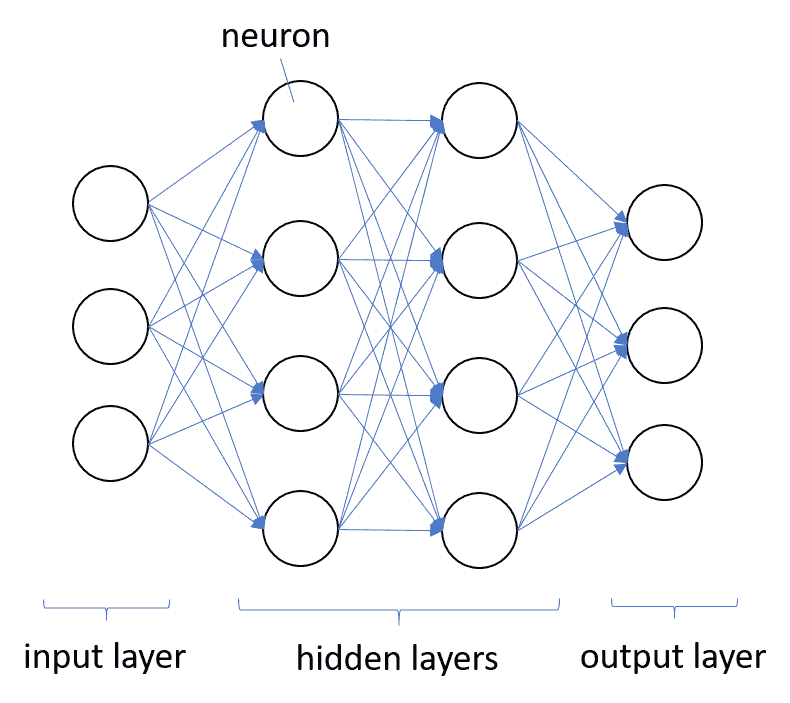
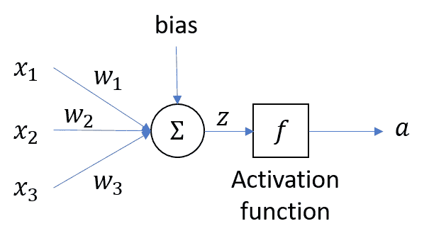
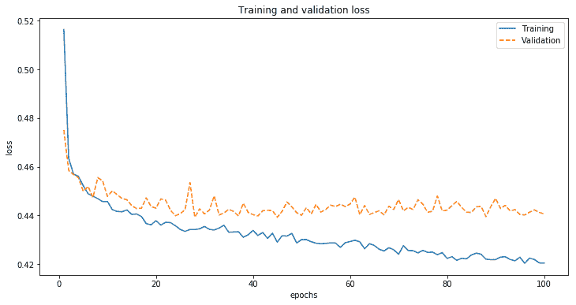
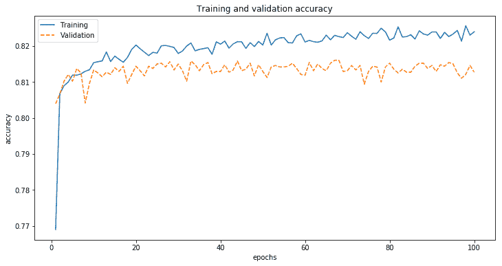

# 第十一章：金融领域的深度学习

深度学习代表着**人工智能**（**AI**）的最前沿。与机器学习不同，深度学习通过使用神经网络来进行预测。人工神经网络是模仿人类神经系统的，包括一个输入层和一个输出层，中间有一个或多个隐藏层。每一层都由并行工作的人工神经元组成，并将输出传递给下一层作为输入。深度学习中的*深度*一词来源于这样一个观念，即当数据通过人工神经网络中的更多隐藏层时，可以提取出更复杂的特征。

**TensorFlow**是由谷歌开发的开源、强大的机器学习和深度学习框架。在本章中，我们将采用实践方法来学习 TensorFlow，通过构建一个具有四个隐藏层的深度学习模型来预测某项证券的价格。深度学习模型是通过将整个数据集前向和后向地通过网络进行训练的，每次迭代称为一个**时代**。由于输入数据可能太大而无法被馈送，训练可以分批进行，这个过程称为**小批量训练**。

另一个流行的深度学习库是 Keras，它利用 TensorFlow 作为后端。我们还将采用实践方法来学习 Keras，并看看构建一个用于预测信用卡支付违约的深度学习模型有多容易。

在本章中，我们将涵盖以下主题：

+   神经网络简介

+   神经元、激活函数、损失函数和优化器

+   不同类型的神经网络架构

+   如何使用 TensorFlow 构建安全价格预测深度学习模型

+   Keras，一个用户友好的深度学习框架

+   如何使用 Keras 构建信用卡支付违约预测深度学习模型

+   如何在 Keras 历史记录中显示记录的事件

# 深度学习的简要介绍

深度学习的理论早在 20 世纪 40 年代就开始了。然而，由于计算硬件技术的改进、更智能的算法和深度学习框架的采用，它近年来的流行度飙升。这本书之外还有很多内容要涵盖。本节作为一个快速指南，旨在为后面本章将涵盖的示例提供一个工作知识。

# 什么是深度学习？

在第十章中，*金融领域的机器学习*，我们了解了机器学习如何用于进行预测。监督学习使用误差最小化技术来拟合训练数据的模型，可以是基于回归或分类的。

深度学习通过使用神经网络来进行预测采用了一种不同的方法。人工神经网络是模仿人脑和神经系统的，由一系列层组成，每一层由许多称为神经元的简单单元并行工作，并将输入数据转换为抽象表示作为输出数据，然后将其作为输入馈送到下一层。以下图示说明了一个人工神经网络：



人工神经网络由三种类型的层组成。接受输入的第一层称为**输入层**。收集输出的最后一层称为**输出层**。位于输入和输出层之间的层称为**隐藏层**，因为它们对网络的接口是隐藏的。隐藏层可以有许多组合，执行不同的激活函数。自然地，更复杂的计算导致对更强大的机器的需求增加，例如计算它们所需的 GPU。

# 人工神经元

人工神经元接收一个或多个输入，并由称为**权重**的值相乘，然后求和并传递给激活函数。激活函数计算的最终值构成了神经元的输出。偏置值可以包含在求和项中以帮助拟合数据。以下图示了一个人工神经元：



求和项可以写成线性方程，如 *Z=x[1]w[1]+x[2]w[2]+...+b.* 神经元使用非线性激活函数 *f* 将输入转换为输出 ，可以写成 。

# 激活函数

激活函数是人工神经元的一部分，它将加权输入的总和转换为下一层的另一个值。通常，此输出值的范围为-1 或 0 到 1。当人工神经元向另一个神经元传递非零值时，它被激活。主要有几种类型的激活函数，包括：

+   线性

+   Sigmoid

+   双曲正切

+   硬双曲正切

+   修正线性单元

+   Leaky ReLU

+   Softplus

例如，**修正线性单元**（ReLU）函数可以写成：


ReLU 仅在输入大于零时激活节点的输入值相同。研究人员更喜欢使用 ReLU，因为它比 Sigmoid 激活函数训练效果更好。我们将在本章的后面部分使用 ReLU。

在另一个例子中，leaky ReLU 可以写成：


Leaky ReLU 解决了当  时死亡 ReLU 的问题，当 *x* 为零或更小时，它具有约 0.01 的小负斜率。

# 损失函数

损失函数计算模型的预测值与实际值之间的误差。误差值越小，模型的预测就越好。一些用于基于回归的模型的损失函数包括：

+   **均方误差**（MSE）损失

+   **平均绝对误差**（MAE）损失

+   Huber 损失

+   分位数损失

一些用于基于分类的模型的损失函数包括：

+   焦点损失

+   铰链损失

+   逻辑损失

+   指数损失

# 优化器

优化器有助于在最小化损失函数时最佳地调整模型权重。在深度学习中可能会遇到几种类型的优化器：

+   **自适应梯度**（AdaGrad）

+   **自适应矩估计**（Adam）

+   **有限内存 Broyden-Fletcher-Goldfarb-Shannon**（LBFGS）

+   **鲁棒反向传播**（Rprop）

+   **根均方传播**（RMSprop）

+   **随机梯度下降**（SGD）

Adam 是一种流行的优化器选择，被视为 RMSprop 和带动量的 SGD 的组合。它是一种自适应学习率优化算法，为不同参数计算单独的学习率。

# 网络架构

神经网络的网络架构定义了其行为。有许多形式的网络架构可用；其中一些是：

+   **感知器**（P）

+   **前馈**（FF）

+   **深度前馈**（DFF）

+   **径向基函数网络**（RBF）

+   **循环神经网络**（RNN）

+   **长/短期记忆**（LSTM）

+   **自动编码器**（AE）

+   **Hopfield 网络**（HN）

+   **玻尔兹曼机**（BM）

+   **生成对抗网络**（GAN）

最著名且易于理解的神经网络是前馈多层神经网络。它可以使用输入层、一个或多个隐藏层和一个输出层来表示任何函数。可以在[`www.asimovinstitute.org/neural-network-zoo/`](http://www.asimovinstitute.org/neural-network-zoo/)找到神经网络列表。

# TensorFlow 和其他深度学习框架

TensorFlow 是来自谷歌的免费开源库，可用于 Python、C++、Java、Rust 和 Go。它包含各种神经网络，用于训练深度学习模型。TensorFlow 可应用于各种场景，如图像分类、恶意软件检测和语音识别。TensorFlow 的官方页面是[`www.tensorflow.org`](https://www.tensorflow.org)。

在行业中使用的其他流行的深度学习框架包括 Theano、PyTorch、CNTK（Microsoft Cognitive Toolkit）、Apache MXNet 和 Keras。

# 张量是什么？

TensorFlow 中的“Tensor”表示这些框架定义和运行涉及张量的计算。张量只不过是具有特定变换属性的一种*n*维向量类型。非维度张量是标量或数字。一维张量是向量。二维张量是矩阵。张量提供了数据的更自然表示，例如在计算机视觉领域的图像中。

向量空间的基本属性和张量的基本数学属性使它们在物理学和工程学中特别有用。

# 使用 TensorFlow 的深度学习价格预测模型

在本节中，我们将学习如何使用 TensorFlow 作为深度学习框架来构建价格预测模型。我们将使用 2013 年至 2017 年的五年定价数据来训练我们的深度学习模型。我们将尝试预测 2018 年苹果（AAPL）的价格。

# 特征工程我们的模型

我们的数据的每日调整收盘价构成了目标变量。定义我们模型特征的自变量由这些技术指标组成：

+   **相对强弱指数**（**RSI**）

+   **威廉指标**（**WR**）

+   **令人敬畏的振荡器**（**AO**）

+   **成交量加权平均价格**（**VWAP**）

+   **平均每日交易量**（**ADTV**）

+   5 天**移动平均**（**MA**）

+   15 天移动平均

+   30 天移动平均

这为我们的模型提供了八个特征。

# 要求

如前几章所述，您应该已安装了 NumPy、pandas、Jupyter 和 scikit-learn 库。以下部分重点介绍了构建我们的深度学习模型所需的其他重要要求。

# Intrinio 作为我们的数据提供商

Intrinio（[`intrinio.com/`](https://intrinio.com/)）是一个高级 API 金融数据提供商。我们将使用美国基本面和股价订阅，这使我们可以访问美国历史股价和精心计算的技术指标值。注册账户后，您的 API 密钥可以在您的账户设置中找到，稍后我们将使用它们。

# TensorFlow 的兼容 Python 环境

在撰写本文时，TensorFlow 的最新稳定版本是 r1.13。该版本兼容 Python 2.7、3.4、3.5 和 3.6。由于本书前面的章节使用 Python 3.7，我们需要为本章的示例设置一个单独的 Python 3.6 环境。建议使用 virtualenv 工具（[`virtualenv.pypa.io/`](https://virtualenv.pypa.io/)）来隔离 Python 环境。

# requests 库

需要`requests` Python 库来帮助我们调用 Intrinio 的 API。`requests`的官方网页是[`docs.python-requests.org/en/master/`](http://docs.python-requests.org/en/master/)。在终端中运行以下命令来安装`requests`：`pip install requests`。

# TensorFlow 库

有许多 TensorFlow 的变体可供安装。您可以选择仅 CPU 或 GPU 支持版本、alpha 版本和 nightly 版本。更多安装说明请参阅[`www.tensorflow.org/install/pip`](https://www.tensorflow.org/install/pip)。至少，以下终端命令将安装最新的 CPU-only 稳定版本的 TensorFlow：`pip install tensorflow`。

# 下载数据集

本节描述了从 Intrinio 下载所需价格和技术指标值的步骤。API 调用的全面文档可以在[`docs.intrinio.com/documentation/api_v2`](https://docs.intrinio.com/documentation/api_v2)找到。如果决定使用另一个数据提供商，请继续并跳过本节：

1.  编写一个`query_intrinio()`函数，该函数将调用 Intrinio 的 API，具有以下代码：

```py
In [ ]:
    import requests

    BASE_URL = 'https://api-v2.intrinio.com'

    # REPLACE YOUR INTRINIO API KEY HERE!
    INTRINIO_API_KEY = 'Ojc3NjkzOGNmNDMxMGFiZWZiMmMxMmY0Yjk3MTQzYjdh'

    def query_intrinio(path, **kwargs):   
        url = '%s%s'%(BASE_URL, path)
        kwargs['api_key'] = INTRINIO_API_KEY
        response = requests.get(url, params=kwargs)

        status_code = response.status_code
        if status_code == 401: 
            raise Exception('API key is invalid!')
        if status_code == 429: 
            raise Exception('Page limit hit! Try again in 1 minute')
        if status_code != 200: 
            raise Exception('Request failed with status %s'%status_code)

        return response.json()
```

该函数接受`path`和`kwargs`参数。`path`参数是指特定的 Intrinio API 上下文路径。`kwargs`关键字参数是一个字典，作为请求参数传递给 HTTP GET 请求调用。API 密钥被插入到这个字典中，以便在每次 API 调用时识别用户帐户。预期任何 API 响应都以 JSON 格式呈现，HTTP 状态码为 200；否则，将抛出异常。

1.  编写一个`get_technicals()`函数，使用以下代码从 Intrinio 下载技术指标值：

```py
In [ ]:
    import pandas as pd
    from pandas.io.json import json_normalize

    def get_technicals(ticker, indicator, **kwargs):    
        url_pattern = '/securities/%s/prices/technicals/%s'
        path = url_pattern%(ticker, indicator)
        json_data = query_intrinio(path, **kwargs)

        df = json_normalize(json_data.get('technicals'))    
        df['date_time'] = pd.to_datetime(df['date_time'])
        df = df.set_index('date_time')
        df.index = df.index.rename('date')
        return df
```

`ticker`和`indicator`参数构成了下载特定安全性指标的 API 上下文路径。预期响应以 JSON 格式呈现，其中包含一个名为`technicals`的键，其中包含技术指标值列表。pandas 的`json_normalize()`函数有助于将这些值转换为平面表 DataFrame 对象。需要额外的格式设置以将日期和时间值设置为`date`名称下的索引。

1.  定义请求参数的值：

```py
In [ ]:
    ticker = 'AAPL'
    query_params = {'start_date': '2013-01-01', 'page_size': 365*6}
```

我们将查询 2013 年至 2018 年（含）期间的安全性`AAPL`的数据。大的`page_size`值为我们提供了足够的空间，以便在单个查询中请求六年的数据。

1.  以一分钟的间隔运行以下命令来下载技术指标数据：

```py
In [ ]:
    df_rsi = get_technicals(ticker, 'rsi', **query_params)
    df_wr = get_technicals(ticker, 'wr', **query_params)
    df_vwap = get_technicals(ticker, 'vwap', **query_params)
    df_adtv = get_technicals(ticker, 'adtv', **query_params)
    df_ao = get_technicals(ticker, 'ao', **query_params)
    df_sma_5d = get_technicals(ticker, 'sma', period=5, **query_params)
    df_sma_5d = df_sma_5d.rename(columns={'sma':'sma_5d'})
    df_sma_15d = get_technicals(ticker, 'sma', period=15, **query_params)
    df_sma_15d = df_sma_15d.rename(columns={'sma':'sma_15d'})
    df_sma_30d = get_technicals(ticker, 'sma', period=30, **query_params)
    df_sma_30d = df_sma_30d.rename(columns={'sma':'sma_30d'})
```

在执行 Intrinio API 查询时要注意分页限制！`page_size`大于 100 的 API 请求受到每分钟请求限制。如果调用失败并显示状态码 429，请在一分钟后重试。有关 Intrinio 限制的信息可以在[`docs.intrinio.com/documentation/api_v2/limits`](https://docs.intrinio.com/documentation/api_v2/limits)找到。

这给我们了八个变量，每个变量都包含各自技术指标值的 DataFrame 对象。稍后加入数据时，MA 数据列被重命名以避免命名冲突。

1.  编写一个`get_prices()`函数，使用以下代码下载安全性的历史价格：

```py
In [ ]:
    def get_prices(ticker, tag, **params):
        url_pattern = '/securities/%s/historical_data/%s'
        path = url_pattern%(ticker, tag)
        json_data = query_intrinio(path, **params)

        df = json_normalize(json_data.get('historical_data'))    
        df['date'] = pd.to_datetime(df['date'])
        df = df.set_index('date')
        df.index = df.index.rename('date')
        return df.rename(columns={'value':tag})
```

`tag`参数指定要下载的安全性的数据标签。预期 JSON 响应包含一个名为`historical_data`的键，其中包含值列表。DataFrame 对象中包含价格的列从`value`重命名为其数据标签。

Intrinio 数据标签用于从系统中下载特定值。可在[`data.intrinio.com/data-tags/all`](https://data.intrinio.com/data-tags/all)找到带有解释的数据标签列表。

1.  使用`get_prices()`函数，下载 AAPL 的调整收盘价：

```py
In [ ]:
    df_close = get_prices(ticker, 'adj_close_price', **query_params)
```

1.  由于特征用于预测第二天的收盘价，我们需要将价格向后移动一天以对齐这种映射。创建目标变量：

```py
In [ ]:
    df_target = df_close.shift(1).dropna()
```

1.  最后，使用`join()`命令将所有 DataFrame 对象组合在一起，并删除空值：

```py
In [ ]:
    df = df_rsi.join(df_wr).join(df_vwap).join(df_adtv)\
         .join(df_ao).join(df_sma_5d).join(df_sma_15d)\
         .join(df_sma_30d).join(df_target).dropna()
```

我们的数据集现在已经准备好，包含在`df`DataFrame 中。我们可以继续拆分训练数据。

# 缩放和拆分数据

我们有兴趣使用最早的五年定价数据来训练我们的模型，并使用 2018 年的最近一年来测试我们的预测。运行以下代码来拆分我们的`df`数据集：

```py
In [ ]:
    df_train = df['2017':'2013']
    df_test = df['2018']
```

`df_train`和`df_test`变量分别包含我们的训练和测试数据。

数据预处理中的一个重要步骤是对数据集进行归一化。这将使输入特征值转换为零的平均值和一个的方差。归一化有助于避免由于输入特征的不同尺度而导致训练中的偏差。

`sklearn`模块的`MinMaxScaler`函数有助于将每个特征转换为-1 到 0 之间的范围，使用以下代码：

```py
In [ ]:
    from sklearn.preprocessing import MinMaxScaler

    scaler = MinMaxScaler(feature_range=(-1, 1))
    train_data = scaler.fit_transform(df_train.values)
    test_data = scaler.transform(df_test.values)
```

`fit_transform()`函数计算用于缩放和转换数据的参数，而`transform()`函数仅通过重用计算的参数来转换数据。

接下来，将缩放的训练数据集分成独立的和目标变量。目标值在最后一列，其余列为特征：

```py
In [ ]:
    x_train = train_data[:, :-1]
    y_train = train_data[:, -1]
```

在我们的测试数据上只针对特征执行相同的操作：

```py
In [ ]:
    x_test = test_data[:, :-1]
```

准备好我们的训练和测试数据集后，让我们开始使用 TensorFlow 构建一个人工神经网络。

# 使用 TensorFlow 构建人工神经网络

本节将指导您完成设置具有四个隐藏层的深度学习人工神经网络的过程。涉及两个阶段；首先是组装图形，然后是训练模型。

# 第一阶段 - 组装图形

以下步骤描述了设置 TensorFlow 图的过程：

1.  使用以下代码为输入和标签创建占位符：

```py
In [ ]:
    import tensorflow as tf

    num_features = x_train.shape[1]

    x = tf.placeholder(dtype=tf.float32, shape=[None, num_features])
    y = tf.placeholder(dtype=tf.float32, shape=[None])
```

TensorFlow 操作始于占位符。在这里，我们定义了两个占位符`x`和`y`，分别用于包含网络输入和输出。`shape`参数定义了要提供的张量的形状，其中`None`表示此时观察数量是未知的。`x`的第二个维度是我们拥有的特征数量，反映在`num_features`变量中。稍后，我们将看到，占位符值是使用`feed_dict`命令提供的。

1.  为隐藏层创建权重和偏差初始化器。我们的模型将包括四个隐藏层。第一层包含 512 个神经元，大约是输入大小的三倍。第二、第三和第四层分别包含 256、128 和 64 个神经元。在后续层中减少神经元的数量会压缩网络中的信息。

初始化器用于在训练之前初始化网络变量。在优化问题开始时使用适当的初始化非常重要，以产生潜在问题的良好解决方案。以下代码演示了使用方差缩放初始化器和零初始化器：

```py
In [ ]:
    nl_1, nl_2, nl_3, nl_4 = 512, 256, 128, 64

    wi = tf.contrib.layers.variance_scaling_initializer(
         mode='FAN_AVG', uniform=True, factor=1)
    zi = tf.zeros_initializer()

    # 4 Hidden layers
    wt_hidden_1 = tf.Variable(wi([num_features, nl_1]))
    bias_hidden_1 = tf.Variable(zi([nl_1]))

    wt_hidden_2 = tf.Variable(wi([nl_1, nl_2]))
    bias_hidden_2 = tf.Variable(zi([nl_2]))

    wt_hidden_3 = tf.Variable(wi([nl_2, nl_3]))
    bias_hidden_3 = tf.Variable(zi([nl_3]))

    wt_hidden_4 = tf.Variable(wi([nl_3, nl_4]))
    bias_hidden_4 = tf.Variable(zi([nl_4]))

    # Output layer
    wt_out = tf.Variable(wi([nl_4, 1]))
    bias_out = tf.Variable(zi([1]))
```

除了占位符，TensorFlow 中的变量在图执行期间会被更新。在这里，变量是在训练期间会发生变化的权重和偏差。`variance_scaling_initializer()`命令返回一个初始化器，用于生成我们的权重张量而不缩放方差。`FAN_AVG`模式指示初始化器使用输入和输出连接的平均数量，`uniform`参数为`True`表示使用均匀随机初始化和缩放因子为 1。这类似于训练 DFF 神经网络。

在**多层感知器**（**MLP**）中，例如我们的模型，权重层的第一个维度与上一个权重层的第二个维度相同。偏差维度对应于当前层中的神经元数量。预期最后一层的神经元只有一个输出。

1.  现在是时候使用以下代码将我们的占位符输入与权重和偏差结合起来，用于四个隐藏层。

```py
In [ ]:
    hidden_1 = tf.nn.relu(
        tf.add(tf.matmul(x, wt_hidden_1), bias_hidden_1))
    hidden_2 = tf.nn.relu(
        tf.add(tf.matmul(hidden_1, wt_hidden_2), bias_hidden_2))
    hidden_3 = tf.nn.relu(
        tf.add(tf.matmul(hidden_2, wt_hidden_3), bias_hidden_3))
    hidden_4 = tf.nn.relu(
        tf.add(tf.matmul(hidden_3, wt_hidden_4), bias_hidden_4))
    out = tf.transpose(tf.add(tf.matmul(hidden_4, wt_out), bias_out))
```

`tf.matmul`命令将输入和权重矩阵相乘，使用`tf.add`命令添加偏差值。神经网络的每个隐藏层都通过激活函数进行转换。在这个模型中，我们使用`tf.nn.relu`命令将 ReLU 作为所有层的激活函数。每个隐藏层的输出被馈送到下一个隐藏层的输入。最后一层是输出层，具有单个向量输出，必须使用`tf.transpose`命令进行转置。

1.  指定网络的损失函数，用于在训练期间测量预测值和实际值之间的误差。对于像我们这样的基于回归的模型，通常使用 MSE：

```py
In [ ]:
    mse = tf.reduce_mean(tf.squared_difference(out, y))
```

`tf.squared_difference`命令被定义为返回预测值和实际值之间的平方误差，`tf.reduce_mean`命令是用于在训练期间最小化均值的损失函数。

1.  使用以下代码创建优化器：

```py
In [ ]:
    optimizer = tf.train.AdamOptimizer().minimize(mse)
```

在最小化损失函数时，优化器在训练期间帮助计算网络的权重和偏差。在这里，我们使用默认值的 Adam 算法。完成了这一重要步骤后，我们现在可以开始进行模型训练的第二阶段。

# 第二阶段 - 训练我们的模型

以下步骤描述了训练我们的模型的过程：

1.  创建一个 TensorFlow `Session`对象来封装神经网络模型运行的环境：

```py
In [ ]:
    session = tf.InteractiveSession()
```

在这里，我们正在指定一个会话以在交互式环境中使用，即 Jupyter 笔记本。常规的`tf.Session`是非交互式的，需要在运行操作时使用`with`关键字传递一个显式的`Session`对象。`InteractiveSession`消除了这种需要，更方便，因为它重用了`session`变量。

1.  TensorFlow 要求在训练之前初始化所有全局变量。使用`session.run`命令进行初始化。

```py
In [ ]:
    session.run(tf.global_variables_initializer())
```

1.  运行以下代码使用小批量训练来训练我们的模型：

```py
In [ ]:
    from numpy import arange
    from numpy.random import permutation

    BATCH_SIZE = 100
    EPOCHS = 100

    for epoch in range(EPOCHS):
        # Shuffle the training data
        shuffle_data = permutation(arange(len(y_train)))
        x_train = x_train[shuffle_data]
        y_train = y_train[shuffle_data]

        # Mini-batch training
        for i in range(len(y_train)//BATCH_SIZE):
            start = i*BATCH_SIZE
            batch_x = x_train[start:start+BATCH_SIZE]
            batch_y = y_train[start:start+BATCH_SIZE]
            session.run(optimizer, feed_dict={x: batch_x, y: batch_y})
```

一个时期是整个数据集通过网络前向和后向传递的单次迭代。通常对训练数据的不同排列执行几个时期，以便网络学习其行为。对于一个好的模型，没有固定的时期数量，因为它取决于数据的多样性。因为数据集可能太大而无法在一个时期内输入模型，小批量训练将数据集分成部分，并将其馈送到`session.run`命令进行学习。第一个参数指定了优化算法实例。`feed_dict`参数接收一个包含我们的`x`和`y`占位符的字典，分别映射到我们的独立值和目标值的批次。

1.  在我们的模型完全训练后，使用它对包含特征的测试数据进行预测：

```py
In [ ]:
    [predicted_values] = session.run(out, feed_dict={x: x_test})
```

使用`session.run`命令，第一个参数是输出层的转换函数。`feed_dict`参数用我们的测试数据进行馈送。输出列表中的第一项被读取为最终输出的预测值。

1.  由于预测值也被标准化，我们需要将它们缩放回原始值：

```py
In [ ]:
    predicted_scaled_data = test_data.copy()
    predicted_scaled_data[:, -1] = predicted_values
    predicted_values = scaler.inverse_transform(predicted_scaled_data)
```

使用`copy()`命令创建我们初始训练数据的副本到新的`predicted_scaled_data`变量。最后一列将被替换为我们的预测值。接下来，`inverse_transform()`命令将我们的数据缩放回原始大小，给出我们的预测值，以便与实际观察值进行比较。

# 绘制预测值和实际值

让我们将预测值和实际值绘制到图表上，以可视化我们深度学习模型的性能。运行以下代码提取我们感兴趣的值：

```py
In [ ]:
    predictions = predicted_values[:, -1][::-1]
    actual = df_close['2018']['adj_close_price'].values[::-1]
```

重新缩放的`predicted_values`数据集是一个带有预测值的 NumPy `ndarray`对象，这些值和 2018 年的实际调整收盘价分别提取到`predictions`和`actual`变量中。由于原始数据集的格式是按时间降序排列的，我们将它们反转为升序以绘制图表。运行以下代码生成图表：

```py
In [ ]:
    %matplotlib inline 
    import matplotlib.pyplot as plt

    plt.figure(figsize=(12,8))
    plt.title('Actual and predicted prices of AAPL 2018')
    plt.plot(actual, label='Actual')
    plt.plot(predictions, linestyle='dotted', label='Predicted')
    plt.legend()
```

生成以下输出：


实线显示了实际调整后的收盘价，而虚线显示了预测价格。请注意，尽管模型没有任何关于 2018 年实际价格的知识，我们的预测仍然遵循实际价格的一般趋势。然而，我们的深度学习预测模型还有很多改进空间，比如神经元网络架构、隐藏层、激活函数和初始化方案的设计。

# 使用 Keras 进行信用卡支付违约预测

另一个流行的深度学习 Python 库是 Keras。在本节中，我们将使用 Keras 构建一个信用卡支付违约预测模型，并看看相对于 TensorFlow，构建一个具有五个隐藏层的人工神经网络、应用激活函数并训练该模型有多容易。

# Keras 简介

Keras 是一个开源的 Python 深度学习库，旨在高层次、用户友好、模块化和可扩展。Keras 被设计为一个接口，而不是一个独立的机器学习框架，运行在 TensorFlow、CNTK 和 Theano 之上。其拥有超过 20 万用户的庞大社区使其成为最受欢迎的深度学习库之一。

# 安装 Keras

Keras 的官方文档页面位于[`keras.io`](https://keras.io)。安装 Keras 的最简单方法是在终端中运行以下命令：`pip install keras`。默认情况下，Keras 将使用 TensorFlow 作为其张量操作库，但也可以配置其他后端实现。

# 获取数据集

我们将使用从 UCI 机器学习库下载的信用卡客户违约数据集（[`archive.ics.uci.edu/ml/datasets/default+of+credit+card+clients`](https://archive.ics.uci.edu/ml/datasets/default+of+credit+card+clients)）。来源：Yeh, I. C., and Lien, C. H.(2009).* The comparisons of data mining techniques for the predictive accuracy of probability of default of credit card clients. Expert Systems with Applications, 36(2), 2473-2480.*

该数据集包含台湾客户的违约支付。请参考网页上的属性信息部分，了解数据集中列的命名约定。由于原始数据集是以 Microsoft Excel 电子表格 XLS 格式存在的，需要进行额外的数据处理。打开文件并删除包含附加属性信息的第一行和第一列，然后将其保存为 CSV 文件。源代码存储库的`files\chapter11\default_cc_clients.csv`中可以找到此文件的副本。

将此数据集读取为一个名为`df`的`pandas` DataFrame 对象：

```py
In [ ]:
    import pandas as pd

    df = pd.read_csv('files/chapter11/default_cc_clients.csv')
```

使用`info()`命令检查这个 DataFrame：

```py
In [ ]:
    df.info()
Out[ ]:
    <class 'pandas.core.frame.DataFrame'>
    RangeIndex: 30000 entries, 0 to 29999
    Data columns (total 24 columns):
    LIMIT_BAL                     30000 non-null int64
    SEX                           30000 non-null int64
    EDUCATION                     30000 non-null int64
    MARRIAGE                      30000 non-null int64
    AGE                           30000 non-null int64
    PAY_0                         30000 non-null int64
    ...
    PAY_AMT6                      30000 non-null int64
    default payment next month    30000 non-null int64
    dtypes: int64(24)
    memory usage: 5.5 MB
```

输出被截断，但总结显示我们有 30,000 行信用违约数据，共 23 个特征。目标变量是名为`default payment next month`的最后一列。值为 1 表示发生了违约，值为 0 表示没有。

如果有机会打开 CSV 文件，您会注意到数据集中的所有值都是数字格式，而诸如性别、教育和婚姻状况等值已经转换为整数等效值，省去了额外的数据预处理步骤。如果您的数据集包含字符串或布尔值，请记得执行标签编码并将它们转换为虚拟或指示器值。

# 拆分和缩放数据

在将数据集输入模型之前，我们必须以适当的格式准备它。以下步骤将指导您完成这个过程：

1.  将数据集拆分为独立变量和目标变量：

```py
In [ ]:
    feature_columns= df.columns[:-1]
    features = df.loc[:, feature_columns]
    target = df.loc[:, 'default payment next month']
```

数据集中最后一列中的目标值被分配给 `target` 变量，而剩余的值是特征值，并被分配给 `features` 变量。

1.  将数据集拆分为训练数据和测试数据：

```py
In [ ]:
    from sklearn.model_selection import train_test_split

    train_features, test_features, train_target, test_target = \
        train_test_split(features, target, test_size=0.20, random_state=0)
```

`sklearn` 的 `train_test_split()` 命令有助于将数组或矩阵拆分为随机的训练和测试子集。提供的每个非关键字参数都提供了一对输入的训练-测试拆分。在这里，我们将为输入和输出数据获得两个这样的拆分对。`test_size` 参数表示我们将在测试拆分中包含 20% 的输入。`random_state` 参数将随机数生成器设置为零。

1.  将拆分的数据转换为 NumPy 数组对象：

```py
In [ ]:
    import numpy as np

    train_x, train_y = np.array(train_features), np.array(train_target)
    test_x, test_y = np.array(test_features), np.array(test_target)
```

1.  最后，通过使用 `sklearn` 模块的 `MinMaxScaler()` 来对特征进行缩放，标准化数据集：

```py
In [ ]:
    from sklearn.preprocessing import MinMaxScaler

    scaler = MinMaxScaler()
    train_scaled_x = scaler.fit_transform(train_x)
    test_scaled_x = scaler.transform(test_x)
```

与上一节一样，应用了 `fit_transform()` 和 `transform()` 命令。但是，这次默认的缩放范围是 0 到 1。准备好我们的数据集后，我们可以开始使用 Keras 设计神经网络。

# 使用 Keras 设计一个具有五个隐藏层的深度神经网络

Keras 在处理模型时使用层的概念。有两种方法可以做到这一点。最简单的方法是使用顺序模型来构建层的线性堆叠。另一种是使用功能 API 来构建复杂的模型，如多输出模型、有向无环图或具有共享层的模型。这意味着可以使用来自层的张量输出来定义模型，或者模型本身可以成为一个层：

1.  让我们使用 Keras 库并创建一个 `Sequential` 模型：

```py
In [ ]:
    from keras.models import Sequential
    from keras.layers import Dense
    from keras.layers import Dropout
    from keras.layers.normalization import BatchNormalization

    num_features = train_scaled_x.shape[1]

    model = Sequential()
    model.add(Dense(80, input_dim=num_features, activation='relu'))
    model.add(Dropout(0.2))
    model.add(Dense(80, activation='relu'))
    model.add(Dropout(0.2))
    model.add(Dense(40, activation='relu'))
    model.add(BatchNormalization())
    model.add(Dense(1, activation='sigmoid'))
```

`add()` 方法简单地向我们的模型添加层。第一层和最后一层分别是输入层和输出层。每个 `Dense()` 命令创建一个密集连接神经元的常规层。它们之间，使用了一个 dropout 层来随机将输入单元设置为零，有助于防止过拟合。在这里，我们将 dropout 率指定为 20%，尽管通常使用 20% 到 50%。

具有值为 80 的第一个 `Dense()` 命令参数指的是输出空间的维度。可选的 `input_dim` 参数仅适用于输入层的特征数量。ReLU 激活函数被指定为除输出层外的所有层。在输出层之前，批量归一化层将激活均值转换为零，标准差接近于一。与最终输出层的 sigmoid 激活函数一起，输出值可以四舍五入到最近的 0 或 1，满足我们的二元分类解决方案。

1.  `summary()` 命令打印模型的摘要：

```py
In [ ]:
    model.summary()
Out[ ]:
    _________________________________________________________________
    Layer (type)                 Output Shape              Param #   
    =================================================================
    dense_17 (Dense)             (None, 80)                1920      
    _________________________________________________________________
    dropout_9 (Dropout)          (None, 80)                0         
    _________________________________________________________________
    dense_18 (Dense)             (None, 80)                6480      
    _________________________________________________________________
    dropout_10 (Dropout)         (None, 80)                0         
    _________________________________________________________________
    dense_19 (Dense)             (None, 40)                3240      
    _________________________________________________________________
    batch_normalization_5 (Batch (None, 40)                160       
    _________________________________________________________________
    dense_20 (Dense)             (None, 1)                 41        
    =================================================================
    Total params: 11,841
    Trainable params: 11,761
    Non-trainable params: 80
    _________________________________________________________________
```

我们可以看到每一层的输出形状和权重。密集层的参数数量计算为权重矩阵的总数加上偏置矩阵中的元素数量。例如，第一个隐藏层 `dense_17` 将有 23×80+80=1920 个参数。

Keras 提供的激活函数列表可以在 [`keras.io/activations/`](https://keras.io/activations/) 找到。

1.  使用 `compile()` 命令为训练配置此模型：

```py
In [ ]:
    import tensorflow as tf

    model.compile(optimizer=tf.train.AdamOptimizer(), 
                  loss='binary_crossentropy',
                  metrics=['accuracy'])
```

`optimizer` 参数指定了用于训练模型的优化器。Keras 提供了一些优化器，但我们可以选择使用自定义优化器实例，例如在前面的 TensorFlow 中使用 Adam 优化器。选择二元交叉熵计算作为损失函数，因为它适用于我们的二元分类问题。`metrics` 参数指定在训练和测试期间要生成的指标列表。在这里，准确度将在拟合模型后生成。

在 Keras 中可以找到一系列可用的优化器列表，网址为[`keras.io/optimizers/`](https://keras.io/optimizers/)。在 Keras 中可以找到一系列可用的损失函数列表，网址为[`keras.io/losses/`](https://keras.io/losses/)。

1.  现在是使用`fit()`命令进行 100 个时期的模型训练的时候了：

```py
In [ ]:
    from keras.callbacks import History 

    callback_history = History()

    model.fit(
        train_scaled_x, train_y,
        validation_split=0.2,
        epochs=100, 
        callbacks=[callback_history]
    )
Out [ ]:
    Train on 19200 samples, validate on 4800 samples
    Epoch 1/100
    19200/19200 [==============================] - 2s 106us/step - loss: 0.4209 - acc: 0.8242 - val_loss: 0.4456 - val_acc: 0.8125        
...
```

由于模型为每个时期生成详细的训练更新，因此上述输出被截断。创建一个`History()`对象并将其馈送到模型的回调中以记录训练期间的事件。`fit()`命令允许指定时期数和批量大小。设置`validation_split`参数，使得 20%的训练数据将被保留为验证数据，在每个时期结束时评估损失和模型指标。

您也可以分批训练数据，而不是一次性训练数据。使用`fit()`命令和`epochs`和`batch_size`参数，如下所示：`model.fit(x_train, y_train, epochs=5, batch_size=32)`。您也可以使用`train_on_batch()`命令手动训练批次，如下所示：`model.train_on_batch(x_batch, y_batch)`。

# 衡量我们模型的性能

使用我们的测试数据，我们可以计算模型的损失和准确率：

```py
In [ ]:
    test_loss, test_acc = model.evaluate(test_scaled_x, test_y)
    print('Test loss:', test_loss)
    print('Test accuracy:', test_acc)
Out[ ]:
    6000/6000 [==============================] - 0s 33us/step
    Test loss: 0.432878403028
    Test accuracy: 0.824166666667
```

我们的模型有 82%的预测准确率。

# 运行风险指标

在第十章中，*金融机器学习*，我们讨论了混淆矩阵、准确率、精确度分数、召回率和 F1 分数在测量基于分类的预测时的应用。我们也可以在我们的模型上重复使用这些指标。

由于模型输出以 0 到 1 之间的标准化小数格式为基础，我们将其四舍五入到最接近的 0 或 1 整数，以获得预测的二元分类标签：

```py
In [ ]:
    predictions = model.predict(test_scaled_x)
    pred_values = predictions.round().ravel()
```

`ravel()`命令将结果呈现为存储在`pred_values`变量中的单个列表。

计算并显示混淆矩阵：

```py
In [ ]:
    from sklearn.metrics import confusion_matrix

    matrix = confusion_matrix(test_y, pred_values)
In [ ]:
    %matplotlib inline
    import seaborn as sns
    import matplotlib.pyplot as plt

    flags = ['No', 'Yes']
    plt.subplots(figsize=(12,8))
    sns.heatmap(matrix.T, square=True, annot=True, fmt='g', cbar=True,
        cmap=plt.cm.Blues, xticklabels=flags, yticklabels=flags)
    plt.xlabel('Actual')
    plt.ylabel('Predicted')
    plt.title('Credit card payment default prediction');
```

这产生了以下输出：


使用`sklearn`模块打印准确率、精确度分数、召回率和 F1 分数：

```py
In [ ]:
    from sklearn.metrics import (
        accuracy_score, precision_score, recall_score, f1_score
    )
    actual, predicted = test_y, pred_values
    print('accuracy_score:', accuracy_score(actual, predicted))
    print('precision_score:', precision_score(actual, predicted))
    print('recall_score:', recall_score(actual, predicted))
    print('f1_score:', f1_score(actual, predicted))    
Out[ ]:
    accuracy_score: 0.818666666667
    precision_score: 0.641025641026
    recall_score: 0.366229760987
    f1_score: 0.466143277723
```

低召回率和略低于平均水平的 F1 分数暗示我们的模型不够竞争力。也许我们可以在下一节中查看历史指标以了解更多信息。

# 在 Keras 历史记录中显示记录的事件

让我们回顾一下`callback_history`变量，这是在`fit()`命令期间填充的`History`对象。`History.history`属性是一个包含四个键的字典，存储训练和验证期间的准确率和损失值。这些值被保存在每个时期之后。将这些信息提取到单独的变量中：

```py
In [ ]:
    train_acc = callback_history.history['acc']
    val_acc = callback_history.history['val_acc']
    train_loss = callback_history.history['loss']
    val_loss = callback_history.history['val_loss']
```

使用以下代码绘制训练和验证损失：

```py
In [ ]:
    %matplotlib inline
    import matplotlib.pyplot as plt

    epochs = range(1, len(train_acc)+1)

    plt.figure(figsize=(12,6))
    plt.plot(epochs, train_loss, label='Training')
    plt.plot(epochs, val_loss, '--', label='Validation')
    plt.title('Training and validation loss')
    plt.xlabel('epochs')
    plt.ylabel('loss')
    plt.legend();
```

这产生了以下损失图：



实线显示了随着时期数的增加，训练损失在减少，这意味着我们的模型随着时间更好地学习训练数据。虚线显示了随着时期数的增加，验证损失在增加，这意味着我们的模型在验证集上的泛化能力不够好。这些趋势表明我们的模型容易过拟合。

使用以下代码绘制训练和验证准确率：

```py
In [ ]:
    plt.clf()  # Clear the figure
    plt.plot(epochs, train_acc, '-', label='Training')
    plt.plot(epochs, val_acc, '--', label='Validation')
    plt.title('Training and validation accuracy')
    plt.xlabel('epochs')
    plt.ylabel('accuracy')
    plt.legend();
```

这产生了以下图形：



实线显示了随着时期数量的增加，训练准确性增加的路径，而虚线显示了验证准确性的下降。这两个图表强烈暗示我们的模型正在过度拟合训练数据。看起来还需要做更多的工作！为了防止过度拟合，可以使用更多的训练数据，减少网络的容量，添加权重正则化，和/或使用一个丢失层。实际上，深度学习建模需要理解潜在问题，找到合适的神经网络架构，并调查每一层激活函数的影响，以产生良好的结果。

# 总结

在本章中，我们介绍了深度学习和神经网络的使用。人工神经网络由输入层和输出层组成，在中间有一个或多个隐藏层。每一层都由人工神经元组成，每个人工神经元接收加权输入，这些输入与偏差相加。激活函数将这些输入转换为输出，并将其作为输入馈送到另一个神经元。

使用 TensorFlow Python 库，我们构建了一个具有四个隐藏层的深度学习模型，用于预测证券的价格。数据集经过缩放预处理，并分为训练和测试数据。设计人工神经网络涉及两个阶段。第一阶段是组装图形，第二阶段是训练模型。TensorFlow 会话对象提供了一个执行环境，在那里训练在多个时期内进行，每个时期使用小批量训练。由于模型输出包括归一化值，我们将数据缩放回其原始表示以返回预测价格。

Keras 是另一个流行的深度学习库，利用 TensorFlow 作为后端。我们构建了另一个深度学习模型，用于预测信用卡支付违约，其中包括五个隐藏层。Keras 在处理模型时使用层的概念，我们看到添加层、配置模型、训练和评估性能是多么容易。Keras 的`History`对象记录了连续时期的训练和验证数据的损失和准确性。

实际上，一个良好的深度学习模型需要努力和理解潜在问题，以产生良好的结果。
