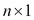
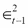

# 第一章 时间序列分析

在本章中，我们将探讨一些高级时间序列方法，并介绍如何使用 R 语言实现它们。作为一个学科，时间序列分析广泛到足以填满数百本书（本章参考文献的理论和 R 编程的最重要文献将列在阅读清单的末尾）；因此，本章的内容必然是高度选择性的，我们将重点介绍在实证金融和量化交易中不可避免地重要的主题。然而，开篇应当强调的是，本章仅为进一步学习时间序列分析奠定基础。

我们之前的书籍*《量化金融 R 语言入门》*，*Packt 出版*，讨论了一些时间序列分析的基本主题，如线性单变量时间序列建模、**自回归综合滑动平均**（**ARIMA**）以及波动性建模**广义自回归条件异方差**（**GARCH**）。如果你从未使用 R 语言进行时间序列分析，你可能想要先阅读该书的第一章，*时间序列分析*。

当前版本在所有这些主题上都有更深入的探讨，你将熟悉一些重要的概念，如协整、向量自回归模型、脉冲响应函数、使用不对称 GARCH 模型进行波动性建模，包括指数 GARCH 和阈值 GARCH 模型，以及新闻影响曲线。我们首先介绍相关理论，然后提供关于多变量时间序列建模的一些实用见解，并描述若干有用的 R 包和功能。此外，通过简单且具有说明性的例子，我们一步步介绍如何使用 R 编程语言进行实证分析。

# 多变量时间序列分析

关于金融资产价格波动、技术分析和量化交易的基本问题通常是在单变量的背景下进行讨论的。我们能否预测一只证券的价格是上涨还是下跌？这只证券是处于上涨趋势还是下跌趋势？我们应该买入还是卖出？这些都是重要的考虑因素；然而，投资者通常面临更复杂的情况，很少将市场视为仅仅是一个独立工具和决策问题的池塘。

通过单独观察这些工具，它们可能看起来是无自相关的，且均值不可预测，这正如有效市场假说所指出的那样，然而，它们之间的相关性显然是存在的。这种相关性可以通过交易活动进行利用，无论是为了投机还是对冲目的。这些考虑因素为在量化金融中使用多变量时间序列技术提供了依据。在本章中，我们将讨论两个在金融中有着广泛应用的计量经济学概念。它们分别是协整和向量自回归模型。

## 协整

从现在开始，我们将考虑一个时间序列向量，它由元素组成，每个元素代表一个时间序列，例如不同金融产品的价格演变。让我们从协整数据系列的正式定义开始。

如果每个时间序列单独是整合的，且存在该系列的线性组合是整合的，则称时间序列的向量是协整的，具体来说，在大多数应用中，这些序列是一级整合的（意味着它们是非平稳的单位根过程或随机游走），而且该线性组合的整合阶数为，通常是零阶，这意味着它是一个平稳过程。

直观地讲，这一定义意味着经济中存在一些潜在的力量，这些力量在长期内将*n*个时间序列维系在一起，即使它们看起来都是各自的随机游走。协整时间序列的一个简单示例是以下一对向量，取自*Hamilton (1994)*，我们将使用它来研究协整，同时也熟悉一些 R 中的基本模拟技术：


中的单位根将通过标准统计检验正式展示。可以使用 R 中的`tseries`包或`urca`包来进行单位根检验；这里我们使用第二个包。以下 R 代码模拟了两个长度为`1000`的序列：

```py
#generate the two time series of length 1000

set.seed(20140623)         #fix the random seed
N <- 1000                  #define length of simulation
x <- cumsum(rnorm(N))      #simulate a normal random walk
gamma <- 0.7               #set an initial parameter value
y <- gamma * x + rnorm(N)  #simulate the cointegrating series
plot(x, type='l')          #plot the two series
lines(y,col="red")

```

### 提示

**下载示例代码**

你可以从[`www.packtpub.com`](http://www.packtpub.com)的账户中下载所有你购买的 Packt Publishing 书籍的示例代码文件。如果你是从其他地方购买的此书，你可以访问[`www.packtpub.com/support`](http://www.packtpub.com/support)并注册，文件将直接通过电子邮件发送给你。

上述代码的输出结果如下：


通过目视检查，两个序列似乎都是各自的随机游走。可以使用`urca`包进行 Augmented Dickey Fuller 检验来测试平稳性；然而，R 中也有许多其他可用的检验方法。零假设假定过程存在单位根（输出省略）；如果测试统计量小于临界值，我们将拒绝零假设：

```py
#statistical tests
install.packages('urca');library('urca')
#ADF test for the simulated individual time series
summary(ur.df(x,type="none"))
summary(ur.df(y,type="none"))

```

对于两个模拟的序列，测试统计量在通常的显著性水平下（1%、5%和 10%）大于临界值；因此，我们不能拒绝零假设，并得出结论认为两个序列都是单位根过程。

现在，取以下两条序列的线性组合并绘制结果序列：


```py
z = y - gamma*x	#take a linear combination of the series
plot(z,type='l')

```

前述代码的输出结果如下：


 显然是一个白噪声过程；通过 ADF 检验结果确认单位根被拒绝：

```py
summary(ur.df(z,type="none"))

```

在实际应用中，显然我们不知道的值；这一点必须基于原始数据进行估算，方法是对一条序列进行线性回归，回归的对象是另一条序列。这就是著名的 Engle-Granger 协整检验方法。以下两个步骤就是 Engle-Granger 协整检验方法：

1.  对进行线性回归，回归对象是（简单的 OLS 估计）。

1.  测试残差是否存在单位根。

### 提示

我们应该在这里注意，对于*n*条序列，可能的独立协整向量的数量是；因此，对于，协整关系可能不是唯一的。我们将在后续章节简要讨论。

可以使用`lm`函数拟合简单线性回归。残差可以从结果对象中获取，示例如下。ADF 检验按常规方式进行，并确认在所有显著性水平下拒绝原假设。然而，后续章节将讨论一些警告事项：

```py
#Estimate the cointegrating relationship
coin <- lm(y ~ x -1)           #regression without intercept
coin$resid                     #obtain the residuals
summary(ur.df(coin$resid))     #ADF test of residuals

```

现在，考虑我们如何将这个理论转化为成功的交易策略。此时，我们应该引入**统计套利**或配对交易的概念，在最简单且早期的形式中，正是利用了这种协整关系。这些方法的主要目的是基于两条时间序列之间的价差建立交易策略；如果序列是协整的，我们预计它们的平稳线性组合会回归到 0。我们可以通过卖出相对昂贵的序列并买入较便宜的序列来获利，然后坐等回归。

### 提示

统计套利一词通常用于许多复杂的统计学和计量经济学技术，旨在利用资产在统计意义上的相对错误定价，也就是说，不是与理论均衡模型进行比较。

这一思想背后的经济直觉是什么？形成协整关系的时间序列线性组合由潜在的经济力量决定，这些经济力量在我们的统计模型中没有明确识别，有时被称为相关变量之间的长期关系。例如，同行业的相似公司预期会有类似的增长，金融产品的现货价格和远期价格受无套利原则的约束，某些相互关联的国家的外汇汇率预期会共同波动，或者短期利率和长期利率通常会相互接近。与这种统计上或理论上预期的共同行为的偏差为各种量化交易策略提供了机会，交易者可以通过这些策略对未来的修正进行投机。

协整的概念将在后续章节中进一步讨论，但为了讨论这一点，我们需要引入向量自回归模型。

## 向量自回归模型

向量自回归模型（VAR）可以被视为单变量自回归（AR）模型的显而易见的多变量扩展。它们在应用计量经济学中的流行可追溯到*Sims (1980)*的开创性论文。VAR 模型是最重要的多变量时间序列模型，在计量经济学和金融学中有着广泛的应用。R 包 vars 为 R 用户提供了一个优秀的框架。关于这个包的详细评审，请参见 Pfaff（2013）。关于计量经济学理论，请参考*Hamilton (1994)*、*Lütkepohl (2007)*、*Tsay (2010)*或*Martin et al. (2013)*。在本书中，我们仅提供该主题的简明直观总结。

在 VAR 模型中，我们的起点是长度为的时间序列向量 。VAR 模型将每个变量的演变指定为所有其他变量滞后值的线性函数；也就是说，阶数为*p*的 VAR 模型如下所示：


这里，是所有的系数矩阵，而是一个具有正定协方差矩阵的向量白噪声过程。向量白噪声的术语假定没有自相关，但允许组分之间有共同的相关性；也就是说，具有非对角协方差矩阵。

矩阵符号清晰地展示了 VAR 模型的一个特点：所有变量仅依赖于自身和其他变量的过去值，这意味着同时依赖性没有被显式建模。这个特点使我们能够通过普通最小二乘法逐方程地估计模型。这类模型被称为简化形式的 VAR 模型，与下一节讨论的结构形式模型相对。

显然，假设没有同时效应将是过于简化的，所得的脉冲响应关系，即冲击作用于特定变量后过程的变化，将具有误导性且不太有用。这就促使了结构化 VAR（SVAR）模型的引入，该模型显式地对变量之间的同时效应进行建模：


这里，和；因此，可以通过将简化形式与适当的参数矩阵相乘来获得结构形式，这反映了变量之间的同时结构关系。

### 提示

在符号中，和通常一样，我们遵循 vars 包的技术文档，该文档与*Lütkepohl (2007)*的文档非常相似。

在简化形式的模型中，并未建模同时依赖性；因此，这些依赖性出现在误差项的相关结构中，即的协方差矩阵，记作。在 SVAR 模型中，同时依赖性被显式建模（通过左侧的***A***矩阵），且干扰项被定义为不相关的，因此的协方差矩阵是对角矩阵。在这里，干扰项通常被称为结构性冲击。

SVAR 建模既有趣又充满挑战的原因在于所谓的识别问题；SVAR 模型未被识别，即矩阵*A*中的参数在没有额外限制的情况下无法估计。

### 提示

我们应如何理解一个模型未被识别？这基本上意味着存在不同的（无限多个）参数矩阵，这些矩阵导致相同的样本分布；因此，无法基于样本识别参数的唯一值。

给定一个简化形式的模型，总是可以推导出一个合适的参数矩阵，使得残差正交；协方差矩阵  是半正定的，这使得我们可以应用 LDL 分解（或替代地，Cholesky 分解）。这表明，总是存在一个  下三角矩阵和一个  对角矩阵，使得 。通过选择 ，结构模型的协方差矩阵变为 ，从而得到 。现在，我们可以得出结论，! Vector autoregressive models 是对角矩阵，正如我们预期的那样。请注意，通过这种方法，我们实质上是在方程中施加了一个任意的递归结构。这是 `irf()` 函数默认遵循的方法。

文献中有多种方法可以识别 SVAR 模型的参数，包括短期或长期的参数限制，或者对脉冲响应的符号限制（例如，参见 *Fry-Pagan (2011)*）。其中许多方法在 R 中尚无原生支持。在这里，我们仅介绍一套标准的技术，用于施加短期参数限制，分别称为 A 模型、B 模型和 AB 模型，每个模型都在 `vars` 包中原生支持：

+   在 A 模型的情况下，，对矩阵 ***A*** 施加限制，使得  是一个对角协方差矩阵。为了使模型“恰好识别”，我们需要额外的  限制。这让人联想到施加一个三角矩阵（但并不要求该特定结构）。

+   另一种方法是通过施加矩阵 **B** 的结构（即 B 模型），根据限制后的模型残差来识别结构性创新，即直接在相关结构上施加限制，在这种情况下，! Vector autoregressive models 和 。

+   AB 模型对 A 和 B 都施加限制，限制模型与结构模型之间的连接由  确定。

脉冲响应分析通常是建立 VAR 模型的主要目标之一。本质上，脉冲响应函数显示了一个变量如何对系统中任何其他变量的冲击（脉冲）做出反应（响应）。如果系统包含变量，脉冲响应函数可以被确定。脉冲响应可以通过 VAR 过程的向量移动平均表示（VMA）从数学上推导出来，类似于单变量情形（见*Lütkepohl (2007)*的详细说明）。

### VAR 实现示例

作为一个说明性示例，我们从以下组件构建了一个三组件 VAR 模型：

+   股票回报：指定从 2004 年 1 月 1 日到 2014 年 3 月 3 日的微软价格指数

+   股票指数：指定从 2004 年 1 月 1 日到 2014 年 3 月 3 日的 S&P500 指数

+   从 2004 年 1 月 1 日到 2014 年 3 月 3 日的美国国债利率

我们的主要目的是通过使用额外的变量来预测股市指数，并识别脉冲响应。在这里，我们假设存在一个隐藏的长期关系，连接给定股票、整个股市和债券市场。选择这个示例主要是为了展示 R 编程环境中的几种数据处理可能性，并通过一个非常简单的示例阐明一个复杂概念，而非其经济意义。

我们使用了`vars`和`quantmod`包。如果你还没有安装并加载这些包，请不要忘记安装并加载：

```py
install.packages('vars');library('vars')
install.packages('quantmod');library('quantmod')

```

`Quantmod`包提供了丰富的工具，能够直接从在线来源获取金融数据，这也是我们在本书中频繁使用的工具。我们使用`getSymbols()`函数：

```py
getSymbols('MSFT', from='2004-01-02', to='2014-03-31')
getSymbols('SNP', from='2004-01-02', to='2014-03-31')
getSymbols('DTB3', src='FRED')

```

默认情况下，`yahoofinance`被用作股票和指数价格系列的数据源（`src='yahoo'`参数设置，示例中省略）。该例程下载开盘价、最高价、最低价、收盘价、交易量以及调整后的价格。下载的数据存储在一个`xts`数据类中，默认情况下根据股票代码（如 MSFT 和 SNP）自动命名。通过调用通用的`plot`函数可以绘制收盘价，但`quantmod`的`chartSeries`函数提供了更好的图形化展示。

下载数据的组件可以通过以下快捷方式访问：

```py
Cl(MSFT)     #closing prices
Op(MSFT)     #open prices
Hi(MSFT)     #daily highest price
Lo(MSFT)     #daily lowest price
ClCl(MSFT)   #close-to-close daily return
Ad(MSFT)     #daily adjusted closing price

```

因此，例如，使用这些快捷方式，可以绘制如下的日收盘对收盘收益：

```py
chartSeries(ClCl(MSFT))  #a plotting example with shortcuts

```

上述命令的截图如下：


利率数据是从**FRED（联邦储备经济数据）**数据源下载的。目前版本的接口不允许日期子集筛选；然而，下载的数据被存储在`xts`数据类中，方便按需进行子集提取，以获得我们感兴趣的时间段：

```py
DTB3.sub <- DTB3['2004-01-02/2014-03-31']

```

下载的价格（假设是非平稳序列）应该转换为平稳序列以供分析；也就是说，我们将使用从调整后的序列中计算得出的对数收益率：

```py
MSFT.ret <- diff(log(Ad(MSFT)))
SNP.ret  <- diff(log(Ad(SNP)))

```

接下来，我们需要在进行 VAR 模型拟合之前执行最后一步数据清理。通过目测数据，我们可以看到 T-Bill 收益率序列中存在缺失数据，而且我们的数据库长度不一致（在某些日期，虽然有利率报价，但缺少股价）。为了解决这些数据质量问题，我们暂时选择最简单的解决方案：合并数据库（通过忽略所有没有三个数据点的日期），并去除所有 NA 数据。前者通过内部连接参数实现（有关详细信息，请参见 merge 函数的帮助文档）：

```py
dataDaily <- na.omit(merge(SNP.ret,MSFT.ret,DTB3.sub), join='inner')

```

在这里，我们注意到 VAR 建模通常是在较低频率的数据上进行的。通过使用以下函数，您可以将数据转换为月度或季度频率，这些函数会返回给定期间内的开盘、最高、最低和收盘值：

```py
SNP.M  <- to.monthly(SNP.ret)$SNP.ret.Close
MSFT.M <- to.monthly(MSFT.ret)$MSFT.ret.Close
DTB3.M <- to.monthly(DTB3.sub)$DTB3.sub.Close

```

可以通过使用`vars`包中的`VAR()`函数将一个简单的简化 VAR 模型拟合到数据中。以下代码中展示的参数化允许在方程中使用最多 4 个滞后期，并选择具有最佳（最低）赤池信息准则值的模型：

```py
var1 <- VAR(dataDaily, lag.max=4, ic="AIC")

```

对于更为完善的模型选择，您可以考虑使用`VARselect()`，它提供多个信息准则（输出已省略）：

```py
>VARselect(dataDaily,lag.max=4)

```

结果对象是`varest`类的对象。通过`summary()`方法或`show()`方法（即直接输入变量）可以获取估计的参数和多个其他统计结果：

```py
summary(var1)
var1

```

还有其他方法值得一提。`varest`类的自定义绘图方法为所有变量分别生成图表，包括拟合值、残差以及残差的自相关和偏自相关函数。您需要按*Enter*键以获取新变量。提供了大量的自定义设置；请参考`vars`包文档：

```py
plot(var1)       #Diagram of fit and residuals for each variables
coef(var1)       #concise summary of the estimated variables
residuals(var1)  #list of residuals (of the corresponding ~lm)
fitted(var1)     #list of fitted values
Phi(var1)        #coefficient matrices of VMA representation

```

使用我们估计的 VAR 模型进行预测，可以通过简单地调用`predict`函数并添加所需的置信区间来实现：

```py
var.pred <- predict(var1, n.ahead=10, ci=0.95)

```

脉冲响应应该首先通过`irf()`函数以数值形式生成，然后可以通过`plot()`方法进行绘制。再次说明，我们可以为每个变量得到不同的图表，包括显示在以下命令中的带有自助法置信区间的脉冲响应函数：

```py
var.irf <- irf(var1)
plot(var.irf)

```

现在，考虑使用前面描述的参数限制来拟合一个结构 VAR 模型，作为 A 模型。识别出的 SVAR 模型所需的限制数为；在我们的例子中，这是 3。

### 提示

更多细节请参见 *Lütkepohl (2007)*。所需的附加约束数量为 ，但对角元素被规范化为 1，这样我们就得到了前述数量。

SVAR 模型的起点是已经估计出的 VAR 模型的简化形式（var1）。这需要通过适当结构化的约束矩阵进行修正。

为了简化起见，我们将使用以下约束：

+   S&P 指数冲击对微软没有同时影响

+   S&P 指数冲击对利率没有同时影响

+   T 债券利率冲击对微软没有同时影响

这些约束作为 0 输入进入 SVAR 模型的 **A** 矩阵，具体如下：


在 R 中设置 **A** 矩阵作为 SVAR 估计的参数时，待估计参数的位置应设置为 NA 值。这可以通过以下赋值完成：

```py
amat <- diag(3)
amat[2, 1] <- NA
amat[2, 3] <- NA
amat[3, 1] <- NA

```

最后，我们可以拟合 SVAR 模型并绘制脉冲响应函数（输出省略）：

```py
svar1 <- SVAR(var1, estmethod='direct', Amat = amat)
irf.svar1 <- irf(svar1)
plot(irf.svar1)

```

## 协整 VAR 和 VECM

最后，我们将整合到目前为止所学的内容，并讨论协整 VAR 和 **向量误差修正模型（VECM）** 的概念。

我们的出发点是一个协整变量的系统（例如，在交易背景下，这表示一组可能由相同基本面驱动的相似股票）。前面讨论的标准 VAR 模型仅在变量是平稳的情况下才能估计。正如我们所知，消除单位根模型的传统方法是首先对序列进行差分；然而，在协整序列的情况下，这会导致过度差分并丧失由变量水平的长期共动性传递的信息。最终，我们的目标是构建一个平稳变量的模型，同时结合原始协整非平稳变量之间的长期关系，也就是构建一个协整的 VAR 模型。这个思路被向量误差修正模型（VECM）所捕捉，VECM 包含一个差分变量的 VAR 模型，阶数为*p - 1*，以及一个来自已知（估计的）协整关系的误差修正项。直观地说，使用股市例子，VECM 模型建立了股票收益的短期关系，同时修正了价格长期共动性偏离的情况。

从形式上讲，我们将作为数值例子讨论的二变量 VECM 可以写成如下形式。设  为两个非平稳单位根序列的向量 ，其中这两个序列是协整的，并具有一个协整向量 。然后，可以将一个适当的 VECM 模型表述如下：


在这里，和第一项通常被称为误差修正项。

实际上，有两种方法可以测试协整关系并建立误差修正模型。对于双变量情况，Engle-Granger 方法非常有启发性；我们的数值例子基本上遵循了这个思路。对于多变量情况，其中可能的最大协整关系数量是，你必须遵循 Johansen 程序。尽管后者的理论框架远远超出了本书的范围，我们简要展示了实践中的实现工具，并提供了进一步研究的参考文献。

为了展示一些关于 VECM 模型的基本 R 功能，我们将使用一个标准的例子，即三个月和六个月的美国国债次级市场利率，这些数据可以从 FRED 数据库下载，就像我们之前讨论的那样。我们将关注一个任意选择的时期，即从 1984 年到 2014 年。扩展的 Dickey-Fuller 检验表明单位根的原假设无法被拒绝。

```py
library('quantmod')
getSymbols('DTB3', src='FRED')
getSymbols('DTB6', src='FRED')
DTB3.sub = DTB3['1984-01-02/2014-03-31']
DTB6.sub = DTB6['1984-01-02/2014-03-31']
plot(DTB3.sub)
lines(DTB6.sub, col='red')

```

我们可以通过运行简单的线性回归一致地估计这两个序列之间的协整关系。为了简化代码，我们将两个序列定义为变量`x1`和`x2`，并将相应的向量序列定义为`y`。代码片段中其他变量命名约定将是自解释的：

```py
x1=as.numeric(na.omit(DTB3.sub))
x2=as.numeric(na.omit(DTB6.sub))
y = cbind(x1,x2)
cregr <- lm(x1 ~ x2)
r = cregr$residuals

```

如果回归的残差（变量`r`），即变量的适当线性组合，构成了一个平稳序列，那么这两个序列确实是协整的。你可以用常规的 ADF 检验来测试这个，但在这些设置下，常规的临界值并不适用，应该使用修正后的值（例如，参见*Phillips 和 Ouliaris (1990)*）。

因此，使用专门的协整检验更为合适，例如 Phillips 和 Ouliaris 检验，它在`tseries`和`urca`包中都有实现。最基本的`tseries`版本如下所示：

```py
install.packages('tseries');library('tseries');
po.coint <- po.test(y, demean = TRUE, lshort = TRUE)

```

原假设认为这两个序列没有协整关系，因此较低的 p 值表明拒绝原假设并存在协整关系。

Johansen 程序适用于多个可能的协整关系；可以在`urca`包中找到实现：

```py
yJoTest = ca.jo(y, type = c("trace"), ecdet = c("none"), K = 2)

###################### 
# Johansen-Procedure # 
###################### 

Test type: trace statistic , with linear trend 

Eigenvalues (lambda):
[1] 0.0160370678 0.0002322808

Values of teststatistic and critical values of test:

 test 10pct  5pct  1pct
r <= 1 |   1.76  6.50  8.18 11.65
r = 0  | 124.00 15.66 17.95 23.52

Eigenvectors, normalised to first column:
(These are the cointegration relations)

 DTB3.l2   DTB6.l2
DTB3.l2  1.000000  1.000000
DTB6.l2 -0.994407 -7.867356
Weights W:
(This is the loading matrix)

 DTB3.l2      DTB6.l2
DTB3.d -0.037015853 3.079745e-05
DTB6.d -0.007297126 4.138248e-05

```

*r = 0*（无协整关系）的检验统计量大于临界值，这表明拒绝原假设。然而，对于，原假设不能被拒绝；因此，我们得出结论，存在一个协整关系。协整向量由下方检验结果中规范化特征向量的第一列给出。

最后一步是获得该系统的 VECM 表示，即对滞后差分变量和先前计算的协整关系得到的误差修正项进行 OLS 回归。适当的函数使用我们之前创建的`ca.jo`对象类。*r = 1*参数表示协整秩，具体如下：

```py
>yJoRegr = cajorls(dyTest, r=1)
>yJoRegr

$rlm

Call:
lm(formula = substitute(form1), data = data.mat)

Coefficients:
 x1.d        x2.d 
ect1      -0.0370159  -0.0072971
constant  -0.0041984  -0.0016892
x1.dl1     0.1277872   0.1538121
x2.dl1     0.0006551  -0.0390444

$beta
 ect1
x1.l1  1.000000
x2.l1 -0.994407

```

误差修正项的系数为负，如我们所预期；短期的偏离长期均衡水平会将我们的变量推回到零的均衡偏差。

你可以在双变量情况下轻松检查这一点；Johansen 方法的结果与按照 Engle-Granger 程序逐步实现的误差修正模型结果大致相同。相关内容在上传的 R 代码文件中展示。

# 波动率建模

在实证金融学中，波动率随着时间变化是一个广为人知且普遍接受的风格化事实。然而，波动率的不可观察性使得测量和预测变得具有挑战性。通常，波动率变化模型是由三种实证观察所激发的：

+   **波动率聚集**：这指的是在金融市场中，一个平静的时期通常会跟随另一个平静的时期，而动荡时期则会跟随另一个动荡时期的经验观察。

+   **资产收益的非正态性**：实证分析表明，资产收益相对于正态分布往往具有胖尾现象。

+   **杠杆效应**：这一现象导致了一个观察结果，即波动率对价格的正负变化反应不同；价格下跌会比相同幅度的上涨引起更大的波动率。

在以下代码中，我们展示了基于标准普尔资产价格的这些风格化事实。数据是通过使用已知方法从`yahoofinance`下载的：

```py
getSymbols("SNP", from="2004-01-01", to=Sys.Date())
chartSeries(Cl(SNP))

```

我们感兴趣的目标是每日收益率序列，因此我们通过收盘价计算对数收益率。尽管这是一个直接的计算，`Quantmod`包提供了一个更简单的方法：

```py
ret <- dailyReturn(Cl(SNP), type='log')

```

波动率分析不再仅仅是目测自相关和偏自相关函数。我们预计对数收益率是没有序列相关性的，但平方或绝对对数收益率会显示显著的自相关。这意味着对数收益率没有相关性，但并非独立。

注意以下代码中的`par(mfrow=c(2,2))`函数；通过这个，我们覆盖了 R 语言的默认绘图参数，以便将四个感兴趣的图表以方便的表格格式组织起来：

```py
par(mfrow=c(2,2))
acf(ret, main="Return ACF");
pacf(ret, main="Return PACF");
acf(ret², main="Squared return ACF");
pacf(ret², main="Squared return PACF")
par(mfrow=c(1,1))

```

前面命令的截图如下：


接下来，我们查看 S&P 的日度对数收益的直方图和/或经验分布，并将其与具有相同均值和标准差的正态分布进行比较。对于后者，我们使用`density(ret)`函数来计算非参数经验分布函数。我们使用`curve()`函数，并增加参数`add=TRUE`，将第二条线绘制到已有的图表中：

```py
m=mean(ret);s=sd(ret);
par(mfrow=c(1,2))
hist(ret, nclass=40, freq=FALSE, main='Return histogram');curve(dnorm(x, mean=m,sd=s), from = -0.3, to = 0.2, add=TRUE, col="red")
plot(density(ret), main='Return empirical distribution');curve(dnorm(x, mean=m,sd=s), from = -0.3, to = 0.2, add=TRUE, col="red")
par(mfrow=c(1,1))

```


超额峰度和肥尾是显而易见的，但我们可以通过数值验证（使用`moments`包）来确认我们样本的经验分布的峰度超过了正态分布的峰度（其值为 3）。与其他一些软件包不同，R 报告的是名义峰度，而不是超额峰度，其值如下：

```py
> kurtosis(ret)
daily.returns 
 12.64959

```

还可以通过简单地重新缩放我们的图表，来放大图表的上尾或下尾部分。

```py
# tail zoom
plot(density(ret), main='Return EDF - upper tail', xlim = c(0.1, 0.2), ylim=c(0,2));
curve(dnorm(x, mean=m,sd=s), from = -0.3, to = 0.2, add=TRUE, col="red")

```


另一个有用的可视化练习是查看**对数尺度上的密度**（见下图，左侧），或**QQ 图**（右侧），它们是常见的密度比较工具。**QQ 图**描绘了经验分位数与理论（正态）分布的分位数之间的关系。如果我们的样本来自正态分布，应该形成一条直线。偏离这条直线可能表明存在肥尾：

```py
# density plots on log-scale
plot(density(ret), xlim=c(-5*s,5*s),log='y', main='Density on log-scale')
curve(dnorm(x, mean=m,sd=s), from=-5*s, to=5*s, log="y", add=TRUE, col="red")

# QQ-plot
qqnorm(ret);qqline(ret);

```

上述命令的截图如下：


现在，我们可以将注意力转向波动性的建模。

广义上讲，金融计量经济学文献中有两种建模技术用于捕捉波动性的变化特性：**GARCH 家族**方法（*Engle, 1982* 和 *Bollerslev, 1986*）和**随机波动性（SV）**模型。至于它们之间的区别，GARCH 型建模与（真正的）SV 型建模技术的主要不同在于，前者中给定过去观测值的条件方差是可得的，而在 SV 模型中，波动性相对于可用信息集是不可测量的；因此，它本质上是隐藏的，必须从测量方程中滤除（例如，参见 *Andersen – Benzoni (2011)*）。换句话说，GARCH 型模型通过基于过去的观测来估计波动性，而在 SV 模型中，波动性有其自身的随机过程，这个过程是隐藏的，收益实现应作为测量方程，用于推断潜在的波动性过程。

在本章中，我们介绍 GARCH 方法的基本建模技术，主要有两个原因；首先，它在应用工作中得到了广泛使用。其次，由于其多样的理论背景，SV 模型尚未得到 R 包的原生支持，因此需要大量的自定义开发来进行经验实现。

## 使用 rugarch 包进行 GARCH 建模

在 R 中有多个可用于 GARCH 建模的包。最著名的有 `rugarch`、`rmgarch`（用于多变量模型）和 `fGarch`；然而，基本的 `tseries` 包也包含了一些 GARCH 功能。在本章中，我们将演示 `rugarch` 包的建模功能。本章中的符号遵循 `rugarch` 包的输出和文档中的符号。

### 标准 GARCH 模型

GARCH（p,q）过程可以写成如下形式：


在这里， 通常是条件均值方程的扰动项（在实际应用中，通常是 ARMA 过程）和。也就是说，条件波动性过程是由其自身的滞后值和滞后平方观测值（的值）线性决定的。在实证研究中，GARCH（1,1）通常能够很好地拟合数据。可以将简单的 GARCH（1,1）模型视为一个模型，其中条件方差被指定为长期方差、最后预测的方差和新信息的加权平均（参见*Andersen 等人 (2009)*）。很容易看出，GARCH（1,1）模型如何捕捉波动性的自回归性（波动性聚集）和资产收益分布的厚尾特性，但它的主要缺点是对称的，不能捕捉分布中的不对称性和杠杆效应。

波动性聚集现象在 GARCH 模型中的出现是非常直观的；一个大的正（负）冲击在中会增加（减少）的值，从而增加（减少）的值，最终导致的值变大（变小）。这个冲击是持续的；这就是波动性聚集。厚尾性质需要一些推导；例如参见 Tsay (2010)。

我们的实证例子将是分析基于 2006 年 1 月 1 日至 2014 年 3 月 31 日期间 Apple Inc. 日收盘价计算的收益率序列。在开始分析之前，作为一个有用的练习，我们建议您重复本章中的探索性数据分析，以识别 Apple 数据中的典型特征。

显然，我们的第一步是安装一个包，如果还未安装：

```py
install.packages('rugarch');library('rugarch')

```

获取数据时，通常我们使用 `quantmod` 包和 `getSymbols()` 函数，并基于收盘价计算收益率序列。

```py
#Load Apple data and calculate log-returns
getSymbols("AAPL", from="2006-01-01", to="2014-03-31")
ret.aapl <- dailyReturn(Cl(AAPL), type='log')
chartSeries(ret.aapl)

```

`rugarch` 的编程逻辑可以这样理解：无论你的目标是什么（拟合、过滤、预测和模拟），首先，你需要将一个模型指定为系统对象（变量），然后将其插入到相应的函数中。可以通过调用 `ugarchspec()` 来指定模型。以下代码指定了一个简单的 GARCH (1,1) 模型（sGARCH），其均值方程中只有一个常数项 ：

```py
garch11.spec = ugarchspec(variance.model = list(model="sGARCH", garchOrder=c(1,1)), mean.model = list(armaOrder=c(0,0)))

```

一种显而易见的做法是将此模型拟合到我们的数据中，即基于我们的每日收益时间序列，通过最大似然估计未知参数：

```py
aapl.garch11.fit = ugarchfit(spec=garch11.spec, data=ret.aapl)

```

该函数提供了多个输出，其中包括参数估计值 ：

```py
> coef(aapl.garch11.fit)
 mu        omega       alpha1        beta1 
1.923328e-03 1.027753e-05 8.191681e-02 8.987108e-01

```

通过生成的对象的 `show()` 方法（即直接输入变量名），可以获得估计值和各种诊断测试。通过输入适当的命令，还可以获取一系列其他统计量、参数估计值、标准误差和协方差矩阵估计。完整列表请参见 `ugarchfit` 对象类；以下代码显示了最重要的几个：

```py
coef(msft.garch11.fit)          #estimated coefficients
vcov(msft.garch11.fit)          #covariance matrix of param estimates
infocriteria(msft.garch11.fit)  #common information criteria list
newsimpact(msft.garch11.fit)    #calculate news impact curve
signbias(msft.garch11.fit)      #Engle - Ng sign bias test
fitted(msft.garch11.fit)        #obtain the fitted data series
residuals(msft.garch11.fit)     #obtain the residuals
uncvariance(msft.garch11.fit)   #unconditional (long-run) variance
uncmean(msft.garch11.fit)       #unconditional (long-run) mean

```

标准 GARCH 模型能够捕捉到重尾和波动性聚集现象，但要解释由杠杆效应引起的不对称性，我们需要更为高级的模型。为了从视觉上处理不对称性问题，我们现在将描述新闻冲击曲线的概念。

新闻冲击曲线由 Pagan 和 Schwert (1990) 以及 Engle 和 Ng (1991) 提出，是可视化波动性变化幅度应对冲击的有用工具。这个名称源于将冲击通常解释为影响市场波动的新闻。它们绘制了条件波动性变化与不同大小冲击的关系，并能够简洁地表达波动性的不对称效应。在以下代码中，第一行计算了之前定义的 GARCH(1,1) 模型的新闻冲击数值，第二行则生成了可视化图表：

```py
ni.garch11 <- newsimpact(aapl.garch11.fit)
plot(ni.garch11$zx, ni.garch11$zy, type="l", lwd=2, col="blue", main="GARCH(1,1) - News Impact", ylab=ni.garch11$yexpr, xlab=ni.garch11$xexpr)

```

上述命令的截图如下：


正如我们预期的那样，正负冲击的响应中没有出现不对称现象。现在，我们转向可以同时考虑不对称效应的模型。

### 指数 GARCH 模型 (EGARCH)

指数 GARCH 模型由 Nelson (1991) 提出。该方法直接对条件波动性的对数建模：


其中，*E* 是期望算子。这个模型的公式允许在演化波动率过程中具有乘法动力学。不对称性通过  参数来捕捉；负值表示该过程对负向冲击的反应更为强烈，这在实际数据集中可以观察到。

要拟合一个 EGARCH 模型，唯一需要在模型规范中更改的参数是设置 EGARCH 模型类型。通过运行 `fitting` 函数，附加参数将被估计（请参见 `coef()`）：

```py
# specify EGARCH(1,1) model with only constant in mean equation
egarch11.spec = ugarchspec(variance.model = list(model="eGARCH", garchOrder=c(1,1)), mean.model = list(armaOrder=c(0,0)))
aapl.egarch11.fit = ugarchfit(spec=egarch11.spec, data=ret.aapl)

> coef(aapl.egarch11.fit)
 mu        omega       alpha1        beta1       gamma1 
 0.001446685 -0.291271433 -0.092855672  0.961968640  0.176796061

```

新闻冲击曲线反映了条件波动率对冲击反应的强烈不对称性，并验证了非对称模型的必要性：

```py
ni.egarch11 <- newsimpact(aapl.egarch11.fit)
plot(ni.egarch11$zx, ni.egarch11$zy, type="l", lwd=2, col="blue", main="EGARCH(1,1) - News Impact",
ylab=ni.egarch11$yexpr, xlab=ni.egarch11$xexpr)

```


### 阈值 GARCH 模型 (TGARCH)

另一个突出的例子是 TGARCH 模型，它的解释更为简单。TGARCH 规范明确区分了某一阈值上下的模型参数。TGARCH 也是一个更一般类别的子模型，即非对称幂 ARCH 类别，但由于其在应用金融计量经济学文献中的广泛应用，我们将单独讨论它。

TGARCH 模型可以表述如下：


解释非常直接；ARCH 系数取决于前一个误差项的符号；如果  为正，则负的误差项会对条件波动率产生更大的影响，就像我们之前看到的杠杆效应一样。

在 R 包 `rugarch` 中，阈值 GARCH 模型是在一个更一般的 GARCH 模型框架中实现的，该框架被称为家庭 GARCH 模型 *Ghalanos (2014)*。

```py
# specify TGARCH(1,1) model with only constant in mean equation
tgarch11.spec = ugarchspec(variance.model = list(model="fGARCH", submodel="TGARCH", garchOrder=c(1,1)), 
 mean.model = list(armaOrder=c(0,0)))
aapl.tgarch11.fit = ugarchfit(spec=tgarch11.spec, data=ret.aapl)

> coef(aapl.egarch11.fit)
 mu        omega       alpha1        beta1       gamma1 
 0.001446685 -0.291271433 -0.092855672  0.961968640  0.176796061

```

由于特定的函数形式，阈值 GARCH 模型的新闻冲击曲线在表示不同响应方面不够灵活，在零点处有一个拐点，我们可以通过运行以下命令观察到这一点：

```py
ni.tgarch11 <- newsimpact(aapl.tgarch11.fit)
plot(ni.tgarch11$zx, ni.tgarch11$zy, type="l", lwd=2, col="blue", main="TGARCH(1,1) - News Impact",
ylab=ni.tgarch11$yexpr, xlab=ni.tgarch11$xexpr)

```


## 模拟与预测

Rugarch 包提供了一个简单的方法来从指定的模型中进行模拟。当然，为了进行模拟，我们还应在 `ugarchspec()` 中指定模型的参数；这可以通过 `fixed.pars` 参数来完成。指定模型后，我们可以通过简单地使用 `ugarchpath()` 函数来模拟一个具有给定条件均值和 GARCH 规范的时间序列：

```py
garch11.spec = ugarchspec(variance.model = list(garchOrder=c(1,1)), 
 mean.model = list(armaOrder=c(0,0)),
 fixed.pars=list(mu = 0, omega=0.1, alpha1=0.1,
 beta1 = 0.7))
garch11.sim = ugarchpath(garch11.spec, n.sim=1000)

```

一旦我们得到了估计模型，并且在技术上有了拟合对象，基于该模型预测条件波动率就只需一步：

```py
aapl.garch11.fit = ugarchfit(spec=garch11.spec, data=ret.aapl, out.sample=20)
aapl.garch11.fcst = ugarchforecast(aapl.garch11.fit, n.ahead=10, n.roll=10)

```

预测序列的绘图方法为用户提供了一个选择菜单；我们可以绘制预测的时间序列或预测的条件波动率。

```py
plot(aapl.garch11.fcst, which='all')

```


# 总结

在本章中，我们回顾了时间序列分析中的一些重要概念，如协整、向量自回归和 GARCH 类型的条件波动性模型。同时，我们提供了一个有用的入门指南，介绍了开始使用 R 进行定量与实证金融建模的一些技巧与窍门。我们希望你觉得这些练习有用，但需要再次强调的是，本章在时间序列和计量经济学理论方面，以及从 R 编程的角度来看，远未完整。R 编程语言在互联网上有非常丰富的文档，R 用户社区由成千上万的高级与专业用户组成。我们鼓励你超越书本，做一个自学者，并且在遇到问题时不要停滞不前；几乎可以肯定，你会在互联网上找到继续前进的答案。请大量使用 R 包的文档和帮助文件，频繁访问 R 的官方网站[`cran.r-project.org/`](http://cran.r-project.org/)。接下来的章节将为你提供更多的示例，帮助你在 R 的各种功能、包和函数中找到自己的方向。

# 参考文献与阅读书单

+   Andersen, Torben G; Davis, Richard A.; Kreiß, Jens-Peters; Mikosh, Thomas（编）(2009)。金融时间序列手册

+   Andersen, Torben G. 和 Benzoni, Luca (2011)。随机波动性。复杂系统在金融与计量经济学中的应用，编辑：Meyers, Robert A.，Springer

+   Brooks, Chris (2008)。金融计量经济学导论，剑桥大学出版社

+   Fry, Renee 和 Pagan, Adrian (2011)。结构向量自回归中的符号限制：一项批判性回顾。《经济文献杂志》，美国经济学会，卷 49(4)，938-960 页，12 月。

+   Ghalanos, Alexios (2014)。《rugarch 包介绍》[`cran.r-project.org/web/packages/rugarch/vignettes/Introduction_to_the_rugarch_package.pdf`](http://cran.r-project.org/web/packages/rugarch/vignettes/Introduction_to_the_rugarch_package.pdf)

+   Hafner, Christian M. (2011)。GARCH 建模。复杂系统在金融与计量经济学中的应用，编辑：Meyers, Robert A.，Springer

+   Hamilton, James D. (1994)。时间序列分析，普林斯顿，新泽西州

+   Lütkepohl, Helmut (2007)。多重时间序列分析新导论，Springer

+   Murray, Michael. P. (1994)。一个醉汉和她的狗：协整与误差修正的说明。*美国统计学家*，*48*(1)，37-39。

+   Martin, Vance; Hurn, Stan 和 Harris, David (2013)。时间序列的计量经济模型：规格、估计与检验，剑桥大学出版社

+   Pfaff, Bernard (2008)。使用 R 分析集成和协整时间序列，Springer

+   Pfaff, Bernhard (2008)。VAR、SVAR 和 SVEC 模型：在 R 包 vars 中的实现。统计软件杂志，27(4)

+   Phillips, P. C., & Ouliaris, S. (1990). 基于残差的协整检验的渐近性质。*计量经济学：计量经济学会期刊*, 165-193。

+   Pole, Andrew (2007). 统计套利。Wiley

+   Rachev, Svetlozar T., Hsu, John S.J., Bagasheva, Biliana S. 和 Fabozzi, Frank J. (2008). 金融中的贝叶斯方法。John Wiley & Sons.

+   Sims, Christopher A. (1980). 宏观经济学与现实。*计量经济学：计量经济学会期刊*, 1-48。

+   Tsay, Ruey S. (2010). 金融时间序列分析，第 3 版，Wiley
