# 第二章：因素模型

在金融领域，大多数情况下，金融资产的估值是基于折现现金流法；因此，现值是预计未来现金流的折现值。因此，为了能够对资产进行估值，我们需要知道反映时间价值和给定资产风险的适当回报率。有两种主要方法来确定预期回报：**资本资产定价模型（CAPM）**和**套利定价理论（APT）**。CAPM 是一个均衡模型，而 APT 则基于无套利原理；因此，这些方法的出发点和内在逻辑差异很大。然而，根据我们使用的市场因素，最终得到的定价公式可能非常相似。有关 CAPM 和 APT 的比较，参见*Bodie-Kane-Marcus (2008)*。当我们在现实世界数据上测试这些理论模型时，我们会进行线性回归。本章重点讨论 APT，因为我们在*Daróczi et al. (2013)*中已更详细地讨论了 CAPM。

本章分为两部分。在第一部分，我们一般性地介绍 APT 理论，然后展示*Fama 和 French*在一篇开创性论文中提出的特殊三因素模型。在第二部分，我们展示如何使用 R 进行数据选择，以及如何从实际市场数据中估算定价系数，最后我们将对一个更新的样本重新审视著名的 Fama-French 模型。

# 套利定价理论

APT 假设市场上资产的回报由宏观经济因素和公司特定因素决定，资产回报由以下线性因素模型生成：

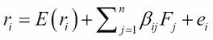

方程式 1

其中，*E(r[i])*是资产*i*的预期回报，*F[j]*代表第*j*个因素的意外变化，β*[ij]*表示第*i*只证券对该因素的敏感度，而*e[i]*是由公司特定事件引起的回报。因此，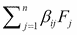表示随机的系统性效应，*e[i]*表示非系统性（即特有的）效应，这是市场因素无法捕捉到的。由于是意外的，和*e[i]*的均值都为零。在此模型中，因素彼此独立，并且与公司特定风险无关。因此，资产回报来源于两个方面：影响市场上所有资产的因素所带来的系统性风险和仅影响特定公司的非系统性风险。非系统性风险可以通过持有更多资产来进行多样化投资。相比之下，系统性风险无法通过多样化来分散，因为它是由影响整个股市的经济范围内的风险源引起的(*Brealey-Myers, 2005*)。

根据该模型，资产的实际回报是多个随机因素的线性组合*(Wilmott, 2007)*。

APT 的其他重要假设如下：

+   市场上有有限数量的投资者，他们优化下一时期的投资组合。这些投资者信息对称，且没有市场影响力。

+   存在一种无风险资产和无限数量的不断交易的风险资产；因此，可以通过多样化完全消除公司特定风险。具有零公司特定风险的投资组合被称为良好多样化的投资组合。

+   投资者是理性的，即如果出现套利机会（金融资产相对定价错误），投资者会立即购买被低估的证券/证券，并卖出被高估的证券，并会采取无限大的仓位以赚取尽可能多的无风险利润。因此，任何定价错误都会立即消失。

+   存在因子投资组合，并且它们可以不断交易。因子投资组合是一个良好多样化的投资组合，仅对某一因子有反应；具体来说，它对该指定因子的贝塔值为 1，对所有其他因子的贝塔值为 0。

根据前述假设，可以证明任何投资组合的风险溢价等于因子投资组合风险溢价的加权总和*(Medvegyev-Száz, 2010)*。在双因子模型的情况下，可以推导出以下定价公式：

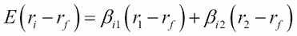

方程 2

这里，*r[i]* 是第*i*个资产的回报，*r[f]* 是无风险回报，β*[i1]* 是第*i*个股票的风险溢价对第一个系统性因子的敏感度，（*r[1]-r[f]*）是该因子的风险溢价。类似地，β*[i2]* 是第*i*个股票的风险溢价对第二个因子的超额回报（*r[2]-r[f]*）的敏感度。

当我们实施 APT 时，我们会执行以下形式的线性回归：

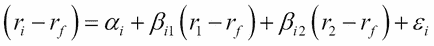

方程 3

其中，*α[i]* 表示常数，*ε[i]* 是资产的非系统性、公司特定风险。所有其他变量与之前提到的一致。

如果模型中只有一个因子，且它是市场投资组合的回报，则 CAPM 模型和 APT 模型的定价方程将完全一致：

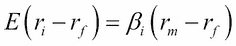

方程 4

在这种情况下，需在真实市场数据上测试的公式如下：

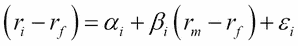

方程 5

这里，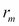 是由市场指数（如 S&P 500）代表的市场投资组合的回报。这就是为什么我们称方程（5）为指数模型的原因。

## APT 的实现

APT 的实现可以分为四个步骤：识别因子、估算因子系数、估算因子溢价以及使用 APT 进行定价(*Bodie 等, 2008*)：

1.  **识别因素**：由于 APT 没有提到任何因素，因此这些因素必须通过经验方法来识别。这些因素通常是宏观经济因素，如股市回报、通货膨胀、商业周期等。使用宏观经济因素的主要问题是，这些因素通常不是相互独立的。因素的识别通常通过因子分析来进行。然而，通过因子分析识别出的因素不一定能以经济学有意义的方式进行解释。

1.  **估算因子系数**：为了估算多元线性回归模型中的系数，使用方程（3）的一个通用版本。

1.  **估算因子溢价**：因子溢价的估算基于历史数据，通过取因子组合的历史时间序列数据的平均值来进行。

1.  **使用 APT 定价**：方程（2）用于通过将适当的变量代入方程来计算任何资产的预期回报。

## 法马-弗兰奇三因子模型

法马和弗兰奇在 1996 年提出了一个多因子模型，在该模型中，他们使用了公司指标作为因子，而不是宏观经济因子，因为他们发现这些因子能更好地描述资产的系统性风险。法马和弗兰奇（1996）通过添加公司规模和账面市值比作为回报生成因子，扩展了指数模型，以便与市场投资组合的回报相结合（*法马和弗兰奇，1996*）。

公司规模因子是通过计算小型和大型公司回报的差异（*r[SMB]*）来构建的。该变量的名称为 SMB，来源于“small minus big”（小减大）。账面市值比因子是通过计算回报差异来计算的，比较的是账面市值比高和低的公司（*r[HML]*）。该变量的名称为 HML，来源于“high minus low”（高减低）。

他们的模型如下：

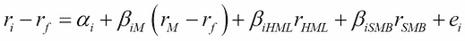

方程 6

在这里，*α[i]*是一个常数，表示异常回报率，*r[f]*是无风险回报，β*[iHML]*是第*i*资产对账面市值比因子的敏感度，β*[iSMB]*是第*i*资产对规模因子的敏感度，β*[iM]*是第*i*股票的风险溢价对市场指数因子的敏感度，(*r[M]-r[f]*)是该因子的风险溢价，而*e[i]*是该资产的非系统性、公司特定的风险，其均值为零。

# 在 R 中建模

在接下来的章节中，我们将学习如何借助 R 实现前述模型。

## 数据选择

在第四章中，*大数据 - 高级分析*，我们将详细讨论如何从开放数据源获取数据并高效使用它们的方法。在这里，我们仅展示如何获取股票价格和其他相关信息的时间序列，并用于因子模型的估算。

我们使用了`quantmod`包来收集数据库。

下面是如何在 R 中实现的：

```py
library(quantmod)
stocks <- stockSymbols()

```

结果是，我们需要等待几秒钟才能获取数据，然后就可以看到输出：

```py
Fetching AMEX symbols...
Fetching NASDAQ symbols...
Fetching NYSE symbols...

```

现在，我们有一个包含约 6,500 只在不同交易所（如 AMEX、NASDAQ 或 NYSE）交易的股票的数据框 R 对象。为了查看数据集包含的变量，我们可以使用`str`命令：

```py
str(stocks)
'data.frame':   6551 obs. of  8 variables:
 $ Symbol   : chr  "AA-P" "AAMC" "AAU" "ACU" ...
 $ Name     : chr  "Alcoa Inc." "Altisource Asset Management Corp"...
 $ LastSale : num  87 1089.9 1.45 16.58 16.26 ...
 $ MarketCap: num  0.00 2.44e+09 9.35e+07 5.33e+07 2.51e+07 ...
 $ IPOyear  : int  NA NA NA 1988 NA NA NA NA NA NA ...
 $ Sector   : chr  "Capital Goods" "Finance" "Basic Industries"...
 $ Industry : chr  "Metal Fabrications" "Real Estate"...
 $ Exchange : chr  "AMEX" "AMEX" "AMEX" "AMEX" ...

```

我们可以删除不需要的变量，并将来自其他数据库的公司市值和账面价值作为新变量加入，因为我们将在估算 Fama-French 模型时需要它们：

```py
stocks[1:5, c(1, 3:4, ncol(stocks))]
 Symbol LastSale  MarketCap BookValuePerShare
1   AA-P    87.30          0              0.03
2   AAMC   985.00 2207480545            -11.41
3    AAU     1.29   83209284              0.68
4    ACU    16.50   53003808             10.95
5    ACY    16.40   25309415             30.13

```

我们还需要无风险回报的时间序列，这将在此计算中通过一个月的美元 LIBOR 利率来量化：

```py
library(Quandl)
Warning message:
package 'Quandl' was built under R version 3.1.0 
LIBOR <- Quandl('FED/RILSPDEPM01_N_B',
start_date = '2010-06-01', end_date = '2014-06-01')
Warning message:
In Quandl("FED/RILSPDEPM01_N_B", start_date = "2010-06-01", end_date = "2014-06-01") : It would appear you aren't using an authentication token. Please visit http://www.quandl.com/help/r or your usage may be limited.

```

我们可以忽略警告信息，因为数据仍然已分配给 LIBOR 变量。

`Quandl`包、`tseries`包以及其他收集数据的包在第四章中有更详细的讨论，*大数据 – 高级分析*。

这也可以用来获取股票价格，标准普尔 500 指数可以作为市场投资组合使用。

我们有一张股票价格表（大约 5,000 只股票在 2010 年 6 月 1 日到 2014 年 6 月 1 日之间的时间序列）。前几列和最后几列看起来是这样的：

```py
d <- read.table("data.csv", header = TRUE, sep = ";")
d[1:7, c(1:5, (ncol(d) - 6):ncol(d))]
 Date       SP500  AAU   ACU   ACY   ZMH   ZNH ZOES  ZQK ZTS ZX
1  2010.06.01 1070.71 0.96 11.30 20.64 54.17 21.55  NA  4.45 NA NA
2  2010.06.02 1098.38 0.95 11.70 20.85 55.10 21.79  NA  4.65 NA NA
3  2010.06.03 1102.83 0.97 11.86 20.90 55.23 21.63  NA  4.63 NA NA
4  2010.06.04 1064.88 0.93 11.65 18.95 53.18 20.88  NA  4.73 NA NA
5  2010.06.07 1050.47 0.97 11.45 19.03 52.66 20.24  NA  4.18 NA NA
6  2010.06.08 1062.00 0.98 11.35 18.25 52.99 20.96  NA  3.96 NA NA
7  2010.06.09 1055.69 0.98 11.90 18.35 53.22 20.45  NA  4.02 NA NA

```

如果我们将数据保存在硬盘上，可以使用`read.table`函数直接读取它。在第四章中，我们将讨论如何直接从互联网收集数据。

现在，我们拥有了所有需要的数据：市场投资组合（标准普尔 500 指数）、股票价格和无风险利率（一个月 LIBOR 利率）。

我们选择删除缺失值和价格为 0 或负值的变量，以便清理数据库。最简单的做法如下：

```py
d <- d[, colSums(is.na(d)) == 0]
d <- d[, c(T, colMins(d[, 2:ncol(d)]) > 0)]

```

要使用`colMins`函数，我们需要应用`matrixStats`包。现在，我们可以开始处理数据了。

## 使用主成分分析估算 APT

实际上，进行因子分析并不容易，因为确定对证券回报有影响的宏观变量是困难的（*Medvegyev – Száz, 2010, 第 42 页*）。在许多情况下，驱动回报的潜在因子是通过主成分分析（PCA）来寻找的。

从最初下载的 6,500 只股票中，我们可以使用 4,015 只股票的数据；其余的由于缺失值或价格为 0 而被排除。现在，我们省略了前两列，因为我们在这一部分不需要日期，且标准普尔 500 指数被视为一个独立的因子，因此我们不将其包括在主成分分析（PCA）中。完成这些后，我们计算对数回报。

```py
p <- d[, 3:ncol(d)]
r <- log(p[2:nrow(p), ] / p[1:(nrow(p) - 1), ])

```

还有另一种计算给定资产对数回报的方法，那就是使用`return.calculate(data, method="log")`，该方法来自`PerformanceAnalytics`库。

由于股票数量过多，为了进行主成分分析（PCA），我们要么需要至少 25 年的数据，要么需要减少股票的数量。因子模型在数十年内保持稳定几乎不可能；因此，为了说明问题，我们选择随机选取 10%的股票并对该样本计算模型：

```py
r <- r[, runif(nrow(r)) < 0.1]

```

`runif(nrow(r)) < 0.1` 是一个维度为 4,013 的 0-1 向量，它大约从表格中选择 10%的列（在我们的案例中是 393 列）。我们也可以使用以下示例函数来实现这一点，更多细节可以参考[`stat.ethz.ch/R-manual/R-devel/library/base/html/sample.html`](http://stat.ethz.ch/R-manual/R-devel/library/base/html/sample.html)：

```py
pca <- princomp(r)

```

结果是，我们得到了一个`princomp`类对象，包含八个属性，其中最重要的属性是载荷矩阵和`sdev`属性，后者包含各个成分的标准差。第一主成分是数据集具有最大方差的向量。

让我们检查主成分的标准差：

```py
plot(pca$sdev)

```

结果如下：

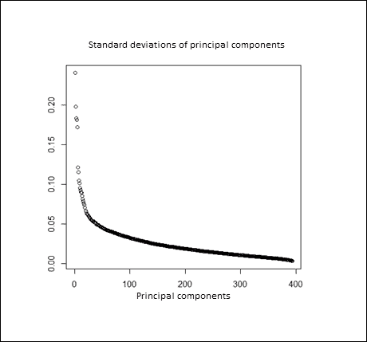

我们可以看到，前五个成分已被分开，因此应选择五个因子，但其他因子的标准差也很显著，所以市场不能仅由少数几个因子来解释。

我们可以通过调用`factanal`函数来确认这一结果，该函数使用五个因子估计因子模型：

```py
factanal(r, 5)

```

我们注意到，进行此计算时需要更多的时间。因子分析与 PCA 有关，但在数学上稍微复杂一些。结果是，我们得到了一个`factanal`类的对象，包含多个属性，但此时我们只对以下部分输出感兴趣：

```py
 Factor1 Factor2 Factor3 Factor4 Factor5
SS loadings     56.474  23.631  15.440  12.092   6.257
Proportion Var   0.144   0.060   0.039   0.031   0.016
Cumulative Var   0.144   0.204   0.243   0.274   0.290
Test of the hypothesis that 5 factors are sufficient.
The chi square statistic is 91756.72 on 75073 degrees of freedom.The p-value is 0

```

该输出显示五因子模型拟合效果较好，但解释方差仅为约 30%，这意味着该模型需要扩展，加入其他因子。

## Fama-French 模型的估计

我们有一个包含 4,015 只股票价格的五年期数据框，以及一个包含 LIBOR 时间序列的 LIBOR 数据框。首先，我们需要计算收益率并将其与 LIBOR 利率合并。

第一步，我们省略那些不用于数学计算的日期，然后计算剩余列的对数收益率：

```py
d2 <- d[, 2:ncol(d)] 
d2 <- log(tail(d1, -1)/head(d1, -1)) 

```

在计算对数收益率后，我们将日期与收益率重新合并，最后一步，我们将两个数据集结合起来：

```py
d <- cbind(d[2:nrow(d), 1], d2) 
d <- merge(LIBOR, d, by = 1) 

```

值得注意的是，`merge`函数操作的数据框等同于 SQL 中的（内连接）语句。

结果如下：

```py
print(d[1:5, 1:5])]
 Date   LIBOR      SP500                AAU             ACU
2010.06.02   0.4        0.025514387    -0.01047130     0.034786116
2010.06.03   0.4        0.004043236     0.02083409      0.013582552
2010.06.04   0.4       -0.035017487    -0.04211149    -0.017865214
2010.06.07   0.4       -0.013624434     0.04211149    -0.017316450
2010.06.08   0.4        0.010916240     0.01025650     -0.008771986

```

我们将 LIBOR 利率调整为日收益率：

```py
d$LIBOR <- d$LIBOR / 36000

```

由于 LIBOR 利率是基于货币市场报价的（实际/360）天数计算法，且时间序列中包含了百分比形式的利率，因此我们将 LIBOR 除以 36,000。现在，我们需要计算法马-法兰奇模型的三个变量。如在*数据选择*部分所述，我们有股票的数据框：

```py
d[1:5, c(1,(ncol(d) - 3):ncol(d))]
 Symbol LastSale  MarketCap BookValuePerShare
1   AA-P    87.30          0              0.03
2   AAMC   985.00 2207480545            -11.41
3    AAU     1.29   83209284              0.68
4    ACU    16.50   53003808             10.95
5    ACY    16.40   25309415             30.13

```

我们必须删除那些没有价格数据的股票：

```py
> stocks = stocks[stocks$Symbol %in% colnames(d),]

```

我们有市场资本作为一个变量；我们仍然需要为每个公司计算账面市值比：

```py
stocks$BookToMarketRatio <-
 stocks$BookValuePerShare / stocks$LastSale
str(stocks)
'data.frame':   3982 obs. of  5 variables:
 $ Symbol           : Factor w/ 6551 levels "A","AA","AA-P",..: 14 72...
 $ LastSale         : num  1.29 16.5 16.4 2.32 4.05 ...
 $ MarketCap        : num  8.32e+07 5.30e+07 2.53e+07 1.16e+08...
 $ BookValuePerShare: num  0.68 10.95 30.13 0.19 0.7 ...
 $ BookToMarketRatio: num  0.5271 0.6636 1.8372 0.0819 0.1728 ...

```

现在，我们需要计算 SMB 和 HML 因子。为了简化，我们将公司定义为`BIG`，如果它们的市值大于平均值。对于账面市值比，也应用相同的原则：

```py
avg_size <- mean(stocks$MarketCap)
BIG   <- as.character(stocks$Symbol[stocks$MarketCap > avg_size])
SMALL <- as.character(stocks[stocks$MarketCap < avg_size,1])

```

这些数组包含了`BIG`和`SMALL`公司的符号。现在，我们可以定义 SMB 因子：

```py
d$SMB <- rowMeans(d[,colnames(d) %in% SMALL]) –
 rowMeans(d[,colnames(d) %in% BIG])

```

我们将 HML 因子定义如下：

```py
avg_btm <- mean(stocks$BookToMarketRatio)
HIGH <- as.character(
 stocks[stocks$BookToMarketRatio > avg_btm, 1])
LOW <- as.character(
 stocks[stocks$BookToMarketRatio < avg_btm, 1])
d$HML <- rowMeans(d[, colnames(d) %in% HIGH]) – 
 rowMeans(d[, colnames(d) %in% LOW])

```

计算第三个因子：

```py
d$Market <- d$SP500 - d$LIBOR

```

在定义了三个因子后，我们在花旗集团（Citi）和 Exelixis 公司（EXEL）的股票上进行了测试：

```py
d$C   <- d$C - d$LIBOR
model <- glm( formula = "C ~ Market + SMB + HML" , data = d)

```

**GLM（广义线性模型）**函数的工作原理如下：它将数据和公式作为参数。公式是一个响应~项的字符串，其中响应是数据框中的变量名称，项指定模型中的预测变量，因此它由数据集中的变量名称组成，并用`+`运算符分隔。该函数也可以用于逻辑回归，但默认是线性回归。

模型的输出如下：

```py
Call:  glm(formula = "C~Market+SMB+HML", data = d)
Coefficients:
(Intercept)       Market          SMB          HML 
 0.001476     1.879100     0.401547    -0.263599 
Degrees of Freedom: 1001 Total (i.e. Null);  998 Residual
Null Deviance:      5.74 
Residual Deviance: 5.364        AIC: -2387

```

模型总结的输出如下：

```py
summary(model)
Call:
glm(formula = "C~Market+SMB+HML", data = d)
Deviance Residuals: 
 Min        1Q    Median        3Q       Max 
-0.09344  -0.01104  -0.00289   0.00604   2.26882 
Coefficients:
 Estimate Std. Error t value Pr(>|t|) 
(Intercept)  0.001476   0.002321   0.636    0.525 
Market       1.879100   0.231595   8.114 1.43e-15 ***
SMB          0.401547   0.670443   0.599    0.549 
HML         -0.263599   0.480205  -0.549    0.583 
---
Signif. codes:  0 '***' 0.001 '**' 0.01 '*' 0.05 '.' 0.1 ' ' 1
(Dispersion parameter for gaussian family taken to be 0.005374535)
 Null deviance: 5.7397  on 1001  degrees of freedom
Residual deviance: 5.3638  on  998  degrees of freedom
AIC: -2387
Number of Fisher Scoring iterations: 2

```

结果显示，唯一显著的因子是市场溢价，这意味着花旗的股票回报似乎与整个市场的表现同步。

要绘制结果，应使用以下命令：

```py
estimation <- model$coefficients[1]+
 model$coefficients[2] * d$Market +
 model$coefficients[3]*d$SMB +
 model$coefficients[4]*d$HML
plot(estimation, d$C, xlab = "estimated risk-premium",
 ylab = "observed riks premium",
 main = "Fama-French model for Citigroup")
lines(c(-1, 1), c(-1, 1), col = "red")

```

以下截图显示了法马-法兰奇模型对花旗的估算风险溢价：

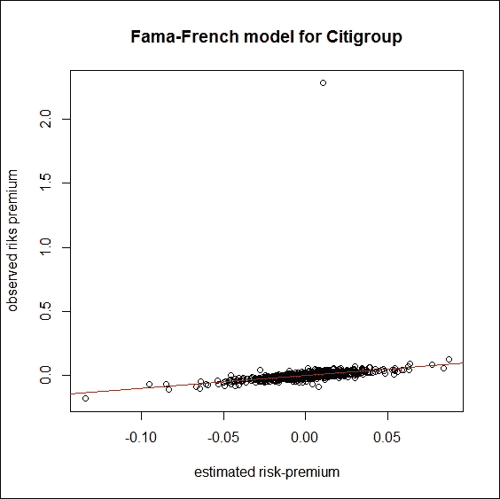

如果我们看一下图表，可以看到回报中存在异常值。让我们看看如果我们将其替换为 0 会发生什么。

```py
outlier <- which.max(d$C)
d$C[outlier] <- 0

```

如果我们再次运行相同的代码来创建模型，并重新计算估算和实际回报，我们将得到以下结果：

```py
model_new <- glm( formula = "C ~ Market + SMB + HML" , data = d)
summary(model_new)
Call:
glm(formula = "C ~ Market + SMB + HML", data = d)
Deviance Residuals: 
 Min         1Q     Median         3Q        Max 
-0.091733  -0.007827  -0.000633   0.007972   0.075853 
Coefficients:
 Estimate Std. Error t value Pr(>|t|) 
(Intercept) -0.0000864  0.0004498  -0.192 0.847703 
Market       2.0726607  0.0526659  39.355  < 2e-16 ***
SMB          0.4275055  0.1252917   3.412 0.000671 ***
HML          1.7601956  0.2031631   8.664  < 2e-16 ***
---
Signif. codes:  0 ‘***’ 0.001 ‘**’ 0.01 ‘*’ 0.05 ‘.’ 0.1 ‘ ’ 1
(Dispersion parameter for gaussian family taken to be 0.0001955113)
 Null deviance: 0.55073  on 1001  degrees of freedom
Residual deviance: 0.19512  on  998  degrees of freedom
AIC: -5707.4
Number of Fisher Scoring iterations: 2

```

根据结果，所有三个因子都是显著的。

GLM 函数不会返回 R²。对于线性回归，可以完全相同地使用 lm 函数，并且可以从模型总结中得到 r.squared = 0.6446。

这个结果表明，这些变量解释了花旗银行风险溢价方差的 64%以上。让我们绘制新的结果：

```py
estimation_new <- model_new$coefficients[1]+
 model_new$coefficients[2] * d$Market +
 model_new$coefficients[3]*d$SMB +
 model_new$coefficients[4]*d$HML
dev.new()
plot(estimation_new, d$C, xlab = "estimated risk-premium",ylab = "observed riks premium",main = "Fama-French model for Citigroup")
lines(c(-1, 1), c(-1, 1), col = "red")

```

在这种情况下的输出如下：

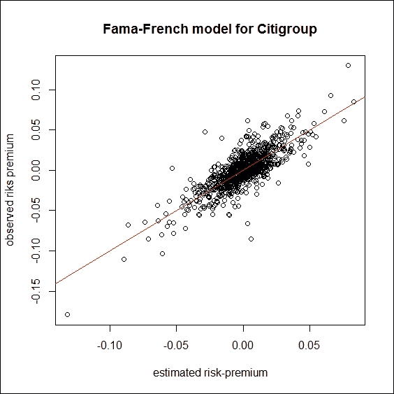

我们还在另一只股票 EXEL 上测试该模型：

```py
d$EXEL <- d$EXEL – d$LIBOR
model2 <- glm( formula = "EXEL~Market+SMB+HML" , data = d)
Call:  glm(formula = "EXEL~Market+SMB+HML", data = d)
Coefficients:
(Intercept)       Market          SMB          HML 
 -0.001048     2.038001     2.807804    -0.354592 
Degrees of Freedom: 1001 Total (i.e. Null);  998 Residual
Null Deviance:      1.868 
Residual Deviance: 1.364        AIC: -3759

```

模型总结的输出如下：

```py
summary(model2)
Call:
glm(formula = "EXEL~Market+SMB+HML", data = d)
Deviance Residuals: 
 Min        1Q    Median        3Q       Max 
-0.47367  -0.01480  -0.00088   0.01500   0.25348 
Coefficients:
 Estimate Std. Error t value Pr(>|t|) 
(Intercept) -0.001773   0.001185  -1.495  0.13515 
Market       1.843306   0.138801  13.280  < 2e-16 ***
SMB          2.939550   0.330207   8.902  < 2e-16 ***
HML         -1.603046   0.535437  -2.994  0.00282 ** 
---
Signif. codes:  0 ‘***’ 0.001 ‘**’ 0.01 ‘*’ 0.05 ‘.’ 0.1 ‘ ’ 1

(Dispersion parameter for gaussian family taken to be 0.001357998)
 Null deviance: 1.8681  on 1001  degrees of freedom
Residual deviance: 1.3553  on  998  degrees of freedom
AIC: -3765.4
Number of Fisher Scoring iterations: 2

```

根据结果，所有三个因子都是显著的。

`GLM` 函数不包含 R²。对于线性回归，可以使用 lm 函数，使用方式完全相同，并且我们从模型摘要中得到 `r.squared = 0.2723`。根据结果，变量解释了 EXEL 风险溢价方差的 27%以上。

为了绘制结果，可以使用以下命令：

```py
estimation2 <- model2$coefficients[1] +
 model2$coefficients[2] * d$Market +
 model2$coefficients[3] * d$SMB + model2$coefficients[4] * d$HML
plot(estimation2, d$EXEL, xlab = "estimated risk-premium",
 ylab = "observed riks premium",
 main = "Fama-French model for EXEL")
lines(c(-1, 1), c(-1, 1), col = "red")

```

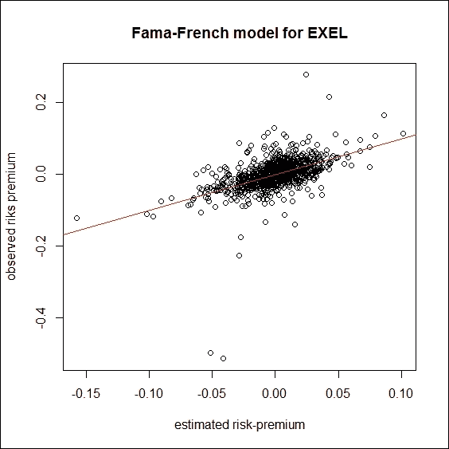

# 总结

在本章中，我们展示了如何构建和实施多因子模型。通过主成分分析，我们识别出了五个独立因子来解释资产回报，但它们似乎不足以全面解释，因为它们仅解释了 30%的方差。为了说明这一点，我们还在真实市场数据上重现了著名的法马-法兰奇模型，其中，除了市场因子外，还使用了两个额外的公司特定因子（SMB 和 HML）。我们使用了内置的主成分分析和因子分析函数，并展示了如何使用一般线性模型进行回归分析。

我们发现这三个因子具有显著性。因此，我们可以得出结论，在更近期的样本中，法马-法兰奇因子具有解释能力。我们鼓励你开发和测试新的多因子定价公式，这些公式可以像经典模型一样有效，甚至更好。

# 参考文献

+   E.F. Fama 和 K.R. French（1996），《资产定价异常的多因子解释》，《金融学杂志》51 期，第 55-84 页

+   Z. Bodie, A. Kane 和 A. Marcus（2008），《投资要素》，第 7 版，麦格劳-希尔国际

+   P. Medvegyev 和 J. Száz（2010），《金融市场中的意外特征》，Bankárképző，布达佩斯

+   P. Wilmott（2007），《Paul Wilmott 介绍量化金融》，第二版，约翰·威利父子公司，西萨塞克斯

+   G. Daróczi, M. Puhle, E. Berlinger, P. Csóka, D. Havran, M. Michaletzky, Zs. Tulassay, K. Váradi 和 A. Vidovics-Dancs（2013），《量化金融中的 R 入门》，Packt 出版，伯明翰-孟买

+   S.A. Ross（1976），《回报、风险与套利：在《金融中的风险与回报》一书中》，剑桥，马萨诸塞州，Ballinger

+   Gy. Walter, E. Berlinger（1999），《证券市场中的因子模型》（Factormodels on securities' markets），《银行评论》43(4)，第 34-43 页。ISSN 0133-0519
