# 第三章：预测交易量

股市上的价格形成已经成为许多研究人员数十年来关注的核心。因此，关于价格的理论、模型和实证证据层出不穷，尽管总有新的方面可以探索，但我们认为在这个主题上，金融知识已经相当全面。我们对价格的动态有着相当清晰的理解，而且大多数人都同意，价格的预测相当困难。

相比之下，交易量，作为股市交易过程中的另一项基本指标，研究较少。最常见的价格均衡模型甚至没有将交易量纳入其解释交易活动的框架中。直到最近，研究人员似乎才开始越来越关注交易量，并且他们已经发现，交易量的样式化事实相比价格能够提供更好的预测。

本章旨在介绍从现有文献中选出的一个日内预测模型，并提供其在 R 语言中的实现。

# 动机

研究交易量背后的动机不仅仅是理论性的，它同样具有重要的实践意义。在订单驱动市场中，如果提交的买入（卖出）市价单相较于市场较大，它可能会扫除多个价格档位；因此，整个交易的平均成交价格会高于（低于）订单提交时的最佳价格档位，提交者将因此亏损。这一现象通常被称为价格冲击，它值得我们努力避免，或者至少最小化。

实现这一目标的一种方式是进行订单拆分，即将市场订单拆分成更小的部分并逐步提交。在众多拆单逻辑中，一种流行的策略是**成交量加权平均价格**（**VWAP**）策略，旨在获取每日加权平均价格，其中的权重由相对于当天总成交量的交易量决定。长期投资者通常会接受一个与每日 VWAP 相等的平均执行价格，因为它被认为是一个中性交易结果。然而，一些投资者发现，全天拆单的方式难以达到 VWAP，因为 VWAP 只有在一天结束时才能计算出来，因此他们将这一问题委托给经纪商。经纪商保证按 VWAP 执行交易，并为此服务收取费用。这个费用也起到了跟踪误差的缓冲作用，这意味着，拥有最精确日成交量预测的经纪商将能够向客户收取最少的费用，因为他们只需要根据预测的比例拆分订单，然后（假设预测是完美的）VWAP 就会在价格演变的过程中达成。因此，对于经纪商来说，准确的成交量预测被视为一种宝贵的商业资产，直接影响他们的利润。

# 交易强度

交易活动的强度可以通过多种方式来衡量。最常用的衡量标准是成交量，它仅仅是指在某一特定时间区间内交易的股票数量。考虑到不同股票的流动性（即交易资产的容易程度），因此每只股票的绝对交易活动也不同，使用百分比形式表示的成交量是建模时更方便的选择。这个衡量标准被称为**换手率**，它是根据成交量计算出来的，计算公式如下：

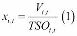

在这里，*x* 代表换手率，*V* 代表成交量，*TSO* 代表流通股本；后者表示公开交易的股票总数。指数 *i* 表示实际的股票，指数 *t* 表示时间区间。

如前所述，成交量中有几个典型的事实。其中一个显而易见的事实是，成交量是非负的，因为它衡量的是成交的股票数量。当没有交易时，这个数字为零，否则为正。另一个重要的典型事实是，在多个不同市场上观察到的日内 U 形曲线（参见*Hmaied, D. M., Sioud, O. B., 和 Grar, A. (2006)*以及*Hussain, S. M. (2011)*的综述）。

这意味着，交易活动通常在市场开盘后和闭盘前更为活跃，而在白天的其他时间则相对较少。有多种可能的解释可以说明这一现象，但其存在性是非常明确的。

### 注意

热心的读者可能对*Kaastra, I. 和 Boyd, M. S. (1995)*及*Lux, T. 和 Kaizoji, T. (2004)*感兴趣，这两者分别提出了使用月度和日度数据的成交量预测模型。*Brownlees, C. T., Cipollini, F., 和 Gallo, G. M. (2011)*则为日内数据建立了成交量预测模型，这与本章直接相关。我们的实证研究发现，以下部分详细介绍的模型（由*Bialkowski, J., Darolles, S., 和 Le Fol, G. (2008)*提出）提供了更为精准的预测，因此由于篇幅限制，本章仅详细阐述后者。

本章讨论的是股票成交量的日内预测。文献中有一些相关的模型，我们发现*Bialkowski, J., Darolles, S., 和 Le Fol, G. (2008)*提出的模型最为准确。以下部分简要总结了该模型，并提供了足够的细节以便后续理解其实现。

# 成交量预测模型

本节解释了*Bialkowski, J., Darolles, S., 和 Le Fol, G. (2008)*提出的日内成交量预测模型。

他们使用 CAC40 数据来测试其模型，包括截至 2004 年 9 月的指数中每只股票的成交量。交易被汇总成 20 分钟的时间段，每天得到 25 个观测值。

成交量被分解为两个加性组件。第一个是季节性组件（U 形），表示每只股票在平均日的预期成交量水平。由于每天与平均值略有不同，存在第二个动态组件，它显示特定日与平均值的预期偏差。

分解是使用*Bai, J. (2003)*的因子模型进行的。初始问题如下：

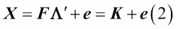

在这里，***X** (TxN)*大小的矩阵包含了初始数据，***F** (Txr)*是因子矩阵，***Λ'** (Nxr)*是因子负载矩阵，***e** (TxN)*是误差项。***K***表示公共项，*T*表示观测值的数量，*N*表示股票的数量，*r*表示因子的数量。

***XX'***矩阵的维度是*(TxT)*。在确定其特征值和特征向量后，***Eig***包含与*r*个最大特征值相关的特征向量。然后，估计的因子矩阵确定为：

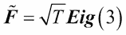

估计的负载矩阵的转置计算为：

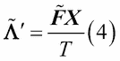

最终，估计的公共组件为：

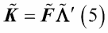

由于该模型是加性模型，估计的动态组件简单地变为：

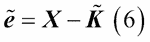

现在，估计的公共组件和动态组件都已获得，下一步是生成它们的预测。作者假设季节性（U 形）组件在 20 天的估计期内是恒定的（但在不同的股票之间有所不同），因此他们根据以下公式进行预测：

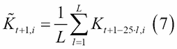

已知 25 是每天的时间段数（数据点），这意味着对于股票*i*，明天第一个时间段的预测值将是过去*L*天第一个时间段的平均值。

动态组件的预测有两种不同的方法。一种方法是拟合一个 AR(1)模型，模型指定如下：

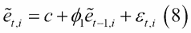

另一种方法是拟合一个 SETAR 模型，模型指定如下：

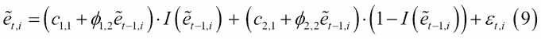

这里，指示函数如下所示：

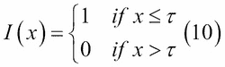

这意味着，如果前一个观测值没有超过模型中指定的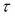阈值，那么将使用一个 AR(1)模型进行预测；如果超过，则使用另一个 AR(1)模型。

在预测了季节性和动态组件之后，预测的成交量将是两者的总和：

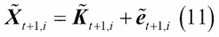

请注意，我们以两种不同的方式预测动态组件；因此，依据添加到季节性组件预测中的方法不同，我们将得到两种不同的预测结果。

# 在 R 中的实现

在本节中，我们展示了如何在 R 中实现*Bialkowski, J., Darolles, S., 和 Le Fol, G. (2008)*的模型。我们涵盖了每个细节，从加载数据到估计模型参数并生成实际的预测。

## 数据

我们使用的数据包含了来自道琼斯工业平均指数的 10 只不同股票（下表提供了概述）。我们使用了 2011 年 06 月 01 日至 2011 年 06 月 29 日之间的 21 个交易日数据。纽约证券交易所和纳斯达克的交易时间为 09:30 至 16:00，交易是连续的。将数据聚合到 15 分钟的时间段后，我们每天获得 26 个观测值，总共获得*26 * 21 = 546*个观测值。

### 提示

我们将交易日分为 26 个时间段，而原文中定义为 25 个。这是因为不同市场的开盘时间存在差异，而我们使用的数据来自不同的市场。这个变化只会影响模型中的一个参数，但需要注意这个细节。

所有使用的股票在观察期间的每个时间段都有足够的流动性，能够保持正向的成交量。然而，需要注意的是，由于模型具有加性结构，某些时间段的零成交量不会造成任何困难。

以下表格来自来源[`kibot.com/`](http://kibot.com/)：

|   | 股票代码 | 公司 | 行业 | 部门 | 交易所 |
| --- | --- | --- | --- | --- | --- |
| 1 | AA | Alcoa 公司 | 铝业 | 基础材料 | 纽约证券交易所 |
| 2 | AIG | 美国国际集团公司 | 财产与意外保险 | 金融 | 纽约证券交易所 |
| 3 | AXP | 美国运通公司 | 信用服务 | 金融 | 纽约证券交易所 |
| 4 | BA | 波音公司 | 航空航天/国防产品与服务 | 工业品 | 纽约证券交易所 |
| 5 | BAC | 美国银行 | 区域 - 中大西洋地区银行 | 金融 | 纽约证券交易所 |
| 6 | C | 花旗集团 | 资金中心银行 | 金融 | 纽约证券交易所 |
| 7 | CAT | 卡特彼勒公司 | 农业和建筑机械 | 工业品 | 纽约证券交易所 |
| 8 | CSCO | 思科系统公司 | 网络与通信设备 | 技术 | 纳斯达克 |
| 9 | CVX | 雪佛龙公司 | 主要综合油气公司 | 基础材料 | 纽约证券交易所 |
| 10 | DD | 杜邦公司 | 化学品 - 主要多元化 | 基础材料 | 纽约证券交易所 |

数据集中的股票

在 546 次观测中，我们将使用前 520 次（20 天）作为估计期，最后 26 次（1 天）作为预测期。保持预测期的实际数据非常重要，这样我们可以评估预测的精度，并将其与实际结果进行比较。

作为数据的示例，请参见*图 3.1*，该图展示了 Alcoa 的前五天（130 次观测数据）。

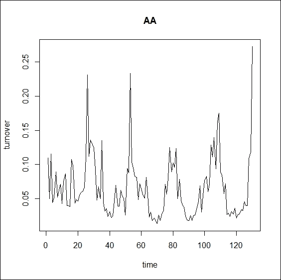

图 3.1：Alcoa 营业额的前五天

尽管每天都有些许不同，但我们可以清楚地看到营业额图表中由五个 U 形曲线表示的五个不同的日子。

## 加载数据

我们将数据整理成了一个`.csv`文件，文件头包含股票代码。数据矩阵的维度为 546 x 10。以下代码加载数据并打印前五行和六列：

```py
turnover_data <- read.table("turnover_data.csv", header = T, sep = ";") 
format(turnover_data[1:5, 1:6],digits = 3)

```

数据矩阵的左上角部分的输出如下所示。由于我们的数据展示的是营业额值（以百分比形式），而不是交易量，因此每个值都低于 1。举例来说，在样本的前 15 分钟内，Alcoa 公司总流通股的 0.11%被交易（见方程式（1））。

```py
 AA    AIG    AXP     BA    BAC      C
1 0.1101 0.0328 0.0340 0.0310 0.0984 0.0826
2 0.0502 0.0289 0.0205 0.0157 0.0635 0.0493
3 0.1157 0.0715 0.0461 0.0344 0.1027 0.1095
4 0.0440 0.1116 0.0229 0.0228 0.0613 0.0530
5 0.0514 0.0511 0.0202 0.0263 0.0720 0.0836

```

以下代码绘制了 Alcoa 营业额的第一天数据。图表显示在*图 3.2*中。

```py
plot(turnover_data$AA[1:26], type = "l", main = "AA", xlab = "time", ylab="turnover")

```

我们可以识别出第一天的 U 形曲线，但此时我们需要稍微依靠我们的想象力。这是因为 U 形曲线是一种风格化的事实，仅在统计上被观察到。

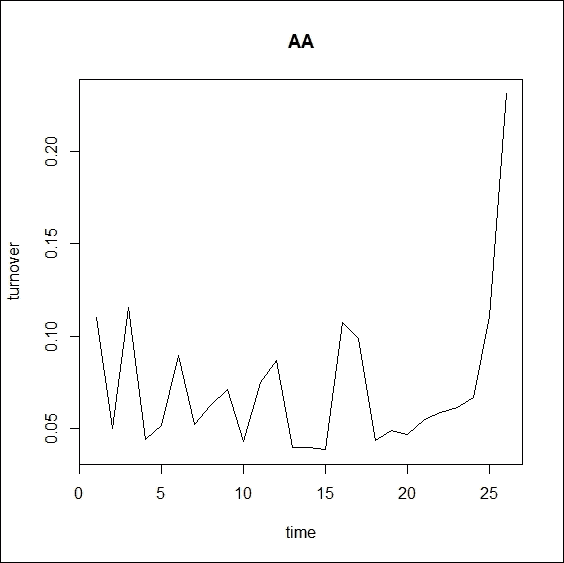

图 3.2：Alcoa 营业额的第一天

因此，我们预计 U 形曲线在平均值上会更加明确。以下代码绘制了样本中 21 天的 Alcoa 营业额的平均值。为此，我们将数据矩阵的第一列转换为一个 26*21 的矩阵，并绘制行平均值。

```py
AA_average <- matrix(turnover_data$AA, 26, 546/26)

plot(rowMeans(AA_average), type = "l", main = "AA" , xlab = "time", ylab = "turnover")

```

结果如*图 3.3*所示，U 形曲线非常清晰地绘制出来。

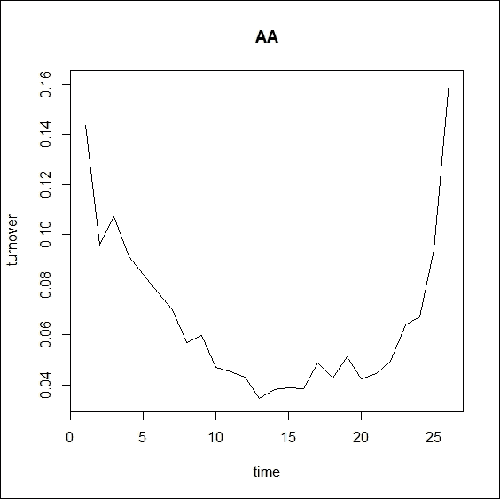

图 3.3：Alcoa 营业额的 21 天平均值

数据加载完毕后，我们可以开始实现模型。

## 季节性成分

第一步是确定季节性成分。如前所述，我们将使用前 520 个观测值进行估计。以下代码从数据框创建适当的样本矩阵：

```py
n <- 520
m <- ncol(turnover_data)
sample <- as.matrix(turnover_data[1:n, ])

```

现在，我们可以开始*Bai, J. (2003)*的因子分解（见公式（2）到（6））。在创建了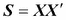矩阵（维度为 520 x 520）之后，我们找到了它的特征值和特征向量。

```py
S <- sample %*% t(sample)
D <- eigen(S)$values
V <- eigen(S)$vectors

```

接下来，我们需要确定使用的因子数量（*r*）。以下代码按降序绘制特征值图：

```py
plot(D, main = "Eigenvalues", xlab = "", ylab = "")

```

结果如*图 3.4*所示，其中第一个特征值明显主导了所有其他特征值。这意味着第一个特征向量解释的方差占据了大部分方差，因此我们选择在模型中使用单一因子 (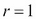)。作为经验法则，我们可以使用比 1 大的特征值个数作为因子的数量，但这始终是一个主观的决定。

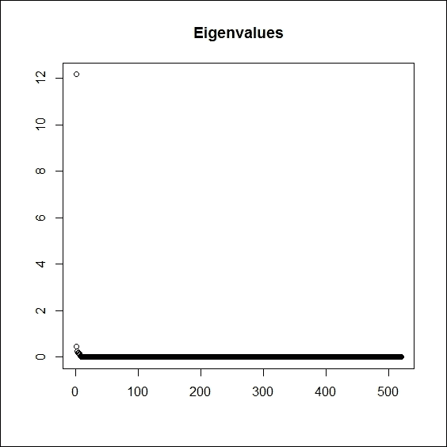

图 3.4: **XX**' 的特征值

使用与此最大特征值对应的特征向量，我们现在可以计算估计的因子矩阵（见公式（3））。

```py
Eig <- V[, 1]
F <- sqrt(n) * Eig

```

然后，我们根据公式（4）计算估计的加载矩阵的转置，并根据公式（5）计算估计的共同（季节性）成分。最后，还计算了动态（特有）成分（见公式（6））。

```py
Lambda <- F %*% sample / n
K <- F %*% Lambda
IC <- sample - K

```

动态成分将在接下来的两个小节中进行预测，但我们仍然需要在这里预测季节性成分。这将根据公式（7）完成。

```py
K26 <- matrix(0, 26, m)

for (i in 1:m) {
 tmp <- matrix(K[,i], 26, n/26)
 K26[,i] <- rowMeans(tmp)
}

```

之前的代码计算了所有 26 个位置的 20 天平均值，每次处理一个股票，结果是一个 26 x 10 的矩阵，包含所有 10 只股票的单日季节性成分预测。

现在，我们剩下的是动态成分的预测，这将通过两种不同的方式完成：通过拟合 AR(1)模型和 SETAR 模型。

## AR(1)估计和预测

在本小节中，我们将 AR(1)模型拟合到动态成分。我们需要为每只股票指定 10 个模型。以下代码执行参数估计：

```py
library(forecast)

models <- lapply(1:m, function(i)
 Arima(IC[, i], order = c(1, 0, 0), method = "CSS"))
coefs <- sapply(models, function(x) x$coef)
round(coefs, 4)

```

系数被收集在`coefs`变量中，并以四位小数的形式打印在以下输出中。系数不一定需要保存（保存模型即可），因为`forecast`包内置了`forecast`函数，我们将在以下示例中使用它：

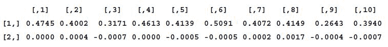

每个股票的 AR 系数

### 提示

在 R 中估计 AR(1)模型有多种方法。除了之前提到的方法，适用于任何 ARIMA 模型外，下面的代码（仅使用 Alcoa 示例）通过使用不同的包来重现相同的结果，但该包只能处理 ARMA（而不是 ARIMA）模型。

```py
library("tseries")arma_mod <- arma(IC[, 1], order = c(1, 0))

```

所以，下一步是使用之前估计的 AR(1)模型为第二天的 26 个时间段进行预测。以下代码将为我们执行此操作：

```py
ARf <- sapply(1:m, function(i) forecast(models[[i]], h = 26)$mean)

```

为了获得完整的预测（包括季节性和动态成分），我们只需参考公式（11）。

```py
AR_result <- K26+ARf

```

完整的预测结果现在存储在`AR_result`变量中。

## SETAR 估计和预测

获得动态成分预测的第二种方法是通过 SETAR 模型。同样，我们需要为每只股票建立 10 个不同的模型。在 R 中也有一个 SETAR 估计的包，因此代码变得非常简单：

```py
library(tsDyn)
setar_mod <- apply(IC,2,setar, 1);
setar_coefs <-  sapply(setar_mod, FUN = coefficients)
round(setar_coefs, 4)

```

与 AR 模型不同，我们确实需要显式地保存系数用于预测，这一点也在之前的代码中完成。四位数字的四舍五入值将在以下输出中打印：

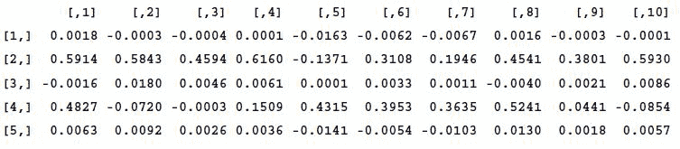

每只股票的 SETAR 系数

从上到下的五个参数如下（详见公式（9））：

1.  截距（下行区间）。

1.  AR 系数（下行区间）。

1.  截距（上行区间）。

1.  AR 系数（上行区间）。

1.  阈值。

现在，我们需要做的就是使用我们刚刚描述的 SETAR 模型，预测接下来的 26 个时间段的动态成分。这可以通过以下代码实现：

```py
SETARf <- matrix(0, 27, m)
SETARf[1,] <- sample[520,]

for (i in 2:27){
SETARf[i,] <- 
(setar_coefs[1,]+SETARf[i-1,]*setar_coefs[2,])*
(SETARf[i-1,] <= setar_coefs[5,]) + 
(setar_coefs[3,]+SETARf[i-1,]*setar_coefs[4,])*
(SETARf[i-1,] >  setar_coefs[5,])
}

```

虽然我们希望为每只股票的 26 个时间段（即一天内的所有时间段）进行预测，但`SETARf`变量有 27 行，因为我们必须将最后已知的观察值存储在第一行，以便能够进行递归计算。此外，注意这里是逐行计算的，即我们同时为每只股票计算下一个预测值，只有在计算完后，我们才会进入下一个时间段。

最后，再次参考公式（11），完整的换手率预测如下：

```py
SETAR_result = K26 + SETARf[2:27,]

```

完整的预测结果现在存储在`SETAR_result`变量中。

## 结果解释

我们已经根据过去 20 天的数据，得到了所有 10 只股票的第二天换手率预测。根据我们如何预测动态成分，每只股票会有两个不同的结果。

我们排除了数据集中的最后一天，以便能够将实际值与预测值进行比较。以下代码通过生成 10 个不同的图表来帮助我们完成此任务，每只股票一个，使用 AR(1)模型进行动态成分预测。输出显示在*图 3.5*中。

```py
par(mfrow = c(2, 5))
for (i in 1:10) {matplot(cbind(AR_result[, i], turnover_data[521:546, i]), type = "l", main = colnames(turnover_data)[i], xlab = "", ylab = "", col = c("red", "black"))}

```

在每个图中，黑色虚线表示该特定股票的实际换手率，而红色实线表示预测的换手率。如前所述，实际的换手率可能会显著偏离 U 形的典型事实。

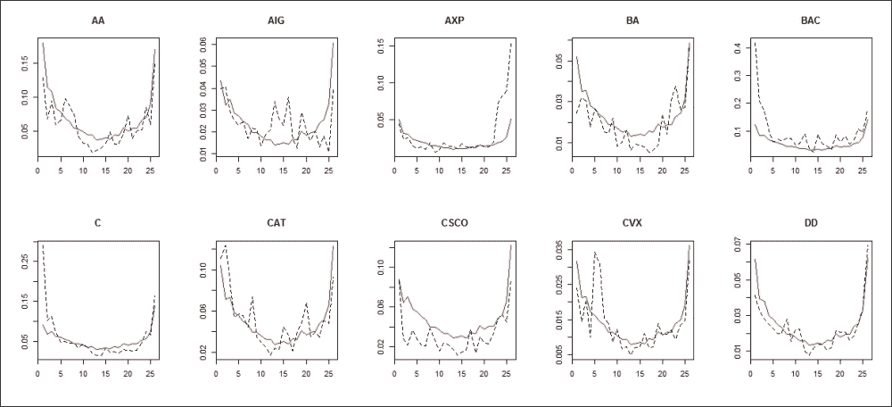

图 3.5：第二天的换手率预测与实际值，动态成分使用 AR(1)模型进行预测

我们可以得出结论，从视觉上看，预测结果相当精确。当实际结果呈现出更规则的 U 形时，预测结果能够更好地拟合（如 Alcoa、Caterpillar、Chevron 和 Du Pont De Nemours），但单次的大幅波动总是难以预测（例如 Chevron 的第五个观测值）。当实际结果变得异常不对称时，预测表现较差；也就是说，前几笔或最后几笔交易远大于其余部分（如 American Express、Bank of America 和 Citigroup），但即便如此，全天的其余部分仍能得到合理的拟合。

### 提示

这次，我们不对估计误差进行数值评估，因为我们首先需要一个基准来进行评估，更重要的是，因为我们只预测了单一天的数据；因此，结果无论如何都不会具有很强的稳健性。

我们可以使用与之前类似的代码来绘制基于 SETAR 的估计结果。输出如*图 3.6*所示。

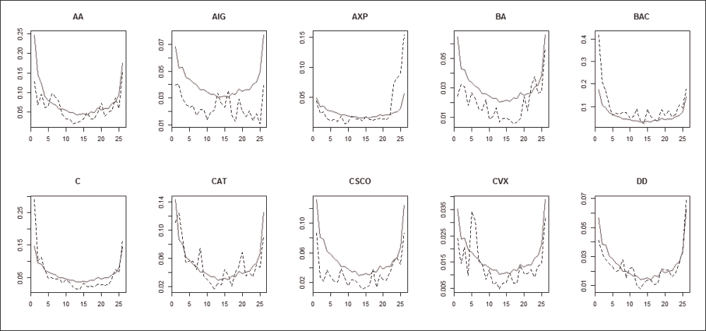

图 3.6：下一天的交易量预测与实际结果，SETAR 用于动态组件

乍一看，结果与前一个案例非常相似，这是可以理解的，因为两者的季节性组件预测相同，显然季节性组件主导了预测，其余部分仅仅是个别偏差所致。基于 AR 和基于 SETAR 的预测差异在一天的开始时更为明显。

如果我们观察*图 3.5*和*图 3.6*中的一天的第一和最后一个数据点，我们可以发现一些股票（如 Alcoa、Bank of America、Citigroup、Caterpillar、Cisco 和 Du Pont De Nemours），在 SETAR 模型下，最后一个数据点（以及全天的大部分时间）预测结果相似，而第一点的预测值则明显更大。两种预测方法之间最显著的差异出现在 American International 和 Boeing 的股票上，SETAR 模型在全天的预测值普遍较高。

# 总结

在本章中，我们展示了一种基于 DJIA 指数数据的日内交易量预测模型及其在 R 中的实现。由于篇幅限制，我们从文献中选择了我们认为最准确的一个模型，用于预测股票交易量。该模型为了方便，使用了成交额而非交易量，并将季节性分量（U 形）和动态分量分开，分别进行预测。动态分量使用两种不同方式进行预测，分别拟合 AR(1)模型和 SETAR 模型。与原文相似，我们并未断言哪种模型更好，而是直观地展示结果并认为其准确度是可以接受的。原文通过有力的证据证明该模型优于精心选择的基准，但我们将此留给读者去检验，因为我们仅使用了一个短期数据集进行说明，无法获得稳健的结果。

# 参考文献

+   **Bai, J. (2003)**：大维度因子模型的推断理论。《计量经济学》，71:135-171。

+   **Bialkowski, J., Darolles, S., 和 Le Fol, G. (2008)**：改进 VWAP 策略：一种动态交易量方法。《银行与金融学报》，32:1709-1722。

+   **Brownlees, C. T., Cipollini, F., 和 Gallo, G. M. (2011)**：日内交易量建模与预测，用于算法交易。《金融计量经济学杂志》，9:489-518。

+   **Hmaied, D. M., Sioud, O. B., 和 Grar, A. (2006)**：突尼斯证券交易所买卖价差、交易量和波动性的日内与周内模式。《银行与市场》，84:35-44。

+   **Hussain, S. M. (2011)**：买卖价差、交易量和收益波动的日内行为：来自 DAX30 的证据。《国际经济与金融杂志》，3:23-34。

+   **Kaastra, I. 和 Boyd, M. S. (1995)**：利用神经网络预测期货交易量。《期货市场杂志》，第 15 卷，第 8 期：953-970。

+   **Lux, T. 和 Kaizoji, T. (2004)**：预测东京股市的波动性和交易量：长期记忆模型的优势。经济学工作论文，基尔大学经济学系。
