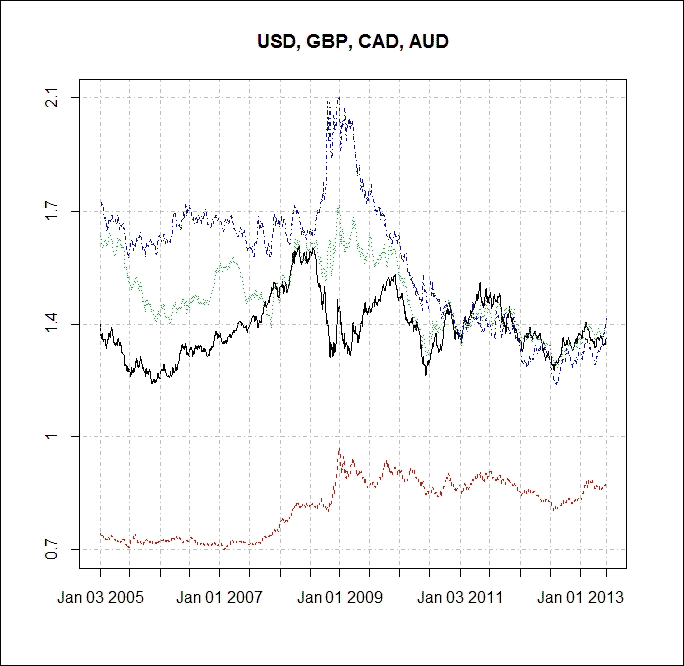
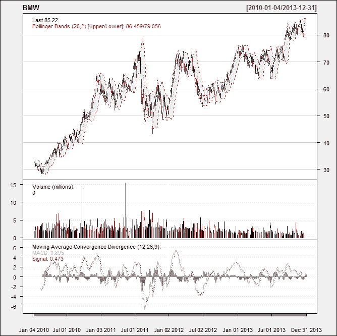
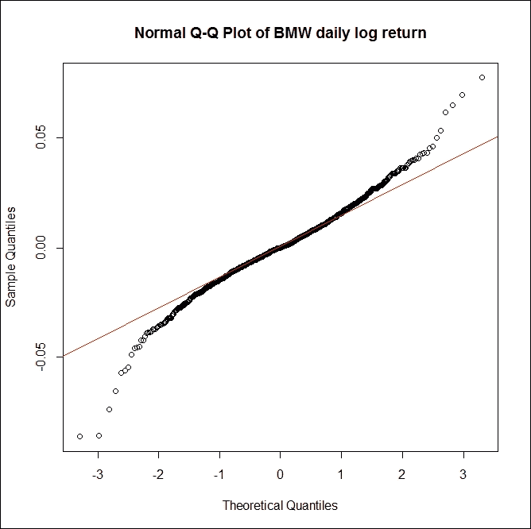
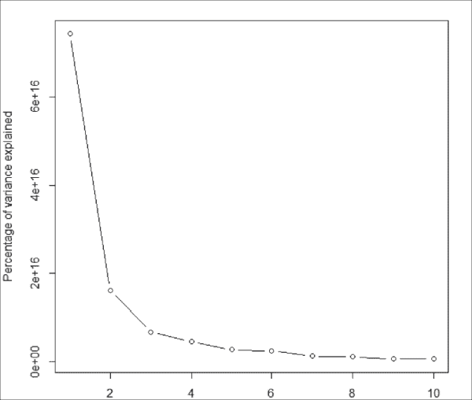
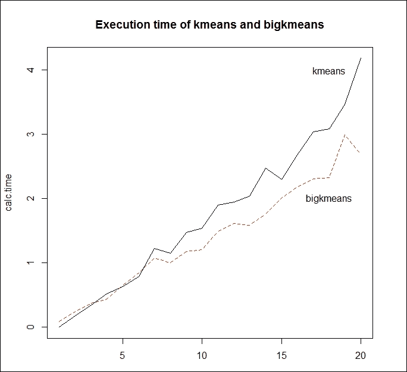

# 第四章 大数据——高级分析

在本章中，我们将处理高性能金融分析和数据管理的最大挑战之一；即如何在 R 中高效且无误地处理大数据集。

我们的主要目标是提供一个关于如何在 R 中访问和管理大数据集的实际介绍。本章并不专注于任何特定的金融理论，而是旨在为研究人员和专业人士提供实际的操作示例，教他们如何在 R 环境中实现计算密集型的分析和模型，利用大数据集。

在本章的第一部分，我们解释了如何直接访问多个开放源的数据。R 提供了各种工具和选项，可以将数据加载到 R 环境中，而无需任何事先的数据管理要求。本章的这一部分将通过实际示例指导你如何使用 `Quandl` 和 `qualtmod` 包来访问数据。这里展示的示例将为本书的其他章节提供有用的参考。在本章的第二部分，我们将强调 R 在处理大数据时的局限性，并展示如何在大内存和 `ff` 包的帮助下将大量数据加载到 R 中的实际示例。我们还将展示如何使用大数据集执行基本的统计分析，如 K-means 聚类和线性回归。

# 从开放源获取数据

从开放源提取金融时间序列或横截面数据是任何学术分析中的挑战之一。虽然几年前，公开数据对金融分析的可访问性非常有限，但近年来，越来越多的开放获取数据库已可用，为各个领域的定量分析师提供了巨大的机会。

在本节中，我们将介绍 `Quandl` 和 `quantmod` 包，这两个特定工具可以无缝地访问和加载 R 环境中的金融数据。我们将通过两个示例，展示这些工具如何帮助金融分析师直接从数据源整合数据，无需事先进行数据管理。

Quandl 是一个开源网站，提供金融时间序列数据，索引来自 500 个来源的数百万个金融、经济和社会数据集。`Quandl` 包与 `Quandl` API 直接交互，提供多种格式的数据，可供 R 使用。除了下载数据，用户还可以上传和编辑自己的数据，并且可以直接从 R 中在任何数据源中进行搜索。

在第一个简单的示例中，我们将展示如何使用 Quandl 轻松地获取并绘制汇率时间序列。在访问 Quandl 上的任何数据之前，我们需要使用以下命令安装并加载 `Quandl` 包：

```py
install.packages("Quandl")
library(Quandl)
library(xts)

```

我们将下载 2005 年 1 月 1 日至 2014 年 5 月 30 日之间 EUR 汇率下的美元、瑞士法郎、英镑、日元、俄罗斯卢布、加元和澳元的汇率。以下命令指定了如何选择特定的时间序列和分析周期：

```py
currencies <- c( "USD", "CHF", "GBP", "JPY", "RUB", "CAD", "AUD")
currencies <- paste("CURRFX/EUR", currencies, sep = "")
currency_ts <- lapply(as.list(currencies), Quandl, start_date="2005-01-01",end_date="2013-06-07", type="xts")

```

下一步，我们将使用`matplot()`函数可视化四个选定汇率（美元、英镑、加元和澳元）的汇率变化：

```py
Q <- cbind(
currency_ts[[1]]$Rate,currency_ts[[3]]$Rate,currency_ts[[6]]$Rate,currency_ts[[7]]$Rate)
matplot(Q, type = "l", xlab = "", ylab = "", main = "USD, GBP, CAD, AUD", xaxt = 'n', yaxt = 'n')
ticks = axTicksByTime(currency_ts[[1]])
abline(v = ticks,h = seq(min(Q), max(Q), length = 5), col = "grey", lty = 4)
axis(1, at = ticks, labels = names(ticks))
axis(2, at = seq(min(Q), max(Q), length = 5), labels = round(seq(min(Q), max(Q), length = 5), 1))
legend("topright", legend = c("USD/EUR", "GBP/EUR", "CAD/EUR", "AUD/EUR"), col = 1:4, pch = 19)

```

以下截图显示了前述代码的输出：



图 4.1：美元、英镑、加元和澳元的汇率图

在第二个示例中，我们将演示如何使用`quantmod`包来访问、加载并调查开放来源的数据。`quantmod`包的一个巨大优势是它可以与多种数据源兼容，并直接从 Yahoo! Finance、Google Finance、**联邦储备经济数据**（**FRED**）或 Oanda 网站获取数据。

在本示例中，我们将访问宝马股票价格信息，并分析这家汽车制造公司自 2010 年以来的表现：

```py
library(quantmod)

```

我们将从网络上获取宝马股票的价格数据，数据来源于 Yahoo! Finance，涵盖给定的时间段。`quantmod`包提供了一个易于使用的函数`getSymbols()`，用于从本地或远程来源下载数据。作为该函数的第一个参数，我们需要通过指定符号的名称来定义字符向量。第二个参数指定对象创建的环境：

```py
bmw_stock<- new.env()
getSymbols("BMW.DE", env = bmw_stock, src = "yahoo", from = as.Date("2010-01-01"), to = as.Date("2013-12-31"))

```

下一步，我们需要将`bmw_stock`环境中的`BMW.DE`变量加载到一个向量中。借助`head()`函数，我们还可以显示数据的前六行：

```py
BMW<-bmw_stock$BMW.DE
head(BMW)
 BMW.DE.Open BMW.DE.High BMW.DE.Low BMW.DE.Close BMW.DE.Volume
2010-01-04       31.82       32.46      31.82        32.05       1808100
2010-01-05       31.96       32.41      31.78        32.31       1564100
2010-01-06       32.45       33.04      32.36        32.81       2218600
2010-01-07       32.65       33.20      32.38        33.10       2026100
2010-01-08       33.33       33.43      32.51        32.65       1925800
2010-01-11       32.99       33.05      32.11        32.17       2157800
 BMW.DE.Adjusted
2010-01-04           29.91
2010-01-05           30.16
2010-01-06           30.62
2010-01-07           30.89
2010-01-08           30.48
2010-01-11           30.02

```

`quantmod`包还具备财务图表功能。`chartSeries()`函数不仅允许我们可视化图表，还能与图表进行交互。借助其扩展功能，我们还可以将多种技术和交易指标添加到基本图表中；这对于技术分析来说是非常有用的功能。

在我们的示例中，我们将使用`addBBands()`命令添加布林带，并使用`addMACD()`命令添加 MACD 趋势跟踪动量指标，以获得有关股票价格变化的更多见解：

```py
chartSeries(BMW,multi.col=TRUE,theme="white")
addMACD()
addBBands()

```

以下截图显示了前述代码的输出：



图 4.2：宝马股票价格变化与技术指标

最后，我们将计算宝马股票在给定期间的日常对数收益。同时，我们还希望调查这些收益是否符合正态分布。下图展示了宝马股票的日常对数收益，并以正常 Q-Q 图的形式呈现：

```py
BMW_return <- 
log(BMW$BMW.DE.Close/BMW$BMW.DE.Open)
qqnorm(BMW_return, main = "Normal Q-Q Plot of BMW daily log return",
 xlab = "Theoretical Quantiles",
 ylab = "Sample Quantiles", plot.it = TRUE, datax = FALSE
 )
qqline(BMW_return, col="red")

```

以下截图显示了前述代码的输出。它以正常 Q-Q 图的形式展示了宝马股票的日常对数收益：



图 4.3：宝马股票日常收益的 Q-Q 图

# R 中的大数据分析简介

大数据指的是当数据的体积、速度或种类超过我们的计算能力以处理、存储和分析它们时的情况。大数据分析不仅需要处理庞大的数据集，还需要应对计算密集型分析、模拟和具有大量参数的模型。

利用大数据样本可以在量化金融领域提供显著优势；我们可以放宽线性和正态性假设，生成更好的预测模型，或者识别低频事件。

然而，大数据集的分析提出了两个挑战。首先，大多数定量分析工具处理庞大数据的能力有限，即使是简单的计算和数据管理任务也可能变得难以执行。其次，即使没有容量限制，对大数据集的计算也可能极其耗时。

尽管 R 是一个功能强大且稳定的程序，拥有丰富的统计算法和能力，但它的一个最大缺点是其在处理大数据集时的扩展能力有限。其原因在于 R 要求其操作的数据首先被加载到内存中。然而，操作系统和系统架构只能访问大约 4 GB 的内存。如果数据集超过计算机的 RAM 阈值，它就几乎不可能在标准计算机和标准算法上进行处理。有时，即使是较小的数据集也可能在 R 中引发严重的计算问题，因为 R 必须存储分析过程中创建的最大对象。

然而，R 有一些包可以弥补这一差距，为大数据分析提供高效支持。在本节中，我们将介绍两个特别的包，它们是创建、存储、访问和操作海量数据的有用工具。

首先，我们将介绍`bigmemory`包，这是一个广泛用于大规模统计计算的选项。该包及其姐妹包（`biganalytics`、`bigtabulate`和`bigalgebra`）解决了处理和分析海量数据集时的两个挑战：数据管理和统计分析。这些工具能够实现超出 R 运行环境的巨大矩阵，并支持它们的操作和探索。

`bigmemory`包的替代方案是`ff`包。这个包允许 R 用户处理大向量和矩阵，并同时处理多个大型数据文件。`ff`对象的一个巨大优势是，它们表现得像普通的 R 向量。然而，数据并不存储在内存中；它驻留在磁盘上。

在本节中，我们将展示这些包如何帮助 R 用户克服 R 的局限性，处理非常大的数据集。尽管我们在这里使用的数据集在规模上相对简单，但它们有效地展示了大数据包的强大功能。

# 在大数据上的 K-means 聚类

数据框和矩阵是 R 中易于使用的对象，对于大小适中的数据集，常见的操作可以迅速执行。然而，当用户需要处理更大的数据集时，可能会出现问题。在本节中，我们将说明如何使用 `bigmemory` 和 `biganalytics` 包来解决数据框或数据表无法处理的超大数据集问题。

### 注意

截至本章撰写时，`bigmemory`、`biganalytics` 和 `biglm` 包的最新更新在 Windows 上不可用。这里展示的示例假设 R 版本 2.15.3 是 Windows 上当前的先进版本。

在以下示例中，我们将对大数据集执行 K-means 聚类分析。为了便于说明，我们将使用美国交通统计局的航空公司出发地和目的地调查数据集。该数据集包含超过 300 万个国内航班的汇总特征，包括行程票价、乘客人数、起始机场、往返指示符和飞行里程，数据以`csv`格式呈现。

## 加载大矩阵

从 `csv` 文件中读取数据集可以通过 `read.csv()` 函数轻松实现。然而，当我们需要处理更大的数据集时，任何文件的读取时间都可能变得相当长。然而，通过一些细致的选项，R 的数据加载功能可以得到显著提升。

一个选项是在加载数据到 R 时，通过 `colClasses = argument` 指定正确的数据类型；这将导致外部数据的转换速度更快。此外，指定不需要进行分析的列为 `NULL` 可以显著减少加载数据时所消耗的时间和内存。

然而，如果数据集达到了计算机的 RAM 阈值，我们需要采用更节省内存的数据加载选项。在以下示例中，我们将展示如何使用 `bigmemory` 包来处理此任务。

首先，我们将安装并加载所需的 `bigmemory` 和 `biganalytics` 包，以执行大数据的 K-means 聚类分析：

```py
install.packages("bigmemory")
install.packages("biganalytics")
library(bigmemory)
library(biganalytics)

```

我们使用了`read.big.matrix`函数将从本地系统下载的数据集导入到 R 中。该函数将数据处理为类似矩阵的对象，而不是数据框，我们需要通过 `as.matrix` 函数将其转换为矩阵：

```py
x<-read.big.matrix( "FlightTicketData.csv", type='integer', header=TRUE, backingfile="data.bin",descriptorfile="data.desc")
xm<-as.matrix(x)
nrow(x)
[1] 3156925

```

## 大数据 K-means 聚类分析

在 R 中，处理大数据 K-means 聚类的函数格式是`bigkmeans` (*x*, *centers*)，其中 *x* 是一个数值数据集（大数据矩阵对象），centers 是提取的聚类数。该函数返回聚类成员、中心点、**聚类内平方和**（**WCSS**）和聚类大小。`bigkmeans()`函数可以处理常规 R 矩阵对象或 `big.matrix` 对象。

我们将根据每个聚类所解释的方差百分比来确定聚类数量；因此，我们将绘制聚类所解释的方差百分比与聚类数量之间的关系：

```py
res_bigkmeans <- lapply(1:10, function(i) {
 bigkmeans(x, centers=i,iter.max=50,nstart=1)
 })
lapply(res_bigkmeans, function(x) x$withinss)
var <- sapply(res_bigkmeans, function(x) sum(x$withinss))
plot(1:10, var, type = "b", xlab = "Number of clusters", ylab = "Percentage of variance explained")

```

以下截图显示了前述代码的输出：



图 4.4：绘制聚类内平方和与提取的聚类数量的关系

从 1 到 3 个聚类的急剧下降（之后几乎没有下降）表明了三聚类解决方案。因此，我们将执行具有三个聚类的大数据 K-means 聚类分析：

```py
res_big<-bigkmeans(x, centers=3,iter.max=50,nstart=1)
res_big
K-means clustering with 3 clusters of sizes 919959, 1116275, 1120691

Cluster means:
 [,1]     [,2]    [,3]     [,4]      [,5]       [,6]     [,7]     [,8]
[1,] 2.663235 12850.78 1285081 32097.61 0.6323662 0.03459393 2.084982 2305.836
[2,] 2.744241 14513.19 1451322 32768.11 0.6545699 0.02660276 1.974971 2390.292
[3,] 2.757645 11040.08 1104010 30910.66 0.6813850 0.03740460 1.989817 2211.801
 [,9]
[1,] 1.929160
[2,] 1.930394
[3,] 1.949151

Clustering vector:
[1] 3 3 3 3 3 3 1 1 1 1 1 1 1 1 1 1 1 1 1 2 2 2 2 2 2 2 2 3 3 3 3 3 3 3 3 3
[37] 3 3 3 3 3 3 3 3 3 3 1 1 1 1 1 1 2 2 2 2 3 3 3 3 3 1 1 1 1 1 1 1 1 1 1 1
[73] 1 2 2 2 2 2 2 3 3 3 1 2 2 3 3 3 1 1 1 1 1 1 2 2
Within cluster sum of squares by cluster:
[1] 2.010160e+15 2.466224e+15 2.183142e+15

Available components:

[1] "cluster"  "centers"  "withinss" "size" 

```

`bigkmeans()`函数也可以与普通矩阵对象一起使用，比`kmeans()`函数提供更快的计算速度。

为了验证这个假设，我们将测量不同数据集大小下，`bigkmeans()`和`kmeans()`函数的平均执行时间：

```py
size<-round(seq(10,2500000,length=20))
nsize<-length(size)
calc.time <- matrix(NA, nrow=nsize, ncol=2)
for (i in 1:nsize) {
 size.i<-size[i]
 xm.i<-xm[1:size.i,]
vec1=rep(0,10)
vec2=rep(0,10)
for (j in 1:10) {
vec1[j]<-system.time(kmeans(xm.i,centers=3,iter.max=50,nstart=1))[3]
vec2[j]<-system.time(bigkmeans(xm.i,centers=3,iter.max=50,nstart=1))[3]
}
calc.time[i,1]<-mean(vec1)
calc.time[i,2]<-mean(vec2)
}

```

以下截图显示了前述代码的输出：



图 4.5：根据数据集大小，kmeans()和 bigkmeans()函数的执行时间

计算这两个函数的平均执行时间需要相当长的时间。然而，从前述图表可以看出，`bigkmeans()`在处理较大数据集时比`kmeans()`函数更高效，从而减少了 R 在分析中的计算时间。

# 大数据线性回归分析

本节将展示如何借助`ff`包直接从 URL 加载大数据集，以及如何与`biglm`包交互，为大于内存的数据集拟合一个通用的线性回归模型。`biglm`包可以有效地处理超出计算机内存的数据集，因为它将数据分块加载到内存中。它处理最后一个数据块并更新模型所需的充分统计数据，然后丢弃该数据块并加载下一个。这个过程一直重复，直到所有数据都被处理完。

以下示例考察了失业补偿金额作为几个社会经济数据的线性函数。

## 加载大数据

为了进行大数据线性回归分析，我们首先需要安装并加载`ff`包，使用该包在 R 中打开大文件；以及`biglm`包，用来拟合我们的数据上的线性回归模型：

```py
install.packages("ff")
install.packages("biglm")
library(ff)
library(biglm)

```

对于大数据线性回归分析，我们使用了美国政府机构**国税局（IRS）**提供的个人所得税邮政编码数据。邮政编码级别的数据展示了按州、邮政编码和收入类别分类的选定收入和税务项目。我们使用了该数据库的 2012 年数据；该数据库数据量适中，但足以展示大数据包的功能。

我们将直接通过以下命令从 URL 加载所需的数据集到 R 中：

```py
download.file("http://www.irs.gov/file_source/pub/irs-soi/12zpallagi.csv","soi.csv")

```

下载数据后，我们将使用`read.table.ffdf`函数将文件读取为`ffdf`对象，该对象由`ff`包支持。`read.table.ffdf`函数的工作方式与`read.table`函数非常相似。它还提供了便捷的选项来读取其他文件格式，例如`csv`：

```py
x <- read.csv.ffdf(file="soi.csv",header=TRUE)

```

在将数据集转换为`ff`对象后，我们将加载`biglm`包以执行线性回归分析。

利用包含大约 167,000 个观测值和 77 个不同变量的数据集，我们将调查是否可以通过总薪资和工资金额（A00200）、按收入类别划分的居民数量（AGI_STUB）、被抚养人数（NUMDEP 变量）以及已婚人数（MARS2）来解释某一地区的失业补偿金额（定义为变量`A02300`）。

## 在大型数据集上拟合线性回归模型

对于线性回归分析，我们将使用`biglm`函数；因此，在指定模型之前，我们需要加载该包：

```py
require(biglm)

```

作为下一步，我们将定义公式并在我们的数据上拟合模型。通过 summary 函数，我们可以获得拟合模型的系数及其显著性水平。由于模型输出不包括 R 平方值，我们需要使用单独的命令加载模型的 R 平方值：

```py
mymodel<-biglm(A02300 ~  A00200+AGI_STUB+NUMDEP+MARS2,data=x)
summary(mymodel)
Large data regression model: biglm(A02300 ~ A00200 + AGI_STUB + NUMDEP + MARS2, data = x)
Sample size =  166904 
 Coef     (95%      CI)      SE      p
(Intercept) 131.9412  44.3847 219.4977 43.7782 0.0026
A00200       -0.0019  -0.0019  -0.0018  0.0000 0.0000
AGI_STUB    -40.1597 -62.6401 -17.6794 11.2402 0.0004
NUMDEP        0.9270   0.9235   0.9306  0.0018 0.0000
MARS2        -0.1451  -0.1574  -0.1327  0.0062 0.0000
A00200       -0.0019  -0.0019  -0.0018  0.0000 0.0000
summary(mymodel)$rsq
[1] 0.8609021

```

我们可以从回归模型的系数输出中得出结论，所有变量对模型都有显著贡献。独立变量解释了 86.09%的失业补偿总方差，表明该模型拟合良好。

# 总结

在本章中，我们应用 R 来访问开放源数据，并对大型数据集进行各种分析。这里展示的示例旨在为处理大量数据的经验研究人员提供实用指南。

首先，我们介绍了开放源数据整合的实用方法。R 具有强大的选项，可以直接访问金融分析所需的数据，无需任何先前的数据管理要求。其次，我们讨论了如何在 R 环境中处理大数据。尽管 R 在处理大型数据集和执行计算密集型分析与仿真方面有基本的局限性，但我们介绍了一些特定的工具和包来弥补这一差距。我们展示了两个示例，说明如何在大数据上执行 K 均值聚类以及如何拟合线性回归模型。这是本书第一部分的最后一章。接下来，我们将探讨外汇衍生品。

# 参考文献

+   **Adler, D., Nenadic, O., Zucchini, W., Gläser, C. (2007)**：The ff 包：使用二进制平面文件的内存映射页面在 R 中处理大数据集

+   **Enea, M. (2009)**: 使用 R 在大数据集上拟合线性模型和广义线性模型。短篇论文集，《大数据集分析的统计方法》会议，意大利统计学会，基耶蒂-佩斯卡拉，2009 年 9 月 23-25 日，411-414。

+   **Kane, M., Emerson, JW., Weston (2010)**: 大记忆项目，耶鲁大学

+   **Kane, M., Emerson, JW., Weston, S. (2013)**: 处理海量数据的可扩展计算策略。统计软件杂志，第 55 卷，第 14 期

+   **Lumley, T. (2009) biglm**: 有界内存线性和广义线性模型。R 包版本 0.7
