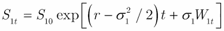
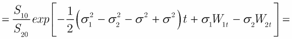
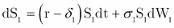
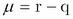
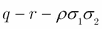

# 第五章：外汇衍生品

FX 衍生品（或外汇衍生品）是金融衍生产品，其支付结构取决于两种（或更多）货币的汇率。像一般衍生品一样，FX 衍生品可以分为三大类：期货、掉期和期权。在本章中，我们将仅讨论期权类型的衍生品。我们将从基础的 Black-Scholes 模型的简单推广开始，展示如何对简单的欧式看涨或看跌货币期权进行定价。之后，我们将讨论外汇期权和 Quanto 期权的定价。

在本章中，我们假设你对衍生品定价有一些基本了解，特别是对 Black-Scholes 模型和风险中性定价方法有所掌握。偶尔，我们会提到一些定量金融中常用的数学关系（例如伊藤引理或吉尔萨诺夫定理），但对这些定理的深刻理解对于本章并非必需。然而，那些对该主题的纯数学背景感兴趣的人可以参考*Medvegyev (2007)*。

# 术语和符号

由于我们将处理外汇汇率，因此澄清一些相关术语非常重要。通常，我们会用 *S* 来表示即期外汇汇率，它衡量一种货币（称为基础货币）与另一种货币（称为计价货币）的价格关系。换句话说，1 单位基础货币等于 *S* 单位的计价货币。理解如何读取外汇市场报价也非常重要。外汇对的报价由两种货币的缩写表示：基础货币的三字母代码，后跟计价货币的三字母代码。例如，EURUSD=1.25 意味着 1 欧元等于 1.25 美元。这等同于报价 USDEUR=0.8，意味着 1 美元等于 0.8 欧元。通常，哪种货币作为基础货币在某个外汇对中，取决于历史市场惯例。

在第四章*大数据 - 高级分析*中，我们已经学习了如何从互联网下载货币汇率，因此我们可以利用所学的内容，查看实际数据。

这段简短的代码绘制了 EURUSD 和 USDEUR 汇率在同一图表窗口中的显示：

```py
library(Quandl)
library(xts)

EURUSD <- Quandl("QUANDL/EURUSD",
 start_date="2014-01-01",end_date="2014-07-01", type="xts")
USDEUR <- Quandl("QUANDL/USDEUR", 
 start_date="2014-01-01",end_date="2014-07-01", type="xts")

dev.new(width = 15, height = 8)
par(mfrow = c(1, 2))
plot(USDEUR)
plot(EURUSD)

```

在这里，我们可以看到以下图片中的结果：


我们还可以查看数据的前几行：

```py
USDEUR[1:5,]
 Rate    High (est) Low (est)
2014-01-01 0.725711    0.73392   0.71760
2014-01-02 0.725238    0.73332   0.71725
2014-01-03 0.727714    0.73661   0.71892
2014-01-06 0.733192    0.00000   0.00000
2014-01-07 0.735418    0.00000   0.00000
EURUSD[1:5,]

 Rate     High (est) Low (est)
2014-01-01 1.37791     0.0000    0.0000
2014-01-02 1.37876     1.3949    1.3628
2014-01-03 1.37434     0.0000    0.0000
2014-01-06 1.36346     1.3799    1.3473
2014-01-07 1.35990     1.3753    1.3447

```

在这里，我们需要谈一下符号问题。到目前为止，我们将外汇汇率表示为*S*。然而，在衍生品定价中，基础资产的价格通常表示为*S*，无论它是股票还是货币。另一方面，外汇汇率通常表示为*X*，有时也表示为*E*（两者都来源于“exchange”一词）。此外，期权的执行价格或行权价格也常用*X*或*E*表示。现在，作为读者，您可能已经意识到，在本章中使用一致的符号系统是多么具有挑战性，因为基础资产可能是股票或货币，而且股票价格、外汇汇率和行权价格可能同时出现。我们决定尽可能采用 R 函数的符号，因此在本章中，我们将遵循以下符号：

+   基础资产的价格将始终是*S*，但如果它不一定是货币，我们将使用数字或字母指数，如*S[1]*或*S[A]*。

+   行权价格将始终是*X*。

+   期望值算符将用*E*表示。

我们强烈建议在阅读关于此主题的其他文献时要小心，因为他们的符号可能与我们的不同。

# 货币期权

欧式货币期权赋予持有者在特定日期（到期日，*T*）以预定汇率（行权价格或执行价格，*X*）买入（看涨期权）或卖出（看跌期权）货币的权利。这些金融资产也被称为外汇期权（或 FX 期权），但为了避免与“交换期权”这一术语混淆，我们更倾向于使用“货币期权”这一术语。

原始 Black-Scholes 模型（*Black 和 Sholes，1973*，另见*Merton，1973*）的基本假设是基础资产是没有红利的股票。更一般地说，模型的结果只有在基础资产不支付任何形式的收益，也不产生任何形式的成本时才成立。然而，这一假设可以轻松放宽，Black-Scholes 公式的扩展版本同样适用于货币期权，同时模型的所有逻辑和推理保持不变。

欧式货币看涨期权的闭式公式（*c[0]*）如下：


在前面的公式中，d[1]和 d[2]的值如下：

 和 。

在前面的公式中，*S[0]*是现货外汇汇率（基准货币的一单位价格，用变量货币表示），*X*是行权价格，*T*是期权到期时间（以年为单位），*σ*是外汇汇率的波动率，*r*和*q*分别是变量货币和基准货币的无风险对数回报，*N*表示标准正态分布的累积分布函数。从认购-认沽平价公式可以看出，具有相同参数的欧洲货币认沽期权(*p[0]*)的价格如下：


Black-Scholes 公式及其他期权定价模型可以在`fOptions`包中找到。我们可以使用`BlackScholesOption`或`GBSOption`函数，它们实际上是一样的，后者是前者的简写别名。

```py
BlackScholesOption(TypeFlag, S, X, Time, r, b, sigma,...)

```

在这里，`TypeFlag`是字符`c`（表示认购期权）或`p`（表示认沽期权）。`S`是当前价格，`sigma`是标的资产的波动率。`X`是行权价格，`Time`是到期时间。

另外两个参数有点棘手，因为`r`和`b`是无风险利率，但在使用原始 BS 模型定价股票期权时，第二个参数是没有意义的。这意味着我们必须将`b = r`来得到 BS 股票期权模型，并将`b = r-q`来得到货币期权模型或具有连续股息收益的股票期权模型。该函数的其他参数是可选的，我们不需要它们。

为了看它是如何运作的，假设我们有一个到期时间为五年的欧元期权，行权价格为 0.7。美元的无风险利率是`r = 3%`，欧元的无风险利率是`q = 2%`。1 美元当前等于 0.7450 欧元，因此这是标的资产的现货价格。假设欧元的波动率为 20%。如果我们使用给定参数调用`BlackSholesOption`函数，我们将得到以下结果：

```py
BlackScholesOption ("c", 0.7450, 0.7, 5, 0.03, 0.01, 0.2)

Title:
 Black Scholes Option Valuation 

Call:
 GBSOption(TypeFlag = "c", S = 0.745, X = 0.7, Time = 5, r = 0.03, 
 b = 0.01, sigma = 0.2)

Parameters:
 Value:
 TypeFlag c 
 S        0.745 
 X        0.7 
 Time     5 
 r        0.03 
 b        0.01 
 sigma    0.2 

Option Price:
 0.152222 
Description:
 Thu Aug 07 20:13:28 2014

```

我们还可以查看认沽期权的价格：

```py
BlackScholesOption("p", 0.7450, 0.7, 5, 0.03, 0.01, 0.2)

Title:
 Black Scholes Option Valuation 

Call:
 GBSOption(TypeFlag = "p", S = 0.745, X = 0.7, Time = 5, r = 0.03, 
 b = 0.01, sigma = 0.2)

Parameters:
 Value:
 TypeFlag p 
 S        0.745 
 X        0.7 
 Time     5 
 r        0.03 
 b        0.01 
 sigma    0.2 

Option Price:
 0.08061367 

Description:
 Thu Aug 07 20:15:11 2014

```

然后，我们还可以检查与认购-认沽平价的一致性，对于货币期权，其形式如下：

```py
c - p = S*exp(-r*T)–X*exp(-q*T)

```

替换数据后，在左侧我们得到：

```py
c - p = 0.152222 - 0.08061367 = 0.07160833,

```

在右侧，我们得到：

```py
0.745*exp(-0.02*5)-0.7*exp(-0.03*5) = 0.07160829.

```

### 提示

期权价格被四舍五入到八位数字，因此会有略微的差异。

需要特别提到的是，定价货币期权等同于定价任何具有连续收益的标的资产的期权。例如，如果标的是具有每年股息收益*q*的股票或股票指数，那么定价公式与前面提到的相同。

# 交换期权

交换期权赋予持有者在到期时将一种风险资产交换为另一种风险资产的权利。很容易看出，简单期权是交换期权的一种特殊形式，其中一个风险资产是一个固定金额的钱（行权价格）。

交换期权的定价公式最早由*Margrabe, 1978*推导出来。模型假设、定价原则和最终公式与 Black、Scholes 和 Merton 的定价方法非常相似（更准确地说，是它们的推广）。现在，我们将展示如何确定交换期权的价值。

设定在时间*t*时，两个风险资产的现货价格分别为*S[1t]*和*S[2t]*。我们假设在风险中性概率测度(*Q*)下，这些价格遵循几何布朗运动，漂移项等于无风险利率(*r*)，如图所示！交换期权 和 。

这里，*W[1]* 和 *W[2]* 是*Q*下的标准维纳过程，相关系数为*ρ*。你可能会注意到，这里资产没有收益（例如，不支付股息的股票）。众所周知（并且可以通过伊藤引理轻松看出），之前提到的随机微分方程的解是  和  (1)

我们假设你已经熟悉一维随机过程的基础知识。然而，在交换期权的情况下，我们有一个二维维纳过程，因此说明这种情况如何表现是很有用的。

## 二维维纳过程

2D 维纳过程就像是一个二维的随机游走，并且是连续时间的。我们可以通过几行代码轻松生成这样的过程，当坐标是独立的维纳过程时（我们不需要担心对过程进行缩放，因为它的外观是一样的）。

```py
D2_Wiener <- function() {
 dev.new(width = 10, height = 4)
 par(mfrow = c(1, 3), oma = c(0, 0, 2, 0))
 for(i in 1:3) {
 W1 <- cumsum(rnorm(100000))
 W2 <- cumsum(rnorm(100000))
 plot(W1,W2, type= "l", ylab = "", xlab = "")
 }
 mtext("2-dimensional Wiener-processes with no correlation",
 outer = TRUE, cex = 1.5, line = -1)
}

```

如果我们调用这个函数，输出结果大致如下：

```py
 D2_Wiener()

```

在这里，我们可以在下图中看到结果：


维纳过程之间的相关性会显著改变图像。在正相关的情况下，两个维纳过程看起来像是朝同一个方向移动；而在负相关的情况下，它们看起来像是朝相反方向移动。

我们可以修改我们的函数以获得相关的维纳过程。很容易看出，以下代码完成了这个任务：

```py
Correlated_Wiener <- function(cor) {
 dev.new(width = 10, height = 4)
 par(mfrow = c(1, 3), oma = c(0, 0, 2, 0))
 for(i in 1:3) {
 W1 <- cumsum(rnorm(100000))
 W2 <- cumsum(rnorm(100000))
 W3 <- cor * W1 + sqrt(1 - cor²) * W2
 plot(W1, W3, type= "l", ylab = "", xlab = "")
 }
 mtext(paste("2-dimensional Wiener-processes (",cor," correlation)",
 sep = ""), outer = TRUE, cex = 1.5, line = -1)
}

```

结果依赖于生成的随机数，但大致是这样的：

```py
Correlated_Wiener(0.6)

```

在这里，我们可以在下图中看到结果：


在之前的例子中，我们将相关系数设置为 0.6。现在，让我们看看当相关系数为-0.7 时会发生什么：

```py
Correlated_Wiener(-0.7)

```

在这里，我们可以在下图中看到结果：


我们可以清楚地看到，不同相关性的过程之间的差异。现在，让我们将注意力重新集中在交换期权上。

## 马格拉比公式

交换期权到期时的*H[T]*收益由定义。根据基本的风险中性定价原则，这一收益的价值（或等价地，交换期权的价格，用*π(H[T])*表示）如下所示：


在方程（2）中，*S[t]*（没有 1 或 2 的编号）被定义为*S[1t]/S[2t]*的商。换句话说，*S*是*S[1]*相对于*S[2]*的价格。如果这两个风险资产是两种货币，那么*S*就是外汇汇率，这也是我们使用这种符号的原因。

为了计算前面提到的期望值，我们需要引入一个新的度量（*R*），由以下的 Radon-Nikodym 导数定义：


这里，前面方程右侧的内容来自于方程（1）中*S[2]*的表达式。

然后，交换期权的价格将采取以下形式：


现在，我们需要确定*S*在*R*下遵循的过程。根据 Girsanov 定理，我们知道和是*R*下的 Wiener 过程，且它们的相关性仍然是*ρ*。我们引入以下两个符号：


根据 Lévy 的表征，我们知道*W*在*R*下是一个 Wiener 过程。现在我们可以确定*S*的方程：



这意味着，在*R*下，*S*是一个几何布朗运动，漂移为零，即。

现在，如果你还记得，在方程（3）中，我们有关于交换期权价格的以下方程：


使用这个*S*的关系，右侧的期望值是一个简单的看涨期权的价值，其标的资产是*S*，*r*等于 0，*X*等于 1。我们简化地将这个看涨期权的价格记为*c[0]*。然后。

在这里，*c[0]* 可能通过基本的 Black-Scholes 公式来确定，替换我们刚刚讨论的参数：


因此

其中和

之前提到的*π(H[T])*公式，即交换期权的定价公式，被称为马格拉布公式。如果适用，连续的股息收益率可以像在 Black-Scholes 公式中一样简单地插入该公式中。在不重复计算的情况下，我们仅提供该情况下的结果。

因此，假设要交换的风险资产具有正的连续股息收益率，分别表示为*δ[1]*和*δ[2]*。在这种情况下，它们的价格过程在*Q*测度下如下所示：

 和 

在这种情况下，马格拉布公式将呈现以下形式：


在这里， 和 。

## R 中的应用

R 中没有内建的马格拉布公式函数。然而，理解其背后的复杂理论比实现结果更为困难。这里，我们只用几行代码展示了`Margrabe`函数，它基于以下代码中的参数计算交换期权的价格：

```py
Margrabe <- function(S1, S2, sigma1, sigma2, Time, rho, delta1 = 0,
 delta2 = 0) {
 sigma <- sqrt(sigma1² + sigma2² - 2 * sigma1 * sigma2 * rho)
 d1 <- ( log(S1/S2) + ( delta2-delta1 + sigma²/2 ) * Time ) / 
 (sigma*sqrt(Time))
 d2 <- ( log(S1/S2) + ( delta2-delta1 - sigma²/2 ) * Time ) / 
 (sigma*sqrt(Time))
 M <- S1*exp(-delta1*Time)*pnorm(d1) - S2*exp(-delta2*Time)*pnorm(d2)
 return(M)
}

```

这是该函数的核心部分。如果我们要求更高或希望开发一个用户友好的应用程序，我们需要捕捉可能的错误和异常。例如，我们应该包括如下内容：

```py
if min(S1, S2) <= 0) stop("prices must be positive")

```

当波动率为负时，执行也应该停止，但用户体验和相关软件设计超出了本书的范围。我们可以使用此函数并提供有效的参数，来看一个其工作原理的示例。假设我们有两个没有分红的风险资产，一个价格为 100 美元，波动率为 20%，另一个价格为 120 美元，波动率为 30%，且到期时间为两年。首先，让相关性为 15%。

我们只需使用给定的参数调用`Margrabe`函数：

```py
Margrabe(100, 120, .2, .3, 2, .15)
[1] 12.05247

```

结果是 12 美元。现在，让我们看看如果其中一个资产是无风险的，即其波动率为 0，会发生什么。我们用以下参数调用函数：

```py
Margrabe(100, 120, .2, 0, 2, 0, 0, 0.03)
[1] 6.566047

```

这意味着什么？该产品赋予我们改变第一个风险资产的权利，该资产是一只价格为 100 美元、波动率为 20%的股票，换成第二个“风险”资产，后者的价格为 120 美元，支付 3%的股息，且波动率为 0（因此它是一个固定现金金额），利率为 3%。实际上，两年后，它将是以 3%的无风险利率以 120 美元购买股票的权利。我们将其与该认购期权的 BS 价格进行比较：

```py
BlackScholesOption("c", 100, 120, 2, 0.03, 0.03, .2)
Title:
 Black Scholes Option Valuation 
Call:
 GBSOption(TypeFlag = "c", S = 100, X = 120, Time = 2, r = 0.03, 
 b = 0.03, sigma = 0.2)
Parameters:
 Value:
 TypeFlag c 
 S        100 
 X        120 
 Time     2 
 r        0.03 
 b        0.03 
 sigma    0.2 

Option Price:
 6.566058 

Description:
 Tue Aug 05 11:29:57 2014

```

是的，它们确实是相同的。如果我们将第一个资产的波动率设置为 0，这实际上意味着我们拥有第二个资产的认沽期权。

```py
Margrabe(100, 120, 0, 0.2, 2, 0, 0.03, 0)
[1] 3.247161

```

BS 公式的结果如下：

```py
BlackScholesOption("p", 120, 100, 2, 0.03, 0.03, .2)

Title:
 Black Scholes Option Valuation 

Call:
 GBSOption(TypeFlag = "p", S = 120, X = 100, Time = 2, r = 0.03, 
 b = 0.03, sigma = 0.2)

Parameters:
 Value:
 TypeFlag p 
 S        120 
 X        100 
 Time     2 
 r        0.03 
 b        0.03 
 sigma    0.2 

Option Price:
 3.247153 

Description:
 Fri Aug 08 17:38:04 2014 

```

在这两种情况下，只有从第五位数字开始才会有数值误差。

我们还可以使用 Margrabe 公式来获取我们在 *货币期权* 部分讨论的货币期权的价格。我们可以检查 BS 公式是否提供了相同的价格：

```py
Margrabe(0.745, 0.7, 0.2, 0, 5, 0.15, 0.02, 0.03)
[1] 0.152222

```

我们需要讨论的最后一件事是相关性如何影响期权的价格。为了说明这一点，我们将计算不同相关性值下期权的 Margrabe 价格。这可以通过几行代码来完成：

```py
x <- seq(-1, 1, length = 1000)
y <- rep(0, 1000)
for (i in 1:1000)
 y[i] <- Margrabe(100, 120, .2, 0.3, 2, x[i])
plot(x, y, xlab = "correlation", ylab = "price",
 main = "Price of exchange option", type = "l", lwd = 3)

```

在这里，我们可以看到以下图片中的结果：


结果并不令人惊讶。当相关性较高时，我们可以在相同的股票之间进行转换，显然这没有任何价值。当相关性高且为负时，如果事情出现问题，我们就有更大的机会通过期权达成好的交易（这意味着，如果我们的资产下降，负相关性越高，另一资产的价格上涨并拯救我们免于亏损的机会就越大）。换句话说，在这种情况下，期权更多的是为了保险而非投机；我们不需要承担来自其他资产价格变化的风险。这就是为什么当相关性为负时，期权更有价值的原因。

# Quanto 期权

术语“**quanto**”是**数量调整期权**（quantity adjusting option）的缩写。Quanto 衍生品的收益由以一种货币计价的资产决定，但以另一种货币支付。

理解 quanto 产品（或任何种类的衍生品）最好的方法是检查其收益函数。众所周知，假设标的资产是一个不支付红利的股票，欧洲看涨期权的收益如下：


这里，*S[A]* 是股票的价格，*X* 是行权价格。这里，*c*、*S[AT]* 和 *X* 都以相同的货币计价；我们将其称为本国货币。

欧洲看涨 quanto 的收益如下：


这里，*S* 是外汇汇率。因此，看涨 quanto 期权支付的金额与简单的看涨期权相同，但使用的是另一种货币——我们称之为外币。因此，这个支付的数量必须乘以一个外汇汇率，以便我们得到以本国货币计价的收益值。当然，*S* 必须是外币相对于本国货币的价格。换句话说，在 *S* 的报价中，基准货币是外币。

## 看涨 quanto 定价公式

定价一个看涨 quanto 意味着确定之前的收益值。像往常一样，我们将假设在风险中性度量（*Q*）下，标的资产的价格遵循几何布朗运动，其漂移等于无风险的本国利率（*r*），即：


此外，我们假设外汇汇率遵循类似的过程：


在这些方程中，*W[1]*和*W[2]*是*Q*下的标准 Wiener 过程，相关性为*ρ*。令*q*表示无风险外汇利率。这意味着外币银行存款在时间*t*的价值是*exp(qt)*。以本国货币表示时，这个价值为：


假设这是一个在国内市场上交易的产品，那么它的折现值必须在*Q*下是一个马尔科夫过程。我们来计算这个折现值：


这个过程只有在时是马尔科夫过程，这个是在*Q*下的。


现在，我们将计算*SS[A]*产品，记作*Y*。


这里，和。

*W[2]*和*W[3]*之间的相关性是。

因此，。

现在，需要特别注意的是，call quanto 是一个特殊的交换期权，因此可以使用 Margrabe 公式进行定价。我们只需识别在行使期权时将要交换的两种风险资产及相关参数。从 quanto 的支付函数中可以看出，第一个风险资产是*SS[A] = Y*，第二个是*XS*（都以本国货币表示）。由于在*Q*下这些过程的漂移成分并非简单的无风险国内利率，我们必须使用包含股息收益率的`Margrabe`公式。从之前的计算可以看出，*Y*过程应该当作股息收益率为来处理，而*XS*则为简单的*q*。唯一需要确定的剩余参数是*σ*。通过直接替换，我们得到以下计算：


总结所有这些结果，我们必须使用`Margrabe`公式（见公式(4)），并进行替换！定价公式、、、和。

因此，call quanto 的价格如下：


在之前的方程中，d[1] 和 d[2] 如下：

 和 。

## 在 R 中定价看涨 quanto

让我们看一个在 R 中定价看涨 quanto 的例子。我们喜欢的股票价格为 100 美元，波动率为 20%。我们需要一个 90 美元的看涨期权，该期权在三年后以欧元支付。美元的无风险利率为`r = 2%`，欧元的无风险利率为`q = 3%`。目前，1 美元等于 0.7467 欧元。欧元的波动率为 15%，股票价格和美元欧元汇率之间的相关性为 10%。

如果三年后股票价格高于 90 美元，差额将以欧元支付。例如，如果三年后价格为 110 美元，我们将获得 20 欧元。按当前汇率，`20*0.7467 = 26.78093 美元`，但如果三年后欧元美元汇率不同，例如，美元欧元汇率为 0.7，那么这相当于 28.57143 美元。所以，收益可能以美元不同，但如果我们希望以欧元支付，我们就消除了汇率风险。

这看起来很复杂，但幸运的是，我们可以使用 Margrabe 公式和我们的 `Margrabe` 函数来计算期权的价格。

```py
Margrabe = function(S1, S2, sigma1, sigma2, Time, rho, delta1 = 0, delta2 = 0)

```

我们需要这些替代项 ，，，，和 。

`S1` 是欧元计价的股票价格，`S2` 是欧元计价的行权价格。`delta1` 和 `delta2` 可以很容易地计算：`delta1 = 0.03-0.02-0.2*0.15*0.1` 和 `delta2 = 0.03`。唯一的问题是，我们需要设置 `sigma = sigma1`，但是 `sigma` 不是 Margrabe 函数的参数，它是在函数体内计算的。考虑以下命令：

```py
sigma = sqrt(sigma1² + sigma2² - 2 * sigma1 * sigma2 * rho)

```

为了得到 *sigma = sigma1* 的结果，我们需要设置 *sigma2 = rho = 0*。

现在，我们可以使用给定的参数调用`Margrabe`函数。

```py
Margrabe(74.67, 90*0.7467, 0.2, 0,3, 0, 0.007 , 0.03)
[1] 16.23238

```

结果是 16.23。这是 quanto 期权的价格。

# 总结

在这一章中，我们面对了讨论金融数学中最美丽、最困难部分之一的挑战：衍生品定价。我们在理论和实践中学习了 Black-Scholes 模型的相关问题的推广。我们学习了如何使用 R 和 Black-Scholes 公式定价货币期权。我们看到了实现 Margrabe 公式的自定义代码是多么简单，这一公式是 Black-Scholes 模型的扩展。我们使用该公式定价了股票期权、货币期权和兑换期权。最后，我们讨论了 quanto 期权，并意识到 quanto 期权也可以使用 Margrabe 公式定价。

如果你觉得这一章很有趣，那么你一定会对下一章感兴趣，下一章将涉及一个相关的话题——即利率衍生品。

# 参考文献

+   **Black, F. 和 Scholes, M. (1973)**: 期权和公司负债定价。*政治经济学期刊*, 81(3), 第 637-654 页。

+   **Margrabe, W. (1978)**: 交换一种资产与另一种资产的期权价值。*金融学期刊*, 33(1), 第 177-186 页。

+   **Medvegyev, Péter (2007)**: *随机积分理论*。牛津大学出版社。

+   **Merton, R. (1973)**: 理性期权定价理论。*贝尔经济学与管理科学期刊*, 4(1), 第 141-183 页。
