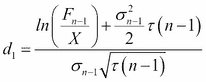
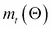

# 第六章 利率衍生品与模型

利率衍生品是金融衍生品，其支付依赖于利率。

这种产品种类繁多，基本类型包括利率掉期、远期利率协议、可赎回和可出售债券、债券期权、上限和下限等。

在本章中，我们将从黑模型（也称为 Black-76 模型）开始，它是 Black-Scholes 模型的推广版本，通常用于定价利率衍生品。接下来，我们将展示如何应用黑模型来定价利率上限。

黑模型的一个缺点是它假设某些标的资产（例如债券价格或利率）服从对数正态分布，并忽略了利率随时间变化的情况。因此，Black 的公式不能用于所有种类的利率衍生品。有时，有必要建模利率模型的期限结构。有许多利率模型尝试捕捉这一期限结构的主要特征。在本章的第二部分，我们将讨论两种基本且常用的利率模型，即 Vasicek 模型和 Cox-Ingersoll-Ross 模型。与前一章一样，我们假设你熟悉 Black-Scholes 模型和风险中性估值的基础知识。

# 黑模型

我们从定义利率衍生品为具有利率依赖现金流的资产开始本章内容。值得注意的是，金融产品的价值几乎总是依赖于某些利率，因为需要对未来现金流进行折现。然而，在利率衍生品的情况下，不仅折现后的价值，而且支付本身也依赖于利率。这就是为什么利率衍生品比股票或外汇衍生品更难定价的主要原因（*Hull, 2009*详细讨论了这些难点）。

黑模型（*Black, 1976*）最初是为期货合约的期权定价而开发的。期货期权赋予持有者在指定日期（到期日，*T*）以预定期货价格（行权价格或执行价格，*X*）进入期货合约的权利。在这个模型中，我们保持 Black-Scholes 模型的假设，只不过标的资产是期货价格，而不是现货价格。因此，我们假设期货价格（F）遵循几何布朗运动：


很容易看出，期货合约可以作为具有与无风险利率（*r*）相等的连续增长率的产品来处理。因此，Black 的期货期权公式与 Black-Scholes 的货币期权公式完全相同（前一章讨论过），其中*q*等于*r*（就好像国内和国外利率相同）。因此，Black 的欧洲期货看涨期权公式如下：


这里， 和 。

类似的看跌期权价格如下：


不奇怪的是，`GBSOption` 函数（或 `BlackScholesOption` 函数）对于 Black 模型同样有效。现在是时候更仔细地看一下它是如何工作的了。

当在 R 控制台中输入一个函数名而不加括号时，函数不会被调用，而是返回源代码（字节编译的代码除外）。这对于初学者来说不推荐，但对于有一定经验的程序员来说非常有用，因为这些细节通常不包含在包的文档中。我们来试试：

```py
require(fOptions)
GBSOption
function (TypeFlag = c("c", "p"), S, X, Time, r, b, sigma, title = NULL, 
 description = NULL)
{
 TypeFlag = TypeFlag[1]
 d1 = (log(S/X) + (b + sigma * sigma/2) * Time)/(sigma * sqrt(Time))
 d2 = d1 - sigma * sqrt(Time)
 if (TypeFlag == "c") 
 result = S * exp((b - r) * Time) * CND(d1) - X * exp(-r * 
 Time) * CND(d2)
 if (TypeFlag == "p") 
 result = X * exp(-r * Time) * CND(-d2) - S * exp((b - 
 r) * Time) * CND(-d1)
 param = list()
 param$TypeFlag = TypeFlag
 param$S = S
 param$X = X
 param$Time = Time
 param$r = r
 param$b = b
 param$sigma = sigma
 if (is.null(title)) 
 title = "Black Scholes Option Valuation"
 if (is.null(description)) 
 description = as.character(date())
 new("fOPTION", call = match.call(), parameters = param, price = result, 
 title = title, description = description)
}
<environment: namespace:fOptions>

```

如果这还不完全清楚，不用担心；我们目前只关心计算看涨期权的价格。首先，计算 `d[1]`（稍后我们会检查公式）。BS 公式有不同的形式（适用于股票期权、货币期权和带股息的股票期权），但以下方程始终成立：


在这个函数中，`d[2]`是根据这个公式计算的。最终结果的形式是 ，其中 *a* 和 *b* 依赖于模型，但它们始终是标的资产价格和执行价格的贴现值。

现在，我们可以看到 `b` 参数在计算中的作用。正如我们在上一章中提到的，这是我们决定使用哪个模型的方法。如果仔细检查公式，我们可以得出结论，通过设置 `b = r`，我们得到 Black-Scholes 股票期权模型；通过设置 `b = r-q`，我们得到 Merton 的股票期权模型，它具有连续股息收益率 `q`（这与货币期权模型相同，正如我们在上一章中看到的）；通过设置 `b = 0`，我们得到 Black 的期货期权模型。

现在，让我们看一个 Black 模型的例子。

我们需要一个 5 年期、执行价为 100 的资产期权。期货价格为 120。假设资产的波动率为 20%，无风险利率为 5%。现在，只需用 `S = F` 和 `b = 0` 调用 BS 期权定价公式：

```py
GBSOption("c", 120, 100, 5, 0.05, 0, 0.2)

```

我们得到的结果是通常的形式：

```py
Title:
 Black Scholes Option Valuation 
Call:
 GBSOption(TypeFlag = "c", S = 120, X = 100, Time = 5, r = 0.05, 
 b = 0, sigma = 0.2)
Parameters:
 Value:
 TypeFlag c 
 S        120 
 X        100 
 Time     5 
 r        0.05 
 b        0 
 sigma    0.2 

Option Price:
[1] 24.16356

```

期权的价格约为 24 美元，我们还可以从输出中检查出 `b = 0`，由此我们必须知道使用的是 Black 的期货期权模型（或者我们犯了一个严重的错误）。

尽管最初是为商品产品开发的，但 Black 模型证明是定价利率衍生品（如债券期权或上限和下限）的有用工具。在下一节中，我们将展示如何使用此模型来定价利率上限。

## 使用 Black 模型定价上限

利率上限是利率衍生品，持有者在一段时间内如果利率超过某个水平（行权价格，*X*），将获得正向支付。类似地，利率下限的持有者如果利率低于行权价格，每个时期也会收到正向支付。显然，上限和下限是有效的产品，可以对冲利率波动。在本节中，我们将讨论上限的定价。假设标的利率为 LIBOR，*L*。

正如我们在前一章中讨论的那样，理解衍生品的最好方式是确定它们的支付结构。cap（名义金额为单位）在第*n*期末的支付结构如下：


这里，*τ*是两个支付之间的时间间隔。这个单次支付称为 caplet，而 cap 当然是一个由多个顺序 caplet 组成的投资组合。在定价 cap 时，所有的 caplet 都必须逐个定价，并将它们的价格相加。此外，前面提到的支付结构向我们展示了，定价第*n*个 caplet 实际上就是定价一个以 LIBOR 为标的资产、行权价格为 X、到期日为*τn*的看涨期权。

如果我们假设时间*n-1*时的 LIBOR 利率（*L[n-1]*）是一个具有对数正态分布的随机变量，并且波动率为，那么我们可以使用 Black 公式来定价 caplet：


这里， 和 。

这里，*F[n-1]*是*τ(n-1)*和*τn*之间的远期 LIBOR 利率，*r*是到期日*τn*的无风险现货对数收益率。一旦我们得到单个 caplet 的价值，就可以对所有 caplet 进行定价，从而得到整个 cap 的价格。

让我们通过一个例子来深入理解这一点。我们需要在 2014 年 5 月到 11 月之间为某商业伙伴支付 6 个月的 USD LIBOR 利率。caplet 是避免利率风险的一种简单方式。假设我们在 LIBOR 利率上有一个 2.5%的行权价格的 caplet（使用通常的术语）。

这意味着，如果 LIBOR 利率高于 2.5%，我们将收到差额的现金支付。例如，如果 LIBOR 利率在 5 月为 3%，那么我们在一个名义金额单位上的收益为 0.5*max(3%-2.5%, 0)。

现在，让我们来看一下如何定价 caplet。这里没有什么新内容；我们可以直接使用 Black-Scholes 公式。显然，我们需要设定`S = F[n-1]`、`Time = 0.5`，并且`b = 0`。假设 LIBOR 利率遵循具有 20%波动率的几何布朗运动，5 月 1 日和 11 月 1 日之间的远期利率为 2.2%，即期利率为 2%。在这种情况下，caplet 的价格如下：

```py
GBSOption("c", 0.022, 0.025, 0.5, 0.02, 0, 0.2)
Title:
 Black Scholes Option Valuation 
Call:
 GBSOption(TypeFlag = "c", S = 0.022, X = 0.025, Time = 0.5, r = 0.02, 
 b = 0, sigma = 0.2)
Parameters:
 Value:
 TypeFlag c 
 S        0.022 
 X        0.025 
 Time     0.5 
 r        0.02 
 b        0 
 sigma    0.2 
Option Price:
 0.0003269133

```

期权的价格为 0.0003269133。我们仍然需要将其与τ = 0.5 相乘，这使得它变为 0.0001634567。如果我们以百万美元为单位进行测量，这意味着期权的价格大约为 163 美元。

上限只是上限期权的总和，但如果需要，我们可以用不同的参数将它们组合起来。假设我们需要一个上限，如果 LIBOR 利率在前 3 个月超过 2.5%，或者在接下来的 3 个月内高于 2%。在 5 月和 8 月期间（假设为 2.1%）以及 8 月和 11 月期间（假设为 2.2%），远期 LIBOR 利率也可以不同。我们只需逐个定价每个上限期权并加总它们的价格：

```py
GBSOption("c", 0.021, 0.025, 0.25, 0.02, 0, 0.2)
GBSOption("c", 0.022, 0.02, 0.25, 0.02, 0, 0.2)

```

我们没有在此包含所有的输出，只列出了价格：

```py
Option Price:
 3.743394e-05
Option Price:
 0.002179862

```

现在，我们需要将它们与τ = 0.25 相乘，并求它们价格的总和：

```py
(3.743394e-05 + 0.002179862 ) * 0.25
0.000554324

```

这笔名义金额为 100 万美元的上限价格约为 554 美元。

定价一个地板与此非常相似。首先，我们将资产的现金流分为单个支付，这些支付称为地板期权。然后，我们借助黑色模型确定每个地板期权的价值；唯一的区别是地板期权是看跌期权，而不是看涨期权。最后，我们将所有地板期权的价格加起来，得到地板的价值。

黑色模型适用于当我们可以假设基础资产的未来价值具有对数正态分布时。另一种评估利率衍生品的方法是通过建模利率的期限结构。在这里，我们将继续介绍两种基本的利率模型及其主要特点。

# 瓦西切克模型

瓦西切克模型（*Vasicek, 1977*）是一个连续的仿射一因子随机利率模型。在该模型中，瞬时利率的动态由以下随机微分方程给出：


这里，α、β和σ是正的常数，*r[t]*是利率，*t*是时间，*W[t]*表示标准的维纳过程。在数学中，这个过程称为奥恩斯坦-乌伦贝克过程。

如您所见，瓦西切克模型中的利率遵循一个均值回归过程，具有长期平均值*β*；当*r[t] < β*时，漂移项变为正值，因此利率预计会增加，反之亦然。调整到长期均值的速度由*α*衡量。该模型中的波动率项是常数。

利率模型是用 R 语言实现的，但为了更深入地理解公式背后的内容，让我们写一个函数，直接实现瓦西切克模型的随机微分方程：

```py
vasicek <- function(alpha, beta, sigma, n = 1000, r0 = 0.05){
 v <- rep(0, n)
 v[1] <- r0
 for (i in 2:n){
 v[i] <- v[i - 1] + alpha * (beta - v[i - 1]) + sigma * rnorm(1)
 }
 return(v)
}

```

就是这样。现在，让我们绘制一些轨迹，看看它的样子：

```py
set.seed(123)
r <- replicate(4, vasicek(0.02, 0.065, 0.0003))

matplot(r, type = "l", ylab = "", xlab = "Time", xaxt = "no",  main = "Vasicek modell trajectories")
lines(c(-1,1001), c(0.065, 0.065), col = "grey", lwd = 2, lty = 1)

```

以下截图显示了前面命令的输出：


为了理解参数的作用，我们用不同的 sigma 和 alpha 值绘制相同的轨迹（即由相同随机数生成的轨迹）：

```py
r <- sapply(c(0, 0.0002, 0.0006), 
function(sigma){set.seed(102323); vasicek(0.02, 0.065, sigma)})

matplot(r, type = "l", ylab = "", xlab = "Time" ,xaxt = "no",  main = "Vasicek trajectories with volatility 0, 0.02% and 0.06%")
lines(c(-1,1001), c(0.065, 0.065), col = "grey", lwd = 2, lty = 3)

```

以下是前面代码的输出：


```py
r <- sapply(c(0.002, 0.02, 0.2),
function(alpha){set.seed(2014); vasicek(alpha, 0.065, 0.0002)})

```

轨迹形状相同，但波动性不同：

```py
matplot(r, type = "l", ylab = "", xaxt = "no",  main = "Vasicek trajectories with alpha = 0.2%, 2% and 20%")
lines(c(-1,1001), c(0.065, 0.065), col = "grey", lwd = 2, lty = 3)

```

以下是前述命令的输出：


我们可以看到，*α* 值越高，轨迹达到长期均值的时间越早。

可以证明（例如，见已引用的 Vasicek 原始论文），Vasicek 模型中的短期利率呈正态分布，其条件期望值和方差如下：


值得注意的是，当 *T* 或 *α* 趋向于无穷大时，期望值会收敛到 *β*。此外，当 *α* 趋向于无穷大时，方差会收敛到 0。这些观察结果与参数的解释是一致的。

为了展示方程的系数如何决定分布的参数，让我们绘制不同 *α*、*β* 和 *σ* 值的条件概率密度函数，并观察它随时间的变化：

```py
vasicek_pdf = function(x, alpha, beta, sigma, delta_T, r0 = 0.05){
 e <- r0*exp(-alpha*delta_T)+beta*(1-exp(-alpha*delta_T))
 s <- sigma²/(2*alpha)*(1-exp(-2*alpha*delta_T))
 dnorm(x, mean = e, sd = s)
}

x <- seq(-0.1, 0.2, length = 1000)
par(xpd = T ,mar = c(2,2,2,2), mfrow = c(2,2))
y <- sapply(c(10, 5, 3, 2), function(delta_T)
 vasicek_pdf(x, .2, 0.1, 0.15, delta_T))
par(xpd = T ,mar = c(2,2,2,2), mfrow = c(2,2)) 
matplot(x, y, type = "l",ylab ="",xlab = "")
legend("topleft", c("T-t = 2", "T-t = 3", "T-t = 5", "T-t = 10"), lty = 1:4, col=1:4, cex = 0.7)

y <- sapply(c(0.1, 0.12, 0.14, 0.16), function(beta)
 vasicek_pdf(x, .2, beta, 0.15, 5))
matplot(x, y, type = "l", ylab ="",xlab = "")
legend("topleft", c("beta = 0.1", "beta = 0.12", "beta = 0.14", "beta = 0.16"), lty = 1:4, col=1:4,cex = 0.7)

y <- sapply(c(.1, .2, .3, .4), function(alpha)
 vasicek_pdf(x, alpha, 0.1, 0.15, 5))

matplot(x, y, type = "l", ylab ="",xlab = "")
legend("topleft", c("alpha = 0.1", "alpha = 0.2", "alpha = 0.3", "alpha = 0.4"), lty = 1:4, col=1:4, cex = 0.7)

y <- sapply(c(.1, .12, .14, .15), function(sigma)
 vasicek_pdf(x, .1, 0.1, sigma, 5))
matplot(x, y, type = "l", ylab ="",xlab = "")
legend("topleft", c("sigma = 0.1", "sigma = 0.12", "sigma = 0.14", "sigma = 0.15"), lty = 1:4, col=1:4, cex = 0.7)

```

以下截图是前述代码的结果：


我们可以看到，分布的方差随着时间的推移而增加。*β* 仅影响概率分布的均值。显然，当 *α* 的值较高时，过程更早地达到长期均值，并且方差较小；而当波动性较大时，我们得到一个更平坦的密度函数，即方差更大。

当利率遵循 Vasicek 模型时，定价零息债券的公式如下（关于这个公式的推导，参见例如 *Cairns [2004]*）：


这里， 和 。

在前述公式中，*P* 表示零息债券的价格，*t* 是我们为债券定价的时间，*T* 是到期时间（因此，*T-t* 是到期时间）。如果我们知道零息债券的价格，就可以通过以下简单关系确定现货收益率曲线：


# Cox-Ingersoll-Ross 模型

与 Vasicek 模型类似，Cox-Ingersoll-Ross 模型（*Cox 等，1985*），通常被称为 CIR 模型，是一个连续的、仿射的单因素随机利率模型。在这个模型中，即时利率的动态由以下随机微分方程给出：


这里，*α*，*β*，和*σ*是正的常数，*r[t]*是利率，*t*是时间，*W[t]*表示标准 Wiener 过程。很容易看出，漂移项与 Vasicek 模型中的相同；因此，利率再次遵循均值回归过程，*β*是长期平均值，*α*是调整速率。不同之处在于，波动率项不是常数，而是与利率水平的平方根成比例。这一“微小”的差异对于未来短期利率的概率分布有着巨大的影响。在 CIR 模型中，利率遵循非中心卡方分布，其密度函数为(*f*)：


这里，，，和。

这里，表示带有*n*自由度的卡方分布的概率密度函数，*m*表示非中心参数。由于这种随机变量的期望值和方差分别为*n+m*和*2(n+2m)*，因此我们得到了利率的以下矩：


我们可以观察到，条件期望值与 Vasicek 模型中的完全相同。需要注意的是，短期利率作为一个正态分布的变量，在 Vasicek 模型中可能变为负值，但在 CIR 模型中则不可能发生这种情况。

如同 Vasicek 模型的情况，我们可以看到系数如何决定概率密度函数的形状，如果我们使用不同的参数集绘制它。下面的代码通过比较不同参数设置下的概率密度函数来完成这项工作：

```py
CIR_pdf = function(x, alpha, beta, sigma, delta_T, r0 = 0.1){
 q = (2*alpha*beta)/(sigma²) - 1
 c = (2*alpha)/(sigma²*(1-exp(-alpha*delta_T)))
 u = c*r0*exp(-alpha*delta_T)
 2*c*dchisq(2*c*x, 2*q+2, ncp = 2*u)
 }

x <- seq(0, 0.15, length = 1000)
y <- sapply(c(1, 2, 5, 50), function(delta_T)
 CIR_pdf(x, .3, 0.05,0.1,delta_T))

par(mar = c(2,2,2,2), mfrow = c(2,2)) 
matplot(x, y, type = "l",ylab ="",xlab = "")
legend("topright", c("T-t = 1", "T-t = 2", "T-t = 5", "T-t = 50"), lty = 1:4, col = 1:4, cex = 0.7)

y <- sapply(c(.2, .4, .6, 1), function(alpha)
 CIR_pdf(x, alpha, 0.05,0.1,1))
 matplot(x, y, type = "l",ylab ="",xlab = "")
legend("topright", c("alpha = 0.2", "alpha = 0.4", "alpha = 0.6", "alpha = 1"), lty = 1:4, col = 1:4, cex = 0.7)

y <- sapply(c(.1, .12, .14, .16), function(beta)
 CIR_pdf(x, .3, beta,0.1,1))

matplot(x, y, type = "l",ylab ="",xlab = "")
legend("topleft", c("beta = 0.1", "beta = 0.12", "beta = 0.14", "beta = 0.16"), lty = 1:4, col = 1:4, cex = 0.7)

x <- seq(0, 0.25, length = 1000)
y <- sapply(c(.03, .05, .1, .15), function(sigma)
 CIR_pdf(x, .3, 0.05,sigma,1))

matplot(x, y, type = "l",ylab ="",xlab = "")
legend("topright", c("sigma = 1", "sigma = 5", "sigma = 10", "sigma = 15"), lty = 1:4, col = 1:4, cex = 0.7)

```

这里，我们可以看到结果。我们得出的结论与 Vasicek 模型的情况相同，只是这里，*β*改变了密度函数的形状，而不仅仅是平移它。


在 CIR 模型中定价零息债券得到以下公式（例如，参见*Cairns [2004]*）：


这里，，，和。

从债券价格确定收益曲线与 Vasicek 模型中的完全相同。

# 利率模型的参数估计

当使用利率模型进行定价或模拟时，重要的是要将其参数正确地校准到实际数据。这里，我们介绍了一种可能的参数估计方法。该方法由*Chan 等人，1992*年提出，通常称为 CKLS 方法。该程序通过经济计量学方法——广义矩估计法（GMM；更多细节请参见*Hansen，1982*）——来估计以下利率模型的参数：


很容易看出，当*γ*=0 时，这个过程给出了 Vasicek 模型，当*γ*=0.5 时，给出了 CIR 模型。作为参数估计的第一步，我们通过欧拉近似法离散化这个方程（参见*Atkinson，1989*）：


这里，*δ[t]*是两次利率观测之间的时间间隔，*e[t]*是独立的标准正态随机变量。参数是通过以下零假设进行估计的：


令*Θ*为待估计的参数向量，即。

我们考虑参数向量的以下函数：


很容易看出，在零假设下，=0。

GMM 的第一步是我们考虑与对应的样本，具体为：


这里，*n*是观测值的数量。

最后，GMM 通过最小化以下二次型来确定参数：


这里，是一个对称的、正定的权重矩阵。

在 R 中有一个`quadprog`包可以处理这类问题，或者我们也可以使用一般的优化方法，比如`optim`函数。

# 使用 SMFI5 包

在讨论完利率模型背后的数学原理并进行艰难的编程后，我们推荐`SMFI5`包，它提供了用户友好的解决方案，用于建模和模拟利率模型（如果模型是由奥恩斯坦-乌伦贝克过程表示的）、定价债券及其他许多应用。

我们无法详细讨论，但作为简短演示，让我们调用一个模拟不同到期债券价格的函数：

```py
bond.vasicek(0.5,2.55,0.365,0.3,0,3.55,1080,c(1/12, 3/12, 6/12, 1),365) 

```

这会返回一个惊人的结果：


# 摘要

本章讨论了利率模型和利率衍生品。在介绍了 Black 模型之后，我们使用它来定价利率上限和上限期权。我们还研究了 Black-Scholes 模型的 R 代码。

然后，我们将注意力转向了如 Vasicek 和 CIR 模型等利率模型。我们也讨论了参数估计的理论。最后，我们简要演示了 SMFI5 包的使用方法。利率模型在本章中对我们来说非常重要，因为利率衍生品的定价从假设未来的利率和收益曲线开始。通过使用正确选择和校准的模型，我们有机会分析未来可能的利率场景。当然，利率模型是一个更广泛的话题，值得更深入研究。然而，学习最流行和最著名的模型是一个好的起点，我们鼓励你进一步研究它们，或者查阅下一章，因为某些期权仍然为我们带来了一些惊喜。

# 参考文献

+   **Atkinson, K. [1989]**：数值分析导论。约翰·威利父子公司，纽约。

+   **Black, F. [1976]**：商品合同定价。*金融经济学杂志*，3(1-2)，第 167-179 页。

+   **Cairns, A. [2004]**：*利率模型：简介*。普林斯顿大学出版社，普林斯顿-牛津。

+   **Chan, K.，Karolyi, A.，Longstaff, A. 和 Sanders, A. [1992]**：短期利率的替代模型的实证比较。*金融学杂志*，第 3 期，第 1209-1227 页。

+   **Cox, J.，Ingersoll, J. 和 Ross, S. [1985]**：利率期限结构理论。*计量经济学*，第 53 期，第 385-407 页。

+   **Hansen, L. [1982]**：广义矩估计量的大样本性质。*计量经济学*，第 4 期，第 1029-1054 页。

+   **Hull, J. [2009]**：*期权、期货及其他衍生品*。皮尔逊普伦蒂斯霍尔出版社，新泽西州。

+   **Vasicek, O. [1977]**：期限结构的均衡特征。*金融经济学杂志*，5(2)，第 177-188 页。
