# 第七章：外来期权

所有衍生品都是金融合约，在这些合约中，可以商定的特性远超过简单的买卖权利。可以根据假设情境设计复杂的支付结构；因此，外来合约的最终支付可能依赖于一整套情形。通常，甚至标的物的路径也对最终支付有重大影响。与这些衍生品相比，传统的认购和认沽期权很快就被视为简单，从而获得了一个不太令人印象深刻的昵称：普通香草期权。

普通的认购期权和认沽期权就像普通香草冰淇淋，是最简单的冰淇淋，没有任何复杂的配料。“普通香草”这个表达在金融领域中根深蒂固，甚至在债券市场中也使用，其中香草债券是最简单的支付票息债券。

任何相对于基本的普通香草期权有额外特点的期权都属于一个庞大的群体，称为外来期权。外来期权很受欢迎，因为卖方银行家在激烈竞争中，为客户提供量身定制的产品。外来期权广泛传播的另一个原因是，有趣的是，大多数情况下，对外来结构报价对市场制造者来说并不比报价普通香草期权更加困难。

# 一种通用的定价方法

无论是外来品还是其他，所有衍生品都有一个内在的共同特点，那就是它们是其他工具的函数，因此得名“衍生品”。因此，衍生品的价格并不是通过直接的供需关系独立发展出来的，而是作为一种估算的构建成本。例如，欧元的一个月期远期美元价格高度依赖于欧元现货美元价格；远期价格只是现货价格（以及利率）的函数。

如果通过一种涉及较简单工具的交易策略能够构建与持有衍生品相同的利益，那么该衍生品就可以被复制。衍生品不像独一无二的画作；衍生品的伪造品具有相同的价值，而复制品与原件一样好。通过使用无套利论证，*Black 和 Scholes（1973）*以及*Merton（1973）*表明，衍生品的价格应该等于在适当实施动态复制策略过程中产生的预期费用之和。*Taleb（1997）*广泛描述了，在实际市场环境中实施适当的复制策略往往是非常棘手的。

# 动态对冲的作用

大多数时候，复制是一个动态策略。在衍生品的生命周期内，你几乎需要不断地进行交易。*Haug (2007b)* 表明，非连续对冲的对冲误差，即使对于普通的香草期权，也可能是显著的。无论如何，连续对冲是一项巨大的工作，通常在定价公式中没有显式体现；然而，大多数定价函数都假设在后台应始终正确进行动态对冲。这也适用于我们每次谈论风险中性世界或风险中性定价时。更多参考资料，见 *Wilmott (2006)*。

幸运的是，不管动态对冲有多困难，运行期权组合至少是一个可扩展的业务；对冲成千上万的期权并不比对冲几个期权更难。所有期权都可以分解为某些敏感度，即所谓的希腊字母（或简称为希腊字母）。这个昵称源于某些关键敏感度是用希腊字母命名的（例如 delta、gamma、rho 和 theta）。它们是偏导数，因此它们是可加的。将各个期权的 delta 加总起来就得到组合的 delta，以此类推。这不仅适用于普通的香草期权，也适用于异域期权，从而在香草期权和异域期权之间建立了一个非常强的联系。

# R 如何提供很大帮助

我们通过展示一些异域期权的例子来开始本章，给出一种可能的分类方法。我们将展示来自`fExoticOptions`包的例子，并说明如何为任何衍生品定价函数创建所谓的 Black-Scholes 表面。之后，我们将专注于对任何异域衍生品希腊值的数值估算。接下来，我们将展示一种尚未包含在`fExoticOptions`包中的异域期权定价方法。

我们选择**双无触碰（DNT）**二元期权，主要是因为它在外汇（**FX**）市场上的流行程度以及它所蕴含的许多对其他异域期权仍然适用的结论。我们将以 AUDUSD 作为标的，因为在撰写本章时，澳元和美元的利率之间存在显著的利差，我们可以展示如何将这些利率纳入定价函数中。我们将通过使用静态期权复制论证展示第二种计算 DNT 价格的方法。我们将展示一个 DNT 的实际例子，并通过模拟展示一种估算 DNT 存活概率的方法。利用这一方法，我们可以讨论现实世界概率与风险中性概率之间的关系以及风险溢价的作用。最后，我们将展示一些实用的微调技巧，用于将异域期权嵌入结构化产品中。

除了通过在 R 中实现复杂的异型期权定价函数和模拟的示例，作为附带效果，本章的学习成果还包括将希腊字母作为异型期权与普通期权之间的联系来理解。我们将使用在第五章中介绍的相同术语，*外汇衍生品*，该章还详细介绍了更多关于货币和普通期权的内容。

# 透视普通期权

*Haug (2007a)* 全面覆盖了大约 100 种异型衍生品的定价公式。`fOptions` 和 `fExoticOptions` 包都是基于这本书的。*Wilmott (2006)*、*Taleb (1997)* 和 *DeRosa (2011)* 讨论了很多关于这些期权的实际问题。

第一印象可能是异型期权种类繁多。它们的分类方式有很多种。市场做市商讨论不同世代的异型期权，如第一代、第二代等等。他们的分类方法是从对冲的角度出发。我们将采用稍有不同的角度，即最终用户的角度，按照期权的主要异型特征来分类。

亚洲型期权大致属于平均型期权。它可以是一个平均利率或平均执行价，也可以是算术平均或几何平均。这些期权是路径依赖的；也就是说，它们在到期时的价值不仅仅是到期时标的价格的函数，还取决于整个路径。由于平均价格的波动率低于标的价格本身的波动率，亚洲期权比普通期权便宜：

```py
library(fOptions)
library(fExoticOptions)
a <- GBSOption("c", 100, 100, 1, 0.02, -0.02, 0.3, title = NULL,
 description = NULL)(z <- a@price)
[1] 10.62678
a <- GeometricAverageRateOption("c", 100, 100, 1, 0.02, -0.02, 0.3,
 title = NULL, description = NULL)(z <- a@price)[1] 5.889822

```

屏障型异型期权也是路径依赖型期权。它们可能有一个或两个屏障。每个屏障可能是 **触及入场 (KI)** 或 **触及出场 (KO)**。在期权的有效期内，标的价格会被监控，如果价格达到或超过屏障，就会发生触及事件。具有 KI 屏障的期权在触及事件发生后变得可以行使。具有 KO 屏障的期权在开始时是可以行使的，但如果发生触及事件，就会变得不可行使。如果有两个屏障，它们可以是相同类型的：**双重触及出场 (DKO)** 和 **双重触及入场 (DKI)**，或者是 **触及入场触及出场 (KIKO)** 类型。

如果其他所有参数相同，那么以下方程成立：

*KI + KO = 普通期权*。

这是因为在这种情况下，KI 和 KO 期权是互斥的，但它们中的一个一定会被行使。第一个参数 `cuo` 和 `cui` 是表示“打击出场”和“打击入场”的标志。接下来，我们检查以下条件：

*普通期权 - KO - KI = 0*。

以下代码演示了前述条件：

```py
library(fExoticOptions)
a <- StandardBarrierOption("cuo", 100, 90, 130, 0, 1, 0.02, -0.02, 0.30,
 title = NULL, description = NULL)
x <- a@price
b <- StandardBarrierOption("cui", 100, 90, 130, 0, 1, 0.02, -0.02, 0.30, 
 title = NULL, description = NULL)
y <- b@price
c <- GBSOption("c", 100, 90, 1, 0.02, -0.02, 0.3, title = NULL, 
 description = NULL)
z <- c@price

```

```py
v <- z - x - y
v
[1] 0

```

基于*DKO + DKI = vanilla*的相同逻辑，我们甚至可以表示*KO - DKO = KIKO*。因此，KIKO 期权从一开始就是不可行使的，只要短期 DKO 和长期 KO 都有效，它们就会互相中和。如果短期 DKO 失效而长期 KO 依然有效，那么对 KIKO 期权来说就是 KI 事件。然而，即使在被击中后，KIKO 期权仍然可能会失效。当然，KIKO + DKO = KO 的方式也得出相同的结论。

此外，障碍期权之间存在一些重要的收敛特征。根据 KO + KI = vanilla 方程，当我们将障碍推得远离现货时，KO 会收敛到 vanilla，因为 KI 会随着障碍远离现货而收敛为零。接下来的图表将展示这一特征。

```py
vanilla <- GBSOption(TypeFlag = "c", S = 100, X = 90, Time = 1,
 r = 0.02, b = -0.02, sigma = 0.3)
KO <- sapply(100:300, FUN = StandardBarrierOption, TypeFlag = "cuo",
 S = 100, X = 90, K = 0, Time = 1, r = 0.02, b = -0.02, sigma = 0.30)
plot(KO[[1]]@price, type = "l",
 xlab = "barrier distance from spot",
 ylab = "price of option",
 main = "Price of KO converges to plain vanilla")
abline(h = vanilla@price, col = "red")

```

以下输出是前面代码的结果：

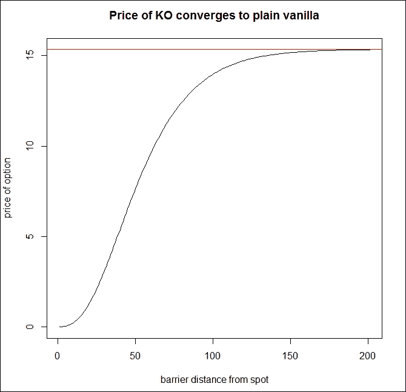

类似地，当其中一个障碍变得不重要时，双障碍期权会收敛为单一障碍期权，如果两个障碍都变得不重要，它们会收敛为普通 vanilla 期权。

得益于前述的对称性，大多数情况下，找到 KO 期权的定价公式就足够了。尽管这非常有帮助，但定价 KO 期权往往仍然非常棘手。复制 KO 事件的技术是通过一种尝试建立一个由 vanilla 期权组成的投资组合，这些期权在击中事件发生时的价值恰好为零，因此在该时刻它们可以免费关闭。对此有两种著名的方法，分别由*Derman-Ergener-Kani (1995)*和*Carr-Ellis-Gupta (1998)*解释。

所谓的 Black-Scholes 曲面是一个三维图表，其中期权价格可以作为到期时间和标的价格的函数显示。由于一些复杂的定价函数在极端输入情况下可能会出现异常，因此建议利用我们的金融知识，期权价格永远不能低于零。

以下是 Black-Scholes 曲面的代码：

```py
install.packages('plot3D')
BS_surface <- function(S, Time, FUN, ...) {
 require(plot3D)
 n <- length(S)
 k <- length(Time)
 m <- matrix(0, n, k)
 for (i in 1:n){
 for (j in 1:k){
 l <- list(S = S[i], Time = Time[j], ...)
 m[i,j] <- max(do.call(FUN, l)@price, 0)
 }
 }
 persp3D(z = m, xlab = "underlying", ylab = "Remaining time",
 zlab = "option price", phi = 30, theta = 20, bty = "b2")
}
BS_surface(seq(1, 200,length = 200), seq(0, 2, length = 200),
 GBSOption, TypeFlag = "c", X = 90, r = 0.02, b = 0, sigma = 0.3)

```

前面代码的输出结果如下：

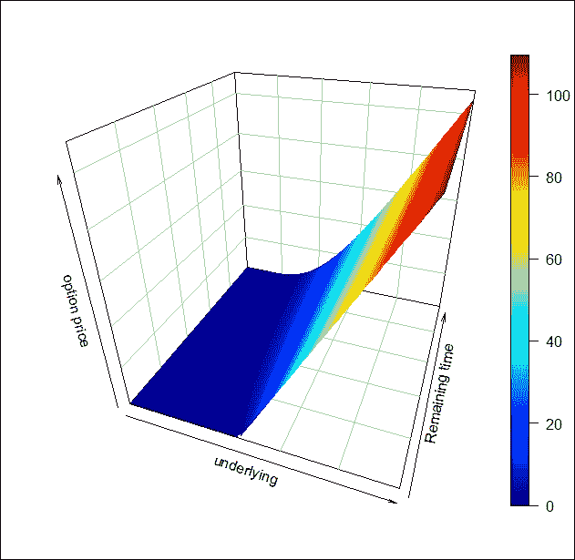

首先，我们准备了一个普通 vanilla 看涨期权的 Black-Scholes 曲面。然而，`BS_surface`代码可以用于更多的目的。就像 Black-Scholes 曲面的概念可以用于任何种类的单一标的相关衍生品一样，如果我们有一个定价函数，它可以作为`FUN`参数使用：

```py
BS_surface(seq(1,200,length = 200), seq(0, 2, length = 200),
 StandardBarrierOption, TypeFlag = "cuo", H = 130, X = 90, K = 0,
 r = 0.02, b = -0.02, sigma = 0.30)

```

以下截图是前面代码的结果：

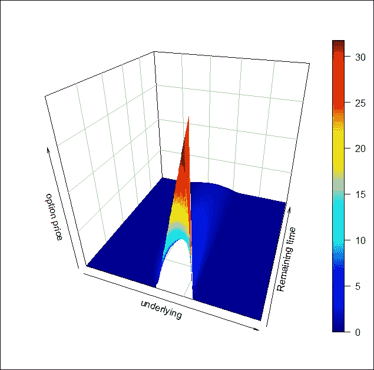

很容易看出，与普通 vanilla 看涨期权相比，上涨打破期权的价值是有限的。

在[第 156 页]，我们使用相同的函数绘制了双触碰期权的 BS 曲面。

二元期权是一种外来期权，其支付方式是固定的应急支付。其名称来自于它只有两种可能的结果：要么支付一个固定金额，要么完全不支付。它们在期权世界中具有 0-1 关系。二元特性可以与障碍特性结合，从而变得路径依赖。单触及（OT）期权仅在其生命周期内发生敲击事件时支付，而不触及期权（No-Touch）则仅在没有发生敲击事件时支付。

二元期权可能与两个障碍相关，从而得到双一触及和双不触及期权。基于无套利原理，必须满足以下方程：

*NT + OT = T-Bill*

*DNT + DOT = T-Bill*

收敛性在这里也能看到，类似于我们之前展示的障碍案例。如果其中一个障碍足够远，DNT 会收敛到 NT；如果两个障碍都足够远，它会收敛到 T-Bill。DNT 的定价函数是二元期权中的“万金油”，类似于障碍类型的 DKO 期权。

回望期权也是路径依赖的。回望特性非常方便。到期时，持有者可以回顾并选择从标的物路径中得到的最佳价格。对于浮动利率回望，期权持有者可以回溯选择执行价格；对于固定利率回望，持有者可以在期权生命周期内选择任何价格进行行权。*Taleb (1997)*展示了如何通过无限链条的 KIKO 期权来复制回望期权。从这个意义上讲，这至少是第二代的外来期权，因为我们需要将外来期权作为构建模块来复制回望期权。

多个标的物也是一种常见的外来特性。两个例子已经在第五章的*外汇衍生品*部分讨论过，分别是*交换期权*和*定量期权*。然而，还有许多其他例子。最优和最差（也叫彩虹）期权从一篮子标的物中选择表现最好或最差的标的。价差期权非常类似于普通期权，不同之处在于此期权的标的是两种资产的差价。这只是一些例子，足以表明在所有这些情况下，相关性都起着重要作用。此外，这些特性还可以与障碍、回望或亚洲期权特性相结合，从而产生几乎无限的组合。在本章中，我们不会进一步讨论这些类型。

# 希腊字母 – 回到普通世界的连接

正如我们在本章介绍部分解释的那样，希腊字母是偏导数。一些重要的希腊字母如下：

+   **delta**：表示 DvalueDspot，指的是期权价格相对于标的现货价格变化的变化量

+   **gamma**：表示 DdeltaDspot

+   **vega**：表示 DvalueDvolatility

+   **theta**：表示 DvalueDtime

+   **rho**：表示 D 值的利率

在一些简单的情况下，这些偏导数可以通过解析方法找到。例如，`fOptions`包包括一个`GBSGreeks`函数，它提供了经典期权的希腊字母。

解析希腊字母非常方便；然而，它们存在两个问题。第一个问题是，市场交易的参数并不是在无穷小的增量中变化。例如，在纽约证券交易所，股票价格的最小变化为一美分。股票价格要么变化至少一美分，要么没有变化。在场外交易（OTC）外汇市场，交易者报价波动率时通常是 0.0005 的整数倍。第二个问题是，许多外来期权没有封闭的公式。我们仍然需要知道希腊字母，因为我们希望将它们加起来以获得整个投资组合的希腊字母。将解析希腊字母和数值希腊字母相加可能会导致错误，因此使用数值希腊字母是一种更安全的方法。

`GetGreeks`函数计算任何定价函数的希腊字母：

```py
GetGreeks <- function(FUN, arg, epsilon,...) {
 all_args1 <- all_args2 <- list(...)
 all_args1[[arg]] <- as.numeric(all_args1[[arg]] + epsilon)
 all_args2[[arg]] <- as.numeric(all_args2[[arg]] - epsilon)
 (do.call(FUN, all_args1)@price -
 do.call(FUN, all_args2)@price) / (2 * epsilon)
}

```

场外市场做市商不会以任何数量报价外汇波动率，但通常会作为 0.0005 的整数倍报价，典型的 AUDUSD 平值波动率报价为 5.95%/6.05%。当然，对于以价格报价而非波动率的交易所衍生品，价格变化隐含的波动率变化可能小于 0.0005。

因此，当我们计算 vega 时，应该将 epsilon 设置为 0.0005，这是市场一致的最小可能变化；例如，要计算 AUDUSD 期权的 delta，我们可以将 epsilon 设置为 0.0001（一个点），对于股票，我们可以将 epsilon 设置为 0.01（一美分）。调整 epsilon 为 1/365（一天）用于 theta，0.0001（一个基点）用于 rho 也是有用的。

以下代码绘制了`FloatingStrikeLookbackOption`的 delta、vega、theta 和 rho：

```py
x <- seq(10, 200, length = 200)
delta <- vega <- theta <- rho <- rep(0, 200)
for(i in 1:200){
 delta[i] <- GetGreeks(FUN = FloatingStrikeLookbackOption, arg = 2, epsilon = 0.01, "p", x[i], 100, 1, 0.02, -0.02, 0.2)
 vega[i]  <- GetGreeks(FUN = FloatingStrikeLookbackOption, arg = 7, epsilon = 0.0005, "p", x[i], 100, 1, 0.02, -0.02, 0.2)
 theta[i] <- GetGreeks(FUN = FloatingStrikeLookbackOption, arg = 4, epsilon = 1/365, "p", x[i], 100, 1, 0.02, -0.02, 0.2)
 rho[i]   <- GetGreeks(FUN = FloatingStrikeLookbackOption, arg = 5, epsilon = 0.0001, "p", x[i], 100, 1, 0.02, -0.02, 0.2)
}
par(mfrow = c(2, 2))
plot(x, delta, type = "l", xlab = "S", ylab = "", main = "Delta")
plot(x, vega,  type = "l", xlab = "S", ylab = "", main = "Vega")
plot(x, theta, type = "l", xlab = "S", ylab = "", main = "Theta")
plot(x, rho,   type = "l", xlab = "S", ylab = "", main = "Rho")

```

上面的代码产生以下输出：

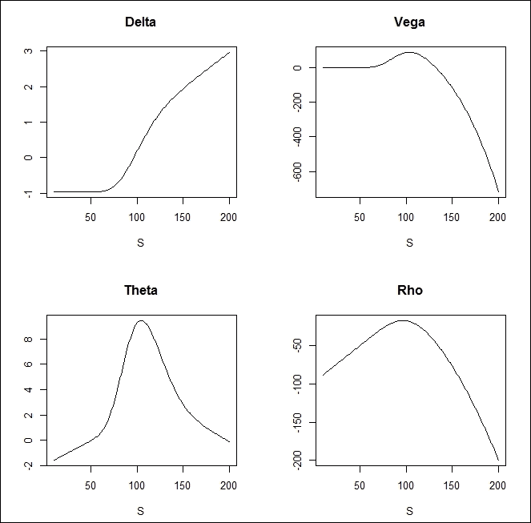

# 定价双重无触碰期权

双重无触碰（DNT）期权是一种二元期权，在到期时支付固定现金金额。不幸的是，`fExoticOptions`包目前没有此期权的公式。我们将展示两种不同的定价方式来定价 DNT，其中包含两种不同的定价方法。在本节中，我们将使用`dnt1`作为第一个方法的函数名，对于第二种方法，我们将使用`dnt2`作为函数名。

*Hui (1996)*展示了如何为单触及双障碍二元期权定价。在他的术语中，“单触及”意味着单一交易足以触发击穿事件，而“双障碍”二元期权意味着存在两个障碍，这是一种二元期权。我们称之为 DNT，因为它在外汇市场中被广泛使用。这是一个很好的例子，说明许多流行的另类期权有多种不同的名称。在*Haug (2007a)*中，Hui 公式已被转化为广义框架。*S*、*r*、*b*、*σ*和*T*的含义与第五章中的含义相同，*外汇衍生品*。K 表示支付金额（美元数额），而 L 和 U 分别是下限和上限障碍。

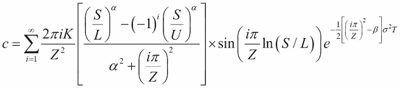

其中，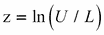，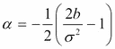，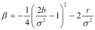。

将*Hui (1996)*函数实现到 R 中时，首先面临一个大问号：我们该如何处理无限级数？我们应该用多大的数字来替代无穷大？有趣的是，对于实际用途，像 5 或 10 这样的较小数字通常能够很好地充当无穷大的角色。*Hui (1996)*指出，大多数情况下收敛是快速的。我们对此有些怀疑，因为α将作为指数使用。如果 b 为负且σ足够小，公式中的*(S/L)^α*部分可能会成为问题。

首先，我们将尝试使用常规参数，看看收敛速度如何：

```py
dnt1 <- function(S, K, U, L, sigma, T, r, b, N = 20, ploterror = FALSE){
 if ( L > S | S > U) return(0)
 Z <- log(U/L)
 alpha <- -1/2*(2*b/sigma² - 1)
 beta <- -1/4*(2*b/sigma² - 1)² - 2*r/sigma²
 v <- rep(0, N)
 for (i in 1:N)
 v[i] <- 2*pi*i*K/(Z²) * (((S/L)^alpha - (-1)^i*(S/U)^alpha ) /
 (alpha²+(i*pi/Z)²)) * sin(i*pi/Z*log(S/L)) *
 exp(-1/2 * ((i*pi/Z)²-beta) * sigma²*T)
 if (ploterror) barplot(v, main = "Formula Error");
 sum(v)
}
print(dnt1(100, 10, 120, 80, 0.1, 0.25, 0.05, 0.03, 20, TRUE))

```

以下截图显示了前述代码的结果：

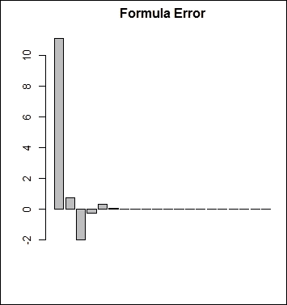

公式误差图表显示，在第七步之后，额外的步骤对结果没有影响。这意味着在实际应用中，可以通过计算前七步来快速估算无限级数。这看起来确实是一个非常快速的收敛。然而，这可能是纯粹的运气或巧合。

如果将波动率降至 3%会怎样？我们必须将 N 设置为 50 才能看到收敛：

```py
print(dnt1(100, 10, 120, 80, 0.03, 0.25, 0.05, 0.03, 50, TRUE))

```

上述命令给出的输出如下：

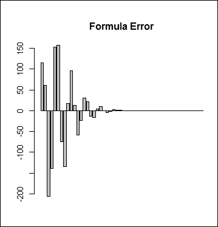

看起来不太令人印象深刻？50 步仍然不算太差。那如果将波动率降得更低呢？在 1%的波动率下，这些参数的公式会直接爆炸。首先，这看起来是灾难性的；然而，当我们使用 3%的波动率时，DNT 的价格已经是支付金额的 98.75%。逻辑上讲，DNT 价格应当是波动率的单调递减函数，因此我们已经知道，如果波动率低于 3%，DNT 的价格至少应该是 98.75%。

另一个问题是，如果我们选择极高的 U 或极低的 L，就会出现计算错误。然而，类似于波动性问题，常识在这里同样有效；如果我们将 U 提高或 L 降低，DNT 的价格应该会上升。

还有一个技巧。由于所有问题都来源于α参数，我们可以尝试将 b 设置为 0，这样α将等于 0.5。如果我们还将 r 设置为 0，DNT 的价格将随着波动率的下降而趋于 100%。

无论如何，每当我们用有限的和替代无限的和时，了解何时有效，何时无效总是很重要。我们编写了一个新代码，考虑到收敛并不总是迅速的。诀窍在于，只要最后一步产生了任何显著变化，函数就会计算下一步。对于所有参数来说，这仍然不是完全适用，因为对非常低波动性的情况没有解决办法，除非我们接受这样一个事实：如果隐含波动率低于 1%，这就是一个极端市场情形，在这种情况下，DNT 期权不应该通过这个公式来定价：

```py
dnt1 <- function(S, K, U, L, sigma, Time, r, b) {
 if ( L > S | S > U) return(0)
 Z <- log(U/L)
 alpha <- -1/2*(2*b/sigma² - 1)
 beta <- -1/4*(2*b/sigma² - 1)² - 2*r/sigma²
 p <- 0
 i <- a <- 1
 while (abs(a) > 0.0001){
 a <- 2*pi*i*K/(Z²) * (((S/L)^alpha - (-1)^i*(S/U)^alpha ) / (alpha² + (i *pi / Z)²) ) * sin(i * pi / Z * log(S/L)) * exp(-1/2*((i*pi/Z)²-beta) * sigma² * Time)
 p <- p + a
 i <- i + 1
 }
 p
}

```

现在我们有了一个不错的公式，可以绘制一些与 DNT 相关的图表，以便更熟悉这种期权。稍后，我们将使用一个特定的 AUDUSD DNT 期权，其参数如下：L 等于 0.9200，U 等于 0.9600，K（支付金额）等于 100 万美元，T 等于 0.25 年，波动率等于 6%，r_AUD 等于 2.75%，r_USD 等于 0.25%，b 等于-2.5%。我们将计算并绘制从 0.9200 到 0.9600 的所有可能的 DNT 值；每步为一个点（0.0001），因此我们将使用 2000 步。

以下代码绘制了基础资产价格的图表：

```py
x <- seq(0.92, 0.96, length = 2000)
y <- z <- rep(0, 2000)
for (i in 1:2000){
 y[i] <- dnt1(x[i], 1e6, 0.96, 0.92, 0.06, 0.25, 0.0025, -0.0250)
 z[i] <- dnt1(x[i], 1e6, 0.96, 0.92, 0.065, 0.25, 0.0025, -0.0250)
}
matplot(x, cbind(y,z), type = "l", lwd = 2, lty = 1,
 main = "Price of a DNT with volatility 6% and 6.5%
", cex.main = 0.8, xlab = "Price of underlying" )

```

以下输出是前述代码的结果：

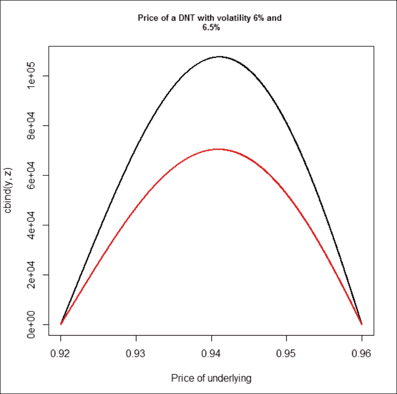

很明显，即使是波动性的小幅变化也会对 DNT 的价格产生巨大影响。通过查看这张图，我们可以直观地发现 vega 必须是负值。有趣的是，甚至仅仅快速浏览这张图，也足以让我们相信，当我们接近障碍时，vega 的绝对值在减少。

大多数终端用户认为最大风险是在现货接近触发点时。这是因为终端用户通常以二元的方式来考虑二元期权。只要 DNT 还有效，他们就会专注于积极的结果。然而，对于动态对冲者来说，当 DNT 的价值已经很小的时候，DNT 的风险就不那么引人关注了。

另一个非常有趣的现象是，由于 T-Bill 价格与波动性无关，并且 DNT + DOT = T-Bill 公式成立，因此波动性的增加将以完全相同的金额降低 DNT 的价格，就像它会增加 DOT 的价格一样。毫不奇怪，DOT 的 vega 应该是 DNT 的精确镜像。

我们可以使用`GetGreeks`函数来估算维加、伽玛、德尔塔和塞塔。对于伽玛，我们可以通过以下方式使用 GetGreeks 函数：

```py
GetGreeks <- function(FUN, arg, epsilon,...) {
 all_args1 <- all_args2 <- list(...)
 all_args1[[arg]] <- as.numeric(all_args1[[arg]] + epsilon)
 all_args2[[arg]] <- as.numeric(all_args2[[arg]] - epsilon)
 (do.call(FUN, all_args1) -
 do.call(FUN, all_args2)) / (2 * epsilon)
}
Gamma <- function(FUN, epsilon, S, ...) {
 arg1 <- list(S, ...)
 arg2 <- list(S + 2 * epsilon, ...)
 arg3 <- list(S - 2 * epsilon, ...)
 y1 <- (do.call(FUN, arg2) - do.call(FUN, arg1)) / (2 * epsilon)
 y2 <- (do.call(FUN, arg1) - do.call(FUN, arg3)) / (2 * epsilon)
 (y1 - y2) / (2 * epsilon)
}
x = seq(0.9202, 0.9598, length = 200)
delta <- vega <- theta <- gamma <- rep(0, 200)

for(i in 1:200){
 delta[i] <- GetGreeks(FUN = dnt1, arg = 1, epsilon = 0.0001, 
 x[i], 1000000, 0.96, 0.92, 0.06, 0.5, 0.02, -0.02)
 vega[i]  <-   GetGreeks(FUN = dnt1, arg = 5, epsilon = 0.0005, 
 x[i], 1000000, 0.96, 0.92, 0.06, 0.5, 0.0025, -0.025)
 theta[i] <- - GetGreeks(FUN = dnt1, arg = 6, epsilon = 1/365, 
 x[i], 1000000, 0.96, 0.92, 0.06, 0.5, 0.0025, -0.025)
 gamma[i] <- Gamma(FUN = dnt1, epsilon = 0.0001, S = x[i], K = 
 1e6, U = 0.96, L = 0.92, sigma = 0.06, Time = 0.5, r = 0.02, b = -0.02)
}

windows()
plot(x, vega, type = "l", xlab = "S",ylab = "", main = "Vega")

```

以下图表是上面代码的结果：

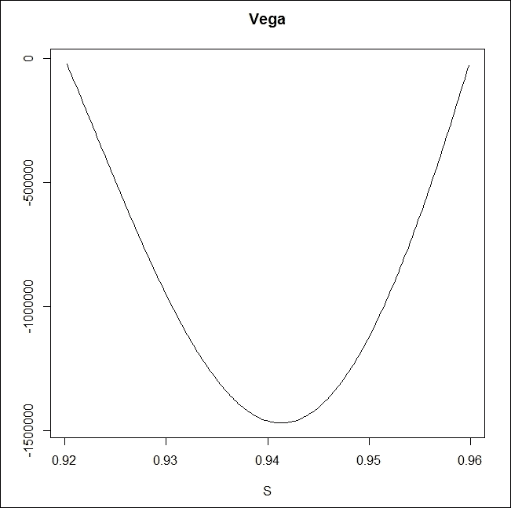

看过价值图表后，可以发现 DNT 的德尔塔值也与直觉非常接近；如果接近上边界，德尔塔变为负值；而接近下边界时，德尔塔变为正值，如下所示：

```py
windows()
plot(x, delta, type = "l", xlab = "S",ylab = "", main = "Delta")

```

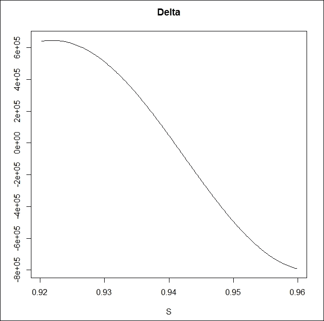

这真的是一种非凸的情况；如果我们想进行动态德尔塔对冲，肯定会亏钱。如果现货价格上涨，DNT 的德尔塔会减少，所以我们应该购买一些 AUDUSD 来对冲。然而，如果现货价格下跌，我们应该卖出一些 AUDUSD。想象一个场景，上午 AUDUSD 上涨 20 个点，下午又下跌 20 个点。对于动态对冲者来说，这意味着在价格上涨后购买一些 AUDUSD，然后在价格下跌后卖出同样数量的 AUDUSD。

德尔塔的变化可以通过伽玛描述，如下所示：

```py
windows()
plot(x, gamma, type = "l", xlab = "S",ylab = "", main = "Gamma")

```

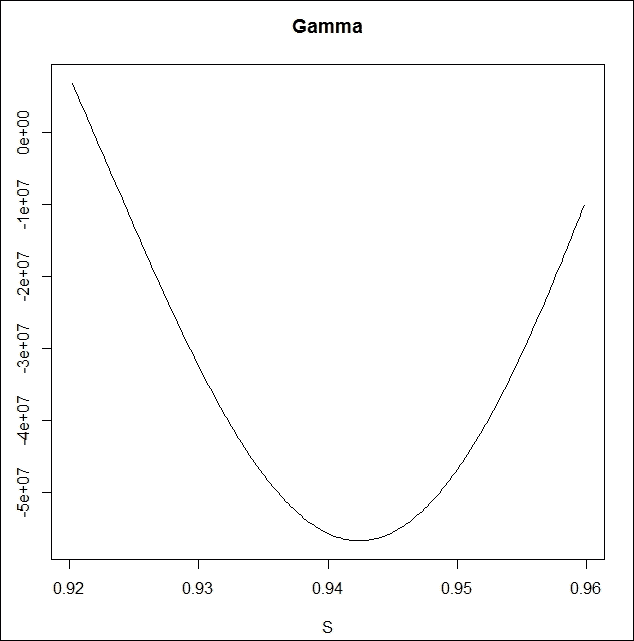

负伽玛意味着如果现货上涨，我们的德尔塔会减少；而如果现货下跌，我们的德尔塔会增加。这听起来并不理想。对于这种不方便的非凸情况，有一定的补偿，即塞塔值为正。如果没有其他变化，只有一天过去，DNT 将自动变得更值钱。

在这里，我们使用塞塔等于负 1 倍的偏导数，因为如果(T-t)是剩余时间，我们检查随着 t 增加一天，价值的变化：

```py
windows()
plot(x, theta, type = "l", xlab = "S",ylab = "", main = "Theta")

```

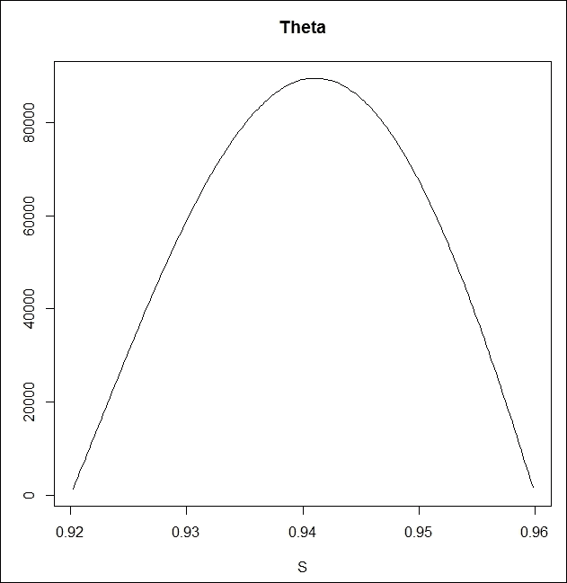

伽玛越负，塞塔越正。这就是时间如何弥补负伽玛可能带来的损失。

风险中性定价也意味着负伽玛应该由正塞塔进行补偿。这是 Black-Scholes 框架在普通期权中的主要信息，但同样适用于衍生品。参见*Taleb (1997)*和*Wilmott (2006)*。

我们之前已经介绍过 Black-Scholes 曲面；现在可以更详细地讨论。这个曲面也是一个很好的解释，说明了塞塔和德尔塔如何工作。它展示了期权在不同现货价格和到期时间下的价格，因此，这个曲面的斜率代表了一个方向上的塞塔和另一个方向上的德尔塔。代码如下：

```py
BS_surf <- function(S, Time, FUN, ...) {
 n <- length(S)
 k <- length(Time) 
 m <- matrix(0, n, k)
 for (i in 1:n) {
 for (j in 1:k) {
 l <- list(S = S[i], Time = Time[j], ...)
 m[i,j] <- do.call(FUN, l)
 }
 }
 persp3D(z = m, xlab = "underlying", ylab = "Time",zlab = "option price", phi = 30, theta = 30, bty = "b2")
}
BS_surf(seq(0.92,0.96,length = 200), seq(1/365, 1/48, length = 200),dnt1, K = 1000000, U = 0.96, L = 0.92, r = 0.0025, b = -0.0250,sigma = 0.2)

```

上面的代码给出了以下输出：

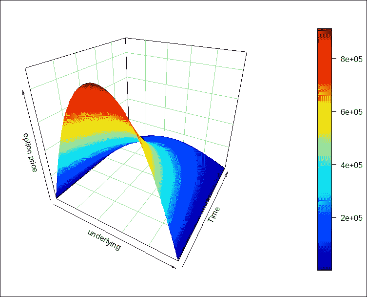

我们可以看到之前的猜测得到了验证；DNT 更倾向于时间流逝且现货价格接近(L,U)区间的中点。

# 另一种定价双无触及期权的方法

静态复制通常是最优雅的定价方式。无套利理论告诉我们，如果未来某一时刻，两组投资组合的价值必定相等，那么在此之前的任何时刻，它们的价格应该也相等。我们将展示如何利用双击敲出（DKO）期权来构建 DNT。我们需要用到一个技巧：执行价可以与某个障碍位相同。对于 DKO 看涨期权，执行价应低于上方障碍位，因为如果执行价不低于上方障碍位，DKO 看涨期权会在成为实值期权之前被敲出，因此该期权将毫无价值，因为没人能以实值行使它。然而，我们可以选择将执行价设为下方障碍位。对于看跌期权，执行价应高于下方障碍位，那为什么不将其设为上方障碍位呢？这样，DKO 看涨期权和 DKO 看跌期权将具有一个非常方便的特点：如果它们仍然有效，它们都会以实值到期。

现在，我们差不多完成了。我们只需要加上 DKO 价格，就能得到一份具有（U-L）美元支付的 DNT。由于 DNT 价格与支付金额是线性关系，我们只需要将结果乘以 K*(U-L)：

```py
dnt2 <- function(S, K, U, L, sigma, T, r, b) {

 a <- DoubleBarrierOption("co", S, L, L, U, T, r, b, sigma, 0,
 0,title = NULL, description = NULL)
 z <- a@price

 b <- DoubleBarrierOption("po", S, U, L, U, T, r, b, sigma, 0,
 0,title = NULL, description = NULL)
 y <- b@price

 (z + y) / (U - L) * K
}

```

现在，我们有两个函数可以进行结果比较：

```py
dnt1(0.9266, 1000000, 0.9600, 0.9200, 0.06, 0.25, 0.0025, -0.025)
[1] 48564.59

dnt2(0.9266, 1000000, 0.9600, 0.9200, 0.06, 0.25, 0.0025, -0.025)
[1] 48564.45

```

对于一份拥有 100 万美元应急支付且初始市场价值超过 48,000 美元的 DNT 来说，看到价格差仅为 14 美分是非常令人欣慰的。然而，从技术上讲，拥有第二个定价函数并不是很有帮助，因为低波动性也是`dnt2`面临的问题。

本章剩余部分我们将使用`dnt1`。

# 双触发期权的生命周期 - 一次模拟

DNT 价格在 2014 年第二季度是如何变化的？我们拥有 AUDUSD 的开盘-最高-最低-收盘类型的时间序列数据，频率为五分钟，因此我们知道所有的极端价格：

```py
d <- read.table("audusd.csv", colClasses = c("character", rep("numeric",5)), sep = ";", header = TRUE)
underlying <- as.vector(t(d[, 2:5]))
t <- rep( d[,6], each = 4)
n <- length(t)
option_price <- rep(0, n)

for (i in 1:n) {
 option_price[i] <- dnt1(S = underlying[i], K = 1000000, U = 0.9600, L = 0.9200, sigma = 0.06, T = t[i]/(60*24*365), r = 0.0025, b = -0.0250)
}
a <- min(option_price)
b <- max(option_price)
option_price_transformed = (option_price - a) * 0.03 / (b - a) + 0.92

par(mar = c(6, 3, 3, 5))
matplot(cbind(underlying,option_price_transformed), type = "l",
 lty = 1, col = c("grey", "red"),
 main = "Price of underlying and DNT",
 xaxt = "n", yaxt = "n",  ylim = c(0.91,0.97),
 ylab = "", xlab = "Remaining time")
abline(h = c(0.92, 0.96), col = "green")
axis(side = 2, at = pretty(option_price_transformed),
 col.axis = "grey", col = "grey")
axis(side = 4, at = pretty(option_price_transformed),
 labels = round(seq(a/1000,1000,length = 7)), las = 2,
 col = "red", col.axis = "red")
axis(side = 1, at = seq(1,n, length=6),
 labels = round(t[round(seq(1,n, length=6))]/60/24))

```

以下是前述代码的输出：

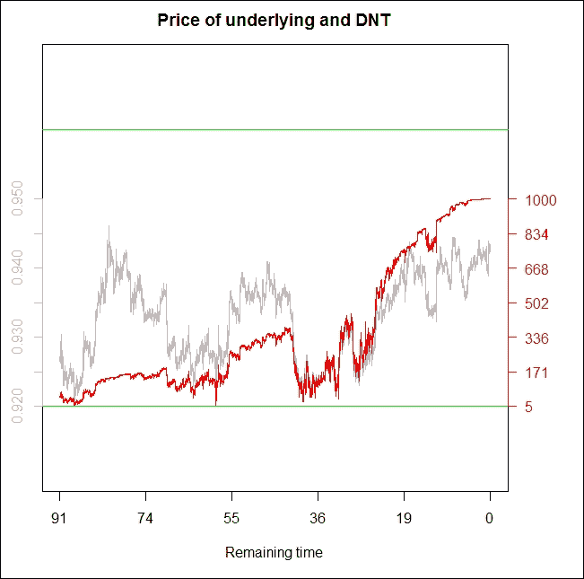

DNT 价格在右轴上以红色显示（单位为千分之一），而实际的 AUDUSD 价格在左轴上以灰色显示。绿色线条代表 0.9200 和 0.9600 的障碍位。图表显示，在 2014 年第二季度，AUDUSD 货币对在（0.9200; 0.9600）区间内交易，因此 DNT 的支付将为 100 万美元。这份 DNT 看起来是一个非常好的投资；然而，现实只是几乎无限多轨迹中的一个。它本来可能会发生得不一样。例如，在 2014 年 5 月 2 日，距离到期还有 59 天，AUDUSD 交易价为 0.9203，离下方障碍位仅差三点。当时，这份 DNT 的价格只有 5,302 美元，以下代码显示了这一点：

```py
dnt1(0.9203, 1000000, 0.9600, 0.9200, 0.06, 59/365, 0.0025, -0.025)
[1] 5302.213

```

将这 USD 5,302 与最初的 USD 48,564 期权价格进行比较！

在接下来的模拟中，我们将展示一些不同的轨迹。所有轨迹都从 4 月 1 日黎明时的 0.9266 AUDUSD 即期价格开始，我们将查看其中有多少轨迹保持在 (0.9200; 0.9600) 区间内。为了简化，我们将使用与定价 DNT 时相同的 6% 波动率来模拟几何布朗运动：

```py
library(matrixStats)
DNT_sim <- function(S0 = 0.9266, mu = 0, sigma = 0.06, U = 0.96,
 L = 0.92, N = 5) {
 dt <- 5 / (365 * 24 * 60)
 t <- seq(0, 0.25, by = dt)
 Time <- length(t)

 W <- matrix(rnorm((Time - 1) * N), Time - 1, N)
 W <- apply(W, 2, cumsum)
 W <- sqrt(dt) * rbind(rep(0, N), W)
 S <- S0 * exp((mu - sigma² / 2) * t + sigma * W )
 option_price <- matrix(0, Time, N)

 for (i in 1:N)
 for (j in 1:Time)
 option_price[j,i] <- dnt1(S[j,i], K = 1000000, U, L, sigma,
 0.25-t[j], r = 0.0025,
 b = -0.0250)*(min(S[1:j,i]) > L & max(S[1:j,i]) < U)

 survivals <- sum(option_price[Time,] > 0)
 dev.new(width = 19, height = 10)

 par(mfrow = c(1,2))
 matplot(t,S, type = "l", main = "Underlying price",
 xlab = paste("Survived", survivals, "from", N), ylab = "")
 abline( h = c(U,L), col = "blue")
 matplot(t, option_price, type = "l", main = "DNT price",
 xlab = "", ylab = "")}

set.seed(214)
system.time(DNT_sim())

```

以下是前述代码的输出：

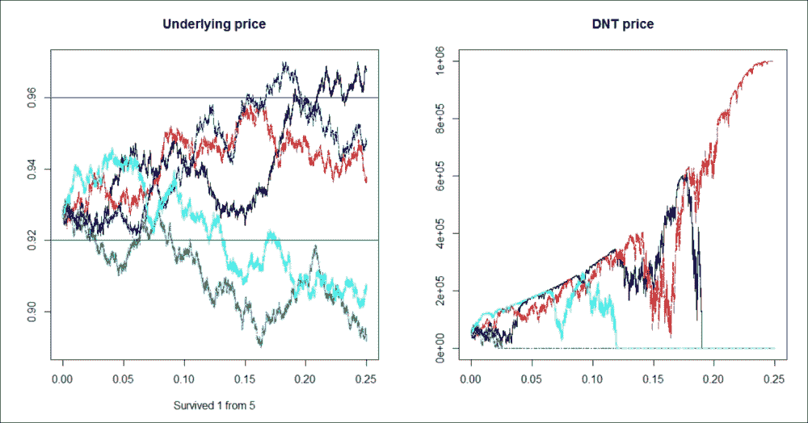

在这里，唯一存活的轨迹是红色的；在所有其他情况下，DNT 要么触碰到上界，要么触碰到下界。`set.seed(214)` 这一行确保了每次运行时模拟结果都是一致的。五分之一的存活率还不算太差；它表明对于没有进行动态对冲的最终用户或赌徒来说，这个期权的估算价值大约是支付额的 20%（尤其是在利率较低、货币时间价值不重要的情况下）。

然而，五条轨迹仍然太少，不能轻易得出结论。我们应该检查更多轨迹下的 DNT 生存率。

存活轨迹的比率可以作为该 DNT 在实际世界中的生存概率的良好估算；因此，它的最终用户价值。在迅速增加 N 的同时，我们应该记住这次模拟花费了多少时间。对于我的计算机，N = 5 时花费了 50.75 秒，N = 15 时花费了 153.11 秒。

以下是 N = 15 时的输出：

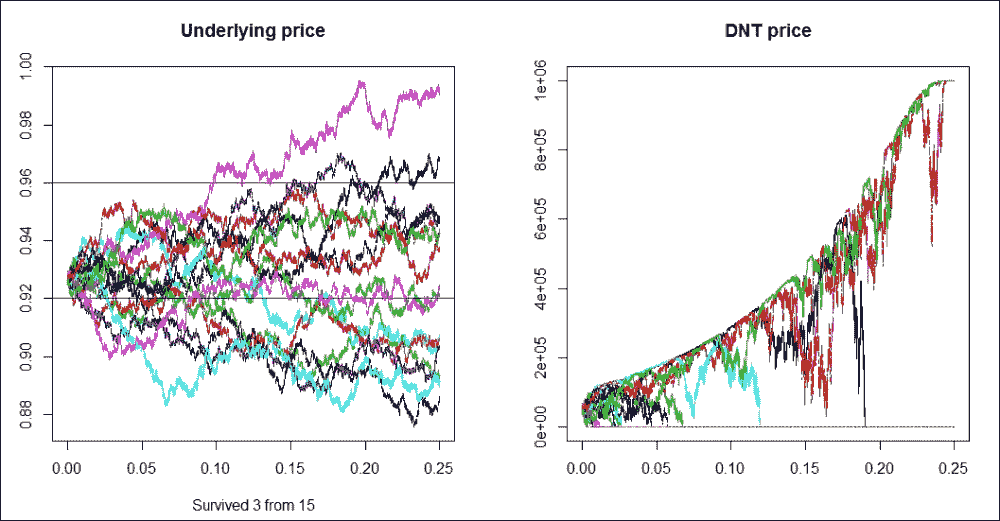

现在，15 条轨迹中有 3 条存活，因此估算的生存比率仍然是 3/15，等于 20%。看起来这是一个非常不错的产品；价格大约是支付额的 5%，而生存比率估算为 20%。出于好奇，运行一次 N 等于 200 的模拟。这应该会花费大约 30 分钟。

以下是 N = 200 时的输出：

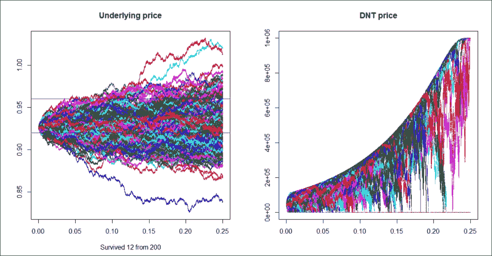

结果令人震惊；现在，200 条轨迹中只有 12 条存活，生存比率仅为 6%！因此，为了获得更好的结果，我们应该对更大的 N 进行模拟。

*伍迪·艾伦*（*Woody Allen*）执导的电影 *Whatever Works*（由拉里·大卫主演）长 92 分钟；在模拟时间中，这相当于 N = 541。对于这个 N = 541，只有 38 条轨迹存活，生存比率为 7%。

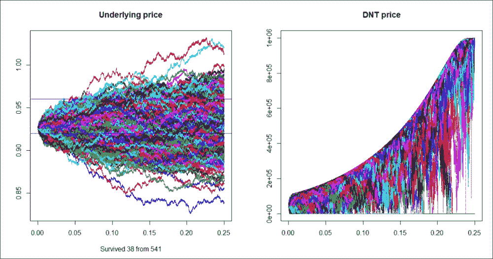

那么，真正的预期存活比率是多少？是 20%、6%还是 7%？我们现在根本不知道。数学家提醒我们，大数法则要求较大的样本量，其中“较大”远远超过 541，因此，建议在时间允许的情况下，尽可能使用更大的 N 来运行这个模拟。当然，获取更好的计算机也有助于在相同的时间内进行更多的 N。无论如何，从这个角度看，*Hui（1996）* 相对较快收敛的 DNT 定价公式得到了些许尊重。

到目前为止，我们使用了与模拟中相同的随机过程进行定价。常识告诉我们，在某些情况下，市场隐含波动率可能会偏高或偏低于预期波动率。毫不奇怪，在这两种条件下运行模拟，N = 200 和 sigma = 5.5%的情况下，结果是更多的存活轨迹，15 条轨迹来自这个种子。而在 N = 200 和 sigma = 6.5%的情况下，结果是较少的存活轨迹：这个种子只有九条轨迹。这再次以非常直观的方式显示了 vega 的高影响力。存活轨迹的数量，可能是 9、12 或 15，主要取决于过程的波动性。存活率为 4.5%、6%或 7.5%。这也引发了一个更哲学性的问题：那风险溢价呢？如果市场需要 vega，可能会出现即使我们预期波动率为 5.5%，也能基于 6%波动率购买 DNT 的情况。在一些紧张的情况下，市场可能真的很渴望 vega。在这些情况下，风险溢价是包含在内的。

衍生品定价总是假设动态对冲，因为我们在寻找这种工具的边际生产成本，然后使用无套利理论。实际上，一些市场参与者正在尝试实施这一策略，并成为衍生品的供应商，就像工厂一样。他们愿意接受任何交易的一方，因为通过几乎持续的动态对冲，他们将消除几乎所有的风险。他们就是市场做市商。然而，并非所有市场参与者都是衍生品工厂；其中有许多人故意寻求敏感性，因此，他们并没有对冲他们的衍生品头寸。第二组被称为市场接受者或终端用户。他们中的一些人寻找敏感性，因为他们已经有了一些，并希望减少这些（自然对冲者）。另一些人最初没有任何敏感性，但希望进行金融投机（投机者）。

有趣的是，衍生品的价格和最终用户的价值之间可能存在显著差异。通过购买 DNT，最终用户可以进行投注，最终要么什么都得不到，要么赢得比最初价格更多的收益。那么，这个赌注是否存在风险溢价，还是类似于赌场？DNT 的实际预期值是否高于风险中性预期值（即价格）？使用价值或“用户体验”可能会有所不同，因为做市商将根据隐含波动率报价。在市场紧张的情况下，对 Vega 的需求可能会推动其价格（即隐含波动率）高于预期波动率。

在这种情况下，任何仍然能够卖出波动率的人都会获得溢价。对于 DNT 来说，获得溢价意味着它的价格将低于其实际预期支付的价值。

那么，**双触及期权（DOT）**怎么样呢？由于国库券可以看作是 DNT 和 DOT 的总和，如果 DNT 太便宜，则 DOT 一定会太贵。因此，这些异国期权是对波动率的简单投注；如果投机者认为波动率会显著低于隐含波动率，那么购买 DNT 是一种直接的投注。如果投机者预期波动率高于隐含波动率，则 DOT 是合适的投注方式。

从这个角度来看，DNT（双触及期权）类似于一个短跨式期权，而 DOT（双触及期权）则类似于一个长跨式期权；然而，二元期权更容易调整到所需的规模。一个长跨式期权由同等规模、行权价和到期日的长看涨期权和长看跌期权组成。短跨式期权则是镜像：短看涨期权和短看跌期权。一个跨式期权与宽跨式期权非常相似，唯一的区别在于看涨期权的行权价高于看跌期权的行权价。相比于短跨式期权或宽跨式期权，购买 DNT 进行波动率投注要方便得多，因为持有一个长 DNT 期权头寸不需要进一步的抵押调整。DNT 是一种高度杠杆化的产品；然而，最大损失金额已经提前支付，因此它适合在线交易平台的菜单，其中典型客户是小型零售投机者。

基于这一逻辑，风险溢价只会归那些愿意采取不利于其他市场参与者的头寸的玩家。如果波动率需求增加，那么 DNT 将包含风险溢价，但如果波动率供应增加，则 DOT 将包含风险溢价。也有可能市场处于稳定的均衡状态，既没有 DNT 也没有 DOT 包含任何风险溢价。

# 嵌入结构化产品中的异国期权

大多数情况下，复杂期权以伪装的方式进行交易；它们被嵌入到结构化债券或证书中。复杂的行为被转化为一种更加用户友好的语言，普通投资者更容易理解。例如，二元支付可以转化为票息收益；如果条件允许二元期权支付收益，投资者将获得更高的票息。包含敲出期权的结构可以被称为气囊证书，因为只要长期 KO 期权没有被敲出，它就能提供一些对抗市场损失的保护，类似于气囊在较轻微事故中保护驾驶员。

另一个例子是涡轮证书，它通常只是深度实值行权价的敲出期权的证券化形式，敲出点接近行权价。回望期权可以在与股票指数极端值挂钩的资本保障型产品中找到。

作为一个数值示例，我们来看一份三个月到期的定期存单（CD），它根据外汇市场的表现，支付 3%的票息或 0%。这种资本保障型产品可以看作是国债票据和二元期权的组合。如果这只三个月的国债票据能以 99.75%的价格购买，那么每一美元上有 0.25 美分可以用来购买二元期权。到期时的资本将由国债票据部分提供，而二元期权将负责支付有条件的 3%票息。

此时，任何二元期权都能起作用；购买 DNT 也可以，但参数太多。银行必须精细调整所有参数，以使整个结构对投资者有吸引力。在市场做市商的风险中性世界里，一个触发点为 L=0.9200、3 个月到期的期权与 L=0.9195、略长于 3 个月到期的期权几乎相同：

```py
dnt1(0.9266, 1000000, 0.9600, 0.9200, 0.06, 90/365, 0.0025, -0.025)
[1] 50241.58
dnt1(0.9266, 1000000, 0.9600, 0.9195, 0.06, 94/365, 0.0025, -0.025)
[1] 50811.61

```

这是期权中一个非常常见的特征，包括敲出事件；额外的时间通常可以补偿将障碍进一步推离现货价格的行为。在风险中性世界中，S/L 距离总是被一个因子所除，因此存在权衡；我们可以降低 L，但作为交换，我们应该增加到期时间。在现实世界中，最终用户的预期是由他们的主观或感知概率驱动的。假设我们不打算动态对冲我们的 DNT，我们更倾向于选择 L = 0.9195 和 T = 94 天，而不是 L = 0.9200 和 T = 90 天。

这就是为什么 L、U 和 T 应设置为有利于让产品对最终用户具有吸引力的方式。而且，如果复杂期权嵌入到某个结构中，结构本身也应当容易销售。最终，大多数结构将被切分成更小的零售化产品，如 1000 美元的名义金额。当然，每一份“蛋糕”将是相同的，因此对银行来说，它可以看作是一个巨大的产品。

回到设置 L、U 和 T 的问题，我们很容易看出，DNT 的价格是 L、U 和 T（以及波动率）的严格单调函数。在特定的市场条件下（S、r、b 和波动率），假设我们设置 L = 0.9195 和 T = 94 天。现在，我们可以提出以下反向定价问题：对于什么 U，DNT 的价格将是支付金额的 33%？

这将是隐含的上限障碍，所谓隐含是指价格已经给定。这里有一个奇怪的答案：并不确定是否存在这样的隐含 U！这是因为如果我们开始增加上限障碍，DNT 的价格将收敛于无触及（No-Touch，NT）期权的价格。如果这个 NT 的价值小于 33%，那么没有 U 能让我们的 DNT 价值达到 33%。我们使用`fExoticOptions`包中的`BinaryBarrierOption`函数来定价无触及期权，相关代码如下所示：

```py
dnt1(0.9266, 1000000, 1.0600, 0.9200, 0.06, 94/365, 0.0025, -0.025)
[1] 144702
a <- BinaryBarrierOption(9, 0.9266, 0, 0.9200, 1000000, 94/365, 0.0025, -0.025, 0.06, 1, 1, title = NULL, description = NULL)
(z <- a@price)
[1] 144705.3

```

在风险中性世界中，如果我们将 U 提高 1000 个点，它将变得几乎完全不相关，因此 DNT 的行为就像一个 NT。

因此，在这种情况下，如果我们希望 DNT 的成本为 33%，我们应该选择一个低于 0.9195 的 L。接下来，我们设置 L = 0.9095 并找到一个 U，使得 DNT 的价值为 33%。在这一部分结束时，我们将展示如何使用`implied_U_DNT`函数来找到隐含的 U，相关代码如下所示。现在，假设我们出于其他原因选择了 U = 0.9745。

```py
dnt1(0.9266, 100, 0.9705, 0.9095, 0.06, 90/365, 0.0025, -0.025)
[1] 31.44338

```

这个 DNT 只需要支付 31.44%的支付金额，因此银行仍然有一定的空间从所有辛苦的结构工作中获得一些利润。假设银行能够销售总计 1 亿美元的这种 CD，那么 3 个月后，银行必须向客户支付 1 亿美元（年利率 0%）或 1.0075 亿美元（大约年利率 3%）。这个或有承诺可以通过购买 1 亿美元名义的国库券和支付 75 万美元的 DNT 期权进行对冲。最初，这些工具的成本是银行*99.75%*100.000.000+31.44338%*750.000 = 99.985.825,35 美元*；因此，银行获利 14,174.65 美元。

在其他情况下，隐含的到期时间可能是一个有趣的问题。在特定的市场条件下（当 S、r、b 和波动率已知）对于给定的（L，U）对，什么是能让 DNT 成本达到 50%的 T？即使对于一个非常紧密的（L-U）区间，我们也能找到一个足够小的 T，使得 DNT 的价格达到 50%；反之亦然；即使是一个非常宽的（L，U）对，只要有足够的时间，DNT 的价值也会降到 50%。请参见本节末尾的*implied_T_DNT*。

与 L、U 或 T 不同，我们不能故意选择波动率参数；然而，计算隐含波动率对于定价其他衍生品可能是有用的。这是一个关键的定价概念；风险中性定价基于比较。如果我们知道一个 DNT 期权的价格（以及所有其他参数），我们就可以找出用于定价的波动率。请参见本节末尾的*implied_vol_DNT*。

接下来，我们将展示许多隐含函数，并最终绘制隐含图表：

```py
implied_DNT_image <- function(S = 0.9266, K = 1000000, U = 0.96,
 L = 0.92, sigma = 0.06, Time = 0.25, r = 0.0025, b = -0.0250) {
 S_ <- seq(L,U,length = 300)
 K_ <- seq(800000, 1200000, length = 300)
 U_ <- seq(L+0.01, L + .15, length = 300)
 L_ <- seq(0.8, U - 0.001, length = 300)
 sigma_ <- seq(0.005, 0.1, length = 300)
 T_ <- seq(1/365, 1, length = 300)
 r_ <- seq(-10, 10, length = 300)
 b_ <- seq(-0.5, 0.5, length = 300)

 p1 <- lapply(S_, dnt1, K = 1000000, U = 0.96, L = 0.92,
 sigma = 0.06, Time = 0.25, r = 0.0025, b = -0.0250)
 p2 <- lapply(K_, dnt1, S = 0.9266, U = 0.96, L = 0.92,
 sigma = 0.06, Time = 0.25, r = 0.0025, b = -0.0250)
 p3 <- lapply(U_, dnt1, S = 0.9266, K = 1000000, L = 0.92,
 sigma = 0.06, Time = 0.25, r = 0.0025, b = -0.0250)
 p4 <- lapply(L_, dnt1, S = 0.9266, K = 1000000, U = 0.96,
 sigma = 0.06, Time = 0.25, r = 0.0025, b = -0.0250)
 p5 <- lapply(sigma_, dnt1, S = 0.9266, K = 1000000, U = 0.96,
 L = 0.92, Time = 0.25, r = 0.0025, b = -0.0250)
 p6 <- lapply(T_, dnt1, S = 0.9266, K = 1000000, U = 0.96, L = 0.92, sigma = 0.06, r = 0.0025, b = -0.0250)
 p7 <- lapply(r_, dnt1, S = 0.9266, K = 1000000, U = 0.96, L = 0.92, sigma = 0.06, Time = 0.25,  b = -0.0250)
 p8 <- lapply(b_, dnt1, S = 0.9266, K = 1000000, U = 0.96, L = 0.92, sigma = 0.06, Time = 0.25, r = 0.0025)
 dev.new(width = 20, height = 10)

 par(mfrow = c(2, 4), mar = c(2, 2, 2, 2))
 plot(S_, p1, type = "l", xlab = "", ylab = "", main = "S")
 plot(K_, p2, type = "l", xlab = "", ylab = "", main = "K")
 plot(U_, p3, type = "l", xlab = "", ylab = "", main = "U")
 plot(L_, p4, type = "l", xlab = "", ylab = "", main = "L")
 plot(sigma_, p5, type = "l", xlab = "", ylab = "", main = "sigma")
 plot(T_, p6, type = "l", xlab = "", ylab = "", main = "Time")
 plot(r_, p7, type = "l", xlab = "", ylab = "", main = "r")
 plot(b_, p8, type = "l", xlab = "", ylab = "", main = "b")
}

implied_vol_DNT <- function(S = 0.9266, K = 1000000, U = 0.96, L = 0.92, Time = 0.25, r = 0.0025, b = -0.0250, price) {
 f <- function(sigma)
 dnt1(S, K, U, L, sigma, Time, r, b) - price
 uniroot(f, interval = c(0.001, 100))$root
}

implied_U_DNT <- function(S = 0.9266, K = 1000000, L = 0.92, sigma = 0.06, Time = 0.25, r = 0.0025, b = -0.0250, price = 4) {
 f <- function(U)
 dnt1(S, K, U, L, sigma, Time, r, b) - price
 uniroot(f, interval = c(L+0.01, L + 100))$root
}
implied_T_DNT <- function(S = 0.9266, K = 1000000, U = 0.96, L = 0.92, sigma = 0.06, r = 0.0025, b = -0.0250, price = 4){
 f <- function(Time)
 dnt1(S, K, U, L, sigma, Time, r, b) - price
 uniroot(f, interval = c(1/365, 100))$root
}
library(rootSolve)
implied_DNT_image()
print(implied_vol_DNT(price = 6))
print(implied_U_DNT(price = 4))
print(implied_T_DNT(price = 30))

```

以下是前面代码的输出：

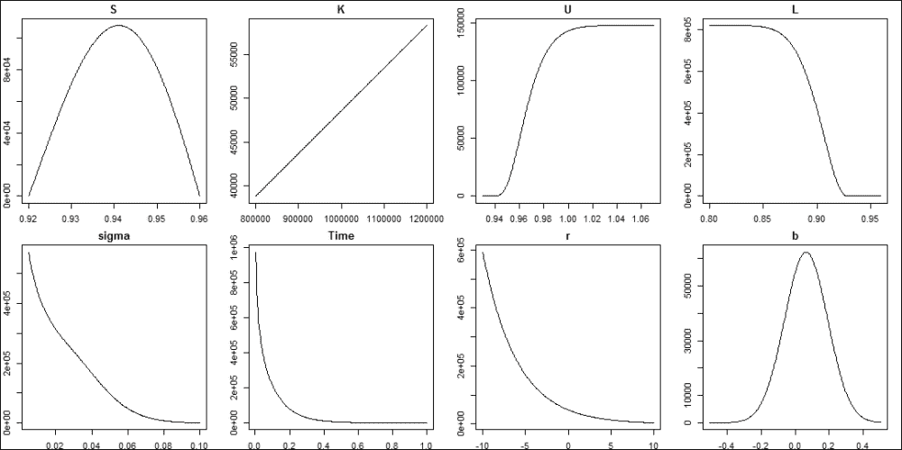

# 总结

我们在本章开始时介绍了奇异期权。在简要的理论总结中，我们解释了奇异期权和普通期权是如何相互关联的。奇异期权有很多类型。我们展示了一种与`fExoticOptions`包一致的分类方法。我们展示了如何构建 Black-Scholes 表面（一个三维图表，包含依赖于时间和标的价格的衍生品价格），适用于任何定价函数。

奇异期权的定价只是第一步。市场做市商在他们的交易簿中持有成千上万种不同的期权。这只有在每个期权可以分解为某些敏感度（即所谓的希腊字母）时才有可能。作为偏导数，希腊字母具有可加性；因此，衍生品组合的希腊字母之和等于其组成部分的希腊字母之和。下一步是估算任何衍生品定价函数的希腊字母。我们的方法可以根据实际市场情况进行校准；对于许多参数，我们已经知道最小的变化量。例如，银行间 AUDUSD 外汇汇率的最小变化是 0.0001。即使是多个偏导数，比如 gamma 或 vanna，也可以通过这种数值方法计算出来。

在本章的下半部分，我们集中讨论了一种特殊的奇异期权：双无触（DNT）二元期权。之所以专注于 DNT 期权，主要是因为 DNT 期权的流行性，以及它们中包含的许多技巧，这些技巧对许多其他类型的奇异期权也具有参考意义。我们展示了两种定价 DNT 期权的方法。首先，我们实现了*Hui (1996)*的封闭形式解，其中价格是一个无限级数的结果。收敛速度通常非常快，但这并非总是如此。我们展示了一种实际的方法，说明如何在不浪费太多计算时间的情况下处理收敛问题。定价 DNT 的另一种方式是通过静态复制，一个 DKO 看涨期权和一个 DKO 看跌期权来实现。为了定价这些 DKO 期权，我们使用了`fExoticOptions`包。我们发现两种 DNT 定价方法的结果几乎没有区别。

我们通过使用 2014 年第二季度的 AUDUSD 外汇汇率的 5 分钟频率开盘-最低-最高-收盘类型时间序列，展示了 DNT 期权在实际数据中的表现。我们通过模拟估算了 DNT 的生存概率，以展示如何根据波动率的供需紧张情况将风险溢价纳入 DNT 或 DOT 中。最后，我们展示了一些实用的微调方法，通过引入函数来找到隐含参数，以便在构建结构化产品时找到具有特定价格的 DNT 的缺失参数。

# 参考文献

+   **Black, F. 和 Scholes, M. [1973]**: *期权定价与企业负债*，《政治经济学杂志》，81(3)，第 637-654 页

+   **Carr, P., Ellis, K. 和 Gupta, V. [1998]**: *外来期权的静态对冲*，《金融学杂志》，53，第 1165-1190 页

+   **Derman, E., Ergener, D. 和 Kani, I. [1995]**: *静态期权复制*，《衍生品杂志》，2(4)，第 78-95 页

+   **DeRosa, D. F. [2011]**: *外汇期权*。Wiley Finance

+   **Haug, E. G. [2007a]**: *期权定价公式完全指南*，第二版。麦格劳-希尔公司

+   **Haug, E. G. [2007b]**: *衍生品模型的模型*。John Wiley & Sons

+   **Hui, C. H. [1996]**: 单触式双障碍二元期权价值，《应用金融经济学》，1996 年，第 6 期，第 343-346 页

+   **Merton, R. [1973]**: *理性期权定价理论*，《贝尔经济学与管理科学杂志》，4(1)，第 141-183 页

+   **Taleb, N. N., [1997]**: *动态对冲*。John Wiley & Sons

+   **Wilmott, P., [2006]**: *量化金融*，第二版。John Wiley & Sons
