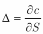
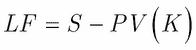
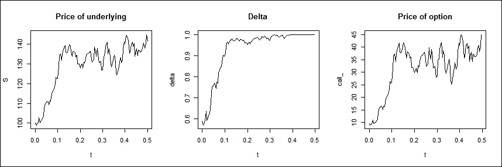
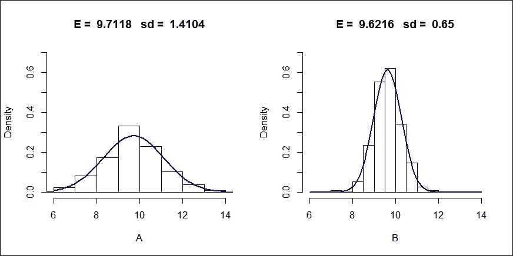
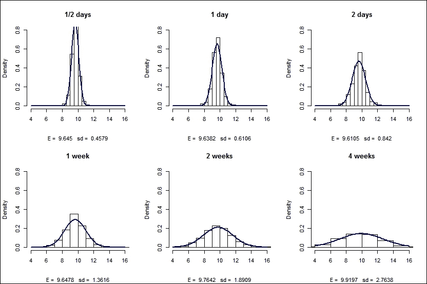
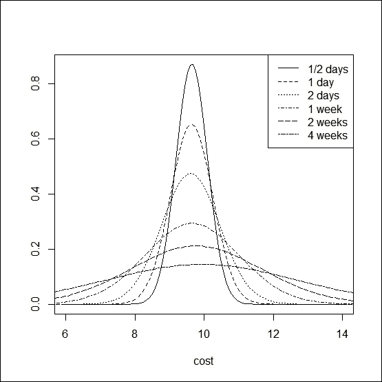
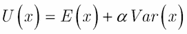
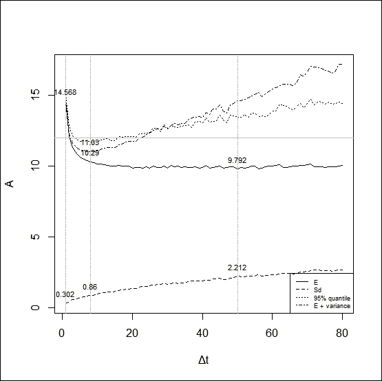
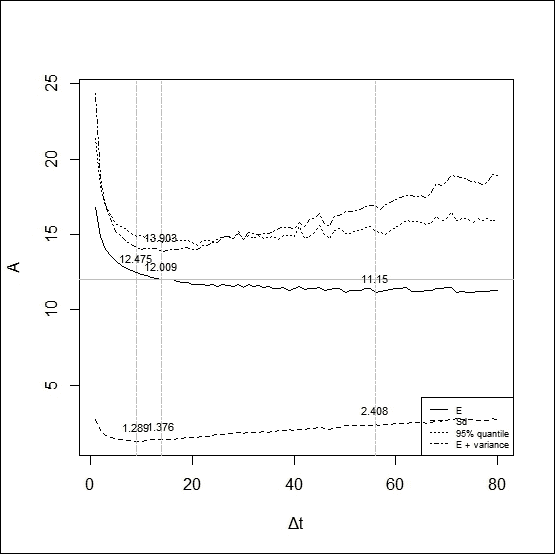

# 第八章：最优对冲

在前几章讨论了理论背景后，我们将重点讨论衍生品交易中的一些实际问题。

衍生品定价，如*Daróczi 等人（2013）*所详细描述，第六章，*衍生品定价*，基于一个由交易证券组成的复制组合，该组合提供与衍生品资产相同的现金流。换句话说，衍生品的风险可以通过持有一定数量的基础资产和无风险债券来完美对冲。远期和期货合约可以静态对冲，而期权的对冲则需要不时地重新平衡组合。**布莱克-舒尔斯-默顿（BSM）**模型（*布莱克和舒尔斯，1973*，*默顿，1973*）所呈现的完美动态对冲在现实中存在一些局限性。

本章中，我们将深入探讨静态和动态环境下衍生品的对冲细节。将介绍离散时间交易的效果以及交易成本的存在。在离散时间对冲的情况下，期权的合成复制成本变得具有随机性；因此，风险和交易成本之间存在显著的权衡。最优对冲期根据优化的不同目标来推导，并且不仅受到市场因素的影响，还受到投资者特定参数（如风险厌恶）的影响。

# 衍生品的对冲

对冲是指创建一个能够抵消原始风险敞口的组合。由于风险是通过未来现金流的波动来衡量的，因此对冲的目标通常是减少整个组合价值的方差。*Daróczi 等人（2013）*的第一章提出了在存在基差风险的情况下的最佳对冲决策，即对冲工具与待对冲头寸不同。这种情况通常发生在商品风险对冲中，因为商品是在交易所交易的，交易所只提供标准化的（到期日、数量和质量）合约。

最优对冲比率是对冲工具占风险敞口的比例，其目的是最小化整个头寸的波动性。在本章中，我们将讨论衍生品头寸的对冲，假设基础资产也在场外交易市场交易；因此，风险敞口和对冲衍生品之间不会存在不匹配，也就不会产生基差风险。

## 衍生品的市场风险

远期或期货合约的价值取决于基础资产的现货价格、到期时间、无风险利率和行权价格；对于普通期权，基础资产的波动率也会影响期权价格。该说法仅在基础资产在衍生品交易到期之前没有现金流（没有收入和没有成本）的情况下成立；否则，这些（包括收入和支出）现金流也会影响价格。为了简化起见，本文将假设没有现金流（如非分红股票）来讨论衍生品定价，尽管将模型扩展到其他基础资产（如货币和商品）时，公式需要做一些修改，但基本逻辑不受影响。由于行权价格在到期期间是稳定的，因此只有其他四个因素的变化才会导致衍生品价值的变化。衍生品对这些变量的敏感度通过希腊字母来表示，即根据给定变量的偏导数，详细内容请参见 *Daróczi 等人（2013）* 第六章，*衍生品定价*。

Black-Scholes-Merton 模型假设无风险利率和基础资产的波动率是常数，因此随着时间变化是确定性的，唯一影响衍生品价值的随机变量是基础资产的现货价格。由现货价格波动引发的风险可以通过持有确切的 delta 数量来消除，delta 是衍生品价格对基础资产现货价格的敏感度（见方程式 1）：



方程式 1

无论 delta 是否稳定或随时间变化，都取决于导数，并导致不同的（静态或动态）对冲策略（*Hull, 2009*）在以下章节中进行展示。

## 静态 delta 对冲

远期协议的对冲是直接的，因为它对双方都有约束力。处于长期远期头寸时，我们可以确定在到期时将会买入，而空头头寸则意味着将基础资产卖出。因此，我们可以通过按衍生品数量卖出（长期远期）或买入（短期远期）基础资产来完美对冲我们的远期头寸。我们可以通过对长期远期头寸的价值求导来检查远期的 delta。



方程式 2

这里，*LF* 代表长期远期，*S* 表示现货价格，*K* 是行权价格，即约定的远期价格。现值由 *PV* 表示。

所以 delta 等于 1，并且与实际市场状况无关。

然而，期货合约的价值是实际期货价格（*F*）与行权价格（*S*）之间的差异，因为有每日的头寸结算；因此，它的 delta 是 *F/S* 并且会随着时间变化。因此，可能需要稍微调整头寸，但在没有随机利率的情况下，delta 过程是可以预见的（*Hull, 2009*）。

## 动态 delta 对冲

对于期权来说，标的资产的交割是不确定的。它取决于持有多头头寸方的决定；即购买期权的一方。不出所料，前面提到的静态买入并持有策略无法对冲一个有条件的索赔。在二项式模型框架中，期权头寸总是对冲到下一个 *Δt* 时期，而在 Black-Scholes-Merton 模型中，*Δt* 收敛于零；因此，期权对冲头寸必须在每一时刻重新平衡。然而，在现实世界中，实际资产只能在离散的时间点进行交易，因此对冲投资组合也会在离散的时间点进行调整。让我们看一下这一点在一个普通的 **平价看涨期权（ATM）** 上的后果，该期权是在一个不支付股息的股票上写的。

R 包含一个名为 `OptHedge` 的包，用于估算期权的价值以及在离散时间间隔内对看涨和看跌期权的对冲策略；然而，我们的目的是展示交易周期长度的影响。因此，我们将使用我们自己的函数进行计算。

首先，我们安装要使用的包：

```py
install.packages("fOptions")
library(fOptions)

```

然后，我们可以使用已知的代码在选择的参数集上检查看涨期权的 BS 价格：

```py
GBSOption(TypeFlag = "c", S = 100, X = 100, Time = 1/2, r = 0.05, b = 0.05, sigma = 0.3)

```

我们根据 Black-Scholes 公式接收给定的参数和看涨期权的价格：

```py
Parameters:
 Value:
 TypeFlag c 
 S        100 
 X        100 
 Time     0.5 
 r        0.05 
 b        0.05 
 sigma    0.3 
Option Price:
 9.63487 

```

基于 BS 模型，看涨期权的价格为 9.63487。

在实际操作中，期权的价格通常在标准化市场上报价，而隐含波动率可以从 Black-Scholes 公式中推导出来。一个预期未来波动率低于隐含波动率的交易员，可以通过卖出期权并同时进行 delta 对冲来获利。在以下场景中，我们展示了在遵循 **几何布朗运动（GBM）** 的股票上，对前述期权的空头头寸进行 delta 对冲。我们假设 BSM 模型的所有假设成立，除了连续时间交易。为了对冲空头期权，我们需要持有 delta 数量的股票，随着 delta 的变化，我们需要定期重新平衡我们的投资组合，在以下情况中，每周重新平衡一次，这使得期权的生命周期内共有 26 次重新平衡。重新平衡的频率应根据标的资产的流动性和波动性进行调整。

让我们看一下股票价格的一个可能未来路径以及 delta 的发展。`price_simulation`函数使用给定参数生成价格过程：初始股价（*S[0]*），漂移（*mu*），GBM 过程的波动率（*sigma*）以及看涨期权的剩余参数（*K*，*Time*）和选定的再平衡周期（*Δt*）。在模拟现货价格过程后，该函数会计算每个中间日期的 delta 和期权价格，并绘制出来。通过使用`set.seed`函数，我们可以创建可重复的模拟：

```py
set.seed(2014)
library(fOptions)
Price_simulation <- function(S0, mu, sigma, rf, K, Time,  dt, plots = FALSE) {
 t <- seq(0, Time, by = dt)
 N <- length(t)
 W <- c(0,cumsum(rnorm(N-1)))
 S <- S0*exp((mu-sigma²/2)*t + sigma*sqrt(dt)*W)
 delta <- rep(0, N-1)
 call_ <- rep(0, N-1)
 for(i in 1:(N-1) ){
 delta[i] <- GBSGreeks("Delta", "c", S[i], K, Time-t[i], rf, rf, sigma)
 call_[i] <- GBSOption("c", S[i], K, Time-t[i], rf, rf, sigma)@price}
 if(plots){
 dev.new(width=30, height=10)
 par(mfrow = c(1,3))
 plot(t, S, type = "l", main = "Price of underlying")
 plot(t[-length(t)], delta, type = "l", main = "Delta", xlab = "t")
 plot(t[-length(t)], call_ , type = "l", main = "Price of option", xlab = "t")
 }
}

```

然后，我们设置函数的参数：

```py
Price_simulation(100, 0.2, 0.3, 0.05, 100, 0.5, 1/250, plots = TRUE)

```

我们将得到一个股票价格的潜在路径、实际 delta 以及相应的期权价格：



我们可以看到一个可能的未来场景，在这个场景中，现货价格上涨并迅速达到价内水平，因此期权在到期时被行使。看涨期权的 delta 随着股票价格的波动而变化，并最终收敛为 1。如果现货价格上涨，看涨期权的行使概率增加，为了复制看涨期权，我们需要买入更多股票，而股票价格下跌则导致 delta 降低，表明需要卖出股票。总的来说，当股票贵时我们买入，股票便宜时我们卖出。期权的价格源自对冲成本。再平衡周期越短，我们需要跟踪的价格变动越少。

对冲成本定义为购买和卖出股票所需的累计净成本的现值（参见*Hull, 2009*），以对冲该头寸。总成本将包括两部分：购买股票的金额和为融资该头寸所支付的利息。根据 BSM 模型，我们使用无风险利率进行复利计算。我们将看到，对冲成本依赖于未来价格的波动，通过模拟多个股票价格路径，我们可以绘制成本分布。更高的股票价格波动会导致更高的对冲成本波动。

`Cost_simulation`函数计算已卖出看涨期权的对冲成本：

```py
cost_simulation = function(S0, mu, sigma, rf, K, Time,  dt){
t <- seq(0, Time, by = dt)
N <- length(t)
W <- c(0,cumsum(rnorm(N-1)))
S <- S0*exp((mu-sigma²/2)*t + sigma*sqrt(dt)*W)
delta <- rep(0, N-1)
call_ <- rep(0, N-1)
for(i in 1:(N-1) ){
delta[i] <- GBSGreeks("Delta", "c", S[i], K, Time-t[i], rf, rf, sigma)
call_[i] <- GBSOption("c", S[i], K, Time-t[i], rf, rf, sigma)@price
}

```

在以下命令中，`share_cost`表示为了维持对冲头寸而购买基础资产的成本，`interest_cost`是融资该头寸的成本：

```py
share_cost <- rep(0,N-1)
interest_cost <- rep(0,N-1)
total_cost <- rep(0, N-1)
share_cost[1] <- S[1]*delta[1]
interest_cost[1] <- (exp(rf*dt)-1) * share_cost[1]
total_cost[1] <- share_cost[1] + interest_cost[1]
for(i in 2:(N-1)){
 share_cost[i] <- ( delta[i] - delta[i-1] ) * S[i]
 interest_cost[i] <- ( total_cost[i-1] + share_cost[i] ) * (exp(rf*dt)-1)
 total_cost[i] <- total_cost[i-1] + interest_cost[i] + share_cost[i]
 }
c = max( S[N] - K , 0)
cost = c - delta[N-1]*S[N] + total_cost[N-1]
return(cost*exp(-Time*rf))
}

```

我们可以使用前面定义的函数生成不同的未来价格过程，并基于此计算对冲的成本。向量**A**收集了几种可能的对冲成本，并绘制其直方图作为概率分布。接下来，我们介绍了每周（A）和每日（B）再平衡的对冲策略：

```py
call_price = GBSOption("c", 100, 100, 0.5, 0.05, 0.05, 0.3)@price
A = rep(0, 1000)
for (i in 1:1000){A[i] = cost_simulation(100, .20, .30,.05, 100, 0.5, 1/52)}
B = rep(0, 1000)
for (i in 1:1000){B[i] = cost_simulation(100, .20, .30,.05, 100, 0.5, 1/250)}
dev.new(width=20, height=10)
par(mfrow=c(1,2))
hist(A, freq = F, main = paste("E = ",round(mean(A), 4) ,"  sd = ",round(sd(A), 4)), xlim = c(6,14), ylim = c(0,0.7))
curve(dnorm(x, mean=mean(A), sd=sd(A)), col="darkblue", lwd=2, add=TRUE, yaxt="n")
hist(B, freq = F, main = paste("E = ",round(mean(B), 4) ,"  sd = ",round(sd(B), 4)), xlim = c(6,14), ylim = c(0,0.7))
curve(dnorm(x, mean=mean(B), sd=sd(B)), col="darkblue", lwd=2, add=TRUE, yaxt="n")

```

输出为生成的成本结果的直方图：



左侧的直方图显示每周策略的成本分布，而右侧的直方图则属于每日再平衡策略。

如我们所见，缩短*Δt*可以减少对冲成本的标准差，这表明更频繁的再平衡投资组合。值得注意的是，随着周期的缩短，不仅对冲成本的波动性降低，预期值也较低，接近 BS 价格。

## 比较 delta 对冲的表现

我们可以通过对成本仿真函数进行轻微修改，进一步研究再平衡周期的影响，这样可以选择相同的未来路径。通过这种方式，我们可以比较不同再平衡周期的策略。

delta 对冲的表现度量由*Hull (2009)*定义为写期权和对冲期权成本的标准差与期权理论价格的比率。

`Cost_simulation` 函数需要修改，以便我们可以一起计算多个再平衡周期：

```py
library(fOptions)
cost_simulation = function(S0, mu, sigma, rf, K, Time, dt, periods){
t <- seq(0, Time, by = dt)
N <- length(t)
W = c(0,cumsum(rnorm(N-1)))
S <- S0*exp((mu-sigma²/2)*t + sigma*sqrt(dt)*W)
SN = S[N]
delta <- rep(0, N-1)
call_ <- rep(0, N-1)
for(i in 1:(N-1) ){
delta[i] <- GBSGreeks("Delta", "c", S[i], K, Time-t[i], rf, rf, sigma)
call_[i] <- GBSOption("c", S[i], K, Time-t[i], rf, rf, sigma)@price
}
S = S[seq(1, N-1, by = periods)]
delta = delta[seq(1, N-1, by = periods)]
m = length(S)
share_cost <- rep(0,m)
interest_cost <- rep(0,m)
total_cost <- rep(0, m)
share_cost[1] <- S[1]*delta[1]
interest_cost[1] <- (exp(rf*dt*periods)-1) * share_cost[1]
total_cost[1] <- share_cost[1] + interest_cost[1]
for(i in 2:(m)){
 share_cost[i] <- ( delta[i] - delta[i-1] ) * S[i]
 interest_cost[i] <- ( total_cost[i-1] + share_cost[i] ) * (exp(rf*dt*periods)-1)
 total_cost[i] <- total_cost[i-1] + interest_cost[i] + share_cost[i]
 }
c = max( SN - K , 0)
cost = c - delta[m]*SN + total_cost[m] 
return(cost*exp(-Time*rf))
}

```

在以下命令中，修改后的`cost_simulation`函数用于不同的再平衡周期，并生成包含预期值(*E*)、置信区间上下限、对冲成本波动性(*v*)以及表现度量(*ratio*)的表格，按照六个再平衡周期（0.5 天、1 天、2 天、1 周、2 周、4 周）排序。我们还会得到两张图，分别是每个策略的直方图，以及包含拟合到分布的正态曲线的图表：

```py
dev.new(width=30,height=20)
par(mfrow = c(2,3))
i = 0
per = c(2,4,8,20,40,80)
call_price = GBSOption("c", 100, 100, 0.5, 0.05, 0.05, 0.3)@price
results = matrix(0, 6, 5)
rownames(results) = c("1/2 days", "1 day", "2 days", "1 week", "2 weeks", "4 weeks")
colnames(results) = c("E", "lower", "upper", "v", "ratio")
for (j in per){
 i = i+1
 A = rep(0, 1000)
 set.seed(10125987)
 for (h in 1:1000){A[h] = cost_simulation(100, .20, .30,.05, 100, 0.5, 1/1000,j)}
 E = mean(A)
 v = sd(A)
 results[i, 1] = E
 results[i, 2] = E-1.96*v/sqrt(1000)
 results[i, 3] = E+1.96*v/sqrt(1000)
 results[i, 4] = v
 results[i, 5] = v/call_price
 hist(A, freq = F, main = "", xlab = "", xlim = c(4,16), ylim = c(0,0.8))
 title(main = rownames(results)[i], sub = paste("E = ",round(E, 4) ,"  sd = ",round(v, 4)))
 curve(dnorm(x, mean=mean(A), sd=sd(A)), col="darkblue", lwd=2, add=TRUE, yaxt="n")
}
print(results)
dev.new()
curve(dnorm(x,results[1,1], results[1,4]), 6,14, ylab = "", xlab = "cost")
for (l in 2:6) curve(dnorm(x, results[l,1], results[l,4]), add = TRUE, xlim = c(4,16), ylim = c(0,0.8), lty=l)
legend(legend=rownames(results), "topright", lty = 1:6)

```

在我们的仿真模型中，输出结果如下：

```py
 E    lower     upper         v    ratio
1/2 days 9.645018 9.616637  9.673399 0.4579025 0.047526
1 day    9.638224 9.600381  9.676068 0.6105640 0,06337
2 days   9.610501 9.558314  9.662687 0.8419825 0,087389
1 week   9.647767 9.563375  9.732160 1.3616010 0,14132
2 weeks  9.764237 9.647037  9.881436 1.8909048 0,196256
4 weeks  9.919697 9.748393 10.091001 2.7638287 0,286857

```

随着我们更频繁地进行对冲仓位再平衡，对冲成本的标准差变小。在 95%显著性水平下，周度与月度再平衡之间的预期值差异也很明显。在较短周期中，我们没有发现预期值存在显著差异：



前面图像中显示的图表与之前的分析（周度和日度再平衡）相似，但这里我们有更多的再平衡周期。再平衡频率的影响通过对冲成本的分布表现出来。



我们可以在一张图表上比较给定再平衡周期的成本分布，如前面一节所示。

通过减少仿真次数，可以减少时间消耗。

# 在交易成本存在的情况下进行对冲

如前所述，增加投资组合调整次数会导致对冲成本波动性的降低。随着*Δt*趋近于 0，对冲成本接近于通过 BS 公式得出的期权价格。到目前为止，我们忽略了交易成本，但在这里我们去除这一假设，分析交易成本对期权对冲的影响。随着再平衡变得更加频繁，交易成本增加了对冲成本，但同时，更短的再平衡周期减少了对冲成本的波动性。因此，值得更详细地研究这一权衡，并基于此定义最优的再平衡策略。通过在定义函数时修改参数，可以在代码中添加绝对（每次交易固定）或相对（与交易规模成比例）的交易成本：

```py
cost_simulation = function(S0, mu, sigma, rf, K, Time, dt, periods, cost_per_trade)

```

然后，可以按如下方式编写绝对交易成本的计算方法：

```py
share_cost[1] <- S[1]*delta[1] + cost_per_trade
interest_cost[1] <- (exp(rf*dt*periods)-1) * share_cost[1]
total_cost[1] <- share_cost[1] + interest_cost[1]
for(i in 2:m){
 share_cost[i] <- ( delta[i] - delta[i-1] ) * S[i] + cost_per_trade
 interest_cost[i] <- ( total_cost[i-1] + share_cost[i] ) * (exp(rf*dt*periods)-1)
 total_cost[i] <- total_cost[i-1] + interest_cost[i] + share_cost[i]
 }

```

对于相对成本的情况，程序代码如下：

```py
share_cost[1] <- S[1]*delta[1]*(1+trading_cost)
interest_cost[1] <- (exp(rf*dt*periods)-1) * share_cost[1]
total_cost[1] <- share_cost[1] + interest_cost[1]
for(i in 2:m){
 share_cost[i] <- (( delta[i] - delta[i-1] ) * S[i]) + abs(( delta[i] - delta[i-1] ) * S[i]) * trading_cost
 interest_cost[i] <- ( total_cost[i-1] + share_cost[i] ) * (exp(rf*dt*periods)-1)
 total_cost[i] <- total_cost[i-1] + interest_cost[i] + share_cost[i]
}

```

在引用`cost_simulation`函数时，必须给定绝对或相对成本。让我们检查每次交易 0.02 的绝对成本的影响（我们假设成本单位与交易规模相同）。为了缩短时间消耗，这里仅使用了 100 条模拟路径。

我们需要在循环中更改`cost_simulation`函数的参数：

```py
for (i in 1:100)
 A[i] = cost_simulation(100, .20, .30,.05, 100, 0.5, 1/1000,j,.02)

```

然后，我们得到了如下所示的表格：

```py
 E     lower   upper          v      ratio
1/2 days 12.083775 11.966137 12.20141 0.6001933 0.06229386
1 day    10.817594 10.643468 10.99172 0.8883994 0.09220668
2 days   10.244342  9.999395 10.48929 1.2497261 0.12970866
1 week    9.993442  9.612777 10.37411 1.9421682 0.20157700
2 weeks  10.305498  9.737017 10.87398 2.9004106 0.30103266
4 weeks  10.321880  9.603827 11.03993 3.6635388 0.38023748

```

通过固定交易成本 0.02 计算时，预期的对冲成本大幅增加。最短的再平衡周期受影响最大，因为更多的交易会增加成本。标准差也更高，尤其是在周期短于一周的情况下。

我们可以通过在代码中应用以下更改，观察 1%的相对交易成本的影响：

```py
for (i in 1:100)
 A[i] = cost_simulation(100, .20, .30,.05, 100, 0.5, 1/1000,j, 0.01)

```

在最短（每日或更频繁）再平衡周期的情况下，预期的对冲成本进一步增加，但我们也发现波动性有了更显著的上升（如下所示的输出表格）：

```py
 E    lower    upper         v     ratio
1/2 days 13.56272  13.26897  13.85646 1.498715 0.1555512
1 day    12.53723  12.28596  12.78850 1.282005 0.1330589
2 days   11.89854  11.59787  12.19921 1.534010 0.1592144
1 week   11.37828  10.96775  11.78880 2.094506 0.2173881
2 weeks  11.55362  10.95111  12.15612 3.073993 0.3190487
4 weeks  11.43771  10.69504  12.18038 3.789128 0.3932724

```

交易成本的存在抵消了更频繁再平衡所带来的波动性降低效果，因此最优的再平衡周期需要通过权衡这些效果来确定。

## 对冲优化

为了找到最佳的再平衡周期长度，我们必须定义优化标准和需要最大化或最小化的度量。对冲的常见目标是减少风险，即通过对冲成本的方差来衡量的风险。因此，最优的对冲策略应最小化对冲成本的波动性。优化的另一个目标可以是最小化成本的期望值。正如我们所看到的，在没有交易成本的情况下，通过越来越频繁地调整对冲投资组合，这些目标是可以同时实现的。另一方面，交易成本不仅会提高成本的期望值，还会提高波动性，当再平衡过于频繁时，波动性可能会大幅上升。

在金融领域，这是一种广泛使用的方法，特别是在需要在期望值与波动性之间做出权衡时，以定义效用函数并将最优解设为最大效用。例如，在投资组合理论中，假定存在一个个人效用函数，该函数受到回报期望值的正向影响，并受到回报方差的负向影响。我们也可以通过定义一个包含对冲成本期望值及其方差的效用函数来运用相同的技巧。然而，在我们的案例中，两个因素都会对交易者的效用产生负面影响；因此，两个参数都必须具有正号，且该函数应被最小化。因此，目标函数将是以下所定义的效用函数：



方程 3

这里，*x* 是对冲成本作为一个随机变量，*E* 表示其期望值，*Var* 代表其方差，*α* 是风险厌恶参数。更高的 *α* 表示更为厌恶风险的投资者/交易者。

平均方差优化的替代方案可以是将期望（成本）值最小化作为主要目标，并设置边界条件，保持选定的风险度量低于预定值。在这里，我们选择了**在险价值**（Value-at-Risk，简称 VaR）作为控制变量，这是一种下行风险度量，定义为在预定概率下的最大损失或最坏结果，并且在选定的时间范围内计算。

以下代码通过 1,000 次模拟，计算了不同再平衡周期（1-80 *Δt*）下的成本分布。*Δt* 的单位是一天的四分之一，因此 *Δt* 为 1 表示每天四次再平衡；最长的 *Δt* 为 80，表示一个为期 20 天的周期。该函数收集期望值、标准差和分布的 95 百分位，并以文本格式给出四种不同优化情景的结果，同时绘制结果图表：

```py
n_sim <- 1000
threshold <- 12
cost_Sim <- function(cost = 0.01, n = n_sim, per = 1){a <- replicate(n, cost_simulation(100, .20, .30,.05, 100, 0.5, 1/1000,per,cost)); 
l <- list(mean(a), sd(a), quantile(a,0.95))}
A <- sapply(seq(1,80) ,function(per) {print(per); set.seed(2019759); cost_Sim(per = per)})
e <- unlist(A[1,])
s <- unlist(A[2,])
q <- unlist(A[3,])
u <- e + s²
A <- cbind(t(A), u)
z1 <- which.min(e)
z2 <- which.min(s)
z3 <- which.min(u)
 (paste("E min =", z1, "cost of hedge = ",e[z1]," sd = ", s[z1]))
 (paste("s min =", z2, "cost of hedge = ",e[z2]," sd = ", s[z2]))
 (paste("U min =", z3, "u = ",u[z3],"cost of hedge = ",e[z3]," sd = ", s[z3]))
matplot(A, type = "l", lty = 1:4, xlab = "Δt", col = 1)
lab_for_leg = c("E", "Sd", "95% quantile","E + variance")
legend(legend = lab_for_leg, "bottomright", cex = 0.6, lty = 1:4)
abline( v = c(z1,z2,z3), lty = 6, col = "grey")
abline( h = threshold, lty = 1, col = "grey")
text(c(z1,z1,z2,z2,z3,z3,z3),c(e[z1],s[z1],s[z2],e[z2],e[z3],s[z3],u[z3]),round(c(e[z1],s[z1],s[z2],e[z2],e[z3],s[z3],u[z3]),3), pos = 3, cex = 0.7)
e2 <- e
e2[q > threshold] <- max(e)
z4 <- which.min(e2)
z5 <- which.min(q)
if( q[z5] < threshold ){
print(paste(" min VaR = ", q[z4], "at", z4 ,"E(cost | VaR < threshold = " ,e[z4], " s = ", s[z4]))
 } else {
 print(paste("optimization failed, min VaR = ", q[z5], "at", z5 , "where cost = ", e[z5], " s = ", s[z5])) 
 }

```

最后的优化搜索的是在 VaR 在*q*显著性水平（*q*百分位数）不超过预定阈值的条件下，能够实现的最小成本。由于不一定存在此最小值，如果优化失败，则给出 q-VaR 的最小值作为结果。

## 绝对交易成本情况下的最优对冲

任务是寻找在交易成本情况下，针对已调查参数的普通看涨期权，最优的再平衡周期长度。假设每笔交易的交易成本为 0.01。

前面函数的输出是一个矩阵**A**，其中包含属于不同再平衡周期的分布参数，以及根据不同标准的最优解。

矩阵**A**的第一行和最后一行如下所示：

```py
 [,1]     [,2]      [,3]     [,4] 
 [1,] 14.568   0.3022379 15.05147 14.65935
 [2,] 12.10577 0.4471673 12.79622 12.30573
...
 [79,] 10.00434 2.678289  14.51381 17.17757
 [80,] 10.03162 2.674291  14.41796 17.18345

```

方括号中的数字表示以*Δt*为单位的再平衡周期。接下来的列包含了预期值、标准差、95 百分位数和预期值与标准差的和。四个优化过程的结果在下一个输出中总结：

```py
"E min = 50 cost of hedge =  9.79184040508574  sd =  2.21227796458088"
"s min = 1 cost of hedge =  14.5680033393436  sd =  0.302237879069942"
"U min = 8 u =  11.0296321604941 cost of hedge =  10.2898541853535  sd =  0.860103467694771"
" min VaR =  11.8082026178249 at 14 E(cost | VaR < threshold =  10.0172915117802  s =  1.12757856083913"

```

下图展示了再平衡周期（以*Δt*为单位）下的结果。虚线表示标准差，实线表示预期成本，而点划线和虚线分别表示效用函数（方程 3）在 alpha 参数为 1 和 95 百分位数时的值。

尽管优化依赖于参数，但该图表展示了在存在交易成本的情况下，预期成本与波动性之间的权衡：



预期成本的最小值（9.79）与 BS 价格 9.63 相差不远。此时，最优的再平衡周期为 50*Δt*，即 12.5 天。此时，标准差为 2.21。

波动性最小化导致最频繁的再平衡，这意味着每天进行 4 次再平衡；此时，标准差的最小值为 0.30，但频繁交易大幅增加了成本。预期成本为 14.57，比之前的情况高出约 50%。

基于方程 3 中定义的效用函数的优化模型考虑了对冲的两个方面，前面的输出显示 8 个*Δt*长的再平衡周期是最优的，即恰好 2 天。我们可以达到一个预期值为 10.29，这仅略微超过最小值，标准差为 0.86。

前述输出的最后一行展示了使用风险价值（Value-at-Risk）限制的优化结果。我们应用了 95%的 VaR，并在 95%的情况下寻找最小的预期成本，该成本始终低于 12。根据这一结果，最佳的调整周期为 14 *Δt*，即 3.5 天。此时，成本的预期值略低（10.02），与之前的情况相比，结果因标准差略高（1.13）而有所偏移。

## 相对交易成本下的最佳对冲

在这一部分，我们解决了与上一部分相同的优化问题，唯一的区别是交易成本现在为交易额的 1%。所有其他参数保持不变。

输出包含了矩阵**A**，其中数据相同：

```py
 [,1]     [,2]     [,3]     [,4] 
 [1,] 16.80509 2.746488 21.37177 24.34829
 [2,] 14.87962 1.974883 18.20097 18.77978
...
 [79,] 11.2743  2.770777 15.89386 18.9515 
 [80,] 11.31251 2.758069 16.0346  18.91945

```

由于成本与交易规模相关，我们不仅在预期值上得到了 U 型曲线，在标准差上也出现了 U 型曲线。这表明过于频繁的交易在波动率最小化方面也是不理想的。

与之前的优化相比，另一个主要区别是 VaR 的阈值无法保持（如下代码所示）：

```py
"E min = 56 cost of hedge =  11.1495374978655  sd =  2.40795704676431"
"s min = 9 cost of hedge =  12.4747301348104  sd =  1.28919873150291"
"U min = 14 u =  13.9033123535802 cost of hedge =  12.0090095949856  sd =  1.37633671701175"
"optimization failed, min VaR =  14.2623891995575 at 21 where cost =  11.7028044352096  s =  1.518297863428"

```

以下截图展示了前述命令的输出：



最低预期成本为 11.15，标准差为 2.41，发生在 56 *Δt*时，表明最佳的重新平衡周期为 14 天。

最低波动率为 1.23，在*Δt*为 9 时，预期值为 12.47。均值-方差优化结果显示，重新平衡周期为 14 *Δt*（3.5 天），标准差为 1.38，预期值为 12.01。

如前所述，第四次优化失败；95% VaR 的最小值为 14.26，这可以在 21 *Δt*（5.25 天）时实现；预期成本为 11.7，标准差为 1.52。

优化结果表明，在存在交易成本的情况下，单纯追求波动率降低会导致成本的巨大上升；因此，最佳的对冲策略还必须考虑这一影响。

# 进一步扩展

该模型可以通过研究其他价格过程进一步推广。金融资产的回报通常并非如 BSM 模型所假设的那样服从正态分布，而其尾部比高斯曲线预测的要粗。这一现象可以通过 GARCH 模型（广义自回归条件异方差模型）来描述，其中方差具有自相关性，导致波动率的聚集。另一种捕捉极端回报高概率的方法是将随机跳跃加入到过程中。将这些过程应用于模型将使衍生品的对冲成本进一步增加，从而提高预期值，并增加成本分布的方差。

我们可以看到，现货价格的变化会导致 delta 的变化，delta 的变化可以通过 gamma 来衡量，gamma 是期权价格相对于现货价格的第二导数。一个 gamma 中性组合无法仅通过持有期权和标的资产来实现，因为标的资产的 gamma 为零，但我们必须购买相同标的资产的任何到期日或行权价的期权。

此外，如果我们忽略波动率恒定的假设，衍生品的价值将不仅受到标的资产现货价格变化和剩余到期时间变化的影响，还会受到标的资产波动率变化的影响。波动率变化的影响可以通过 vega 来衡量，vega 是期权价格相对于波动率的第一导数。vega 值较高会导致波动率对期权价格的显著影响（*Hull, 2009*）。这可能导致一种情况：当标的资产价格上涨时，认购期权的价值应该增加，但隐含波动率却下降，这时期权的价格也可能下降。为了抵消 vega 的影响，可以购买相同标的资产的其他期权，或者我们可以使用一个名为 VIX 指数的指数来对冲波动率，VIX 是一个包含期权隐含波动率的交易指数。

本章致力于分析 delta 对冲；详细讲解 gamma 和 vega 的中和超出了我们的关注范围。

# 总结

在本章中，我们展示了对冲衍生品时遇到的一些实际问题。尽管 Black-Scholes-Merton 模型假设连续时间交易，从而导致对冲组合的连续再平衡且没有交易成本，但在实际中，交易发生在离散时间，并且确实存在交易成本。因此，对冲的成本取决于标的资产现货价格的未来路径；因此，它不再是分析公式所给出的单一值，而是一个可以通过其概率分布描述的随机变量。在本章中，我们模拟了不同的路径，计算了对冲成本，并展示了假设不同再平衡频率下的概率分布。我们发现，在没有交易成本的情况下，随着再平衡周期的缩短，波动性降低。另一方面，交易成本不仅可以提高对冲成本的期望值，还可以增加其方差。我们展示了几种优化算法，用于找到最佳对冲策略。

我们在 R 语言中创建了几个用户定义的函数，用于模拟价格波动并生成成本分布。最后，我们根据给定的优化模型应用了数值优化。

# 参考文献

+   **Black, F. 和 Scholes, M. [1973]**：《期权定价与公司负债》。《政治经济学杂志》，81(3)，第 637-654 页。

+   **霍尔, J. C. [2009]**: 《期权、期货与其他衍生品》。皮尔森，普伦蒂斯霍尔出版社。

+   **梅顿, R. [1973]**: 《理性期权定价理论》。*《贝尔经济学与管理科学杂志》*，4(1)，第 141-183 页。

+   **Száz, J [2009]**: 《外汇期权与股票期权定价》，Jet Set 出版社，布达佩斯。
