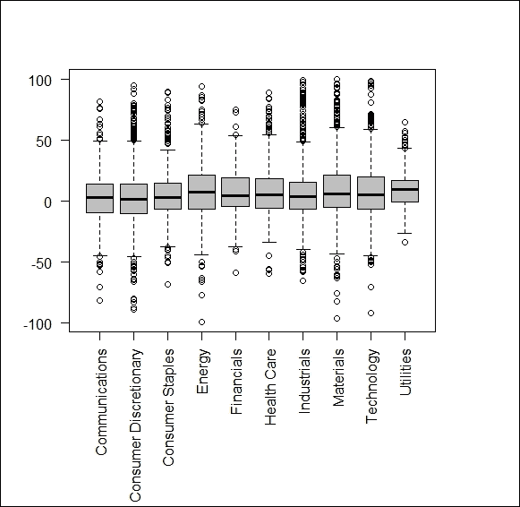
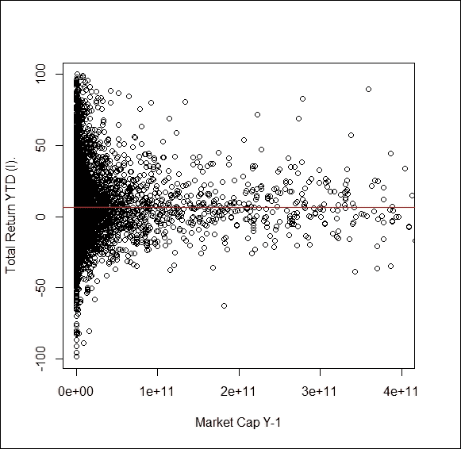
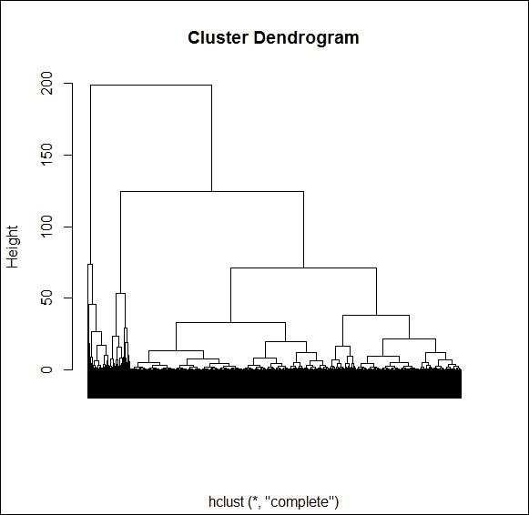
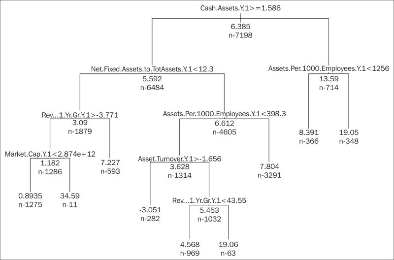
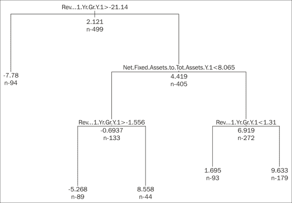

# 第九章 基本面分析

现在，全球金融危机似乎已经接近尾声，大多数投资者正在回归股票市场。在这样做的过程中，你面临着选择哪些股票在未来一段时间内将跑赢其他股票的问题。为了找到合适的投资资产进行购买，你有两个基本选择。一方面，你可以依赖于历史价格走势中的任何趋势和模式。在基于趋势和模式制定投资建议时，你进行的是技术分析。另一方面，你可以通过分析公司的财务表现、战略位置或未来计划，来判断哪些公司会超过市场表现。这就是基本面分析。

本章将帮助你了解如何使用 R 来识别成功的基本面交易策略，以进行股票投资。我们将从应用基本的统计方法开始，逐步过渡到更高级、更复杂的方法，同时讲解如何将你的基本面投资理念转化为可统计检验的假设。

# 基本面分析的基础

在寻找可能的投资资产时，市场为你提供了广泛的选择。你可以选择债券、艺术品、房地产、货币、商品、衍生品，或者可能是最著名的资产类别——股票。股票代表着对某个公司（发行人）一定部分的所有权。

然而，我们该买哪些股票呢？我们应在什么时候买进或卖出？这些决策至关重要，因为它们将决定你的投资组合的回报。对此问题有两种不同的观点。

技术分析建立在历史价格走势之上，并认为可以识别某些模式，这些模式有助于预测未来价格的变动。相反，基本面分析则侧重于公司及其所有权本身的价值，而不是它的市场价格。在这里，我们相信，迟早，市场价格必须反映股票的公允价值，而这种公允价值可以通过我们拥有股票时收集到的未来现金流来计算，就像任何其他类型的投资一样。

技术分析侧重于基于历史模式分析投资者行为如何推动未来价格变动，而基本面分析则识别出价格应该跟随的趋势，这些趋势源于对公司未来表现的预测。因此，在进行基本面分析时，我们需要回顾我们的公司财务和会计知识。

即使只是检查某只股票的公允价格，我们也可能花费数天时间来建模未来表现，估算销售增长、费用、投资、融资策略的变化和资本成本，以获取有效的折现率用于现金流预测。在开发交易策略时，我们需要审查数千个潜在投资项目，因此不可能做如此深入的分析。即使尝试也可能很棘手。如果你为所有股票建立大型电子表格模型，当你完成时，最初为第一家公司的假设可能已经过时，你不得不重新开始，而完全不考虑第一次版本模型的结果。因此，我们不能真正预测未来的财务报表，而必须基于历史经验来识别良好的投资模式。我们将尝试将之前的基本面比率与历史价格发展联系起来，并期望这些联系在未来也能成立。

这是理解的关键，我们不是要找到值得投资的好公司，而是要找到那些非常可能被错误定价的股票。所以，我们要找到被低估的股票购买，或者如果市场允许做空，我们要找到被高估的股票卖出。在本章的其余部分，我们将仅关注上行潜力，但你也可以使用相同的技术来识别具有巨大下行潜力的股票。找到那些在过去 12 个月内股价上涨的公司基本面特征，可能帮助我们基于当前的财务报表识别明年良好的投资机会。

所以，在构建基本面股票策略时，我们需要遵循以下步骤：

1.  收集可能的股票投资的财务报表数据。

1.  计算基本面比率以标准化数据。

1.  确定比率与未来价格发展的关系。

1.  遵循测试策略，即在同一时期对另一组可能的股票进行结果计算，和/或对不同时间段的相同股票进行计算。

仅仅执行这些步骤一次是不够的。应用一个在过去一年（或数年）内表现良好的策略，假设公司内外没有发生剧烈变化，也没有在公司所在的经济环境中发生根本性变化。因为市场往往会发生变化，公司也必须随之调整。这意味着，去年最好的做法现在可能只是普通或一般水平。因此，即使我们的投资策略在数年内运作良好，我们也可能会看到其效果逐渐或甚至剧烈变化。因此，定期重新检查和更新是至关重要的。

# 收集数据

构建所需的数据库可能是最大挑战之一。在这里，我们不仅需要经过股息调整的价格数据，还需要财务报表数据。第四章，*大数据 – 高级分析* 介绍了如何访问一些开放的数据源，但这些数据源很少能提供你所需的所有信息。

另一种选择是使用专业的金融数据提供商作为数据来源。这些平台允许你创建定制的表格并导出到 Microsoft Excel。为了本章的演示，我们使用了 Bloomberg 终端。第一步，我们将数据导出到 Microsoft Excel。

电子表格可能是构建来自不同来源的数据库的极好工具。无论你如何准备电子表格中的数据，都需要注意，由于输出格式（`xls`，`xlsx`，`xlsm`，`xlsb`）的变化和高级格式化功能（例如合并单元格），这并不是将数据导入 R 的最佳形式。相反，最好将数据保存为逗号分隔格式的文件或 CSV 文件。这样可以通过以下命令轻松读取：

```py
d <- read.table("file_name", header = T, sep = ",")

```

这里，`= T` 表示你的数据库有一个标题行，`sep = ","` 表示你的数据是以逗号分隔的。请注意，一些本地化版本的 Excel 可能使用不同的分隔符，比如分号。在这种情况下，使用 `sep = ";"`。如果你的文件不在 R 的工作目录中，你需要指定文件的完整路径作为 `file_name` 的一部分。

如果你希望坚持使用 Excel 文件，接下来的方法在大多数情况下可能有效。安装 `gdata` 包，扩展 R 的功能，使软件能够读取 `xls` 或 `xlsx` 文件中的信息：

```py
install.packages("gdata")
library(gdata)

```

之后，你可以按照以下方式读取 Excel 文件：

```py
d <- read.xls("file_name", n)

```

这里，第二个参数 `n` 表示你想要读取的工作簿中的工作表。

为了说明构建基础交易策略的过程，我们将使用纳斯达克综合指数的成分公司。在编写本章时，共有 21,931 家公司被纳入其中。

为了为我们的策略创建一个坚实的基础，我们应该首先清理我们的数据库。否则，极端值可能会造成严重的偏差。例如，如果一家公司在一年前的 P/E（每股市盈率）为 150，并且在过去 12 个月内价格快速上涨，大家可能不会感到惊讶，但现在找到这样的股票可能是不可能的，所以我们的策略可能会毫无价值。策略应该帮助我们找到应该投资的股票，尤其是在选择不再显而易见的情况下（当然，高 P/E 的股票也可能会亏损），所以我们只会保留没有极端值的股票。我们应用了以下限制：

+   P/E（每股市盈率）低于 100

+   股东年总回报率（TRS），即价格涨幅加上股息收益率，低于 100%

+   长期债务/总资本比小于 100%（没有负的股东资本）

+   股票的市价/账面价值比（P/BV）大于 1，即股票的市场价值高于账面价值（没有必要清算公司）

+   营业收入/销售额小于 100%，但大于 0（历史表现可以在长期内持续）

通过这种方式，只有那些不太可能被清算或破产的公司留下来，并且它们的表现显然是可持续的，长期来看非常稳定。在应用这些筛选条件后，全球剩下 7198 家公司。

下一步是选择我们在定义策略时可能使用的比率。根据历史经验，我们从一年前的财务报表中选取了 15 个比率，再加上公司所属行业的名称以及过去 12 个月的总股东回报。

检查剩余数据是否适合我们的目标可能是明智之举。例如，箱型图可以揭示大部分股票是否显示出巨大的正或负回报，或者是否存在行业之间的巨大差异，这可能会导致我们将某个繁荣的行业描述为不适合投资的策略。幸运的是，在这里我们没有遇到这样的情况：(*图 1*)

```py
d <- read.csv2("data.csv", stringsAsFactors = F)
for (i in c(3:17,19)){d[,i] = as.numeric(d[,i])}
boxplot_data <- split( d$Total.Return.YTD..I., d$BICS.L1.Sect.Nm )
windows()
par(mar = c(10,4,4,4))
boxplot(boxplot_data, las = 2, col = "grey")

```

以下图表是前述代码的结果：



图 1

另外，检查是否应引入新的变量也是一个不错的主意。一个可能但缺失的分类可以控制公司规模，因为许多模型假设低资本化股票由于流动性差而需要更高的回报率。为此，我们可以使用散点图，相关的代码和输出如下：

```py
model <- lm(" Total.Return.YTD..I. ~ Market.Cap.Y.1", data = d)
a <- model$coefficients[1]
b <- model$coefficients[2]
windows()
plot(d$Market.Cap.Y.1,d$Total.Return.YTD..I., xlim = c(0, 400000000000), xlab = "Market Cap Y-1", ylab = "Total Return YTD (I).")
abline(a,b, col = "red")

```



我们无法看到资本化和总股东回报（TRS）之间的明显趋势。我们也可以尝试在数据上拟合一条曲线，并计算*R²*来评估拟合的好坏，但该图表并没有显示出任何强烈的关联。R 平方值表示你的估算解释的方差百分比，因此，任何大于 0.8 的值都很好，而低于 0.2 的值则意味着表现较弱。

# 揭示关联

为了开始调查具有巨大上行潜力的股票，我们必须检查一年前各项比率与次年总回报之间的关系。为了本章的研究，我们选择了以下比率。我们取自一年前的数据，以便将其与去年的总股东回报（TRS）进行对比：

+   一年前的现金/资产比

+   一年前的净固定资产/总资产

+   一年前的资产/每千名员工

+   一年前的价格/现金流（过去五年的平均值）

+   一年前的价格/现金流

+   一年前的营业收入/净销售额

+   一年前的股息支付比率

+   一年前的资产周转率

+   一年前的市价/账面价值比（P/BV）

+   一年前的营业收入/净销售额

+   一年前的收入增长（过去 1 年）

+   一年前的长期债务/资本比

+   一年前的债务/EBITDA

+   市值 一年前

+   P/E 一年前

计算 Pearson 相关系数可能是一个不错的起点：

```py
d_filt <- na.omit(d)[,setdiff(1:19, c(1,2,18))]
cor_mtx <- cor(d_filt)
round(cor_mtx, 3)

```

在查看相关性表时，有两个重要结论需要得出。它们如下：

+   只有四个财务比率与 TRS 存在显著相关性，但即便如此，连接也非常弱；即，它们的相关性在 -0.08 到 +0.08 之间。这意味着我们的比率与 TRS 之间没有明确的线性关系。

+   选择的财务比率相当独立。在 105 个（15*14/2）潜在连接中，只有 15 个是显著的。即便这些都位于 -0.439 和 +0.425 之间，且只有 8 个的绝对值大于 0.2。

所以，我们看到，建立一个好的策略并不容易。仅仅依赖一个单一的比率将无法带我们前进。我们将选择更复杂的方法。

# 包含多个变量

构建一个业绩预测模型的方法之一是使用多变量回归模型。线性估计应只包括变量之间具有最小线性关系的情况。正如我们刚才看到的那样，我们的解释变量或多或少彼此独立，这是一个好消息。不过，坏消息是，这些变量单独与因变量 TRS 的相关性都很低。

为了得到最佳的线性估计，我们可以从几种方法中选择。一种选择是首先包括所有变量，并让 R 步步剔除最不显著的变量（逐步法）。另一种广泛使用的方法是，R 只从一个变量开始，并按步骤进入下一个解释力最强的变量（后退法）。在这里，我们选择了后退法，因为第一种方法不能得出显著的模型：

```py
library(MASS)
vars <- colnames(d_filt)
m <- length(vars)
lin_formula <- paste(vars[m], paste(vars[-m], collapse = " + "), sep = " ~ ")
fit <- lm(formula = lin_formula, data = d_filt)
fit <- stepAIC(object = fit, direction = "backward", k = 4)
summary(fit)

Coefficients:
 Estimate Std. Error t value Pr(>|t|) 
(Intercept)                         6.77884    1.11533   6.078  1.4e-09 ***
Cash.Assets.Y.1                    -0.08757    0.03186  -2.749 0.006022 ** 
Net.Fixed.Assets.to.Tot.Assets.Y.1  0.07153    0.01997   3.583 0.000346 ***
R.D.Net.Sales.Y.1                   0.30689    0.07888   3.891 0.000102 ***
P.E.Y.1                            -0.09746    0.02944  -3.311 0.000943 ***
---
Signif. codes:  0 '***' 0.001 '**' 0.01 '*' 0.05 '.' 0.1 ' ' 1

Residual standard error: 19.63 on 2591 degrees of freedom
Multiple R-squared:  0.01598,   Adjusted R-squared:  0.01446 
F-statistic: 10.52 on 4 and 2591 DF,  p-value: 1.879e-08

```

后退法最终得出的 R 平方值为 1.6%，仅意味着回归无法解释 TRS 总方差的 1.6%。换句话说，模型的表现极差。请注意，糟糕的表现是由于解释变量和 TRS 之间的弱（线性）关系。如果你有一些与 TRS 关系更强的变量，你的线性回归结果会更好。R 平方值超过 50% 时，你很有可能通过购买在模型中具有正符号的显著解释变量的高值，同时购买在模型中具有负符号的变量的低值，来构建一个优秀的选股策略。由于我们在这里不能使用这种方法，我们必须遵循不同的逻辑。

# 分离投资目标

构建投资策略的另一种方法可能是将好的投资目标分开，并检查它们之间的共同点。找到表现良好的股票之间相似性的一种好方法是根据 TRS 值创建组，并比较低绩效和高绩效集群。第一步应该是分析以下代码：

```py
library(stats)
library(matrixStats)
h_clust <- hclust(dist(d[,19]))
plot(h_clust, labels = F, xlab = "")

```

以下树状图是前面代码的输出结果：



基于树状图，三个簇分离得非常好，但为了将其中最大的簇分割成两个子簇，我们可能需要将簇的数量增加到七个。为了保持概览，我们应该尽量保持簇的数量尽可能低，因此首先，我们将尝试仅使用 k-means 方法创建三个簇：

```py
k_clust <- kmeans(d[,19], 3)
K_means_results <- cbind(k_clust$centers, k_clust$size)
colnames(K_means_results) = c("Cluster center", "Cluster size")
K_means_results

```

我们的结果相当令人鼓舞。我们的三个簇包含 1000 到 4000 个元素，我们可以非常清晰地识别出表现优异的、表现差的和中等表现的公司：

```py
 Cluster center Cluster size
1       9.405869         3972
2      48.067540          962
3     -16.627188         2264

```

接下来，我们需要检查这三个组之间的平均比率值是否存在显著差异。为此，我们将使用 Anova 表格。这个统计工具将比较组间均值的偏差和各组内的标准差。一旦分类有效，你会发现组间均值差异巨大，但在同一簇内的公司之间差异较小：

```py
for(i in c(3,4,6,10,12,14,16,17)) { print(colnames(d)[i]); print(summary(
aov(d[,i]~k_clust$cluster  , d))) }

```

输出：

```py
[1] "Cash.Assets.Y.1"
 Df  Sum Sq Mean Sq F value Pr(>F) 
k_clust$cluster    1    7491    7491   41.94  1e-10 ***
Residuals       7195 1285207     179 
---
Signif. codes:  0 '***' 0.001 '**' 0.01 '*' 0.05 '.' 0.1 ' ' 1
1 observation deleted due to missingness
[1] "Net.Fixed.Assets.to.Tot.Assets.Y.1"
 Df  Sum Sq Mean Sq F value   Pr(>F) 
k_clust$cluster    1   19994   19994   40.26 2.36e-10 ***
Residuals       7106 3529208     497 
---
Signif. codes:  0 '***' 0.001 '**' 0.01 '*' 0.05 '.' 0.1 ' ' 1
90 observations deleted due to missingness
[1] "P.CF.5Yr.Avg.Y.1"
 Df   Sum Sq Mean Sq F value Pr(>F)
k_clust$cluster    1    24236   24236     1.2  0.273
Residuals       4741 95772378   20201 
2455 observations deleted due to missingness
[1] "Asset.Turnover.Y.1"
 Df Sum Sq Mean Sq F value  Pr(>F) 
k_clust$cluster    1      7   6.759   11.64 0.00065 ***
Residuals       7115   4133   0.581 
---
Signif. codes:  0 '***' 0.001 '**' 0.01 '*' 0.05 '.' 0.1 ' ' 1
81 observations deleted due to missingness
[1] "OI...Net.Sales.Y.1"
 Df  Sum Sq Mean Sq F value  Pr(>F) 
k_clust$cluster    1    1461  1461.4   10.12 0.00147 **
Residuals       7196 1038800   144.4 
---
Signif. codes:  0 '***' 0.001 '**' 0.01 '*' 0.05 '.' 0.1 ' ' 1
[1] "LTD.Capital.Y.1"
 Df  Sum Sq Mean Sq F value Pr(>F) 
k_clust$cluster    1    1575  1574.6   4.134 0.0421 *
Residuals       7196 2740845   380.9 
---
Signif. codes:  0 '***' 0.001 '**' 0.01 '*' 0.05 '.' 0.1 ' ' 1
[1] "Market.Cap.Y.1"
 Df    Sum Sq   Mean Sq F value Pr(>F)
k_clust$cluster    1 1.386e+08 138616578   2.543  0.111
Residuals       7196 3.922e+11  54501888 
[1] "P.E.Y.1"
 Df  Sum Sq Mean Sq F value  Pr(>F) 
k_clust$cluster    1    1735  1735.3   8.665 0.00325 **
Residuals       7196 1441046   200.3 
---
Signif. codes:  0 '***' 0.001 '**' 0.01 '*' 0.05 '.' 0.1 ' ' 1

```

在输出中，R 通过在 F 检验概率（Pr）后添加星号（*）来标记显著性。所以，从前面的表格中你已经知道，六个变量在不同簇之间表现出显著差异。要查看每个簇的平均值，你需要输入以下代码：

```py
f <- function(x) c(mean = mean(x, na.rm = T), N = length(x[!is.na(x)]), sd = sd(x, na.rm = T))
output <- aggregate(d[c(19,3,4,6,10,12,14,16,17)], list(k_clust$cluster), f)
rownames(output) = output[,1]; output[,1] <- NULL
output <- t(output)
output <- output[,order(output[1,])]
output <- cbind(output, as.vector(apply(d[c(19,3,4,6,10,12,14,16,17)], 2, f)))
colnames(output) <- c("Underperformers", "Midrange", "Overperformers", "Total")
options(scipen=999)
print(round(output,3))

```

我们的输出结果如下。如你所见，每个变量都有三行（均值、元素数量和标准差）。这就是为什么表格这么长的原因。

|   | 表现差的 | 中等表现 | 表现优异的 | 总计 |
| --- | --- | --- | --- | --- |
| Total.Return.YTD..I..mean | -16.627 | 9.406 | 48.068 | 6.385 |
| Total.Return.YTD..I..N | 2264.000 | 3972.000 | 962.000 | 7198.000 |
| Total.Return.YTD..I..sd | 12.588 | 8.499 | 17.154 | 23.083 |
| Cash.Assets.Y.1.mean | 15.580 | 13.112 | 12.978 | 13.870 |
| Cash.Assets.Y.1.N | 2263.000 | 3972.000 | 962.000 | 7197.000 |
| Cash.Assets.Y.1.sd | 14.092 | 12.874 | 13.522 | 13.403 |
| Net.Fixed.Assets.to.Tot.Assets.Y.1.mean | 26.932 | 29.756 | 31.971 | 29.160 |
| Net.Fixed.Assets.to.Tot.Assets.Y.1.N | 2252.000 | 3899.000 | 957.000 | 7108.000 |
| Net.Fixed.Assets.to.Tot.Assets.Y.1.sd | 21.561 | 22.469 | 23.204 | 22.347 |
| P.CF.5Yr.Avg.Y.1.mean | 18.754 | 19.460 | 28.723 | 20.274 |
| P.CF.5Yr.Avg.Y.1.N | 1366.000 | 2856.000 | 521.000 | 4743.000 |
| P.CF.5Yr.Avg.Y.1.sd | 57.309 | 132.399 | 281.563 | 142.133 |
| Asset.Turnover.Y.1.mean | 1.132 | 1.063 | 1.052 | 1.083 |
| Asset.Turnover.Y.1.N | 2237.000 | 3941.000 | 939.000 | 7117.000 |
| Asset.Turnover.Y.1.sd | 0.758 | 0.783 | 0.679 | 0.763 |
| OI...Net.Sales.Y.1.mean | 13.774 | 14.704 | 15.018 | 14.453 |
| OI...Net.Sales.Y.1.N | 2264.000 | 3972.000 | 962.000 | 7198.000 |
| OI...Net.Sales.Y.1.sd | 11.385 | 12.211 | 12.626 | 12.023 |
| LTD.Capital.Y.1.mean | 17.287 | 20.399 | 17.209 | 18.994 |
| LTD.Capital.Y.1.N | 2264.000 | 3972.000 | 962.000 | 7198.000 |
| LTD.Capital.Y.1.sd | 18.860 | 19.785 | 19.504 | 19.521 |
| P.E.Y.1.mean | 20.806 | 19.793 | 19.455 | 20.067 |
| P.E.Y.1.N | 2264.000 | 3972.000 | 962.000 | 7198.000 |
| P.E.Y.1.sd | 14.646 | 13.702 | 14.782 | 14.159 |

正如我们在前面的方差分析（Anova）表中所看到的，在八个财务比率中的六个比率上，我们发现了三组之间的显著差异。这种方法有助于发现即使是非线性的连接（与相关性比率相反）。一个很好的例子是现金/资产（Cash.Assets）；表现优异者和中间组的值非常相似，但表现不佳者则有明显更高的（可能未使用的）现金量。这意味着，当现金/资产低于某一水平时，我们可以推测该股票不是一个好的投资。我们也会在资产周转率中发现相同的模式。

**价格/现金流**（**P/CF**）的 5 年平均值是我们如何发现那些仅通过相关性检查时仍然隐藏的连接的另一个很好的例子。这个比率呈现 J 型曲线，即最低值出现在中间组，而最高值出现在表现优异的组。

根据这些结果，最佳的投资目标可能同时具有较低的现金比率和财务杠杆（长期债务/资本），但具有较高的固定资产比率和 P/CF 比率，而 P/E 和资产周转率则仅为平均水平。简而言之，最佳公司有效利用其当前资本；它们的资产周转率平均且没有过多的自由现金。它们仍有增加杠杆的空间，并且具有较好的现金流增长前景，这反映在较高的 P/CF 比率上。在测试此选择方法之前，我们应检查是否可以通过添加更精确的规则来区分潜在投资，或者通过删除其中的一些标准来简化它。

# 设置分类规则

我们采用不同的逻辑来制定决策规则，以便稍后对比两个结果。我们来选择哪些股票提供了最好的回报。决策树或分类树非常适合这个目的。在这里，R 将从给定的变量列表中挑选出那些能够创建最有效决策规则的变量。与之前构建联合规则不同，首先，它会选择一个变量，通过该变量我们可以根据 TRS 将股票分组。然后，对于每个子组，它会选择第二个最有效的变量，以此类推。输出结果就是一种决策树：

```py
d_tree <- d[,c(3:17,19)]
vars <- colnames(d_tree)
m <- length(vars)
tree_formula <- paste(vars[m], paste(vars[-m], collapse = " + "), sep = " ~ ")
library(rpart)
tree <- rpart(formula = tree_formula, data = d_tree, maxdepth = 5 ,cp = 0.001)
tree <- prune(tree, cp = 0.003)
par(xpd = T)
plot(tree)
text(tree, cex = .5, use.n = T, all = T)

```

在我们的案例中，生成的树状图有五个层级，如下图所示。在每个节点中，我们会看到所创建子组的平均 TRS 值。决策规则也会标示：如果逻辑语句为真，则向左分支走；如果为假，则向右分支走。如图所示，我们将专注于高回报的可能性。我们需要查看树的底部，看看创建了哪些子组，并找出哪些子组的 TRS 特别高：



我们的数据库最终生成了三个特别高平均总回报率（TRS）的子组。根据树状图，我们需要首先检查现金/资产比率。

现金比率高于（或等于）1.6%的公司应根据净固定资产/总资产的比例进一步划分。如果比例高于 12.3%且资产/员工比率低于 398，且资产周转率低于 1.66，那么我们只需要确保前一年收入的年增长超过 43.5%，就能得到一个包含 63 家公司的子组，平均总回报率（TRS）为 19%。

如果现金/资产比率高于（或等于）1.6%且净固定资产/总资产比例低于 12.3%，我们需要查看前一年的年收入增长率。对于那 11 家公司，其中的比例超过 3.77%，且市值超过 2874 亿美元，我们将发现平均总回报率为 34.6%。

还有一个超额表现的第三组。现金比率低于 1.6 的 348 家公司，以及资产/员工比率高于 2156 的公司，产生了平均 19%的总回报率（TRS）。

考虑到这三个组别的元素数量与总分析公司数量的比例，第一个和最后一个组可能会为我们提供一个现实的投资策略。包含 11 家公司的组只占总数的 0.15%，因此，它可能是随机或意外事件的结果。

总结一下，高现金比率（超过 1.6）应与超过 12.3%的固定资产比率、低于 398 的资产/员工值、低于 1.66 的资产周转率以及前一年年收入增长超过 43.5%的条件相匹配。如果你的现金比率低于 1.6，那么资产/员工比率应高于 2156，才能从我们的投资组合中挑选股票。

注意，这里仅包含了五个变量在我们的投资决策程序中，而之前我们设置了八个变量的星座。此外，还需注意，这两个决策过程中只有三个比率（现金/资产比率、固定资产比率和资产周转率）被使用。我们的下一步可能是比较这两种方法的效率。

# 回测

“回测”一词指的是在历史数据集上计算交易策略的结果。在我们的案例中，我们将使用相同的数据集，因此我们会高估其效果，因为我们的统计模型是基于完全相同的数据进行优化的。在现实生活中，我们可能会选择不同的时间段或不同的股票组（或两者）来更客观地衡量效率。

无论我们如何将表现优秀的公司分开，投资想法的测试遵循相同的逻辑。您将结果转化为规则，挑选符合要求的公司（通常来自不同的样本）并将其放入一个集群，然后创建另一个集群以包含所有其他公司。最后，比较两组的均值和/或中位数表现。

为了测试决策树的选择规则，我们需要创建一个符合以下要求的公司子集：现金比率高于 1.6，固定资产比率超过 12.3%，资产/员工比率低于 398，且上一年收入增长率至少为 43.5%。然后，我们需要添加现金比率低于 1.6 且资产/员工比率高于 2156 的公司：

```py
d$condition1 <- (d[,3]  >   1.6) 
d$condition2 <- (d[,4]  >  12.3) 
d$condition3 <- (d[,5]  <   398) 
d$condition4 <- (d[,10] <  1.66) 
d$condition5 <- (d[,13] >  43.5)
d$selected1 <- d$condition1 & d$condition2 & d$condition3 & d$condition4 & d$condition5
d$condition6 <- (d[,3]  <   1.6)
d$condition7 <- (d[,5]  >  2156) 
d$selected2  <- d$condition6 & d$condition7
d$tree <- d$selected1 | d$selected2

```

为此，我们将创建两个新的变量（每个子集一个），如果满足要求，它们的值为 1；否则，它们的值为 0。接下来，我们将计算第三个变量，它是前两个变量的和。这样，我们将得到两个集群：1 表示符合投资条件的公司，0 表示所有其他公司：

```py
f <- function(x) c(mean(x), length(x), sd(x), median(x))
report <- aggregate( x = d[,19], by = list(d$tree), FUN = f )$x
colnames(report) = c("mean","N","standard deviation","median")
report <- rbind(report, f(d[,19]))
rownames(report) <- c("Not selected","Selected","Total")
print(report)

```

一旦我们准备好了重新分类，ANOVA 表将帮助我们比较被选中和未被选中的公司的表现。为了确保差异显著不是由于异常值引起的，最好也比较中位数。在我们的案例中，分类似乎运行良好，因为即使是在中位数之间，我们也有巨大的差异：

```py
 mean    N standard deviation    median
Not selected  5.490854 6588           22.21786  3.601526
Selected     19.620651  260           24.98839 15.412807
Total         6.384709 7198           23.08327  4.245684

```

测试基于集群的投资想法稍微复杂一些。这里，我们仅看到表现更好的公司集群在某些方面的平均值与其他两个组有所不同。需要注意的是，这些差异并不是我们用来创建集群的依据；这只是我们反转逻辑并说财务比率的标准可能会导致更好的表现者分离。

我们需要遍历所有八个显示出显著差异的变量，并创建一个接受范围。使用非常窄的范围可能会导致需要选择的股票数量非常少；而使用过于宽泛的范围则会使组间的 TRS 差异消失。再次强调，检查中位数可能有助于判断。

为了获取我们之前识别的三个集群的均值和中位数，我们将使用以下代码。为了在打印表格时节省空间，我们将三个组编号如下：

1.  表现不佳者

1.  中等表现者

1.  表现优秀者。

下面是代码：

```py
d$cluster = k_clust$cluster
z <- round(cbind(t(aggregate(d[,c(19,3,4,6,10,12,14,16,17)], list(d$selected) ,function(x) mean(x, na.rm = T))),
t(aggregate(d[,c(19,3,4,6,10,12,14,16,17)], list(d$selected) ,function(x) median(x, na.rm = T))))[-1,], 2)
> colnames(z) = c("1-mean","2-mean","3-mean","1-median", "2-median", "3-median")
> z

 1-mean 2-mean 3-mean 1-median 2-median 3-median
Total.Return.YTD..I.               -16.62   9.41  48.07   -13.45     8.25    42.28
Cash.Assets.Y.1                     15.58  13.11  12.98    11.49     9.07     8.95
Net.Fixed.Assets.to.Tot.Assets.Y.1  26.93  29.76  31.97    21.87    24.73    26.78
P.CF.5Yr.Avg.Y.1                    18.75  19.46  28.72    11.19    10.09    10.08
Asset.Turnover.Y.1                   1.13   1.06   1.05     0.96     0.89     0.91
OI...Net.Sales.Y.1                  13.77  14.71  15.02    10.59    11.23    11.49
LTD.Capital.Y.1                     17.28  20.41  17.21    11.95    16.55    10.59
Market.Cap.Y.1                     278.06 659.94 603.10     3.27     4.97     4.43
P.E.Y.1                             20.81  19.79  19.46    16.87    15.93    14.80

```

以下表格展示了我们根据 Anova 表为集群制定的规则。由于差异较小或范围重叠，我们从标准规则中删除了三个变量。记住，您的主要任务是将表现优秀的公司与表现不佳的公司分开，因此与中等范围的重叠是更可接受的（在中等范围确实处于中间时设置更宽的接受范围），而不是与表现不佳的公司重叠。

|   | 现金/资产 | 净固定资产占总资产比率 | P/CF 5 年平均 | 资产周转率 | 营业收入/净销售 | 长期债务/资本 | 市值（百万） | 市盈率 |
| --- | --- | --- | --- | --- | --- | --- | --- | --- |
| 最小值 | 无 | 23 | 删除 | 无 | 11 | 删除 | 删除 | 无 |
| 最大值 | 14 | 无 | 删除 | 1.7 | 无 | 删除 | 删除 | 20 |

表 1

使用以下代码，我们将首先将所有要求整理为一个变量。然后，创建一个最终的对比表：

```py
d$selected <- (d[,3] <= 14) & (d[,4] >= 23) & (d[,10] <= 1.7) & (d[,12] >= 11) & (d[17] <= 20)
d$selected[is.na(d$selected)] <- FALSE
h <- function(x) c(mean(x, na.rm = T), length(x[!is.na(x)]), sd(x, na.rm = T), median(x, na.rm = T))
backtest <- aggregate(d[,19], list(d$selected), h)
backtest <- backtest$x
backtest <- rbind(backtest, h(d[,19]))
colnames(backtest) = c("mean", "N", "Stdev", "Median")
rownames(backtest) = c("Not selected", "Selected", "Total")
print(backtest)
 mean    N    Stdev   Median
Not selected 5.887845 6255 23.08020 3.710650
Selected     9.680451  943 22.84361 7.644033
Total        6.384709 7198 23.08327 4.245684

```

如你所见，我们选定的公司平均回报率为 9.68%，而中位数为 7.6%。在这里，我们可以得出结论，基于决策树开发的策略在均值（19.05%）和中位数（14.98%）方面的表现更好。为了检查重叠情况，我们将计算一个交叉表：

```py
d$tree <- tree$where %in% c(13,17)
crosstable <- table(d$selected, d$tree)
rownames(crosstable) = c("cluster-0","cluser-1")
colnames(crosstable) = c("tree-0","tree-1")
crosstable <- addmargins(crosstable)
crosstable

 tree-0 tree-1  Sum
 cluster-0   5970    285 6255
 cluser-1     817    126  943
 Sum         6787    411 7198

```

在这里，我们看到这两种策略相差甚远：只有 126 家公司同时在两种策略下被选中。但这些公司是否特别呢？确实。这些股票实现了 19.9%的平均总回报率，且中位数为 14.4%，其计算如下：

```py
mean(d[d$selected & d$tree,19])
[1] 19.90455
median(d[d$selected & d$tree,19])
[1] 14.43585

```

# 行业特定投资

到目前为止，我们将整个样本视为一个整体。专注于某些行业可能是一个合理的决定。请注意，选择合适的投资行业不应基于过去的表现模式；我们需要分析与全球经济趋势的共动性，涵盖若干年的数据，然后，根据我们对未来时期的预测，挑选出前景最好的行业。这种方法帮助你确定投资组合中各行业的适当权重，但之后，你仍然需要选择那些可能超越其他行业的个股。

当然，一旦选定某一行业，我们可能会得出不同于整体样本的投资规则。因此，我们可以通过分别对每个行业执行之前展示的步骤，进一步提高投资表现。

同时，请记住，你在数据选择时越具体（时间段、行业和公司规模），所创建的策略在其他样本或未来的表现就越不可能很好。通过增加策略构建的自由度（对子样本重新进行所有统计测试），你使得建议几乎完美地适应当前样本，而这个样本可能反映了一些随机事件的影响。由于这些随机效应永远不会再发生，在某个限制之后，增加更多的灵活性实际上会使最终结果变差。

为了举例说明，我们选择了`通讯`行业。如果在这里应用决策树技术，我们将得到如下图形。之后，我们需要投资于那些在过去一年中，收入增长率低于 21%但高于 1.31%的公司，同时净固定资产比率至少为 8.06%的公司：

```py
d_comm <- d[d[,18] == "Communications",c(3:17,19)]
vars <- colnames(d_comm)
m <- length(vars)
tree_formula <- paste(vars[m], paste(vars[-m], collapse = " + "), sep = " ~ ")
library(rpart)
tree <- rpart(formula = tree_formula, data = d_comm, maxdepth = 5 ,cp = 0.01, control = rpart.control(minsplit = 100))
tree <- prune(tree, cp = 0.006)
par(xpd = T)
plot(tree)
text(tree, cex = .5, use.n = T, all = T)
print(tree)

```



与此同时，基于给定时期的一般样本构建策略可能会导致某些在特定年份表现突出的行业权重过大，而当然，无法保证未来几年同样偏好这些行业。因此，在构建我们的策略后，我们应该交叉检查该策略背后是否存在严重的行业依赖性。

一个交叉表，控制了行业与基于决策树的投资策略之间的关系，揭示了我们在能源和公用事业行业中大幅过度加权。与此同时，基于聚类的策略则额外加权了材料行业。后者的代码如下所示：

```py
cross <- table(d[,18], d$selected)
colnames(cross) <- c("not selected", "selected")
cross
 not selected selected
 Communications                  488       11
 Consumer Discretionary         1476       44
 Consumer Staples                675       36
 Energy                          449       32
 Financials                      116        1
 Health Care                     535       37
 Industrials                    1179       53
 Materials                       762       99
 Technology                      894        7
 Utilities                       287       17

prop.table(cross)

 not selected     selected
 Communications         0.0677966102 0.0015282023
 Consumer Discretionary 0.2050569603 0.0061128091
 Consumer Staples       0.0937760489 0.0050013893
 Energy                 0.0623784385 0.0044456794
 Financials             0.0161155877 0.0001389275
 Health Care            0.0743262017 0.0051403168
 Industrials            0.1637954987 0.0073631564
 Materials              0.1058627396 0.0137538205
 Technology             0.1242011670 0.0009724924
 Utilities              0.0398721867 0.0023617672

```

我们也可能对我们策略在各行业中的表现感兴趣。为此，我们应该查看所有行业中被选中和未选中公司的平均 TRS。要创建这样一个表格，我们需要使用以下命令。输出结果展示了基于决策树的策略表现（0 表示未选中，1 表示选中）：

```py
t1 <- aggregate(d[ d$tree,19], list(d[ d$tree,18]), function(x) c(mean(x), median(x))) 
t2 <- aggregate(d[!d$tree,19], list(d[!d$tree,18]), function(x) c(mean(x), median(x)))
industry_crosstab <- round(cbind(t1$x, t2$x),4)
colnames(industry_crosstab) <- c("mean-1","median-1","mean-0","median-0")
rownames(industry_crosstab) <- t1[,1]
industry_crosstab

 mean-1 median-1 mean-0 median-0
Communications         10.4402  11.5531 1.8810   2.8154
Consumer Discretionary 15.9422  10.7034 2.7963   1.3154
Consumer Staples       14.2748   6.5512 4.5523   3.1839
Energy                 17.8265  16.7273 5.6107   5.0800
Financials             33.3632  33.9155 5.4558   3.5193
Health Care            26.6268  21.8815 7.5387   4.6022
Industrials            29.2173  17.6756 6.5487   3.7119
Materials              22.9989  21.3155 8.4270   5.6327
Technology             43.9722  46.8772 7.4596   5.3433
Utilities              11.6620  11.1069 8.6993   7.7672

```

如前所述输出所示，我们的策略在所有行业中的表现都相当不错；尽管在`消费品`行业，选中的公司的中位数与未选中的公司相差不大。在其他情况下，我们可能会发现，在某些行业中，我们的结果并不理想，选中的公司 TRS 甚至可能低于另一组公司。在这种情况下，我们将为那些表现较弱的行业构建单独的选股模型。

# 总结

在本章中，我们研究了如何使用 R 构建基于基本面的投资策略。在构建并加载我们的数据库到 R 中后，我们首先检查了我们的某些变量是否与 TRS 有强关联。然后，我们检查了它们的线性组合是否表现良好并进行了控制。

由于两种方法均未产生可接受的结果，我们将逻辑颠倒过来。我们基于 TRS 表现创建了公司的聚类；然后，我们检查了表现优异者的典型特征。我们还使用了决策树来寻找最佳方法，将 TRS 最高的公司分开。然后，基于结果，我们描述了选股规则并进行了回测。

我们的示例表明，即使单独的解释变量与表现之间没有强烈的线性关系，仍然可以构建有效的基本面选股策略。在应用这些技术时，请记住其局限性：过多的灵活性可能会适得其反。如果您通过为模型提供过多自由度而获得对历史数据集的近乎完美拟合，那么该模型在未来的表现可能会非常糟糕。

# 参考文献

+   **Brealey, Richard – Myers, Stewart – Marcus, Alan (2011)**：《公司财务基础》McGraw-Hill/Irwin；第 7 版

+   **Ross, Stephen – Westerfield, Randolph – Jordan, Bradford D. (2009)**：《公司财务基础》（标准版）McGraw-Hill/Irwin；第 9 版

+   **科勒, 蒂姆 – 古德哈特, 马克 – 韦塞尔斯, 大卫 (2010)**: 《估值：公司价值的衡量与管理》，第五版，约翰·威立与子公司，纽约

+   **达莫达兰, 阿斯瓦斯 (2002)**: 《投资估值：确定任何资产价值的工具与技巧》，约翰·威立与子公司，纽约
