# 第十章：技术分析、神经网络与对数最优投资组合

在本章中，我们简要介绍了几种可能有助于提升投资组合表现的方法：技术分析、神经网络和对数最优投资组合。这些方法的共同理念是，过去的价格波动可能有助于预测未来的趋势。换句话说，我们隐含地假设价格并不遵循马尔可夫过程（例如随机游走），而是具有某种长期的记忆，因此，过去的模式也可能在未来重现，总之，市场并非完全有效。

在第一部分，我们介绍了技术分析中最常用的工具，并展示了一些如何在 R 环境中编程实现这些工具的示例。在第二部分，我们概述了神经网络的概念以及如何通过 R 的内置函数进行设计。技术分析和神经网络被应用于比特币数据库，因此我们聚焦于单一资产，研究可靠的买卖信号。最后，在第三部分，我们讨论了所谓的对数最优投资组合策略，这些策略使我们能够优化多个资产的投资组合（在我们的示例中是一些纽约证券交易所的股票）以实现长期收益。

本章的主要目标是提供一个关于这些概念的宏观视角，介绍最常用的工具，并提供一些编程示例。因此，我们在此特别强调，由于篇幅所限，我们仅打算为您提供一些领域的洞见，并激发您查阅相关文献，进一步学习并尝试更多工具。

# 市场效率

市场的效率意味着所有信息都已经反映在当前的价格中。市场效率的弱形式要求最新的价格已经包含了从过去的价格图表和交易量中可以获得的所有信息。显然，如果市场在至少这种弱形式上是有效的，那么收益将是完全独立的，基于技术分析、神经网络和对数最优投资组合理论的策略将毫无价值，见*Hull (2009)*，*股价行为模型*。

然而，某一市场的效率完全是一个经验性问题。你永远无法确定资产回报在现实世界中是否真的是完全独立的。因此，你不应将市场效率视为事实，而应该鼓励你自己进行测试，发明并实施新的技术启发式策略。如果你基于过去的交易数据调整的策略证明足够稳健，并且在未来表现良好，那么市场将通过提高你投资组合的风险/回报比来慷慨地回报你的努力，最终你将获得额外的利润。研究表明，例如，发展中的货币市场由于流动性差和央行干预，其效率较低，参见*Tajaddini-Crack (2012)*；而大多数技术分析策略在更成熟的美国股市中并不奏效，参见*Bajgrowicz-Scaillet (2012)*，*Zapranis-Prodromos (2012)*。此外，同样的研究表明，当技术交易成功时，将其与基本面分析结合使用效果会更好，参见*Zwart et al. (2009)*。

尽管今天仍被视为一种“伪经”，技术分析在基本面投资者中仍然广泛使用。这主要是因为它具有自我实现的特性：市场参与者知道越来越多的同行在使用技术分析工具，因此他们也会关注这些工具。如果例如一个主要指数图表上的 200 日移动平均线被突破，它很可能会成为头条新闻，并引发一波卖盘。

# 技术分析

**技术分析** (**TA**) 可以帮助你取得更好的结果，但前提是不要高估其预测能力。技术分析尤其擅长预测短期趋势和指示市场情绪。基本面投资者（以及本章的其中一位作者）使用它们来选择买入和卖出的时机：基于他们对市场方向的基本面观点，技术分析在选择短期最佳时机上是一个宝贵的工具。它还可以避免一些常见的交易缺陷，如选错仓位大小（趋势强度的指示）、犹豫不决（只有在有信号时才卖出）以及无法果断操作（但当有信号时，就应该卖出）。

在我们深入技术细节之前，需要记住的三条黄金规则：

1.  **每个市场都有自己有效的工具组合**：例如，头肩形态大多出现在股票图表中，而支撑和阻力水平则调节外汇市场的交易，在各个市场中，每个资产可能都有其特定性。因此，作为经验法则，使用量身定制的指标集和神经网络，针对你所关注的具体资产。

1.  **不劳无获**：请记住，没有什么是灵丹妙药，如果一个人能够在 60%的交易中持续获利，那么她就找到了一个可行且回报丰厚的交易策略。

1.  **避免冲动交易**：也许这比一切都更重要。你可能因为上次交易的亏损而感到痛苦，但不要让它影响你未来的决策。只有在有信号时才进行交易。如果你考虑开设实盘交易账户，广泛阅读有关资金管理（风险管理、仓位大小、杠杆）以及交易心理学（贪婪、恐惧、希望、后悔）的资料。

## 技术分析工具包

技术分析充满了各种工具，但大多数可以分为四大类。我们建议你使用那些经典工具，因为这些工具被专业人士更为广泛地采用，更有可能触发价格波动（即自我实现），此外，它们通常也更易于使用。

1.  **支撑-阻力和价格通道**：价格水平往往会影响交易：战略性水平可能作为支撑，防止价格跌破，或作为阻力，阻碍价格进一步上涨。将平行线应用于趋势的主要条件（上升趋势的底部，下降趋势的顶部）可以定义价格通道——这些是顶部-底部分析的工具，就像下一个类别的图表形态一样。由于这些通常更难编程，我们不会详细讨论它们。

1.  **图表形态——头肩形、碟形**：听起来熟悉吗？或许因为它们容易识别，图表形态成为了技术分析中最广为人知的工具。它们分为三类：趋势形成者（旗帜、旗形）、趋势反转者（双顶）和决策点信号（三角形）。这些形态也非常直观，几乎无法编程，因此超出了本章的范围。

1.  **蜡烛图形态**：由于蜡烛图是最广泛使用的图表，技术分析师开始在其中发现信号，并为这些信号命名，例如晨星、三白兵或著名的关键反转。与其他任何技术分析工具相比，蜡烛图形态只有在与其他信号结合时才具有意义，在大多数情况下是与战略性价格水平相结合。它们可以是由两到五根蜡烛组成的组合。

1.  **指标**：这是我们将在接下来的章节中最常涉及的一种类型。技术指标易于编程，是**高频交易**（**HFT**）的基础，后者是一种基于算法决策和快速市场订单的策略。这些指标分为四类：动量型、趋势跟踪型、资金流（基于成交量）和波动性型。

本章将介绍一种结合了（3）和（4）类元素的策略，我们将通过指标帮助寻找潜在的趋势变化，并在关键反转处识别信号。

## 市场

尽管每个人应该根据自己的情况探索适合各自市场的技术分析工具，但一些通用的观察还是可以总结出来的。

1.  **股票**通常会形成漂亮的图表形态，并且对蜡烛图形态以及战略性移动平均线交叉非常敏感。信息不对称是一个重要问题，尽管比起商品市场，它的影响较小，但不可预测的价格波动仍然能在新闻发布时改变价格走势。

1.  **外汇（FX）**在全球范围内持续交易，并且高度去中心化，这意味着两件事。首先，没有整体交易量数据，因此人们应该对市场的流动性有一个大致的了解，以评估价格变化的重要性——例如在夏季，流动性较低，因此即使是较小的买入也能引发波动。其次，不同的人在不同的时间进行交易，每个人的习惯也不同。例如在 EURJPY 市场，在美国和欧洲的交易时段，十位数和整数通常是心理支撑位，而在亚洲交易时段则会转向 8（8 是一个幸运数字）。从技术分析工具的角度来看：除了三角形和旗形，重要的支撑-阻力位、价格通道、区间思维、突破启动动态和斐波那契比例通常被使用。

## 绘制图表 - 比特币

如果交易程序没有提供图表工具，图表程序可能会很贵，并且并不总是提供复杂的技术分析工具。为了解决这个问题，你可以使用 R 来追踪你的图表，并且可以编程实现你喜欢的所有指标——如果它们还没有内置的话。

现在我们来看一个例子：绘制比特币的图表。比特币是一种加密货币，2014 年夏天其价格从不到 1 美元上涨至 1162 美元，并且在许多新成立的、因此还很初级的交易所中交易。这给许多小投资者带来了一个问题：如何追踪图表？即使他们能忍受 BitStamp 平台的不便，细粒度数据也仅以电子表格格式提供，直到今天仍然如此。

你可以从[`bitcoincharts.com/`](http://bitcoincharts.com/)获取数据。在这里，我们包含了一段代码，它会实时绘制数据，因此就像是一个实时图表工具。通过这个有用的技巧，你可以避免花费数百美元购买专业软件。我们绘制的是蜡烛图（也称为 OHLC 图），这是最常用的图表类型。在开始之前，这里有一张图解释它们是如何工作的。

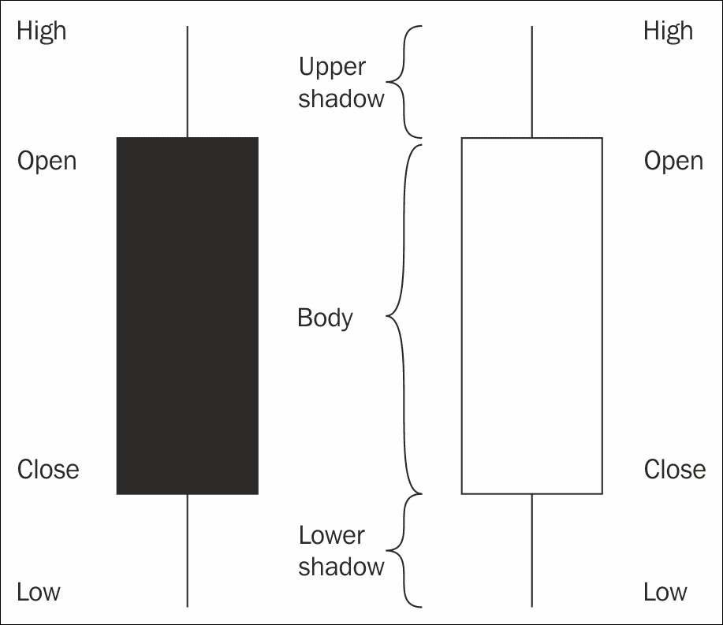

这里提供了用于获取实时数据并绘制 OHLC 图表的程序代码。

我们将使用`RCurl`包从互联网上获取数据。首先，让我们来看一下以下函数：

```py
library(RCurl)
get_price <- function(){

```

首先，我们使用`RCurl`包中的`getURL`函数将整个网站作为字符串读取：

```py
a <- getURL("https://www.bitcoinwisdom.com/markets/bitstamp/btcusd", ssl.verifypeer=0L, followlocation=1L)

```

如果我们查看 HTML 代码，就可以轻松找到我们要找的比特币价格。该函数将其作为数字值返回。

```py
 n <- as.numeric(regexpr("id=market_bitstampbtcusd>", a))
 a <- substr(a, n, n + 100)
 n <- as.numeric(regexpr(">", a))
 m <- as.numeric(regexpr("</span>", a))
 a <- substr(a, n + 1, m - 1)
 as.numeric(a)
}

```

或者我们也可以通过 XML 包获取完全相同的信息，XML 包是用来解析 HTML 和 XML 文件并提取信息的：

```py
library(XML)
as.numeric(xpathApply(htmlTreeParse(a, useInternalNodes = TRUE), '//span[@id="market_bitstampbtcusd"]', xmlValue)[[1]])

```

获取价格数据的这一做法当然仅用于演示目的。实时价格数据应由我们的经纪商提供（我们仍然可以使用 R 语言）。现在，让我们来看一下如何绘制实时蜡烛图：

```py
DrawChart <- function(time_frame_in_minutes,
 number_of_candles = 25, l = 315.5, u = 316.5) {

 OHLC <- matrix(NA, 4, number_of_candles)
 OHLC[, number_of_candles] <- get_price()
 dev.new(width = 30, height = 15)
 par(bg = rgb(.9, .9, .9))
 plot(x = NULL, y = NULL, xlim = c(1, number_of_candles + 1),
 ylim = c(l, u), xlab = "", ylab = "", xaxt = "n", yaxt = "n")
 abline(h = axTicks(2), v = axTicks(1), col = rgb(.5, .5, .5), lty = 3)
 axis(1, at = axTicks(1), las = 1, cex.axis = 0.6,
 labels = Sys.time() - (5:0) * time_frame_in_minutes)
 axis(2, at = axTicks(2), las = 1, cex.axis = 0.6)
 box()
 allpars = par(no.readonly = TRUE)
 while(TRUE) {
 start_ <- Sys.time()
 while(as.numeric(difftime(Sys.time(), start_, units = "mins")) < 
 time_frame_in_minutes) {
 OHLC[4,number_of_candles] <- get_price()
 OHLC[2,number_of_candles] <- max(OHLC[2,number_of_candles], OHLC[4,number_of_candles])
OHLC[3,number_of_candles] <- min(OHLC[3,number_of_candles], OHLC[4,number_of_candles])
 frame()
 par(allpars) 
 abline(h = axTicks(2), v=axTicks(1), col = rgb(.5,.5,.5), lty = 3)
 axis(1, at = axTicks(1), las = 1, cex.axis = 0.6, labels = Sys.time()-(5:0)*time_frame_in_minutes)
 axis(2, at = axTicks(2), las = 1, cex.axis = 0.6)
 box()
 for(i in 1:number_of_candles) { 
 polygon(c(i, i + 1, i + 1, i),
 c(OHLC[1, i], OHLC[1, i], OHLC[4, i], OHLC[4, i]), col = ifelse(OHLC[1,i] <= OHLC[4,i], rgb(0,0.8,0), rgb(0.8,0,0)))
 lines(c(i+1/2, i+1/2), c(OHLC[2,i], max(OHLC[1,i], OHLC[4,i])))
 lines(c(i+1/2, i+1/2), c(OHLC[3,i], min(OHLC[1,i], OHLC[4,i])))
 }
 abline(h = OHLC[4, number_of_candles], col = "green", lty = "dashed")
 }
 OHLC <- OHLC[, 2:number_of_candles]
 OHLC <- cbind(OHLC, NA)
 OHLC[1,number_of_candles] <- OHLC[4,number_of_candles-1]
 }
}

```

要完全理解这段代码，可能需要一些时间和编程经验。简而言之，算法做了以下几件事：在一个无限循环中，读取价格数据并将其存储在一个包含四行的矩阵中，作为 OHLC（开盘价、最高价、最低价、收盘价）。每当该矩阵的最后一列被重新计算时，会确保*H*为该时间间隔内观察到的最高价格，*L*为最低价格。当由`time_frame_in_minutes`变量确定的时间到达时，矩阵的列会滚动，最旧的观察数据（第一列）会被丢弃，每一列会被下一列替换。然后，第一列会被填充为 NA，除了 O（开盘价）外，其它值会被填充为 NA，而 O 价格被视为前一列的收盘价，这样图表就能连续显示。

剩余的代码只是用于通过“多边形”方法绘制蜡烛图。（我们也可以使用内置函数来实现，稍后会看到。）

让我们调用这个函数，看看会发生什么：

```py
DrawChart(30,50)

```

查看更多关于数据操作的内容，请参考第四章，*大数据 – 高级分析*。

## 内置指标

R 语言有许多内置指标，如**简单移动平均**（**SMA**）、**指数移动平均**（**EMA**）、**相对强弱指数**（**RSI**）和著名的 MACD。这些构成了技术分析的核心部分，它们的主要目的是通过可视化相对基准，帮助你了解你的资产是否被过度买入、相对表现良好，或者与某个参考时期相比处于战略水平。这里简要解释了每个指标的作用，以及如何将它们添加到你的图表中。

### SMA 和 EMA

移动平均是所有指标中最简单的：它们显示了基于滚动数据的平均价格水平。例如，如果你追踪 15 根蜡烛的 SMA，它将给你前 15 根蜡烛的平均价格水平。显然，如果当前蜡烛的时间到了并且开始新的一根蜡烛，SMA 将重新计算一个新的平均值，去掉之前的第一根蜡烛，加入最新的一根蜡烛。SMA 和 EMA 的区别在于，SMA 对所有蜡烛的权重相等，而 EMA 则赋予蜡烛指数权重——因此得名：它对当前蜡烛的权重高于之前的蜡烛。如果你想要一个更紧密联系当前价格水平并能快速反应价格变动的基准，这是一个不错的做法。这些是直接绘制在图表上的叠加指标。

### RSI

相对强弱指数（RSI）是一种带状指标：其值在 0 到 100 之间变化，并且在这个范围内有三个带区。当 RSI 在 0 到 30 之间时，表示资产被超卖；当 RSI 在 70 到 100 之间时，表示资产被超买。RSI 试图通过使用相对强弱比率来判断价格变化的强度：即上涨收盘的平均价格除以下跌收盘的平均价格（也就是绿蜡烛的平均收盘价除以红蜡烛的平均收盘价）。该平均值的计算周期可以有所不同，70 是最常用的。

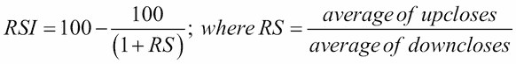

如公式所示，这个指标通常在强趋势中发出信号。由于价格可能会维持在超买或超卖水平，因此使用此指标时需要小心，最好与其他类型的指标或图表形态（如趋势反转，也称为失败摆动）结合使用。如果例如它显示你持有的资产处于超买状态，你也可以考虑减少仓位或寻找警示信号。

这里你可以看到如何绘制这个指标和一个移动平均线：

```py
library(quantmod)
bitcoin <- read.table("Bitcoin.csv", header = T, sep = ";", row.names = 1)
bitcoin <- tail(bitcoin, 150)
bitcoin <- as.xts(bitcoin)
dev.new(width = 20, height = 10)
chartSeries(bitcoin, dn.col = "red", TA="addRSI(10);addEMA(10)")

```

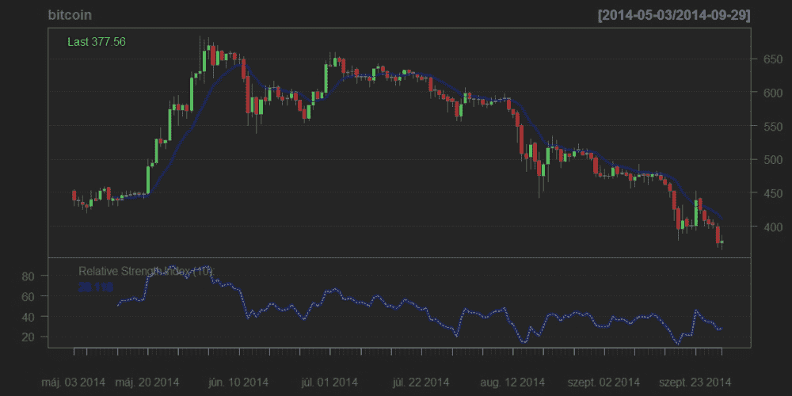

从上面的图表来看，我们可以得出结论，在这段时间内，由于 RSI 趋向保持在低位区域，并且多次触及极限水平，市场变得相当超卖。

### MACD

**MACD**（Mac Dee）代表**移动平均收敛-发散**。它是一个由慢速（26 根蜡烛）和快速（12 根蜡烛）指数移动平均线组成的趋势跟踪指标：它发出信号的频率较低，但这些信号往往更为准确。当快速 EMA 穿越慢速 EMA 时，MACD 发出信号。如果快速 EMA 从下方穿越慢速 EMA，则为买入信号；如果快速 EMA 从上方穿越慢速 EMA，则为卖出信号（12 根蜡烛的平均价格低于 26 根蜡烛的长期平均价格）。EMA(12)的位置标志着趋势的整体方向——例如，如果它位于 EMA(26)之上，则市场处于看涨状态。重要的限制：MACD 在区间整理时会发出虚假信号，只应在强趋势中使用。有些人还使用两条线之间距离变化的方向，这通常通过红色或绿色的直方图绘制：当同色的条形图有四根时，趋势的强度得到确认。

对于技术分析，你可以使用不同的 R 包：`quantmod`、`ftrading`、`TTR`等。我们主要依赖`quantmod`。在这里，你可以看到如何在一个之前保存的数据集（名为`Bitcoin.csv`）上绘制 MACD：

```py
library(quantmod)
bitcoin <- read.table("Bitcoin.csv", header = T, sep = ";", row.names = 1)
bitcoin <- tail(bitcoin, 150)
bitcoin <- as.xts(bitcoin)
dev.new(width = 20, height = 10)
chartSeries(bitcoin, dn.col = "red", TA="addMACD();addSMA(10)")

```

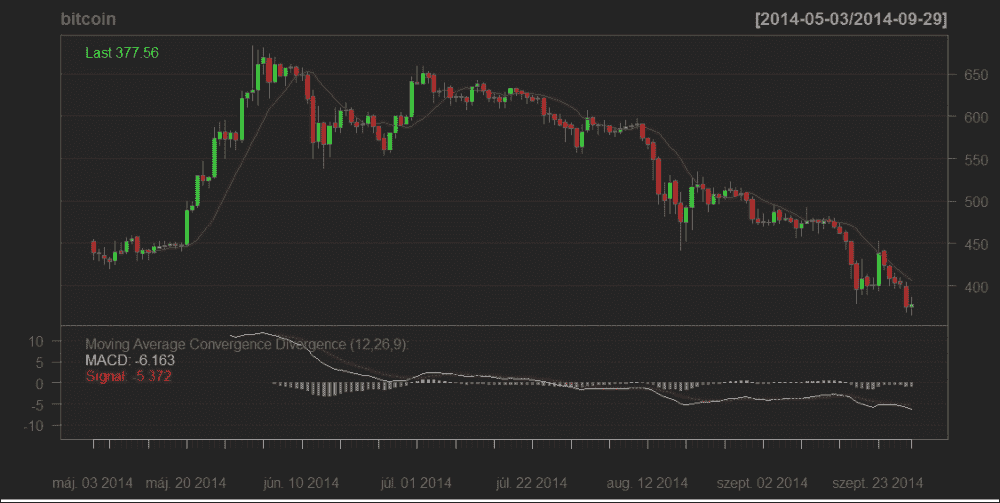

你可以在图表下方看到 MACD，在强烈的下行趋势中，它发出了有效的信号。

## 蜡烛图形态：关键反转

现在你对 R 语言的技术分析功能有了大致了解，让我们编写一个相对简单的策略。以下脚本可以识别关键反转，这是一种蜡烛图形态，出现在关键价格水平。

为此，我们应用了以下双重逻辑：首先，我们给战略价格水平提供了一个主观定义。例如，我们将价格走势的底部单调上升（底部指的是蜡烛体的最低点）且当前的 MA(25) 水平高于 25 根蜡烛之前的 MA(25) 水平的价格运动识别为成熟的上升趋势。在此我们强调，这并不构成标准的技术分析工具的一部分，其参数已根据我们所处理的实际图表（比特币图表）选择。如果您想将其应用于其他资产，建议您调整这些参数，以便获得最佳匹配。这本身并不是一个趋势识别算法：它仅作为我们信号系统的一部分。

如果该算法在成熟趋势中识别到一个可能会因蜡烛图模式出现而突破的战略价格水平，我们便开始寻找关键反转。关键反转是一种趋势反转的蜡烛图模式，它发生在之前趋势的最后一根蜡烛与趋势本身的方向一致（上升趋势为绿色，下降趋势为红色），但价格突然转向，下一根蜡烛的方向与趋势相反，并且其蜡烛体比前一根更大。趋势反转蜡烛应该至少与前一根蜡烛一样高，或者如果报价不连续，对于上升趋势来说略高于前一根蜡烛的收盘价，下降趋势则略低于前一根收盘价。请参见我们下面的图形，展示了上升趋势中的关键反转：

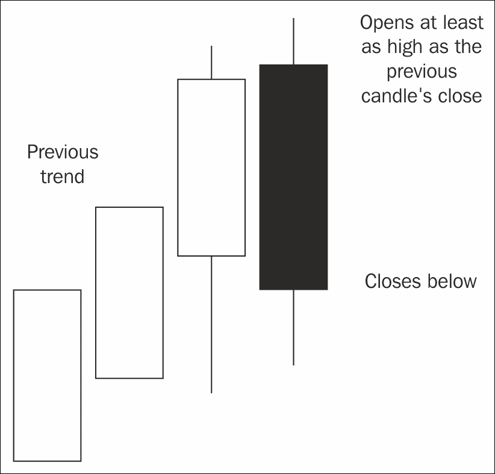

这里是识别该模式的函数代码。

在比特币部分中，我们之前使用多边形方法手动创建蜡烛图。在这里，我们使用了 `quantmod` 包和 `chartSeries` 函数来更轻松地完成相同的工作，并通过 OHLC 函数使其更加灵活。

```py
library(quantmod)
OHLC <- function(d) {
 windows(20,10)
 chartSeries(d, dn.col = "red")
}

```

以下函数将时间序列和两个索引（*i* 和 *j*）作为参数，并判断从 i 到 j 是否为上升趋势：

```py
is.trend <- function(ohlc,i,j){

```

首先：如果 MA(25) 没有增加，那么就不是上升趋势，因此我们返回 FALSE。

```py
avg1 = mean(ohlc[(i-25):i,4])
avg2 = mean(ohlc[(j-25):j,4])
if(avg1 >= avg2) return(FALSE)

```

在这个简单的算法中，如果蜡烛体的底部低于前一根和后一根蜡烛的底部，那么该蜡烛被称为**谷底**。如果这些谷底形成一个单调不减的序列，那么我们就有一个上升趋势。

```py
ohlc <- ohlc[i:j, ]
 n <- nrow(ohlc)
 candle_l <- pmin(ohlc[, 1], ohlc[, 4])
 valley <- rep(FALSE, n)
 for (k in 2:(n - 1))
 valley[k] <- ((candle_l[k-1] >= candle_l[k]) & (candle_l[k+1] >= candle_l[k]))
 z <- candle_l[valley]
 if (all(z == cummax(z))) return(TRUE)
 FALSE
}

```

这就是趋势识别。接下来是趋势反转。首先，我们使用之前的函数检查上升趋势的条件。然后我们检查最后两根蜡烛图是否符合反转模式。就这样。

```py
is.trend.rev <- function(ohlc, i, j) {
 if (is.trend(ohlc, i, j) == FALSE) return(FALSE)
 last_candle <- ohlc[j + 1, ]

 reverse_candle <- ohlc[j + 2, ]
 ohlc <- ohlc[i:j, ]
 if (last_candle[4] < last_candle[1]) return(FALSE)
 if (last_candle[4] < max(ohlc[,c(1,4)])) return(FALSE)
 if (reverse_candle[1] < last_candle[4] |
 reverse_candle[4] >= last_candle[1]) return(FALSE)
 TRUE
}

```

我们走出困境了。现在，我们可以在实际数据中使用它。我们只需读取比特币数据并运行趋势反转识别。如果出现反转趋势并且至少有 10 根蜡烛图，我们就会绘制它。

```py
bitcoin <- read.table("Bitcoin.csv", header = T, sep = ";", row.names = 1)
n <- nrow(bitcoin)
result <- c(0,0)
for (a in 26:726) {
 for (b in (a + 3):min(n - 3, a + 100)) {
 if (is.trend.rev(bitcoin, a,b) & b - a > 10 )
 result <- rbind(result, c(a,b))
 if (b == n)
 break
 }
}

z <- aggregate(result, by = list(result[, 2]), FUN = min)[-1, 2:3]
for (h in 1:nrow(z)) {
 OHLC(bitcoin[z[h, 1]:z[h, 2] + 2,])
 title(main = z[h, ])
}

```

## 信号评估与仓位管理

我们的代码成功识别了四个关键反转点，包括比特币价格的历史转折点，为我们提供了一个不错的卖空信号。我们可以得出结论，信号是成功的，剩下的就是明智地使用它们。

了解比特币的基本原理（其作为货币的接受度受到削弱，并被从此前的核心市场如中国驱逐），如果跟随信号（图表上的最后一根蜡烛），你本可以获得不错的利润，信号如下：

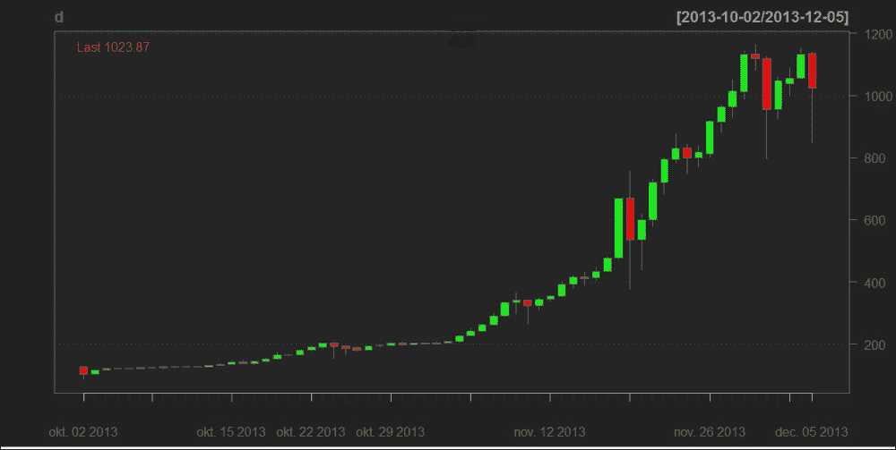

技术分析在设定止盈和止损时非常有用，换句话说，它有助于管理你的仓位。如果你选择在信号处卖出，你可以按以下方式设定这些点位。

系统信号显示你可能想在 2013 年 12 月 5 日的最后一根蜡烛图上卖出，价格为$1023.9，接下来的图表中用箭头标出。你决定继续并开盘。由于比特币价格波动较大，尤其是在之前的趋势呈指数增长后，你决定将止损设置在历史高点 1163，因为你不想让虚假的波动导致你被迫平仓。

在下方的图表中，你可以看到这种方法是合理的，在价格下跌后，波动性显著增加，影线也变得更长。

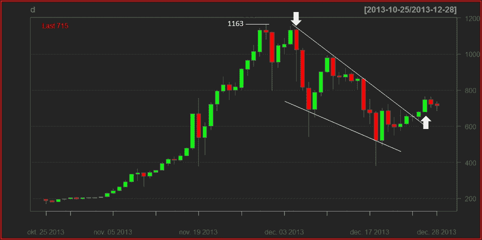

到 2013 年底，如果你连接蜡烛图实体的顶部（用白色手工绘制），可以画出一条假设的趋势线。这条线似乎有效，且在底部形成了另一条趋势线，坡度更低，形成了一个三角形。我们说，当价格在达到三角形长度的 3/4 之前突破其边界时，图表上的三角形有效。

发生的情况是：2013 年 12 月 26 日，日线图突破了趋势线，并形成了一根大绿蜡烛（箭头指示的地方）。MACD 线交叉，发出了强烈的看涨信号，我们在蜡烛实体顶部平仓，价格为 747.0——如果没有提前平仓的话。因此，我们赚取了$276.9，或 27%的交易回报。

## 资金管理说明

让我们来看看这个交易的风险配置，展示如何利用技术分析来管理你的风险暴露。做到这一点的最佳方法是计算风险回报比，公式如下：

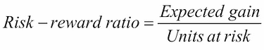

分母很容易定义，这是仓位上的可能损失，（1163.0-1023.9）= $139.1，假设止损被激活。分子，即可能的收益，可以通过斐波那契回撤来估算，这是一种使用黄金分割预测价格可能反转的工具，特别适用于这种指数趋势。你可以在[`bitcoinwisdom.com/`](https://bitcoinwisdom.com/)的图表中看到它：

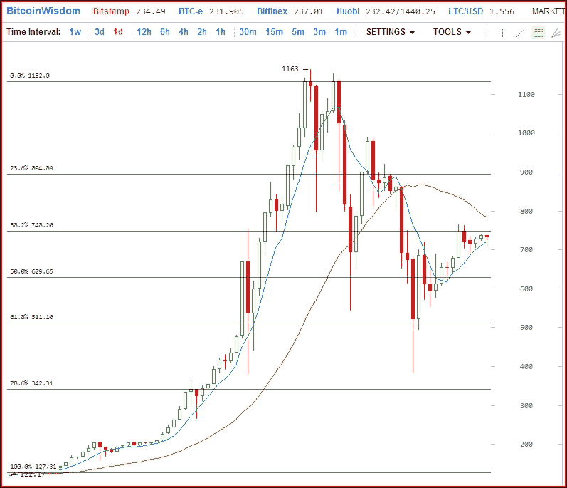

如果将趋势的高度视为 100%，你可以预期价格在趋势突破时会触及斐波那契水平。由于关键反转是一个强烈信号，我们选择 38.2%的位置，即 747.13 美元，因此我们预期价格会跌至该点。风险/收益比的分子是（1023.9 - 747.1）= 276.8 美元，最终结果为 276.8 / 139.1 = 1.99，意味着每冒 1 美元的风险，就有 1.99 美元的预期利润。这是一个相当不错的潜力，交易应该被批准。

每当你考虑进入一个仓位时，计算一下你所面临的风险与预期收益的比值。如果比值低于 3/2，那么这个仓位并不是最优的；如果比值低于 1，你应该完全放弃这笔交易。改善风险/收益比的可能方式包括设置更紧的止损或选择更强的信号。如果你希望在交易中取得成功，技术分析提供了一些有用的风险管理策略，不要忽视它们。

## 总结

技术分析，特别是所展示的图表分析方法，是一种高度直观的、图形化的金融资产分析方式。它利用支撑/阻力位、图表和蜡烛图形态以及指标来预测未来的价格走势。R 语言使我们能够免费获取实时数据，并将其绘制为 OHLC 图表，添加指标，并接收自动化信号以识别关键反转信号、蜡烛图形态。我们用这些信号之一展示了如何手动管理一个实际的仓位，并证明了技术分析的吸引力在于它不仅告诉你何时开仓，还能告诉你何时平仓，并通过风险管理实践计算信号的强度。

# 神经网络

由于其先进的数学背景，**神经网络**（**NN**）在学术界停留了很长时间，后来随着更实用的格式的出现——例如 R 语言内置函数，**神经网络**迅速获得了普及。神经网络是可以适应的人工智能软件，能够在数据中检测复杂模式：它就像一位经验丰富的老交易员，具备良好的市场直觉，但并不总是能够向你解释为什么他坚信你应该做空**道琼斯工业平均指数**（**DIJA**）。

网络架构由多个节点通过连接相互连接组成。网络通常有 3 层或 4 层：输入层、隐藏层和输出层，每一层可以包含多个神经元。第一层的节点数对应模型的解释变量的数量，而最后一层的节点数等于响应变量的数量（对于二元目标变量通常为 2 个神经元，对于连续目标变量通常为 1 个神经元）。模型的复杂性和预测能力由隐藏层的节点数决定。通常，一个层的每个节点与下一层的所有其他节点都有连接，这些连接（见图）代表权重。每个神经元从上一层接收输入，并通过非线性函数将其转换为下一层的输入。

一个具有单一隐藏层的前馈神经网络几乎可以在任何复杂问题中发挥作用 *(Chauvin-Rumelhart, 1995)*，这也是为什么它被研究人员广泛使用的原因。(*Sermpinis et al., 2012*；*Dai et al., 2012*) *Atsalakis-Valavanis (2009)* 指出，属于**前馈神经网络**（**FFNN**）家族的**多层感知器**（**MLP**）模型可能是预测金融时间序列最有效的模型。下图展示了根据 *(Dai et al., 2012)* 提出的一个三层 MLP 神经网络的结构。

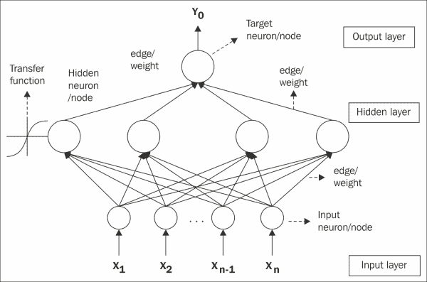

连接权重（边的值）首先被赋予初始值。预测值与实际输出值之间的误差通过网络进行反向传播，以更新权重。监督学习过程然后尝试最小化期望输出和预测输出之间的误差（通常是 MSE、RMSE 或 MAPE）。由于具有一定数量隐藏层神经元的网络可以学习学习数据上的任何关系（即使是异常值和噪声），通过提前停止学习算法，可以防止过度学习。网络的学习过程在测试集达到最小值时停止。然后，使用给定的参数，网络必须在验证集上运行，见（Wang et al., 2012）。

在创建和执行自己的神经网络时，有许多实际问题需要解决，例如选择合适的网络拓扑结构、选择和转换输入变量、减少输出方差，以及最重要的是缓解过拟合问题。过拟合是指当训练集上的误差非常小，但当我们在新数据上拟合网络时误差较大。这意味着网络仅仅记住了训练样本，而没有成功理解关系的总体结构。为了避免过拟合，我们需要将数据拆分为三个子集：训练集、验证集和测试集。训练集通常占总数据的 60-70%，用于学习和拟合网络参数。验证数据集（10-20%）用于最小化过拟合效应并调整参数，例如选择神经网络中的隐藏节点数量。测试数据集（10-20%）仅用于测试最终解决方案，以确认网络的预测能力。

## 预测比特币价格

让我们看看它在实践中的运作方式。此示例应用了基于比特币收盘价预测的交易策略。分析选择了 2013 年 8 月 3 日到 2014 年 5 月 8 日之间的时间段。数据集共有 270 个数据点，前 240 个数据点作为训练样本，剩下的 30 个数据点作为测试样本（预测模型在该 9 个月时间序列的最后一个月上进行了测试）。

首先，我们从`Bitcoin.csv`中加载数据集，该文件可以在书籍的官方网站上找到。

```py
data <- read.csv("Bitcoin.csv", header = TRUE, sep = ",")
data2 <- data[order(as.Date(data$Date, format = "%Y-%m-%d")), ]
price <- data2$Close
HLC <- matrix(c(data2$High, data2$Low, data2$Close), nrow = length(data2$High))

```

在第二步中，我们计算对数收益，并安装`TTR`库来生成技术指标。

```py
bitcoin.lr <- diff(log(price))
install.packages("TTR")
library(TTR)

```

为建模选定的六个技术指标已被研究人员和专业交易员广泛且成功地使用。

```py
rsi    <- RSI(price)
MACD   <- MACD(price)
macd   <- MACD[, 1]
will   <- williamsAD(HLC)
cci    <- CCI(HLC)
STOCH  <- stoch(HLC)
stochK <- STOCH[, 1]
stochD <- STOCH[, 1]

```

我们为训练和验证数据集创建输入和目标矩阵。训练和验证数据集包括 2013 年 8 月 3 日（700）到 2014 年 4 月 8 日（940）之间的收盘价和技术指标。

```py
Input <- matrix(c(rsi[700:939], cci[700:939], macd[700:939],will[700:939], stochK[700:939], stochD[700:939]), nrow = 240)
Target <- matrix(c(bitcoin.lr[701:940]), nrow = 240)
trainingdata <- cbind(Input, Target)
colnames(trainingdata) <- c("RSI", "CCI", "MACD", "WILL", "STOCHK", "STOCHD", "Return")

```

现在，我们安装并加载`caret`包来划分我们的学习数据集。

```py
install.packages("caret")
library(caret)

```

我们将学习数据集按 90-10%的比例（训练-验证）进行划分。

```py
trainIndex <- createDataPartition(bitcoin.lr[701:940], p = .9, list = FALSE)
bitcoin.train <- trainingdata[trainIndex, ]
bitcoin.test <- trainingdata[-trainIndex, ]

```

我们安装并加载了`nnet`包。

```py
install.packages("nnet")
library(nnet)

```

通过网格搜索过程选择合适的参数（隐藏层中的神经元数量、学习率）。网络的输入层包含六个神经元（与解释变量的数量一致），而隐藏层则测试了包含 5、12、…、15 个神经元的网络。网络有一个输出：比特币的日收益率。模型在较低的学习率（0.01、0.02、0.03）下进行测试。使用的收敛标准是：如果达到第 1000 次迭代，则停止学习过程。选择在测试集上具有最低 RMSE 的网络拓扑作为最优模型。

```py
best.network <- matrix(c(5, 0.5))
best.rmse <- 1
for (i in 5:15)
 for (j in 1:3) {
 bitcoin.fit <- nnet(Return ~ RSI + CCI + MACD + WILL + STOCHK + STOCHD, data = bitcoin.train, maxit = 1000, size = i, decay = 0.01 * j, linout = 1)
 bitcoin.predict <- predict(bitcoin.fit, newdata = bitcoin.test)
 bitcoin.rmse <- sqrt(mean ((bitcoin.predict – bitcoin.lr[917:940])²))
 if (bitcoin.rmse<best.rmse) {
 best.network[1, 1] <- i
 best.network[2, 1] <- j
 best.rmse <- bitcoin.rmse
 }
 }

```

在这一步，我们为测试数据集创建了输入矩阵和目标矩阵。测试数据集包括 2013 年 4 月 8 日（940）到 2014 年 5 月 8 日（969）之间的收盘价格和技术指标。

```py
InputTest <- matrix(c(rsi[940:969], cci[940:969], macd[940:969], will[940:969], stochK[940:969], stochD[940:969]), nrow = 30)
TargetTest <- matrix(c(bitcoin.lr[941:970]), nrow = 30) Testdata <- cbind(InputTest,TargetTest)
colnames(Testdata) <- c("RSI", "CCI", "MACD", "WILL", "STOCHK", "STOCHD", "Return")

```

最后，我们在测试数据上拟合了最佳的神经网络模型。

```py
bitcoin.fit <- nnet(Return ~ RSI + CCI + MACD + WILL + STOCHK + STOCHD, data = trainingdata, maxit = 1000, size = best.network[1, 1], decay = 0.1 * best.network[2, 1], linout = 1)
bitcoin.predict1 <- predict(bitcoin.fit, newdata = Testdata)

```

我们重复并平均该模型 20 次，以消除异常网络。

```py
for (i in 1:20) {
 bitcoin.fit <- nnet(Return ~ RSI + CCI + MACD + WILL + STOCHK + STOCHD, data = trainingdata, maxit = 1000, size = best.network[1, 1], decay = 0.1 * best.network[2, 1], linout = 1) 
 bitcoin.predict <- predict(bitcoin.fit, newdata = Testdata)
 bitcoin.predict1 <- (bitcoin.predict1 + bitcoin.predict) / 2
}

```

我们计算了“买入持有”基准策略和神经网络在测试数据集上的结果。

```py
money <- money2 <- matrix(0,31)
money[1,1] <- money2[1,1] <- 100
for (i in 2:31) {
 direction1 <- ifelse(bitcoin.predict1[i - 1] < 0, -1, 1)
 direction2 <- ifelse(TargetTest[i - 1] < 0, -1, 1)
 money[i, 1] <- ifelse((direction1 - direction2) == 0, money[i-1,1]*(1+abs(TargetTest[i - 1])),
 money[i-1,1]*(1-abs(TargetTest[i - 1])))
 money2[i, 1] <- 100 * (price[940 + I - 1] / price[940])
}

```

我们根据基准和神经网络策略在测试数据集（1 个月）上绘制了投资价值曲线。

```py
x <- 1:31
matplot(cbind(money, money2), type = "l", xaxt = "n",
 ylab = "", col = c("black", "grey"), lty = 1)
legend("topleft", legend = c("Neural network", "Benchmark"),
 pch = 19, col = c("black", "grey"))
axis(1, at = c(1, 10, 20, 30),
 lab = c("2014-04-08", "2014-04-17", "2014-04-27", "2014-05-07"))
box()
mtext(side = 1, "Test dataset", line = 2)
mtext(side = 2, "Investment value", line = 2)

```

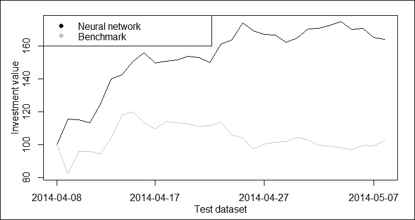

### 策略评估

我们注意到，在这个示例中，神经网络策略在实现的回报率上超越了“买入持有”策略。通过神经网络，我们在一个月内获得了 20%的回报，而采用被动的买入持有策略仅为 3%。然而，我们没有考虑到交易成本、买卖差价和价格影响，这些因素可能会显著降低神经网络的利润。

# 日志最优投资组合

与前面的观点相反，假设市场上有有限数量的风险资产。这些资产在没有任何交易成本的情况下进行持续交易。投资者分析历史市场数据，并基于这些数据，在每一天结束时重新调整她的投资组合。她如何在长期内最大化财富？如果回报在时间上是独立的，那么市场在弱意义上是有效的，回报的时间序列没有记忆。如果回报也是独立同分布（i.i.d.），则最优策略是根据例如马科维茨模型（见*Daróczi et al. 2013*）设定投资组合权重，并在整个时间范围内保持这些权重不变。在这种情况下，任何调整都将对长期的投资组合价值产生负面影响。

现在，让我们暂时放弃纵向独立性的假设，允许资产回报中存在隐藏的模式，因此市场不是有效的，分析历史价格变动是有意义的。我们保留的唯一假设是，资产回报由一个平稳且遍历的过程生成。可以证明，最佳的选择是所谓的**对数最优投资组合**，参见*Algoet-Cover (1988)*。更精确地说，没有其他投资策略在渐近过程中能获得比对数最优投资组合更高的预期回报。问题在于，为了确定对数最优投资组合，必须知道生成过程。

但是，在我们对基础随机过程的性质一无所知的情况下，如何在更现实的环境中进行操作呢？如果一种策略能够确保在渐近过程中，平均增长率趋近于对任何（！）生成过程为平稳且遍历的情况下，*对数最优策略*的增长率，则称该策略为**普遍一致**。这虽然令人惊讶，但确实存在普遍一致的策略，参见*Algoet-Cover (1988)*。因此，基本思想是寻找过去的模式，这些模式与最近观察到的模式相似，并在此基础上预测未来的回报，并优化相对于该预测的投资组合。相似性的概念可以通过不同的方式来定义，因此我们可以采用不同的方法，例如划分估计器、基于核心函数的估计器和最近邻估计器。为便于说明，下一节我们将展示一个简单的普遍一致策略，该策略基于*Györfi 等人（2006）*的核心函数方法。

## 一种普遍一致的非参数投资策略

假设市场上有 d 只不同的股票进行交易。包含投资组合权重的向量***b***可以每天重新排列。我们假设投资组合权重是非负的（不允许卖空），并且权重的总和始终为 1（投资组合必须是自我融资的）。向量***x***包含价格相对值 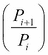，其中*P*代表第*i*天的收盘价。投资者的初始财富为*S[0]*，因此她在第*n*期末的财富如下：

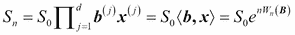

其中，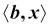 是两个向量的标量积，n 是我们跟随投资策略的天数，*W[n]* 是 *n* 天内的平均对数回报，***B*** 表示所有应用的 ***b*** 向量。因此，任务是确定一种重新分配规则，使得 *W[n]* 在长期内最大化。这里，我们展示了一种简单的普遍一致策略，具有这种吸引人的特性。设 *J[n]* 表示与最近观察到的那一天在欧几里得距离上相似的日期集合。它由以下公式确定：

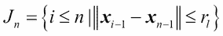

其中，*r[l]* 是由第 *l* 位专家选择的最大允许距离（半径）。根据第 *l* 位专家在第 *n* 天的对数最优投资组合可以用以下方式表示：

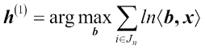

为了获得一个均衡且稳健的策略，我们定义了不同的专家（投资组合经理），他们具有不同的半径，并根据权重向量***q***将财富分配给不同的专家。权重可以相等，也可以根据专家的历史表现或其他特征来确定。通过这种方式，我们结合了多个专家的意见，我们在第 *n* 天的财富为：

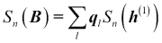

假设我们是专家，并且在 1997 到 2006 年期间，跟随上述策略，投资于四只纽约证券交易所的股票（aph, alcoa, amerb, 和 coke）以及美国国债，并使用一年期的滚动时间窗口。数据可以从以下链接获取：[`www.cs.bme.hu/~oti/portfolio/data.html`](http://www.cs.bme.hu/~oti/portfolio/data.html)。首先，我们将数据读入。

```py
all_files <- list.files("data")
d <- read.table(file.path("data", all_files[[1]]),
 sep = ",", header = FALSE)
colnames(d) = c("date", substr(all_files[[1]], 1, nchar(all_files[[1]]) - 4))
for (i in 2:length(all_files)) {
 d2 <- read.table(file.path("data", all_files[[i]]), sep = ",", header = FALSE)
 colnames(d2) = c("date", substr(all_files[[i]], 1, nchar(all_files[[i]])-4))
 d <- merge(d, d2, sort = FALSE)
}

```

该函数根据我们预先设置的半径（*r*）计算与投资组合权重相关的预期价值。

```py
log_opt <- function(x, d, r = NA) {
 x <- c(x, 1 - sum(x))
 n <- ncol(d) - 1
 d["distance"] <- c(1, dist(d[2:ncol(d)])[1:(nrow(d) - 1)])
 if (is.na(r)) r <- quantile(d$distance, 0.05)
 d["similarity"] <- d$distance <= r
 d["similarity"] <- c(d[2:nrow(d), "similarity"], 0)
 d <- d[d["similarity"] == 1, ]
 log_return <- log(as.matrix(d[, 2:(n + 1)]) %*% x)
 sum(log_return)
}

```

该函数计算特定日期的最优投资组合权重。

```py
log_optimization <- function(d, r = NA) {
 today <- d[1, 1]
 m <- ncol(d)
 constr_mtx <- rbind(diag(m - 2), rep(-1, m - 2))
 b <- c(rep(0, m - 2), -1)
 opt <- constrOptim(rep(1 / (m - 1), m - 2), function(x) -1 * log_opt(x, d), NULL, constr_mtx, b)
 result <- rbind(opt$par)
 rownames(result) <- today
 result
}

```

现在，我们对所有找到的相似日期进行投资组合权重优化。同时，我们还计算了每一天投资组合的实际价值。

```py
simulation <- function(d) {
 a <- Position( function(x) substr(x, 1, 2) == "96", d[, 1])
 b <- Position( function(x) substr(x, 1, 2) == "97", d[, 1])
 result <- log_optimization(d[b:a,])
 result <- cbind(result, 1 - sum(result))
 result <- cbind(result, sum(result * d[b + 1, 2:6]), sum(rep(1 / 5, 5) * d[b + 1, 2:6]))
 colnames(result) = c("w1", "w2", "w3", "w4", "w5", "Total return", "Benchmark")
 for (i in 1:2490) {
 print(i)
 h <- log_optimization(d[b:a + i, ])
 h <- cbind(h, 1 - sum(h))
 h <- cbind(h, sum(h * d[b + 1 + i, 2:6]), sum(rep(1/5,5) * d[b + 1 + i, 2:6]))
 result <- rbind(result,h)
 }
 result
}
A <- simulation(d)

```

最后，让我们绘制随时间变化的投资价值。

```py
matplot(cbind(cumprod(A[, 6]), cumprod(A[, 7])), type = "l",
 xaxt = "n", ylab = "", col = c("black","grey"), lty = 1)
legend("topright", pch = 19, col = c("black", "grey"),
 legend = c("Logoptimal portfolio", "Benchmark"))
axis(1, at = c(0, 800, 1600, 2400), lab = c("1997-01-02", "2001-03-03", "2003-05-13", "2006-07-17"))

```

我们得到以下图表：

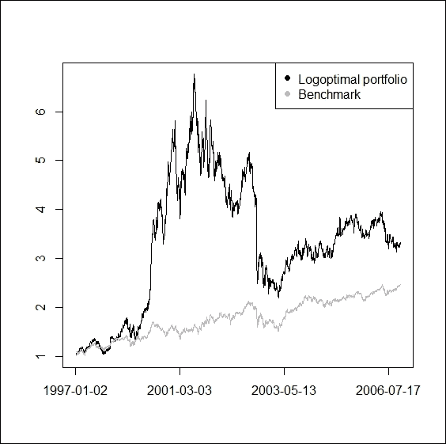

## 策略评估

从上面的图表中可以看到，我们的对数最优策略优于始终保持投资组合权重相等且固定的被动基准策略。然而，值得注意的是，在前一种情况下，不仅平均回报率较高，投资价值的波动性也要大得多。

数学上已证明，存在一些非参数化的投资策略，这些策略能够有效地揭示已实现回报中的隐藏模式，并利用它们实现投资者财富的“几乎”最优增长率。为了这一目标，我们不需要知道基础过程；唯一的假设是该过程是平稳的且是遍历的。然而，我们不能确定这一假设在现实中是否成立。同样重要的是要强调，这些策略仅在渐近意义上是最优的，但我们对潜在路径的短期特征知之甚少。

# 摘要

本章不仅概述了技术分析，还讨论了一些相应的策略，如神经网络和 log-optimal 投资组合。这些方法在某种意义上是相似的：应用它们时，我们隐含地假设过去的情况可能会在未来重现；因此，我们大胆挑战市场效率的概念，建立了一个主动交易策略。在这种框架下，我们讨论了预测单一资产（比特币）价格、优化交易时机以及动态优化多个风险资产（纽约证券交易所股票）投资组合的问题。我们展示了一些基于 R 工具包的简单算法，相比于被动的买入并持有策略，它们能够产生显著的额外收益。然而，我们也注意到，一个全面的绩效分析不仅要关注平均回报，还要考虑相应的风险。因此，我们建议在优化策略时，注意市场下行、波动性以及其他风险度量。当然，您还必须意识到所呈现方法的局限性：您不能确定已知的回报生成过程；如果频繁交易，您需要支付大量的交易成本；而且，随着财富的增加，您会遭遇更多的不利价格影响等等。然而，我们确实希望您能够获得新的启发和有用的提示，以便发展出您自己的复杂交易策略。

# 参考文献

+   Algoet, P.; Cover, T. (1988) 渐近最优性，log-optimal 投资的渐近等分性质，《概率年刊》，16，第 876-898 页

+   Atsalakis, G. S. Valavanis, K. P. (2009) 股票市场预测技术调查-第二部分：软计算方法。《应用专家系统》，36(3)，第 5932-5941 页

+   Bajgrowicz, P; Scaillet, O. (2012) 技术性交易再探：虚假发现、持久性测试与交易成本，《金融经济学杂志》，第 106 卷，第 473-491 页

+   Chauvin, Y.; Rumelhart, D. E. (1995) 反向传播：理论、架构与应用。新泽西州：劳伦斯·厄尔鲍姆协会。

+   Dai, W.; Wu, J-Y.; Lu, C-J. (2012) 结合非线性独立成分分析与神经网络预测亚洲股市指数。《应用专家系统》，39(4)，第 4444-4452 页

+   Daróczi, G. 等 (2013) 《定量金融的 R 语言入门》，Packt  

+   Györfi, L.; Lugosy, G.; Udina, F. (2006) 非参数核基序列投资策略，《理论与应用金融国际期刊》，第 10 卷，第 505-516 页  

+   Sermpinis, G.; Dunis, C.; Laws, J.; Stasinakis, C. (2012) 利用随机神经网络组合和时变杠杆预测和交易欧元/美元汇率，《决策支持系统》，第 54 卷（第 1 期），第 316-329 页  

+   Tajaddini, R.; Falcon Crack, T. (2012) 动量型交易策略在新兴货币市场中的有效性，《国际金融市场、机构与货币期刊》，第 22 卷，第 521-537 页  

+   Wang, J. J.; Wang, J. Z.; Zhang, Z. G.; Guo, S. P. (2012) 基于混合模型的股票指数预测，《欧米茄》，第 40 卷（第 6 期），第 758-766 页  

+   Zapranis, A.; T. E. Prodromos (2012) 一种新颖的基于规则的技术模式识别机制：识别和评估美国股市中的盘形和支撑位，《专家系统与应用》，第 39 卷，第 6301-6308 页

+   Zwart, G.; Markwat, T.; Swinkels, L.; van Dijk, D. (2009) 新兴货币市场中基本面和技术信息的经济价值，《国际货币与金融期刊》，第 28 卷，第 581-604 页  
