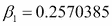

# 第十一章：资产负债管理

本章介绍了 R 在商业银行**资产负债管理（ALM）**中的应用。银行的 ALM 职能传统上与银行账本头寸的利率风险和流动性风险管理相关。利率定位和流动性风险管理都需要对银行产品进行建模。如今，专业的 ALM 部门使用复杂的**企业风险管理（ERM）**框架，这些框架能够整合各种风险类型的管理，并为 ALM 提供适当的工具，以指导资产负债表的管理。我们的总体目标是建立一个简化的 ALM 框架，展示如何使用 R 完成某些 ALM 任务。这些任务基于利率和流动性风险管理以及非到期账户的建模。

本章结构如下。我们从 ALM 分析的数据准备过程开始。规划和度量过程需要关于银行账本、市场状况和商业战略的特殊信息。本部分建立了一个数据管理工具，由主要的输入数据集组成，并将数据提取成我们在本章其余部分使用的形式。

接下来，我们将处理利率风险的度量。在银行业中，量化银行账本中的利率风险有两种常见方法。较简单的技术使用重新定价缺口表分析来管理利率风险敞口，并计算平行收益曲线冲击以预测**净利息收入（NII）**并计算**股本市场价值（MVoE）**。更先进的方法使用资产负债表的动态模拟和利率发展的随机模拟。选择使用哪种工具取决于目标和资产负债表的结构。

例如，一家储蓄银行（负债方有客户定期存款，资产方有固定收益债券投资）关注其股本市场价值风险，而一家企业银行（拥有浮动利率头寸）则专注于净利息收入风险。我们将演示如何使用 R 有效地提供重新定价缺口表和净利息收入预测。

我们的第三个主题与流动性风险有关。我们定义了三种类型的流动性风险：结构性、资金性和应急性风险。结构性流动性风险源于资产和负债方不同的合同到期。商业银行通常收集短期客户存款，并将获得的资金投入到长期客户贷款中。因此，银行面临负债方的滚动风险，因为无法确定有多少到期的短期客户资金将被展期，这可能危及银行的偿付能力。资金流动性风险发生在展期过程中；它指的是更新资金成本的不确定性。在日常业务中，即使银行能够展期到期的同业存款，交易成本也高度依赖市场上的流动性状况。应急性风险指的是客户在不可预见情境下的行为。例如，应急性风险可能表现为定期存款的突然提取或客户贷款的提前偿还。虽然 ALM 可以通过调节银行的头寸适当处理结构性和资金性流动性风险，但应急性流动性风险只能通过储备流动性资产来对冲。我们展示了如何建立流动性缺口表并预测净融资需求。

在本章的最后一节，我们将重点讨论非到期产品的建模。客户产品可以根据其到期结构和利率行为进行分类。典型的非到期负债产品示例包括活期存款和没有提前通知期的储蓄账户。客户可以随时提取他们的资金，而银行则有权调整提供的利率。在资产端，透支和信用卡具有类似的特征。非到期产品的复杂模型使得资产负债管理（ALM）工作变得相当具有挑战性。实际上，非到期产品的建模意味着现金流配置的映射、需求的利率弹性估算，以及在内部**资金转移定价（FTP）**系统中分析流动性相关的成本。这里，我们展示了如何衡量非到期存款的利率敏感性。

# 数据准备

复杂的 ERM 软件是银行业必不可少的工具，用于量化净利息收入和股本市场风险，并特别准备有关资产负债组合、再定价缺口和流动性头寸的报告。我们使用 R 语言设置了一个简化的模拟和报告环境，重现了商业使用的 ALM 软件解决方案的关键特性。

典型的 ALM 数据处理流程遵循所谓的**提取、转换和加载（ETL）**逻辑。


提取（这是第一阶段）意味着银行已经从本地**数据仓库（DWH）**、中台、控制系统或会计系统中收集了交易级别和账户级别的源数据。整个资产负债表的源数据（在这里称为组合）也被提取，以节省计算时间、内存和存储空间。此外，单笔交易级别数据按给定维度（例如，按货币面额、利率行为、摊销结构等）进行了汇总。市场数据（如收益曲线、市场价格和波动率表面）也被准备为原始数据集。下一步是设置模拟参数（例如，收益曲线冲击和续期业务的交易量增量），我们称之为策略。为了简化起见，这里我们将策略简化为保持现有组合，因此资产负债表在预测期内保持不变。

在转换阶段，组合、市场和策略数据集被结合在一起用于进一步分析，并转化为新的结构。用我们的话来说，这意味着现金流表是通过使用组合和市场描述符生成的，并且它被转化为一种狭义的数据形式。

在加载时，结果被写入到报告表格中。通常，用户可以定义哪些组合维度和风险度量的值应被加载到结果数据库中。我们将在接下来的章节中展示如何衡量和记录流动性风险和利率风险。

## 数据源初看之下

我们将列出资产负债表项目的数据源称为“组合”。市场数据（如收益曲线、市场价格和波动率表面）也被准备为原始数据集。让我们将初始数据集导入 R。首先，我们需要从 Packt Publishing 的链接下载本章将使用的数据集和函数。现在，让我们导入存储在本地文件夹中的示例组合和市场数据集，这些数据集以标准`csv`格式存储，并在代码中如下所示使用：

```py
portfolio <- read.csv("portfolio.csv")
market <- read.csv("market.csv")

```

选定的数据集包含需要转换为适当格式的日期。我们通过`as.Date`函数转换日期格式：

```py
portfolio$issue <- as.Date(portfolio$issue, format = "%m/%d/%Y")
portfolio$maturity <- as.Date(portfolio$maturity, format = "%m/%d/%Y")
market$date <- as.Date(market$date, format = "%m/%d/%Y")

```

使用`head(portfolio)`命令打印导入的`portfolio`数据集的前几行。其结果如下：

```py
head(portfolio)
 id account                        account_name volume
1  1    cb_1 Cash and balances with central bank    930
2  2   mmp_1             Money market placements   1404
3  3   mmp_1             Money market placements    996
4  4    cl_1                     Corporate loans    515
5  5    cl_1                     Corporate loans    655
6  6    cl_1                     Corporate loans    560
 ir_binding reprice_freq spread      issue   maturity
1        FIX           NA      5 2014-09-30 2014-10-01
2        FIX           NA      7 2014-08-30 2014-11-30
3        FIX           NA     10 2014-06-15 2014-12-15
4      LIBOR            3    301 2014-05-15 2016-04-15
5      LIBOR            6    414 2014-04-15 2016-04-15
6      LIBOR            3    345 2014-03-15 2018-02-15
 repayment payment_freq yieldcurve
1    BULLET            1      EUR01
2    BULLET            1      EUR01
3    BULLET            1      EUR01
4    LINEAR            3      EUR01
5    LINEAR            6      EUR01
6    LINEAR            3      EUR01

```

该数据框的列代表识别号（行号）、账户类型和产品特征。前三列表示产品标识符、账户标识符（或简称）以及账户的长名称。通过使用`levels`函数，我们可以轻松列出与典型商业银行产品或资产负债表项目相关的账户类型：

```py
levels(portfolio$account_name)
 [1] "Available for sale portfolio" 
 [2] "Cash and balances with central bank" 
 [3] "Corporate loans" 
 [4] "Corporate sight deposit" 
 [5] "Corporate term deposit" 
 [6] "Money market placements" 
 [7] "Other non-interest bearing assets" 
 [8] "Other non-interest bearing liabilities"
 [9] "Own issues" 
[10] "Repurchase agreements" 
[11] "Retail overdrafts" 
[12] "Retail residential mortgage" 
[13] "Retail sight deposit" 
[14] "Retail term deposit" 
[15] "Unsecured money market funding" 

```

`portfolio`数据集还包含欧元名义金额、利率绑定类型（固定利率或 LIBOR）、账户的重新定价频率（以月为单位，如果利率绑定为 LIBOR），以及利率的基点差值。此外，其他列描述了产品的现金流结构。列包括发行日期（即第一次重新定价的日期）、到期日期、本金偿还结构类型（一次性偿还、线性偿还或年金偿还），以及偿还频率（以月为单位）。最后一列存储利率曲线的标识符，用于计算未来浮动利率支付。

实际的利率存储在`market`数据集中。让我们列出前几行数据来检查其内容：

```py
head(market)
 type       date       rate comment
1 EUR01 2014-09-01  0.3000000      1M
2 EUR01 2014-12-01  0.3362558      3M
3 EUR01 2015-03-01 -2.3536463      6M
4 EUR01 2015-09-01 -5.6918763      1Y
5 EUR01 2016-09-01 -5.6541774      2Y
6 EUR01 2017-09-01  1.0159576      3Y

```

第一列表示收益率曲线的类型（例如，收益率来自债券市场或银行间市场）。`type`列必须与`portfolio`中的列相同，以便将两个数据集连接起来。`date`列显示当前利率的到期日，`rate`表示利率的基点值。如您所见，此时的收益率曲线非常不寻常，因为某些期限的收益率曲线点为负值。最后一列存储收益率曲线期限的标签。

数据集反映了银行投资组合的当前状态以及当前的市场环境。在我们的分析中，实际日期为 2014 年 9 月 30 日。我们将其声明为一个名为`NOW`的日期变量：

```py
NOW <- as.Date("09/30/2014", format = "%m/%d/%Y")

```

现在，我们已经完成了源数据的准备。这是作者为说明目的创建的示例数据集，展示了一个假设的商业银行资产负债表结构的简化版本。

## 现金流生成函数

在导入资产负债表的静态数据和当前的收益率曲线后，我们使用这些信息来生成银行的总现金流。首先，我们利用远期收益率曲线计算浮动利率；然后，我们可以分别生成本金和利息现金流。为此，我们预定义了基本函数，以根据支付频率计算本金现金流，并提取浮动利率用于可变利率产品。此脚本也可以在 Packt Publishing 提供的链接中找到。

将其复制到本地文件夹，并从工作目录运行预定义函数的脚本。

```py
source("bankALM.R")

```

这个源文件加载了`xts`、`zoo`、`YieldCurve`、`reshape`和`car`包，并在必要时安装这些必需的包。让我们看一下这个脚本文件中我们使用的最重要的函数。`cf`函数生成一个预定义的现金流结构。例如，生成一个名义金额为 100 欧元、到期日为三年、固定利率为 10%的一次性偿还贷款结构如下：

```py
cf(rate = 0.10, maturity = 3, volume = 100, type = "BULLET")
$cashflow
[1]  10  10 110
$interest
[1] 10 10 10
$capital
[1]   0   0 100
$remaining
[1] 100 100   0

```

该函数提供了完整的现金流、利息和本金偿还结构，以及每个期间剩余资本的价值。`get.yieldcurve.spot`函数提供了一条在某些日期序列上的拟合现货收益率曲线。该函数使用了我们之前已经加载的`YieldCurve`包。让我们定义一个测试日期变量，如下所示：

```py
test.date <- seq(from = as.Date("09/30/2015", format = "%m/%d/%Y"), to = as.Date("09/30/2035", format = "%m/%d/%Y") , by = "1 year")

```

使用`market`数据获取并绘制指定日期的拟合现货收益率：

```py
get.yieldcurve.spot(market, test.date, type = "EUR01", now = NOW, showplot = TRUE)

```

以下截图是前述命令的结果：


前述图表绘制了观察到的收益率曲线（点）和拟合的收益率曲线（线）。查看`get.yieldcurve.forward`和`get.floating`函数时，我们发现它们都使用了资产负债表产品的重新定价日期。以下示例生成了一个 20 个时间点的重新定价日期序列。

```py
test.reprice.date <- test.date[seq(from = 1,to = 20, by = 2)]

```

使用`market`数据提取远期收益率曲线：

```py
test.forward <- get.yieldcurve.forward(market, test.reprice.date,type = "EUR01", now = NOW)

```

现在，让我们生成浮动利率，并通过将`showplot`选项设置为 TRUE，展示远期曲线和`test.floating`变量之间的差异。

```py
test.floating<-get.floating(test.date, test.reprice.date, market, type = "EUR01", now = NOW, shoplot = TRUE)

```

以下截图展示了前述命令的输出结果：


如你所见，浮动利率预测由阶梯函数组成。为了定价，浮动利率由实际远期利率替代；然而，浮动利率仅在重新定价时更新。

## 准备现金流

在接下来的步骤中，我们将展示从我们的`portfolio`和`market`数据集中生成的现金流表。`cf.table`函数调用了前面详细介绍的函数，并提供了具有`id`标识号的准确产品的现金流。在`portfolio`数据集中，标识号必须是整数，并且必须按升序排列。实际上，每个标识号应该是给定行的行号。让我们生成所有产品的现金流：

```py
cashflow.table <- do.call(rbind, lapply(1:NROW(portfolio), function(i) cf.table(portfolio, market, now = NOW, id = i)))

```

由于`portfolio`数据集包含 147 个产品，运行此代码可能需要几秒钟（10-60 秒）。当准备好时，让我们检查显示前几行的结果：

```py
head(cashflow.table)
 id account       date        cf interest capital remaining
1  1    cb_1 2014-10-01  930.0388  0.03875     930         0
2  2   mmp_1 2014-10-30    0.0819  0.08190       0      1404
3  2   mmp_1 2014-11-30 1404.0819  0.08190    1404         0
4  3   mmp_1 2014-10-15    0.0830  0.08300       0       996
5  3   mmp_1 2014-11-15    0.0830  0.08300       0       996
6  3   mmp_1 2014-12-15  996.0830  0.08300     996         0

```

现在我们已经完成了现金流表的创建。我们还可以计算产品的现值，以及银行股本的市场价值。让我们在下面的循环中运行`pv.table`函数：

```py
presentvalue.table <- do.call(rbind, lapply(1:NROW(portfolio), function (i) pv.table(cashflow.table[cashflow.table$id == portfolio$id[i],], market, now = NOW)))

```

打印表格的初始行以检查结果：

```py
head(presentvalue.table)
 id account       date presentvalue
1  1    cb_1 2014-09-30     930.0384
2  2   mmp_1 2014-09-30    1404.1830
3  3   mmp_1 2014-09-30     996.2754
4  4    cl_1 2014-09-30     530.7143
5  5    cl_1 2014-09-30     689.1311
6  6    cl_1 2014-09-30     596.3629

```

结果可能会略有不同，因为`Svensson`方法可能会产生不同的输出。为了获得股本的市场价值，我们需要将现值相加。

```py
sum(presentvalue.table$presentvalue)
[1] 14021.19

```

现金流表将负债视为负资产；因此，将所有项相加可以得出合适的结果。

# 利率风险度量

管理利率风险是资产负债管理中最重要的组成部分之一。利率的变化可能会影响利息收入和股权的市场价值。利率管理关注的是净利息收入的敏感性。净利息收入（NII）等于利息收入与利息支出的差额：


这里，*SA* 和 *SL* 分别表示利率敏感资产和负债，*NSA* 和 *NSL* 表示非敏感资产和负债。资产和负债的利率分别标注为  和 。传统的利率风险定位方法是基于缺口模型。利率缺口指的是在特定时间段内，带息资产和负债的净资产位置，这些资产和负债会同时重新定价。利率缺口（G）等于：


重新定价缺口表格显示了资产负债表中按重新定价时间和重新定价基础（即 3 个月 EURIBOR 或 6 个月 EURIBOR）分组的这些带息项目。利息收入的变化可以通过带风险项目与利率变化（*Δi*）的乘积来表征，如下所示：


从利率风险的角度来看，缺口的符号至关重要。正缺口表示当利率上升时收益增加，利率下降时收益减少。重新定价缺口表还可以通过根据参考利率（即 3 个月或 6 个月 EURIBOR）聚合带息资产和负债来捕捉基差风险。利率缺口表可以作为足够的工具来从收益的角度确定风险敞口。然而，缺口模型不能单独作为量化整个资产负债表净利息收入风险的风险度量。利率缺口是管理工具，为利率风险定位提供指导。

在这里，我们展示了如何构建净利息收入和重新定价缺口表格，以及如何创建关于净利息收入期限结构的图表。我们从`cashflow.table`数据构建利率缺口表格。延续上一节，我们使用预定义的`nii.table`函数来生成所需的数据形式：

```py
nii <- nii.table(cashflow.table, now = NOW)

```

考虑到未来 7 年的净利息收入表，我们得到如下表格：

```py
round(nii[,1:7], 2)
 2014    2015    2016    2017    2018   2019   2020
afs_1      6.99    3.42    0.00    0.00    0.00   0.00   0.00
cb_1       0.04    0.00    0.00    0.00    0.00   0.00   0.00
cl_1     134.50  210.04   88.14   29.38    0.89   0.00   0.00
cor_sd_1  -3.20  -11.16   -8.56   -5.96   -3.36  -0.81   0.00
cor_td_1  -5.60   -1.99    0.00    0.00    0.00   0.00   0.00
is_1     -26.17  -80.54  -65.76  -48.61  -22.05  -1.98   0.00
mmp_1      0.41    0.00    0.00    0.00    0.00   0.00   0.00
mmt_1     -0.80   -1.60    0.00    0.00    0.00   0.00   0.00
oth_a_1    0.00    0.00    0.00    0.00    0.00   0.00   0.00
oth_l_1    0.00    0.00    0.00    0.00    0.00   0.00   0.00
rep_1     -0.05    0.00    0.00    0.00    0.00   0.00   0.00
ret_sd_1  -8.18  -30.66  -27.36  -24.06  -20.76 -17.46 -14.16
ret_td_1 -10.07  -13.27    0.00    0.00    0.00   0.00   0.00
rm_1     407.66 1532.32 1364.32 1213.17 1062.75 908.25 751.16
ro_1     137.50  187.50    0.00    0.00    0.00   0.00   0.00
total    633.04 1794.05 1350.78 1163.92 1017.46 888.00 736.99 

```

很容易看出哪个账户为银行带来了利息收入或成本。净利率表可以绘制如下：

```py
barplot(nii, density = 5*(1:(NROW(nii)-1)), xlab = "Maturity", cex.names = 0.8, Ylab = "EUR", cex.axis = 0.8, args.legend = list(x = "right"))
title(main = "Net interest income table", cex = 0.8, sub = paste("Actual date: ",as.character(as.Date(NOW))) )par (fig = c(0, 1, 0, 1), oma = c(0, 0, 0, 0),mar = c(0, 0, 0, 0),new = TRUE)
plot(0, 0, type = "n", bty = "n", xaxt = "n", yaxt = "n")
legend("right", legend = row.names(nii[1:(NROW(nii)-1),]), density = 5*(1:(NROW(nii)-1)), bty = "n", cex = 1)

```

结果如下图所示：


现在，我们可以通过编制再定价缺口表来探索再定价缺口。我们使用预定义的`repricing.gap.table`函数获取每月缺口，然后用`barplot`绘制结果。

```py
(repgap <- repricing.gap.table(portfolio, now = NOW))
 1M   2M  3M   4M   5M   6M   7M   8M   9M  10M  11M  12M
volume 6100 9283 725 1787 7115 6031 2450 5919 2009 8649 6855 2730
barplot(repgap, col = "gray", xlab = "Months", ylab = "EUR")
title(main = "Repricing gap table", cex = 0.8, sub = paste("Actual date: ",as.character(as.Date(NOW))))

```

使用前面的代码，我们可以说明未来 12 个月的边际缺口：


我们必须提到，对于利率风险管理，还有更复杂的工具。实际上，风险管理中应用了模拟模型。然而，银行账簿风险在《巴塞尔协议 II》第一支柱下没有明确地要求资本充足率；第二支柱涵盖了银行账簿中的利率风险。监管机构特别强调市场价值评估的风险。风险限额基于特定的压力情景，这些情景可以是确定性的利率冲击或基于历史波动性的风险收益概念。因此，风险测量技术代表了基于情景或随机模拟的方法，侧重于利息收入或股本的市场价值。净利息收入模拟是一种动态的、前瞻性的方法，而股本市场价值的计算则提供了一个静态的结果。股本久期也是衡量银行账簿利率风险的广泛使用的指标。资产和负债的久期被计算出来，以量化股本的久期。ALM 专业人员通常使用有效久期，它在利率敏感度计算中考虑了嵌入期权（如上限、下限等）。

# 流动性风险测量

传统的流动性风险测量工具是所谓的静态和动态流动性缺口表。流动性缺口表提供了资产负债表的现金流视图，并根据其合同现金流入和现金流出将资产负债表项目组织成到期时间段。每个时段的净现金流缺口显示了银行的结构性流动性头寸。静态视图假设资产负债表逐步减少，而动态流动性表还考虑了来自展期和新业务的现金流。为了简单起见，这里仅演示了流动性头寸的静态视图。

从准备日常现金流头寸开始。有时，我们需要知道在某个特定日期的预测流动性头寸。通过日期聚合`cashflow.table`非常容易。

```py
head(aggregate(. ~ date, FUN = sum, data = subset(cashflow.table,select = -c(id, account))))
 date            cf    interest    capital remaining
1 2014-10-01   930.0387500   0.0387500   930.0000      0.00
2 2014-10-14     0.6246667   0.6246667     0.0000   3748.00
3 2014-10-15  2604.2058990 127.5986646  2476.6072  13411.39
4 2014-10-28   390.7256834 124.6891519   266.0365  23444.96
5 2014-10-30 -3954.2638670  52.6149502 -4006.8788 -33058.12
6 2014-10-31    -0.1470690  -0.1470690     0.0000  -2322.00

```

其次，我们来准备一个流动性缺口表并创建一个图表。我们还可以使用预定义的函数（`lq.table`）并检查生成的表格。

```py
lq <- lq.table(cashflow.table, now = NOW)
round(lq[,1:5],2)
 1M    2-3M     3-6M    6-12M     1-2Y
afs_1        2.48 3068.51 14939.42     0.00     0.00
cb_1       930.04    0.00     0.00     0.00     0.00
cl_1      3111.11    0.00   649.51  2219.41  2828.59
cor_sd_1  -217.75 -217.73  -653.09 -1305.69 -2609.42
cor_td_1    -1.90 -439.66 -6566.03     0.00     0.00
is_1        -8.69  -17.48 -2405.31  -319.80  -589.04
mmp_1        0.16 2400.25     0.00     0.00     0.00
mmt_1       -0.12   -0.54    -0.80 -1201.94     0.00
oth_a_1      0.00    0.00     0.00     0.00     0.00
oth_l_1      0.00    0.00     0.00     0.00     0.00
rep_1     -500.05    0.00     0.00     0.00     0.00
ret_sd_1  -186.08 -186.06  -558.04 -1115.47 -2228.46
ret_td_1 -4038.96   -5.34 -5358.13 -3382.91     0.00
rm_1       414.40  808.27  1243.86  2093.42  4970.14
ro_1       466.67  462.50  1362.50  2612.50   420.83
total      -28.69 5872.72  2653.89  -400.48  2792.63

```

为了绘制流动性缺口图，我们可以使用`barplot`函数，代码如下：

```py
plot.new()
par.backup <- par()
par(oma = c(1, 1, 1, 6), new = TRUE)
barplot(nii, density=5*(1:(NROW(nii)-1)), xlab="Maturity", cex.names=0.8, ylab = "EUR", cex.axis = 0.8, args.legend = list(x = "right"))
title(main = "Net interest income table", cex = 0.8, sub = paste("Actual date: ",as.character(as.Date(NOW))) )
par(fig = c(0, 1, 0, 1), oma = c(0, 0, 0, 0),mar = c(0, 0, 0, 0), new = TRUE)
plot(0, 0, type = "n", bty = "n", xaxt = "n", yaxt = "n")
legend("right", legend = row.names(nii[1:(NROW(nii)-1),]), density = 5*(1:(NROW(nii)-1)), bty = "n", cex = 1)
par(par.backup)

```

`barplot`函数的输出如下：


图表中的条形图显示了每个时间段的流动性缺口。带有方块的虚线代表净流动性状况（资金需求），而实线黑线显示的是累积流动性缺口。

# 非到期存款建模

**非到期存款（NMD）**在银行中的重要性相当高，因为商业银行资产负债表的大部分由具有非合同现金流特征的客户产品组成。非到期存款是特殊的金融工具，因为银行可以随时调整存款账户的利率，而客户则可以随时提取账户中的任何金额，无需提前通知。这些产品的流动性和利率风险管理是资产负债管理（ALM）分析中的关键部分；因此，非到期存款的建模需要特别关注。不确定的到期时间和利率特征使得它们在对冲、内部转移定价和风险建模方面具有较高的复杂性。

## 存款利率发展模型

在以下代码中，我们使用了从欧洲中央银行统计数据库查询到的奥地利非到期存款时间序列数据，这些数据是公开可用的。我们的数据集包含每月存款利率（`cpn`）、月末余额（`bal`）和 1 个月 EURIBOR 固定利率（`eur1m`）。这些时间序列存储在本地文件夹中的一个`csv`文件里。相应的命令如下：

```py
nmd <- read.csv("ecb_nmd_data.csv")
nmd$date <- as.Date(nmd$date, format = "%m/%d/%Y")

```

首先，我们使用以下命令绘制 1 个月 EURIBOR 利率和存款利率的发展：

```py
library(car)
plot(nmd$eur1m ~ nmd$date, type = "l", xlab="Time", ylab="Interest rate")
lines(nmd$cpn~ nmd$date, type = "l", lty = 2)
title(main = "Deposit coupon vs 1-month Euribor", cex = 0.8 )
legend("topright", legend = c("Coupon","EUR 1M"), bty = "n", cex = 1, lty = c(2, 1))

```

以下截图显示了**存款息票与 1 个月 EURIBOR**的图表：


我们的第一个目标是估计误差修正模型（ECM），以描述 1 个月 EURIBOR 利率对非到期存款利率的长期解释力。从监管角度来看，近年来，测量市场利率对存款利率的传导效应变得尤为重要。欧洲央行要求欧元区银行在某些压力测试情景中估算这一传导效应。我们使用 Engle-Granger 两步法来估计 ECM 模型。在第一步中，我们使用回归模型估计协整向量。然后，我们获取残差，并在第二步中利用误差修正机制估计 EURIBOR 对存款利率的长期和短期影响。在第一步之前，我们必须测试两个时间序列是否在同一阶数上积分。因此，我们使用`urca`包对原始和差分时间序列运行 Augmented Dickey-Fuller（ADF）和 KPSS 测试。脚本如下：

```py
library(urca)
attach(nmd)
#Unit root test (ADF)
cpn.ur <- ur.df(cpn, type = "none", lags = 2)
dcpn.ur <- ur.df(diff(cpn), type = "none", lags = 1)
eur1m.ur <- ur.df(eur1m, type = "none", lags = 2)
deur1m.ur <- ur.df(diff(eur1m), type = "none", lags = 1)
sumtbl <- matrix(cbind(cpn.ur@teststat, cpn.ur@cval,
 dcpn.ur@teststat, dcpn.ur@cval,
 eur1m.ur@teststat, eur1m.ur@cval,
 deur1m.ur@teststat, deur1m.ur@cval), nrow=4)
colnames(sumtbl) <- c("cpn", "diff(cpn)", "eur1m", "diff(eur1m)")
rownames(sumtbl) <- c("Test stat", "1pct CV", "5pct CV", "10pct CV")
#Stationarty test (KPSS)
cpn.kpss <- ur.kpss(cpn, type = "mu")
eur1m.kpss <- ur.kpss(eur1m, type = "mu")
sumtbl <- matrix(cbind( cpn.kpss@teststat, cpn.kpss@cval, eur1m.kpss@teststat, eur1m.kpss@cval), nrow = 5)
colnames(sumtbl) <- c("cpn", "eur1m")
rownames(sumtbl) <- c("Test stat", "10pct CV", "5pct CV", "2.5pct CV", 1pct CV")
print(cpn.ur@test.name)
print(sumtbl)
print(cpn.kpss@test.name)
print(sumtbl)

```

结果，我们得到以下摘要表：

```py
Augmented Dickey-Fuller Test

 cpn diff(cpn)     eur1m diff(eur1m)
Test stat -0.9001186 -5.304858 -1.045604    -5.08421
1pct CV   -2.5800000 -2.580000 -2.580000    -2.58000
5pct CV   -1.9500000 -1.950000 -1.950000    -1.95000
10pct CV  -1.6200000 -1.620000 -1.620000    -1.62000

KPSS

 cpn    eur1m
Test stat 0.8982425 1.197022
10pct CV  0.3470000 0.347000
5pct CV   0.4630000 0.463000
2.5pct CV 0.5740000 0.574000
1pct CV   0.7390000 0.739000

```

对原始时间序列的 ADF 测试的原假设不能拒绝，但测试结果表明存款利率和 1 个月 EURIBOR 时间序列的第一差分不含单位根。这意味着这两个序列都是一阶整合的，它们是 I(1) 过程。KPSS 测试得出了类似的结果。下一步是通过检验简单回归方程的残差来检验这两个 I(1) 序列的协整性，其中我们将存款利率对 1 个月 EURIBOR 利率进行回归。估计协整方程：

```py
lr <- lm(cpn ~ eur1m)
res <- resid(lr)
lr$coefficients
(Intercept)       eur1m 
 0.3016268   0.3346139

```

对残差进行单位根检验，如下所示：

```py
res.ur <- ur.df(res, type = "none", lags = 1)
summary(res.ur)
############################################### 
# Augmented Dickey-Fuller Test Unit Root Test # 
############################################### 

Test regression none 

Call:
lm(formula = z.diff ~ z.lag.1 - 1 + z.diff.lag)

Residuals:
 Min        1Q    Median        3Q       Max 
-0.286780 -0.017483 -0.002932  0.019516  0.305720 

Coefficients:
 Estimate Std. Error t value Pr(>|t|) 
z.lag.1    -0.14598    0.04662  -3.131  0.00215 **
z.diff.lag -0.06351    0.08637  -0.735  0.46344 
---
Signif. codes:  0 '***' 0.001 '**' 0.01 '*' 0.05 '.' 0.1 ' ' 1

Residual standard error: 0.05952 on 131 degrees of freedom
Multiple R-squared:  0.08618,   Adjusted R-squared:  0.07223 
F-statistic: 6.177 on 2 and 131 DF,  p-value: 0.002731

Value of test-statistic is: -3.1312 

Critical values for test statistics:
 1pct  5pct 10pct
tau1 -2.58 -1.95 -1.62

```

ADF 测试的统计量低于 1% 的临界值，因此我们可以得出残差是平稳的结论。这意味着存款券和 1 个月 EURIBOR 是协整的，因为这两个 *I(1)* 时间序列的线性组合给出了一个平稳过程。协整的存在很重要，因为它是误差修正模型估计的前提条件。ECM 方程的基本结构如下：


我们估计 X 对 Y 的长期和短期效应；来自协整方程的滞后残差代表误差修正机制。 系数衡量短期修正部分，而  是长期均衡关系的系数，捕捉 X 偏离均衡的修正。现在，我们使用 `dynlm` 包估计 ECM 模型，该包适用于估计具有滞后的动态线性模型：

```py
install.packages('dynlm')
library(dynlm)
res <- resid(lr)[2:length(cpn)]
dy <- diff(cpn)
dx <- diff(eur1m)
detach(nmd)
ecmdata <- c(dy, dx, res)
ecm <- dynlm(dy ~ L(dx, 1) + L(res, 1), data = ecmdata)
summary(ecm)

Time series regression with "numeric" data:
Start = 1, End = 134

Call:
dynlm(formula = dy ~ L(dx, 1) + L(res, 1), data = ecmdata)

Residuals:
 Min       1Q   Median       3Q      Max 
-0.36721 -0.01546  0.00227  0.02196  0.16999 

Coefficients:
 Estimate Std. Error t value Pr(>|t|) 
(Intercept) -0.0005722  0.0051367  -0.111    0.911 
L(dx, 1)     0.2570385  0.0337574   7.614 4.66e-12 ***
L(res, 1)    0.0715194  0.0534729   1.337    0.183 
---
Signif. codes:  0 '***' 0.001 '**' 0.01 '*' 0.05 '.' 0.1 ' ' 1

Residual standard error: 0.05903 on 131 degrees of freedom
Multiple R-squared:  0.347,	Adjusted R-squared:  0.337 
F-statistic:  34.8 on 2 and 131 DF,  p-value: 7.564e-13

```

1 个月 EURIBOR 的滞后变化在短期内对存款利率的修正为 25.7% ()。我们不能得出长期均衡偏差没有被修正的结论，因为 beta2 不显著并且具有正值，这意味着错误并没有被修正，而是被 7% 放大。经济解释是我们无法识别 NMD 票息和 1 个月 EURIBOR 利率之间的长期关系，但 EURIBOR 的偏差在短期内通过 25.7% 反映在票息中。

## 非到期存款的静态复制

对于非到期存款的利率相关风险，一种可能的对冲方法是构建一个复制组合，由零息票工具组成，以模拟非到期存款的利息支付，并通过复制工具的较高收益与存款账户的低利息之间的差额来赚取利润。

假设我们在复制投资组合中包括 1 个月和 3 个月的欧元货币市场工具，以及 1 年、5 年和 10 年的政府基准债券。我们从欧洲央行统计数据仓库查询了收益率的历史时间序列，并将数据存储在本地文件夹中的 `csv` 文件中。我们将使用以下命令调用该 `csv` 文件：

```py
ecb.yc <- read.csv("ecb_yc_data.csv")
ecb.yc$date <- as.Date(ecb.yc$date, format = "%d/%m/%Y")

```

绘制结果：

```py
matplot(ecb.yc$date, ecb.yc[,2:6], type = "l", lty = (1:5), lwd = 2, col = 1, xlab = "Time", ylab = "Yield", ylim = c(0,6), xaxt = "n")
legend("topright", cex = 0.8, bty = "n", lty = c(1:5), lwd = 2, legend = colnames(ecb.yc[,2:6])) 
title(main = "ECB yield curve", cex = 0.8)
axis.Date(1,ecb.yc$date)

```

以下截图显示了欧洲中央银行的收益率曲线：


我们的目标是计算复制投资组合中五个对冲工具的投资组合权重，确保在给定的时间范围内，与存款利息（cpn）相比，保证最低波动率。换句话说，我们希望最小化复制投资组合利息收入的跟踪误差。该问题可以通过以下最小二乘法最小化公式来表达：


这受以下条件的限制：


这里，***A*** 是  矩阵的历史利率，***b*** 是存款利息的向量，***x*** 是投资组合权重的向量。需要最小化的函数是向量 ***b*** 和矩阵 ***A*** 的列与向量 ***x*** 的线性组合之间的平方差。第一个条件是，投资组合权重必须是非负的，并且总和为 1。我们引入了一个额外条件，即投资组合的平均到期时间应该等于 *l* 常数。向量 ***m*** 包含五个对冲工具的到期时间（月）。这一约束的依据是，银行通常假设非到期存款的核心部分会在银行停留较长时间。这个长期部分的期限通常是通过一个量化模型来推导的，该模型可能是 ARIMA 模型，或者是一个依赖于市场利率和存款利息的动态模型。

为了解决优化问题，我们使用来自 `quadprog` 包的 `solve.QP` 函数。该函数适用于解决具有等式和不等式约束的二次优化问题。我们重新构造了最小二乘法最小化问题，以推导出 `solve.QP` 函数的适当参数矩阵（***A'A***）和参数向量（***b'A***）。

我们还设置了 ，假设复制投资组合的最终到期时间为 5 年，该投资组合通过以下命令模仿了 NMD 投资组合核心部分的流动性特征：

```py
library(quadprog)
b <- nmd$cpn[21:135]
A <- cbind(ecb.yc$EUR1M, ecb.yc$EUR3M, ecb.yc$EUR1Y, ecb.yc$EUR5Y, ecb.yc$EUR10Y)
m <- c(1, 3, 12, 60, 120)
l <- 60
stat.opt <- solve.QP( t(A) %*% A, t(b) %*% A, cbind( matrix(1, nr = 5, nc = 1), matrix(m, nr = 5, nc = 1), diag(5)), c(1, l, 0,0,0,0,0), meq=2 )
sumtbl <- matrix(round(stat.opt$solution*100, digits = 1), nr = 1)
colnames(sumtbl) <- c("1M", "3M", "1Y", "5Y", "10Y")
cat("Portfolio weights in %")
Portfolio weights in % > print(sumtbl)
 1M   3M 1Y 5Y  10Y
[1,]  0 51.3  0  0 48.7

```

我们的结果表明，根据历史校准，我们应该在复制组合中保持 51%的三个月货币市场投资和 49%的十年期政府债券工具，以最小的追踪误差复制非到期存款的票息变化。使用这些投资组合权重，通过以下代码计算我们复制组合的收入和存款账户的支出：

```py
mrg <- nmd$cpn[21:135] - stat.opt$solution[2]*ecb.yc$EUR3M + stat.opt$solution[5]*ecb.yc$EUR10Y
plot(mrg ~ ecb.yc$date, type = "l", col = "black", xlab="Time", ylab="%")
title(main = "Margin of static replication", cex = 0.8 )

```

以下图表显示了**静态复制的保证金**：


如你所见，由于使用这种静态策略进行复制，银行能够在 2010 年左右赚取更多利润，那时短期利率和长期利率之间的期限利差异常高。

# 摘要

在本章中，我们展示了如何利用 R 支持商业银行的资产和负债管理过程。从数据准备到报告的各个任务，R 编程语言都可以提供帮助或解决重复性问题。然而，我们仅简要介绍了如何解决利率和流动性测量问题。我们还提供了一些关于非到期存款利率敏感性统计估计的示例。你可以在以下内容中找到实践知识：

+   从银行投资组合和市场数据生成现金流

+   基本利率风险管理的测量和报告工具

+   基本流动性风险管理的测量和报告工具

+   建模非到期存款的行为

我们认为，本章是本书中银行管理话题的有机组成部分。资产和负债管理带来了银行管理中的特殊问题集，而 R 作为一种开源语言，具有多功能的包库，可以有效地为从业者提供有价值的工具。

# 参考文献

+   **Bessis, Joel (2011)**：银行风险管理，*约翰·威利与子公司*。

+   **Choudhry, Moorad (2011)**：银行资产和负债管理：战略、交易、分析，*约翰·威利与子公司*。

+   **Matz, Leonard 和 Neu, Peter (2006)**：流动性风险测量与管理：全球最佳实践的从业者指南，*约翰·威利与子公司*。
