# 第十二章 资本充足性

正如我们在上一章中学到的，银行业是一个特别具有风险的行业，客户资金的安全是首要任务。为了确保银行能够实现这一首要目标，整个行业都受到严格的监管。建立规则以避免银行倒闭并保护客户财富，一直是监管者的重要任务。资本充足性或资本要求是为实现这一目标服务的最重要监管工具之一。如果不是最重要的话。鉴于金融行业的高杠杆，银行和其他金融机构不能自由使用其所有资产。这些公司需要保持足够的资本，以确保即使情况恶化，也能安全运营和保持偿付能力。

不同国家有不同的银行监管机构（金融监管机构、中央银行等）和监管标准。然而，随着银行体系的全球化，一个全球统一的标准变得必要。1974 年，**巴塞尔银行监管委员会**（**BCBS**）由 G-10 中央银行成立，旨在提供可以适用于全球不同国家的银行监管标准。

自那时以来，这一经济领域发展迅速，越来越多复杂的数学方法被应用于风险管理和资本充足性计算。R 是一个非常强大的工具，它完全能够解决这些复杂的数学和分析问题。因此，许多银行将其作为风险管理的重要工具并不令人惊讶。

# 巴塞尔协议原则

1988 年，BCBS 在瑞士巴塞尔发布了一项监管框架，设定了银行为最小化破产风险所需持有的最低资本。所谓的第一版巴塞尔协议，现在称为巴塞尔协议 I，于 1992 年在所有 G-10 国家通过法律实施。到 2009 年，27 个司法辖区参与了巴塞尔监管框架（巴塞尔委员会的历史可以在[`www.bis.org/bcbs/history.htm`](http://www.bis.org/bcbs/history.htm)阅读）。

## 巴塞尔协议 I

第一版巴塞尔协议主要关注信用风险，并规范了考虑不同资产类别的适当风险加权。根据该协议，银行的资产应根据信用风险进行分类，每个类别的暴露应按定义的措施（0%、20%、50%和 100%）进行加权。得出的**风险加权资产**（**RWA**）用于资本充足性的确定。根据巴塞尔协议 I 的法律规定，活跃于国际市场的银行需持有至少 8%的 RWA 资本。这被称为最低资本比率（参见*巴塞尔银行监管委员会（章程）* [`www.bis.org/bcbs/charter.htm`](http://www.bis.org/bcbs/charter.htm)）。

所谓的表外项目，如衍生品、未使用的承诺和信用证，已被包括在风险加权资产（RWA）中，并应报告。

《巴塞尔协议》旨在随着时间的推移进行修订和完善，以解决除信用风险以外的其他风险问题。此外，协议还进行了修订，以便为资本充足性计算中包含的某些资产类别提供更合适的定义，并承认随后的新识别效应。

《巴塞尔协议 I》还定义了其他资本比率，以量化银行的资本充足性。这些资本比率被视为与所有风险加权资产（RWA）相关的所谓“分级资本”元素。分级资本元素包括根据《巴塞尔协议 I》的定义，对资本进行分组的不同类型的资本。然而，由于各国法律框架的差异，各国的银行监管机构可能会修订在资本计算中所考虑的金融工具的分类。

一级资本包括核心资本，核心资本由符合定义要求的普通股、留存收益和某些优先股组成。二级资本被视为补充资本，包括补充债务、未披露的准备金、重估准备金、一般贷款损失准备金以及混合资本工具；三级资本则被视为短期额外资本。（*银行监管与监督委员会（1987）：国际资本衡量与资本标准趋同建议，咨询文件，1987 年 12 月*，[`www.bis.org/publ/bcbs03a.pdf`](http://www.bis.org/publ/bcbs03a.pdf)）

## 《巴塞尔协议 II》

《巴塞尔协议 II》于 1999 年发布，作为继《巴塞尔协议 I》之后提出的新的资本充足框架，并于 2004 年发布，以解决某些问题，这些问题在前期的《巴塞尔协议》框架下有些规定较为宽松。

《巴塞尔协议 II》的主要目标是：

+   提供更具风险敏感性的资本分配

+   实施适当的计算方法，不仅适用于信用风险，还适用于市场风险和操作风险。

+   改进信息披露要求，以使资本充足性对市场参与者更加可感知

+   避免监管套利

《巴塞尔协议 II》的框架基于以下三个支柱：

+   委员会旨在通过最低资本要求，发展并扩展标准化的资本充足性计算

+   对金融机构的资本充足性和内部评估过程进行监管评审

+   有效的信息披露以增强市场纪律

### 最低资本要求

根据标准化方法，可以计算信用风险所需的资本。基于该方法，信用暴露应根据主要考虑**外部信用评估机构**（**ECAI**）的相关评级来加权。对于主权、企业、银行或证券公司的债权，可以根据其评级加权为 0%、20%、50%、100%或 150%；然而，对于国际组织如国际货币基金组织（IMF）、国际结算银行（BIS）或欧洲委员会（EC）的债权，风险权重应始终为 0%。

关于担保债权、现金和其他资产，委员会定义了固定的权重，并由当地监管机构实施，监管机构考虑了风险缓解技术。根据不同的资产类别，合格性可以在不同层次上进行考虑，并在各国的地方法令中进行监管。此外，根据标准方法，房地产不被视为担保，而是视为暴露；因此，它也包含在资产类别的监管规定中。

最低资本要求定义为 RWA 的 8%，并考虑在表外项目中使用的转换因素。通过此方法确定的资本要求应足够覆盖信用风险、市场风险和操作风险。

计算信用风险的其他方法是所谓的**内部评级法**（**IRB**）方法，包括基础 IRB 和高级 IRB。IRB 方法仅允许经过当地监管机构批准的银行使用。

IRB 方法应用资本函数来确定所需的资本。影响资本函数的关键参数包括**违约概率**（**PD**）、**违约损失**（**LGD**）、**违约暴露**（**EAD**）和**到期时间**（**M**）。

违约概率被视为客户在特定时间范围内无法（完全）履行债务义务的可能性。通过 IRB 方法，银行可以根据自行开发的模型或应用**外部信用评估机构**（**ECAI**）的评级来估算客户的 PD。

违约损失是指客户违约时相关资产的百分比。LGD 与 EAD 密切相关。违约暴露是指客户违约事件发生时，尚未偿还的债务金额。应用基础 IRB 时，EAD 的计算方法由当地监管机构确定；而在高级 IRB 下，银行可以自行制定计算方法。

到期时间是一个持续时间类型的参数，表示信用期限的平均剩余部分。

高级 IRB 使得能够对暴露和资产进行另一种分类，这可能更能反映银行投资组合的特征。此外，可能应用的信用风险缓解措施的范围也有所扩大。

尽管可以通过应用基础 IRB 或高级 IRB 的不同方法来确定 RWA，但根据巴塞尔 II，无论哪种情况，最低资本要求都是 RWA 的 8％。

操作风险的确定可以通过不同的方法进行。最简单的计算方法是所谓的**基本指标法**（**BIA**）。根据这种方法，资本需求被定义为银行过去 3 年的**总收入**（**GI**）的平均值，乘以一个给定的系数 Alpha，该系数由立法规定为 15％。

**标准化方法**（**STA**）稍微复杂一些。这种方法采用了 BIA 的一些方法；然而，使用 STA 时，要求根据**业务领域**（**LoB**）来确定总收入。每个 LoB 的 GI 应该乘以一个固定系数 Beta（12％、15％或 18％，取决于 LoB）。资本需求是各 LoB 的 GI 与 Beta 的乘积之和。

**替代标准化方法**（**ASTA**）的目的是避免由于信用风险而产生的双重征税。ASTA 采用了 STA 的方法；然而，对于两个 LoB（零售和商业银行），其计算方式与标准化方法不同。对于这些 LoB，GI 被贷款和预付款（LA）乘以一个固定系数（m 等于 0.035）所代替。

操作风险的最复杂计算方法是**高级测量法**（**AMA**）。这种方法既有定量要求也有定性要求，必须满足这些要求。用于估算操作风险的内部模型必须符合安全操作标准，例如基于 1 年期限的 99.9％的风险测量。此外，采用 AMA 的银行还必须提供过去 5 年相关损失的数据。

风险缓解技术只能由使用高级测量法的银行应用，最多可用于资本需求的 20％。这些银行还必须满足一定的严格要求，才能获得采用风险缓解效应的资格。

关于市场风险资本需求的计算，标准化方法基于监管机构定义的措施和技术。对于更高级的方法，**风险价值**（**VaR**）的确定被认为是首选的计算方法。

### 监管审查

巴塞尔 II 定义了当地监管机构的监督和干预责任。它使得监管机构可以规定比第一支柱中确定的更高的资本要求。此外，它还允许监管和管理第一支柱中未描述的剩余风险，如流动性风险、集中风险、战略风险和系统性风险。

**国际资本充足性** **评估流程**（**ICAAP**）旨在确保银行运营着一个适当复杂的风险管理系统，能够衡量、量化、总结和监控所有潜在的风险。此外，它应当监督银行是否根据内部方法确定了足够的资本，以覆盖所有这些风险。

**监管评估流程**（**SREP**）被定义为本地监管机构对机构的风险和资本充足性进行审查的程序。此外，考虑到第二支柱，监管机构需要定期监控第一支柱的资本充足性，并在必要时介入，以确保资本处于可持续水平。

### 透明度

巴塞尔 II 的第三支柱关注银行的披露要求。它主要针对上市机构，这些机构需要披露关于第一支柱和第二支柱适用范围、风险评估过程、风险敞口和资本充足性的信息。(*巴塞尔银行监管委员会（1999）：新的资本充足性框架；咨询文件；1999 年 6 月*；[`www.bis.org/publ/bcbs50.pdf`](http://www.bis.org/publ/bcbs50.pdf)。)

## 巴塞尔协议 III

即使在金融危机之前，审查和根本加强巴塞尔 II 框架的需求已经显现。在危机期间，显而易见的是，银行的流动性状况不充足，杠杆过高。风险管理应更加重要，而信用和流动性风险通常被定价不当。

巴塞尔协议的第三次修订于 2010 年制定，旨在为金融部门提供更稳定、更安全的运营框架。巴塞尔协议 III 及相关的资本要求指令（CRD IV）预计将在 2019 年前纳入本地立法。

尽管实施将分阶段进行，但金融机构被要求在截止日期之前的若干年开始为应用新资本标准做好准备。

巴塞尔协议 III 涉及的监管领域如下：

+   所需资本的构成——实施资本保护缓冲区和逆周期缓冲区

+   杠杆比率的引入

+   流动性指标的实施

+   对手方风险的衡量

+   信用机构和投资公司的资本要求

+   全球审慎标准的实施

为了提高资本质量，巴塞尔协议 III 规定了所需资本的构成。核心一级资本被定义为一级资本的一部分，并实施了一个称为资本保护缓冲区的措施，固定为 2.5%。此外，还引入了一个可自由调整的逆周期缓冲区，在高信用增长时期，认为应额外增加 2.5%的资本。

《巴塞尔 III》还定义了杠杆比率，作为与所有资产及表外项目的损失吸收资本的最低要求，而不考虑风险权重。

《巴塞尔 III》的最重要规定是引入了两个流动性指标。第一个是短期视角下的**流动性覆盖率**（**LCR**），预计在 2015 年实施。LCR 是指流动资产与 30 天期间内累积的净现金流之间的比值。最初，LCR 的最低值应为 60％；然而，计划在 2019 年提升至 100％。LCR 的公式如下：

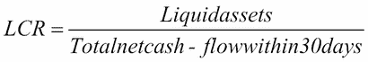

**净稳定资金比率**（**NSFR**）预计在 2018 年实施。该指标的目的是避免金融机构的资产和负债之间的到期差距。目标是为涉及负债稳定性的长期资产提供融资。因此，NSFR 被定义为稳定负债对稳定资产的融资比率。NSFR 的度量应在 2019 年达到至少 100％。

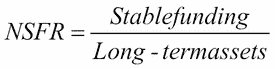

为了避免系统性风险，资本要求也与交易对手风险相关。关于交易对手的资本充足性和流动性状况的预期，依据巴塞尔 III 的规定进行框定。关于资本充足性，主要采用内部计算方法的机构将纳入新规定，因为该规定考虑了潜在风险的更详细审查，并考虑了与系统重要金融机构（SIFI）的风险暴露。根据巴塞尔协议的第三次修订，机构应根据某一指标识别 SIFI，并适用监管机构就此类机构设定的要求（参见*巴塞尔委员会历史*）。

《巴塞尔 III 的主要措施和逐步实施安排》包括在下表中：

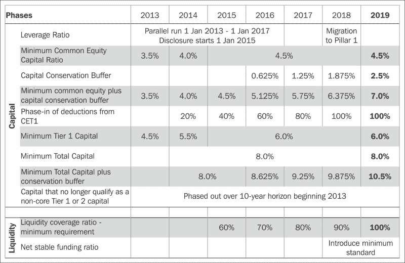

# 风险度量

财务风险是一个有形且可量化的概念，是你在某项金融投资中可能损失的价值。请注意，这里我们严格区分不确定性和风险，后者是可以通过数学统计方法测量的，并且有不同结果的准确概率。然而，金融风险有各种度量方式。最常见的风险度量是某项金融工具回报的标准差。尽管它非常普遍且易于使用，但也存在一些重大缺点。标准差作为风险度量的一个重要问题是，它将上行潜力与下行风险视为相同。换句话说，它同样惩罚那些可能带来巨大正回报和较小负回报的金融工具，而不是波动性较小的资产。

请考虑以下极端示例。假设我们在股市上有两只股票，并且我们可以精确地测量这两只股票在三种不同宏观经济事件下的收益。明年，对于股票 A，一家成熟企业的每股股票在经济增长时带来 5%的收益，在经济停滞时收益为 0%，而在经济衰退时则损失 5%。股票 B 是一家有前景的初创企业的股票；当经济环境良好时，它的股价飙升（+50%），在经济停滞时带来 30%的收益，甚至在经济萎缩时也有 20%的年收益。股票 A 和 B 的回报的统计标准差分别为 4.1%和 12.5%。因此，如果我们根据标准差来做选择，选择股票 A 比选择股票 B 的风险更大。然而，根据我们的常识，显然在所有不同的宏观经济情境下，股票 B 的表现都优于股票 A，因为它在所有情况下都能带来更好的收益。

我们的简单示例完美地展示了标准差作为风险度量的最大问题。标准差未能满足一个一致性风险度量的最简单条件——单调性。我们称σ风险度量为一致的，如果它是归一化的并且满足以下标准。有关一致性风险度量的更多信息，请参阅 Artzner 和 Delbaen 的研究：

+   **单调性**：如果投资组合*X[1]*在所有情境下的值都不低于投资组合*X[2]*，那么*X[1]*的风险应该低于*X[2]*。换句话说，如果一个工具在所有情况下支付的金额都比另一个工具多，那么它的风险应该更低。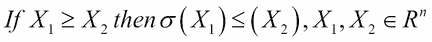

+   **次可加性**：两个投资组合的风险之和应该小于这两个投资组合单独风险的总和。这个标准代表了多样化原则。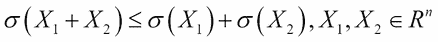

+   **正同质性**：将投资组合的值乘以一个常数，会使风险按相同的程度增加。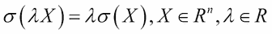

+   **平移不变性**：向投资组合中添加一个常数值会使风险按相同的数量减少。请参见以下公式：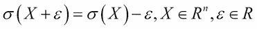

如果标准差不是一个可靠的风险度量，那么我们可以使用什么？这个问题在 1990 年代初由摩根大通 CEO Dennis Weatherstone 提出。他召集公司各部门准备著名的 4:15 报告，报告中他们汇总了所谓的风险价值，报告通常在市场收盘前 15 分钟进行统计。CEO 想要一个汇总的度量，显示公司在下一交易日可能损失的金额。由于这无法完全确定，尤其是在 1987 年黑色星期一之后，分析师们加入了 95%的概率。

显示在指定时间段内，在指定概率（显著性水平）下一个头寸可能损失的金额的图形被称为风险价值（VaR）。尽管它是相对较新的概念，但在风险部门和金融监管机构中已经得到了广泛使用。计算风险价值的方法有几种，可以分为三种不同的方法。在分析法 VaR 计算下，我们假设我们知道基础资产或收益的概率分布。如果我们不想做出这样的假设，我们可以使用历史 VaR 计算方法，基于过去实际实现的收益或资产价值。在这种情况下，隐含假设是，给定工具的过去发展是未来分布的良好估计。如果我们希望使用更复杂的分布函数，而这种函数通过分析难以解决，则蒙特卡洛模拟可能是计算 VaR 的最佳选择。通过这种方法，我们可以假设工具的分析分布，或者使用过去的值。后一种方法被称为历史模拟。

## 分析法 VaR

在采用分析法计算风险价值（VaR）时，我们需要假设金融工具的收益遵循某种数学概率分布。最常用的是正态分布，这也是我们通常称之为 delta-normal 方法的原因。数学上，*X ~ N (μ,σ)*，其中*μ*和*σ*分别是分布的均值和标准差参数。为了计算风险价值，我们需要找到一个阈值（T），使得大于该阈值的所有数据的概率为*α*（*α*是显著性水平，通常为 95%、99%、99.9%等）。使用标准正态分布的累积分布函数 F：

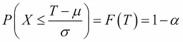

这意味着我们需要应用反向累积分布函数来计算*1 - α*：

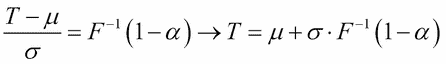

虽然我们不知道正态分布的累积分布函数及其反函数的封闭数学公式，但我们可以通过使用计算机来解决这个问题。

我们使用 R 计算苹果股票的 95%置信区间、1 天 VaR，采用 delta-normal 方法，并基于两年的数据集。苹果股票收益的估计均值和标准差分别为 0.13%和 1.36%。

以下代码计算了苹果股票的 VaR：

```py
Apple <- read.table("Apple.csv", header = T, sep = ";")
r <- log(head(Apple$Price,-1)/tail(Apple$Price,-1))
m <- mean(r)
s <- sd(r)
VaR1 <- -qnorm(0.05, m, s)
print(VaR1)
[1] 0.02110003

```

该阈值，即如果应用于收益时等于 VaR 的值，可以通过以下公式看出。请注意，我们总是取结果的绝对值，因为 VaR 被解释为一个正数：

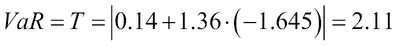

VaR（95%，1 天）的值为 2.11%。这意味着苹果股票在一天内下跌超过 2.11%的概率为 5%，而不超过 2.11%的概率为 95%。

下图展示了苹果收益的实际分布，并标出了历史风险价值：

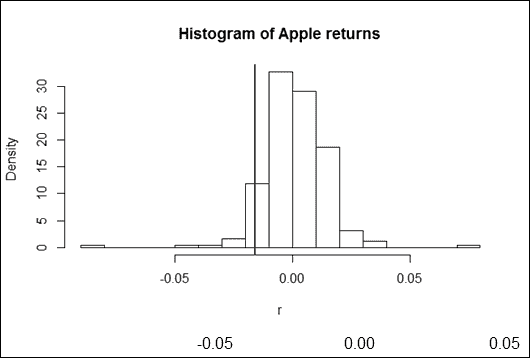

## 历史 VaR

计算风险价值的最简单方法是使用历史方法。在这种方法下，我们假设金融工具过去的收益分布也代表了未来。因此，我们需要找到一个阈值，超过该阈值的*α*部分值可以找到。在统计学中，这被称为百分位数。如果我们使用一个 95%的 VaR 水平，那么它意味着数据集的较低第五百分位。下面的代码展示了如何在 R 中计算百分位数：

```py
VaR2 <- -quantile(r, 0.05)print(VaR2)
 5% 
0.01574694

```

将这一方法应用于苹果股票，我们得到一个较低的第五百分位为 1.57%。风险价值是该百分位的绝对值。因此，我们可以说，苹果股票在一天内下跌超过 1.57%的概率只有 5%，或者该股票将有 95%的可能性下跌不到 1.57%。

## 蒙特卡罗模拟

计算风险价值的最复杂方法是蒙特卡罗模拟。然而，只有在其他方法无法使用时，这种方法才值得采用。这些原因可能是问题的复杂性或假设了难以处理的概率分布。尽管如此，这依然是展示 R 强大能力的最佳方法，R 可以支持风险管理。

蒙特卡罗模拟可以在金融和其他科学领域中应用。基本方法是建立一个模型，并假设外生变量的解析分布。下一步是根据假设的分布随机生成模型的输入数据。然后，收集结果并用来得出结论。当模拟输出数据准备好后，我们可以按照与使用历史方法相同的程序进行处理。

使用 10,000 步的蒙特卡罗模拟来计算苹果股票的风险价值可能看起来有些过度，但它是为了展示效果。相关的 R 代码如下：

```py
sim_norm_return <- rnorm(10000, m, s)
VaR3 <- -quantile(sim_norm_return, 0.05)
print(VaR3)
 5% 
0.02128257

```

我们通过模拟收益的较低第五百分位得出了 2.06%的风险价值。这与使用 delta-normal 方法估算的 2.11%非常接近，这并非巧合。因为假设收益服从正态分布的基本假设是相同的，因此，微小的差异仅仅是模拟随机性的结果。模拟步骤越多，结果越接近 delta-normal 估算。

蒙特卡洛方法的一个变种是历史模拟，其中假设的分布基于金融工具的过去数据。这里数据的生成不是基于分析的数学函数，而是通过独立同分布的方法从历史值中随机选择。

我们还使用了一个包含 10,000 个元素的模拟来预测苹果公司股票的回报。为了随机选择过去的数据，我们给它们分配了编号。下一步是模拟一个介于 1 和 251 之间的随机整数（即历史数据的数量），然后使用一个函数来查找相关的收益率。R 代码如下：

```py
sim_return <- r[ceiling(runif(10000)*251)]
VaR4 <- -quantile(sim_return, 0.05)
print(VaR4)
 5% 
0.01578806

```

VaR 的结果为 1.58%，这与原始历史方法得出的值接近，不足为奇。

如今，风险价值（VaR）是金融领域中衡量风险的常见指标。然而，通常情况下，它仍然不符合一致风险度量的标准，因为它未能满足次可加性。换句话说，在某些情况下，它可能会阻碍多元化。然而，如果我们假设回报服从椭圆分布函数，VaR 将证明是一个一致的风险度量。这本质上意味着，正态分布非常适合 VaR 的估算。唯一的问题是，现实中的股票回报相较于高斯曲线来说，呈现较高的尖峰和厚尾（leptokurtic）特征，这是金融中的一种风格化事实。

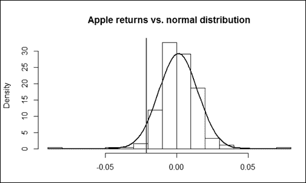

换句话说，现实中的股票回报往往表现出比正态分布所解释的更极端的损失和收益。因此，发展中的风险分析假设使用更复杂的分布来应对厚尾的股票回报、异方差性以及其他现实收益中的不完美性。

**预期损失**（**ES**）的使用也包含在发展中的风险分析中，这实际上是一个一致的风险度量，无论我们假设什么样的分布。预期损失集中在分布的尾部。它衡量的是超出风险价值的分布的期望值。换句话说，*α*显著性水平下的预期损失是最坏*α*百分比案例的期望值。从数学角度看，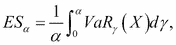。

在这里，*VaRγ*是回报分布的风险价值。

有时，预期损失被称为**条件风险价值**（**CVaR**）。然而，这两个术语并不完全相同；如果使用连续分布函数进行风险分析，它们可以作为同义词。尽管 R 语言能够处理像预期损失这样的复杂问题，但这超出了本书的讨论范围。如需了解更多信息，请参见*Acerbi, C.; Tasche, D. (2002)*的研究。

# 风险类别

银行面临各种风险，例如客户违约、市场环境变化、再融资困难和欺诈。这些风险被归类为信用风险、市场风险和操作风险。

## 市场风险

市场价格变动带来的损失由市场风险覆盖。它可能包括银行或金融机构交易账簿头寸的损失，但与银行核心业务相关的利率或货币损失也属于市场风险。市场风险可以包括几个子类别，如股权风险、利率风险、汇率风险和商品风险。流动性风险也涵盖在这个话题中。根据巴塞尔 II 指令的高级方法，覆盖这些风险所需的资本主要基于风险价值计算。

汇率风险是指外汇汇率变动（例如，欧元/美元）的可能损失，或其衍生产品的可能损失，而商品风险则涵盖了商品价格变动（例如，黄金、原油、小麦、铜等）带来的损失。如果银行的外汇敞口在资金和贷款之间存在不匹配，汇率风险也可能影响银行的核心业务。外汇不匹配可能会给银行带来严重的风险，因此监管机构通常会对所谓的外汇敞口的最大金额施加严格限制。这导致银行负债和资产之间的外汇敞口不匹配。可以通过某些对冲交易（如跨货币掉期、货币期货、远期、外汇期权等）来应对这一问题。

股权风险是指股票、股票指数或以股权为基础的衍生产品可能的损失。我们已经看到了如何使用标准差或风险价值来衡量股权风险的示例。现在，我们将展示如何利用前述技术来衡量股权衍生品组合的风险。首先，我们来看一个单一的看涨期权的风险价值，然后我们分析如何通过这种方法处理看涨期权和看跌期权的组合。

首先，假设黑-斯科尔斯模型的所有条件都来源于市场。如需了解更多关于黑-斯科尔斯模型及其条件的信息，请参考*John. C. Hull [9]*的书籍。当前一只股票的交易价格为 S = 100 美元，该股票不支付股息，并遵循几何布朗运动，*μ*等于 20%（漂移率），*σ*等于 30%（波动率）参数。

一只在两年后到期的此股票的平值（ATM）看涨期权，我们希望确定该期权在一年内的 95%风险价值。我们知道该股票价格遵循对数正态分布，而对数回报率则遵循正态分布，具有以下*m*和*s*参数：

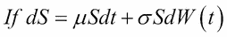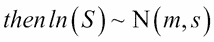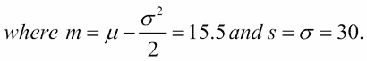

现在，让我们计算在假设满足 Black-Scholes 条件下衍生品的当前价格。使用 Black-Scholes 公式，期权的两年期价格为 25.98 美元：

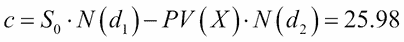

请注意，期权价格是标的物现货价格的单调增长函数。

这个特性在解决这个问题时对我们非常有帮助。我们需要的是一个期权价格阈值，低于此阈值时，只有 5% 的概率会发生。然而，由于它是标的物现货价格 *S* 的单调增长函数，我们只需要知道股票价格的这个阈值在哪里。给定 *m* 和 *s* 参数，我们可以使用以下公式轻松找到这个值：

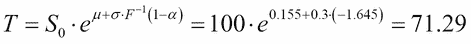

因此，我们现在知道，在一年内（*m* 和 *s* 参数的时间周期为一年），股票价格低于 71.29 美元的概率只有 5%。如果我们将 Black-Scholes 公式应用于这个价格，并将期权的到期时间减去一年，我们可以得到期权价格的阈值。

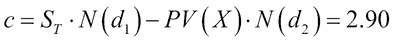

现在，我们知道在一年内，期权价格超过 2.90 美元的概率为 95%。因此，我们最多失去的价值是实际期权价格与阈值之间的差异。所以，期权的 95% VaR（在一年内）如下所示：

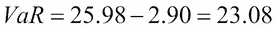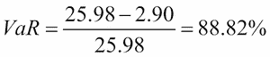

因此，给定股票的期权在一年内有 5% 的概率会损失超过 23.08 美元或 88.82%。

以下是 R 代码中显示的计算。请注意，在运行代码之前，我们需要通过以下命令安装 `fOptions` 库：

```py
install.packages("fOptions")
library(fOptions)

X <- 100
Time <- 2
r <- 0.1
sigma <- 0.3
mu <- 0.2
S <- seq(1,200, length = 1000)
call_price <- sapply(S, function(S) GBSOption("c", S, X, Time, r, r, sigma)@price)
plot(S, call_price, type = "l", ylab = "", main = "Call option price in function of stock prompt price")

```

以下截图是前述命令的结果：

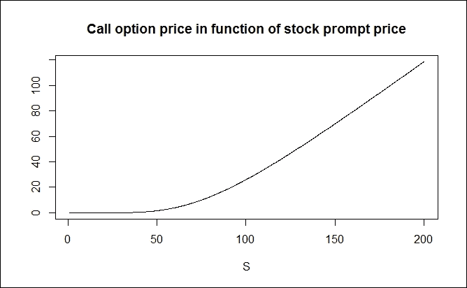

如果我们想找出某个包含看涨和看跌期权的投资组合的风险价值，情况就没有那么简单了。让我们以之前的例子为例，假设股票价格为 100 美元。现在，我们在投资组合中除了 ATM 看涨期权外，还添加了一个 ATM 看跌期权，形成一个在金融中称为跨式期权（straddle）的复杂仓位。从我们的角度来看，这个投资组合的问题在于股票价格函数的非单调性。如下一张图所示，当期权即将到期时，这个投资组合的价值与股票价格的关系呈抛物线形状，或者类似于一个 V 字形。

因此，之前通过寻找适当的股票价格阈值来计算期权价格阈值的逻辑在这里不起作用。然而，我们可以使用蒙特卡洛模拟方法来推导出所需的值。

首先，让我们使用所谓的买卖平价公式，利用之前计算的看涨期权价格来得到看跌期权的价值。买卖平价公式计算如下：

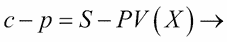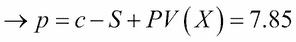

这里，*c* 和 *p* 分别是看涨和看跌期权的价格，两者的行权价为 *X*，*S* 是实际的股票价格 *Hull (2002)*。因此，整个投资组合的价值为 33.82 美元。

现在，我们使用模拟方法收集 10,000 次可能的投资组合价值实现，这些实现是通过随机生成的输入数据集得出的。我们确保股票遵循几何布朗运动，并且对数收益率遵循正态分布，其 *m* 和 *s* 参数分别为 15.5% 和 30%。将生成的对数收益率应用于原始股票价格（100 美元），我们将得到一年的模拟股票价格。这可以用来使用 Black-Scholes 公式重新计算看涨和看跌期权的价值。请注意，在这里，我们将原始股票价格替换为模拟股票价格，同时在计算时使用一年的较短到期时间。最后一步，我们生成 10,000 次模拟投资组合价值（c + p）的实现，然后找到较低的第五百分位。这将是期权投资组合价值只有 5% 的情况会低于此阈值。步骤可以在以下代码中看到：

```py
X <- 100
Time <- 2
r <- 0.1
sigma <- 0.3
mu <- 0.2
S <- seq(1,200, length = 1000)
call_price <- sapply(S, function(S) GBSOption("c", S, X, Time, r, r, sigma)@price)
put_price <- sapply(S, function(S) GBSOption("p", S, X, Time, r, r, sigma)@price)
portfolio_price <- call_price + put_price
windows()
plot(S, portfolio_price, type = "l", ylab = "", main = "Portfolio price in function of stock prompt price")
# portfolio VaR simulation
p0 <- GBSOption("c", 100, X, Time, r, r, sigma)@price + GBSOption("p", 100, X, Time, r, r, sigma)@price
print(paste("price of portfolio:",p0))
[1] "price of portfolio: 33.8240537586255"
S1 <- 100*exp(rnorm(10000, mu - sigma² / 2 , sigma))
P1 <- sapply(S1, function(S) GxBSOption("c", S, X, 1, r, r, sigma)@price + GBSOption("p", S, X, 1, r, r, sigma)@price )
VaR <- quantile(P1, 0.05)
print(paste("95% VaR of portfolio: ", p0 - VaR))

```

前面的命令会产生以下输出：

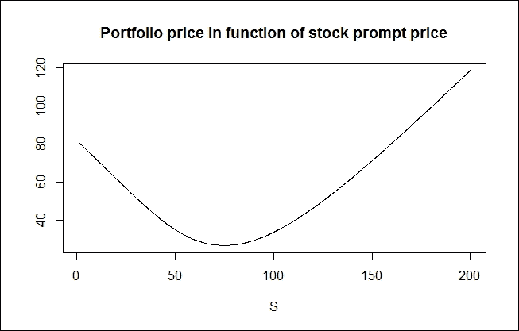

期望的阈值为 21.45 美元；因此，投资组合的风险价值为 33.82 - 21.45 = 12.37 美元。因此，投资组合在一年内损失超过 12.37 美元的概率仅为 5%。

利率风险来源于银行的核心业务，即银行的贷款和再融资活动。然而，它还包括由于利率不利变动可能导致的债券或固定收益衍生品的损失。利率风险是银行面临的最重要市场风险，因为银行通常使用短期资金（如客户存款、银行间贷款等）来再融资长期资产（如住房贷款、政府债券等）。

计算一个头寸或整个投资组合的风险价值是衡量银行或金融机构市场风险的有用工具。然而，也有其他几种工具可以用来衡量和应对利率风险。例如，分析资产和负债之间的利率敏感性缺口就是一种工具。这种方法是资产负债管理中最早用来衡量和应对利率风险的技术之一，但它比现代的风险衡量方法要准确性差得多。在利率敏感性缺口分析中，资产和负债的项目根据平均到期日或利率重设时间（如果资产或负债是浮动利率）进行分类。然后，在每个时间段类别中比较资产和负债项目，以详细了解利率敏感性不匹配的情况。

基于 VaR（风险价值）的方法是一种更为成熟且精确的衡量银行或金融机构利率风险的方式。该方法同样基于利率敏感性，通过固定收益投资组合的久期（及凸性）来表示，而不是资产和负债之间的到期不匹配。

## 信用风险

银行面临的主要风险是借款人可能违约，即未按时支付所需款项。在这种情况下，风险在于贷方可能会失去本金、利息及所有相关支付。损失可以是部分的，也可以是完全的，具体取决于担保物和其他缓解因素。违约可能由多种不同情况引起，如零售借款人未能偿还按揭、信用卡或个人贷款；公司、银行或保险公司破产；未能按时支付到期账单；债务人未支付债务证券等。

信用风险的预期损失可以通过三个不同因素的乘积来表示：PD、LGD 和 EAD：

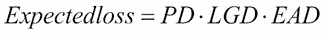

违约概率（PD）是指发生违约事件的可能性。这是所有信用风险模型的关键因素，有多种方法可以用来估算该值。违约损失（LGD）是指在违约情况下，按债务证券面值计算的损失比例。**回收率**（**RR**）是 LGD 的逆，表示即使借款人违约，仍然可以回收的金额。回收率受到担保物和其他缓解因素的影响。违约暴露（EAD）是指在违约情况下，暴露于特定信用风险的债务证券面值。

银行和金融机构使用不同的方法来衡量和处理信用风险。为了降低信用风险，所有三个因素（违约概率、违约损失和风险暴露）都可能成为关注的重点。为了控制风险暴露，银行可能会对特定客户群体（消费者、公司和主权国家）进行贷款限额和限制。违约损失可以通过使用担保物（如房地产抵押权、证券和担保）来降低。担保物为贷方提供安全保障，确保他们至少能收回部分款项。还可以通过其他工具来减少违约损失，如信用衍生品和信用保险。

**信用违约掉期**（**CDS**）是一种金融掉期协议，作为对第三方违约的保险。CDS 的发行人或卖方同意在债务持有人违约时向买方赔偿。买方支付卖方定期费用，费用为债券或其他债务证券面值的百分比。在发生信用事件时，卖方向买方支付面值并接收债券。如果债务人未违约，则 CDS 交易在到期时终止，卖方无需支付任何款项。

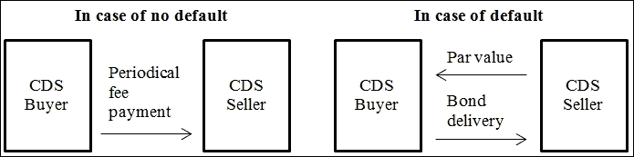

默认风险可以通过对业务合作伙伴和借款人的尽职调查、使用契约和严格的政策来降低。银行使用多种尽职调查方法，从标准化的评分过程到对客户的更复杂的深入研究。通过应用这些方法，银行可以筛选出那些违约概率过高的客户，从而避免其影响资本状况。信用风险也可以通过基于风险的定价来降低。较高的违约概率意味着信用风险的预期损失较高，这部分损失需要通过对特定客户应用的利差来覆盖。银行需要在正常的业务过程中解决这个问题，只需为意外损失准备资本。因此，信用风险的预期损失应成为产品定价的基本组成部分。

估算违约概率是所有银行和金融机构非常重要的问题。我们有几种方法，其中我们将探讨三种不同的方法：

+   隐含概率是通过市场上风险债券或信用违约掉期（例如，Hull-White 方法）的市场定价得出的。

+   结构性模型（例如，KMV 模型）

+   当前和历史信用评级的变动（例如，CreditMetrics）

第一种方法假设市场上有与具有信用风险的工具相关的交易产品作为基础资产。还假设这种风险已完全体现在这些工具的市场定价中。例如，如果一个风险较高的公司债券在市场上交易，那么该债券的价格会低于无风险证券的价格。如果市场上有针对某一债券的信用违约掉期（CDS）交易，那么它也反映了市场对该证券风险的评估。如果市场上有足够的流动性，那么预期的信用风险损失应该等于风险的观察价格。如果我们知道这个价格，我们就可以确定隐含的违约概率。

让我们看一个简短的例子。假设一家 BBB 评级公司发行的面值 1,000 美元的 1 年期零息债券的到期收益率（YTM）为 5%。一只类似特征但无信用风险的 AAA 评级政府短期国债的到期收益率为 3%。我们知道，如果企业债券违约，将会回收 30%的面值。如果市场价格准确，那么该债券的违约概率是多少？

首先，我们需要计算企业债券和政府债券的当前市场价格。企业债券应该以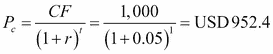的价格交易。同样，政府债券应该以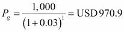的价格交易。

两只债券之间的价格差异为 18.5 美元。预计的信用损失为违约概率（PD）∙损失给付率（LGD）∙暴露于违约的敞口（EAD）在一年内的预期值。如果我们想通过保险或 CDS 对信用损失进行对冲，那么这个金额的现值将是我们愿意支付的最大金额。因此，两个债券之间的价格差异应等于预计信用损失的现值。LGD 为 70%，因为在违约情况下，面值的 30%会被回收。

因此， 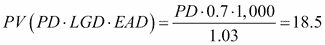 或 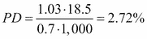。

所以，如果市场定价合理，那么在接下来的一年中，隐含的违约概率为 2.72%。如果市场上有与特定债券相关的信用衍生品，这种方法也可以使用。

结构性方法通过基于暴露于信用风险的金融工具的特征创建数学模型。一个常见的例子是由三位数学家斯蒂芬·凯尔霍费尔、约翰·麦克昆和奥尔德里奇·瓦希切克共同创立的公司开发的 KMV 模型。该公司在 2002 年被穆迪评级公司收购后，目前以穆迪分析的名义运营。

KMV 模型基于梅尔顿的信用模型（1974），该模型将具有信用风险的公司债务和股权证券视为类似于期权的衍生品。基本思想是，如果公司具备偿付能力，那么其资产的市场价值（或企业价值）应当超过其持有的债务的面值。因此，在公司债券到期之前，它们会评估债务的面值和股权的价值（上市公司的市值）。然而，如果资产价值在到期时未能达到债务的面值，股东可能会决定筹集资本或破产。如果发生后者，企业债券的市场价值将等于资产价值，并且股东在清算过程中将一无所获。

破产和资本筹集之间的选择称为破产期权，它具有看跌期权的特点。之所以存在这种期权，是因为股东对公司没有超过他们所投资金额的责任（股价不能跌至负值）。更具体地说，公司的债券价值是没有信用风险的债券和破产期权的组合，从债权人的角度来看，这是一个空头看跌期权（长期债券 + 空头看跌期权）。

公司的股权可以视为一个看涨期权（长期看涨期权）。公司的资产价值是所有方程式的总和，如下公式所示： 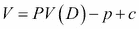，其中 *D* 是公司债务的面值，*V* 是资产价值，*c* 是股权的市场价值（在此指代看涨期权），*p* 是破产期权的价值。

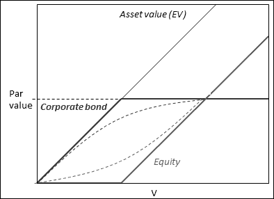

KMV 模型

实际操作中，资产价值和股权的波动率都是计算有风险公司债券实际价值所必需的。上市公司的股权波动率可以通过股票价格波动轻松估算，但资产波动率则无法获取，因为实际经济商品通常不在公开市场上交易。资产的市场价值由于同样的原因也很难估算。因此，KMV 方法有两个方程和两个未知数。这两个方程是基于 Black-Scholes 理论的条件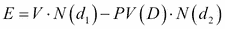，该理论基于 Black-Scholes 方程，和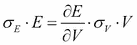，该方程基于伊藤引理，其中*E*和*V*分别是股权和资产的市场价值，*D*是债券的面值，*σ[E]*和*σ[V]*是股权和资产的波动率。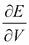是*E*对*V*的导数，它等于*N(d[1])*，这是基于 Black-Scholes 理论的结果。两个未知数是*V*和*σ[V]*。

现在，让我们来看一个例子，其中一家公司股权的市场价值（市值）为 30 亿美元，波动率为 80%。该公司拥有一系列面值为 100 亿美元的零息债券，且这些债券将在一年后到期。无风险对数收益率为 5%。

上述方程的解可以通过 R 语言求得，如下所示：

```py
install.packages("fOptions")
library(fOptions)
kmv_error <- function(V_and_vol_V, E=3,Time=1,D=10,vol_E=0.8,r=0.05){
 V <- V_and_vol_V[1]
 vol_V <- V_and_vol_V[2]
 E_ <- GBSOption("c", V, D, Time, r, r, vol_V)@price
 tmp <- vol_V*sqrt(Time)
 d1 <- log(V/(D*exp(-r*Time)))/tmp + tmp/2
 Nd1 <- pnorm(d1)
 vol_E_ <- Nd1*V/E*vol_V
 err <- c(E_ - E, vol_E_ - vol_E)
 err[1]²+err[2]²
}
a <- optim(c(1,1), fn = kmv_error)
print(a)

```

该公司债券的总价值为 94 亿美元，收益率到期的对数为 6.44%，而资产的价值为 124 亿美元，波动率为 21.2%。

第三种估算违约概率的方法是基于评级的方法。该方法从不同金融工具或经济实体（公司、主权国家和机构）的信用评级出发进行估算。CreditMetrics 分析最初由摩根大通的风险管理部门于 1997 年开发。从那时起，它不断发展，现在已经成为其他风险管理工具中广泛使用的工具。CreditMetrics 的基本思路是估算一个实体的信用评级如何随时间变化，以及这种变化如何影响该实体所发行的证券的价值。该方法从分析评级历史开始，然后创建一个所谓的转移矩阵，其中包含信用评级可能发展的概率。有关 CreditMetrics 的更多信息，请参阅 MSCI 发布的技术书籍（*1987 年银行监管与监督实践委员会*）。

## 操作风险

第三类主要风险是操作风险。这指的是银行、金融机构或其他公司在运营过程中可能遭遇的所有损失。它包括自然灾害、内部或外部欺诈（例如银行抢劫）、系统故障或故障、以及工作流程不当等导致的损失。以下是这些风险可以被划分为的四个不同类别：

+   **低影响且低概率**：如果风险及其对操作的潜在影响都很低，那么就不值得花力气去处理它。

+   **低影响且高概率**：如果风险事件发生得过于频繁，意味着公司的一些流程应当进行重组，或者应将其纳入某项操作的定价中。

+   **高影响且低概率**：如果高影响事件的发生概率较低，最适合的风险缓解方法是为这些事件投保。

+   **高影响且高概率**：如果这种风险的影响和概率都很高，那么最好关闭该操作。在这种情况下，无论是重组还是保险都不起作用。

这部分的风险管理更属于精算学范畴，而非金融分析。然而，R 提供的工具也能处理类似的问题。我们以 IT 系统故障可能带来的操作损失为例。故障次数遵循参数为λ = 20 的泊松分布，而每次损失的大小遵循对数正态分布，其中*m*为 5，*s*为 2。根据泊松分布，年均故障次数为 20，而损失大小的期望值为：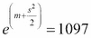。

然而，我们需要确定联合分布、期望值以及 99.9%聚合年损失的分位数。后者将用于确定《巴塞尔协议Ⅱ》高级计量法（AMA）所要求的必要资本。我们使用了 10,000 元素的蒙特卡罗模拟。第一步是生成一个遵循泊松分布的离散随机变量。接着，我们根据之前生成的整数个数，生成符合对数正态分布的独立变量，并将其聚合。通过重复这个过程 10,000 次，我们可以创建聚合损失的分布。聚合损失的期望值为 21,694 美元，99.9%的分位数为 382,247 美元。

因此，在 1 年内，我们只会在 IT 系统故障的情况下，在 0.1%的概率下损失超过 382,000 美元。计算过程可以在 R 中看到：

```py
op <- function(){
n <- rpois(1, 20)
z <- rlnorm(n,5,2)
sum(z)
}
Loss <- replicate(10000, op())
hist(Loss[Loss<50000], main = "", breaks = 20, xlab = "", ylab = "")
print(paste("Expected loss = ", mean(Loss)))
print(paste("99.9% quantile of loss = ", quantile(Loss, 0.999)))

```

以下是前述命令的截图：

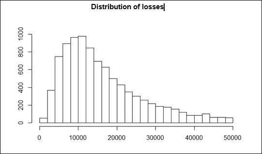

我们可以从前述图表中看到聚合损失的分布，这与对数正态分布相似，但不一定是对数正态分布。

# 总结

在这一章节中，我们学习了巴塞尔协议的基本原则，银行监管中的资本充足性要求，风险度量和不同的风险类型，最重要的是，R 语言在风险管理中的强大工具。

我们了解到，巴塞尔协议是全球统一的银行监管框架，并且我们学习了金融监管的持续发展和更为复杂的方法。此外，我们提供了关于风险度量的见解，从最简单的回报标准差到更复杂的度量，最重要的是，风险价值（VaR）。然而，我们看到 VaR 不一定是一个一致的风险度量，但它仍然是监管和风险管理中最广泛使用的指标之一。

我们讨论了银行或金融机构面临的主要风险类型，即信用风险、市场风险和操作风险。你可以看到不同的风险管理方法如何用来计算各种风险类型的潜在损失以及相关的资本充足性。最后，我们展示了几个例子，说明如何使用 R 语言轻松解决风险管理中的复杂问题。

# 参考文献

[1] 巴塞尔委员会历史

[2] 巴塞尔银行监管委员会（章程）

[3] 银行监管与监督实践委员会（1987）：资本测量和资本标准国际趋同建议；咨询文件；1987 年 12 月

[4] 巴塞尔银行监管委员会（1999）：新的资本充足性框架；咨询文件；1999 年 6 月

[5] Artzner, P.; Delbaen, F.; Eber, J. M.; Heath, D. (1999). *一致的风险度量*。数学金融学，9（第 3 版）：p. 203

[6] Wilmott, P. (2006). *定量金融 1*（第 2 版）：p. 342

[7] Acerbi, C.; Tasche, D. (2002). *预期损失：一种自然一致的风险价值替代方法*。经济学笔记 31: p. 379–388

[8] 巴塞尔 II 综合版本

[9] Hull, J. C. (2002). *期权、期货与其他衍生品*（第 5 版）

[10] *信用风险管理原则 - 最终文件*。巴塞尔银行监管委员会。国际清算银行（BIS）。(2000)

[11] Crosbie, P., Bohn, J. (2003): *违约风险建模。技术报告，穆迪 KMV*

[12] Crouhy, M., Galai, D., Mark, R. (2000): *当前信用风险模型的比较分析*。银行与金融学报, 24:59–117

[13] MSCI CreditMetrics 技术手册
