# 第十三章：系统性风险

当前危机的主要教训之一是，一些机构因其规模或特殊角色而承担着对金融系统的突出风险。在危机期间，这些机构通常会获得国家援助，以防止整个系统崩溃，这也意味着国家和实际经济将承担更高的成本。最好的例子之一就是 AIG。由于其在 CDS 市场上的活动，联邦储备帮助这家保险公司避免了违约，因为没人知道该机构崩溃可能带来的后果。

这些教训促使中央银行和其他监管机构更加重视对**系统重要金融机构**（**SIFI**）的审查与监管。为此，SIFI 的精确识别在金融文献中变得愈发重要。扩展原有的简单技术，中央银行和监管机构倾向于使用基于网络理论方法的更复杂的技术，利用金融市场的交易数据。这些信息对投资者也非常重要，因为它有助于多元化他们对金融部门的风险敞口。

本章旨在介绍基于网络理论的两种技术，这些技术可用于识别**系统重要金融机构**（**SIFI**），超越常用的中心性度量。

# 系统性风险简述

全球金融危机凸显了某些金融机构的规模与实际经济相比过大，或者它们与重要对手方的联系过多。因此，任何影响这些机构的问题都可能对整个金融系统和实际经济产生致命影响。正因如此，政府在拯救这些机构时不遗余力。全球范围内有多个例子表明，政府或中央银行为其最重要的金融机构提供担保、注入资本、提供资金贷款或支持收购（例如，北岩银行、AIG 或贝尔斯登）。

如果没有这些步骤，金融体系崩溃的可能性似乎过高，这将伴随极高的成本，因为需要进行救助。总的来说，**系统重要金融机构**的识别再次成为一个热门话题。危机的主要教训之一是，即使在正常时期，规模最大、联系最广泛的机构也必须以不同的方式进行处理。根据新的巴塞尔框架，系统重要机构必须比其不太重要的合作伙伴受到更严格的监管。由于这些机构在金融体系中的核心作用和它们的相互联系，这些机构的失败可能会引发金融系统的震荡波，进而对实际经济造成损害。个别机构在追求最大化利润的过程中做出的理性选择，在全系统层面可能是次优的，因为它们没有考虑到在压力时期可能带来的负面影响。

危机之前，个别金融机构的系统性角色主要在决定最后贷款人支持时进行评估。中央银行在决定是否在严重问题时向银行提供贷款时，会考虑银行的系统性角色。关于不同国家使用的分析技术的调查发现，在许多情况下，监管机构在评估系统性重要性时采用了类似的方法。实践中存在多种不同的方法，从传统技术（例如，关注市场份额的基于指标的方法）和复杂的定量模型，到包括市场情报的定性标准（*FSB（2009）*）。基于指标的方法可能包括几种不同类型的比率（*BIS（2011）*）。通常，金融市场、金融基础设施和金融中介在检查中是重点，但实际的指标集可以根据所调查的银行系统的特殊特征而在不同国家之间有所不同。

基于指标的方法主要关注每家银行在银行业务不同领域的市场份额（从资产到负债，从场外衍生品的名义价值到支付清算，它可能涵盖多个领域，*BIS（2011）*）。这些基于指标的方法有时不包含关于机构在金融市场上相互联系的信息。*Daróczi 等人（2013）*提供了一些关于如何将这些信息纳入系统性重要银行识别中的建议。应用于每家银行的简单网络度量可以扩展传统的基于指标的方法。在金融文献中，许多不同的度量方法被用来评估网络的稳定性或评估单个机构的角色。*Iazetta 和 Manna（2009）*使用了所谓的地理距离频率（也称为“中介性”）和度数来评估网络的韧性。

他们发现，这些比率的使用有助于识别系统中的大玩家。*Berlinger 等人（2011）*也使用了网络度量来检查单个机构在系统中的角色。

在本章中，我们不会包括这些方法，因为*Daróczi 等人（2013）*展示了理论及其在 R 中的应用。我们的重点将放在网络理论的两种不同方法上，这些方法在识别系统性重要性方面具有相关性，并且可以轻松应用。首先，我们将展示金融市场的核心-边缘分解。其次，我们将展示一种模拟方法，帮助我们在任何单个机构违约的情况下看到传染效应。

# 我们示例中使用的数据集

在本章中，我们将使用一个虚构的银行系统及其银行间存款市场。我们使用这个市场，因为它通常具有最大的潜在损失，因为这些交易没有抵押品。

为了进行这项分析，我们需要一个连通的网络，因此我们构建了一个。这个网络应该包含银行间相互之间的曝险信息。通常，我们有交易数据，比如在*表格 13.1*中所示。由于银行间市场的交易平均期限非常短，因此也可以使用这些数据。例如，我们可以通过使用每对银行之间的平均月交易量来构建这个网络。对于这种类型的分析，只有每笔交易的合作伙伴和合同规模是重要的。

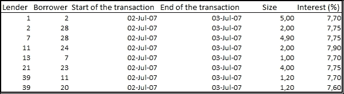

表格 13.1：交易数据集

通过所有这些信息，我们可以构建一个金融市场的矩阵（可以将其可视化为一个网络）。

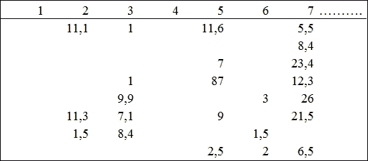

使用的矩阵

第一步将是对矩阵进行核心-外围分解。在这种情况下，我们只需要所谓的邻接矩阵***A***，其中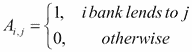。

模拟方法会复杂一些，因为我们需要更多的银行和交易信息。我们将不再使用邻接矩阵，而是需要一个加权矩阵***W***，其中权重是交易规模：

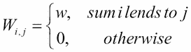

*图 13.2* 显示了所考察市场在样本期间的加权网络：

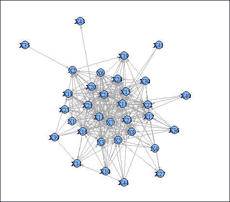

图 13.2：银行间存款市场的网络

我们还需要一些关于银行的特定信息。向量*C*将包含关于银行资本位置的信息。*C[i]*表示银行*i*在给定货币下的资本缓冲超出监管最低要求的部分。当然，是否考虑资本缓冲或全部监管资本是一个决策问题。在我们看来，最好使用资本缓冲，因为如果银行失去了整个缓冲，监管机构将会采取措施。向量*S*将包含每家银行的规模。*S[i]*将是银行*i*的资产负债表总额。

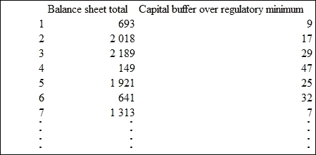

图 13.3：资本位置和规模的向量

# 核心-外围分解

银行间市场是分层的，并以分级的方式运作。这些市场的一个众所周知的特点是，许多银行仅与少数大型机构进行交易，而这些大型机构则充当中介或资金中心银行。这些大型机构被认为是网络的核心，而其他的则是外围。

许多论文关注现实世界网络的这一特征。例如，*Borgatti 和 Everett（1999）*在一个由引文数据构成的网络上研究了这一现象，发现三本期刊是核心成员。Craig 和 von Peter（2010）将这一核心/外围结构应用于德国的银行间市场。他们的研究发现，银行的特定特征有助于解释银行如何在银行间市场中定位自己。网络中的大小和位置之间存在强烈的相关性。由于分层不是随机的而是行为性的，银行系统围绕一个货币中心银行的核心组织起来具有经济原因（例如，固定成本）。这一发现还意味着核心性可以是衡量系统性重要性的一个良好指标。

网络的完美核心-外围结构可以通过*图 13.3*中的矩阵轻松展示。核心银行位于矩阵的左上角。所有这些银行相互连接，可以被视为中介。它们负责市场的稳定，其他银行则通过这些核心机构相互连接。在右下角是外围银行。它们与其他外围机构没有任何连接，只与核心银行连接，如以下截图所示：

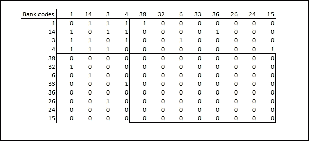

图 13.4：核心外围结构中的邻接矩阵

Craig 和 von Peter（2010）还提出，不仅矩阵的核心-核心部分或外围-外围部分很重要，核心-外围部分同样重要（右上角和左下角）。他们强调，所有核心银行都应该至少与一个外围机构有连接。这一特征意味着该外围银行除了通过核心银行外，没有其他可能性参与该市场。尽管这是一个重要问题，我们认为，由于可能的传染效应，成为核心银行本身就可能导致系统性重要性。

在许多情况下，现实世界网络中无法获得纯粹的核心/外围分解。尤其是在我们对矩阵的核心-外围部分有特定要求时，这一点尤为真实。因此，在第一步中，我们将尝试解决最大团问题（例如，通过使用 Bron-Kerbosch 算法，*Bron 和 Kerbosch 1973*），然后在第二步中，我们将选择外围-外围部分中平均度最低的结果。还有许多其他不同的方法可以进行核心-外围分解。由于其简单性，我们选择了这一方法。

## R 中的实现

在本小节中，我们展示了如何编程核心-外围分解。我们将涵盖所有相关信息，从下载必要的 R 包到加载数据集，从分解本身到结果的可视化。我们将分小部分展示代码，并对每部分进行详细解释。

我们设置将在模拟过程中使用的库。代码将在此库中查找输入数据文件。我们下载了一个 R 包 `igraph`，它是可视化金融网络中的一个重要工具。当然，在第一次运行此代码后，这一行可能会被删除，因为安装过程不应再次重复。最后，在安装之后，该包应该首先加载到当前的 R 会话中。

```py
install.packages("igraph")
library(igraph)

```

第二步，我们加载数据集，在这种情况下数据集仅为矩阵。导入的数据是一个数据框，必须转换为矩阵形式。如前所示（*图 13.1*），当两个银行之间没有交易时，矩阵不包含数据。第三行将这些单元格填充为 0。然后，由于我们只需要邻接矩阵，我们将所有非零单元格的值更改为 1。最后，我们从邻接矩阵创建一个图作为对象。

```py
adj_mtx <-  read.table("mtx.csv", header = T, sep = ";")
adj_mtx <- as.matrix(adj_mtx)
adj_mtx[is.na(adj_mtx)] <- 0
adj_mtx[adj_mtx != 0] <- 1
G <- graph.adjacency(adj_mtx, mode = "undirected")

```

`igraph` 包有一个名为 `largest.clique` 的函数，它返回最大团问题的解的列表。CORE 将包含所有最大团的集合。命令如下：

```py
CORE <- largest.cliques(G) 

```

最大团将成为图的核心，其补集将是外围。我们为每个结果的最大团创建外围。然后，我们为核心节点和外围节点设置不同的颜色，这有助于在图表中区分它们。

```py
for (i in 1:length(CORE)){ 
core <- CORE[[i]]
periphery <- setdiff(1:33, core)
V(G)$color[periphery] <- rgb(0,1,0)
V(G)$color[core] <- rgb(1,0,0)
print(i)
print(core)
print(periphery)

```

然后，我们计算外围-外围矩阵的平均度数。对于系统重要性金融机构的识别，当该平均度数最低时是最好的解决方案。

```py
H <- induced.subgraph(G, periphery)
d <- mean(degree(H))

```

最后，我们在一个新窗口中绘制图表。图表还将包含外围矩阵的平均度数。

```py
windows()
plot(G, vertex.color = V(G)$color, main = paste("Avg periphery degree:", round(d,2) ) )}

```

## 结果

通过运行代码，我们获得了核心-外围分解的所有解决方案的图表。在每种情况下，图表上都会显示外围的平均度数。我们选择了外围度数最小的解决方案。这意味着在该解决方案中，外围银行之间的连接非常有限。核心中的问题可能导致它们无法访问市场。另一方面，由于核心是完全连接的，传染过程可能会很快展开，并且能影响到每个银行。总之，任何核心银行的违约都会危及外围银行的市场准入，并可能成为传染过程的源头。*图 13.5* 展示了通过这种简单方法获得的核心-外围分解的最佳解决方案。

根据结果，12 家银行可以被视为系统重要性金融机构，分别是 5、7、8、11、13、20、21、22、23、24、28 和 30。

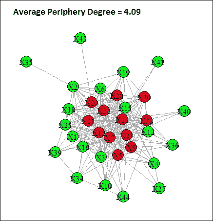

图 13.5：核心-外围分解法，最小外围度

# 模拟方法

从系统性角度理解银行的角色的最佳方式是模拟其违约的影响。通过这种方式，我们可以得到银行系统重要性的最精确结果。通常，这些方法的主要问题在于数据需求。个别机构的主要特征（例如资本缓冲或规模）不足以进行此类分析。我们还必须准确了解其通过金融市场对其他银行的敞口，因为最重要的传播渠道是金融市场。

在本节中，我们将展示一种简单的方法来识别金融机构的系统重要性。为了尽可能简化，我们需要做一些假设：

+   我们将研究特定违约的影响。违约后，所有传播效应会突然通过网络传播。

+   由于所有影响都突然发生，银行不会有任何调整程序。

+   所有银行的 LGD（损失给付率）是固定的。有一些模型考虑到 LGD 可能因银行而异（例如，*Eisenberg 和 Noe, 2001*），但这会使我们的模型过于复杂。

+   我们不考虑违约后法律程序的时长。在实际中，这应当在 LGD 中加以考虑。

正如我们在数据部分所提到的，我们需要三种数据集。首先，我们需要包含银行之间在同业存款市场上敞口的矩阵。由于这些交易没有抵押，潜在损失在这个市场上是最大的。其次，我们需要每家银行的资本缓冲大小。较高的资本缓冲可以显著减少传播效应的可能性。因此，检查什么可以视为资本缓冲总是很重要。我们的观点是，在此类分析中，只有超过监管最低要求的资本应当被纳入考虑，以尽可能谨慎。第三，我们需要每家银行的规模。为了评估某家银行违约的影响，我们需要被感染银行的规模。在我们的示例中，我们使用资产负债表总额，但也可以使用其他衡量标准。所选择的衡量标准必须能够反映对实体经济的影响（例如，可以是企业贷款组合的规模或存款存量等）。

## 模拟

作为第一步，我们随机选择一个银行（任何银行，因为我们会对每个银行进行此操作），假设它在一次特殊冲击后违约。矩阵包含了所有向该银行借款的银行的信息。*W[ij]* 是银行 *j* 从银行 *i* 借款的金额。L 是 LGD，即与敞口相关的损失比例。当以下不等式成立时，即银行 *i* 从银行 *j* 违约中遭受的损失超过了银行 *i* 的资本缓冲区时，银行 *i* 必须被视为违约。

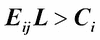

结果是，我们得到了所有在银行 *j* 倒闭后违约的伙伴银行。我们对所有新违约银行的伙伴银行进行第一步操作。我们继续进行模拟，直到达到一个平衡状态，即没有新的违约发生。

我们为每个银行做这个模拟，即我们试图找出在其因传染效应倒闭后，哪些银行会违约。最后，我们汇总每种情况下违约银行的资产负债表总额。我们的最终结果将是一个列表，包含了每家银行违约的潜在影响，基于受影响银行的市场份额。

## R 语言中的实现

在本节中，我们将展示如何在 R 中实现这种模拟技术。我们将像之前一样展示完整的代码。代码中的一些部分也用于核心-边缘区分，因此我们不会对这些部分进行详细解释。

在前几行中，我们设置了一些基本信息。有两行需要解释。首先，我们设置了 LGD 的值。正如我们稍后看到的，使用不同的 LGD 进行检查是非常重要的，因为我们的模拟对 LGD 的水平敏感。该值可以是从 0 到 1 之间的任何数。其次，那些绘制网络的算法使用了一个随机数生成器。`Set.seed` 命令设置了随机数生成器的初始值，以确保我们获得具有相同外观的图表。

```py
LGD = 0.65
set.seed(3052343)
library(igraph)

```

在代码的下一部分，我们加载将在模型中使用的数据，即网络的矩阵（`mtx.csv`）、资本缓冲区的向量（`puf.csv`）以及银行规模的向量（`sizes.csv`）。

```py
adj_mtx <-  read.table("mtx.csv", header = T, sep = ";")
node_w <-   read.table("puf.csv", header = T, sep = ";")
node_s <- read.table("sizes.csv", header = T, sep = ";")
adj_mtx <- as.matrix(adj_mtx)
adj_mtx[is.na(adj_mtx)] <- 0

```

在模拟过程中，邻接矩阵是不够的，这与核心-边缘区分相反。我们需要加权矩阵 G。

```py
G <- graph.adjacency((adj_mtx ), weighted = TRUE)

```

下一步是技术性的，而非本质性的，但它有助于避免后续的错误。*V* 是图中节点的集合。我们将每个节点的相关信息汇总在一起，即它在哪个步骤发生了违约（未违约的银行得 0），资本缓冲区和规模。

```py
V(G)$default <- 0
V(G)$capital <- as.numeric(as.character(node_w[,2]))
V(G)$size <- as.numeric(as.character(node_s[,2]))

```

然后，我们可以轻松绘制网络。我们使用了这个命令来创建*图 13.2*。当然，这对模拟不是必须的。

```py
plot(G, layout = layout.kamada.kawai(G), edge.arrow.size=0.3, vertex.size = 10, vertex.label.cex = .75)

```

正如我们所提到的，我们的目标是得到一个银行列表以及它们崩溃对银行系统的影响。然而，观察每个案例中传染过程的演变也是很有价值的。为此，我们使用一个可以生成相关图表的函数。`sim`函数有四个属性：*G*是加权图，第一个违约的银行为起始节点，LGD，以及一个控制是否绘制图表的变量。最后两个属性有默认值，但我们当然可以在每次运行时为它们设置不同的值。我们还根据每个节点的违约步骤设置不同的颜色。

```py
sim <- function(G, starting_node, l = 0.85, drawimage = TRUE){
node_color <- function(n,m) c(rgb(0,0.7,0),rainbow(m))[n+1]

```

我们创建了一个变量，用于判断传染是否已经停止。我们还创建了一个包含违约银行的列表。列表中的第*j*个组件包含在第*j*步中崩溃的所有银行。

```py
stop_ <- FALSE
j <- 1
default <- list(starting_node)

```

下一部分是整个代码的核心。我们启动一个`while`循环，检查传染是否继续传播。最开始，它肯定会继续传播。我们将那些在第*j*步崩溃的银行的违约属性设置为*j*。

然后，在一个`for`循环中，我们取出所有与银行*i*有连接的银行，并从它们的资本中扣除*exposure*LGD*。在此之后发生违约的银行将进入违约列表。然后，我们重新开始计算对新违约银行的风险暴露，并继续进行，直到没有新的违约发生。

```py
while(!stop_){
V(G)$default[default[[j]]] <- j
j <- j + 1; stop_ <- TRUE
for( i in default[[j-1]]){V(G)$capital <- V(G)$capital - l*G[,i]}
default[[j]] = setdiff((1:33)[V(G)$capital < 0], unlist(default));
if( length( default[[j]] ) > 0) stop_ <- FALSE
}

```

当`drawimage`在`sim`函数中等于 T 时，代码将绘制网络图。每个节点的颜色取决于其违约的时间，如前所述。后违约的银行颜色较浅，尚未违约的银行则显示绿色。

```py
if(drawimage) plot(G, layout = layout.kamada.kawai(G), edge.arrow.size=0.3, vertex.size = 12.5, vertex.color = node_color(V(G)$default, 4*length(default)), vertex.label.cex = .75)

```

然后，我们计算违约银行在违约列表中所占的比例。

```py
sum(V(G)$size[unlist(default)])/sum(V(G)$size)}

```

使用` sapply`函数，我们可以对向量的每个组件运行相同的函数，并将结果收集到一个列表中。

```py
result <- sapply(1:33, function(j) sim(G,j,LGD, FALSE))

```

最后，我们绘制了一个包含系统中每个银行结果的条形图。这个图表使得我们能够判断银行的系统性重要性。

```py
dev.new(width=15,height=10)
v <- barplot(result, names.arg = V(G)$name, cex.names = 0.5, ylim = c(0,1.1))
text(v, result, labels = paste(100*round(result, 2), "%", sep = ""), pos = 3, cex = 0.65)

```

## 结果

在这个练习中，我们的主要问题是：哪些银行是系统性重要的金融机构。运行我们在上一小节中展示的代码后，我们得到了问题的确切答案。运行后弹出的图表总结了模拟的主要结果。横轴显示的是银行的代码，纵轴则显示受特定冲击影响的银行系统比例。例如，在图 13.6 中，X3 的 76%意味着如果银行 3 因特定冲击而违约，整个银行系统中 76%的银行将因传染效应而违约。设定一个阈值，超过该阈值的银行必须被视为系统性重要银行，这就是决策的关键。在这个例子中，很容易区分出必须被视为 SIFI（系统重要性金融机构）的机构与那些对系统影响较小的机构。根据*图 13.6*，10 家银行（代码为 3、7、12、13、15、18、19、21、24 和 28）可以被视为系统性重要银行。

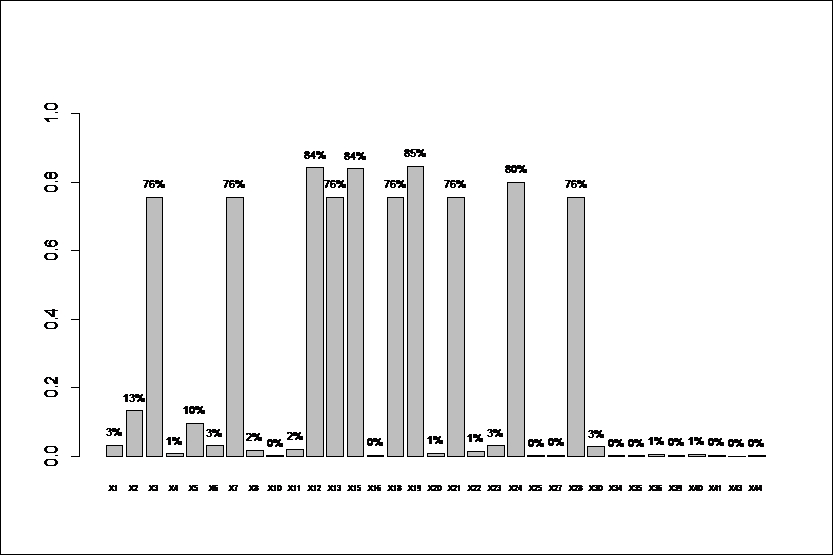

图 13.6：根据资产负债表总额，受特定冲击影响的银行系统比例 LGD = 0.65

需要强调的是，结果依赖于 LGD 参数，该参数必须在代码中设定。在第一次运行中，LGD 设定为 65%，但在不同的情况下，结果可能会有显著差异。例如，如果 LGD 为 90%，结果会更糟。五家银行（它们的代码是 2、8、11、16 和 20）也会在特定冲击的情况下对银行系统产生显著负面影响。然而，如果 LGD 值较低，结果也会更温和。例如，如果 LGD 设定为 30%，银行 13 将对银行系统产生最大影响。然而，与前面的例子相比，这个影响将非常有限。在这种情况下，36%的银行系统将违约。使用 30% LGD 值时，只有 4 家银行对系统的影响超过 10%（*图 13.7*）。

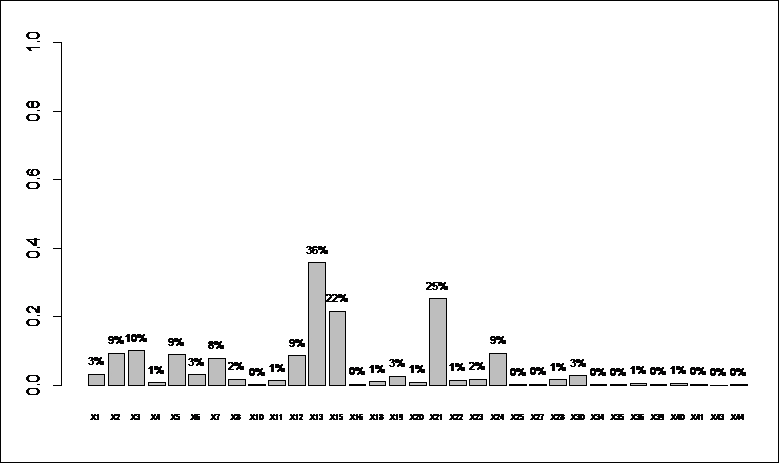

图 13.7：根据资产负债表总额，受特定冲击影响的银行系统比例 LGD = 0.3

这段 R 代码还能够展示我们传染过程。通过运行`sim`函数，我们可以找出哪些银行会直接受到被考察银行违约的影响，哪些银行会在模拟的第二步、第三步或后续步骤中受到影响。例如，如果我们想知道银行 15 号违约时会发生什么，我们可以在 R 控制台输入以下命令：`sim(G, 13, 0.65)`，其中 G 是矩阵，13 是银行 15 号的序号，65% 是损失给付率（LGD）。最终，我们得到图 13.8。我们用红色标记发起传染的银行，橙色表示那些直接受到银行 15 号特有冲击影响的机构。然后，颜色越浅，银行受到的影响越晚。最后，绿色节点的银行是幸存者。本例中设置了 65% 的损失给付率。可以看到，银行 15 号的崩溃直接导致了另外五家银行（编号 8、18、20、21 和 36）的违约。随后，随着这些银行的违约，更多银行将失去资本。最终，超过 80% 的银行系统将进入违约状态。

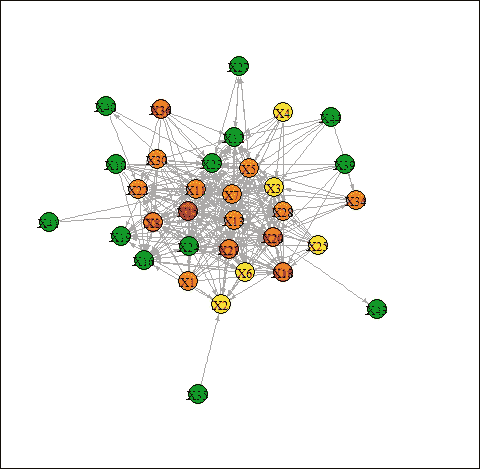

图 13.8：银行 15 号违约后的传染过程

必须强调的是，使用这种模拟方法时，不仅考虑了同业间的暴露，还考虑了主要伙伴的规模以及它们的资本缓冲。在这种情况下，系统性重要性可能源于资本不足的伙伴。或者，恰恰相反，拥有许多伙伴和借入资金的银行可能不会对市场产生任何负面影响，因为其直接伙伴拥有足够高的资本缓冲。银行 20 号就是一个很好的例子。在核心-外围分解中，它绝对属于核心。然而，当我们以 65% 的损失给付率（LGD）运行`sim`函数时，结果会大不相同。*图 13.9*显示，在其特有冲击后，其他任何银行都不会违约。

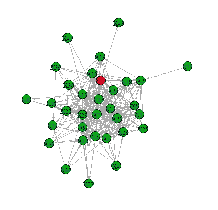

图 13.9：银行 20 号违约后的传染过程

# 可能的解释和建议

系统性重要性考察的主要难点总是其庞大的数据需求。从这个角度看，核心-外围分解是一种更简便的方法，因为我们只需要银行在同业市场上的暴露情况。尽管在许多情况下这也可能带来一些困难，因为银行之间的直接关联通常是未知的。然而，在文献中，我们可以找到一些很好的解决方案来填补这些空白，例如*Anand et al. (2014)*提出的最小密度方法。或者，也有一些其他建议，说明如何从市场数据中创建网络（例如，*Billio et al., 2013*）。

由于两种方法之间的差异，结果可能会让人困惑。我们将给出一些关于如何解读这些结果的建议。核心-外围分解法只关注一个市场。这意味着处于核心的位置意味着该银行在此市场中非常重要。整个银行体系的重要性则取决于该市场的重要性。如果没有这些信息，我们可能只会说核心银行对市场的运作非常重要。

相反，模拟方法严格关注银行系统的稳定性。因此，我们得到的结果是那些可能引发严重危机的银行。然而，这并不意味着其他银行对银行间市场的运作没有重要影响。一个资本充足的银行，虽然可能会冻结市场，但不会危及整个银行系统的稳定。从更长远的角度来看，缺乏有效运作的市场将导致流动性管理效率低下。

# 摘要

金融机构的系统重要性是监管机构和中央银行的关键数据，因为维护金融体系稳定是它们的责任。然而，这些信息对于投资者也非常重要，因为它有助于分散其在金融行业的风险敞口。

在本章中，我们展示了两种可以帮助识别系统重要金融机构的不同方法。这两种方法都基于网络理论的工具。第一种方法只关注每个机构在金融网络中的位置。因此，它没有考虑到各个机构的资产负债表结构。第二种方法是一种模拟方法，也考虑了关于银行资本状况的某些重要数据。需要综合考虑这两种方法的结果，才能得到清晰的全貌。

# 参考文献

+   **Anand, Kartik, Ben Craig 和 Goetz von Peter (2014)**：《填补空白：网络结构与银行间传染》，德国联邦银行讨论论文，第 02/2014 号

+   **Berlinger, E., M. Michaletzky 和 M. Szenes (2011)**：《无担保银行间外汇市场的网络动态研究——流动性危机前后的分析》（Network dynamics of unsecured interbank HUF markets before and after the liquidity crisis）。《经济学评论》，第 58 卷，第 3 期

+   **Billio, Monica, Mila Getmansky, Dale Gray, Andrew W. Lo, Robert C. Merton 和 Loriana Pelizzon**：《主权、银行和保险信贷利差：关联性与系统网络》，Mimeo，2013 年

+   **BIS (2011):** 《全球系统重要性银行：评估方法及附加损失吸收要求》，规则文本，2011 年 11 月

+   **Borgatti, Stephen 和 Martin Everett (1999)**：《核心/外围结构模型》，《社会网络》21 期

+   **Bron, Coen 和 Kerbosch, Joep (1973)**：算法 457：寻找无向图的所有团体，《ACM 通信》16 卷（9 期）：575–577

+   **Craig, Ben and Goetz von Peter (2010)**：银行间分层与货币中心银行 – BIS 工作论文第 322 号，2010 年 10 月

+   **Daróczi, Gergely, Michael Puhle, Edina Berlinger, Péter Csóka, Daniel Havran, Márton Michaletzky, Zsolt Tulassay, Kata Váradi, Agnes Vidovics-Dancs (2013)**：量化金融的 R 语言导论，Packt 出版公司（2013 年 11 月 22 日）

+   **Eisenberg, L., Noe, T.H. (2001)**：金融系统中的系统性风险。《管理科学》47 (2)，236–249

+   **FSB, IMF, BIS (2009)**：评估金融机构、市场和工具的系统重要性的指导：初步考虑 – 背景文件，报告提交给 G-20 财长和央行行长，2009 年 10 月

+   **Furfine, C.H. (2003)**：银行间暴露：量化传染风险。《货币、信用与银行学报》35 (1)，111–128

+   **Iazzetta, I. 和 M. Manna (2009)**：银行间市场的拓扑结构：自 1990 年以来意大利的变化，意大利银行工作论文第 711 号，2009 年 5 月
