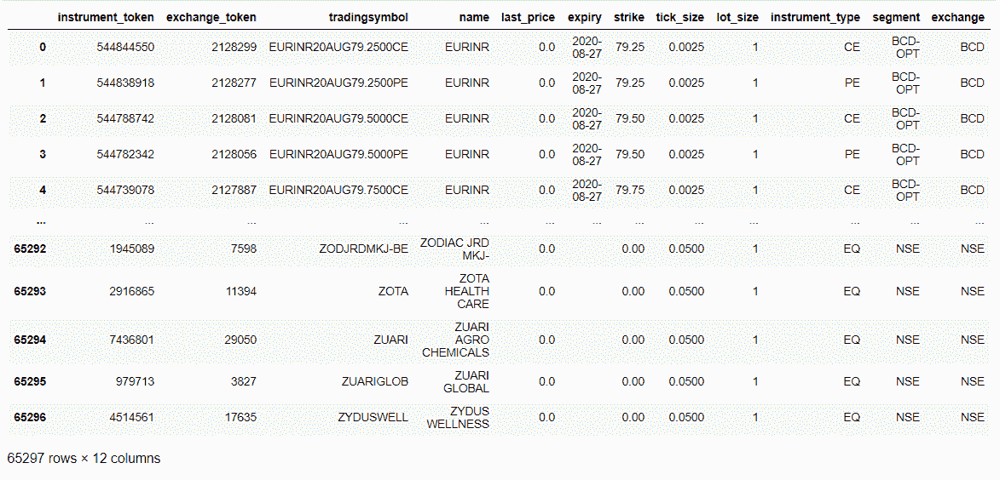

获取金融数据

拥有便捷的金融数据对于进行算法交易至关重要。 金融数据可以是静态的，也可以是动态的。 静态金融数据是在交易时间内不会改变的数据。 静态数据包括金融工具列表、金融工具属性、金融工具的限价和上一个交易日的收盘价格。 动态金融数据是在交易时间内可能持续变化的数据。 动态数据包括市场深度、最后交易价格、金融工具的时间和数量，以及当日的最高和最低价格。 本章包括获取各种类型金融数据的配方。

以下是本章的配方列表：

+   获取金融工具列表

+   金融工具的属性

+   金融工具的到期日

+   金融工具的限价

+   金融工具的市场深度

+   金融工具的总待买数量

+   金融工具的总待卖数量

+   金融工具当日的总成交量

+   金融工具的最后交易价格

+   金融工具的最后交易时间

+   金融工具的最后交易数量

+   金融工具当日的开盘价格

+   金融工具当日的最高价格

+   金融工具当日的最低价格

+   金融工具上一个交易日的收盘价格

# 技术要求

您将需要以下内容才能成功执行本章的配方：

+   Python 3.7+

+   `pyalgotrading` Python 包（`$ pip install pyalgotrading`）

本章的最新 Jupyter 笔记本可以在 GitHub 上找到，网址为[`github.com/PacktPublishing/Python-Algorithmic-Trading-Cookbook`](https://github.com/PacktPublishing/Python-Algorithmic-Trading-Cookbook)。

以下代码将帮助您与 Zerodha 建立经纪人连接，这将在本章中的所有配方中使用。 请确保在尝试任何配方之前已经按照这些步骤进行了操作。

与经纪人建立连接的第一步是获取 API 密钥。 经纪人会为每位客户提供唯一的密钥，通常是`api-key`和`api-secret`密钥对。 这些 API 密钥通常按月订阅收费。 在开始之前，您需要从经纪人网站上获取您的`api-key`和`api-secret`的副本。 您可以参考*附录 I*了解更多详细信息。

执行以下步骤：

1.  导入必要的模块：

```py
>>> from pyalgotrading.broker.broker_connection_zerodha import BrokerConnectionZerodha
```

1.  从经纪人处获取`api_key`和`api_secret`密钥。 这些是您独有的，经纪人将用它们来识别您的证券账户：

```py
>>> api_key = "<your-api-key>"
>>> api_secret = "<your-api-secret>"
>>> broker_connection = BrokerConnectionZerodha(api_key, \
                                                api_secret)
```

您将获得以下输出：

```py
Installing package kiteconnect via pip...
Please login to this link to generate your request token: https://kite.trade/connect/login?api_key=<your-api-key>&v=3
```

如果您是第一次运行此程序，且未安装`kiteconnect`，`pyalgotrading`会自动为您安装它。*第 2 步* 的最终输出将是一个链接。点击链接并使用您的 Zerodha 凭据登录。如果身份验证成功，您将在浏览器地址栏中看到一个类似于以下内容的链接：`https://127.0.0.1/?request_token=<alphanumeric-token>&action=login&status=success`。

以下是一个示例：

```py
https://127.0.0.1/?request_token=H06I6Ydv95y23D2Dp7NbigFjKweGwRP7&action=login&status=success
```

1.  复制字母数字令牌并粘贴到`request_token`中：

```py
>>> request_token = "<your-request-token>"
>>> broker_connection.set_access_token(request_token)
```

`broker_connection`实例现已准备好执行 API 调用。

`pyalgotrading`包支持多个经纪人，并为每个经纪人提供一个连接对象类，具有相同的方法。它将经纪人 API 抽象在统一接口后面，因此您不必担心底层经纪人 API 调用，可以直接使用本章中的所有示例。设置经纪人连接的程序将因经纪人而异。如果您不是使用 Zerodha 作为经纪人，则可以参考 pyalgotrading 文档设置经纪人连接。对于 Zerodha 用户，之前的步骤就足够了。

# 获取金融工具列表

**金融工具**，也被称为**证券**，是可以在交易所交易的资产。在交易所中，可能有成千上万种金融工具。金融工具列表在静态性质上是不变的，因为它在实时交易时段不会改变。金融工具可能会随时改变，但绝不会在同一天内发生变化。拥有这些数据是算法交易的第一步。本文介绍如何获取金融工具列表。

## 准备工作

确保在 Python 命名空间中有 `broker_connection` 对象可用。请参考本章的*技术要求*部分进行设置。

## 如何做...

使用 `broker_connection` 获取并显示所有可用的金融工具：

```py
>>> instruments = broker_connection.get_all_instruments()
>>> instruments
```

我们得到了以下输出（您的输出可能有所不同）：



## 工作原理...

本文使用 `broker_connection` 的 `get_all_instruments()` 方法获取所有可用的金融工具列表，该方法返回一个 `pandas.DataFrame` 对象。此对象被赋值给一个新属性`instruments`，并在输出中显示。由于经常添加新的金融工具并定期更新现有的金融工具，因此此输出可能与您的输出不同。

# 金融工具的属性

金融工具具有各种属性，可以更深入地了解该工具，例如交易代码、交易所、交易段、最小变动价位等等。在下单时，也需要一些这些属性。本文列出并解释了经纪人支持的所有属性。所有这些属性都是静态的，意味着它们在实时交易时段不会改变。

## 准备工作

确保`instruments`对象在你的 Python 命名空间中可用。参考本章的 *获取金融工具列表* 配方来设置它。

## 如何操作…

列出经纪人提供的金融工具的所有属性：

```py
>>> list(instruments.columns)
```

我们得到以下输出：

```py
['instrument_token',
 'exchange_token',
 trading-symbol,
 'name',
 'last_price',
 'expiry',
 'strike',
 'tick_size',
 'lot_size',
 'instrument_type',
 'segment',
 exchange]
```

## 工作原理…

*获取金融工具列表* 配方将所有工具作为 `pandas.DataFrame` 对象获取。调用其 `columns` 属性返回所有可用的列。每一列都是每个金融工具的属性。你可以在[`kite.trade/docs/connect/v3/market-quotes/#csv-response-columns`](https://kite.trade/docs/connect/v3/market-quotes/#csv-response-columns)找到更多细节。

# 金融工具的到期日

金融工具可能有固定的到期日，也可能没有。如果有，它们在到期日最后可用于交易。通常，现金段中的工具不会过期，而衍生品工具（来自期货和期权段的工具）具有短暂的有效期，并在指定日期到期。本配方展示了两种类型的工具以及如何获取它们的到期日期。到期日是静态数据，意味着在交易时间内不会更改。

## 准备工作

确保`broker_connection`和 `instruments` 对象在你的 Python 命名空间中可用。参考本章的 *技术要求* 部分来设置 `broker_connection`。参考本章的第一个配方来设置 `instruments`。

## 如何操作…

我们对这个配方执行以下步骤：

1.  使用`broker_connection`获取一个工具对象：

```py
>>> instrument1 = broker_connection.get_instrument('NSE', 
                                                   'TATASTEEL')
```

1.  检查并打印`instrument1`是否会到期：

```py
>>> print(f'Instrument expires: {instrument1.will_expire()}')
```

我们得到以下输出：

```py
Instrument expires: False
```

1.  使用`broker_connection`获取另一个工具对象：

```py
>>> instrument2 = broker_connection.get_instrument('NFO-FUT', 
                                                TATASTEEL20AUGFUT)
```

在这里你不应该得到任何输出。这意味着你已成功获取了这个工具。

请注意，如果在此步骤中正确输入后仍然获得以下输出，请参考本章 *获取金融工具列表* 配方的输出表格，使用最新可用的 NFO-FUT 段脚本重试此步骤：

```py
ERROR: Instrument not found. Either it is expired and hence not available, or you have misspelled the "segment" and "tradingsymbol" parameters.
```

这可能是因为带有 `tradingsymbol TATASTEEL20AUGFUT` 的工具在编写本书时可用，但自那时起已经到期，因此不再可用。

1.  检查并打印`instrument2`是否会到期：

```py
>>> print(f'Instrument expires: {instrument2.will_expire()}')
```

我们得到以下输出：

```py
Instrument expires: True
```

1.  打印`instrument2`的到期日期：

```py
>>> print(f'Expiry date: {instrument2.expiry}')
```

我们得到以下输出（您的输出可能不同）：

```py
Expiry date: 2020-08-27
```

## 工作原理…

*步骤 1*使用`BrokerConnectionZerodha`类的`get_instrument()`方法获取一个工具并将其分配给一个新属性`instrument1`。该对象是`Instrument`类的一个实例。调用`get_instrument`所需的两个参数是交易所（`NSE`）和交易符号（`TATASTEEL`）。在*步骤 2*中，我们使用`will_expire()`方法检查该工具是否将过期。此步骤的输出为`False`。我们在*步骤 3*和*步骤 4*中重复相同的过程，这次是为了另一个工具，分配给一个新属性`instrument2`，该方法对`will_expire()`方法返回`True`。这显示在*步骤 4*的输出中。最后，在*步骤 5*中，我们使用`expiry`属性获取`instrument2`的到期日期。

# 金融工具的电路限制

每种金融工具都有明确定义的价格范围。预计该工具价格在当天的价格范围内。在市场交易时间内，如果工具价格突破价格范围的上限或下限，交易所可能会暂停该工具的交易一段时间或整天。这是为了防止工具价格在一天内的突然上涨或下跌。价格范围的上限称为**上限电路限制**，下限称为**下限电路限制**。这些数据是静态的，意味着在一天内不会改变。但是，它们在一天到另一天之间可能会发生显着变化。本配方帮助查找金融工具的电路限制。

## 准备工作

确保`broker_connection`和`instrument1`对象在您的 Python 命名空间中可用。请参阅本章的*技术要求*部分设置`broker_connection`。请参阅本章的*金融工具属性*配方设置`instrument1`。

## 如何操作…

获取并打印`instrument1`的下限和上限电路限制：

```py
>>> lower_circuit_limit, upper_circuit_limit = \
                        broker_connection.get_circuit_limits(instrument1)
>>> print(f'Lower circuit limit: {lower_circuit_limit}')
>>> print(f'Upper circuit limit: {upper_circuit_limit}')
```

我们得到以下输出（您的输出可能有所不同）：

```py
Lower circuit limit: 315.9
Upper circuit limit: 386
```

## 工作原理…

`BrokerConnectionZerodha`类的`get_circuit_limits()`方法将给定金融工具的下限和上限电路限制作为元组获取。此方法将`Instrument`类型的对象作为参数。我们在这里使用`instrument1`作为参数。

# 金融工具的市场深度

金融工具的市场深度是市场上买方和卖方的数据的时间顺序列表。买方列表是买方愿意以哪些价格及其相应数量购买该工具的价格和数量列表。类似地，卖方列表是卖方愿意以哪些价格及其相应数量出售该工具的价格和数量列表。如果您对**市场深度**的概念还不熟悉，本配方的*工作原理…*部分的解释将更清晰地解释。

市场深度有助于预测某一金融工具价格的走向。它还有助于了解具有大数量的订单是否会显著改变价格。市场深度具有动态性，意味着在实时交易时段内不断变化。此示例帮助实时查找金融工具的市场深度。

## 准备工作

确保 `broker_connection` 和 `instrument1` 对象在您的 Python 命名空间中可用。请参阅本章的 *技术要求* 部分设置 `broker_connection`。请参阅本章的 *金融工具属性* 部分设置 `instrument1`。

## 如何做…

获取并打印 `instrument1` 的买入市场深度和卖出市场深度：

```py
>>> buy_market_depth, sell_market_depth = \
                            broker_connection.get_market_depth(instrument1)
>>> print(f'Buy Market Depth:\n{buy_market_depth}')
>>> print(f'Sell Market Depth:\n{sell_market_depth}')
```

我们得到以下输出（您的输出可能会有所不同）：

```py
Buy Market Depth:
  orders  price quantity
0      1 350.05        1
1     16 350.00    43294
2      5 349.95     1250
3      8 349.90     3134
4      5 349.85     1078

Sell Market Depth:
  orders  price quantity
0      1 350.10       25
1      7 350.15     1367
2     13 350.20     4654
3     13 350.25     2977
4     21 350.30     5798
```

## 它是如何工作的…

`BrokerConnectionZerodha` 类的 `get_market_depth()` 方法获取给定金融工具的市场深度。此方法以 `Instrument` 类型的对象作为参数。在此处我们使用 `instrument1` 作为参数。市场深度显示为**买方**和**卖方**的不同表格。

**买入市场深度** 是一个包含五个条目或竞标的表格，按价格降序排列。每个条目表示市场上某一时刻可用的买家，给出的价格以及该价格可用的数量。

**卖出市场深度** 是一个包含五个条目或竞标的表格，按价格升序排列。每个条目表示市场上某一时刻已存在的卖家，给出的价格以及该价格可用的数量。

当买家和卖家匹配时，订单在交易所执行，条目从买方和卖方表格中删除。

# 金融工具的总待买入数量

金融工具的总待买入数量是在某一时刻所有待买入订单数量的总和。此数据具有动态性，并且在实时交易时段内随时可能发生变化。

## 准备工作

确保 `broker_connection` 和 `instrument1` 对象在您的 Python 命名空间中可用。请参阅本章的 *技术要求* 部分设置 `broker_connection`。请参阅本章的 *金融工具属性* 部分设置 `instrument1`。

## 如何做…

获取并打印 `instrument1` 的总待买入数量：

```py
>>> total_pending_buy_quantity = \
            broker_connection.get_total_pending_buy_quantity(instrument1)
>>> print(f'Total pending BUY quantity: {total_pending_buy_quantity}')
```

我们得到以下输出（您的输出可能会有所不同）：

```py
Total pending BUY quantity: 1319590
```

## 它是如何工作的…

`BrokerConnectionZerodha` 类的 `get_total_pending_buy_quantity()` 方法在任意时刻获取给定金融工具的总买入数量。此方法以 `Instrument` 类型的对象作为参数。在此处我们使用 `instrument1` 作为参数。

# 金融工具的总待卖出数量

金融工具的总待售数量是在某一时刻所有待售订单数量的总和。此数据是动态的，可能在交易时间内的任何时刻变化。

## 准备工作

确保在你的 Python 命名空间中有`broker_connection`和`instrument1`对象可用。参考本章的*技术要求*部分设置`broker_connection`。参考本章的*金融工具属性*配方设置`instrument1`。

## 如何做…

获取并打印`instrument1`的总待售数量：

```py
>>> total_pending_sell_quantity = \
            broker_connection.get_total_pending_sell_quantity(instrument1)
>>> print(f'Total pending SELL quantity: {total_pending_sell_quantity}')
```

我们得到以下输出（你的输出可能不同）：

```py
Total pending SELL quantity: 968602
```

## 工作原理…

`BrokerConnectionZerodha`类的`get_total_pending_sell_quantity()`方法在任何给定时刻获取给定金融工具的总卖出数量。此方法将`Instrument`类型的对象作为参数。我们在此处使用`instrument1`作为参数。

# 一天中金融工具的总交易量

金融工具的一天中总交易量是该天内所有交易数量（买入和卖出，但仅计算一次）的总和。例如，如果*交易员 A*从*交易员 B*购买股票*X*的 10 数量，而*交易员 C*将相同股票*X*的 20 数量卖给*交易员 D*，那么*X*的总交易量将是 10 + 20 = 30。它不会是 10 + 10 + 20 + 20 = 60，因为交易对总交易量的贡献只计算一次。此数据是动态的，可能在交易时间内的任何时刻增加。

## 准备工作

确保在你的 Python 命名空间中有`broker_connection`和`instrument1`对象可用。参考本章的*技术要求*部分设置`broker_connection`。参考本章的*金融工具属性*配方设置`instrument1`。

## 如何做…

获取并打印一天中某个工具的总交易量：

```py
>>> total_volume_day = broker_connection.get_total_volume_day(instrument1)
>>> print(f'Total Volume for the day so far: {total_volume_day}')
```

我们得到以下输出（你的输出可能不同）：

```py
Total Volume for the day so far: 24416975
```

## 工作原理…

`BrokerConnectionZerodha`类的`get_total_volume_day()`方法在一天中的任何给定时刻获取给定金融工具的总交易量。此方法将`Instrument`类型的对象作为参数。我们在此处使用`instrument1`作为参数。

# 金融工具的最新交易价格

金融工具的**最新交易价格**（**LTP**）是执行该工具的订单的最新价格。它本质上是指可以购买或出售该工具的当前价格（假设流动性良好）。正如描述所示，此数据是动态的，可能在交易时间内持续变化。本配方展示了如何获取金融工具的 LTP。

## 准备工作

确保 `broker_connection` 和 `instrument1` 对象在你的 Python 命名空间中可用。参考本章的*技术要求*部分设置 `broker_connection`。参考本章的*金融工具属性*示例设置 `instrument1`。

## 如何做...

获取并打印 `instrument1` 的 LTP：

```py
>>> ltp = broker_connection.get_ltp(instrument1)
>>> print(f'Last traded price: {ltp}')
```

我们得到以下输出（您的输出可能不同）：

```py
Last traded price: 350.95
```

## 工作原理...

`BrokerConnectionZerodha` 类的 `get_ltp()` 方法在任何给定时刻获取给定金融工具的 LTP。此方法将一个 `Instrument` 类型的对象作为参数。我们在此处使用 `instrument1` 作为参数。获取的数据类型为 `float`。

# 金融工具的最后交易时间

金融工具的**最后交易时间**（**LTT**）是该工具最后一次执行订单的最新时间。此数据具有动态性，因为它在交易时间内可能会持续变化。此示例帮助获取金融工具的 LTT。

## 准备工作

确保 `broker_connection` 和 `instrument1` 对象在你的 Python 命名空间中可用。参考本章的*技术要求*部分设置 `broker_connection`。参考本章的*金融工具属性*示例设置 `instrument1`。

## 如何做...

获取并打印 `instrument1` 的 LTT：

```py
>>> ltt = broker_connection.get_ltt(instrument1)
>>> print(f'Last traded time: {ltt}')
```

我们得到以下输出（您的输出可能不同）：

```py
Last traded time: 2020-07-17 14:42:54
```

## 工作原理...

`BrokerConnectionZerodha` 类的 `get_ltt()` 方法在任何给定时刻获取给定金融工具的 LTT。此方法将一个 `Instrument` 类型的对象作为参数。我们在此处使用 `instrument1` 作为参数。获取的数据是 `datetime.datetime` 类的一个实例。

# 金融工具的最后交易数量

金融工具的**最后交易数量**（**LTQ**）是该工具最后一次执行订单时交易的数量。此数据具有动态性，因为它在交易时间内可能会持续变化。此示例演示了如何获取金融工具的 LTQ。

## 准备工作

确保 `broker_connection` 和 `instrument1` 对象在你的 Python 命名空间中可用。参考本章的*技术要求*部分设置 `broker_connection`。参考本章的*金融工具属性*示例设置 `instrument1`。

## 如何做...

获取并打印 `instrument1` 的 LTQ：

```py
>>> ltq = broker_connection.get_ltq(instrument1)
>>> print(f'Last traded quantity: {ltq}')
```

我们得到以下输出（您的输出可能不同）：

```py
Last traded quantity: 19
```

## 工作原理...

`BrokerConnectionZerodha` 类的 `get_ltq()` 方法在任何给定时刻获取给定金融工具的 LTQ。此方法将一个 `Instrument` 类型的对象作为参数。我们在此处使用 `instrument1` 作为参数。获取的数据类型为 `int`。

# 金融工具当天的记录开盘价

通常，交易策略在做出新交易决策之前使用金融工具当日的开盘价格作为首要合格条件之一。将当日的开盘价格与前一日的收盘价格进行比较，可能会暗示市场价格在当天对于某个工具是上涨还是下跌。如果开盘价格明显高于前一日的收盘价格，则价格可能会继续上涨。同样，如果开盘价格明显低于前一日的收盘价格，则价格可能会继续下跌。记录的开盘价格数据是静态的，意味着它在交易小时内不会改变。本教程演示了如何获取金融工具当日的开盘价格。

## 准备工作

确保在你的 Python 命名空间中可用`broker_connection`和`instrument1`对象。请参考本章节的 *技术要求* 部分设置`broker_connection`。请参考本章节的 *金融工具属性* 食谱设置`instrument1`。

## 如何做...

获取并打印一天中`instrument1`的开盘价格：

```py
>>> open_price_day = broker_connection.get_open_price_day(instrument1)
>>> print(f'Open price today: {open_price_day}')
```

我们得到以下输出（你的输出可能会有所不同）：

```py
Open price today: 346
```

## 工作原理如下...

`BrokerConnectionZerodha`类的`get_open_price_day()`方法获取给定金融工具当日的开盘价格。此方法将`Instrument`类型的对象作为参数。我们在这里使用`instrument1`作为参数。获取的数据为`float`类型。

# 金融工具当日的记录最高价格

在做出新交易决策之前，交易策略通常使用金融工具当日的最高价格作为一个合格条件之一。这些数据是动态的，因为它们可能在交易小时内不断变化。本教程演示了如何获取金融工具当日的最高记录价格。

## 准备工作

确保在你的 Python 命名空间中可用`broker_connection`和`instrument1`对象。请参考本章节的 *技术要求* 部分设置`broker_connection`。请参考本章节的 *金融工具属性* 食谱设置`instrument1`。

## 如何做...

获取并打印一天中`instrument1`的记录最高价格：

```py
>>> high_price_day = broker_connection.get_high_price_day(instrument1)
>>> print(f'Highest price today: {high_price_day}')
```

我们得到以下输出。你的输出可能会有所不同：

```py
Highest price today: 356.8
```

## 工作原理如下...

`BrokerConnectionZerodha`类的`get_high_price_day()`方法获取给定金融工具当日的最高记录价格。此方法将`Instrument`类型的对象作为参数。我们在这里使用`instrument1`作为参数。获取的数据为`float`类型。

# 金融工具当日的记录最低价格

通常，交易策略在做出新交易决策之前会将金融工具当天最低价格作为符合条件之一。这些数据是动态的，因为它们可能在实时交易时间内持续变化。本文演示了如何获取金融工具当天最低记录价格。

## 准备工作

确保 `broker_connection` 和 `instrument1` 对象在您的 Python 命名空间中可用。请参考本章的 *技术要求* 部分设置 `broker_connection`。请参考本章的 *金融工具属性* 配方设置 `instrument1`。

## 操作方法…

获取并打印 `instrument1` 当天最低价格的记录：

```py
>>> low_price_day = broker_connection.get_low_price_day(instrument1)
>>> print(f'Lowest price today: {low_price_day}')
```

我们得到以下输出（您的输出可能有所不同）：

```py
Lowest price today: 345.15
```

## 工作原理是…

`BrokerConnectionZerodha` 类的 `get_low_price_day()` 方法获取给定金融工具当天的最低记录价格。此方法以 `Instrument` 类型的对象作为参数。我们在此处将 `instrument1` 用作参数。获取的数据是 `float` 类型的。

# 金融工具上一交易日的记录收盘价

通常，交易策略在做出交易决策之前会使用前一交易日的金融工具收盘价作为首要条件之一。将当天的开盘价与前一天的收盘价进行比较，可能会暗示市场价格今天是否会上涨或下跌。如果开盘价显著高于前一天的收盘价，则价格可能会继续上涨。同样，如果开盘价显著低于前一天的收盘价，则价格可能会继续下跌。记录的收盘价数据是静态的，意味着在实时交易时间内不会发生变化。本文介绍了如何获取金融工具的前一日收盘价。

## 准备工作

确保 `broker_connection` 和 `instrument1` 对象在您的 Python 命名空间中可用。请参考本章的 *技术要求* 部分设置 `broker_connection`。请参考本章的 *金融工具属性* 配方设置 `instrument1`。

## 操作方法…

获取并打印 `instrument1` 上一交易日的记录收盘价：

```py
>>> close_price_last_day = \
                broker_connection.get_close_price_last_day(instrument1)
>>> print(f'Close price of last trading day: {close_price_last_day}')
```

我们得到以下输出（您的输出可能有所不同）：

```py
Close price of last trading day: 341.65
```

## 工作原理是…

`BrokerConnectionZerodha` 类的 `get_close_price_day()` 方法获取给定金融工具的前一交易日收盘价。此方法以 `Instrument` 类型的对象作为参数。我们在此处将 `instrument1` 用作参数。获取的数据是 `float` 类型的。
