计算蜡烛图案和历史数据

金融工具的历史数据是指金融工具过去所有买入或卖出价格的数据。算法交易策略总是在历史数据上进行虚拟执行，以评估其在实际投资前的过去表现。这个过程被称为**回测**。历史数据对于回测至关重要（在第八章，*回测策略*中有详细介绍）。此外，历史数据还需要用于计算技术指标（在第五章，*计算和绘制技术指标*中有详细介绍），这有助于在实时进行买卖决策。蜡烛图案是股票分析中广泛使用的工具。分析师通常使用各种类型的蜡烛图案。本章提供了一些示例，展示了如何使用经纪人 API 获取历史数据，如何获取和计算多个蜡烛图案 – 日本（**开-高-低-收**（**OHLC**）、线段、Renko 和 Heikin-Ashi – 以及如何使用第三方工具获取历史数据。

在本章中，我们将介绍以下示例：

+   利用经纪人 API 获取历史数据

+   利用日本（OHLC）蜡烛图案获取历史数据

+   利用蜡烛间隔变化的日本蜡烛图案获取数据

+   利用线段烛台图案获取历史数据

+   利用 Renko 蜡烛图案获取历史数据

+   利用 Heikin-Ashi 蜡烛图案获取历史数据

+   使用 Quandl 获取历史数据

让我们开始吧！

# 技术要求

您将需要以下内容才能成功执行本章中的示例：

+   Python 3.7+

+   Python 包：

+   `pyalgotrading`（`$ pip install pyalgotrading`）

+   `quandl` （`$pip install quandl`）这是可选的，仅用于最后一个示例

本章的最新 Jupyter 笔记本可在 GitHub 上找到：[`github.com/PacktPublishing/Python-Algorithmic-Trading-Cookbook/tree/master/Chapter04`](https://github.com/PacktPublishing/Python-Algorithmic-Trading-Cookbook/tree/master/Chapter04)。

以下代码将帮助您设置与 Zerodha 的经纪人连接，这将被本章中的所有示例使用。请确保在尝试任何提供的示例之前已经执行了这些步骤。

设置与经纪人的连接的第一件事是收集所需的 API 密钥。经纪人为每个客户提供唯一的密钥，通常是`api-key`和`api-secret`密钥对。这些 API 密钥通常是按月付费的。在开始本章之前，您需要从经纪人网站获取您的`api-key`和`api-secret`的副本。您可以参考*附录 I*了解更多详情。

执行以下步骤：

1.  导入必要的模块：

```py
>>> from pyalgotrading.broker.broker_connection_zerodha import BrokerConnectionZerodha
```

1.  从经纪人处获取 `api_key` 和 `api_secret`。这些对你是唯一的，经纪人将使用它们来识别你的证券账户：

```py
>>> api_key = "<your-api-key>"
>>> api_secret = "<your-api-secret>"
>>> broker_connection = BrokerConnectionZerodha(api_key, 
                                                api_secret)
```

你将得到以下链接：

```py
Installing package kiteconnect via pip...
Please login to this link to generate your request token: https://kite.trade/connect/login?api_key=<your-api-key>&v=3
```

如果你是第一次运行此程序，并且尚未安装 `kiteconnect`，`pyalgotrading` 将自动为你安装。*步骤 2* 的最终输出将是一个链接。点击该链接并使用你的 Zerodha 凭证登录。如果认证成功，你将在浏览器地址栏中看到一个类似于 `https://127.0.0.1/?request_token=&action=login&status=success` 的链接。

例如：

```py
https://127.0.0.1/?request_token=H06I6Ydv95y23D2Dp7NbigFjKweGwRP7&action=login&status=success
```

1.  复制字母数字令牌并粘贴到 `request_token` 中：

```py
>>> request_token = "<your-request-token>"
>>> broker_connection.set_access_token(request_token)
```

`broker_connection` 实例现在已经准备好执行 API 调用了。

`pyalgotrading` 包支持多个经纪人，并为每个经纪人提供一个连接对象类，其方法相同。它将经纪人 API 抽象在一个统一的接口后面，使用户无需担心底层经纪人 API 调用，并可以直接使用本章中的所有示例。

仅经纪人连接设置的过程会因经纪人而异。如果你不使用 Zerodha 作为你的经纪人，你可以参考 pyalgotrading 文档来学习如何设置经纪人连接。对于 Zerodha 用户，上述步骤就足够了。

# 使用经纪人 API 获取历史数据

金融工具的历史数据是过去时间戳的时间序列数据。可以使用经纪人 API 获取给定时段的历史数据。本篇示例演示了如何建立经纪人连接以及如何为金融工具获取单日历史数据的过程。

## 准备工作

确保 `broker_connection` 对象在你的 Python 命名空间中可用。请参考本章节的*技术要求*部分了解如何设置它。

## 如何执行…

执行以下步骤完成本篇示例：

1.  获取一个金融工具的历史数据：

```py
>>> instrument = broker_connection.get_instrument('NSE', 
                                                  'TATASTEEL')
>>> historical_data = broker_connection.get_historical_data(
                            instrument=instrument, 
                            candle_interval='minute', 
                            start_date='2020-01-01', 
                            end_date='2020-01-01')
>>> historical_data
```

你将得到以下输出：

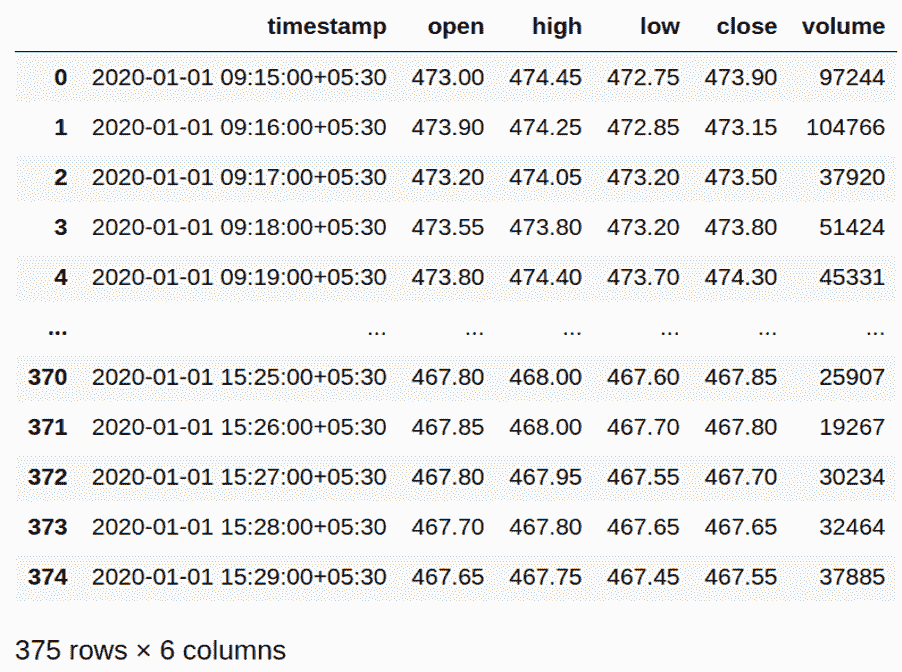

1.  打印 `historical_data` DataFrame 的可用列：

```py
>>> historical_data.columns
```

你将得到以下输出：

```py
>>> Index(['timestamp', 'open', 'high', 'low', 'close', 'volume'], 
            dtype='object')
```

## 工作原理…

在 *步骤 1* 中，你使用 `broker_connection` 的 `get_instrument()` 方法来获取一个金融工具，并将其赋值给一个新属性 `instrument`。这个对象是 `Instrument` 类的一个实例。调用 `get_instrument()` 需要两个参数，交易所（`'NSE'`）和交易标志（`'TATASTEEL'`）。接下来，你使用 `get_historical_data()` 方法获取 `instrument` 的历史数据。这个方法接受四个参数，描述如下：

+   `instrument`：必须放置历史数据的金融工具。应该是 `Instrument` 类的一个实例。在这里传递 `instrument`。

+   `candle_interval`: 一个有效的字符串，表示历史数据中每个蜡烛图的持续时间。你在这里传递`minute`。（可能的值可以是`minute`，`3minute`，`5minute`，`10minute`，`30minute`，`60minute`和`day`。）

+   `start_date`: 截取历史数据的开始日期。应该是`YYYY-MM-DD`格式的字符串。你在这里传递`2020-01-01`。

+   `end_date:` 截取历史数据的截止日期，包括该日期。应该是`YYYY-MM-DD`格式的字符串。你在这里传递`2020-01-01`。

在*步骤 2*中，你获取并打印`historical_data`的可用列。你得到的列是`timestamp`、`open`、`high`、`low`、`close`和`volume`。

更多有关蜡烛图案的信息将在下一篇配方*使用日本（OHLC）蜡烛图案获取历史数据*以及本章的第三篇配方*获取具有蜡烛间隔变化的日本蜡烛图案*中介绍。

# 使用日本（OHLC）蜡烛图案获取历史数据

金融工具的历史数据是一个蜡烛图数组。历史数据中的每个条目都是一个单独的蜡烛图。有各种各样的蜡烛图案。

本配方演示了最常用的蜡烛图案——日本蜡烛图案。它是一种蜡烛图案，每个蜡烛图案持有一个持续时间，并指示在该持续时间内工具可能会取得的所有价格。这些数据使用四个参数表示——开盘价、最高价、最低价和收盘价。可以描述如下：

+   **Open**: 蜡烛持续时间开始时金融工具的价格

+   **High**: 蜡烛整个持续时间内金融工具的最高记录价格

+   **Low**: 蜡烛整个持续时间内金融工具的最低记录价格

+   **Close**: 蜡烛持续时间结束时金融工具的价格

根据这些参数，日本蜡烛图案也被称为**OHLC 蜡烛图案**。日本蜡烛图案中的所有时间戳都是等距的（在市场开放时间内）。例如，一个交易日的时间戳看起来像是上午 9:15、9:16、9:17、9:18 等等，对于 1 分钟的蜡烛间隔，每个时间戳都是在 1 分钟的间隔内等距分布的。

## 准备工作

确保`broker_connection`和`historical_data`对象在你的 Python 命名空间中可用。参考本章的*技术要求*部分设置`broker_connection`。参考上一篇配方设置`historical_data`。

## 操作步骤…

我们执行以下步骤来进行这个配方：

1.  导入必要的模块：

```py
>>> from pyalgotrading.utils.func import plot_candlestick_chart, PlotType
```

1.  从`historical_data`的一行创建一个绿色蜡烛图：

```py
>>> candle_green = historical_data.iloc[:1,:]    
# Only 1st ROW of historical data
>>> plot_candlestick_chart(candle_green, 
                           PlotType.JAPANESE, 
                           "A 'Green' Japanese Candle")
```

你将得到以下输出：

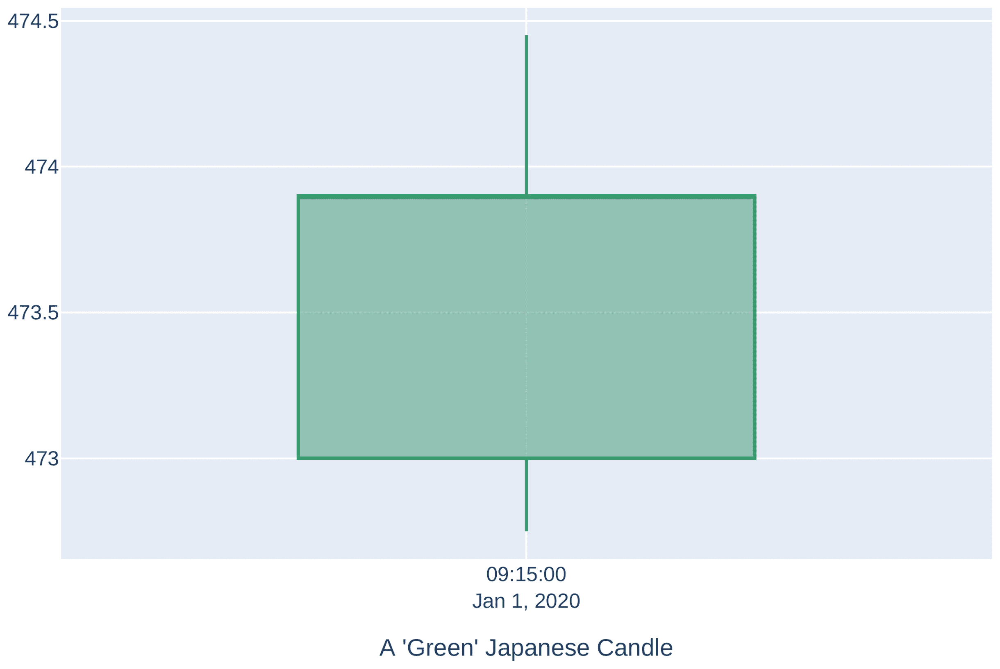

1.  从`historical_data`的一行创建一个红色蜡烛图：

```py
# A 'Red' Japanese Candle
>>> candle_red = historical_data.iloc[1:2,:]     
# Only 2nd ROW of historical data
>>> plot_candlestick_chart(candle_red, 
                           PlotType.OHLC, 
                           "A 'Red' Japanese Candle")
```

这将给您以下输出：

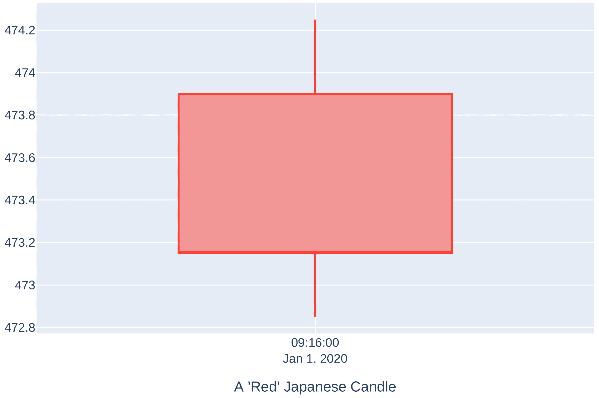

1.  绘制一个仪器历史数据的图表：

```py
>>> plot_candlestick_chart(historical_data, 
                           PlotType.OHLC, 
                           'Historical Data | '
                           'Japanese Candlesticks Pattern | '
                           'NSE:TATASTEEL | 1st Jan, 2020 | '
                           'Candle Interval: 1 Minute')
```

这将给您以下输出：

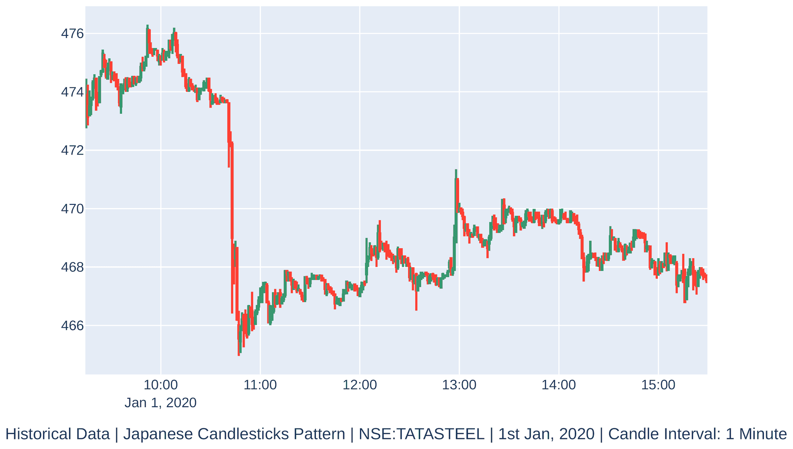

1.  绘制另一个仪器历史数据的图表：

```py
>>> instrument2 = broker_connection.get_instrument('NSE', 'INFY')
>>> historical_data = \
        broker_connection.get_historical_data(instrument2, 
                                              'minute', 
                                              '2020-01-01', 
                                              '2020-01-01')
>>> plot_candlestick_chart(historical_data, 
                           PlotType.OHLC,
                           'Historical Data | '
                           'Japanese Candlesticks Pattern | '
                           'NSE:INFY | 1st Jan, 2020 | '
                           'Candle Interval: 1 Minute')
```

这将给您以下输出：

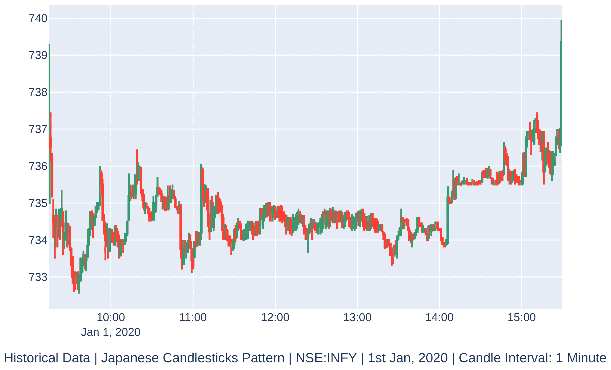

1.  绘制另一个仪器历史数据的图表：

```py
>>> instrument3 = broker_connection.get_instrument('NSE',
                                                   'ICICIBANK')
>>> historical_data = 
            broker_connection.get_historical_data(instrument3, 
                                                  'minute', 
                                                  '2020-01-01', 
                                                  '2020-01-01')
>>> plot_candlestick_chart(historical_data, PlotType.OHLC, 
                           'Historical Data | '
                           'Japanese Candlesticks Pattern | '
                           'NSE:ICICIBANK | 1st Jan, 2020 | '
                           'Candle Size: 1 Minute')
```

这将给您以下输出：

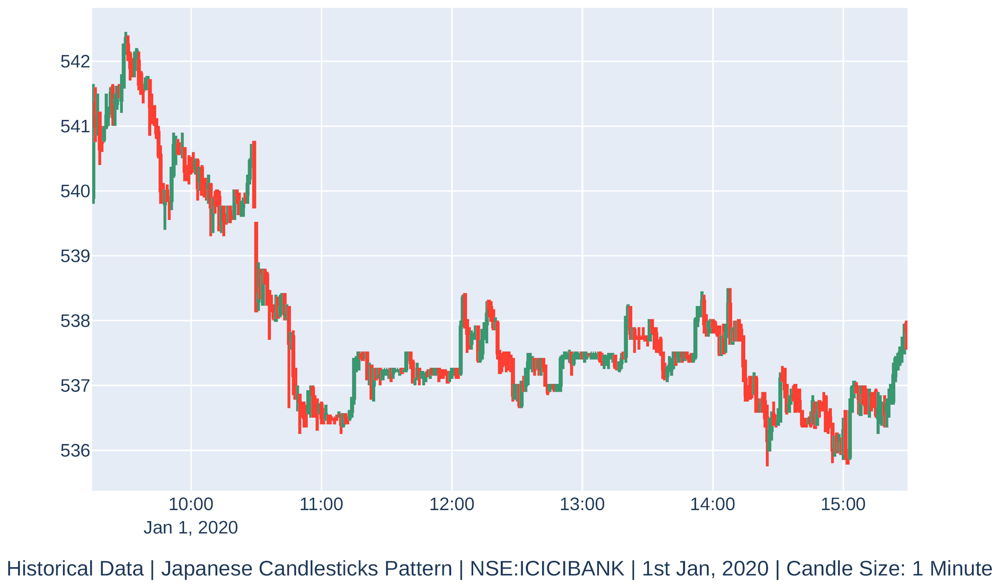

## 工作原理… 

在*步骤 1*中，您导入`plot_candlestick_chart`，这是一个用于绘制蜡烛图表的快速实用函数，以及`PlotType`，一个用于各种蜡烛图案类型的枚举。接下来的两步介绍了两种蜡烛图，或简称为**蜡烛**——一个绿色蜡烛和一个红色蜡烛。正如我们之前提到的，历史数据中的每个条目都是一个蜡烛。这两个步骤有选择地从数据中提取绿色和红色蜡烛。（请注意，如果您选择了与*使用经纪人 API 获取历史数据*配方中不同的持续时间`historical_data`，则传递给`historical_data.iloc`的索引将不同）。如果一个日本蜡烛的**收盘**价高于其**开盘**价，它的颜色将是绿色。绿色蜡烛也称为**看涨**蜡烛，因为它表明价格在那段时间内看涨，即上涨。如果一个日本蜡烛的**收盘**价低于其**开盘**价，它的颜色将是红色。红色蜡烛也称为**看跌**蜡烛，因为它表明价格在那段时间内看跌，即下跌。

在*步骤 4*中，您使用`plot_candlestick_chart()`函数绘制了`historical_data`持有的完整历史数据。图表是多个蜡烛图的组合，每个蜡烛图的长度都不同。因此，这样的图表被称为**蜡烛图案图表**。请注意，蜡烛间隔为 1 分钟，意味着时间戳在 1 分钟间隔内等间距排列。*步骤 5*和*步骤 6*演示了相似的 1 分钟蜡烛间隔蜡烛图案图表，分别用于`NSE:INFY`和`NSE:ICICIBANK`仪器。

如果您是蜡烛图表的新手，我建议您与本章的 Jupyter Notebook 中的图表进行交互，网址为[`github.com/PacktPublishing/Python-Algorithmic-Trading-Cookbook/blob/master/Chapter04/CHAPTER%204.ipynb`](https://github.com/PacktPublishing/Python-Algorithmic-Trading-Cookbook/blob/master/Chapter04/CHAPTER%204.ipynb)。尝试悬停在多个蜡烛图上以查看它们的值，并放大/缩小或移动到各种持续时间以更清晰地查看蜡烛图。尝试将这些蜡烛图的颜色与本食谱中的描述联系起来。如果由于某种原因 Jupyter Notebook 中的图表没有自动呈现给您，您可以下载此 html 文件，该文件是相同 Jupyter Notebook 的文件，将其在浏览器中打开并与其进行交互：[`github.com/PacktPublishing/Python-Algorithmic-Trading-Cookbook/blob/master/Chapter04/CHAPTER%204.ipynb`](https://github.com/PacktPublishing/Python-Algorithmic-Trading-Cookbook/blob/master/Chapter04/CHAPTER%204.ipynb)。

# 获取以不同蜡烛图间隔为特征的日本蜡烛图案：

金融工具的历史数据可以以不同的蜡烛图间隔形式进行分析。经纪人通常支持 1 分钟、3 分钟、5 分钟、10 分钟、15 分钟、30 分钟、1 小时、1 天等蜡烛图间隔。较短的蜡烛图间隔暗示着局部价格运动趋势，而较大的蜡烛图间隔则表示整体价格运动趋势。根据算法交易策略的不同，您可能需要较短的蜡烛图间隔或较大的蜡烛图间隔。1 分钟的蜡烛图间隔通常是最小的可用蜡烛图间隔。此示例演示了金融工具一天的历史数据在各种蜡烛图间隔下的情况。

## 准备就绪

确保`broker_connection`对象在您的 Python 命名空间中可用。请参考本章的*技术要求*部分，了解如何设置`broker_connection`。

## 如何执行…

我们执行此食谱的以下步骤：

1.  导入必要的模块：

```py
>>> from pyalgotrading.utils.func import plot_candlestick_chart, PlotType
```

1.  获取一个工具：

```py
>>> instrument = broker_connection.get_instrument('NSE', 
                                                  'TATASTEEL')
```

1.  绘制仪器历史数据的图表，间隔为 1 分钟的蜡烛图：

```py
>>> historical_data_1minute = \
        broker_connection.get_historical_data(instrument, 
                                              'minute', 
                                              '2020-01-01', 
                                              '2020-01-01')
>>> plot_candlestick_chart(historical_data_1minute, 
                           PlotType.OHLC, 
                           'Historical Data | '
                           'Japanese Candlesticks Pattern | '
                           'NSE:TATASTEEL | '
                           '1st Jan, 2020 | '
                           'Candle Interval: 1 Minute')
```

您将获得以下输出：

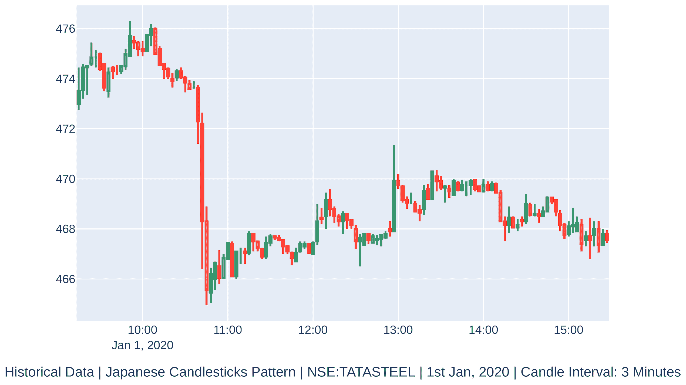

1.  绘制仪器历史数据的图表，间隔为 3 分钟的蜡烛图：

```py
>>> historical_data_3minutes = \
            broker_connection.get_historical_data(instrument, 
                                                  '3minute', 
                                                  '2020-01-01', 
                                                  '2020-01-01')
>>> plot_candlestick_chart(historical_data_3minutes, 
                           PlotType.OHLC, 
                           'Historical Data | '
                           'Japanese Candlesticks Pattern | '
                           'NSE:TATASTEEL | '
                           '1st Jan, 2020 | '
                           'Candle Interval: 3 Minutes')
```

您将获得以下输出：

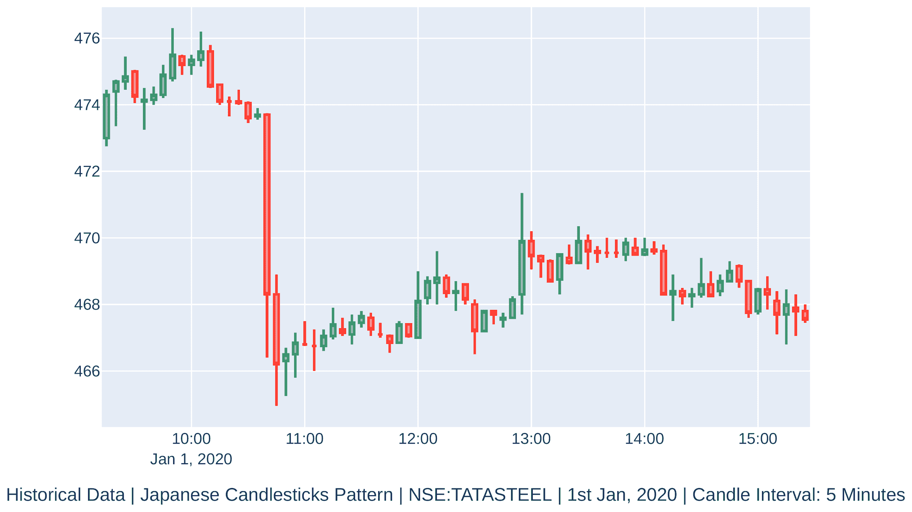

1.  绘制仪器历史数据的图表，间隔为 5 分钟的蜡烛图：

```py
>>> historical_data_5minutes = \
            broker_connection.get_historical_data(instrument, 
                                                  '5minute', 
                                                  '2020-01-01', 
                                                  '2020-01-01')
>>> plot_candlestick_chart(historical_data_5minutes, 
                           PlotType.OHLC, 
                           'Historical Data | '
                           'Japanese Candlesticks Pattern | '
                           'NSE:TATASTEEL | '
                           '1st Jan, 2020 | '
                           'Candle Interval: 5 Minutes')
```

您将获得以下输出：

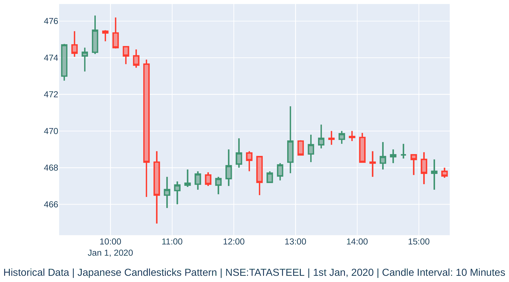

1.  绘制仪器历史数据的图表，间隔为 10 分钟的蜡烛图：

```py
>>> historical_data_10minutes = \
            broker_connection.get_historical_data(instrument, 
                                                  '10minute', 
                                                  '2020-01-01', 
                                                  '2020-01-01')
>>> plot_candlestick_chart(historical_data_10minutes, 
                           PlotType.OHLC, 
                           'Historical Data | '
                           'Japanese Candlesticks Pattern | '
                           'NSE:TATASTEEL | '
                           '1st Jan, 2020 | '
                           'Candle Interval: 10 Minutes')
```

您将获得以下输出：

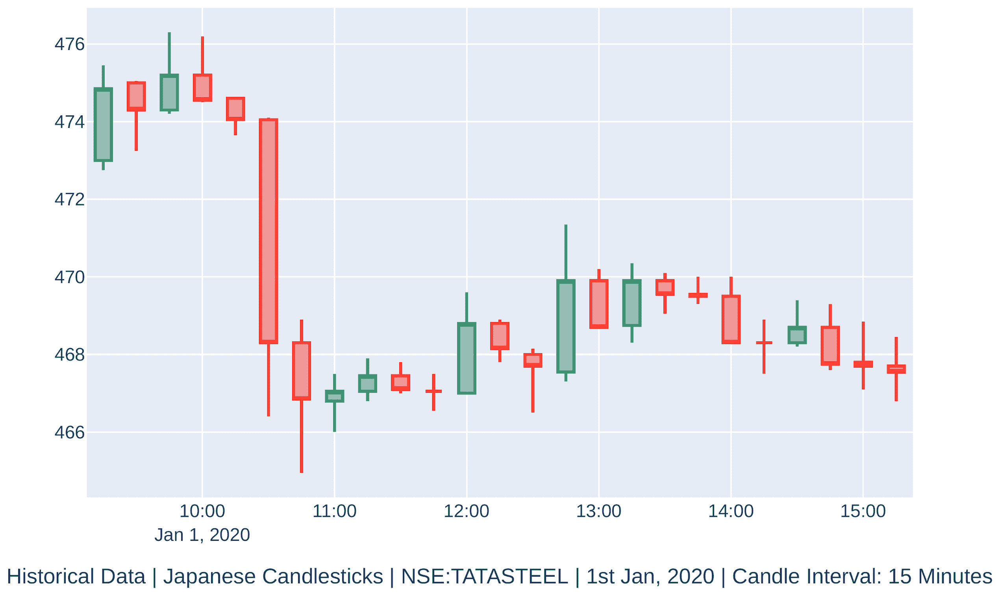

1.  绘制仪器历史数据的图表，间隔为 15 分钟的蜡烛图：

```py
>>> historical_data_15minutes = \
            broker_connection.get_historical_data(instrument, 
                                                  '15minute', 
                                                  '2020-01-01', 
                                                  '2020-01-01')
>>> plot_candlestick_chart(historical_data_15minutes, 
                           PlotType.OHLC, 
                           'Historical Data | '
                           'Japanese Candlesticks Pattern | '
                           'NSE:TATASTEEL | '
                           '1st Jan, 2020 | '
                           'Candle Interval: 15 Minutes')
```

您将获得以下输出：

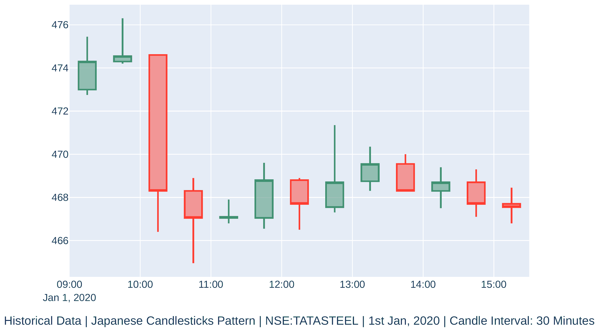

1.  用 30 分钟蜡烛图间隔绘制仪器的历史数据图表：

```py
>>> historical_data_30minutes = \
            broker_connection.get_historical_data(instrument, 
                                                  '30minute', 
                                                  '2020-01-01', 
                                                  '2020-01-01')
>>> plot_candlestick_chart(historical_data_30minutes, 
                           PlotType.OHLC, 
                           'Historical Data | '
                           'Japanese Candlesticks Pattern | '
                           'NSE:TATASTEEL | '
                           '1st Jan, 2020 | '
                           'Candle Interval: 30 Minutes')
```

您将获得以下输出：

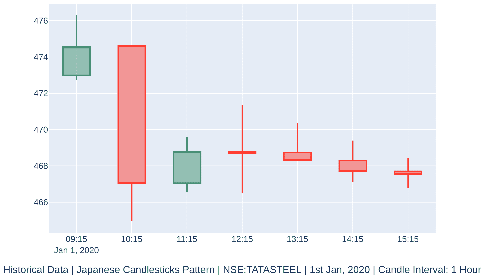

1.  用 1 小时蜡烛图间隔绘制仪器的历史数据图表：

```py
>>> historical_data_1hour = \
            broker_connection.get_historical_data(instrument, 
                                                  'hour', 
                                                  '2020-01-01', 
                                                  '2020-01-01')
>>> plot_candlestick_chart(historical_data_1hour, 
                           PlotType.OHLC, 
                           'Historical Data | '
                           'Japanese Candlesticks Pattern | '
                           'NSE:TATASTEEL | '
                           '1st Jan, 2020 | '
                           'Candle Interval: 1 Hour')
```

1.  用 1 天蜡烛图间隔绘制仪器的历史数据图表：

```py
>>> historical_data_day = \
            broker_connection.get_historical_data(instrument, 
                                                  'day', 
                                                  '2020-01-01', 
                                                  '2020-01-01')
>>> plot_candlestick_chart(historical_data_day, 
                           PlotType.OHLC, 
                           'Historical Data | '
                           'Japanese Candlesticks Pattern | '
                           'NSE:TATASTEEL | '
                           '1st Jan, 2020 | '
                           'Candle Interval: Day')
```

您将获得以下输出，这是一个单一的蜡烛：

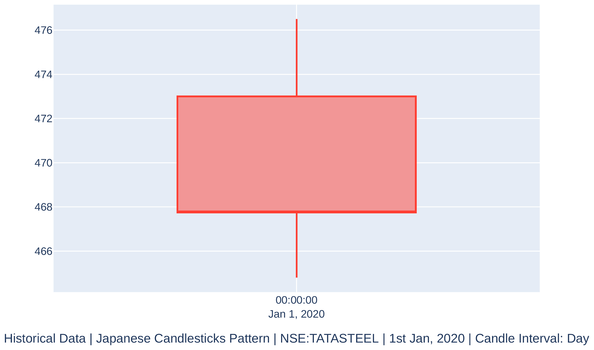

## 它的工作原理...

在*步骤 1* 中，您导入了`plot_candlestick_chart`，这是一个用于绘制蜡烛图案图表的快速实用函数，以及`PlotType`，一个用于各种蜡烛图案类型的枚举。 在*步骤 2* 中，使用`broker_connection`的`get_instrument()`方法获取一个仪器并将其分配给一个新属性`instrument`。 此对象是`Instrument`类的一个实例。 调用`get_instrument()`所需的两个参数是交易所（`'NSE'`）和交易符号（`'TATASTEEL'`）。 *步骤 3* 和 *4* 获取并绘制了蜡烛图间隔的历史数据；即，1 分钟，3 分钟，5 分钟，10 分钟，15 分钟，30 分钟，1 小时和 1 天。 您使用`get_historical_data()`方法获取相同仪器和相同开始和结束日期的历史数据，只是蜡烛间隔不同。 您使用`plot_candlestick_chart()`函数绘制日本蜡烛图案图表。 随着蜡烛间隔的增加，您可以观察到以下图表之间的差异：

+   蜡烛总数减少了。

+   图表中由于突然的价格波动而出现的尖峰被最小化了。 较小的蜡烛间隔图表具有更多的尖峰，因为它们关注局部趋势，而较大的蜡烛间隔图表具有较少的尖峰，并且更平滑。

+   股价的长期趋势变得明显。

+   决策可能会变慢，因为您必须等待更长的时间才能获取新的蜡烛数据。 较慢的决策可能是期望的，也可能不是，这取决于策略。 例如，为了确认趋势，使用较小蜡烛间隔的数据，比如 3 分钟，和较大蜡烛间隔的数据，比如 15 分钟，将是期望的。 另一方面，对于在日内交易中抓住机会，不希望使用较大蜡烛间隔的数据，比如 1 小时或 1 天。

+   相邻蜡烛的价格范围（y 轴范围）可能重叠，也可能不重叠。

+   所有时间戳在时间上等间隔（在市场营业时间内）。

# 使用线形蜡烛图案获取历史数据

金融工具的历史数据可以以 Line Break 蜡烛图案的形式进行分析，这是一种专注于价格运动的蜡烛图案。这与专注于时间运动的日本蜡烛图案不同。经纪人通常不会通过 API 提供 Line Break 蜡烛图案的历史数据。经纪人通常使用日本蜡烛图案提供历史数据，需要将其转换为 Line Break 蜡烛图案。较短的蜡烛间隔暗示着局部价格运动趋势，而较长的蜡烛间隔则表示整体价格运动趋势。根据你的算法交易策略，你可能需要蜡烛间隔较小或较大。1 分钟的蜡烛间隔通常是最小的可用蜡烛间隔。

Line Break 蜡烛图案的工作方式如下：

1.  每个蜡烛只有`open`和`close`属性。

1.  用户定义一个`线数`（*n*）设置，通常取为`3`。

1.  在每个蜡烛间隔结束时，如果股价高于前*n*个 Line Break 蜡烛中的最高价，则形成一个绿色蜡烛。

1.  在每个蜡烛间隔结束时，如果股价低于前*n*个 Line Break 蜡烛中的最低价，则形成一个红色蜡烛。

1.  在每个蜡烛间隔结束时，如果既不满足点 3 也不满足点 4，则不形成蜡烛。因此，时间戳不需要等间距。

这个配方展示了我们如何使用经纪人 API 获取历史数据，将历史数据转换为 Line Break 蜡烛图案，并进行绘图。这是针对多个蜡烛间隔进行的。

## 准备就绪

确保`broker_connection`对象在你的 Python 命名空间中可用。参考本章的*技术要求*部分，了解如何设置`broker_connection`。

## 如何操作…

对于这个配方，我们执行以下步骤：

1.  导入必要的模块：

```py
>>> from pyalgotrading.utils.func import plot_candlestick_chart, PlotType
>>> from pyalgotrading.utils.candlesticks.linebreak import Linebreak
```

1.  获取一个工具的历史数据并将其转换为 Line Break 数据： 

```py
>>> instrument = broker_connection.get_instrument('NSE', 
                                                  'TATASTEEL')
>>> historical_data_1minute = \
            broker_connection.get_historical_data(instrument, 
                                                  'minute', 
                                                  '2019-12-01', 
                                                  '2019-12-31')
>>> historical_data_1minute_linebreak = \
                              Linebreak(historical_data_1minute)
>>> historical_data_1minute_linebreak
```

你将得到以下输出：

```py
       close       open                   timestamp
0     424.00     424.95   2019-12-02 09:15:00+05:30
1     424.50     424.00   2019-12-02 09:16:00+05:30
2     425.75     424.80   2019-12-02 09:17:00+05:30
3     423.75     424.80   2019-12-02 09:19:00+05:30
4     421.70     423.75   2019-12-02 09:20:00+05:30 
        …         …                ....
1058  474.90     474.55   2019-12-31 10:44:00+05:30
1059  471.60     474.55   2019-12-31 11:19:00+05:30
1060  471.50     471.60   2019-12-31 14:19:00+05:30
1061  471.35     471.50   2019-12-31 15:00:00+05:30
1062  471.00     471.35   2019-12-31 15:29:00+05:30
```

1.  从`historical_data`的一行创建一个绿色 Line Break 蜡烛：

```py
>>> candle_green_linebreak = historical_data_1minute_linebreak.iloc[1:2,:]            
# Only 2nd ROW of historical data
>>> plot_candlestick_chart(candle_green_linebreak, 
                           PlotType.LINEBREAK, 
                           "A 'Green' Line Break Candle")
```

你将得到以下输出：

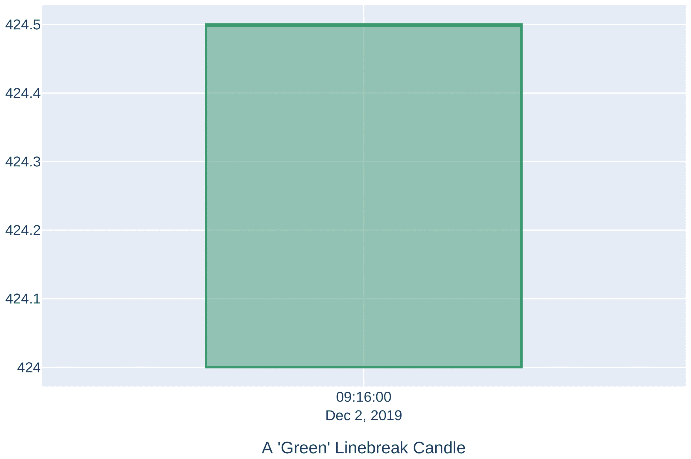

1.  从`historical_data`的一行创建一个红色 Line Break 蜡烛：

```py
>>> candle_red_linebreak = historical_data_1minute_linebreak.iloc[:1,:]            
# Only 1st ROW of historical data
>>> plot_candlestick_chart(candle_red_linebreak, 
                           PlotType.LINEBREAK, 
                           "A 'Red' Line Break Candle")
```

你将得到以下输出：

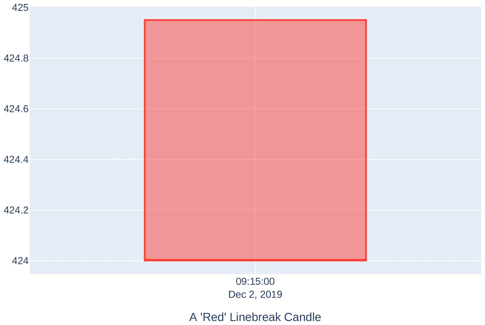

1.  为仪器的历史数据绘制一个 1 分钟蜡烛间隔的图表：

```py
>>> plot_candlestick_chart(historical_data_1minute_linebreak, 
                           PlotType.LINEBREAK, 
                           'Historical Data | '
                           'Line Break Candlesticks Pattern | '
                           'NSE:TATASTEEL | '
                           'Dec, 2019 | '
                           'Candle Interval: 1 Minute', True)
```

你将得到以下输出：

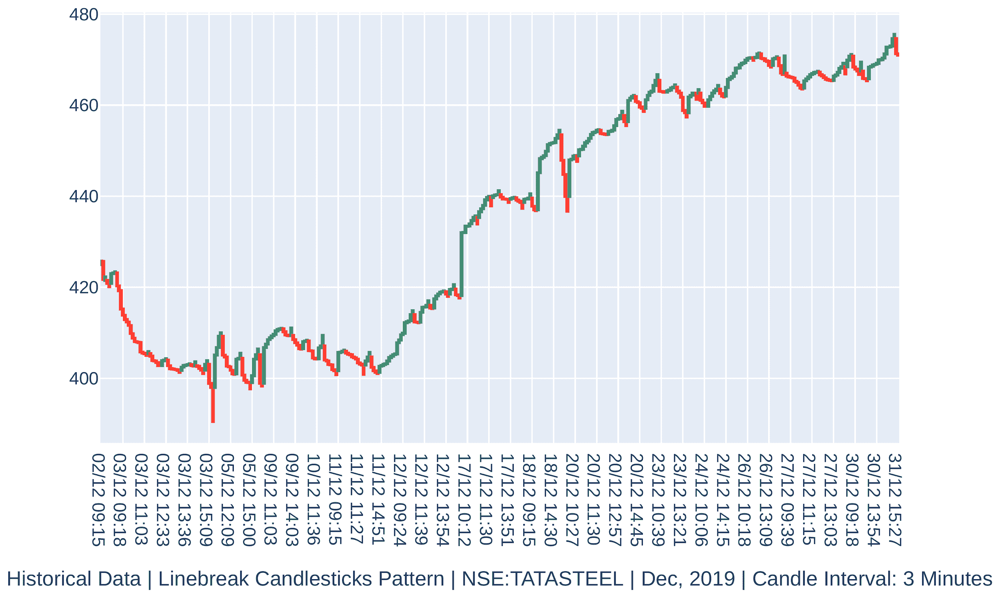

1.  为仪器的历史数据绘制一个 3 分钟蜡烛间隔的图表：

```py
>>> historical_data_3minutes = \
            broker_connection.get_historical_data(instrument, 
                                                  '3minute', 
                                                  '2019-12-01', 
                                                  '2019-12-31')
>>> historical_data_3minutes_linebreak = \
                    Linebreak(historical_data_3minutes)
>>> plot_candlestick_chart(historical_data_3minutes_linebreak, 
                           PlotType.LINEBREAK, 
                           'Historical Data | '
                           'Line Break Candlesticks Pattern | '
                           'NSE:TATASTEEL | '
                           'Dec, 2019 | '
                           'Candle Interval: 3 Minutes', True)
```

你将得到以下输出：

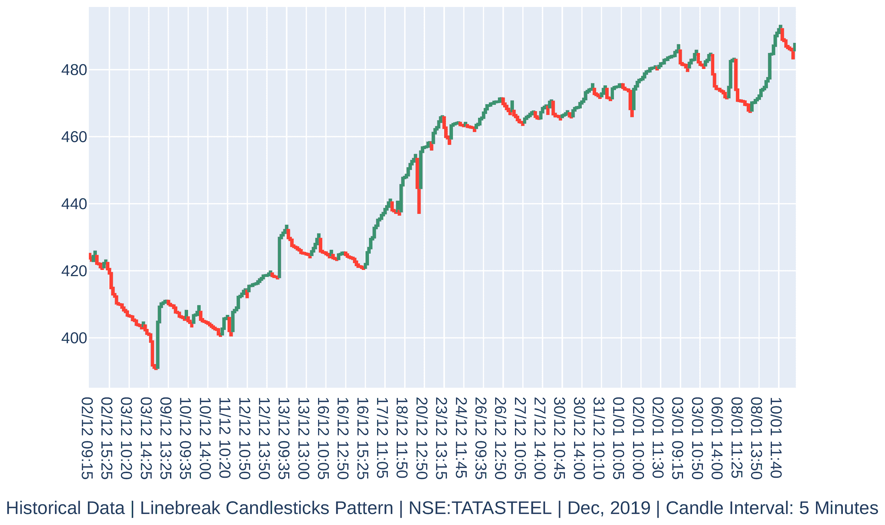

1.  为仪器的历史数据绘制一个 5 分钟蜡烛间隔的图表：

```py
>>> historical_data_5minutes = \
            broker_connection.get_historical_data(instrument, 
                                                  '5minute', 
                                                  '2019-12-01', 
                                                  '2020-01-10')
>>> historical_data_5minutes_linebreak = \
                            Linebreak(historical_data_5minutes)
>>> plot_candlestick_chart(historical_data_5minutes_linebreak, 
                           PlotType.LINEBREAK, 
                           'Historical Data | '
                           'Line Break Candlesticks Pattern | '
                           'NSE:TATASTEEL | '
                           'Dec, 2019 | '
                           'Candle Interval: 5 Minutes', True)
```

你将得到以下输出：

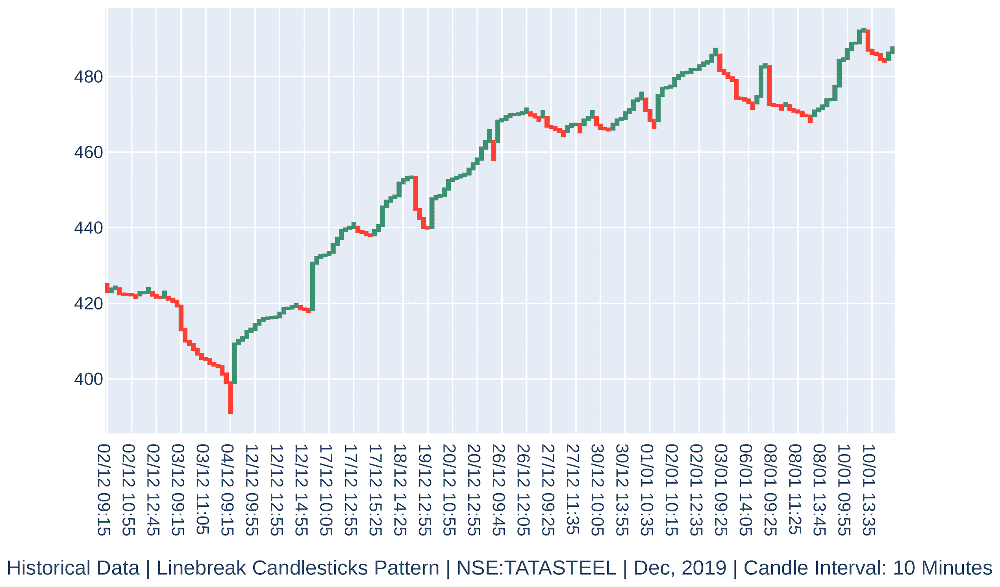

1.  绘制该工具的历史数据图，每根蜡烛间隔为 10 分钟：

```py
>>> historical_data_10minutes = \
            broker_connection.get_historical_data(instrument, 
                                                  '10minute', 
                                                  '2019-12-01', 
                                                  '2020-01-10')
>>> historical_data_10minutes_linebreak = \
                            Linebreak(historical_data_10minutes)
>>> plot_candlestick_chart(historical_data_10minutes_linebreak, 
                           PlotType.LINEBREAK, 
                           'Historical Data | '
                           'Line Break Candlesticks Pattern | '
                           'NSE:TATASTEEL | '
                           'Dec, 2019 | '
                           'Candle Interval: 10 Minutes', True)
```

你将会得到以下输出：

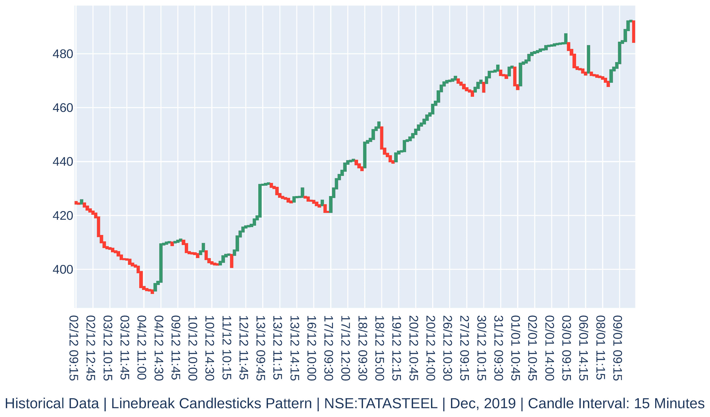

1.  绘制该工具的历史数据图，每根蜡烛间隔为 15 分钟：

```py
>>> historical_data_15minutes = \
            broker_connection.get_historical_data(instrument, 
                                                  '15minute', 
                                                  '2019-12-01', 
                                                  '2020-01-10')
>>> historical_data_15minutes_linebreak = \
                            Linebreak(historical_data_15minutes)
>>> plot_candlestick_chart(historical_data_15minutes_linebreak, 
                           PlotType.LINEBREAK, 
                           'Historical Data | '
                           'Line Break Candlesticks Pattern | '
                           'NSE:TATASTEEL | '
                           'Dec, 2019 | '
                           'Candle Interval: 15 Minutes', True)
```

你将会得到以下输出：


1.  绘制该工具的历史数据图，每根蜡烛间隔为 30 分钟：

```py
>>> historical_data_30minutes = \
            broker_connection.get_historical_data(instrument, 
                                                  '30minute', 
                                                  '2019-12-01', 
                                                  '2020-01-10')
>>> historical_data_30minutes_linebreak = \
                            Linebreak(historical_data_30minutes)
>>> plot_candlestick_chart(historical_data_30minutes_linebreak, 
                           PlotType.LINEBREAK, 
                           'Historical Data | '
                           'Line Break Candlesticks Pattern | '
                           'NSE:TATASTEEL | '
                           'Dec, 2019 | '
                           'Candle Interval: 30 Minutes', True)
```

你将会得到以下输出：

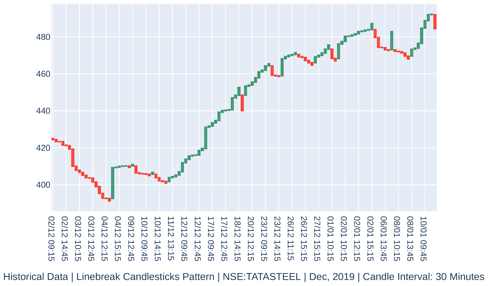

1.  绘制该工具的历史数据图，每根蜡烛间隔为 1 小时：

```py
>>> historical_data_1hour = \
            broker_connection.get_historical_data(instrument, 
                                                  'hour', 
                                                  '2019-12-01', 
                                                  '2020-01-10')
>>> historical_data_1hour_linebreak = \
                                Linebreak(historical_data_1hour)
>>> plot_candlestick_chart(historical_data_1hour_linebreak, 
                            PlotType.LINEBREAK, 
                           'Historical Data | '
                           'Line Break Candlesticks Pattern | '
                           'NSE:TATASTEEL | '
                           'Dec, 2019 | '
                           'Candle Interval: 1 Hour', True)
```

你将会得到以下输出：

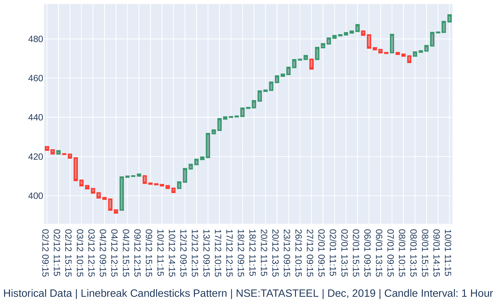

1.  绘制该工具的历史数据图，每根蜡烛间隔为 1 天：

```py
>>> historical_data_day = \
            broker_connection.get_historical_data(instrument, 
                                                  'day', 
                                                  '2019-12-01', 
                                                  '2020-01-10')
>>> historical_data_day_linebreak = \
                                Linebreak(historical_data_day)
>>> plot_candlestick_chart(historical_data_day_linebreak, 
                           PlotType.LINEBREAK, 
                           'Historical Data | '
                           'Line Break Candlesticks Pattern | '
                           'NSE:TATASTEEL | '
                           'Dec, 2019 | '
                           'Candle Interval: 1 Day', True)
```

你将会得到以下输出：

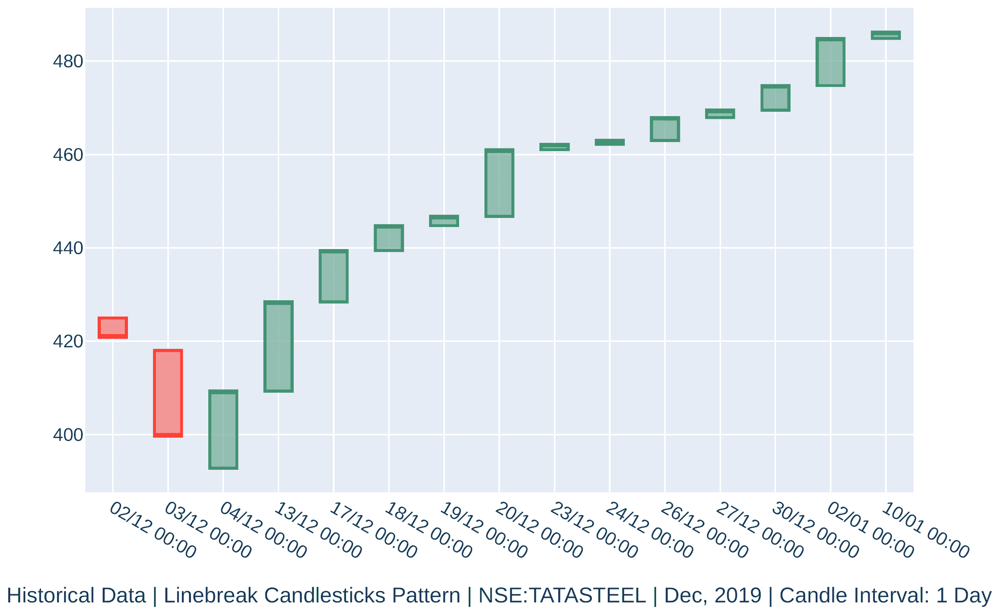

## 它是如何工作的...

在 *步骤 1* 中，你导入 `plot_candlestick_chart`，一个用于绘制蜡烛图表的快捷实用函数，`PlotType`，一个用于各种蜡烛图案的枚举，以及 `Linebreak` 函数，该函数可以将日本蜡烛图案的历史数据转换成线条蜡烛图案。在 *步骤 2* 中，你使用 `broker_connection` 的 `get_instrument()` 方法来获取一个工具，并将其赋值给一个新属性 `instrument`。这个对象是 `Instrument` 类的一个实例。调用 `get_instrument()` 需要的两个参数是交易所（`'NSE'`）和交易符号（`'TATASTEEL'`）。接下来，你使用 `broker_connection` 对象的 `get_historical_data()` 方法获取工具的历史数据，时段为 2019 年 12 月，蜡烛间隔为 1 分钟。返回的时间序列数据以日本蜡烛图案的形式呈现。`Linebreak()` 函数将此数据转换为线条蜡烛图案，另一个 `pandas.DataFrame` 对象。你将其赋值给 `historical_data_1minute_linebreak`。注意到 `historical_data_1minute_linebreak` 只有 `timestamp`、`open` 和 `close` 列。另外，请注意时间戳不是等距的，因为线条蜡烛是基于价格变动而不是时间的。在 *步骤 3* 和 *步骤 4* 中，你从数据中选择性地提取了一个绿色和一个红色蜡烛。（请注意，如果您选择了第一章中获取的 `historical_data` 的不同持续时间，传递给 `historical_data.iloc` 的索引将不同。）请注意，蜡烛没有影子（延伸在主要蜡烛体两侧的线）因为蜡烛只有 `open` 和 `close` 属性。在 *步骤 5* 中，你使用 `plot_candlestick_chart()` 函数绘制了 `historical_data` 持有的完整历史数据。

在 *步骤 6* 到 *12* 中，您使用日本烛台图案获取历史数据，将其转换为 Line Break 烛台图案，并绘制烛台间隔为 3 分钟、5 分钟、10 分钟、15 分钟、30 分钟、1 小时和 1 天的转换数据。随着烛台间隔的增加，观察以下图表之间的差异和相似之处：

+   烛台总数减少。

+   由于突然的价格变动，图表中的尖峰被最小化。较小的烛台间隔图表具有更多尖峰，因为它们关注局部趋势，而较大的烛台间隔图表具有较少的尖峰，并且更加平滑。

+   股价的长期趋势变得可见。

+   决策可能变得较慢，因为您必须等待更长时间才能获取新的烛台数据。较慢的决策可能是可取的，也可能不是，这取决于策略。例如，为了确认趋势，使用较小烛台间隔的数据（例如 3 分钟）和较大烛台间隔的数据（例如 15 分钟）的组合是可取的。另一方面，为了抓住日内交易的机会，不希望使用较大烛台间隔（例如 1 小时或 1 天）的数据。

+   两个相邻烛台的价格范围（y 轴跨度）不会重叠。相邻的烛台始终共享其中一个端点。

+   与日本烛台图案不同，时间戳无需等间隔（烛台是基于价格变动而不是时间变动形成的）。

如果您对查找数学和实现 Line Break 烛台感兴趣，请参阅位于 [`github.com/algobulls/pyalgotrading/blob/master/pyalgotrading/utils/candlesticks/linebreak.py`](https://github.com/algobulls/pyalgotrading/blob/master/pyalgotrading/utils/candlesticks/linebreak.py) 的 `pyalgotrading` 包中的源代码。

# 使用 Renko 砖块图案获取历史数据

金融工具的历史数据可以以 Renko 砖块图案的形式进行分析，这是一种关注价格变动的烛台图案。这与关注时间变动的日本烛台图案不同。经纪人通常不通过 API 提供 Renko 砖块图案的历史数据。经纪人通常通过使用需要转换为 Renko 砖块图案的日本烛台图案来提供历史数据。较短的烛台间隔暗示着局部价格变动趋势，而较大的烛台间隔则表示整体价格变动趋势。根据您的算法交易策略，您可能需要烛台间隔小或大。1 分钟的烛台间隔通常是最小的可用烛台间隔。

Renko 砖块图案的工作原理如下：

1.  每个烛台仅具有 `open` 和 `close` 属性。

1.  您可以定义一个**砖块计数** (`b`) 设置，通常设置为 `2`。

1.  每个蜡烛始终是固定的，并且等于`Brick Count`。因此，此处也将蜡烛称为**砖块**。

1.  在每个蜡烛间隔结束时，如果股价比前一个砖的最高价高出`b`个点，则形成绿色砖块。如果价格在单个蜡烛间隔内上涨超过`b`个点，将形成足够多的砖块以适应价格变动。

    例如，假设价格比前一砖的高点高出 21 个点。如果砖块大小为`2`，将形成 10 个具有相同时间戳的砖块以适应 20 点的变动。对于剩余的 1 点变化（21-20），直到价格至少再上涨 1 点之前，不会形成任何砖块。

1.  在每个蜡烛间隔结束时，如果股价比前一个砖的最低价低`b`个点，则形成红色蜡烛。如果价格在单个蜡烛间隔内下跌超过`b`个点，将形成足够多的砖块以适应价格变动。

    例如，假设价格比前一个砖的最高价低 21 个点。如果砖块大小为`2`，将形成 10 个具有相同时间戳的砖块以适应 20 点的变动。对于剩余的 1 点变化（21-20），直到价格至少再下跌 1 点之前，不会形成任何砖块。

1.  没有两个相邻的蜡烛重叠在一起。相邻的蜡烛始终共享它们的一端。

1.  没有任何时间戳需要等间隔（不像日本蜡烛图案），因为蜡烛是基于价格运动而不是时间运动形成的。此外，与其他图案不同，可能会有多个具有相同时间戳的蜡烛。

本食谱展示了如何使用经纪人 API 获取历史数据作为日本蜡烛图案，以及如何使用砖块蜡烛图案转换和绘制不同蜡烛间隔的历史数据。

## 准备工作

确保在 Python 命名空间中可用的`broker_connection`对象。请参阅本章的*技术要求*部分，了解如何设置`broker_connection`。

## 如何做…

我们按照以下步骤执行此处方：

1.  导入必要的模块：

```py
>>> from pyalgotrading.utils.func import plot_candlestick_chart, PlotType
>>> from pyalgotrading.utils.candlesticks.renko import Renko
```

1.  获取仪器的历史数据并将其转换为砖块数据：

```py
>>> instrument = broker_connection.get_instrument('NSE', 
                                                  'TATASTEEL')
>>> historical_data_1minute = \
            broker_connection.get_historical_data(instrument, 
                                                  'minute', 
                                                  '2019-12-01', 
                                                  '2020-01-10')
>>> historical_data_1minute_renko = Renko(historical_data_1minute)
>>> historical_data_1minute_renko
```

您将获得以下输出：

```py
      close     open                     timestamp
0     424.0   424.95     2019-12-02 09:15:00+05:30
1     422.0   424.00     2019-12-02 09:20:00+05:30
2     426.0   424.00     2019-12-02 10:00:00+05:30
3     422.0   424.00     2019-12-02 10:12:00+05:30
4     420.0   422.00     2019-12-02 15:28:00+05:30
       ...     ...          ...        ...
186   490.0   488.00     2020-01-10 10:09:00+05:30
187   492.0   490.00     2020-01-10 11:41:00+05:30
188   488.0   490.00     2020-01-10 13:31:00+05:30
189   486.0   488.00     2020-01-10 13:36:00+05:30
190   484.0   486.00     2020-01-10 14:09:00+05:30
```

1.  从`historical_data`的行中创建绿色砖块：

```py
>>> candle_green_renko = historical_data_1minute_renko.iloc[2:3,:]            
# Only 3rd ROW of historical data
>>> plot_candlestick_chart(candle_green_renko, 
                           PlotType.RENKO, 
                           "A Green 'Renko' Candle")
```

您将获得以下输出：

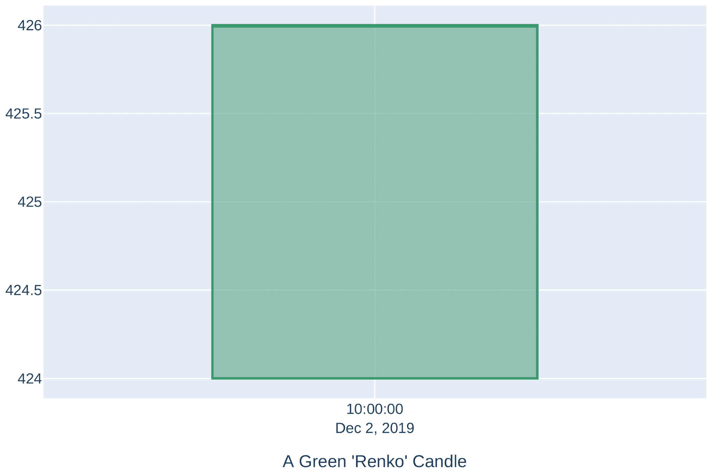

1.  从`historical_data`的行中创建红色砖块：

```py
>>> plot_candlestick_chart(historical_data_1minute_renko, 
                           PlotType.RENKO, 
                           'Historical Data | '
                           'Renko Candlesticks Pattern | '
                           'NSE:TATASTEEL | '
                           'Dec, 2019 | '
                           'Candle Interval: 1 Minute', True)
```

您将获得以下输出：

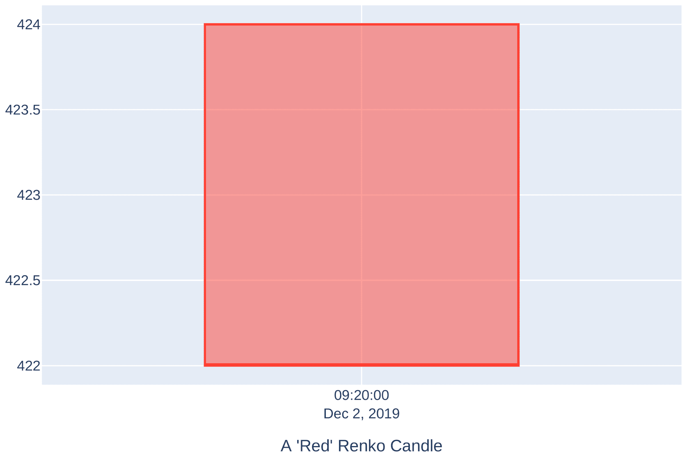

1.  绘制仪器历史数据的图表，间隔为 1 分钟蜡烛：

```py
>>> historical_data_3minutes = \
            broker_connection.get_historical_data(instrument, 
                                                  '3minute', 
                                                  '2019-12-01', 
                                                  '2019-12-31')
>>> historical_data_3minutes_renko = \
                                Renko(historical_data_3minutes)
>>> plot_candlestick_chart(historical_data_3minutes_renko, 
                           PlotType.RENKO, 
                           'Historical Data | '
                           'Renko Candlesticks Pattern | '
                           'NSE:TATASTEEL | '
                           'Dec, 2019 | '
                           'Candle Interval: 3 Minutes', True)
```

您将获得以下输出：

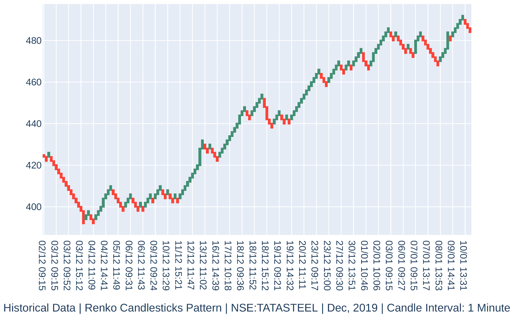

1.  绘制仪器历史数据的图表，间隔为 3 分钟蜡烛：

```py
>>> historical_data_5minutes = \
            broker_connection.get_historical_data(instrument, 
                                                  '5minute', 
                                                  '2019-12-01', 
                                                  '2019-12-31')
>>> historical_data_5minutes_renko = \
                                Renko(historical_data_5minutes)
>>> plot_candlestick_chart(historical_data_5minutes_renko, 
                           PlotType.RENKO, 
                           'Historical Data | '
                           'Renko Candlesticks Pattern | '
                           'NSE:TATASTEEL | '
                           'Dec, 2019 | '
                           'Candle Interval: 5 Minutes', True)
```

您将获得以下输出：

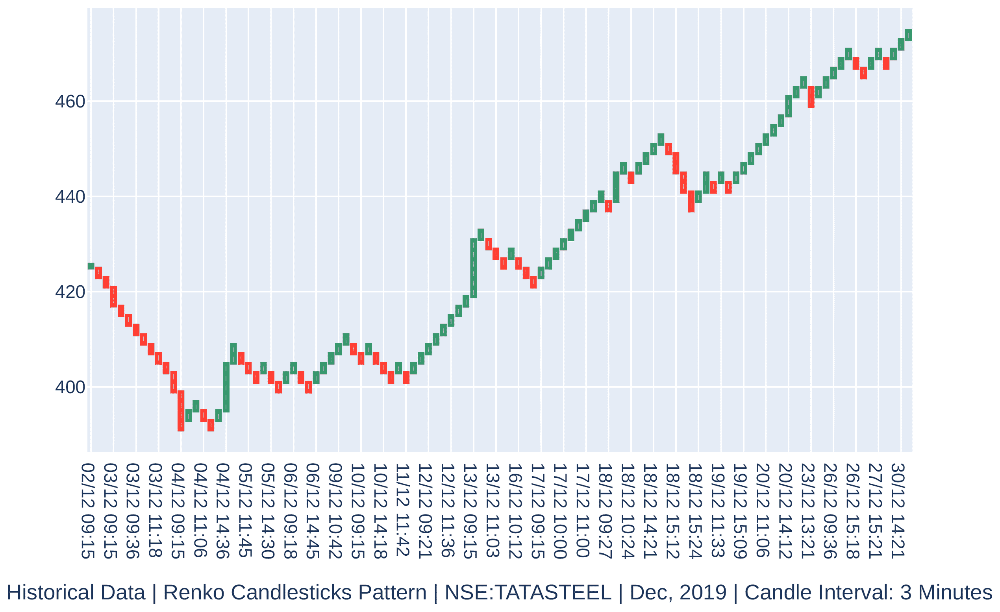

1.  用 5 分钟蜡烛间隔绘制工具的历史数据图表：

```py
>>> historical_data_10minutes = \
            broker_connection.get_historical_data(instrument, 
                                                  '10minute', 
                                                  '2019-12-01', 
                                                  '2019-12-31')
>>> historical_data_10minutes_renko = \
                                Renko(historical_data_10minutes)
>>> plot_candlestick_chart(historical_data_10minutes_renko, 
                           PlotType.RENKO, 
                           'Historical Data | '
                           'Renko Candlesticks Pattern | '
                           'NSE:TATASTEEL | '
                           'Dec, 2019 | '
                           'Candle Interval: 10 Minutes', True)
```

你将会得到以下输出：

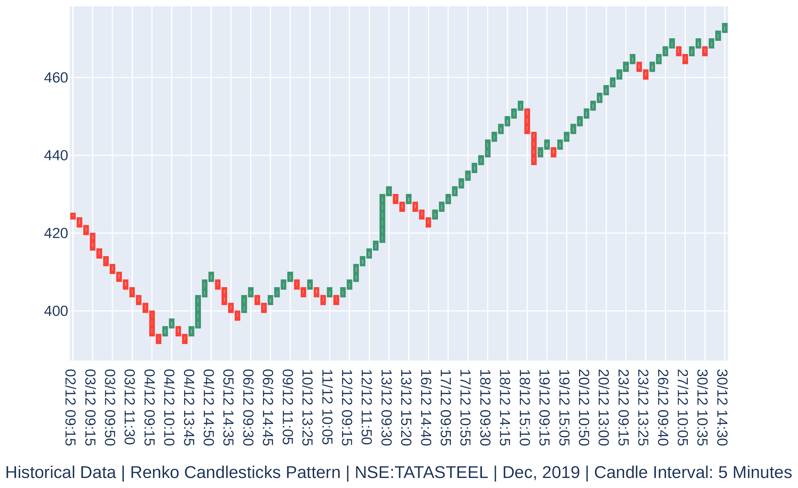

1.  用 10 分钟蜡烛间隔绘制工具的历史数据图表：

```py
>>> historical_data_15minutes = \
            broker_connection.get_historical_data(instrument, 
                                                  '15minute', 
                                                  '2019-12-01', 
                                                  '2019-12-31')
>>> historical_data_15minutes_renko = \
                               Renko(historical_data_15minutes)
>>> plot_candlestick_chart(historical_data_15minutes_renko, 
                           PlotType.RENKO, 
                           'Historical Data | '
                           'Renko Candlesticks Pattern | '
                           'NSE:TATASTEEL | '
                           'Dec, 2019 | '
                           'Candle Interval: 15 Minutes', True)
```

你将会得到以下输出：

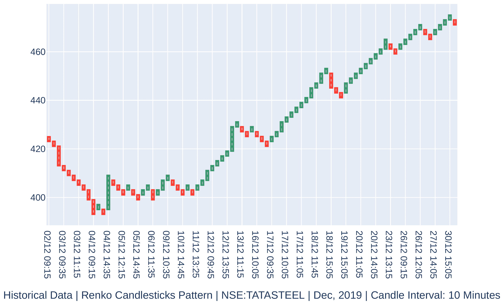

1.  用 15 分钟蜡烛间隔绘制工具的历史数据图表：

```py
>>> historical_data_15minutes = \
            broker_connection.get_historical_data(instrument, 
                                                  '15minute', 
                                                  '2019-12-01', 
                                                  '2019-12-31')
>>> historical_data_15minutes_renko = \
                                Renko(historical_data_15minutes)
>>> plot_candlestick_chart(historical_data_15minutes_renko, 
                           PlotType.RENKO, 
                           'Historical Data | '
                           'Renko Candlesticks Pattern | '
                           'NSE:TATASTEEL | '
                           'Dec, 2019 | '
                           'Candle Interval: 15 Minutes', True)
```

你将会得到以下输出：

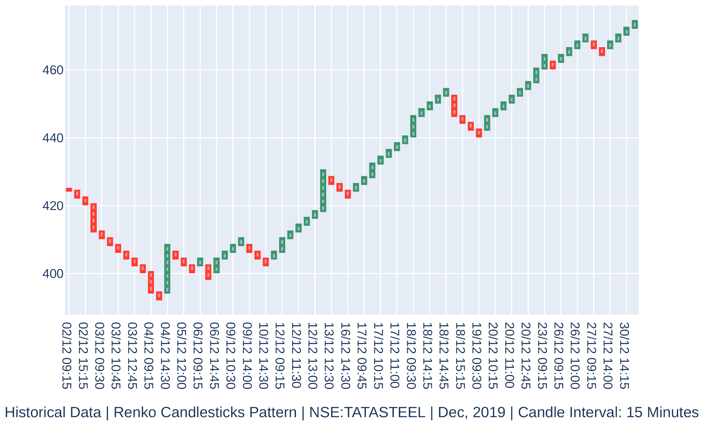

1.  用 30 分钟蜡烛间隔绘制工具的历史数据图表：

```py
>>> historical_data_30minutes = \
            broker_connection.get_historical_data(instrument, 
                                                  '30minute', 
                                                  '2019-12-01', 
                                                  '2019-12-31')
>>> historical_data_30minutes_renko = \
                                Renko(historical_data_30minutes)
>>> plot_candlestick_chart(historical_data_30minutes_renko, 
                           PlotType.RENKO, 
                           'Historical Data | '
                           'Renko Candlesticks Pattern | '
                           'NSE:TATASTEEL | '
                           'Dec, 2019 | '
                           'Candle Interval: 30 Minutes', True)
```

你将会得到以下输出：

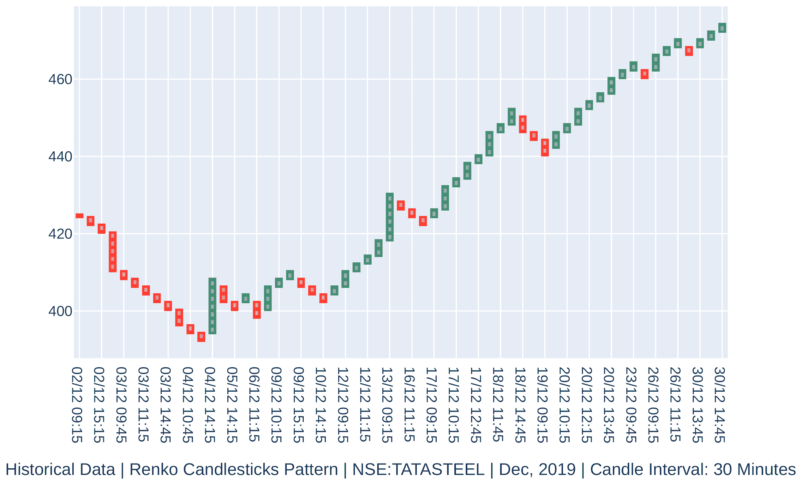

1.  用 1 小时蜡烛间隔绘制工具的历史数据图表：

```py
>>> historical_data_1hour = \
            broker_connection.get_historical_data(instrument, 
                                                  'hour', 
                                                  '2019-12-01', 
                                                  '2019-12-31')
>>> historical_data_1hour_renko = Renko(historical_data_1hour)
>>> plot_candlestick_chart(historical_data_1hour_renko, 
                           PlotType.RENKO, 
                           'Historical Data | '
                           'Renko Candlesticks Pattern | '
                           'NSE:TATASTEEL | '
                           'Dec, 2019 | '
                           'Candle Interval: 1 Hour', True)
```

你将会得到以下输出：

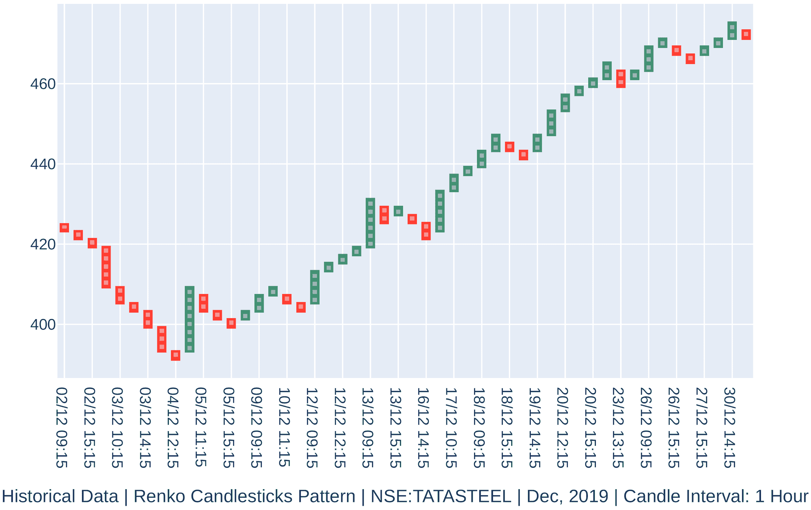

1.  用 1 天蜡烛间隔绘制工具的历史数据图表：

```py
>>> historical_data_day = \
            broker_connection.get_historical_data(instrument, 
                                                  'day', 
                                                  '2019-12-01', 
                                                  '2019-12-31')
>>> historical_data_day_renko = Renko(historical_data_day)
>>> plot_candlestick_chart(historical_data_day_renko, 
                           PlotType.RENKO, 
                           'Historical Data | '
                           'Renko Candlesticks Pattern | '
                           'NSE:TATASTEEL | '
                           'Dec, 2019 | '
                           'Candle Interval: Day', True)
```

你将会得到以下输出：

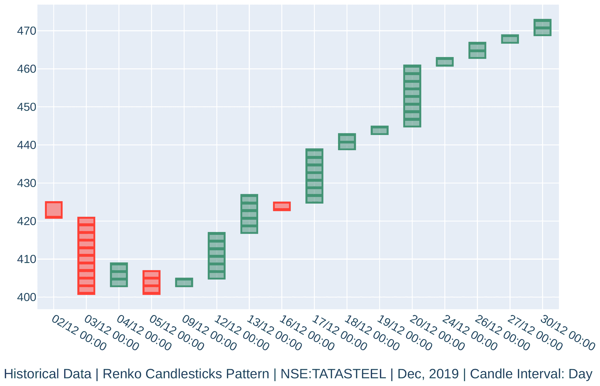

## 工作原理…

在 *步骤 1* 中，你导入了`plot_candlestick_chart`，一个用于绘制蜡烛图表的快速实用函数，`PlotType`，用于各种蜡烛图案的枚举，以及`Renko`函数，该函数可以将日本蜡烛图案的历史数据转换为 Renko 蜡烛图案。在 *步骤 2* 中，你使用`broker_connection`的`get_instrument()`方法来获取一个工具，并将其赋值给一个新属性`instrument`。这个对象是`Instrument`类的一个实例。调用 get_instrument()所需的两个参数是交易所（`'NSE'`）和交易符号（`'TATASTEEL'`）。接下来，你使用`broker_connection`对象的`get_historical_data()`方法来获取 2019 年 12 月的历史数据，蜡烛间隔为 1 分钟。返回的时间序列数据以日本蜡烛图案的形式呈现。`Renko()`函数将此数据转换为 Renko 蜡烛图案，另一个`pandas.DataFrame`对象。你将其赋值给`historical_data_1minute_renko`。请注意，`historical_data_1minute_renko`具有`timestamp`、`open`和`close`列。同时请注意，时间戳不是等距的，因为 Renko 蜡烛是基于价格变动而不是时间的。在 *步骤 3* 和 *4* 中，你选择性地从数据中提取一个绿色蜡烛和一个红色蜡烛（请注意，传递给`historical_data.iloc`的索引是从本章第一个配方中获取的）。请注意，蜡烛没有影子（延伸在主要蜡烛体两侧的线），因为蜡烛只有`open`和`close`属性。在 *步骤 5* 中，你使用`plot_candlestick_chart()`函数绘制`historical_data`中保存的完整历史数据。

在*步骤 6*到*12*中，您使用日本蜡烛图形态获取历史数据，将其转换为 Renko 蜡烛图形态，并绘制蜡烛间隔为 3 分钟、5 分钟、10 分钟、15 分钟、30 分钟、1 小时和 1 天的转换数据。观察随着蜡烛间隔增加而图表之间的以下差异和相似之处：

+   蜡烛图形态的总数量减少。

+   由于突然的价格波动，图表中的尖峰被最小化。较小的蜡烛间隔图表具有更多尖峰，因为它们关注局部趋势，而较大的蜡烛间隔图表则具有较少的尖峰，并且更平滑。

+   股价的长期趋势变得可见。

+   决策可能会变慢，因为您必须等待更长时间才能获得新的蜡烛数据。根据策略，较慢的决策可能是可取或不可取的。例如，为了确认趋势，使用较小的蜡烛间隔数据（如 3 分钟）和较大的蜡烛间隔数据（如 15 分钟）的组合将是可取的。另一方面，为了抓住日内交易中的机会，不希望使用较大蜡烛间隔（如 1 小时或 1 天）的数据。

+   两个相邻蜡烛的价格范围（y 轴跨度）不会互相重叠。相邻蜡烛总是共享其中一个端点。

+   没有必要让所有时间戳等间隔排列（不像日本蜡烛图形态那样），因为蜡烛是基于价格运动而不是时间运动形成的。

如果您对研究 Renko 蜡烛图的数学和实现感兴趣，请参考 [`github.com/algobulls/pyalgotrading/blob/master/pyalgotrading/utils/candlesticks/renko.py`](https://github.com/algobulls/pyalgotrading/blob/master/pyalgotrading/utils/candlesticks/renko.py) 中 `pyalgotrading` 包中的源代码。

# 使用平均-足蜡烛形态获取历史数据

金融工具的历史数据可以以平均-足烛形态的形式进行分析。经纪人通常不会通过 API 提供使用平均-足烛形态的历史数据。经纪人通常提供使用日本蜡烛图形态的历史数据，需要将其转换为平均-足烛形态。较短的蜡烛间隔暗示着局部价格走势，而较长的蜡烛间隔则表示整体价格走势。根据您的算法交易策略，您可能需要蜡烛间隔较小或较大。1 分钟的蜡烛间隔通常是可用的最小蜡烛间隔。

平均-足蜡烛形态的工作原理如下：

+   每根蜡烛都有 `收盘价`、`开盘价`、`最高价` 和 `最低价` 属性。对于每根蜡烛，会发生以下情况：

+   `收盘价` 计算为当前日本蜡烛的 `开盘价`、`最高价`、`最低价` 和 `收盘价` 属性的平均值。

+   `开盘价` 为前一个平均-足蜡烛的 `开盘价` 和 `收盘价` 属性的平均值。

+   `高` 为：

+   当前平均蜡烛的`Open`

+   当前平均蜡烛的`Close`

+   当前日本蜡烛的`High`

+   `Low`是：

+   当前平均蜡烛的`Open`

+   当前平均蜡烛的`Close`

+   当前日本蜡烛的`Low`

+   当`Close`高于`Open`时形成绿色蜡烛。（与日本蜡烛图案中的绿色蜡烛相同。）

+   当`Close`低于`Open`时形成红色蜡烛。（与日本蜡烛图案中的红色蜡烛相同。）

+   所有时间戳均等间隔（在市场营业时间内）。

此示例向您展示了在使用经纪人 API 时如何使用日本蜡烛图案获取历史数据，以及如何转换和绘制各种蜡烛间隔的历史数据使用平均蜡烛图案。

## 准备就绪

确保在你的 Python 命名空间中可用 `broker_connection` 对象。请参考本章的*技术要求*部分了解如何设置 `broker_connection`。

## 如何实现…

我们对这个配方执行以下步骤：

1.  导入必要的模块：

```py
>>> from pyalgotrading.utils.func import plot_candlestick_chart, PlotType
>>> from pyalgotrading.utils.candlesticks.heikinashi import HeikinAshi
```

1.  获取仪器的历史数据并将其转换为平均蜡烛数据：

```py
>>> instrument = broker_connection.get_instrument('NSE', 
                                                  'TATASTEEL')
>>> historical_data_1minute = \
            broker_connection.get_historical_data(instrument, 
                                                  'minute', 
                                                  '2019-12-01', 
                                                  '2019-12-31')
>>> historical_data_1minute_heikinashi = \
                            HeikinAshi(historical_data_1minute)
>>> historical_data_1minute_heikinashi
```

你将获得以下输出：

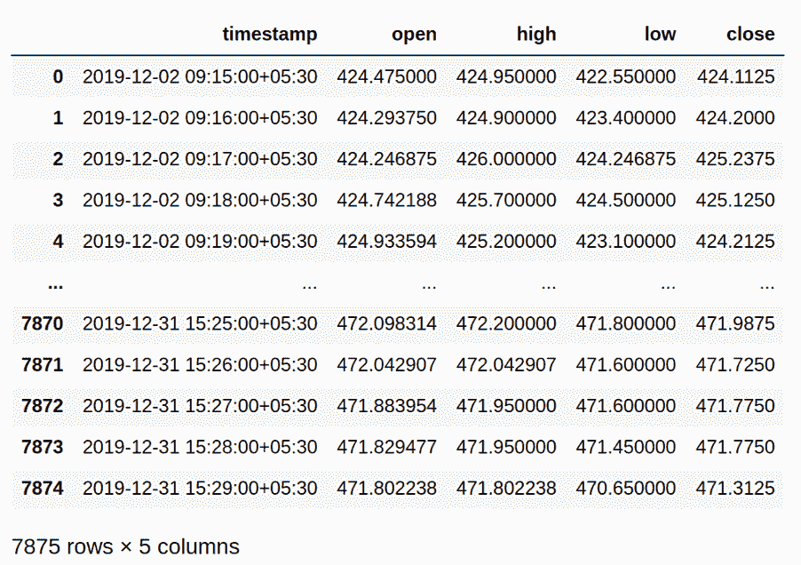

1.  创建一行数据的绿色平均蜡烛：

```py
>>> candle_green_heikinashi = \
            historical_data_1minute_heikinashi.iloc[2:3,:]            
# Only 3rd ROW of historical data
>>> plot_candlestick_chart(candle_green_heikinashi, 
                           PlotType.HEIKINASHI, 
                           "A 'Green' HeikinAshi Candle")
```

你将获得以下输出：

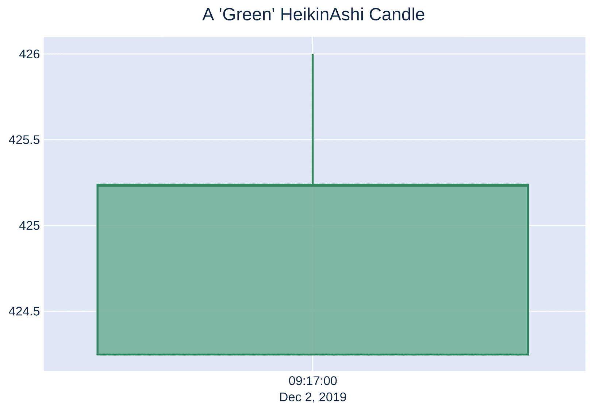

1.  创建一行数据的红色平均蜡烛：

```py
# A 'Red' HeikinAshi Candle
>>> candle_red_heikinashi = \
            historical_data_1minute_heikinashi.iloc[4:5,:]            
# Only 1st ROW of historical data
>>> plot_candlestick_chart(candle_red_heikinashi, 
                           PlotType.HEIKINASHI, 
                           "A 'Red' HeikinAshi Candle")
```

你将获得以下输出：

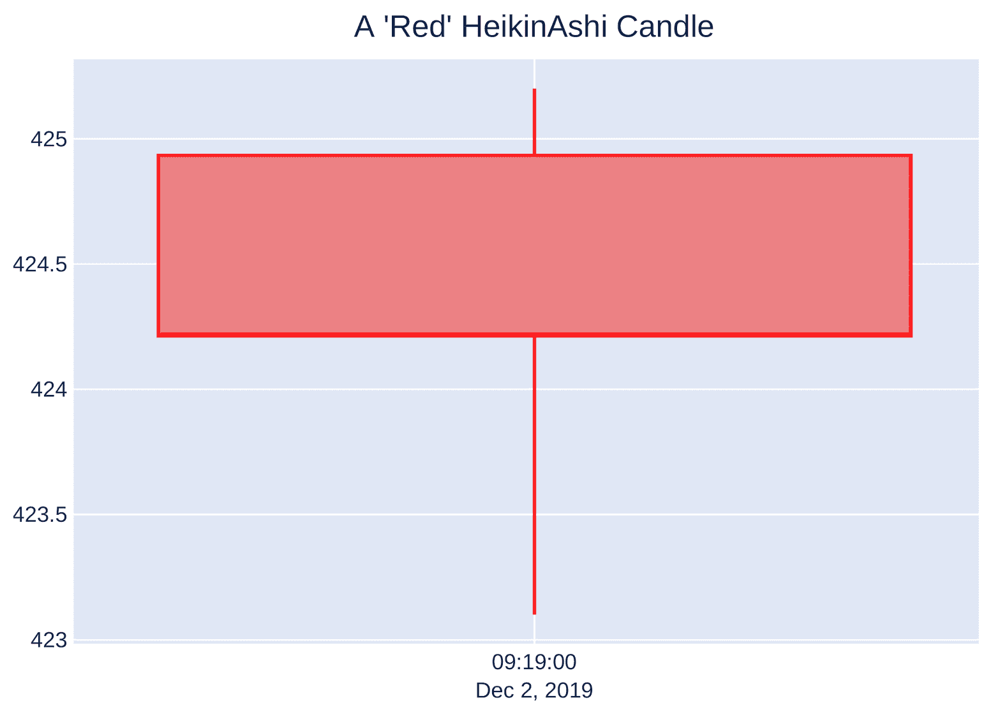

1.  绘制仪器历史数据的图表，间隔为 1 分钟：

```py
>>> plot_candlestick_chart(historical_data_1minute_heikinashi, 
                           PlotType.HEIKINASHI, 
                           'Historical Data | '
                           'Heikin-Ashi Candlesticks Pattern | '
                           'NSE:TATASTEEL | '
                           'Dec, 2019 | '
                           'Candle Interval: 1 minute', True)
```

你将获得以下输出：

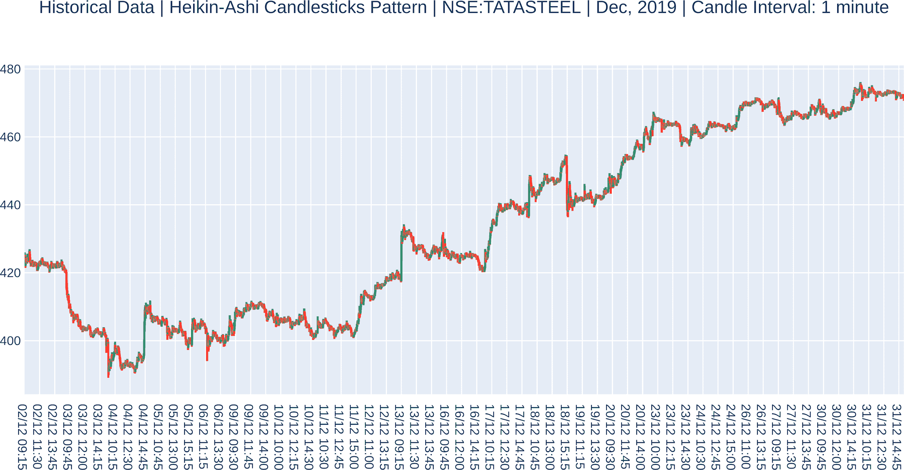

1.  绘制仪器历史数据的图表，间隔为 3 分钟：

```py
>>> historical_data_3minutes = \
            broker_connection.get_historical_data(instrument, 
                                                  '3minute', 
                                                  '2019-12-01', 
                                                  '2019-12-31')
>>> historical_data_3minutes_heikinashi = \
                            HeikinAshi(historical_data_3minutes)
>>> plot_candlestick_chart(historical_data_3minutes_heikinashi, 
                           PlotType.HEIKINASHI, 
                           'Historical Data | '
                           'Heikin-Ashi Candlesticks Pattern | '
                           'NSE:TATASTEEL | '
                           'Dec, 2019 | '
                           'Candle Interval: 3 minutes', True)
```

你将获得以下输出：

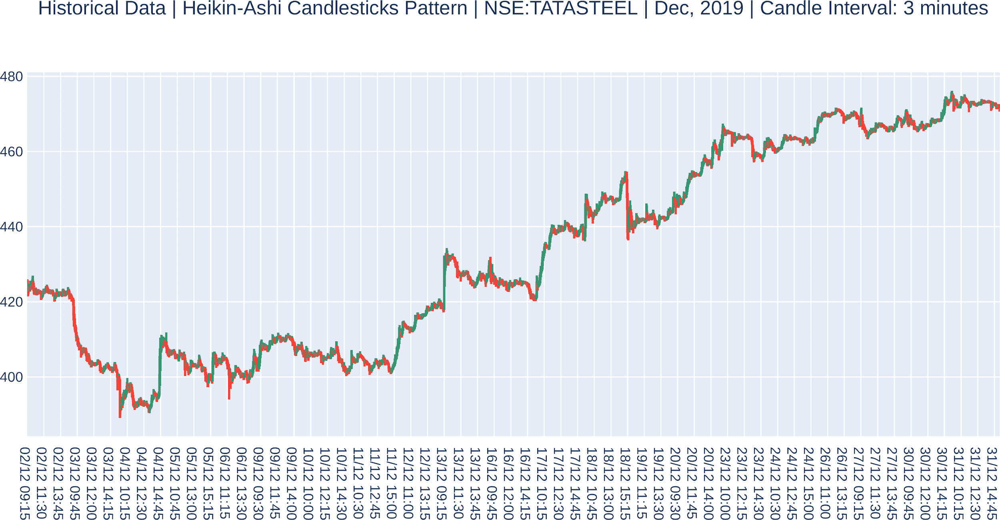

1.  绘制仪器历史数据的图表，间隔为 5 分钟：

```py
>>> historical_data_5minutes = \
            broker_connection.get_historical_data(instrument, 
                                                  '5minute', 
                                                  '2019-12-01', 
                                                  '2019-12-31')
>>> historical_data_5minutes_heikinashi = \
                           HeikinAshi(historical_data_5minutes)
>>> plot_candlestick_chart(historical_data_5minutes_heikinashi, 
                            PlotType.HEIKINASHI, 
                           'Historical Data | '
                           'Heikin-Ashi Candlesticks Pattern | '
                           'NSE:TATASTEEL | '
                           'Dec, 2019 | '
                           'Candle Interval: 5 minutes', True)
```

你将获得以下输出：

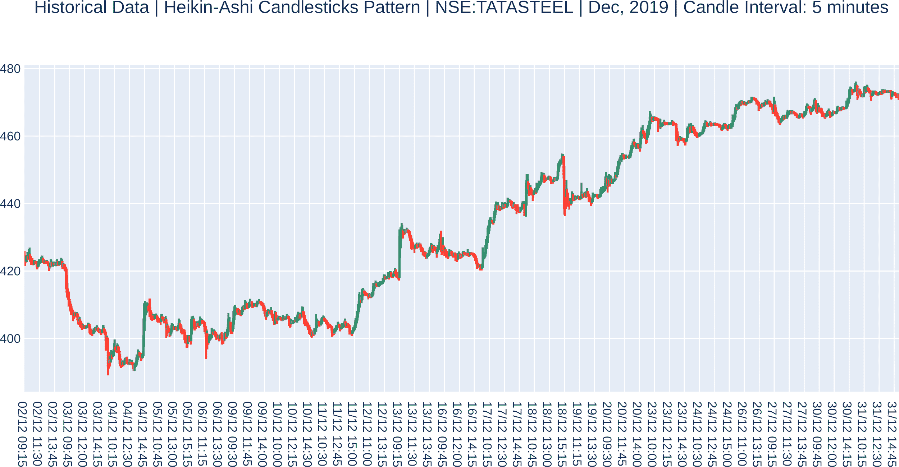

1.  绘制仪器历史数据的图表，间隔为 10 分钟：

```py
>>> historical_data_10minutes = \
            broker_connection.get_historical_data(instrument, 
                                                  '10minute', 
                                                  '2019-12-01', 
                                                  '2019-12-31')
>>> historical_data_10minutes_heikinashi = \
                            HeikinAshi(historical_data_10minutes)
>>> plot_candlestick_chart(historical_data_10minutes_heikinashi, 
                           PlotType.HEIKINASHI, 
                           'Historical Data | '
                           'Heikin-Ashi Candlesticks Pattern | '
                           'NSE:TATASTEEL | '
                           'Dec, 2019 | '
                           'Candle Interval: 10 minutes', True)
```

你将获得以下输出：

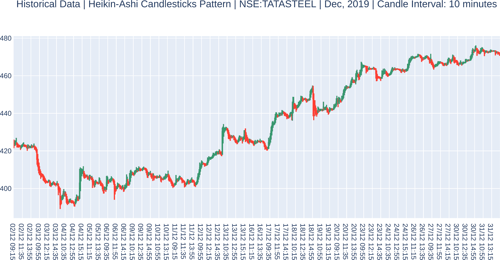

1.  绘制仪器历史数据的图表，间隔为 15 分钟：

```py
>>> historical_data_15minutes = \
            broker_connection.get_historical_data(instrument, 
                                                  '15minute', 
                                                  '2019-12-01', 
                                                  '2019-12-31')
>>> historical_data_15minutes_heikinashi = \
                           HeikinAshi(historical_data_15minutes)
>>> plot_candlestick_chart(historical_data_15minutes_heikinashi, 
                           PlotType.HEIKINASHI, 
                           'Historical Data | '
                           'Heikin-Ashi Candlesticks Pattern | '
                           'NSE:TATASTEEL | '
                           'Dec, 2019 | '
                           'Candle Interval: 15 minutes', True)
```

你将获得以下输出：

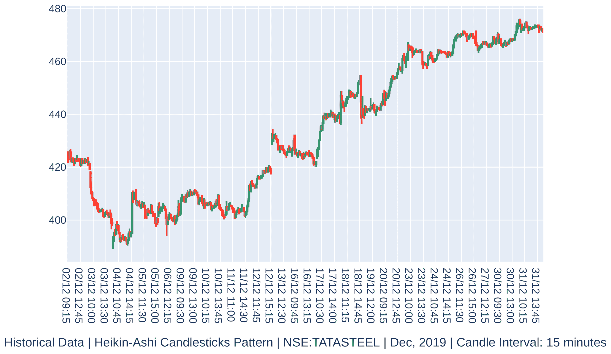

1.  绘制仪器历史数据的图表，间隔为 30 分钟：

```py
>>> historical_data_30minutes = \
            broker_connection.get_historical_data(instrument, 
                                                  '30minute', 
                                                  '2019-12-01', 
                                                  '2019-12-31')
>>> historical_data_30minutes_heikinashi = \
                           HeikinAshi(historical_data_30minutes)
>>> plot_candlestick_chart(historical_data_30minutes_heikinashi, 
                           PlotType.HEIKINASHI, 
                           'Historical Data | '
                           'Heikin-Ashi Candlesticks Pattern | '
                           'NSE:TATASTEEL | '
                           'Dec, 2019 | '
                           'Candle Interval: 30 minutes', True)
```

你将获得以下输出：

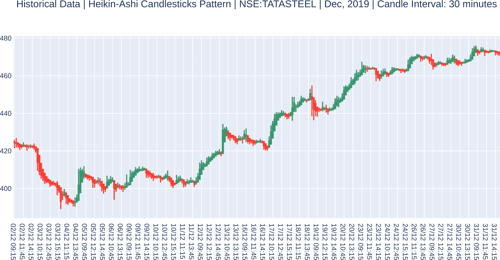

1.  绘制仪器历史数据的图表，间隔为 1 小时：

```py
>>> historical_data_1hour = 
        broker_connection.get_historical_data(instrument, 
                                              'hour', 
                                              '2019-12-01', 
                                              '2019-12-31')
>>> historical_data_1hour_heikinashi = \
                           HeikinAshi(historical_data_1hour)
>>> plot_candlestick_chart(historical_data_1hour_heikinashi, 
                           PlotType.HEIKINASHI, 
                           'Historical Data | '
                           'Heikin-Ashi Candlesticks Pattern | '
                           'NSE:TATASTEEL | '
                           'Dec, 2019 | '
                           'Candle Interval: 1 Hour', True)
```

你将获得以下输出：

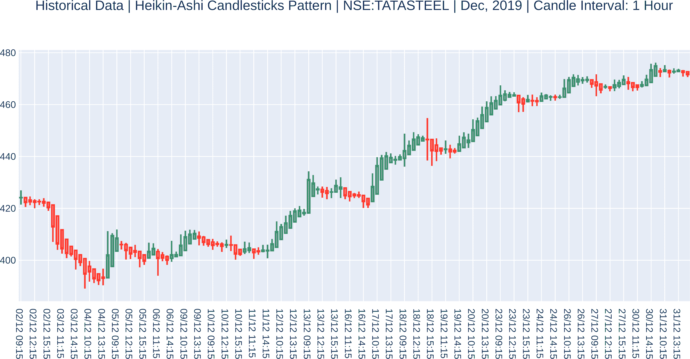

1.  绘制仪器历史数据的图表，间隔为 1 天：

```py
>>> historical_data_day = \
            broker_connection.get_historical_data(instrument, 
                                                  'day', 
                                                  '2019-12-01', 
                                                  '2019-12-31')
>>> historical_data_day_heikinashi = \
                                HeikinAshi(historical_data_day)
>>> plot_candlestick_chart(historical_data_day_heikinashi, 
                           PlotType.HEIKINASHI, 
                           'Historical Data | '
                           'Heikin-Ashi Candlesticks Pattern | '
                           'NSE:TATASTEEL | '
                           'Dec, 2019 | '
                           'Candle Interval: Day', True)
```

你将获得以下输出：

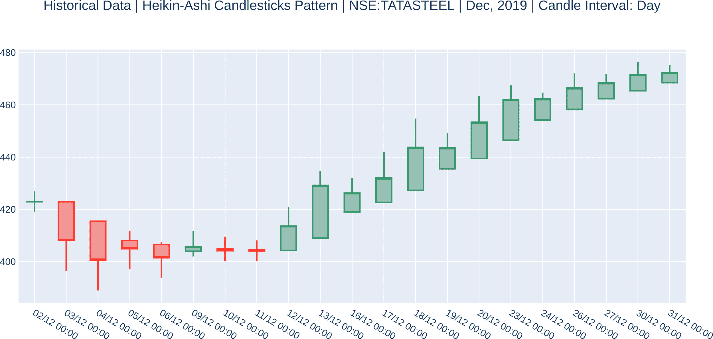

## 工作原理…

在*步骤 1*中，您导入`plot_candlestick_chart`，一个用于绘制蜡烛图模式图表的快捷工具函数，`PlotType`，一个用于各种蜡烛图模式的枚举，以及`HeikinAshi`函数，该函数可以将日本蜡烛图模式的历史数据转换为适用于平均阴阳蜡烛图模式的数据。在*步骤 2*中，您使用`broker_connection`的`get_instrument()`方法获取一个工具，并将其分配给一个新属性`instrument`。这个对象是`Instrument`类的一个实例。调用`get_instrument()`所需的两个参数是交易所（`'NSE'`）和交易符号（`'TATASTEEL'`）。接下来，您使用`broker_connection`对象的`get_historical_data()`方法获取 2019 年 12 月的历史数据，蜡烛间隔为 1 分钟。返回的时间序列数据以日本蜡烛图模式的形式返回。`HeikinAshi()`函数将这些数据转换为平均阴阳蜡烛图模式，另一个`pandas.DataFrame`对象。您将其分配给`historical_data_1minute_heikinashi`。注意`historical_data_1minute_heikinashi`具有`timestamp`、`close`、`open`、`high`和`low`列。还请注意，时间戳是等距的，因为平均阴阳蜡烛图是基于日本蜡烛的平均值。在*步骤 3*和*步骤 4*中，您从数据中选择性地提取绿色和红色蜡烛。（请注意，如果您选择本章第一个配方中获取的`historical_data`的不同持续时间，则传递给`historical_data.iloc`的索引将不同。）请注意，蜡烛具有阴影（延伸在主蜡烛体两侧的线），因为蜡烛具有`high`和`low`属性，以及`open`和`close`属性。在*步骤 5*中，您使用`plot_candlstick_charts()`函数绘制`historical_data`保存的完整历史数据。

在*步骤 6*到*步骤 12*之间，您使用日本蜡烛图模式获取历史数据，将其转换为平均阴阳蜡烛图模式，并分别为 3 分钟、5 分钟、10 分钟、15 分钟、30 分钟、1 小时和 1 天的蜡烛间隔绘制转换后的数据图表。随着蜡烛间隔的增加，观察以下图表之间的差异和相似之处：

+   蜡烛总数减少。

+   由于突然的价格波动，图表中的尖峰被最小化。较小的蜡烛间隔图表具有更多的尖峰，因为它们专注于局部趋势，而较大的蜡烛间隔图表具有较少的尖峰，更加平滑。

+   股价的长期趋势变得可见。

+   决策可能会变慢，因为你必须等待更长时间才能获取新的蜡烛数据。决策速度变慢可能是好事，也可能不是，这取决于策略。例如，为了确认趋势，使用较小蜡烛间隔的数据（例如 3 分钟）和较大蜡烛间隔的数据（例如 15 分钟）会是理想的。另一方面，为了抓住日内交易的机会，较大蜡烛间隔（例如 1 小时或 1 天）的数据则不理想。

+   相邻蜡烛的价格范围（y 轴跨度）可能重叠，也可能不重叠。

+   所有的时间戳在时间上是均匀分布的（在市场开放时间内）。

如果你对 Heikin-Ashi 蜡烛图的数学和实现感兴趣，请参考 `pyalgotrading` 包中的源代码：[`github.com/algobulls/pyalgotrading/blob/master/pyalgotrading/utils/candlesticks/heikinashi.py`](https://github.com/algobulls/pyalgotrading/blob/master/pyalgotrading/utils/candlesticks/heikinashi.py)。

# 使用 Quandl 获取历史数据

到目前为止，在本章的所有配方中，你都使用了经纪连接来获取历史数据。在这个配方中，你将使用第三方工具 Quandl ([`www.quandl.com/tools/python`](https://www.quandl.com/tools/python)) 来获取历史数据。它有一个免费使用的 Python 版本，可以使用 `pip` 轻松安装。这个配方演示了使用 `quandl` 来获取 **FAAMG** 股票价格（Facebook、亚马逊、苹果、微软和谷歌）的历史数据。

## 准备工作

确保你已安装了 Python 的 `quandl` 包。如果没有，你可以使用以下 `pip` 命令进行安装：

```py
$ pip install quandl 
```

## 如何做…

我们对此配方执行以下步骤：

1.  导入必要的模块：

```py
>>> from pyalgotrading.utils.func import plot_candlestick_chart, PlotType
>>> import quandl
```

1.  绘制 Facebook 的历史数据图表，蜡烛间隔为 1 天：

```py
>>> facebook = quandl.get('WIKI/FB', 
                           start_date='2015-1-1', 
                           end_date='2015-3-31')
>>> plot_candlestick_chart(facebook, 
                           PlotType.QUANDL_OHLC, 
                           'Historical Data | '
                           'Japanese Candlesticks Pattern | '
                           'FACEBOOK | '
                           'Jan-March 2015 | '
                           'Candle Interval: Day', True)
```

你将得到以下输出：

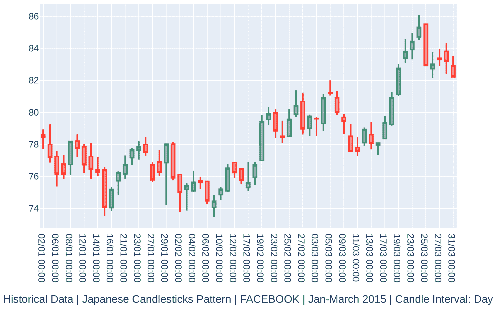

1.  绘制亚马逊的历史数据图表，蜡烛间隔为 1 天：

```py
>>> amazon = quandl.get('WIKI/AMZN', 
                         start_date='2015-1-1', 
                         end_date='2015-3-31')
>>> plot_candlestick_chart(amazon, 
                           PlotType.QUANDL_OHLC, 
                           'Historical Data | '
                           'Japanese Candlesticks Pattern | '
                           'AMAZON | '
                           'Jan-March 2015 | '
                           'Candle Interval: Day', True)
```

你将得到以下输出：

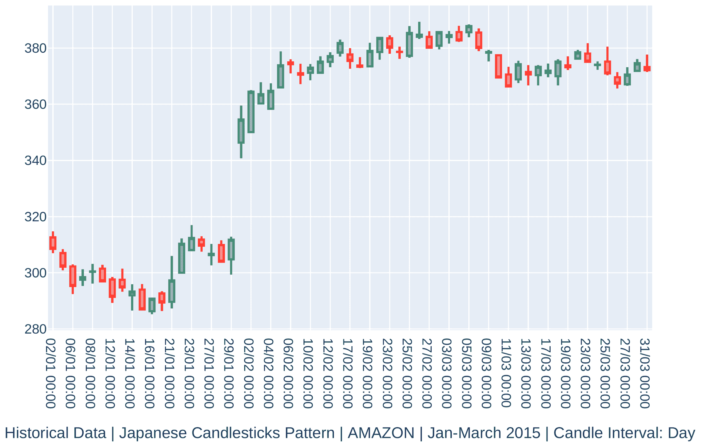

1.  绘制苹果的历史数据图表，蜡烛间隔为 1 天：

```py
>>> apple = quandl.get('WIKI/AAPL', 
                        start_date='2015-1-1', 
                        end_date='2015-3-31')
>>> plot_candlestick_chart(apple, 
                           PlotType.QUANDL_OHLC, 
                           'Historical Data | '
                           'Japanese Candlesticks Pattern | '
                           'APPLE | '
                           'Jan-March 2015 | '
                           'Candle Interval: Day', True)
```

你将得到以下输出：

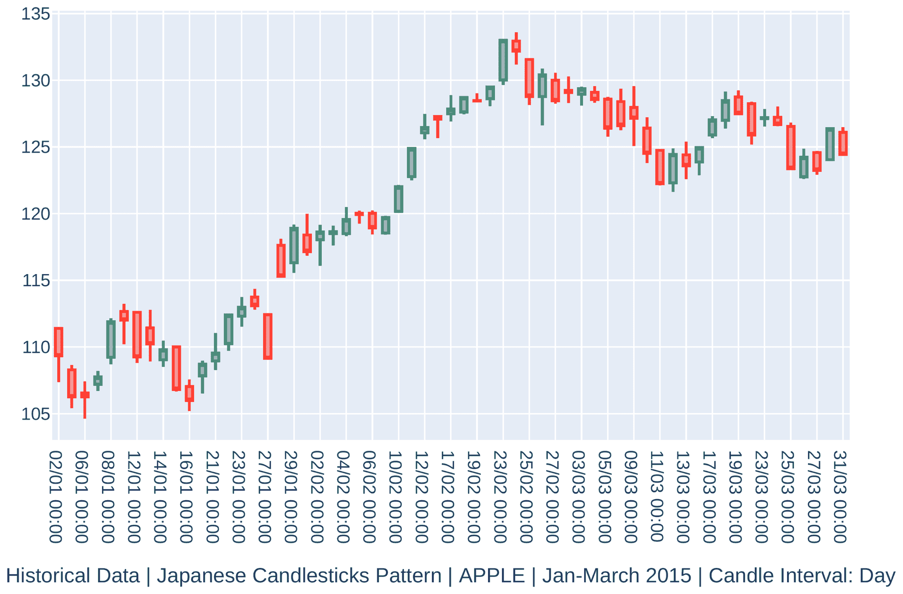

1.  绘制微软的历史数据图表，蜡烛间隔为 1 天：

```py
>>> microsoft = quandl.get('WIKI/MSFT', 
                            start_date='2015-1-1', 
                            end_date='2015-3-31')
>>> plot_candlestick_chart(microsoft, 
                           PlotType.QUANDL_OHLC, 
                           'Historical Data | '
                           'Japanese Candlesticks Pattern | '
                           'MICROSOFT | '
                           'Jan-March 2015 | '
                           'Candle Interval: Day', True)
```

你将得到以下输出：

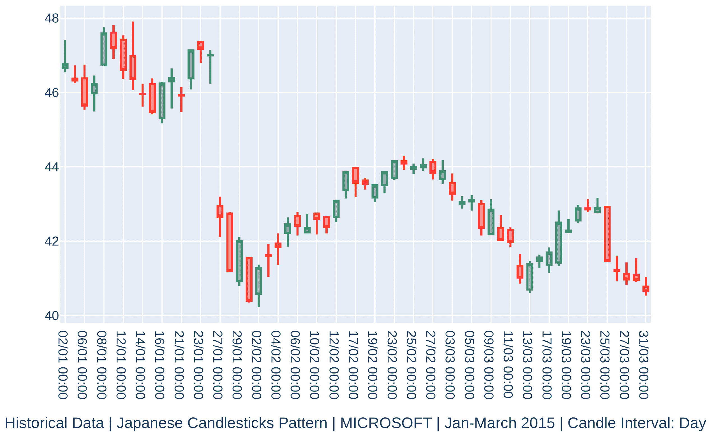

1.  绘制谷歌的历史数据图表，蜡烛间隔为 1 天：

```py
>>> google = quandl.get('WIKI/GOOGL', 
                         start_date='2015-1-1', 
                         end_date='2015-3-31')
>>> plot_candlestick_chart(google, 
                           PlotType.QUANDL_OHLC, 
                           'Historical Data | '
                           'Japanese Candlesticks Pattern | '
                           'GOOGLE | '
                           'Jan-March 2015 | '
                           'Candle Interval: Day', True)
```

你将得到以下输出：

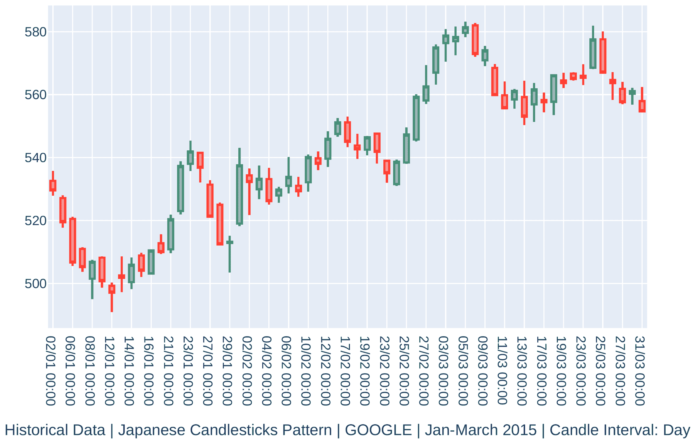

## 工作原理…

*第一步*中，你需要导入`plot_candlestick_chart`，这是一个用于绘制蜡烛图表的快速实用函数，还有`PlotType`，用于表示各种蜡烛图案的枚举，以及`quandl`模块。在其余的步骤中，使用`quandl.get()`获取 Facebook、Amazon、Apple、Microsoft 和 Google 股票的历史数据，并使用`plot_candlestick_chart()`方法进行绘制。`quandl`返回的数据格式是 OHLC（开盘价、最高价、最低价、收盘价）格式。

这种第三方模块的好处是它们是免费的，而且你不需要建立经纪人连接来获取历史数据。但缺点是来自免费包的数据有其局限性。例如，无法实时获取数据，也无法获取日内交易的数据（1 分钟蜡烛、3 分钟蜡烛等）。

因此，是否要使用这些数据取决于你的需求。它可能适用于测试或更新现有代码库，但不足以提供实时数据源，这在实际交易会话期间是需要的。
