# 第五章：计算和绘制技术指标

技术分析是交易中使用数学函数（称为**技术指标**）来预测并找到股票市场中盈利机会的一门学科。 技术指标分析基于金融工具的过去和现在的价格和成交量的数据，并提供统计信息。 这有助于预测金融工具未来的价格可能会上涨或下跌。 作为交易者，您可以在交易时做出知情决策，从而提高成功的几率。

技术指标不考虑底层金融工具业务的任何基本方面，如收入、收益、利润等。 但是，它们确实考虑了过去和现在的价格和成交量，这有助于预测短期价格变动。

大多数经纪人提供实时在历史数据图上叠加技术指标图表。 这有助于直观地预测价格变动的趋势。 但是，仅进行视觉分析也有一些限制：

+   您一次只能查看和分析少量图表，而您可能希望分析数千张图表以帮助寻找盈利机会。

+   对多个图表进行视觉分析是繁琐的，并且容易出现延迟和人为错误。 当我们希望立即准确抓住一个良好的交易机会时，延迟和错误是不可行的。

因此，最好让计算机实时分析大量金融工具的历史数据。 出于这个原因，学习如何使用其历史数据计算给定金融工具的技术指标非常重要。 本章提供了使用 Python 计算各种技术指标的示例代码。

可能会出现您希望绘制复杂图表的情况。 但是，使用大多数经纪人提供的工具可能不可能这样做。 例如，您可能希望在历史数据的收盘价上绘制**简单移动平均线**（**SMA**）以及其**相对强度指数**（**RSI**）上的线（数学上是*SMA(RSI(close, timeperiod=10), timeperiod=5)*)，并在某个时期内进行分析，比如说 3 个月，以帮助制定您的交易策略。 在这些情况下，了解如何为给定的金融工具绘制技术指标将会有所帮助。 本章的示例还包括使用 Python 绘制技术指标的代码。

每个技术指标都属于以下两类之一：

+   **领先**：这类指标在趋势即将开始或即将发生反转时提供交易信号。 换句话说，它们*引领*了趋势。 因此，这些指标有助于预测即将到来的趋势。（如果价格上涨，则趋势可能是**看涨的**，如果价格下跌，则可能是**看跌的**。）

+   **滞后**：这类指标在趋势开始后或逆转发生后提供交易信号。因此，这些指标有助于找出当前趋势。

技术指标也可以根据它们提供的见解广泛分类为四种类型：

+   **趋势指标** **或振荡器**：这些指标指示市场的趋势，如果有的话。这些指标也被称为**振荡器**，因为它们通常随着时间在高值和低值之间振荡，就像一个振荡的波一样。这种指标通常是*滞后*的，但有时也可以是*领先*的。

+   **动量指标**：这些指标告诉我们当前趋势有多强劲，以及当前趋势是否可能发生逆转。这些指标通常是*领先*的。

+   **波动率指标**：这些指标衡量价格变动的速率，无论方向如何（即**看跌**或**看涨**）。这些指标帮助我们了解价格变动的速度快慢。一个非常波动的市场可能不适合你的交易策略，因为在你查询市场并以特定价格下订单时，价格可能已经明显偏离指定价格。这些指标通常是*滞后*指标。

+   **成交量指标**：这些指标指示成交量随时间的变化速度。成交量越大，当前趋势就越强劲，因此这些指标有助于找出当前趋势的强度。这些指标既可以是*领先*也可以是*滞后*。

本章讨论了所有先前提到的类别和类型中的 10 个技术指标。每个配方都会执行以下操作：

1.  介绍了一个新的技术指标

1.  展示如何使用给定的历史数据在 Python 上计算它

1.  展示如何使用 Python 在日本蜡烛图模式图表上绘制它

1.  解释了从图表中提供的指标的见解

在本章中，我们将介绍以下配方：

+   趋势指标 – 简单移动平均线

+   趋势指标 – 指数移动平均线

+   趋势指标 – 移动平均收敛差离

+   趋势指标 – 抛物线转向止损

+   动量指标 – 相对强弱指数

+   动量指标 - 随机振荡器

+   波动率指标 – 布林带

+   波动率指标 – 平均真实范围

+   成交量指标 – 在平衡成交量

+   成交量指标 – 成交量加权平均价格

本章的主要重点是演示如何计算和绘制最常用的技术指标。尽管每个技术指标在每个示例的开头都有介绍，但深入理解它们超出了本书的范围。如果您对此感兴趣，请参考杰克·施瓦格（Jack Schwager）、马丁·普林格（Martin Pring）、约翰·墨菲（John Murphy）、史蒂夫·尼森（Steve Nison）和托马斯·布尔科夫斯基（Thomas Bulkowski）等知名人士的作品。您也可以使用广泛接受的网络资源，例如 [`www.investopedia.com/`](https://www.investopedia.com/)。

# 技术要求

为了成功执行本章的示例，您将需要以下内容：

+   Python 3.7+

+   以下 Python 包：

+   `pyalgotrading`（`$ pip install pyalgotrading`）

+   `TA-Lib`（`$ pip install TA-Lib`）

如果在安装`TA-Lib`时遇到错误，主要是由于缺少依赖项。您可以按照以下说明解决问题：

+   **对于 Mac OS X，请使用以下**：

```py
$ brew install ta-lib
```

+   **对于 Windows，请使用以下说明**：

您可以根据您的 Windows 版本（32 位/64 位）和 Python 版本从 [`www.lfd.uci.edu/~gohlke/pythonlibs/#ta-lib`](https://www.lfd.uci.edu/~gohlke/pythonlibs/#ta-lib) 下载最新的`TA-Lib`二进制文件。因此，例如，此网站上的此链接 [TA_Lib‑0.4.18‑cp38‑cp38‑win_amd64.whl](https://download.lfd.uci.edu/pythonlibs/w3jqiv8s/TA_Lib-0.4.18-cp39-cp39-win_amd64.whl)，适用于`TA-Lib`版本 0.4.18（`TA_Lib-0.4.18`）和 Python 版本 3.8（`cp38`），是 Windows 64 位兼容的（`win_amd64`）。

+   **对于 Linux，请执行以下步骤**：

从 [`prdownloads.sourceforge.net/ta-lib/ta-lib-0.4.0-src.tar.gz`](http://prdownloads.sourceforge.net/ta-lib/ta-lib-0.4.0-src.tar.gz) 下载`gzip`文件，并从您的 Linux 终端运行以下命令：

1.  解压下载的包含`gzip`文件的`TA-Lib`源代码：

```py
$ tar -xzf ta-lib-0.4.0-src.tar.gz 
```

1.  将当前工作目录更改为已提取的文件夹：

```py
$ cd ta-lib/
```

1.  运行`configure`命令为您的机器配置`TA-Lib`：

```py
$ ./configure --prefix=/usr 
```

1.  运行`make`命令从下载的源代码构建`TA-Lib`：

```py
$ make
```

1.  运行`install`命令以将构建的可执行文件和库安装到机器上的特定目录：

```py
$ sudo make install
```

如果这没有帮助，您仍然遇到错误，请参阅官方的`TA-Lib` GitHub 页面 [`github.com/mrjbq7/ta-lib#dependencies`](https://github.com/mrjbq7/ta-lib#dependencies)。

本章的最新 Jupyter 笔记本可以在 GitHub 上找到 [`github.com/PacktPublishing/Python-Algorithmic-Trading-Cookbook/tree/master/Chapter05`](https://github.com/PacktPublishing/Python-Algorithmic-Trading-Cookbook/tree/master/Chapter05)。

建议您在 Jupyter 笔记本中尝试本章的示例。所有示例都有一个图表作为输出。您可以使用 Jupyter Notebook 的功能（如选择、平移、缩放等）方便地与这些图表交互。

与经纪人建立连接所需的第一件事是获取 API 密钥。经纪人将为每个客户提供唯一的密钥，通常作为一个`api-key`和`api-secret`密钥对。这些 API 密钥通常是按月订阅的方式收费的。在开始之前，您需要从经纪人网站获取您的`api-key`和`api-secret`。您可以参考*附录 I*以获取更多详情。

以下步骤将帮助您导入必要的模块，设置与 Zerodha 的经纪人连接，并获取并保留一些历史数据，这些数据将由本章中的所有配方使用。请确保在尝试任何配方之前已经执行了这些步骤：

1.  导入必要的模块：

```py
>>> import pandas as pd
>>> import talib
>>> from pyalgotrading.broker.broker_connection_zerodha import BrokerConnectionZerodha
>>> from pyalgotrading.utils.func import plot_candlesticks_chart, PlotType
```

这些模块将在本章中需要。

`plot_candlesticks_chart`函数在每个配方中都使用。它接受以下参数：

+   `data`：要绘制的历史数据，应为具有`timestamp`、`open`、`high`、`low`和`close`列的`pandas.DataFrame`对象。

+   `plot_type`：一个`pyalgotrading.plot_type`枚举类的实例，指定蜡烛图模式图表的类型。

+   `indicators`（可选）：一个字典列表，指定应与蜡烛图模式图表一起绘制的指标。每个`dict`应具有以下键值对：

+   `name`：图例中的图的名称。

+   `data`：表示要绘制的指标数据的`pandas.Series`对象

+   `extra`（可选）：属性的字典，将传递给`plotly.graph_objects.Scatter`构造函数（关于此类的更多信息可以在[`plot.ly/python-api-reference/generated/plotly.graph_objects.Scatter.html`](https://plot.ly/python-api-reference/generated/plotly.graph_objects.Scatter.html)找到）。

+   `plot_indicators_separately`（可选）：如果为`False`，则指标将绘制在与历史数据相同的图上。如果为`True`，则指标将单独绘制。默认值为`False`。

+   `caption`（可选）：向图添加字符串标题。

1.  从经纪人那里获取`api_key`和`api_secret`密钥。这些对您来说是唯一的，并且经纪人将使用它们来识别您的证券账户：

```py
>>> api_key = "<your-api-key>"
>>> api_secret = "<your-api-secret>"
>>> broker_connection = BrokerConnectionZerodha(api_key, 
                                                api_secret)
```

我们得到以下输出：

```py
Installing package kiteconnect via pip. This may take a while...
Please login to this link to generate your request token: https://kite.trade/connect/login?api_key=<your-api-key>&v=3
```

如果您是第一次运行此程序并且未安装`kiteconnect`，`pyalgotrading`将自动为您安装。*第 2 步*的最终输出将是一个链接。点击链接并使用您的 Zerodha 凭据登录。如果身份验证成功，您将在浏览器的地址栏中看到一个类似于`https://127.0.0.1/?request_token=<aplphanumeric-token>&action=login&status=success`的链接，例如`https://127.0.0.1/?request_token=H06I6Ydv95y23D2Dp7NbigFjKweGwRP7&action=login&status=success`。

1.  复制字母数字令牌并将其粘贴到`request_token`中：

```py
>>> request_token = "<your-request-token>"
>>> broker_connection.set_access_token(request_token)
```

1.  获取并打印一个工具的历史数据，并将其分配给`historical_data`：

```py
>>> instrument = broker_connection.get_instrument('NSE', 
                                                  'TATASTEEL')
>>> historical_data = \
        broker_connection.get_historical_data(
                                instrument=instrument, 
                                candle_interval='minute', 
                                start_date='2020-01-01 12:00:00', 
                                end_date='2020-01-01 14:00:00')
>>> historical_data
```

我们得到以下输出：

```py
                    timestamp   open   high    low  close volume
  0 2020-01-01 12:00:00+05:30 467.00 467.30 467.00 467.15   5694
  1 2020-01-01 12:01:00+05:30 467.15 467.50 467.10 467.35  10852
  2 2020-01-01 12:02:00+05:30 467.35 467.45 467.20 467.45   4171
  3 2020-01-01 12:03:00+05:30 467.50 467.50 467.35 467.45   2897
...                       ...    ...    ...    ...    ...    ...
117 2020-01-01 13:57:00+05:30 469.70 469.70 469.55 469.60   9442
118 2020-01-01 13:58:00+05:30 469.60 469.70 469.50 469.60   7609
119 2020-01-01 13:59:00+05:30 469.60 469.60 469.50 469.50   8155
120 2020-01-01 14:00:00+05:30 469.50 469.60 469.45 469.60   6973
```

此步骤使用`BrokerConnectionZerodha`类的`get_instrument()`方法获取一个工具并将其分配给一个新属性`instrument`。该对象是`Instrument`类的一个实例。调用`get_instrument`所需的两个参数是交易所（`'NSE'`）和交易符号（`'TATASTEEL'`）。接下来，使用`get_historical_data()`方法为`instrument`获取并打印历史数据。此方法接受四个参数，描述如下：

+   `instrument`（`Instrument`）：由`broker_connection`的`get_instrument()`方法返回的对象。

+   `candle_interval`（`str`）：表示历史数据中每个蜡烛图的持续时间的有效字符串。可能的值可以是`'minute'`，`'3minute'`，`'5minute'`，`'10minute'`，`'15minute'`，`'30minute'`，`'60minute'`和`'day'`。我们在*步骤 4*中将`'minute'`传递给此参数。

+   `start_date`（`str`）：历史数据将从此时间戳开始获取。我们在*步骤 4*中将`'2020-01-01 12:00:00'`传递给此参数。

+   `end_date`（`str`）：历史数据将在此时间戳之前获取。我们在*步骤 4*中将`'2020-01-01 14:00:00'`传递给此参数。

在本章中将需要`historical_data`对象。

`pyalgotrading`包支持多个经纪人，并为每个经纪人提供一个连接对象类，具有相同的方法。它在统一接口后面抽象了经纪人 API，因此您无需担心底层经纪人 API 调用，并且可以像使用现有的方法一样使用本章中的所有示例。从经纪人到经纪人的经纪人连接设置程序将有所不同。如果您不是使用 Zerodha 作为经纪人，则可以参考`pyalgotrading`文档了解有关设置经纪人连接的信息。对于 Zerodha 用户，前面部分提到的步骤就足够了。

# 趋势指标 - 简单移动平均线

SMA 是**滞后趋势指标**。它用于通过消除噪音平滑价格数据并因此识别趋势。

SMA 是移动平均线的最简单形式。每个输出值是历史数据的前*n*个值的平均值。您可以定义*n*的值，也称为**时间周期**。在 SMA 中，时间段内的每个值具有相同的权重，并且不包括时间段之外的值。这使其对数据中的最近变化的响应较低，因此对于平滑价格数据非常有用。SMA 的连续上升表明明显的牛市趋势，而连续下降则表明**熊市**趋势。因此，它是**趋势指标**。此外，由于它指示趋势在开始之后，它是**滞后指标**。

SMA 在技术分析中被广泛使用。它也用于计算其他技术指标，无论是与自身还是其他指标结合使用，时间周期相同或不同。

计算 SMA 的公式如下：

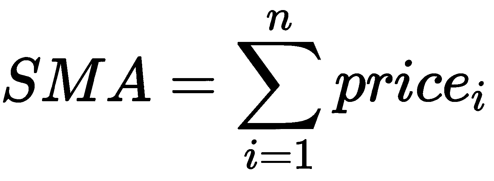

（*n >= 1*），这里，*n*是时间段，必须由用户定义。

虽然了解其背后的数学原理是个好主意，但这个方法不要求你理解或记住给定的公式。我们使用第三方 Python 包`talib`，它提供了一个用于计算 SMA 的准备好的函数。

## 入门指南

确保你的 Python 命名空间具有以下对象：

1.  `talib`（软件包）

1.  `plot_candlesticks_chart`（函数）

1.  `PlotType`（枚举）

1.  `historical_data`（一个`pandas` DataFrame）

参考本章的*技术要求*部分设置这些对象。

## 如何做…

我们将执行以下步骤来完成这个方法：

1.  在`historical_data`上计算 SMA。将其分配给`sma_9`并打印它：

```py
>>> sma_9 = talib.SMA(historical_data['close'], 
                      timeperiod=9)
>>> sma_9
```

我们得到以下输出：

```py
0             NaN
1             NaN
2             NaN
3             NaN
4             NaN
5             NaN
6             NaN
7             NaN
8      467.927778
9      468.100000
10     468.211111
11     468.400000
          ...    
117    469.738889
118    469.744444
119    469.716667
120    469.716667
```

1.  在`historical_data`上绘制`sma_9`：

```py
>>> indicators = [
    {
       'name': 'SMA 9',
       'data': sma_9,
       'extra': {
           'mode': 'lines',
           'line': {
               'color': 'gray'
            }
        }
    }
]
>>> plot_candlesticks_chart(data=historical_data,
                            plot_type=PlotType.JAPANESE, 
```

```py
                           indicators=indicators, 
                           caption='Trend Indicator: '
                           'Simple Moving Average | '
                           'NSE:TATASTEEL | '
                           '1st Jan, 2020 | '
                           'Candle Interval: 1 Minute')
```

我们得到以下输出：

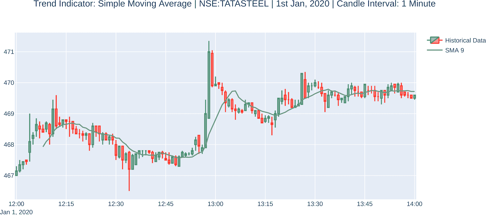

绘制图表需要`plotly` Python 包（[`github.com/plotly/plotly.py`](https://github.com/plotly/plotly.py)）。如果你还没有安装它，`plot_candlesticks_chart`函数将为你安装它。

## 工作原理...

`talib`软件包提供了一个可用的`talib.SMA`函数。我们在*步骤 1*中使用它来计算`historical_data`上的 SMA，并将其分配给一个新属性`sma_9`。除了`historical_data`的 close 系列外，此函数还接受`timeperiod`作为参数，它应该是一个`int`值。我们在这里使用`9`作为参数。`sma_9`对象是一个`pandas.Series`对象。这在*步骤 1*中打印出来。我们使用`plot_candlesticks_chart`函数在`historical_data`上绘制`sma_9`。

关于 SMA 指标值和图表的注意事项如下：

+   由于输出值为`NaN`（索引从`0`开始，因此索引`0`到`7`是前八个值），在前八个时间戳值中缺少 SMA 图表。这是因为`talib.SMA`函数需要至少一个时间段数量的条目来计算 SMA，在我们的情况下为`9`。从第九行开始，我们可以看到计算的**简单移动平均**（**SMA**）的值以及`historical_data`对象的相应时间戳。

+   当价格上涨时，简单移动平均（SMA）增加，当价格下跌时减少，尽管不会立即在下一个时间戳中体现。

+   SMA 图表的上升或下降遵循相应价格的上升和下降。因此，它是一种滞后指标。换句话说，它不会提前预测趋势结果。

+   SMA 图表是平滑的，没有突然的尖峰，不像历史数据图表那样。因此，SMA 经常用于平滑价格。

# 趋势指标 – 指数移动平均

EMA 是一种滞后的趋势指标。它用于通过消除噪音平滑价格数据，从而识别趋势，对最近的值赋予更多的权重。

EMA 技术指标的计算是累积的，并且包括所有数据，其权重递减。过去的值对平均值的贡献较小，而最近的值贡献较大。值与当前时间越远，其贡献越小。因此，EMA 是一种移动平均，对数据的最近变化更为敏感。

EMA 技术指标不像 SMA 技术指标，其中时间周期内的每个值具有相等的权重，而时间周期外的值不包括在计算中。

EMA 在技术分析中被广泛使用。它还用于计算其他技术指标，无论是与自身还是其他指标组合使用，时间周期相同或不同。

用于计算 EMA 的递归公式如下：

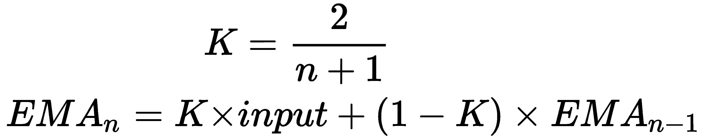

（n >= 1），这里，*n* 是 **时间周期**，必须由用户定义。*K* 有时被称为 **平滑度** 或 **加权系数**。

虽然了解其原理的数学原理是个好主意，但是这个示例不要求你理解或记住给定的公式。我们使用第三方 Python 包 `talib`，它提供了一个用于计算 EMA 的即用型函数。

## 入门

确保你的 Python 命名空间包含以下对象：

1.  `talib`（包）

1.  `plot_candlesticks_chart`（函数）

1.  `PlotType`（枚举）

1.  `historical_data`（一个 `pandas` DataFrame）

参考本章的 *技术要求* 部分来设置这些对象。

## 如何操作…

我们将对这个示例执行以下步骤：

1.  计算 `historical_data` 上的 EMA。将其赋值给 `ema_9` 并打印出来：

```py
>>> ema_9 = talib.EMA(historical_data['close'], 
                      timeperiod=9)
>>> ema_9
```

我们得到以下输出：

```py
0             NaN
1             NaN
2             NaN
3             NaN
4             NaN
5             NaN
6             NaN
7             NaN
8      467.927778
9      468.082222
10     468.135778
11     468.338622
          ...    
117    469.728790
118    469.703032
119    469.662426
120    469.649941
```

1.  在 `historical_data` 上绘制 `ema_9`：

```py
>>> indicators = [
    {
        'name': 'EMA 9',
        'data': ema_9, 
        'extra': {
            'mode': 'lines',
            'line': {
                'color': 'gray'
            }
        }
    }
]
>>> plot_candlesticks_chart(data=historical_data, 
                            plot_type=PlotType.JAPANESE, 
                            indicators=indicators, 
                            caption='Trend Indicator: '
                            'Exponential Moving Average | '
                            'NSE:TATASTEEL | '
                            '1st Jan, 2020 | '
                            'Candle Interval: 1 Minute')
```

我们得到以下输出：


## 工作原理…

`talib` 包提供了一个即用型的 `talib.EMA` 函数。我们在 *step 1* 中使用它来计算 `historical_data` 上的 EMA，并将其赋值给一个新属性 `ema_9`。除了 `historical_data` 的收盘价序列外，这个函数还接受一个 `timeperiod` 作为参数，这应该是一个 `int` 值。我们在这里使用 `9` 作为参数。`ema_9` 对象是一个 `pandas.Series` 对象。这在 *step 1* 中打印出来。我们在 *step 2* 中使用 `plot_candlesticks_chart` 函数在 `historical_data` 上绘制 `ema_9`。

观察 EMA 指标值和图表的以下要点：

+   由于输出值为 `NaN`（索引从 `0` 开始，因此索引 `0` 到 `7` 是前八个值），第一批时间戳值的 EMA 图表缺失。这是因为 `talib.EMA` 函数需要至少一个时间周期的条目才能计算 EMA，在我们的情况下是 `9`。从第九行开始，我们可以看到计算的 EMA，每个条目都是 `historical_data` 对象相应时间戳的 EMA。

+   随着价格的上涨，EMA 增加，随着价格的下跌而减少，紧密跟随价格。因此，它是一种趋势指标。

+   EMA 绘图的上升或下降跟随相应价格的上升和下降。因此，它是一个滞后指标。换句话说，它不会提前预测趋势结果。

+   EMA 绘图平滑，没有任何突然的波动，不像历史数据图。因此，EMA 用于平滑价格。

+   与*Plotting trend indicator – simple moving average* 配方中的 SMA 绘图相比，EMA 绘图更紧密地跟随价格趋势。这是因为 EMA 给予最近的值更多的权重，而 SMA 中用于计算的每个数据都具有相等的权重。

有关`plot_candlesticks_chart`函数的使用方法，请参阅本章的*How it works…* 部分中的 *Plotting trend indicator – simple moving average* 配方。

# 趋势指标 – 移动平均线收敛散度

**移动平均线收敛散度**（**MACD**）是一个滞后的趋势指标。MACD 有三个组成部分：MACD 线、MACD 信号和 MACD 直方图。MACD 线有助于识别趋势变化，因为它信号着新趋势方向的开始。MACD 线的大正值表明较短的 EMA 远大于较长的 EMA。这表明市场处于*超买*状态，这意味着价格将上涨。同样，MACD 线的大负值表明较短的 EMA 远小于较长的 EMA。这表明市场处于*超卖*状态，这意味着价格将下跌。当 MACD 线上穿 MACD 信号并且为正时，会产生一个**买入**信号；当 MACD 线下穿 MACD 信号并且变为负时，会产生一个**卖出**信号。

计算 MACD 的三个组成部分的公式如下：

+   MACD 线是两个不同时间段 EMA 之间的差值 —— 较短时间段 *m* 的 EMA 和较长时间段 *n* 的 EMA：

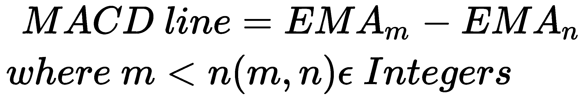

+   MACD 信号是 MACD 线的 EMA，时间段为 *p*：

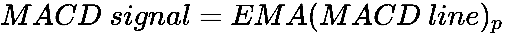

+   MACD 直方图是 MACD 线和 MACD 信号之间的差值：


MACD 线的时间周期通常给定为 `12`（*m*）和 `26`（*n*），MACD 信号的时间周期通常给定为 `9`（*p*）。

虽然了解其工作原理的数学是个好主意，但是这个配方不要求你理解或记住给定的公式。我们使用第三方 Python 包`talib`，它提供了一个用于计算 MACD 的准备好的函数。

## 入门指南

确保你的 Python 命名空间具有以下对象：

1.  `talib`（包）

1.  `pd`（模块）

1.  `plot_candlesticks_chart`（函数）

1.  `PlotType`（枚举）

1.  `historical_data`（一个 `pandas` DataFrame）

请参考本章的 *技术要求* 部分设置这些对象。

## 如何做到…

我们将为此配方执行以下步骤：

1.  在 `historical_data` 上计算 MACD。将其分配给 `macd_line`、`macd_signal` 和 `macd_histogram`。另外，打印它：

```py
>>> macd_line, macd_signal, macd_histogram = \
                            talib.MACD(historical_data['close'],
                                       fastperiod=12,
                                       slowperiod=26,
                                       signalperiod=9)
>>> pd.DataFrame({
    'Line': macd_line,
    'Signal': macd_signal, 
    'Histogram': macd_histogram
})
```

我们得到以下输出：

```py
        Line   Signal Histogram
0        NaN      NaN       NaN
1        NaN      NaN       NaN
2        NaN      NaN       NaN
3        NaN      NaN       NaN
4        NaN      NaN       NaN
...      ...      ...       ...
116 0.075136 0.087038  -0.011901
117 0.057580 0.081146  -0.023566
118 0.043170 0.073551  -0.030381
119 0.023410 0.063523  -0.040113
120 0.015639 0.053946  -0.038307
```

1.  绘制 `macd_line`、`macd_signal` 和 `macd_histogram`，以及 `historical_data`：

```py
>>> indicators = [
    {
        'name': 'MACD Line',
        'data': macd_line,
        'extra': {
            'mode': 'lines',
            'line': {
                'width': 1
            }
        }
    },
    {
        'name': 'MACD Signal',
        'data': macd_signal,
        'extra': {
            'mode': 'lines',
            'line': {
                'width': 1
            }
        }
    },
    {
        'name': 'MACD Histogram',
        'data': macd_histogram,
        'extra': {
            'mode': 'lines',
            'line': {
                'dash': 'dot',
                'width': 2
            }
        }
    }
]

>>> plot_candlesticks_chart(data=historical_data, 
                            plot_type=PlotType.JAPANESE, 
                            indicators=indicators,
                            plot_indicators_separately=True, 
                            caption='Trend Indicator: Moving '
                            'Average Convergence/Divergence | '
                            'NSE:TATASTEEL | '
                            '1st Jan, 2020 | '
                            'Candle Interval: 1 Minute', 
                            plot_height=700)
```

我们得到以下输出：

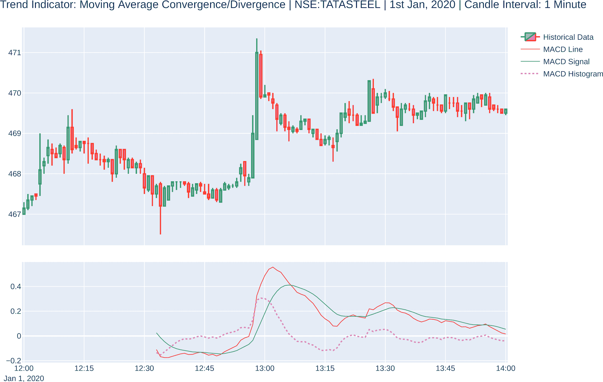

## 运作原理…

`talib` 包提供了一个可供使用的 `talib.MACD` 函数。我们在 *步骤 1* 中使用它来计算 `historical_data` 上的 MACD。除了 `historical_data` 的收盘序列外，此函数还接受 `fastperiod`、`slowperiod` 和 `signalperiod` 作为参数，所有这些参数都应该是 `int` 类型的对象。在这里，我们将分别使用 `26`、`12` 和 `9` 作为参数。`talib.MACD` 函数返回三个 `pandas.Series` 对象，我们将它们分配给新的属性：`macd_line`、`macd_signal` 和 `macd_histogram`。这三个对象被连接成一个 `pandas.DataFrame` 对象，并在 *步骤 1* 中打印出来。我们使用 `plot_candlesticks_chart` 函数在 *步骤 2* 中将 `macd_line`、`macd_signal` 和 `macd_histogram` 与 `historical_data` 一起绘制。

注意以下关于 MACD 指标值和图表的要点：

+   MACD 图表在前 34 个时间戳值处缺失，仅在第 35 个时间戳处开始出现。这是因为第一个长期 EMA 数据需要 26 个数据点才能出现（短期 EMA 数据在前 12 个数据点出现），并且需要 9 个这些点才能出现 MACD 信号。因此，26 + 9 使其达到 35 个数据点。

+   当价格上涨时，MACD 线为负数，当价格下跌时，MACD 线为正数。因此，它是一个趋势指标。

+   MACD 线图的上升或下降跟随相应价格的上升和下降。因此，它是一个滞后指标。换句话说，它不能预测趋势结果。

+   MACD 线图平稳，没有突然的波动，不像历史数据图。MACD 信号更加平滑，因为它是 MACD 线的 EMA。

+   当 MACD 柱状图为正时，趋势为 **牛市**，这意味着价格上涨。当 MACD 柱状图为负时，趋势为 **熊市**，这意味着价格下跌。

如何使用 `plot_candlesticks_chart` 函数，请参考本章的 *How it works…* 部分的 *绘制趋势指标 - 简单移动平均* 配方。

# 趋势指标 - 抛物线停止和反转

抛物 **停止和反转** (**SAR**) 是一个领先的趋势指标。

抛物线 SAR 为每个数据点计算一个跟踪止损。由于数据点是止损点，在趋势时它们远离价格，在趋势反转时穿过价格线。抛物线 SAR 接受两个参数作为输入：`加速因子` 和 `最大` 点。

计算抛物线 SAR 的公式不直接，因此此处未提及。如果您对底层数学感兴趣，请参阅 [`www.tadoc.org/indicator/SAR.htm`](http://www.tadoc.org/indicator/SAR.htm) 上抛物线 SAR 的 `TA-Lib` 官方文档。虽然了解其工作原理的数学是个好主意，但本食谱不要求您理解或记住给定的公式。我们使用第三方 Python 包 `talib`，它提供了一个用于计算抛物线 SAR 的现成函数。

## 开始

确保您的 Python 命名空间具有以下对象：

1.  `talib`（包）

1.  `plot_candlesticks_chart`（函数）

1.  `PlotType`（枚举）

1.  `historical_data`（一个`pandas` DataFrame）

请参阅本章的*技术要求*部分设置这些对象。

## 如何做...

我们将为此食谱执行以下步骤：

1.  在`historical_data`上计算抛物线 SAR。将其赋值给`psar`并打印出来：

```py
>>> psar = talib.SAR(historical_data['high'], 
                     historical_data['low'], 
                     acceleration=0.02, 
                     maximum=0.2)
>>> psar
```

我们得到以下输出：

```py
0             NaN
1      467.000000
2      467.010000
3      467.019800
4      467.029404
          ...    
116    469.175426
117    469.208409
118    469.240073
119    469.270470
120    469.299651
```

1.  在`historical_data`上绘制`psar`：

```py
>>> indicators = [
    {
        'name': 'PSAR',
        'data': psar,
        'extra': {
            'mode': 'lines',
            'line': {
                'dash': 'dot',
                'width': 2,
                'color': 'purple'
            }
        }
    }
]

>>> plot_candlesticks_chart(data=historical_data, 
                            plot_type=PlotType.JAPANESE,
                            indicators=indicators,
                            caption='Trend Indicator: '
                            'Parabolic Stop and Reverse | '
                            'NSE:TATASTEEL | '
                            '1st Jan, 2020 | '
                            'Candle Interval: 1 Minute')
```

我们得到以下输出：

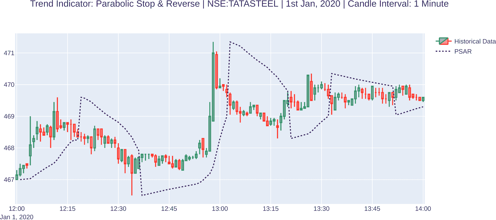

## 它是如何工作的...

`talib` 包提供了一个现成的 `talib.SAR` 函数。我们在*步骤 1*中使用它来计算`historical_data`上的抛物线 SAR，并将其分配给一个新属性`psar`。除了`historical_data`的高低系列外，此函数还接受`加速度`和`最大值`作为参数，这两个参数都应该是`float`类型的对象。我们在这里分别使用`0.02`和`0.2`作为参数。`psar`对象是一个`pandas.Series`对象。这在*步骤 1*中打印出来。我们在*步骤 2*中使用`plot_candlesticks_chart`函数绘制`psar`以及`historical_data`。

关于抛物线 SAR 指标值和图表的以下观察点：

+   抛物线 SAR 被绘制为离散点，因为每个点代表止损点。止损点每次都会变化。所以，它是一个*追踪*止损。

+   当抛物线 SAR 图在 OHLC 图下方时，趋势是**看涨**的；当它在 OHLC 图上方时，趋势是**看跌**的。因此，它是一个趋势指标。

有关`plot_candlesticks_chart`函数用法的更多信息，请参阅本章*绘制趋势指标 - 简单移动平均*食谱中的*它是如何工作的...*部分。

# 动量指标 - 相对强度指数

RSI 是一个领先的动量指标。RSI 是最近上升价格运动与绝对价格运动的比率。RSI 始终在`0`和`100`之间。当值高于`70`时，它可以解释为表示超买条件，当值低于`30`时，它可以解释为表示超卖条件。当价格正在创造新的高点或新的低点时，RSI 表示反转。

计算 RSI 的公式并不直接，因此在这里没有提及。如果您对底层数学感兴趣，请参考官方 `TA-Lib` 关于 RSI 的文档 [`www.tadoc.org/indicator/RSI.htm`](http://www.tadoc.org/indicator/RSI.htm)。尽管了解这种工作方式的数学是一个好主意，但此示例不需要您理解或记住给定的公式。我们使用第三方 Python 包 `talib`，它提供了一个计算 RSI 的现成函数。

## 入门

确保你的 Python 命名空间具有以下对象：

1.  `talib`（包）

1.  `plot_candlesticks_chart`（函数）

1.  `PlotType`（枚举）

1.  `historical_data`（一个 `pandas` DataFrame）

请参考本章的 *技术要求* 部分设置这些对象。

## 如何执行…

我们将执行以下步骤来完成此过程：

1.  计算 `historical_data` 上的 RSI。将其分配给 `rsi_14` 并打印出来：

```py
>>> rsi_14 = talib.RSI(historical_data['close'], 
                       timeperiod=14)
>>> rsi_14
```

我们得到以下输出：

```py
0            NaN
1            NaN
2            NaN
3            NaN
          ...
12           NaN
13           NaN
14     70.886076
15     69.932757
16     69.932757
17     64.873530
18     61.976413
         ...    
116    48.449209
117    48.449209
118    48.449209
119    45.997672
120    48.788323
```

1.  绘制 `rsi_14` 与 `historical_data` 的图表：

```py
>>> indicators = [
    {
        'name': 'RSI (14)', 
        'data': rsi_14,
        'extra': {
            'mode': 'lines',
            'line': {
                'width': 2,
                'color': 'purple'
            }
        }
    }
]

>>> plot_candlesticks_chart(data=historical_data, 
                            plot_type=PlotType.JAPANESE, 
                            indicators=indicators, 
                            plot_indicators_separately=True,
                            caption='Momentum Indicator: '
                            'Relative Strength Index | '
                            'NSE:TATASTEEL | '
                            '1st Jan, 2020 | '
                            'Candle Interval: 1 Minute')
```

我们得到以下输出：

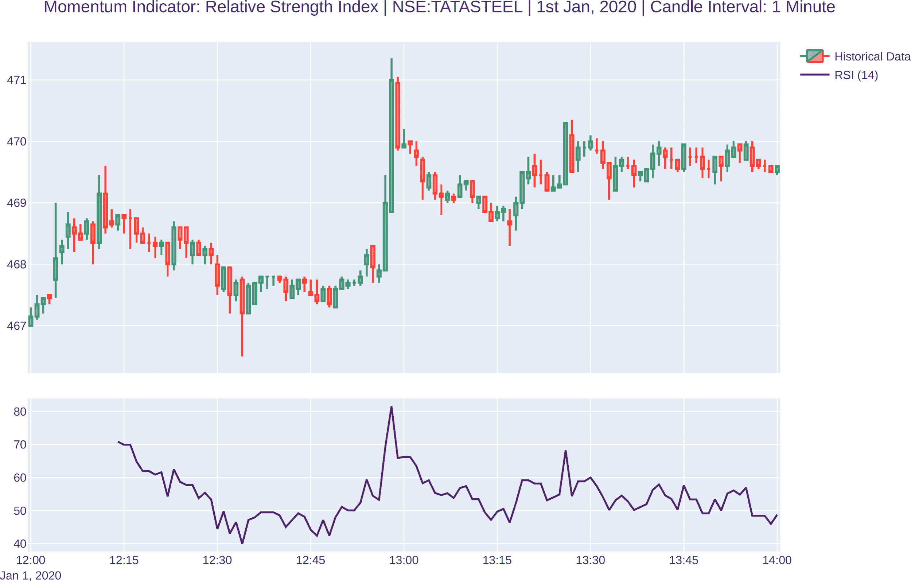

## 工作原理…

`talib` 包提供了一个现成的 `talib.RSI` 函数。我们在 *步骤 1* 中使用它来计算 `historical_data` 上的 RSI，并将其赋值给一个新属性 `rsi_14`。除了 `historical_data` 的收盘价系列外，此函数还接受 `timeperiod` 作为参数，该参数应为一个 `int` 值。我们在此处使用 `14` 作为参数。`rsi_14` 对象是一个 `pandas.Series` 对象。这在 *步骤 1* 中打印出来。我们使用 `plot_candlesticks_chart` 函数在 *步骤 2* 中绘制 `rsi_14` 在 `historical_data` 上的图表。

观察关于 RSI 指标值和图表的以下要点：

+   输出中的前 13 个值为 `NaN`（索引从 `0` 开始，因此索引 `0` 到 `12` 是前 13 个值），因为函数至少需要一个时间段的条目来计算 RSI，在我们的情况下是 `14`。从第 `14` 行开始，我们可以看到计算的 RSI，每个条目都是 `historical_data` 对象对应时间戳的 RSI。

+   RSI 始终介于 `0` 和 `100` 之间。

+   对于给定的图表，价格在下午 12:45 至 1:00 之间突然达到峰值，并且 RSI 移动到 `70` 以上。因此，它正确地指示了 *超买* 条件。另外，由于它指示了价格走势的强度，它是一个动量指标。

有关 `plot_candlesticks_chart` 函数的更多信息，请参考本章 *绘制趋势指标 – 简单移动平均* 食谱中的 *工作原理…* 部分。

# 动量指标 – 随机震荡器

随机震荡器是一种领先的动量指标。它也被简称为 **STOCH**。STOCH 比较最新的收盘价与最近的交易范围。*Fast K* 是一个比率，取值在 `0` 和 `100` 之间。*Fast K* 可以有杂乱的运动，因此它使用移动平均进行平滑，即 *slow K*。*Slow K* 进一步使用另一个移动平均进行平滑，即 *slow D*。*Slow K* 大于 `75` 的值表示超买条件，而小于 `25` 的值表示超卖条件。当 *slow K* 穿过 *slow D* 向上时，被认为是一个 **买入** 信号。类似地，当 *slow K* 穿过 *slow D* 向下时，被认为是一个 **卖出** 信号。

计算 STOCH 的公式如下：

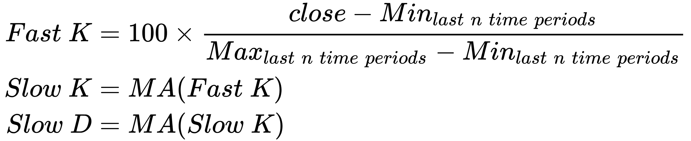

**MA** 代表 **移动平均**，可以是 SMA 或 EMA。对于这个配方，我们使用了 SMA。这个公式需要三个时间段：其中一个是 *n*，另外两个是 MAs 的时间段。我们分析数据的范围由 *n* 定义。

尽管了解这个工作原理的数学是个好主意，但这个配方不要求你理解或记住给定的公式。我们使用了一个第三方的 Python 包，`talib`，它提供了一个用于计算 STOCH 的现成函数。

## 入门

确保你的 Python 命名空间具有以下对象：

1.  `talib`（包）

1.  `pd`（模块）

1.  `plot_candlesticks_chart`（函数）

1.  `PlotType`（枚举）

1.  `historical_data`（一个 `pandas` DataFrame）

请参考本章的 *技术要求* 部分设置这些对象。

## 如何做...

我们将按照以下步骤执行这个配方：

1.  在 `historical_data` 上计算随机震荡器。将其赋值给 `slowk` 和 `slowd`。并打印出来：

```py
>>> slowk, slowd = talib.STOCH(historical_data['high'], 
                               historical_data['low'], 
                               historical_data['close'], 
                               fastk_period=5, 
                               slowk_period=3, 
                               slowk_matype=0, 
                               slowd_period=3, 
                               slowd_matype=0)
>>> pd.DataFrame({
    'Slow K': slowk, 
    'Slow D': slowd
})
```

我们得到了以下输出：

```py
       Slow K    Slow D
  0       NaN       NaN
  1       NaN       NaN
  2       NaN       NaN
  3       NaN       NaN
  4       NaN       NaN
  5       NaN       NaN
  6       NaN       NaN
  7       NaN       NaN
  8 70.514283 69.296302
  9 71.113411 70.921500
 10 61.606578 67.744757
 11 67.613252 66.777747
 12 52.662272 60.627367
...       ...       ...
116 63.626374 77.374847
117 44.102564 64.420024
118 20.000000 42.576313
119 13.333333 25.811966
120 15.757576 16.363636
```

1.  绘制`slowk`和`slowd`，以及`historical_data`：

```py
>>> indicators = [
    {
        'name': 'Slow K',
        'data': slowk, 
        'extra': {
            'mode':'lines', 
            'line': {
                'width': 2
            }
        }
    },
    {
        'name': 'Slow D',
        'data': slowd, 
        'extra': {
            'mode': 'lines',
            'line': {
                'width': 2
            }
        }
    }
]

>>> plot_candlesticks_chart(data=historical_data, 
                            plot_type=PlotType.JAPANESE, 
                            indicators=indicators, 
                            plot_indicators_separately=True, 
                            caption='Trend Indicator: '
                            'Stochastic Oscillator (Slow) | '
                            'NSE:TATASTEEL | '
                            '1st Jan, 2020 | '
                            'Candle Interval: 1 Minute', 
                            plot_height=700)
```

我们得到了以下输出：

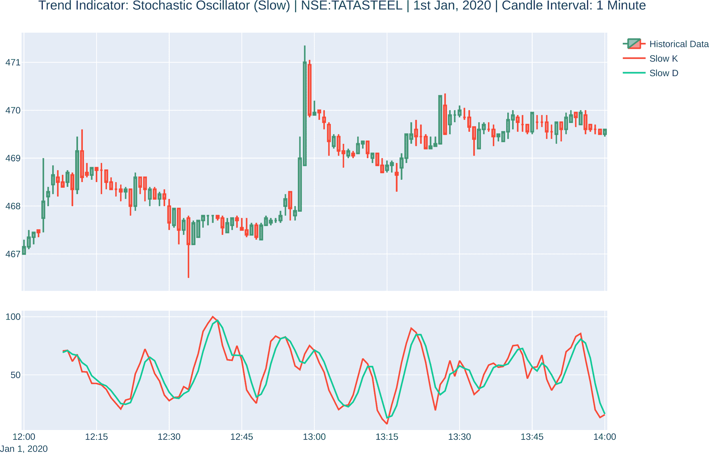

## 工作原理是这样的...

`talib` 包提供了一个现成的 `talib.STOCH` 函数。我们在 *步骤 1* 中使用它来计算 `historical_data` 上的随机震荡器。除了`historical_data`的高、低和收盘系列外，此函数还接受以下参数：

+   `fastk_period`（`int`）：我们分析数据的范围。在这里，我们将值取为 `5`。

+   `slowk_period`（`int`）：计算 *fast K* 上的移动平均的时间段。在这里，我们将值取为 `3`。

+   `slowk_matype`（`int`）：移动平均类型。值为 `0` 表示 SMA，值为 `1` 表示 EMA。在这里，我们将值取为 `0`。

+   `slowd_period`（`int`）：计算 *slow K* 上的移动平均的时间段。在这里，我们将值取为 `3`。

+   `slowd_matype`（`int`）：移动平均类型。值为 `0` 表示 SMA，值为 `1` 表示 EMA。在这里，我们将值取为 `0`。

`talib.STOCH`函数返回两个`pandas.Series`对象，我们将它们分配给新属性：`slowk`和`slowd`。这两个对象被连接成一个`pandas.DataFrame`对象，并在*步骤 1*中打印出来。我们使用`plot_candlesticks_chart`函数在*步骤 2*中绘制`slowk`和`slowd`，以及`historical_data`。

观察以下关于 STOCH 指标值和图表的要点：

+   输出中的前八个值为`NaN`（索引从`0`开始，因此索引`0`到`7`是前 8 个值）。这是因为获取*快速 K*需要前五个值，获取*慢 K*需要三个*快速 K*，获取*慢 D*需要三个*慢 K*。因此，这是 5 +（3-1）+（2-1）= 9。（我们两次减去`1`，因为先前计算的最后一个值是下一个计算的第一个值，因此已经计算了一次。）从第九行开始，我们可以看到*慢 K*和*慢 D*的计算值以及`historical_data`对象的相应时间戳。

+   *慢 K*和*慢 D*的值始终在`0`和`100`之间。

+   *慢 K*和*慢 D*图的上升或下降随后往往伴随着相应价格的上升和下降，尤其是在下午 12:45 后的图表中尤为明显。因此，它是一个领先指标。换句话说，它可以提前预测趋势结果。

+   由于它是一个领先指标，它对价格的反应很快。这经常导致错误信号，就像在下午 12:30 到 12:45 之间的图表中所看到的那样。（为了保护自己免受这些情况的影响，您可以在策略中使用更多的指标来获取趋势或反转的额外确认。）

# 波动率指标 - 布林带

布林带是滞后的波动率指标。布林带由三条线或带组成 - **中带**、**下带**和**上带**。当价格波动性较高时，带之间的间隙扩大，而价格波动性较低时，带之间的间隙缩小。

布林带（Bollinger Bands）是一种超买或超卖条件的指标。当价格接近上带或下带时，该指标预测反转很快就会发生。中带充当支撑或阻力水平。

上带和下带也可以解释为价格目标。当价格从上带反弹并穿过中带时，下带成为价格目标，反之亦然。

计算布林带的公式如下。

布林带将**典型价格**（**TP**）定义为蜡烛的高、低和收盘价的平均值。TP 用于计算中带、下带和上带：

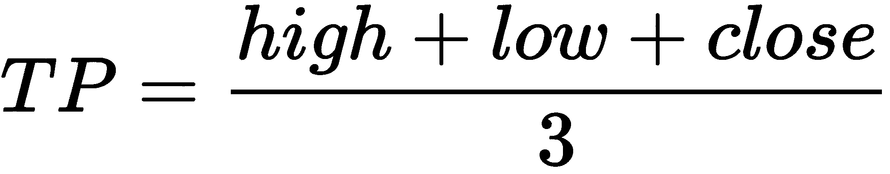

中带是 TP 的 SMA：


上带和下带是中带上下标准差的整数(*F*)倍数。*F*的典型值为 2：

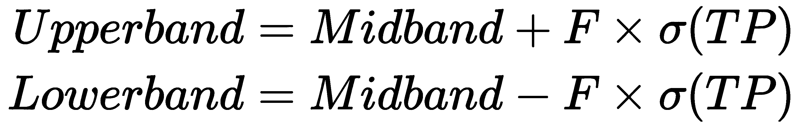

尽管了解这是如何运作的数学知识是个好主意，但这个示例不要求你理解或记住给定的公式。我们使用第三方 Python 软件包`talib`，它提供了一个用于计算布林带的现成函数。

## 入门指南

确保你的 Python 命名空间中有以下对象：

1.  `talib`（软件包）

1.  `pd`（模块）

1.  `plot_candlesticks_chart`（函数）

1.  `PlotType`（枚举）

1.  `historical_data`（一个`pandas` DataFrame）

请参考本章的*技术要求*部分设置这些对象。

## 如何操作…

对于这个示例，我们执行以下步骤：

1.  计算`historical_data`上的布林带。将其分配给`upperband`、`middleband`和`lowerband`。同时，打印出来：

```py
>>> upperband, middleband, lowerband = talib.BBANDS(
                                        historical_data['close'], 
                                        timeperiod=5, 
                                        nbdevup=2, 
                                        nbdevdn=2, 
                                        matype=0)
>>> pd.DataFrame({
    'Upperband': upperband,
    'Middleband': middleband,
    'Lowerband': lowerband
})
```

我们得到以下输出：

```py
      Upperband Middleband   Lowerband
  0         NaN        NaN         NaN
  1         NaN        NaN         NaN
  2         NaN        NaN         NaN
  3         NaN        NaN         NaN
  4  468.138749     467.50  466.861251
...         ...        ...         ...
116  470.071661     469.83  469.588339
117  470.080666     469.78  469.479334
118  470.020666     469.72  469.419334
119  469.959839     469.65  469.340161
120  469.660000     469.58  469.500000
```

1.  在`historical_data`上绘制`upperband`、`middleband`和`lowerband`：

```py
>>> indicators = [
    {
        'name': 'Upperband',
        'data': upperband, 
        'extra': {
            'mode': 'lines', 
            'line': {
                'width': 1
            }
        }
    },
    {
        'name': 'Middleband',
        'data': middleband, 
        'extra': {
            'mode':'lines',
            'line': {
                'width': 1
            }
        }
    },
    {
        'name': 'Lowerband',
        'data': lowerband, 
        'extra': {
            'mode': 'lines',
            'line': {
                'width': 1
            }
        }
    }
]

>>> plot_candlesticks_chart(data=historical_data, 
                            plot_type=PlotType.JAPANESE, 
                            indicators=indicators, 
                            caption='Volatility Indicator: '
                            'Bollinger Bands | '
                            'NSE:TATASTEEL | '
                            '1st Jan, 2020 | '
                            'Candle Interval: 1 Minute')
```

我们得到以下输出：

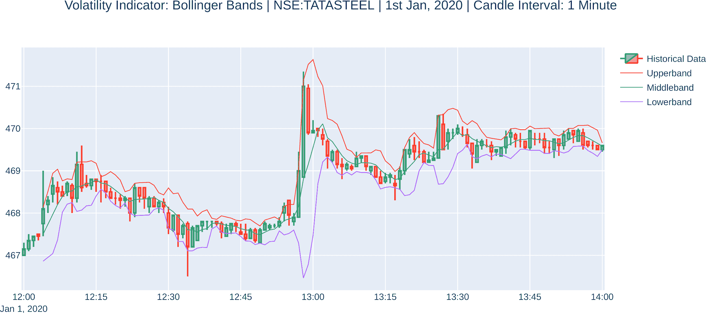

## 运作原理…

`talib`软件包提供了一个现成的`talib.BBANDS`函数。我们在*步骤 1*中使用它来计算`historical_data`上的布林带。除了`historical_data`的收盘系列之外，此函数还采用以下参数：

+   `timeperiod`（`int`）：计算 TP 上的 SMA 的时间段。TP 是高、低和收盘价格的平均值。在这里，我们将值设为`5`。

+   `nbdevup`（`int`）：上带的无偏标准差数量。在这里，我们将值设为`2`。

+   `nbdevdn`（`int`）：下带的无偏标准差数量。在这里，我们将值设为`2`。

+   `matype`（`int`）：移动平均类型。`0`表示 SMA，`1`表示 EMA。在这里，我们将值设为`0`。

`talib.BBANDS`函数返回三个`pandas.Series`对象，我们将其分配给新属性：`upperband`、`middleband`和`lowerband`。这三个对象被连接成一个`pandas.DataFrame`对象，并在*步骤 1*中打印出来。我们使用`plot_candlesticks_chart`函数在*步骤 2*中在`historical_data`上绘制`upperband`、`middleband`和`lowerband`。

观察布林带指标值和图表的以下几点：

+   输出的前四个值是`NaN`（索引从`0`开始，所以索引`0`到`3`是前四个值），因为`talib.BBANDS`函数需要至少一个时间段的条目数来计算布林带，我们的情况下是`5`。从第五行开始，我们可以看到所有三个带的计算值和`historical_data`对象的相应时间戳。

+   带的升降跟相应价格的升降一致。因此，布林带是一种滞后指标。换句话说，它们不能提前预测趋势结果。

+   在图表中的下午 12:45，我们看到带变窄了。这是由于那时的低波动性（价格变化的缓慢速率）。

+   在图中 1 点前，我们看到带宽之间的差距急剧扩大。这是因为那个时间点周围的波动性很高（价格变化速度快）。

+   大多数情况下，当价格触及上轨时，它开始向下移动（相反的方向）。你可以将这些情况用作你的策略的**卖出**信号。

+   大多数情况下，当价格触及下轨时，它开始向上移动（相反的方向）。你可以将这些情况用作你的策略的**买入**信号。

# 波动性指标 – 平均真实波动幅度

**平均真实波动幅度**（**ATR**）是一种滞后的波动性指标。ATR 是波动性的一种度量。高 ATR 值表示高波动性，低值表示低波动性。

计算 ATR 的公式不是直接的，因此此处未提及。如果你对底层数学感兴趣，请参考`TA-Lib`关于 ATR 的官方文档，网址为[`www.tadoc.org/indicator/ATR.htm`](http://www.tadoc.org/indicator/ATR.htm)。虽然了解这个工作原理的数学是个好主意，但这个示例不需要你理解或记住给定的公式。我们使用第三方 Python 包`talib`，它提供了一个用于计算 ATR 的现成函数。

## 入门

确保你的 Python 命名空间中有以下对象：

1.  `talib`（包）

1.  `pd`（模块）

1.  `plot_candlesticks_chart`（函数）

1.  `PlotType`（枚举）

1.  `historical_data`（一个`pandas` DataFrame）

请参考本章的*技术要求*部分来设置这些对象。

## 如何执行…

我们将执行以下步骤来完成这个示例：

1.  在`historical_data`上计算 ATR。将其赋值给`atr_14`并打印出来：

```py
>>> atr_14 = talib.ATR(historical_data['high'], 
                       historical_data['low'], 
                       historical_data['close'], 
                       timeperiod=14)
>>> atr_14
```

我们得到以下输出：

```py
0           NaN
1           NaN
2           NaN
3           NaN
4           NaN
5           NaN
6           NaN
7           NaN
8           NaN
9           NaN
10          NaN
11          NaN
12          NaN
13          NaN
14     0.575000
15     0.555357
16     0.562117
17     0.550538
18     0.529071
         ...   
116    0.375902
117    0.359766
118    0.348354
119    0.330614
120    0.317713
```

1.  绘制`atr_14`，以及`historical_data`：

```py
>>> indicators = [
    {
        'name': 'ATR (14)',
        'data': atr_14,
        'extra': {
            'mode': 'lines',
            'line': {
                'width': 2,
                'color': 'purple'
            }
        }
    }
]

>>> plot_candlesticks_chart(data=historical_data,
                            plot_type=PlotType.JAPANESE,
                            indicators=indicators,
                            plot_indicators_separately=True, 
                            caption='Volatility Indicator: '
                            'Average True Range | '
                            'NSE:TATASTEEL | '
                            '1st Jan, 2020 | '
                            'Candle Interval: 1 Minute', 
                            plot_height=700)
```

我们得到以下输出：

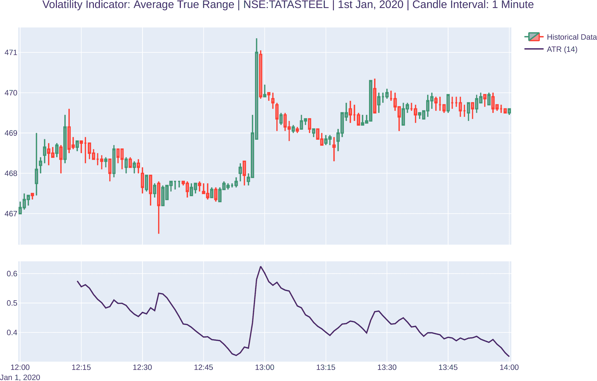

## 如何运作…

`talib`包提供了一个现成的`talib.ATR`函数。我们在*步骤 1*中使用它来计算`historical_data`上的 ATR，并将其赋值给一个新属性，`atr_14`。除了`historical_data`的高、低和收盘系列之外，该函数还将`timeperiod`作为参数，它应该是一个`int`值。我们在这里使用`14`作为参数。`rsi_14`对象是一个`pandas.Series`对象。这在*步骤 1*中打印出来。我们使用`plot_candlesticks_chart`函数在*步骤 2*中将`atr_14`绘制在`historical_data`上。

观察关于 ATR 指标值和图表的以下要点：

+   输出中的前 14 个值是`NaN`（索引从`0`开始，所以索引`0`到`13`是前 14 个值），因为`talib.ATR`函数需要至少比时间周期数多一个条目来计算 ATR，而在我们的情况下是`14`。从第 15 行开始，我们可以看到所有计算出的 ATR 值以及`historical_data`对象的相应时间戳。

+   当波动性较高（价格变化速度快）时，ATR 开始上升。这可以在图表中午 1 点左右看到。

+   当波动性较低（价格变化速度较慢）时，ATR 开始下降。这可以在图表末尾附近看到。

# 成交量指标 – 平衡量

**平衡量**（**OBV**）是一个领先的量度指标。OBV 是上升量和下降量的累积总和。当收盘价高于前一个收盘价时，将成交量加到累积总和中，而当收盘价低于前一个收盘价时，则将成交量从累积总和中减去。

要解释 OBV，可以观察 OBV 和价格的运动。如果价格在 OBV 之前移动，则它是一个非确认的移动。OBV 中一系列上升峰或下降谷指示着强劲的趋势。如果 OBV 是平的，则市场没有趋势。

计算 OBV 的公式如下：

+   如果 *close > close[-1]*，那么 *OBV = OBV[-1] + volume*

+   如果 *close < close[-1]*，那么 *OBV = OBV[-1] - volume*

+   如果 *close = close[-1]*，那么 *OBV = OBV[-1]*

虽然了解其工作原理的数学知识是个好主意，但本示例不要求你理解或记住给定的公式。我们使用第三方 Python 包`talib`，它提供了一个用于计算 OBV 的现成函数。

## 入门

确保你的 Python 命名空间拥有以下对象：

1.  `talib`（包）

1.  `pd`（模块）

1.  `plot_candlesticks_chart`（函数）

1.  `PlotType`（枚举）

1.  `historical_data`（一个`pandas` DataFrame）

请参考本章的*技术要求*部分设置这些对象。

## 如何做…

我们将为此示例执行以下步骤：

1.  计算`historical_data`上的 OBV。将其赋值给`obv`并打印出来：

```py
>>> obv = talib.OBV(historical_data['close'], 
                    historical_data['volume'])
>>> obv
```

我们得到以下输出：

```py
0        5694.0
1       16546.0
2       20717.0
3       20717.0
4      211302.0
         ...   
116    406508.0
117    406508.0
118    406508.0
119    398353.0
120    405326.0
```

1.  在图中绘制`obv`，以及`historical_data`：

```py
>>> indicators = [
    {
        'name': 'On Balance Volume',
        'data': obv,
        'extra': {
            'mode': 'lines',
            'line': {
                'width': 2,
                'color': 'purple'
            }
        }
    }
]

>>> plot_candlesticks_chart(data=historical_data, 
                            plot_type=PlotType.JAPANESE, 
                            indicators=indicators,
                            plot_indicators_separately=True, 
                            caption='Volume Indicator: '
                            'On Balance Volume | '
                            'NSE:TATASTEEL | '
                            '1st Jan, 2020 | '
                            'Candle Interval: 1 Minute', 
                            plot_height=700)
```

我们得到以下输出：

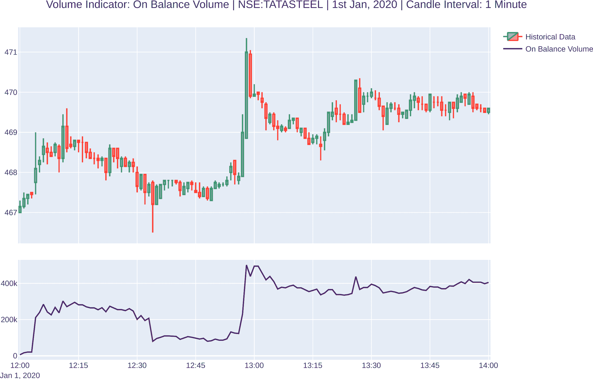

## 工作原理…

`talib`包提供了一个现成的`talib.OBV`函数。我们在*步骤 1*中使用它来计算`historical_data`上的 OBV，并将其赋值给一个新的属性`obv`。该函数以`historical_data`的收盘价和成交量序列作为参数。`obv`对象是一个`pandas.Series`对象。这在*步骤 1*中打印出来。我们使用`plot_candlesticks_chart`函数在*步骤 2*中绘制`obv`和`historical_data`。

关于 OBV 指标值和图表的观察要点如下：

+   在表中没有`NaN`输出。从第一行起，我们就可以看到所有计算得出的 OBV 值以及`historical_data`对象的相应时间戳。一个数据点就足以计算 OBV。

+   这些值始终为正数。

+   OBV 图的上升或下降通常紧随相应价格的上升和下降。因此，它是一个领先的指标。换句话说，它提前预测趋势结果。（由于它是一个领先的指标，它会迅速反应价格。这经常导致错误信号。为了保护自己免受这些情况的影响，您可以在策略中使用更多的指标来获得趋势或反转的额外确认。）

# 成交量指标 - 成交量加权平均价格

**成交量加权平均价格**（**VWAP**）是一种滞后的成交量指标。VWAP 是一种加权移动平均，其使用成交量作为加权因子，使较高成交量的日子具有更高的权重。它是一个非累积移动平均，因此仅使用时间段内的数据进行计算。

尽管这个函数在`talib`中可用，但我们将向您展示如何在此处手动计算指标，以创建其公式。这将帮助您在可能使用客户技术指标或从`talib`中缺失的不太流行的指标时创建自己的指标。

计算 VWAP 的公式如下：

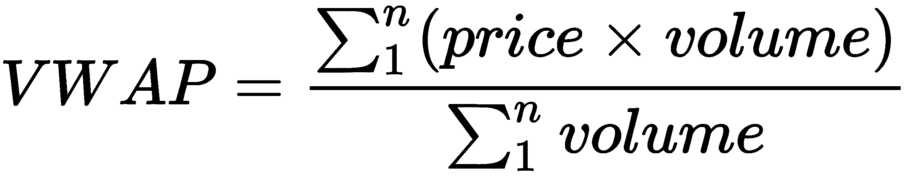

这里，*n*是*时间段*，必须由用户定义。

## 入门指南

确保您的 Python 命名空间具有以下对象：

1.  `pd`（模块）

1.  `plot_candlesticks_chart`（函数）

1.  `PlotType`（枚举）

1.  `historical_data`（一个`pandas` DataFrame）

请参考本章的*技术要求*部分设置这些对象。

## 如何做到这一点…

对于这个配方，我们将执行以下步骤：

1.  定义一个计算`VWAP`的函数：

```py
>>> def VWAP(hist_data_df):
        """
        Returns VWAP computed over the given historical data
        hist_data_df: A pandas DataFrame of historical data with 
                        columns
        'timestamp', 'high', 'low', 'close' and 'volume'
        """
        hist_data_df['date'] = \
               hist_data_df['timestamp'].apply(lambda x: x.date())
        unique_dates = sorted(set(hist_data_df['date']))
        vwap = []

        """
        Compute vwap for each day's data and append it to vwap 
        variable
        """
        for i, date in enumerate(unique_dates):
            day_df = hist_data_df.loc[hist_data_df['date'] == date]
            typical_price_day_df = (day_df.high + day_df.low + 
                                    day_df.close)/3
            vwap_day = list(((typical_price_day_df * 
                              day_df.volume).cumsum()) /                     
                              day_df.volume.cumsum())
            vwap += vwap_day

        return pd.Series(vwap)
```

1.  在`historical_data`上计算`VWAP`。将其分配给`vwap`并打印它：

```py
>>> vwap = VWAP(historical_data)
>>> vwap
```

我们得到以下输出：

```py
0      467.150000
1      467.259311
2      467.280925
3      467.299623
4      468.085910
          ...    
116    468.965162
117    468.967599
118    468.969499
119    468.971309
120    468.972893
```

1.  将`vwap`与`historical_data`一起绘制：

```py
>>> indicators = [
    {
        'name': 'VWAP',
        'data': vwap, 
        'extra': {
            'mode': 'lines',
            'line': {
                'width': 2, 
                'color': 'purple'
            }
        }
    }
]

>>> plot_candlesticks_chart(data=historical_data, 
                            plot_type=PlotType.JAPANESE, 
                            indicators=indicators,
                            plot_indicators_separately=True,
                            caption='Volume Indicator: '
                            'Volume Weighted Average Price | '
                            'NSE:TATASTEEL | '
                            '1st Jan, 2020 | '
                            'Candle Interval: 1 Minute',
                            plot_height=700)
```

我们得到以下输出：

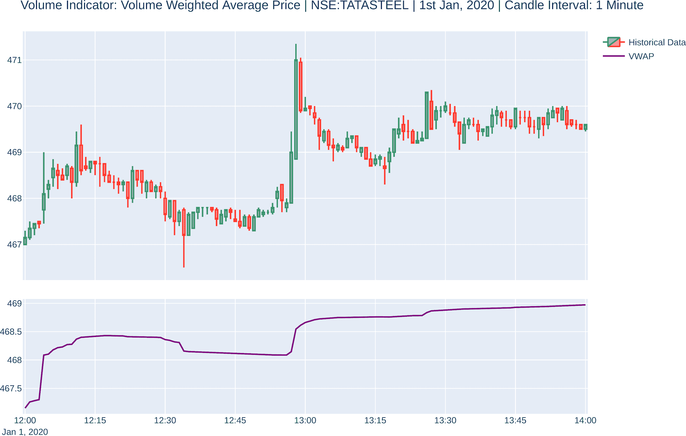

## 工作原理是…

我们定义一个函数，根据给定的历史数据作为`pandas.DataFrame`对象计算`VWAP`。它的工作方式如下：

1.  在历史数据中找到所有唯一的日期

1.  遍历所有唯一的日期：

+   提取`day_df`，一个`pandas.DataFrame`对象，其中包含落在唯一日期上的`historical_data`的条目

+   计算`typical_price_day_df`，即当天高、低和收盘价的平均典型价格

+   计算`vwap_day`，这是`day_df`中所有条目的典型价格加权平均的列表

1.  将所有的`vwap_day`值作为一个`pandas.Series`对象附加在一起返回

我们在`historical_data`上使用`VWAP`函数计算*步骤 2*中的`VWAP`，并将其分配给一个新属性`vwap`。`vwap`对象是一个`pandas.Series`对象。我们在*步骤 3*中使用`plot_candlesticks_chart`函数将`vwap`与`historical_data`一起绘制。

关于`VWAP`指标值和图表，请注意以下要点：

+   表格中没有`NaN`输出。从第一行开始，我们就可以看到`VWAP`的所有计算值以及`historical_data`对象的相应时间戳。一个单独的数据点足以计算`VWAP`。

+   值始终为正。

+   `VWAP`图的上升或下降遵循相应价格的上升和下降。因此，它是滞后指标。换句话说，它不会提前预测趋势结果。
