# 在交易所上下常规订单

本章介绍了通过经纪人 API 可以在交易所上下的各种类型的常规订单。这些示例包括关于下订单、查询订单状态以及退出已完成订单的代码。这些示例将是你算法交易策略的基础部分。了解所有类型的订单并知道在特定需求下应该下哪种订单对于建立成功的交易策略至关重要。

每个订单都有多个属性，如下列表所述：

+   **订单交易类型**：此属性简单地定义订单是 `BUY` 交易还是 `SELL` 交易。可能的值显然可以是 `BUY` 或 `SELL` 中的一个。

+   **订单类型**：此属性定义订单的类型，这将暗示订单的高级行为。常用的订单类型包括 `REGULAR` 订单、`BRACKET` 订单、`COVER` 订单等等。你的经纪人可能定义了更多类型的订单。本章包括 `REGULAR` 订单的示例。

+   **订单代码**：此属性定义订单是否在当天交易结束时结算（即退出）或持续到下一个交易日。可能的值可以是 `INTRADAY` 或 `DELIVERY` 中的一个。如其名，`INTRADAY` 订单的寿命只有一天，如果未在当天结束前退出，经纪人会在当天结束时退出。另一方面，`DELIVERY` 订单交付到用户的证券账户，并在用户明确结算前存在。`DELIVERY` 订单在最终交付给用户的证券账户之前可能会经历多个状态，就像这个例子中一样：

+   `DELIVERY T+0`（下单当天）

+   `DELIVERY T+1`（下单后的下一个交易日）

+   `DELIVERY T+2`（下单后的第二个交易日及以后）

这取决于基础段。例如，股票段工具的 `DELIVERY` 订单会经历这些状态。期货和期权段工具的 `DELIVERY` 订单不会经历这些状态。

+   **订单种类**：此属性与订单的定价和激活有关。可能的值可以是以下之一：

+   `MARKET`：订单立即以最佳可用市场价格下单。用户下订单时不需要指定价格。

+   `LIMIT`：订单以指定价格下单，该价格要么低于**最近交易价格**（**LTP**）（对于 `BUY` 订单），要么高于 LTP（对于 `SELL` 订单）。用户下订单时应指定一个*限价*。*限价*将是用户打算买入/卖出工具的价格。

+   `STOPLOSS_LIMIT`：订单以指定价格下单，该价格要么高于 LTP（对于“买入”订单），要么低于 LTP（对于“卖出”订单）。用户应指定*触发价格*和*限价*。当`LTP`穿过*触发价格*时，订单被激活，并以指定的*限价*下单。

+   `STOPLOSS_MARKET`：订单以指定价格下单，该价格要么高于 LTP（对于“买入”订单），要么低于 LTP（对于“卖出”订单）。用户应指定*触发价格*。当 LTP 穿过*触发价格*时，订单被激活，并以市价下单。

所有这些属性一起定义了一个完整的订单。为了下订单，四个属性都应该被精确知道。

上述属性，即订单交易类型、订单类型、订单代码和订单种类，由`pyalgotrading`软件包定义。您选择的经纪人可能会以不同的方式命名相同的属性。`pyalgotrading`软件包在内部处理这样的转换。

每个放置在交易所的订单在其生命周期内都经历各种状态。本章使用的经纪人支持每个订单的以下状态：

+   `PUT ORDER REQ RECEIVED`

+   `VALIDATION PENDING`

+   `OPEN PENDING`

+   `TRIGGER PENDING`

+   `CANCEL PENDING`

+   `COMPLETE`

+   `CANCELLED`

+   `OPEN`

+   `REJECTED`

本章的示例为常规订单的各种类型的状态转换提供了详细的状态机图。

如果您使用的是不同的经纪人，则经纪人可能支持不同的订单状态或以不同的方式命名订单状态。您可以查阅经纪人 API 文档以了解每个状态的含义。

在本章中，我们将介绍以下示例：

+   放置常规市价订单

+   放置常规限价订单

+   放置常规止损限价订单

+   放置常规止损市价订单

请确保您在活跃市场时间内，经纪账户余额充足时尝试所有这些示例。如果在非市场时间或资金不足时尝试这些示例，您的订单将被经纪人拒绝。这意味着订单将永远不会到达交易所，您将无法获得预期的响应。

# 技术要求

要成功执行本章中的示例，您需要以下内容：

+   Python 3.7+

+   Python 软件包：`pyalgotrading`（`$ pip install pyalgotrading`）

本章的最新 Jupyter 笔记本可以在 GitHub 上找到：[`github.com/PacktPublishing/Python-Algorithmic-Trading-Cookbook/tree/master/Chapter06`](https://github.com/PacktPublishing/Python-Algorithmic-Trading-Cookbook/tree/master/Chapter06)。

与经纪人建立连接的第一件事是获取 API 密钥。经纪人会向每位客户提供独特的密钥，通常作为一个`api-key`和`api-secret`密钥对。这些 API 密钥通常是收费的，通常是按月订阅的方式收费。在开始之前，您需要从经纪人网站获取您的`api-key`和`api-secret`的副本。您可以参考*附录 I*了解更多详情。

以下步骤将帮助您建立与 Zerodha 的经纪人连接，这将被本章中的所有配方使用。请确保在尝试任何配方之前已经执行了这些步骤：

1.  导入必要的模块：

```py
>>> from pyalgotrading.broker.broker_connection_zerodha import BrokerConnectionZerodha
>>> from pyalgotrading.constants import *
```

所有`pyalgotrading`常量现在都可在您的 Python 命名空间中使用。

1.  从经纪人处获取`api_key`和`api_secret`密钥。这些对您是唯一的，并将被经纪人用于识别您的证券账户：

```py
>>> api_key = "<your-api-key>"
>>> api_secret = "<your-api-secret>"
>>> broker_connection = BrokerConnectionZerodha(api_key, 
                                                api_secret)
```

我们得到以下输出：

```py
Installing package kiteconnect via pip. This may take a while...
Please login to this link to generate your request token: https://kite.trade/connect/login?api_key=<your-api-key>&v=3
```

如果您第一次运行此程序且未安装`kiteconnect`，`pyalgotrading`将自动为您安装它。*第 2 步*的最终输出将是一个链接。单击该链接并使用您的 Zerodha 凭据登录。如果验证成功，您将在浏览器地址栏中看到一个类似于`https://127.0.0.1/?request_token=<alphanimeric-toke>&action=login&status=success`的链接。

我们有以下示例：

```py
https://127.0.0.1/?request_token=H06I6Ydv95y23D2Dp7NbigFjKweGwRP7&action=login&status=success
```

1.  复制字母数字令牌并将其粘贴到`request_token`中：

```py
>>> request_token = "<your-request-token>"
>>> broker_connection.set_access_token(request_token)
```

`broker_connection`实例现在已准备好执行 API 调用。

`pyalgotrading`包支持多个经纪人，并为每个经纪人提供一个连接对象类，具有相同的方法。它将经纪人 API 抽象在统一接口之后，因此用户无需担心底层经纪人 API 调用，并且可以像本章中的所有配方一样使用。仅经纪人连接设置程序会因经纪人而异。如果您不是使用 Zerodha 作为您的经纪人，您可以参考`pyalgotrading`文档以设置经纪人连接。对于 Zerodha 用户，前面部分提到的步骤就足够了。

# 下达常规市价订单

常规市价订单是最简单的订单类型。该订单类型用于立即以最佳可用市价下达单一订单。市价等同于 LTP（如第三章中*金融工具的最新交易价格*配方所述）。

下达常规市价订单后，它会在最终达到终结状态（`COMPLETE`或`REJECTED`）之前经过各种中间状态。常规市价订单立即转移到终结状态，而无需等待任何中间状态。下面的状态机图演示了常规市价订单在其生命周期内的各种状态：

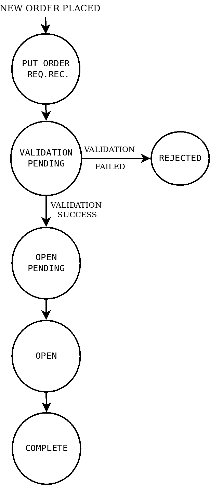

此配方演示了下面的常规市价订单的下达和查询其状态：

+   `BUY`，`REGULAR`，`INTRADAY`，`MARKET` 订单

+   `SELL`，`REGULAR`，`INTRADAY`，`MARKET` 订单

+   `BUY`，`REGULAR`，`DELIVERY`，`MARKET` 订单

+   `SELL`，`REGULAR`，`DELIVERY`，`MARKET` 订单

## 准备工作

确保 `broker_connection` 对象和 `pyalgotrading` 包中的常量在您的 Python 命名空间中可用。请参考本章节的*技术要求*部分设置此对象。

## 如何操作…

我们为此示例执行以下步骤：

1.  获取一个金融工具并将其分配给 `instrument`：

```py
>>> instrument = broker_connection.get_instrument('NSE', 
                                                  'HDFCBANK')
```

1.  下单 `BUY`，`REGULAR`，`INTRADAY`，`MARKET` 并显示订单 ID：

```py
>>> order1_id = broker_connection.place_order(
                instrument=instrument, 
                order_transaction_type= \
                    BrokerOrderTransactionTypeConstants.BUY,
                order_type=BrokerOrderTypeConstants.REGULAR,
                order_code=BrokerOrderCodeConstants.INTRADAY,
                order_variety=BrokerOrderVarietyConstants.MARKET,
                quantity=1)
>>> order1_id
```

我们获得以下输出（您的输出可能会有所不同）：

```py
'200304002243710'
```

1.  获取并显示订单状态：

```py
>>> broker_connection.get_order_status(order1_id)
```

我们获得以下输出：

```py
'COMPLETE'
```

如果您使用您的凭据登录经纪人网站并转到订单部分，您可以在以下截图中找到您的订单详情（一些数据可能与您的实际情况不同）：

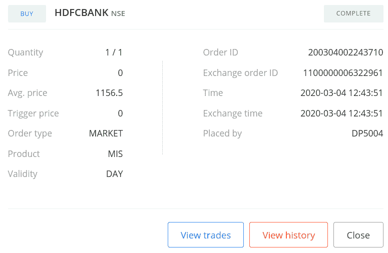

1.  下单 `SELL`，`REGULAR`，`INTRADAY`，`MARKET` 并显示订单 ID：

```py
>>> order2_id = broker_connection.place_order(
                instrument=instrument,
                order_transaction_type= \
                    BrokerOrderTransactionTypeConstants.SELL,
                order_type=BrokerOrderTypeConstants.REGULAR,
                order_code=BrokerOrderCodeConstants.INTRADAY,
                order_variety=BrokerOrderVarietyConstants.MARKET,
                quantity=1)
>>> order2_id
```

我们获得以下输出（您的输出会有所不同）：

```py
'200304002244044'
```

1.  获取并显示订单状态：

```py
>>> broker_connection.get_order_status(order2_id)
```

我们获得以下输出：

```py
'COMPLETE'
```

如果您使用您的凭据登录经纪人网站并转到订单部分，您可以在以下截图中找到您的订单详情（一些数据可能与您的实际情况不同）：

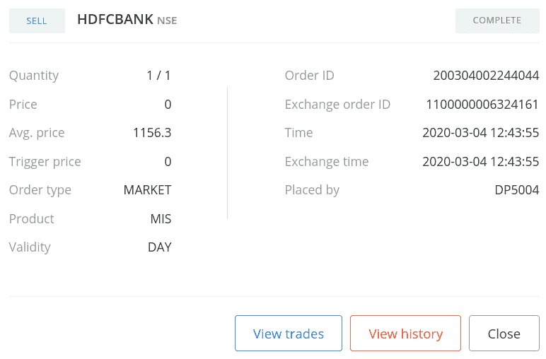

1.  下单 `BUY`，`REGULAR`，`DELIVERY`，`MARKET` 并显示订单 ID：

```py
>>> order3_id = broker_connection.place_order(
                instrument=instrument,
                order_transaction_type= \
                    BrokerOrderTransactionTypeConstants.BUY,
                order_type=BrokerOrderTypeConstants.REGULAR,
                order_code=BrokerOrderCodeConstants.DELIVERY,
                order_variety=BrokerOrderVarietyConstants.MARKET,
                quantity=1)
>>> order3_id
```

我们获得以下输出（您的输出可能会有所不同）：

```py
'200304002244263'
```

1.  获取并显示订单状态：

```py
>>> broker_connection.get_order_status(order3_id)
```

我们获得以下输出：

```py
'COMPLETE'
```

如果您使用您的凭据登录经纪人网站并转到订单部分，您可以在以下截图中找到您的订单详情（一些数据可能与您的实际情况不同）：

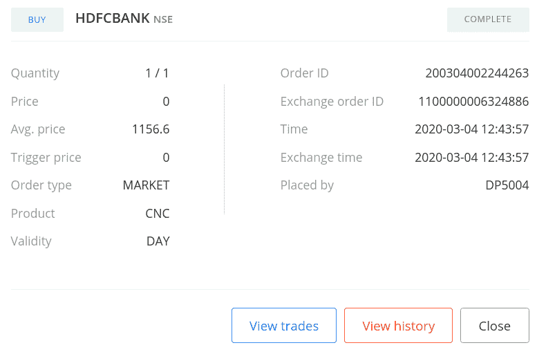

1.  下单 `SELL`，`REGULAR`，`DELIVERY`，`MARKET` 并显示订单 ID：

```py
>>> order4_id = broker_connection.place_order(
                instrument=instrument,
                order_transaction_type= \
                    BrokerOrderTransactionTypeConstants.SELL,
                order_type=BrokerOrderTypeConstants.REGULAR,
                order_code=BrokerOrderCodeConstants.DELIVERY,
                order_variety=BrokerOrderVarietyConstants.MARKET,
                quantity=1)
>>> order4_id
```

我们获得以下输出（您的输出可能会有所不同）：

```py
'200304002244333'
```

1.  获取并显示订单状态：

```py
>>> broker_connection.get_order_status(order4_id)
```

我们获得以下输出：

```py
'COMPLETE'
```

如果您使用您的凭据登录经纪人网站并转到订单部分，您可以在以下截图中找到您的订单详情（一些数据可能与您的实际情况不同）：

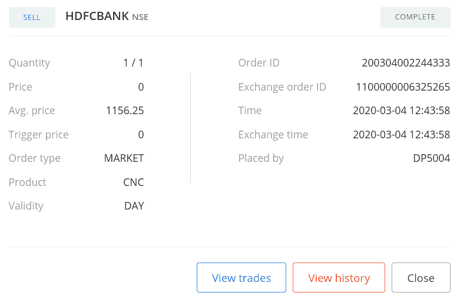

## 工作原理…

在*步骤 1*中，您使用 `BrokerConnectionZerodha` 类的 `get_instrument()` 方法获取一个工具并将其分配给一个新属性 `instrument`。此对象是 `Instrument` 类的一个实例。调用 `get_instrument` 所需的两个参数是交易所（`'NSE'`）和交易符号（`'HDFCBANK'`）。

在*步骤 2*中，您使用 `BrokerConnection` 类的 `place_order` 方法在交易所上下单 `BUY`，`REGULAR`，`INTRADAY`，`MARKET` 订单。`place_order` 方法是经纪人特定的下单 API 的包装器。它接受以下属性：

+   `instrument`：这是必须下单的金融工具，应该是 `Instrument` 类的实例。我们在这里传递 `instrument`。

+   `order_transaction_type`：这是订单交易类型，应该是 `BrokerOrderTransactionTypeConstants` 类型的枚举。我们在这里传递 `BrokerOrderTransactionTypeConstants.BUY`。

+   `order_type`：这是订单类型，应该是 `BrokerOrderTypeConstants` 类型的枚举。我们在这里传递 `BrokerOrderTypeConstants.REGULAR`。

+   `order_code`：这是订单代码，应该是 `BrokerOrderCodeConstants` 类型的枚举。我们在这里传递 `BrokerOrderCodeConstants.INTRADAY`。

+   `order_variety`：这是订单变体，应该是 `BrokerOrderVarietyConstants` 类型的枚举。我们在这里传递 `BrokerOrderVarietyConstants.MARKET`。

+   `quantity`：这是交易给定金融工具的股票数量，应该是正整数。我们在这里传递 `1`。

（传递给 `place_order` 方法的属性是经纪人无关的常量，之前从 `pyalgotrading.constants` 模块导入。）

在 *步骤 2* 中下单后，你会从经纪人那里获得一个订单 ID，然后将其赋给一个新属性 `order1_id`。`order1_id` 对象是 `string` 类型。如果由于某种原因订单未成功下达，可能不会获得订单 ID。在 *步骤 3* 中，你使用 `broker_connection` 对象的 `get_order_status()` 方法获取已下达订单的状态。你将 `order1_id` 作为 `get_order_status()` 方法的参数传递。你会得到订单状态为 `'COMPLETE'`，类型为 `string`。你随时可以使用 `order1_id` 获取已下达订单的状态。

你也可以通过登录经纪人网站并检查订单部分来验证订单的成功下达。你应该看到类似于步骤 3 输出的屏幕截图中显示的数据。

此食谱中的其他步骤遵循相同的模式：下单并获取其状态，但使用不同的属性组合：

+   *步骤 4* 和 *5*：`SELL`、`REGULAR`、`INTRADAY`、`MARKET` 订单

+   *步骤 6* 和 *7*：`BUY`、`REGULAR`、`DELIVERY`、`MARKET` 订单

+   *步骤 8* 和 *9*：`SELL`、`REGULAR`、`DELIVERY`、`MARKET` 订单

经纪人返回的订单 ID 对于所有客户都是唯一的。你永远不会再次获得相同的订单 ID，也永远不会获得已被其他人下单的订单 ID。

# 下达常规限价订单

常规限价订单是一种在特定价格下单的订单类型。与常规市价订单不同，这不是市价。要下达此订单，需要一个特定的参数，称为 *限价*。此参数应满足以下条件：

+   *限价* 应低于 `BUY` 订单的市价。

+   *限价* 应高于 `SELL` 订单的市价。

如果这些条件不满足，则订单可能会以市场价格下单，从而将其转换为常规市价订单，或者经纪人可能会将其拒绝为无效订单。

下单常规限价订单时，它会在最终到达终态（`完成`，`取消`或`拒绝`）之前经历各种中间状态。在有利的市场条件实现之前，常规限价订单可能会在`开放`状态停留一段时间，然后转移到`完成`状态。以下状态机图演示了常规限价订单在其生命周期中的各种状态：

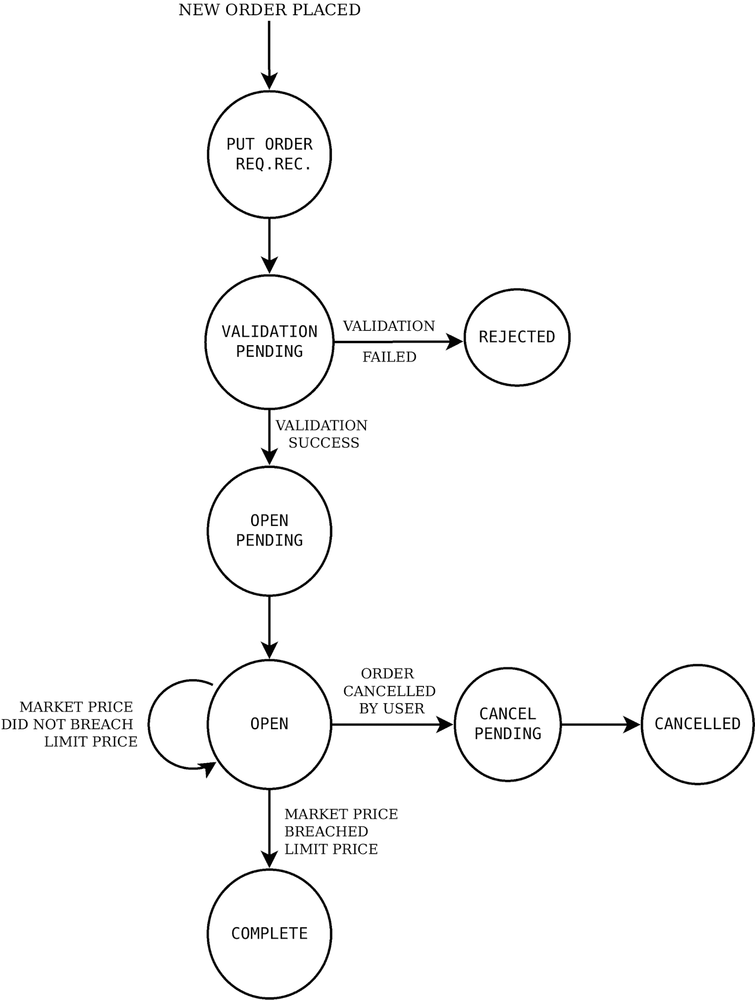

此示例演示了下列常规限价订单的下单及查询其状态：

+   `购买`，`常规`，`即日交易`，`限价`订单

+   `卖出`，`常规`，`即日交易`，`限价`订单

+   `购买`，`常规`，`交割`，`限价`订单

+   `卖出`，`常规`，`交割`，`限价`订单

## 准备就绪

确保您的 Python 命名空间中可用来自`pyalgotrading`包的`broker_connection`对象和常量。请参考本章的*技术要求*部分设置此对象。

## 如何操作...

我们为此示例执行以下步骤：

1.  获取一个金融工具并将其分配给`instrument`：

```py
>>> instrument = broker_connection.get_instrument('NSE', 
                                                  'ICICIBANK')
```

1.  获取最新成交价。下单`购买`，`常规`，`即日交易`，`限价`并显示订单 ID：

```py
>>> ltp = broker_connection.get_ltp(instrument)
>>> order1_id = broker_connection.place_order(
                instrument=instrument,
                order_transaction_type= \
                    BrokerOrderTransactionTypeConstants.BUY,
                order_type=BrokerOrderTypeConstants.REGULAR,
                order_code=BrokerOrderCodeConstants.INTRADAY,
                order_variety=BrokerOrderVarietyConstants.LIMIT,
                quantity=1,
                price=ltp-1)
>>> order1_id
```

我们得到以下输出（您的输出可能有所不同）：

```py
'200303003518407'
```

1.  获取并显示订单状态：

```py
>>> broker_connection.get_order_status(order1_id)
```

我们得到以下输出（您的输出可能有所不同）：

```py
'OPEN'
```

如果您使用您的凭据登录经纪人网站并转到订单部分，您可以找到您的订单详情，如下图所示（您的一些数据可能不同）：


1.  过一段时间后再次获取并显示订单状态：

```py
>>> broker_connection.get_order_status(order1_id)
```

我们得到以下输出（您的输出可能有所不同）：

```py
'COMPLETE'
```

如果您使用您的凭据登录经纪人网站并转到订单部分，您可以找到您的订单详情，如下图所示（您的一些数据可能不同）：


1.  获取最新成交价。下单`卖出`，`常规`，`即日交易`，`限价`并显示订单 ID：

```py
>>> ltp = broker_connection.get_ltp(instrument)
>>> order2_id = broker_connection.place_order(
                instrument=instrument,
                order_transaction_type= \
                    BrokerOrderTransactionTypeConstants.SELL,
                order_type=BrokerOrderTypeConstants.REGULAR,
                order_code=BrokerOrderCodeConstants.INTRADAY,
                order_variety=BrokerOrderVarietyConstants.LIMIT,
                quantity=1,
                price=ltp+1)
>>> order2_id
```

我们得到以下输出（您的输出可能有所不同）：

```py
'200303003243352'
```

1.  获取并显示订单状态：

```py
>>> broker_connection.get_order_status(order2_id)
```

我们得到以下结果：

```py
'OPEN'
```

如果您使用您的凭据登录经纪人网站并转到订单部分，您可以找到您的订单详情，如下图所示（您的一些数据可能不同）：

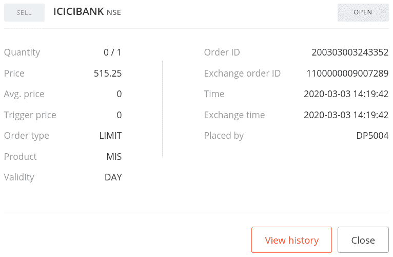

1.  过一段时间后再次获取并显示订单状态：

```py
>>> broker_connection.get_order_status(order2_id)
```

我们得到以下输出（您的输出可能有所不同）：

```py
'COMPLETE'
```

如果您使用您的凭据登录经纪人网站并转到订单部分，您可以找到您的订单详情，如下图所示（您的一些数据可能不同）：

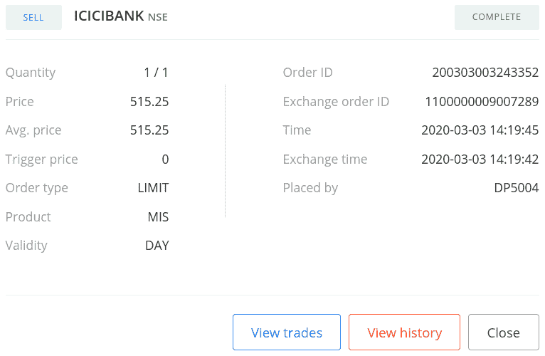

1.  获取 LTP。下一个`BUY`，`REGULAR`，`DELIVERY`，`LIMIT`订单并显示订单 ID：

```py
>>> ltp = broker_connection.get_ltp(instrument)
>>> order3_id = broker_connection.place_order(
                instrument=instrument,
                order_transaction_type= \
                    BrokerOrderTransactionTypeConstants.BUY,
                order_type=BrokerOrderTypeConstants.REGULAR,
                order_code=BrokerOrderCodeConstants.DELIVERY,
                order_variety=BrokerOrderVarietyConstants.LIMIT,
                quantity=1,
                price=ltp-1)
>>> order3_id
```

我们得到以下输出（您的输出可能有所不同）：

```py
'200303003266560'
```

1.  获取并显示订单状态：

```py
>>> broker_connection.get_order_status(order3_id)
```

我们得到以下输出：

```py
'OPEN'
```

如果您使用您的凭据登录经纪人网站并转到订单部分，您可以找到您的订单详细信息，如下图所示（您的数据可能有所不同）：


1.  一段时间后再次获取并显示订单状态：

```py
>>> broker_connection.get_order_status(order3_id)
```

我们得到以下输出：

```py
'COMPLETE'
```

如果您使用您的凭据登录经纪人网站并转到订单部分，您可以找到您的订单详细信息，如下图所示（您的数据可能有所不同）：


1.  获取 LTP。下一个`SELL`，`REGULAR`，`DELIVERY`，`LIMIT`订单并显示订单 ID：

```py
>>> ltp = broker_connection.get_ltp(instrument)
>>> order4_id = broker_connection.place_order(
                instrument=instrument,
                order_transaction_type= \
                    BrokerOrderTransactionTypeConstants.SELL,
                order_type=BrokerOrderTypeConstants.REGULAR,
                order_code=BrokerOrderCodeConstants.DELIVERY,
                order_variety=BrokerOrderVarietyConstants.LIMIT,
                quantity=1,
                price=ltp+1)
>>> order4_id
```

我们得到以下输出（您的输出可能有所不同）：

```py
'200303003280699'
```

1.  获取并显示订单状态：

```py
>>> broker_connection.get_order_status(order4_id)
```

我们得到以下输出：

```py
'OPEN'
```

如果您使用您的凭据登录经纪人网站并转到订单部分，您可以找到您的订单详细信息，如下图所示（您的数据可能有所不同）：


1.  一段时间后再次获取并显示订单状态：

```py
>>> broker_connection.get_order_status(order4_id)
```

我们得到以下输出：

```py
'COMPLETE'
```

如果您使用您的凭据登录经纪人网站并转到订单部分，您可以找到您的订单详细信息，如下图所示（您的数据可能有所不同）：

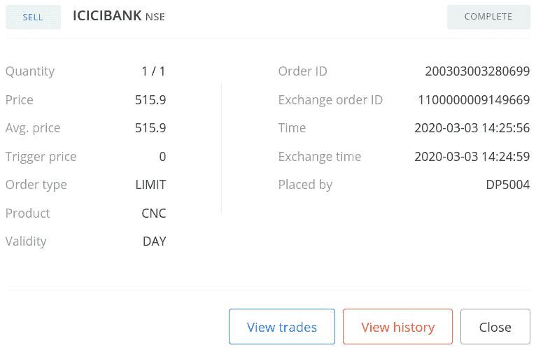

## 工作原理...

在*步骤 1*中，您使用`BrokerConnectionZerodha`类的`get_instrument()`方法获取一个工具并将其分配给一个新属性`instrument`。该对象是`Instrument`类的实例。调用`get_instrument`所需的两个参数是交易所（`'NSE'`）和交易符号（`'ICICIBANK'`）。

在*步骤 2*中，您使用`BrokerConnectionZerodha`类的`get_ltp()`方法获取工具的 LTP，并将其分配给一个新属性`ltp`。这里将`instrument`对象作为参数传递。接下来，您使用`broker_connection`对象的`place_order`方法在交易所上下订单。`place_order`方法是经纪人特定的下订单 API 的包装器。它接受以下属性：

+   `instrument`：这是必须下订单的金融工具，应该是`Instrument`类的实例。我们在这里传递`instrument`。

+   `order_transaction_type`：这是订单交易类型，应该是`BrokerOrderTransactionTypeConstants`类型的枚举。我们在这里传递`BrokerOrderTransactionTypeConstants.BUY`。

+   `order_type`：这是订单类型，应该是`BrokerOrderTypeConstants`类型的枚举。我们在这里传递`BrokerOrderTypeConstants.REGULAR`。

+   `order_code`：这是订单代码，应该是`BrokerOrderCodeConstants`类型的枚举。我们在这里传递`BrokerOrderCodeConstants.INTRADAY`。

+   `order_variety`：这是订单类型，应该是`BrokerOrderVarietyConstants`类型的枚举。我们在这里传递`BrokerOrderVarietyConstants.LIMIT`。

+   `quantity`：要交易的股票数量，应为正整数。我们在这里传递`1`。

+   `price`：这是应该下订单的限价。我们在这里传递`ltp-1`，这意味着低于`ltp`1 单位价格。

（传递给`place_order`方法的属性是经纪人无关的常量，之前从`pyalgotrading.constants`模块导入。）

在*步骤 2* 中下订单时，您将从经纪人那里获得一个订单 ID，将其分配给一个新属性，`order1_id`。`order1_id` 对象是一个字符串。如果由于某种原因订单未成功下达，则可能不会获得订单 ID。请注意，价格参数传递了值`ltp-1`。这意味着订单被放置在市场价格下方，这是放置`BUY LIMIT`订单的必要条件之一。

在*步骤 3* 中，您使用`broker_connection`对象的`get_order_status()`方法获取已下订单的状态。您将`order1_id`作为参数传递给`get_order_status()`方法。您将订单状态获取为`'OPEN'`，一个字符串。您随时可以使用`order1_id`来获取已下订单的状态。在*步骤 4* 中，您再次获取订单状态，如果订单已完成，您将获取订单状态为`'COMPLETE'`。

您还可以通过登录经纪人网站并检查订单部分来验证您的订单成功下达。您应该看到与*步骤 3* 和 *步骤 4* 的输出中显示的屏幕截图类似的数据。

在*步骤 3* 中，如果您看到状态为`'COMPLETE'`而不是`'OPEN'`，这可能是由于市场波动性过高。如果您希望订单在`'OPEN'`状态下保持一段时间，请尝试将订单放置在远离市场价格的位置。

此配方中的其他步骤遵循相同的模式，用于放置订单和获取其状态，用于不同属性组合：

+   *步骤 5*、*6* 和 *7*：`SELL`、`REGULAR`、`INTRADAY`、`LIMIT`订单

+   *步骤 8*、*9* 和 *10*：`BUY`、`REGULAR`、`DELIVERY`、`LIMIT`订单

+   *步骤 11*、*12* 和 *13*：`SELL`、`REGULAR`、`DELIVERY`、`LIMIT`订单

# 下达常规止损限价订单

常规止损限价订单是一种在特定价格下下达单一订单的订单类型。与常规市价订单不同，这不是市场价格。要下达此订单，需要两个特定参数，即*触发价格*和*限价*。这些参数应满足以下条件：

+   对于`BUY`订单，我们需要遵循以下规则：

+   *触发价格*和*限价*应高于市场价格。

+   *限价*应大于*触发价格*。

+   对于`SELL`订单，应该观察以下内容：

+   *触发价* 和*限价* 应低于市场价格。

+   *限价* 应低于*触发价*。

如果这些条件不满足，订单可能会以市价成交，从而转换为普通市价订单，或者经纪人可能会拒绝订单，认为它是无效订单。

在下普通止损限价订单时，订单会经历各种中间状态，最终达到最终状态（`COMPLETE`、`CANCELLED`或`REJECTED`）。普通止损限价订单可能会在`TRIGGER_PENDING`状态停留一段时间，直到市场条件有利才会转移到`COMPLETE`状态。以下状态机图表明了普通止损限价订单在其生命周期中的各种状态：

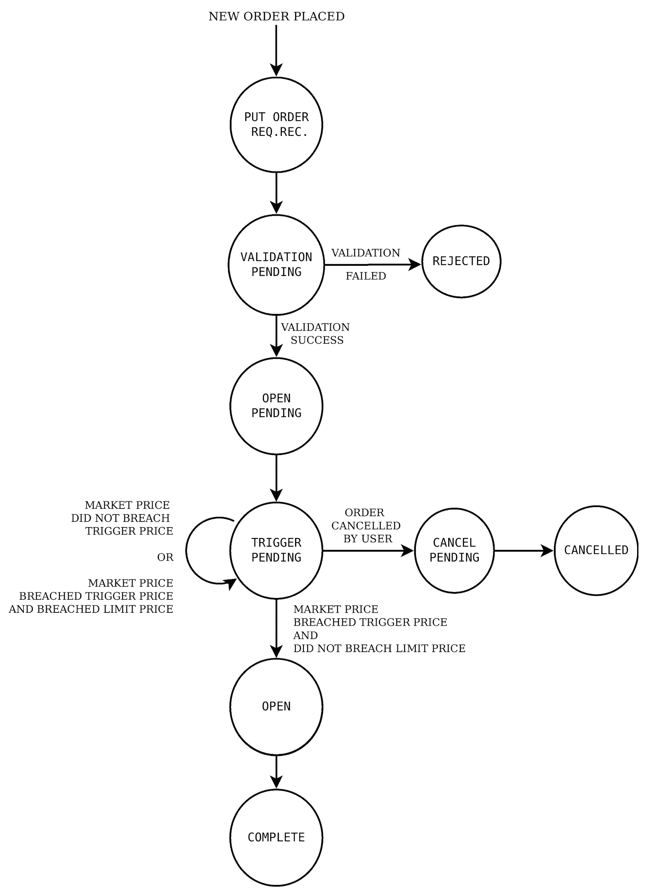

下单后，订单会保持`TRIGGER_PENDING`状态，直到市场价格突破*触发价*但未突破*限价*。此时订单激活并发送到交易所。然后，订单以最佳可用市场价格执行，该价格介于*触发价*和*限价*之间。订单状态从`TRIGGER_PENDING`转移到`OPEN`到`COMPLETE`状态。如果市场过于波动，市场价格同时突破*触发价*和*限价*，订单将保持`TRIGGER_PENDING`状态。

此配方演示了下列普通止损限价订单的下单和查询其状态：

+   `BUY`、`REGULAR`、`INTRADAY`、`STOPLOSS_LIMIT`订单

+   `SELL`、`REGULAR`、`INTRADAY`、`STOPLOSS_LIMIT`订单

+   `BUY`、`REGULAR`、`DELIVERY`、`STOPLOSS_LIMIT`订单

+   `SELL`、`REGULAR`、`DELIVERY`、`STOPLOSS_LIMIT`订单

## 准备就绪...

确保`pyalgotrading`包中的`broker_connection`对象和常量在您的 Python 命名空间中可用。请参考本章的*技术要求*部分设置此对象。

## 如何操作…

我们按照以下步骤执行此配方：

1.  获取一个金融工具并将其分配给`instrument`：

```py
>>> instrument = broker_connection.get_instrument('NSE', 
                                                  'AXISBANK')
```

1.  获取最新交易价。下`BUY`、`REGULAR`、`INTRADAY`、`STOPLOSS_LIMIT`订单并显示订单 ID：

```py
>>> ltp = broker_connection.get_ltp(instrument)
>>> order1_id = broker_connection.place_order(
                instrument=instrument,
                order_transaction_type= \
                    BrokerOrderTransactionTypeConstants.BUY,
                order_type=BrokerOrderTypeConstants.REGULAR,
                order_code=BrokerOrderCodeConstants.INTRADAY,
                order_variety= \
                    BrokerOrderVarietyConstants.STOPLOSS_LIMIT,
                quantity=1,
                price=ltp+1,
                trigger_price=ltp+1)
>>> order1_id
```

我们得到以下输出（您的输出可能会有所不同）：

```py
'200303003296676'
```

1.  获取并显示订单状态：

```py
>>> broker_connection.get_order_status(order1_id)
```

我们得到以下输出：

```py
'TRIGGER PENDING'
```

如果您使用您的凭据登录经纪人网站并转到订单部分，您可以找到您的订单详细信息，如以下截图所示（某些数据可能与您的情况不同）：

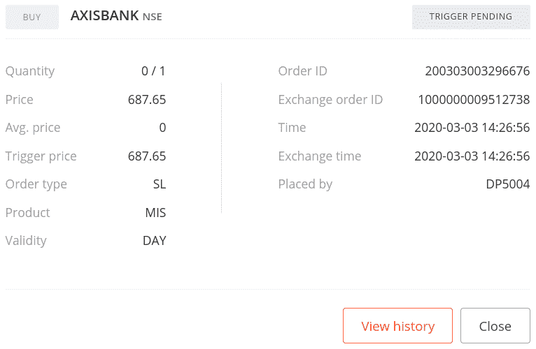

1.  过一段时间后再次获取并显示订单状态：

```py
>>> broker_connection.get_order_status(order1_id)
```

我们得到以下输出：

```py
'COMPLETE'
```

如果您使用您的凭据登录经纪人网站并转到订单部分，您可以找到您的订单详细信息，如以下截图所示（某些数据可能与您的情况不同）：

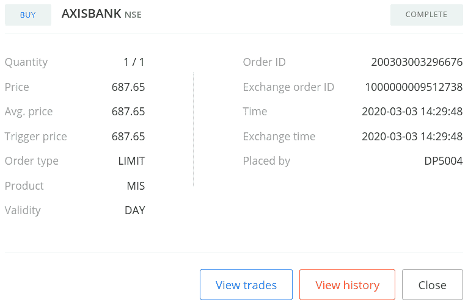

1.  拉取 LTP。下达一个`SELL`，`REGULAR`，`INTRADAY`，`STOPLOSS_LIMIT`订单并显示订单 ID：

```py
>>> ltp = broker_connection.get_ltp(instrument)
>>> order2_id = broker_connection.place_order(
                instrument=instrument,
                order_transaction_type= \
                    BrokerOrderTransactionTypeConstants.SELL,
                order_type=BrokerOrderTypeConstants.REGULAR,
                order_code=BrokerOrderCodeConstants.INTRADAY,
                order_variety= \
                    BrokerOrderVarietyConstants.STOPLOSS_LIMIT,
                quantity=1,
                price=ltp-1,
                trigger_price=ltp-1)
>>> order2_id
```

我们得到以下输出（您的输出可能会有所不同）：

```py
'200303003576828'
```

1.  拉取并显示订单状态：

```py
>>> broker_connection.get_order_status(order2_id)
```

我们得到以下输出：

```py
'TRIGGER PENDING'
```

如果您使用您的凭据登录经纪人网站并转到订单部分，您可以找到您的订单详细信息，如下面的屏幕截图所示（您的某些数据可能会有所不同）：

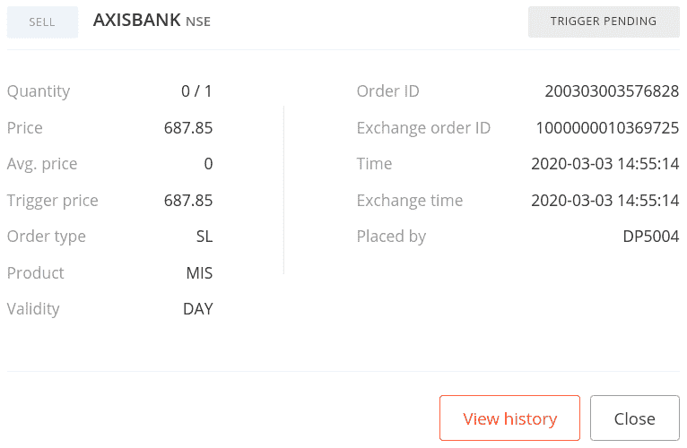

1.  一段时间后再次拉取并显示订单状态：

```py
>>> broker_connection.get_order_status(order2_id)
```

我们得到以下输出：

```py
'COMPLETE'
```

如果您使用您的凭据登录经纪人网站并转到订单部分，您可以找到您的订单详细信息，如下面的屏幕截图所示（您的某些数据可能会有所不同）：

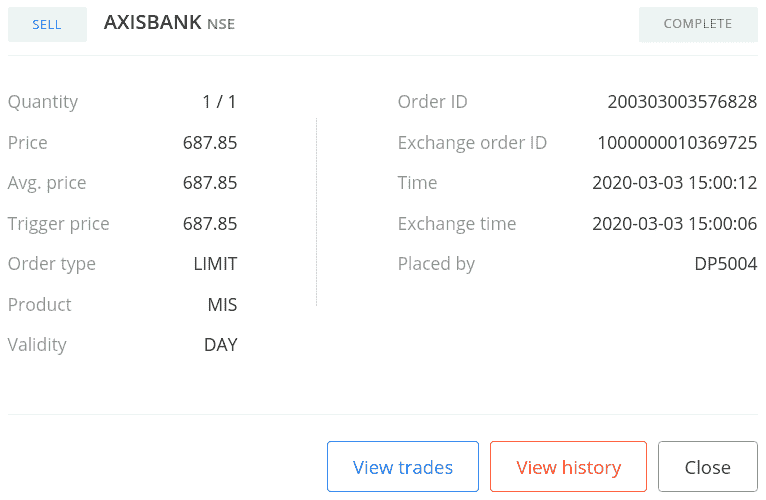

1.  拉取 LTP。下达一个`BUY`，`REGULAR`，`DELIVERY`，`STOPLOSS_LIMIT`订单并显示订单 ID：

```py
>>> ltp = broker_connection.get_ltp(instrument)
>>> order3_id = broker_connection.place_order(
                instrument=instrument,
                order_transaction_type= \
                    BrokerOrderTransactionTypeConstants.BUY,
                order_type=BrokerOrderTypeConstants.REGULAR,
                order_code=BrokerOrderCodeConstants.DELIVERY,
                order_variety= \
                    BrokerOrderVarietyConstants.STOPLOSS_LIMIT,
                quantity=1,
                price=ltp+1,
                trigger_price=ltp+1)
>>> order3_id
```

我们得到以下输出（您的输出可能会有所不同）：

```py
'200303003308116'
```

1.  拉取并显示订单状态：

```py
>>> broker_connection.get_order_status(order3_id)
```

我们得到以下输出：

```py
'TRIGGER PENDING'
```

如果您使用您的凭据登录经纪人网站并转到订单部分，您可以找到您的订单详细信息，如下面的屏幕截图所示（您的某些数据可能会有所不同）：


1.  一段时间后再次拉取并显示订单状态：

```py
>>> broker_connection.get_order_status(order3_id)
```

我们得到以下输出：

```py
'COMPLETE'
```

如果您使用您的凭据登录经纪人网站并转到订单部分，您可以找到您的订单详细信息，如下面的屏幕截图所示（您的某些数据可能会有所不同）：


1.  拉取 LTP。下达一个`SELL`，`REGULAR`，`DELIVERY`，`STOPLOSS_LIMIT`订单并显示订单 ID：

```py
>>> ltp = broker_connection.get_ltp(instrument)
>>> order4_id = broker_connection.place_order(
                instrument=instrument,
                order_transaction_type= \
                    BrokerOrderTransactionTypeConstants.SELL,
                order_type=BrokerOrderTypeConstants.REGULAR,
                order_code=BrokerOrderCodeConstants.DELIVERY,
                order_variety= \
                    BrokerOrderVarietyConstants.STOPLOSS_LIMIT,
                quantity=1,
                price=ltp-1,
                trigger_price=ltp-1)
>>> order4_id
```

我们得到以下输出（您的输出可能会有所不同）：

```py
'200303003312976'
```

1.  拉取并显示订单状态：

```py
>>> broker_connection.get_order_status(order4_id)
```

我们得到以下输出：

```py
'TRIGGER PENDING'
```

如果您使用您的凭据登录经纪人网站并转到订单部分，您可以找到您的订单详细信息，如下面的屏幕截图所示（您的某些数据可能会有所不同）：

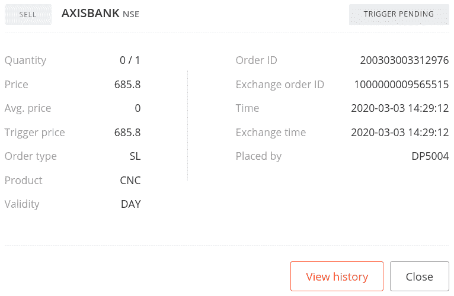

1.  一段时间后再次拉取并显示订单状态：

```py
>>> broker_connection.get_order_status(order4_id)
```

我们得到以下输出：

```py
'COMPLETE'
```

如果您使用您的凭据登录经纪人网站并转到订单部分，您可以找到您的订单详细信息，如下面的屏幕截图所示（您的某些数据可能会有所不同）：

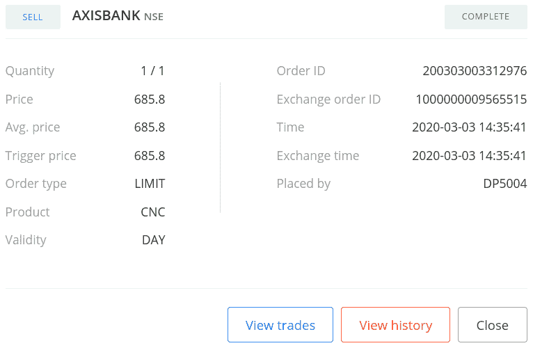

## 工作原理…

在*步骤 1*中，您使用`BrokerConnectionZerodha`类的`get_instrument()`方法拉取一个工具，并将其分配给一个新属性`instrument`。这个对象是`Instrument`类的一个实例。调用`get_instrument`所需的两个参数是交易所（`'NSE'`）和交易符号（`'AXISBANK'`）。

在*步骤 2*中，你使用`BrokerConnectionZerodha`类的`get_ltp()`方法获取工具的 LTP，并将其分配给一个新属性`ltp`。在这里，将`instrument`对象作为参数传递。接下来，你使用`broker_connection`对象的`place_order`方法在交易所下单`BUY`、`REGULAR`、`INTRADAY`、`STOPLOSS_LIMIT`。`place_order`方法是经纪人特定的下单 API 的包装器。它接受以下属性：

+   `instrument`：这是必须下单的金融工具，应该是`Instrument`类的实例。我们在这里传递`instrument`。

+   `order_transaction_type`：这是订单交易类型，应该是`BrokerOrderTransactionTypeConstants`类型的枚举。我们在这里传递`BrokerOrderTransactionTypeConstants.BUY`。

+   `order_type`：这是订单类型，应该是`BrokerOrderTypeConstants`类型的枚举。我们在这里传递`BrokerOrderTypeConstants.REGULAR`。

+   `order_code`：这是订单代码，应该是`BrokerOrderCodeConstants`类型的枚举。我们在这里传递`BrokerOrderCodeConstants.INTRADAY`。

+   `order_variety`：这是订单种类，应该是`BrokerOrderVarietyConstants`类型的枚举。我们在这里传递`BrokerOrderVarietyConstants.STOPLOSS_LIMIT`。

+   `quantity`：这是要交易的股票数量，应该是正整数。我们在这里传递`1`。

+   `price`：这是下单的限价。我们在这里传递`ltp+1`，表示高于`ltp`的`1`单位价格。

+   `trigger_price`：这是下单的触发价格。我们在这里传递`ltp+1`，表示高于`ltp`的`1`单位价格。

（传递给`place_order`方法的属性是与经纪人无关的常量，之前从`pyalgotrading.constants`模块导入。）

在*步骤 2*中，下单后你会从经纪人那里获得一个订单 ID，将其分配给一个新属性`order1_id`。`order1_id`对象是一个字符串。如果由于某种原因下单失败，你可能不会获得订单 ID。请注意，价格和`trigger_price`参数被赋予了`ltp+1`的值。这意味着订单是在市价上方下单，这是放置`BUY STOPLOSS_LIMIT`订单的必要条件。

在*步骤 3*中，你使用`broker_connection`对象的`get_order_status()`方法获取已下单的状态。你将`order1_id`作为`get_order_status()`方法的参数传递。你将订单状态作为字符串`'TRIGGER PENDING'`获取。你也可以随时使用`order1_id`获取已下单订单的状态。在*步骤 4*中，你再次获取订单状态，如果订单完成，你将订单状态获取为`'COMPLETE'`。

您还可以通过登录经纪人网站并检查那里的订单部分来验证订单的成功下达。您应该看到类似于*步骤 3*和*步骤 4*输出中显示的屏幕截图的数据。

在*步骤 3*中，如果状态显示为`'COMPLETE'`而不是`'TRIGGER PENDING'`，这可能是由于高波动性引起的。如果您希望订单在`'OPEN'`状态保持一段时间，请尝试将订单放置在市价之外的位置。

本配方的其他步骤遵循相同的模式，下达订单并获取其状态，但使用不同组合的属性：

+   *步骤 5*、*6* 和 *7*：`SELL`、`REGULAR`、`INTRADAY`、`STOPLOSS_LIMIT` 订单

+   *步骤 8*、*9* 和 *10*：`BUY`、`REGULAR`、`DELIVERY`、`STOPLOSS_LIMIT` 订单

+   *步骤 11*、*12* 和 *13*：`SELL`、`REGULAR`、`DELIVERY`、`STOPLOSS_LIMIT` 订单

# 下达常规止损市价订单

常规止损市价订单是一种单一价格下单类型的订单。与常规市价订单不同，这不是市价。为了下达此订单，需要一个称为*触发价格*的特定参数。此参数应满足以下条件：

+   *触发价格*对于`BUY`订单应高于市价。

+   *触发价格*对于`SELL`订单应低于市价。

如果这些条件不满足，则订单可能以市价下单，从而基本上将其转换为常规市价单，或者经纪人可能将其拒绝为无效订单。

在下达常规止损市价订单时，它会在最终达到终止状态（`COMPLETE`、`CANCELLED`或`REJECTED`）之前经历各种中间状态。一个常规止损市价订单可能会在`TRIGGER_PEDNING`状态下保持一段时间，直到有利的市场条件达到，然后转移到`COMPLETE`状态。

以下状态机图演示了常规止损市价订单在其生命周期中的各种状态：

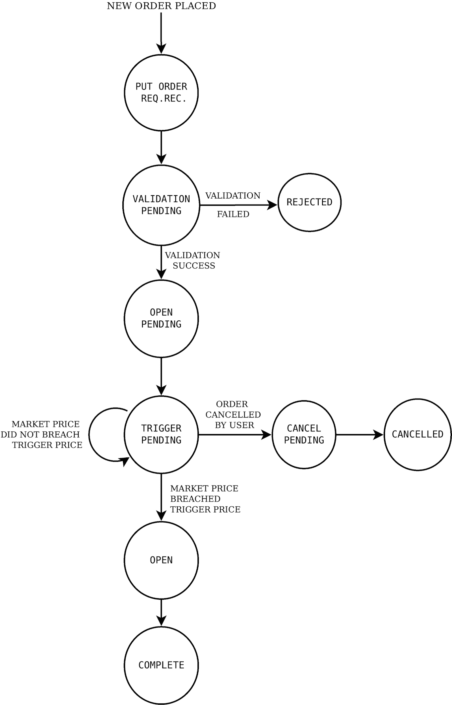

订单下达后，它将保持在`TRIGGER_PENDING`状态，直到市价突破*触发价格*。这时订单被激活并发送到交易所。订单然后以最佳可用市场价格执行。订单状态从`TRIGGER_PENDING`转换到`OPEN`再转换到`COMPLETE`状态。

一个常规止损市价单的行为与常规止损限价单类似（参见*下达常规止损限价单*配方），除了一个区别——止损市价单只需要*触发价格*，而不需要*限价*，而止损限价单则需要这两个参数。你可以将止损市价单视为具有无限制*限价*的止损限价单。

本配方演示了下列常规止损市价订单的下达和查询其状态：

+   `BUY`、`REGULAR`、`INTRADAY`、`STOPLOSS_MARKET` 订单

+   `SELL`、`REGULAR`、`INTRADAY`、`STOPLOSS_MARKET`订单

+   `BUY`、`REGULAR`、`DELIVERY`、`STOPLOSS_MARKET`订单

+   `SELL`、`REGULAR`、`DELIVERY`、`STOPLOSS_MARKET`订单

## 准备就绪

确保`pyalgotrading`包中的`broker_connection`对象和常量在您的 Python 命名空间中可用。请参考本章的*技术要求*部分设置此对象。

## 如何操作…

我们为这个菜谱执行以下步骤：

1.  获取一个金融工具并将其分配给`instrument`：

```py
>>> instrument = broker_connection.get_instrument('NSE', 
                                                  'KOTAKBANK')
```

1.  获取 LTP。下达一个`BUY`、`REGULAR`、`INTRADAY`、`STOPLOSS_MARKET`订单并显示订单 ID：

```py
>>> ltp = broker_connection.get_ltp(instrument)
>>> order1_id = broker_connection.place_order(
                instrument=instrument,
                order_transaction_type= \
                    BrokerOrderTransactionTypeConstants.BUY,
                order_type=BrokerOrderTypeConstants.REGULAR,
                order_code=BrokerOrderCodeConstants.INTRADAY,
                order_variety= \
                    BrokerOrderVarietyConstants.STOPLOSS_MARKET,
                quantity=1,
                trigger_price=ltp+1)
>>> order1_id
```

我们获得以下输出（您的输出可能会有所不同）：

```py
'200727003362763'
```

1.  获取并显示订单状态：

```py
>>> broker_connection.get_order_status(order1_id)
```

我们获得以下输出：

```py
'TRIGGER PENDING'
```

如果您使用您的凭据登录经纪人网站并转到订单部分，您可以找到您的订单详细信息，如下面的屏幕截图所示（某些数据可能对您不同）：

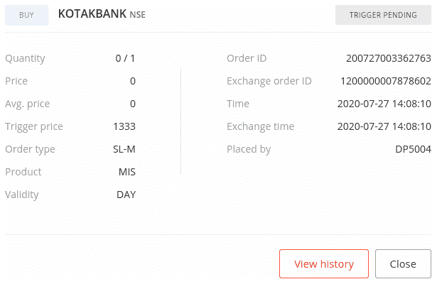

1.  过一段时间再次获取并显示订单状态：

```py
>>> broker_connection.get_order_status(order1_id)
```

我们获得以下输出：

```py
'COMPLETE'
```

如果您使用您的凭据登录经纪人网站并转到订单部分，您可以找到您的订单详细信息，如下面的屏幕截图所示（某些数据可能对您不同）：

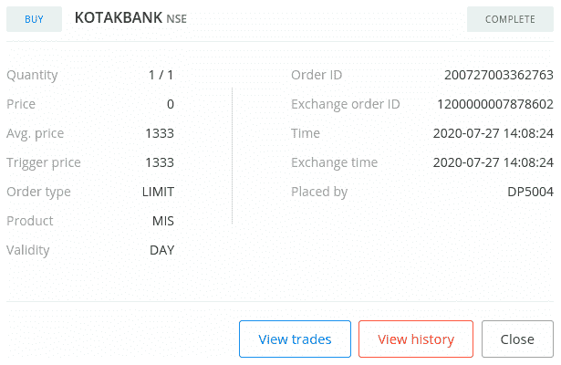

1.  获取 LTP。下达一个`SELL`、`REGULAR`、`INTRADAY`、`STOPLOSS_MARKET`订单并显示订单 ID：

```py
>>> ltp = broker_connection.get_ltp(instrument)
>>> order2_id = broker_connection.place_order(
                instrument=instrument,
                order_transaction_type= \
                    BrokerOrderTransactionTypeConstants.SELL,
                order_type=BrokerOrderTypeConstants.REGULAR,
                order_code=BrokerOrderCodeConstants.INTRADAY,
                order_variety= \
                    BrokerOrderVarietyConstants.STOPLOSS_MARKET,
                quantity=1,
                trigger_price=ltp-1)
>>> order2_id
```

我们获得以下输出（您的输出可能会有所不同）：

```py
'200303003345436'
```

1.  获取并显示订单状态：

```py
>>> broker_connection.get_order_status(order2_id)
```

我们获得以下输出：

```py
'TRIGGER PENDING'
```

如果您使用您的凭据登录经纪人网站并转到订单部分，您可以找到您的订单详细信息，如下面的屏幕截图所示（某些数据可能对您不同）：

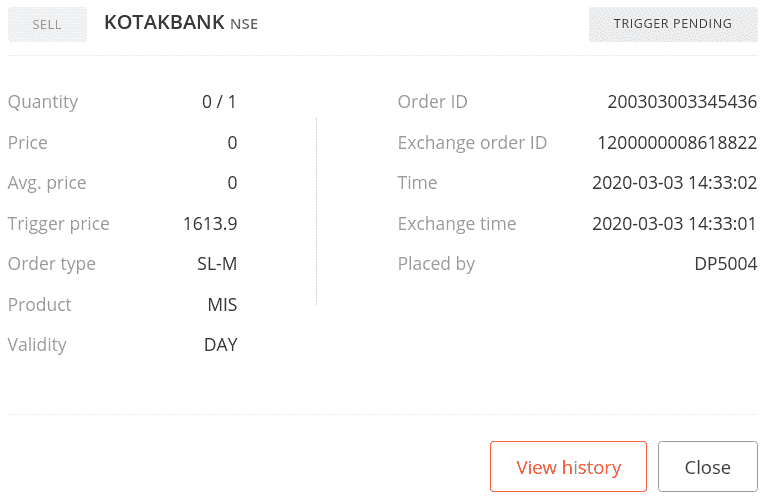

1.  过一段时间再次获取并显示订单状态：

```py
>>> broker_connection.get_order_status(order2_id)
```

我们获得以下输出：

```py
'COMPLETE'
```

如果您使用您的凭据登录经纪人网站并转到订单部分，您可以找到您的订单详细信息，如下面的屏幕截图所示（某些数据可能对您不同）：

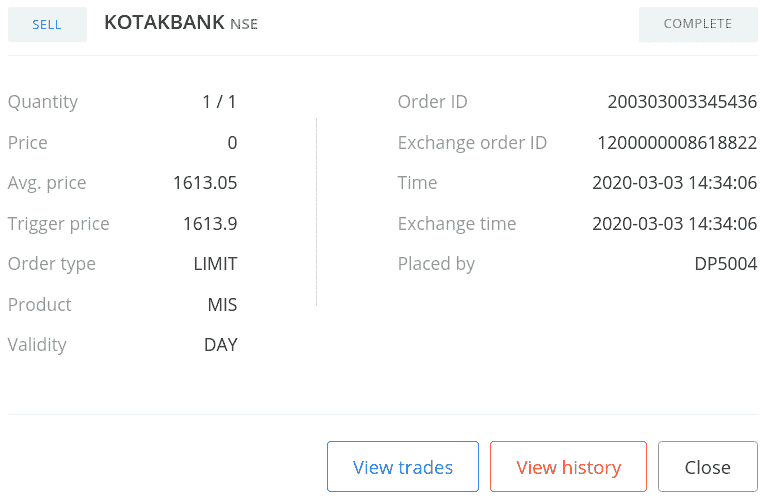

1.  获取 LTP。下达一个`BUY`、`REGULAR`、`DELIVERY`、`STOPLOSS_MARKET`订单并显示订单 ID：

```py
>>> ltp = broker_connection.get_ltp(instrument)
>>> order3_id = broker_connection.place_order(
                instrument=instrument,
                order_transaction_type= \
                    BrokerOrderTransactionTypeConstants.BUY,
                order_type=BrokerOrderTypeConstants.REGULAR,
                order_code=BrokerOrderCodeConstants.DELIVERY,
                order_variety= \
                    BrokerOrderVarietyConstants.STOPLOSS_MARKET,
                quantity=1,
                trigger_price=ltp+1)
>>> order3_id
```

我们获得以下输出（您的输出可能会有所不同）：

```py
'200727003580657'
```

1.  获取并显示订单状态：

```py
>>> broker_connection.get_order_status(order3_id)
```

我们获得以下输出：

```py
'TRIGGER PENDING'
```

如果您使用您的凭据登录经纪人网站并转到订单部分，您可以找到您的订单详细信息，如下面的屏幕截图所示（某些数据可能对您不同）：

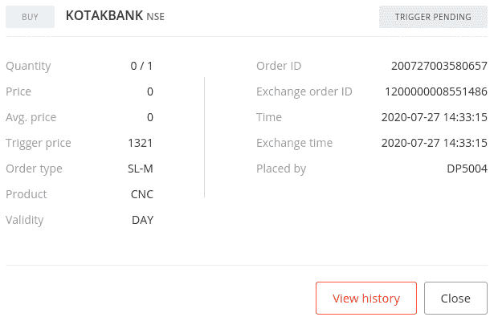

1.  过一段时间再次获取并显示订单状态：

```py
>>> broker_connection.get_order_status(order3_id)
```

我们获得以下输出：

```py
'COMPLETE'
```

如果您使用您的凭据登录经纪人网站并转到订单部分，您可以找到您的订单详细信息，如下面的屏幕截图所示（某些数据可能对您不同）：

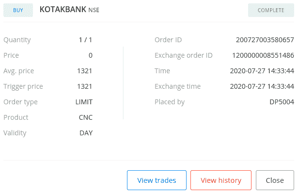

1.  获取 LTP。下达一个`SELL`、`REGULAR`、`DELIVERY`、`STOPLOSS_MARKET`订单并显示订单 ID：

```py
>>> ltp = broker_connection.get_ltp(instrument.segment)
>>> order4_id = broker_connection.place_order(
                instrument=instrument,
                order_transaction_type= \
                    BrokerOrderTransactionTypeConstants.SELL,
                order_type=BrokerOrderTypeConstants.REGULAR,
                order_code=BrokerOrderCodeConstants.DELIVERY,
                order_variety= \
                    BrokerOrderVarietyConstants.STOPLOSS_MARKET,
                quantity=1,
                trigger_price=ltp-1)
>>> order4_id
```

我们得到以下输出（您的输出可能不同）：

```py
'200727003635594'
```

1.  获取并显示订单状态：

```py
>>> broker_connection.get_order_status(order4_id)
```

我们得到以下输出：

```py
'TRIGGER PENDING'
```

如果您使用您的凭据登录经纪人网站并转到订单部分，您可以找到您的订单详情，如下面的屏幕截图所示（您的一些数据可能不同）：

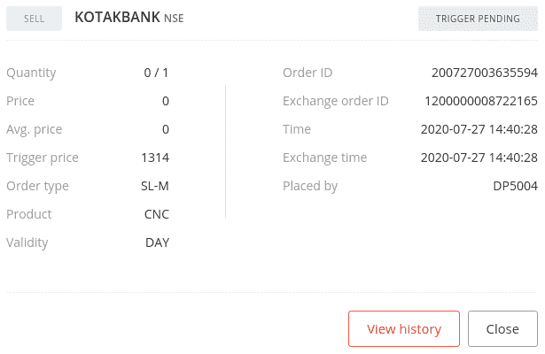

1.  过一段时间再次获取并显示订单状态：

```py
>>> broker_connection.get_order_status(order4_id)
```

我们得到以下输出：

```py
'COMPLETE'
```

如果您使用您的凭据登录经纪人网站并转到订单部分，您可以找到您的订单详情，如下面的屏幕截图所示（您的一些数据可能不同）：

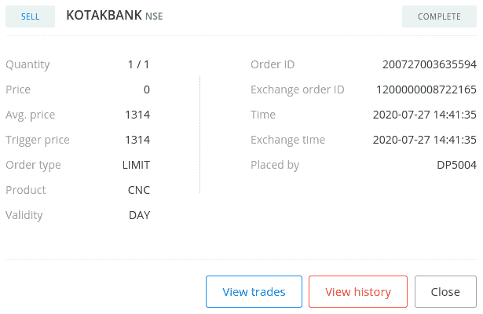

## 如何工作…

在*步骤 1*中，您使用`BrokerConnectionZerodha`类的`get_instrument()`方法获取一个工具并将其分配给一个新的属性`instrument`。此对象是`Instrument`类的一个实例。调用`get_instrument`所需的两个参数是交易所（`'NSE'`）和交易符号（`'KOTAKBANK'`）。

在*步骤 2*中，您使用`BrokerConnectionZerodha`类的`get_ltp()`方法获取工具的 LTP，并将其分配给一个新的属性`ltp`。此处将`instrument`对象作为参数传递。接下来，您使用`broker_connection`对象的`place_order`方法在交易所上下达`BUY`、`REGULAR`、`INTRADAY`、`STOPLOSS_MARKET`订单。`place_order`方法是经纪人特定的下单 API 的包装器。它接受以下属性：

+   `instrument`：这是必须下订单的金融工具，应该是`Instrument`类的实例。我们在这里传递`instrument`。

+   `order_transaction_type`：这是订单交易类型，应该是`BrokerOrderTransactionTypeConstants`类型的枚举。我们在这里传递`BrokerOrderTransactionTypeConstants.BUY`。 

+   `order_type`：这是订单类型，应该是`BrokerOrderTypeConstants`类型的枚举。我们在这里传递`BrokerOrderTypeConstants.REGULAR`。

+   `order_code`：这是订单代码，应该是`BrokerOrderCodeConstants`类型的枚举。我们在这里传递`BrokerOrderCodeConstants.INTRADAY`。

+   `order_variety`：这是订单种类，应该是`BrokerOrderVarietyConstants`类型的枚举。我们在这里传递`BrokerOrderVarietyConstants.STOPLOSS_MARKET`。

+   `quantity`：这是要交易的股票数量，并且应该是正整数。我们在这里传递`1`。

+   `trigger_price`：这是订单应该下达的触发价格。我们在这里传递`ltp+1`，这意味着`ltp`上方`1`单位价格。

（传递给`place_order`方法的属性是经纪人无关的常量，之前从`pyalgotrading.constants`模块导入。）

在*第二步*下单时，您将从经纪人那里获得一个订单 ID，然后将其分配给一个新属性`order1_id`。`order1_id`对象是一个字符串。如果由于某种原因下单失败，您可能不会得到订单 ID。请注意，`trigger_price`参数被赋予了`ltp+1`的值。这意味着订单被放置在市场价格之上，这是放置`BUY STOPLOSS_MARKET`订单的必要条件。

在*第三步*，您使用`broker_connection`对象的`get_order_status()`方法获取已下订单的状态。您将`order1_id`作为`get_order_status()`方法的参数传递。您将订单状态作为`'TRIGGER PENDING'`的字符串获得。您还可以随时使用`order1_id`获取已下订单的状态。在*第四步*，您再次获取订单状态，如果订单已完成，您将获得订单状态为`'COMPLETE'`。

您还可以通过登录经纪人网站并在那里检查订单部分来验证您的订单已成功下单。您应该看到类似于*第三步*和*第四步*输出中显示的屏幕截图的数据。

在*第三步*，如果状态显示为`'COMPLETE'`而不是`'TRIGGER PENDING'`，这可能是由于高波动性造成的。如果你希望订单在`'OPEN'`状态保持一段时间，尝试将订单放置在市场价格较远的地方。

这个配方中的其他步骤都遵循相同的模式，即下订单并获取其状态，只是属性组合不同：

+   *步骤 5*、*6*和*7*：`SELL`、`REGULAR`、`INTRADAY`、`STOPLOSS_MARKET`订单

+   *步骤 8*、*9*和*10*：`BUY`、`REGULAR`、`DELIVERY`、`STOPLOSS_MARKET`订单

+   *步骤 11*、*12*和*13*：`SELL`、`REGULAR`、`DELIVERY`、`STOPLOSS_MARKET`订单
