# 在交易所放置括号和覆盖订单

本章介绍了可以通过经纪人 API 在交易所上放置的各种类型的括号和覆盖订单。这些配方包括用于放置 12 种类型的订单、查询它们的状态、取消未完成的订单和退出已完成订单的代码。这些配方将是您算法交易策略的基本组成部分。了解所有订单类型并知道为给定要求放置哪种订单对于构建成功的交易策略至关重要。

每个订单有四个属性，这四个属性共同完整定义了订单：

+   订单交易类型

+   订单类型

+   订单代码

+   订单种类

要下订单，所有四个属性都应该被准确知道。要了解更多关于这些属性的信息，请参考第六章的介绍，*在交易所放置常规订单*。

本章中的配方为每种订单类型提供了详细的流程图。在交易所上下的每个订单在其生命周期中经历各种状态。要了解更多关于本章使用的经纪人支持的订单状态，请参考第六章的介绍，*在交易所放置常规订单*。

在本章中，我们将涵盖以下配方：

+   放置括号限价单

+   放置括号止损限价单

+   放置带有跟踪止损的括号限价单

+   放置带有跟踪止损的括号止损限价单

+   放置覆盖市价单

+   放置覆盖限价单

请确保您在实时市场时间内具有足够的余额在您的经纪帐户中尝试所有这些配方。如果在非市场时间尝试这些配方或者余额不足，您的订单将被经纪人拒绝。这意味着订单永远不会达到交易所，您将无法获得预期的响应。

# 技术要求

您需要以下内容才能成功执行本章的配方：

+   Python 3.7+

+   Python 软件包：`pyalgotrading`（`$ pip install pyalgotrading`）

这一章的最新 Jupyter 笔记本可以在 GitHub 上找到，网址为 [`github.com/PacktPublishing/Python-Algorithmic-Trading-Cookbook/tree/master/Chapter07`](https://github.com/PacktPublishing/Python-Algorithmic-Trading-Cookbook/tree/master/Chapter07)。

与经纪人建立连接的第一件事就是获取 API 密钥。经纪人将为每个客户提供唯一的密钥，通常是作为一个 `api-key` 和 `api-secret` 密钥对。这些 API 密钥通常是收费的，通常是按月订阅的。您需要在开始之前从经纪人网站获取您的 `api-key` 和 `api-secret` 的副本。您可以参考 *附录 I* 获取更多详细信息。

以下步骤将帮助您与 Zerodha 建立经纪人连接，该连接将被本章中的所有配方使用。请确保在尝试任何配方之前已经完成了这些步骤：

1.  导入必要的模块：

```py
>>> from pyalgotrading.broker.broker_connection_zerodha import BrokerConnectionZerodha
>>> from pyalgotrading.constants import *
```

所有`pyalgotrading`常量现在都可在您的 Python 命名空间中使用。

1.  从经纪人那里获取`api_key`和`api_secret`密钥。这些对你来说是唯一的，并且经纪人将用它们来识别你的证券账户：

```py
>>> api_key = "<your-api-key>"
>>> api_secret = "<your-api-secret>"
>>> broker_connection = BrokerConnectionZerodha(api_key, 
                                                api_secret)
```

我们得到以下输出：

```py
Installing package kiteconnect via pip. This may take a while...
Please login to this link to generate your request token: https://kite.trade/connect/login?api_key=<your-api-key>&v=3
```

如果您是第一次运行此代码，并且没有安装`kiteconnect`，`pyalgotrading`将自动为您安装它。*步骤 2* 的最终输出将是一个链接。点击链接并使用您的 Zerodha 凭据登录。如果验证成功，您将在浏览器的地址栏中看到一个类似于`https://127.0.0.1/?request_token=<字母数字令牌>&action=login&status=success`的链接。

我们有以下示例：

```py
https://127.0.0.1/?request_token=H06I6Ydv95y23D2Dp7NbigFjKweGwRP7&action=login&status=success
```

1.  复制字母数字令牌并粘贴到`request_token`中：

```py
>>> request_token = "<your-request-token>"
>>> broker_connection.set_access_token(request_token)
```

`broker_connection`实例现在已准备好执行 API 调用。

`pyalgotrading`包支持多个经纪人，并为每个经纪人提供一个连接对象类，具有相同的方法。它将经纪人 API 抽象为统一接口，因此用户无需担心底层经纪人 API 调用，可以直接使用本章中的所有示例。只有设置经纪人连接的过程会因经纪人而异。如果您不是使用 Zerodha 作为您的经纪人，则可以参考 `pyalgotrading` 文档来设置经纪人连接。对于 Zerodha 用户，前一节中提到的步骤就足够了。

# 放置一个括号限价单

括号订单是一种复杂的订单，旨在在交易变得有利时帮助盈利，或在变得不利时限制损失，具有预定义的值。括号订单本质上是三个常规订单的组合——初始订单、目标订单和止损订单——这三个订单共同起作用，以帮助实现指定的利润或限制损失。除了常规订单参数外，括号订单还接受附加参数——`target`、`stoploss` 和 `trailing stoploss`（可选）。这三个常规订单描述如下：

+   **初始订单**：此订单相当于常规限价单或常规止损限价单。一旦下单，它将保持`'OPEN'`状态，直到市价达到其触发价格值。一旦市场越过触发价格值，此订单将从`'OPEN'`状态移至`'COMPLETE'`状态，并且将放置目标和止损订单，下面描述这些订单。

+   **目标订单**：此订单相当于常规限价单，其触发价格为指定的目标值，并且交易类型与初始订单相反。对于买入初始订单，目标订单以比初始订单更高的价格下单。对于卖出初始订单，则相反。数量与初始订单相匹配。因此，如果此订单执行，它将退出由初始订单创建的头寸。

+   **止损订单**：此订单相当于常规止损限价订单，其指定的`stoploss`值为其触发价格，并且交易类型与初始订单相反。对于买入初始订单，止损订单放置在低于初始订单的价格处。对于卖出初始订单，情况则相反。数量与初始订单相匹配。因此，如果此订单执行，则退出初始订单创建的仓位。如果指定了`trailing stoploss`参数，每当初始订单价格朝着目标订单价格的方向移动时，止损订单就会按照`trailing stoploss`值的大小修改，朝着初始订单价格的方向进行修改。这有助于在初始订单价格运动方向发生变化时进一步减少损失。

由于目标订单和止损订单放置在初始订单的相对两侧，它们围绕初始订单形成了一个*括号*，因此这个订单称为**括号订单**。此外，由于目标订单和止损订单位于相对两侧，因此在给定时间内只有一个会执行（这意味着它的状态会从`'OPEN'`变为`'COMPLETE'`），并且当它执行时，该订单（无论是止损订单还是目标订单）都会自动取消。目标订单和止损订单也被称为初始订单的**子订单**，而初始订单则称为后者的**父订单**。

除非经纪人另有支持，否则括号订单通常用于日内交易。如果初始订单或子订单在交易会话结束时未完成，则经纪人会自动取消或退出它们。

以下流程图解释了**括号订单**的工作原理：

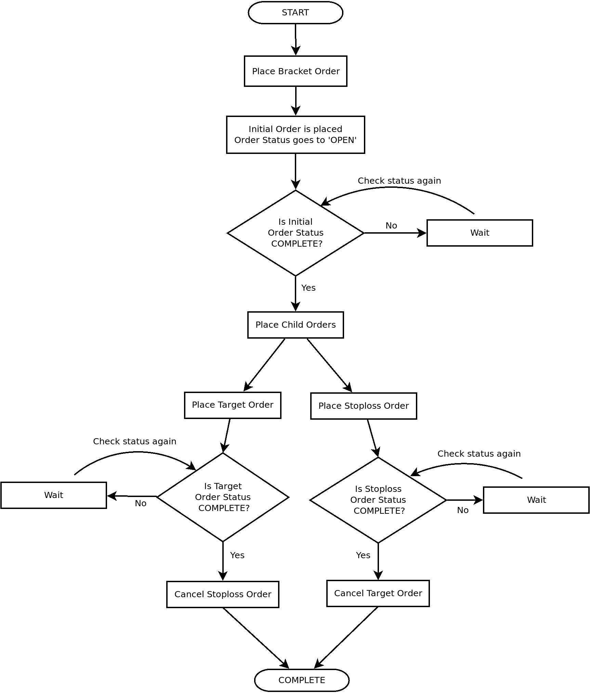

以下是括号限价订单状态机图的参考：

+   **初始订单**：请参考前一章节中*下达常规限价订单*配方的状态机图。

+   **目标订单**：请参考前一章节中*下达常规限价订单*配方的状态机图。

+   **止损订单**：请参考前一章节中*下达常规止损限价订单*配方的状态机图。

当买入括号订单必须低于市场价格放置，或卖出括号订单必须高于市场价格放置时，可以使用括号限价订单。

本配方演示了以下括号限价订单的下单和查询其状态：

+   `BUY`、`BRACKET`、`INTRADAY`、`LIMIT` 订单（不带跟踪止损）

+   `SELL`、`BRACKET`、`INTRADAY`、`LIMIT` 订单（不带跟踪止损）

## 准备工作

确保在你的 Python 命名空间中可用 `broker_connection` 对象和 `pyalgotrading` 包中的常量。请参考本章节的*技术要求*部分设置此对象。

## 如何实现…

我们对这个配方执行以下步骤：

1.  获取一个金融工具并将其赋值给`instrument`：

```py
>>> instrument = broker_connection.get_instrument('NSE', 'SBIN')
```

1.  获取 LTP。下一个`BUY`，`BRACKET`，`INTRADAY`，`LIMIT` 订单并显示订单 ID：

```py
>>> ltp = broker_connection.get_ltp(instrument)
>>> order1_id = broker_connection.place_order(
                    instrument=instrument,
                    order_transaction_type= \
                        BrokerOrderTransactionTypeConstants.BUY,
                    order_type=BrokerOrderTypeConstants.BRACKET,
                    order_code=BrokerOrderCodeConstants.INTRADAY,
                    order_variety= \
                        BrokerOrderVarietyConstants.LIMIT,
                    quantity=1,
                    price=ltp-1,
                    stoploss=2,
                    target=2)
>>> order1_id
```

我们得到以下输出（您的输出可能会有所不同）：

```py
'2003030003491923'
```

1.  获取并显示订单状态：

```py
>>> broker_connection.get_order_status(order1_id)
```

我们得到以下输出：

```py
'OPEN'
```

如果您使用凭据登录经纪人网站并转到订单部分，您可以找到您的订单详细信息，如下面的屏幕截图所示（您的一些数据可能会有所不同）：

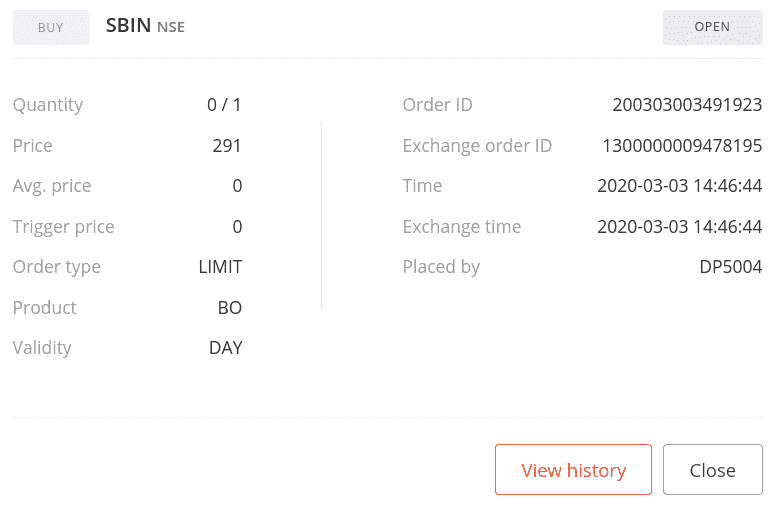

1.  过一段时间后再次获取并显示订单状态：

```py
>>> broker_connection.get_order_status(order1_id)
```

我们得到以下输出：

```py
'COMPLETE'
```

如果您使用凭据登录经纪人网站并转到订单部分，您可以找到您的订单详细信息，如下面的屏幕截图所示（您的一些数据可能会有所不同）：

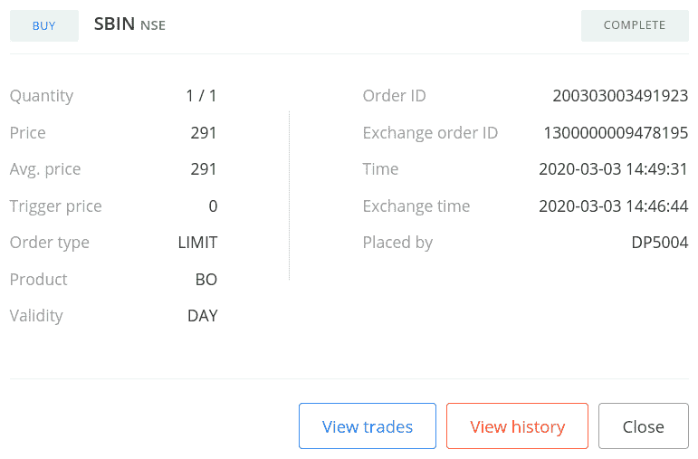

1.  获取 LTP。下一个`SELL`，`BRACKET`，`INTRADAY`，`LIMIT` 订单并显示订单 ID：

```py
>>> ltp = broker_connection.get_ltp(instrument)
>>> order2_id = broker_connection.place_order(
                    instrument=instrument,
                    order_transaction_type= \
                        BrokerOrderTransactionTypeConstants.SELL,
                    order_type=BrokerOrderTypeConstants.BRACKET,
                    order_code=BrokerOrderCodeConstants.INTRADAY,
                    order_variety= \
                        BrokerOrderVarietyConstants.LIMIT,
                    quantity=1,
                    price=ltp+1,
                    stoploss=2,
                    target=2)
>>> order2_id
```

我们得到以下输出（您的输出可能会有所不同）：

```py
'200303003639902'
```

1.  获取并显示订单状态：

```py
>>> broker_connection.get_order_status(order2_id)
```

我们得到以下输出：

```py
'OPEN'
```

如果您使用凭据登录经纪人网站并转到订单部分，您可以找到您的订单详细信息，如下面的屏幕截图所示（您的一些数据可能会有所不同）：

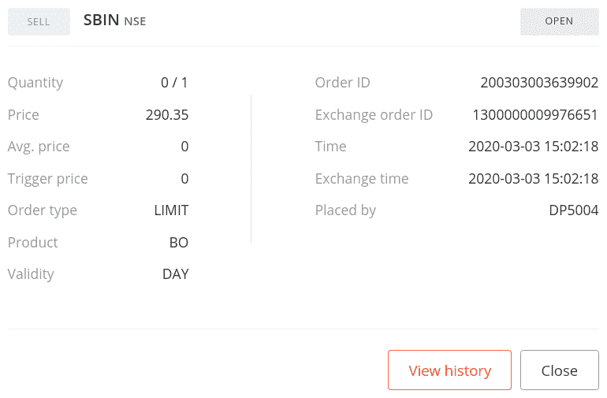

1.  过一段时间后再次获取并显示订单状态：

```py
>>> broker_connection.get_order_status(order2_id)
```

我们得到以下输出：

```py
'COMPLETE'
```

如果您使用凭据登录经纪人网站并转到订单部分，您可以找到您的订单详细信息，如下面的屏幕截图所示（您的一些数据可能会有所不同）：

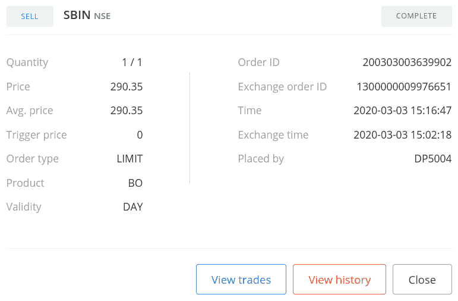

## 工作原理…

在*步骤 1* 中，您使用 `BrokerConnectionZerodha` 类的 `get_instrument()` 方法获取一个工具并将其赋值给一个新属性 `instrument`。这个对象是 `Instrument` 类的一个实例。调用 `get_instrument` 需要的两个参数是交易所（`'NSE'`）和交易符号（`'SBI'`）。

在*步骤 2* 中，您使用 `BrokerConnectionZerodha` 类的 `get_ltp()` 方法获取工具的 LTP，并将其赋值给新属性 `ltp`。这里将 `instrument` 对象作为参数传递。接下来，您使用 `broker_connection` 对象的 `place_order()` 方法在交易所上下一个 `BUY`，`BRACKET`，`INTRADAY`，`LIMIT` 订单。 `place_order()` 方法是经纪人特定的下单 API 的包装器。它接受以下属性：

+   `instrument`：这是必须下订单的金融工具，应该是 `Instrument` 类的实例。我们在这里传递 `instrument`。

+   `order_transaction_type`：这是订单交易类型，应该是 `BrokerOrderTransactionTypeConstants` 类型的枚举。我们在这里传递 `BrokerOrderTransactionTypeConstants.BUY`。

+   `order_type`：这是订单类型，应该是 `BrokerOrderTypeConstants` 类型的枚举。我们在这里传递 `BrokerOrderTypeConstants.BRACKET`。

+   `order_code`: 这是订单代码，应为`BrokerOrderCodeConstants`类型的枚举。我们在这里传递`BrokerOrderCodeConstants.INTRADAY`。

+   `order_variety`: 这是订单类型，应为`BrokerOrderVarietyConstants`类型的枚举。我们在这里传递`BrokerOrderVarietyConstants.LIMIT`。

+   `quantity`: 这是要交易的股票数量，应为正整数。我们传递`1`。

+   `price`: 这是应该下单的限价。我们在这里传递`ltp-1`，意味着低于`ltp`的`1`单位价格。

+   `stoploss`: 这是与初始订单价格的价格差，应该放置止损订单的价格。它应该是正整数或浮点数值。我们在这里传递`2`。

+   `target`: 这是与初始订单价格的价格差，应该放置目标订单的价格。它应该是正整数或浮点数值。我们在这里传递`2`。

（传递给`place_order()`方法的属性是与经纪人无关的常量，之前从`pyalgotrading.constants`模块导入的。）

在*第 2 步*中下单后，您会从经纪人那里获得一个订单 ID，您将其分配给一个新属性`order1_id`。`order1_id`对象是一个字符串。如果由于某种原因订单未能成功下达，则您可能不会获得订单 ID。请注意，价格参数传递了一个值为`ltp-1`。这意味着订单是在市场价格下方下达的，这是下达买入限价订单的必要条件。`stoploss`参数指定为`2`。这意味着止损订单将以比初始订单的执行价格低两个价格单位的价格下达。同样，`target`参数指定为`2`。这意味着目标订单将以比初始订单的执行价格高两个价格单位的价格下达。

在*第 3 步*中，您使用`broker_connection`对象的`get_order_status()`方法获取下单状态。您将`order1_id`作为`get_order_status()`方法的参数传递。您得到的订单状态为`'OPEN'`，是一个字符串。您还可以在以后的任何时间使用`order1_id`来获取已下单的状态。

在*第 4 步*中，您再次获取订单状态，如果订单已完成，则将订单状态作为`'COMPLETE'`。此后立即放置目标和止损订单，价格如前所述。目标订单执行为常规限价订单。止损订单执行为常规止损限价订单。当它们中的一个被执行并达到`'COMPLETE'`状态时，经纪人会自动取消另一个订单，因此它进入`'CANCELLED'`状态。请注意，目标和止损订单在初始订单的相反方向上，因此目标和止损订单不能同时执行。

您还可以通过登录经纪网站并检查订单部分来验证订单的成功下达。您应该会看到与 *步骤 3* 和 *步骤 4* 的输出中显示的屏幕截图类似的数据。

在 *步骤 3* 中，如果您看到状态为 `'COMPLETE'` 而不是 `'OPEN'`；这可能是由于市场波动较大。如果您希望订单保持在 `'OPEN'` 状态一段时间，请尝试将订单放置在市场价格之外。

下面是有关执行初始订单、目标订单和止损订单的更多详细信息的参考资料：

+   **初始订单**：参考上一章节中的 *下达常规限价订单* 部分。

+   **目标订单**：参考上一章节中的 *下达常规限价订单* 部分。

+   **止损订单**：参考上一章节中的 *下达常规止损限价订单* 部分。

本配方中的其他步骤遵循相同的模式，即放置订单并获取其不同属性组合的状态：

+   *步骤 5*、*6* 和 *7*：`SELL`、`BRACKET`、`INTRADAY`、`LIMIT` 订单

## 还有更多… 

您可以通过退出其中一个子订单来退出框架订单。您退出的子订单将以市场价格执行并转移到 `COMPLETE` 状态。另一个子订单将转移到 `CANCELLED` 状态。

例如，假设您退出了止损订单。在这种情况下，目标订单将被取消，并且将转移到 `CANCELLED` 状态。止损订单将以市场价格执行，并且将转移到 `COMPLETE` 状态。如果您使用您的凭据登录经纪站点并转到订单部分，则可以找到子订单详细信息，如以下屏幕截图所示。您的一些数据可能会有所不同。

以下是退出框架订单前放置在 *步骤 2* 中的初始订单的目标订单：

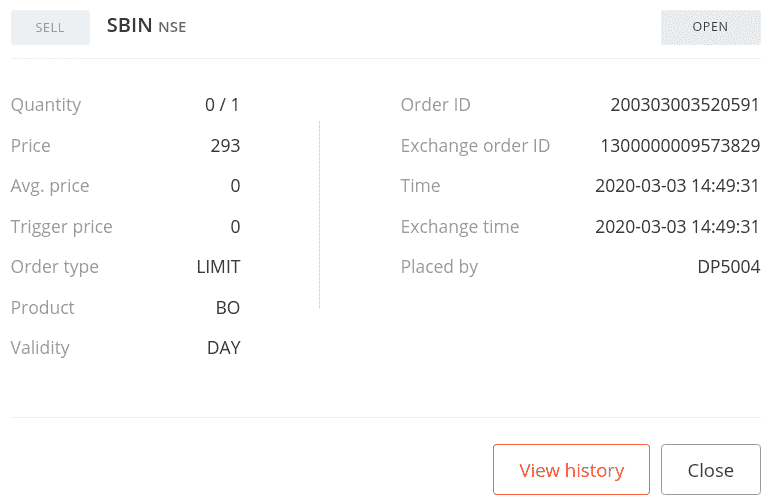

以下是退出框架订单后的目标订单：

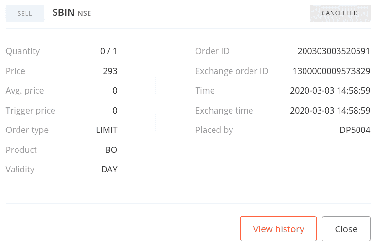

此屏幕截图显示了在退出之前放置在 *步骤 2* 中的初始订单的止损订单：

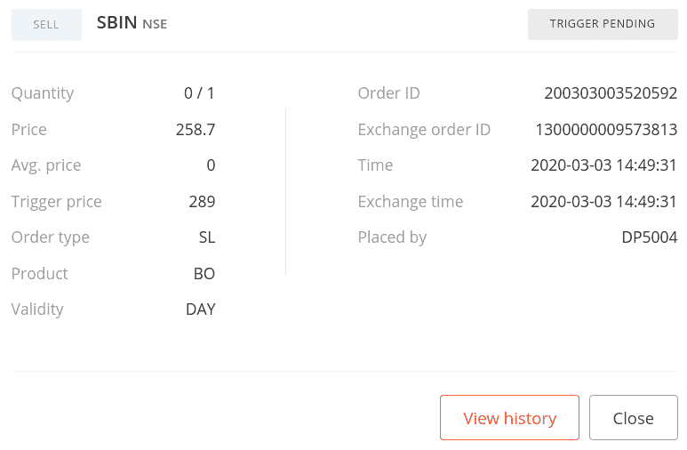

退出后的止损订单如下图所示：

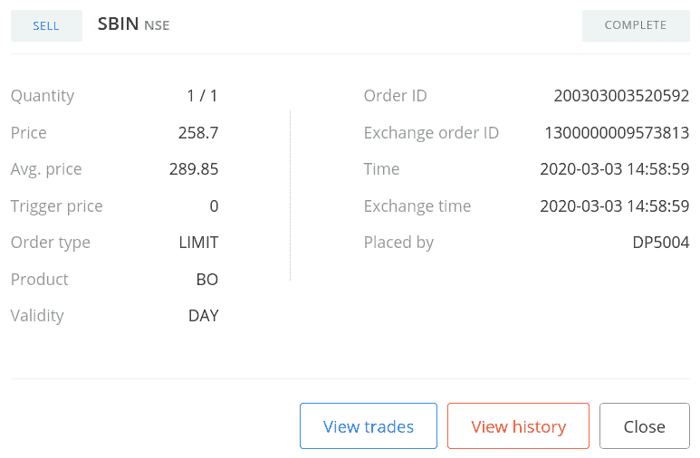

# 下达框架止损限价订单

框架订单是复杂的订单，旨在在交易有利时帮助赚取利润，或在交易不利时限制损失，具有预定义的值。框架订单本质上是三个常规订单的组合 ——初始订单、目标订单和止损订单，它们共同起作用，帮助实现指定的利润或限制损失。除了常规订单参数外，框架订单还需要额外的参数 ——`target`、`stoploss` 和 `trailing stoploss`（可选）。

请参考*下达一个 bracket 限价订单*配方的介绍，深入理解 bracket 订单的工作原理。如果您想要在市价上方下达买入 bracket 订单或在市价下方下达卖出 bracket 订单，可以使用 bracket stoploss-limit 订单。

该配方演示了下述 bracket stoploss-limit 订单的下达和查询其状态：

+   `BUY`、`BRACKET`、`INTRADAY`、`STOPLOSS_LIMIT`订单（不带跟踪止损）

+   `SELL`、`BRACKET`、`INTRADAY`、`STOPLOSS_LIMIT`订单（不带跟踪止损）

以下是用于 bracket stoploss-limit 订单的状态机图参考：

+   **初始订单**：请参考上一章节中*下达一个常规止损限价订单*配方的状态机图。

+   **目标订单**：请参考上一章节中*下达常规限价订单*配方的状态机图。

+   **止损订单**：请参考上一章节中*下达一个常规止损限价订单*配方的状态机图。

## 准备就绪

确保`pyalgotrading`包中的`broker_connection`对象和常量在你的 Python 命名空间中可用。请参考本章的*技术要求*部分设置该对象。

## 如何操作…

我们对本配方执行以下步骤：

1.  获取一个金融工具并将其分配给`instrument`：

```py
>>> instrument = broker_connection.get_instrument('NSE', 
                                                  'INDUSINDBK')
```

1.  获取最新成交价（LTP）。下达一个`BUY`、`BRACKET`、`INTRADAY`、`STOPLOSS_LIMIT`订单并显示订单 ID：

```py
>>> ltp = broker_connection.get_ltp(instrument.segment)
>>> order1_id = broker_connection.place_order(
                    instrument=instrument,
                    order_transaction_type=\
                        BrokerOrderTransactionTypeConstants.BUY,
                    order_type=BrokerOrderTypeConstants.BRACKET,
                    order_code=BrokerOrderCodeConstants.INTRADAY,
                    order_variety= \
                        BrokerOrderVarietyConstants.STOPLOSS_LIMIT,
                    quantity=1,
                    price=ltp+1,
                    trigger_price=ltp+1,
                    stoploss=2,
                    target=2)
>>> order1_id
```

我们得到以下输出（你的输出可能会有所不同）：

```py
'200226003619998'
```

1.  获取并显示订单状态：

```py
>>> broker_connection.get_order_status(order1_id)
```

我们得到以下输出：

```py
'TRIGGER PENDING'
```

1.  过一段时间后再次获取并显示订单状态：

```py
>>> broker_connection.get_order_status(order1_id)
```

我们得到以下输出：

```py
'COMPLETE'
```

1.  获取最新成交价（LTP）。下达一个`SELL`、`BRACKET`、`INTRADAY`、`STOPLOSS_LIMIT`订单并显示订单 ID：

```py
>>> ltp = broker_connection.get_ltp(instrument)
>>> order2_id = broker_connection.place_order(
                    instrument=instrument,
                    order_transaction_type= \
                        BrokerOrderTransactionTypeConstants.SELL,
                    order_type=BrokerOrderTypeConstants.BRACKET,
                    order_code=BrokerOrderCodeConstants.INTRADAY,
                    order_variety= \
                        BrokerOrderVarietyConstants.STOPLOSS_LIMIT,
                    quantity=1,
                    price=ltp-1,
                    trigger_price=ltp-1,
                    stoploss=2,
                    target=2)
>>> order2_id
```

我们得到以下输出（你的输出可能会有所不同）：

```py
'200226003620002'
```

1.  获取并显示订单状态：

```py
>>> broker_connection.get_order_status(order2_id)
```

我们得到以下输出：

```py
'TRIGGER PENDING'
```

1.  过一段时间后再次获取并显示订单状态：

```py
>>> broker_connection.get_order_status(order2_id)
```

我们得到以下输出：

```py
'COMPLETE'
```

## 工作原理…

在*步骤 1*中，您使用`BrokerConnectionZerodha`类的`get_instrument()`方法获取一个金融工具并将其分配给一个新的属性`instrument`。该对象是`Instrument`类的一个实例。调用`get_instrument`所需的两个参数是交易所（`'NSE'`）和交易符号（`'INDUSINDBK'`）。

在*步骤 2*中，您使用`BrokerConnectionZerodha`类的`get_ltp()`方法获取该工具的最新成交价，并将其分配给一个新的属性`ltp`。这里的参数是`instrument`对象。接下来，您使用`broker_connection`对象的`place_order()`方法在交易所下达一个`BUY`、`BRACKET`、`INTRADAY`、`STOPLOSS_LIMIT`订单。`place_order()`方法是一个特定于经纪商的下单 API 的封装。它接受以下属性：

+   `instrument`：这是必须下订单的金融工具，应该是`Instrument`类的一个实例。我们在这里传递`instrument`。

+   `order_transaction_type`：这是订单交易类型，应该是类型为`BrokerOrderTransactionTypeConstants`的枚举。我们在这里传递 `BrokerOrderTransactionTypeConstants.BUY`。

+   `order_type`：这是订单类型，应该是类型为`BrokerOrderTypeConstants`的枚举。我们在这里传递 `BrokerOrderTypeConstants.BRACKET`。

+   `order_code`：这是订单代码，应该是类型为`BrokerOrderCodeConstants`的枚举。我们在这里传递 `BrokerOrderCodeConstants.INTRADAY`。

+   `order_variety`：这是订单种类，应该是类型为`BrokerOrderVarietyConstants`的枚举。我们在这里传递 `BrokerOrderVarietyConstants.STOPLOSS_LIMIT`。

+   `quantity`：这是要交易的股票数量，应该是一个正整数。我们在这里传递 `1`。

+   `price`：这是订单应该下达的限价。我们在这里传递 `ltp+1`，这意味着高于`ltp` 1 个单位的价格。

+   `trigger_price`：这是订单应该下达的触发价格。我们在这里传递 `ltp+1`，这意味着高于`ltp` 1 个单位的价格。

+   `stoploss`：这是与初始订单价格的价格差，止损订单应该被下达的价格。它应该是一个正的`int`或`float`值。我们在这里传递`2`。

+   `target`：这是与初始订单价格的价格差，目标订单应该被下达的价格。它应该是一个正的`int`或`float`值。我们在这里传递 `2`。

（传递给`place_order()`方法的属性是经纪人无关的常量，之前从`pyalgotrading.constants`模块导入。）

在*步骤 2*中下单后，您将从经纪人那里获得一个订单 ID，将其分配给一个新属性，`order1_id`。`order1_id`对象是一个字符串。如果由于某种原因订单未能成功下达，您可能无法获得订单 ID。请注意，`price`和`trigger_price`参数被赋予了`ltp+1`的值。这意味着订单的价格高于市场价格，这是下达买入止损限价订单的必要条件。止损参数被指定为`2`。这意味着止损订单将以比初始订单执行价格低 2 个价格单位的价格下达。同样，目标参数被指定为`2`。这意味着目标订单将以比初始订单执行价格高 2 个价格单位的价格下达。

在*第 3 步*中，您使用`broker_connection`对象的`get_order_status()`方法获取已下达订单的状态。您将`order1_id`作为`get_order_status()`方法的参数传递。您将订单状态获取为`'TRIGGER PENDING'`，一个字符串。您还可以在任何后续时间点使用`order1_id`获取已下达订单的状态。在*第 4 步*中，您再次获取订单状态，如果订单已完成，则将订单状态获取为`'COMPLETE'`。紧接着，按照之前提及的价格下达目标订单和止损订单。目标订单作为常规限价订单执行。止损订单作为常规止损限价订单执行。当其中一个执行并达到`'COMPLETE'`状态时，另一个订单会被经纪人自动取消，因此它转移到`'CANCELLED'`状态。请注意，目标订单和止损订单位于初始订单的相对方向，因此目标订单和止损订单不能同时执行。

在*第 3 步*中，如果您看到状态为`'COMPLETE'`而不是`'TRIGGER PENDING'`，这可能是由于高波动性引起的。如果您希望订单在一段时间内保持`'OPEN'`状态，请尝试将订单价格进一步设置远离市场价格。

以下是关于初始订单、目标订单和止损订单执行更多细节的参考：

+   **初始订单**：参考上一章节中的*下达常规止损限价订单*一节。

+   **目标订单**：参考上一章节中的*下达常规限价订单*一节。

+   **止损订单**：参考上一章节中的*下达常规止损限价订单*一节。

您可以通过登录经纪网站并检查订单部分来验证您的订单成功下达。您应该看到类似于*在交易所上下达括号限价订单*一节中显示的屏幕截图的数据。

本配方中的其他步骤遵循相同的模式，用于不同属性组合的下单和获取其状态。

+   *步骤 5*、*6*和*7*：`SELL`、`BRACKET`、`INTRADAY`、`STOPLOSS_LIMIT`订单

# 下达带移动止损的括号限价订单

括号订单是复杂订单，旨在在交易有利时获利或在交易不利时限制损失，具有预定义值。括号订单基本上是三个常规订单的组合——初始订单、目标订单和止损订单，它们共同作用以帮助实现指定的利润或限制损失。除了常规订单参数外，括号订单还接受额外参数——`target`、`stoploss`和`trailing stoploss`（可选）。

请参考*下达括号限价订单*一节的介绍，深入了解括号订单的工作原理。

如果你想在市价以下下达一个买入交易限价订单或者在市价以上下达一个卖出交易限价订单，你可以使用一个买入交易限价订单。跟踪止损功能通过将止损订单的价格修改为与初始订单价格朝着目标订单价格方向移动的点数相同的方式，改进了止损订单的定位。每当初始订单价格朝着目标订单价格方向移动时，都会发生这种情况。这有助于进一步减少初始订单价格移动方向发生变化时的损失。

本配方演示了下面带有跟踪止损的两个交易限价订单的下单及查询其状态：

+   带有跟踪止损的`BUY`、`BRACKET`、`INTRADAY`、`LIMIT`订单

+   带有跟踪止损的`SELL`、`BRACKET`、`INTRADAY`、`LIMIT`订单

下面是关于买入交易限价订单的状态机图的参考：

+   **初始订单**：参考上一章节中的*下达普通限价订单*配方中的状态机图。

+   **目标订单**：参考上一章节中的*下达普通限价订单*配方中的状态机图。

+   **止损订单**：参考上一章节中的*下达普通止损限价订单*配方中的状态机图。

## 准备就绪

确保你的 Python 命名空间中有来自`pyalgotrading`包的`broker_connection`对象和常量。请参考本章节的*技术要求*部分来设置这个对象。

## 如何操作…

对于这个配方，我们执行以下步骤：

1.  获取一个金融工具并将其赋值给`instrument`：

```py
>>> instrument = broker_connection.get_instrument('NSE', 'FEDERALBNK')
```

1.  获取最新成交价。下达一个`BUY`、`BRACKET`、`INTRADAY`、`LIMIT`订单并显示订单 ID：

```py
>>> ltp = broker_connection.get_ltp(instrument)
>>> order1_id = broker_connection.place_order(
                    instrument=instrument,
                    order_transaction_type= \
                        BrokerOrderTransactionTypeConstants.BUY,
                    order_type=BrokerOrderTypeConstants.BRACKET,
                    order_code=BrokerOrderCodeConstants.INTRADAY,
                    order_variety= \
                        BrokerOrderVarietyConstants.LIMIT,
                    quantity=1,
                    price=ltp-1,
                    trigger_price=ltp-1,
                    stoploss=2,
                    target=2,
                    trailing_stoploss=1)
>>> order1_id
```

我们得到以下输出（你的输出可能不同）：

```py
'200226003620004'
```

1.  获取并显示订单状态：

```py
>>> broker_connection.get_order_status(order1_id)
```

我们得到以下输出：

```py
'OPEN'
```

1.  过一段时间后再次获取并显示订单状态：

```py
>>> broker_connection.get_order_status(order1_id)
```

我们得到以下输出：

```py
'COMPLETE'
```

1.  获取最新成交价。下达一个`SELL`、`BRACKET`、`INTRADAY`、`LIMIT`订单并显示订单 ID：

```py
>>> ltp = broker_connection.get_ltp(instrument)
>>> order2_id = broker_connection.place_order(
                    instrument=instrument,
                    order_transaction_type= \
                        BrokerOrderTransactionTypeConstants.SELL,
                    order_type=BrokerOrderTypeConstants.BRACKET,
                    order_code=BrokerOrderCodeConstants.INTRADAY,
                    order_variety= \
                        BrokerOrderVarietyConstants.LIMIT,
                    quantity=1,
                    price=ltp+1,
                    trigger_price=ltp+1,
                    stoploss=2,
                    target=2,
                    trailing_stoploss=1)
>>> order1_id
```

我们得到以下输出（你的输出可能不同）：

```py
'200226003620009'
```

1.  获取并显示订单状态：

```py
>>> broker_connection.get_order_status(order2_id)
```

我们得到以下输出：

```py
'OPEN'
```

1.  过一段时间后再次获取并显示订单状态：

```py
>>> broker_connection.get_order_status(order2_id)
```

我们得到以下输出：

```py
'COMPLETE'
```

## 工作原理...

在*第 1 步*中，你使用`BrokerConnectionZerodha`类的`get_instrument()`方法获取一个金融工具并将其赋值给一个新的属性`instrument`。这个对象是`Instrument`类的一个实例。调用`get_instrument`所需的两个参数是交易所（`'NSE'`）和交易符号（`'FEDERALBNK'`）。

在 *步骤 2* 中，您可以使用 `BrokerConnectionZerodha` 类的 `get_ltp()` 方法获取金融工具的 LTP，并将其分配给一个新的属性 `ltp`。这里将 `instrument` 对象作为参数传递。接下来，您可以使用 `broker_connection` 对象的 `place_order()` 方法在交易所上放置 `BUY`、`BRACKET`、`INTRADAY`、`LIMIT` 订单。`place_order()` 方法是对特定于经纪商的放置订单 API 的封装。它接受以下属性：

+   `instrument`: 这是必须下订单的金融工具，应该是 `Instrument` 类的实例。我们在这里传递 `instrument`。

+   `order_transaction_type`: 这是订单交易类型，应该是 `BrokerOrderTransactionTypeConstants` 类型的枚举。我们在这里传递 `BrokerOrderTransactionTypeConstants.BUY`。

+   `order_type`: 这是订单类型，应该是 `BrokerOrderTypeConstants` 类型的枚举。我们在这里传递 `BrokerOrderTypeConstants.BRACKET`。

+   `order_code`: 这是订单代码，应该是 `BrokerOrderCodeConstants` 类型的枚举。我们在这里传递 `BrokerOrderCodeConstants.INTRADAY`。

+   `order_variety`: 这是订单种类，应该是 `BrokerOrderVarietyConstants` 类型的枚举。我们在这里传递 `BrokerOrderVarietyConstants.LIMIT`。

+   `quantity`: 这是要交易给定金融工具的股票数量，应该是正整数。我们在这里传递 `1`。

+   `price`: 这是应该下订单的限价。我们在这里传递 `ltp-1`，意思是低于 `ltp` 的 `1` 单位价格。

+   `stoploss`: 这是距离初始订单价格的价格差异，应该放置止损订单的位置。它应该是一个正整数或浮点值。我们在这里传递 `2`。

+   `target`: 这是距离初始订单价格的价格差异，应该放置目标订单的位置。它应该是一个正整数或浮点值。我们在这里传递 `2`。

+   `trailing_stoploss`: 这是每当市场价格朝向目标订单移动时应修改的止损订单的价格差异。我们在这里传递 `1`。

（传递给 `place_order()` 方法的属性是从 `pyalgotrading.constants` 模块中导入的与经纪商无关的常量。）

在*步骤 2* 中放置订单时，你从经纪人那里获得一个订单 ID，并将其分配给一个新的属性 `order1_id`。`order1_id` 对象是一个字符串。如果由于某种原因订单未能成功下达，你可能不会得到订单 ID。请注意，`price` 参数被赋予了一个值 `ltp-1`。这意味着订单被放置在市场价格之下，这是放置购买限价订单的必要条件。`stoploss` 参数被指定为 `2`。这意味着止损订单将被放置在比初始订单执行价格低两个价格单位的价格上。类似地，目标参数被指定为 `2`。这意味着目标订单将被放置在比初始订单执行价格高两个价格单位的价格上。最后，`trailing_stoploss` 参数被指定为 `1`。这意味着，在放置止损订单之后，每当市场价格以一个单位的倍数增加时，止损订单都将被修改并放置在比前一价格高一个单位的价格上。

例如，假设工具的市场价格在下单时为 100，那么目标和止损订单将分别放置在 102 和 98。假设市场价格达到 101，即比 100 高一个单位，则止损订单将被修改并放置在 99，即比其前一个价格高一个单位。通过这样做，你已将最大亏损从 2 减少到 1。

在*步骤 3* 中，你使用 `broker_connection` 对象的 `get_order_status()` 方法获取已下单订单的状态。你将 `order1_id` 作为参数传递给 `get_order_status()` 方法。你将订单状态作为 `'OPEN'` 的字符串获取到。你也可以在以后的任何时间点使用 `order1_id` 获取已下单订单的状态。在*步骤 4* 中，你再次获取订单状态，如果订单已完成，则订单状态为 `'COMPLETE'`。在此之后，立即放置目标和止损订单，价格与之前提到的相同。目标订单执行为常规限价订单。止损订单执行为常规止损限价订单。当其中一个订单被执行并达到 `COMPLETE` 状态时，另一个订单会被经纪人自动取消，因此它转移到 `CANCELLED` 状态。回想一下，目标订单和止损订单位于初始订单的相反方向，因此目标订单和止损订单不能同时执行。如前所述，止损订单可能会被修改一个价格单位。

在*步骤 3* 中，如果你看到状态为 `COMPLETE` 而不是 `OPEN`，这可能是由于高波动性造成的。如果你希望订单在一段时间内保持 `OPEN` 状态，请尝试将订单放置得离市场价格更远。

以下是关于初始订单、目标订单和止损订单执行的更多详细信息的参考资料：

+   **初始订单**：参考前一章节中的*放置常规限价单*配方。

+   **目标订单**：参考前一章节中的*放置常规限价单*配方的状态机图。

+   **止损订单**：参考前一章节中的*放置常规止损限价单*配方。

您可以通过登录经纪网站并在那里检查订单部分来验证订单成功的放置。您应该看到类似于*在交易所上放置括号限价订单*配方中显示的屏幕截图的数据。

此配方中的其他步骤遵循相同的模式，即放置订单并获取其状态，用于不同属性组合的情况：

+   *步骤 5*、*6*和*7*：带有跟踪止损的`卖出`、`括号`、`即日`、`限价`订单

# 放置带有跟踪止损的括号止损限价单

括号订单是复杂订单，旨在在交易有利时帮助赚取利润，或在不利时限制损失，具有预定义值。括号订单本质上是三个常规订单的组合——一个初始订单、一个目标订单和一个止损订单，它们共同作用以帮助实现指定的利润或限制损失。除了常规订单参数外，括号订单还接受额外的参数——`目标`、`止损`和`跟踪止损`（可选）。

请参考*放置括号限价单*配方的介绍，以深入了解括号订单的工作原理。

如果您想在市价上方放置买入括号订单或在市价下方放置卖出括号订单，您可以使用括号止损限价订单。跟踪止损通过将其价格沿着初始订单价格的方向修改多少点，每当初始订单价格朝着目标订单价格的方向移动时，来改进止损订单的定位。这有助于在初始订单价格方向的价格变动改变时进一步减少损失。

此配方演示了以下带有跟踪止损的括号止损限价单的放置以及查询其状态：

+   带有跟踪止损的`买入`、`括号`、`即日`、`止损限价`订单

+   带有跟踪止损的`卖出`、`括号`、`即日`、`止损限价`订单

以下是关于带有跟踪止损的括号止损限价单的状态机图的参考：

+   **初始订单**：参考前一章节中的*放置常规止损限价单*配方的状态机图。

+   **目标订单**：参考前一章节中的*放置常规限价单*配方的状态机图。

+   **止损订单**：参考前一章节中的*放置常规止损限价单*配方的状态机图。

## 准备工作

确保 `pyalgotrading` 包中的 `broker_connection` 对象和常量在您的 Python 命名空间中可用。请参考本章的 *技术要求* 部分设置此对象。

## 如何做…

我们为此配方执行以下步骤：

1.  获取一个金融工具并将其分配给 `instrument`：

```py
>>> instrument = broker_connection.get_instrument('NSE', 'RBLBANK')
```

1.  获取 LTP。下一个 `BUY`，`BRACKET`，`INTRADAY`，`STOPLOSS_LIMIT` 订单并显示订单 ID：

```py
>>> ltp = broker_connection.get_ltp(instrument)
>>> order1_id = broker_connection.place_order(
                    instrument=instrument,
                    order_transaction_type= \
                        BrokerOrderTransactionTypeConstants.BUY,
                    order_type=BrokerOrderTypeConstants.BRACKET,
                    order_code=BrokerOrderCodeConstants.INTRADAY,
                    order_variety= \
                        BrokerOrderVarietyConstants.STOPLOSS_LIMIT,
                    quantity=1,
                    price=ltp+1,
                    trigger_price=ltp+1,
                    stoploss=2,
                    target=2,
                    trailing_stoploss=1)
>>> order1_id
```

我们得到以下输出（您的输出可能会有所不同）：

```py
'200226003620011'
```

1.  获取并显示订单状态：

```py
>>> broker_connection.get_order_status(order1_id)
```

我们得到以下输出：

```py
'TRIGGER PENDING'
```

1.  再过一段时间后，重新获取并显示订单状态：

```py
>>> broker_connection.get_order_status(order1_id)
```

我们得到以下输出：

```py
'COMPLETE'
```

1.  获取 LTP。下一个 `SELL`，`BRACKET`，`INTRADAY`，`STOPLOSS_LIMIT` 订单并显示订单 ID：

```py
>>> ltp = broker_connection.get_ltp(instrument)
>>> order2_id = broker_connection.place_order(
                    instrument=instrument,
                    order_transaction_type= \
                        BrokerOrderTransactionTypeConstants.SELL,
                    order_type=BrokerOrderTypeConstants.BRACKET,
                    order_code=BrokerOrderCodeConstants.INTRADAY,
                    order_variety= \
                        BrokerOrderVarietyConstants.STOPLOSS_LIMIT,
                    quantity=1,
                    price=ltp-1,
                    trigger_price=ltp-1,
                    stoploss=2,
                    target=2,
                    trailing_stoploss=1)
>>> order2_id
```

我们得到以下输出（您的输出可能会有所不同）：

```py
'200226003620023'
```

1.  获取并显示订单状态：

```py
>>> broker_connection.get_order_status(order2_id)
```

我们得到以下输出：

```py
'TRIGGER PENDING'
```

1.  再过一段时间后，重新获取并显示订单状态：

```py
>>> broker_connection.get_order_status(order2_id)
```

我们得到以下输出：

```py
'COMPLETE'
```

## 它是如何工作的...

在 *步骤 1* 中，您使用 `BrokerConnectionZerodha` 类的 `get_instrument()` 方法获取一个工具，并将其分配给一个新属性 `instrument`。该对象是 `Instrument` 类的一个实例。调用 `get_instrument` 需要的两个参数是交易所（`'NSE'`）和交易符号（`'RBLBANK'`）。

在 *步骤 2* 中，您使用 `BrokerConnectionZerodha` 类的 `get_ltp()` 方法获取工具的 LTP，并将其分配给一个新属性 `ltp`。在此处将 `instrument` 对象作为参数传递。接下来，您使用 `broker_connection` 对象的 `place_order()` 方法在交易所上放置 `BUY`，`REGULAR`，`INTRADAY`，`STOPLOSS_LIMIT` 订单。`place_order()` 方法是特定于经纪人的放置订单 API 的包装器。它接受以下属性：

+   `instrument`: 这是必须放置订单的金融工具，并且应该是 `Instrument` 类的一个实例。我们在这里传递 `instrument`。

+   `order_transaction_type`: 这是订单交易类型，应该是 `BrokerOrderTransactionTypeConstants` 类型的枚举。我们在这里传递 `BrokerOrderTransactionTypeConstants.BUY`。

+   `order_type`: 这是订单类型，应该是 `BrokerOrderTypeConstants` 类型的枚举。我们在这里传递 `BrokerOrderTypeConstants.BRACKET`。

+   `order_code`: 这是订单代码，应该是 `BrokerOrderCodeConstants` 类型的枚举。我们在这里传递 `BrokerOrderCodeConstants.INTRADAY`。

+   `order_variety:` 这是订单类型，应该是 `BrokerOrderVarietyConstants` 类型的枚举。我们在这里传递 `BrokerOrderVarietyConstants.STOPLOSS_LIMIT`。

+   `quantity`: 这是要交易的股票数量，并应该是一个正整数。我们在这里传递 `1`。

+   `price`: 这是应该放置订单的限价。我们在这里传递 `ltp+1`，意味着比 `ltp` 高 `1` 单位的价格。

+   `trigger_price`：这是应该放置订单的触发价格。我们在这里传递`ltp+1`，这意味着高出`ltp`的 1 个价格单位。

+   `stoploss`：这是与初始订单价格的价格差异，应该在其处放置止损订单。它应该是一个正整数或浮点数值。我们在这里传递`2`。

+   `target`：这是目标订单应该放置的与初始订单价格的价格差异。它应该是一个正整数或浮点数值。我们在这里传递`2`。

+   `trailing_stoploss`：这是每当市场价格朝着目标订单的方向移动时应该修改止损订单的价格差异。我们在这里传递`1`。

（传递给`place_order()`方法的属性是与经纪人无关的常量，之前从`pyalgotrading.constants`模块导入。）

在*步骤 2*中下单后，您将从经纪人那里获得一个订单 ID，然后将其分配给一个新属性`order1_id`。`order1_id`对象是一个字符串。如果由于某种原因下单未成功，您可能不会获得订单 ID。请注意，`price`和`trigger_price`参数传递了一个值`ltp+1`。这意味着订单价格高于市场价格，这是下买入止损限价订单的必要条件。`stoploss`参数被指定为`2`。这意味着止损订单将被放置在比初始订单执行价格低两个价格单位的价格处。同样，`target`参数被指定为`2`。这意味着目标订单将被放置在比初始订单执行价格高两个价格单位的价格处。最后，`trailing_stoploss`参数被指定为`1`。这意味着，在放置止损订单后，每当市场价格以初始订单价格的价格单位倍数增加时，止损订单将被修改并放置在比先前价格高一个单位的价格处。

因此，例如，假设在下单时工具的市场价格为 100，那么目标和止损订单将分别放置在 102 和 98 处。假设市场价格达到 101，比 100 高一个单位，那么止损订单将被修改并放置在 99 处，这再次比其先前价格高一个单位。通过这样做，您已将最大损失从 2 减少到 1。

在*步骤 3*中，您使用`broker_connection`对象的`get_order_status()`方法获取已下达订单的状态。您将`order1_id`作为参数传递给`get_order_status()`方法。您会得到订单状态为`'TRIGGER PENDING'`的结果，一个字符串。您可以在以后的任何时间使用`order1_id`来获取已下达订单的状态。在*步骤 4*中，您再次获取订单状态，如果订单已完成，您会得到订单状态为`'COMPLETE'`。在此之后立即，目标和止损订单按照先前提及的价格下达。目标订单作为常规限价订单执行。止损订单作为常规止损限价订单执行。当其中一个执行并达到`'COMPLETE'`状态时，另一个订单会被经纪人自动取消，因此它会进入`'CANCELLED'`状态。请记住，目标订单和止损订单位于初始订单的相对位置，因此目标订单和止损订单不能同时执行。如前所述，止损订单可能会被调整一个价格单位。

在*步骤 3*中，如果您看到状态为`'COMPLETE'`而不是`'TRIGGER PENDING'`，这可能是由于高波动性引起的。如果您希望订单保持在`'TRIGGER PENDING'`状态一段时间，请尝试将订单放置在离市价较远的位置。

以下是有关执行目标订单和止损订单更多详细信息的参考：

+   **初始订单**：请参考前一章节中的*下达常规止损限价订单*。

+   **目标订单**：请参考前一章节中的*下达常规限价订单*。

+   **止损订单**：请参考前一章节中的*下达常规止损限价订单*。

您可以通过登录经纪网站并检查订单部分来验证订单的成功下达。您应该看到类似于*在交易所上下达括号限价订单*一节中显示的截图数据。

本配方中的其他步骤遵循相同的模式，用于不同属性组合的下达订单和获取其状态：

+   *步骤 5*、*6*和*7*：`SELL`、`BRACKET`、`INTRADAY`、`STOPLOSS_LIMIT`订单

# 下达平仓市价订单

平仓订单是复杂的订单，旨在帮助将交易的损失限制在预定义的值范围内，如果交易变得不利。平仓订单实质上是两个常规订单的组合——初始订单和止损订单：

+   **初始订单**：此订单可以等同于常规市价订单或常规限价订单，具体取决于您是下达市价平仓订单还是限价平仓订单。一旦订单进入`'COMPLETE'`状态，下一个步骤是下达止损订单，接下来会进行描述。

+   **止损订单**：该订单等同于常规止损市价订单（前一章的*下达常规止损市价订单*处方），其触发价值为指定的`触发价`，交易类型与初始订单相反。对于买入初始订单，止损订单的价格低于初始订单。对于卖出初始订单，情况将反之。数量与初始订单相匹配。因此，如果此订单执行，则退出初始订单创建的仓位。

由于止损订单是为了防止初始订单造成意外损失而下达的，因此该订单称为**覆盖订单**。通常情况下，经纪人不允许取消止损订单一旦它被下达。它只能通过完成退出。

除非经纪人另有支持，否则覆盖订单通常用于日内交易。如果初始订单或止损订单在交易会话结束时尚未完成，则经纪人将自动取消或退出它们。

下图总结了前面的要点并解释了止损订单的工作原理：

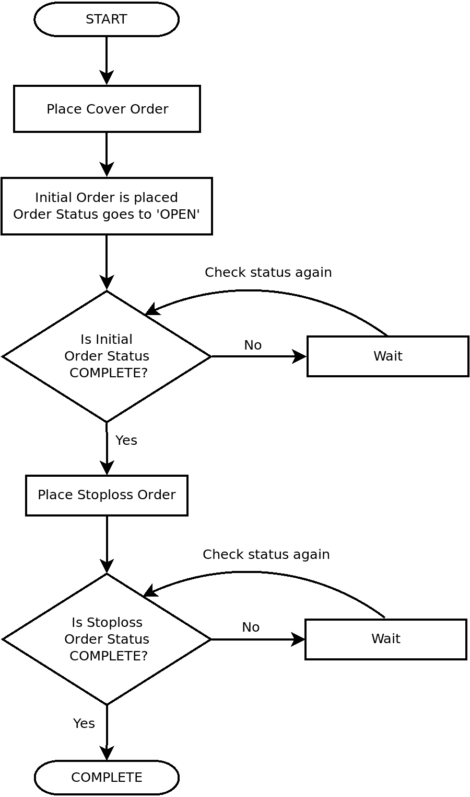

当必须以市价下达覆盖订单时，可以使用覆盖市价订单。

此处方演示了下达以下覆盖市价订单并查询其状态：

+   `BUY`、`COVER`、`INTRADAY`、`MARKET`订单

+   `SELL`、`COVER`、`INTRADAY`、`MARKET`订单

以下是覆盖市价订单的状态机图的参考：

+   **初始订单**：请参考前一章中*下达常规市价订单*处方的状态机图。

+   **止损订单**：请参考前一章中*下达常规止损市价订单*处方的状态机图。

## 准备工作

确保在您的 Python 命名空间中可用`pyalgotrading`包中的`broker_connection`对象和常量。请参考本章的*技术要求*部分设置此对象。

## 如何操作……

我们执行以下步骤进行此处方：

1.  获取金融工具并将其分配给`instrument`：

```py
>>> instrument = broker_connection.get_instrument('NSE', 
                                                  'BANKBARODA')
```

1.  获取最新价格。下达`BUY`、`COVER`、`INTRADAY`、`MARKET`订单并显示订单 ID：

```py
>>> ltp = broker_connection.get_ltp(instrument)
>>> order1_id = broker_connection.place_order(
                    instrument=instrument,
                    order_transaction_type=\
                        BrokerOrderTransactionTypeConstants.BUY,
                    order_type=BrokerOrderTypeConstants.COVER,
                    order_code=BrokerOrderCodeConstants.INTRADAY,
                    order_variety= \
                        BrokerOrderVarietyConstants.MARKET,
                    quantity=1,
                    trigger_price=ltp-1)
>>> order1_id
```

我们得到以下输出（您的输出可能会有所不同）：

```py
'200303003717532'
```

1.  获取并显示订单状态：

```py
>>> broker_connection.get_order_status(order1_id)
```

我们得到以下输出：

```py
'COMPLETE'
```

如果您使用您的凭据登录经纪人网站并转到订单部分，您可以在以下截图中找到您的订单详细信息（您的数据可能会有所不同）：

+   以下截图显示了初始订单：

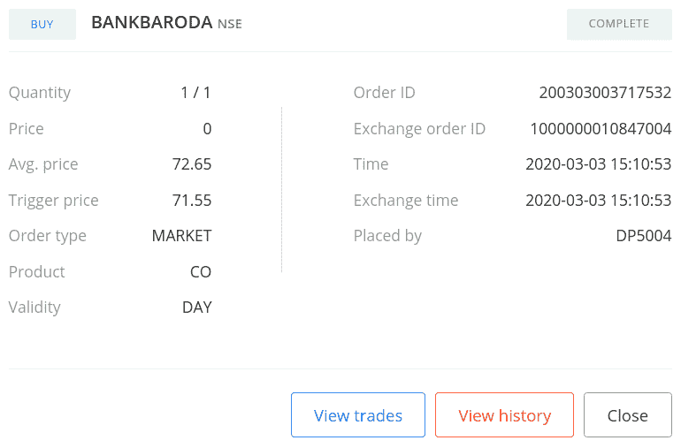

+   以下截图显示了止损订单：

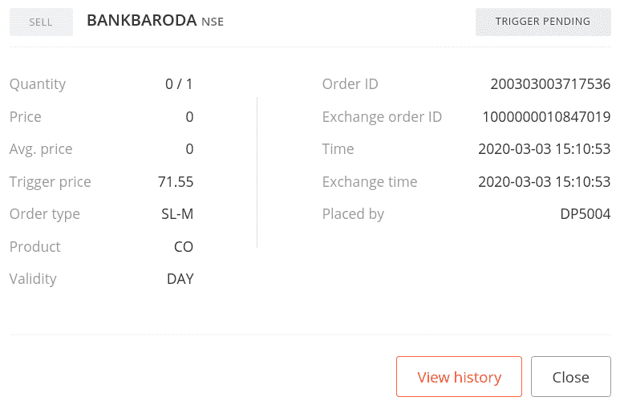

1.  获取最新价格。下达`SELL`、`COVER`、`INTRADAY`、`MARKET`订单并显示订单 ID：

```py
>>> ltp = broker_connection.get_ltp(instrument)
>>> order2_id = broker_connection.place_order(
                    instrument=instrument,
                    order_transaction_type= \
                        BrokerOrderTransactionTypeConstants.SELL,
                    order_type=BrokerOrderTypeConstants.COVER,
                    order_code=BrokerOrderCodeConstants.INTRADAY,
                    order_variety= \
                        BrokerOrderVarietyConstants.MARKET,
                    quantity=1,
                    trigger_price=ltp+1)
>>> order2_id
```

我们得到以下输出（您的输出可能会有所不同）：

```py
'200303003732941'
```

1.  获取并显示订单状态：

```py
>>> broker_connection.get_order_status(order2_id)
```

我们得到以下输出：

```py
'TRIGGER PENDING'
```

如果您使用您的凭据登录到经纪人网站并转到订单部分，您可以在以下截图中找到您的订单详细信息（对于您可能会有些数据不同）：

+   以下截图显示了初始订单：

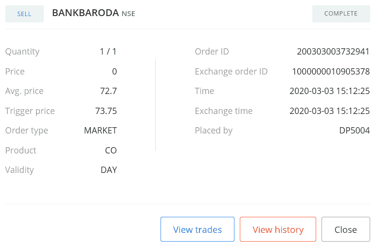

+   以下截图显示了止损订单：

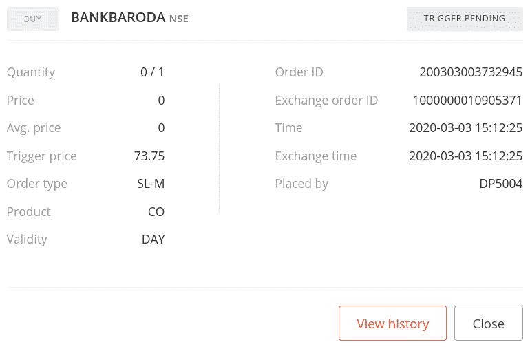

## 工作原理...

在*步骤 1* 中，您使用`BrokerConnectionZerodha`类的`get_instrument()`方法获取一个工具并将其分配给一个新属性`instrument`。此对象是`Instrument`类的一个实例。调用`get_instrument`所需的两个参数是交易所（`'NSE'`）和交易符号（`'BANKBARODA'`）。

在*步骤 2* 中，您使用`BrokerConnectionZerodha`类的`get_ltp()`方法获取工具的最新交易价格（LTP），并将其分配给一个新属性`ltp`。这里将`instrument`对象作为参数传递。接下来，您使用`broker_connection`对象的`place_order()`方法在交易所上下一个`BUY`、`COVER`、`INTRADAY`、`MARKET`订单。`place_order()`方法是经纪人特定的下单 API 的包装器。它接受以下属性：

+   `instrument`：这是必须下单的金融工具，应该是`Instrument`类的一个实例。我们在这里传递了`instrument`。

+   `order_transaction_type`：这是订单交易类型，应该是`BrokerOrderTransactionTypeConstants`类型的枚举。我们在这里传递了`BrokerOrderTransactionTypeConstants.BUY`。

+   `order_type`：这是订单类型，应该是`BrokerOrderTypeConstants`类型的枚举。我们在这里传递了`BrokerOrderTypeConstants.COVER`。

+   `order_code`：这是订单代码，应该是`BrokerOrderCodeConstants`类型的枚举。我们在这里传递了`BrokerOrderCodeConstants.INTRADAY`。

+   `order_variety`：这是订单种类，应该是`BrokerOrderVarietyConstants`类型的枚举。我们在这里传递了`BrokerOrderVarietyConstants.MARKET`。

+   `quantity`：这是要交易的股票数量，应该是正整数。我们在这里传递了`1`。

+   `trigger_price`：这是止损订单的触发价格。我们在这里传递了`ltp-1`，这意味着低于`ltp`一个单位价格。

（传递给`place_order()`方法的属性是经纪人不可知的常量，之前从`pyalgotrading.constants`模块导入。）

在*步骤 2* 中下订单时，您从经纪人那里获得一个订单 ID，将其分配给一个新属性`order1_id`。`order1_id`对象是一个字符串。如果由于某种原因下单失败，则可能不会收到订单 ID。请注意，`trigger_price`参数传递了一个`ltp-1`的值。这意味着止损订单放在市价之下，这是放置卖出止损市价订单的必要条件。

在 *步骤 3* 中，您使用 `broker_connection` 对象的 `get_order_status()` 方法获取下达订单的状态。将 `order1_id` 作为参数传递给 `get_order_status()` 方法。您将订单状态作为字符串 `'COMPLETE'` 立即在此之后，以前述价格下达止损订单。然后，该订单被执行为常规止损-市价订单。

如果止损订单在任何时间点被执行，这意味着您的交易已经产生了损失，但已经保护您免受进一步的损失。止损订单转换为 `'COMPLETE'` 状态，并退出由盖板订单创建的头寸。您也可以通过登录经纪网站并检查订单部分来验证订单成功下达。您应该看到类似于 *步骤 3* 输出中显示的屏幕截图的数据。

以下是有关止损订单执行更多细节的参考：

+   **初始订单**：参考前一章节中 *下达常规市价订单* 配方。

+   **止损订单**：参考前一章节中 *下达常规止损-市价* 配方。

本配方中的其他步骤遵循相同的模式，用于不同属性组合的下单和获取其状态：

+   *步骤 4* 和 *5*：`SELL`、`COVER`、`INTRADAY`、`MARKET` 订单

# 下达盖板限价订单

盖板订单是旨在在交易不利的情况下帮助限制损失的复杂订单。盖板订单实质上是两个常规订单的组合——一个初始订单和一个止损订单，它们一起协同工作以帮助在交易不利时限制损失。

请参考 *下达盖板市价订单* 配方的介绍，深入了解盖板订单的工作原理。如果您想在市场价格下方下达买盖板订单或在市场价格上方下达卖盖板订单，则可以使用盖板限价订单。本配方演示以下盖板限价订单的下达和查询其状态：

+   `BUY`、`COVER`、`INTRADAY`、`LIMIT` 订单

+   `SELL`、`COVER`、`INTRADAY`、`LIMIT` 订单

以下是盖板限价订单状态机图的参考：

+   **初始订单**：参考前一章节中 *下达常规限价订单* 配方的状态机图。

+   **止损订单**：参考前一章节中 *下达常规止损-市价* 配方的状态机图。

## 准备工作

确保 `pyalgotrading` 包中的 `broker_connection` 对象和常量可在您的 Python 命名空间中使用。请参阅本章的 *技术要求* 部分设置此对象。

## 如何执行…

我们对这个配方执行以下步骤：

1.  获取金融工具并将其分配给 `instrument`：

```py
>>> instrument = broker_connection.get_instrument('NSE', 'YESBANK')
```

1.  获取 LTP。下达 `BUY`、`COVER`、`INTRADAY`、`LIMIT` 订单并显示订单 ID：

```py
>>> ltp = broker_connection.get_ltp(instrument)
>>> order1_id = broker_connection.place_order(
                    instrument=instrument,
                    order_transaction_type= \
                        BrokerOrderTransactionTypeConstants.BUY,
                    order_type=BrokerOrderTypeConstants.COVER,
                    order_code=BrokerOrderCodeConstants.INTRADAY,
                    order_variety= \
                        BrokerOrderVarietyConstants.LIMIT,
                    quantity=1,
                    price=ltp-0.5,
                    trigger_price=ltp-1)
>>> order1_id
```

我们得到以下输出：

```py
'200303003749622’
```

1.  获取并显示订单状态：

```py
>>> broker_connection.get_order_status(order1_id)
```

我们得到以下输出：

```py
'OPEN'
```

如果您使用您的凭据登录经纪人网站并转到订单部分，您可以像下面的屏幕截图所示找到您的订单详细信息（您的数据可能会有所不同）：

+   以下屏幕截图显示了初始订单：

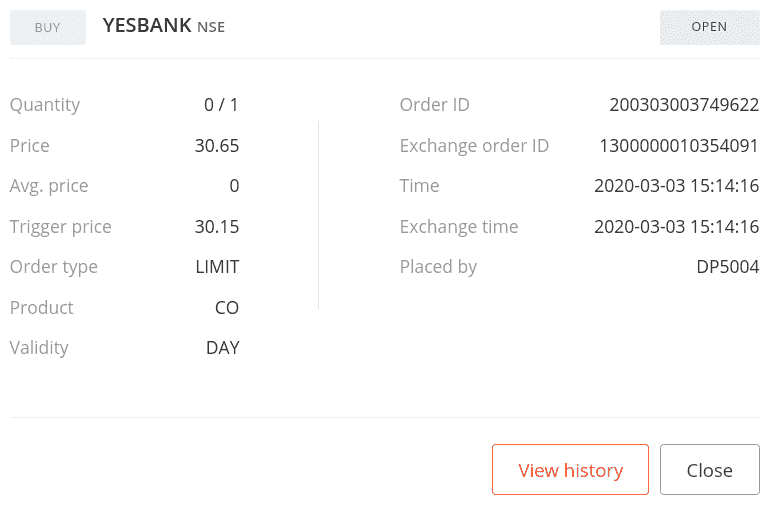

+   以下屏幕截图显示了止损订单：

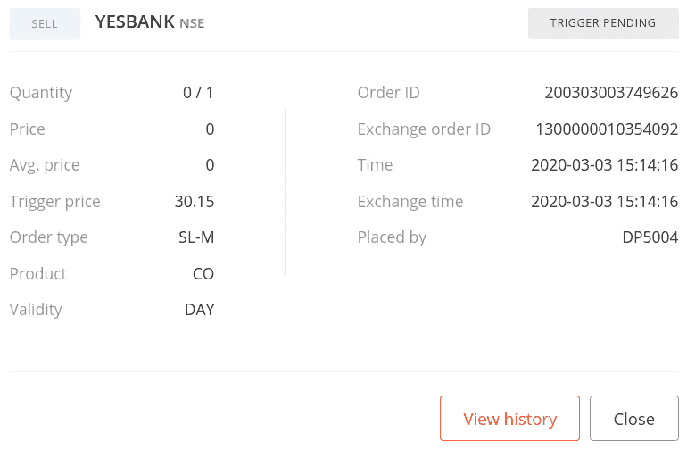

1.  过一段时间后再次获取并显示订单状态：

```py
>>> broker_connection.get_order_status(order1_id)
```

我们得到以下输出：

```py
'COMPLETE'
```

1.  获取 LTP。放置一个`SELL`、`COVER`、`INTRADAY`、`LIMIT`订单并显示订单 ID：

```py
>>> ltp = broker_connection.get_ltp(instrument)
>>> order2_id = broker_connection.place_order(
                    instrument=instrument,
                    order_transaction_type=\
                        BrokerOrderTransactionTypeConstants.SELL,
                    order_type=BrokerOrderTypeConstants.COVER,
                    order_code=BrokerOrderCodeConstants.INTRADAY,
                    order_variety= \
                        BrokerOrderVarietyConstants.LIMIT,
                    quantity=1,
                    price=ltp+0.5,
                    trigger_price=ltp+1)
>>> order2_id
```

我们得到以下输出（您的输出可能会有所不同）：

```py
'200303003751757'
```

1.  获取并显示订单状态：

```py
>>> broker_connection.get_order_status(order2_id)
```

我们得到以下输出：

```py
'OPEN'
```

如果您使用您的凭据登录经纪人网站并转到订单部分，您可以像下面的屏幕截图所示找到您的订单详细信息（您的数据可能会有所不同）：

+   以下屏幕截图显示了初始订单：

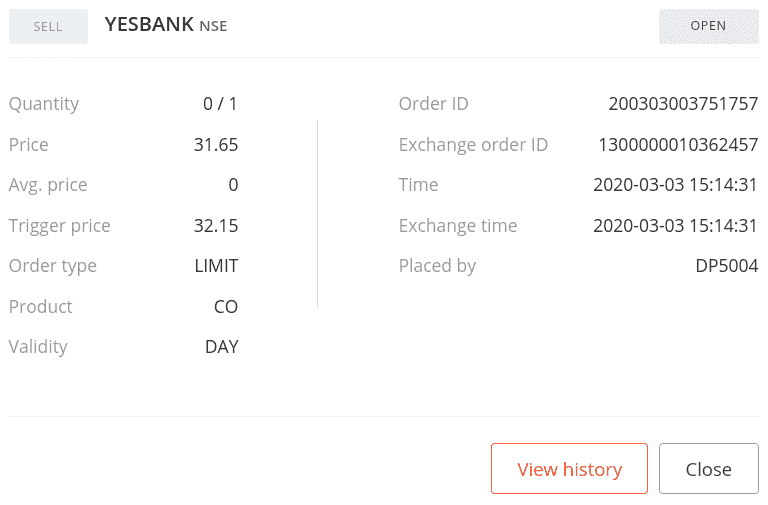

+   以下屏幕截图显示了止损订单：

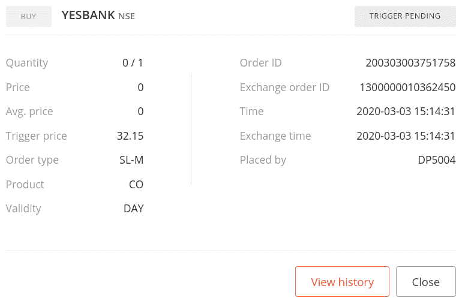

1.  获取并显示订单状态：

```py
>>> broker_connection.get_order_status(order2_id)
```

我们得到以下输出：

```py
'COMPLETE'
```

## 工作原理...

在*步骤 1*中，您使用`BrokerConnectionZerodha`类的`get_instrument()`方法获取一个工具并将其分配给一个新属性，`instrument`。这个对象是`Instrument`类的一个实例。调用`get_instrument`所需的两个参数是交易所（`'NSE'`）和交易符号（`'YESBANK'`）。

在*步骤 2*中，您使用`BrokerConnectionZerodha`类的`get_ltp()`方法获取工具的 LTP，并将其分配给一个新属性，`ltp`。在这里，将`instrument`对象作为参数传递。接下来，您使用`broker_connection`对象的`place_order()`方法在交易所上放置一个`BUY`、`COVER`、`INTRADAY`、`LIMIT`订单。`place_order()`方法是经纪人特定的下单 API 的包装器。它接受以下属性：

+   `instrument`: 这是必须放置订单的金融工具，应该是`Instrument`类的一个实例。我们在这里传递`instrument`。

+   `order_transaction_type`: 这是订单交易类型，应该是类型的枚举，`BrokerOrderTransactionTypeConstants`。我们在这里传递`BrokerOrderTransactionTypeConstants.BUY`。

+   `order_type`: 这是订单类型，应该是类型的枚举，`BrokerOrderTypeConstants`。我们在这里传递`BrokerOrderTypeConstants.COVER`。

+   `order_code`: 这是订单代码，应该是类型的枚举，`BrokerOrderCodeConstants.`。我们在这里传递`BrokerOrderCodeConstants.INTRADAY`。

+   `order_variety`: 这是订单种类，应该是类型的枚举，`BrokerOrderVarietyConstants`。我们在这里传递`BrokerOrderVarietyConstants.LIMIT`。

+   `quantity`: 这是要交易给定工具的股票数量，应该是一个正整数。我们在这里传递`1`。

+   `price`：这是初始订单的限价。我们在这里传递`ltp-0.5`，这意味着低于`ltp` 0.5 单位的价格。

+   `trigger_price`：这是止损订单的触发价格。我们在这里传递`ltp-1`，这意味着低于`ltp`一单位的价格。

（传递给`place_order()`方法的属性是来自`pyalgotrading.constants`模块之前导入的与经纪人无关的常量。）

在*第 2 步*放置订单时，您将从经纪人那里获得一个订单 ID，将其分配给一个新属性`order1_id`。`order1_id`对象是一个字符串。如果由于某种原因订单未成功放置，您可能不会获得订单 ID。请注意，`price`参数被赋予一个值为`ltp-0.5`。这意味着初始订单被放置在市场价格之下，这是放置购买限价订单的必要条件。另请注意，`trigger_price`参数被赋予一个值为`ltp-1`。这意味着止损订单被放置在`price`之下（这将是放置止损订单时的市场价格），这是放置卖出止损市价订单的必要条件。

在*步骤 3*中，您使用`broker_connection`对象的`get_order_status()`方法获取已放置订单的状态。您将`order1_id`作为参数传递给`get_order_status()`方法。您将订单状态获取为`'OPEN'`，一个字符串。您还可以随时使用`order1_id`获取已放置订单的状态。在*步骤 4*中，您再次获取订单状态，如果订单已完成，您将获得订单状态为`'COMPLETE'`。在此之后立即放置止损订单，以前述价格。然后，此订单将作为常规止损市价订单执行。

如果在任何时间点执行了止损订单，这将意味着您的交易已经产生了损失，但是已经保护您免受进一步的损失。止损订单转移到`'COMPLETE'`状态，并且由覆盖订单创建的持仓被退出。您还可以通过登录经纪网站并检查订单部分来验证订单的成功放置。您应该看到类似于*步骤 3*输出中显示的屏幕截图的数据。

下面是关于初始订单和止损订单执行更多细节的参考：

+   **初始订单**：请参阅前一章中的*放置常规限价订单*。

+   **止损订单**：请参阅前一章中的*放置常规止损市价订单*。

此食谱中的其他步骤遵循相同的模式，为不同的属性组合放置订单并获取其状态：

+   *步骤 4*和*5*：`SELL`、`COVER`、`INTRADAY`、`LIMIT`订单
