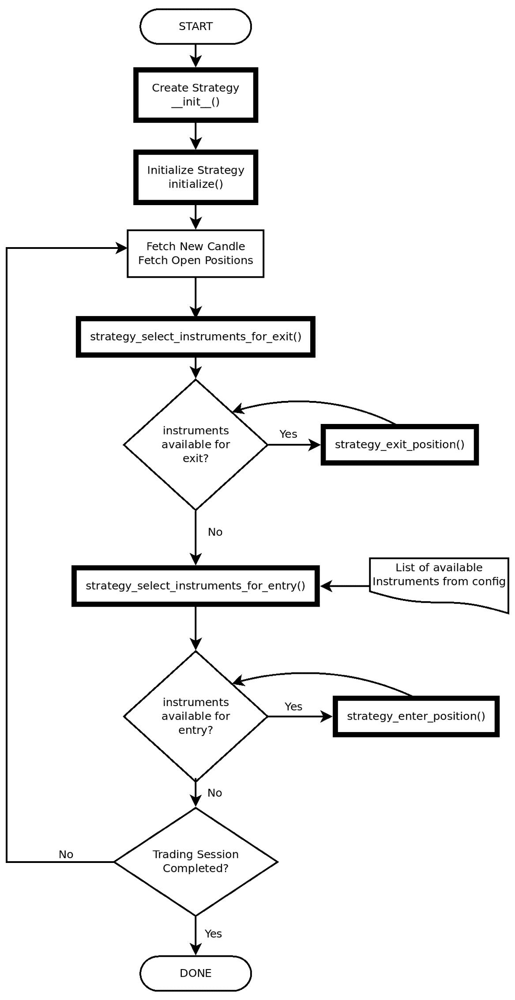

逐步编码算法交易策略

构建自己的算法交易策略是一项复杂的任务。需要一个具有许多组件的交易平台来测试和运行您的策略。其中一些组件包括计算引擎、实时数据源、经纪人连接、交易记录、基金经理、时钟、虚拟订单管理系统等等。

本章将使用由 AlgoBulls 提供的服务，这是一个算法交易平台（[`algobulls.com`](https://algobulls.com)）。该平台提供了一个名为`pyalgotrading`的 Python 包（[`github.com/algobulls/pyalgotrading`](https://github.com/algobulls/pyalgotrading)）。您将通过继承该包中提供的`StrategyBase`抽象类来编写您的策略作为 Python 类。该抽象类充当了以最小的努力快速开发和验证新策略的模板。您可以使用 AlgoBulls 平台来执行您的策略的回测、纸上交易和实盘交易。`pyalgotrading`包帮助我们专注于开发策略，并负责与 AlgoBulls 平台进行通信以执行目的。

本章介绍了两种策略：

+   **EMA-Regular-Order 策略**：该策略基于技术指标指数移动平均线。它使用常规订单。

+   **MACD-Bracket-Order 策略**：该策略基于技术指标移动平均线收敛与发散。它使用括号订单。

最初，您可能会发现策略编码是一项艰巨的任务。因此，编码部分被分为五个步骤。每个步骤演示了`StrategyBase`类强制执行的一个或多个方法。第六个步骤演示了如何将策略上传到 AlgoBulls 平台。

策略的框架如下所示：

```py
class MyCustomStrategy(StrategyBase):
    def __init__(self, *args, **kwargs): # [Recipes 1, 7]
        ...
    def name(): # [Recipes 1, 7]
        …
    def versions_supported(): # [Recipes 1, 7]
        ...
    def initialize(self): # [Recipes 1, 7]
        ...
    def strategy_select_instruments_for_entry(self, candle, 
                                              instruments_bucket):
        … # [Recipes 2, 8]
    def strategy_enter_position(self, candle, instrument, sideband_info):
        … # [Recipes 3, 9]
    def strategy_select_instruments_for_exit(self, candle, 
                                             instruments_bucket):
        … # [Recipes 4, 10]
    def strategy_exit_position(self, candle, instrument, sideband_info):
        … # [Recipes 5, 11]
```

AlgoBulls 核心引擎是推动 AlgoBulls 平台的交易引擎。它负责读取您的策略并对其进行回测、纸上交易和实盘交易执行。AlgoBulls 核心引擎使用以下流程图成功执行您的策略：



本章我们将介绍以下几个步骤：

+   EMA-Regular-Order 策略 – 编写 __init__、initialize、name 和 versions_supported 方法

+   EMA-Regular-Order 策略 – 编写 strategy_select_instruments_for_entry 方法

+   EMA-Regular-Order 策略 – 编写 strategy_enter_position 方法

+   EMA-Regular-Order 策略 – 编写 strategy_select_instruments_for_exit 方法

+   EMA-Regular-Order 策略 – 编写 strategy_exit_position 方法

+   EMA-Regular-Order 策略 – 将策略上传到 AlgoBulls 交易平台

+   MACD-Bracket-Order 策略 – 编写 __init__、initialize、name 和 versions_supported 方法

+   MACD-Bracket-Order 策略 – 编写 strategy_select_instruments_for_entry 方法

+   MACD-Bracket-Order 策略 – 编写 strategy_enter_position 方法

+   MACD-Bracket-Order 策略 – 编写 strategy_select_instruments_for_exit 方法

+   MACD-Bracket-Order 策略 – 编写 strategy_exit_position 方法

+   MACD-Bracket-Order 策略 – 将策略上传到 AlgoBulls 交易平台

# 技术要求

您将需要以下内容来执行本章中的配方：

+   Python 3.7+

+   Python 包：

+   `pyalgotrading` (`$ pip install pyalgotrading`)

+   `pyalgostrategypool` (`$ pip install pyalgostrategypool`)

+   `TA-Lib` (`$ pip install TA-Lib`)

如果在安装 `TA-Lib` 时遇到错误，大多数情况下是由于缺少依赖项。您可以按照以下说明解决问题：

+   **对于 Mac OS X，请使用以下**：

```py
$ brew install ta-lib
```

+   **对于 Windows，请使用以下说明**：

您可以根据您的 Windows 构建（32 位/64 位）和 Python 版本从 [`www.lfd.uci.edu/~gohlke/pythonlibs/#ta-lib`](https://www.lfd.uci.edu/~gohlke/pythonlibs/#ta-lib) 安装最新的 `TA-Lib` 二进制文件。例如，该网站上的此链接 [TA_Lib‑0.4.18‑cp38‑cp38‑win_amd64.whl](https://download.lfd.uci.edu/pythonlibs/w3jqiv8s/TA_Lib-0.4.18-cp39-cp39-win_amd64.whl) 是 `TA-Lib` 版本 0.4.18 (`TA_Lib-0.4.18`) 和 Python 版本 3.8 (`cp38`) 的链接，且适用于 Windows 64 位 (`win_amd64`)。

+   **对于 Linux，请执行以下步骤**：

下载此`gzip`文件—[`prdownloads.sourceforge.net/ta-lib/ta-lib-0.4.0-src.tar.gz`](http://prdownloads.sourceforge.net/ta-lib/ta-lib-0.4.0-src.tar.gz)—并从您的 Linux 终端运行以下命令：

1.  提取下载的包含 `TA-Lib` 源代码的 `gzip` 文件：

```py
$ tar -xzf ta-lib-0.4.0-src.tar.gz
```

1.  将当前工作目录更改为提取的文件夹：

```py
$ cd ta-lib/
```

1.  运行`configure`命令以配置 `TA-Lib` 适合您的计算机：

```py
$ ./configure --prefix=/usr
```

1.  运行`make`命令以从下载的源代码构建 `TA-Lib`：

```py
$ make
```

1.  运行`install`命令以将构建的可执行文件和库安装到您的计算机上的特定目录：

```py
$ sudo make install 
```

如果这不起作用并且您仍然遇到错误，请参考官方 `TA-Lib` GitHub 页面 [`github.com/mrjbq7/ta-lib#dependencies`](https://github.com/mrjbq7/ta-lib#dependencies)。本章的最新 Jupyter 笔记本可以在 GitHub 上找到 [`github.com/PacktPublishing/Python-Algorithmic-Trading-Cookbook/tree/master/Chapter08`](https://github.com/PacktPublishing/Python-Algorithmic-Trading-Cookbook/tree/master/Chapter08)。

以下代码将帮助您导入本章中所有配方使用的必要模块。请确保在尝试任何配方之前已执行此步骤：

```py
>>> from pyalgotrading.strategy.strategy_base import StrategyBase
>>> from pyalgotrading.constants import *
```

在前五个配方中，您将基于 EMA 技术指标创建一个完整的算法交易策略。此策略称为 **EMA-Regular-Order** 策略，并描述如下：

+   **技术指标**：

+   `EMA(timeperiod=4)` 或 `EMA4`

+   `EMA(timeperiod=9)` 或 `EMA9`

虽然时间周期的典型值为`4`和`9`，但两个时间周期都作为参数，因此可以在运行时进行更改，而无需重新创建策略。这在本章的第一个配方中进行了更多讨论。

+   **订单属性**：

+   订单交易类型：`BUY`和`SELL`

+   订单类型：`Regular`

+   订单代码：`INTRADAY`

+   订单品种：`Market`

+   **策略算法**：

+   每当`EMA4`向上穿越`EMA9`时，请注意以下内容：

+   如果有的话，应退出之前的`SHORT`头寸。

+   策略生成了一个`BUY`信号，应输入一个新的`LONG`头寸。

+   每当`EMA4`向下穿越`EMA9`时，请注意以下内容：

+   如果有的话，应退出之前的`LONG`头寸。

+   策略生成了一个`SELL`信号，应输入一个新的`SHORT`头寸。

您将把整个逻辑编码为一个名为`StrategyEMARegularOrder`的 Python 类。这个类将是`pyalgotrading`包中`StrategyBase`的子类。在 AlgoBulls 平台上上传`StrategyEMARegularOrder`后，您可以在该策略上进行回测（参考第九章的前六个配方，*回测策略*）、模拟交易（参考第十章的前五个配方，*模拟交易*）和实际交易（参考第十一章的前五个配方，*实际交易*）。

在第七至第十一个配方中，您将基于 MACD 技术指标创建一个完整的算法交易策略。这个策略称为**MACD-Bracket-Order**策略，描述如下：

+   **技术指标**：

+   MACD：这个技术指标有三个组成部分：MACD 线、MACD 信号和 MACD 柱状图。对于这个策略，我们只关注 MACD 线和 MACD 信号组件。

+   **订单属性**：

+   订单交易类型：`BUY`和`SELL`

+   订单类型：`Bracket`

+   订单代码：`INTRADAY`

+   订单品种：`Limit`

+   **策略算法**：

+   每当 MACD 线向上穿越 MACD 信号时，请注意以下内容：

+   如果有的话，应退出之前的`SHORT`头寸。

+   策略生成了一个`BUY`信号，应输入一个新的`LONG`头寸。

+   每当 MACD 线向下穿越 MACD 信号时，请注意以下内容：

+   如果有的话，应退出之前的`LONG`头寸。

+   策略生成了一个`SELL`信号，应输入一个新的`SHORT`头寸。

您将把整个逻辑编码为一个名为`StrategyMACDBracketOrder`的 Python 类。这个类将是`pyalgotrading`包中`StrategyBase`的子类。在 AlgoBulls 平台上上传`StrategyMACDBracketOrder`后，您可以对这个策略进行回测（参见第九章的第七到第十二个食谱，《算法交易 - 回测》）, 模拟交易（参见第十章的第七到第十二个食谱，《算法交易 - 模拟交易》）和真实交易（参见第十一章的第七到第十一个食谱，《算法交易 - 真实交易》）。

有关这些主题的更多信息，请参阅以下对应章节：

+   **技术指标**：第五章，《计算和绘制技术指标》

+   **订单属性**：第六章，《在交易所上下常规订单》和第七章，《在交易所上下 Bracket 和 Cover Orders》。

您需要在 AlgoBulls 平台（[`algobulls.com`](https://algobulls.com)）上设置您的帐户以获取 API 令牌。设置帐户是免费的。根据您的使用情况，使用其服务可能会产生费用。您可以从该网站上的免费套餐开始。更多细节请参考*附录 II*。

# EMA-Regular-Order strategy – 编写 __init__、initialize、name 和 versions_supported 方法

这个示例演示了`StrategyEMARegularOrder`类的初始编码。完整的类将在本章的*EMA-Regular-Order strategy – coding the strategy_exit_position method*食谱结束时编码完成。在这个示例中，您将编写以下方法：

+   `__init__()`

+   `initialize()`

+   `name()`

+   `versions_supported()`

要了解更多关于 EMA 技术指标的信息，请参阅第五章的*Trend indicator – exponential moving average*食谱，《计算和绘制技术指标》。

请参考本章介绍中的流程图，了解 AlgoBulls 核心引擎在策略执行过程中如何调用`__init__()`和`initialize()`方法。 

## 准备工作

确保您的 Python 命名空间中有`StrategyBase`和`pyalgotrading`常量。请参考本章的*技术要求*部分进行设置。

## 怎么做…

创建一个名为`StrategyEMARegularOrder`的新类，它将是`StrategyBase`的子类，然后定义所需的四种方法：

```py
class StrategyEMARegularOrder(StrategyBase):
    def __init__(self, *args, **kwargs):
        super().__init__(*args, **kwargs)
        self.timeperiod1 = self.strategy_parameters['timeperiod1']
        self.timeperiod2 = self.strategy_parameters['timeperiod2']
        self.main_order = None
    def initialize(self):
        self.main_order = {}
    @staticmethod
    def name():
        return 'EMA Regular Order Strategy'
    @staticmethod
    def versions_supported():
        return AlgoBullsEngineVersion.VERSION_3_2_0
```

## 工作原理…

在这个示例中，我们创建了`StrategyEMARegularOrder`类，它是从`StrategyBase`派生的子类。我们为这个类定义了四种方法，并描述如下：

+   `__init__()` 方法：这是创建新策略时要做的第一件事情。首先，你需要创建这个方法，并使用`super()`调用父类的`__init__()`方法。这有助于 AlgoBulls 核心引擎创建进一步开发策略所需的必要数据结构。接下来，你从`self.strategy_parameters`中创建两个新属性——`self.timeperiod1`和`self.timeperiod2`。`self.strategy_parameters`是从`StrategyBase`派生的每个策略子类都可用的字典对象。（第八章的第二个配方讨论了这些值如何在运行时传递给`self.strategy_parameters`。）你将使用这些参数作为下一个配方中两个 EMA 的时间段。

最后，你创建一个新属性，`self.main_order`，它是一个空字典。我们将用它来保存在执行此策略期间放置的所有未完成订单的句柄。

+   `initialize()` 方法：这个方法在每个交易日的开头被调用，用于将任何内部变量初始化为它们的默认状态。对于实际交易和模拟交易，这个方法只调用一次。对于多日回测，这个方法会被多次调用，在每个新的交易日的开头调用一次。在这个方法中，你将`self.main_order`初始化为空字典。

+   `name()` 方法：这是一个静态方法，返回此策略的名称。在使用此策略进行回测、模拟交易和实际交易时会用到。在这个方法中，你只需返回一个字符串，`指数移动平均线常规委托`。你可以返回任何你选择的字符串。

+   `versions_supported()` 方法：这个静态方法用于返回创建此策略的 AlgoBulls 核心引擎版本。通常情况下，随着 AlgoBulls 核心引擎的新升级，可能会引入一些不兼容的变化。这个方法有助于确保此策略始终在正确的 AlgoBulls 核心引擎版本上运行。在这个方法中，你需要从常量模块中返回最高可用版本，目前写这一章时的版本是 VERSION_3_2_0。

这四个方法是强制性的；它们由`StrategyBase`基类强制执行，不能被跳过。

# EMA-Regular-Order 策略 - 编写 strategy_select_instruments_for_entry 方法

在本配方中，你将继续编写`StrategyEMARegularOrder`类。在这里，你将编写`strategy_select_instruments_for_entry()`方法，这是由`StrategyBase`基类强制执行的强制性方法。AlgoBulls 核心引擎会在每个新的蜡烛上调用此方法，用于回测、模拟交易和实际交易服务。

请参考本章介绍中的流程图，了解 AlgoBulls 核心引擎在策略执行期间如何调用`strategy_select_instruments_for_entry()`方法。

## 准备工作

确保您在开始此配方之前已经按照前面的配方创建了`StrategyEMARegularOrder`类。

## 如何做…

继续编写`StrategyEMARegularOrder`类。我们需要定义两个新方法——一个用于获取 MACD 线和 MACD 历史信号之间的交叉值，另一个用于根据计算的交叉值从`instruments_bucket`中选择金融工具以进入新仓位：

```py
class StrategyEMARegularOrder(StrategyBase):
    # Previous methods not shown
    def get_crossover_value(self, instrument):
        hist_data = self.get_historical_data(instrument)
        ema_x = talib.EMA(hist_data['close'], timeperiod=self.timeperiod1)
        ema_y = talib.EMA(hist_data['close'], timeperiod=self.timeperiod2)
        crossover_value = self.utils.crossover(ema_x, ema_y)
        return crossover_value
    def strategy_select_instruments_for_entry(self, candle,
                                              instruments_bucket):
        selected_instruments_bucket = []
        sideband_info_bucket = []
        for instrument in instruments_bucket:
            crossover_value = self.get_crossover_value(instrument)
            if crossover_value == 1:
                selected_instruments_bucket.append(instrument)
                sideband_info_bucket.append({'action': 'BUY'})
            elif crossover_value == -1:
                if self.strategy_mode is StrategyMode.INTRADAY:
                    selected_instruments_bucket.append(instrument)
                    sideband_info_bucket.append({'action': 'SELL'})
        return selected_instruments_bucket, sideband_info_bucket
```

## 工作原理…

在这个配方中，我们继续编写`StrategyEMARegularOrder`类的代码。我们为这个类定义了两个新方法，描述如下：

+   `get_crossover_value()`方法：这个方法以`instrument`作为参数（以及`self`）。这是需要计算交叉值的金融工具。您使用`self.get_historical_data()`方法获取最新的历史数据，并将其赋值给一个新属性`hist_data`。我们将`instrument`作为这个方法的参数。`hist_data`属性是一个`pandas.DataFrame`对象，具有`timestamp`、`open`、`high`、`low`、`close`和`volume`列。获取的历史数据的默认持续时间是最近的 15 天。

您使用`talib.EMA`函数在`hist_data`的收盘价上计算 EMA，时间周期为`self.timeperiod1`，并将其赋值给`ema_x`。这个数据是一个`pandas.Series`对象。（更多关于 EMA 计算的细节，请参考第五章的第二个配方，*计算和绘制技术指标*。）类似地，您使用`self.timeperiod2`的时间周期在`hist_data`的收盘价上计算 EMA，并将其赋值给`ema_y`。这个返回数据也是一个`pandas.Series`对象。

您使用`self.utils.crossover(ema_x, ema_y)`计算`ema_x`和`ema_y`之间的交叉值，并将其赋值给一个新属性`crossover_value`。`crossover()`函数调用如下：

+   它以两个可迭代对象作为输入。我们在这里传递`ema_x`和`ema_y`。

+   如果`ema_x`向上穿越`ema_y`，交叉函数返回`1`。

+   如果`ema_x`向下穿越`ema_y`，交叉函数返回`-1`。

+   如果`ema_x`和`ema_y`之间没有交叉，则交叉函数返回`0`。

最后，您返回`crossover_value`。

+   `strategy_select_instruments_for_entry()`方法：这个方法除了`self`之外，还接受两个参数——`candle`，`CandleTime`类型的对象，其中包含当前蜡烛的时间戳，以及`instruments_bucket`，`SetInstruments`类型的对象，其中包含用于创建新仓位的所有金融工具。我们在策略执行时传递这些数据。您创建两个空列表，`selected_instruments_bucket`和`sideband_info_bucket`。然后您在`instruments_bucket`上运行一个`for`循环，并且对于每个金融工具，您调用`self.get_crossover_value()`并将其值保存到一个新属性`crossover_value`。根据`crossover_value`的值，您做出决定，如下所示：

+   如果`crossover_value`为`1`，这意味着策略正在发出`BUY`信号。你需要执行以下操作：

+   将`instrument`附加到`selected_instruments_bucket`。

+   向`sideband_info_bucket`属性附加一个`{'action': 'BUY'}`字典。

+   如果`crossover_value`为`-1`，这意味着策略正在发出`SELL`信号。你需要执行以下操作：

+   将`instrument`附加到`selected_instruments_bucket`。

+   向`sideband_info_bucket`属性附加一个`{'action': 'SELL'}`字典。

+   如果`crossover_value`既不是`1`也不是`-1`，这意味着策略没有发出任何信号。在这里你什么也不做。

最后，你需要返回两个属性：`selected_instruments_bucket`和`sideband_info_bucket`。这些属性可能已经被填充，也可能保持为空列表。

请回忆`strategy_select_instruments_for_entry()`方法是为每个蜡烛调用的，因此前面的步骤会针对每个新蜡烛重复执行。在适当的蜡烛中，你会得到一个`BUY`或`SELL`信号，而在其他蜡烛中，你将不会得到任何信号。根据信号，你可以下达适当的订单，这将在下一个示例中讨论。

`strategy_select_instruments_for_entry()`方法是由`StrategyBase`基类强制执行的，每个策略都必须定义该方法。

`get_crossover_value()`方法是一个辅助方法，意味着它不受`StrategyBase`基类的强制。你可以选择不定义这个方法，或者定义多个这样的辅助函数。

# EMA-Regular-Order 策略 - 编写 strategy_enter_position 方法

在这个示例中，你将继续编写`StrategyEMARegularOrder`类的代码。在这里，你将编写`strategy_enter_position()`方法，这是`StrategyBase`基类强制执行的一个必需方法。这个方法由 AlgoBulls 核心引擎在每次`strategy_select_instruments_for_entry`方法返回非空数据时调用。这个方法在回测、模拟交易和实际交易服务中可能不会为每个新蜡烛调用。

请参考本章介绍中的流程图，了解 AlgoBulls 核心引擎在策略执行期间如何调用`strategy_enter_position()`方法。

## 准备就绪

确保在开始本示例之前已经按照前面的示例操作。

## 如何操作...

继续编写`StrategyEMARegularOrder`类的代码。我们需要定义一个方法为给定的工具打新订单并进入一个新的头寸：

```py
class StrategyEMARegularOrder(StrategyBase):
    # Previous methods not shown
    def strategy_enter_position(self, candle, instrument, sideband_info):
        if sideband_info['action'] == 'BUY':
            qty = self.number_of_lots * instrument.lot_size
            self.main_order[instrument] = \
                self.broker.BuyOrderRegular(instrument=instrument,
                          order_code=BrokerOrderCodeConstants.INTRADAY,
                          order_variety=BrokerOrderVarietyConstants.MARKET,
                          quantity=qty)
        elif sideband_info['action'] == 'SELL':
            qty = self.number_of_lots * instrument.lot_size
            self.main_order[instrument] = \
                self.broker.SellOrderRegular(instrument=instrument,
                          order_code=BrokerOrderCodeConstants.INTRADAY,
                          order_variety=BrokerOrderVarietyConstants.MARKET,
                          quantity=qty)
        else:
            raise SystemExit(f'Got invalid sideband_info value: 
                              {sideband_info}')
        return self.main_order[instrument]
```

## 工作原理...

在本示例中，我们将继续编写`StrategyEMARegularOrder`类的代码。我们为该类定义了一个新方法，`strategy_enter_position()`，如下所述：

+   此方法除了`self`之外还接受三个参数：

+   `candle`：包含当前蜡烛时间戳的`CandleTime`类型的对象。

+   `instrument`：代表金融工具的`Instrument`类型的对象。

+   `sideband_info`：一个字典对象，保存了与`instrument`属性相关的交易信息。这个对象看起来像`{'action': [action_value]}`，其中`[action_value]`可以是`'BUY'`或`'SELL'`。

+   通过将`self.number_of_lots`与`instrument.lot_size`相乘，并将结果赋值给一个新属性`qty`来计算下单数量。`self.number_of_lots`属性保存了交易的手数信息，你可以在执行这个策略时传递它。`instrument.lot_size`属性保存了`instrument`的手数大小，它是一个正整数。例如，如果手数数为 2，而 instrument 的手数大小为 10，那么订单的数量将是 2 * 10 = 20。

+   如果`sideband_info`是`{'action': 'BUY'}`，则通过创建`self.broker.BuyOrderRegular`类的实例（第六章的第一个配方，*在交易所上放置常规订单*）并将其值赋给`self.main_order[instrument]`，来下达`BUY`交易类型的`Regular`订单。

+   如果`sideband_info`是`{'action': 'SELL'}`，则通过创建`self.broker.SellOrderRegular`类的实例（第六章的第一个配方，*在交易所上放置常规订单*）并将其值赋给`self.main_order[instrument]`，来下达`SELL`交易类型的`Regular`订单。

在这两种情况下，`self.main_order`字典对象将`instrument`和`order`实例作为键值对保存。这将在稍后（在*EMA-Regular-Order 策略 - 编写 strategy_exit_position 方法*配方中）对通过此方法创建的头寸进行退出时非常有用。

`self.broker`属性在运行时由 AlgoBulls 核心引擎替换为适当的经纪人实例。因此，相同的代码可以在 AlgoBulls 平台支持的所有经纪人上运行。

# EMA-Regular-Order 策略 - 编写 strategy_select_instruments_for_exit 方法

在这个配方中，你将继续编写`StrategyEMARegularOrder`类的代码。在这里，你编写`strategy_select_instruments_for_exit()`方法，这是`StrategyBase`基类强制执行的一个必需方法。如果有任何未平仓头寸，AlgoBulls 核心引擎将为每个新的蜡烛进行回测、纸上交易和真实交易服务调用此方法。

请参考本章介绍中的流程图，了解 AlgoBulls 核心引擎在策略执行期间如何调用`strategy_select_instruments_for_exit()`方法。

## 准备工作

在开始本配方之前，请确保您已经按照前面的配方进行了操作。

## 如何做...

继续编写`StrategyEMARegularOrder`类。我们需要定义一个新的方法，根据交叉值的计算从`instruments_bucket`中选择工具以退出现有头寸：

```py
class StrategyEMARegularOrder(StrategyBase):
    # Previous methods not shown
    def strategy_select_instruments_for_exit(self, candle, 
                                             instruments_bucket):
        selected_instruments_bucket = []
        sideband_info_bucket = []
        for instrument in instruments_bucket:
            if self.main_order.get(instrument) is not None:
                crossover_value = self.get_crossover_value(instrument)
                if crossover_value in [1, -1]:
                    selected_instruments_bucket.append(instrument)
                    sideband_info_bucket.append({'action': 'EXIT'})
        return selected_instruments_bucket, sideband_info_bucket
```

## 它是如何工作的...

在本配方中，我们继续编写`StrategyEMARegularOrder`类。我们为此类定义一个新方法，`strategy_select_instruments_for_exit()`，如下所述：

+   除了`self`之外，此方法还接受两个参数：

+   `candle`：`CandleTime`类型的对象，包含当前蜡烛的时间戳。

+   `instruments_bucket`：`SetInstruments`类型的对象。该对象保存了之前通过`strategy_enter_position()`方法输入仓位的金融工具。

+   创建两个空列表，`selected_instruments_bucket`和`sideband_info_bucket`。

+   对`instruments_bucket`进行`for`循环。对于每个工具，使用`'if self.main_order.get(instrument) is not None:'`行检查是否已输入给定工具的仓位。只有在已存在仓位的情况下才继续。

+   您调用`self.get_crossover_value()`并将其值保存到一个新属性`crossover_value`中。根据`crossover_value`的值，您做出决定，如下所示：

+   如果`crossover_value`为`1`或`-1`，则表示发生了交叉。你执行以下操作：

+   将`instrument`属性追加到`selected_instruments_bucket`。

+   将`{'action': 'EXIT'}`字典追加到`sideband_info_bucket`属性。

+   如果`crossover_value`既不是`1`也不是`-1`，则表示策略未发出任何信号。这里不做任何操作。

+   最后，您返回两个属性：`selected_instruments_bucket`和`sideband_info_bucket`。这些属性可能已填充，也可能保持为空列表。

请记住，`strategy_select_instruments_for_exit()`方法将针对每个蜡烛调用，因此前述步骤将针对每个新蜡烛重复。在适当的蜡烛中，如果存在仓位，您可能会收到`EXIT`信号，在其他情况下，您将不会收到任何信号。根据信号，您可以通过放置适当的订单退出仓位，这将在下一个配方中讨论。

# EMA-Regular-Order 策略 - 编写`strategy_exit_position`方法

在本配方中，您将继续编写`StrategyEMARegularOrder`类的代码。在这里，您将编写`strategy_exit_position()`方法，这是`StrategyBase`基类强制执行的最后一个必需方法。此方法由 AlgoBulls 核心引擎在每次`strategy_select_instruments_for_exit`方法返回非空数据时调用。完成本配方后，您将完成编写`StrategyEMARegularOrder`类。

请参考本章介绍中的流程图，了解 AlgoBulls 核心引擎在策略执行期间如何调用`strategy_select_instruments_for_exit()`方法。

## 准备就绪

在开始本配方之前，请确保您已按照上一个配方进行了操作。

## 如何做…

继续编写`StrategyEMARegularOrder`类。为给定工具基于`sideband_info`定义一个退出仓位的方法：

```py
class StrategyEMARegularOrder(StrategyBase):
    # Previous methods not shown
    def strategy_exit_position(self, candle, instrument, sideband_info):
        if sideband_info['action'] == 'EXIT':
            self.main_order[instrument].exit_position()
            self.main_order[instrument] = None
            return True
        return False

```

## 工作原理…

在此示例中，我们继续编写`StrategyEMARegularOrder`类。我们为此类定义一个新方法，`strategy_exit_position()`，如下所述：

+   此方法除了`self`之外还接受三个参数：

+   `candle`：一个包含当前蜡烛时间戳的`CandleTime`类型的对象。

+   `instrument`：一个表示金融工具的`Instrument`类型的对象。

+   `sideband_info`：一个包含有关要为`instrument`属性放置交易的信息的字典对象。此对象类似于`{'action': 'EXIT'}`。

+   如果`sideband_info`是`{'action': 'EXIT'}`，则执行以下操作：

+   您使用`self.main_order[instrument]`获取订单（请回想一下，`self.main_order`是一个将工具和相应订单实例作为键值对保存的字典）。

+   您通过调用其`exit_position()`方法退出此订单的持仓。

+   您将`self.main_order`中对应于键`instrument`的值重置为`None`。这表明不再存在与`instrument`相对应的持仓。

+   返回`True`，向 AlgoBulls 核心引擎表明此次调用中已经退出了`instrument`的持仓。

+   如果`sideband_info`不是`{'action': 'EXIT'}`，则返回`False`，向 AlgoBulls 核心引擎表明在此调用中未退出`instrument`的持仓。

`self.broker` 属性会在 AlgoBulls 核心引擎运行时被适当的经纪人实例替换。因此，相同的代码可以在 AlgoBulls 平台支持的所有经纪人上运行。

您现在已经完成了`StrategyEMARegularOrder`类的编码。

# EMA-Regular-Order 策略 – 在 AlgoBulls 交易平台上上传策略

在此示例中，您将在 AlgoBulls 交易平台上上传策略类`StrategyEMARegularOrder`，该类是您在前面的示例中创建的。一旦上传完成，您可以在相同的代码库上进行回测、模拟交易和真实交易。

## 准备就绪

确保您已在 AlgoBulls 平台（[`algobulls.com`](https://algobulls.com)）上设置了您的帐户以获取您的 API 令牌。设置帐户是免费的。使用其服务可能会产生费用，具体取决于您的使用情况。您可以从网站上的免费套餐开始。有关更多详细信息，请参阅*附录 II*。 

## 如何执行…

我们为此示例执行以下步骤：

1.  导入必要的模块：

```py
>>> import inspect
>>> from pyalgotrading.algobulls import AlgoBullsConnection
>>> from pyalgostrategypool.strategy_ema_regular_order import StrategyEMARegularOrder
```

1.  创建一个新的 AlgoBulls 连接对象：

```py
>>> algobulls_connection = AlgoBullsConnection()
```

1.  获取授权 URL：

```py
>>> algobulls_connection.get_authorization_url()
```

我们得到以下输出：

```py
Please login to this URL with your AlgoBulls credentials and get your developer access token: https://app.algobulls.com/user/login
'https://app.algobulls.com/user/login'
```

1.  使用您的 AlgoBulls 凭据登录到上述链接，获取您的令牌，并在此处设置它（有关更多详细信息，请参阅*附录 II*）：

```py
>>> algobulls_connection.set_access_token('80b7a69b168c5b3f15d56688841a8f2da5e2ab2c')
```

1.  在上传策略之前，您可以检查您的策略代码，以确保您上传了正确的策略：

```py
>>> print(inspect.getsource(StrategyEMARegularOrder))
```

我们得到以下输出：

```py
class StrategyEMARegularOrder(StrategyBase):

    def __init__(self, *args, **kwargs):
        super().__init__(*args, **kwargs)

        self.timeperiod1 = self.strategy_parameters['timeperiod1']
        self.timeperiod2 = self.strategy_parameters['timeperiod2']

        self.main_order = None

    def initialize(self):
        self.main_order = {}

    @staticmethod
    def name():
        return 'EMA Regular Order Strategy'
    ...
    def strategy_exit_position(self, candle, instrument, 
                               sideband_info):
        if sideband_info['action'] == 'EXIT':
            self.main_order[instrument].exit_position()
            self.main_order[instrument] = None
            return True
        return False
```

这里没有显示完整的输出。请访问以下链接以阅读完整的输出：

[`github.com/algobulls/pyalgostrategypool/blob/master/pyalgostrategypool/strategy_ema_regular_order.py`](https://github.com/algobulls/pyalgostrategypool/blob/master/pyalgostrategypool/strategy_ema_regular_order.py)。

1.  将`StrategyEMARegularOrder`上传到 AlgoBulls 平台。 这将为您的 AlgoBulls 帐户创建一个新策略：

```py
>>> algobulls_connection.create_strategy(StrategyEMARegularOrder)
```

我们获得以下输出（您的输出可能会有所不同）：

```py
Validating Strategy...
{'details': `'strategy_code': '49287246f9704bbcbad76ade9e2091d9'}
```

## 工作原理如下...

我们在*步骤 1*中导入所需的模块。 在*步骤 2*中，创建了`AlgoBullsConnection`类的实例，命名为`algobulls_connection`。 在*步骤 3*中，使用`algobulls_connection`对象的`get_authorization_url()`方法获取授权 URL。 您应该从 Web 浏览器访问此 URL 以登录到 AlgoBulls 平台并获取您的开发者访问令牌。 （您可以在 AlgoBulls 平台上的*附录 II*中找到有关从 AlgoBulls 平台获取开发者访问令牌的详细信息和截图。） 您复制访问令牌并在*步骤 4*中使用`algobulls_connection`的`set_access_token()`方法设置它。 如果令牌被接受，则与 AlgoBulls 平台建立了成功的连接。

我们在*步骤 1*到*5*中编写的`StrategyEMARegularOrder`策略类也在`pyalgostrategypool`包中可用。 我们在*步骤 1*中导入此类。 或者，您也可以将您的策略类保存在单独的 Python 模块中，并在*步骤 1*中导入它，而不是从`pyalgostrategypool`导入它。

您使用`algobulls_connection`的`upload_strategy()`方法将`StrategyEMARegularOrder`策略类作为参数上传。 如果上传成功，您将收到带有`strategy_code`的成功消息，这是一个唯一的字符串。 `strategy_code`可以稍后用于执行与策略相关的所有操作，例如编辑策略，执行回测（第九章，*算法交易 - 回测*），执行模拟交易（第十章，*算法交易 - 模拟交易*），以及执行实际交易（第十一章，*算法交易 - 实际交易*）。

## 还有更多...

如果在上传后对策略进行了更改，您可以使用`algobulls_connection`的`upload_strategy()`方法将更新后的类和`overwrite=True`作为参数更新 AlgoBulls 平台上的策略。 如果更改成功上传，您将收到成功消息。

修改已上传的策略：

```py
>>> algobulls_connection.create_strategy(StrategyEMARegularOrder, 
                                         overwrite=True)
```

我们获得以下输出：

```py
Validating Strategy…
{'details': 'success'}
```

AlgoBulls 平台不允许具有相同名称（由`name()`方法返回）的多个策略。 如果存在具有相同名称的现有策略，则`overwrite=True`参数将更新该策略。 如果未将`overwrite=True`传递给`create_strategy()`方法，则默认值为`False`，这意味着它尝试在 AlgoBulls 平台上创建一个新策略。

# MACD-Bracket-Order 策略 – 编码 `__init__`、`initialize`、`name` 和 `versions_supported` 方法  

本配方演示了 `StrategyMACDBracketOrder` 类的初始编码。完整的类将在本章的第十一个配方结束时编码。在本配方中，您将编写以下方法：  

+   `__init__()`  

+   `initialize()`  

+   `name()`  

+   `versions_supported()`  

要了解更多关于 MACD 技术指标的信息，请参考 Chapter 5 中的*Trend indicator – moving average convergence divergence*配方，*计算和绘制技术指标*。  

请参考本章介绍中的流程图，了解 AlgoBulls 核心引擎在策略执行过程中如何调用 `__init__()` 和 `initialize()` 方法。  

## 准备工作  

确保你的 Python 命名空间中有 `StrategyBase` 和 `pyalgotrading` 常量。请参考本章的*技术要求*部分进行设置。  

## 如何做…  

创建一个名为 `StrategyMACDBracketOrder` 的新类。从 `StrategyBase` 派生它。定义所需的四种方法：  

```py
class StrategyMACDBracketOrder(StrategyBase):

    def __init__(self, *args, **kwargs):
        super().__init__(*args, **kwargs)

        self.fastMA_period = self.strategy_parameters['fastma_period']
        self.slowMA_period = self.strategy_parameters['slowma_period']
        self.signal_period = self.strategy_parameters['signal_period']
        self.stoploss = self.strategy_parameters['stoploss_trigger']
        self.target = self.strategy_parameters['target_trigger']
        self.trailing_stoploss = \
                      self.strategy_parameters['trailing_stoploss_trigger']

        self.main_order = None

    def initialize(self):
        self.main_order = {}

    @staticmethod
    def name():
        return 'MACD Bracket Order Strategy'
    @staticmethod
    def versions_supported():
        return VERSION_3_2_0
```

## 工作原理…  

在本配方中，我们将创建 `StrategyEMARegularOrder` 类，它是从 `StrategyBase` 派生的子类。我们将为该类定义四种方法，如下所述：  

+   `__init__()` 方法：这是创建新策略时的第一步。首先，您创建此方法并使用 `super()` 调用父类 `__init__()` 方法。这有助于 AlgoBulls 核心引擎创建进一步开发策略所需的必要数据结构。接下来，您从 `self.strategy_parameters` 创建六个属性：  

+   `self.fastMA_period`  

+   `self.slowMA_period`  

+   `self.signal_period`  

+   `self.stoploss`  

+   `self.target`  

+   `self.trailing_stoploss`  

`self.strategy_parameters` 是从 `StrategyBase` 派生的每个策略的字典对象。 (第九章的第七个配方 Chapter 9，*算法交易 – **回测*，讨论了这些值如何在运行时传递给 `self.strategy_parameters`。) 这些参数将在本章的下一个配方中作为 MACD 技术指标的参数使用。最后，创建一个新属性，`self.main_order`，为空字典。我们将用它来保存在执行此策略期间放置的所有挂单的句柄。  

+   `initialize()` 方法：这个方法在每个交易日的开始时调用，将内部变量初始化为它们的默认状态。对于实盘交易和模拟交易，此方法只调用一次。对于多日回测，此方法会多次调用，每个交易日开始时调用一次。在这个方法中，您将 `self.main_order` 初始化为空字典。  

+   `name()` 方法：这是一个静态方法，返回此策略的名称。在使用此策略进行回测、模拟交易和实盘交易服务时使用。在此方法中，你简单地返回一个字符串，`MACD Bracket Order`。你可以在此方法中返回任何你选择的字符串。

+   `versions_supported()` 方法：此静态方法用于返回此策略已创建的 AlgoBulls 核心引擎版本。通常，随着 AlgoBulls 核心引擎的新升级，可能会引入一些向后不兼容的更改。此方法有助于确保此策略始终在 AlgoBulls 核心引擎的正确版本上运行。在此方法中，你从常量模块中返回最高可用版本，即在编写本章时为 VERSION_3_2_0。

这四个方法是强制性的；它们由`StrategyBase`基类强制执行，不能跳过。

# MACD-Bracket-Order 策略 - 编写 strategy_select_instruments_for_entry 方法

在这个示例中，你将继续编写`StrategyMACDBracketOrder`类。在这里，你将编写`strategy_select_instruments_for_entry()`方法，这是`StrategyBase`基类强制执行的一个必要方法。此方法由 AlgoBulls 核心引擎在每个新蜡烛上调用，用于回测、模拟交易和实盘交易服务。

请参考本章介绍中的流程图，了解 AlgoBulls 核心引擎在策略执行期间如何调用`strategy_select_instruments_for_entry()`方法。

## 准备工作

在开始这个示例之前，请确保你已经按照上一个示例创建了`StrategyMACDBracketOrder`类。

## 如何操作…

继续编写`StrategyMACDBracketOrder`类。定义两个新方法——一个用于获取 MACD 线和 MACD 历史信号之间的交叉值的方法，另一个用于根据计算的交叉值从`instruments_bucket`中选择进入新仓位的工具：

```py
class StrategyMACDBracketOrder(StrategyBase):
    # Note: Some methods are not shown here    
    def get_crossover_value(self, instrument):
        hist_data = self.get_historical_data(instrument)
        macdline, macdsignal, _ = talib.MACD(hist_data['close'], 
                                           fastperiod=self.fastMA_period, 
                                           slowperiod=self.slowMA_period, 
                                           signalperiod=self.signal_period)
        crossover_value = self.utils.crossover(macdline, macdsignal)
        return crossover_value
    def strategy_select_instruments_for_entry(self, candle, 
                                              instruments_bucket):
        selected_instruments_bucket = []
        sideband_info_bucket = []
        for instrument in instruments_bucket:
            crossover_value = self.get_crossover_value(instrument)
            if crossover_value == 1:
                selected_instruments_bucket.append(instrument)
                sideband_info_bucket.append({'action': 'BUY'})
            elif crossover_value == -1:
                if self.strategy_mode is StrategyMode.INTRADAY:
                    selected_instruments_bucket.append(instrument)
                    sideband_info_bucket.append({'action': 'SELL'})
        return selected_instruments_bucket, sideband_info_bucket   
```

## 工作原理…

在这个示例中，我们继续编写`StrategyMACDBracketOrder`类。我们为这个类定义了两个新方法，描述如下：

+   `get_crossover_value()` 方法：这是一个辅助方法。它以`instrument`作为参数（以及`self`）。这是需要计算交叉值的金融工具。你使用`self.get_historical_data()`方法获取最新的历史数据，并将其赋值给一个新属性`hist_data`。我们将`instrument`作为此方法的参数传递。`hist_data`属性是一个`pandas.DataFrame`对象，具有`timestamp`、`open`、`high`、`low`、`close`和`volume`列。

获取的历史数据的默认持续时间是过去的 15 天。你使用`talib.MACD`函数在`hist_data`的收盘价上计算 MACD。它接受以下附加参数：

+   `fastperiod`：我们在这里传递了`self.fastMA_period`。

+   `slowperiod`：我们在这里传递了`self.slowMA_period`。

+   `signalperiod:`我们在这里传递`self.signal_period`。

此计算得到的 MACD 数据是一个`pandas.Series`对象的元组，你将其分配给`macdline`、`macdsignal`和`_`（最后一个对象分配给`_`，因为它不需要）。（有关 MACD 计算的更多详细信息，请参阅第五章的第三篇，*计算和绘制技术指标*。）你使用`self.utils.crossover(macdline, macdsignal)`计算`macdline`和`macdsignal`之间的交叉值，并将其分配给一个新属性`crossover_value`。`crossover()`函数调用如下：

+   它需要两个可迭代对象作为输入。我们在这里传递`macdline`和`macdsignal`。

+   如果`macdline`向上穿过`macdsignal`，交叉函数返回`1`。

+   如果`macdline`向下穿过`macdsignal`，交叉函数返回`-1`。

+   如果`macdline`和`macdsignal`之间没有交叉，则交叉函数返回`0`。

最后，你返回`crossover_value`。

+   `strategy_select_instruments_for_entry()`方法：此方法除了`self`之外，还接受两个参数：

+   `candle`：一个`CandleTime`类型的对象，其中包含当前蜡烛的时间戳。

+   `instruments_bucket`：一个`SetInstruments`类型的对象，其中包含用于创建新头寸的所有可用金融工具。我们在策略执行时（第八章的第二篇）传递此数据，*回测策略*。

你创建两个空列表，`selected_instruments_bucket`和`sideband_info_bucket`。你对`instruments_bucket`运行一个`for`循环。对于每个工具，你调用`self.get_crossover_value()`并将其值保存到一个新属性`crossover_value`中。根据`crossover_value`的值，你做出以下决定：

+   如果`crossover_value`是`1`，表示策略发出了`BUY`信号。你执行以下操作：

+   将`instrument`附加到`selected_instruments_bucket`。

+   将一个`{'action': 'BUY'}`字典附加到`sideband_info_bucket`属性。

+   如果`crossover_value`是`-1`，表示策略发出了`SELL`信号。你执行以下操作：

+   将`instrument`附加到`selected_instruments_bucket`。

+   将一个`{'action': 'SELL'}`字典附加到`sideband_info_bucket`属性。

+   如果`crossover_value`既不是`1`也不是`-1`，表示策略没有发出信号。你在这里不做任何操作。

+   最后，你返回这两个属性：`selected_instruments_bucket`和`sideband_info_bucket`。这些属性可能已被填充，也可能保持为空列表。

回想一下，`strategy_select_instruments_for_entry()`方法是为每个蜡烛调用的，因此前面的步骤对于每个新蜡烛都会重复。在适当的蜡烛上，你会得到一个`BUY`或`SELL`信号，在其他蜡烛上，你不会得到任何信号。根据信号，你可以下达适当的订单，这在下一篇中有所讨论。

`strategy_select_instruments_for_entry()`方法是由`StrategyBase`基类强制执行的，必须为每个策略定义。`get_crossover_value()`方法是一个辅助方法，意味着它不是由`StrategyBase`基类强制执行的。您可以选择不定义或定义多个这样的辅助函数。

# MACD-Bracket-Order 策略 - 编写`strategy_enter_position`方法的代码

在这个示例中，您将继续编写`StrategyMACDBracketOrder`类的代码。在这里，您将编写`strategy_enter_position()`方法，这是由`StrategyBase`基类强制执行的必需方法。该方法由 AlgoBulls 核心引擎在每次`strategy_select_instruments_for_entry()`方法返回非空数据时调用。对于每个新的蜡烛，这个方法可能不会被调用，用于回测、模拟交易和实盘交易服务。

请参考本章介绍中的流程图，了解 AlgoBulls 核心引擎在执行策略时如何调用`strategy_enter_position()`方法。

## 准备工作

在开始这个示例之前，请确保您已经按照上一个示例进行了操作。

## 如何操作…

继续编写`StrategyMACDBracketOrder`类。定义一个方法，为给定的金融工具下新订单并进入新头寸：

```py
class StrategyMACDBracketOrder(StrategyBase):
    # Note: Some methods are not shown here 
    def strategy_enter_position(self, candle, instrument, sideband_info):
        if sideband_info['action'] == 'BUY':
            qty = self.number_of_lots * instrument.lot_size
            ltp = self.broker.get_ltp(instrument)
            self.main_order[instrument] = \
                self.broker.BuyOrderBracket(
                    instrument=instrument,
                    order_code= BrokerOrderCodeConstants.INTRADAY,
                    order_variety= BrokerOrderVarietyConstants.LIMIT,
                    quantity=qty,
                    price=ltp,
                    stoploss_trigger=ltp - (ltp * self.stoploss),
                    target_trigger=ltp + (ltp * self.target),
                    trailing_stoploss_trigger=ltp * self.trailing_stoploss)
        elif sideband_info['action'] == 'SELL':
            qty = self.number_of_lots * instrument.lot_size
            ltp = self.broker.get_ltp(instrument)
            self.main_order[instrument] = \
                self.broker.SellOrderBracket(
                    instrument=instrument,
                    order_code=BrokerOrderCodeConstants.INTRADAY,
                    order_variety=BrokerOrderVarietyConstants.LIMIT,
                    quantity=qty,
                    price=ltp,
                    stoploss_trigger=ltp + (ltp * self.stoploss),
                    target_trigger=ltp - (ltp * self.target),
                    trailing_stoploss_trigger=ltp * self.trailing_stoploss)
        else:
            raise SystemExit(f'Got invalid sideband_info value: 
                             {sideband_info}')
        return self.main_order[instrument]
```

## 工作原理…

在这个示例中，我们继续编写`StrategyMACDBracketOrder`类的代码。我们为这个类定义一个新方法，`strategy_enter_position()`，如下所述：

+   此方法除了`self`之外，还需要三个参数：

+   `candle`: 一个`CandleTime`类型的对象，包含当前蜡烛的时间戳。

+   `instrument`: 一个`Instrument`类型的对象，表示一个金融工具。

+   `sideband_info`: 一个字典对象，保存了`instrument`属性的交易信息。该对象的格式如下：`{'action': [action_value]}`，其中`[action_value]`可以是`'BUY'`或`'SELL'`。

+   您通过将`self.number_of_lots`乘以`instrument.lot_size`来计算要下单的数量，并将其分配给一个新属性 qty。`self.number_of_lots`属性保存了要交易的手数信息，您可以在执行此策略时传递。`instrument.lot_size`属性保存了`instrument`的`lot_size`，它是一个正整数。例如，如果手数数为 2，而 instrument 的手数为 10，则订单的数量将为 2 * 10 = 20。

+   如果`sideband_info`是`{'action': 'BUY'}`，则通过创建`self.broker.BuyOrderBracket`类的实例（参考第七章的第一个示例，*在交易所上放置 Bracket 和 Cover 订单*）并将其赋值给`self.main_order[instrument]`来下一个`Bracket`买单。

+   类似地，如果`sideband_info`是`{'action': 'SELL'}`，你通过创建`self.broker.SellOrderBracket`类的实例（参考第七章的第一个示例，*在交易所上放置 Bracket 和 Cover 订单*）并将其值赋给`self.main_order[instrument]`来放置一个`BUY`交易类型的`Bracket`订单。

在两种情况下，`self.main_order`字典对象都保存了`instrument`和`order`实例作为键值对。这对于稍后（在*MACD-Bracket-Order strategy – coding the strategy_exit_position method*一章中）退出由该方法创建的头寸非常有用。

`self.broker`属性在 AlgoBulls 核心引擎运行时被适当的经纪人实例替换。因此，相同的代码可以在 AlgoBulls 平台支持的所有经纪人上工作。

# MACD-Bracket-Order 策略 – 编写`strategy_select_instruments_for_exit`方法

在这个示例中，您将继续编写`StrategyMACDBracketOrder`类的代码。在这里，您将编写`strategy_select_instruments_for_exit()`方法，这是`StrategyBase`基类强制执行的一个必需方法。这个方法由 AlgoBulls 核心引擎在每个新蜡烛时调用，用于回测、纸张交易和真实交易服务。

请参考本章介绍中的流程图，了解 AlgoBulls 核心引擎在策略执行期间如何调用`strategy_select_instruments_for_exit()`方法。

## 准备就绪

在开始本示例之前，请确保您已经按照上一个示例的步骤进行了操作。

## 如何做…

继续编写`StrategyMACDBracketOrder`类。定义一个新方法，根据交叉值的计算从`instruments_bucket`中选择仪器以退出现有头寸：

```py
class StrategyMACDBracketOrder(StrategyBase):
    # Note: Some methods are not shown here   
    def strategy_select_instruments_for_exit(self, candle, 
                                             instruments_bucket):
        selected_instruments_bucket = []
        sideband_info_bucket = []
        for instrument in instruments_bucket:
            if self.main_order.get(instrument) is not None:
                crossover_value = self.get_crossover_value(instrument)
                if crossover_value in [1, -1]:
                    selected_instruments_bucket.append(instrument)
                    sideband_info_bucket.append({'action': 'EXIT'})
        return selected_instruments_bucket, sideband_info_bucket    
```

## 工作原理…

在这个示例中，我们继续编写`StrategyMACDBracketOrder`类的代码。我们为这个类定义一个新的方法，`strategy_select_instruments_for_exit()`，描述如下：

+   这个方法除了`self`之外还接受两个参数：

+   `candle`：`CandleTime`类型的对象，包含当前蜡烛的时间戳。

+   `instruments_bucket`：`SetInstruments`类型的对象。该对象保存了通过`strategy_enter_position()`方法早些时候输入头寸的金融工具。

+   你创建了两个空列表，`selected_instruments_bucket`和`sideband_info_bucket`。

+   你对`instruments_bucket`运行了一个`for`循环。对于每个仪器，你使用`'if self.main_order.get(instrument) is not None:'`这一行检查给定仪器是否已输入头寸。只有在已有头寸的情况下才继续进行。

+   你调用了`self.get_crossover_value()`并将其值保存到一个新属性`crossover_value`中。基于`crossover_value`的值，你做出如下决定：

+   如果`crossover_value`是`1`或`-1`，这意味着发生了交叉。你要做如下操作：

+   在 `selected_instruments_bucket` 中添加 `instrument` 属性。

+   在 `sideband_info_bucket` 属性中追加一个 `{'action': 'EXIT'}` 字典。

+   如果 `crossover_value` 既不是 `1` 也不是 `-1`，这意味着策略没有发出信号。在这里您不需要做任何操作。

+   最后，您将返回 `selected_instruments_bucket` 和 `sideband_info_bucket` 两个属性。这些属性可能已经被填充，也可能保持为空列表。

请记住，每个蜡烛的 `strategy_select_instruments_for_exit()` 方法都会被调用，因此前面的步骤会针对每个新的蜡烛重复执行。在适当的蜡烛中，如果存在持仓，可能会得到一个 `EXIT` 信号，在其他情况下，将不会收到任何信号。根据信号，您可以通过下一步骤中讨论的适当订单退出持仓。

# MACD-Bracket-Order 策略 - 编写 `strategy_exit_position` 方法。

在此示例中，您将继续编写 `StrategyMACDBracketOrder` 类的代码。在这里，您将编写 `strategy_exit_position()` 方法，这是 `StrategyBase` 基类强制实施的最后一个必需方法。每当 `strategy_select_instruments_for_exit` 方法返回非空数据时，AlgoBulls 核心引擎都会调用此方法。通过此示例结束时，您将完成 `StrategyMACDBracketOrder` 类的编写。

请参考本章介绍中的流程图，了解 AlgoBulls 核心引擎在执行策略期间如何调用 `strategy_select_instruments_for_exit()` 方法。

## 准备工作

在开始此步骤之前，请确保您已经按照上一步骤进行了操作。

## 如何做…

继续编写 `StrategyMACDBracketOrder` 类。定义一种方法，根据 `sideband_info` 退出给定仪器的持仓：

```py
class StrategyMACDBracketOrder(StrategyBase):
    # Note: Some methods are not shown here   
    def strategy_exit_position(self, candle, instrument, 
                               sideband_info):
        if sideband_info['action'] == 'EXIT':
            self.main_order[instrument].exit_position()
            self.main_order[instrument] = None
            return True
        return False
```

## 工作原理…

在此示例中，我们继续编写 `StrategyMACDBracketOrder` 类。我们为此类定义了一个新方法，`strategy_exit_position()`，描述如下：

+   此方法除了 `self` 外，还接受三个参数：

+   `candle`：包含当前蜡烛的时间戳的 `CandleTime` 类型的对象。

+   `instrument`：代表金融工具的 `Instrument` 类型的对象。

+   `sideband_info`：一个包含有关为 `instrument` 属性放置交易的信息的字典对象。此对象看起来像 `{'action': `EXIT`}`。

+   如果 `sideband_info` 是 `{'action': 'EXIT'}`，请执行以下操作：

+   使用 `self.main_order[instrument]` 获取订单。（请记住，`self.main_order` 是一个字典，将仪器和相应的订单实例作为键值对存储。）

+   通过调用其 `exit_position()` 方法来退出此订单的持仓。

由于这是一个`Bracket`订单策略，存在`target`或`stoploss`订单可能触发且头寸退出而我们的策略不知情的可能性。您仍然可以使用`exit_position()`方法来处理这些情况。`exit_position()`方法适用于以下两种退出情况：

+   位置已开启，您希望自行退出。

+   该头寸已由经纪人退出，原因是已完成了`stoploss`订单或`target`订单，并且没有任何操作需要执行。

+   您将`self.main_order`中与键`instrument`对应的值重置为`None`。这表明与`instrument`对应的头寸已经没有了。

+   您返回`True`，向 AlgoBulls 核心引擎发出信号，表明在此调用中已退出`instrument`的头寸。

+   如果`sideband_info`不是`{'action': 'EXIT'}`，则返回`False`，向 AlgoBulls 核心引擎发出信号，表明在此调用中没有退出`instrument`的头寸。

`self.broker`属性在运行时由 AlgoBulls 核心引擎替换为相应的经纪人实例。因此，相同的代码可以在 AlgoBulls 平台支持的所有经纪人中使用。

您现在已经完成了`StrategyMACDBracketOrder`类的编码。

# MACD-Bracket-Order 策略 — 在 AlgoBulls 交易平台上上传策略

在此示例中，您将上传在前五个示例中创建的策略类`StrategyMACDBracketOrder`到 AlgoBulls 交易平台。一旦上传完成，您就可以在同一代码库上执行回测、模拟交易和实际交易。

## 准备工作

确保您已在 AlgoBulls 平台（[`algobulls.com`](https://algobulls.com)）上设置了您的帐户以获取 API 令牌。设置帐户是免费的。根据您的使用情况，使用其服务可能会产生费用。您可以从该网站上的免费套餐开始。有关更多详情，请参阅*附录 II*。

## 如何实现…

我们执行以下步骤来完成此示例：

1.  导入必要的模块：

```py
>>> import inspect
>>> from pyalgostrategypool.strategy_macd_bracket_order import StrategyMACDBracketOrder
>>> from pyalgotrading.algobulls import AlgoBullsConnection
```

1.  创建一个新的 AlgoBulls 连接对象：

```py
>>> algobulls_connection = AlgoBullsConnection()
```

1.  获取授权 URL：

```py
>>> algobulls_connection.get_authorization_url()
```

我们得到了以下输出：

```py
Please login to this URL with your AlgoBulls credentials and get your developer access token: https://app.algobulls.com/user/login
'https://app.algobulls.com/user/login'
```

1.  使用您的 AlgoBulls 凭据登录到上述链接，获取您的令牌，并在此处设置它（有关更多详情，请参阅*附录 II*）：

```py
>>> algobulls_connection.set_access_token('80b7a69b168c5b3f15d56688841a8f2da5e2ab2c')
```

1.  在上传您的策略之前，您可以检查您的策略代码，以确保您正在上传正确的策略：

```py
>>> print(inspect.getsource(StrategyMACDBracketOrder))
```

我们得到了以下输出：

```py
class StrategyMACDBracketOrder(StrategyBase):

    def __init__(self, *args, **kwargs):
        super().__init__(*args, **kwargs)

        self.fastMA_period = \
            self.strategy_parameters['fastma_period']
        self.slowMA_period = \
            self.strategy_parameters['slowma_period']
        self.signal_period = \
            self.strategy_parameters['signal_period']
        self.stoploss = 
            self.strategy_parameters['stoploss_trigger']
        self.target = 
            self.strategy_parameters['target_trigger']
        self.trailing_stoploss = 
            self.strategy_parameters['trailing_stoploss_trigger']

        self.main_order = None

    def initialize(self):
        self.main_order = {}

    @staticmethod
    def name():
        return 'MACD Bracket Order Strategy'
    ...
    def strategy_exit_position(self, candle, instrument, 
                               sideband_info):
        if sideband_info['action'] == 'EXIT':
            self.main_order[instrument].exit_position()
            self.main_order[instrument] = None
            return True
        return False
```

完整的输出在此未显示。请访问以下链接以阅读完整的输出：

[`github.com/algobulls/pyalgostrategypool/blob/master/pyalgostrategypool/strategy_macd_bracket_order.py`](https://github.com/algobulls/pyalgostrategypool/blob/master/pyalgostrategypool/strategy_macd_bracket_order.py)。

1.  上传`StrategyMACDBracketOrder`到 AlgoBulls 平台。这将为您的 AlgoBulls 帐户创建一个新的策略：

```py
>>> algobulls_connection.create_strategy(StrategyMACDBracketOrder)
```

我们得到了以下输出（您的输出可能会有所不同）：

```py
Validating Strategy...
{'details': 'success', 'strategy_code': '4faf514fe096432b8e9f80f5951bd2ea'}
```

## 它的工作原理…

我们在*步骤 1*中导入所需的模块。在*步骤 2*中，创建了`AlgoBullsConnection`类的实例，命名为`algobulls_connection`。在*步骤 3*中，你可以使用`algobulls_connection`对象的`get_authorization_url()`方法获取授权 URL。你应该从浏览器中访问此 URL 以登录到 AlgoBulls 平台并获取您的开发者访问令牌。（你可以在*附录 II*中找到有关从 AlgoBulls 平台获取开发者访问令牌的更多详细信息和截图。）你复制访问令牌并在*步骤 4*中使用`algobulls_connection`的`set_access_token()`方法设置它。如果令牌被接受，则成功建立与 AlgoBulls 平台的连接。

我们在*步骤 5*中编写的`StrategyMACDBracketOrder`策略类也可以在`pyalgostrategypool`包中找到。我们在*步骤 1*中导入了这个类。或者，你也可以将你的策略类保存在一个单独的 Python 模块中，并在*步骤 1*中导入它，而不是从`pyalgostrategypool`中导入。

你可以使用`algobulls_connection`的`upload_strategy()`方法，通过将其作为参数传递来上传`StrategyMACDBracketOrder`策略类。如果上传成功，你将获得一个带有`strategy_code`的成功消息，该代码是唯一的字符串。`strategy_code`可以在以后的章节中用于执行与策略相关的所有操作，例如编辑策略、执行回测、执行模拟交易和执行真实交易。

## 还有更多内容...

如果在上传后对策略进行了更改，你可以使用`algobulls_connection`的`upload_strategy()`方法，将更新后的类和`overwrite=True`作为参数上传到 AlgoBulls 平台。如果更改成功上传，你将收到一个成功消息。

你可以如下修改已经上传的策略：

```py
>>> algobulls_connection.create_strategy(StrategyMACDBracketOrder, 
                                         overwrite=True)
```

我们得到以下输出：

```py
Validating Strategy…
{'details': 'success'}
```

在 AlgoBulls 平台上，不允许存在具有相同名称（通过`name()`方法返回的）的多个策略。`overwrite=True`参数用于更新已存在的同名策略。如果未将`overwrite=True`传递给`create_strategy()`方法，则默认值为`False`，这意味着它会尝试在 AlgoBulls 平台上创建一个新的策略。
