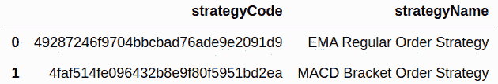
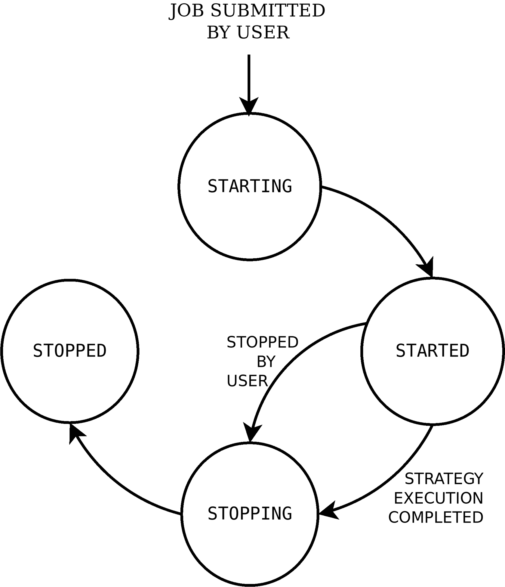
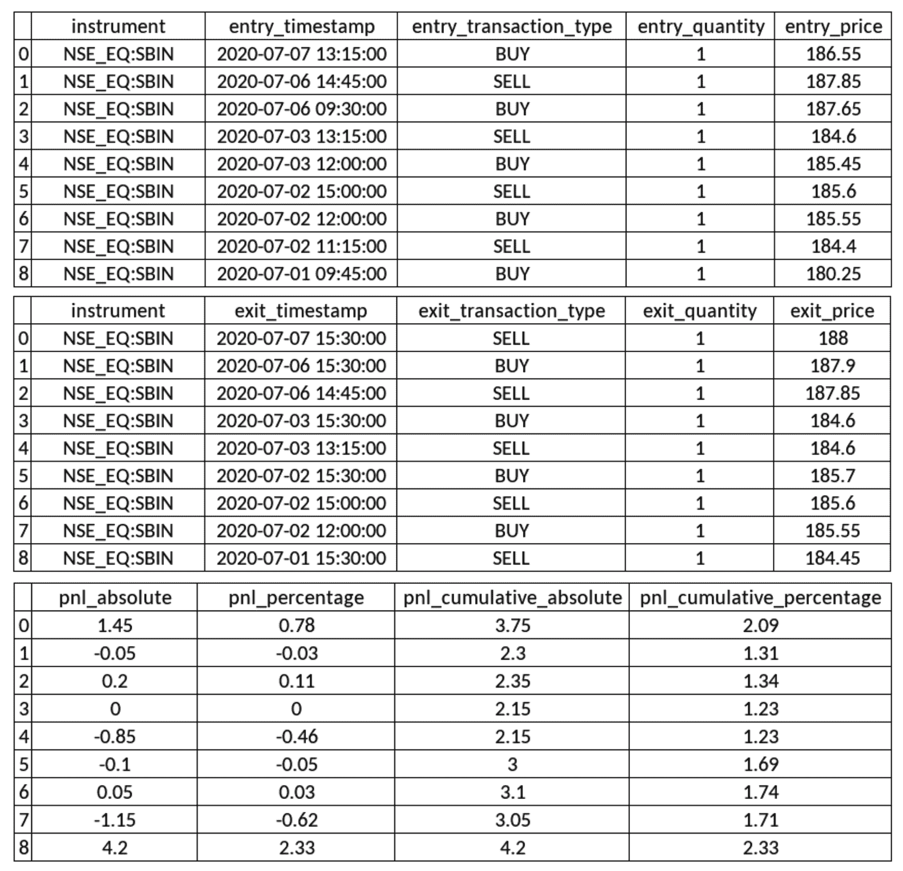
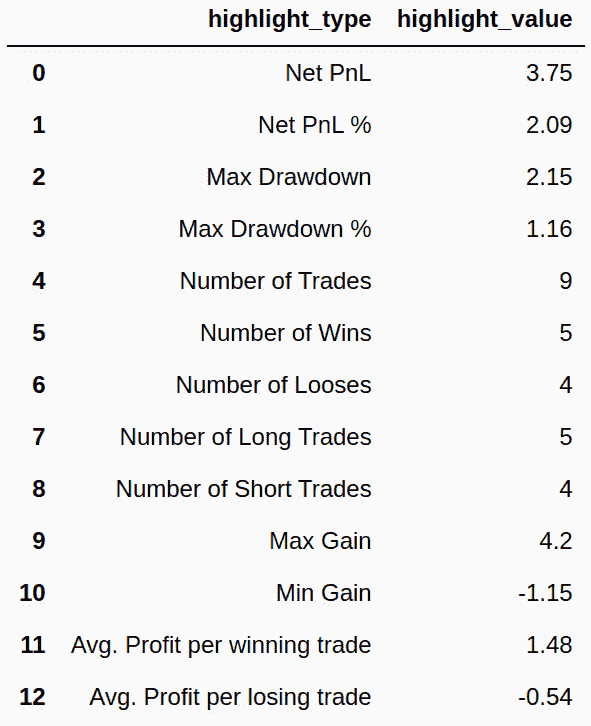
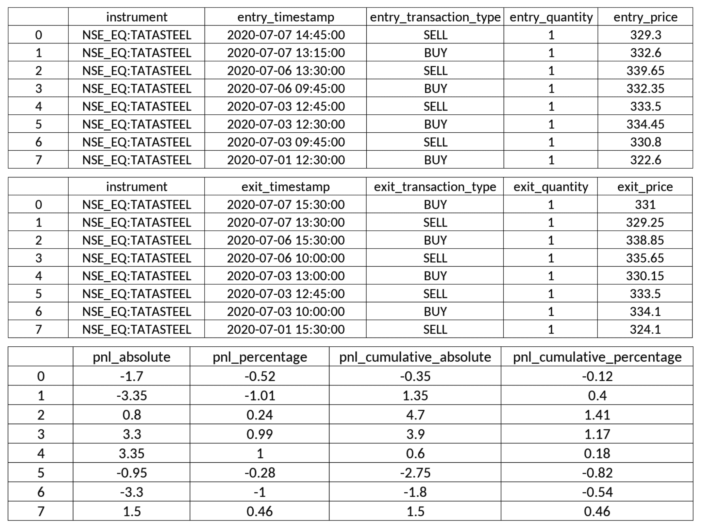
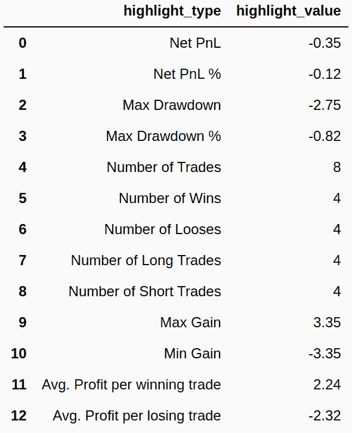

算法交易 - 回测

在构建算法交易策略之后，正如我们在上一章中所做的那样，第一步是对给定的策略配置在给定的时间段内进行回测。

回测是通过在过去的数据上虚拟执行交易策略并分析其风险和回报指标来评估交易策略性能的方法。这里不使用真实资金。典型的回测指标包括**利润和损失**（**P＆L**），最大回撤，总交易数，盈利交易数，亏损交易数，多头交易和空头交易，每笔盈利和亏损交易的平均利润等。直到这些指标满足必要要求为止，整个过程应该重复进行，逐步对策略参数和/或策略实施进行更改。

如果一个策略在过去的数据上表现良好，那么它在实时数据上也很可能表现良好。同样，如果一个策略在过去的数据上表现不佳，那么它在实时数据上也很可能表现不佳。这是回测的基本前提。您可以不断更改策略配置或实现，直到回测产生预期的结果为止。

回测还有助于在我们将策略用于真实资金之前验证策略的行为。这意味着它有助于确保策略在过去的各种营销场景中表现如预期。

对于回测，需要策略配置。它由多个参数组成，其中一些如下：

+   **开始和结束时间戳**：回测应运行的时间段。

+   **金融工具**：应进行回测的一个或多个金融工具。

+   **蜡烛间隔**：许多可能的蜡烛间隔之一；例如，1 分钟，15 分钟，1 小时或 1 天。

+   **特定策略参数**：策略中定义的自定义参数的值。

+   **策略模式**：日内交易或交割之一。日内交易策略在当天结束时打入日内订单，这些订单在当天结束时结清。交割策略打入交割订单。这些订单不会在当天结束时结清，而是转到下一个交易日。

需要一个回测引擎来执行给定策略的回测。在本章中，您将使用由 AlgoBulls 提供的回测引擎 ([`algobulls.com`](https://algobulls.com))，这是一个通过其开发者选项提供其服务的算法交易平台。它提供了一个名为`pyalgotrading`的 Python 包 ([`github.com/algobulls/pyalgotrading`](https://github.com/algobulls/pyalgotrading)) 来提供这些服务。

您在第八章中编码了两种算法交易策略，*算法交易策略 - 逐步编码*。回想一下，策略描述如下：

+   **EMA-Regular-Order 策略**：该策略基于技术指标 EMA 和常规订单。（第八章 的前六个配方，*算法交易策略 – 逐步编码*。）

+   **MACD-Bracket-Order 策略**：该策略基于技术指标 MACD 和括号订单。（第八章 的剩余六个配方，*算法交易策略 – 逐步编码*。）

这些策略也作为名为 `pyalgostrategypool` 的 Python 包的一部分可用。您可以使用 pip 安装它，使用命令 `$ pip install pyalgostrategypool`。您还可以在 GitHub 上查看它们（[`github.com/algobulls/pyalgostrategypool`](https://github.com/algobulls/pyalgostrategypool)）。

在上一章中，您已将这两个策略上传到您的 AlgoBulls 账户。在本章中，您将从您的 AlgoBulls 账户获取这些策略，并对其进行回测。回测后，您将收集策略执行日志和各种报告，即 P&L 报告、统计报告和订单历史。这些日志和报告有助于验证策略的表现，并为下一阶段——模拟交易做准备，然后我们最终进行实际交易。通过使用 `pyalgotrading`，您确保专注于通过回测开发和验证策略，而无需担心策略执行所需的生态系统。

本章包括了前述策略的逐步配方，从与 AlgoBulls 平台建立连接、获取策略、运行回测任务，到获取执行日志和各种类型的报告。

在本章中，我们将涵盖以下配方：

+   EMA-Regular-Order 策略 – 获取策略

+   EMA-Regular-Order 策略 – 回测策略

+   EMA-Regular-Order 策略 – 实时获取回测日志

+   EMA-Regular-Order 策略 – 获取回测报告 – P&L 表

+   EMA-Regular-Order 策略 – 获取回测报告 – 统计表

+   EMA-Regular-Order 策略 – 获取回测报告 – 订单历史

+   MACD-Bracket-Order 策略 – 获取策略

+   MACD-Bracket-Order 策略 – 回测策略

+   MACD-Bracket-Order 策略 – 实时获取回测日志

+   MACD-Bracket-Order 策略 – 获取回测报告 – P&L 表

+   MACD-Bracket-Order 策略 – 获取回测报告 – 统计表

+   MACD-Bracket-Order 策略 – 获取回测报告 – 订单历史

让我们开始吧！

# 技术要求

您将需要以下内容才能成功执行本章的配方：

+   Python 3.7+

+   Python 包：

+   `pyalgotrading`（`$ pip install pyalgotrading`）

本章最新的 Jupyter 笔记本可以在 GitHub 上找到：[`github.com/PacktPublishing/Python-Algorithmic-Trading-Cookbook/tree/master/Chapter09`](https://github.com/PacktPublishing/Python-Algorithmic-Trading-Cookbook/tree/master/Chapter09)。

# EMA-Regular-Order 策略 - 获取策略

在这个配方中，您将从 AlgoBulls 平台上的您的账户中获取`StrategyEMARegularOrder`策略类，该策略类是您在第八章，*算法交易策略 - 逐步编码*中通过 *EMA-Regular-Order 策略 - 上传策略* 配方上传到 AlgoBulls 交易平台的。本配方从设置到 AlgoBulls 平台的连接开始，查询您账户中所有可用的策略，并获取所需策略类`StrategyEMARegularOrder`的详细信息。

确保您已经完成了前一章的前六个配方，以完全了解我们将要使用的策略类；即`StrategyEMARegularOrder`。

## 如何操作…

我们执行了本配方的以下步骤：

1.  导入必要的模块：

```py
>>> from pyalgotrading.algobulls import AlgoBullsConnection
```

1.  创建一个新的 AlgoBulls 连接对象：

```py
>>> algobulls_connection = AlgoBullsConnection()
```

1.  获取授权 URL：

```py
>>> algobulls_connection.get_authorization_url()
```

我们得到了以下输出：

```py
Please login to this URL with your AlgoBulls credentials and get your developer access token: https://app.algobulls.com/user/login
'https://app.algobulls.com/user/login'
```

1.  使用您的 AlgoBulls 凭据登录前面的链接，获取您的令牌，并在此处设置它（有关更多详细信息，请参阅*附录 II*）：

```py
>>> algobulls_connection.set_access_token('
                    80b7a69b168c5b3f15d56688841a8f2da5e2ab2c')
```

1.  获取并显示到目前为止已创建和上传的所有策略：

```py
>>> all_strategies = algobulls_connection.get_all_strategies()
>>> all_strategies
```

我们得到了以下输出。您的输出可能不同（确保您已经按照第八章，*算法交易策略**- 逐步编码*中的配方来获得类似的输出）：



1.  获取并显示第一个策略的策略代码：

```py
>>> strategy_code1 = all_strategies.iloc[0]['strategyCode']
>>> strategy_code1
```

我们得到了以下输出（您的输出可能会有所不同）：

```py
'49287246f9704bbcbad76ade9e2091d9'
```

1.  在对策略进行回测之前，您可以检查策略以确保您拥有正确的策略：

```py
>>> strategy_details1 = \
        algobulls_connection.get_strategy_details(strategy_code1)
>>> print(strategy_details1)
```

我们得到了以下输出：

```py
class StrategyEMARegularOrder(StrategyBase):

    def __init__(self, *args, **kwargs):
        super().__init__(*args, **kwargs)

        self.timeperiod1 = self.strategy_parameters['timeperiod1']
        self.timeperiod2 = self.strategy_parameters['timeperiod2']

        self.main_order = None

    def initialize(self):
        self.main_order = {}

    @staticmethod
    def name():
        return 'EMA Regular Order Strategy'
    ….
    def strategy_exit_position(self, candle, instrument, 
                                sideband_info):
        if sideband_info['action'] == 'EXIT':
            self.main_order[instrument].exit_position()
            self.main_order[instrument] = None
            return True

        return False
```

此处未显示完整的输出。请访问以下链接以阅读完整的输出：[`github.com/algobulls/pyalgostrategypool/blob/master/pyalgostrategypool/strategy_ema_regular_order.py`](https://github.com/algobulls/pyalgostrategypool/blob/master/pyalgostrategypool/strategy_ema_regular_order.py)。

## 工作原理…

在*第 1 步*中，你导入必要的模块。在*第 2 步*中，创建了`AlgoBullsConnection`类的一个实例，命名为`algobulls_connection`。在*第 3 步*中，使用`algobulls_connection`对象的`get_authorization_url()`方法获取授权 URL。这将打印出授权 URL。你应该从浏览器中访问此 URL 以登录 AlgoBulls 平台并获取您的开发者访问令牌。（您可以在*附录 II*中找到更多细节，以及关于从 AlgoBulls 平台获取开发者访问令牌的屏幕截图。）你复制访问令牌，并在*第 4 步*中使用`algobulls_connection`的`set_access_token()`方法设置它。如果令牌被接受，就会建立与 AlgoBulls 平台的成功连接。

在*第 5 步*中，你获取到目前已经创建并上传到 AlgoBulls 平台的所有策略。你使用`get_all_strategies()`方法来执行此步骤，并将其赋值给一个新变量`all_strategies`。这个变量是一个`pandas.DataFrame`对象，具有`strategyCode`和`strategyName`列。这个表格包含了你之前上传的策略代码和策略名称的信息。如果你按照第八章中的*EMA-Regular-Order 策略-上传策略到 AlgoBulls 交易平台*的步骤，你会找到一个名为**EMA-Regular-Order 策略**的策略。在*第 6 步*中，你将策略**EMA-Regular-Order 策略**的策略代码赋值给一个新变量`strategy_code1`。这个策略代码在此步骤的输出中显示。这个策略代码对于 AlgoBulls 平台上的每个策略都是唯一的。

最后，在*第 7 步*中，确保被`strategy_code1`引用的策略确实是你之前上传的那个（在第八章的*EMA-Regular-Order 策略-上传策略到 AlgoBulls 交易平台*配方中）。你使用`algobulls_connection`对象的`get_strategy_details()`方法来检查策略。这个方法将策略代码作为参数。你在这里传递`strategy_code1`。这个方法将整个类代码作为一个字符串返回。你将其赋值给一个新变量`strategy_details1`，并显示它。

如果你想要更改`strategy_code1`引用的类代码，如*第 7 步*所示，请参考第八章的*EMA-Regular-Order 策略-上传策略到 AlgoBulls 交易平台*配方中的*还有更多...*部分。

# EMA-Regular-Order 策略-回测策略

在此配方中，您将对**EMA-Regular-Order 策略**进行回测。您必须在上一配方中从 AlgoBulls 平台的帐户中获取此策略。您将为此配方利用`pyalgotrading`提供的回测功能，该功能反过来会在 AlgoBulls 平台上提交一个回测作业。

提交后，回测将由 AlgoBulls 回测引擎运行。您可以随时查询状态以查找回测作业的状态。作业按给定顺序经历以下状态：

+   `STARTING`（中间状态）

+   `STARTED`（稳定状态）

+   `STOPPING`（中间状态）

+   `STOPPED`（稳定状态）

提交作业后，它将从中间状态开始，即`STARTING`。在此状态下，AlgoBulls 回测引擎获取策略并准备执行环境，这可能需要几分钟。完成后，作业移至`STARTED`状态。策略回测发生在此阶段。在此期间，作业保持在这个状态直到回测完成。完成后，作业移至中间状态，即`STOPPING`。在此状态下，AlgoBulls 回测引擎清理已分配给此作业的资源，这通常需要不到一分钟。最后，作业移至`STOPPED`状态。

如果您已经提交了一个策略回测作业，则不能为相同的策略提交另一个作业，直到第一个作业完成。这意味着您必须等待第一个作业转移到`STOPPED`状态。如果第一个作业运行时间很长，并且您想立即停止它，您可以通过`pyalgotrading`提交停止作业请求。在提交请求之前，您需要确保作业处于`STARTED`状态。

以下状态机图示了回测作业在 AlgoBulls 平台上的生命周期中的各种状态和转换：



提交回测作业后，您可以实时获取策略执行的日志和报告。日志和报告有助于验证策略的性能并调试任何潜在问题。

确保您已经阅读了上一章的前六个配方，以全面了解我们将使用的策略类；即`StrategyEMARegularOrder`。

## 准备工作

确保`algobulls_connection`和`strategy_code1`对象在您的 Python 命名空间中可用。请参阅上一配方以设置`algobulls_connection`和`strategy_code1`对象。

## 如何做...

我们为此配方执行以下步骤：

1.  导入必要的模块：

```py
>>> from datetime import datetime as dt
>>> from pyalgotrading.constants import *
```

1.  使用交易符号作为关键字搜索工具。将返回的对象分配给`instruments`：

```py
>>> instruments = algobulls_connection.search_instrument('SBIN')
>>> instruments
```

我们得到以下输出（您的输出可能会有所不同）：

```py
[{'id': 7, 'value': 'NSE:SBIN'}]
```

1.  从`instruments`获取所选工具的`value`：

```py
>>> instrument = instruments[0]['value']
>>> instrument
```

我们得到以下输出：

```py
'NSE:SBIN'
```

1.  为`strategy_code1`提交一个回测任务：

```py
>>> algobulls_connection.backtest(strategy_code=strategy_code1, 
        start_timestamp=dt(year=2020, month=7, day=1, hour=9, 
                            minute=15), 
        end_timestamp=dt(year=2020, month=7, day=7, hour=15, 
                            minute=30),
        instrument=instrument, 
        lots=1,
        strategy_parameters={
            'timeperiod1': 5,
            'timeperiod2': 12
        }, 
        candle_interval=CandleInterval.MINUTES_15)
```

我们得到以下输出：

```py
Setting Strategy Config... Success.
Submitting BACKTESTING job... Success.
```

1.  检查已提交的回测作业的状态：

```py
>>> algobulls_connection.get_backtesting_job_status(strategy_code1)
```

我们得到以下输出：

```py
{'data': 'STARTING'}
```

1.  一段时间后，再次检查已提交的作业状态：

```py
>>> algobulls_connection.get_backtesting_job_status(strategy_code1)
```

我们得到以下输出：

```py
{'data': 'STARTED'}
```

## 工作原理如下…

在 *步骤 1* 中，你从 `datetime` 模块中导入 `datetime` 类和 `pyalgotrading.constants` 模块中的所有常量。在 *步骤 2* 中，你使用 `algobulls_connection` 对象的 `search_instrument()` 方法获取要为之进行策略回测的工具，**EMA-Regular-Order 策略**。`search_instrument()` 方法接受一个搜索字符串作为参数，该参数应该是你感兴趣的工具的交易代码的一部分或完整的交易代码。你在这里传递`'SBIN'`。该函数返回一个包含与搜索字符串匹配的工具详情的列表。可能有多个工具的交易代码中都包含搜索字符串。在 *步骤 3* 中，你获取第一个匹配工具的值，并将其分配给一个新变量 `instrument`。

在 *步骤 4* 中，你使用 `algobulls_connection()` 对象的 `backtest()` 方法提交了一个回测作业。它接受以下参数：

+   `strategy_code`: 要进行回测的策略的策略代码。这应该是一个字符串。你在这里传递 `strategy_code1`。

+   `start_timestamp`: 从中开始回测的过去时间戳。这应该是一个 `datetime.datetime` 对象。在这里，你传递一个持有 2020 年 7 月 1 日 9:15 点的时间对象 - `dt(year=2020, month=7, day=1, hour=9, minute=15)`。有关创建 `datetime` 对象的详细信息，请参阅第一章中的 *创建 datetime 对象* 配方，处理和操作日期、时间和时间序列数据。.

+   `end_timestamp`: 回测应该执行的过去时间戳。这个对象应该持有一个比 `start_timestamp` 持有的时间戳值要晚的时间戳值。这应该是一个 `datetime.datetime` 实例。在这里，你传递一个持有 2020 年 7 月 7 日 15:30 点的时间对象 - `dt(year=2020, month=7, day=7, hour=15, minute=30)`。

+   `instrument`: 应该为其运行回测的金融工具。将为此工具获取历史数据。这应该是一个字符串。你在这里传递 `instrument`。

+   `lots`: 应进行回测的手数。这应该是一个整数。数量由策略计算得出，即 *手数* × *金融工具的手数*。 （请参阅上一章中的 *EMA-Regular-Order 策略 - 编码 strategy_enter_position 方法*）。你在这里传递`1`。

+   `strategy_parameters`: 策略所需的参数名称和值。这应该是一个字典，其中`parameter-name`和`parameter-value`是键值对。你需要传递以下参数：

+   `timeperiod1: 5`

+   `timeperiod2: 12 `

(回想一下，EMA-Regular-Order 策略的参数是在其 `__init__()` 方法中定义的，如前一章的第一个示例所示)。

+   `candle_interval`：用于回测获取的历史数据的蜡烛间隔。这应该是 `CandleInterval` 类型的枚举。您在这里传递 `CandleInterval.MINUTES_15`。(`CandleInterval` 枚举提供了各种蜡烛间隔的枚举，其中一些是 `MINUTE_1`、`MINUTES_3`、`MINUTES_5`、`MINUTES_10`、`MINUTES_15`、`MINUTES_30`、`HOUR` 和 `DAY`)。

如果作业提交成功，您将会在 `backtest()` 函数中看到打印的 `Success` 消息。

一旦作业提交，启动需要一段时间。启动后，根据策略的复杂性和使用 `start_timestamp` 和 `end_timestamp` 参数指定的回测持续时间，完成可能需要一些时间。几天的回测可能在几秒钟内完成，而几个月的回测可能需要几分钟。

在 *步骤 5* 中，您使用 `algobulls_connection` 对象的 `get_backtesting_job_status()` 方法获取作业状态。您在这里将 `strategy_code1` 作为参数传递。此方法返回一个字典，其中包含一个键值对 - *data* 和 *job* 状态。如果在放置作业后立即查询状态，您将得到 `'STARTING'` 作为状态。在 *步骤 6* 中，您在一段时间后再次查询状态，如果作业已启动，则状态将为 `'STARTED'`。

成功提交意味着已以所需格式传递了回测策略所需的最小输入。但是，这并不保证策略将无错误地运行。在回测期间，策略的执行可能仍然会遇到错误。要调试执行问题，您需要获取输出日志，这在 *MACD-Bracket-Order 策略 - 实时获取回测日志* 配方中有解释。错误的可能原因可能是策略类 Python 代码中的错误或将不完整的 `strategy_parameters` 字典传递给 `backtest()` 函数。

## 还有更多...

如果作业运行时间很长，您希望在其完成之前停止它，您可以使用 `algobulls_connection` 对象的 `stop_backtesting_job()` 方法。此方法接受策略代码作为参数。您在这里传递 `strategy_code1`。此方法向 AlgoBulls 回测引擎提交停止请求。如果请求被接受，您将在此处看到 `Success` 消息：

```py
>>> algobulls_connection.stop_backtesting_job(strategy_code1)
 Stopping BACKTESTING job... Success.
```

如果在提交停止请求后查询状态，您将会得到状态为 `'STOPPING'`：

```py
>>> algobulls_connection.get_backtesting_job_status(strategy_code1)
{'data': 'STOPPING'} 
```

如果在一段时间后再次查询状态，并且作业已停止，则状态将为 `'STOPPED'`：

```py
>>> algobulls_connection.get_backtesting_job_status(strategy_code1)
{'data': 'STOPPED'}
```

# EMA-Regular-Order 策略 - 实时获取回测日志

在 AlgoBulls 平台上提交回测作业后，AlgoBulls 回测引擎开始执行策略。在执行过程中，AlgoBulls 回测引擎发生的每个事件以及所采取的每个决策都以精确的时间戳记录为文本日志。记录的活动示例包括给定策略配置，定期生成的每个新蜡烛，您的策略打出的交易，由这些交易创建的头寸的进入和退出，等待新蜡烛等等。这些日志对于验证策略行为以及调试在开发策略时经常遇到的行为或性能问题至关重要。

在这个配方中，你将获取你的策略的回测日志。一旦您提交的回测作业达到`'STARTED'`状态（有关回测作业状态的更多信息，请参考上一节），日志就会开始出现。AlgoBulls 平台允许您实时获取日志，即使回测作业仍在进行中。您可以在不必等待回测作业完成的情况下获取对策略执行的见解，这在作业运行时间很长时非常有用。`pyalgotrading`包提供了一个简单的方法，可用于获取给定策略的执行日志。

确保您已经阅读了上一章的前六个配方，以完全了解我们将使用的策略类的情况；即，`StrategyEMARegularOrder`。

## 准备就绪

确保您的 Python 命名空间中可用`algobulls_connection`和`strategy_code1`对象。请参考本章的第一个配方设置`algobulls_connection`和`strategy_code1`对象。

## 如何做…

我们对这个配方执行以下步骤：

1.  获取`strategy_code1`的回测执行日志：

```py
>>> logs = algobulls_connection.get_backtesting_logs(
                                                strategy_code1)
>>> print(logs)
```

我们得到以下输出（您的输出可能有所不同）：

```py
[2020-07-30 17:25:18] Logs not available yet. Please retry in sometime.
```

1.  再过一段时间，再次获取`strategy_code1`的回测执行日志：

```py
>>> logs = algobulls_connection.get_backtesting_logs(
                                                strategy_code1)
>>> print(logs)
```

我们得到以下输出（您的输出可能有所不同）：

```py
...
########################################
 INITIALIZING ALGOBULLS CORE (v3.2.0 SECURE MODE)... 
########################################
[2020-07-30 11:56:29] Welcome ALGOBULLS VIRTUAL USER!
[2020-07-30 11:56:29] Reading strategy…
...
 [BT] [2020-07-01 09:15:00] [INFO] [tls] STARTING ALGOBULLS CORE...
...
[BT] [2020-07-01 09:45:00] [CRITICAL] [order] [PLACING NEW ORDER] [2020-07-01 09:45:00] [2333198611b744aeb287300d371c8eb5] [BUY] [NSE:SBIN] [QTY:1] [QTY PENDING: 1] [ENTRY PRICE: 180.25] [PRICE:None] [TRIGGER PRICE:None] [ORDER_TYPE_REGULAR] [ORDER_CODE_INTRADAY] [ORDER_VARIETY_MARKET] [ORDER_POSITION_ENTER]
...
 [BT] [2020-07-07 15:30:00] [INFO] [clock] Candle generation has been stopped...
[BT] [2020-07-07 15:30:00] [INFO] [tls] Received event END OF MARKET. Stopping Trading Core Engine…
[BT] [2020-07-07 15:30:00] [INFO] [tls] Exiting all open positions with order code: ORDER_CODE_INTRADAY (if any)...
[BT] [2020-07-07 15:30:00] [CRITICAL] [tls] [User: ALGOBULLS VIRTUAL USER] Trading session completed
 ...
```

这里没有显示完整的输出。请访问以下链接以阅读完整的输出：[`github.com/algobulls/pyalgostrategypool/blob/master/pyalgostrategypool/sample/backtesting/strategy_ema_regular_order/logs.txt`](https://github.com/algobulls/pyalgostrategypool/blob/master/pyalgostrategypool/sample/backtesting/strategy_ema_regular_order/logs.txt)。

## 工作原理…

在*步骤 1*中，您使用`algobulls_connection`对象的`get_backtesting_logs()`方法实时获取策略回测日志。此方法接受策略代码作为参数。您在这里传递了`strategy_code1`。返回数据是一个字符串。如果您在提交作业后立即尝试此步骤，则会得到一个字符串，该字符串显示日志尚未准备好（`[2020-07-30 17:27:25] Logs not available yet. Please retry in sometime.`）。如果回测作业处于`'STARTING'`状态，则会发生这种情况。

在 *步骤 2* 中，您再次在一段时间后获取日志。如果作业处于 `'STARTING'` 状态之外，您就开始获取您的策略执行日志。每次调用 `get_backtesting_logs()` 函数时，您都会获得完整的回测日志。

## 还有更多...

一旦回测作业转移到 `'STOPPED'` 状态，就不会生成新的日志。在您提交下一个相同策略的回测作业之前，您可以随时获取完整的日志。如果提交了新的回测作业（针对相同的策略），这些日志将无法通过 `get_backtesting_logs()` 方法再次访问。如果您希望以后参考，您可以将获取的日志保存到文件中。

# EMA-Regular-Order 策略 – 获取一个回测报告 – 收益和损失表

在 AlgoBulls 平台提交了一个回测作业后，AlgoBulls 回测引擎开始执行策略。在执行过程中，除了日志之外，AlgoBulls 回测引擎还实时生成了一个 P&L 表格。这个表格包含了策略 Punch 进来的每一笔交易的信息。它还包含了入场和出场订单之间的映射细节、交易 P&L 以及累计 P&L，按时间顺序排序，最新的订单排在最前面。这张表格让我们通过个别和累计 P&L 数字来洞察整体策略的表现。入场-出场订单映射也有助于验证策略行为。

在这个教程中，您将获取您的策略的 P&L 表格报告。在您提交了回测作业后，只要您的策略 Punch 进了第一笔交易，这份报告就会立即可用。AlgoBulls 平台允许您实时获取 P&L 表格，即使回测作业仍在进行中。您可以在等待回测作业完成时获取策略表现的洞察，这在作业运行时间较长时非常有用。`pyalgotrading` 包提供了一个简单的方法，用于获取给定策略的 P&L 表格。

确保您已经阅读了前一章的前六个教程，以完全了解我们将要使用的策略类；即 `StrategyEMARegularOrder`。

## 准备工作

确保 `algobulls_connection` 和 `strategy_code1` 对象在您的 Python 命名空间中可用。请参考本章第一篇教程设置 `algobulls_connection` 和 `strategy_code1` 对象。

## 如何操作…

获取 `strategy_code1` 的回测 P&L 报告：

```py
>>> algobulls_connection.get_backtesting_report_pnl_table(strategy_code1)
```

我们得到了以下输出。您的输出可能会有所不同（请注意，以下输出已被分成多个表格以表示目的。您将在您的 Jupyter Notebook 中看到一个宽表）：



## 工作原理…

在本示例中，您使用`algobulls_connection`对象的`get_backtesting_report_pnl_table()`方法实时获取回测损益表。此方法接受策略代码作为参数。您在此处传递`strategy_code1`。返回的数据是一个`pandas.DataFrame`对象，具有以下多列，描述如下：

+   `instrument`: 进入交易的金融工具。

+   `entry_timestamp`: 进入订单放置的时间戳。（请注意，它可能会在进入`'COMPLETE'`状态之前保持`'OPEN'`状态一段时间。您可以使用订单历史表找到此状态转换的时间，如本章第六个示例所述。）

+   `entry_transaction_type`: 进入订单交易类型（`BUY`或`SELL`）。

+   `entry_quantity`: 进入订单数量。

+   `entry_price`: 进入订单执行的价格，并进入`'COMPLETE'`状态。

+   `exit_timestamp`: 退出订单放置的时间戳。（请注意，它可能会在进入`'COMPLETE'`状态之前保持`'OPEN'`状态一段时间。）

+   `exit_transaction_type`: 退出订单交易类型（`BUY`或`SELL`）。

+   `exit_quantity`: 退出订单数量。

+   `exit_price`: 退出订单执行的价格，并进入`'COMPLETE'`状态。

+   `pnl_absolute`: 退出订单执行价格与进入订单执行价格之间的差值。数学上，这是对于多头交易为(*exit_price* - *entry_price*)**exit_quantity*，对于空头交易为(*entry_price* - *exit_price*)**exit_quantity*。正值意味着交易盈利，负值意味着交易亏损。

+   `pnl_percentage`: 利润或亏损的百分比，相对于进入价格。数学上，这是*pnl_absolute* / *entry_price* / *exit_quantity* × *100*。

+   `pnl_cumulative_absolute`: 累积利润或亏损。数学上，这是以前交易的所有`pnl_absolute`值的总和。此数字直接反映了策略绩效与模拟时间的关系。

+   `pnl_cumulative_percentage`: 相对于进入价格的累积利润或亏损的百分比。数学上，这是*pnl_cumulative* / *entry_price* / *exit quantity* × *100*。

## 更多信息...

一旦回测作业转移到`'STOPPED'`状态，损益表报告将不再更新。您可以在提交下一个相同策略的回测作业之前随时获取完整的损益报告。如果提交了新的回测作业（针对相同策略），则无法再通过`get_backtesting_report_pnl_table()`方法访问此报告。如果您希望以后参考，可以将获取的报告保存为`.csv`文件。

# EMA-Regular-Order 策略 — 获取回测报告 - 统计表

在 AlgoBulls 平台上提交回测任务后，AlgoBulls 回测引擎开始执行策略。在执行过程中，除了日志和盈亏表外，AlgoBulls 回测引擎还实时生成来自盈亏表的摘要。这个摘要是一个包含各种统计数字的统计表，例如`净盈亏`（绝对值和百分比）、`最大回撤`（绝对值和百分比）、总交易次数、盈利交易次数、亏损交易次数、多头交易和空头交易次数、最大收益和最小收益（或最大亏损），以及每笔盈利交易和亏损交易的平均利润。这个表提供了对整体策略表现的即时概览。

在这个配方中，您将获取您的策略的统计表报告。这份报告在您提交回测工作后，您的策略首次打入第一笔交易后即可获得。AlgoBulls 平台允许您实时获取统计表，即使回测工作仍在进行中。您可以在等待回测工作完成时就获得对策略表现的洞察，这对于长时间运行的工作非常有帮助。`pyalgotrading`包提供了一个简单的方法，用于获取给定策略的统计表。

确保您已经阅读了上一章的前六个配方，以完全了解我们将使用的策略类；即`StrategyEMARegularOrder`。

## 准备工作

确保`algobulls_connection`和`strategy_code1`对象在你的 Python 命名空间中可用。参考本章第一个配方设置`algobulls_connection`和`strategy_code1`对象。

## 如何操作…

获取`strategy_code1`的回测统计报告：

```py
>>> algobulls_connection.get_backtesting_report_statistics(strategy_code1)
```

我们得到了以下输出（您的输出可能不同）：



## 如何运作…

在这个配方中，你使用`algobulls_connection`对象的`get_backtesting_report_statistics()`方法实时获取回测统计表。该方法接受策略代码作为参数。你在这里传递了`strategy_code1`。返回的数据是一个`pandas.DataFrame`对象，有两列 - `highlight_type` 和 `highlight_value` - 以及多行。行的描述如下：

+   `净盈亏`：累积回测盈亏。这也是盈亏表中第一个条目的`pnl_cumulative_absolute`值。

+   `净盈亏 %`：累积回测盈亏百分比。这也是盈亏表中第一个条目的`pnl_cumulative_percentage`值。

+   `最大回撤`：盈亏表的`pnl_cumulative`列中的最低值。这表明您的策略在执行过程中遇到的最大损失。

+   `最大回撤 %`：从数学上讲，这是*(最大回撤)* / *(相应的入场价格) / 出场数量 *× *100*。

+   `交易次数`：会话期间的总交易次数（入场和出场计为一次）。

+   `获利次数`：交易盈亏非负的交易次数。

+   `亏损次数`：交易盈亏为负的交易次数。

+   `多头交易次数`：输入交易类型为 `'BUY'` 的交易次数。

+   `空头交易次数`：输入交易类型为 `'SELL'` 的交易次数。

+   `最大收益`：所有交易中收益最大的交易的盈亏。

+   `最小收益`：所有交易中收益最小的交易的盈亏。

+   `每次盈利交易的平均利润`：在数学上，这是 *(盈利交易的总盈亏)* / *(盈利交易的次数)*。

+   `每次亏损交易的平均利润`：在数学上，这是 *(亏损交易的总盈亏)* / *(亏损交易的次数)*。

## 还有更多...

如果在回测任务仍在运行时获取统计表，则上述数字将是中间数字，基于截至该时刻完成的交易。随着更多交易被输入，这些数字可能会更改，直到回测任务完成。

一旦回测任务转移到 `'STOPPED'` 状态，统计表将不再更改。您可以在提交下一个相同策略的回测任务之前的任何时间获取完整的统计表。如果提交了新的回测任务（相同的策略），则通过 `get_backtesting_report_statistics()` 方法将无法再访问此表。如果您希望以后参考，可以将获取的报告表保存到 `.csv` 文件中。

# EMA-Regular-Order 策略 - 获取回测报告 - 订单历史

在 AlgoBulls 平台提交回测任务后，AlgoBulls 回测引擎开始执行策略。在执行过程中，除了日志外，AlgoBulls 回测引擎的盈亏表和统计表会实时生成订单历史记录。此日志包含每个订单的状态转换，以及每个订单状态的时间戳和附加信息（如果有）。订单历史记录对于理解交易从 `'OPEN'` 状态到 `'COMPLETE'` 或 `'CANCELLED'` 状态所需的时间至关重要。例如，`MARKET` 订单将立即从 `'OPEN'` 转换为 `'COMPLETE'`，但是 `LIMIT` 订单可能需要一段时间，根据市场条件从 `'OPEN'` 转换到 `'COMPLETE'` - 甚至可能转为 `'CANCELLED'`。所有这些信息都包含在订单历史记录中。（有关订单状态转换的更多信息，请参见第六章的状态机图，*在交易所上放置常规订单*。）

在本配方中，你将获取你的策略的订单历史记录。只要你的策略首次进行交易，并提交了一个回测任务，这个日志就可以获取。AlgoBulls 平台允许你实时获取订单历史记录，即使回测任务仍在进行中也是如此。这帮助我们获取订单的最终状态的细节，而无需等待回测任务完成。`pyalgotrading`包提供了一个简单的方法，我们可以用它来获取给定策略的订单历史记录。

确保你已经阅读了上一章的前六个配方，以完整了解我们将使用的策略类；即`StrategyEMARegularOrder`。

## 准备工作

确保 `algobulls_connection` 和 `strategy_code1` 对象在你的 Python 命名空间中可用。参考本章第一个配方设置 `algobulls_connection` 和 `strategy_code1` 对象。

## 如何做...

获取`strategy_code1`的回测订单历史报告：

```py
>>> order_history = \
        algobulls_connection.get_backtesting_report_order_history(
                                                          strategy_code1)
>>> print(order_history)
```

我们得到了以下输出（你的输出可能不同）：

```py
+-------------+---------------------+----------------------------------+------+
| INST        | TIME                | ID                               | TT   |
|-------------+---------------------+----------------------------------+------|
| NSE_EQ:SBIN | 2020-07-01 09:45:00 | 2333198611b744aeb287300d371c8eb5 | BUY  |
+-------------+---------------------+----------------------------------+------+
+----+---------------------+------------------------+-------+
|    | TIME                | STATE                  | MSG   |
|----+---------------------+------------------------+-------|
|  0 | 2020-07-01 09:45:00 | PUT ORDER REQ RECEIVED |       |
|  1 | 2020-07-01 09:45:00 | VALIDATION PENDING     |       |
|  2 | 2020-07-01 09:45:00 | OPEN PENDING           |       |
|  3 | 2020-07-01 09:45:00 | OPEN                   |       |
|  4 | 2020-07-01 09:45:00 | COMPLETE               |       |
+----+---------------------+------------------------+-------+
+-------------+---------------------+----------------------------------+------+
| INST        | TIME                | ID                               | TT   |
|-------------+---------------------+----------------------------------+------|
| NSE_EQ:SBIN | 2020-07-01 15:30:00 | 67f39f41885b476295e7e959b0470d49 | SELL |
+-------------+---------------------+----------------------------------+------+
+----+---------------------+------------------------+-------+
|    | TIME                | STATE                  | MSG   |
|----+---------------------+------------------------+-------|
|  0 | 2020-07-01 15:30:00 | PUT ORDER REQ RECEIVED |       |
|  1 | 2020-07-01 15:30:00 | VALIDATION PENDING     |       |
|  2 | 2020-07-01 15:30:00 | OPEN PENDING           |       |
|  3 | 2020-07-01 15:30:00 | OPEN                   |       |
|  4 | 2020-07-01 15:30:00 | COMPLETE               |       |
+----+---------------------+------------------------+-------+
...
```

这里未显示完整的输出。请访问此链接阅读完整的输出：[`github.com/algobulls/pyalgostrategypool/blob/master/pyalgostrategypool/sample/backtesting/strategy_ema_regular_order/oms_order_history.log`](https://github.com/algobulls/pyalgostrategypool/blob/master/pyalgostrategypool/sample/backtesting/strategy_ema_regular_order/oms_order_history.log)。

## 工作原理...

在本配方中，你使用`algobulls_connection`对象的`get_backtesting_report_order_history()`方法实时获取订单历史记录。此方法接受策略代码作为参数。你在这里传递了`strategy_code1`。返回的数据是一个字符串，描述如下：

对于每个订单，日志包含以下信息：

+   一个包含以下列的描述性订单表：

+   `INST`: 订单的金融工具

+   `TIME`: 下单时间

+   `ID`: 订单的唯一 ID

+   `TT`: 订单交易类型（`BUY`或`SELL`）

此表的示例如下：

```py
+-------------+---------------------+----------------------------------+------+
| INST        | TIME                | ID                               | TT   |
|-------------+---------------------+----------------------------------+------|
| NSE_EQ:SBIN | 2020-07-01 09:45:00 | 2333198611b744aeb287300d371c8eb5 | BUY  |
+-------------+---------------------+----------------------------------+------+
```

这些信息将帮助你在策略执行日志中找到这个确切的订单。

+   一个订单状态转换表，包括以下列：

+   `TIME`: 订单进入由`'STATE'`列表示的状态的时间戳。

+   `STATE`: 订单在`'TIME'`列中提到的时间戳进入此`'STATE'`。

+   `MSG`: 来自**订单管理系统**（**OMS**）的额外信息，用于任何意外状态转换。例如，进入`REJECTED`状态的订单有来自 OMS 的拒绝原因的消息。该列通常为空。

此表的示例如下：

```py
+----+---------------------+------------------------+-------+
|    | TIME                | STATE                  | MSG   |
|----+---------------------+------------------------+-------|
|  0 | 2020-07-01 09:45:00 | PUT ORDER REQ RECEIVED |       |
|  1 | 2020-07-01 09:45:00 | VALIDATION PENDING     |       |
|  2 | 2020-07-01 09:45:00 | OPEN PENDING           |       |
|  3 | 2020-07-01 09:45:00 | OPEN                   |       |
|  4 | 2020-07-01 09:45:00 | COMPLETE               |       |
+----+---------------------+------------------------+-------+
```

从这张表中，你可以看到，在上午 9:45 下单后，订单立即转移到`'COMPLETE'`状态。这是预期的，因为订单是常规市价订单。

## 还有更多...

一旦回测作业转移到`'STOPPED'`状态，就不会生成新的订单历史记录日志。您可以在提交下一个相同策略的回测作业之前的任何时间获取完整的订单历史记录日志。如果提交了新的回测作业（用于相同的策略），这些日志将不再通过`get_backtesting_report_order_history()`方法访问。如果您希望以后参考这些日志，可以将获取的日志保存到文件中。

# MACD-Bracket-Order 策略 – 获取策略

在这个配方中，您将从您在 AlgoBulls 平台上的帐户中获取`StrategyMACDBracketOrder`策略类，这是您在上一章的最后一个配方中上传的。这个配方从建立到 AlgoBulls 平台的连接开始，查询您帐户中的所有可用策略，并获取所需策略类`StrategyMACDBracketOrder`的详细信息。

确保您已经阅读了上一章的最后六个配方，以完全了解我们将要使用的策略类，即`StrategyMACDBracketOrder`。

## 如何实现…

我们为此配方执行以下步骤：

1.  导入必要的模块：

```py
>>> from pyalgotrading.algobulls import AlgoBullsConnection
```

1.  创建一个新的 AlgoBulls 连接对象：

```py
>>> algobulls_connection = AlgoBullsConnection()
```

1.  获取授权 URL：

```py
>>> algobulls_connection.get_authorization_url()
```

我们得到以下输出：

```py
Please login to this URL with your AlgoBulls credentials and get your developer access token: https://app.algobulls.com/user/login
'https://app.algobulls.com/user/login'
```

1.  使用您的 AlgoBulls 凭据登录前面的链接，获取您的令牌，并在此设置它（有关更多详细信息，请参阅*附录 II*）：

```py
>>> algobulls_connection.set_access_token('
                    80b7a69b168c5b3f15d56688841a8f2da5e2ab2c')
```

1.  获取并显示您迄今为止创建和上传的所有策略：

```py
>>> all_strategies = algobulls_connection.get_all_strategies()
>>> all_strategies
```

我们得到以下输出。您的输出可能会有所不同（确保您已经按照上一章的配方来获得类似的输出）：


1.  获取并显示第二个策略 **MACD-Bracket-Order 策略** 的策略代码：

```py
>>> strategy_code2 = all_strategies.iloc[1]['strategyCode']
>>> strategy_code2
```

我们得到以下输出（您的输出可能不同）：

```py
'49287246f9704bbcbad76ade9e2091d9'
```

1.  在对您的策略进行回测之前，您可以检查您的策略以确保您拥有正确的策略：

```py
>>> strategy_details2 = \
        algobulls_connection.get_strategy_details(strategy_code2)
>>> print(strategy_details2)
```

我们得到以下输出：

```py
class StrategyMACDBracketOrder(StrategyBase):

    def __init__(self, *args, **kwargs):
        super().__init__(*args, **kwargs)

        self.fastMA_period = \
            self.strategy_parameters['fastma_period']
        self.slowMA_period = \
            self.strategy_parameters['slowma_period']
        self.signal_period = \
            self.strategy_parameters['signal_period']
        self.stoploss = \
            self.strategy_parameters['stoploss_trigger']
        self.target = self.strategy_parameters['target_trigger']
        self.trailing_stoploss = \
            self.strategy_parameters['trailing_stoploss_trigger']

        self.main_order = None

    def initialize(self):
        self.main_order = {}

    @staticmethod
    def name():
        return 'MACD Bracket Order Strategy'
    ….
    def strategy_exit_position(self, candle, instrument, 
                               sideband_info):
        if sideband_info['action'] == 'EXIT':
            self.main_order[instrument].exit_position()
            self.main_order[instrument] = None
            return True

        return False
```

这里没有显示完整的输出。请访问以下链接以阅读完整的输出：[`github.com/algobulls/pyalgostrategypool/blob/master/pyalgostrategypool/strategy_macd_bracket_order.py`](https://github.com/algobulls/pyalgostrategypool/blob/master/pyalgostrategypool/strategy_macd_bracket_order.py)。

## 工作原理如下…

在*步骤 1* 中，您导入必要的模块。在*步骤 2* 中，您创建了 `AlgoBullsConnection` 类的一个实例，命名为 `algobulls_connection`。在*步骤 3* 中，您使用 `algobulls_connection` 对象的 `get_authorization_url()` 方法获取授权 URL。这会打印授权 URL。您应该从您的网络浏览器访问此 URL 来登录 AlgoBulls 平台并获取您的开发者访问令牌。（您可以在*附录 II*中找到更多详细信息，以及从 AlgoBulls 平台获取开发者访问令牌的屏幕截图。）您复制访问令牌并在*步骤 4* 中使用 `algobulls_connection` 的 `set_access_token()` 方法设置它。如果令牌被接受，则会建立与 AlgoBulls 平台的成功连接。

在*步骤 5* 中，您获取到目前在 AlgoBulls 平台上创建并上传的所有策略。您使用 `get_all_strategies()` 方法进行此步骤，并将其赋值给一个新变量 `all_strategies`。此变量是一个 `pandas.DataFrame` 对象，具有 `strategyCode` 和 `strategyName` 列。此表包含您之前上传的策略代码和策略名称的信息。如果您遵循了第八章中的 *MACD-Bracket-Order 策略 - 在 AlgoBulls 交易平台上上传策略* 配方，*算法交易策略 - 逐步编码*，您将会找到一个名为 **MACD-Regular-Order 策略** 的策略。在*步骤 6* 中，您将策略 **MACD-Regular-Order 策略** 的策略代码分配给一个名为 `strategy_code2` 的新变量。策略代码显示在此步骤的输出中。此策略代码对于 AlgoBulls 平台上的每个策略都是唯一的。

最后，在*步骤 7* 中，您确保 `strategy_code2` 所引用的策略确实是您之前上传的那一个（在上一章的最后一个配方中）。您使用 `algobulls_connection` 对象的 `get_strategy_details()` 方法来检查策略。这个方法以策略代码作为参数。您在这里传递 `strategy_code2`。此方法返回整个类代码作为字符串。您将其赋值给一个新变量 `strategy_details2`，并显示它。

如果您想要更改由 `strategy_code2` 引用的类代码，如 *步骤 7* 中所示，请参考第八章的上一个配方的 *更多信息…* 部分，*算法交易策略 - 逐步编码*。

# MACD-Bracket-Order 策略 - 回测策略

在这个配方中，您将对 **MACD-Bracket-Order 策略** 进行回测。您必须在本章的上一个配方中从 AlgoBulls 平台的您的账户中获取此策略。您将利用 `pyalgotrading` 为这个配方提供的回测功能，这将在 AlgoBulls 平台上提交一个回测任务。

一旦提交，回测将由 AlgoBulls 回测引擎运行。您可以随时查询状态以了解回测作业的状态。作业按以下顺序经历以下状态：

+   `STARTING`（中间状态）

+   `STARTED`（稳定状态）

+   `STOPPING`（中间状态）

+   `STOPPED`（稳定状态）

在提交作业时，它会从中间状态`'STARTING'`开始。在此状态下，AlgoBulls 回测引擎获取策略并准备执行环境，这可能需要几分钟。完成后，作业转移到`'STARTED'`状态。策略回测发生在此阶段。在此阶段，作业将停留，直到回测完成。完成后，作业将转移到中间状态`'STOPPING'`。在此状态下，AlgoBulls 回测引擎清理分配给此作业的资源，通常需要不到一分钟。最后，作业转移到`'STOPPED'`状态。

如果您已经为某个策略提交了回测作业，那么在第一个作业完成之前，您不能为同一策略提交另一个作业。这意味着您必须等待第一个作业进入`'STOPPED'`状态。如果第一个作业运行时间很长，并且您希望立即停止它，您可以通过`pyalgotrading`提交停止作业请求。您需要确保作业在提交请求前处于`'STARTED'`状态。

在提交回测作业后，您可以实时获取策略执行的日志和报告。日志和报告有助于验证策略的性能并调试任何潜在问题。

您可以参考本章的第二个配方，查看 AlgoBulls 平台上回测作业的状态机图。它展示了回测作业在其生命周期中的各种状态和转换。

确保您已经阅读了上一章的最后六个配方，以全面了解我们将使用的策略类，即`StrategyMACDBracketOrder`。

## 准备就绪

确保`algobulls_connection`和`strategy_code2`对象在您的 Python 命名空间中可用。请参考本章的上一配方来设置`algobulls_connection`和`strategy_code2`对象。

## 如何操作...

我们执行以下步骤来完成此操作：

1.  导入必要的模块：

```py
>>> from datetime import datetime as dt
>>> from pyalgotrading.constants import *
```

1.  使用其交易符号作为关键字搜索工具。将返回的对象分配给`instruments`：

```py
>>> instrument = algobulls_connection.search_instrument(
                                                'TATASTEEL')
>>> instrument
```

我们获得以下输出（您的输出可能不同）：

```py
[{'id': 1, 'value': 'NSE:TATASTEEL'}]
```

1.  从`instruments`获取所选工具的`value`：

```py
>>> instrument = instrument[0]['value']
>>> instrument
```

我们获得以下输出：

```py
'NSE:TATASTEEL'
```

1.  为`strategy_code2`提交回测作业：

```py
>>> algobulls_connection.backtest(
        strategy_code=strategy_code2, 
        start_timestamp=dt(year=2020, month=7, day=1, hour=9, 
                            minute=15),
        end_timestamp=dt(year=2020, month=7, day=7, hour=15, 
                            minute=30),
        instrument=instrument,
        lots=1,
        strategy_parameters={
            'fastma_period': 26, 
            'slowma_period': 6, 
            'signal_period': 9,
            'target_trigger': 0.01, 
            'stoploss_trigger': 0.01, 
            'trailing_stoploss_trigger': 1
        },
        candle_interval=CandleInterval.MINUTES_15)
```

我们获得以下输出：

```py
Setting Strategy Config... Success.
Submitting BACKTESTING job... Success.
```

1.  检查提交的回测作业的状态：

```py
>>> algobulls_connection.get_backtesting_job_status(strategy_code2)
{'data': 'STARTING'}
```

1.  过一段时间后再次检查提交的回测作业的状态：

```py
>>> algobulls_connection.get_backtesting_job_status(strategy_code2)
{'data': 'STARTED'}
```

## 工作原理...

在*步骤 1*中，您从`datetime`模块中导入`datetime`类，以及从`pyalgotrading.constants`模块中导入所有所需的常量。在*步骤 2*中，您使用`algobulls_connection`对象的`search_instrument()`方法获取您想要为其回测策略的工具，**MACD-Bracket-Order 策略**。`search_instrument()`方法接受一个搜索字符串作为参数，该字符串应该是您感兴趣的工具的交易代码的部分或完整内容。这里您传递了`'TATASTEEL'`。该函数返回一个包含与搜索字符串匹配的工具详细信息的列表。可能会有多个工具的交易代码中含有搜索字符串。在*步骤 3*中，您获取第一个匹配工具的值，并将其赋值给一个新变量，`instrument`。

在*步骤 4*中，您使用`algobulls_connection()`对象的`backtest()`方法提交一个回测任务。它接受以下参数：

+   `strategy_code`: 要进行回测的策略的策略代码。这应该是一个字符串。在这里，您传递了`strategy_code2`。

+   `start_timestamp`: 进行回测的起始时间戳。这应该是一个`datetime.datetime`对象。这里，您传递了一个包含 2020 年 7 月 1 日 9:15 小时的值的对象 - `dt(year=2020, month=7, day=1, hour=9, minute=15)`。有关创建`datetime`对象的详细信息，请参阅第一章的第一个示例，即*处理和操作日期、时间和时间序列数据*。

+   `end_timestamp`: 进行回测的结束时间戳。此对象应持有比`start_timestamp`持有的时间戳值要晚的时间戳。这应该是一个`datetime.datetime`实例。在这里，您传递了一个包含 2020 年 7 月 7 日 15:30 小时的值的对象 - `dt(year=2020, month=7, day=7, hour=15, minute=30)`。

+   `instrument`: 应该运行回测的金融工具。将为此工具获取历史数据。这应该是一个字符串。在这里，您传递了`instrument`。

+   `lots`: 进行回测的手数。这应该是一个整数。该数量由策略计算为*手数*×*金融工具的手数*。 (请参阅第八章的*MACD-Bracket-Order 策略 - 编写策略 _select_instruments_for_entry 方法*，*算法交易策略 - 逐步编码*。) 在这里，您传递了`1`。

+   `strategy_parameters`: 策略所需的参数名称和值。这应该是一个字典，其中`parameter-name`和`parameter-value`是键值对。您在这里传递以下参数：

+   `fastma_period: 26`

+   `slowma_period: 6`

+   `signal_period: 9`

+   `target_trigger: 0.01`

+   `stoploss_trigger: 0.01`

+   `trailing_stoploss_trigger: 1`

（回想一下，MACD-Bracket-Order 策略的参数在前一章的`__init__()`方法中定义）。

+   `candle_interval`: 用于回测的历史数据获取的蜡烛图间隔。这应该是`CandleInterval`类型的枚举。在这里，你传递`CandleInterval.MINUTES_15`。（`CandleInterval`枚举提供各种蜡烛图间隔的枚举，其中一些是`MINUTE_1`、`MINUTES_3`、`MINUTES_5`、`MINUTES_10`、`MINUTES_15`、`MINUTES_30`、`HOUR`和`DAY`）。

如果作业提交成功，你会看到`backtest()`函数打印出`Success`消息。

一旦作业提交，启动需要一段时间。启动后，根据指定的策略复杂度和回测持续时间（使用`start_timestamp`和`end_timestamp`参数），完成可能需要一些时间。几天的回测可能在几秒内完成，而几个月的回测可能需要几分钟。

在*步骤 5*中，你使用`algobulls_connection`对象的`get_backtesting_job_status()`方法获取作业状态。在这里，你将`strategy_code2`作为参数传递。该方法返回一个键值对字典 - 数据和作业状态。如果在放置作业后立即查询状态，你会得到`'STARTING'`作为状态。在*步骤 6*中，你再次查询状态，如果作业已经启动，你会得到`'STARTED'`的状态。

成功提交意味着以所需格式传递了回测策略的最小输入。然而，这并不保证策略会在回测期间无错误地运行。策略的执行仍然可能在回测过程中遇到错误。要调试执行问题，你需要获取输出日志，这将在下一个示例中解释。错误的可能原因包括策略类的 Python 代码中的错误或传递给`backtest()`函数的`strategy_parameters`字典不完整。

## 还有更多...

如果作业运行时间很长，你希望在完成之前停止它，你可以使用`algobulls_connection`对象的`stop_backtesting_job()`方法。此方法接受策略代码作为参数。在这里，你传递`strategy_code2`。该方法向 AlgoBulls 回测引擎提交停止请求。如果请求被接受，你会看到一个`Success`消息：

```py
>>> algobulls_connection.stop_backtesting_job(strategy_code2)
 Stopping BACKTESTING job... Success.
```

如果在提交停止请求后查询状态，你会得到一个`'STOPPING'`的状态：

```py
>>> algobulls_connection.get_backtesting_job_status(strategy_code2)
{'data': 'STOPPING'}
```

如果一段时间后再次查询状态，如果作业已经停止，你会得到`'STOPPED'`的状态：

```py
>>> algobulls_connection.get_backtesting_job_status(strategy_code2)
{'data': 'STOPPED'} 
```

# MACD-Bracket-Order 策略 - 实时获取回测日志

在 AlgoBulls 平台提交回测作业后，AlgoBulls 回测引擎开始执行策略。在执行过程中，AlgoBulls 回测引擎记录了发生的每个事件以及所做出的决策，以确切的时间戳形式记录在文本日志中。记录的活动示例包括给定策略配置、定期生成的每个新蜡烛、您的策略输入的交易、由这些交易创建的头寸的进入和退出、等待新蜡烛等等。这些日志对于验证策略行为以及调试在开发策略时经常遇到的行为或性能问题至关重要。

在这个配方中，您将获取您的策略的回测日志。日志会在您提交的回测作业达到`'STARTED'`状态时开始出现。AlgoBulls 平台允许您实时获取日志，即使回测作业仍在进行中。您可以在不等待回测作业完成的情况下深入了解策略执行情况，这在作业运行时间较长时非常有用。`pyalgotrading`包提供了一个简单的方法来获取给定策略的执行日志。

确保您已经浏览了上一章的最后六个配方，以完整了解我们将要使用的策略类别；也就是`StrategyMACDBracketOrder`。

## 准备工作

确保`algobulls_connection`和`strategy_code2`对象在您的 Python 命名空间中可用。请参考本章的*MACD-Bracket-Order strategy – fetching the strategy*配方来设置`algobulls_connection`和`strategy_code2`对象。

## 如何操作...

我们对这个配方执行以下步骤：

1.  获取`strategy_code2`的回测执行日志：

```py
>>> logs = algobulls_connection.get_backtesting_logs(
                                              strategy_code2)
>>> print(logs)
```

我们得到了以下输出（您的输出可能不同）：

```py
[2020-07-30 17:27:25] Logs not available yet. Please retry in sometime.
```

1.  一段时间后再次获取`strategy_code2`的回测执行日志：

```py
>>> logs = algobulls_connection.get_backtesting_logs(
                                               strategy_code2)
>>> print(logs)
```

我们得到了以下输出（您的输出可能不同）：

```py
...
########################################
 INITIALIZING ALGOBULLS CORE (v3.2.0 SECURE MODE)... 
########################################
...
[BT] [2020-07-01 09:15:00] [INFO] [tls] STARTING ALGOBULLS CORE...
...
[BT] [2020-07-01 12:30:00] [CRITICAL] [order] [PLACING NEW ORDER] [2020-07-01 12:30:00] [1cbefcf395c344c88a228a1b01c32ef6] [BUY] [NSE:TATASTEEL] [QTY:1] [QTY PENDING: 1] [ENTRY PRICE: 322.6] [PRICE:322.6] [TRIGGER PRICE:None] [ORDER_TYPE_BRACKET] [ORDER_CODE_INTRADAY] [ORDER_VARIETY_LIMIT] [ORDER_POSITION_ENTER] [STOPLOSS TRIGGER:319.374] [TARGET TRIGGER:325.826] [TRAILING STOPLOSS TRIGGER:322.6]
...
[BT] [2020-07-07 15:30:00] [INFO] [clock] Candle generation has been stopped...
[BT] [2020-07-07 15:30:00] [INFO] [tls] Received event END OF MARKET. Stopping Trading Core Engine...
[BT] [2020-07-07 15:30:00] [CRITICAL] [tls] [User: ALGOBULLS VIRTUAL USER] Trading session completed
...
```

此处未显示完整输出。请访问以下链接阅读完整输出：[`github.com/algobulls/pyalgostrategypool/blob/master/pyalgostrategypool/sample/backtesting/strategy_macd_bracket_order/logs.txt`](https://github.com/algobulls/pyalgostrategypool/blob/master/pyalgostrategypool/sample/backtesting/strategy_macd_bracket_order/logs.txt)。

## 工作原理...

在*步骤 1*中，您使用`algobulls_connection`对象的`get_backtesting_logs()`方法实时获取策略回测日志。此方法接受策略代码作为参数。在此处传递`strategy_code2`。返回的数据是一个字符串。如果在提交作业后立即尝试此步骤，您将获得一个字符串，指出日志尚未准备好（`[2020-07-30 17:27:25] 日志尚未准备好，请稍后重试。`）。如果回测作业处于`'STARTING'`状态，则会发生这种情况。

在*第 2 步*中，你在一段时间后再次获取日志。如果作业处于`'STARTING'`状态之外，你就开始获取你的策略执行日志。每次调用`get_backtesting_logs()`函数时，你都会得到整个回测日志。

## 还有更多...

一旦回测作业转移到`'STOPPED'`状态，就不会生成新的日志。你可以在提交下一个相同策略的回测作业之前的任何时候获取完整的日志。如果提交了一个新的回测作业（针对相同的策略），这些日志将不再通过`get_backtesting_logs()`方法访问。如果你希望以后参考，你可以将获取的日志保存到文件中。

# MACD-Bracket-Order 策略 – 获取回测报告 – 盈亏表

在 AlgoBulls 平台上提交回测作业后，AlgoBulls 回测引擎开始执行策略。在其执行过程中，除了日志外，AlgoBulls 回测引擎还实时生成 P&L 表。该表包含了策略输入的每一笔交易的信息。它还包含了入口和出口订单之间的映射、交易 P&L 和累积 P&L 的详细信息，按时间顺序排序，最新的订单排在最前面。

这个表格通过个人和累积 P&L 数字帮助我们了解策略的整体表现。入口-出口订单映射也有助于验证策略的行为。

在这个食谱中，你将获取你的策略的 P&L 表报告。在提交回测作业后，只要你的策略打出第一笔交易，这个报告就可以获得。AlgoBulls 平台允许你实时获取 P&L 表，即使回测作业仍在进行中。在作业运行时间较长时，这对于获取策略表现的洞察力是有帮助的。`pyalgotrading`包提供了一个简单的方法，你可以用它来获取给定策略的 P&L 表。

确保你已经浏览了上一章的最后六个食谱，以完整地了解我们将使用的策略类的情况；也就是说，`StrategyMACDBracketOrder`。

## 准备就绪

确保你的 Python 命名空间中有`algobulls_connection`和`strategy_code2`对象可用。请参考本章的 *MACD-Bracket-Order 策略 – 获取策略* 食谱设置`algobulls_connection`和`strategy_code2`对象。

## 如何操作...

获取`strategy_code2`的回测 P&L 报告：

```py
>>> algobulls_connection.get_backtesting_report_pnl_table(strategy_code2)
```

我们得到了以下输出。你的输出可能会有所不同（注意以下输出已经分成多个表格以便表示。你在 Jupyter Notebook 中将看到一个宽表）：



## 运作原理...

在本示例中，您可以使用`algobulls_connection`对象的`get_backtesting_report_pnl_table()`方法实时获取回测 P＆L 表。 此方法接受策略代码作为参数。 在此处传递`strategy_code2`。 返回数据是一个带有多列的`pandas.DataFrame`对象，描述如下：

+   `instrument`：输入的金融工具。

+   `entry_timestamp`：放置进入订单的时间戳。（请注意，它可能在进入`'COMPLETE'`状态之前保持一段时间处于`'OPEN'`状态。可以通过订单历史表找到此状态转换的时间，如本章的最后一个示例所述。）

+   `entry_transaction_type`：进入订单交易类型（`BUY`或`SELL`）。

+   `entry_quantity`：进入订单数量。

+   `进入价格`：进入订单执行并进入`'COMPLETE'`状态的价格。

+   `退出时间戳`：放置退出订单的时间戳。（请注意，它可能在进入`'COMPLETE'`状态之前保持一段时间处于`'OPEN'`状态。）

+   `exit_transaction_type`：退出订单交易类型（`BUY`或`SELL`）。

+   `exit_quantity`：退出订单数量。

+   `退出价格`：退出订单执行并进入`'COMPLETE'`状态的价格。

+   `pnl_absolute`：退出订单执行价格与进入订单执行价格之间的差值。 在数学上，这可以表示为（*退出价格* - *进入价格*）**退出数量*（对于多头交易），以及（*进入价格* - *退出价格*）**退出数量*（对于空头交易）。 正值意味着交易是盈利交易。 负值意味着交易是亏损交易。

+   `pnl_percentage`：相对于进入价格的利润或损失的百分比。 在数学上，这是 *pnl_absolute* / *entry_price / exit_quantity *× *100*。

+   `pnl_cumulative_absolute`：累积利润或损失。 在数学上，这是以前交易的所有`pnl_absolute`值的总和。 这个数字直接反映了策略相对于模拟时间的表现。

+   `pnl_cumulative_percentage`：相对于进入价格的累积利润或损失的百分比。 在数学上，这是 *pnl_cumulative* / *entry_price* / *exit_quantity* ×* 100*。

## 还有更多...

一旦回测作业转移到`'STOPPED'`状态，P＆L 表报告将不再更新。 您可以在提交下一个相同策略的回测作业之前随时获取完整的 P＆L 报告。 如果提交了新的回测作业（针对相同的策略），则将无法通过`get_backtesting_report_pnl_table()`方法再访问此报告。 如果您希望稍后参考，可以将获取的报告保存为`.csv`文件。

# MACD-Bracket-Order 策略 - 获取回测报告 - 统计表

在 AlgoBulls 平台上提交回测任务后，AlgoBulls 回测引擎开始执行策略。在执行过程中，除了日志和 P&L 表之外，AlgoBulls 回测引擎还实时从 P&L 表生成摘要。这个摘要是一个包含各种统计数字的统计表，比如`净利润`（绝对值和百分比）、`最大回撤`（绝对值和百分比）、总交易次数、盈利交易、亏损交易、多头交易和空头交易的计数、最大盈利和最小盈利（或最大亏损）、以及每笔盈利和亏损交易的平均利润。这张表可以让我们快速了解策略的整体表现。

在这个配方中，您将为您的策略获取统计表报告。此报告在您提交回测任务后，您的策略打入第一笔交易后即可获取。AlgoBulls 平台允许您实时获取统计表，即使回测任务仍在进行中。您可以在等待回测任务完成时获得对策略性能的见解，这在任务运行时间较长时非常有用。`pyalgotrading` 包提供了一个简单的方法，我们可以使用它来获取给定策略的统计表。

确保您已经阅读了上一章的最后六个配方，以完全了解我们将使用的策略类别；即`StrategyMACDBracketOrder`。

## 准备工作

确保您的 Python 命名空间中有 `algobulls_connection` 和 `strategy_code2` 对象可用。请参考本章的 *MACD-Bracket-Order 策略 - 获取策略* 配方来设置 `algobulls_connection` 和 `strategy_code2` 对象。

## 如何操作...

获取 `strategy_code2` 的回测统计报告：

```py
>>> algobulls_connection.get_backtesting_report_statistics(strategy_code2)
```

我们得到以下输出（您的输出可能会有所不同）：



## 工作原理...

在这个配方中，您可以使用 `algobulls_connection` 对象的 `get_backtesting_report_statistics()` 方法实时获取回测统计表。此方法接受策略代码作为参数。您在这里传递了 `strategy_code2`。返回的数据是一个 `pandas.DataFrame` 对象，有两列 - `Highlight` 和 `Value` - 以及多行。行的描述如下：

+   `净利润`：累积回测净利润。这也是 P&L 表中第一个条目的 `pnl_cumulative_absolute` 值。

+   `净利润 %`：累积回测利润百分比。这也是 P&L 表中第一个条目的 `pnl_cumulative_percentage` 值。

+   `最大回撤`：P&L 表中 `pnl_cumulative` 列中的最低值。这表示您的策略在执行过程中遇到的最大损失。

+   `最大回撤 %`：在数学上，这是 *(最大回撤)* / *(相应的 entry_price) / exit_quantity* × *100*。

+   `交易次数`：会话期间的总交易次数（入场和出场计算为一次）。

+   `盈利次数`：交易 P&L 为非负数的交易计数。

+   `亏损次数`：交易 P&L 为负数的交易计数。

+   `买入交易数`：以 `'BUY'` 为入场交易类型的交易计数。

+   `卖出交易数`：以 `'SELL'` 为入场交易类型的交易计数。

+   `最大利润`：所有交易中 P&L 值最大的交易的 P&L。

+   `最小利润`：所有交易中 P&L 值最小的交易的 P&L。

+   `每次盈利交易的平均利润`：从数学上讲，这是 *(盈利交易的总 P&L)* / *(盈利交易的计数)*。

+   `每次亏损交易的平均利润`：从数学上讲，这是 *(亏损交易的总 P&L)* / *(亏损交易的计数)*。

## 还有更多...

如果在回测作业仍在运行时获取统计表，则上述数字将是中间数字，基于直到该时刻已完成的交易。随着更多交易的输入，这些数字可能会发生变化，直到回测作业完成。

一旦回测作业转移到 `'STOPPED'` 状态，统计表将不再更改。您可以在提交下一个相同策略的回测作业之前的任何时间获取完整的统计表。如果提交了新的回测作业（针对相同策略），则无法通过 `get_backtesting_report_statistics()` 方法访问此表。如果您希望稍后参考，可以将获取的报告保存为 `.csv` 文件。

# MACD-Bracket-Order 策略 - 获取回测报告 - 订单历史

在 AlgoBulls 平台上提交回测作业后，AlgoBulls 回测引擎开始执行策略。在执行过程中，除了日志、P&L 表和统计表之外，AlgoBulls 回测引擎还实时生成订单历史记录。此日志包含每个订单的状态转换，以及每个订单状态的时间戳和附加信息（如果有）。订单历史记录对于了解交易从 `'OPEN'` 到 `'COMPLETE'` 或 `'CANCELLED'` 状态所需的时间非常重要。例如，`MARKET` 订单将立即从 `'OPEN'` 转移到 `'COMPLETE'`，但是 `LIMIT` 订单可能需要一段时间，根据市场条件，从 `'OPEN'` 转移到 `'COMPLETE'` - 甚至可能会被 `'CANCELLED'`。所有这些信息都在订单历史记录中提供。（有关订单状态转换的更多信息，请参阅第六章的状态机图，*在交易所上下单*。）

在这个配方中，您将获取您的策略的订单历史记录。只要您提交了回测作业后，您的策略就 punched in 第一笔交易，这个日志就可用了。AlgoBulls 平台允许您实时获取订单历史记录，即使回测作业仍在进行中。这样我们就可以获得处于最终状态的订单的详细信息，而不必等待回测作业完成。`pyalgotrading`软件包提供了一种简单的方法，我们可以用它来获取给定策略的订单历史记录。

确保您已经阅读了前一章节的最后几个配方，以完全了解我们将使用的策略类`StrategyMACDBracketOrder`。

## 准备就绪

确保`algobulls_connection`和`strategy_code2`对象在您的 Python 命名空间中可用。请参考本章的*MACD-Bracket-Order strategy – fetching the strategy*配方设置`algobulls_connection`和`strategy_code2`对象。

## 怎么做…

获取`strategy_code2`的回测订单历史报告：

```py
>>> order_history = algobulls_connection.get_backtesting_report_order_history(strategy_code2)
>>> print(order_history)
```

我们得到以下输出（您的输出可能不同）：

```py
...
+------------------+---------------------+----------------------------------+------+
| INST             | TIME                | ID                               | TT   |
|------------------+---------------------+----------------------------------+------|
| NSE_EQ:TATASTEEL | 2020-07-03 10:00:00 | 03436b72ad8a47a8b29bb727876b0b95 | BUY  |
+------------------+---------------------+----------------------------------+------+
+----+---------------------+------------------------+-------+
|    | TIME                | STATE                  | MSG   |
|----+---------------------+------------------------+-------|
|  0 | 2020-07-03 10:00:00 | PUT ORDER REQ RECEIVED |       |
|  1 | 2020-07-03 10:00:00 | VALIDATION PENDING     |       |
|  2 | 2020-07-03 10:00:00 | OPEN PENDING           |       |
|  3 | 2020-07-03 10:00:00 | TRIGGER PENDING        |       |
|  4 | 2020-07-03 12:30:00 | OPEN                   |       |
|  5 | 2020-07-03 12:30:00 | COMPLETE               |       |
+----+---------------------+------------------------+-------+
+------------------+---------------------+----------------------------------+------+
| INST             | TIME                | ID                               | TT   |
|------------------+---------------------+----------------------------------+------|
| NSE_EQ:TATASTEEL | 2020-07-03 10:00:00 | 62458cf47d5f4a12b6c31c490451fdb0 | BUY  |
+------------------+---------------------+----------------------------------+-----
+
+----+---------------------+------------------------+-------+
|    | TIME                | STATE                  | MSG   |
|----+---------------------+------------------------+-------|
|  0 | 2020-07-03 10:00:00 | PUT ORDER REQ RECEIVED |       |
|  1 | 2020-07-03 10:00:00 | VALIDATION PENDING     |       |
|  2 | 2020-07-03 10:00:00 | OPEN PENDING           |       |
|  3 | 2020-07-03 10:00:00 | OPEN                   |       |
|  4 | 2020-07-03 12:30:00 | CANCEL PENDING         |       |
|  5 | 2020-07-03 12:30:00 | CANCELLED              |       |
+----+---------------------+------------------------+-------+
...
```

这里没有显示完整的输出。请访问以下链接以阅读完整的输出：[`github.com/algobulls/pyalgostrategypool/blob/master/pyalgostrategypool/sample/backtesting/strategy_macd_bracket_order/oms_order_history.log`](https://github.com/algobulls/pyalgostrategypool/blob/master/pyalgostrategypool/sample/backtesting/strategy_macd_bracket_order/oms_order_history.log)。

## 工作原理…

在这个配方中，您使用`algobulls_connection`对象的`get_backtesting_report_order_history()`方法来实时获取订单历史记录。此方法接受策略代码作为参数。您在这里传递了`strategy_code2`。返回的数据是一个字符串，描述如下：

对于每个订单，日志包含以下信息：

+   订单的描述性表，包括以下列：

+   `INST`：订单的金融工具

+   `TIME`：订单被放置的时间

+   `ID`：订单的唯一标识符

+   `TT`：订单交易类型（`BUY`或`SELL`）

表的示例如下所示：

```py
+------------------+---------------------+----------------------------------+------+
| INST             | TIME                | ID                               | TT   |
|------------------+---------------------+----------------------------------+------|
| NSE_EQ:TATASTEEL | 2020-07-03 10:00:00 | 03436b72ad8a47a8b29bb727876b0b95 | BUY  |
+------------------+---------------------+----------------------------------+------+
```

这些信息将帮助您在策略执行日志中找到这个确切的订单。

+   一个订单状态转换表，具有以下列：

+   `TIME`：订单进入由`'STATE'`列表示的状态的时间戳。

+   `STATE`：订单在`'STATE'`列中的状态进入时间戳所述的时间。

+   `MSG`：OMS 对于任何意外状态转换的额外消息；例如，进入`REJECTED`状态的订单具有来自 OMS 的说明其被拒绝原因的消息。此列通常为空。

表的示例如下所示：

```py
+----+---------------------+------------------------+-------+
|    | TIME                | STATE                  | MSG   |
|----+---------------------+------------------------+-------|
|  0 | 2020-07-03 10:00:00 | PUT ORDER REQ RECEIVED |       |
|  1 | 2020-07-03 10:00:00 | VALIDATION PENDING     |       |
|  2 | 2020-07-03 10:00:00 | OPEN PENDING           |       |
|  3 | 2020-07-03 10:00:00 | TRIGGER PENDING        |       |
|  4 | 2020-07-03 12:30:00 | OPEN                   |       |
|  5 | 2020-07-03 12:30:00 | COMPLETE               |       |
+----+---------------------+------------------------+-------+
```

从这个表格可以看出，在上午 10:00 下单后，订单转移到`'OPEN PENDING'`状态。在停留了 2.5 小时后，订单转移到`'COMPLETE'`状态。这是预期的，因为该订单是一个区间限价订单。

## 还有更多...

一旦回测任务转移到`'STOPPED'`状态，将不再生成新的订单历史日志。在提交下一个相同策略的回测任务之前，您可以随时获取完整的订单历史日志。如果提交了新的回测任务（针对相同的策略），则无法再通过`get_backtesting_report_order_history()`方法访问这些日志。如果您希望在以后参考这些日志，可以将获取的日志保存到文件中。
