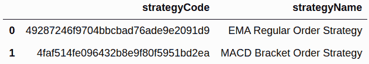
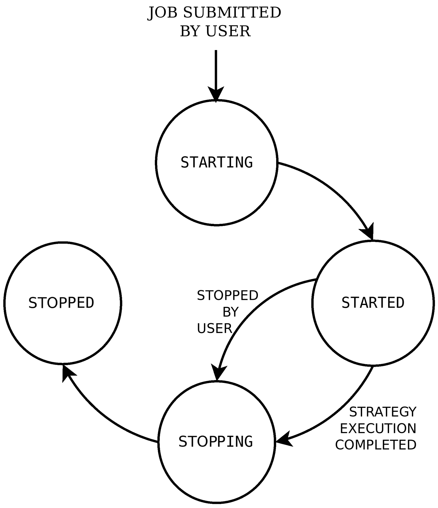
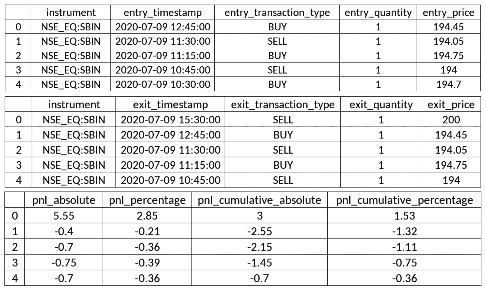
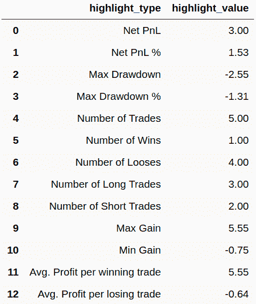
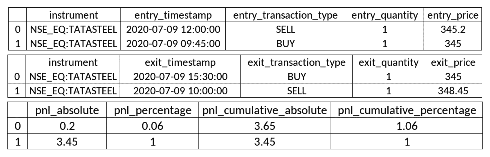
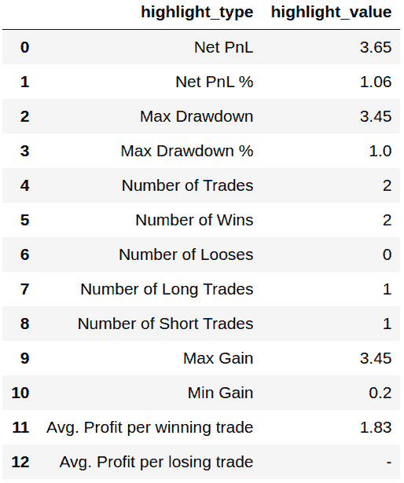

算法交易 - 模拟交易

在第八章 *算法交易策略 - 编码 - 逐步* 中构建算法交易策略，并在上一章成功进行了令人满意的回测后，下一步是在实时市场中模拟交易这些策略。

**模拟交易** 是在实时市场小时内执行交易策略的方法，仅通过实时记录来自策略执行的交易。这些交易不通过经纪人使用真实资金执行。之前，这些交易记录是在纸上完成的，因此称为 **纸上交易**。这些虚拟交易可用于分析风险和回报指标。典型的模拟交易指标包括 **盈亏**（**P&L**）、最大回撤、总交易次数、盈利交易、亏损交易、多头交易和空头交易、每个盈利和亏损交易的平均利润等。应至少进行几个交易日的模拟交易，并在这些指标满足必要要求之前，整个过程应重复进行，包括更新策略参数和/或策略实施，然后进行回测和模拟交易。

模拟交易背后的基本思想是，交易策略可以在实时市场中执行，几乎与实际交易相似，但不冒真实资金的风险。模拟交易有助于确保过去的市场情景，用于回测的情景仍然有效。如果过去的市场情景当前不再存在，即使回测结果盈利，模拟交易结果可能会相反。这表明在将策略用于真实资金之前，策略参数和/或策略实施需要更多工作。

对于模拟交易，需要一个策略配置。其中包含多个参数，其中一些如下：

+   **开始和结束时间**：在当前一天内进行模拟交易的时间段。

+   **金融工具**：应进行模拟交易的一个或多个金融工具。

+   **蜡烛间隔**：各种可能的蜡烛间隔之一 - 例如，`1 分钟`、`15 分钟`、`小时` 或 `日`。

+   **策略特定参数**：策略中定义的自定义参数的值。

+   **策略模式**：即日内或交割。日内策略进行日内订单，这些订单在一天结束时平仓。交割策略进行交割订单，这些订单不会在一天结束时平仓，并会延续到下一个交易日。

执行模拟交易需要一个模拟交易引擎。在本章中，您将使用 AlgoBulls 提供的模拟交易引擎（[`algobulls.com`](https://algobulls.com)），这是一个通过其**开发者选项**提供服务的算法交易平台。它提供了一个名为 `pyalgotrading` 的 Python 包（[`github.com/algobulls/pyalgotrading`](https://github.com/algobulls/pyalgotrading)）来使用这些服务。

您已经在第八章，*算法交易策略 - 逐步编码*，中编写了两种算法交易策略。请回想策略描述如下：

+   **EMA-Regular-Order 策略**：基于 EMA 技术指标和常规订单的策略。（第八章的前六个配方，*算法交易策略 - 逐步编码*。）

+   **MACD-Bracket-Order 策略**：基于 MACD 技术指标和括号订单的策略。（第八章的后六个配方，*算法交易策略 - 逐步编码*。）

这些策略也作为 Python 包的一部分提供，`pyalgostrategypool`。您可以使用 `pip` 安装它，如下所示：`$ pip install pyalgostrategypool`。

您还可以在 GitHub 上查看它们（[`github.com/algobulls/pyalgostrategypool`](https://github.com/algobulls/pyalgostrategypool)）。

由于您已经按照第八章，*算法交易策略 - 逐步编码*，将这两种策略上传到您的 AlgoBulls 账户。在本章中，您将从您的 AlgoBulls 账户中获取这些策略并对其进行模拟交易。在模拟交易后，您将获得策略执行日志和各种报告 - 即损益报告、统计报告和订单历史。这些日志和报告有助于验证策略的性能，并为实际交易做准备。通过使用 `pyalgotrading`，您可以确保在模拟交易中专注于开发和验证策略，而不必担心策略执行所需的生态系统。

本章包括了逐步配方，涵盖了之前提到的两种策略，从与 AlgoBulls 平台建立连接、获取策略、运行模拟交易任务到获取执行日志和各种类型的报告。

本章将涵盖以下内容：

+   EMA-Regular-Order 策略 – 获取该策略

+   EMA-Regular-Order 策略 – 模拟交易该策略

+   EMA-Regular-Order 策略 – 实时获取模拟交易日志

+   EMA-Regular-Order 策略 – 获取模拟交易报告 – 损益表

+   EMA-Regular-Order 策略 – 获取模拟交易报告 – 统计表

+   EMA-Regular-Order 策略 – 获取模拟交易报告 – 订单历史

+   MACD-Bracket-Order 策略 – 获取策略

+   MACD-Bracket-Order 策略 – 模拟交易策略

+   MACD-Bracket-Order 策略 – 获取实时模拟交易日志

+   MACD-Bracket-Order 策略 – 获取模拟交易报告 – P&L 表

+   MACD-Bracket-Order 策略  – 获取模拟交易报告 – 统计表

+   MACD-Bracket-Order 策略 – 获取模拟交易报告 - 订单历史

只有在实时市场小时内运行的模拟交易才有意义，与可以在任何时间运行的回测不同。请确保您在实时市场小时内尝试本章的配方。

# 第十一章：技术要求

要成功执行本章的配方，您需要以下内容：

+   Python 3.7+

+   Python 软件包：

+   `pyalgotrading`（`$ pip install pyalgotrading`）

本章的最新 Jupyter 笔记本可在 GitHub 上找到，网址为[`github.com/PacktPublishing/Python-Algorithmic-Trading-Cookbook/tree/master/Chapter10`](https://github.com/PacktPublishing/Python-Algorithmic-Trading-Cookbook/tree/master/Chapter10)。

# EMA-Regular-Order 策略 – 获取策略

在这个步骤中，您将从您在 AlgoBulls 平台上的帐户中获取策略类`StrategyEMARegularOrder`，这是您在第八章中通过*EMA-Regular-Order 策略 – 在 AlgoBulls 交易平台上上传策略*步骤中上传的。这个步骤首先建立到 AlgoBulls 平台的连接，查询您帐户中所有可用的策略，并获取所需策略类`StrategyEMARegularOrder`的详细信息。

确保您已经完成第八章中的前六个配方，*Algorithmic Trading Strategies – Coding Step by Step*，以获取使用的策略类`StrategyEMARegularOrder`的完整图片。

## 如何操作…

我们为本配方执行以下步骤：

1.  导入必要的模块：

```py
>>> from pyalgotrading.algobulls import AlgoBullsConnection
```

1.  创建一个新的 AlgoBulls 连接对象：

```py
>>> algobulls_connection = AlgoBullsConnection()
```

1.  获取授权 URL：

```py
>>> algobulls_connection.get_authorization_url()
```

我们得到以下输出：

```py
Please login to this URL with your AlgoBulls credentials and get your developer access token: https://app.algobulls.com/user/login
'https://app.algobulls.com/user/login'
```

1.  使用您的 AlgoBulls 凭据登录到上述链接，获取您的令牌，并在此处设置它（有关更多详情，请参阅*附录 II*）：

```py
>>> algobulls_connection.set_access_token(
                    '80b7a69b168c5b3f15d56688841a8f2da5e2ab2c')
```

1.  获取并显示到目前为止您创建和上传的所有策略：

```py
>>> all_strategies = algobulls_connection.get_all_strategies()
>>> all_strategies
```

我们得到以下输出。您的输出可能不同（确保您已经按照第八章中的配方，*Algorithmic Trading Strategies – Coding Step by Step*，来获得类似的输出）：



1.  获取并显示第一个策略的策略代码：

```py
>>> strategy_code1 = all_strategies.iloc[0]['strategyCode']
>>> strategy_code1
```

我们得到以下输出（您的输出可能不同）：

```py
'49287246f9704bbcbad76ade9e2091d9'
```

1.  在模拟交易您的策略之前，您可以检查它以确保您有正确的策略：

```py
>>> strategy_details1 = \
        algobulls_connection.get_strategy_details(strategy_code1)
>>> print(strategy_details1)
```

我们得到以下输出：

```py
class StrategyEMARegularOrder(StrategyBase):

    def __init__(self, *args, **kwargs):
        super().__init__(*args, **kwargs)

        self.timeperiod1 = self.strategy_parameters['timeperiod1']
        self.timeperiod2 = self.strategy_parameters['timeperiod2']

        self.main_order = None

    def initialize(self):
        self.main_order = {}

    @staticmethod
    def name():
        return 'EMA Regular Order Strategy'
    ….
    def strategy_exit_position(self, candle, instrument, 
                               sideband_info):
        if sideband_info['action'] == 'EXIT':
            self.main_order[instrument].exit_position()
            self.main_order[instrument] = None
            return True

        return False
```

这里没有显示完整的输出。请访问以下链接以阅读完整的输出：[`github.com/algobulls/pyalgostrategypool/blob/master/pyalgostrategypool/strategy_ema_regular_order.py`](https://github.com/algobulls/pyalgostrategypool/blob/master/pyalgostrategypool/strategy_ema_regular_order.py)

## 如何运作…

您在*第 1 步*中导入了必要的模块。在*第 2 步*中，创建了 `AlgoBullsConnection` 类的一个实例，命名为 `algobulls_connection`。在*第 3 步*中，您使用 `algobulls_connection` 对象的 `get_authorization_url()` 方法获取授权 URL。这将打印授权 URL。您应该从您的 Web 浏览器中访问此 URL，以登录 AlgoBulls 平台并获取您的开发者访问令牌。（您可以在 *附录 II* 中找到有关从 AlgoBulls 平台获取开发者访问令牌的更多详细信息和截图。）您复制访问令牌，并在*第 4 步*中使用 `algobulls_connection` 的 `set_access_token()` 方法设置它。如果令牌被接受，则会建立与 AlgoBulls 平台的成功连接。

在*第 5 步*，您获取到目前已经在 AlgoBulls 平台上创建并上传的所有策略。您可以使用 `get_all_strategies()` 方法来完成这一步，并将其赋值给一个新变量 `all_strategies`。这个变量是一个 `pandas.DataFrame` 对象，具有 `strategyCode` 和 `strategyName` 两列。该表格保存了您之前上传的策略代码和策略名称的信息。如果您按照 第八章 中的 *EMA-Regular-Order 策略——将策略上传至 AlgoBulls 交易平台* 这一步骤，您会找到一个名为 `EMA-Regular-Order 策略` 的策略。在*第 6 步*，您将 `EMA-Regular-Order 策略` 策略的策略代码赋值给一个新变量 `strategy_code1`。该策略代码将显示在此步骤的输出中。这个策略代码对于 AlgoBulls 平台上的每个策略都是唯一的。

最后，在*第 7 步*，您确保由 `strategy_code1` 引用的策略确实是您之前上传的策略（在 第八章 中的 *EMA-Regular-Order 策略——将策略上传至 AlgoBulls 交易平台* 步骤中，在 *Algorithmic Trading Strategies – Coding Step by Step*）。您使用 `algobulls_connection` 对象的 `get_strategy_details()` 方法来检查策略。此方法以策略代码作为参数。您在这里传递 `strategy_code1`。此方法将整个类代码作为字符串返回。您将其分配给一个新变量 `strategy_details1`，并显示它。

如果您想要更改`strategy_code1`所引用的类代码，如*步骤 7*所示，请参考第八章中*EMA-Regular-Order 策略 - 在 AlgoBulls 交易平台上上传策略*配方的*There's more…*部分，*算法交易策略 - 逐步编码*。

# EMA-Regular-Order 策略 - 对策略进行纸张交易

在这个配方中，您将在`EMA-Regular-Order`策略上进行纸张交易。您必须在上一个配方中从 AlgoBulls 平台上的账户中获取此策略。您将利用`pyalgotrading`提供的纸张交易功能进行此配方，该功能反过来在 AlgoBulls 平台上提交了一份纸张交易作业。

提交后，AlgoBulls 纸张交易引擎将运行纸张交易。您可以随时查询状态，以了解纸张交易作业的状态。作业按照以下给定顺序经历以下状态：

+   `'STARTING'`（中间状态）

+   `'STARTED'`（稳定状态）

+   `'STOPPING'`（中间状态）

+   `'STOPPED'`（稳定状态）

提交作业后，它将以中间状态`'STARTING'`开始。在此状态下，AlgoBulls 纸张交易引擎将获取策略并准备执行环境，这可能需要几分钟的时间。一旦完成，作业将转移到`'STARTED'`状态。纸张交易策略在此阶段发生。在此阶段，它保持不变，直到纸张交易完成。完成后，作业将移动到中间状态`'STOPPING'`。在此状态下，AlgoBulls 纸张交易引擎将清理为此作业分配的资源，这通常需要不到一分钟的时间。最后，作业将移动到`'STOPPED'`状态。

如果您已经提交了策略纸张交易作业，则在第一个作业完成之前，不能提交另一个相同策略的作业。这意味着您必须等待第一个作业进入`'STOPPED'`状态。如果第一个作业运行时间较长，并且您希望立即停止它，则可以通过`pyalgotrading`提交停止作业请求。在提交请求之前，您需要确保作业处于`'STARTED'`状态。

以下状态机图演示了在 AlgoBulls 平台上进行纸张交易作业期间的各种状态和转换：



提交纸张交易作业后，您可以实时获取策略执行的日志和报告。日志和报告有助于验证策略的性能并调试任何潜在问题。

确保您已经阅读了第八章的前六个配方，*算法交易策略 - 逐步编码*，以完全了解所使用的策略类`StrategyEMARegularORder`的完整情况。

## 准备就绪

确保`algobulls_connection`和`strategy_code1`对象在您的 Python 命名空间中可用。请参阅本章第一个配方以设置`algobulls_connection`和`strategy_code1`对象。

## 如何做…

对于这个配方，我们执行以下步骤：

1.  导入必要的模块：

```py
>>> from datetime import time
>>> from pyalgotrading.constants import *
```

1.  使用其交易符号作为关键字搜索工具。将返回的对象赋值给`instruments`：

```py
>>> instruments = algobulls_connection.search_instrument('SBIN')
>>> instruments
```

我们得到以下输出（你的输出可能不同）：

```py
[{'id': 7, 'value': 'NSE:SBIN'}]
```

1.  从`instruments`中获取所选工具的`value`：

```py
>>> instrument = instruments[0]['value']
>>> instrument
```

我们得到以下输出：

```py
'NSE:SBIN'
```

1.  提交一个`strategy_code1`的纸上交易任务：

```py
>>> algobulls_connection.papertrade(strategy_code=strategy_code1, 
        start_time=time(hour=9, minute=15), 
        end_time=time(hour=15, minute=30),
        instrument=instrument, 
        lots=1,
        strategy_parameters={
            'timeperiod1': 5,
            'timeperiod2': 12
        }, 
        candle_interval=CandleInterval.MINUTES_15)
```

我们得到以下输出：

```py
Setting Strategy Config... Success.
Submitting PAPERTRADING job... Success.
```

1.  检查已提交的纸上交易任务的状态：

```py
>>> algobulls_connection.get_papertrading_job_status(
                                                strategy_code1)
```

我们得到以下输出：

```py
{'data': 'STARTING'}
```

1.  再过一段时间后再次检查提交的任务的状态：

```py
>>> algobulls_connection.get_papertrading_job_status(
                                                strategy_code1)
```

我们得到以下输出：

```py
{'data': 'STARTED'}
```

## 工作原理…

在*步骤 1*中，从`datetime`模块中导入`time`类以及从`pyalgotrading.constants`模块中导入所有常量。在*步骤 2*中，使用`algobulls_connection`对象的`search_instrument()`方法获取您想要纸上交易策略的工具，`EMA-Regular-Order strategy`。`search_instrument()`方法接受一个搜索字符串作为参数，该参数应该是您感兴趣的工具的交易符号的一部分或全部。这里你传递了`'SBIN'`。该函数返回一个包含与搜索字符串匹配的工具详细信息的列表。可能有多个工具的交易符号中可能有搜索字符串。在*步骤 3*中，您获取第一个匹配工具的值并将其分配给一个新变量`instrument`。

在*步骤 4*中，使用`algobulls_connection()`对象的`papertrade()`方法提交一个纸上交易任务。它接受以下参数：

+   `strategy_code`: 要执行纸上交易的策略的策略代码。这应该是一个字符串。你在这里传递了`strategy_code1`。

+   `start_time`: 今天开始纸上交易的时间。应该是一个`datetime.time`对象。在这里，你传递了一个包含值为 9 小时 15 分钟的对象 – `time(hour=9, minute=15)`。请参阅本书第一个配方以了解如何创建`time`对象的详细信息。

+   `end_time`: 今天的时间，纸上交易应该执行到什么时候。此对象应该包含一个比`start_time`所持有的值提前的时间值。应该是一个`datetime.time`实例。在这里，你传递一个包含值为 15 小时 30 分钟的对象 – `time(hour=15, minute=30)`。

+   `instrument`: 应该运行纸上交易的金融工具。将为该工具获取历史数据。应该是一个字符串。你在这里传递了`instrument`。

+   `lots`: 纸上交易应该执行的手数。这应该是一个整数。数量由策略计算为*手数×金融工具的手数*。你在这里传递了`1`。

+   `strategy_parameters`: 策略期望的参数名称和值。这应该是一个字典，其中`parameter-name`和`parameter-value`作为键值对。你在这里传递以下参数：

+   `timeperiod1: 5`

+   `timeperiod2: 12 `

（回想一下，EMA-Regular-Order 策略的参数已经在其`__init__()`方法中定义，就像第八章的第一个示例中展示的那样，*按步骤编写算法交易策略*。）

+   `candle_interval`: 获取用于模拟交易的历史数据的蜡烛图间隔。这应该是一个`CandleInterval`类型的枚举。你在这里传递`CandleInterval.MINUTES_15`。（`CandleInterval`枚举提供各种蜡烛图间隔的枚举，其中一些是`MINUTE_1`、`MINUTES_3`、`MINUTES_5`、`MINUTES_10`、`MINUTES_15`、`MINUTES_30`、`HOUR`和`DAY`。）

如果任务提交成功，你将会看到`papertrade()`函数打印的`Success`消息。

一旦提交了任务，它就需要一段时间才能启动。启动后，根据使用`start_time`和`end_time`参数指定的模拟交易持续时间，可能需要一些时间才能完成。通常，模拟交易在整个交易日运行，这意味着任务将运行 6-8 小时。

在*步骤 5* 中，你使用`algobulls_connection`对象的`get_papertrading_job_status()`方法获取任务状态。你在这里传递`strategy_code1`作为参数。该方法返回一个带有单个键值对的字典，即*data*和*job*状态。如果在放置任务后立即查询状态，你会得到`'STARTING'`作为状态。在*步骤 6* 中，你再次查询状态，如果任务已经启动，你会得到状态为`'STARTED'`。

成功的提交意味着已经以所需格式传递了模拟交易策略的最小输入。然而，这并不保证策略会在模拟交易过程中无错误地运行。策略执行仍可能在模拟交易期间遇到错误。要调试执行问题，你需要获取输出日志，这将在下一个示例中解释。导致错误的可能原因可能是策略类 Python 代码中的错误或者传递给`papertrade()`函数的`strategy_parameters`字典不完整。

## 还有更多…

如果一个任务运行时间很长，而你希望在其完成之前停止它，你可以使用`algobulls_connection`对象的`stop_papertrading_job()`方法。此方法接受策略代码作为参数。你在这里传递`strategy_code1`。该方法向 AlgoBulls 模拟交易引擎提交停止请求。如果请求被接受，你会看到一个`Success`消息：

```py
>>> algobulls_connection.stop_papertrading_job(strategy_code1)
 Stopping PAPERTRADING job... Success.
```

如果在提交停止请求后再次查询状态，你会得到状态为`'STOPPING'`：

```py
>>> algobulls_connection.get_papertrading_job_status(strategy_code1)
{'data': 'STOPPING'}
```

如果一段时间后再次查询状态，如果任务已经停止，你会得到状态为`'STOPPED'`：

```py
>>> algobulls_connection.get_papertrading_job_status(strategy_code1)
{'data': 'STOPPED'} 
```

# EMA-Regular-Order 策略 - 实时获取模拟交易日志

在 AlgoBulls 平台上提交模拟交易作业后，AlgoBulls 模拟交易引擎开始执行策略。在执行过程中，AlgoBulls 模拟交易引擎记录发生的每一个事件和所采取的决策，并以文本日志的形式记录具有精确时间戳。一些记录的活动示例包括给定策略配置、定期间隔生成的每个新蜡烛、您的策略打出的交易、这些交易创建的持仓的进入和退出、等待新蜡烛等。这些日志在验证策略行为和调试在开发策略时经常遇到的行为或性能问题方面至关重要。

在这个配方中，你将获取你的策略的模拟交易日志。这些日志会在你提交的模拟交易作业达到`'STARTED'`状态时立即出现（有关模拟交易作业状态的更多信息，请参阅前面的配方）。AlgoBulls 平台允许你实时获取日志，即使模拟交易作业仍在进行中。你可以在无需等待模拟交易作业完成的情况下了解策略执行情况。这对于模拟交易作业通常是长时间运行的情况非常有帮助。`pyalgotrading`包提供了一个简单的方法来获取给定策略的执行日志。

确保你已经阅读了第八章的前六个配方，*算法交易策略 - 逐步编码*，以获取使用的完整策略类`StrategyEMARegularOrder`的完整图片。

## 准备就绪

确保`algobulls_connection`和`strategy_code1`对象在你的 Python 命名空间中可用。请参阅本章的第一个配方，设置`algobulls_connection`和`strategy_code1`对象。

## 如何实现…

执行以下步骤以完成此配方：

1.  获取`strategy_code1`的模拟交易执行日志：

```py
>>> logs = algobulls_connection.get_papertrading_logs(
                                              strategy_code1)
>>> print(logs)
```

我们获得以下输出（您的输出可能不同）：

```py
[2020-07-09 09:12:18] Logs not available yet. Please retry in sometime.
```

1.  过一段时间后，再次获取`strategy_code1`的模拟交易执行日志：

```py
>>> logs = algobulls_connection.get_papertrading_logs(
                                               strategy_code1)
>>> print(logs)
```

我们获得以下输出（您的输出可能不同）：

```py
...
########################################
 INITIALIZING ALGOBULLS CORE (v3.2.0 SECURE MODE)... 
########################################
[2020-07-09 09:12:31] Welcome ALGOBULLS VIRTUAL USER!
[2020-07-09 09:12:31] Reading strategy…
…
[PT] [2020-07-09 09:15:00] [INFO] [tls] STARTING ALGOBULLS CORE…
...
[PT] [2020-07-09 10:30:00] [CRITICAL] [order] [PLACING NEW ORDER] [2020-07-09 10:30:00] [96c24ca4b3e448f381fc5c2bc52f7a29] [BUY] [NSE:SBIN] [QTY:1] [QTY PENDING: 1] [ENTRY PRICE: 194.7] [PRICE:None] [TRIGGER PRICE:None] [ORDER_TYPE_REGULAR] [ORDER_CODE_INTRADAY] [ORDER_VARIETY_MARKET] [ORDER_POSITION_ENTER]
…
[PT] [2020-07-09 15:30:00] [INFO] [clock] Candle generation has been stopped...
[PT] [2020-07-09 15:30:00] [INFO] [tls] Received event END OF MARKET. Stopping Trading Core Engine...
[PT] [2020-07-09 15:30:00] [INFO] [tls] Exiting all open positions with order code: ORDER_CODE_INTRADAY (if any)...
[PT] [2020-07-09 15:30:00] [CRITICAL] [tls] [User: ALGOBULLS VIRTUAL USER] Trading session completed
...
```

这里没有显示完整的输出。请访问以下链接阅读完整的输出：[`github.com/algobulls/pyalgostrategypool/blob/master/pyalgostrategypool/sample/papertrading/strategy_ema_regular_order/logs.txt`](https://github.com/algobulls/pyalgostrategypool/blob/master/pyalgostrategypool/sample/papertrading/strategy_ema_regular_order/logs.txt)

## 工作原理…

在 *第 1 步*，你使用 `algobulls_connection` 对象的 `get_papertrading_logs()` 方法实时获取策略 paper trading 日志。此方法接受策略代码作为参数。你在这里传递了 `strategy_code1`。返回的数据是一个字符串。如果在提交作业后立即尝试此步骤，你会得到一个字符串，表示日志尚未准备好（`[2020-07-09 09:14:18] Logs not available yet. Please retry in sometime.`）。如果 paper trading 作业处于 `'STARTING'` 状态，则会发生这种情况。

在 *第 2 步*，你会在一段时间后再次获取日志。如果作业不再处于 `'STARTING'` 状态，你就开始获取策略执行日志。每次调用 `get_papertrading_logs()` 函数时，你都会获取整个 paper trading 日志。

## 还有更多...

一旦 paper trading 作业转移到 `'STOPPED'` 状态，就不会生成新的日志。你可以在提交下一个相同策略的 paper trading 作业之前的任何时候获取完整的日志。如果提交了新的 paper trading 作业（针对相同的策略），则无法再通过 `get_papertrading_logs()` 方法访问这些日志。如果你想在以后参考它，可以将获取的日志保存到文件中。

# EMA-Regular-Order 策略 – 获取 paper trading 报告 – 盈亏表

在 AlgoBulls 平台提交 paper trading 作业后，AlgoBulls paper trading 引擎开始执行策略。在执行过程中，除了日志之外，AlgoBulls paper trading 引擎还实时生成 P&L 表。这张表记录了策略打出的每一笔交易信息。它还有关于入场和出场订单以及交易 P&L 和累计 P&L 之间的映射的详细信息，按时间顺序排序，最新的订单排在最前面。这张表通过个别和累计 P&L 数字提供了对整体策略表现的洞察。入场-出场订单映射也有助于验证策略行为。

在这个示例中，你将获取你的策略的 P&L 表报告。只要提交 paper trading 作业后，你的策略打出第一笔交易，这份报告就会可用。AlgoBulls 平台允许你实时获取 P&L 表，即使 paper trading 作业仍在进行中。这样可以让你在 paper trading 作业完成之前就了解策略的表现。这对于 paper trading 作业通常需要很长时间的情况很有帮助。`pyalgotrading` 包提供了一种简单的方法来获取给定策略的 P&L 表。

确保你已经通过了 第八章 的前六个示例，*算法交易策略 – 逐步编码*，以完全了解所使用的策略类 `StrategyEMARegularOrder`。

## 准备工作

确保 `algobulls_connection` 和 `strategy_code1` 对象在你的 Python 命名空间中可用。参考本章的第一个示例设置 `algobulls_connection` 和 `strategy_code1` 对象。

## 如何实现...

获取`strategy_code1`的模拟交易 P&L 报告：

```py
>>> algobulls_connection.get_papertrading_report_pnl_table(strategy_code1)
```

我们获得以下输出。你的输出可能会有所不同（请注意以下输出已分成多个表格以表示，你在 Jupyter 笔记本中将看到单个宽表）：



## 工作原理...

在本示例中，你使用 `algobulls_connection` 对象的 `get_papertrading_report_pnl_table()` 方法实时获取模拟交易 P&L 表。此方法接受策略代码作为参数。你在这里传递了 `strategy_code1`。返回数据是一个 `pandas.DataFrame` 对象，具有多列，描述如下：

+   `instrument`: 进行交易的金融工具。

+   `entry_timestamp`: 下达进入订单的时间戳。（注意它可能在进入 `'COMPLETE'` 状态之前保持 `'OPEN'` 状态一段时间。可以使用订单历史表（本章第六个示例中解释）找到此状态转换的时间。）

+   `entry_transaction_type`: 进入订单的交易类型（可以是 `BUY` 或 `SELL`）。

+   `entry_quantity`: 进入订单数量。

+   `entry_price`: 进入订单执行并进入 `'COMPLETE'` 状态的价格。

+   `exit_timestamp`: 下达退出订单的时间戳。（注意它可能在进入 `'COMPLETE'` 状态之前保持 `'OPEN'` 状态一段时间。）

+   `exit_transaction_type`: 退出订单的交易类型（可以是 `BUY` 或 `SELL`）。

+   `exit_quantity`: 退出订单数量。

+   `exit_price`: 退出订单执行并进入 `'COMPLETE'` 状态的价格。

+   `pnl_absolute`: 退出订单执行价格与进入订单执行价格之间的差异。数学上，这是（*exit_price* - *entry_price*）**exit_quantity* （长买）或（*entry_price* - *exit_price*）**exit_quantity*（短卖）。正值意味着交易盈利，负值意味着交易亏损。

+   `pnl_percentage`: 相对于进入价格的利润或损失的百分比。数学上，这是 *pnl_absolute* / *entry_price* / *exit_quantity* x *100*。

+   `pnl_cumulative_absolute`: 累计利润或损失。数学上，这是前期交易的所有 `pnl_absolute` 值的总和。此数字直接反映了策略相对于模拟时间的表现。

+   `pnl_cumulative_percentage`: 相对于进入价格的累计利润或损失的百分比。数学上，这是 *pnl_cumulative* / *entry_price* / *exit_quantity* x *100*。

## 还有更多...

一旦模拟交易任务转移到“停止”状态，P&L 表报告将不再更新。您可以在提交下一个相同策略的模拟交易任务之前随时获取完整的 P&L 报告。如果提交了新的模拟交易任务（针对相同策略），则将无法通过`get_papertrading_report_pnl_table()`方法访问此报告。如果您想以后参考它，可以将获取的报告保存为`.csv`文件。

# EMA-Regular-Order 策略 – 获取模拟交易报告 – 统计表

在 AlgoBulls 平台提交模拟交易任务后，AlgoBulls 模拟交易引擎开始执行策略。在执行过程中，除了日志和 P&L 表外，AlgoBulls 模拟交易引擎还实时从 P&L 表生成摘要。此摘要是包含各种统计数字的统计表，例如`净 P&L`（绝对值和百分比）、`最大回撤`（绝对值和百分比）、总交易次数、盈利交易次数、亏损交易次数、多头交易次数和空头交易次数、最大盈利和最小盈利（或最大亏损），以及每次盈利和亏损交易的平均利润。此表提供了对整体策略绩效的即时概览。

在本示例中，您将获取策略的统计表报告。在提交模拟交易任务后，您的策略打出第一笔交易后，此报告即可获得。AlgoBulls 平台允许您实时获取统计表，即使模拟交易任务仍在进行中。您可以在等待模拟交易任务完成之前了解策略绩效。这对于长时间运行的模拟交易任务非常有帮助。`pyalgotrading`包提供了一种简单的方法来获取给定策略的统计表。

确保您已经阅读了第八章中的前六个示例，*算法交易策略 – 逐步编码*，以完整了解使用的策略类`StrategyEMARegularOrder`。

## 准备工作

确保`algobulls_connection`和`strategy_code1`对象在您的 Python 命名空间中可用。请参考本章的第一个示例设置`algobulls_connection`和`strategy_code1`对象。

## 如何做…

获取`strategy_code1`的模拟交易统计报告：

```py
>>> algobulls_connection.get_papertrading_report_statistics(strategy_code1)
```

我们得到以下输出（您的输出可能不同）：



## 工作原理…

在本示例中，您将使用`algobulls_connection`对象的`get_papertrading_report_statistics()`方法实时获取模拟交易统计表。此方法接受策略代码作为参数。在这里，您传递`strategy_code1`。返回数据是一个`pandas.DataFrame`对象，具有两列—`highlight_type`和`highlight_value`—以及多行。行描述如下：

+   `净盈亏`：累积纸交易盈亏。这也是 P&L 表中第一个条目的`pnl_cumulative_absolute`值。

+   `净盈亏百分比`：累积纸交易盈亏百分比。这也是 P&L 表中第一个条目的`pnl_cumulative_percentage`值。

+   `最大回撤`：P&L 表中`pnl_cumulative`列中的最低值。这表示您的策略在执行过程中遇到的最大损失。

+   `最大回撤百分比`：在数学上，这是*(最大回撤)* / *(相应的入场价格/退出数量 x 100)*。

+   `交易次数`：会话期间的总交易数（入场和退出计为一次）。

+   `盈利次数`：交易盈亏为非负数的次数。

+   `亏损次数`：交易中交易盈亏为负的次数。

+   `多头交易次数`：入场交易类型为`'BUY'`的交易次数。

+   `空头交易次数`：入场交易类型为`'SELL'`的交易次数。

+   `最大获利`：所有交易中 P&L 值最大的交易的 P&L。

+   `最小获利`：所有交易中 P&L 值最小的交易的 P&L。

+   `每笔盈利交易的平均利润`：在数学上，这是*(盈利交易的总 P&L)* / *(盈利交易的数量)*。

+   `每笔亏损交易的平均利润`：在数学上，这是*(亏损交易的总 P&L)* / *(亏损交易的数量)*。

## 还有更多...

如果在纸交易工作仍在运行时获取统计表，则上述数字将是中间数字，基于到达该时间的交易完成情况。随着更多交易被打入，这些数字可能会发生变化，直到纸交易工作完成。

一旦纸张交易工作进入`'STOPPED'`状态，统计表将不再更改。您可以在提交下一个相同策略的纸交易工作之前的任何时间获取完整的统计表。如果提交了新的纸交易工作（用于相同策略），则将无法通过`get_papertrading_report_statistics()`方法访问此表。如果您希望稍后参考它，可以将获取的报告表保存到`.csv`文件中。

# EMA-Regular-Order 策略 – 获取纸交易报告 – 订单历史

在 AlgoBulls 平台上提交了一个模拟交易任务后，AlgoBulls 模拟交易引擎开始执行该策略。在执行过程中，除了日志、损益表和统计表之外，AlgoBulls 模拟交易引擎还会实时生成一个订单历史记录。该记录包含每个订单的状态转换，以及每个订单状态的时间戳和附加信息（如果有）。订单历史记录对于理解一个交易从`'OPEN'`到`'COMPLETE'`或`'CANCELLED'`状态所需的时间非常重要。例如，`MARKET`订单会立即从`'OPEN'`状态转移到`'COMPLETE'`状态，但`LIMIT`订单可能需要一段时间，根据市场条件，才能从`'OPEN'`状态转移到`'COMPLETE'`状态，或者甚至可能转移到`'CANCELLED'`状态。所有这些信息都包含在订单历史记录中。（有关订单状态转换的更多信息，请参考第六章的状态机图。）

在这个示例中，你将获取你的策略的订单历史记录。这个记录在你提交一个模拟交易任务后，你的策略进行了第一笔交易后就可以获取。AlgoBulls 平台允许你实时获取订单历史记录，即使模拟交易任务仍在进行中。这有助于我们在等待模拟交易任务完成之前获取订单的最终状态的详细信息。`pyalgotrading`包提供了一种简单的方法来获取给定策略的订单历史记录。

确保你已经阅读了第八章的前六个示例，*算法交易策略 - 逐步编码*，以获得所使用的策略类`StrategyEMARegularOrder`的完整图片。

## 准备工作

确保你的 Python 命名空间中有`algobulls_connection`和`strategy_code1`对象。参考本章的第一个示例来设置`algobulls_connection`和`strategy_code1`对象。

## 如何做…

获取`strategy_code1`的模拟交易订单历史报告：

```py
>>> order_history = \
        algobulls_connection.get_papertrading_report_order_history(
                                                           strategy_code1)
```

我们获得以下输出。你的输出可能会有所不同：

```py
+-------------+---------------------+----------------------------------+------+
| INST        | TIME                | ID                               | TT   |
|-------------+---------------------+----------------------------------+------|
| NSE_EQ:SBIN | 2020-07-09 10:30:00 | 96c24ca4b3e448f381fc5c2bc52f7a29 | BUY  |
+-------------+---------------------+----------------------------------+------+
+----+---------------------+------------------------+-------+
|    | TIME                | STATE                  | MSG   |
|----+---------------------+------------------------+-------|
|  0 | 2020-07-09 10:30:00 | PUT ORDER REQ RECEIVED |       |
|  1 | 2020-07-09 10:30:00 | VALIDATION PENDING     |       |
|  2 | 2020-07-09 10:30:00 | OPEN PENDING           |       |
|  3 | 2020-07-09 10:30:00 | OPEN                   |       |
|  4 | 2020-07-09 10:30:00 | COMPLETE               |       |
+----+---------------------+------------------------+-------+
+-------------+---------------------+----------------------------------+------+
| INST        | TIME                | ID                               | TT   |
|-------------+---------------------+----------------------------------+------|
| NSE_EQ:SBIN | 2020-07-09 10:45:00 | 3bbd433edd004630b122de07873864d7 | SELL |
+-------------+---------------------+----------------------------------+------+
+----+---------------------+------------------------+-------+
|    | TIME                | STATE                  | MSG   |
|----+---------------------+------------------------+-------|
|  0 | 2020-07-09 10:45:00 | PUT ORDER REQ RECEIVED |       |
|  1 | 2020-07-09 10:45:00 | VALIDATION PENDING     |       |
|  2 | 2020-07-09 10:45:00 | OPEN PENDING           |       |
|  3 | 2020-07-09 10:45:00 | OPEN                   |       |
|  4 | 2020-07-09 10:45:00 | COMPLETE               |       |
+----+---------------------+------------------------+-------+
...
```

完整输出未在此处显示。请访问以下链接以阅读完整输出：[`github.com/algobulls/pyalgostrategypool/blob/master/pyalgostrategypool/sample/papertrading/strategy_ema_regular_order/oms_order_history.log`](https://github.com/algobulls/pyalgostrategypool/blob/master/pyalgostrategypool/sample/papertrading/strategy_ema_regular_order/oms_order_history.log)

## 工作原理…

在这个示例中，你可以使用`algobulls_connection`对象的`get_papertrading_report_order_history()`方法来实时获取订单历史记录。这个方法接受策略代码作为参数。这里传递了`strategy_code1`。返回的数据是一个字符串，描述如下：

对于每个订单，记录中都包含以下信息：

+   一个关于订单的描述性表格，具有以下列：

+   `INST`：订单的金融工具

+   `TIME`：订单下单的时间

+   `ID`：订单的唯一 ID

+   `TT`：订单交易类型（`BUY` 或 `SELL`）

表格的一个示例如下所示：

```py
+-------------+---------------------+----------------------------------+------+
| INST        | TIME                | ID                               | TT   |
|-------------+---------------------+----------------------------------+------|
| NSE_EQ:SBIN | 2020-07-09 10:30:00 | 96c24ca4b3e448f381fc5c2bc52f7a29 | BUY  |
+-------------+---------------------+----------------------------------+------+
```

此信息将帮助您在策略执行日志中找到该订单。

+   一个订单状态转换表，具有以下列：

+   `TIME`：订单在 `'STATE'` 列所表示的状态中出现的时间。

+   `STATE`：订单在 `'TIME'` 列中提到的时间进入此状态。

+   `MSG`：来自 OMS 的任何意外状态转换的额外消息。例如，进入 `REJECTED` 状态的订单会有来自 OMS 的说明其被拒绝的原因的消息。此列通常为空。

表格的一个示例如下所示：

```py
+----+---------------------+------------------------+-------+
|    | TIME                | STATE                  | MSG   |
|----+---------------------+------------------------+-------|
|  0 | 2020-07-09 10:30:00 | PUT ORDER REQ RECEIVED |       |
|  1 | 2020-07-09 10:30:00 | VALIDATION PENDING     |       |
|  2 | 2020-07-09 10:30:00 | OPEN PENDING           |       |
|  3 | 2020-07-09 10:30:00 | OPEN                   |       |
|  4 | 2020-07-09 10:30:00 | COMPLETE               |       |
+----+---------------------+------------------------+-------+
```

从这个表格中，您可以看到在上午 10:30 下单后，订单立即转移到 `'COMPLETE'` 状态。这是预期的，因为订单是常规市价订单。（有关常规市价订单的更多详细信息，请参阅第六章的第一个配方，*在交易所上下单*。）

## 还有更多内容……

一旦 paper trading 任务转移到 `'STOPPED'` 状态，就不会生成新的订单历史记录日志。您可以在提交下一个相同策略的 paper trading 任务之前随时获取完整的订单历史记录日志。如果提交了新的 paper trading 任务（用于相同的策略），则无法通过 `get_papertrading_report_order_history()` 方法访问这些日志。如果您希望稍后参考，可以将获取的日志保存到文件中。

# MACD-Bracket-Order 策略 - 获取策略

在此配方中，您将从 AlgoBulls 平台上的帐户中获取策略类 `StrategyMACDBracketOrder`，您必须在学习[第八章](https://cdp.packtpub.com/python_algorithmic_trading_cookbook/wp-admin/post.php?post=32&action=edit#post_30)的最后一个配方时上传该策略类。该配方从建立到 AlgoBulls 平台的连接开始，查询您帐户中所有可用的策略，然后获取所需的策略类 `StrategyMACDBracketOrder` 的详细信息。

确保您已经学习了[第八章](https://cdp.packtpub.com/python_algorithmic_trading_cookbook/wp-admin/post.php?post=32&action=edit#post_30)的最后六个配方，*算法交易策略 - 逐步编码*，以完全了解所使用的策略类 `StrategyMACDBracketOrder`。

## 怎么做……

我们为这个配方执行以下步骤：

1.  导入必要的模块：

```py
>>> from pyalgotrading.algobulls import AlgoBullsConnection
```

1.  创建一个新的 AlgoBulls 连接对象：

```py
>>> algobulls_connection = AlgoBullsConnection()
```

1.  获取授权 URL：

```py
>>> algobulls_connection.get_authorization_url()
```

我们获得以下输出：

```py
Please login to this URL with your AlgoBulls credentials and get your developer access token: https://app.algobulls.com/user/login
'https://app.algobulls.com/user/login'
```

1.  使用您的 AlgoBulls 凭据登录到上述链接，获取您的令牌，并在此处设置它（有关更多详细信息，请参阅《附录 II》）：

```py
>>> algobulls_connection.set_access_token(
                    '80b7a69b168c5b3f15d56688841a8f2da5e2ab2c')
```

1.  检索并显示你目前已经创建并上传的所有策略：

```py
>>> all_strategies = algobulls_connection.get_all_strategies()
>>> all_strategies
```

我们得到以下输出。你的输出可能会有所不同（确保您已经遵循了《第八章》中的配方，*算法交易策略-逐步编码*，以获得类似的输出）:


1.  检索并显示第二个策略 MACD-Bracket-Order 策略的策略代码：

```py
>>> strategy_code2 = all_strategies.iloc[1]['strategyCode']
>>> strategy_code2
```

我们得到以下输出（你的输出可能会有所不同）：

```py
'49287246f9704bbcbad76ade9e2091d9'
```

1.  在模拟交易您的策略之前，您可以检查您的策略以确保您选择了正确的策略：

```py
>>> strategy_details2 = \
        algobulls_connection.get_strategy_details(strategy_code2)
>>> print(strategy_details2)
```

我们得到以下输出：

```py
class StrategyMACDBracketOrder(StrategyBase):

    def __init__(self, *args, **kwargs):
        super().__init__(*args, **kwargs)

        self.fastMA_period = \
            self.strategy_parameters['fastma_period']
        self.slowMA_period = \
            self.strategy_parameters['slowma_period']
        self.signal_period = \
            self.strategy_parameters['signal_period']
        self.stoploss = \
            self.strategy_parameters['stoploss_trigger']
        self.target = self.strategy_parameters['target_trigger']
        self.trailing_stoploss = \
            self.strategy_parameters['trailing_stoploss_trigger']

        self.main_order = None

    def initialize(self):
        self.main_order = {}

    @staticmethod
    def name():
        return 'MACD Bracket Order Strategy'
    ….
    def strategy_exit_position(self, candle, instrument, 
                               sideband_info):
        if sideband_info['action'] == 'EXIT':
            self.main_order[instrument].exit_position()
            self.main_order[instrument] = None
            return True

        return False
```

此处未显示完整输出。请访问以下链接以阅读完整输出：[`github.com/algobulls/pyalgostrategypool/blob/master/pyalgostrategypool/strategy_macd_bracket_order.py`](https://github.com/algobulls/pyalgostrategypool/blob/master/pyalgostrategypool/strategy_macd_bracket_order.py)

## 工作原理…

在*第 1 步*中，您导入所需的模块。在*第 2 步*中，您创建了`AlgoBullsConnection`类的一个实例，命名为`algobulls_connection`。在*第 3 步*中，您使用`algobulls_connection`对象的`get_authorization_url()`方法获取授权 URL。这将打印授权 URL。您应该从您的网络浏览器访问此 URL 以登录到 AlgoBulls 平台并获取您的开发者访问令牌。 （您可以在《附录 II》中的屏幕截图中找到有关从 AlgoBulls 平台获取开发者访问令牌的更多详细信息。）您复制访问令牌，并在*第 4 步*中使用`algobulls_connection`的`set_access_token()`方法设置它。如果令牌被接受，则与 AlgoBulls 平台建立了成功的连接。

在*第五步*中，您将检索到目前在 AlgoBulls 平台上创建并上传的所有策略。您可以使用`get_all_strategies()`方法来执行此步骤，并将其分配给一个新变量`all_strategies`。此变量是一个`pandas.DataFrame`对象，具有`strategyCode`和`strategyName`两列。此表格包含了您之前上传的策略代码和策略名称的信息。如果您遵循了来自[第八章](https://cdp.packtpub.com/python_algorithmic_trading_cookbook/wp-admin/post.php?post=32&action=edit#post_30)《算法交易策略-逐步编码》的《MACD-Bracket-Order 策略 - 将策略上传到 AlgoBulls 交易平台》的配方，您会发现一个名为`MACD-Regular-Order 策略`的策略。在*第 6 步*中，您将`MACD-Regular-Order 策略`策略的策略代码分配给一个新变量`strategy_code2`。此步骤的输出显示了策略代码。此策略代码对于 AlgoBulls 平台上的每个策略都是唯一的。

最后，在*步骤 7* 中，您确保 `strategy_code2` 引用的策略确实是您之前上传的策略（在第八章的最后一个配方中，*算法交易策略 - 逐步编码*）。您使用 `algobulls_connection` 对象的 `get_strategy_details()` 方法来检查策略。该方法以策略代码作为参数。您在此处传递 `strategy_code2`。该方法将整个类代码作为字符串返回。您将其赋值给一个新变量 `strategy_details2`，并显示它。

如果您想更改由 `strategy_code2` 引用的类代码，就像*步骤 7* 中所示，请参考第八章的最后一个配方的*更多内容*部分，*算法交易策略 - 逐步编码*。

# MACD-Bracket-Order 策略 - 模拟交易策略

在本配方中，您将对 `MACD-Bracket-Order strategy` 策略进行模拟交易。您必须在本章的前一个配方中从 AlgoBulls 平台的您的帐户中获取此策略。您将利用 `pyalgotrading` 提供的模拟交易功能来执行此配方，该功能进而在 AlgoBulls 平台上提交一个模拟交易任务。

一旦提交，模拟交易将由 AlgoBulls 模拟交易引擎运行。您可以随时查询状态以了解模拟交易任务的状态。该任务按以下给定顺序经历以下状态：

+   `'STARTING'`（中间状态）

+   `'STARTED'`（稳定状态）

+   `'STOPPING'`（中间状态）

+   `'STOPPED'`（稳定状态）

在提交任务时，它从一个中间状态 `'STARTING'` 开始。在这种状态下，AlgoBulls 模拟交易引擎将获取策略并准备执行环境，这可能需要几分钟。完成后，任务转移到 `'STARTED'` 状态。模拟交易策略在此阶段发生。在此期间，它会保持不变，直到模拟交易完成。完成后，任务转移到一个中间状态 `'STOPPING'`。在这种状态下，AlgoBulls 模拟交易引擎清理为此任务分配的资源，通常需要不到一分钟。最后，任务移动到 `'STOPPED'` 状态。

如果您已经为一种策略提交了一个模拟交易任务，您就不能再为同一策略提交另一个任务，直到第一个任务完成为止。这意味着您必须等待第一个任务转移到 `'STOPPED'` 状态。如果第一个任务运行时间较长，而您希望立即停止它，您可以通过 `pyalgotrading` 提交一个停止任务请求。在提交请求之前，您需要确保任务处于 `'STARTED'` 状态。

在提交模拟交易任务后，您可以实时获取有关策略执行的日志和报告。这些日志和报告有助于验证策略的性能并调试任何潜在问题。

你可以参考本章的第二个配方，了解 AlgoBulls 平台上一份模拟交易任务的状态机图。它展示了一份模拟交易任务在其生命周期中的各种状态和转换。

确保你已经阅读完第八章的最后六个配方，逐步编码算法交易策略，以全面了解使用的策略类`StrategyMACDBracketOrder`。

## 准备就绪

确保`algobulls_connection` 和 `strategy_code2` 对象在你的 Python 命名空间中可用。请参考本章的*MACD-Bracket-Order 策略 - 获取策略*配方来设置 `algobulls_connection` 和 `strategy_code2` 对象。

## 如何操作…

我们执行以下步骤来完成此配方：

1.  导入必要的模块：

```py
>>> from datetime import time
>>> from pyalgotrading.constants import *
```

1.  使用其交易代码作为关键字搜索仪器。将返回的对象分配给 `instruments`：

```py
>>> instrument = algobulls_connection.search_instrument(
                                                    'TATASTEEL')
>>> instrument
```

我们得到以下输出（你的输出可能不同）：

```py
[{'id': 1, 'value': 'NSE:TATASTEEL'}]
```

1.  从 `instruments` 获取选择仪器的`value`：

```py
>>> instrument = instrument[0]['value']
>>> instrument
```

我们得到以下输出：

```py
'NSE:TATASTEEL'
```

1.  提交一个 `strategy_code2` 的模拟交易任务：

```py
>>> algobulls_connection.papertrade(
        strategy_code=strategy_code2, 
        start_time=time(hour=9, minute=15),
        end_time=time(hour=15, minute=30),
        instrument=instrument,
        lots=1,
        strategy_parameters={
            'fastma_period': 26, 
            'slowma_period': 6, 
            'signal_period': 9,
            'target_trigger': 0.01, 
            'stoploss_trigger': 0.01, 
            'trailing_stoploss_trigger': 1
        },
        candle_interval=CandleInterval.MINUTES_15)
```

我们得到以下输出：

```py
Setting Strategy Config... Success.
Submitting PAPERTRADING job... Success.
```

1.  检查已提交的模拟交易任务的状态：

```py
>>> algobulls_connection.get_papertrading_job_status(
                                                strategy_code2)
{'data': 'STARTING'}
```

1.  再过一段时间后再次检查提交的模拟交易任务的状态：

```py
>>> algobulls_connection.get_papertrading_job_status(
                                                strategy_code2)
{'data': 'STARTED'} 
```

## 工作原理如下…

在 *步骤 1* 中，你从 `datetime` 模块导入 `time` 类和`pyalgotrading.constants` 模块中的所有常量。在 *步骤 2* 中，你使用 `algobulls_connection` 对象的 `search_instrument()` 方法获取你想要进行策略模拟交易的仪器，即 `MACD-Bracket-Order strategy`。`search_instrument()` 方法接受一个搜索字符串作为参数，这个字符串应该是你感兴趣的仪器的交易代码的部分或完整代码。在这里你传递了 `'TATASTEEL'`。这个函数返回一个包含与搜索字符串匹配的仪器详情的列表。可能有多个仪器的交易代码中包含搜索字符串。在 *步骤 3* 中，你获取第一个匹配仪器的值，并将其分配给一个新变量，`instrument`。

在 *步骤 4* 中，你使用 `algobulls_connection()` 对象的 `papertrade()` 方法提交了一个模拟交易任务。它接受以下参数：

+   `strategy_code`：要执行模拟交易的策略的策略代码。应该是一个字符串。你在这里传递了 `strategy_code2`。

+   `start_time`：应该开始模拟交易的今天时间。应该是一个`datetime.time`对象。在这里，你传递一个持有 9 小时 15 分钟值的对象 - `time(hour=9, minute=15)`。有关创建`time`对象的详细信息，请参考本书的第一个配方。

+   `end_time`：应该执行模拟交易的今天时间。这个对象应该是 `start_time` 持有的值之后的时间值。应该是一个 `datetime.time` 实例。在这里，你传递一个持有 15:30 小时值的对象 - `time(hour=15, minute=30)`。

+   `instrument`: 应运行纸张交易的金融工具。将获取此工具的历史数据。应为字符串。你在此处传递`instrument`。

+   `lots`: 应执行纸张交易的批次数。应为整数。数量由策略计算为*批次数* × *金融工具的批次大小*。你在此处传递`1`。

+   `strategy_parameters`: 策略期望的参数名称和值。应为字典，带有`parameter-name`和`parameter-value`作为键值对。你在此处传递以下参数：

+   `fastma_period: 26`

+   `slowma_period: 6`

+   `signal_period: 9`

+   `target_trigger: 0.01`

+   `stoploss_trigger: 0.01`

+   `trailing_stoploss_trigger: 1`

（回想一下 MACD-Bracket-Order 策略的参数已在其`__init__()`方法中定义，如第八章的第一个示例所示，*算法交易策略 - 逐步编码*）。

+   `candle_interval`: 用于获取用于纸张交易的历史数据的蜡烛图间隔。应为`CandleInterval`类型的枚举。你在此处传递`CandleInterval.MINUTES_15`。（`CandleInterval`枚举提供各种蜡烛图间隔的枚举，其中一些是`MINUTE_1`，`MINUTES_3`，`MINUTES_5`，`MINUTES_10`，`MINUTES_15`，`MINUTES_30`，`HOUR`和`DAY`）。

如果作业提交成功，则`papertrade()`函数将打印`Success`消息。

提交作业后，启动需要一段时间。启动后，根据使用`start_time`和`end_time`参数指定的纸张交易持续时间的长短，完成可能需要一些时间。通常，纸张交易运行整个交易日，这意味着作业将运行 6-8 小时。

在*步骤 5*中，您使用`algobulls_connection`对象的`get_papertrading_job_status()`方法获取作业状态。你在此处传递`strategy_code2`作为参数。此方法返回一个带有单个键值对的字典，*数据*和*作业*状态。如果在放置作业后立即查询状态，则会得到`'STARTING'`作为状态。在*步骤 6*中，您再次查询状态，如果作业已经启动，则会得到状态为`'STARTED'`。

成功提交意味着已以所需格式传递了用于纸张交易策略的最小输入。但是，这并不保证策略在纸张交易期间不会出现错误。策略执行在纸张交易期间仍可能遇到错误。要调试执行问题，您需要获取输出日志，下一节将对此进行解释。错误的可能原因可能是策略类 Python 代码中的错误或传递给`papertrade()`函数的`strategy_parameters`字典不完整。

## 还有更多...

如果作业运行时间很长，并且您希望在完成之前停止它，您可以使用`algobulls_connection`对象的`stop_papertrading_job()`方法。此方法接受策略代码作为参数。这里传递了`strategy_code2`。此方法向 AlgoBulls 模拟交易引擎提交停止请求。如果请求被接受，您将在此处看到一个`Success`消息：

```py
>>> algobulls_connection.stop_papertrading_job(strategy_code2)
 Stopping PAPERTRADING job... Success.
```

如果在提交停止请求后查询状态，则状态为`'STOPPING'`：

```py
>>> algobulls_connection.get_papertrading_job_status(strategy_code2)
{'data': 'STOPPING'}
```

如果过一段时间后再次查询状态，如果作业已停止，则状态为`'STOPPED'`：

```py
>>> algobulls_connection.get_papertrading_job_status(strategy_code2)
{'data': 'STOPPED'} 
```

# MACD-Bracket-Order 策略 – 实时获取模拟交易日志

在 AlgoBulls 平台上提交模拟交易作业后，AlgoBulls 模拟交易引擎开始执行策略。在执行过程中，AlgoBulls 模拟交易引擎记录了发生的每个事件以及采取的决策，以确切的时间戳形式记录在文本日志中。记录的活动示例包括给定策略配置，定期生成的每个新蜡烛，您的策略打出的交易，这些交易创建的持仓的进入和退出，等待新蜡烛等。这些日志在验证策略行为和调试开发策略时经常遇到的行为或性能问题方面至关重要。

在本配方中，您将为您的策略获取模拟交易日志。一旦您提交的模拟交易作业达到`'STARTED'`状态（有关模拟交易作业状态的更多信息，请参考前面的配方），日志就会开始出现。AlgoBulls 平台允许您实时获取日志，即使模拟交易作业仍在进行中。您可以在不等待模拟交易作业完成的情况下了解策略执行情况，这在作业运行时间较长时非常有用。`pyalgotrading`包提供了一个简单的方法来获取给定策略的执行日志。

确保您已经阅读了第八章的最后六个配方，*算法交易策略 – 逐步编码*，以获得使用的完整策略类`StrategyMACDBracketOrder`的完整图片。

## 准备工作

确保`algobulls_connection`和`strategy_code2`对象在你的 Python 命名空间中可用。参考本章的 *MACD-Bracket-Order 策略 – 获取策略* 配方来设置`algobulls_connection`和`strategy_code2`对象。

## 如何做…

我们执行以下步骤来完成此配方：

1.  获取`strategy_code2`的模拟交易执行日志：

```py
>>> logs = algobulls_connection.get_papertrading_logs(
                                                strategy_code2)
>>> print(logs)
```

我们得到以下输出（你的输出可能会有所不同）：

```py
[2020-07-09 09:14:12] Logs not available yet. Please retry in sometime.
```

1.  过一段时间后再次获取`strategy_code2`的模拟交易执行日志：

```py
>>> logs = algobulls_connection.get_papertrading_logs(
                                                strategy_code2)
>>> print(logs)
```

我们得到以下输出（你的输出可能会有所不同）：

```py
...
########################################
 INITIALIZING ALGOBULLS CORE (v3.2.0)... 
########################################
…
[PT] [2020-07-09 09:15:00] [INFO] [tls] STARTING ALGOBULLS CORE…
…
[PT] [2020-07-09 09:45:00] [CRITICAL] [order] [PLACING NEW ORDER] [2020-07-09 09:45:00] [a310755e3d8b4a1ab4667882bf25751d] [BUY] [NSE:TATASTEEL] [QTY:1] [QTY PENDING: 1] [ENTRY PRICE: 345.0] [PRICE:345.0] [TRIGGER PRICE:None] [ORDER_TYPE_BRACKET] [ORDER_CODE_INTRADAY] [ORDER_VARIETY_LIMIT] [ORDER_POSITION_ENTER] [STOPLOSS TRIGGER:341.55] [TARGET TRIGGER:348.45] [TRAILING STOPLOSS TRIGGER:345.0]
...
[PT] [2020-07-09 15:30:00] [INFO] [clock] Candle generation has been stopped...
[PT] [2020-07-09 15:30:00] [INFO] [tls] Received event END OF MARKET. Stopping Trading Core Engine...
[PT] [2020-07-09 15:30:00] [INFO] [tls] Exiting all open positions with order code: ORDER_CODE_INTRADAY (if any)...
[PT] [2020-07-09 15:30:00] [CRITICAL] [tls] [User: ALGOBULLS VIRTUAL USER] Trading session completed
…
```

此处未显示完整输出。请访问以下链接阅读完整输出：[`github.com/algobulls/pyalgostrategypool/blob/master/pyalgostrategypool/sample/papertrading/strategy_macd_bracket_order/logs.txt`](https://github.com/algobulls/pyalgostrategypool/blob/master/pyalgostrategypool/sample/papertrading/strategy_macd_bracket_order/logs.txt)

## 如何运作…

在*第一步*中，您使用`algobulls_connection`对象的`get_papertrading_logs()`方法实时获取策略的模拟交易日志。此方法接受策略代码作为参数。您在这里传递了`strategy_code2`。返回的数据是一个字符串。如果在提交作业后立即尝试此步骤，您将获得一个字符串，该字符串表示日志尚未准备好（`[2020-07-09 09:14:12] 日志尚未准备好，请稍后重试。`）。如果模拟交易任务处于`'STARTING'`状态，就会发生这种情况。

在*第二步*中，您再次经过一段时间后重新获取日志。如果任务处于`'STARTING'`状态之外，您将开始获取您的策略执行日志。每次调用`get_papertrading_logs()`函数时，您都会获得整个模拟交易日志。

## 更多内容…

一旦模拟交易任务转移到`'STOPPED'`状态，就不会生成新的日志。您可以在提交下一个相同策略的模拟交易任务之前的任何时候获取完整的日志。如果提交了新的模拟交易任务（针对相同的策略），则无法通过`get_papertrading_logs()`方法再访问这些日志。如果您希望稍后参考它，可以将获取的日志保存到文件中。

# MACD-Bracket-Order 策略 - 获取模拟交易报告 - 盈亏表

在 AlgoBulls 平台上提交模拟交易任务后，AlgoBulls 模拟交易引擎开始执行策略。在执行过程中，随着日志一起，AlgoBulls 模拟交易引擎还实时生成了一张 P&L 表。该表包含策略打出的每笔交易的信息。它还包括了入场和出场订单以及交易 P&L 和累计 P&L 之间的映射细节，按时间顺序排列，最新订单排在最前面。该表通过个人和累计 P&L 数字提供了对整体策略表现的洞察。入场-出场订单映射还有助于验证策略行为。

在此示例中，您将获取策略的 P&L 表报告。只要提交模拟交易任务后您的策略打出了第一笔交易，此报告就可用。AlgoBulls 平台允许您实时获取 P&L 表，即使模拟交易任务仍在进行中。您无需等待模拟交易任务完成即可了解策略表现。这对于模拟交易任务通常需要长时间运行很有帮助。`pyalgotrading`包提供了一个简单的方法来获取给定策略的 P&L 表。

确保你已经阅读了第八章的最后六个示例，*算法交易策略-逐步编码*，以完整了解使用的策略类，`StrategyMACDBracketOrder`。

## 准备工作

确保`algobulls_connection`和`strategy_code2`对象在你的 Python 命名空间中可用。参考本章的*MACD-Bracket-Order 策略-获取策略*示例来设置`algobulls_connection`和`strategy_code2`对象。

## 如何操作...

获取`strategy_code2`的模拟交易盈亏报告：

```py
>>> algobulls_connection.get_papertrading_report_pnl_table(strategy_code2)
```

我们得到以下输出。你的输出可能不同（请注意，以下输出已被拆分为多个表以进行表示。你将在你的 Jupyter 笔记本中看到一个单独的宽表）：



## 工作原理...

在这个示例中，你将使用`algobulls_connection`对象的`get_papertrading_report_pnl_table()`方法实时获取模拟交易的盈亏表。该方法接受策略代码作为参数。你在这里传递了`strategy_code2`。返回的数据是一个`pandas.DataFrame`对象，具有多列，描述如下：

+   `instrument`: 进行交易的金融工具。

+   `entry_timestamp`: 进入订单放置的时间戳。（请注意，它可能在进入`'COMPLETE'`状态之前保持`'OPEN'`状态一段时间。此状态转换的时间可以在本章的*EMA-Regular-Order 策略-获取模拟交易报告-订单历史*示例中的订单历史表中找到。）

+   `entry_transaction_type`: 进场订单交易类型（`BUY` 或 `SELL`）。

+   `entry_quantity`: 进场订单数量。

+   `entry_price`: 进入订单执行的价格并进入`'COMPLETE'`状态。

+   `exit_timestamp`: 退出订单放置的时间戳。（请注意，它可能在进入`'COMPLETE'`状态之前保持`'OPEN'`状态一段时间。）

+   `exit_transaction_type`: 退出订单交易类型（`BUY` 或 `SELL`）。

+   `exit_quantity`: 退出订单数量。

+   `exit_price`: 退出订单执行的价格并进入`'COMPLETE'`状态。

+   `pnl_absolute`: 退出订单执行价格与进入订单执行价格之间的差异。在数学上，这是（*exit_price* - *entry_price*）**exit_quantity* （对于多头交易）和（*entry_price* - *exit_price*）**exit_quantity* （对于空头交易）。正值意味着交易盈利，负值意味着交易亏损。

+   `pnl_percentage`: 相对于进场价格的利润或亏损百分比。在数学上，这是*pnl_absolute* / *entry_price* / *exit_quantity* x *100*。

+   `pnl_cumulative_absolute`：累积利润或损失。在数学上，这是前期交易的所有`pnl_absolute`值的总和。这个数字直接反映了策略在模拟时间上的表现。

+   `pnl_cumulative_percentage`：累积利润或损失的百分比，与进场价格相比。在数学上，这是 *pnl_cumulative* / *entry_price* / *exit_quantity* x *100*。

## 还有更多...

一旦模拟交易任务进入`'STOPPED'`状态，损益表报告将不再更新。在提交下一个相同策略的模拟交易任务之前，您可以随时获取完整的损益报告。如果提交了新的模拟交易任务（相同策略），则无法再通过`get_papertrading_report_pnl_table()`方法访问此报告。如果您希望在以后参考该报告，可以将获取的报告保存到`.csv`文件中。

# MACD-Bracket-Order 策略 - 获取模拟交易报告 - 统计表

在 AlgoBulls 平台上提交模拟交易任务后，AlgoBulls 模拟交易引擎开始执行策略。在执行过程中，除了日志和损益表之外，AlgoBulls 模拟交易引擎还实时从损益表生成摘要。这个摘要是一个包含各种统计数字的统计表，如`净盈亏`（绝对值和百分比）、`最大回撤`（绝对值和百分比）、总交易次数、盈利交易次数、亏损交易次数、多头交易次数和空头交易次数、最大收益和最小收益（或最大损失），以及盈利和亏损交易的平均利润。这张表可以立即了解整体策略的表现。

在本示例中，您将获取策略的统计表报告。在您提交模拟交易任务后，只要您的策略 punched 第一笔交易，此报告即可获得。AlgoBulls 平台允许您实时获取统计表，即使模拟交易任务仍在进行中。您可以在等待模拟交易任务完成之前即可获得策略表现的见解。这对于模拟交易任务通常持续很长时间来说是有帮助的。`pyalgotrading`包提供了一个简单的方法来获取给定策略的统计表。

确保你已经阅读了第八章的最后六个示例，*算法交易策略 - 逐步编码*，以完全了解所使用的策略类`StrategyMACDBracketOrder`的全貌。

## 准备工作

确保`algobulls_connection`和`strategy_code2`对象在您的 Python 命名空间中可用。参考本章的*MACD-Bracket-Order 策略 - 获取策略*示例设置`algobulls_connection`和`strategy_code2`对象。

## 如何做...

获取`strategy_code2`的模拟交易统计报告：

```py
>>> algobulls_connection.get_papertrading_report_statistics(strategy_code2)
```

我们得到以下输出（你的输出可能有所不同）：



## 工作原理...

在此示例中，您使用`algobulls_connection`对象的`get_papertradig_report_statistics()`方法实时获取模拟交易统计表。此方法接受策略代码作为参数。您在此处传递了`strategy_code2`。返回的数据是一个`pandas.DataFrame`对象，有两列—`highlight_type`和`highlight_value`—以及多行。行描述如下：

+   `净盈亏`：累计模拟交易盈亏。这也是盈亏表中第一项的`pnl_cumulative_absolute`值。

+   `净盈亏百分比`：累计模拟交易盈亏百分比。这也是盈亏表中第一项的`pnl_cumulative_percentage`值。

+   `最大回撤`：盈亏表中`pnl_cumulative`列中的最低值。这表示您的策略在执行过程中遇到的最大损失。

+   `最大回撤百分比`：数学上来说，这是*(最大回撤)* / *(相应的入场价格 / 出场数量)* × *100*。

+   `交易数目`：会话期间的总交易数（入场和出场计为一次）。

+   `获利次数`：交易盈亏为非负数的交易计数。

+   `亏损次数`：交易盈亏为负数的交易计数。

+   `多头交易数目`：入场交易类型为`'BUY'`的交易计数。

+   `空头交易数目`：入场交易类型为`'SELL'`的交易计数。

+   `最大盈利`：所有交易中盈利最高的交易的盈亏（P&L）。

+   `最小盈利`：所有交易中盈利最低的交易的盈亏（P&L）。

+   `平均每次盈利交易盈利`：数学上来说，这是*(盈利交易的总盈亏)* / *(盈利交易的计数)*。

+   `平均每次亏损交易盈利`：数学上来说，这是*(亏损交易的总盈亏)* / *(亏损交易的计数)*。

## 更多内容...

如果在模拟交易作业仍在运行时获取统计表，则先前提到的数字将是中间数字，基于直到那时完成的交易。随着更多交易完成直到模拟交易作业完成，这些数字可能会更改。

一旦模拟交易作业转移到`'STOPPED'`状态，统计表将不再更改。在提交下一个相同策略的模拟交易作业之前，您可以随时获取完整的统计表。如果提交了新的模拟交易作业（针对相同策略），则无法通过`get_papertrading_report_statistics()`方法再次访问此表。如果您希望稍后参考，可以将获取的报告保存到`.csv`文件中。

# MACD-Bracket-Order 策略 – 获取模拟交易报告 – 订单历史

在 AlgoBulls 平台上提交了一个模拟交易作业后，AlgoBulls 模拟交易引擎开始执行策略。在执行过程中，除了日志、盈亏表和统计表之外，AlgoBulls 模拟交易引擎还实时生成订单历史记录。此日志包含每个订单的状态转换，以及每个订单状态的时间戳和其他信息（如果有的话）。订单历史记录对于理解交易从 `'OPEN'` 状态到 `'COMPLETE'` 或 `'CANCELLED'` 状态所需的时间至关重要。例如，`MARKET` 订单将立即从 `'OPEN'` 转换到 `'COMPLETE'` 状态，但是 `LIMIT` 订单可能需要一段时间，根据市场情况，从 `'OPEN'` 转换到 `'COMPLETE'` 状态，或者甚至转换到 `'CANCELLED'` 状态。所有这些信息都包含在订单历史记录中。（有关订单状态转换的更多信息，请参阅 第六章 中的状态机图，*在交易所上放置常规订单*。）

在这个示例中，您将获取您策略的订单历史记录。此日志在您提交模拟交易作业后，您的策略第一笔交易打入后即可使用。即使模拟交易作业仍在进行中，AlgoBulls 平台也允许您实时获取订单历史记录。这有助于我们获取最终状态订单的详细信息，而无需等待模拟交易作业完成。`pyalgotrading` 包提供了一个简单的方法来获取给定策略的订单历史记录。

确保您已经阅读了 第八章 的最后六个示例，*算法交易策略 - 逐步编码*，以获取使用的策略类 `StrategyMACDBracketOrder` 的完整图景。

## 准备工作

确保您的 Python 命名空间中可用 `algobulls_connection` 和 `strategy_code2` 对象。请参阅本章 *MACD-Bracket-Order 策略 - 获取策略* 的示例设置 `algobulls_connection` 和 `strategy_code2` 对象。

## 如何做...

获取 `strategy_code2` 的模拟交易订单历史报告：

```py
>>> order_history = \
        algobulls_connection.get_papertrading_report_order_history(
                                                         strategy_code2)
>>> print(order_history)
```

我们得到以下输出（您的输出可能有所不同）：

```py
…
+------------------+---------------------+----------------------------------+------+
| INST             | TIME                | ID                               | TT   |
|------------------+---------------------+----------------------------------+------|
| NSE_EQ:TATASTEEL | 2020-07-09 10:00:00 | 56970bffe8be4650a71857bc4472e6c8 | SELL |
+------------------+---------------------+----------------------------------+------+
+----+---------------------+------------------------+-------+
|    | TIME                | STATE                  | MSG   |
|----+---------------------+------------------------+-------|
|  0 | 2020-07-09 10:00:00 | PUT ORDER REQ RECEIVED |       |
|  1 | 2020-07-09 10:00:00 | VALIDATION PENDING     |       |
|  2 | 2020-07-09 10:00:00 | OPEN PENDING           |       |
|  3 | 2020-07-09 10:00:00 | OPEN                   |       |
|  4 | 2020-07-09 10:15:00 | COMPLETE               |       |
+----+---------------------+------------------------+-------+
+------------------+---------------------+----------------------------------+------+
| INST             | TIME                | ID                               | TT   |
|------------------+---------------------+----------------------------------+------|
| NSE_EQ:TATASTEEL | 2020-07-09 10:00:00 | 0a06e41aac0744adb45bb4d3d2e19728 | SELL |
+------------------+---------------------+----------------------------------+------+
+----+---------------------+------------------------+-------+
|    | TIME                | STATE                  | MSG   |
|----+---------------------+------------------------+-------|
|  0 | 2020-07-09 10:00:00 | PUT ORDER REQ RECEIVED |       |
|  1 | 2020-07-09 10:00:00 | VALIDATION PENDING     |       |
|  2 | 2020-07-09 10:00:00 | OPEN PENDING           |       |
|  3 | 2020-07-09 10:00:00 | TRIGGER PENDING        |       |
|  4 | 2020-07-09 10:15:00 | CANCEL PENDING         |       |
|  5 | 2020-07-09 10:15:00 | CANCELLED              |       |
+----+---------------------+------------------------+-------+
...
```

此处未显示完整输出。请访问以下链接阅读完整输出：[`github.com/algobulls/pyalgostrategypool/blob/master/pyalgostrategypool/sample/papertrading/strategy_macd_bracket_order/oms_order_history.log`](https://github.com/algobulls/pyalgostrategypool/blob/master/pyalgostrategypool/sample/papertrading/strategy_macd_bracket_order/oms_order_history.log)

## 工作原理...

在这个示例中，您使用 `algobulls_connection` 对象的 `get_papertrading_report_order_history()` 方法实时获取订单历史记录。该方法接受策略代码作为参数。您在此处传递 `strategy_code2`。返回的数据是一个字符串，描述如下：

对于每个订单，日志都包含以下信息：

+   一个关于订单的描述性表，列出了以下列：

+   `INST`：订单的财务工具

+   `TIME`：订单下达的时间

+   `ID`：订单的唯一 ID

+   `TT`：订单交易类型（`买入` 或 `卖出`）

表格的示例如下所示：

```py
+------------------+---------------------+----------------------------------+------+
| INST             | TIME                | ID                               | TT   |
|------------------+---------------------+----------------------------------+------|
| NSE_EQ:TATASTEEL | 2020-07-09 10:00:00 | 0a06e41aac0744adb45bb4d3d2e19728 | SELL |
+------------------+---------------------+----------------------------------+------+
```

这些信息将帮助您在策略执行日志中找到这个确切的订单。

+   一个订单状态转换表，列出了以下列：

+   `TIME`：订单进入由 `STATE` 列表示的状态的时间戳。

+   `STATE`：订单在 `TIME` 列中提到的时间进入此状态。

+   `MSG`：来自 OMS 的关于任何意外状态转换的附加消息。例如，进入 `REJECTED` 状态的订单会有来自 OMS 的消息说明其被拒绝的原因。此列通常为空。

表格的示例如下所示：

```py
+----+---------------------+------------------------+-------+
|    | TIME                | STATE                  | MSG   |
|----+---------------------+------------------------+-------|
|  0 | 2020-07-09 10:00:00 | PUT ORDER REQ RECEIVED |       |
|  1 | 2020-07-09 10:00:00 | VALIDATION PENDING     |       |
|  2 | 2020-07-09 10:00:00 | OPEN PENDING           |       |
|  3 | 2020-07-09 10:00:00 | TRIGGER PENDING        |       |
|  4 | 2020-07-09 10:15:00 | CANCEL PENDING         |       |
|  5 | 2020-07-09 10:15:00 | CANCELLED              |       |
+----+---------------------+------------------------+-------+
```

从这个表中，你可以看到在上午 10:00 下达订单后，它转换到 `TRIGGER PENDING` 状态。它在那里停留了 15 分钟，然后转换到 `CANCELLED` 状态。这是符合预期的，因为订单是一个限价范围订单。

## 这还不是全部...

一旦模拟交易作业进入 `STOPPED` 状态，就不会生成新的订单历史记录日志。您可以在提交下一个相同策略的模拟交易作业之前随时获取完整的订单历史记录日志。如果提交了新的模拟交易作业（对于相同的策略），则无法通过 `get_papertrading_report_order_history()` 方法访问这些日志。如果您希望稍后参考这些日志，可以将获取的日志保存到文件中。
