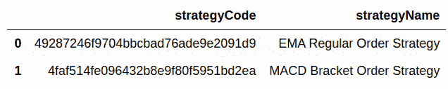
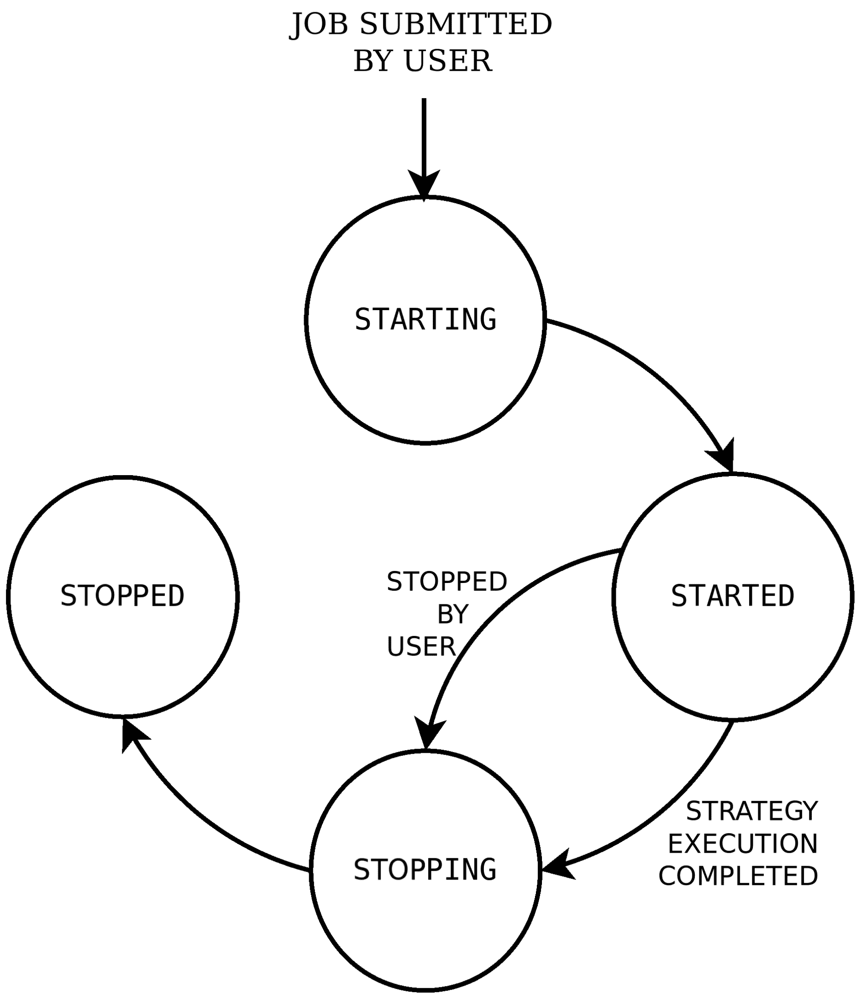
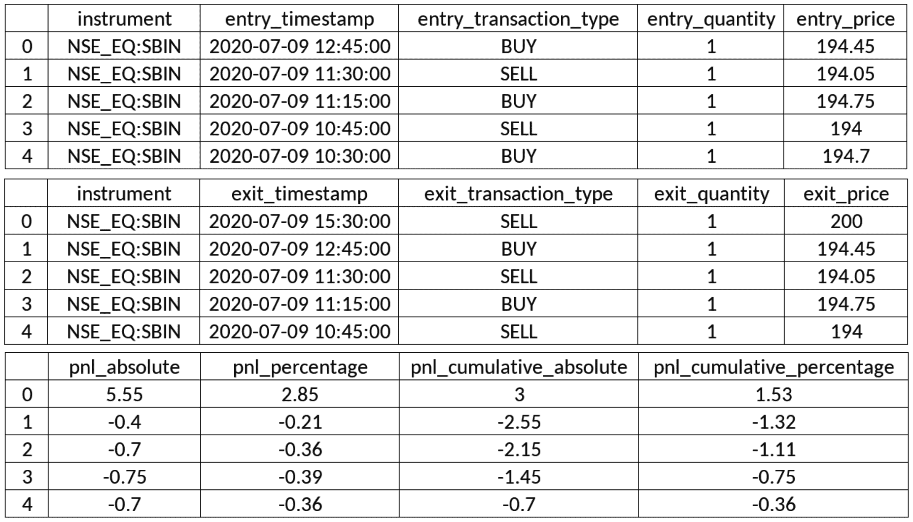
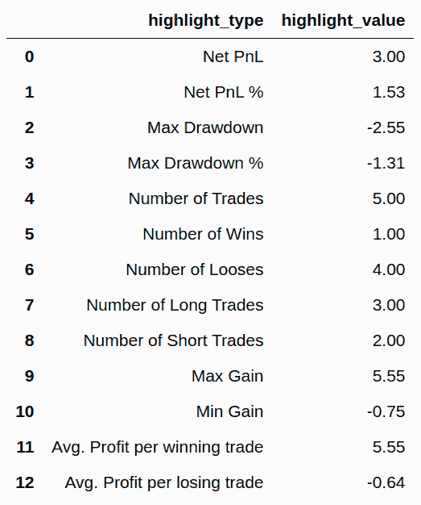
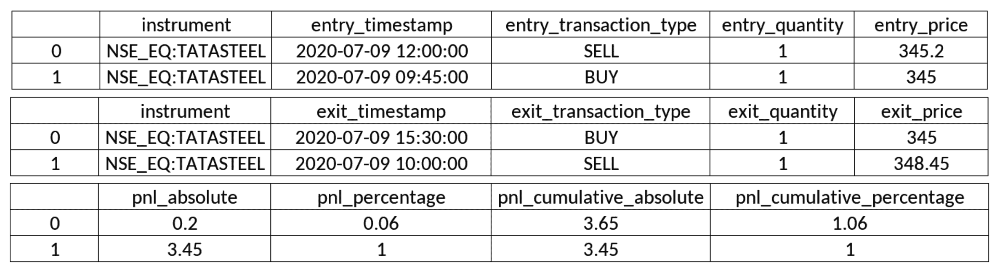
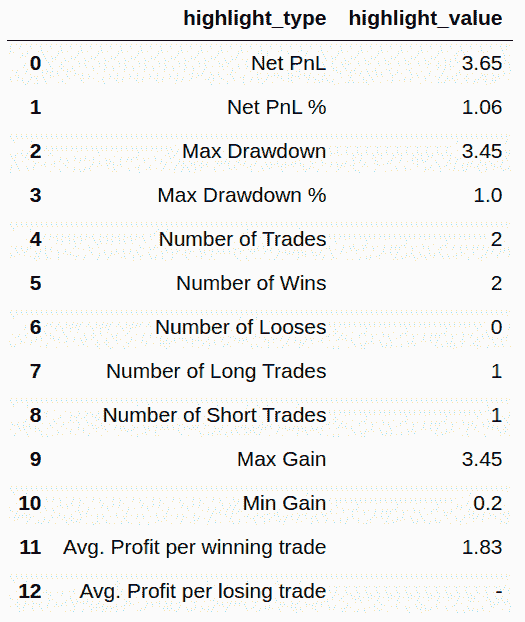

算法交易 - 实际交易

现在我们已经建立了各种算法交易策略，并成功地进行了令人满意的回测，并在实时市场中进行了纸上交易，现在终于到了进行实际交易的时候了。

实际交易是指我们在真实市场小时内用真钱执行交易策略。如果您的策略在回测和纸上交易中表现良好，您可以期待在真实市场中获得类似的结果。请注意，尽管您的策略在回测和纸上交易中表现良好，但在真实市场中可能表现不如预期。盈利的回测和纸上交易结果是盈利的实际交易经验的前提，但不足以保证每个交易会盈利。

对于实际交易，需要策略配置。它包含多个参数，其中一些如下：

+   **开始和结束时间**：在当前一天内进行纸上交易的时间段。

+   **金融工具**：进行纸上交易的一个或多个金融工具。

+   **蜡烛间隔**：各种可能的蜡烛间隔之一；例如，`1 分钟`，`15 分钟`，`小时`或`天`。

+   **策略特定参数**：在策略中定义的自定义参数的值。

+   **策略模式**：其中之一是日内或交割。日内策略 punch 日内订单，这些订单在当天结束时平仓。交割策略 punch 交割订单，这些订单不会在当天结束时平仓，而会被延续到下一个交易日。

实际交易引擎需要根据给定的策略执行实际交易。在本章中，您将使用由 AlgoBulls 提供的实际交易引擎（[`algobulls.com`](https://algobulls.com)），这是一个通过其开发者选项提供其服务的算法交易平台。它提供了一个名为 `pyalgotrading` 的 Python 包（[`github.com/algobulls/pyalgotrading`](https://github.com/algobulls/pyalgotrading)）来提供这些服务。

您在 第八章 中编写了两个算法交易策略，*逐步编码算法交易策略*。请回忆一下策略描述如下：

+   **EMA-Regular-Order 策略**：基于技术指标 EMA 和常规订单的策略。（第七章的前六个配方，*在交易所上放置挂单和止损单*）

+   **MACD-Bracket-Order 策略**：基于技术指标 MACD 和挂单的策略。（第七章的其余六个配方，*在交易所上放置挂单和止损单*）

这些策略也作为 Python 包的一部分提供，即 `pyalgostrategypool`。你可以使用 `$ pip install pyalgostrategypool` 命令安装它。你也可以在 GitHub 上查看它们 ([`github.com/algobulls/pyalgostrategypool`](https://github.com/algobulls/pyalgostrategypool))。

当你在 第八章 中跟随 *算法交易策略 – 逐步编码*，你将这两个策略上传到你的 AlgoBulls 账户。在本章中，你将从你的 AlgoBulls 账户获取这些策略，并对它们进行真实交易。真实交易完全自动化，不需要你的任何干预，而交易会话正在进行时。进行真实交易后，你将收集策略执行日志和各种报告 – 即盈亏报告和统计报告。通过使用 `pyalgotrading`，你确保专注于开发和执行真实交易策略，而不必担心策略执行所需的生态系统。

本章包括了先前提及的策略的逐步示例，从建立到 AlgoBulls 平台的连接，获取策略，运行真实交易作业到获取执行日志和各种类型报告。

在本章中，你将学习以下内容：

+   EMA-Regular-Order 策略 – 获取该策略

+   EMA-Regular-Order 策略 – 实际交易该策略

+   EMA-Regular-Order 策略 – 实时获取实际交易日志

+   EMA-Regular-Order 策略 – 获取实际交易报告 – P&L 表

+   EMA-Regular-Order 策略 – 获取实际交易报告 – 统计表

+   MACD-Bracket-Order 策略 – 获取该策略

+   MACD-Bracket-Order 策略 – 实际交易该策略

+   MACD-Bracket-Order 策略 – 实时获取实际交易日志

+   MACD-Bracket-Order 策略 – 获取实际交易报告 – P&L 表

+   MACD-Bracket-Order 策略 – 获取实际交易报告 – 统计表

只有在实时市场小时运行的真实交易才有意义，而不像回测可以在任何时间运行。请确保你在实时市场小时尝试本章的示例。

# 技术要求

为了成功执行本章的示例，你将需要以下内容：

+   Python 3.7+

+   Python 包：

+   `pyalgotrading`（`$ pip install pyalgotrading`）

确保你已在 [`algobulls.com`](https://algobulls.com) 上添加并绑定了你的经纪详情。有关更多细节，请参考 *附录 II*。你可以在此章节中使用任何 AlgoBulls 平台支持的经纪商。

本章的最新 Jupyter 笔记本可以在 GitHub 上找到 [`github.com/PacktPublishing/Python-Algorithmic-Trading-Cookbook/tree/master/Chapter11`](https://github.com/PacktPublishing/Python-Algorithmic-Trading-Cookbook/tree/master/Chapter11)。

# EMA-Regular-Order 策略 – 获取该策略

在这个配方中，你将从 AlgoBulls 平台上的你的账户中获取 `StrategyEMARegularOrder` 策略类。这个配方从建立到 AlgoBulls 平台的连接开始，查询你的账户中的所有可用策略，并获取所需策略类 `StrategyEMARegularOrder` 的详细信息。

确保你已经学习了第八章中的前六个配方，*算法交易策略-逐步编码*，以完全了解我们将使用的策略类；即 `StrategyEMARegularOrder`。

## 如何操作…

我们对此配方执行以下步骤：

1.  导入所需模块：

```py
>>> from pyalgotrading.algobulls import AlgoBullsConnection
```

1.  创建一个新的 AlgoBulls 连接对象：

```py
>>> algobulls_connection = AlgoBullsConnection()
```

1.  获取授权 URL：

```py
>>> algobulls_connection.get_authorization_url()
```

我们得到了以下输出：

```py
Please login to this URL with your AlgoBulls credentials and get your developer access token: https://app.algobulls.com/user/login
'https://app.algobulls.com/user/login'
```

1.  使用你的 AlgoBulls 凭证登录上述链接，获取你的令牌，并在此处设置它（有关更多详细信息，请参阅 *附录 II*）：

```py
>>> algobulls_connection.set_access_token(
                    '80b7a69b168c5b3f15d56688841a8f2da5e2ab2c')
```

1.  获取并显示到目前为止创建和上传的所有策略：

```py
>>> all_strategies = algobulls_connection.get_all_strategies()
>>> all_strategies
```

我们得到了以下输出。你的输出可能会有所不同（确保你已经按照第八章中的配方操作，以获得类似的输出）：



1.  获取并显示第一个策略的策略代码：

```py
>>> strategy_code1 = all_strategies.iloc[0]['strategyCode']
>>> strategy_code1
```

我们得到了以下输出（你的输出可能会有所不同）：

```py
'49287246f9704bbcbad76ade9e2091d9'
```

1.  在实际交易策略之前，你可以检查你的策略，以确保你有正确的策略：

```py
>>> strategy_details1 = \
         algobulls_connection.get_strategy_details(strategy_code1)
>>> print(strategy_details1)
```

我们得到了以下输出：

```py
class StrategyEMARegularOrder(StrategyBase):

    def __init__(self, *args, **kwargs):
        super().__init__(*args, **kwargs)

        self.timeperiod1 = self.strategy_parameters['timeperiod1']
        self.timeperiod2 = self.strategy_parameters['timeperiod2']

        self.main_order = None

    def initialize(self):
        self.main_order = {}

    @staticmethod
    def name():
        return 'EMA Regular Order Strategy'
    ....
    def strategy_exit_position(self, candle, instrument, 
                               sideband_info):
        if sideband_info['action'] == 'EXIT':
            self.main_order[instrument].exit_position()
            self.main_order[instrument] = None
            return True

        return False
```

这里未显示完整的输出。请访问以下链接以阅读完整的输出，网址为[`github.com/algobulls/pyalgostrategypool/blob/master/pyalgostrategypool/strategy_ema_regular_order.py`](https://github.com/algobulls/pyalgostrategypool/blob/master/pyalgostrategypool/strategy_ema_regular_order.py)。

## 工作原理…

你在 *第 1 步* 中导入了所需的模块。在 *第 2 步* 中，创建了一个名为 `algobulls_connection` 的 `AlgoBullsConnection` 类的实例。在 *第 3 步* 中，使用 `algobulls_connection` 对象的 `get_authorization_url()` 方法获取授权 URL。这将打印授权 URL。你应该从 web 浏览器访问此 URL，以登录 AlgoBulls 平台并获取你的开发者访问令牌。（你可以在 *附录 II* 中找到有关从 AlgoBulls 平台获取开发者访问令牌的更多详细信息和截图。）在 *第 4 步* 中，使用 `algobulls_connection` 的 `set_access_token()` 方法设置访问令牌。如果令牌被接受，则与 AlgoBulls 平台建立成功的连接。

在*第 5 步*中，您获取到目前在 AlgoBulls 平台上创建并上传的所有策略。您使用 `get_all_strategies()` 方法进行此步骤，并将其赋值给一个新变量 `all_strategies`。这个变量是一个 `pandas.DataFrame` 对象，具有 `strategyCode` 和 `strategyName` 列。此表包含您先前上传的策略代码和策略名称的信息。如果您遵循了 第八章 的 *EMA-Regular-Order strategy – uploading the strategy on the AlgoBulls trading platform* 配方，*Algorithmic Trading Strategies – Coding Step by Step*，您将会找到一种名为 **EMA regular order strategy** 的策略。在*第 6 步*中，您将 **EMA regular order strategy** 策略的策略代码分配给一个新变量 `strategy_code1`。此步骤的输出中显示策略代码。这个策略代码对于 AlgoBulls 平台上的每个策略都是唯一的。

最后，在*第 7 步*中，您确保被 `strategy_code1` 引用的策略确实是您之前上传的那个（在 *EMA-Regular-Order strategy – uploading the strategy on the AlgoBulls trading platform* 配方中，在 第八章，*Algorithmic Trading Strategies – Coding Step by Step*)。您使用 `algobulls_connection` 对象的 `get_strategy_details()` 方法来检查策略。此方法将策略代码作为参数。您在这里传递 `strategy_code1`。此方法将整个类代码作为字符串返回。您将其分配给一个新变量 `strategy_details1` 并显示它。

如果您想更改由 `strategy_code1` 引用的类代码，如*第 7 步*所示，请参考 第八章 的 *EMA-Regular-Order strategy – uploading the strategy on the AlgoBulls trading platform* 配方中的 *There's more…* 部分，*Algorithmic Trading Strategies – Coding Step by Step*。

# EMA–Regular–Order strategy – real trading the strategy

在这个配方中，您将在**EMA-Regular-Order strategy**上执行真实交易。您必须在本章的前一步骤中从 AlgoBulls 平台上的您的账户中提取此策略。您将在此配方中利用 `pyalgotrading` 提供的实际交易功能，这将在 AlgoBulls 平台上提交一个真实交易任务。

一旦提交，AlgoBulls 实际交易引擎将运行真实交易。您可以随时查询其状态以了解真实交易工作的状态。该任务按给定的顺序经历以下状态：

+   `STARTING`（中间状态）

+   `STARTED`（稳定状态）

+   `STOPPING`（中间状态）

+   `STOPPED`（稳定状态）

提交作业后，它会以中间状态 `STARTING` 开始。在此状态下，AlgoBulls 真实交易引擎获取策略并准备执行环境，这可能需要几分钟。一旦完成，作业就会转移到 `STARTED` 状态。真实交易策略是在此阶段实施的。在此阶段，它会停留，直到真实交易完成。完成后，作业会转移到中间状态 `STOPPING`。在此状态下，AlgoBulls 真实交易引擎会清理为此作业分配的资源，这通常需要不到一分钟。最后，作业转移到 `STOPPED` 状态。

如果您已经提交了策略真实交易作业，就不能再为同一策略提交另一个作业，直到第一个作业完成。这意味着您必须等待第一个作业转移到 `STOPPED` 状态。如果第一个作业运行时间很长，而您希望立即停止它，可以通过 `pyalgotrading` 提交停止作业请求。在提交请求之前，您需要确保作业处于 `STARTED` 状态。

下面的状态机图演示了 AlgoBulls 平台上一项真实交易工作在其生命周期内的各种状态和转换：



提交真实交易工作后，您可以实时获取策略执行的日志和报告。这些日志和报告有助于验证策略的性能并调试任何潜在问题。

确保您已经完成了第八章的前六个食谱，即 第八章 *算法交易策略 - 逐步编码*，以全面了解我们将使用的策略类 `StrategyEMARegularORder`。

## 准备工作

确保 `algobulls_connection` 和 `strategy_code1` 对象在您的 Python 命名空间中可用。请参阅前面的食谱设置 `algobulls_connection` 和 `strategy_code1` 对象。

## 如何操作...

我们对此食谱执行以下步骤：

1.  导入必要的模块：

```py
>>> from datetime import time
>>> from pyalgotrading.constants import *
```

1.  使用其交易符号作为关键字搜索工具。将返回的对象分配给 `instruments`：

```py
>>> instruments = algobulls_connection.search_instrument('SBIN')
>>> instruments
```

我们得到了以下输出（您的输出可能会有所不同）：

```py
[{'id': 7, 'value': 'NSE:SBIN'}]
```

1.  从 `instruments` 获取所选工具的 `value`：

```py
>>> instrument = instruments[0]['value']
>>> instrument
```

我们得到了以下输出：

```py
'NSE:SBIN'
```

1.  提交 `strategy_code1` 的真实交易工作：

```py
>>> algobulls_connection.realtrade(
        strategy_code=strategy_code1, 
        start_time=time(hour=9, minute=15), 
        end_time=time(hour=15, minute=30),
        instrument=instrument, 
        lots=1,
        strategy_parameters={
            'timeperiod1': 5,
            'timeperiod2': 12
        }, 
        candle_interval=CandleInterval.MINUTES_15)
```

我们得到了以下输出：

```py
Setting Strategy Config... Success.
Submitting REALTRADING job... Success.
```

1.  检查已提交真实交易工作的状态：

```py
>>> algobulls_connection.get_realtrading_job_status(strategy_code1)
```

我们得到了以下输出：

```py
{'data': 'STARTING'}
```

1.  一段时间后再次检查已提交作业的状态：

```py
>>> algobulls_connection.get_realtrading_job_status(strategy_code1)
```

我们得到了以下输出：

```py
{'data': 'STARTED'}
```

## 工作原理...

在*第 1 步*中，你从`datetime`模块中导入`time`类，并从`pyalgotrading.constants`模块导入所有常量。在*第 2 步*中，你使用`algobulls_connection`对象的`search_instrument()`方法获取你想要实时交易策略的工具，**EMA-Regular-Order 策略**。`search_instrument()`方法接受一个搜索字符串作为参数，该字符串应为您感兴趣的工具的交易符号的一部分或全部。你在这里传递了`'SBIN'`。该函数返回一个包含与搜索字符串匹配的工具详情的列表。可能有多个工具的交易符号中包含搜索字符串。在*第 3 步*中，你获取第一个匹配工具的值，并将其赋值给一个新变量`instrument`。

在*第 4 步*中，你使用`algobulls_connection()`对象的`realtrade()`方法提交一个实时交易作业。它接受以下参数：

+   `strategy_code`: 要执行实时交易的策略的策略代码。这应该是一个字符串。你在这里传递了`strategy_code1`。

+   `start_time`: 实时交易应该开始的今天时间。这应该是一个`datetime.time`对象。在这里，你传递了一个持有 9:15 小时值的对象 - `time(hour=9, minute=15)`。有关创建`time`对象的详细信息，请参阅本书的第一篇配方。

+   `end_time`: 实时交易应该执行的今天时间。这个对象应该包含一个比`start_time`持有的值提前的时间值。这应该是一个`datetime.time`实例。在这里，你传递了一个持有 15:30 小时值的对象 - `time(hour=15, minute=30)`。

+   `instrument`: 应该进行实时交易的金融工具。将为此工具获取历史数据。这应该是一个字符串。你在这里传递了`instrument`。

+   `lots`: 应该进行实时交易的手数。这应该是一个整数。数量由策略计算为*手数*×*金融工具的手数*。你在这里传递了`1`。

+   `strategy_parameters`: 策略期望的参数名称和值。这应该是一个字典，带有`parameter-name`和`parameter-value`作为键值对。你在这里传递了以下参数：

+   `timeperiod1: 5`

+   `timeperiod2: 12 `

（回想一下，EMA-Regular-Order 策略的参数已经在其`__init__()`方法中定义，如第八章的第一篇配方所示，*逐步编码的算法交易策略*）。

+   `candle_interval`: 用于实时交易获取历史数据的蜡烛间隔。这应该是`CandleInterval`类型的枚举。你在这里传递了`CandleInterval.MINUTES_15`。（`CandleInterval`枚举提供各种蜡烛间隔的枚举，其中一些是`MINUTE_1`、`MINUTES_3`、`MINUTES_5`、`MINUTES_10`、`MINUTES_15`、`MINUTES_30`、`HOUR`和`DAY`。）

如果作业提交成功，您将看到由`realtrade()`函数打印的`Success`消息。

一旦作业被提交，启动需要一段时间。启动后，完成可能需要一些时间，这取决于实际交易的持续时间，该持续时间使用`start_time`和`end_time`参数指定。通常，实际交易运行整个交易日，这意味着作业将运行 6-8 小时。

在*步骤 5*中，您使用`algobulls_connection`对象的`get_realtrading_job_status()`方法获取作业的状态。在这里将`strategy_code1`作为参数传递。此方法返回一个具有单个键值对 - *data* 和 *job* 状态的字典。如果在放置作业后立即查询状态，则会得到`'STARTING'`作为状态。在*步骤 6*中，您再次查询状态，如果作业启动，您将获得`'STARTED'`的状态。

成功提交意味着已经以所需格式传递了实际交易策略所需的最小输入。但是，这并不保证策略在实际交易中不会出现错误。策略的执行仍可能在实际交易过程中遇到错误。要调试执行问题，您需要获取输出日志，这将在下一个示例中进行说明。错误可能的原因可能是策略类 Python 代码中的错误或未完整传递到 `realtrade()` 函数的 `strategy_parameters` 字典。

## 还有更多内容…

如果作业运行时间很长，您想在其完成之前停止它，您可以使用`algobulls_connection`对象的`stop_realtrading_job()`方法。此方法接受策略代码作为参数。在这里传递`strategy_code1`。此方法向 AlgoBulls 实时交易引擎提交停止请求。如果请求被接受，您将在此处看到一个`Success`消息：

```py
>>> algobulls_connection.stop_realtrading_job(strategy_code1)
 Stopping REALTRADING job... Success.
```

如果在提交停止请求后查询状态，您将得到`'STOPPING'`作为状态：

```py
>>> algobulls_connection.get_realtrading_job_status(strategy_code1)
{'data': 'STOPPING'}
```

如果一段时间后再次查询状态，并且作业已停止，您将得到`'STOPPED'`作为状态：

```py
>>> algobulls_connection.get_realtrading_job_status(strategy_code1)
{'data': 'STOPPED'} 
```

# EMA–Regular–Order 策略 – 实时获取真实交易日志

在 AlgoBulls 平台上提交实际交易任务后，AlgoBulls 实时交易引擎开始执行策略。在执行过程中，AlgoBulls 实时交易引擎发生的每个事件和所做的决定都以精确的时间戳形式记录在文本日志中。

记录活动的示例包括给定的策略配置，定期生成的每个新蜡烛，您的策略执行的交易，由这些交易创建的仓位的进入和退出，等待新蜡烛等等。在验证策略并调试在开发策略时经常遇到的行为或性能问题时，这些日志是必不可少的。

在这个配方中，您将为您的策略获取真实的交易日志。日志会在您提交的真实交易作业达到 `'STARTED'` 状态后立即开始出现（有关真实交易作业状态的更多信息，请参阅上一篇配方）。AlgoBulls 平台允许您实时获取日志，即使真实交易作业仍在进行中。您可以在无需等待真实交易作业完成的情况下深入了解策略的执行情况。这对于真实交易作业通常是长时间运行的情况非常有帮助。`pyalgotrading` 包提供了一个简单的方法，我们可以用来获取给定策略的执行日志。

确保您已经熟悉了 第八章 的前六个配方，*算法交易策略 - 逐步编码*，以全面了解我们将使用的策略类；即，`StrategyEMARegularOrder`。

## 准备就绪

确保您的 Python 命名空间中有 `algobulls_connection` 和 `strategy_code1` 对象。参考本章的第一个配方设置 `algobulls_connection` 和 `strategy_code1` 对象。

## 如何操作…

执行以下步骤完成此配方：

1.  获取 `strategy_code1` 的真实交易执行日志：

```py
>>> logs = algobulls_connection.get_realtrading_logs(
                                                strategy_code1)
>>> print(logs)
```

我们得到了以下输出（您的输出可能有所不同）：

```py
[2020-07-09 09:12:25] Logs not available yet. Please retry in sometime.
```

1.  一段时间后再次获取 `strategy_code1` 的真实交易执行日志：

```py
>>> logs = algobulls_connection.get_realtrading_logs(
                                                strategy_code1)
>>> print(logs)
```

我们得到了以下输出（您的输出可能有所不同）：

```py
…
########################################
 INITIALIZING ALGOBULLS CORE (v3.2.0)... 
########################################
[2020-07-09 09:13:05] Welcome PUSHPAK MAHAVIR DAGADE!
[2020-07-09 09:13:05] Reading strategy...
[2020-07-09 09:13:05] STARTING ALGOBULLS CORE...
...
[2020-07-09 10:30:00] [CRITICAL] [order] [PLACING NEW ORDER] [2020-07-09 10:30:00] [2b079bc873f64f53a33f91b6ceec707b] [BUY] [NSE:SBIN] [QTY:1] [QTY PENDING: 1] [ENTRY PRICE: 194.7] [PRICE:None] [TRIGGER PRICE:None] [ORDER_TYPE_REGULAR] [ORDER_CODE_INTRADAY] [ORDER_VARIETY_MARKET] [ORDER_POSITION_ENTER]
...
[2020-07-09 15:30:00] [INFO] [clock] Candle generation has been stopped...
[2020-07-09 15:30:00] [INFO] [tls] Received event END OF MARKET. Stopping Trading Core Engine...
[2020-07-09 15:30:00] [INFO] [tls] Exiting all open positions with order code: ORDER_CODE_INTRADAY (if any)...
[2020-07-09 15:30:00] [CRITICAL] [tls] [User: PUSHPAK MAHAVIR DAGADE] Trading session completed
...
```

这里未显示完整输出。请访问以下链接以阅读完整输出：[`github.com/algobulls/pyalgostrategypool/blob/master/pyalgostrategypool/sample/realtrading/strategy_ema_regular_order/logs.txt`](https://github.com/algobulls/pyalgostrategypool/blob/master/pyalgostrategypool/sample/realtrading/strategy_ema_regular_order/logs.txt)。

## 工作原理…

在 *第一步* 中，您使用 `algobulls_connection` 对象的 `get_realtrading_logs()` 方法实时获取策略的真实交易日志。此方法接受策略代码作为参数。在这里传递了 `strategy_code1`。返回的数据是一个字符串。如果您在提交作业后立即尝试此步骤，您会得到一个字符串，其中说日志尚未准备好（`[2020-07-09 09:12:25] Logs not available yet. Please retry in sometime.`）。如果真实交易作业处于 `'STARTING'` 状态，就会发生这种情况。

在 *第二步* 中，您再次在一段时间后获取日志。如果作业不在 `'STARTING'` 状态，则开始获取您的策略执行日志。每次调用 `get_realtrading_logs()` 函数时，您都会获得所有真实交易日志。

## 还有更多…

一旦真实交易任务转移到 `'STOPPED'` 状态，就不会生成新的日志。在提交下一个相同策略的真实交易任务之前，你可以随时获取完整的日志。如果提交了新的真实交易任务（相同的策略），则无法通过 `get_realtrading_logs()` 方法再次访问这些日志。如果需要，你可以将获取的日志保存到文件中，以便日后参考。

# EMA–Regular–Order 策略 – 获取真实交易报告 – 损益表

在 AlgoBulls 平台上提交真实交易任务后，AlgoBulls 实时交易引擎开始执行策略。在执行过程中，除了日志外，AlgoBulls 实时交易引擎还实时生成了一张损益表。该表包含了策略输入的每一笔交易的信息。它还包含了入场和出场订单之间的映射细节、交易损益以及累积损益，按时间顺序排序，最新的订单排在前面。通过这张表，我们可以通过单个和累积损益数字了解策略的整体表现。入场-出场订单映射也有助于验证策略的行为。

在本示例中，你将获取策略的损益表报告。在提交真实交易任务后，只要你的策略打入了第一笔交易，这份报告就可以获得。AlgoBulls 平台允许你实时获取损益表，即使真实交易任务仍在进行中。你可以在不必等待真实交易任务完成的情况下，了解策略的表现。这对于长时间运行的真实交易任务非常有帮助。`pyalgotrading` 包提供了一个简单的方法，我们可以用它来获取给定策略的损益表。

确保你已经完成了 第八章 的前六个示例，*算法交易策略 – 逐步编码*，以完整了解我们将使用的策略类；即 `StrategyEMARegularOrder`。

## 准备工作

确保 `algobulls_connection` 和 `strategy_code1` 对象在你的 Python 命名空间中可用。请参阅本章第一个示例来设置 `algobulls_connection` 和 `strategy_code1` 对象。

## 操作步骤…

获取 `strategy_code1` 的真实交易损益报告：

```py
>>> algobulls_connection.get_realtrading_report_pnl_table(strategy_code1)
```

我们得到以下输出。你的输出可能有所不同（注意以下输出已分成多个表格以供表示目的。在 Jupyter Notebook 中，你会看到一个宽表）：



## 工作原理…

在本示例中，你可以使用 `algobulls_connection` 对象的 `get_realtrading_report_pnl_table()` 方法实时获取真实交易损益表。该方法接受策略代码作为参数。你在这里传递了 `strategy_code1`。返回的数据是一个 `pandas.DataFrame` 对象，具有多个列，描述如下：

+   `instrument`: 进行交易的金融工具。

+   `entry_timestamp`: 下单进入的时间戳。（注意，在进入 `'COMPLETE'` 状态之前，可能会保持 `'OPEN'` 状态一段时间。）

+   `entry_transaction_type`: 进入订单的交易类型（可以是 `BUY` 或 `SELL`）。

+   `entry_quantity`: 进入订单数量。

+   `entry_price`: 进入订单执行并进入 `'COMPLETE'` 状态的价格。

+   `exit_timestamp`: 下单退出的时间戳。（注意，在进入 `'COMPLETE'` 状态之前，可能会保持 `'OPEN'` 状态一段时间。）

+   `exit_transaction_type`: 退出订单的交易类型（可以是 `BUY` 或 `SELL`）。

+   `exit_quantity`: 退出订单数量。

+   `exit_price`: 退出订单执行并进入 `'COMPLETE'` 状态的价格。

+   `pnl_absolute`: 退出订单执行价格与进入订单执行价格之间的差异。在数学上，对于多头交易，这是 (*exit_price* - *entry_price*)**exit_quantity*，而对于空头交易，这是 (*entry_price* - *exit_price*)**exit_quantity*。正值意味着交易是盈利的，负值意味着交易是亏损的。

+   `pnl_percentage`: 相对于进入价格的利润或损失百分比。在数学上，这是 *pnl_absolute* / *entry_price* / *exit_quantity* × *100*。

+   `pnl_cumulative_absolute`: 累积利润或损失。在数学上，这是之前交易的所有 `pnl_absolute` 值的总和。此数字直接反映了策略相对于模拟时间的表现。

+   `pnl_cumulative_percentage`: 相对于进入价格的累积利润或损失的百分比。在数学上，这是 *pnl_cumulative* / *entry_price / exit_quantity* × *100*。

## 还有更多...

一旦真实交易作业进入 `'STOPPED'` 状态，损益表报告将不再更新。您可以在提交同一策略的下一个真实交易作业之前随时获取完整的损益报告。如果提交了新的真实交易作业（对于相同的策略），则无法通过 `get_realtrading_report_pnl_table()` 方法再访问此报告。如果您希望以后参考，可以将获取的报告保存为 `.csv` 文件。

# EMA–Regular–Order 策略 – 获取真实交易报告 – 统计表

在 AlgoBulls 平台上提交了一个实际交易任务后，AlgoBulls 实际交易引擎开始执行该策略。在执行过程中，除了日志和 P&L 表之外，AlgoBulls 实际交易引擎还实时从 P&L 表中生成一个摘要。此摘要是一个包含各种统计数字的统计表，例如 `净盈亏`（绝对值和百分比）、`最大回撤`（绝对值和百分比）、总交易次数、盈利交易次数、亏损交易次数、多头交易和空头交易次数、最大利润和最小利润（或最大损失），以及每次盈利和亏损交易的平均利润。该表提供了策略整体表现的即时概述。

在这个示例中，你将获取你的策略的统计表报告。这份报告在你提交实际交易任务后，你的策略第一笔交易被打入后即可获得。AlgoBulls 平台允许你实时获取统计表，即使实际交易任务仍在进行中。你可以在不必等待实际交易任务完成的情况下，了解策略的表现。这对于实际交易任务通常是长时间运行的情况很有帮助。`pyalgotrading` 包提供了一个简单的方法，我们可以用来获取给定策略的统计表。

确保你已经阅读了《第八章》的前六个配方，即《算法交易策略 - 逐步编码》，以全面了解我们将要使用的策略类别，即 `StrategyEMARegularOrder`。

## 准备工作

确保 `algobulls_connection` 和 `strategy_code1` 对象在你的 Python 命名空间中可用。参考本章的第一个配方来设置 `algobulls_connection` 和 `strategy_code1` 对象。

## 如何实现…

获取 `strategy_code1` 的实际交易统计报告：

```py
>>> algobulls_connection.get_realtrading_report_statistics(strategy_code1)
```

我们得到了以下输出（你的输出可能不同）：



## 工作原理…

在这个示例中，你可以使用 `algobulls_connection` 对象的 `get_realtrading_report_statistics()` 方法实时获取实际交易统计表。此方法接受策略代码作为参数。在这里你传递了 `strategy_code1`。返回的数据是一个 `pandas.DataFrame` 对象，包含两列 - `highlight_type` 和 `highlight_value` - 以及多行。行描述如下：

+   `Net PnL`: 累积实际交易盈亏。这也是 P&L 表中第一条目的 `pnl_cumulative_absolute` 值。

+   `Net PnL %`: 累积实际交易盈亏百分比。这也是 P&L 表中第一条目的 `pnl_cumulative_percentage` 值。

+   `最大回撤`: P&L 表中 `pnl_cumulative` 列中的最低值。这表示你的策略在执行过程中遭遇的最大损失。

+   `最大回撤 %`: 数学上来说，这是 *(最大回撤)* / *(相应的进入价格) / 退出数量* × *100*。

+   `交易数量`：会话期间的总交易次数（入场和出场计为一次）。

+   `盈利交易次数`：交易收益为非负数的交易次数。

+   `亏损交易次数`：交易收益为负数的交易次数。

+   `多头交易数量`：入场交易类型为`'BUY'`的交易数量。

+   `空头交易数量`：入场交易类型为`'SELL'`的交易数量。

+   `最大收益`：所有交易中收益最大的交易的收益和损失。

+   `最小收益`：所有交易中收益最小的交易的收益和损失。

+   `平均每次盈利交易的利润`：从数学上讲，这是*(盈利交易的总收益)* / *(盈利交易的数量)*。

+   `平均每次亏损交易的利润`：从数学上讲，这是*(亏损交易的总收益)* / *(亏损交易的数量)*。

## 更多内容...

如果在真实交易作业仍在运行时获取统计表，则上述数字将是中间数字，基于截至那时完成的交易。随着更多交易被输入，数字可能会发生变化，直到真实交易作业完成。

一旦真实交易作业转移到`'STOPPED'`状态，统计表将不再更改。您可以在提交下一个相同策略的真实交易作业之前随时获取完整的统计表。如果提交了新的真实交易作业（相同策略），则无法通过`get_realtrading_report_statistics()`方法访问此表。如果您希望日后参考，可以将获取的报表保存为`.csv`文件。

# MACD-Bracket-Order 策略 - 提取策略

在本文中，您将从 AlgoBulls 平台上的帐户中提取`StrategyMACDBracketOrder`策略类，您必须在上一篇第八章的最后一篇配方中上传。该配方开始于建立与 AlgoBulls 平台的连接，查询您帐户中所有可用的策略，并获取所需策略类（即`StrategyMACDBracketOrder`）的详细信息。

确保您已经阅读了第八章中的最后六个配方，逐步了解我们将使用的策略类的完整情况，即`StrategyMACDBracketOrder`。

## 操作步骤如下：

执行以下步骤完成此配方：

1.  导入必要的模块：

```py
>>> from pyalgotrading.algobulls import AlgoBullsConnection
```

1.  创建一个新的 AlgoBulls 连接对象：

```py
>>> algobulls_connection = AlgoBullsConnection()
```

1.  获取授权 URL：

```py
>>> algobulls_connection.get_authorization_url()
```

我们获得了以下输出：

```py
Please login to this URL with your AlgoBulls credentials and get your developer access token: https://app.algobulls.com/user/login
'https://app.algobulls.com/user/login'
```

1.  使用您的 AlgoBulls 凭据登录上述链接，获取您的令牌，并将其设置在此处（有关更多详细信息，请参阅*附录 II*）：

```py
>>> algobulls_connection.set_access_token('
                        80b7a69b168c5b3f15d56688841a8f2da5e2ab2c')
```

1.  提取并显示您迄今为止创建和上传的所有策略。

```py
>>> all_strategies = algobulls_connection.get_all_strategies()
>>> all_strategies
```

我们得到了以下输出。你的输出可能不同（确保你已经按照第八章中的配方，*逐步编码算法交易策略*，来获得类似的输出）：


1.  获取并显示第二个策略的策略代码；也就是 MACD-Bracket-Order 策略：

```py
>>> strategy_code2 = all_strategies.iloc[1]['strategyCode']
>>> strategy_code2
```

我们得到了以下输出（你的输出可能不同）：

```py
'49287246f9704bbcbad76ade9e2091d9'
```

1.  在实际交易你的策略之前，你可以检查你的策略以确保你拥有正确的策略：

```py
>>> strategy_details2 = \
        algobulls_connection.get_strategy_details(strategy_code2)
>>> print(strategy_details2)
```

我们得到了以下输出：

```py
class StrategyMACDBracketOrder(StrategyBase):

    def __init__(self, *args, **kwargs):
        super().__init__(*args, **kwargs)

        self.fastMA_period = \
            self.strategy_parameters['fastma_period']
        self.slowMA_period = \
            self.strategy_parameters['slowma_period']
        self.signal_period = \
            self.strategy_parameters['signal_period']
        self.stoploss = \
            self.strategy_parameters['stoploss_trigger']
        self.target = self.strategy_parameters['target_trigger']
        self.trailing_stoploss = \
            self.strategy_parameters['trailing_stoploss_trigger']

        self.main_order = None

    def initialize(self):
        self.main_order = {}

    @staticmethod
    def name():
        return 'MACD Bracket Order Strategy'
    ....
    def strategy_exit_position(self, candle, instrument, \
                               sideband_info):
        if sideband_info['action'] == 'EXIT':
            self.main_order[instrument].exit_position()
            self.main_order[instrument] = None
            return True

        return False
```

完整的输出在此处未显示。请访问以下链接以阅读完整的输出：[`github.com/algobulls/pyalgostrategypool/blob/master/pyalgostrategypool/strategy_macd_bracket_order.py`](https://github.com/algobulls/pyalgostrategypool/blob/master/pyalgostrategypool/strategy_macd_bracket_order.py)。

## 工作原理是…

在 *第 1 步* 中，你导入了必要的模块。在 *第 2 步* 中，你创建了`AlgoBullsConnection`类的一个实例，命名为`algobulls_connection`。在 *第 3 步* 中，你使用`algobulls_connection`对象的`get_authorization_url()`方法获取了授权 URL。这会打印授权 URL。你应该从你的网络浏览器中访问这个 URL，以登录 AlgoBulls 平台并获取你的开发者访问令牌。（你可以在 *附录 II* 中找到更多详细信息和屏幕截图，关于如何从 AlgoBulls 平台获取开发者访问令牌。）你复制访问令牌并在 *第 4 步* 中使用`algobulls_connection`的`set_access_token()`方法设置它。如果令牌被接受，就会建立与 AlgoBulls 平台的成功连接。

在 *第 5 步* 中，你获取了到目前为止在 AlgoBulls 平台上创建并上传的所有策略。你使用`get_all_strategies()`方法来执行此步骤，并将其分配给一个新变量，`all_strategies`。这个变量是一个`pandas.DataFrame`对象，带有`strategyCode`和`strategyName`列。这张表保存了你之前上传的策略代码和策略名称的信息。

如果你遵循了第八章中的 *MACD-Bracket-Order Strategy – 将策略上传到 AlgoBulls 交易平台* 配方，*逐步编码算法交易策略*，你将找到一个名为 **MACD-Regular-Order strategy** 的策略。在 *第 6 步* 中，你将 MACD-Regular-Order 策略的策略代码分配给一个名为 `strategy_code2` 的新变量。这个策略代码显示在这一步的输出中。这个策略代码对于 AlgoBulls 平台上的每个策略都是唯一的。

最后，在 *步骤 7* 中，您确保被 `strategy_code2` 引用的策略确实是您之前上传的那个（在第八章的最后一个配方中，《算法交易策略-逐步编码》）。您使用 `algobulls_connection` 对象的 `get_strategy_details()` 方法来检查策略。该方法以策略代码作为参数。在这里传递 `strategy_code2`。该方法返回整个类代码作为字符串。您将其分配给一个新变量 `strategy_details2` 并显示它。

如果您想要更改被 `strategy_code2` 引用的类代码，如 *步骤 7* 所示，请参考 第八章 的最后一个配方中的*还有更多……*部分，《算法交易策略-逐步编码》。

# MACD–Bracket–Order 策略-实际交易该策略

在本配方中，您将在 MACD-Bracket-Order 策略上执行实际交易。您必须在本章的前一个配方中从 AlgoBulls 平台上的您的帐户中获取此策略。您将利用由 `pyalgotrading` 提供的实际交易功能来执行此配方，该功能又会在 AlgoBulls 平台上提交一个实际交易作业。

提交后，实际交易将由 AlgoBulls 实时交易引擎运行。您可以随时查询状态以了解实际交易作业的状态。作业按给定顺序经历以下状态：

+   `STARTING`（中间状态）

+   `STARTED`（稳定状态）

+   `STOPPING`（中间状态）

+   `STOPPED`（稳定状态）

在提交作业时，它以一个中间状态 `'STARTING'` 开始。在这种状态下，AlgoBulls 实时交易引擎获取策略并准备执行环境，这可能需要几分钟时间。完成后，作业将移至 `'STARTED'` 状态。策略实时交易发生在此阶段。在此阶段，它会停留直到实际交易完成。完成后，作业将移至一个中间状态 `'STOPPING'`。在此状态下，AlgoBulls 实时交易引擎清理为此作业分配的资源，通常需要不到一分钟的时间。最后，作业移至 `'STOPPED'` 状态。

如果您已经为某个策略提交了实际交易作业，则在第一个作业完成之前，不能为相同的策略提交另一个作业。这意味着您必须等待第一个作业移至 `'STOPPED'` 状态。如果第一个作业运行时间很长，并且您想立即停止它，您可以通过 `pyalgotrading` 提交一个停止作业请求。在提交请求之前，您需要确保作业处于 `'STARTED'` 状态。

在提交实际交易作业后，您可以实时获取策略执行的日志和报告。这些日志和报告有助于验证策略的性能并调试任何潜在问题。

您可以参考本章的第二个示例，了解 AlgoBulls 平台上实际交易工作的状态机图。它展示了实际交易工作在其整个生命周期中的各种状态和转换。

确保您已经阅读了本书的第八章的最后六个示例，逐步了解我们将使用的策略类的完整情况;也就是`StrategyMACDBracketOrder`。

## 准备就绪

确保`algobulls_connection`和`strategy_code2`对象在您的 Python 命名空间中可用。参考本章的前一节设置`algobulls_connection`和`strategy_code2`对象。

## 如何做…

执行以下步骤以完成此示例：

1.  导入必要的模块：

```py
>>> from datetime import time
>>> from pyalgotrading.constants import *
```

1.  搜索一个工具并使用其交易符号作为关键字。将返回的对象分配给`instruments`：

```py
>>> instrument = algobulls_connection.search_instrument('
                                                    TATASTEEL')
>>> instrument
```

我们得到了以下输出（您的输出可能有所不同）：

```py
[{'id': 1, 'value': 'NSE:TATASTEEL'}]
```

1.  从`instruments`中获取选择的工具的`value`：

```py
>>> instrument = instrument[0]['value']
>>> instrument
```

我们得到了以下输出：

```py
'NSE:TATASTEEL'
```

1.  提交一个用于`strategy_code2`的实际交易工作：

```py
>>> algobulls_connection.realtrade(
        strategy_code=strategy_code2,     
        start_time=time(hour=9, minute=15),
        end_time=time(hour=15, minute=30),
        instrument=instrument,
        lots=1,
        strategy_parameters={
            'fastma_period': 26, 
            'slowma_period': 6, 
            'signal_period': 9,
            'target_trigger': 0.01, 
            'stoploss_trigger': 0.01, 
            'trailing_stoploss_trigger': 1
        },
        candle_interval=CandleInterval.MINUTES_15)
```

我们得到了以下输出：

```py
Setting Strategy Config... Success.
Submitting REALTRADING job... Success.
```

1.  检查已提交的实际交易工作的状态：

```py
>>> algobulls_connection.get_realtrading_job_status(strategy_code2)
{'data': 'STARTING'} 
```

1.  过一段时间后再次检查已提交的实际交易工作的状态：

```py
>>> algobulls_connection.get_realtrading_job_status(strategy_code2)
{'data': 'STARTED'}
```

## 它是如何工作的…

在*步骤 1*中，您从`datetime`模块中导入了`time`类和`pyalgotrading.constants`模块中的所有常量。在*步骤 2*中，您使用`algobulls_connection`对象的`search_instrument()`方法获取您想要为其进行实际交易的工具，**MACD-Bracket-Order 策略**。`search_instrument()`方法接受一个搜索字符串作为参数，该参数应该是您感兴趣的工具的交易符号的一部分或完整内容。您在这里传递了`'TATASTEEL'`。此函数返回一个包含与搜索字符串匹配的工具详情的列表。可能有多个工具的交易符号中包含搜索字符串。在*步骤 3*中，您获取第一个匹配工具的值，并将其分配给一个新变量，`instrument`。

在*步骤 4*中，您使用`algobulls_connection()`对象的`realtrade()`方法提交了一个实际交易工作。它接受以下参数：

+   `strategy_code`：要执行实际交易的策略的策略代码。这应该是一个字符串。您在这里传递`strategy_code2`。

+   `start_time`：应该开始实际交易的今天的时间。这应该是一个`datetime.time`对象。在这里，您传递了一个保存了 9:15 小时值的对象 - `time(hour=9, minute=15)`。有关创建`datetime`对象的详细信息，请参阅本书的第一节。

+   `end_time`：应该在今天进行实际交易的时间。此对象应该保存一个在`start_time`保存的值之前的时间值。这应该是一个`datetime.time`实例。在这里，您传递了一个保存了 15:30 小时的值的对象 - `time(hour=15, minute=30)`。

+   `instrument`: 应该运行实际交易的金融工具。将为此工具获取历史数据。这应该是一个字符串。在这里传递`instrument`。

+   `lots`: 应该进行实际交易的手数。这应该是一个整数。数量由策略计算为*手数*×*金融工具的手数*。在这里传递`1`。

+   `strategy_parameters`: 策略期望的参数名称和值。这应该是一个字典，其中`parameter-name`和`parameter-value`是键值对。在这里传递以下参数：

+   `fastma_period: 26`

+   `slowma_period: 6 `

+   `signal_period: 9`

+   `target_trigger: 0.01`

+   `stoploss_trigger: 0.01`

+   `trailing_stoploss_trigger: 1`

（回想一下，MACD-Bracket-Order 策略的参数已经在其`__init__()`方法中定义，如第八章的第一个示例中所示，*算法交易策略 - 逐步编码*）。

+   `candle_interval`: 用于实际交易获取的历史数据的蜡烛间隔。这应该是`CandleInterval`类型的枚举。在这里传递`CandleInterval.MINUTES_15`。（`CandleInterval`枚举提供各种蜡烛间隔的枚举，其中一些是`MINUTE_1`、`MINUTES_3`、`MINUTES_5`、`MINUTES_10`、`MINUTES_15`、`MINUTES_30`、`HOUR`和`DAY`。）

如果作业提交成功，您将看到由`realtrade()`函数打印的`Success`消息。

一旦任务提交，启动需要一段时间。启动后，根据使用`start_time`和`end_time`参数指定的实际交易持续时间，可能需要一段时间才能完成。通常，实际交易会持续整个交易日，这意味着任务将运行 6-8 小时。

在*步骤 5*中，使用`algobulls_connection`对象的`get_realtrading_job_status()`方法获取作业的状态。在这里传递`strategy_code2`作为参数。此方法返回一个具有单个键值对 - *数据*和*作业*状态的字典。如果在放置作业后立即查询状态，则会将`'STARTING'`作为状态返回。在*步骤 6*中，经过一段时间后再次查询状态，如果作业已启动，则会返回状态`'STARTED'`。

成功提交意味着已按所需格式传递了实际交易策略的最小输入。但是，这并不保证策略在实际交易中运行时不会出现错误。在实际交易期间，策略的执行仍可能遇到错误。要调试执行问题，您需要获取输出日志，下一个示例将对此进行说明。出错的可能原因可能是策略类 Python 代码中的错误或已将不完整的`strategy_parameters`字典传递给`realtrade()`函数。

## 还有更多...

如果一个任务运行了很长时间，并且你想在完成之前停止它，你可以使用 `algobulls_connection` 对象的 `stop_realtrading_job()` 方法。这个方法接受策略代码作为参数。在这里你传递 `strategy_code2`。这个方法提交一个停止请求给 AlgoBulls 真实交易引擎。如果请求被接受，你将会看到一个 `Success` 消息：

```py
>>> algobulls_connection.stop_realtrading_job(strategy_code2)
 Stopping REALTRADING job... Success.
```

如果你在提交停止请求后查询状态，你会得到 `'STOPPING'` 作为状态：

```py
>>> algobulls_connection.get_realtrading_job_status(strategy_code2)
{'data': 'STOPPING'}
```

如果你一段时间后再次查询状态，且任务已经停止，你将会得到 `'STOPPED'` 作为状态：

```py
>>> algobulls_connection.get_realtrading_job_status(strategy_code2)
{'data': 'STOPPED'}
```

# MACD–Bracket–Order 策略 – 实时获取真实交易日志

在 AlgoBulls 平台提交真实交易任务后，AlgoBulls 真实交易引擎开始执行策略。在执行过程中，AlgoBulls 真实交易引擎记录下每个事件和每个决策，并以文本日志的形式精确记录时间戳。

记录的活动示例包括给定策略配置、定期生成的每个新蜡烛、策略输入的交易、这些交易创建的头寸的进入和退出、等待新蜡烛等。这些日志对于验证策略和调试经常在开发策略时遇到的行为或性能问题至关重要。

在这个配方中，你将获取你的策略的真实交易日志。一旦你提交的真实交易任务达到 `'STARTED'` 状态，日志就会开始出现（有关真实交易任务状态的更多信息，请参考上一个配方）。AlgoBulls 平台允许你实时获取日志，即使真实交易任务仍在进行中。你可以在不等待真实交易任务完成的情况下了解策略的执行情况。这对于真实交易任务通常是长时间运行的情况很有帮助。`pyalgotrading` 包提供了一个简单的方法来获取给定策略的执行日志。

确保你已经学习了[第八章](https://cdp.packtpub.com/python_algorithmic_trading_cookbook/wp-admin/post.php?post=33&action=edit#post_30)的最后六个配方，*算法交易策略 – 逐步编码*，以获得我们将使用的策略类 `StrategyMACDBracketOrder` 的完整图片。

## 准备就绪

确保 `algobulls_connection` 和 `strategy_code2` 对象在你的 Python 命名空间中可用。参考本章的*MACD-Bracket-Order 策略 – 获取策略*配方来设置 `algobulls_connection` 和 `strategy_code2` 对象。

## 如何实现…

执行以下步骤来完成这个配方：

1.  获取 `strategy_code2` 的真实交易执行日志：

```py
>>> logs = algobulls_connection.get_realtrading_logs(
                                                strategy_code2)
>>> print(logs)
```

我们得到了以下输出（你的输出可能不同）：

```py
[2020-07-09 09:13:45] Logs not available yet. Please retry in sometime.
```

1.  一段时间后，再次获取 `strategy_code2` 的真实交易执行日志：

```py
>>> logs = algobulls_connection.get_realtrading_logs(
                                                strategy_code2)
>>> print(logs)
```

我们得到了以下输出（你的输出可能不同）：

```py
...
########################################
 INITIALIZING ALGOBULLS CORE (v3.2.0)... 
########################################
[2020-07-09 09:14:09] Welcome PUSHPAK MAHAVIR DAGADE!
[2020-07-09 09:14:09] Reading strategy...
[2020-07-09 09:14:09] STARTING ALGOBULLS CORE...
...
[2020-07-09 09:45:00] [CRITICAL] [order] [PLACING NEW ORDER] [2020-07-09 09:45:00][577e6b4cb646463282ae98ec1c0e6c25] [BUY] [NSE:TATASTEEL] [QTY:1] [QTY PENDING: 1] [ENTRY PRICE: 345.0] [PRICE:345.0] [TRIGGER PRICE:None] [ORDER_TYPE_BRACKET] [ORDER_CODE_INTRADAY] [ORDER_VARIETY_LIMIT] [ORDER_POSITION_ENTER] [STOPLOSS TRIGGER:341.55] [TARGET TRIGGER:348.45] [TRAILING STOPLOSS TRIGGER:345.0]
...
[2020-07-09 15:30:00] [INFO] [clock] Candle generation has been stopped...
[2020-07-09 15:30:00] [INFO] [tls] Received event END OF MARKET. Stopping Trading Core Engine...
[2020-07-09 15:30:00] [INFO] [tls] Exiting all open positions with order code: ORDER_CODE_INTRADAY (if any)...
[2020-07-09 15:30:00] [CRITICAL] [tls] [User: PUSHPAK MAHAVIR DAGADE] Trading session completed
...
```

此处未显示完整输出。请访问以下链接以阅读完整输出：[`github.com/algobulls/pyalgostrategypool/blob/master/pyalgostrategypool/sample/realtrading/strategy_macd_bracket_order/logs.txt`](https://github.com/algobulls/pyalgostrategypool/blob/master/pyalgostrategypool/sample/realtrading/strategy_macd_bracket_order/logs.txt)。

## 工作原理如下…

在*步骤 1*中，您使用`algobulls_connection`对象的`get_realtrading_logs()`方法实时获取策略的真实交易日志。此方法接受策略代码作为参数。在此处传递`strategy_code2`。返回的数据是一个字符串。如果在提交任务后立即尝试此步骤，您会得到一个字符串，其中说日志尚未准备好（`[2020-07-09 09:13:45] Logs not available yet. Please retry in sometime.`）。如果真实交易任务处于`'STARTING'`状态，则会出现此情况。

在*步骤 2*中，您会在一段时间后再次获取日志。如果任务不再处于`'STARTING'`状态，则开始获取您的策略执行日志。每次调用`get_realtrading_logs()`函数时，都会获取所有真实交易日志。

## 还有更多…

当真实交易任务进入`'STOPPED'`状态后，将不再生成新的日志。您可以在提交下一个相同策略的真实交易任务之前的任何时间获取完整的日志。如果提交了新的真实交易任务（针对相同的策略），则无法再通过`get_realtrading_logs()`方法访问这些日志。如果您希望以后参考这些日志，可以将获取的日志保存到文件中。

# MACD–Bracket–Order 策略 – 获取真实交易报告 – 利润和损失表

在 AlgoBulls 平台上提交真实交易任务后，AlgoBulls 真实交易引擎开始执行该策略。在执行过程中，除了日志外，AlgoBulls 真实交易引擎还实时生成 P&L 表。此表包含策略打入的每笔交易的信息。它还包含有关入场和出场订单之间的映射、交易 P&L 和累积 P&L 的详细信息，按时间顺序排序，最新的订单排在最前面。这张表通过个人和累积 P&L 数字为我们提供了有关策略整体表现的见解。入场-出场订单映射还有助于验证策略的行为。

在本示例中，您将获取您策略的 P&L 表报告。在提交真实交易任务后，您的策略第一笔交易打入后，此报告即可获得。AlgoBulls 平台允许您实时获取 P&L 表，即使真实交易任务仍在进行中。这样做有助于了解策略的表现，而无需等待真实交易任务完成。这对于长时间运行的真实交易任务非常有帮助。`pyalgotrading`包提供了一个简单的方法，我们可以用来获取给定策略的 P&L 表。

确保你已经熟悉了 第八章 的最后六个示例，*逐步编码算法交易策略*，以完整了解我们将使用的策略类；即 `StrategyMACDBracketOrder`。

## 准备工作

确保 `algobulls_connection` 和 `strategy_code2` 对象在你的 Python 命名空间中可用。参考本章的 *MACD-Bracket-Order 策略 – 获取策略* 示例设置 `algobulls_connection` 和 `strategy_code2` 对象。

## 如何做…

获取 `strategy_code2` 的真实交易盈亏报告：

```py
>>> algobulls_connection.get_realtrading_report_pnl_table(strategy_code2)
```

我们得到了以下输出。你的输出可能会有所不同（注意以下输出已分成多个表格以表示目的。在你的 Jupyter Notebook 中，你将看到一个宽表格）：



## 工作原理…

在这个示例中，你将使用 `algobulls_connection` 对象的 `get_realtrading_report_pnl_table()` 方法实时获取真实交易的盈亏表。该方法接受策略代码作为参数。你在这里传递了 `strategy_code2`。返回的数据是一个 `pandas.DataFrame` 对象，具有多列，描述如下：

+   `instrument`: 进行交易的金融工具。

+   `entry_timestamp`: 放置进入订单的时间戳。（注意，它可能在进入 `'OPEN'` 状态一段时间后才转入 `'COMPLETE'` 状态。）

+   `entry_transaction_type`: 进入订单交易类型（`BUY` 或 `SELL`）。

+   `entry_quantity`: 进入订单数量。

+   `entry_price`: 进入订单执行并进入 `'COMPLETE'` 状态的价格。

+   `exit_timestamp`: 放置退出订单的时间戳。（注意，它可能在进入 `'OPEN'` 状态一段时间后才转入 `'COMPLETE'` 状态。）

+   `exit_transaction_type`: 退出订单交易类型（`BUY` 或 `SELL`）。

+   `exit_quantity`: 退出订单数量。

+   `exit_price`: 退出订单执行并进入 `'COMPLETE'` 状态的价格。

+   `pnl_absolute`: 退出订单执行价格与进入订单执行价格的差额。从数学上讲，这是长期交易的 (*退出价格* - *进入价格*)**退出数量*，短期交易的 (*进入价格* - *退出价格*)**退出数量*。正值意味着该交易是盈利交易。负值意味着该交易是亏损交易。

+   `pnl_percentage`: 相对于进入价格的利润或损失百分比。从数学上讲，这是 *pnl_absolute* / *entry_price* / *exit_quantity* x *100*。

+   `pnl_cumulative_absolute`: 累积盈亏。从数学上讲，这是之前所有交易的 `pnl_absolute` 值的总和。这个数字直接反映了策略在模拟时间内的表现。

+   `pnl_cumulative_percentage`: 相对于入场价格的累计利润或损失的百分比。从数学上讲，这是 *pnl_cumulative* / *entry_price* / *exit_quantity* x *100*。

## 更多内容...

一旦真实交易任务转移到 `'STOPPED'` 状态，P&L 表报告将不再更新。您可以在提交下一个相同策略的真实交易任务之前的任何时候获取完整的 P&L 报告。如果提交了新的真实交易任务（相同的策略），则无法再通过 `get_realtrading_report_pnl_table()` 方法访问此报告。如果您希望以后参考，可以将获取的报告保存为 `.csv` 文件。

# MACD-Bracket-Order 策略 - 获取真实交易报告 - 统计表

在 AlgoBulls 平台上提交了一个真实交易任务后，AlgoBulls 真实交易引擎开始执行策略。在其执行过程中，除了日志和 P&L 表之外，AlgoBulls 真实交易引擎还实时生成来自 P&L 表的摘要。此摘要是包含各种统计数字的统计表，如 `净利润`（绝对值和百分比）、`最大回撤`（绝对值和百分比）、总交易次数、盈利交易次数、亏损交易次数、多头交易和空头交易次数、最大盈利和最小盈利（或最大亏损），以及每个盈利和亏损交易的平均利润。此表提供了策略整体表现的即时概览。

在这个示例中，您将获取您的策略的统计表报告。此报告在您提交了一个真实的交易任务后，只要您的策略首次进行了交易，就可以获得。AlgoBulls 平台允许您在真实交易任务仍在进行时实时获取统计表。您可以在等待真实交易任务完成之前了解策略的表现。这对于真实交易任务通常是长时间运行的情况很有帮助。`pyalgotrading` 包提供了一个简单的方法，我们可以用来获取给定策略的统计表。

确保您已经阅读了第八章的最后六个示例，*算法交易策略 - 逐步编码*，以完整了解我们将要使用的策略类别; 即 `StrategyMACDBracketOrder`。

## 准备工作

确保您的 Python 命名空间中有 `algobulls_connection` 和 `strategy_code2` 对象可用。参考本章的 *MACD-Bracket-Order 策略 - 获取策略* 示例来设置 `algobulls_connection` 和 `strategy_code2` 对象。

## 如何做…

获取`strategy_code2`的真实交易统计报告：

```py
>>> algobulls_connection.get_realtrading_report_statistics(strategy_code2)
```

我们得到了以下输出（您的输出可能会有所不同）:



## 工作原理…

在本示例中，您使用`algobulls_connection`对象的`get_realtrading_report_statistics()`方法实时获取真实交易统计表。此方法接受策略代码作为参数。您在此处传递了`strategy_code2`。返回数据是一个`pandas.DataFrame`对象，具有两列 - `highlight_type`和`highlight_value` - 和多行。行的描述如下：

+   `Net PnL`: 累计真实交易盈亏。这也是盈亏表中第一项的`pnl_cumulative_absolute`值。

+   `Net PnL %`: 累计真实交易盈亏百分比。这也是盈亏表中第一项的`pnl_cumulative_percentage`值。

+   `Max Drawdown`: 盈亏表中`pnl_cumulative`列的最低值。这表示您的策略在执行过程中遇到的最大损失。

+   `Max Drawdown %`: 在数学上，这是 *(最大回撤)* / *(对应的入场价格)* / *退出数量* x 100。

+   `Number of Trades`: 会话期间的总交易数（入场和出场计为一次）。

+   `Number of Wins`: 交易盈亏为非负数的交易数量。

+   `Number of Losses`: 交易盈亏为负数的交易数量。

+   `Number of Long Trades`: 入场交易类型为`'BUY'`的交易数量。

+   `Number of Short Trades`: 入场交易类型为`'SELL'`的交易数量。

+   `Max Gain`: 所有交易中盈利最高的交易的盈亏。

+   `Min Gain`: 所有交易中盈利最低的交易的盈亏。

+   `Avg. Profit per winning trade`: 在数学上，这是 *(盈利交易的总盈亏)* / *(盈利交易的数量)*。

+   `Avg. Profit per losing trade`: 在数学上，这是 *(亏损交易的总盈亏)* / *(亏损交易的数量)*。

## 还有更多...

如果在真实交易作业仍在运行时获取统计表，则上述数字将是中间数字，基于截至该时间的已完成交易。随着更多交易的录入，这些数字可能会发生变化，直到真实交易作业完成。

一旦真实交易作业转移到`'STOPPED'`状态，统计表将不再更改。您可以在提交下一个相同策略的真实交易作业之前随时获取完整的统计表。如果提交了新的真实交易作业（相同的策略），则无法再通过`get_realtrading_report_statistics()`方法访问此表。如果您希望以后参考，可以将获取的报告保存为`.csv`文件。
