附录 I

# 第十三章：设置您的 Zerodha 账户

本附录将帮助您设置与 Zerodha 的证券账户（[`zerodha.com`](https://zerodha.com)）。

本附录将解释以下部分：

+   在线开设 Zerodha 账户

+   登录到 Zerodha 交易平台网站

+   设置您的 Zerodha 开发者选项账户

+   登录到 Zerodha 开发者选项网站

+   购买并启用 Zerodha 开发者选项 API

+   测试 API 密钥并通过发出您的第一个 API 调用授权应用程序

## 在线开设 Zerodha 账户

您可以按照此 YouTube 视频中解释的步骤在线开设 Zerodha 账户：[`www.youtube.com/watch?v=dcOIc8YZ9pc`](https://www.youtube.com/watch?v=dcOIc8YZ9pc)。

如果您有视频中提到的必要文件，账户设置可以在不到 30 分钟内完成。 完成后，您的账户开户流程已启动，您必须等待 Zerodha 的账户开户团队的响应。 Zerodha 通常会在一周内回复您的账户凭证。

如果您在开设账户方面需要任何帮助，也可以访问 Zerodha 支持链接（[`support.zerodha.com/category/account-opening/online-account-opening/articles/how-do-i-open-an-account-online`](https://support.zerodha.com/category/account-opening/online-account-opening/articles/how-do-i-open-an-account-online)）。

## 登录到 Zerodha 交易平台网站

成功开设 Zerodha 账户后，您可以使用您收到的凭证登录到他们的交易平台，称为 **Kite**。 访问 [`kite.zerodha.com`](https://kite.zerodha.com)。

访问网站后，您可以通过以下五个步骤登录到网站：

1.  输入您的用户 ID。

1.  输入您的密码。

1.  单击**登录**按钮：

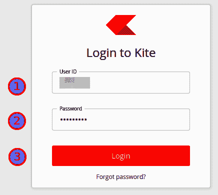

1.  输入您的 PIN：

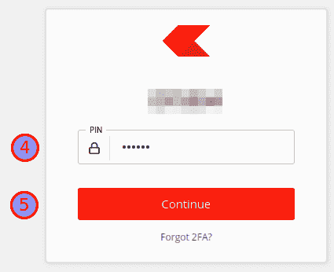

1.  点击**继续**按钮。

成功登录后，您应该会看到以下截图中显示的仪表板：

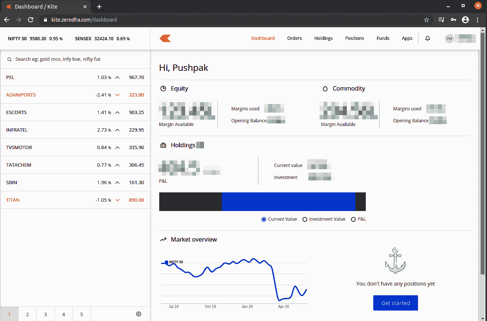

## 设置您的 Zerodha 开发者选项账户

一旦您获得了 Zerodha 证券账户凭据，我们现在可以继续设置 Zerodha 的开发者选项账户。

请前往 [`kite.trade`](https://kite.trade) 并点击**注册**：

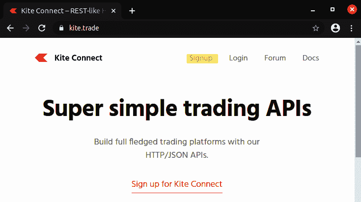

您可以通过以下八个步骤注册新账户：

1.  输入您的电子邮件地址。

1.  输入您的名字**。**

1.  输入您的密码。

1.  验证您的密码。

1.  输入您的电话号码。

1.  选择您的居住州。

1.  阅读并检查**我同意上述条款**复选框。

1.  单击**注册**按钮：

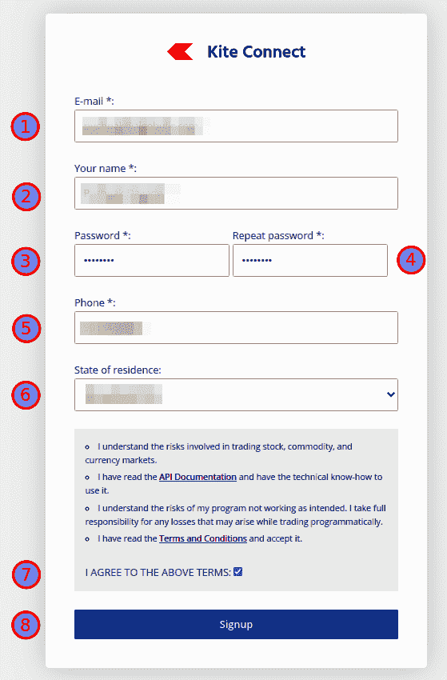

## 登录到 Zerodha 开发者选项网站

成功注册 Kite Connect 后，您可以使用您设置的凭据登录。 访问 [`kite.trade`](https://kite.trade)。

你可以通过三个步骤登录到网站：

1.  输入你注册的电子邮箱 ID。

1.  输入你的密码（用于注册的密码）。

1.  点击**登录**按钮：

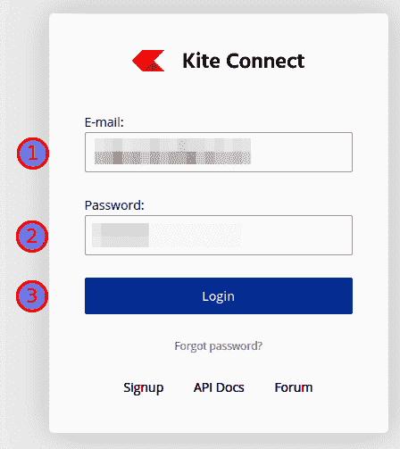

第一次登录后，你应该会登陆到这样的页面：

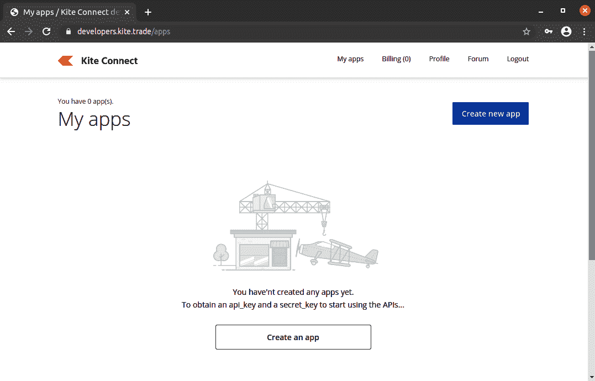

## 购买并启用 Zerodha 开发者选项 API

有两种类型的 API 可用：

+   **Connect API**：此 API 允许通过 API 下订单，获取持仓/持仓/订单，获取配置文件等。这个 API 对于实际交易是必需的，但对于回测或模拟交易是不必要的。

+   **历史数据 API**：此 API 允许获取历史数据。如果您正在实施自己的算法交易系统，则可能需要此 API。您还可以从其他供应商获取历史数据。

这两个 API 的文档可以在此处找到：[`kite.trade/docs/connect`](https://kite.trade/docs/connect)。

如果你打算在实际交易中使用 AlgoBulls 交易平台（[`algobulls.com`](https://algobulls.com)），那么你只需要为你的经纪账户购买和启用 Connect API。你不需要为回测或模拟交易购买任何 API。AlgoBulls 平台提供所有服务的历史数据。

登录到[`kite.trade`](https://kite.trade)后，你可以通过以下两个步骤购买所需的 API 积分：

1.  点击顶部菜单中的**计费**。这将加载一个新页面：

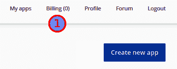

1.  输入所需金额，然后点击**添加积分**按钮。通过弹出的支付网关窗口完成支付：

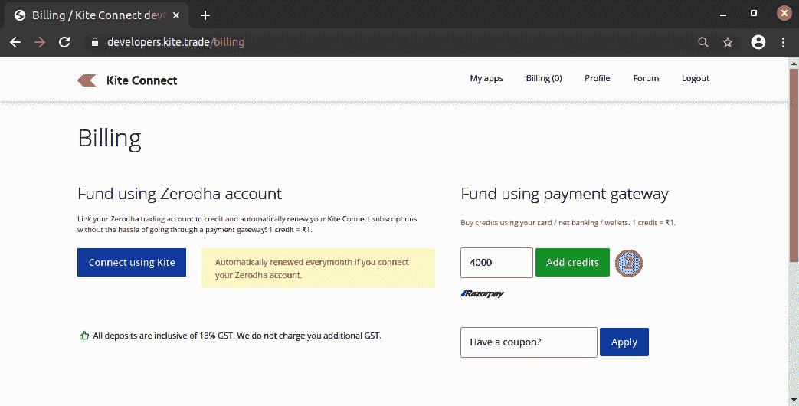

如果你想要启用这两个 API，所需金额应为**4000**。如果你只想启用 Connect API，则所需金额应为**2000**。登录到[`developers.kite.trade/create`](https://developers.kite.trade/create)了解购买 API 所需确切金额的更多信息。

接下来，为了启用所需的 API，应该从首页执行以下步骤：

1.  点击**创建新应用程序**。这将加载一个新页面：

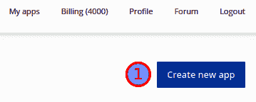

1.  确保选择了**类型**：**Connect**。

1.  输入你的应用程序名称。

1.  输入你的 Zerodha 客户 ID。

1.  将`http://127.0.0.1`作为你的**重定向 URL**。（如果你在本地端口`80`上托管服务器，你可以输入一个不同端口的 URL，该端口未被使用，比如`http://127.0.0.1:8000`）。

1.  为你的应用程序输入一个描述。

1.  点击**创建**按钮：

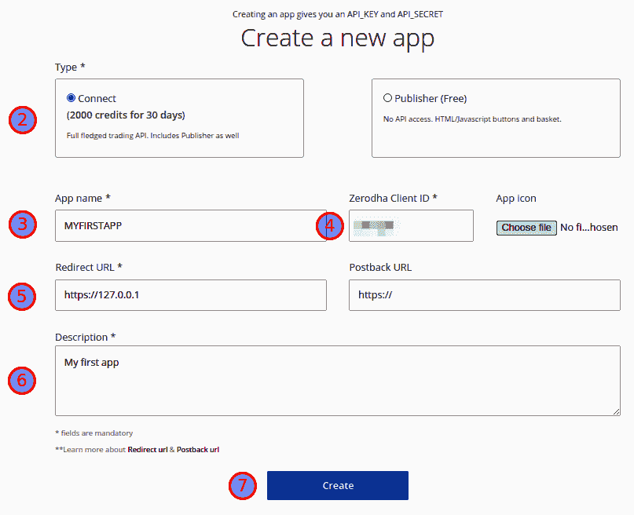

1.  阅读确认消息并输入`I UNDERSTAND`。

1.  点击**OK**按钮：

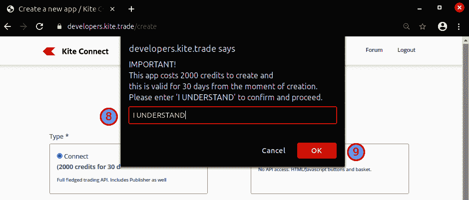

这完成了你的第一个应用程序的创建。现在你应该在首页看到你的应用程序：

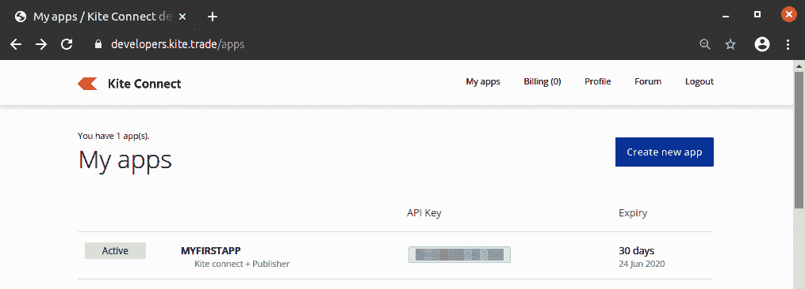

单击该应用程序以检查您的详细信息并获取 API 密钥和 API 密钥。 可选地，如果您想激活历史数据 API，请在**附加组件**部分单击**订阅**，并确认订阅。 这将花费 2,000 积分：

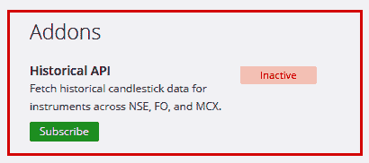

如下屏幕截图所示，可以获取密钥（**API 密钥**和**API 密钥**）。 单击**显示 API 密钥**按钮以显示它：

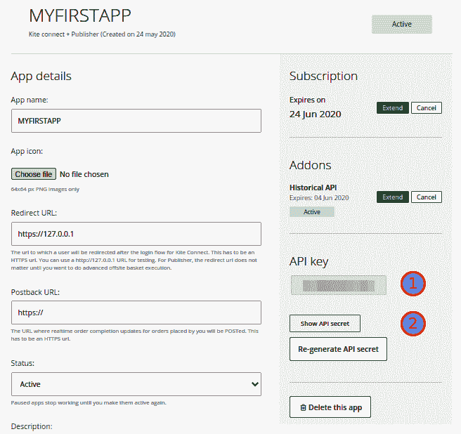

## 通过发出您的第一个 API 调用来测试 API 密钥并授权该应用程序。

您可以使用一个简单的 Python 程序测试您的 API 密钥。 执行以下步骤：

1.  从`pyalgotrading`中导入 Zerodha 经纪人连接类：

```py
>>> from pyalgotrading.broker.broker_connection_zerodha import BrokerConnectionZerodha
```

1.  使用您的 API 密钥和 API 密钥创建经纪人连接：

```py
>>> api_key = "<your-api-key>"
>>> api_secret = "<your-api-secret>"
>>> broker_connection = BrokerConnectionZerodha(api_key, api_secret)
```

您将获得以下结果：

```py
https://kite.trade/connect/login?api_key=
```

您需要通过单击生成的链接并按照以下步骤进行 Zerodha 登录：

1.  输入您的用户 ID。

1.  输入您的密码（用于交易平台）。

1.  单击**登录**按钮：

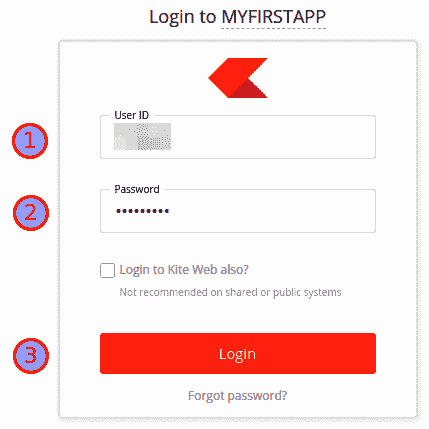

1.  输入您的 PIN。

1.  单击**继续**按钮：

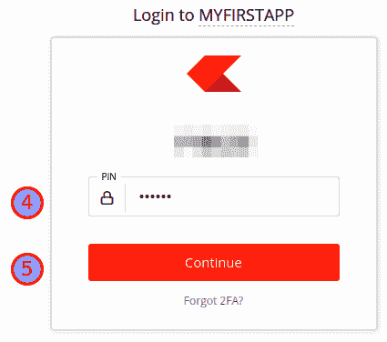

1.  单击**授权**按钮：

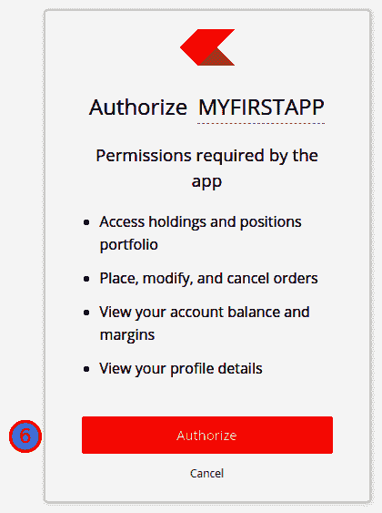

此步骤仅在新的 Zerodha Developer Options 应用程序中发生一次。

1.  如果您的凭据正确，您将被重定向到`127.0.0.1`。 忽略可能显示的任何错误消息。 只需从您的标签页的地址栏中复制令牌。 令牌是在`request_token=`和`&`字符之间的字符串，两者都不包括。 每次按照这些步骤操作时都会生成一个新的随机令牌。 例如，如果重定向 URL 为`https://127.0.0.1/?request_token=iHCKrv8oAM9X2oPRURMNRdZdG4uxhfJq&action=login&status=success`，则令牌为`iHCKrv8oAM9X2oPRURMNRdZdG4uxhfJq`：

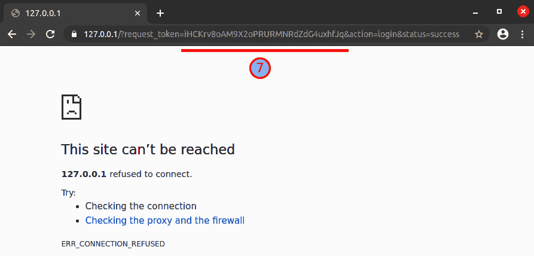

1.  设置通过上一输出中给出的 URL 接收的令牌：

```py
>>> request_token = "<your-request-token>"
>>> broker_connection.set_access_token(request_token)
```

1.  您可以通过获取您的个人资料详细信息来检查连接是否成功：

```py
>>> broker_connection.get_profile()
```

这将产生以下输出：

```py
{'user_id': <your-user-id>,
 'user_type': 'individual',
 'email': '<your-email-id>',
 'user_name': <your-user-name>',
 'user_shortname': <your-user-shortname>',
 'broker': 'ZERODHA',
 'exchanges': ['CDS', 'MF', 'NFO', 'NSE', 'BSE'],
 'products': ['CNC', 'NRML', 'MIS', 'BO', 'CO'],
 'order_types': ['MARKET', 'LIMIT', 'SL', 'SL-M'],
 'avatar_url': '',
 'meta': {'demat_consent': 'physical'}}
```

这成功验证了 API 密钥是否有效。
