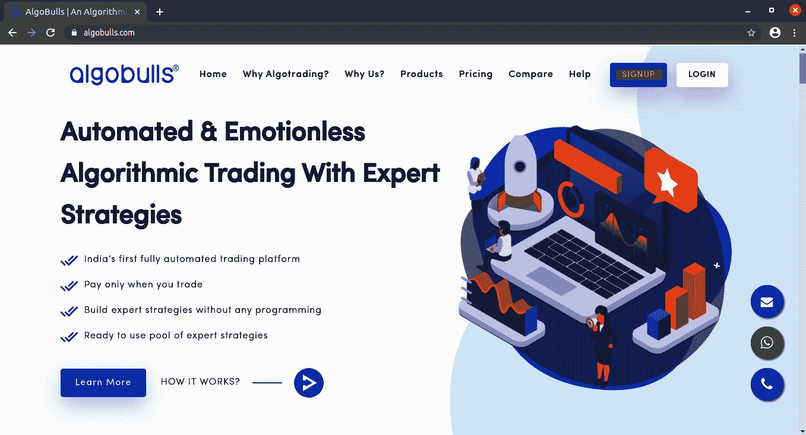
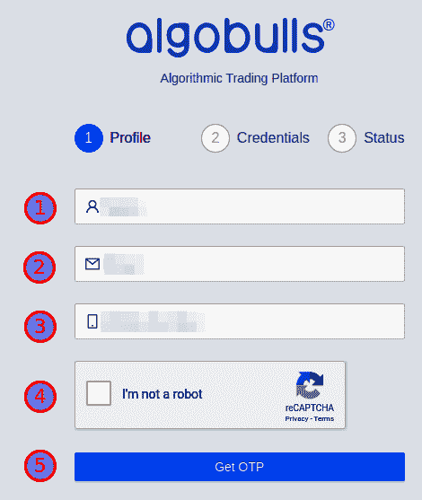
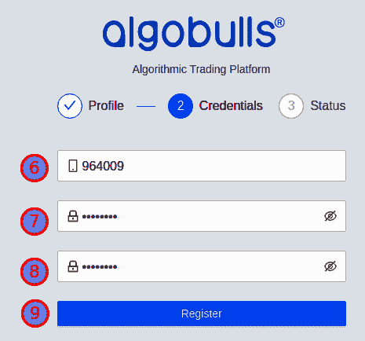
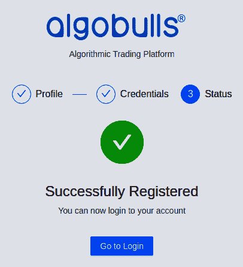
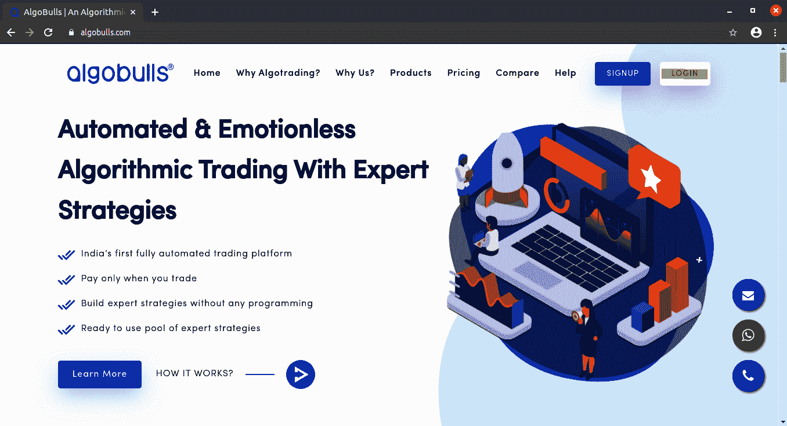
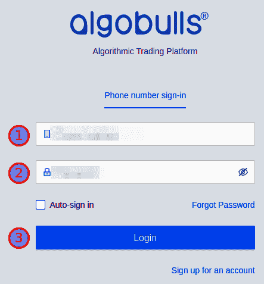
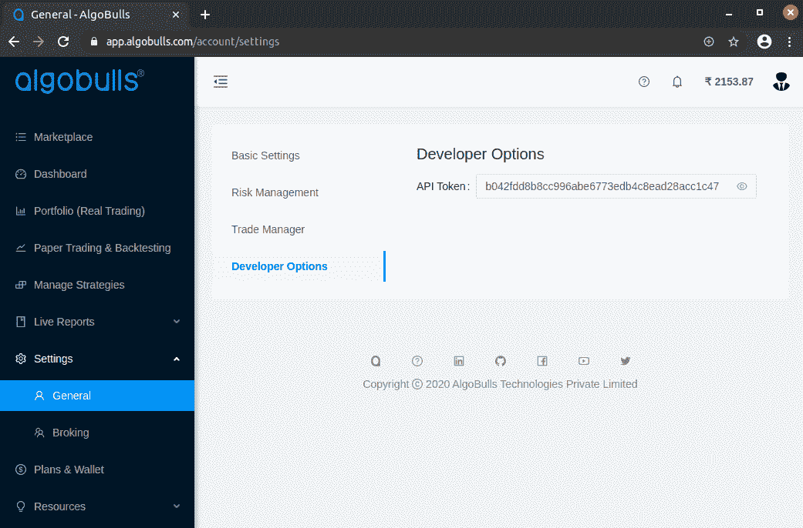

附录 II

# 第十四章：设置您的 AlgoBulls 账户

本附录将帮助您在 AlgoBulls（[`algobulls.com`](https://algobulls.com)）上设置您的账户。

本附录解释了以下部分：

+   在 AlgoBulls 平台上注册

+   登录到 AlgoBulls 网站

+   获取您的 AlgoBulls 开发者选项令牌

+   为实际交易设置您的经纪账户

## 在 AlgoBulls 平台上注册

您可以通过转到官方网站[`algobulls.com`](https://algobulls.com)，并点击 SIGNUP 注册 AlgoBulls 平台，如下面的截图所示：

您可以在九个步骤中注册该网站，如下所示：

1.  输入您的名字。

1.  输入您的电子邮件 ID。

1.  输入您的电话号码。确保此电话号码可用于接收**一次性密码**（**OTP**）。

1.  点击“I'm not a robot”复选框。

1.  点击获取 OTP 按钮，如下面的截图所示：

1.  等待直到您收到手机上的 OTP。收到后输入 OTP。

1.  输入您的密码。

1.  确认您的密码。

1.  点击注册按钮，如下面的截图所示：

您现在已在该网站上注册。点击 Go to Login 按钮登录到该网站，如下面的截图所示：

## 登录到 AlgoBulls 网站

您可以通过转到官方网站[`algobulls.com`](https://algobulls.com)并点击 LOGIN 登录到 AlgoBulls 平台，如下面的截图所示：

您可以在三个步骤中登录到网站，如下：

1.  输入您注册的电话号码。

1.  输入您的密码。

1.  点击登录按钮，如下面的截图所示：

## 获取您的 AlgoBulls 开发者选项令牌

登录后，您可以通过从侧边栏导航到开发者选项页面—Settings | General | Developer Options | API Token 来获取您的开发者选项令牌。您可以点击查看按钮（右侧的眼睛图标）来查看和复制**应用程序编程接口**（**API**）令牌，如下面的截图所示：

例如，前面截图中显示的 API 令牌为`b042fdd8b8cc996abe6773edb4c8ead28acc1c47`。

## 设置您的 AlgoBulls 账户

您需要执行以下操作才能从 AlgoBulls 平台获得算法交易服务：

+   **订阅计划**：服务 - 回测、模拟交易和实盘交易 - 是收费的。您需要在使用这些服务之前订阅一个计划。有免费计划可供您在有限的时间内使用这些服务。您可以订阅这些计划来测试本章中的所有策略。稍后，您可以订阅付费计划，以月付的方式使用服务。

+   对于真实交易（第十一章，*算法交易 - 真实交易*），您需要额外设置以下内容：

+   风险管理设置：这些设置帮助您在处理真实资金时限制损失。

+   **添加经纪人**：您需要将您的经纪账户与 AlgoBulls 连接起来。您可以选择 AlgoBulls 支持的任何经纪人。

你可以在[`help.algobulls.com/developers/`](https://help.algobulls.com/developers/)找到设置这些细节的逐步信息和截图。任何可能随时间而来的额外设置说明都将在该链接上提供。你也可以通过 developers@algobulls.com 联系我们以获取任何额外需求。
